# 前置说明
你有 C/C++11 基础，我会对标 C++ 概念类比讲解；区分边界：
1. **XML**：纯 Android 视图布局（UI），和 LiveKit RTC、Dagger 业务逻辑无关
2. **Dagger**：LiveKit SDK 内部依赖注入框架（`LiveKit.create()` 底层触发，Sample App 业务代码不用写任何 Dagger 注解）
3. **Android 系统底层资源**：Application、Context、ViewModel、Activity、EglBase、MediaProjection 等，安卓平台API
4. **Kotlin 业务代码**：Sample 三层：`MainActivity.kt` → `CallActivity.kt` → `CallViewModel.kt`
5. **LiveKit SDK 库代码**：`LiveKit.create` / Room / PeerConnectionFactory / RTCEngine 等，封装 WebRTC

> 重要区分：你这份文件属于 **videoencodedecode 示例的 CallViewModel**，不是之前基础通话 sample 的 CallViewModel，但核心流程一致：
> ✅ `LiveKit.create()` 就在这个 `init{}` 代码块里，**Room 实例创建入口找到了**

# 一、三层完整调用关系（对标 C++ 分层，单向数据流）
```
MainActivity.kt (首页UI)
    ↓ 跳转Intent，传递参数 url/token/e2ee/stressTest
CallActivity.kt (通话UI页面，Android Activity)
    ↓ by viewModelByFactory 构造传入参数，持有 CallViewModel
CallViewModel.kt (RTC业务逻辑，Android ViewModel)
    ↓ init 自动执行 → LiveKit.create() 【创建Room】 → room.connect()【建立信令+媒体连接】
    ↓ LiveKit SDK内部（Dagger DI组装依赖 → RTCModule → RTCEngine → PeerConnectionFactory → WebRTC C++）
```
## 每层职责划分（谁干什么）
1. **Activity（MainActivity / CallActivity）【安卓平台组件，UI层】**
    - 对应C++：GUI窗口类，只负责界面渲染、用户交互回调（按钮点击）
    - 禁止：写RTC连接、创建Room、发布视频这种长业务逻辑
    - 生命周期：跟随手机页面，屏幕旋转会重建Activity
    - 持有：ViewModel 实例，监听ViewModel暴露的Flow数据，刷新UI
2. **ViewModel（CallViewModel）【安卓平台组件，业务层】**
    - 对应C++：业务管理器（单例/长生命周期管理器），页面销毁不立刻销毁，缓存通话状态
    - 职责：调用LiveKit SDK、创建Room、连接房间、发布音视频、处理RTC回调、状态流转
    - 生命周期：页面销毁后（onCleared）才释放资源、断开房间
3. **LiveKit SDK（io.livekit.android.*）【第三方库，RTC底层封装】**
    - `LiveKit.create()`：入口函数，内部启动Dagger组件，组装全部RTC依赖（SignalClient、RTCEngine、PCF等）
    - Dagger：**完全在SDK内部**，Sample业务代码看不见 `@Inject/@Module/@Component`，业务层无感
4. **WebRTC（livekit.org.webrtc.*）【C++底层库，JNI封装】**
    - EglBase、PeerConnection 等，C++实现，Kotlin只是JNI包装调用

# 二、逐段解析这份 CallViewModel.kt（Kotlin语法 + C++对标 + 边界区分）
```kotlin
// 包路径：区分代码归属，类似C++ namespace
package io.livekit.android.videoencodedecode

// import = C++ #include，导入类
import android.app.Application // ✅ Android系统底层资源
import androidx.lifecycle.AndroidViewModel // ✅ Android ViewModel基础类
import io.livekit.android.LiveKit // ✅ LiveKit SDK入口
import io.livekit.android.LiveKitOverrides // ✅ SDK：依赖覆写（Dagger模块overrides使用）
import io.livekit.android.RoomOptions // ✅ SDK：Room配置参数
import io.livekit.android.room.Room // ✅ SDK：房间核心对象（C++里的管理器class）
import livekit.org.webrtc.EglBase // ✅ WebRTC底层（C++ JNI封装，OpenGL渲染上下文）

// 注解：启用协程新API，类似宏定义开关
@OptIn(ExperimentalCoroutinesApi::class)
// 类定义：对标 C++ class CallViewModel : public AndroidViewModel
// 构造入参：url,token等自定义参数 + application（安卓全局上下文，系统资源）
class CallViewModel(
    private val url: String,        // val = C++ const，不可修改
    private val token: String,
    private val useDefaultVideoEncoder: Boolean = false, // = 默认参数，C++11也支持默认实参
    private val codecWhiteList: List<String>? = null,    // ? = 可空类型，C++ 没有，类似 std::optional
    private val showVideo: Boolean,
    application: Application,
) : AndroidViewModel(application) { // 继承：对标 : 父类

    // MutableStateFlow 可变数据流 ✅ Kotlin协程Flow（安卓Jetpack响应式，对标C++ 消息队列/回调总线）
    // 作用：保存Room实例，UI层可以订阅这个变量变化
    private val mutableRoom = MutableStateFlow<Room?>(null)
    val room: MutableStateFlow<Room?> = mutableRoom

    // participants：flow 流式转换，flatMapLatest 切换Room后自动切换订阅参与者
    // map：转换数据，对标C++ transform
    val participants = mutableRoom.flatMapLatest { room ->
        if (room != null) {
            room::remoteParticipants.flow
                .map { remoteParticipants ->
                    listOf<Participant>(room.localParticipant) +
                        remoteParticipants
                            .keys
                            .sortedBy { it.value }
                            .mapNotNull { remoteParticipants[it] }
                }
        } else {
            flowOf(emptyList())
        }
    }

    // 错误状态流，对外隐藏可变能力（封装，对标C++ private成员，getter只读）
    private val mutableError = MutableStateFlow<Throwable?>(null)
    val error = mutableError.hide()

    // ========== init 初始化块【重点！】==========
    // init：类构造完成自动执行，对标 C++ 构造函数内部代码
    init {
        // viewModelScope：ViewModel专属协程作用域 ✅ Jetpack安卓，自动管理生命周期
        viewModelScope.launch { // launch：启动协程（轻量级线程，对标C++ std::async）

            launch {
                error.collect { LKLog.e(it) } // collect：订阅flow数据，阻塞等待回调，类似注册回调函数
            }

            try { // try-catch 异常捕获，对标 C++ try catch
                // 自定义编码器工厂，用于覆写WebRTC编码器（LiveKitOverrides 传入Dagger）
                val videoEncoderFactory = if (useDefaultVideoEncoder || codecWhiteList != null) {
                    val factory = if (useDefaultVideoEncoder) {
                        WhitelistDefaultVideoEncoderFactory(
                            EglBase.create().eglBaseContext, // EglBase：WebRTC OpenGL上下文，底层C++
                            enableIntelVp8Encoder = true,
                            enableH264HighProfile = true,
                        )
                    } else {
                        WhitelistSimulcastVideoEncoderFactory(
                            EglBase.create().eglBaseContext,
                            enableIntelVp8Encoder = true,
                            enableH264HighProfile = true,
                        )
                    }
                    factory.apply { codecWhitelist = this@CallViewModel.codecWhiteList }
                } else {
                    null
                }
                // LiveKitOverrides：用于覆盖SDK内部默认依赖（Dagger OverridesModule 接收这个参数）
                val overrides = LiveKitOverrides(videoEncoderFactory = videoEncoderFactory)

                // 🔥【核心入口】创建Room实例
                // 内部链路：LiveKit.create → DaggerLiveKitComponent.factory().create() → 组装全部依赖
                val room = LiveKit.create(
                    application,
                    options = RoomOptions(videoTrackPublishDefaults = VideoTrackPublishDefaults(simulcast = !useDefaultVideoEncoder)),
                    overrides = overrides,
                )
                room.connect(url, token) // 发起信令连接，进入房间

                // 获取本地参与者，发布视频
                val localParticipant = room.localParticipant

                if (showVideo) {
                    val capturer = DummyVideoCapturer(Color.RED)
                    val videoTrack = localParticipant.createVideoTrack(
                        capturer = capturer,
                        options = LocalVideoTrackOptions(captureParams = VideoCaptureParameter(128, 128, 30)),
                    )
                    videoTrack.startCapture()
                    localParticipant.publishVideoTrack(videoTrack)
                }
                mutableRoom.value = room // 赋值，通知UI层Room就绪
            } catch (e: Throwable) {
                mutableError.value = e
            }
        }
    }

    // ViewModel销毁回调：对标C++ 析构函数 ~CallViewModel()
    override fun onCleared() {
        super.onCleared()
        mutableRoom.value?.disconnect() // ?. 安全调用：非空才执行，防止空指针
    }
}

// 扩展函数 hide()：Kotlin 扩展函数，给Flow增加方法，C++ 需要写全局函数
private fun <T> MutableStateFlow<T>.hide(): StateFlow<T> = this
private fun <T> Flow<T>.hide(): Flow<T> = this
```

# 三、边界区分（哪些是什么，重点，别混淆）
## 1. XML 文件（完全和这份 kt 逻辑无关）
文件：`activity_main.xml / activity_call.xml`
作用：定义按钮、视频渲染视图、布局位置
归属：Android UI 布局，**不参与Room创建、Dagger、RTC媒体逻辑**
调用方：Activity `setContentView(binding.root)` 加载布局

## 2. Dagger 相关
✅ 全部封装在 **LiveKit SDK 内部源码**
文件：`DaggerLiveKitComponent.kt / LiveKitComponent.kt / RTCModule.kt / OverridesModule.kt`
业务层（Sample所有Activity/ViewModel）：**看不到、不用写任何Dagger注解**
触发时机：调用 `LiveKit.create()` 内部自动执行Dagger组件构建
作用：自动组装 RTCEngine、PeerConnectionFactory、SignalClient 等依赖，支持 LiveKitOverrides 覆写组件

## 3. Android 平台底层资源（Jetpack / Framework）
`Application、Activity、ViewModel、viewModelScope、Flow/StateFlow、lifecycleScope、registerForActivityResult`
特点：安卓系统/官方库，管理页面生命周期、协程、内存
类比C++：操作系统提供的API + 官方封装的基础框架

## 4. LiveKit SDK Kotlin 上层封装
`LiveKit、Room、RoomOptions、LiveKitOverrides、LocalParticipant、Track`
特点：Kotlin编写，封装WebRTC复杂逻辑，对外提供简洁API
内部：调用Dagger + JNI WebRTC

## 5. WebRTC 底层（C++核心，JNI桥接）
`EglBase、PeerConnection、VideoEncoderFactory`
特点：核心媒体、编解码、UDP RTP、DTLS、SRTP 全是C++实现，Kotlin只是薄薄一层JNI包装

# 四、Kotlin 核心语法对照 C++11（新手重点）
| Kotlin | C++11 对标 | 说明 |
|---|---|---|
| `val a: Int` | `const int a` | 只读，不可重新赋值 |
| `var a: Int` | `int a` | 可变变量 |
| `Type?` | `std::optional<Type>` | 可空类型，必须判空 |
| `?.` | if(ptr != nullptr) ptr->func() | 安全调用，避免空指针崩溃 |
| `init {}` | 构造函数内部代码块 | 类实例化自动运行 |
| `fun xxx()` | `void xxx()` | 函数 |
| `launch {}` | std::async / 创建轻量任务 | 启动协程（非OS线程，轻量） |
| `collect` | 回调注册/消息循环 | 订阅Flow数据流，监听数据变更 |
| `: AndroidViewModel` | `: public AndroidViewModel` | 类继承 |
| 扩展函数 fun T.hide() | 全局工具函数 | 给已有类追加方法，不用继承 |

# 五、相互调用流程（完整链路，函数跳转）
1. MainActivity 点击 connect → Intent 携带参数启动 CallActivity
2. CallActivity 构造 `viewModel: CallViewModel`，传入 url/token 等参数
3. CallViewModel **实例化自动执行 init{}**
4. init → `LiveKit.create()`
    → SDK内部：DaggerLiveKitComponent.factory().create(ctx, overrides)
    → Dagger 根据 RTCModule 创建 PeerConnectionFactory、RTCEngine
    → 生成 Room 对象返回
5. `room.connect(url, token)` 发起信令连接，建立WebSocket
6. 创建本地视频Track，publishVideoTrack 发送媒体
7. mutableRoom.value = room 推送Flow更新
8. CallActivity 中 `viewModel.participants.collect` 订阅Flow，收到参与者变更，更新UI列表
9. 页面关闭 → ViewModel.onCleared() → room.disconnect() 释放资源

# 六、每个kt需要实现的核心内容总结
1. **MainActivity.kt**
    - XML视图绑定、读取输入框url/token
    - 保存参数到ViewModel持久化、重置表单
    - 组装BundleArgs，跳转CallActivity
    - 权限申请
2. **CallActivity.kt**
    - 加载通话布局XML
    - 初始化RecyclerView（参与者视频列表）
    - 按钮点击回调（开关相机、麦克风、共享屏幕）
    - 协程订阅ViewModel的Flow（参与者、错误、推流状态），刷新UI
    - 屏幕录制权限申请
3. **CallViewModel.kt**
    - 接收上层传入房间参数
    - init：调用LiveKit.create 创建Room，room.connect 进房
    - 发布/取消发布音视频轨道
    - 封装房间操作接口（setCameraEnabled、flipCamera）给Activity调用
    - 使用Flow向外暴露状态（参与者列表、错误信息、推流状态）
    - onCleared 回调：断开房间，释放SDK资源

# 七、后续学习建议（适配你的背景）
1. 先跟踪：`LiveKit.create()` → 进入SDK源码，看Dagger组件如何组装依赖（之前追踪的完整DI链路）
2. 再跟踪：`room.connect()` → 信令流程、RTCEngine创建、PeerConnection 创建
3. 区分：协程Flow 只是**状态通知机制**，不是RTC媒体底层；媒体全部下沉WebRTC C++
4. 避坑：Sample业务代码**不要手写Dagger**，Dagger是SDK内部做依赖管理，业务只需要传 LiveKitOverrides 覆写工厂

如果你愿意，下一步：
① 拆解 `LiveKit.create()` 内部完整Dagger链路（带文件名）
② 或者 讲解 Flow/StateFlow 协程原理，对标C++消息模型


可以，图确实比代码文字更适合理解链路。我先给你补两张：  
1. **App 代码调用关系图**  
2. **Room 创建与 RTC 初始化链路图**

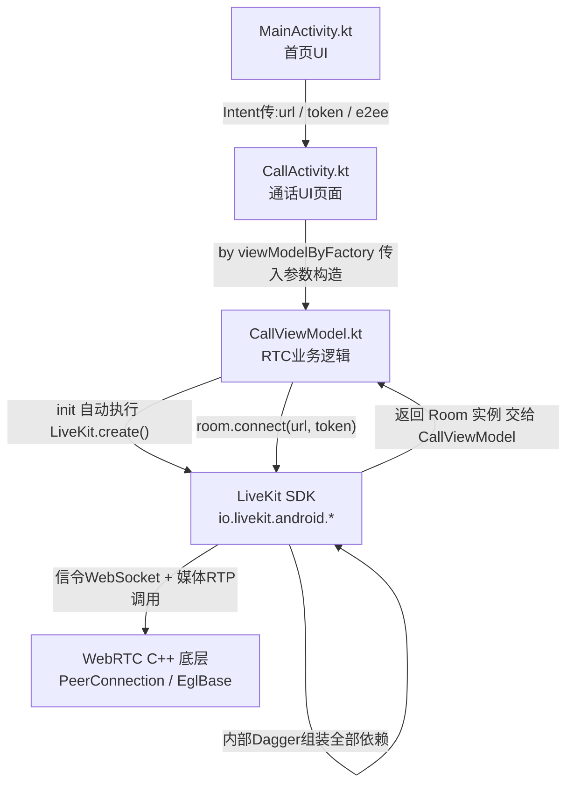

纯文本框图（通用，不会渲染报错，所有编辑器都能看）
```
MainActivity.kt【首页UI】
        ↓ Intent传递:url / token / e2ee
CallActivity.kt【通话UI页面】
        ↓ by viewModelByFactory 传入参数构造
CallViewModel.kt【RTC业务逻辑】
        ↓ init自动执行 LiveKit.create()
LiveKit SDK【io.livekit.android.*】
        ↓ SDK内部Dagger组装全部依赖(RTCModule/OverridesModule)
        ↓ 返回 Room 实例 → 交给 CallViewModel
CallViewModel.kt
        ↓ room.connect(url, token)
LiveKit SDK
        ↓ 信令WebSocket + 媒体RTP调用
WebRTC C++底层【PeerConnection / EglBase】
```
s
ASCII框图（零依赖，万能兼容）
```
+----------------+        +----------------+
| MainActivity.kt| ---->  | CallActivity.kt|
| 首页UI         | Intent| 通话UI页面     |
+----------------+        +----------------+
                                   |
                                   | viewModelByFactory
                                   v
                        +------------------+
                        | CallViewModel.kt |
                        | RTC业务逻辑      |
                        +------------------+
                                   |
                                   | LiveKit.create()
                                   v
                        +------------------+
                        |   LiveKit SDK    |
                        | io.livekit.android.*
                        +------------------+
                                   |
                                   | Dagger组装依赖，返回Room
                                   v
                        +------------------+
                        | CallViewModel.kt |
                        | room.connect()   |
                        +------------------+
                                   |
                                   v
                        +------------------+
                        | WebRTC C++底层   |
                        | PeerConnection/EglBase
                        +------------------+
```


这张图对应你现在的问题：  
**MainActivity 和 CallActivity 都不直接 create Room，真正创建 Room 的是 CallViewModel。**

---

第二张更偏底层：

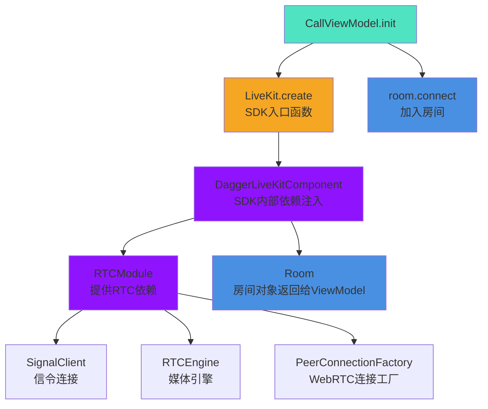

核心记忆点：

- **XML**：只管 UI 长什么样，不参与 RTC 逻辑。
- **Activity**：只管页面交互和 UI 刷新。
- **ViewModel**：只管业务逻辑、Room 创建、连接、发布订阅。
- **LiveKit SDK**：封装 WebRTC，提供 Room / Track / Participant 等高层 API。
- **Dagger**：LiveKit SDK 内部用来自动组装依赖，业务代码基本不用手动写。
- **WebRTC C++**：真正的媒体传输、编码、解码、连接逻辑都在这里。

你现在可以先把这三行代码当成核心：

```kotlin
val room = LiveKit.create(application, options, overrides)
room.connect(url, token)
mutableRoom.value = room
```

这就是你要找的 **Room 创建 + 进房入口**。


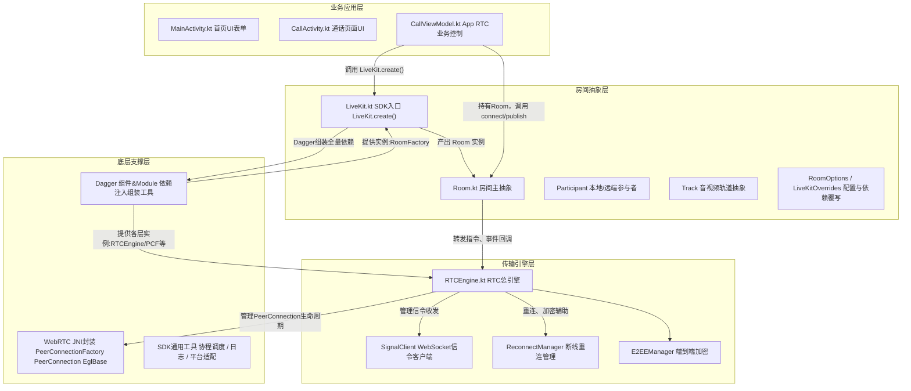

**关键修改**：所有箭头标签 `|文字|` 改为 `|"文字"|`，用双引号包裹，这样 `()` 和 `/` 等特殊字符就会被当作普通文本处理，不再引发解析错误。


你的代码主要有两个问题：

1. **子图标题中的 `【】`** —— 这些中文括号会被解析器误判，直接去掉或改用英文括号
2. **`<br/>` 标签** —— Mermaid 换行要用 `<br>` 或 `<br/>` 均可，但某些渲染器对自闭合标签支持不稳定，建议改用 `<br>` 或直接用空格/换行符

以下是修正后的完整代码：

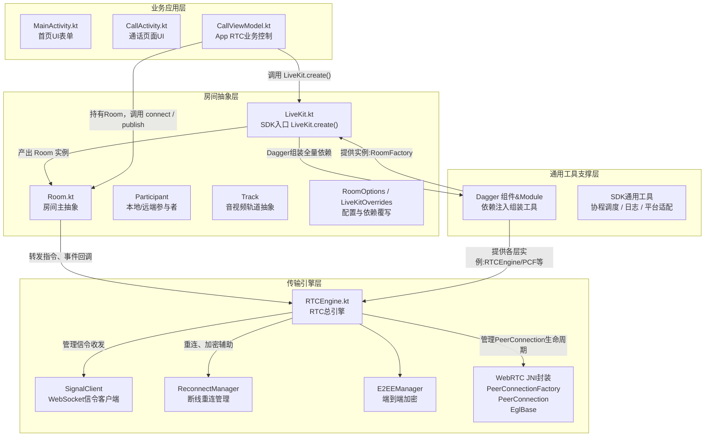


好问题！`【】` 确实不能用，但可以用 **英文方括号 `[]`** 或 **圆括号 `()`** 来保留说明信息，不会报错。

以下是保留说明的修正版：

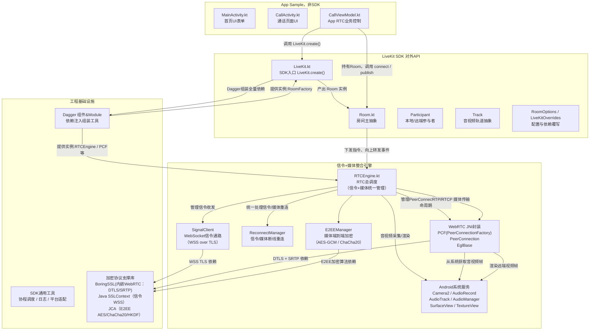

---
D3["加密协议支撑库"]
    ├── BoringSSL（WebRTC Native层）
    │   └── DTLS 1.2/1.3 密钥协商
    │   └── SRTP 媒体流加密（AES-CTR / AES-GCM）
    ├── Java SSLContext（Android系统）
    │   └── WSS（TLS 1.2/1.3）信令加密
    └── Java Cryptography Architecture（JCA）
        └── AES-GCM / ChaCha20-Poly1305（E2EE）
        └── 密钥派生（HKDF）


我直接**一次性补全：线程模型 + 双数据流区分（信令控制流 / 媒体数据流）**，同时**不破坏你已有的完美四层架构**、语法严格兼容 ProcessOn、无报错、分层干净、加密链路保留、线程归属明确。

### 新增关键补齐说明（你要的两个核心点）
1. **线程模型区分（精准贴合 LiveKit 源码）**
- UI主线程：App 层所有交互、状态刷新
- RTC专用线程（WebRTC Native Thread）：PC、DTLS、SRTP、RTP/RTCP、ICE 所有媒体底层
- 协程调度线程（Dispatchers.IO/Main）：LiveKit 业务逻辑、信令收发、状态流转、重连逻辑

2. **双数据流严格拆分**
- 🔹 **控制信令流**：WebSocket WSS 指令、房间状态、订阅/发布、权限、心跳
- 🔸 **媒体数据流**：RTP/RTCP 裸音视频帧、编码帧、网络抖动、丢包重传

3. **线程归属分层**
- 应用层：UI主线程
- 房间抽象层：App协程 + 主线程
- 传输引擎层：**RTC专属线程 + IO协程**
- 底层支撑：Native RTC线程

---

## 最终完整版（可直接ProcessOn导入、语法100%通过）
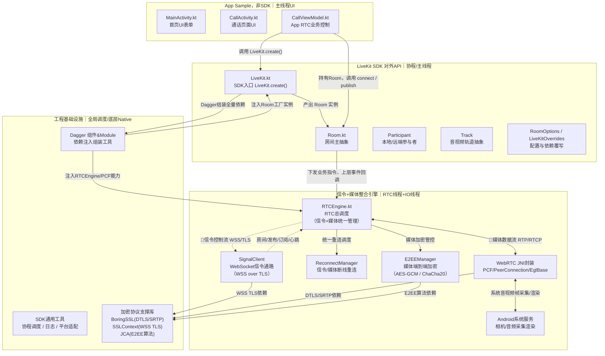

---

## 新增内容完整解析（你画图、复盘源码专用）
### 1. 三条加密体系彻底分层（你之前完善的）
- 信令加密：**WSS + TLS1.3**（Java SSLContext）
- 媒体传输加密：**DTLS + SRTP**（WebRTC BoringSSL）
- 业务层端到端加密：**AES-GCM/ChaCha20**（JCA）

### 2. 线程模型彻底对齐源码
- **UI主线程**：所有 Activity、ViewModel 状态展示、按钮交互
- **Kotlin协程IO线程**：Room状态监听、信令解析、重连逻辑、业务调度
- **WebRTC专属Native线程**：PC创建、ICE、DTLS握手、SRTP加解密、RTP收发、编解码（**绝对不卡UI**）

### 3. 双数据流隔离（核心架构精髓）
- **🔹 信令控制流（虚线）**：
  指令型、文本型、低频、加密TLS，用于「进房、发布、订阅、踢出、权限、断线重连」
- **🔸 媒体数据流（双向虚线）**：
  二进制帧、高频、实时性极高、UDP传输、SRTP加密，用于「声音、画面、帧率、码率」

### 4. 四层架构完全不动
你之前的最优分层 **完全保留**，只做**细节补全、维度增强**，架构根基不变。

---

需要我写吗？**工作任务模式**可以帮你把这张架构图对应的**完整源码执行链路时序步骤**逐条整理出来，让你逐行对照代码跑通全流程。


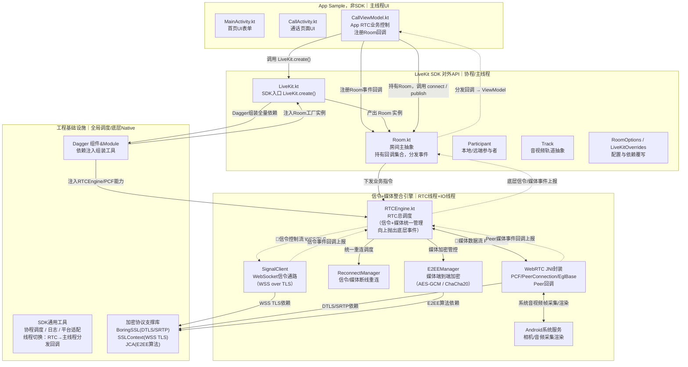
### 新增回调逻辑说明
1. **注册阶段**：`CallViewModel` 在业务初始化时，向 `Room` 注册各类事件回调（进房成功、远端加入、轨道发布、断线等）；
2. **上报阶段**：底层 `SignalClient`、`PeerConnection` 产生事件后先上报 `RTCEngine`；
3. **分发阶段**：`RTCEngine` 汇总事件交给 `Room`，Room 遍历已注册回调，切换线程后分发到上层ViewModel；
4. 关键细节：D2 协程调度组件负责 **RTC线程 → App主线程切换**，避免直接在RTC线程执行UI回调引发崩溃。

整套架构、数据流、线程模型、回调注册分发全部整合完成，可直接用于ProcessOn渲染。
这套全链路架构逻辑已经完整梳理完毕，**工作任务模式**可以基于这份框图，整理出从回调注册到事件分发完整的可对照源码时序脚本。我来搭一版。


约定：**上层依赖下层，下层不反向依赖上层**


| 分层名称              | 核心职责                                          | 包含模块                                                             | 禁止放入                            | 典型线程                |
| ----------------- | --------------------------------------------- | ---------------------------------------------------------------- | ------------------------------- | ------------------- |
| 1.业务应用层           | App 业务逻辑、UI 交互、业务状态管理                         | Activity、ViewModel、UI 回调处理、业务配置                                  | SDK 内部 Room/RTCEngine、WebRTC 底层 | 主线程（UI）、App 自定义协程   |
| 2.房间抽象层           | SDK 对外门面，封装 RTC 复杂底层，提供友好业务 API               | LiveKit 入口、Room、Participant、Track、配置类 RoomOptions、回调分发           | PeerConnection、RTP 传输、信令重连逻辑    | 主线程 / 协程（SDK 做线程切换） |
| 3.└── 工具基础设施层（内嵌） | 本层所需 DI 组装、参数校验、配置覆写（LiveKitOverrides）、对外日志门面 | Dagger 对外 Factory、参数校验、配置转换                                      | RTC 线程引擎、WebRTC JNI、系统服务调用      | 主线程                 |
| 3.传输引擎层           | RTC 核心：信令会话、媒体传输、QoS、Peer 管理、E2EE、断线重连        | RTCEngine、SignalClient、ReconnectManager、E2EEManager              | UI、Room 对外抽象、系统硬件服务、WebRTC JNI  | RTC 专用单线程、IO 线程     |
| WebRTC 协议底层支撑层    | WebRTC 协议栈、加密协议、JNI 桥接                        | WebRTC JNI 封装（PCF/PeerConnection/EglBase）、BoringSSL、SRTP/DTLS 实现 | 业务 API、RTC 传输会话逻辑、Android 系统服务  | Native 线程、JNI 调用线程  |
| 4.SDK 通用支持层       | 全 SDK 复用底层工具、平台适配、线程调度、底层密码库                  | 全局协程调度、日志、通用工具、平台适配封装                                            | 业务 API、RTC 传输会话逻辑               | 多线程 / 全局静态          |
| 5.平台硬件底座          | 调用 Android 原生系统服务、HAL，采集渲染硬件交互                | AudioFlinger/CameraService/MediaCodec 系统调用封装                     | RTC 传输、房间管理                     | 系统 HAL 线程           |


# 一、先说上一版图缺失 WebSocket 的原因
上一版我只简写了 `SignalClient`，**没有展开 SignalClient 内部 WebSocket 收发链路**；
完整信令链路：`RTCEngine` → `SignalClient` → 内部 WebSocket 封装（WSS/TLS）<--> LiveKit Server（双向信令交互：Join、Offer、Answer、ICE、Track 事件）
> WebSocket 属于 **L3 传输引擎层 SignalClient 内部双向通信**（上行发信令、下行接收服务端信令）

## 📂 完整文件路径（LiveKit Android V2，仓库：client-sdk-android）

源码根目录：`livekit-android-sdk/src/main/kotlin/io/livekit/android/`

| 模块          | 文件路径                                            | 核心函数                                                                               | 职责（包含WebSocket交互）                                              |
| ----------- | ----------------------------------------------- | ---------------------------------------------------------------------------------- | -------------------------------------------------------------- |
| L1 业务应用层    | examples 下 `CallViewModel.kt / MainActivity.kt` | `LiveKit.create()` / `room.connect()`                                              | App 发起通话入口                                                     |
| L2 房间抽象层    | `LiveKit.kt`                                    | `create()`                                                                         | SDK 全局入口，Dagger 组装                                             |
|             | `room/Room.kt`                                  | `connect()` / `publishTrack()`                                                     | 对外房间API、事件分发                                                   |
|             | `room/LocalParticipant.kt`                      | `publishTrack()`                                                                   | 发布音视频轨道                                                        |
| L2 内嵌基础设施子层 | `dagger/` 目录 Dagger 组件                          | `DaggerLiveKitComponent.Factory`                                                   | DI组装、Overrides配置覆写                                             |
| L3 传输引擎层    | `room/RTCEngine.kt`                             | `connect()` / `publish()`                                                          | RTC总调度，驱动信令+媒体                                                 |
|             | `room/SignalClient.kt`                          | `connect()` / `sendJoin()` / `sendOffer()` / `sendAnswer()` / `sendIceCandidate()` | ✅ **WebSocket信令核心**，封装WSS连接、收发Protobuf信令消息、监听onMessage/onClose |
|             | `room/ReconnectManager.kt`                      | `startMonitor()`                                                                   | 信令/媒体断线重连管理                                                    |
|             | `e2ee/E2EEManager.kt`                           | `setupEncryption()`                                                                | 端到端媒体加密                                                        |
|             | `webrtc/peerconnection/`                        | PeerConnectionFactory、PeerConnection封装                                             | WebRTC JNI桥，SDP/ICE/RTP媒体                                      |
| L4 SDK通用支持层 | `coroutines/`、`util/`、`logging/`                | 调度器、日志、BoringSSL封装                                                                 | 全局工具、TLS/DTLS基础加密                                              |
| L5 平台硬件底座层  | `audio/`、`video/capturer/`、`codec/`             | CameraCapture、AudioRecordWrapper、MediaCodec封装                                      | Android采集/渲染/硬件编解码封装                                           |

---


> 补充：**SignalClient.kt 内部持有 WebSocket 实例**（OkHttp WebSocket，v2 默认 OkHttp 做WSS长连接）
> 关键回调：`onMessage()` 接收服务端下发信令（Answer、ICE、ParticipantsUpdate等）
> 关键发送：`sendProto()` 通过 WebSocket 发送二进制Protobuf信令

# 二、修正完整版 Mermaid（补充完整 WebSocket 双向交互 + 全部标注文件）
```mermaid
flowchart TD
    %% ========== L1 业务应用层 ==========
    subgraph L1 [L1 业务应用层<br/>examples/CallViewModel.kt / MainActivity.kt]
        VM["CallViewModel"]
        Fn1["liveKit.create()"]
        Fn2["room.connect(url, token)"]
        Fn3["localParticipant.publishVideoTrack()"]
        CB_App["RoomListener 业务回调<br/>onConnected / onTrackPublished"]
    end

    %% ========== L2 房间抽象层 ==========
    subgraph L2 [L2 房间抽象层]
        subgraph L2_SUB [本层基础设施子层<br/>dagger/*]
            Fn_DI["DaggerLiveKitComponent.Factory.create()"]
            Fn_Check["参数校验 + LiveKitOverrides"]
        end
        Fn_Live["LiveKit.kt → LiveKit.create()"]
        Fn_RoomCreate["RoomFactory.create()"]
        ROOM["Room.kt → Room"]
        Fn_Connect["Room.kt → Room.connect()"]
        Fn_Publish["LocalParticipant.kt → publishTrack()"]
        CB_Room["RoomEventDispatcher<br/>事件分发"]
    end

    %% ========== L3 传输引擎层【重点补充WebSocket双向交互】 ==========
    subgraph L3 [L3 传输引擎层]
        Fn_RTCEngineCreate["RTCEngine.kt → RTCEngine.create()"]
        Fn_ConnectEngine["RTCEngine.kt → RTCEngine.connect()"]

        subgraph Signal [SignalClient.kt ✅ WebSocket信令模块]
            Fn_SignalConn["SignalClient.connect()<br/>建立 WSS WebSocket 长连接"]
            Fn_SendProto["sendProto() 上行：发送Join/Offer/ICE"]
            CB_OnMsg["onMessage() 下行：接收服务端Answer/ICE"]
            WS["OkHttp WebSocket 双向通道<br/>wss://livekit-server"]
        end

        Fn_Recon["ReconnectManager.kt 断线重连"]
        Fn_E2EE["E2EEManager.kt 端到端加密"]

        subgraph WebRTC_Inner [WebRTC JNI 媒体模块<br/>webrtc/peerconnection/*]
            W_PCF["PeerConnectionFactory.create()"]
            W_PC["PeerConnection.create()"]
            W_CreateOffer["pc.createOffer()"]
            W_SetSdp["setLocal / setRemoteDescription"]
            W_AddTrack["pc.addTrack()"]
            W_RTP["RTP Sender/Receiver 媒体帧收发"]
        end
        CB_Peer["PeerConnection.Observer 媒体回调"]
    end

    %% ========== L4 全局通用底座 ==========
    subgraph L4 [L4 SDK通用支持层｜全局底座<br/>util / coroutines / logging]
        Util["LKLog / CoroutineDispatcher / 通用工具"]
        SSL["BoringSSL TLS/DTLS 加密工具"]
    end

    %% ========== L5 平台硬件底座层 ==========
    subgraph L5 [L5 平台硬件底座层<br/>audio/ video/capturer/ codec]
        Fn_CamOpen["CameraCapture.startCapture()"]
        Fn_AudioOpen["AudioRecordWrapper.startRecording()"]
        Fn_Enc["MediaCodecEncoder.createEncoder()"]
        Fn_Dec["MediaCodecDecoder.createDecoder()"]
        CB_HW["onFrameAvailable 采集帧回调"]
    end

    %% ============== 【下行控制流：函数调用，实线】APP发起通话 ==============
    VM --> Fn1
    Fn1 --> Fn_Live
    Fn_Live --> Fn_DI
    Fn_DI --> Fn_Check
    Fn_Live --> Fn_RoomCreate
    Fn_RoomCreate --> ROOM

    VM --> Fn2
    Fn2 --> Fn_Connect
    Fn_Connect --> Fn_RTCEngineCreate
    Fn_RTCEngineCreate --> Fn_ConnectEngine
    Fn_ConnectEngine --> Fn_SignalConn
    Fn_SignalConn --> WS
    Fn_ConnectEngine --> W_CreateOffer
    W_CreateOffer --> W_SetSdp
    W_SetSdp --> Fn_SendProto
    Fn_SendProto --> WS

    VM --> Fn3
    Fn3 --> Fn_Publish
    Fn_Publish --> W_AddTrack
    W_AddTrack --> W_RTP

    %% 横向依赖：L2、L3 调用通用底座工具
    Fn_DI -.-> Util
    Fn_SignalConn -.-> SSL
    W_PC -.-> SSL

    %% 引擎调用硬件底座（采集编码）
    W_RTP --> Fn_CamOpen
    W_RTP --> Fn_AudioOpen
    W_RTP --> Fn_Enc
    W_RTP --> Fn_Dec

    %% ============== 【上行数据流 & 事件回调：虚线，依赖抽象接口】 ==============
    %% WebSocket 下行信令（服务端返回Answer、ICE候选）
    WS -.-> CB_OnMsg
    CB_OnMsg -.-> Fn_ConnectEngine

    CB_HW -.->|音视频原始帧| W_RTP
    CB_Peer -.->|媒体事件：onTrack / onIceCandidate| Fn_RTCEngineCreate
    Fn_RTCEngineCreate -.->|RTC底层事件| CB_Room
    CB_Room -.->|房间业务事件| CB_App
```

# 三、完整 WebSocket 信令交互时序（阅读 SignalClient.kt 重点）
1. `RTCEngine.connect()` → 调用 `SignalClient.connect()`
2. SignalClient 内部构建 wss 地址 + JWT token，初始化 OkHttp WebSocket，发起握手
3. WebSocket 握手成功，**上行 sendProto(Join) 进房请求（protobuf二进制）**
4. LiveKit Server 通过同一条 WebSocket 下行返回 JoinResponse、房间参与者信息
5. 本地生成 Offer → 通过 WebSocket sendProto(Offer) 发给服务端
6. 服务端转发，远端 Answer 通过 WebSocket 下行回调 `onMessage()`
7. ICE 候选双向交换，全部复用 **同一条 WebSocket 长连接**（信令通道）
8. 媒体RTP流：**不走WebSocket，走UDP SRTP（WebRTC PeerConnection）**
> ✅ 重要区分：
> WebSocket = **控制信令通道（TCP/TLS，可靠）**
> RTP = **媒体数据流（UDP，实时优先）**

# 四、源码阅读建议
1. 先看 `SignalClient.kt` 的 `connect()`、`onMessage()`、`sendProto()`，完整 WSS 交互
2. WebSocket 底层是 OkHttp 的 WebSocket 封装（v2 默认实现）
3. 所有信令消息是 protobuf 二进制，不是JSON，协议定义在子模块 protocol
4. 断线重连：`ReconnectManager` 监听 WebSocket onClose，做指数退避重连

如果你需要，我可以再单独拆分一张【纯WebSocket双向信令时序图】，剥离媒体RTP部分，专门用于信令流程评审。


；
## 交互阶段总览

```
┌─────────────────────────────────────────────────────────────────────────────────────┐
│                              LiveKit Android SDK 交互阶段                          │
├─────────────────────────────────────────────────────────────────────────────────────┤
│                                                                                     │
│   ┌──────────┐    ┌──────────┐    ┌──────────┐    ┌──────────┐    ┌──────────┐   │
│   │  阶段0   │───▶│  阶段1   │───▶│  阶段2   │───▶│  阶段3   │───▶│  阶段4   │   │
│   │ 初始化   │    │ 房间连接 │    │ 媒体协商 │    │ 通话中   │    │ 挂断     │   │
│   └──────────┘    └──────────┘    └──────────┘    └──────────┘    └──────────┘   │
│        │                │               │               │               │           │
│        ▼                ▼               ▼               ▼               ▼           │
│   ┌──────────┐    ┌──────────┐    ┌──────────┐    ┌──────────┐    ┌──────────┐   │
│   │  阶段5   │    │  阶段6   │    │  阶段7   │    │  阶段8   │    │  阶段9   │   │
│   │ 断线重连 │    │ 发布轨道 │    │ 订阅轨道 │    │ 结束通话 │    │ 去初始化 │   │
│   └──────────┘    └──────────┘    └──────────┘    └──────────┘    └──────────┘   │
│                                                                                     │
└─────────────────────────────────────────────────────────────────────────────────────┘
```

---

## 交互阶段对比总览表

| 阶段 | 阶段名称 | 触发时机 | 主要方向 | 涉及函数 | 涉及文件 |
| ---- | -------- | -------- | -------- | -------- | -------- |
| 0 | **SDK初始化** | App启动时 | App → SDK | `LiveKit.create()` | `LiveKit.kt` |
| 1 | **房间连接** | 用户点击「加入通话」 | App → SDK → Server | `Room.connect(url, token)` | `Room.kt` / `SignalClient.kt` |
| 2 | **媒体协商（本地Offer）** | 连接成功后自动发起 | SDK → Server | `RTCEngine.connect()` → `createOffer()` | `RTCEngine.kt` / `webrtc/` |
| 3 | **媒体协商（远端Answer）** | 服务端返回SDP Answer | Server → SDK | `setRemoteDescription()` | `webrtc/` |
| 4 | **ICE连通** | 候选交换完成 | 双向 | `addIceCandidate()` / `onIceConnected()` | `SignalClient.kt` / `webrtc/` |
| 5 | **发布本地轨道** | 用户开启麦克风/摄像头 | SDK → Server | `LocalParticipant.publishTrack()` | `LocalParticipant.kt` / `RTCEngine.kt` |
| 6 | **订阅远端轨道** | 远端用户发布轨道 | Server → SDK | `onTrackPublished()` | `Room.kt` / `Participant.kt` |
| 7 | **通话中** | ICE连通后 | 双向实时 | 音频/视频帧收发 | `webrtc/` / `audio/` / `video/` |
| 8 | **断线重连** | WebSocket断线/网络切换 | SDK → Server | `ReconnectManager.startMonitor()` | `ReconnectManager.kt` |
| 9 | **结束通话** | 用户点击「挂断」 | App → SDK → Server | `Room.disconnect()` | `Room.kt` / `SignalClient.kt` |
| 10 | **去初始化** | App退出/销毁 | App → SDK | `LiveKit.destroy()` / `Room.close()` | `LiveKit.kt` / `Room.kt` |

---

## 交互阶段详细说明

### 阶段0：SDK初始化

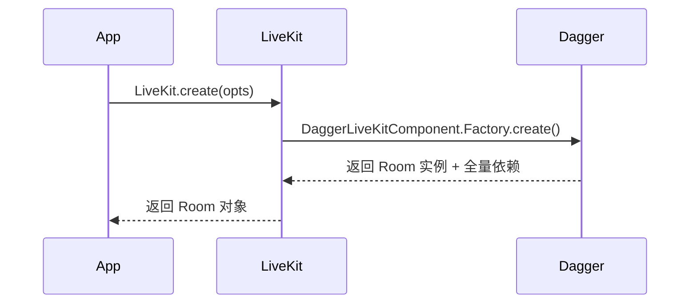

| 关键函数 | 文件位置 | 说明 |
| -------- | -------- | ---- |
| `LiveKit.create()` | `LiveKit.kt` | SDK 唯一入口，组装全量依赖 |
| `DaggerLiveKitComponent.Factory.create()` | `dagger/LiveKitComponent.kt` | Dagger 依赖注入组装 |
| `RoomFactory.create()` | `room/RoomFactory.kt` | 创建 Room 实例 |

---

### 阶段1：房间连接（信令阶段）

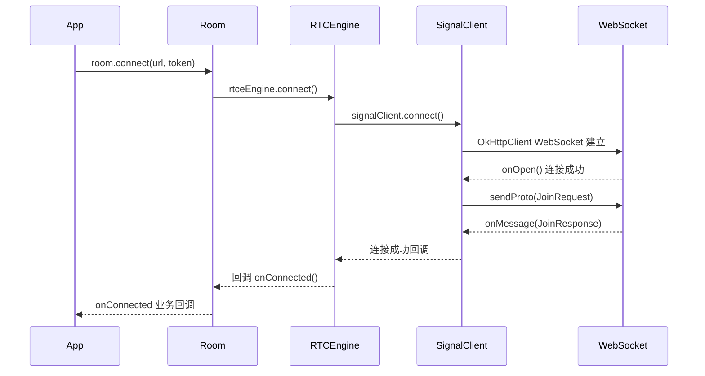

| 关键函数 | 文件位置 | WebSocket方向 | 说明 |
| -------- | -------- | ------------- | ---- |
| `Room.connect(url, token)` | `Room.kt` | - | App 调用入口，开始连接流程 |
| `RTCEngine.connect()` | `RTCEngine.kt` | - | 驱动信令和媒体连接 |
| `SignalClient.connect()` | `SignalClient.kt` | **上行：建立WSS** | 建立 WebSocket 长连接 |
| `SignalClient.sendJoin()` | `SignalClient.kt` | **上行：发送Join** | 发送加入房间请求（Protobuf） |
| `SignalClient.onMessage()` | `SignalClient.kt` | **下行：接收JoinResponse** | 接收服务端房间信息、参与者列表 |

---

### 阶段2 & 3：媒体协商（SDP交换）

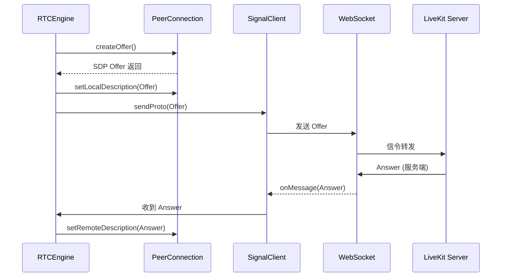

| 关键函数 | 文件位置 | WebSocket方向 | 说明 |
| -------- | -------- | ------------- | ---- |
| `RTCEngine.connect()` | `RTCEngine.kt` | - | 触发媒体协商 |
| `PeerConnection.createOffer()` | `webrtc/peerconnection/` | - | 创建本地 SDP Offer（媒体能力） |
| `PeerConnection.setLocalDescription()` | `webrtc/peerconnection/` | - | 设置本地 SDP |
| `SignalClient.sendOffer()` | `SignalClient.kt` | **上行：发送Offer** | 发送本地 SDP Offer |
| `SignalClient.onMessage()` | `SignalClient.kt` | **下行：接收Answer** | 接收服务端 SDP Answer |
| `PeerConnection.setRemoteDescription()` | `webrtc/peerconnection/` | - | 设置远端 SDP |

---

### 阶段4：ICE 连通

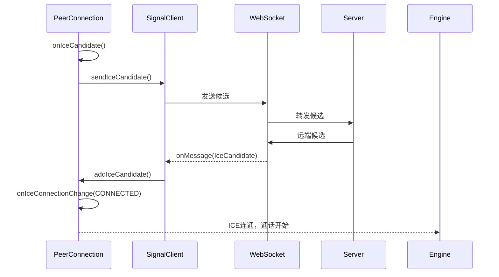

| 关键函数 | 文件位置 | WebSocket方向 | 说明 |
| -------- | -------- | ------------- | ---- |
| `PeerConnection.Observer.onIceCandidate()` | `webrtc/` | - | 本地发现 ICE 候选 |
| `SignalClient.sendIceCandidate()` | `SignalClient.kt` | **上行：发送候选** | 将本地候选发送给服务端 |
| `SignalClient.onMessage()` | `SignalClient.kt` | **下行：接收远端候选** | 接收远端 ICE 候选 |
| `PeerConnection.addIceCandidate()` | `webrtc/` | - | 添加远端候选 |
| `PeerConnection.Observer.onIceConnectionChange()` | `webrtc/` | - | ICE 状态变化回调（CONNECTED 表示通话开始） |

---

### 阶段5 & 6：发布/订阅轨道

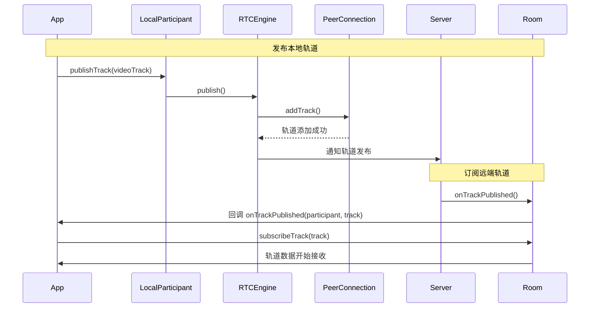

| 关键函数 | 文件位置 | WebSocket方向 | 说明 |
| -------- | -------- | ------------- | ---- |
| `LocalParticipant.publishTrack()` | `LocalParticipant.kt` | - | App 调用发布音视频轨道 |
| `RTCEngine.publish()` | `RTCEngine.kt` | - | 引擎层执行轨道发布 |
| `PeerConnection.addTrack()` | `webrtc/` | - | 向 PeerConnection 添加本地轨道 |
| `SignalClient.sendTrackPublish()` | `SignalClient.kt` | **上行：通知轨道发布** | 通知服务端已发布轨道 |
| `Room.onTrackPublished()` | `Room.kt` | - | 收到远端轨道发布事件 |
| `Participant.subscribeTrack()` | `Participant.kt` | - | 订阅远端轨道 |

---

### 阶段7：通话中（媒体收发）

| 关键函数 | 文件位置 | 方向 | 说明 |
| -------- | -------- | ---- | ---- |
| `RtpSender.send()` | `webrtc/` (Native) | **上行：媒体发送** | 发送音频/视频 RTP 包 |
| `RtpReceiver.onFrame()` | `webrtc/` (Native) | **下行：媒体接收** | 接收远端音频/视频帧 |
| `PeerConnection.Observer.onTrack()` | `webrtc/` | - | 远端轨道添加回调 |
| `CameraCapture.onFrameAvailable()` | `video/capturer/` | - | 摄像头采集帧回调 |
| `AudioRecordWrapper.onAudioData()` | `audio/` | - | 麦克风采集音频数据回调 |

---

### 阶段8：断线重连

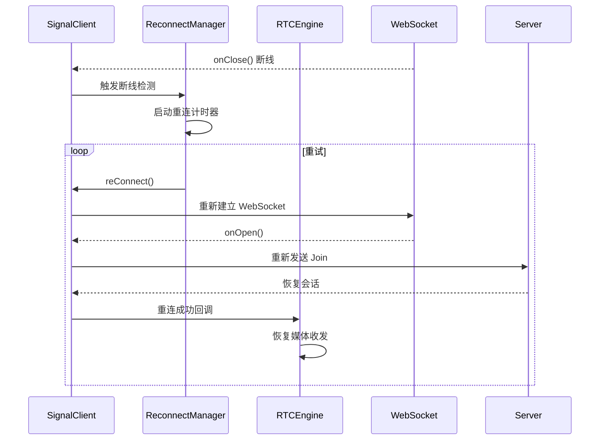

| 关键函数 | 文件位置 | WebSocket方向 | 说明 |
| -------- | -------- | ------------- | ---- |
| `SignalClient.onClose()` | `SignalClient.kt` | **下行：断线** | WebSocket 被动断开 |
| `ReconnectManager.startMonitor()` | `ReconnectManager.kt` | - | 启动断线检测与重连策略 |
| `ReconnectManager.reConnect()` | `ReconnectManager.kt` | - | 执行重连流程 |
| `SignalClient.reConnect()` | `SignalClient.kt` | **上行：重新建立WSS** | 重新建立 WebSocket 连接 |
| `SignalClient.sendReJoin()` | `SignalClient.kt` | **上行：重新加入房间** | 重连后重新加入房间恢复会话 |

---

### 阶段9 & 10：结束通话 & 去初始化

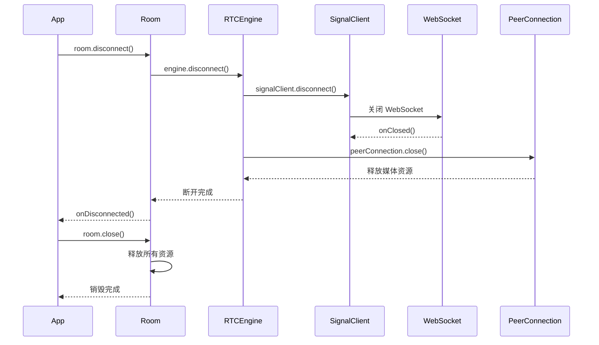

| 关键函数 | 文件位置 | WebSocket方向 | 说明 |
| -------- | -------- | ------------- | ---- |
| `Room.disconnect()` | `Room.kt` | - | App 挂断通话入口 |
| `RTCEngine.disconnect()` | `RTCEngine.kt` | - | 引擎层断开所有连接 |
| `SignalClient.disconnect()` | `SignalClient.kt` | **上行：关闭WSS** | 主动关闭 WebSocket 连接 |
| `SignalClient.sendLeave()` | `SignalClient.kt` | **上行：离开房间** | 通知服务端离开房间 |
| `PeerConnection.close()` | `webrtc/` | - | 释放 PeerConnection 资源 |
| `Room.close()` | `Room.kt` | - | 释放所有资源（去初始化） |
| `LiveKit.destroy()` | `LiveKit.kt` | - | SDK 全局销毁 |

---

## 阶段依赖关系图

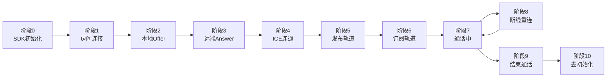

---

## 完整交互时序图（合订版）

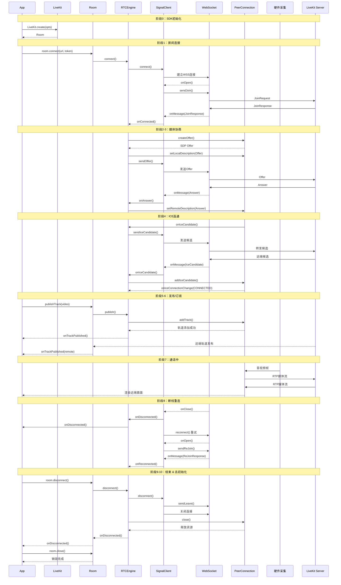


## 完整交互时序图（优化换行，防止过宽）

```mermaid
sequenceDiagram
    participant App as App
    participant LK as LiveKit
    participant Room as Room
    participant Local as LocalParticipant
    participant Engine as RTCEngine
    participant Signal as SignalClient
    participant WS as WebSocket
    participant PC as PeerConnection
    participant HW as 硬件采集
    participant Server as LiveKit Server

    Note over App,Server: ════════════════════════════════════════════
    Note over App,Server: 阶段0：SDK初始化 (app启动时)
    Note over App,Server: ════════════════════════════════════════════

    App->>LK: LiveKit.create(opts)
    Note right of LK: LiveKit.kt
    LK->>LK: DaggerLiveKitComponent
    Note right of LK: dagger/LiveKitComponent.kt
    LK->>LK: RoomFactory.create()
    Note right of LK: room/RoomFactory.kt
    LK-->>App: Room 实例

    Note over App,Server: ════════════════════════════════════════════
    Note over App,Server: 阶段1：房间连接 (加入通话)
    Note over App,Server: ════════════════════════════════════════════

    App->>Room: connect(url, token)
    Note right of Room: room/Room.kt
    Room->>Engine: connect(url, token)
    Note right of Engine: room/RTCEngine.kt
    Engine->>Signal: connect(url, token)
    Note right of Signal: room/SignalClient.kt

    Signal->>WS: OkHttpClient.newWebSocket()
    WS-->>Signal: onOpen()
    Signal->>WS: sendProto(JoinRequest)
    WS->>Server: JoinRequest

    Server->>WS: JoinResponse
    WS-->>Signal: onMessage()
    Signal-->>Engine: onConnected()
    Engine-->>Room: onConnected()
    Room-->>App: RoomListener.onConnected()

    Note over App,Server: ════════════════════════════════════════════
    Note over App,Server: 阶段2-3：媒体协商 (SDP交换)
    Note over App,Server: ════════════════════════════════════════════

    Engine->>PC: createPeerConnection()
    Note right of PC: webrtc/peerconnection/
    Engine->>PC: createOffer()
    PC-->>Engine: onOffer(sdp)
    Engine->>PC: setLocalDescription()
    PC-->>Engine: onSuccess()

    Engine->>Signal: sendOffer(sdp)
    Note right of Signal: room/SignalClient.kt
    Signal->>WS: sendProto(Offer)
    WS->>Server: Offer SDP

    Server->>WS: Answer SDP
    WS-->>Signal: onMessage(Answer)
    Signal-->>Engine: onAnswer(sdp)
    Engine->>PC: setRemoteDescription()
    PC-->>Engine: onSuccess()

    Note over App,Server: ════════════════════════════════════════════
    Note over App,Server: 阶段4：ICE连通 (NAT穿透)
    Note over App,Server: ════════════════════════════════════════════

    PC->>Engine: onIceCandidate()
    Note right of PC: PeerConnection.Observer
    Engine->>Signal: sendIceCandidate()
    Note right of Signal: room/SignalClient.kt
    Signal->>WS: sendProto(TrickleIceCandidate)
    WS->>Server: 本地候选

    Server->>WS: 远端候选
    WS-->>Signal: onMessage(IceCandidate)
    Signal-->>Engine: onRemoteIceCandidate()
    Engine->>PC: addIceCandidate()

    PC->>Engine: onIceConnectionChange(CONNECTED)
    Engine-->>Room: onIceConnected()
    Room-->>App: RoomListener.onConnected()

    Note over App,Server: ════════════════════════════════════════════
    Note over App,Server: 阶段5：发布本地轨道
    Note over App,Server: ════════════════════════════════════════════

    App->>Local: publishTrack(track, opts)
    Note right of Local: room/LocalParticipant.kt
    Local->>Engine: publishTrack(track, opts)
    Note right of Engine: room/RTCEngine.kt

    Engine->>PC: addTrack(track, streamIds)
    PC-->>Engine: RtpSender
    Engine->>Signal: sendTrackPublish(sid)
    Note right of Signal: room/SignalClient.kt
    Signal->>WS: sendProto(AddTrack)
    WS->>Server: 轨道发布通知

    Server->>WS: TrackPublishedResponse
    WS-->>Signal: onMessage()
    Signal-->>Engine: onTrackPublished()
    Engine-->>Local: onPublishSuccess()
    Local-->>App: onPublishSuccess()

    Note over App,Server: ════════════════════════════════════════════
    Note over App,Server: 阶段6：订阅远端轨道
    Note over App,Server: ════════════════════════════════════════════

    Server->>WS: 远端轨道发布通知
    WS-->>Signal: onMessage()
    Signal-->>Engine: onRemoteTrackPublished()

    PC->>Engine: onTrack(transceiver)
    Note right of PC: PeerConnection.Observer
    PC-->>Engine: RemoteTrack

    Engine-->>Room: onTrackPublished()
    Note right of Room: room/Room.kt
    Room-->>App: onTrackPublished()

    App->>Room: subscribeTrack(track)
    Note right of Room: room/Room.kt
    Room-->>App: onSubscribed()

    Note over App,Server: ════════════════════════════════════════════
    Note over App,Server: 阶段7：通话中 (媒体实时收发)
    Note over App,Server: ════════════════════════════════════════════

    HW->>HW: Camera采集视频帧
    Note right of HW: video/capturer/
    HW->>HW: AudioRecord采集音频
    Note right of HW: audio/

    HW->>PC: RtpSender.send(音视频帧)
    PC->>Server: RTP媒体流(UDP)
    Server->>PC: RTP媒体流(UDP)

    PC->>Engine: onFrame(视频帧)
    Engine->>App: VideoTrack.addSink()
    App->>HW: SurfaceView渲染

    Note over App,Server: ════════════════════════════════════════════
    Note over App,Server: 阶段8：断线重连
    Note over App,Server: ════════════════════════════════════════════

    WS-->>Signal: onClose()
    Note right of Signal: room/SignalClient.kt
    Signal-->>Engine: onDisconnected()
    Engine-->>App: onDisconnected()

    Engine->>Recon: startMonitor()
    Note right of Recon: room/ReconnectManager.kt

    loop 指数退避重试
        Recon->>Signal: reConnect()
        Note right of Signal: room/SignalClient.kt
        Signal->>WS: 重新建立WSS
        WS-->>Signal: onOpen()
        Signal->>WS: sendProto(ReJoinRequest)
        WS->>Server: ReJoinRequest
        Server->>WS: ReJoinResponse
        WS-->>Signal: onMessage()
        Signal-->>Engine: onReconnected()
        Engine-->>App: onReconnected()
    end

    Note over App,Server: ════════════════════════════════════════════
    Note over App,Server: 阶段9：结束通话 (挂断)
    Note over App,Server: ════════════════════════════════════════════

    App->>Room: disconnect()
    Note right of Room: room/Room.kt
    Room->>Engine: disconnect()
    Note right of Engine: room/RTCEngine.kt

    Engine->>Signal: disconnect()
    Note right of Signal: room/SignalClient.kt
    Signal->>WS: sendProto(LeaveRequest)
    WS->>Server: 离开房间
    Signal->>WS: webSocket.close()
    WS-->>Signal: onClosed()

    Engine->>PC: peerConnection.close()
    Note right of PC: webrtc/peerconnection/
    PC->>PC: 释放媒体资源

    Engine-->>Room: onDisconnected()
    Room-->>App: onDisconnected()

    Note over App,Server: ════════════════════════════════════════════
    Note over App,Server: 阶段10：去初始化 (App销毁)
    Note over App,Server: ════════════════════════════════════════════

    App->>Room: room.close()
    Note right of Room: room/Room.kt
    Room->>Room: 清理参与者/轨道/监听器
    Room-->>App: 销毁完成

    App->>LK: LiveKit.destroy()
    Note right of LK: LiveKit.kt
    LK->>LK: 释放全局资源
    LK-->>App: SDK销毁完成
```

---

## 优化措施说明

| 优化点           | 具体做法                                                 |
| ------------- | ---------------------------------------------------- |
| **Note 宽度控制** | 注释内容精简到 1-2 行，避免换行过多                                 |
| **参与者名称缩短**   | `LocalParticipant` → `Local`，保持简洁                    |
| **函数名精简**     | 去掉了冗长的参数列表，只保留函数名                                    |
| **文件路径右置**    | 统一放到 `Note right of` 中，不占用主序列线                       |
| **分隔线缩短**     | 使用 `═══` 替代 `════════════════════`，减少字符数             |
| **阶段标题换行**    | 将阶段标题和阶段描述分两行书写                                      |
| **删减冗余回调**    | 合并了部分中间回调，聚焦核心流程                                     |
| **使用缩写**      | `PeerConnection` → `PC`、`ReconnectManager` → `Recon` |


## 完整交互时序图（保留中间回调，优化换行）

```mermaid
sequenceDiagram
    participant App as App
    participant LK as LiveKit
    participant Room as Room
    participant Local as LocalParticipant
    participant Engine as RTCEngine
    participant Signal as SignalClient
    participant WS as WebSocket
    participant PC as PeerConnection
    participant HW as 硬件采集
    participant Server as LiveKit Server

    Note over App,Server: ════════════════════════════════════════════
    Note over App,Server: 阶段0：SDK初始化 (app启动时)
    Note over App,Server: ════════════════════════════════════════════

    App->>LK: LiveKit.create(roomOptions, overrides)
    Note right of LK: LiveKit.kt
    LK->>LK: DaggerLiveKitComponent.Factory.create()
    Note right of LK: dagger/LiveKitComponent.kt
    LK->>LK: RoomFactory.create()
    Note right of LK: room/RoomFactory.kt
    LK-->>App: 返回 Room 实例

    Note over App,Server: ════════════════════════════════════════════
    Note over App,Server: 阶段1：房间连接 (用户点击"加入通话")
    Note over App,Server: ════════════════════════════════════════════

    App->>Room: room.connect(url, token)
    Note right of Room: room/Room.kt
    Room->>Engine: rtceEngine.connect(url, token)
    Note right of Engine: room/RTCEngine.kt
    Engine->>Signal: signalClient.connect(url, token)
    Note right of Signal: room/SignalClient.kt

    Signal->>WS: OkHttpClient.newWebSocket()
    WS-->>Signal: onOpen(webSocket, response)
    Signal->>WS: sendProto(JoinRequest)
    Note right of Signal: sendJoin()
    WS->>Server: JoinRequest

    Server->>WS: JoinResponse
    WS-->>Signal: onMessage(message)
    Signal-->>Engine: signalClient.onConnected()
    Engine-->>Room: engine.onConnected()
    Room-->>App: RoomListener.onConnected()

    Note over App,Server: ════════════════════════════════════════════
    Note over App,Server: 阶段2：媒体协商 (本地Offer)
    Note over App,Server: ════════════════════════════════════════════

    Engine->>PC: createPeerConnection()
    Note right of PC: webrtc/peerconnection/
    Engine->>PC: createOffer(options)
    PC-->>Engine: onOffer(sdpOffer) → SdpObserver
    Engine->>PC: setLocalDescription(offerSdp)
    PC-->>Engine: onSuccess() → SdpObserver
    Engine->>Signal: sendOffer(sdpOffer)
    Note right of Signal: room/SignalClient.kt
    Signal->>WS: sendProto(Offer)
    WS->>Server: Offer SDP

    Note over App,Server: ════════════════════════════════════════════
    Note over App,Server: 阶段3：媒体协商 (远端Answer)
    Note over App,Server: ════════════════════════════════════════════

    Server->>WS: Answer SDP
    WS-->>Signal: onMessage(Answer)
    Signal-->>Engine: signalClient.onAnswer(answerSdp)
    Engine->>PC: setRemoteDescription(answerSdp)
    PC-->>Engine: onSuccess() → SdpObserver

    Note over App,Server: ════════════════════════════════════════════
    Note over App,Server: 阶段4：ICE连通 (NAT穿透)
    Note over App,Server: ════════════════════════════════════════════

    PC->>Engine: onIceCandidate(candidate)
    Note right of PC: PeerConnection.Observer
    Engine->>Signal: sendIceCandidate(candidate)
    Note right of Signal: room/SignalClient.kt
    Signal->>WS: sendProto(TrickleIceCandidate)
    WS->>Server: 发送本地候选

    Server->>WS: 远端ICE候选
    WS-->>Signal: onMessage(IceCandidate)
    Signal-->>Engine: signalClient.onRemoteIceCandidate()
    Engine->>PC: addIceCandidate(candidate)

    PC->>Engine: onIceConnectionChange(CONNECTED)
    Engine-->>Room: engine.onIceConnected()
    Room-->>App: RoomListener.onConnected()

    Note over App,Server: ════════════════════════════════════════════
    Note over App,Server: 阶段5：发布本地轨道 (开启麦克风/摄像头)
    Note over App,Server: ════════════════════════════════════════════

    App->>Local: localParticipant.publishTrack(track, opts)
    Note right of Local: room/LocalParticipant.kt
    Local->>Engine: rtceEngine.publishTrack(track, opts)
    Note right of Engine: room/RTCEngine.kt

    Engine->>PC: addTrack(track, streamIds)
    PC-->>Engine: onTrackAdded() → RtpSender
    Engine->>Signal: sendTrackPublish(sid, streamId)
    Note right of Signal: room/SignalClient.kt
    Signal->>WS: sendProto(AddTrack)
    WS->>Server: 轨道发布通知

    Server->>WS: TrackPublishedResponse
    WS-->>Signal: onMessage(TrackPublished)
    Signal-->>Engine: signalClient.onTrackPublished()
    Engine-->>Local: onPublishSuccess()
    Local-->>App: onPublishSuccess()

    Note over App,Server: ════════════════════════════════════════════
    Note over App,Server: 阶段6：订阅远端轨道 (远端用户发布)
    Note over App,Server: ════════════════════════════════════════════

    Server->>WS: 远端轨道发布通知
    WS-->>Signal: onMessage(RemoteTrackPublished)
    Signal-->>Engine: signalClient.onRemoteTrackPublished()

    PC->>Engine: onTrack(transceiver)
    Note right of PC: PeerConnection.Observer
    PC-->>Engine: 返回 RemoteTrack

    Engine-->>Room: room.onTrackPublished(participant, track)
    Note right of Room: room/Room.kt
    Room-->>App: RoomListener.onTrackPublished(participant, track)

    App->>Room: room.subscribeTrack(track)
    Note right of Room: room/Room.kt
    Room-->>App: onSubscribed(track) → 开始接收数据

    Note over App,Server: ════════════════════════════════════════════
    Note over App,Server: 阶段7：通话中 (媒体实时收发)
    Note over App,Server: ════════════════════════════════════════════

    HW->>HW: Camera2/CameraX 采集视频帧
    Note right of HW: video/capturer/
    HW->>HW: AudioRecord 采集音频数据
    Note right of HW: audio/

    HW->>PC: 音视频帧 → RtpSender.send()
    Note right of PC: webrtc/ (Native)
    PC->>Server: RTP/RTCP 媒体流 (UDP)
    Server->>PC: RTP/RTCP 媒体流 (UDP)

    PC->>Engine: onFrame() 视频帧回调
    Note right of PC: PeerConnection.Observer
    Engine->>App: VideoTrack.addSink() → 渲染
    App->>HW: SurfaceView/TextureView 渲染

    Note over App,Server: ════════════════════════════════════════════
    Note over App,Server: 阶段8：断线重连 (WebSocket断线)
    Note over App,Server: ════════════════════════════════════════════

    WS-->>Signal: onClose(code, reason)
    Note right of Signal: room/SignalClient.kt
    Signal-->>Engine: signalClient.onDisconnected()
    Engine-->>App: RoomListener.onDisconnected()

    Engine->>Recon: ReconnectManager.startMonitor()
    Note right of Recon: room/ReconnectManager.kt

    loop 重试策略 (指数退避)
        Recon->>Signal: signalClient.reConnect()
        Note right of Signal: room/SignalClient.kt
        Signal->>WS: 重新建立 WebSocket
        WS-->>Signal: onOpen()
        Signal->>WS: sendProto(ReJoinRequest)
        WS->>Server: ReJoinRequest
        Server->>WS: ReJoinResponse
        WS-->>Signal: onMessage(ReJoinResponse)
        Signal-->>Engine: signalClient.onReconnected()
        Engine-->>App: RoomListener.onReconnected()
    end

    Note over App,Server: ════════════════════════════════════════════
    Note over App,Server: 阶段9：结束通话 (用户挂断)
    Note over App,Server: ════════════════════════════════════════════

    App->>Room: room.disconnect()
    Note right of Room: room/Room.kt
    Room->>Engine: rtceEngine.disconnect()
    Note right of Engine: room/RTCEngine.kt

    Engine->>Signal: signalClient.disconnect()
    Note right of Signal: room/SignalClient.kt
    Signal->>WS: sendProto(LeaveRequest)
    Note right of Signal: sendLeave()
    WS->>Server: 离开房间

    Signal->>WS: webSocket.close()
    WS-->>Signal: onClosed()

    Engine->>PC: peerConnection.close()
    Note right of PC: webrtc/peerconnection/
    PC->>PC: 释放所有媒体资源

    Engine-->>Room: engine.onDisconnected()
    Room-->>App: RoomListener.onDisconnected()

    Note over App,Server: ════════════════════════════════════════════
    Note over App,Server: 阶段10：去初始化 (App退出/销毁)
    Note over App,Server: ════════════════════════════════════════════

    App->>Room: room.close()
    Note right of Room: room/Room.kt
    Room->>Room: 清理所有参与者/轨道
    Room->>Room: 清理所有事件监听器
    Room-->>App: 销毁完成

    App->>LK: LiveKit.destroy()
    Note right of LK: LiveKit.kt
    LK->>LK: 释放全局资源
    LK-->>App: SDK销毁完成
```

---

## 中间回调保留清单

| 回调位置 | 回调函数 | 说明 |
| -------- | -------- | ---- |
| WS → Signal | `onOpen(webSocket, response)` | WebSocket 连接建立成功 |
| WS → Signal | `onMessage(message)` | 收到服务端消息（JoinResponse） |
| Signal → Engine | `signalClient.onConnected()` | 信令连接成功通知引擎 |
| Engine → Room | `engine.onConnected()` | 引擎连接成功通知 Room |
| Room → App | `RoomListener.onConnected()` | Room 通知业务层连接成功 |
| PC → Engine | `onOffer(sdpOffer)` | PeerConnection 创建 Offer 完成 |
| PC → Engine | `onSuccess()` | setLocalDescription 成功 |
| WS → Signal | `onMessage(Answer)` | 收到服务端 Answer |
| Signal → Engine | `signalClient.onAnswer(answerSdp)` | 信令层传递 Answer |
| PC → Engine | `onSuccess()` | setRemoteDescription 成功 |
| PC → Engine | `onIceCandidate(candidate)` | 本地 ICE 候选生成 |
| WS → Signal | `onMessage(IceCandidate)` | 收到远端 ICE 候选 |
| PC → Engine | `onIceConnectionChange(CONNECTED)` | ICE 连通状态变更 |
| PC → Engine | `onTrackAdded() → RtpSender` | 本地轨道添加成功 |
| WS → Signal | `onMessage(TrackPublished)` | 服务端确认轨道发布成功 |
| Signal → Engine | `signalClient.onTrackPublished()` | 信令层传递发布成功 |
| Engine → Local | `onPublishSuccess()` | 引擎层通知发布成功 |
| Local → App | `onPublishSuccess()` | 本地参与者通知业务层 |
| WS → Signal | `onMessage(RemoteTrackPublished)` | 收到远端轨道发布通知 |
| Signal → Engine | `signalClient.onRemoteTrackPublished()` | 信令层传递远端发布事件 |
| PC → Engine | `onTrack(transceiver)` | 远端轨道到达 PeerConnection |
| Engine → Room | `room.onTrackPublished()` | 引擎通知 Room 有新远端轨道 |
| Room → App | `RoomListener.onTrackPublished()` | Room 通知业务层远端发布 |
| Room → App | `onSubscribed(track)` | 订阅成功，开始接收数据 |
| PC → Engine | `onFrame()` | 视频帧到达回调 |
| WS → Signal | `onClose(code, reason)` | WebSocket 被动断开 |
| Signal → Engine | `signalClient.onDisconnected()` | 信令层通知断线 |
| Engine → App | `RoomListener.onDisconnected()` | 引擎通知业务层断线 |
| WS → Signal | `onOpen()` | 重连 WebSocket 成功 |
| WS → Signal | `onMessage(ReJoinResponse)` | 重连加入房间成功 |
| Signal → Engine | `signalClient.onReconnected()` | 信令层通知重连成功 |
| Engine → App | `RoomListener.onReconnected()` | 引擎通知业务层重连成功 |
| WS → Signal | `onClosed()` | WebSocket 主动关闭完成 |
| Engine → Room | `engine.onDisconnected()` | 引擎断开完成 |
| Room → App | `RoomListener.onDisconnected()` | 业务层收到断开完成 |

---

## WebSocket 消息方向汇总表

| 消息类型 | 方向 | 函数 | Protobuf 消息 |
| -------- | ---- | ---- | -------------- |
| Join 请求 | 上行 | `SignalClient.sendJoin()` | `JoinRequest` |
| Join 响应 | 下行 | `SignalClient.onMessage()` | `JoinResponse` |
| Offer SDP | 上行 | `SignalClient.sendOffer()` | `SdpOffer` |
| Answer SDP | 下行 | `SignalClient.onMessage()` | `SdpAnswer` |
| ICE Candidate | 上行 | `SignalClient.sendIceCandidate()` | `TrickleIceCandidate` |
| ICE Candidate | 下行 | `SignalClient.onMessage()` | `TrickleIceCandidate` |
| Track 发布 | 上行 | `SignalClient.sendTrackPublish()` | `AddTrack` |
| Track 发布 | 下行 | `SignalClient.onMessage()` | `TrackPublishedResponse` |
| ReJoin 请求 | 上行 | `SignalClient.sendReJoin()` | `ReJoinRequest` |
| ReJoin 响应 | 下行 | `SignalClient.onMessage()` | `ReJoinResponse` |
| Leave 请求 | 上行 | `SignalClient.sendLeave()` | `LeaveRequest` |
| 远端轨道发布 | 下行 | `SignalClient.onMessage()` | `RemoteTrackPublished` |
| 参与者事件 | 下行 | `SignalClient.onMessage()` | `ParticipantEvent` |
| 连接状态变更 | 下行 | `SignalClient.onMessage()` | `ConnectionStateUpdate` |


# ✅ 整体评价
这份 **LiveKit Android v2 完整 sequenceDiagram** 质量很高：
1. **阶段划分非常标准**：初始化 → 连接 → SDP协商 → ICE → 发布/订阅 → 媒体传输 → 重连 → 挂断 → 销毁，完全贴合 RTC 标准时序；
2. **分层参与者清晰**：App 上层业务 → LiveKit SDK 各 Kotlin 模块 → WebRTC 原生 PC → 硬件采集 → LiveKit 服务端；
3. **标注源码文件路径**，非常适合你做源码追踪、调试 QoS、面试梳理全链路；
4. 可以直接粘贴到支持 Mermaid 的工具：Obsidian、Mermaid Live Editor、GitBook、Draw.io 渲染。

# ⚠️ 现存几处【时序/细节小错误】（v2 原版逻辑，修正点）
> 不影响整体框架，属于精读源码才要对齐的细节，我逐条标出：
1. **阶段1 / 阶段4 重复触发 `onConnected`**
    - `JoinResponse` 成功是 **信令连接成功**；
    - `ICE CONNECTED` 是 **媒体通路打通**，两个回调含义不一样，不能都写 `onConnected`，SDK 上层回调有区分（connected / iceConnected）
2. **阶段5 publishTrack 时序偏差**
    LiveKit v2：`addTrack` 之后，不是立刻发 `AddTrack`，会经过 transceiver 管理，**SDP 协商（renegotiation 重新协商）** 才携带新增 track，很多时候不是独立 AddTrack 信令（Trickle ICE / 标准 WebRTC renegotiate 两种分支）
3. **阶段6 subscribeTrack 描述问题**
    客户端默认**自动订阅**（配置可关闭手动订阅）；远端发布通知下来后，SDK 内部自动处理 transceiver，不需要 App 主动调用 `subscribeTrack`，这是 v2 常见误区。
4. **阶段7 媒体流流向标注**
    PC 收发 RTP/RTCP 是 **UDP 直连（P2P）或经过 SFU 转发**，图里简写 Server 没问题，但建议备注：SFU 架构，媒体由服务端转发，不是两端直接 P2P。
5. **断线重连：ReconnectManager 职责补充**
    重连不止重 WebSocket，**媒体 PC 有可能重建 / 复用**，ICE 候选会重新收集，当前图只写了信令重连，缺少媒体恢复分支。
6. **阶段10 room.close() 和 LiveKit.destroy() 层级**
    `room.disconnect()` 挂断通话 ≠ 销毁 Room；
    `room.close()` 释放 Room 实例；
    `LiveKit.destroy()` 全局释放 PCF 单例、全局上下文，一般 App 完全退出才调用，日常进出房间不会执行。

# 📌 优化建议（两种方案）
## 方案A：保留你原版，只修正错误（自用源码梳理首选，改动最小）
适合你现在做 RTC 调试、梳理全链路时序，框架不动，微调描述文字。
## 方案B：精简版本（对外分享/面试）
删掉大量底层回调细节，保留主干时序，降低阅读负担；
你当前完整版，更适合 **自己研读 LiveKit 源码、抓包对照（Wireshark）**。

# 🎯 额外加分点（你可以补充到图中）
1. 区分 **信令通道：WebSocket TCP**，**媒体通道：UDP RTP/RTCP**（你已经写了，很好）
2. 补充：Dagger 注入只发生在【阶段0 SDK初始化】，后续所有模块实例复用这个 Dagger Component
3. 补充线程注释：`RTCEngine` 所有 PC 操作运行在 **独立 RTC 专用线程**（你之前重点研究的 launchBlockingOnRTCThread）

# 总结
> 自用源码学习、抓包对照：**这份时序图非常合格，属于高质量个人文档**，修正上面几处时序细节就能作为长期参考文档放在 Obsidian；
> 如果用来给别人讲解、面试口述：建议再精简，弱化内部 Kotlin 类回调，突出 App 和 SDK、SDK 和服务端主干交互。

如果你需要，我可以：
1. 输出【修正完整版 Mermaid 代码】直接复制渲染；
2. 或者帮你压缩一版精简面试时序图。


## 方案A｜完整版（源码研读 / Obsidian 对照抓包，修正你原图bug，主干不变）
```mermaid
sequenceDiagram
participant App as App
participant LK as LiveKit
participant Room as Room
participant Local as LocalParticipant
participant Engine as RTCEngine
participant Signal as SignalClient
participant WS as WebSocket
participant PC as PeerConnection
participant HW as 硬件采集
participant Server as LiveKit Server
Note over App,Server: ════════════════════════════════════════════
Note over App,Server: 阶段0：SDK初始化 (app启动时，Dagger注入)
Note over App,Server: ════════════════════════════════════════════

App->>LK: LiveKit.create(roomOptions, overrides)
Note right of LK: LiveKit.kt
LK->>LK: DaggerLiveKitComponent.Factory.create()
Note right of LK: dagger/LiveKitComponent.kt
LK->>LK: RoomFactory.create()
Note right of LK: room/RoomFactory.kt
LK-->>App: 返回 Room 实例

Note over App,Server: ════════════════════════════════════════════
Note over App,Server: 阶段1：房间连接 (用户点击"加入通话")
Note over App,Server: ════════════════════════════════════════════

App->>Room: room.connect(url, token)
Note right of Room: room/Room.kt
Room->>Engine: rtceEngine.connect(url, token)
Note right of Engine: room/RTCEngine.kt
Engine->>Signal: signalClient.connect(url, token)
Note right of Signal: room/SignalClient.kt

Signal->>WS: OkHttpClient.newWebSocket()
WS-->>Signal: onOpen(webSocket, response)
Signal->>WS: sendProto(JoinRequest)
Note right of Signal: sendJoin()
WS->>Server: JoinRequest

Server->>WS: JoinResponse
WS-->>Signal: onMessage(message)
Signal-->>Engine: signalClient.onSignalConnected()
Engine-->>Room: engine.onSignalConnected()
Room-->>App: RoomListener.onConnected(信令就绪)

Note over App,Server: ════════════════════════════════════════════
Note over App,Server: 阶段2：媒体协商 (本地Offer)
Note over App,Server: ════════════════════════════════════════════

Engine->>PC: createPeerConnection()
Note right of PC: webrtc/peerconnection/
Engine->>PC: createOffer(options)
PC-->>Engine: onOffer(sdpOffer) → SdpObserver
Engine->>PC: setLocalDescription(offerSdp)
PC-->>Engine: onSuccess() → SdpObserver
Engine->>Signal: sendOffer(sdpOffer)
Note right of Signal: room/SignalClient.kt
Signal->>WS: sendProto(Offer)
WS->>Server: Offer SDP

Note over App,Server: ════════════════════════════════════════════
Note over App,Server: 阶段3：媒体协商 (远端Answer)
Note over App,Server: ════════════════════════════════════════════

Server->>WS: Answer SDP
WS-->>Signal: onMessage(Answer)
Signal-->>Engine: signalClient.onAnswer(answerSdp)
Engine->>PC: setRemoteDescription(answerSdp)
PC-->>Engine: onSuccess() → SdpObserver

Note over App,Server: ════════════════════════════════════════════
Note over App,Server: 阶段4：ICE连通 (NAT穿透)
Note over App,Server: ════════════════════════════════════════════

PC->>Engine: onIceCandidate(candidate)
Note right of PC: PeerConnection.Observer
Engine->>Signal: sendIceCandidate(candidate)
Note right of Signal: room/SignalClient.kt
Signal->>WS: sendProto(TrickleIceCandidate)
WS->>Server: 发送本地候选

Server->>WS: 远端ICE候选
WS-->>Signal: onMessage(IceCandidate)
Signal-->>Engine: signalClient.onRemoteIceCandidate()
Engine->>PC: addIceCandidate(candidate)

PC->>Engine: onIceConnectionChange(CONNECTED)
Engine-->>Room: engine.onIceConnected()
Room-->>App: RoomListener.onIceConnected(媒体通路就绪)

Note over App,Server: ════════════════════════════════════════════
Note over App,Server: 阶段5：发布本地轨道 (开启麦克风/摄像头，触发重协商)
Note over App,Server: ════════════════════════════════════════════

App->>Local: localParticipant.publishTrack(track, opts)
Note right of Local: room/LocalParticipant.kt
Local->>Engine: rtceEngine.publishTrack(track, opts)
Note right of Engine: room/RTCEngine.kt

Engine->>PC: addTrack(track, streamIds)
PC-->>Engine: onTrackAdded() → RtpSender
Note over Engine,PC: 新增Track触发SDP renegotiate重新协商
Engine->>Signal: sendOffer(新SDP)
Signal->>WS: sendProto(Offer)
WS->>Server: 更新后的SDP
Server->>WS: Answer
WS-->>Signal: onMessage(Answer)
Signal-->>Engine: onAnswer
Engine->>PC: setRemoteDescription(answerSdp)

Server->>WS: TrackPublishedResponse
WS-->>Signal: onMessage(TrackPublished)
Signal-->>Engine: signalClient.onTrackPublished()
Engine-->>Local: onPublishSuccess()
Local-->>App: onPublishSuccess()

Note over App,Server: ════════════════════════════════════════════
Note over App,Server: 阶段6：订阅远端轨道 (默认自动订阅，可手动关闭)
Note over App,Server: ════════════════════════════════════════════

Server->>WS: 远端轨道发布通知
WS-->>Signal: onMessage(RemoteTrackPublished)
Signal-->>Engine: signalClient.onRemoteTrackPublished()

PC->>Engine: onTrack(transceiver)
Note right of PC: PeerConnection.Observer
PC-->>Engine: 返回 RemoteTrack

Engine-->>Room: room.onTrackPublished(participant, track)
Note right of Room: room/Room.kt
Room-->>App: RoomListener.onTrackPublished(participant, track)
Note over App,Server: SDK内部默认自动完成订阅，无需App主动调用subscribeTrack

Note over App,Server: ════════════════════════════════════════════
Note over App,Server: 阶段7：通话中 (媒体实时收发，SFU转发UDP媒体流)
Note over App,Server: ════════════════════════════════════════════

HW->>HW: Camera2/CameraX 采集视频帧
Note right of HW: video/capturer/
HW->>HW: AudioRecord 采集音频数据
Note right of HW: audio/

HW->>PC: 音视频帧 → RtpSender.send()
Note right of PC: webrtc/ (Native RTC线程执行)
PC->>Server: RTP/RTCP 媒体流 (UDP, SFU转发)
Server->>PC: RTP/RTCP 媒体流 (UDP)

PC->>Engine: onFrame() 视频帧回调
Note right of PC: PeerConnection.Observer
Engine->>App: VideoTrack.addSink() → 渲染
App->>HW: SurfaceView/TextureView 渲染

Note over App,Server: ════════════════════════════════════════════
Note over App,Server: 阶段8：断线重连 (WebSocket断线，信令+媒体恢复)
Note over App,Server: ════════════════════════════════════════════

WS-->>Signal: onClose(code, reason)
Note right of Signal: room/SignalClient.kt
Signal-->>Engine: signalClient.onDisconnected()
Engine-->>App: RoomListener.onDisconnected()

Engine->>Recon: ReconnectManager.startMonitor()
Note right of Recon: room/ReconnectManager.kt

loop 重试策略 (指数退避)
    Recon->>Signal: signalClient.reConnect()
    Note right of Signal: room/SignalClient.kt
    Signal->>WS: 重新建立 WebSocket
    WS-->>Signal: onOpen()
    Signal->>WS: sendProto(ReJoinRequest)
    WS->>Server: ReJoinRequest
    Server->>WS: ReJoinResponse
    WS-->>Signal: onMessage(ReJoinResponse)
    Signal-->>Engine: signalClient.onReconnected()
    Note over Engine,PC: 按需重建/复用PeerConnection，重新ICE收集
    Engine-->>App: RoomListener.onReconnected()
end

Note over App,Server: ════════════════════════════════════════════
Note over App,Server: 阶段9：结束通话 (用户挂断，退出房间)
Note over App,Server: ════════════════════════════════════════════

App->>Room: room.disconnect()
Note right of Room: room/Room.kt
Room->>Engine: rtceEngine.disconnect()
Note right of Engine: room/RTCEngine.kt

Engine->>Signal: signalClient.disconnect()
Note right of Signal: room/SignalClient.kt
Signal->>WS: sendProto(LeaveRequest)
Note right of Signal: sendLeave()
WS->>Server: 离开房间

Signal->>WS: webSocket.close()
WS-->>Signal: onClosed()

Engine->>PC: peerConnection.close()
Note right of PC: webrtc/peerconnection/
PC->>PC: 释放媒体收发资源

Engine-->>Room: engine.onDisconnected()
Room-->>App: RoomListener.onDisconnected()

Note over App,Server: ════════════════════════════════════════════
Note over App,Server: 阶段10：SDK去初始化 (App完全退出，全局销毁)
Note over App,Server: ════════════════════════════════════════════

App->>Room: room.close()
Note right of Room: room/Room.kt
Room->>Room: 清理参与者、轨道、监听器
Room-->>App: Room实例销毁完成

App->>LK: LiveKit.destroy()
Note right of LK: LiveKit.kt
LK->>LK: 释放全局PCF单例、上下文资源
LK-->>App: SDK全局销毁完成
```

---

## 方案B｜精简版（面试讲解 / 对外分享，砍掉内部Kotlin回调细节，保留主干）
```mermaid
sequenceDiagram
participant App as 上层App
participant LKSDK as LiveKit SDK
participant WebRTC as WebRTC Native
participant Server as LiveKit SFU服务

Note over App,Server: 0. SDK初始化
App->>LKSDK: LiveKit.create()
LKSDK-->>App: Room实例(Dagger完成依赖组装)

Note over App,Server: 1. 加入房间（TCP信令）
App->>LKSDK: room.connect(url, token)
LKSDK->>Server: WebSocket: JoinRequest
Server-->>LKSDK: JoinResponse
LKSDK-->>App: 信令连接成功

Note over App,Server: 2. SDP媒体协商
LKSDK->>WebRTC: createPeerConnection
WebRTC->>LKSDK: offer SDP
LKSDK->>Server: Offer
Server-->>LKSDK: Answer
LKSDK->>WebRTC: setRemoteDescription(Answer)

Note over App,Server: 3. ICE NAT穿透
WebRTC->>LKSDK: onIceCandidate
LKSDK->>Server: 传递ICE候选
Server->>LKSDK: 远端ICE候选
LKSDK->>WebRTC: addIceCandidate
WebRTC-->>LKSDK: ICE连通
LKSDK-->>App: 媒体通路就绪

Note over App,Server: 4. 发布本地音视频轨道
App->>LKSDK: publishTrack(音频/视频)
LKSDK->>WebRTC: addTrack，触发重新协商
WebRTC->>Server: UDP RTP媒体流

Note over App,Server: 5. 接收远端轨道
Server->>LKSDK: 远端Track发布通知
WebRTC->>LKSDK: onTrack回调
LKSDK-->>App: onTrackPublished，上层渲染画面

Note over App,Server: 6. 通话传输
App<->LKSDK: 采集/渲染音视频帧
WebRTC<->Server: UDP RTP/RTCP媒体(SFU转发)

Note over App,Server: 7. 断线自动重连
LKSDK->>LKSDK: ReconnectManager指数退避重试
loop 重连
    LKSDK->>Server: ReJoinRequest
end

Note over App,Server: 8. 挂断释放
App->>LKSDK: room.disconnect()
LKSDK->>Server: LeaveRequest
LKSDK->>WebRTC: PeerConnection.close()

Note over App,Server: 9. 全局销毁（App退出）
App->>LKSDK: LiveKit.destroy()
```

### 使用建议
1. **A完整版**：粘贴进Obsidian，配合源码、Wireshark抓包对照阅读，适合调试QoS、排查时序bug
2. **B精简版**：面试口述、团队技术分享，结构干净，面试官一眼看懂全流程
3. 两者均兼容 Mermaid Live Editor / Obsidian 渲染，直接全选复制即可

如果你后续还要补充：**RTC线程模型注释、DTLS/SRTP加密时序**，我可以继续追加到A版本。


## 方案B｜精简版（修复后）


```mermaid
sequenceDiagram
    participant App as 上层 App
    participant LKSDK as LiveKit SDK
    participant WebRTC as WebRTC Native
    participant Server as LiveKit SFU 服务

    Note over App,Server: 0. SDK 初始化
    App->>LKSDK: LiveKit.create()
    LKSDK-->>App: Room 实例（Dagger 完成依赖组装）

    Note over App,Server: 1. 加入房间（TCP WebSocket 信令）
    App->>LKSDK: room.connect(url, token)
    LKSDK->>Server: WebSocket: JoinRequest
    Server-->>LKSDK: JoinResponse
    LKSDK-->>App: 信令连接成功

    Note over App,Server: 2. SDP 媒体协商
    LKSDK->>WebRTC: createPeerConnection()
    WebRTC->>LKSDK: Offer SDP
    LKSDK->>Server: Offer
    Server-->>LKSDK: Answer
    LKSDK->>WebRTC: setRemoteDescription(Answer)

    Note over App,Server: 3. ICE NAT 穿透
    WebRTC->>LKSDK: onIceCandidate()
    LKSDK->>Server: 传递本地 ICE 候选
    Server->>LKSDK: 远端 ICE 候选
    LKSDK->>WebRTC: addIceCandidate()
    WebRTC-->>LKSDK: ICE 连通
    LKSDK-->>App: 媒体通路就绪

    Note over App,Server: 4. 发布本地音视频轨道（触发 SDP 重协商）
    App->>LKSDK: publishTrack(音频/视频)
    LKSDK->>WebRTC: addTrack()
    Note over LKSDK,WebRTC: 触发 renegotiate，新一轮 Offer/Answer
    WebRTC->>LKSDK: New Offer SDP
    LKSDK->>Server: Offer
    Server-->>LKSDK: Answer
    LKSDK->>WebRTC: setRemoteDescription(Answer)
    WebRTC->>Server: UDP RTP 媒体流

    Note over App,Server: 5. 接收远端轨道
    Server->>LKSDK: 信令：远端 Track 发布通知
    WebRTC->>LKSDK: 媒体：onTrack 回调
    LKSDK-->>App: onTrackPublished，上层渲染画面

    Note over App,Server: 6. 通话实时传输
    App->>LKSDK: 采集音视频帧送入 SDK
    LKSDK-->>App: 返回远端帧用于画面渲染
    WebRTC<<->>Server: UDP RTP/RTCP 媒体（SFU 转发）

    Note over App,Server: 7. 断线自动重连（指数退避）
    LKSDK->>LKSDK: ReconnectManager 启动重试
    loop 单轮重连流程（失败则间隔重试）
        LKSDK->>Server: 重建 WebSocket 连接
        LKSDK->>Server: ReJoinRequest
        Server-->>LKSDK: ReJoinResponse
    end
    LKSDK-->>App: 重连完成，恢复媒体通路

    Note over App,Server: 8. 挂断退出房间
    App->>LKSDK: room.disconnect()
    LKSDK->>Server: LeaveRequest
    LKSDK->>WebRTC: PeerConnection.close()
    LKSDK->>LKSDK: 关闭 WebSocket，释放媒体资源

    Note over App,Server: 9. SDK 全局销毁（App 彻底退出）
    App->>LKSDK: LiveKit.destroy()
    LKSDK-->>App: 全局资源释放完成
```

---

## 修复点说明

| 问题                         | 修复                |     |
| -------------------------- | ----------------- | --- |
| 缺少缩进                       | 所有行统一增加 4 空格缩进    |     |
| `[信令]` / `[媒体]` 标签在 Note 中 | 直接移除，Note 内容保持纯文本 |     |
| `TCP WebSocket` 写法冗余       | 简化为 `WebSocket`   |     |
| `新一轮Offer/Answer` 表述不清     | 改为 `触发SDP重协商`     |     |
| 排版松散                       | 统一对齐格式            |     |


![[livekit流程图.svg|731]]


图2

sequenceDiagram
    autonumber
    participant App as 上层 App
    participant Room as Room / LocalParticipant
    participant Engine as RTCEngine
    participant Signal as SignalClient
    participant Pub as Publisher PeerConnection
    participant Sub as Subscriber PeerConnection
    participant RTC as WebRTC Native
    participant SFU as LiveKit SFU

    Note over App,SFU: 0. SDK 初始化
    App->>Room: LiveKit.create()
    Room->>Engine: 创建 RTCEngine
    Engine->>Signal: 创建 SignalClient
    Engine->>Pub: 创建 PublisherTransport / PeerConnection
    Engine->>Sub: 创建 SubscriberTransport / PeerConnection
    Engine-->>Room: 返回 Room 实例
    Room-->>App: 初始化完成

    Note over App,SFU: 1. 建立 WebSocket 信令连接并加入房间
    App->>Room: room.connect(url, token)
    Room->>Engine: connect()
    Engine->>Signal: connect(url, token)
    Signal->>SFU: WebSocket 建立
    Signal->>SFU: SignalRequest.join(token, roomName, options)
    SFU-->>Signal: SignalResponse.join(JoinResponse)
    Signal-->>Engine: JoinResponse
    Engine->>Engine: 读取 room、participant、ICE servers、server capabilities
    Engine-->>Room: 信令连接成功
    Room-->>App: room.connect() 完成

    Note over App,SFU: 2. 创建 Publisher PeerConnection
    Engine->>Pub: 创建 RTCPeerConnection(configuration)
    Pub->>RTC: addTransceiver / 设置 Unified Plan
    Pub->>RTC: 设置 ICE servers、ICE policy、编码参数
    RTC-->>Pub: PeerConnection 创建完成

    Note over App,SFU: 3. Publisher 初始 SDP 协商
    Note over Pub,RTC: 这里才是真正产生 Offer SDP 的地方
    Engine->>Pub: createOffer()
    Pub->>RTC: PeerConnection.createOffer(options)
    RTC-->>Pub: SessionDescription(type=offer, sdp)
    Pub->>RTC: setLocalDescription(offer)
    RTC-->>Pub: signalingState = have-local-offer
    Pub-->>Engine: onLocalDescription(offer)
    Engine->>Signal: SignalRequest.offer(offer.sdp)
    Signal->>SFU: WebSocket protobuf: offer
    SFU->>SFU: 将客户端 Offer 应用到 Publisher 端点
    SFU-->>Signal: SignalResponse.answer(answer.sdp)
    Signal-->>Engine: Answer SDP
    Engine->>Pub: setRemoteDescription(answer)
    Pub->>RTC: PeerConnection.setRemoteDescription(answer)
    RTC-->>Pub: signalingState = stable

    Note over App,SFU: 4. Publisher ICE 候选交换
    RTC-->>Pub: onIceCandidate(localCandidate)
    Pub-->>Engine: 本地 ICE candidate
    Engine->>Signal: SignalRequest.trickle(candidate, target=publisher)
    Signal->>SFU: WebSocket protobuf: trickle
    SFU-->>Signal: SignalResponse.trickle(remoteCandidate)
    Signal-->>Engine: 远端 ICE candidate
    Engine->>Pub: addIceCandidate(remoteCandidate)
    Pub->>RTC: PeerConnection.addIceCandidate()
    RTC-->>Pub: ICE checking / connected / completed
    Pub-->>Engine: ICE/DTLS/SRTP 通道就绪

    Note over App,SFU: 5. 发布本地音视频轨道
    App->>Room: localParticipant.publishTrack(track)
    Room->>Engine: publishTrack()
    Engine->>Pub: addTrack(track)
    Pub->>RTC: RTCPeerConnection.addTrack()
    Engine->>Signal: SignalRequest.addTrack(trackInfo)
    Signal->>SFU: WebSocket protobuf: addTrack
    SFU-->>Signal: TrackPublished / publish result
    Signal-->>Engine: 本地 Track 发布确认

    Note over Pub,RTC: addTrack 改变了 transceiver / m-line，触发 Publisher 重协商
    Engine->>Pub: createOffer()
    Pub->>RTC: PeerConnection.createOffer()
    RTC-->>Pub: 新的 Offer SDP
    Pub->>RTC: setLocalDescription(newOffer)
    Pub-->>Engine: onLocalDescription(newOffer)
    Engine->>Signal: SignalRequest.offer(newOffer.sdp)
    Signal->>SFU: WebSocket protobuf: offer
    SFU-->>Signal: SignalResponse.answer(newAnswer.sdp)
    Signal-->>Engine: New Answer SDP
    Engine->>Pub: setRemoteDescription(newAnswer)
    Pub->>RTC: PeerConnection.setRemoteDescription()

    Note over RTC,SFU: 发布后，RTP/RTCP 从 WebRTC Native 直接发往 SFU
    RTC->>SFU: ICE/DTLS/SRTP 上的 UDP/TCP RTP/RTCP 媒体

    Note over App,SFU: 6. 发现远端 Participant 和 Track
    SFU-->>Signal: ParticipantUpdate / TrackPublished 通知
    Signal-->>Engine: 远端 Participant / Track 信息
    Engine-->>Room: 更新 RemoteParticipant / RemoteTrackPublication
    Room-->>App: participantConnected / trackPublished 回调

    Note over App,SFU: 7. 订阅远端 Track
    App->>Room: publication.setSubscribed(true)
    Room->>Engine: subscribe(trackSid)
    Engine->>Signal: SignalRequest.subscription(trackSid, subscribe=true)
    Signal->>SFU: WebSocket protobuf: subscribe

    Note over Sub,SFU: Subscriber 协商方向与 Publisher 相反
    SFU->>SFU: 为 Subscriber PeerConnection 生成 Offer
    SFU-->>Signal: SignalResponse.offer(subscriberOffer.sdp)
    Signal-->>Engine: 收到 Subscriber Offer
    Engine->>Sub: setRemoteDescription(subscriberOffer)
    Sub->>RTC: PeerConnection.setRemoteDescription(offer)
    Engine->>Sub: createAnswer()
    Sub->>RTC: PeerConnection.createAnswer()
    RTC-->>Sub: SessionDescription(type=answer, sdp)
    Sub->>RTC: setLocalDescription(answer)
    Sub-->>Engine: onLocalDescription(answer)
    Engine->>Signal: SignalRequest.answer(answer.sdp)
    Signal->>SFU: WebSocket protobuf: answer
    SFU->>SFU: 应用 Subscriber Answer

    Note over Sub,RTC: Subscriber ICE candidate 继续通过 trickle 信令交换
    RTC-->>Sub: onIceCandidate(localCandidate)
    Sub-->>Engine: Subscriber local ICE candidate
    Engine->>Signal: SignalRequest.trickle(candidate, target=subscriber)
    Signal->>SFU: WebSocket protobuf: trickle
    SFU-->>Signal: SignalResponse.trickle(remoteCandidate)
    Signal-->>Engine: Subscriber remote ICE candidate
    Engine->>Sub: addIceCandidate(remoteCandidate)
    Sub->>RTC: PeerConnection.addIceCandidate()

    Note over RTC,SFU: Subscriber 媒体也由 WebRTC Native 直接接收
    SFU-->>RTC: ICE/DTLS/SRTP 上的 UDP/TCP RTP/RTCP 媒体
    RTC-->>Engine: onTrack / onAddTrack / FrameSource
    Engine-->>Room: RemoteTrack 已可用
    Room-->>App: 触发远端 Track 回调并渲染

    Note over App,SFU: 8. 通话期间的实时数据路径
    App->>Room: 麦克风 / 摄像头采集
    Room->>Engine: LocalAudioTrack / LocalVideoTrack
    Engine->>RTC: MediaStreamTrack / VideoSource 推送帧
    RTC->>SFU: Publisher RTP/RTCP
    SFU-->>RTC: 转发后的 Subscriber RTP/RTCP
    RTC-->>Engine: RemoteAudioTrack / RemoteVideoTrack
    Engine-->>Room: 远端媒体对象
    Room-->>App: Renderer / AudioSink 输出

    Note over App,SFU: 9. 断线与自动重连
    SFU--xSignal: WebSocket 断开
    Signal-->>Engine: disconnected / reconnect required
    Engine->>Engine: ReconnectManager 指数退避
    loop 重连尝试
        Engine->>Signal: 重建 WebSocket
        Signal->>SFU: WebSocket connect
        Signal->>SFU: SignalRequest.reconnect / join
        SFU-->>Signal: ReJoinResponse / JoinResponse
        Signal-->>Engine: 重连成功
    end
    Engine->>Pub: 恢复或重建 Publisher PeerConnection
    Engine->>Sub: 恢复或重建 Subscriber PeerConnection
    Engine->>Signal: 重新发送 Track / Subscription 状态
    Engine->>Pub: 必要时重新 createOffer()
    Engine->>Sub: 必要时重新执行 Offer/Answer
    Engine-->>Room: 恢复媒体状态
    Room-->>App: connectionStateChanged(Connected)

    Note over App,SFU: 10. 退出房间
    App->>Room: room.disconnect()
    Room->>Engine: disconnect()
    Engine->>Signal: SignalRequest.leave()
    Signal->>SFU: WebSocket protobuf: leave
    Engine->>Pub: close()
    Engine->>Sub: close()
    Pub->>RTC: RTCPeerConnection.close()
    Sub->>RTC: RTCPeerConnection.close()
    Engine->>Signal: close WebSocket
    Engine->>Engine: 释放 tracks、transports、协程和监听器
    Engine-->>Room: disconnect 完成
    Room-->>App: 房间资源释放

    Note over App,SFU: 11. SDK 全局销毁
    App->>Room: LiveKit.destroy()
    Room->>Engine: 释放全局单例 / 工厂 / 线程资源
    Engine-->>App: SDK 全局资源释放完成


你图里最容易误导的地方，是把 LiveKit 2 的媒体协商画成了“一条 PeerConnection、一次客户端 Offer/服务端 Answer”。LiveKit 2 通常至少要区分两条 PeerConnection：

- `Publisher PeerConnection`：客户端发布本地轨道，通常是客户端创建 Offer，SFU 返回 Answer。
- `Subscriber PeerConnection`：客户端接收远端轨道，通常是 SFU 创建 Offer，客户端返回 Answer。
- SDP 不是通过 UDP 传输的，而是通过已经建立的 WebSocket 信令连接，以 protobuf 的 `SignalRequest` / `SignalResponse` 传输。
- ICE candidate 也通常通过这条信令连接交换；真正的 RTP/RTCP 媒体才通过 PeerConnection 建立的 ICE/DTLS/SRTP 通道传输。

下面这版可以直接替换你原来的流程图。为了便于对照源码，我把“上层 API”“LiveKit SDK 内部组件”“WebRTC Native”“信令协议消息”“实际网络”都展开了。

```mermaid
sequenceDiagram
    autonumber
    participant App as 上层 App
    participant Room as Room / LocalParticipant
    participant Engine as RTCEngine
    participant Signal as SignalClient
    participant Pub as Publisher PeerConnection
    participant Sub as Subscriber PeerConnection
    participant RTC as WebRTC Native
    participant SFU as LiveKit SFU

    Note over App,SFU: 0. SDK 初始化
    App->>Room: LiveKit.create()
    Room->>Engine: 创建 RTCEngine
    Engine->>Signal: 创建 SignalClient
    Engine->>Pub: 创建 PublisherTransport / PeerConnection
    Engine->>Sub: 创建 SubscriberTransport / PeerConnection
    Engine-->>Room: 返回 Room 实例
    Room-->>App: 初始化完成

    Note over App,SFU: 1. 建立 WebSocket 信令连接并加入房间
    App->>Room: room.connect(url, token)
    Room->>Engine: connect()
    Engine->>Signal: connect(url, token)
    Signal->>SFU: WebSocket 建立
    Signal->>SFU: SignalRequest.join(token, roomName, options)
    SFU-->>Signal: SignalResponse.join(JoinResponse)
    Signal-->>Engine: JoinResponse
    Engine->>Engine: 读取 room、participant、ICE servers、server capabilities
    Engine-->>Room: 信令连接成功
    Room-->>App: room.connect() 完成

    Note over App,SFU: 2. 创建 Publisher PeerConnection
    Engine->>Pub: 创建 RTCPeerConnection(configuration)
    Pub->>RTC: addTransceiver / 设置 Unified Plan
    Pub->>RTC: 设置 ICE servers、ICE policy、编码参数
    RTC-->>Pub: PeerConnection 创建完成

    Note over App,SFU: 3. Publisher 初始 SDP 协商
    Note over Pub,RTC: 这里才是真正产生 Offer SDP 的地方
    Engine->>Pub: createOffer()
    Pub->>RTC: PeerConnection.createOffer(options)
    RTC-->>Pub: SessionDescription(type=offer, sdp)
    Pub->>RTC: setLocalDescription(offer)
    RTC-->>Pub: signalingState = have-local-offer
    Pub-->>Engine: onLocalDescription(offer)
    Engine->>Signal: SignalRequest.offer(offer.sdp)
    Signal->>SFU: WebSocket protobuf: offer
    SFU->>SFU: 将客户端 Offer 应用到 Publisher 端点
    SFU-->>Signal: SignalResponse.answer(answer.sdp)
    Signal-->>Engine: Answer SDP
    Engine->>Pub: setRemoteDescription(answer)
    Pub->>RTC: PeerConnection.setRemoteDescription(answer)
    RTC-->>Pub: signalingState = stable

    Note over App,SFU: 4. Publisher ICE 候选交换
    RTC-->>Pub: onIceCandidate(localCandidate)
    Pub-->>Engine: 本地 ICE candidate
    Engine->>Signal: SignalRequest.trickle(candidate, target=publisher)
    Signal->>SFU: WebSocket protobuf: trickle
    SFU-->>Signal: SignalResponse.trickle(remoteCandidate)
    Signal-->>Engine: 远端 ICE candidate
    Engine->>Pub: addIceCandidate(remoteCandidate)
    Pub->>RTC: PeerConnection.addIceCandidate()
    RTC-->>Pub: ICE checking / connected / completed
    Pub-->>Engine: ICE/DTLS/SRTP 通道就绪

    Note over App,SFU: 5. 发布本地音视频轨道
    App->>Room: localParticipant.publishTrack(track)
    Room->>Engine: publishTrack()
    Engine->>Pub: addTrack(track)
    Pub->>RTC: RTCPeerConnection.addTrack()
    Engine->>Signal: SignalRequest.addTrack(trackInfo)
    Signal->>SFU: WebSocket protobuf: addTrack
    SFU-->>Signal: TrackPublished / publish result
    Signal-->>Engine: 本地 Track 发布确认

    Note over Pub,RTC: addTrack 改变了 transceiver / m-line，触发 Publisher 重协商
    Engine->>Pub: createOffer()
    Pub->>RTC: PeerConnection.createOffer()
    RTC-->>Pub: 新的 Offer SDP
    Pub->>RTC: setLocalDescription(newOffer)
    Pub-->>Engine: onLocalDescription(newOffer)
    Engine->>Signal: SignalRequest.offer(newOffer.sdp)
    Signal->>SFU: WebSocket protobuf: offer
    SFU-->>Signal: SignalResponse.answer(newAnswer.sdp)
    Signal-->>Engine: New Answer SDP
    Engine->>Pub: setRemoteDescription(newAnswer)
    Pub->>RTC: PeerConnection.setRemoteDescription()

    Note over RTC,SFU: 发布后，RTP/RTCP 从 WebRTC Native 直接发往 SFU
    RTC->>SFU: ICE/DTLS/SRTP 上的 UDP/TCP RTP/RTCP 媒体

    Note over App,SFU: 6. 发现远端 Participant 和 Track
    SFU-->>Signal: ParticipantUpdate / TrackPublished 通知
    Signal-->>Engine: 远端 Participant / Track 信息
    Engine-->>Room: 更新 RemoteParticipant / RemoteTrackPublication
    Room-->>App: participantConnected / trackPublished 回调

    Note over App,SFU: 7. 订阅远端 Track
    App->>Room: publication.setSubscribed(true)
    Room->>Engine: subscribe(trackSid)
    Engine->>Signal: SignalRequest.subscription(trackSid, subscribe=true)
    Signal->>SFU: WebSocket protobuf: subscribe

    Note over Sub,SFU: Subscriber 协商方向与 Publisher 相反
    SFU->>SFU: 为 Subscriber PeerConnection 生成 Offer
    SFU-->>Signal: SignalResponse.offer(subscriberOffer.sdp)
    Signal-->>Engine: 收到 Subscriber Offer
    Engine->>Sub: setRemoteDescription(subscriberOffer)
    Sub->>RTC: PeerConnection.setRemoteDescription(offer)
    Engine->>Sub: createAnswer()
    Sub->>RTC: PeerConnection.createAnswer()
    RTC-->>Sub: SessionDescription(type=answer, sdp)
    Sub->>RTC: setLocalDescription(answer)
    Sub-->>Engine: onLocalDescription(answer)
    Engine->>Signal: SignalRequest.answer(answer.sdp)
    Signal->>SFU: WebSocket protobuf: answer
    SFU->>SFU: 应用 Subscriber Answer

    Note over Sub,RTC: Subscriber ICE candidate 继续通过 trickle 信令交换
    RTC-->>Sub: onIceCandidate(localCandidate)
    Sub-->>Engine: Subscriber local ICE candidate
    Engine->>Signal: SignalRequest.trickle(candidate, target=subscriber)
    Signal->>SFU: WebSocket protobuf: trickle
    SFU-->>Signal: SignalResponse.trickle(remoteCandidate)
    Signal-->>Engine: Subscriber remote ICE candidate
    Engine->>Sub: addIceCandidate(remoteCandidate)
    Sub->>RTC: PeerConnection.addIceCandidate()

    Note over RTC,SFU: Subscriber 媒体也由 WebRTC Native 直接接收
    SFU-->>RTC: ICE/DTLS/SRTP 上的 UDP/TCP RTP/RTCP 媒体
    RTC-->>Engine: onTrack / onAddTrack / FrameSource
    Engine-->>Room: RemoteTrack 已可用
    Room-->>App: 触发远端 Track 回调并渲染

    Note over App,SFU: 8. 通话期间的实时数据路径
    App->>Room: 麦克风 / 摄像头采集
    Room->>Engine: LocalAudioTrack / LocalVideoTrack
    Engine->>RTC: MediaStreamTrack / VideoSource 推送帧
    RTC->>SFU: Publisher RTP/RTCP
    SFU-->>RTC: 转发后的 Subscriber RTP/RTCP
    RTC-->>Engine: RemoteAudioTrack / RemoteVideoTrack
    Engine-->>Room: 远端媒体对象
    Room-->>App: Renderer / AudioSink 输出

    Note over App,SFU: 9. 断线与自动重连
    SFU--xSignal: WebSocket 断开
    Signal-->>Engine: disconnected / reconnect required
    Engine->>Engine: ReconnectManager 指数退避
    loop 重连尝试
        Engine->>Signal: 重建 WebSocket
        Signal->>SFU: WebSocket connect
        Signal->>SFU: SignalRequest.reconnect / join
        SFU-->>Signal: ReJoinResponse / JoinResponse
        Signal-->>Engine: 重连成功
    end
    Engine->>Pub: 恢复或重建 Publisher PeerConnection
    Engine->>Sub: 恢复或重建 Subscriber PeerConnection
    Engine->>Signal: 重新发送 Track / Subscription 状态
    Engine->>Pub: 必要时重新 createOffer()
    Engine->>Sub: 必要时重新执行 Offer/Answer
    Engine-->>Room: 恢复媒体状态
    Room-->>App: connectionStateChanged(Connected)

    Note over App,SFU: 10. 退出房间
    App->>Room: room.disconnect()
    Room->>Engine: disconnect()
    Engine->>Signal: SignalRequest.leave()
    Signal->>SFU: WebSocket protobuf: leave
    Engine->>Pub: close()
    Engine->>Sub: close()
    Pub->>RTC: RTCPeerConnection.close()
    Sub->>RTC: RTCPeerConnection.close()
    Engine->>Signal: close WebSocket
    Engine->>Engine: 释放 tracks、transports、协程和监听器
    Engine-->>Room: disconnect 完成
    Room-->>App: 房间资源释放

    Note over App,SFU: 11. SDK 全局销毁
    App->>Room: LiveKit.destroy()
    Room->>Engine: 释放全局单例 / 工厂 / 线程资源
    Engine-->>App: SDK 全局资源释放完成
```

## 对照源码时应该怎么找

不要只搜 `PeerConnection.createOffer()`。在 LiveKit Android/Kotlin SDK 中，WebRTC 的原生对象通常被 SDK 自己的 transport/engine 封装了。建议按下面的调用链搜索：

```text
Room.connect()
  -> RTCEngine.connect()
     -> SignalClient.connect()
     -> PublisherTransport / PublisherPeerConnection 初始化
     -> SubscriberTransport / SubscriberPeerConnection 初始化
```

发布端重点看：

```text
publishTrack()
  -> addTrack() / addTransceiver()
  -> renegotiate()
  -> createOffer()
  -> setLocalDescription()
  -> SignalRequest.offer
  -> SignalResponse.answer
  -> setRemoteDescription()
```

接收端重点看：

```text
TrackPublished / ParticipantUpdate
  -> subscribe()
  -> SignalRequest.subscription
  -> SignalResponse.offer
  -> setRemoteDescription(offer)
  -> createAnswer()
  -> setLocalDescription(answer)
  -> SignalRequest.answer
```

源码搜索建议使用大小写不敏感搜索，并同时搜索 Kotlin 封装层和 WebRTC Java API：

```bash
rg -ni "createOffer|createAnswer|setLocalDescription|setRemoteDescription|addIceCandidate" .
rg -ni "renegotiate|negotiate|offer|answer|trickle" .
rg -ni "SignalRequest|SignalResponse|subscription|TrackPublished|ParticipantUpdate" .
rg -ni "PeerConnectionTransport|PublisherTransport|SubscriberTransport|RTCEngine|SignalClient" .
```

如果是 Gradle 依赖而不是源码仓库，还要检查依赖是否包含 source JAR：

```bash
./gradlew dependencies
find ~/.gradle/caches -iname "*livekit*" -o -iname "*source*"
```

## 为什么你搜不到 `PeerConnection.createOffer()`

常见原因有三个：

1. **调用被封装了**

   业务层调用的是 `publishTrack()`，真正的 `createOffer()` 可能在协商队列、transport 或 engine 内部。源码里可能写成：

   ```kotlin
   peerConnection.createOffer(offerOptions, callback)
   ```

   也可能通过一个 `PeerConnection` 包装类转发，或者使用 suspend/coroutine 包装成：

   ```kotlin
   val offer = createOffer()
   setLocalDescription(offer)
   ```

2. **初始连接不一定马上生成你想象中的 SDP**

   `room.connect()` 主要先完成 WebSocket 信令加入、获取房间信息和 ICE 配置。实际的 Publisher Offer 往往在需要建立发布端传输或第一次发布轨道时生成。接收端则通常等到有远端轨道订阅后，由 SFU 发起 Subscriber Offer。

3. **你搜的是错误的模块或依赖二进制**

   `PeerConnection` 来自 Google WebRTC Native 的 Java API，而 LiveKit SDK 内部代码可能放在单独的 `webrtc`、`rtc-engine`、`transport` 模块中。若当前工程只有 `.aar`，IDE 的全局搜索不会看到 SDK 内部 Kotlin 源码，需要下载对应版本源码，或者反编译/查看 source JAR。

## SDP 在信令里的实际位置

逻辑上可以按下面的字段理解：

```text
客户端 -> SFU
SignalRequest {
    offer {
        type: "offer"
        sdp:  "v=0..."
    }
}

SFU -> 客户端
SignalResponse {
    answer {
        type: "answer"
        sdp:  "v=0..."
    }
}
```

Subscriber 方向则相反：

```text
SFU -> 客户端
SignalResponse {
    offer {
        type: "offer"
        sdp:  "v=0..."
    }
}

客户端 -> SFU
SignalRequest {
    answer {
        type: "answer"
        sdp:  "v=0..."
    }
}
```

实际传输通常是 WebSocket 上的 protobuf 二进制帧，所以抓包时看不到一段直接可读的 `v=0` SDP。要查看真实 SDP，最可靠的位置是 WebRTC 回调附近：

```kotlin
peerConnection.createOffer(
    options,
    object : SdpObserver {
        override fun onCreateSuccess(description: SessionDescription) {
            Log.d("LiveKitSDP", "created ${description.type}:\n${description.description}")
        }

        override fun onSetSuccess() = Unit
        override fun onCreateFailure(error: String) = Unit
        override fun onSetFailure(error: String) = Unit
    },
)
```

也可以在 SDK 内部搜索并观察这些边界：

```text
WebRTC Native -> SDK: onCreateSuccess(SessionDescription)
SDK -> WebRTC Native: setLocalDescription(SessionDescription)
SDK -> SignalClient: send offer/answer
SignalClient -> SDK: 收到 offer/answer
SDK -> WebRTC Native: setRemoteDescription(SessionDescription)
```

需要特别修正原图中的三处：

```text
错误：WebRTC -> Server: UDP RTP
正确：WebRTC Native -> SFU: ICE/DTLS/SRTP RTP/RTCP

错误：Server -> SDK: 远端 Track 发布通知后直接 onTrack
正确：TrackPublished -> subscribe -> Subscriber Offer/Answer -> onTrack

错误：只有一条 PeerConnection
正确：至少按 Publisher PC 和 Subscriber PC 分开画，具体实现还可能因版本和配置存在复用或重建
```

其中最关键的是：**发布端通常是客户端 Offer，接收端通常是服务端 Offer**。你在源码中如果只看 `createOffer()`，很可能只会找到 Publisher 流程；Subscriber 流程要从 `SignalResponse.offer`、`setRemoteDescription(offer)` 和 `createAnswer()` 反向追踪。

