我来帮你修复这份文档的格式。主要问题包括：

1. **代码块没有正确标记语言**（应该用 ```text 或 ```mermaid）
2. **箭头和连接线不清晰**
3. **缩进不一致**
4. **部分文本缺少换行**
5. **Mermaid 图表语法错误**

以下是修复后的版本：

---

# LiveKit Android SDK 2.6.x 完整信令与媒体连接流程图

> 说明：以下基于 LiveKit Android SDK 2.6.x 整体架构绘制。`SignalClient` 部分已做源码确认；WebRTC 和 Track 部分方法名可能因具体版本略有差异，但协议阶段和对象职责不变。

---

## 一、全局对象关系图

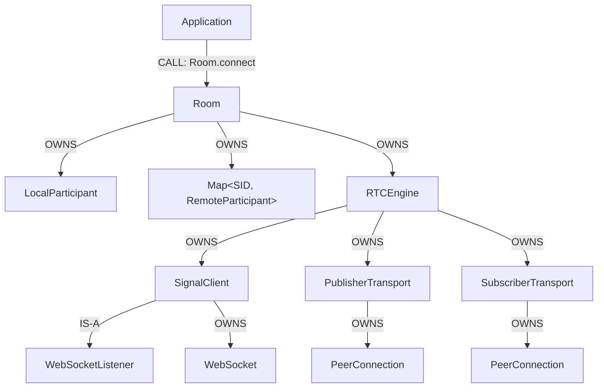
```mermaid
flowchart TD
    App[Application]
    Room[Room]
    LP[LocalParticipant]
    RP[Map&lt;SID, RemoteParticipant&gt;]
    Engine[RTCEngine]
    SC[SignalClient]
    WS[WebSocket]
    PT[PublisherTransport]
    ST[SubscriberTransport]

    App -->|CALL: Room.connect| Room
    Room -->|OWNS| LP
    Room -->|OWNS| RP
    Room -->|OWNS| Engine
    Engine -->|OWNS| SC
    SC -->|IS-A| WebSocketListener
    SC -->|OWNS| WS
    Engine -->|OWNS| PT
    Engine -->|OWNS| ST
    PT -->|OWNS| PeerConnection1[PeerConnection]
    ST -->|OWNS| PeerConnection2[PeerConnection]
```

### 信令平面与媒体平面

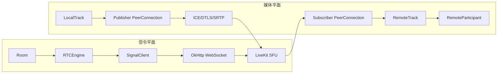
```mermaid
flowchart LR
    subgraph 信令平面
        Room --> RTCEngine --> SignalClient --> OkHttp[OkHttp WebSocket] --> SFU[LiveKit SFU]
    end

    subgraph 媒体平面
        LocalTrack[LocalTrack] --> Publisher[Publisher PeerConnection] --> ICE[ICE/DTLS/SRTP] --> SFU
        SFU --> Subscriber[Subscriber PeerConnection] --> RemoteTrack[RemoteTrack] --> RemoteParticipant[RemoteParticipant]
    end
```

---

## 二、全流程阶段总览

```text
阶段 0   SDK 对象初始化
阶段 1   Application 调用 Room.connect()
阶段 2   SignalClient 建立 WebSocket，并挂起 JOIN 协程
阶段 3   SFU 返回 JoinResponse，恢复 JOIN 协程
阶段 4   Room/RTCEngine 应用 JoinResponse，创建房间和参与者状态
阶段 5   创建 Publisher/Subscriber PeerConnection
阶段 6   WebRTC SDP Offer/Answer 协商
阶段 7   ICE Candidate 交换与连接检查
阶段 8   DTLS 建连与 SRTP 密钥生成
阶段 9   发布本地音视频 Track
阶段 10  订阅并接收远端 Track
阶段 11  RTP/RTCP 媒体持续传输
阶段 12  DataChannel / DataPacket
阶段 13  网络中断与重连
阶段 14  disconnect / leave / 资源释放
```

---

## 三、各阶段详细流程

### 阶段 0：创建 Room

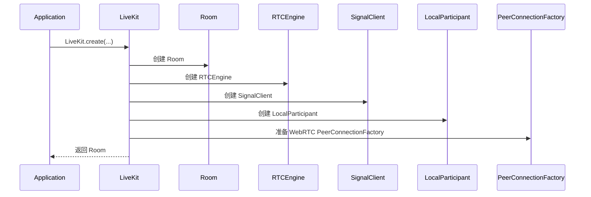
```mermaid
sequenceDiagram
    participant App as Application
    participant LK as LiveKit
    participant Room as Room
    participant Engine as RTCEngine
    participant SC as SignalClient
    participant LP as LocalParticipant
    participant PCF as PeerConnectionFactory

    App->>LK: LiveKit.create(...)
    LK->>Room: 创建 Room
    LK->>Engine: 创建 RTCEngine
    LK->>SC: 创建 SignalClient
    LK->>LP: 创建 LocalParticipant
    LK->>PCF: 准备 WebRTC PeerConnectionFactory
    LK-->>App: 返回 Room
```

此时尚未创建：

- WebSocket
- Publisher PeerConnection
- Subscriber PeerConnection
- 本地音视频采集
- RTP/SRTP 媒体传输

---

### 阶段 1：调用 Room.connect()

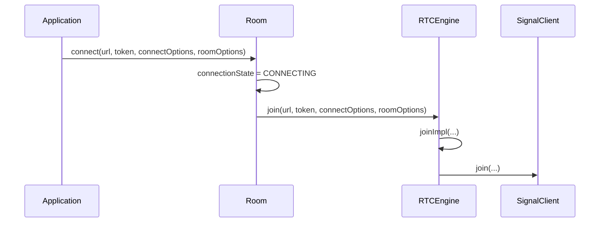
```mermaid
sequenceDiagram
    participant App as Application
    participant Room as Room
    participant Engine as RTCEngine
    participant SC as SignalClient

    App->>Room: connect(url, token, connectOptions, roomOptions)
    Room->>Room: connectionState = CONNECTING
    Room->>Engine: join(url, token, connectOptions, roomOptions)
    Engine->>Engine: joinImpl(...)
    Engine->>SC: join(...)
```

此时调用协程会一直等待到 JOIN 成功、失败、取消或超时。

---

### 阶段 2：建立信令 WebSocket

#### 2.1 SignalClient.join() 调用 connect()

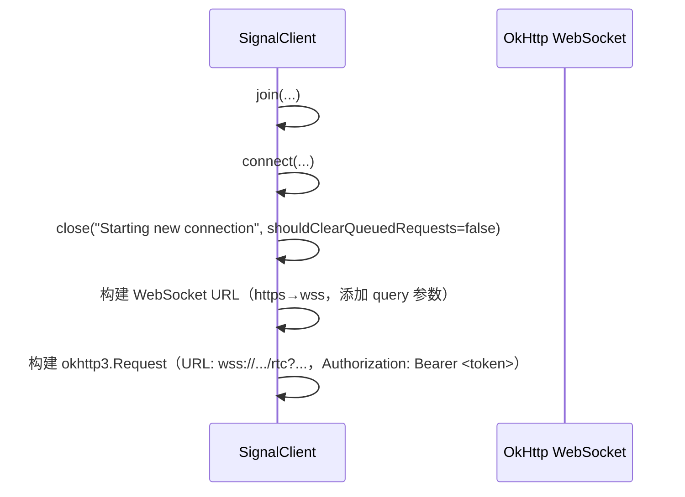
```mermaid
sequenceDiagram
    participant SC as SignalClient
    participant WS as OkHttp WebSocket

    SC->>SC: join(...)
    SC->>SC: connect(...)
    SC->>SC: close("Starting new connection", shouldClearQueuedRequests=false)
    SC->>SC: 构建 WebSocket URL（https→wss，添加 query 参数）
    SC->>SC: 构建 okhttp3.Request（URL: wss://.../rtc?...，Authorization: Bearer <token>）
```

#### 2.2 保存协程 continuation

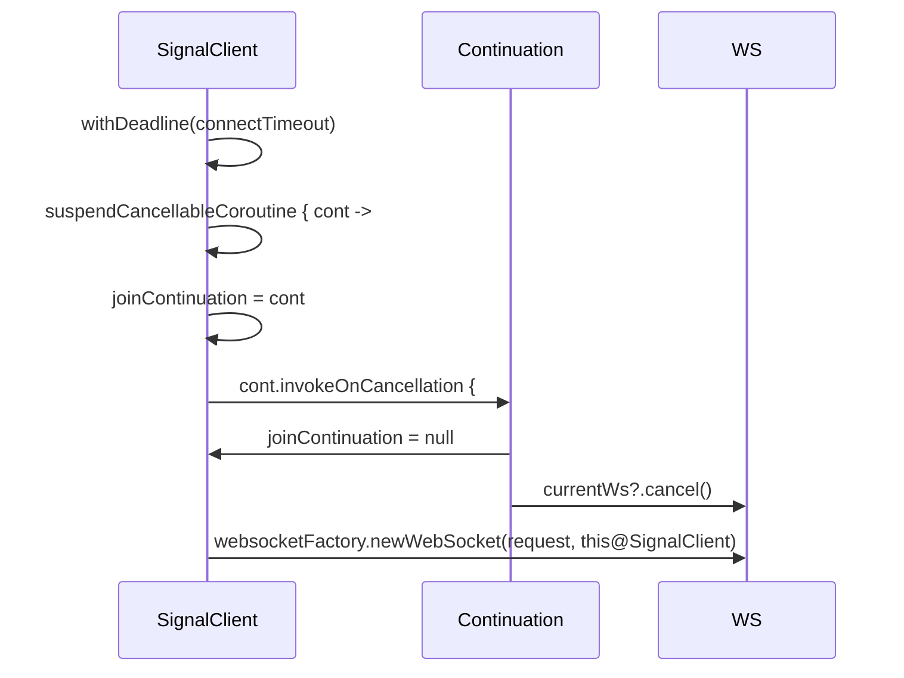
```mermaid
sequenceDiagram
    participant SC as SignalClient
    participant Cont as Continuation

    SC->>SC: withDeadline(connectTimeout)
    SC->>SC: suspendCancellableCoroutine { cont ->
    SC->>SC: joinContinuation = cont
    SC->>Cont: cont.invokeOnCancellation {
    Cont->>SC: joinContinuation = null
    Cont->>WS: currentWs?.cancel()
    SC->>WS: websocketFactory.newWebSocket(request, this@SignalClient)
```

`this@SignalClient` 作为 `WebSocketListener` 注册。

```text
OkHttp WebSocket 异步执行：
├── DNS 解析
├── TCP 连接建立
├── TLS 握手（wss）
└── HTTP WebSocket Upgrade
```

**此时调用协程挂起：**

```text
Room.connect() 协程
  → RTCEngine.join()
    → SignalClient.join()
      → SignalClient.connect()
        → [SUSPEND] ❌
```

线程被释放，WebSocket 网络处理由 OkHttp 异步执行。

> ⚠️ 初始 JOIN **不走** `SignalClient.sendRequest()` / `WebSocket.send()`，JOIN 信息来自 WebSocket Upgrade 请求中的 URL 参数和 Bearer Token。

---

### 阶段 3：接收 JoinResponse

#### 3.1 OkHttp 回调 onMessage()

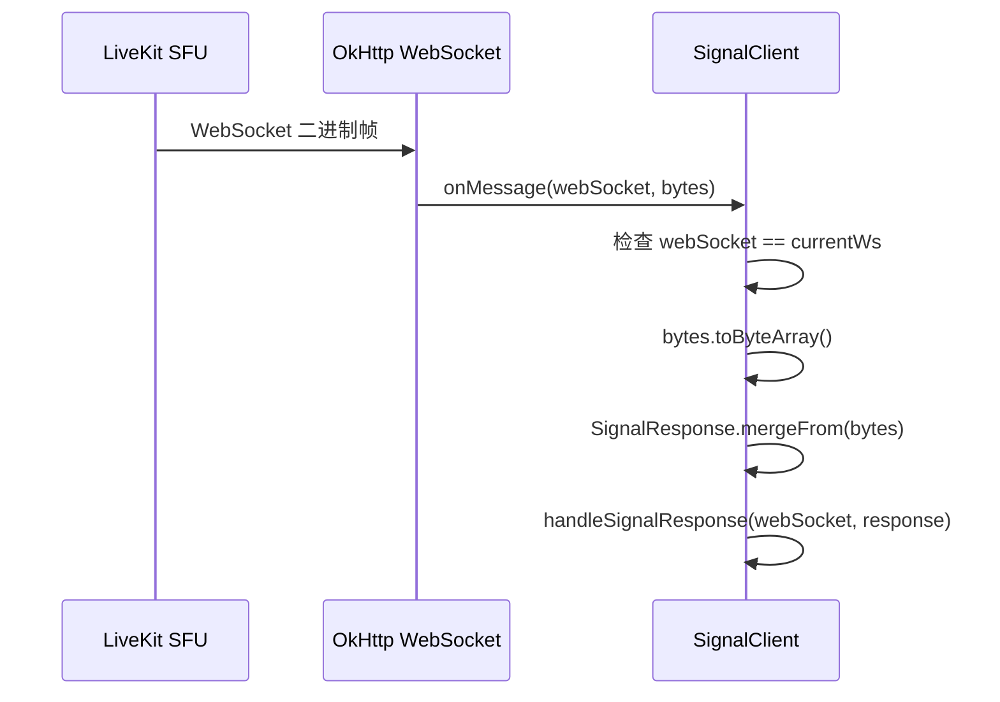
```mermaid
sequenceDiagram
    participant SFU as LiveKit SFU
    participant WS as OkHttp WebSocket
    participant SC as SignalClient

    SFU->>WS: WebSocket 二进制帧
    WS->>SC: onMessage(webSocket, bytes)
    SC->>SC: 检查 webSocket == currentWs
    SC->>SC: bytes.toByteArray()
    SC->>SC: SignalResponse.mergeFrom(bytes)
    SC->>SC: handleSignalResponse(webSocket, response)
```

#### 3.2 JOIN 特殊处理

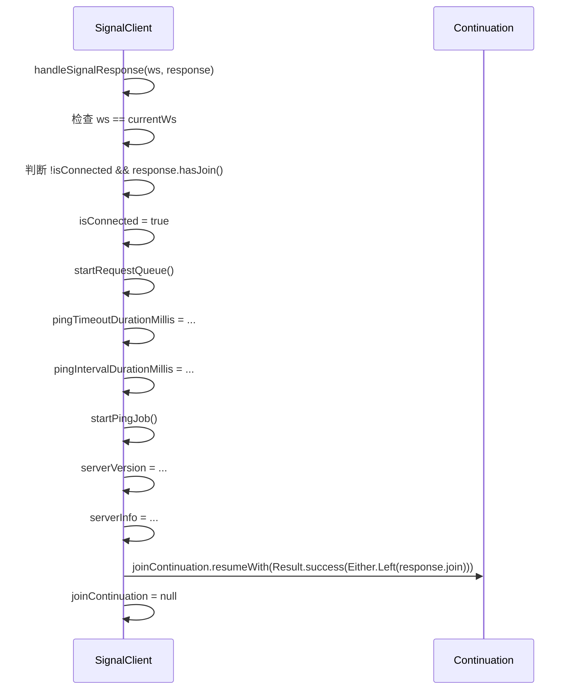
```mermaid
sequenceDiagram
    participant SC as SignalClient
    participant Cont as Continuation

    SC->>SC: handleSignalResponse(ws, response)
    SC->>SC: 检查 ws == currentWs
    SC->>SC: 判断 !isConnected && response.hasJoin()
    SC->>SC: isConnected = true
    SC->>SC: startRequestQueue()
    SC->>SC: pingTimeoutDurationMillis = ...
    SC->>SC: pingIntervalDurationMillis = ...
    SC->>SC: startPingJob()
    SC->>SC: serverVersion = ...
    SC->>SC: serverInfo = ...
    SC->>Cont: joinContinuation.resumeWith(Result.success(Either.Left(response.join)))
    SC->>SC: joinContinuation = null
```

> ⚠️ JOIN 响应**不进入** `responseFlow`。

#### 3.3 原协程恢复

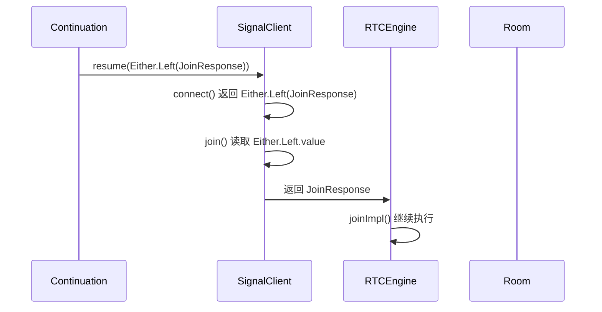
```mermaid
sequenceDiagram
    participant Cont as Continuation
    participant SC as SignalClient
    participant Engine as RTCEngine
    participant Room as Room

    Cont->>SC: resume(Either.Left(JoinResponse))
    SC->>SC: connect() 返回 Either.Left(JoinResponse)
    SC->>SC: join() 读取 Either.Left.value
    SC->>Engine: 返回 JoinResponse
    Engine->>Engine: joinImpl() 继续执行
```

---

### 阶段 4：应用 JoinResponse

`JoinResponse` 包含：

- 本地 ParticipantInfo
- Room 信息
- 其他远端参与者列表
- 服务器版本和能力
- Subscriber Primary 配置
- ICE Server / TURN 配置
- ClientConfiguration
- Ping 参数
- 服务端支持的 Codec / 功能

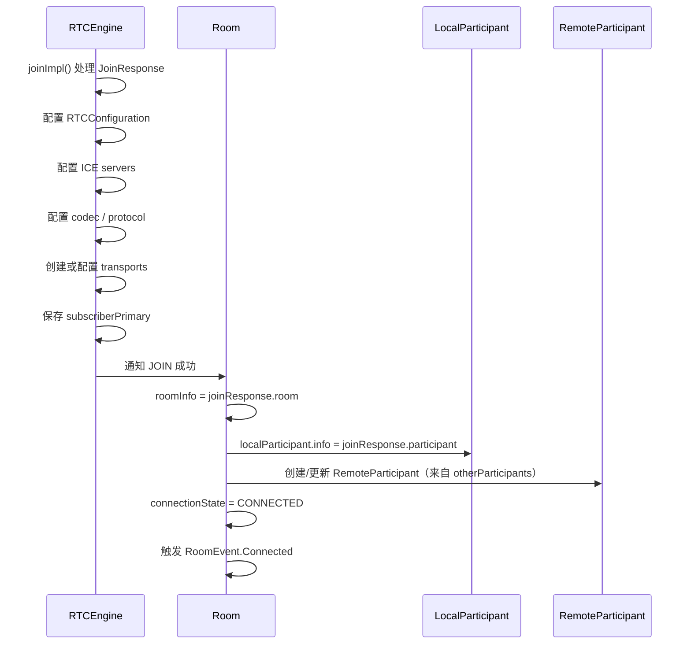
```mermaid
sequenceDiagram
    participant Engine as RTCEngine
    participant Room as Room
    participant LP as LocalParticipant
    participant RP as RemoteParticipant

    Engine->>Engine: joinImpl() 处理 JoinResponse
    Engine->>Engine: 配置 RTCConfiguration
    Engine->>Engine: 配置 ICE servers
    Engine->>Engine: 配置 codec / protocol
    Engine->>Engine: 创建或配置 transports
    Engine->>Engine: 保存 subscriberPrimary
    Engine->>Room: 通知 JOIN 成功

    Room->>Room: roomInfo = joinResponse.room
    Room->>LP: localParticipant.info = joinResponse.participant
    Room->>RP: 创建/更新 RemoteParticipant（来自 otherParticipants）
    Room->>Room: connectionState = CONNECTED
    Room->>Room: 触发 RoomEvent.Connected
```

> ⚠️ `Room.connectionState == CONNECTED` 仅表示信令 JOIN 和房间状态初始化完成，**不等于** Publisher、Subscriber、ICE、DTLS、所有 Track 已完成媒体连接。

---

### 阶段 5：创建两个 PeerConnection

LiveKit 使用两个独立的 WebRTC PeerConnection：

| Transport               | 职责                                              |
| ----------------------- | ----------------------------------------------- |
| **PublisherTransport**  | 上传本地 AudioTrack/VideoTrack，发送本地 DataChannel 数据  |
| **SubscriberTransport** | 接收远端 AudioTrack/VideoTrack，接收服务端 DataChannel 数据 |

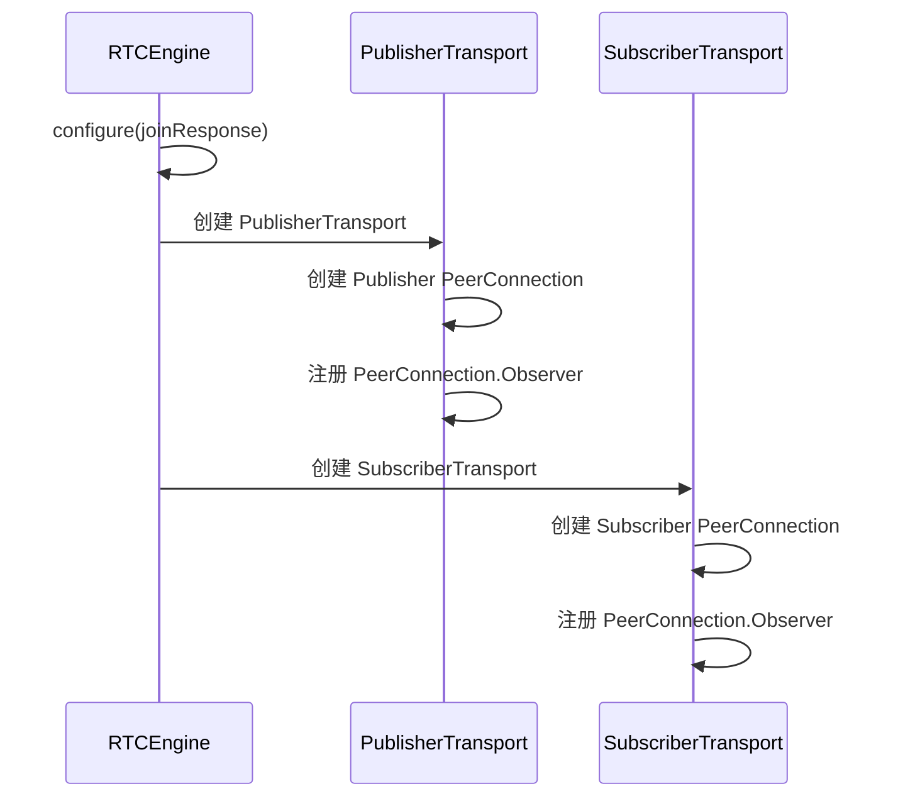
```mermaid
sequenceDiagram
    participant Engine as RTCEngine
    participant PT as PublisherTransport
    participant ST as SubscriberTransport

    Engine->>Engine: configure(joinResponse)
    Engine->>PT: 创建 PublisherTransport
    PT->>PT: 创建 Publisher PeerConnection
    PT->>PT: 注册 PeerConnection.Observer
    Engine->>ST: 创建 SubscriberTransport
    ST->>ST: 创建 Subscriber PeerConnection
    ST->>ST: 注册 PeerConnection.Observer
```

**WebRTC Observer 回调处理：**

```text
PeerConnection.Observer
├── onIceCandidate()
├── onIceConnectionChange()
├── onConnectionChange()
├── onTrack() / onAddTrack()
├── onDataChannel()
└── onRenegotiationNeeded()
```

---

### 阶段 6：SDP Offer/Answer 协商

#### 6.1 Subscriber 协商（SFU 发起 Offer）

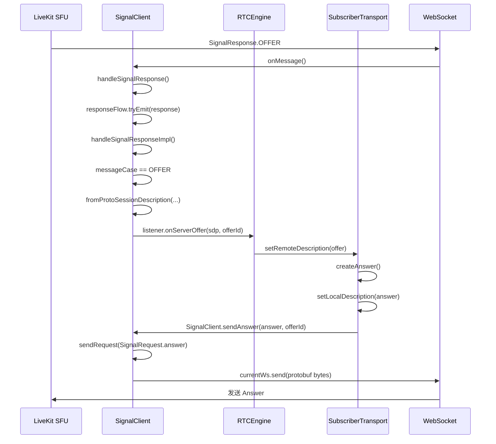
```mermaid
sequenceDiagram
    participant SFU as LiveKit SFU
    participant SC as SignalClient
    participant Engine as RTCEngine
    participant ST as SubscriberTransport
    participant WS as WebSocket

    SFU->>WS: SignalResponse.OFFER
    WS->>SC: onMessage()
    SC->>SC: handleSignalResponse()
    SC->>SC: responseFlow.tryEmit(response)
    SC->>SC: handleSignalResponseImpl()
    SC->>SC: messageCase == OFFER
    SC->>SC: fromProtoSessionDescription(...)
    SC->>Engine: listener.onServerOffer(sdp, offerId)
    Engine->>ST: setRemoteDescription(offer)
    ST->>ST: createAnswer()
    ST->>ST: setLocalDescription(answer)
    ST->>SC: SignalClient.sendAnswer(answer, offerId)
    SC->>SC: sendRequest(SignalRequest.answer)
    SC->>WS: currentWs.send(protobuf bytes)
    WS->>SFU: 发送 Answer
```

#### 6.2 Publisher 协商（客户端发起）

Publisher 协商在**第一次发布 Track** 或需要 **renegotiation** 时触发：

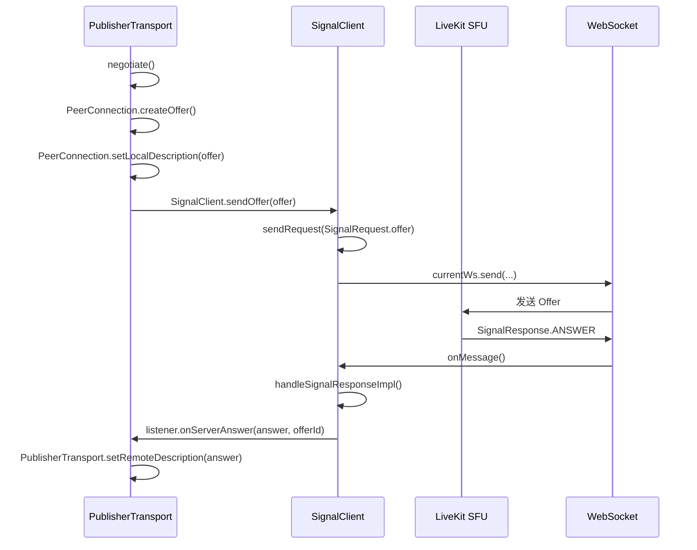
```mermaid
sequenceDiagram
    participant PT as PublisherTransport
    participant SC as SignalClient
    participant SFU as LiveKit SFU
    participant WS as WebSocket

    PT->>PT: negotiate()
    PT->>PT: PeerConnection.createOffer()
    PT->>PT: PeerConnection.setLocalDescription(offer)
    PT->>SC: SignalClient.sendOffer(offer)
    SC->>SC: sendRequest(SignalRequest.offer)
    SC->>WS: currentWs.send(...)
    WS->>SFU: 发送 Offer

    SFU->>WS: SignalResponse.ANSWER
    WS->>SC: onMessage()
    SC->>SC: handleSignalResponseImpl()
    SC->>PT: listener.onServerAnswer(answer, offerId)
    PT->>PT: PublisherTransport.setRemoteDescription(answer)
```

**SDP 协商主要内容：**

```text
├── 媒体方向：sendonly / recvonly / sendrecv
├── 音视频 Codec
├── RTP Header Extension
├── SSRC / MID
├── Simulcast / SVC
├── DataChannel / SCTP
├── DTLS Fingerprint
└── ICE 参数
```

---

### 阶段 7：ICE Candidate 交换

#### 客户端生成 Candidate

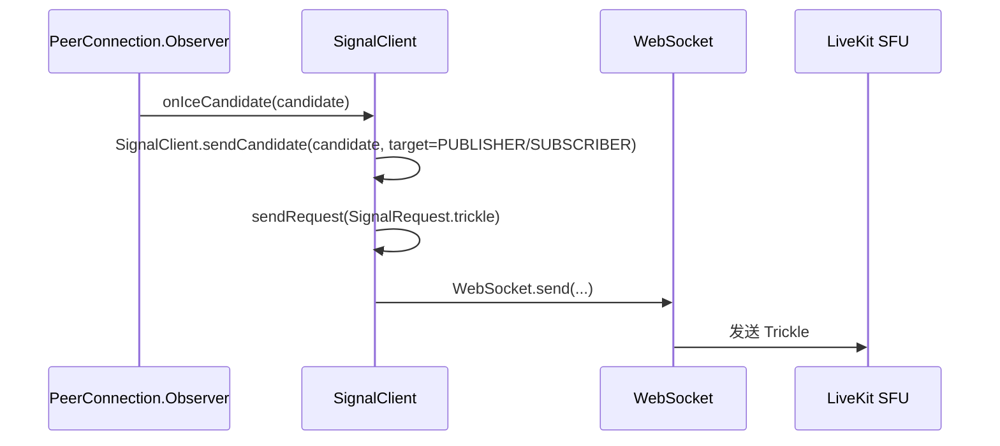
```mermaid
sequenceDiagram
    participant PCO as PeerConnection.Observer
    participant SC as SignalClient
    participant WS as WebSocket
    participant SFU as LiveKit SFU

    PCO->>SC: onIceCandidate(candidate)
    SC->>SC: SignalClient.sendCandidate(candidate, target=PUBLISHER/SUBSCRIBER)
    SC->>SC: sendRequest(SignalRequest.trickle)
    SC->>WS: WebSocket.send(...)
    WS->>SFU: 发送 Trickle
```

#### 服务端返回 Candidate

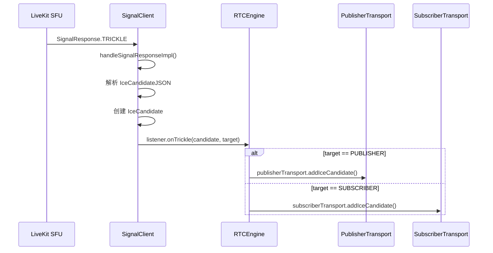
```mermaid
sequenceDiagram
    participant SFU as LiveKit SFU
    participant SC as SignalClient
    participant Engine as RTCEngine
    participant PT as PublisherTransport
    participant ST as SubscriberTransport

    SFU->>SC: SignalResponse.TRICKLE
    SC->>SC: handleSignalResponseImpl()
    SC->>SC: 解析 IceCandidateJSON
    SC->>SC: 创建 IceCandidate
    SC->>Engine: listener.onTrickle(candidate, target)

    alt target == PUBLISHER
        Engine->>PT: publisherTransport.addIceCandidate()
    else target == SUBSCRIBER
        Engine->>ST: subscriberTransport.addIceCandidate()
    end
```

**ICE 状态变化：**

```text
NEW → CHECKING → CONNECTED → COMPLETED
失败时：DISCONNECTED → FAILED
```

**ICE 候选类型：**

```text
├── 设备直连 Candidate（Host）
├── STUN 得到的公网 Candidate（Server Reflexive）
└── TURN Relay Candidate（Relay）
```

---

### 阶段 8：DTLS 与 SRTP

ICE 找到可用路径后，WebRTC 内部继续：

```text
ICE connected
  │
  ▼
DTLS handshake
  │
  ├── 校验 SDP fingerprint
  ├── 协商加密参数
  └── 生成 SRTP 密钥
  │
  ▼
DTLS connected
  │
  ▼
SRTP/SRTCP ready ✅
```

**传输通道区分：**

| 通道 | 协议 | 用途 |
|------|------|------|
| 信令 | WebSocket | SDP / ICE / 控制消息 |
| ICE 连通性检查 | STUN | 网络路径检测 |
| DTLS | UDP/TCP | 加密握手 |
| 音视频 | SRTP/SRTCP | 媒体数据传输 |

---

### 阶段 9：发布本地音视频

以启用麦克风为例：

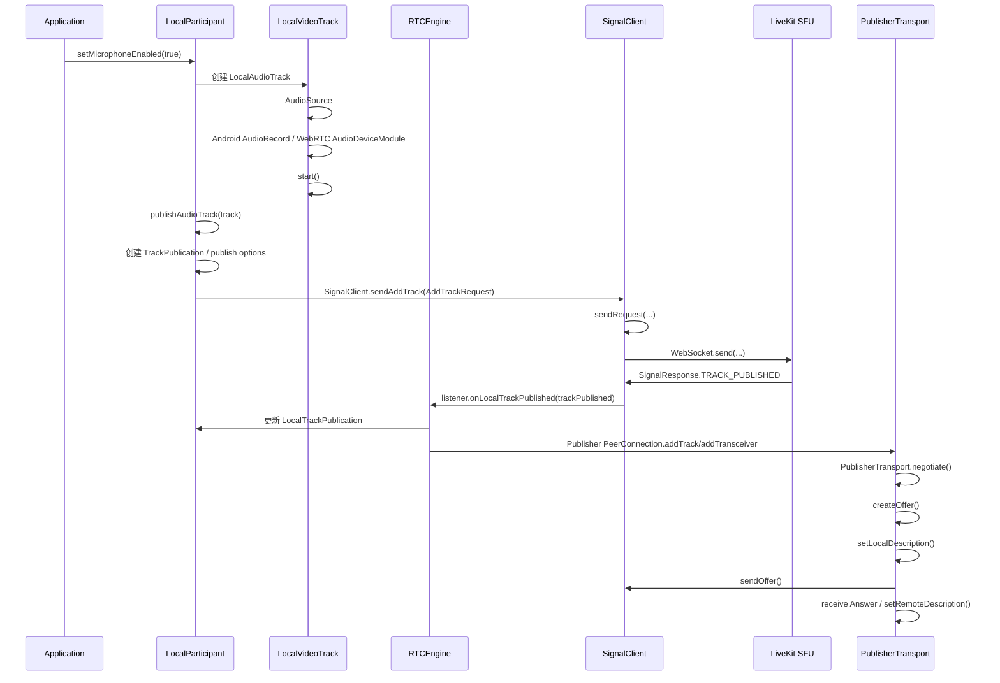
```mermaid
sequenceDiagram
    participant App as Application
    participant LP as LocalParticipant
    participant LVT as LocalVideoTrack
    participant Engine as RTCEngine
    participant SC as SignalClient
    participant SFU as LiveKit SFU
    participant PT as PublisherTransport

    App->>LP: setMicrophoneEnabled(true)
    LP->>LVT: 创建 LocalAudioTrack
    LVT->>LVT: AudioSource
    LVT->>LVT: Android AudioRecord / WebRTC AudioDeviceModule
    LVT->>LVT: start()
    LP->>LP: publishAudioTrack(track)
    LP->>LP: 创建 TrackPublication / publish options
    LP->>SC: SignalClient.sendAddTrack(AddTrackRequest)
    SC->>SC: sendRequest(...)
    SC->>SFU: WebSocket.send(...)

    SFU->>SC: SignalResponse.TRACK_PUBLISHED
    SC->>Engine: listener.onLocalTrackPublished(trackPublished)
    Engine->>LP: 更新 LocalTrackPublication
    Engine->>PT: Publisher PeerConnection.addTrack/addTransceiver
    PT->>PT: PublisherTransport.negotiate()
    PT->>PT: createOffer()
    PT->>PT: setLocalDescription()
    PT->>SC: sendOffer()
    PT->>PT: receive Answer / setRemoteDescription()
```

**视频采集链：**

```text
Camera / ScreenCapturer
  → VideoSource
    → LocalVideoTrack
      → VideoEncoder
        → Publisher PeerConnection
          → SRTP
            → LiveKit SFU
```

> ⚠️ 实际发布顺序可能因 SDK 版本表现为"先 AddTrack 再 addTransceiver/协商"或交错执行，但有两个独立动作：
> 1. **LiveKit 信令层**：AddTrackRequest / TrackPublishedResponse
> 2. **WebRTC 层**：addTrack/addTransceiver + SDP renegotiation

---

### 阶段 10：订阅远端 Track

服务端发送参与者或 Track 信息：

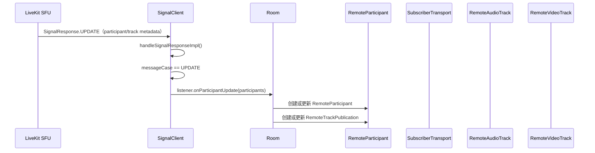
```mermaid
sequenceDiagram
    participant SFU as LiveKit SFU
    participant SC as SignalClient
    participant Room as Room
    participant RP as RemoteParticipant
    participant ST as SubscriberTransport
    participant RAT as RemoteAudioTrack
    participant RVT as RemoteVideoTrack

    SFU->>SC: SignalResponse.UPDATE（participant/track metadata）
    SC->>SC: handleSignalResponseImpl()
    SC->>SC: messageCase == UPDATE
    SC->>Room: listener.onParticipantUpdate(participants)
    Room->>RP: 创建或更新 RemoteParticipant
    Room->>RP: 创建或更新 RemoteTrackPublication
```

**媒体 Track 到达路径：**

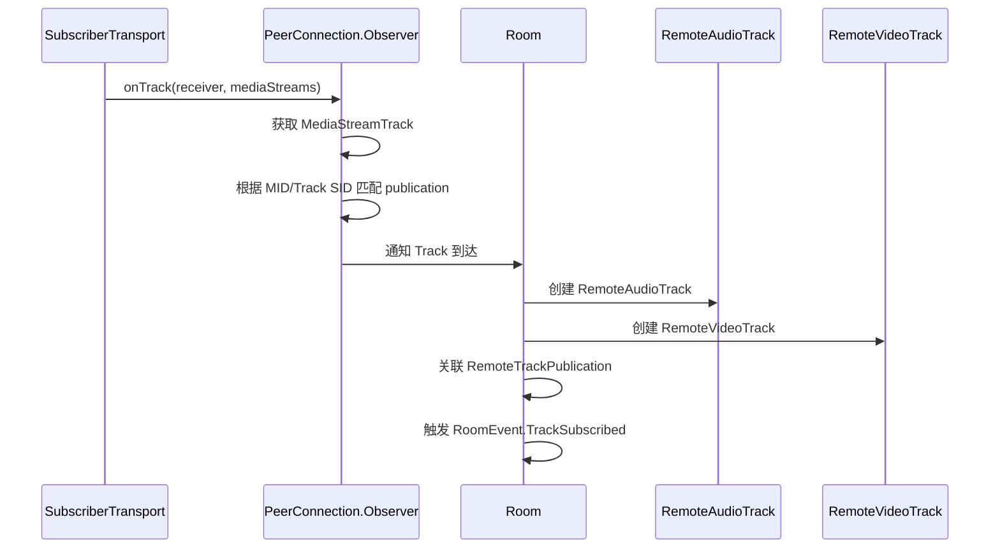
```mermaid
sequenceDiagram
    participant ST as SubscriberTransport
    participant PCO as PeerConnection.Observer
    participant Room as Room
    participant RAT as RemoteAudioTrack
    participant RVT as RemoteVideoTrack

    ST->>PCO: onTrack(receiver, mediaStreams)
    PCO->>PCO: 获取 MediaStreamTrack
    PCO->>PCO: 根据 MID/Track SID 匹配 publication
    PCO->>Room: 通知 Track 到达
    Room->>RAT: 创建 RemoteAudioTrack
    Room->>RVT: 创建 RemoteVideoTrack
    Room->>Room: 关联 RemoteTrackPublication
    Room->>Room: 触发 RoomEvent.TrackSubscribed
```

**渲染路径：**

```text
RemoteVideoTrack
  → addRenderer(VideoSink)
    → SurfaceViewRenderer / Compose Renderer
```

**音频播放路径：**

```text
RemoteAudioTrack
  → WebRTC AudioTrack
    → AudioDeviceModule
      → Android AudioTrack
        → Speaker / Bluetooth / Earpiece
```

---

### 阶段 11：持续媒体传输

```text
【本地上行】
Microphone / Camera
  → Audio/Video Source
    → Encoder
      → RTP packetizer
        → SRTP encryption
          → ICE selected pair
            → UDP/TCP/TURN
              → LiveKit SFU

【远端下行】
LiveKit SFU
  → UDP/TCP/TURN
    → ICE selected pair
      → SRTP decryption
        → RTP depacketizer
          → Jitter Buffer
            → Decoder
              → RemoteAudioTrack / RemoteVideoTrack
                → Speaker / Renderer
```

**RTCP 反向反馈：**

```text
Receiver
  ├── RTCP Receiver Report
  ├── NACK
  ├── PLI/FIR
  └── Transport-CC
    │
    ▼
Sender / SFU
  ├── 重传
  ├── 请求关键帧
  ├── 调整码率
  └── 切换 Simulcast/SVC Layer
```

> ⚠️ WebSocket 此时主要承载控制信令，**不承载**音视频 RTP。

---

### 阶段 12：DataChannel 与数据消息

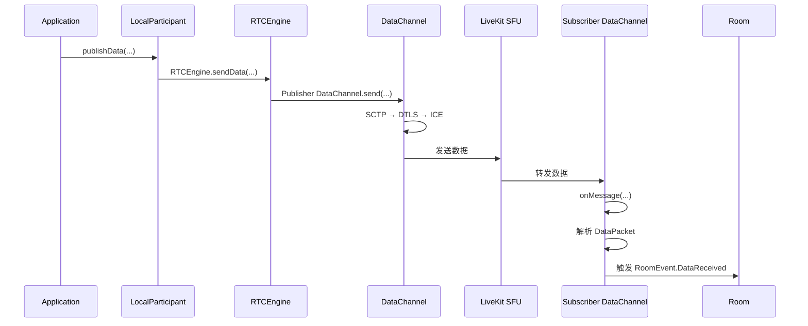
```mermaid
sequenceDiagram
    participant App as Application
    participant LP as LocalParticipant
    participant Engine as RTCEngine
    participant DC as DataChannel
    participant SFU as LiveKit SFU
    participant SubDC as Subscriber DataChannel
    participant Room as Room

    App->>LP: publishData(...)
    LP->>Engine: RTCEngine.sendData(...)
    Engine->>DC: Publisher DataChannel.send(...)
    DC->>DC: SCTP → DTLS → ICE
    DC->>SFU: 发送数据

    SFU->>SubDC: 转发数据
    SubDC->>SubDC: onMessage(...)
    SubDC->>SubDC: 解析 DataPacket
    SubDC->>Room: 触发 RoomEvent.DataReceived
```

**通道区分：**

| 通道                     | 用途                                                |
| ---------------------- | ------------------------------------------------- |
| SignalClient WebSocket | Join、Offer、Answer、Trickle、ParticipantUpdate 等控制信令 |
| WebRTC DataChannel     | 用户数据、文本、部分 RPC/DataPacket                         |
| SRTP                   | 音视频媒体                                             |
|                        |                                                   |

---

### 阶段 13：信令消息统一入口

JOIN 之后的服务端信令统一经过：

```mermaid
flowchart TD
    OK[OkHttp] --> SC[SignalClient.onMessage(bytes)]
    SC --> PB[protobuf → SignalResponse]
    PB --> HSR[handleSignalResponse]
    HSR -->|已连接| RF[responseFlow.tryEmit]
    RF --> Consumer[responseFlow consumer]
    Consumer --> HSI[handleSignalResponseImpl]

    HSI -->|ANSWER| OSA[onServerAnswer]
    HSI -->|OFFER| OSO[onServerOffer]
    HSI -->|TRICKLE| OT[onTrickle]
    HSI -->|UPDATE| OPU[onParticipantUpdate]
    HSI -->|TRACK_PUBLISHED| OTP
    HSI -->|TRACK_UNPUBLISHED| OTU
    HSI -->|TRACK_SUBSCRIBED| OTS
    HSI -->|SPEAKERS_CHANGED| OSC
    HSI -->|ROOM_UPDATE| ORU
    HSI -->|CONNECTION_QUALITY| OCQ
    HSI -->|STREAM_STATE_UPDATE| OSS
    HSI -->|LEAVE| OL
    HSI -->|PONG/PONG_RESP| OP
```

> ⚠️ `responseFlow consumer → handleSignalResponseImpl()` 的具体启动函数，应以 `responseFlow.collect` 的源码位置补全。

---

### 阶段 14：网络中断与重连

#### 信令 WebSocket 中断

```mermaid
sequenceDiagram
    participant WS as OkHttp WebSocket
    participant SC as SignalClient
    participant Room as Room

    WS->>SC: onFailure(...) / onClosed(...)
    SC->>SC: isConnected = false
    SC->>Room: Room.connectionState = RECONNECTING
    SC->>SC: 判断 resume reconnect 或 full reconnect
```

#### Resume Reconnect

```mermaid
sequenceDiagram
    participant SC as SignalClient

    SC->>SC: reconnect(...)
    SC->>SC: options.reconnect = true
    SC->>SC: options.participantSid = localParticipantSid
    SC->>SC: connect(...)
    SC->>SC: 创建新 WebSocket
    SC->>SC: 保存 joinContinuation
    SC->>SC: 协程挂起
```

**收到重连响应：**

```text
handleSignalResponse()
  │
  ├── !isConnected && isReconnecting
  │     │
  │     ├── isReconnecting = false
  │     ├── isConnected = true
  │     ├── startPingJob()
  │     │
  │     ├── response.hasReconnect()
  │     │     └── resume(Either.Right(Either.Left(response.reconnect)))
  │     │
  │     └── 旧服务端没有 ReconnectResponse
  │           └── resume(Either.Right(Either.Right(Unit)))
```

#### Full Reconnect

Resume 失败时通常需要：

```text
1. 关闭旧 WebSocket
2. 关闭或重建 PeerConnection
3. 重新 JOIN
4. 重新应用 JoinResponse
5. 重新同步 Participant/Track 状态
6. 重新发布本地 Track
7. 重新建立订阅 SDP
8. 重新交换 ICE
9. 恢复媒体
```

**最终：**

```text
Room.connectionState: RECONNECTING → CONNECTED
触发：RoomEvent.Reconnected
```

---

### 阶段 15：断开与资源释放

```mermaid
sequenceDiagram
    participant App as Application
    participant Room as Room
    participant SC as SignalClient
    participant PT as PublisherTransport
    participant ST as SubscriberTransport
    participant LP as LocalParticipant
    participant RP as RemoteParticipant

    App->>Room: disconnect()
    Room->>SC: sendLeave(...) [连接可用时]
    Room->>SC: currentWs.close() / cancel()
    Room->>Room: 停止 ping job
    Room->>Room: 停止 request queue
    Room->>PT: PublisherTransport.close()
    Room->>ST: SubscriberTransport.close()
    Room->>LP: LocalTrack.stop()
    Room->>RP: RemoteTrack.detach() / dispose()
    Room->>Room: 清空 participants / publications
    Room->>Room: connectionState = DISCONNECTED
    Room->>Room: 触发 RoomEvent.Disconnected
```

---

## 四、端到端主链总览

```mermaid
flowchart TD
    A[Application] --> B[Room.connect]
    B --> C[RTCEngine.join]
    C --> D[SignalClient.join]
    D --> E[SignalClient.connect]
    E --> F[OkHttp.newWebSocket]
    F --> G[connect 协程挂起]

    G --> H[SFU WebSocket JoinResponse]
    H --> I[SignalClient.onMessage]
    I --> J[handleSignalResponse]
    J --> K[joinContinuation.resumeWith]
    K --> L[connect/join/engine.join 协程恢复]

    L --> M[应用 Room/Participant/Server 配置]
    M --> N[创建 Publisher/Subscriber PeerConnection]
    N --> O[WebSocket 交换 Offer/Answer/ICE Candidate]
    O --> P[ICE connected]
    P --> Q[DTLS connected]
    Q --> R[SRTP ready]

    R --> S[LocalParticipant 发布 Track]
    S --> T[Publisher 上传 RTP 到 SFU]
    T --> U[Subscriber 从 SFU 接收 RTP]
    U --> V[RemoteTrack 绑定 RemoteParticipant]
    V --> W[Renderer/Speaker 输出]
```

---

## 五、关键边界总结

| 阶段 | 协议 | 说明 |
|------|------|------|
| 初始 JOIN | HTTP WebSocket Upgrade + onMessage + continuation | 信令建立 |
| 后续控制信令 | SignalRequest/SignalResponse + WebSocket.send/onMessage | 信令交互 |
| WebRTC 协商 | SDP Offer/Answer + ICE Candidate | 媒体协商 |
| 媒体连接 | ICE + DTLS + SRTP | 传输建立 |
| 音视频数据 | RTP/RTCP | **不经过** WebSocket |
| 用户数据 | WebRTC DataChannel/SCTP | **不等于** SignalClient WebSocket |

---

> 📌 **说明**：要把这张架构图进一步升级为 **2.62.1 完全源码级调用图**，还需要对应版本的 `Room.connect()`、`RTCEngine.joinImpl/configure`、`startRequestQueue()`、`responseFlow.collect`、`PeerConnectionTransport` 和 `LocalParticipant.publishTrack()` 源码，届时可以把每一条边落实到精确函数名，而不再使用架构级名称。