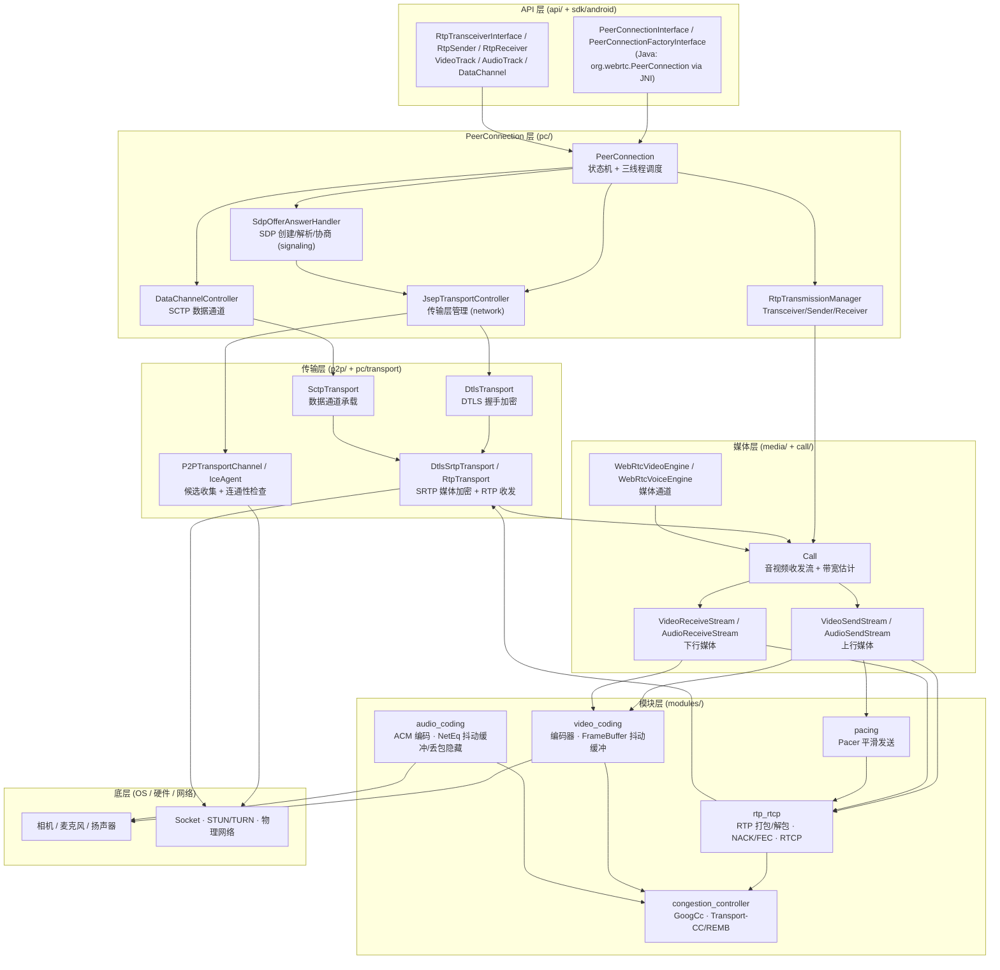
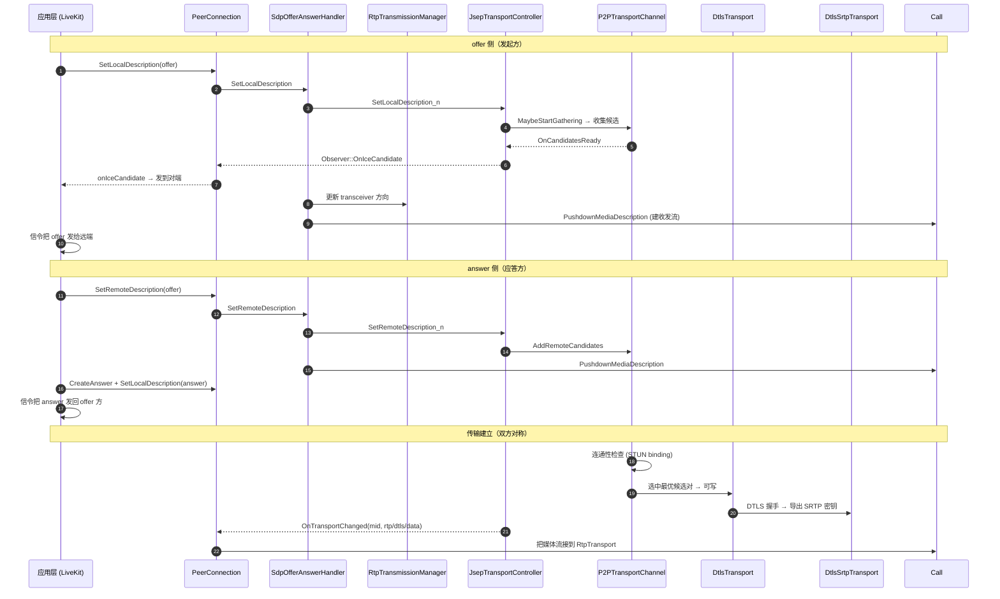
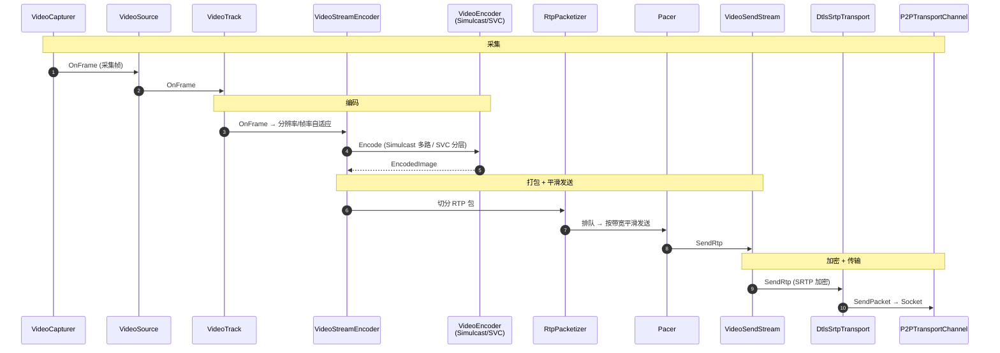
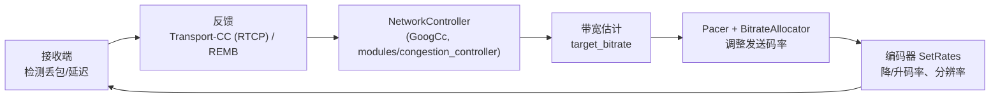
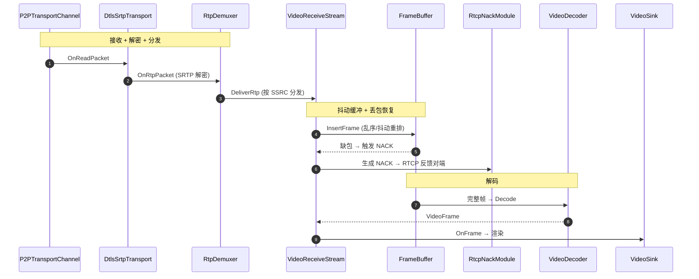
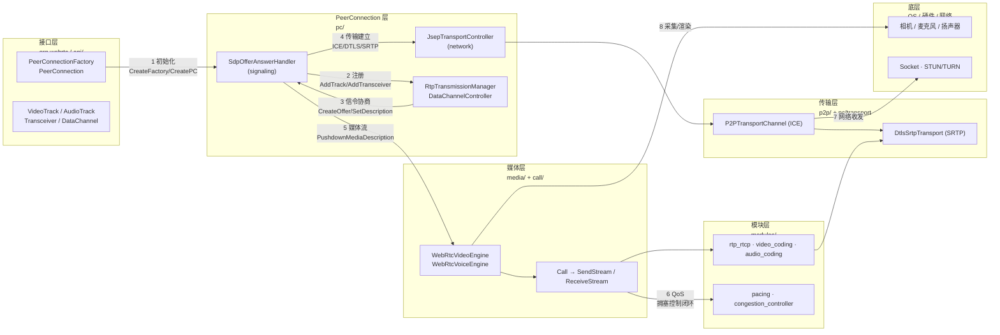
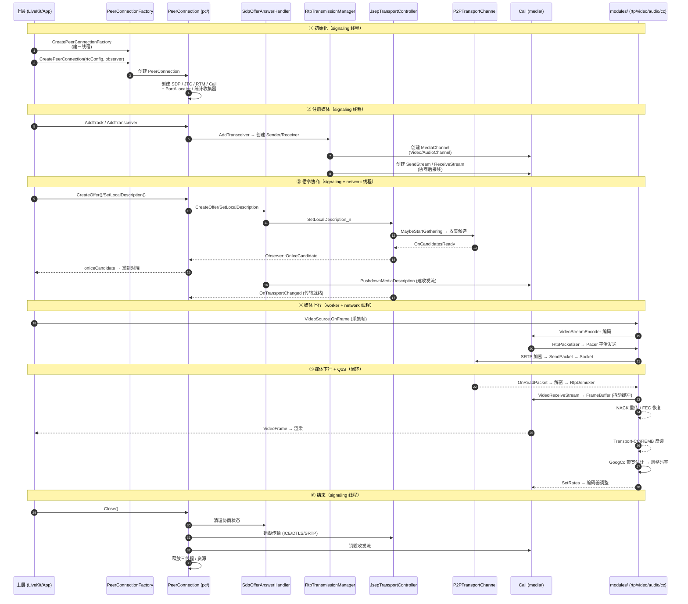

## 目录

- [第 0 章 文档说明与阅读指引](#第-0-章-文档说明与阅读指引)
  - [0.1 本文档要回答什么问题](#01-本文档要回答什么问题)
  - [0.2 阅读方法](#02-阅读方法)
  - [0.3 术语表](#03-术语表)
  - [0.4 源码目录索引](#04-源码目录索引)
  - [0.5 三张图的位置](#05-三张图的位置)
- [第 1 章 WebRTC 总体架构与分层框架图（图 1）](#第-1-章-webrtc-总体架构与分层框架图图-1)
  - [1.1 WebRTC 三线程模型](#11-webrtc-三线程模型)
  - [1.2 分层框架图（图 1）](#12-分层框架图图-1)
  - [1.3 各层职责与关键类](#13-各层职责与关键类)
- [第 2 章 PeerConnection 与信令协商（重点）](#第-2-章-peerconnection-与信令协商重点)
  - [2.1 PeerConnection 的组件与状态机](#21-peerconnection-的组件与状态机)
  - [2.2 SdpOfferAnswerHandler：SDP 协商的枢纽](#22-sdpofferanswerhandler-sdp-协商的枢纽)
  - [2.3 JSEP 协商：offer/answer 如何驱动传输层](#23-jsep-协商-offeranswer-如何驱动传输层)
  - [2.4 Transceiver / Sender / Receiver 与媒体接线](#24-transceiver--sender--receiver-与媒体接线)
  - [2.5 DataChannel（SCTP）](#25-datachannelsctp)
  - [2.6 Observer 回调链（底层 → 上层）](#26-observer-回调链底层--上层)
  - [2.7 协商细节与信令链路详细梳理](#27-协商细节与信令链路详细梳理)
- [第 3 章 ICE 与传输（p2p）](#第-3-章-ice-与传输p2p)
  - [3.1 ICE 整体流程](#31-ice-整体流程)
  - [3.2 P2PTransportChannel 的职责](#32-p2ptransportchannel-的职责)
  - [3.3 候选收集与连通性检查](#33-候选收集与连通性检查)
  - [3.4 DTLS / SRTP 建立](#34-dtls--srtp-建立)
  - [3.5 传输层如何承载 RTP](#35-传输层如何承载-rtp)
  - [3.6 ICE 状态与候选对详细梳理](#36-ice-状态与候选对详细梳理)
- [第 4 章 媒体上行路径（采集 → 编码 → RTP 发送）](#第-4-章-媒体上行路径采集--编码--rtp-发送)
  - [4.1 视频上行调用链](#41-视频上行调用链)
  - [4.2 关键组件](#42-关键组件)
  - [4.3 码率分配与编码器码率控制](#43-码率分配与编码器码率控制)
  - [4.4 音频上行](#44-音频上行)
  - [4.5 上行小结](#45-上行小结)
  - [4.6 上行媒体链路详细梳理（步骤表）](#46-上行媒体链路详细梳理步骤表)
  - [4.7 上行媒体链路时序图（视频）](#47-上行媒体链路时序图视频)
- [第 5 章 媒体下行路径 + QoS（重点）](#第-5-章-媒体下行路径--qos重点)
  - [5.1 视频下行调用链](#51-视频下行调用链)
  - [5.2 关键组件](#52-关键组件)
  - [5.3 音频下行（NetEq）](#53-音频下行neteq)
  - [5.4 QoS：拥塞控制闭环](#54-qos拥塞控制闭环)
  - [5.5 QoS 小结](#55-qos-小结)
  - [5.6 下行媒体链路详细梳理（步骤表）](#56-下行媒体链路详细梳理步骤表)
  - [5.7 下行媒体链路时序图（视频）](#57-下行媒体链路时序图视频)
- [第 6 章 Android 封装与 JNI（sdk/android）](#第-6-章-android-封装与-jnisdkandroid)
  - [6.1 Java 层 ↔ 原生 C++ 的映射](#61-java-层--原生-c-的映射)
  - [6.2 JNI 桥接机制](#62-jni-桥接机制)
  - [6.3 线程与生命周期](#63-线程与生命周期)
  - [6.4 与 LiveKit 的关系](#64-与-livekit-的关系)
- [第 7 章 流程图（图 2 简图 + 图 3 细图）](#第-7-章-流程图图-2-简图--图-3-细图)
  - [7.1 宏观简图（图 2）](#71-宏观简图图-2)
  - [7.2 微观细图（图 3）](#72-微观细图图-3)
- [第 8 章 附录](#第-8-章-附录)
  - [8.1 关键文件清单](#81-关键文件清单)
  - [8.2 术语对照表](#82-术语对照表)
  - [8.3 参考](#83-参考)

---

# WebRTC m144 原生内部：信令与媒体流程分析

> **文档 B（以 WebRTC 原生为主）**
>
> - 源码：`/data1/luhonghao/codes/adrtc/webrtc/webrtc-m144_release`（即用户 Windows 路径 `F:\codes\adrtc\webrtc\webrtc-m144_release`）
> - 范围：信令协商 + 媒体收发 + QoS 相关的核心模块
> - 目标读者：有 C/C++ 经验、对 Android/Kotlin 与 WebRTC 不熟悉的开发者
> - 日期：2026-09-02
> - 配套文档：`wrt-sig-analysis-0902.md`（文档 A，以 LiveKit 为主）

---

## 第 0 章 文档说明与阅读指引

### 0.1 本文档要回答什么问题

文档 A 从 **LiveKit SDK** 的角度讲了「如何用 WebRTC」。本文档则下沉到 **WebRTC 原生 C++ 实现**，回答 WebRTC 内部到底怎么工作：

1. **PeerConnection 如何组织**：三线程模型、状态机、内部组件（SdpOfferAnswerHandler / JsepTransportController / RtpTransmissionManager / Call）。
2. **信令协商如何落地**：SDP offer/answer 如何被解析、如何驱动传输层（ICE/DTLS/SRTP）。
3. **媒体如何收发**：上行「采集→编码→RTP 发送」与下行「RTP 接收→抖动缓冲→解码→渲染」。
4. **QoS 如何闭环**：NACK/FEC、抖动缓冲、拥塞控制（Transport-CC/REMB、GoogCc）。
5. **Android 如何接入**：`org.webrtc` Java 封装与 JNI 桥接。

### 0.2 阅读方法

- **先看图，再看文字**：第 1 章分层框架图（图 1）、第 7 章简图（图 2）与细图（图 3）。
- **跟着调用链走**：第 2~6 章按「PC 与信令 → ICE/传输 → 媒体上行 → 媒体下行+QoS → Android 封装」展开。
- **对照源码**：文中所有类名/方法名可对照 `webrtc-m144_release/` 下的源码。

### 0.3 术语表

| 术语 | 含义 |
|------|------|
| **PeerConnection (PC)** | WebRTC 连接对象，一个 PC 对应一个 `Call` |
| **SdpOfferAnswerHandler** | 处理 SDP 创建/解析/协商的组件（signaling 线程） |
| **JsepTransportController** | 管理传输层（ICE/DTLS/SRTP）的组件（network 线程） |
| **RtpTransmissionManager** | 管理 Transceiver/Sender/Receiver 的组件 |
| **Call** | 媒体会话，管理所有音视频收发流与带宽估计 |
| **Transceiver** | 一对 sender/receiver，对应一个 m-line |
| **JSEP** | JavaScript Session Establishment Protocol，SDP 协商规范 |
| **ICE / DTLS / SRTP** | 连接建立 / 传输加密 / 媒体加密 |
| **RTP / RTCP** | 实时传输协议 / 实时传输控制协议 |
| **Simulcast / SVC** | 多分辨率联播 / 可分层编码 |
| **NACK / FEC** | 丢包重传 / 前向纠错 |
| **Jitter Buffer** | 抖动缓冲（视频 FrameBuffer / 音频 NetEq） |
| **Transport-CC / REMB / GoogCc** | 拥塞控制反馈与算法 |

### 0.4 源码目录索引

| 目录 | 职责 |
|------|------|
| `api/` | 对外接口（PeerConnectionInterface 等） |
| `pc/` | PeerConnection、SDP、传输控制器、DataChannel |
| `p2p/` | ICE（PortAllocator、P2PTransportChannel、DTLS） |
| `media/` | 媒体引擎（WebRtcVideoEngine / WebRtcVoiceEngine） |
| `call/` | 媒体会话（Call、VideoSendStream、VideoReceiveStream） |
| `modules/` | RTP/RTCP、编码、抖动缓冲、拥塞控制 |
| `sdk/android/` | Android Java 封装 + JNI |

### 0.5 三张图的位置

- **图 1（分层框架图）**：第 1 章 *1.2 节*
- **图 2（宏观流程图·简图）**：第 7 章 *7.1 节*
- **图 3（微观流程图·细图）**：第 7 章 *7.2 节*

---

## 第 1 章 WebRTC 总体架构与分层框架图（图 1）

### 1.1 WebRTC 三线程模型

WebRTC 原生层用**三个线程**隔离不同职责（`pc/peer_connection.h` 中 `context_` 持有三个线程）：

| 线程 | 职责 | 关键对象 |
|------|------|---------|
| **signaling_thread** | SDP 协商、状态机、API 调用入口 | `SdpOfferAnswerHandler` |
| **worker_thread** | 媒体处理：编码/解码、音频处理 | `Call`、媒体引擎 |
| **network_thread** | 网络收发：ICE、DTLS、RTP 收发 | `JsepTransportController`、`P2PTransportChannel` |

> 跨线程调用通过 `Proxy` 机制（`pc/peer_connection_proxy.h`）或 `Invoke` 阻塞调用完成。例如 `SetLocalDescription` 在 signaling 线程调用，但会通过阻塞调用把传输层动作派发到 network 线程（`JsepTransportController::SetLocalDescription_n`，`_n` 后缀表示 network 线程执行）。

### 1.2 分层框架图（图 1）



### 1.3 各层职责与关键类

| 层 | 关键类 | 职责 |
|----|--------|------|
| **API 层** | `PeerConnectionInterface`, `org.webrtc.PeerConnection` | 对外接口 + Android JNI 封装 |
| **PC 层** | `PeerConnection`, `SdpOfferAnswerHandler`, `JsepTransportController` | 状态机、协商、传输编排 |
| **传输层** | `P2PTransportChannel`, `DtlsSrtpTransport`, `SctpTransport` | ICE/DTLS/SRTP/数据通道 |
| **媒体层** | `Call`, `WebRtcVideoEngine`, `VideoSendStream` | 媒体会话与流管理 |
| **模块层** | `rtp_rtcp`, `video_coding`, `audio_coding`, `pacing`, `congestion_controller` | RTP、编码、缓冲、拥塞控制 |
| **底层** | Android 音视频、Socket、STUN/TURN | 采集、渲染、传输 |

---

## 第 2 章 PeerConnection 与信令协商（重点）

### 2.1 `PeerConnection` 的组件与状态机

`PeerConnection`（`pc/peer_connection.h`）实现 `PeerConnectionInternal` 与 `JsepTransportController::Observer`，它**拥有**以下核心组件：

| 成员 | 类型 | 职责 |
|------|------|------|
| `sdp_handler_` | `SdpOfferAnswerHandler` | SDP 协商（signaling 线程） |
| `transport_controller_` | `JsepTransportController` | 传输层（network 线程） |
| `rtp_manager_` | `RtpTransmissionManager` | Transceiver/Sender/Receiver |
| `data_channel_controller_` | `DataChannelController` | SCTP 数据通道 |
| `call_` | `Call` | 媒体会话 |
| `port_allocator_` | `PortAllocator` | ICE 候选收集 |
| `rtc_stats_collector_` | `RTCStatsCollector` | 统计 |

**三线程**：`context_->signaling_thread()` / `network_thread()` / `worker_thread()`。

**状态机**（JSEP 定义的 `SignalingState`）：

```
New ──CreateOffer──▶ HaveLocalOffer ──SetRemote(answer)──▶ Stable
  │                      │                                    │
  └──SetRemote(offer)──▶ HaveRemoteOffer ◀──CreateAnswer──────┘
                              │
                              └─▶ SetLocal(answer) ─▶ Stable
```

`PeerConnection` 的关键 API（`pc/peer_connection.h`）：
- `AddTrack` / `AddTransceiver` → `rtp_manager_` 创建 sender/receiver。
- `CreateOffer` / `CreateAnswer` / `SetLocalDescription` / `SetRemoteDescription` → `sdp_handler_`。
- `AddIceCandidate` → `sdp_handler_` → `transport_controller_`。
- `CreateDataChannelOrError` → `data_channel_controller_`。
- `Close` → 清理所有组件。

### 2.2 `SdpOfferAnswerHandler`：SDP 协商的枢纽

`SdpOfferAnswerHandler`（`pc/sdp_offer_answer.h`）**活在 signaling 线程**，是 SDP 协商的核心。它通过 `operations_chain_` 把协商操作**串行化**（避免并发 SetDescription 冲突）。

关键方法：

| 方法 | 作用 |
|------|------|
| `CreateOffer` / `CreateAnswer` | 生成 SDP（从 transceiver 状态构建 m-line） |
| `SetLocalDescription` / `SetRemoteDescription` | 应用 SDP，驱动状态机 |
| `AddIceCandidate` | 添加远端 ICE 候选 |
| `PushdownMediaDescription` | 把 SDP 的媒体描述推给媒体层（`Call`） |
| `PushdownTransportDescription` | 把 SDP 的传输描述推给传输层（`JsepTransportController`） |
| `CreateChannels` | 创建媒体通道（`WebRtcVideoChannel` / `WebRtcVoiceChannel`） |
| `UpdateTransceiversAndDataChannels` | 同步 transceiver 与数据通道状态 |

**协商流程**（`SetRemoteDescription` 内部）：
1. 解析远端 SDP（`SessionDescription`）。
2. 更新 transceiver 状态（`UpdateTransceiversAndDataChannels`）。
3. `PushdownMediaDescription`：把 m-line 的 codec/SSRC/方向推给 `Call` 的收发流。
4. `PushdownTransportDescription`：把 ICE/DTLS 参数推给 `JsepTransportController`，触发传输层创建。

### 2.3 JSEP 协商：offer/answer 如何驱动传输层

当 `SetLocalDescription` / `SetRemoteDescription` 被调用时，`SdpOfferAnswerHandler` 会调用 `JsepTransportController::SetLocalDescription/SetRemoteDescription`（`pc/jsep_transport_controller.h:185`）。

`JsepTransportController` 的核心逻辑（**network 线程**执行，`_n` 后缀）：

```
SetLocalDescription_n / SetRemoteDescription_n
  → ApplyDescription_n(local, type, local_desc, remote_desc)
      → MaybeCreateJsepTransport(local, content_info, description)  // 按 m-line 创建传输
      → HandleBundledContent / HandleRejectedContent              // BUNDLE / 拒绝处理
      → ValidateAndMaybeUpdateBundleGroups                          // BUNDLE 组校验
```

`MaybeCreateJsepTransport` 按每个 m-line 创建 `JsepTransport`，内部包含：
- `CreateIceTransport`：创建 `P2PTransportChannel`（ICE）。
- `CreateDtlsTransport`：创建 `DtlsTransport`。
- `CreateDtlsSrtpTransport` / `CreateRtpTransport`：创建媒体传输（SRTP 加密 + RTP 收发）。

`JsepTransportController` 还负责：
- **BUNDLE**：把多个 m-line 复用同一条传输（`BundleManager`）。
- **ICE 角色**：`DetermineIceRole`（controlling/controlled）。
- **候选收集与连通性**：`MaybeStartGathering`、`AddRemoteCandidates`。
- **状态聚合**：把多个传输的状态聚合成 `IceConnectionState` / `PeerConnectionState`。

> **Observer 回调**：`JsepTransportController::Observer`（即 `PeerConnection`）通过 `OnTransportChanged(mid, rtp_transport, dtls_transport, data_channel_transport)` 得知某个 m-line 的传输就绪，从而把媒体流接到正确的传输上。

### 2.4 Transceiver / Sender / Receiver 与媒体接线

`RtpTransceiver`（`pc/rtp_transceiver.h`）是**媒体协商的最小单元**，对应一个 m-line。它包含一对：

- **`RtpSender`**（`pc/rtp_sender.h`）：发送方向。持有 `VideoTrack`/`AudioTrack`（媒体源）与编码参数（`RtpParameters`，含 encodings/simulcast）。
- **`RtpReceiver`**（`pc/rtp_receiver.h`）：接收方向。持有 `MediaStreamTrack`（解码输出）与解码参数。

`AddTransceiver` 的接线流程：

```
PeerConnection::AddTransceiver
  → RtpTransmissionManager::AddTransceiver
      → 创建 RtpSender / RtpReceiver
      → 创建 MediaChannel（WebRtcVideoChannel / WebRtcVoiceChannel）
      → 创建 Call 的 VideoSendStream / VideoReceiveStream（协商后）
      → 把 sender 的 track 接到 VideoSendStream 的编码器
      → 把 receiver 接到 VideoReceiveStream 的解码输出
```

**媒体源 → 编码器**：`VideoTrack` 的 `VideoSource` 把采集帧交给 `VideoStreamEncoder`（`modules/video_coding`），编码后由 `VideoSendStream` 通过 RTP 发送。

### 2.5 DataChannel（SCTP）

`DataChannelController`（`pc/data_channel_controller.h`）管理基于 **SCTP** 的数据通道：

- `CreateDataChannel` → `SctpDataChannel`（`pc/sctp_data_channel.h`）。
- 底层由 `SctpTransport`（`pc/sctp_transport.h`）承载，复用媒体传输（BUNDLE 后与 RTP 走同一条 DTLS/SRTP 连接）。
- 数据通道支持 `ordered`（可靠/不可靠）与 `maxRetransmits` 等配置（对应 LiveKit 的 `_reliable` / `_lossy`）。

### 2.6 Observer 回调链（底层 → 上层）

`PeerConnection::Observer`（`PeerConnectionObserver`）把底层事件回调给上层（Android 的 `org.webrtc.PeerConnection.Observer`）：

| 底层事件 | 触发点 | 回调方法 |
|------|------|------|
| 媒体轨道 | `RtpReceiver` 解码出轨道 | `OnTrack(transceiver)` |
| ICE 候选 | `JsepTransportController` 收集到候选 | `OnIceCandidate(candidate)` |
| ICE 状态 | 传输层聚合状态变化 | `OnIceConnectionChange` / `OnStandardizedIceConnectionChange` |
| 连接状态 | 综合状态变化 | `OnConnectionChange` |
| 协商需求 | transceiver 状态变化需重新协商 | `OnRenegotiationNeeded` |
| 数据通道 | SCTP 收到新通道 | `OnDataChannel(data_channel)` |
| 信令状态 | 状态机迁移 | `OnSignalingChange` |

> 这些回调正是 LiveKit 的 `PublisherTransportObserver` / `SubscriberTransportObserver`（文档 A）所实现/转发的接口。

### 2.7 协商细节与信令链路详细梳理

> WebRTC 自身**没有**定义信令协议（这是 JSEP 的职责：应用层用任意方式交换 SDP）。因此「信令链路」在 WebRTC 内部 = **SDP offer/answer 如何驱动传输层与媒体层**。

#### 2.7.1 JSEP 协商生命周期（offer/answer）

| 阶段 | 动作 | 关键方法 | 作用 |
|------|------|---------|------|
| 发起 | `CreateOffer` | `SdpOfferAnswerHandler::CreateOffer` | 从 transceiver 状态生成 offer SDP |
| 本地应用 | `SetLocalDescription(offer)` | `SdpOfferAnswerHandler::SetLocalDescription` | 状态 → HaveLocalOffer，创建本地传输 |
| 发送 | 交给应用层 | 应用信令 | 把 offer 发给远端（LiveKit 走 WebSocket） |
| 远端应用 | `SetRemoteDescription(offer)` | `SdpOfferAnswerHandler::SetRemoteDescription` | 状态 → HaveRemoteOffer，创建远端传输 |
| 应答 | `CreateAnswer` | `SdpOfferAnswerHandler::CreateAnswer` | 生成 answer SDP |
| 本地应用 | `SetLocalDescription(answer)` | 同上 | 状态 → Stable |
| 回发 | 交给应用层 | 应用信令 | 把 answer 发回 offer 方 |

**JSEP 状态机**（`SignalingState`）：
```
Stable ──SetLocal(offer)──▶ HaveLocalOffer ──SetRemote(answer)──▶ Stable
   │                            │
   └─SetRemote(offer)──▶ HaveRemoteOffer ──SetLocal(answer)──▶ Stable
                              │
                              └─▶ Closed（Close 后）
```

#### 2.7.2 信令驱动传输层的详细时序图



#### 2.7.3 协商细节：类 / 文件 / 方法映射

| 环节 | 关键类 | 文件 | 关键方法 |
|------|--------|------|---------|
| 发起/应答 | `SdpOfferAnswerHandler` | `pc/sdp_offer_answer.h` | `CreateOffer` / `CreateAnswer` / `SetLocalDescription` / `SetRemoteDescription` |
| 传输编排 | `JsepTransportController` | `pc/jsep_transport_controller.h` | `SetLocalDescription_n` / `MaybeCreateJsepTransport` / `OnTransportChanged` |
| 媒体接线 | `RtpTransmissionManager` | `pc/rtp_transmission_manager.h` | `AddTransceiver` / `UpdateTransceiversAndDataChannels` |
| 媒体下发 | `SdpOfferAnswerHandler` | `pc/sdp_offer_answer.h` | `PushdownMediaDescription` / `CreateChannels` |
| ICE | `P2PTransportChannel` | `p2p/base/p2p_transport_channel.h` | `MaybeStartGathering` / `AddRemoteCandidate` / `SendPingRequest` |
| DTLS/SRTP | `DtlsTransport` / `DtlsSrtpTransport` | `pc/dtls_srtp_transport.h` | `StartSsl` / `SetSrtpCryptoSuite` |
| 媒体流 | `Call` | `call/call.h` | `CreateVideoSendStream` / `CreateVideoReceiveStream` |
| 状态回调 | `PeerConnection` | `pc/peer_connection.h` | `OnTransportChanged` / `OnIceCandidate` / `OnConnectionChange` |

---

## 第 3 章 ICE 与传输（p2p）

### 3.1 ICE 整体流程

ICE（Interactive Connectivity Establishment）的目标是找出**两端都能直连（或经 TURN 中继）的候选地址对**。WebRTC 的 ICE 由 `P2PTransportChannel`（`p2p/base/p2p_transport_channel.h`）管理。

**候选类型**：
- **host**：本机网卡地址。
- **srflx**（server reflexive）：经 STUN 反射得到的公网地址。
- **relay**：经 TURN 中继的地址。
- **prflx**（peer reflexive）：对端通过 STUN 学到的地址。

### 3.2 `P2PTransportChannel` 的职责

`P2PTransportChannel` 实现 `IceTransportInternal` 与 `IceAgentInterface`，核心职责：

| 职责 | 关键方法 |
|------|---------|
| 候选收集 | `MaybeStartGathering` → `PortAllocatorSession` → `OnCandidatesReady` |
| 添加远端候选 | `AddRemoteCandidate` → `CreateConnection` |
| 连通性检查 | `SendPingRequest` / `OnNominated`（STUN binding 请求） |
| 选择候选对 | `SwitchSelectedConnection`（由 `ActiveIceController` 决策） |
| 状态维护 | `SetWritable` / `SetReceiving` / `UpdateState` |
| 数据收发 | `SendPacket` / `OnReadPacket` |

**内部结构**（`p2p_transport_channel.h`）：
- `ports_`：本端端口集合（由 `PortAllocatorSession` 创建）。
- `connections_`：所有候选对（本端端口 × 远端候选）。
- `selected_connection_`：当前选中的最佳候选对。
- `remote_candidates_`：远端候选列表。
- `ice_controller_`：`ActiveIceControllerInterface`，决定何时 ping、何时切换候选对。

### 3.3 候选收集与连通性检查

**候选收集**：
```
P2PTransportChannel::MaybeStartGathering
  → PortAllocator::CreateSession (PortAllocatorSession)
  → 收集 host/srflx/relay 端口
  → OnCandidatesReady → 通过 JsepTransportController 上报 → PeerConnection.OnIceCandidate
```

**连通性检查**（STUN binding request）：
```
P2PTransportChannel::SendPingRequest(connection)
  → 发送 STUN binding request 到候选对
  → 收到 binding response → connection 变为可写
  → 若为 controlling 方，发送 USE-CANDIDATE 提名
  → OnNominated → SwitchSelectedConnection
```

**候选对选择**：`ActiveIceController` 根据 RTT、连接质量、优先级等选择 `selected_connection_`。当网络变化时，`SwitchSelectedConnection` 会切换到更优的候选对（`IceSwitchReason`）。

### 3.4 DTLS / SRTP 建立

媒体传输的加密链路：

```
[P2PTransportChannel (ICE)]
      │  (RTP/RTCP 明文包)
      ▼
[DtlsTransport]  ←── DTLS 握手（在 ICE 连通后）
      │  (DTLS 记录层，加密)
      ▼
[DtlsSrtpTransport]  ←── SRTP 密钥导出（DTLS-SRTP）
      │  (SRTP 加密的 RTP/RTCP)
      ▼
[RtpTransport]  → 分发到 Call 的媒体流
```

- **DTLS**：`DtlsTransport`（`p2p/dtls/dtls_transport_internal.h`）在 ICE 连通后做握手，协商证书与密钥。
- **SRTP**：`DtlsSrtpTransport`（`pc/dtls_srtp_transport.h`）从 DTLS 导出 SRTP 密钥，对 RTP/RTCP 加解密。
- **RTP 分发**：`RtpTransport` 把解密的 RTP 包交给 `Call::Receiver()` 进行解复用（按 SSRC 分发到对应媒体流）。

### 3.5 传输层如何承载 RTP

`JsepTransportController` 通过 `Observer::OnTransportChanged` 通知 `PeerConnection` 某个 m-line 的 `RtpTransportInternal*` 就绪。`PeerConnection` 再把它接到 `Call` 上：

- **发送**：媒体流的 RTP 包 → `RtpTransport::SendRtp` → `DtlsSrtpTransport`（SRTP 加密）→ `DtlsTransport` → `P2PTransportChannel::SendPacket` → Socket。
- **接收**：Socket → `P2PTransportChannel::OnReadPacket` → `DtlsTransport` → `DtlsSrtpTransport`（解密）→ `RtpTransport` → `Call::Receiver()`。

### 3.6 ICE 状态与候选对详细梳理

**ICE 连接状态机**（`IceConnectionState`，聚合到 `PeerConnectionState`）：

| 状态 | 含义 | 触发 |
|------|------|------|
| `new` | 初始 | 创建传输 |
| `checking` | 正在做连通性检查 | 开始收集/收到远端候选 |
| `connected` | 已选出可用候选对（媒体可通） | 首个候选对可写 |
| `completed` | 检查完成 | 最优候选对确定 |
| `failed` | 无可用候选对 | 检查超时失败 |
| `disconnected` | 断连（可恢复） | 一段时间无数据 |
| `closed` | 已关闭 | Close |

**候选对（Connection）的关键属性**：

| 属性 | 作用 |
|------|------|
| `local_candidate` / `remote_candidate` | 候选对两端地址 |
| `state`（writable/receiving） | 是否可收发 |
| `rtt` | 往返时延（决定选路） |
| `priority` | 候选优先级（host > srflx > relay） |
| `nominated` | 是否被提名（controlling 方 USE-CANDIDATE） |

**候选对选择策略**（`ActiveIceController`）：优先选**可写 + 低 RTT + 高优先级**的候选对；网络变化时 `SwitchSelectedConnection` 平滑切换，避免通话中断。

---

## 第 4 章 媒体上行路径（采集 → 编码 → RTP 发送）

### 4.1 视频上行调用链


### 4.2 关键组件

**采集与源**：
- `VideoCapturer` → `VideoSource`（`api/video/video_source_interface.h`）。`VideoSource` 实现 `VideoSinkInterface`，采集帧通过 `OnFrame` 进入。
- `VideoTrack` 把源帧广播给所有 `VideoSink`（本地预览 + `VideoStreamEncoder`）。

**编码**（`VideoStreamEncoder`，`modules/video_coding/video_stream_encoder.h`）：
- 接收原始帧，做**分辨率/帧率自适应**（`VideoSourceRestrictions`，受 CPU/带宽限制）。
- 交给 `VideoEncoder`（硬件/软件，Simulcast 时多个编码器实例）。
- **Simulcast**：`SimulcastEncoderAdapter`（`media/engine/simulcast_encoder_adapter.h`）把一个源编码成多路不同分辨率（rid）。
- **SVC**：单编码器输出多空间层（VP9/AV1）。

**RTP 打包**（`modules/rtp_rtcp`）：
- `RtpPacketizer` 把编码帧切分成多个 RTP 包。
- 每个包带 RTP 头（SSRC、序列号、时间戳、payload type、rid 等）。

**发送调度**（`Pacer`，`modules/pacing`）：
- `PacerController` 按目标码率平滑发送，避免突发。
- 结合**拥塞控制**给出的带宽估计（见第 5 章）调整发送速率。

### 4.3 码率分配与编码器码率控制

- `BitrateAllocator`（`modules/bitrate_allocator`）把估计带宽分配给各媒体流。
- `VideoStreamEncoder` 根据分配到的码率调整编码器目标码率（`VideoEncoder::SetRates`）。
- 带宽不足时降分辨率/帧率（`qualityLimitationReason` 标记为 bandwidth）。

### 4.4 音频上行

```
Microphone → AudioTransport → AudioProcessing (降噪/回声消除)
  → AudioCodingModule (ACM, modules/audio_coding/acm2)
      → AudioEncoder (Opus 等)
      → RTP 打包
  → AudioSendStream (call/)
  → RtpTransport + SRTP → Socket
```

- **音频处理**：`AudioProcessing`（降噪、AEC、AGC）在 `webrtc_voice_engine` 的 `AudioProcessingController` 中。
- **编码**：`AudioCodingModule`（ACM）管理编码器，支持 DTX（不连续传输）、RED（冗余音频）。
- **发送**：`AudioSendStream` 通过 RTP 发送，同样经过 Pacer 与拥塞控制。

### 4.5 上行小结

上行路径的核心是「**采集 → 编码 → 打包 → 平滑发送**」，其中编码器码率受**拥塞控制闭环**（第 5 章）动态调节，Simulcast/SVC 提供多路/分层编码以适配不同订阅者。

### 4.6 上行媒体链路详细梳理（步骤表）

| 步骤 | 环节 | 关键类 | 文件 | 关键方法 | 线程 |
|------|------|--------|------|---------|------|
| 1 | 采集 | `VideoCapturer` / `AudioDeviceModule` | `modules/video_capture/` / `modules/audio_device/` | `OnFrame` / `DeliverRecordedData` | worker |
| 2 | 源 | `VideoSource` / `AudioSource` | `api/video/video_source_interface.h` | `AddOrUpdateSink` | worker |
| 3 | 轨道 | `VideoTrack` / `AudioTrack` | `api/media_stream_interface.h` | `AddSink` | worker |
| 4 | 编码 | `VideoStreamEncoder` / `AudioCodingModule` | `modules/video_coding/video_stream_encoder.h` / `modules/audio_coding/acm2/` | `Encode` / `Add10MsData` | worker |
| 5 | 编码器 | `VideoEncoder`（Simulcast/SVC）/ `AudioEncoder` | `api/video_codecs/` | `Encode` / `Encode` | worker |
| 6 | 打包 | `RtpPacketizer` | `modules/rtp_rtcp/` | `NextPacket` | worker |
| 7 | 发送调度 | `Pacer` | `modules/pacing/` | `OnPacketToSend` | network |
| 8 | 码率分配 | `BitrateAllocator` | `modules/bitrate_allocator/` | `OnNetworkEstimateChanged` | — |
| 9 | 发送 | `VideoSendStream` / `AudioSendStream` | `call/video_send_stream.h` | `SendRtp` | network |
| 10 | 加密/传输 | `DtlsSrtpTransport` → `P2PTransportChannel` | `pc/dtls_srtp_transport.h` / `p2p/base/p2p_transport_channel.h` | `SendRtp` / `SendPacket` | network |

### 4.7 上行媒体链路时序图（视频）



**上行时序图查表**（参与者 → 文件 → 关键方法）：

| 参与者 | 文件 | 关键方法 |
|--------|------|---------|
| `VideoCapturer` | `modules/video_capture/` | `OnFrame` |
| `VideoSource` | `api/video/video_source_interface.h` | `AddOrUpdateSink` |
| `VideoTrack` | `api/media_stream_interface.h` | `AddSink` |
| `VideoStreamEncoder` | `modules/video_coding/video_stream_encoder.h` | `Encode` / `OnFrame` |
| `VideoEncoder` | `api/video_codecs/`（`SimulcastEncoderAdapter`） | `Encode` / `SetRates` |
| `RtpPacketizer` | `modules/rtp_rtcp/` | `NextPacket` |
| `Pacer` | `modules/pacing/` | `OnPacketToSend` |
| `VideoSendStream` | `call/video_send_stream.h` | `SendRtp` |
| `DtlsSrtpTransport` | `pc/dtls_srtp_transport.h` | `SendRtp`（SRTP 加密） |
| `P2PTransportChannel` | `p2p/base/p2p_transport_channel.h` | `SendPacket` |

---

## 第 5 章 媒体下行路径 + QoS（重点）

### 5.1 视频下行调用链


### 5.2 关键组件

**接收与解复用**：
- `Call::Receiver()` 收到 RTP 包后，交给 `RtpDemuxer`（`modules/rtp_rtcp/rtp_demuxer.h`）按 **SSRC / payload type** 分发到对应媒体流。
- 视频包进入 `VideoReceiveStream`（`call/video_receive_stream.h`）。

**抖动缓冲**（`FrameBuffer`，`modules/video_coding/frame_buffer.h`）：
- 缓存乱序/抖动到达的帧，按**帧号与依赖关系**排序。
- 等待完整帧（所有 RTP 包到齐）后才交给解码器。
- 支持 **NACK 重传**：缺包时向对端请求重传（`RtpVideoReceiver` 生成 NACK）。

**丢包恢复**：
- **NACK**：`RtcpNackModule` 检测丢包（序列号空洞）→ 发送 RTCP NACK → 对端重传。
- **FEC**：`UlpfecReceiver` / `FlexfecReceiver` 用冗余包恢复丢失的 RTP 包。
- **丢帧隐藏**：解码器输出前若关键帧缺失，`FrameBuffer` 会触发关键帧请求（PLI/FIR）。

**解码与渲染**：
- `VideoReceiveStream` → `VideoDecoder`（硬件/软件）→ `VideoFrame` → `VideoSink`（`VideoRenderer`）→ Android 渲染器。

### 5.3 音频下行（NetEq）

```
Socket → RTP → AudioReceiveStream (call/)
  → NetEq (modules/audio_coding/neteq)
      → 抖动缓冲 + 丢包隐藏 (PLC) + 解码
  → AudioDeviceModule → 扬声器
```

- **NetEq** 是音频侧的核心：抖动缓冲 + **丢包隐藏（PLC）** + 解码 + 舒适噪声（CNG）。
- 音频丢包时 NetEq 用 PLC 平滑填补，保证听感连续。

### 5.4 QoS：拥塞控制闭环

拥塞控制是 WebRTC 保证质量的核心机制，形成**闭环**：



**反馈机制**：
- **Transport-CC**（`RtpTransportControllerSend`）：接收端把每个 RTP 包的到达时间通过 RTCP 反馈，发送端据此估计可用带宽（`GoogCcNetworkController`）。
- **REMB**（`RembThrottler`，`modules/congestion_controller/remb_throttler.h`）：接收端根据接收码率估算并反馈，发送端据此调整。

**带宽估计**（`modules/congestion_controller/goog_cc`）：
- `GoogCcNetworkController` 综合丢包率、延迟梯度（delay-based，`TrendlineEstimator`）与丢包（loss-based）给出 `target_bitrate`。
- 带宽变化通过 `OnNetworkRouteChange` / `OnBitrateChanged` 通知发送端。

**码率分配**：
- `BitrateAllocator` 把 `target_bitrate` 分配给各媒体流（`VideoSendStream` / `AudioSendStream`）。
- `VideoStreamEncoder::SetRates` 调整编码器码率；带宽不足时降分辨率/帧率（`qualityLimitationReason=bandwidth`）。

**接收端拥塞控制**（`ReceiveSideCongestionController`）：
- 接收端也可独立做带宽估计（REMB），用于无 Transport-CC 的场景。

### 5.5 QoS 小结

下行/整体 QoS 的核心是「**接收端反馈 → 发送端带宽估计 → 编码/发送调整**」的闭环，配合 **NACK/FEC** 与 **抖动缓冲** 保证丢包下的质量。这正是 LiveKit 的 `RTCMetricsManager`（文档 A 第 5 章）所采集指标（concealedSamples、freezeCount、jitterBufferDelay 等）的底层来源。

### 5.6 下行媒体链路详细梳理（步骤表）

| 步骤 | 环节 | 关键类 | 文件 | 关键方法 | 线程 |
|------|------|--------|------|---------|------|
| 1 | 接收 | `P2PTransportChannel` | `p2p/base/p2p_transport_channel.h` | `OnReadPacket` | network |
| 2 | 解密 | `DtlsSrtpTransport` | `pc/dtls_srtp_transport.h` | `OnRtpPacket`（SRTP 解密） | network |
| 3 | 分发 | `RtpDemuxer` | `modules/rtp_rtcp/rtp_demuxer.h` | `OnRtpPacket`（按 SSRC） | network |
| 4 | 接收流 | `VideoReceiveStream` / `AudioReceiveStream` | `call/video_receive_stream.h` | `DeliverRtp` | network |
| 5 | 抖动缓冲 | `FrameBuffer`（视频）/ `NetEq`（音频） | `modules/video_coding/frame_buffer.h` / `modules/audio_coding/neteq/` | `InsertFrame` / `InsertPacket` | worker |
| 6 | 丢包恢复 | `RtcpNackModule` / `UlpfecReceiver` | `modules/rtp_rtcp/` | `OnReceivedPacket`（NACK/FEC） | network |
| 7 | 解码 | `VideoDecoder` / `AudioDecoder` | `api/video_codecs/` | `Decode` | worker |
| 8 | 输出 | `VideoFrame` / `AudioFrame` | `api/video/video_frame.h` | `OnFrame` | worker |
| 9 | 渲染 | `VideoSink` / `AudioDeviceModule` | `api/video/video_sink_interface.h` | `OnFrame` / `PlayoutData` | worker |
| 10 | 反馈 | `RtpTransportControllerSend` / `RembThrottler` | `modules/congestion_controller/` | `OnReceivedPacket`（Transport-CC/REMB） | network |

### 5.7 下行媒体链路时序图（视频）



**下行时序图查表**（参与者 → 文件 → 关键方法）：

| 参与者 | 文件 | 关键方法 |
|--------|------|---------|
| `P2PTransportChannel` | `p2p/base/p2p_transport_channel.h` | `OnReadPacket` |
| `DtlsSrtpTransport` | `pc/dtls_srtp_transport.h` | `OnRtpPacket`（SRTP 解密） |
| `RtpDemuxer` | `modules/rtp_rtcp/rtp_demuxer.h` | `OnRtpPacket` |
| `VideoReceiveStream` | `call/video_receive_stream.h` | `DeliverRtp` |
| `FrameBuffer` | `modules/video_coding/frame_buffer.h` | `InsertFrame` |
| `RtcpNackModule` | `modules/rtp_rtcp/` | `OnReceivedPacket`（NACK） |
| `VideoDecoder` | `api/video_codecs/` | `Decode` |
| `VideoSink` | `api/video/video_sink_interface.h` | `OnFrame` |

---

## 第 6 章 Android 封装与 JNI（sdk/android）

### 6.1 Java 层 ↔ 原生 C++ 的映射

WebRTC 的 Android 封装位于 `sdk/android/`，通过 **JNI** 把 Java 类映射到原生 C++ 对象。核心映射：

| Java 类（`org.webrtc`） | 原生 C++ 对象 | JNI 文件 |
|------|------|------|
| `PeerConnectionFactory` | `PeerConnectionFactoryInterface` | `peer_connection_factory.cc` |
| `PeerConnection` | `PeerConnectionInterface` | `peer_connection.cc` |
| `RtpTransceiver` / `RtpSender` / `RtpReceiver` | `RtpTransceiverInterface` 等 | `rtp_transceiver.cc` |
| `VideoSource` / `VideoTrack` | `VideoTrackSourceInterface` / `VideoTrackInterface` | `video_source.cc` |
| `AudioSource` / `AudioTrack` | `AudioSourceInterface` / `AudioTrackInterface` | `audio_source.cc` |
| `DataChannel` | `DataChannelInterface` | `data_channel.cc` |
| `IceCandidate` | `IceCandidateInterface` | `ice_candidate.cc` |
| `SessionDescription` | `SessionDescriptionInterface` | `session_description.cc` |

### 6.2 JNI 桥接机制

- **Java → native**：Java 方法通过 `native` 关键字调用 C++ 实现。例如 `PeerConnection.setLocalDescription(sdp, observer)` 在 `pc/peer_connection.cc` 中调用 `SetLocalDescription`，并把 Java 的 `SdpObserver` 包装成 C++ 的 `SetSessionDescriptionObserver`。
- **native → Java**：C++ 回调通过 JNI 回调 Java。例如 `PeerConnection.Observer` 的 `onIceCandidate`、`onTrack` 由 C++ 侧在对应事件时调用。

**回调桥接示例**（`OnIceCandidate`）：
```
[原生] PeerConnection 收集到候选
  → C++ PeerConnectionObserver::OnIceCandidate
  → JNI 层 (native/peer_connection_jni.cc)
  → 回调 Java PeerConnection.Observer.onIceCandidate(IceCandidate)
  → LiveKit 的 PublisherTransportObserver.onIceCandidate (文档 A)
```

### 6.3 线程与生命周期

- Java 层的 `PeerConnection` 持有原生对象的**长期引用**，通过 JNI `GlobalRef` 管理，避免被 GC 回收。
- 原生对象生命周期与 Java 对象绑定：`PeerConnection.dispose()` → 释放原生 `PeerConnectionInterface`。
- 线程：Java 调用进入原生后，由原生按 signaling/worker/network 三线程调度（见 1.1）。

### 6.4 与 LiveKit 的关系

- LiveKit SDK 的 `livekit.org.webrtc` 包（`webrtc/` 目录下）是对 `org.webrtc` 的**再封装**（如 `PeerConnectionFactoryManager`、`SimulcastVideoEncoderFactoryWrapper`）。
- 上层调用链：`Room` / `RTCEngine` → `livekit.org.webrtc.PeerConnection` → JNI → 原生 `PeerConnectionInterface` → 三线程调度 → 媒体/传输模块。
- 因此文档 A 观察到的所有 LiveKit 调用链，最终都落到本章的原生 C++ 实现。

---

## 第 7 章 流程图（图 2 简图 + 图 3 细图）

> 约定：**横轴** = 接口/各层目录 → 底层网络/硬件/库；**纵轴** = 流程（初始化 → 注册 → 信令协商 → 媒体流 → QoS → 建立 → 通话 → 结束）。

### 7.1 宏观简图（图 2）



### 7.2 微观细图（图 3）

> 细图以「初始化 → 注册 → 信令协商 → 媒体收发 → QoS → 结束」为主线，展示类/方法级调用链与回调链。WebRTC 工程**并不简单**——简图只画了主干，细图把每个阶段的内部组件展开（三线程、多个子组件、闭环反馈）。



**细图类 / 文件查表**（参与者 → 关键类 → 源码文件 → 关键方法）：

| 阶段 | 参与者 | 关键类 | 文件 | 关键方法 |
|------|--------|--------|------|---------|
| 初始化 | Factory | `PeerConnectionFactoryInterface` | `api/peer_connection_interface.h` | `CreatePeerConnectionFactory` / `CreatePeerConnection` |
| 初始化 | PC | `PeerConnection` | `pc/peer_connection.h` | `PeerConnection`（构造时建 SDP/JTC/RTM/Call） |
| 注册 | PC→RTM | `RtpTransmissionManager` | `pc/rtp_transmission_manager.h` | `AddTransceiver` / `CreateSender` / `CreateReceiver` |
| 注册 | RTM→CALL | `WebRtcVideoChannel` / `WebRtcVoiceChannel` | `media/engine/webrtc_video_engine.h` | `AddSendStream` / `AddRecvStream` |
| 协商 | SDP | `SdpOfferAnswerHandler` | `pc/sdp_offer_answer.h` | `CreateOffer` / `SetLocalDescription` / `PushdownMediaDescription` |
| 协商 | JTC | `JsepTransportController` | `pc/jsep_transport_controller.h` | `SetLocalDescription_n` / `MaybeCreateJsepTransport` / `OnTransportChanged` |
| 协商 | ICE | `P2PTransportChannel` | `p2p/base/p2p_transport_channel.h` | `MaybeStartGathering` / `OnCandidatesReady` / `SendPingRequest` |
| 上行 | CALL | `VideoSendStream` / `AudioSendStream` | `call/video_send_stream.h` | `OnFrame` / `SendRtp` |
| 上行 | MOD | `VideoStreamEncoder` / `Pacer` | `modules/video_coding/video_stream_encoder.h` / `modules/pacing/` | `Encode` / `OnPacketSent` |
| 下行 | MOD | `RtpDemuxer` / `FrameBuffer` / `NetEq` | `modules/rtp_rtcp/rtp_demuxer.h` / `modules/video_coding/frame_buffer.h` / `modules/audio_coding/neteq/` | `OnRtpPacket` / `InsertFrame` / `GetAudio` |
| QoS | MOD | `GoogCcNetworkController` / `RembThrottler` | `modules/congestion_controller/goog_cc/` | `OnTransportPacketsFeedback` / `OnReceivedBitrateEstimate` |
| 结束 | PC | `PeerConnection` | `pc/peer_connection.h` | `Close` / `DestroyAllChannels` |

**各层相关文件 / 类**：

| 层 | 相关文件 / 类 |
|----|--------------|
| **API 层** (`api/` + `sdk/android/`) | `PeerConnectionInterface`、`PeerConnectionFactoryInterface`、`RtpTransceiverInterface`、`org.webrtc.PeerConnection.java` |
| **PC 层** (`pc/`) | `PeerConnection`、`SdpOfferAnswerHandler`、`JsepTransportController`、`RtpTransmissionManager`、`DataChannelController`、`RtpTransceiver` |
| **传输层** (`p2p/` + `pc/transport`) | `P2PTransportChannel`、`PortAllocator`、`DtlsTransport`、`DtlsSrtpTransport`、`SctpTransport` |
| **媒体层** (`media/` + `call/`) | `WebRtcVideoEngine`、`WebRtcVoiceEngine`、`Call`、`VideoSendStream`、`VideoReceiveStream`、`AudioSendStream`、`AudioReceiveStream` |
| **模块层** (`modules/`) | `rtp_rtcp`（RtpPacketizer/RtpDemuxer/NACK/FEC）、`video_coding`（VideoStreamEncoder/FrameBuffer）、`audio_coding`（ACM/NetEq）、`pacing`（Pacer）、`congestion_controller`（GoogCc/REMB） |
| **底层** | Android 音视频硬件、Socket、STUN/TURN 服务器 |

---

## 第 8 章 附录

### 8.1 关键文件清单

| 文件（相对 `webrtc-m144_release/`） | 职责 |
|------|------|
| `pc/peer_connection.h` | PeerConnection 主对象、状态机、三线程 |
| `pc/sdp_offer_answer.h` | SDP 协商核心（signaling 线程） |
| `pc/jsep_transport_controller.h` | 传输层管理（network 线程） |
| `pc/rtp_transceiver.h` / `pc/rtp_sender.h` / `pc/rtp_receiver.h` | 媒体协商单元 |
| `pc/data_channel_controller.h` / `pc/sctp_data_channel.h` | SCTP 数据通道 |
| `p2p/base/p2p_transport_channel.h` | ICE 通道 |
| `p2p/base/port_allocator.h` / `p2p/base/basic_packet_socket_factory.h` | ICE 候选收集 |
| `pc/dtls_srtp_transport.h` | SRTP 媒体加密 |
| `media/engine/webrtc_video_engine.h` / `webrtc_voice_engine.h` | 媒体引擎 |
| `call/call.h` | 媒体会话、收发流、带宽估计 |
| `call/video_send_stream.h` / `call/video_receive_stream.h` | 视频收发流 |
| `call/audio_send_stream.h` / `call/audio_receive_stream.h` | 音频收发流 |
| `modules/rtp_rtcp/` | RTP/RTCP、NACK/FEC、解复用 |
| `modules/video_coding/video_stream_encoder.h` / `frame_buffer.h` | 视频编码 / 抖动缓冲 |
| `modules/audio_coding/acm2/` / `modules/audio_coding/neteq/` | 音频编码 / NetEq |
| `modules/pacing/` | Pacer 平滑发送 |
| `modules/congestion_controller/goog_cc/` | GoogCc 拥塞控制 |
| `modules/congestion_controller/remb_throttler.h` | REMB 反馈节流 |
| `modules/congestion_controller/receive_side_congestion_controller.h` | 接收端拥塞控制 |
| `sdk/android/api/org/webrtc/PeerConnection.java` | Android Java 封装 |
| `sdk/android/src/jni/pc/peer_connection.cc` | JNI 桥接 |

### 8.2 术语对照表

| 英文 | 中文 | 说明 |
|------|------|------|
| PeerConnection | 点对点连接 | WebRTC 核心对象 |
| SDP / JSEP | 会话描述 / 协商规范 | offer/answer 协商 |
| ICE / STUN / TURN | 连接建立 / 地址发现 / 中继 | 候选收集与连通性 |
| DTLS / SRTP | 传输加密 / 媒体加密 | 安全传输 |
| RTP / RTCP | 实时媒体 / 控制 | 媒体承载与反馈 |
| Transceiver | 收发对 | 一个 m-line |
| Simulcast / SVC | 联播 / 分层编码 | 多路/分层编码 |
| NACK / FEC | 重传 / 前向纠错 | 丢包恢复 |
| Jitter Buffer | 抖动缓冲 | FrameBuffer / NetEq |
| Transport-CC / REMB | 拥塞反馈 | 带宽估计依据 |
| GoogCc | Google 拥塞控制算法 | 带宽估计 |

### 8.3 参考

- 本文档基于 `/data1/luhonghao/codes/adrtc/webrtc/webrtc-m144_release` 源码（对应 Windows `F:\codes\adrtc\webrtc\webrtc-m144_release`）。
- 配套文档：`wrt-sig-analysis-0902.md`（文档 A，LiveKit 为主）。
- 规划文档：`docs-lu/wrt-sig-analysis-0902-plan.md`。

---

**（文档 B 完）**
