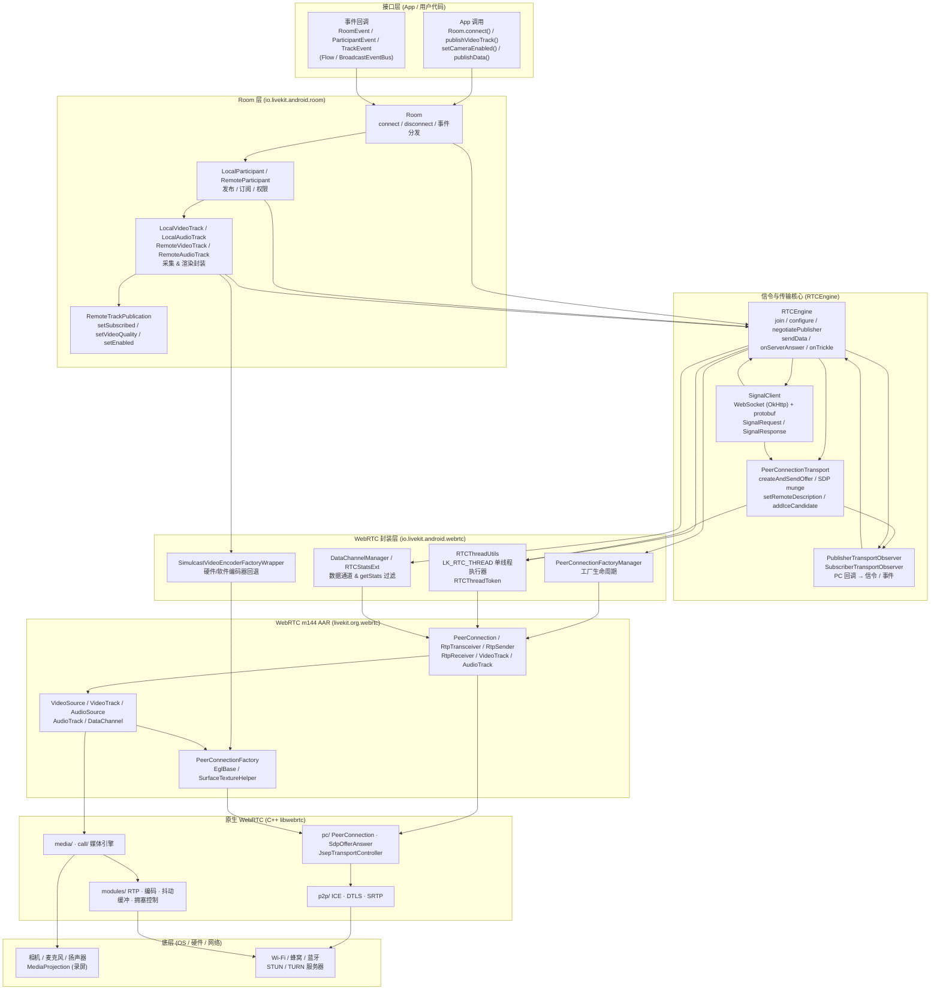
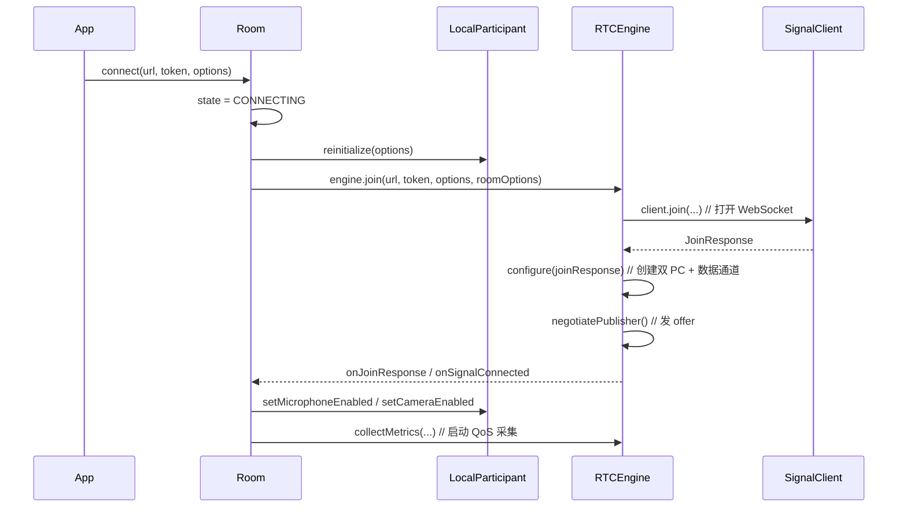
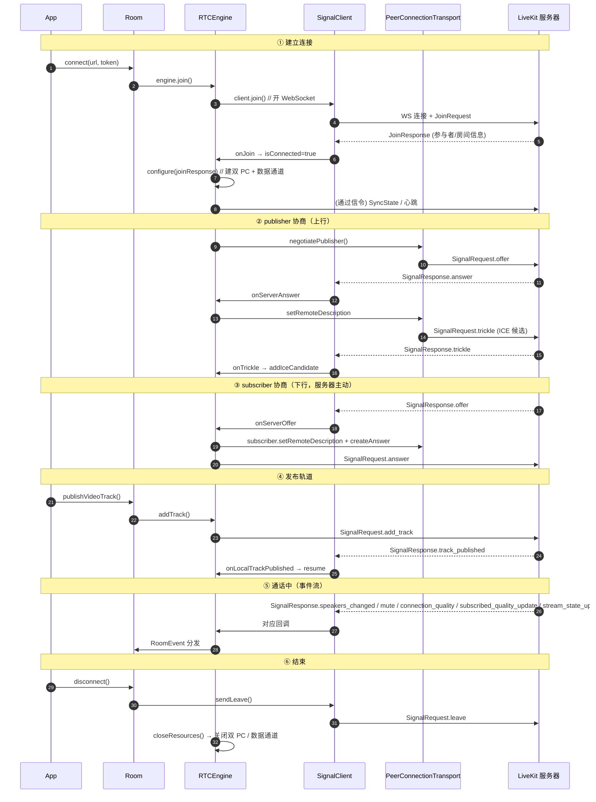
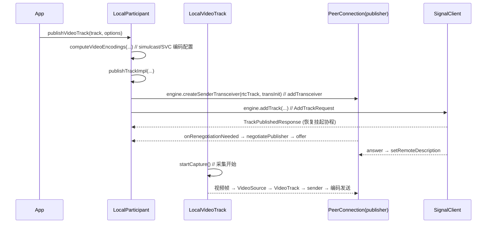
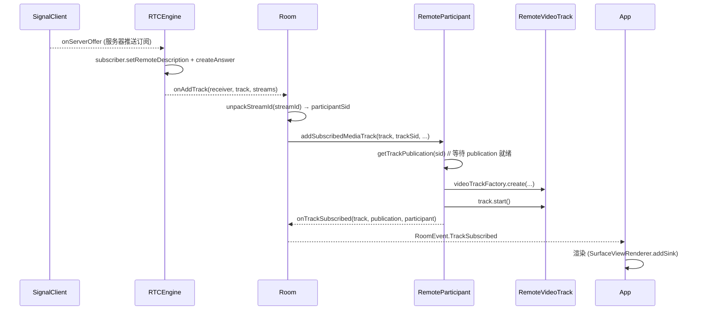
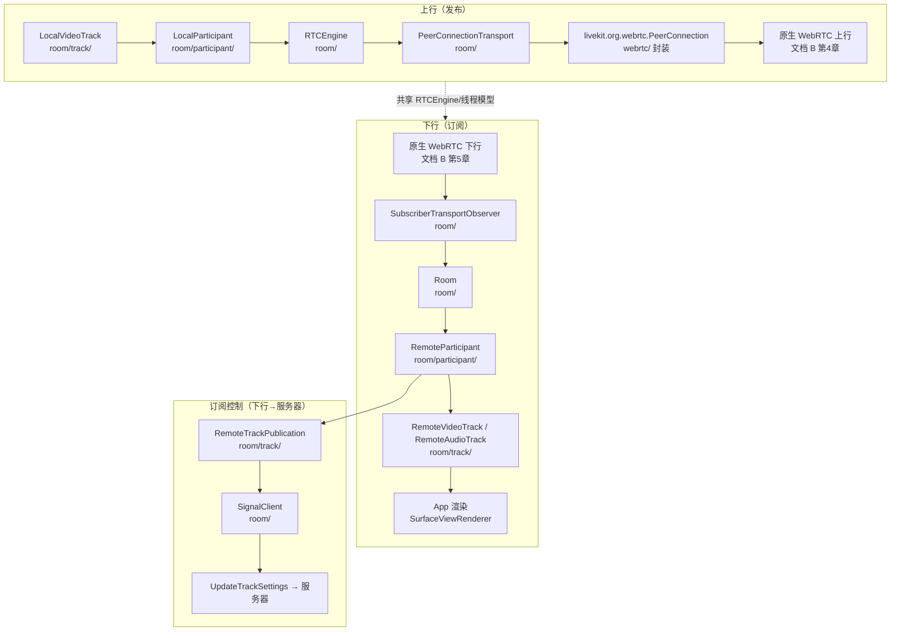
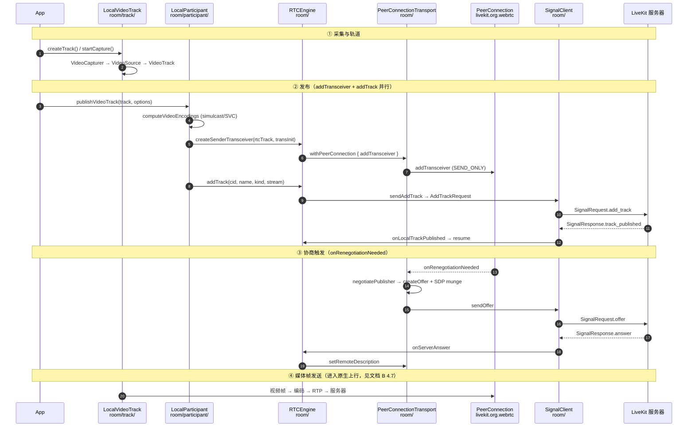
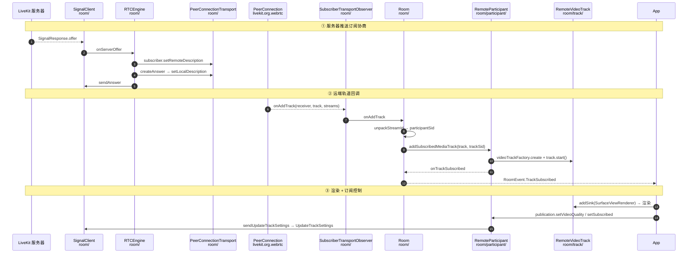
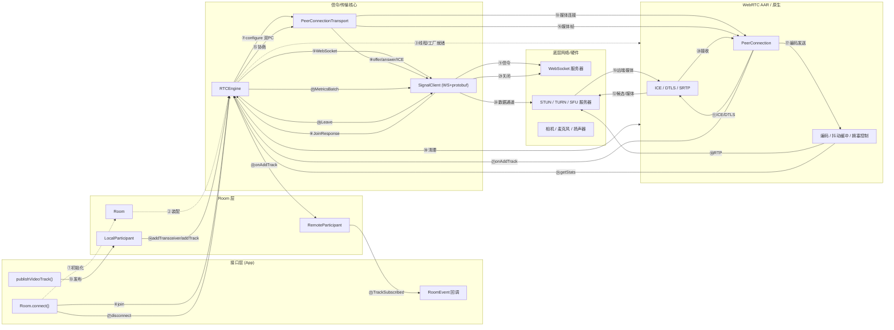
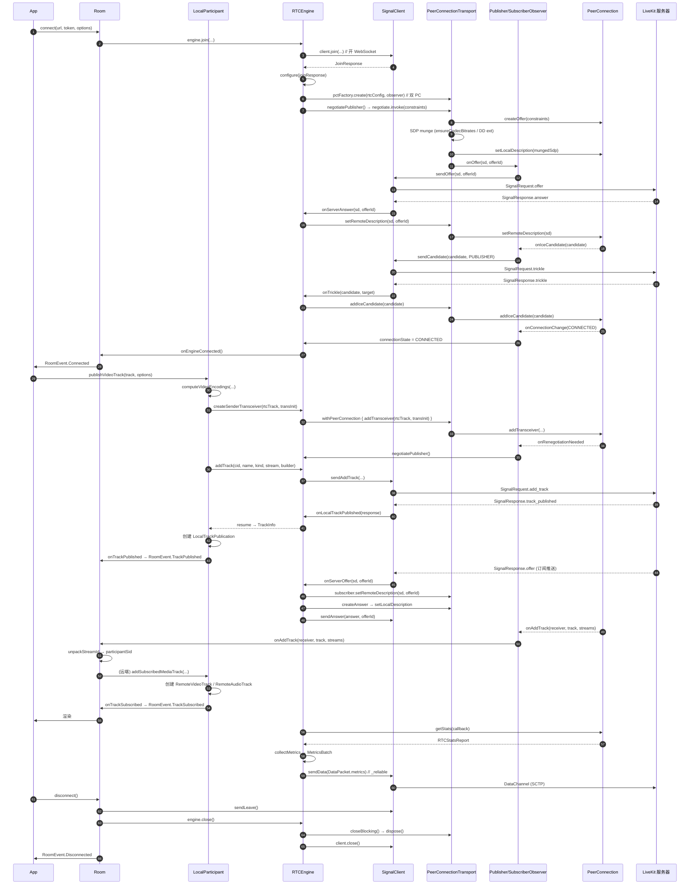

<!-- TOC-START -->

## 目录

> 本文档为 **文档 A（以 LiveKit 为主）**。配套的 **文档 B（以 WebRTC 原生为主）** 见 `webrtc-internal-analysis-0902.md`。

| 章节 | 内容 | 图 |
|------|------|----|
| [第 0 章](#第-0-章-文档说明与阅读指引) | 文档说明与阅读指引（术语表、代码路径索引） | — |
| [第 1 章](#第-1-章-总体架构与分层框架图图-1) | 总体架构与分层框架图 | **图 1** |
| [第 2 章](#第-2-章-初始化流程接口--内部) | 初始化流程（LiveKit.create → Room → 线程模型） | — |
| [第 3 章](#第-3-章-信令流程重点) | 信令流程（join / 双 PC / SDP 协商细节 / ICE / 数据通道 / 信令链路详细梳理 / 重连） | — |
| [第 4 章](#第-4-章-媒体流程重点) | 媒体流程（上行发布 / 下行订阅 / 数据通道媒体 / 媒体链路详细梳理） | — |
| [第 5 章](#第-5-章-qos-与统计重点) | QoS 与统计（getStats / 指标上报 / dynacast） | — |
| [第 6 章](#第-6-章-通话生命周期建立--通话--结束) | 通话生命周期（建立 → 通话 → 结束） | — |
| [第 7 章](#第-7-章-流程图图-2-简图--图-3-细图) | 流程图（宏观简图 + 微观细图） | **图 2 / 图 3** |
| [第 8 章](#第-8-章-附录) | 附录（文件清单 / 术语表 / 参考） | — |

**三张图索引：**
- **图 1（分层框架图）** → [第 1 章 §1.2](#第-1-章-总体架构与分层框架图图-1)
- **图 2（宏观流程图·简图）** → [第 7 章 §7.1](#第-7-章-流程图图-2-简图--图-3-细图)
- **图 3（微观流程图·细图）** → [第 7 章 §7.2](#第-7-章-流程图图-2-简图--图-3-细图)

---

<!-- TOC-END -->

# LiveKit Android SDK：WebRTC 信令与媒体流程分析

> **文档 A（以 LiveKit 为主）**
>
> - 项目：`client-sdk-android-main`（LiveKit Android SDK）
> - 底层：WebRTC m144（以 `livekit.org.webrtc` AAR 依赖形式被 SDK 使用）
> - 目标读者：有 C/C++ 经验、对 Android/Kotlin 与 WebRTC 不熟悉的开发者
> - 日期：2026-09-02
> - 配套文档：`webrtc-internal-analysis-0902.md`（文档 B，以 WebRTC 原生为主）

---

## 第 0 章 文档说明与阅读指引

### 0.1 本文档要回答什么问题

LiveKit 是一个开源的实时音视频（RTC）SDK。Android 端通过 **WebRTC（m144）** 实现媒体传输，但在 WebRTC 之上又封装了一层 **LiveKit 自己的信令协议（protobuf + WebSocket）** 与 **双 PeerConnection 架构**。

本文档的目标是帮助读者**从接口（API）到内部**地理解 LiveKit Android SDK 的两条主线：

1. **信令流程（Signaling）**：客户端如何连接服务器、如何协商 SDP、如何交换 ICE、如何收发数据通道消息。
2. **媒体流程（Media）**：本地采集的视频/音频如何发布（上行），远端轨道如何订阅并渲染（下行）。

以及贯穿两者的**工程框架**：线程模型、事件分发、依赖注入、双 PC 架构。

### 0.2 阅读方法

- **先看图，再看文字**：第 1 章的分层框架图（图 1）给出整体架构；第 7 章的简图（图 2）给出宏观流程；细图（图 3）给出类/方法级调用链。
- **跟着调用链走**：第 2~6 章按「初始化 → 信令 → 媒体 → QoS → 生命周期」的顺序展开，每章都给出**调用方向（上层→下层）**与**回调方向（下层→上层）**。
- **对照源码**：文中所有类名/方法名均可对照 `livekit-android-sdk/src/main/java/io/livekit/android/` 下的源码。

### 0.3 术语表

| 术语 | 含义 |
|------|------|
| **Room** | 一个通话房间；SDK 入口对象 |
| **RTCEngine** | 信令 + 双 PeerConnection 传输的核心引擎 |
| **SignalClient** | WebSocket 信令客户端（OkHttp + protobuf） |
| **PeerConnection (PC)** | WebRTC 连接对象，承载媒体与数据通道 |
| **Publisher PC** | 上行 PC（SEND_ONLY，发媒体 + 数据通道） |
| **Subscriber PC** | 下行 PC（RECV_ONLY，收远端媒体） |
| **Transceiver** | 一个收发通道（含 sender/receiver），对应一个 m-line |
| **SDP / Offer / Answer** | 会话描述协议；offer 是发起方提案，answer 是应答方回应 |
| **ICE / Trickle** | 交互式连接建立；trickle 即候选逐条发送 |
| **DTLS / SRTP** | 传输加密 / 媒体加密 |
| **DataChannel** | 基于 SCTP 的可靠/不可靠数据通道 |
| **Simulcast** | 同时编码多路不同分辨率（rid: q/h/f） |
| **SVC** | 可分层编码（VP9/AV1，L3T3），单流内含多空间层 |
| **dynacast** | 动态只发布被订阅的层，节省上行带宽 |
| **QoS** | 服务质量：NACK、FEC、抖动缓冲、拥塞控制 |

### 0.4 核心代码路径索引

| 文件（`io.livekit.android.` 下） | 职责 |
|------|------|
| `room/Room.kt` | 入口，connect/disconnect，事件分发 |
| `room/RTCEngine.kt` | 信令 + 双 PC 传输核心 |
| `room/SignalClient.kt` | WebSocket 信令客户端 |
| `room/PeerConnectionTransport.kt` | PC 封装、SDP munge、offer |
| `room/PublisherTransportObserver.kt` | 上行 PC 回调 |
| `room/SubscriberTransportObserver.kt` | 下行 PC 回调 |
| `room/participant/LocalParticipant.kt` | 本地发布流程 |
| `room/participant/RemoteParticipant.kt` | 远端订阅流程 |
| `room/track/LocalVideoTrack.kt` / `LocalAudioTrack.kt` | 采集/编码/发布封装 |
| `room/track/RemoteTrackPublication.kt` | 远端订阅控制 |
| `webrtc/peerconnection/RTCThreadUtils.kt` | RTC 线程模型 |
| `room/metrics/RTCMetricsManager.kt` | 指标采集上报（QoS） |

### 0.5 三张图的位置

- **图 1（分层框架图）**：第 1 章 *1.2 节*
- **图 2（宏观流程图·简图）**：第 7 章 *7.1 节*
- **图 3（微观流程图·细图）**：第 7 章 *7.2 节*

---

## 第 1 章 总体架构与分层框架图（图 1）

### 1.1 LiveKit 双 PeerConnection 架构

LiveKit 与「一个房间一个 PeerConnection」的传统 WebRTC 不同，它把连接拆成**两个独立的 PeerConnection**：

- **Publisher PC（上行）**：方向 `SEND_ONLY`。负责把本地采集的媒体（音频/视频）以及 SDK 自己的数据通道（`_reliable` / `_lossy`）发送给服务器。
- **Subscriber PC（下行）**：方向 `RECV_ONLY`。负责接收服务器转发下来的远端媒体轨道（其他参与者的音视频）。

> 为什么拆两个？因为 LiveKit 采用 **SFU（Selective Forwarding Unit）** 架构：所有客户端只与服务器通信，服务器负责转发。上行与下行的媒体走向完全相反，拆成两个 PC 可以让**上行协商**（发布）与**下行协商**（订阅）互不阻塞，也方便做 ICE 重连（soft reconnect 只重启 subscriber 的 ICE）。

在 `RTCEngine.configure()` 中（`RTCEngine.kt:279`），会创建这两个 PC：

```kotlin
publisher = pctFactory.create(rtcConfig, publisherObserver, publisherObserver)
subscriber = pctFactory.create(rtcConfig, subscriberObserver, null)
```

其中 `pctFactory.create` 的第二个参数是 `PeerConnection.Observer`（PC 回调），第三个参数是 `PeerConnectionTransport.Listener`（仅 publisher 需要，用于把生成的 offer 发回服务器）。

### 1.2 分层框架图（图 1）



### 1.3 各层职责与关键类

| 层 | 关键类 | 职责 |
|----|--------|------|
| **接口层** | `Room`, `LocalParticipant` | 暴露给 App 的 API 与事件 |
| **Room 层** | `RemoteParticipant`, `Track*` | 参与者 / 轨道对象的建模 |
| **信令与传输核心** | `RTCEngine`, `SignalClient`, `PeerConnectionTransport` | 信令协商 + 双 PC 生命周期 |
| **WebRTC 封装层** | `RTCThreadUtils`, `SimulcastVideoEncoderFactoryWrapper` | 线程模型、编码器工厂等基础设施 |
| **WebRTC AAR** | `livekit.org.webrtc.*` | WebRTC 的 Java/JNI 封装 |
| **原生 WebRTC** | `pc/ p2p/ media/ call/ modules/` | WebRTC C++ 实现（详见文档 B） |
| **底层** | Android 相机/音频、网络 | 采集、渲染、传输 |

### 1.4 工程框架要点

- **依赖注入（Dagger 2）**：`Room`、`RTCEngine`、`SignalClient` 等均由 Dagger 注入，便于替换（如 `LiveKitOverrides` 可替换音频处理）。
- **事件分发**：SDK 使用 `BroadcastEventBus` + `FlowObservable`/`flowDelegate`，把底层回调转成 Kotlin Flow，App 用 `room.events.collect { }` 订阅。
- **线程模型**：所有 WebRTC 原生调用都通过 `RTCThreadUtils` 串行到名为 `LK_RTC_THREAD` 的单线程执行器上（详见第 2 章）。

---

## 第 2 章 初始化流程（接口 → 内部）

### 2.1 从 `LiveKit.create()` 到 `Room`

SDK 的入口是 `LiveKit.create(context)`，它通过 Dagger 构建依赖图，最终产出 `Room` 实例。`Room` 的构造（`Room.kt:115`）注入了大量组件：

- `engine: RTCEngine` —— 信令 + 传输核心
- `eglBase: EglBase` —— 视频渲染/纹理共享的 EGL 上下文
- `audioHandler`（默认 `AudioSwitchHandler`）—— 音频设备管理
- `audioDeviceModule: AudioDeviceModule` —— 底层音频设备模块
- `localParticipantFactory` / `remoteParticipantFactory` —— 参与者工厂
- `networkCallbackManagerFactory` —— 网络切换监听

`Room` 创建时会：
1. 设置 `engine.listener = this`（`Room.kt:163`），让 `Room` 作为 `RTCEngine` 的回调接收者。
2. 注册 RPC 数据流处理器（`Room.kt:167-176`）。
3. 创建 `localParticipant`（`Room.kt:354`）。

### 2.2 `Room.connect()` 的调用链



关键点（`Room.kt:461` `connect()`）：

1. 校验 `state == DISCONNECTED`，否则抛异常。
2. 置 `state = CONNECTING`，创建 `coroutineScope`。
3. `localParticipant.reinitialize(options)` 重置本地参与者。
4. 在 `ioDispatcher` 上启动 `connectJob`：
   - 处理 LiveKit Cloud 的区域 URL（`regionUrlProvider`）。
   - 调用 `engine.join(...)` —— 这是信令建立的核心。
   - `networkCallbackManager.registerCallback()` 注册网络监听。
   - 若 `options.audio`，`localParticipant.setMicrophoneEnabled(true)` 自动发布麦克风。
   - 若 `options.video`，`localParticipant.setCameraEnabled(true)` 自动发布相机。
   - 启动 `collectMetrics(room, engine)` 采集 QoS 指标。

### 2.3 RTC 线程模型（`RTCThreadUtils.kt`）

WebRTC 的 `PeerConnection` API **不是线程安全的**。LiveKit 用一个**单线程执行器**（线程名前缀 `LK_RTC_THREAD`）串行所有 PC 调用，避免并发问题。

```kotlin
// RTCThreadUtils.kt
private var executor = Executors.newSingleThreadExecutor(threadFactory)
private var rtcDispatcher = executor.asCoroutineDispatcher()
```

提供三个入口（`RTCThreadUtils.kt:71-134`）：

| 函数 | 语义 |
|------|------|
| `executeOnRTCThread(token, action)` | 异步投递到 RTC 线程 |
| `executeBlockingOnRTCThread(token, action)` | 阻塞等待 RTC 线程执行完（同步） |
| `launchBlockingOnRTCThread(token, action)` | 挂起协程，在 RTC 线程执行（suspend） |

`RTCThreadToken` 关联 `PeerConnectionFactoryManager`，用于判断工厂是否已释放（`isDisposed`），避免在销毁后仍调用原生对象。

> **为什么需要 token？** 因为 `PeerConnectionFactory` 的创建与销毁必须在同一线程。`RTCThreadTokenImpl` 通过查询 `peerConnectionFactoryManager.isDisposed` 来保证 token 失效后不再投递任务。

### 2.4 PeerConnectionFactory 与编码器工厂

- `PeerConnectionFactoryManager`（`webrtc/PeerConnectionFactoryManager.kt`）管理 `PeerConnectionFactory` 的创建/销毁生命周期。
- `SimulcastVideoEncoderFactoryWrapper`（`webrtc/SimulcastVideoEncoderFactoryWrapper.kt`）包装编码器工厂：优先使用**硬件编码器**，回退到**软件编码器**，并用 `StreamEncoderWrapper` 做分辨率缩放以支持 Simulcast 的多路编码。

### 2.5 音频设备初始化

`Room.state` 变为 `CONNECTING` 时（`Room.kt:239`），会调用 `audioHandler.start()`（`AudioSwitchHandler`），初始化音频路由（扬声器/听筒/蓝牙）。`CommunicationWorkaround.start()` 处理部分设备在通信模式下的兼容性问题。

### 2.6 本章小结

初始化阶段完成了三件事：
1. **对象装配**：通过 Dagger 构建 `Room` → `RTCEngine` → `SignalClient` 的依赖链。
2. **线程准备**：建立 `LK_RTC_THREAD` 单线程执行器，作为所有 PC 调用的串行化边界。
3. **资源准备**：EGL 上下文、音频设备、编码器工厂就绪，等待 `connect()` 触发信令。

---

## 第 3 章 信令流程（重点）

信令是 LiveKit 的核心。本章从「建立 → 配置 → 协商 → ICE → 数据通道」完整走一遍，并给出类/方法级调用链与回调链。

### 3.1 信令建立：`SignalClient.join()`

`RTCEngine.joinImpl()`（`RTCEngine.kt:250`）调用 `client.join(url, token, options, roomOptions)`。`SignalClient.join()`（`SignalClient.kt:131`）内部调用 `connect()`：

```kotlin
// SignalClient.connect()
val wsUrlString = "${url.toWebsocketUrl()}/rtc${createConnectionParams(...)}"
val request = Request.Builder()
    .url(wsUrlString)
    .addHeader("Authorization", "Bearer $token")
    .build()
currentWs = websocketFactory.newWebSocket(request, this@SignalClient)
```

要点：

- **URL**：`wss://<host>/rtc?protocol=...&auto_subscribe=...&sdk=android&version=...&os=...&network=...`（`createConnectionParams`，`SignalClient.kt:207`）。
- **认证**：通过 HTTP Header `Authorization: Bearer <token>` 携带 JWT。
- **协议**：WebSocket 传输 **protobuf** 编码的 `SignalRequest` / `SignalResponse`（`livekit.LivekitRtc` 生成类）。
- **握手**：`connect()` 挂起协程，等待 WebSocket 回调 `onMessage` 收到 `JoinResponse`（`SignalClient.kt:679`），然后 `joinContinuation?.resume(...)` 恢复。

收到 `JoinResponse` 后（`SignalClient.kt:679-695`）：
- 置 `isConnected = true`，启动 `startRequestQueue()`（请求发送队列）。
- 从 `response.join` 读取 `pingTimeout` / `pingInterval`，启动心跳（`startPingJob()`）。
- 解析 `serverVersion` / `serverInfo`。
- `joinContinuation?.resumeWith(ConnectResult.Join(response.join))` 恢复 `join()` 协程。

### 3.2 双 PC 配置：`RTCEngine.configure()`

`joinImpl()` 拿到 `JoinResponse` 后：
1. `listener?.onJoinResponse(joinResponse)` → 通知 `Room`。
2. `listener?.onSignalConnected(false)` → 通知 `Room` 信令已连。
3. `configure(joinResponse, options)`（`RTCEngine.kt:279`）创建双 PC + 数据通道。
4. `negotiatePublisher()` 发起首次协商。
5. `client.onReadyForResponses()` 开始消费信令响应流。

`configure()` 的核心（在 `launchBlockingOnRTCThread` 中执行，确保在 RTC 线程）：

```kotlin
val rtcConfig = makeRTCConfig(Either.Left(joinResponse), connectOptions)
publisher = pctFactory.create(rtcConfig, publisherObserver, publisherObserver)
subscriber = pctFactory.create(rtcConfig, subscriberObserver, null)
```

- `makeRTCConfig`（`RTCEngine.kt:943`）把服务器下发的 ICE servers（protobuf）转成 `PeerConnection.IceServer`，并设置 `sdpSemantics = UNIFIED_PLAN`、`continualGatheringPolicy = GATHER_CONTINUALLY`。
- **数据通道**：在 publisher PC 上创建两条 DataChannel（`RTCEngine.kt:345-379`）：
  - `_reliable`：`ordered = true`（可靠，TCP 语义，用于信令类消息）。
  - `_lossy`：`ordered = false, maxRetransmits = 0`（不可靠，UDP 语义，用于实时数据）。
- 每个数据通道用一个 `DataChannelManager` 包装，负责 bufferedAmount 跟踪与消息收发。

> **subscriberPrimary 模式**：若 `joinResponse.subscriberPrimary == true`，则数据通道由**服务器在 subscriber PC 上主动开启**（`RTCEngine.kt:321-331`），客户端在 `subscriberObserver.dataChannelListener` 中接收。此时连接状态由 subscriber 决定。

### 3.3 SDP 协商：offer / answer 全链路

#### 3.3.1 发起 offer（上行）

`negotiatePublisher()`（`RTCEngine.kt:716`）→ `publisher?.negotiate?.invoke(getPublisherOfferConstraints())`。`PeerConnectionTransport.negotiate` 是一个 **debounce(20ms)** 的委托（`PeerConnectionTransport.kt:146`），最终调用 `createAndSendOffer()`：

```kotlin
// PeerConnectionTransport.createAndSendOffer()（核心步骤）
val sdpOffer = peerConnection.createOffer(constraints)   // 1. 原生生成 offer
// 2. SDP munge：解析并修改 SDP
val sdpDescription = sdpFactory.createSessionDescription(sdpOffer.description)
for (mediaDesc in mediaDescs) {
    if (mediaDesc.media.mediaType == "video") {
        ensureVideoDDExtensionForSVC(mediaDesc)   // SVC 需要 dependency-descriptor 扩展
        ensureCodecBitrates(mediaDesc, trackBitrates) // 注入 x-google-start/max-bitrate
    }
}
finalSdp = setMungedSdp(sdpOffer, sdpDescription.toString()) // 3. setLocalDescription(munged)
listener.onOffer(sdp, offerId)  // 4. 回调 PublisherTransportObserver.onOffer
```

`PublisherTransportObserver.onOffer`（`PublisherTransportObserver.kt:66`）→ `client.sendOffer(sd, offerId)`（`SignalClient.kt:422`）→ 编码成 `SignalRequest.offer` 通过 WebSocket 发出。

**SDP munge 的意义**：
- `ensureVideoDDExtensionForSVC`：为 VP9/AV1（SVC 编码）补充 `dependency-descriptor` RTP 头扩展，否则 SVC 层无法正确解析。
- `ensureCodecBitrates`：给 fmtp 注入 `x-google-start-bitrate`（目标码率的 70%）和 `x-google-max-bitrate`，解决 SVC 起始码率爬升慢导致的「前几秒模糊」问题（`PeerConnectionTransport.kt:446` 注释）。

#### 3.3.2 处理 answer（下行回包）

服务器处理 offer 后返回 `SignalResponse.answer`。`SignalClient.handleSignalResponseImpl`（`SignalClient.kt:750`）→ `listener.onServerAnswer(sd, offerId)` → `RTCEngine.onServerAnswer`（`RTCEngine.kt:1088`）：

```kotlin
override fun onServerAnswer(sd, offerId) {
    coroutineScope.launch {
        publisher?.setRemoteDescription(sessionDescription, offerId)
    }
}
```

`PeerConnectionTransport.setRemoteDescription`（`PeerConnectionTransport.kt:121`）：
1. 校验 offerId（忽略过期 offer）。
2. `peerConnection.setRemoteDescription(sd)`。
3. 成功后把缓存的 `pendingCandidates`（ICE trickle 期间到达的候选）一次性 `addIceCandidate` 灌入。

#### 3.3.3 处理服务器 offer（下行订阅协商）

当服务器需要推送媒体（订阅）时，会主动发 `SignalResponse.offer`。`RTCEngine.onServerOffer`（`RTCEngine.kt:1103`）：

```kotlin
subscriber?.setRemoteDescription(sessionDescription, offerId)  // 1. 应用远端 offer
val answer = subscriber?.withPeerConnection { createAnswer(MediaConstraints()) } // 2. 生成 answer
subscriber?.withPeerConnection { setLocalDescription(answer) } // 3. 设置本地 answer
client.sendAnswer(answer, offerId) // 4. 发回服务器
```

这是 **subscriber PC** 的协商：服务器是 offer 发起方，客户端是 answer 应答方。所有远端轨道（其他参与者的媒体）都通过这条路径建立。

#### 3.3.4 协商生命周期与 SDP 结构

LiveKit 的两条协商路径（publisher 上行 / subscriber 下行）角色相反，可对照：

| 维度 | publisher 协商（上行） | subscriber 协商（下行） |
|------|------|------|
| offer 发起方 | **客户端**（`negotiatePublisher`） | **服务器**（主动推送 offer） |
| 客户端动作 | createOffer → munge → setLocal → sendOffer | setRemote(offer) → createAnswer → setLocal → sendAnswer |
| 方向 | `SEND_ONLY`（只发不收） | `RECV_ONLY`（只收不发） |
| 触发时机 | 发布轨道 / `onRenegotiationNeeded` | 服务器有媒体要推送（订阅） |
| 协商消息 | `SignalRequest.offer` → `SignalResponse.answer` | `SignalResponse.offer` → `SignalRequest.answer` |
| 关键方法 | `createAndSendOffer` / `onServerAnswer` | `onServerOffer` / `sendAnswer` |

**SDP 结构**（一个 m-line 对应一个媒体轨道）：
```
v=0
o=- ... (会话 ID / 版本)
s=-
t=0 0
a=group:BUNDLE 0 1 ...      ← BUNDLE：多个 m-line 复用一条传输
m=audio 9 UDP/TLS/RTP/SAVPF 111 ...   ← 音频 m-line（codec payload type）
a=mid:0
a=sendonly / recvonly / sendrecv
a=rtpmap:111 opus/48000/2
a=ssrc:... cname:...        ← SSRC（媒体流标识）
m=video 9 UDP/TLS/RTP/SAVPF 96 ...    ← 视频 m-line
a=rtcp-fb:96 nack / goog-remb / transport-cc   ← 拥塞反馈能力
a=extmap:... urn:ietf:params:rtp-hdrext:...    ← RTP 头扩展（含 dependency-descriptor）
```

**SDP munge 注入**（`PeerConnectionTransport.ensureCodecBitrates`，仅 publisher 视频）：
- `x-google-start-bitrate` = 目标码率的 70%（`startBitrateForSVC = 0.7`）→ 解决 SVC 起始码率爬升慢导致的「前几秒模糊」。
- `x-google-max-bitrate` = 目标码率上限。
- `ensureVideoDDExtensionForSVC`：为 VP9/AV1 补充 `dependency-descriptor` 头扩展。

### 3.4 ICE trickle 流程

ICE（Interactive Connectivity Establishment）通过 STUN/TURN 找到可用的候选地址对。LiveKit 采用 **trickle ICE**（逐条发送候选）。

**本地候选 → 服务器**（`PublisherTransportObserver.onIceCandidate`，`PublisherTransportObserver.kt:48`）：

```kotlin
override fun onIceCandidate(iceCandidate: IceCandidate?) {
    client.sendCandidate(candidate, target = LivekitRtc.SignalTarget.PUBLISHER)
}
```

`SignalClient.sendCandidate`（`SignalClient.kt:440`）把候选编码成 `SignalRequest.trickle`（含 `sdpMid`、`sdpMLineIndex`、`candidate` JSON），并带 `target`（PUBLISHER 或 SUBSCRIBER）。

**远端候选 → 本地**（`RTCEngine.onTrickle`，`RTCEngine.kt:1152`）：

```kotlin
override fun onTrickle(candidate, target) {
    when (target) {
        PUBLISHER -> publisher?.addIceCandidate(candidate)
        SUBSCRIBER -> subscriber?.addIceCandidate(candidate)
    }
}
```

`PeerConnectionTransport.addIceCandidate`（`PeerConnectionTransport.kt:105`）：
- 若 `remoteDescription != null && !restartingIce`，直接 `peerConnection.addIceCandidate(candidate)`。
- 否则（协商尚未完成或正在 ICE restart）先缓存到 `pendingCandidates`，等 `setRemoteDescription` 成功后统一灌入（见 3.3.2）。

> **为什么有 target？** 因为 LiveKit 有双 PC。服务器需要知道候选属于 publisher 还是 subscriber，才能路由到正确的 PC。

### 3.5 数据通道（`_reliable` / `_lossy`）

数据通道（DataChannel）基于 SCTP，承载 LiveKit 的**应用层消息**（聊天、RPC、指标、数据流等），与信令 WebSocket 相互独立。

**发送**：`RTCEngine.sendData(dataPacket)`（`RTCEngine.kt:733`）：
1. `ensurePublisherConnected(kind)`：确保 publisher 已连接且数据通道 OPEN（subscriberPrimary 模式下会先触发协商）。
2. 若启用 E2EE，先加密 payload。
3. 根据 `dataPacket.kind`（RELIABLE/LOSSY）选择通道：
   - RELIABLE → `_reliable`，并维护 `reliableDataSequence` 序号 + 重放缓冲 `reliableMessageBuffer`（用于断线重连后补发）。
   - LOSSY → `_lossy`。
4. `channel.send(DataChannel.Buffer(...))`。

**接收**：`RTCEngine.onMessage(dataChannel, buffer)`（`RTCEngine.kt:1293`）：
1. 解析 `LivekitModels.DataPacket`。
2. 可靠通道做**去重**（按 `participantSid + sequence` 判断是否已收过）。
3. 若加密则解密。
4. 按 `valueCase` 分发：`SPEAKER` → 活跃发言人、`USER` → 用户数据、`RPC_*` → RPC、`STREAM_*` → 数据流、`METRICS` → 指标等。

### 3.6 信令消息分发（`SignalClient` → `RTCEngine` → `Room`）

WebSocket 收到二进制消息后，`SignalClient.onMessage`（`SignalClient.kt:305`）→ `handleSignalResponse` → `handleSignalResponseImpl`（`SignalClient.kt:743`），按 `response.messageCase` 分发到 `listener`（即 `RTCEngine`）：

| `SignalResponse` 消息 | 回调到 `RTCEngine` | 再转发到 `Room` |
|------|------|------|
| `answer` | `onServerAnswer` | —（publisher 协商） |
| `offer` | `onServerOffer` | —（subscriber 协商） |
| `trickle` | `onTrickle` | — |
| `update`（参与者） | `onParticipantUpdate` | `onUpdateParticipants` |
| `track_published` | `onLocalTrackPublished` | —（恢复挂起的发布协程） |
| `track_unpublished` | `onLocalTrackUnpublished` | `onLocalTrackUnpublished` |
| `speakers_changed` | `onSpeakersChanged` | `onSpeakersChanged` |
| `leave` | `onLeave` | —（触发重连/断开） |
| `mute` | `onRemoteMuteChanged` | `onRemoteMuteChanged` |
| `connection_quality` | `onConnectionQuality` | `onConnectionQuality` |
| `subscribed_quality_update` | `onSubscribedQualityUpdate` | `onSubscribedQualityUpdate`（→ dynacast） |
| `stream_state_update` | `onStreamStateUpdate` | `onStreamStateUpdate` |
| `subscription_permission_update` | `onSubscriptionPermissionUpdate` | `onSubscriptionPermissionUpdate` |
| `refresh_token` | `onRefreshToken` | — |
| `pong` / `pong_resp` | 心跳 | — |

> **请求队列**：`SignalRequest` 通过 `requestFlow`（`MutableSharedFlow`）串行发送（`SignalClient.kt:644`）。部分消息（offer/answer/trickle/leave/sync_state/simulate）**跳过队列**直接发送（`skipQueueTypes`，`SignalClient.kt:1006`），保证协商消息不被阻塞。

### 3.7 重连 / 恢复（soft / full reconnect）

当信令 WebSocket 断开（`onClose`）或主 PC 断开（`onConnectionChange`）时，`RTCEngine.reconnect()`（`RTCEngine.kt:521`）被触发。`Room` 侧的网络监听（`Room.kt:1138`）在断网恢复时也会调用 `reconnect()`。

重连分两种（`RTCEngine.kt:579`）：

- **Soft reconnect（软重连）**：信令断开但媒体连接可恢复。
  1. `subscriber?.prepareForIceRestart()` 标记 ICE restart。
  2. `client.reconnect(...)` 重新连 WebSocket（带 `reconnect=1` 和 `participantSid`）。
  3. 收到 `ReconnectResponse` 后更新 RTC 配置。
  4. 等待 subscriber（及 publisher，若已发布）ICE 重连成功。
  5. 成功后 `resendReliableMessagesForResume(lastMessageSeq)` 补发可靠消息，`client.onPCConnected()` 恢复请求队列。

- **Full reconnect（全量重连）**：媒体连接也无法恢复。
  1. `closeResources()` 关闭所有 PC 和通道。
  2. 重新 `joinImpl()`（全新 WebSocket + 全新 PC）。
  3. `Room.onFullReconnecting()` 清理远端参与者，`onPostReconnect(true)` 时 `localParticipant.republishTracks()` 重新发布本地轨道。

重连策略由 `ReconnectPolicy`（默认 `DefaultReconnectPolicy`）控制退避延迟，最多 `MAX_RECONNECT_RETRIES = 30` 次、总超时 `MAX_RECONNECT_TIMEOUT = 60s`。

### 3.8 信令链路详细梳理

#### 3.8.1 `SignalRequest` 消息类型（客户端 → 服务器）

所有客户端发出的信令都编码为 `SignalRequest`（protobuf），通过 WebSocket 发送。`SignalClient.sendRequest`（`SignalClient.kt:644`）负责发送：

| `SignalRequest` 消息 | 触发方法 | 用途 | 是否跳过队列 |
|------|------|------|------|
| `offer` | `sendOffer` | 发送 publisher 的 SDP offer | ✅ 跳过 |
| `answer` | `sendAnswer` | 应答 subscriber 的 offer | ✅ 跳过 |
| `trickle` | `sendCandidate` | 发送 ICE 候选 | ✅ 跳过 |
| `add_track` | `sendAddTrack` | 请求发布轨道 | — |
| `update_track_settings` | `sendUpdateTrackSettings` | 更新订阅质量/开关 | — |
| `update_subscription` | `sendUpdateSubscription` | 订阅/退订 | — |
| `update_participant` | `sendUpdateParticipant` | 更新参与者元数据 | — |
| `leave` | `sendLeave` | 离开房间 | ✅ 跳过 |
| `sync_state` | `sendSyncState` | 重连后同步状态 | ✅ 跳过 |
| `simulate` | `sendSimulate` | 测试/模拟 | ✅ 跳过 |
| `ping` | 心跳 | 保活 | — |
| `subscription_permission` | `sendSubscriptionPermission` | 订阅权限 | — |

> **请求队列**：普通消息经 `requestFlow` 串行发送；协商相关消息（offer/answer/trickle/leave/sync_state/simulate）跳过队列直接发送（`skipQueueTypes`，`SignalClient.kt:1006`），保证协商不被排队阻塞。

#### 3.8.2 信令链路完整时序图



#### 3.8.3 信令消息 → 类 / 文件 / 方法映射

| 信令环节 | 关键类 | 文件 | 关键方法 |
|------|------|------|---------|
| 建连 | `SignalClient` | `room/SignalClient.kt` | `join` / `connect` / `handleSignalResponse` |
| 分发 | `SignalClient` | `room/SignalClient.kt` | `handleSignalResponseImpl`（按 messageCase 分发） |
| 回调接收 | `RTCEngine` | `room/RTCEngine.kt` | `onServerAnswer` / `onServerOffer` / `onTrickle` / `onLocalTrackPublished` / `onParticipantUpdate` |
| 上层事件 | `Room` | `room/Room.kt` | `onUpdateParticipants` / `onSpeakersChanged` / `onConnectionQuality` / `onSubscribedQualityUpdate` |
| 发送 | `SignalClient` | `room/SignalClient.kt` | `sendOffer` / `sendAnswer` / `sendCandidate` / `sendAddTrack` / `sendLeave` / `sendUpdateTrackSettings` |

---

## 第 4 章 媒体流程（重点）

媒体流程分**上行**（本地采集 → 编码 → 发送）与**下行**（接收 → 解码 → 渲染）。本章给出两条主链路的调用链与回调链。

### 4.1 上行：采集 → 编码 → 发送

#### 4.1.1 视频上行调用链



#### 4.1.2 关键代码路径

**① 采集与轨道创建**（`LocalVideoTrack.createTrack`，`LocalVideoTrack.kt:498`）：

```kotlin
val source = peerConnectionFactory.createVideoSource(options.isScreencast)
source.setVideoProcessor(finalVideoProcessor)   // 可选视频处理
val surfaceTextureHelper = SurfaceTextureHelper.create("VideoCaptureThread", eglBase.eglBaseContext)
capturer.initialize(surfaceTextureHelper, context, source.capturerObserver)
val rtcTrack = peerConnectionFactory.createVideoTrack(UUID.randomUUID().toString(), source)
```

- `VideoCapturer`（相机/录屏）→ `SurfaceTextureHelper` → `VideoSource` → `VideoTrack`。
- `startCapture()`（`LocalVideoTrack.kt:127`）真正启动采集：`capturer.startCapture(width, height, fps)`。

**② 发布**（`LocalParticipant.publishVideoTrack`，`LocalParticipant.kt:506`）：
- 计算编码配置 `computeVideoEncodings(...)`（`LocalParticipant.kt:818`）：
  - **Simulcast**：按分辨率生成多路编码（rid 从 `EncodingUtils.VIDEO_RIDS` 取，如 `q/h/f`），从最小到最大排列。
  - **SVC**（VP9/AV1）：单路编码 + `scalabilityMode`（默认 `L3T3_KEY`），并强制开启 `dynacast`。
- 调用 `publishTrackImpl`（`LocalParticipant.kt:631`）。

**③ 核心发布逻辑**（`publishTrackImpl`）：
- `negotiate()`：`engine.createSenderTransceiver(track.rtcTrack, transInit)`（`LocalParticipant.kt:698`）→ `PeerConnection.addTransceiver(rtcTrack, transInit)`。`transInit` 指定 `SEND_ONLY` 方向、stream id、encodings。
- `requestAddTrack()`：`engine.addTrack(cid, name, kind, stream, builder)`（`LocalParticipant.kt:746`）→ `SignalClient.sendAddTrack` 发送 `AddTrackRequest`，并**挂起协程**等待服务器确认（`pendingTrackResolvers`，`RTCEngine.kt:387`）。
- `AddTrackRequest` 携带：分辨率、`layers`（视频层）、`simulcastCodecs`（首选 codec + backup codec）、source 等。
- 服务器返回 `TrackPublishedResponse` → `RTCEngine.onLocalTrackPublished`（`RTCEngine.kt:1169`）→ `cont.resume(response.track)` 恢复协程 → 创建 `LocalTrackPublication`。

**④ 协商触发**：`addTransceiver` 会自动触发 PC 的 `onRenegotiationNeeded` → `PublisherTransportObserver.onRenegotiationNeeded` → `engine.negotiatePublisher()` → 走第 3.3 节的 offer 流程。因此发布轨道后无需手动协商。

> **fast publish**：当服务器支持时（`enabledPublishVideoCodecs` 非空），`publishTrackImpl` 会**同时**执行 `negotiate()` 和 `requestAddTrack()`（`LocalParticipant.kt:761-770`），并行加速发布。

#### 4.1.3 音频上行

`LocalParticipant.publishAudioTrack`（`LocalParticipant.kt:449`）→ `publishTrackImpl`，流程与视频类似但更简单：
- 采集：`AudioSource` → `AudioTrack`（`LocalAudioTrack.createTrack`）。
- 编码：单路，可配 `audioBitrate`、`dtx`（不连续传输）、`red`（冗余音频）。
- `AddTrackRequest` 带 `audioFeatures`（如 `TF_NO_DTX`、`TF_PRECONNECT_BUFFER`）。

#### 4.1.4 Simulcast / SVC 编码配置小结

| 模式 | 编码方式 | 特点 | 适用 |
|------|---------|------|------|
| 单路 | 1 个 encoding | 简单，码率固定 | 低端设备 |
| **Simulcast** | 多路不同分辨率（rid） | 服务器按需转发某层 | VP8/H264 |
| **SVC** | 单流多空间层（L3T3） | 一网打尽，dynacast 省带宽 | VP9/AV1 |
| 多 codec Simulcast | 主 codec + backup codec | 兼容不支持主 codec 的客户端 | SVC + VP8 backup |

### 4.2 下行：接收 → 解码 → 渲染

#### 4.2.1 视频下行调用链



#### 4.2.2 关键代码路径

**① 服务器推送订阅协商**：当其他参与者发布轨道后，服务器通过 subscriber PC 推送 offer（见 3.3.3）。协商完成后，远端媒体轨道通过 `onAddTrack` 回调上来。

**② `Room.onAddTrack`**（`Room.kt:1199`）：
```kotlin
override fun onAddTrack(receiver, track, streams) {
    val (participantSid, streamId) = unpackStreamId(streams.first().id)
    var trackSid = track.id()
    if (streamId != null && streamId.startsWith("TR")) trackSid = streamId
    val participant = getParticipantBySid(participantSid) as? RemoteParticipant
    val statsGetter = engine.createStatsGetter(receiver)  // 为 QoS 绑定 receiver
    participant.addSubscribedMediaTrack(track, trackSid!!, autoManageVideo = adaptiveStream, statsGetter, receiver)
}
```

- `unpackStreamId`（`Room.kt:1651`）：LiveKit 把 stream id 编码成 `participantSid|trackSid`，这里拆开。
- `engine.createStatsGetter(receiver)`：为下行轨道绑定 `getStats` 回调（用于 QoS 指标，见第 5 章）。

**③ `RemoteParticipant.addSubscribedMediaTrack`**（`RemoteParticipant.kt:147`）：
- 先 `getTrackPublication(sid)` 查找对应 publication。
- **若 publication 还没到**（订阅先于发布信息到达），会**重试最多 20 次**（每次延迟 150ms）直到找到（`RemoteParticipant.kt:158-172`）。
- 找到后按 `mediaTrack.kind()` 创建 `RemoteAudioTrack` 或 `RemoteVideoTrack`。
- `publication.track = track`、`track.start()`。
- 回调 `onTrackSubscribed` → `Room.onTrackSubscribed` → `RoomEvent.TrackSubscribed`。

**④ 渲染**：App 在 `RoomEvent.TrackSubscribed` 里拿到 `RemoteVideoTrack`，调用 `track.addRenderer(SurfaceViewRenderer)` 或 `TextureViewRenderer.addSink(...)` 渲染。`Room.initVideoRenderer(view)` 负责初始化渲染器（EGL 上下文、缩放模式）。

#### 4.2.3 订阅控制（`RemoteTrackPublication`）

`RemoteTrackPublication`（`RemoteTrackPublication.kt`）提供对下行轨道的精细控制，全部通过信令 `UpdateTrackSettings` 通知服务器：

| 方法 | 作用 | 底层 |
|------|------|------|
| `setSubscribed(bool)` | 订阅/退订 | `sendUpdateSubscription` |
| `setEnabled(bool)` | 停止/恢复服务器下发（省带宽） | `sendUpdateTrackSettings` + `rtcTrack.setShouldReceive` |
| `setVideoQuality(quality)` | 指定最高质量（simulcast） | `sendUpdateTrackSettings` |
| `setVideoDimensions(dims)` | 按渲染尺寸选择质量 | `sendUpdateTrackSettings` |
| `setVideoFps(fps)` | 指定帧率 | `sendUpdateTrackSettings` |

`sendUpdateTrackSettings` 是 **debounce(100ms)** 的（`RemoteTrackPublication.kt:222`），合并短时间内的多次设置。`setVideoQuality` 与 `setVideoDimensions` 互斥（设置一个会清空另一个）。

> **adaptiveStream**：当 `Room.adaptiveStream = true` 时，`RemoteVideoTrack` 会根据挂载的渲染器尺寸（`VideoDimensionsChanged`）和可见性（`VisibilityChanged`）自动调整订阅质量，甚至暂停不可见轨道的接收（`RemoteTrackPublication.kt:207-219`）。

### 4.3 数据通道媒体（DataPacket）

LiveKit 的应用层数据（非音视频）都走 DataChannel（见 3.5）。`DataPacket` 的 `valueCase` 决定了消息类型：

| 类型 | 用途 |
|------|------|
| `USER` | App 自定义数据（`publishData` / `RoomEvent.DataReceived`） |
| `SPEAKER` | 活跃发言人更新 |
| `RPC_REQUEST/RESPONSE/ACK` | 远端过程调用（RPC v1/v2） |
| `STREAM_HEADER/CHUNK/TRAILER` | 数据流（大 payload，RPC v2） |
| `METRICS` | QoS 指标上报（见第 5 章） |
| `TRANSCRIPTION` | 语音转写 |
| `SIP_DTMF` | DTMF 信令 |

### 4.4 媒体链路详细梳理

#### 4.4.1 上行媒体链路（本地 → 服务器）

| 步骤 | 环节 | 关键类 | 文件 | 关键方法 | 底层/说明 |
|------|------|--------|------|---------|---------|
| 1 | 采集 | `VideoCapturer`（相机/录屏） | `room/track/LocalVideoTrack.kt` | `startCapture` | `SurfaceTextureHelper` + EGL |
| 2 | 源 | `VideoSource` | `webrtc/`（封装） | `createVideoSource` | 帧进入 WebRTC |
| 3 | 轨道 | `VideoTrack` | `room/track/` | — | 广播给预览 + 编码器 |
| 4 | 发布 | `LocalParticipant` | `room/participant/LocalParticipant.kt` | `publishVideoTrack` / `publishTrackImpl` | 计算 simulcast/SVC 编码 |
| 5 | 注册 | `PeerConnection`（publisher） | `livekit.org.webrtc` | `addTransceiver` | `SEND_ONLY` |
| 6 | 信令 | `SignalClient` | `room/SignalClient.kt` | `sendAddTrack` | `AddTrackRequest` |
| 7 | 协商 | `PeerConnectionTransport` | `room/PeerConnectionTransport.kt` | `createAndSendOffer` | offer + SDP munge |
| 8 | 编码发送 | 原生 WebRTC | 文档 B 第 4 章 | — | 编码 → RTP → ICE → 服务器 |

#### 4.4.2 下行媒体链路（服务器 → 本地）

| 步骤 | 环节 | 关键类 | 文件 | 关键方法 | 底层/说明 |
|------|------|--------|------|---------|---------|
| 1 | 协商 | `RTCEngine` | `room/RTCEngine.kt` | `onServerOffer` | subscriber createAnswer |
| 2 | 轨道回调 | `SubscriberTransportObserver` | `room/SubscriberTransportObserver.kt` | `onAddTrack` | 底层 `onAddTrack` |
| 3 | 分发 | `Room` | `room/Room.kt` | `onAddTrack` / `unpackStreamId` | 拆 `participantSid\|trackSid` |
| 4 | 订阅 | `RemoteParticipant` | `room/participant/RemoteParticipant.kt` | `addSubscribedMediaTrack` | 最多重试 20 次 |
| 5 | 轨道 | `RemoteVideoTrack` / `RemoteAudioTrack` | `room/track/` | `start` | 绑定 statsGetter |
| 6 | 渲染 | `SurfaceViewRenderer` / `TextureViewRenderer` | App | `addSink` | EGL 渲染 |
| 7 | 控制 | `RemoteTrackPublication` | `room/track/RemoteTrackPublication.kt` | `setSubscribed` / `setVideoQuality` / `setEnabled` | `UpdateTrackSettings` |
| 8 | 解码 | 原生 WebRTC | 文档 B 第 5 章 | — | 抖动缓冲 → 解码 → 渲染 |

#### 4.4.3 媒体链路与文件/类关系图



#### 4.4.4 上行媒体链路时序图（发布）



**上行时序图查表**（参与者 → 文件 → 关键方法）：

| 参与者 | 文件 | 关键方法 |
|--------|------|---------|
| `LocalVideoTrack` | `room/track/LocalVideoTrack.kt` | `createTrack` / `startCapture` / `setPublishingLayers` |
| `LocalParticipant` | `room/participant/LocalParticipant.kt` | `publishVideoTrack` / `publishTrackImpl` / `computeVideoEncodings` |
| `RTCEngine` | `room/RTCEngine.kt` | `createSenderTransceiver` / `addTrack` / `onLocalTrackPublished` |
| `PeerConnectionTransport` | `room/PeerConnectionTransport.kt` | `createAndSendOffer` / `setRemoteDescription` / `ensureCodecBitrates` |
| `PeerConnection` | `livekit.org.webrtc` | `addTransceiver` / `createOffer` / `setLocalDescription` |
| `SignalClient` | `room/SignalClient.kt` | `sendAddTrack` / `sendOffer` / `handleSignalResponseImpl` |

#### 4.4.5 下行媒体链路时序图（订阅）



**下行时序图查表**（参与者 → 文件 → 关键方法）：

| 参与者 | 文件 | 关键方法 |
|--------|------|---------|
| `SignalClient` | `room/SignalClient.kt` | `handleSignalResponseImpl` / `sendAnswer` / `sendUpdateTrackSettings` |
| `RTCEngine` | `room/RTCEngine.kt` | `onServerOffer` / `onAddTrack` |
| `PeerConnectionTransport` | `room/PeerConnectionTransport.kt` | `setRemoteDescription` / `createAnswer` |
| `SubscriberTransportObserver` | `room/SubscriberTransportObserver.kt` | `onAddTrack` / `onDataChannel` |
| `Room` | `room/Room.kt` | `onAddTrack` / `unpackStreamId` / `onTrackSubscribed` |
| `RemoteParticipant` | `room/participant/RemoteParticipant.kt` | `addSubscribedMediaTrack` |
| `RemoteVideoTrack` | `room/track/` | `start` / `addRenderer` |
| `RemoteTrackPublication` | `room/track/RemoteTrackPublication.kt` | `setSubscribed` / `setVideoQuality` / `setEnabled` |

---

## 第 5 章 QoS 与统计（重点）

QoS（服务质量）保证通话在弱网下仍尽量流畅。LiveKit 侧主要做**采集上报**与**订阅质量控制**，真正的拥塞控制/丢包恢复在 WebRTC 原生层（见文档 B 第 5 章）。

### 5.1 getStats 采集链路

WebRTC 提供 `PeerConnection.getStats(callback)` 返回 `RTCStatsReport`。LiveKit 封装了 `RTCStatsGetter`（`webrtc/RTCStatsExt.kt`）和 `RTCStatsCollectorCallback`。

`RTCEngine` 提供三个 getStats 入口（`RTCEngine.kt:1449-1483`）：
- `getPublisherRTCStats(callback)`：publisher PC 全量统计。
- `getSubscriberRTCStats(callback)`：subscriber PC 全量统计。
- `createStatsGetter(sender/receiver)`：为**单个** sender/receiver 绑定统计（用于轨道级指标）。

`Room.getPublisherRTCStats` / `getSubscriberRTCStats`（`Room.kt:1624-1632`）把 engine 的接口暴露给 App。

### 5.2 指标上报（`RTCMetricsManager`）

`collectMetrics(room, rtcEngine)`（`RTCMetricsManager.kt:45`）在 `Room.connect()` 时启动（`Room.kt:577`），并**并行**运行两个循环：

- `collectPublisherMetrics`（`RTCMetricsManager.kt:50`）：每 1s 拉取 publisher 统计，提取**视频上行**指标（`qualityLimitationDurations`：bandwidth/CPU/other 导致的编码质量受限时长）。
- `collectSubscriberMetrics`（`RTCMetricsManager.kt:83`）：每 1s 拉取 subscriber 统计，提取**下行**指标：
  - 音频：`concealedSamples`、`concealmentEvents`、`silentConcealedSamples`（丢包隐藏指标）。
  - 视频：`freezeCount`、`totalFreezesDuration`、`pauseCount`、`totalPausesDuration`（卡顿指标）。
  - 通用：`jitterBufferDelay`、`jitterBufferEmittedCount`（抖动缓冲指标）。

采集到的指标打包成 `MetricsBatch`（protobuf），通过 `rtcEngine.sendData(DataPacket)` 走 **RELIABLE DataChannel** 上报给服务器（`RTCMetricsManager.kt:60-69`）。

> **指标链路**：`getStats` → `RTCStatsReport` → 提取 `TimeSeriesMetric` → `MetricsBatch` → `DataPacket.metrics` → `_reliable` 数据通道 → 服务器。服务器据此做质量监控与告警。

### 5.3 连接质量（`onConnectionQuality`）

服务器定期评估每个参与者的连接质量，通过信令 `SignalResponse.connection_quality` 下发。链路：

```
SignalClient.onConnectionQuality → RTCEngine.onConnectionQuality → Room.onConnectionQuality
```

`Room.onConnectionQuality`（`Room.kt:1307`）把 `ConnectionQuality`（EXCELLENT/GOOD/POOR/LOST）设置到对应 `Participant.connectionQuality`，并广播 `RoomEvent.ConnectionQualityChanged`。

### 5.4 订阅质量与 dynacast（`SubscribedQualityUpdate`）

**dynacast**：动态只发布被订阅的层，显著降低上行带宽和 CPU。

当远端订阅者改变订阅质量时，服务器下发 `SignalResponse.subscribed_quality_update`：

```
SignalClient.onSubscribedQualityUpdate → RTCEngine.onSubscribedQualityUpdate → Room.onSubscribedQualityUpdate
→ LocalParticipant.handleSubscribedQualityUpdate (LocalParticipant.kt:1177)
→ LocalVideoTrack.setPublishingLayers(qualities) / setPublishingCodecs(...)
```

`LocalVideoTrack.setPublishingLayers`（`LocalVideoTrack.kt:321`）：
- **Simulcast**：按 `SubscribedQuality` 的 `enabled` 状态，把对应 rid 的 encoding 设为 active/inactive（`sender.parameters` 刷新）。
- **SVC**：根据订阅的最高质量决定是否启用单路 encoding（`encoding.active`）。

`setPublishingCodecs`（`LocalVideoTrack.kt:388`）处理**多 codec simulcast**：若订阅者不支持主 codec（如 VP9），则触发 `publishAdditionalCodecForTrack` 发布 backup codec（如 VP8）的额外 transceiver。

### 5.5 自适应码率 / SVC 起始码率（SDP munge）

如 3.3.1 所述，`PeerConnectionTransport.ensureCodecBitrates`（`PeerConnectionTransport.kt:452`）在 offer 的 fmtp 中注入：
- `x-google-start-bitrate`：目标码率的 **70%**（`startBitrateForSVC = 0.7`）。
- `x-google-max-bitrate`：目标码率上限。

这解决 SVC 编码器起始码率爬升慢、导致通话前几秒画面模糊的问题（`PeerConnectionTransport.kt:446` 注释）。

### 5.6 QoS 闭环小结

```
[上行] 编码器码率受限时长(qualityLimitation) ──┐
                                              ├─→ MetricsBatch → DataChannel → 服务器
[下行] 卡顿/抖动/丢包隐藏指标(jitterBuffer) ──┘
                                              │
[订阅控制] SubscribedQualityUpdate ←──────────┘ (服务器反馈订阅质量)
     │
     └─→ dynacast 动态开关层 / backup codec 发布
```

真正的**带宽估计与拥塞控制**（Transport-CC/REMB、GoogCc、NACK/FEC）发生在 WebRTC 原生层，LiveKit 侧只负责把统计上报并据此做订阅层切换。详见文档 B 第 5 章。

---

## 第 6 章 通话生命周期（建立 → 通话 → 结束）

### 6.1 状态机

`Room.State`（`Room.kt:187`）：`CONNECTING → CONNECTED → DISCONNECTED`，以及重连时的 `RECONNECTING`。

`RTCEngine.ConnectionState`（`RTCEngine.kt:130`）：`DISCONNECTED / CONNECTING / CONNECTED / RECONNECTING / RESUMING`，反映信令 + 主 PC 的组合状态。

### 6.2 建立（Connect）

1. `Room.connect()` → `state = CONNECTING`。
2. `engine.join()` → `SignalClient.join()` 开 WebSocket → `JoinResponse`。
3. `engine.configure()` 创建 publisher/subscriber PC + 数据通道。
4. `negotiatePublisher()` 发 offer → 服务器 answer → ICE 连通。
5. 主 PC `onConnectionChange(CONNECTED)` → `RTCEngine.connectionState = CONNECTED` → `listener.onEngineConnected()` → `Room.onEngineConnected`（`Room.kt:1175`）→ `state = CONNECTED` + 广播 `RoomEvent.Connected`。

### 6.3 通话中（In-call）

通话中持续发生的事件流：

- **发布**：`LocalParticipant.publishVideoTrack/publishAudioTrack` → 协商 → 服务器确认 → `RoomEvent.TrackPublished`。
- **订阅**：远端发布 → 服务器推送 offer → `onAddTrack` → `RemoteParticipant.addSubscribedMediaTrack` → `RoomEvent.TrackSubscribed`。
- **静音**：`TrackPublication.muted` 变更 → `engine.updateMuteStatus` 发信令 → 服务器广播 → 各方 `onRemoteMuteChanged`。
- **活跃发言人**：`SignalResponse.speakers_changed` → `Room.handleSpeakersChanged` → `RoomEvent.ActiveSpeakersChanged`。
- **连接质量**：`SignalResponse.connection_quality` → `RoomEvent.ConnectionQualityChanged`。
- **数据**：`publishData` / `RoomEvent.DataReceived`。
- **QoS 采集**：`collectMetrics` 每 1s 上报。

### 6.4 结束（Disconnect）

`Room.disconnect()`（`Room.kt:609`）：
1. `engine.client.sendLeave()`：发送 `LeaveRequest`（`SignalClient.kt:595`）通知服务器。
2. `handleDisconnect(DisconnectReason.CLIENT_INITIATED)`（`Room.kt:999`）：
   - `networkCallbackManager.unregisterCallback()` 注销网络监听。
   - `state = DISCONNECTED`。
   - `cleanupRoom()`：清理 E2EE、参与者、轨道。
   - `engine.close()`：关闭双 PC、数据通道、信令（`RTCEngine.kt:448`）。
   - `eventBus.postEvent(RoomEvent.Disconnected(...))`。
   - `coroutineScope.cancel()`。

`Room.release()`（`Room.kt:658`）进一步调用 `closeableManager.close()` 释放所有资源。

### 6.5 异常处理

- **网络切换**：`NetworkCallback.onLost` → `hasLostConnectivity = true`；`onAvailable` → `reconnect()`（`Room.kt:1138-1155`）。
- **信令断开**：`SignalClient.onClose` → `RTCEngine.onClose` → `reconnect()`。
- **主 PC 断开**：`onConnectionChange(DISCONNECTED)` → `RTCEngine.connectionState = DISCONNECTED` → `reconnect()`（`RTCEngine.kt:147`）。
- **服务器 leave**：`onLeave` 根据 `LeaveRequest.action` 决定 soft/full reconnect 或直接断开（`RTCEngine.kt:1221`）。

重连细节见 3.7。

---

## 第 7 章 流程图（图 2 简图 + 图 3 细图）

> **绘制约定**：
> - **横轴** = 接口/各层目录 → 底层网络/硬件/库（WebRTC AAR）。
> - **纵轴** = 流程：初始化 → 注册 → 信令协商 → 媒体流 → QoS → 建立 → 通话 → 结束。

### 7.1 宏观流程图·简图（图 2）



**宏观流程解读**（对应纵轴）：

| 阶段 | 步骤 | 说明 |
|------|------|------|
| 初始化 | ①-③ | `Room.connect` → 装配 `RTCEngine` → 线程/工厂就绪 |
| 注册/信令协商 | ④-⑫ | WebSocket join → 双 PC 配置 → offer/answer/ICE → 媒体连接建立 |
| 媒体上行 | ⑬-⑱ | 发布轨道 → addTransceiver/addTrack → 编码 → RTP 发送 |
| 媒体下行 | ⑲-㉓ | 接收远端媒体 → onAddTrack → 订阅 → 渲染 |
| QoS | ㉔-㉖ | getStats → MetricsBatch → 数据通道上报 |
| 结束 | ㉗-㉚ | disconnect → Leave → 清理 |

### 7.2 微观流程图·细图（图 3）

细图聚焦**信令协商**与**媒体发布/订阅**两条主链路的类/方法级调用链与回调链，横轴仍为「接口 → 各层 → 网络」，纵轴为流程。



**细图类 / 文件查表**（参与者 → 关键类 → 源码文件 → 关键方法）：

| 阶段 | 参与者 | 关键类 | 文件（`io/livekit/android/`） | 关键方法 |
|------|--------|--------|------|---------|
| 初始化 | Room | `Room` | `room/Room.kt` | `connect` / `disconnect` / `onAddTrack` |
| 初始化 | Engine | `RTCEngine` | `room/RTCEngine.kt` | `join` / `configure` / `negotiatePublisher` |
| 信令建立 | Sig | `SignalClient` | `room/SignalClient.kt` | `join` / `connect` / `handleSignalResponseImpl` |
| 信令建立 | PCT | `PeerConnectionTransport` | `room/PeerConnectionTransport.kt` | `createAndSendOffer` / `setRemoteDescription` / `addIceCandidate` |
| 协商 | PCT | `PeerConnectionTransport` | `room/PeerConnectionTransport.kt` | `ensureCodecBitrates`（SDP munge） |
| 回调 | Obs | `PublisherTransportObserver` / `SubscriberTransportObserver` | `room/PublisherTransportObserver.kt` / `room/SubscriberTransportObserver.kt` | `onIceCandidate` / `onRenegotiationNeeded` / `onAddTrack` / `onOffer` |
| 发布 | LP | `LocalParticipant` | `room/participant/LocalParticipant.kt` | `publishVideoTrack` / `publishTrackImpl` / `computeVideoEncodings` |
| 发布 | LP | `LocalVideoTrack` | `room/track/LocalVideoTrack.kt` | `createTrack` / `startCapture` / `setPublishingLayers` |
| 订阅 | LP | `RemoteParticipant` | `room/participant/RemoteParticipant.kt` | `addSubscribedMediaTrack` |
| 订阅 | RP | `RemoteTrackPublication` | `room/track/RemoteTrackPublication.kt` | `setSubscribed` / `setVideoQuality` / `sendUpdateTrackSettings` |
| QoS | Engine | `RTCMetricsManager` | `room/metrics/RTCMetricsManager.kt` | `collectMetrics` / `collectPublisherMetrics` / `collectSubscriberMetrics` |
| 线程 | — | `RTCThreadUtils` | `webrtc/peerconnection/RTCThreadUtils.kt` | `executeOnRTCThread` / `launchBlockingOnRTCThread` |

**各层相关文件 / 类**：

| 层 | 相关文件 / 类 |
|----|--------------|
| **接口层 (App)** | `Room`、`LocalParticipant`、`RemoteParticipant`、`LocalVideoTrack`、`RoomEvent` |
| **信令/传输核心** | `RTCEngine`、`SignalClient`、`PeerConnectionTransport`、`PublisherTransportObserver`、`SubscriberTransportObserver` |
| **参与者/轨道层** | `LocalParticipant`、`RemoteParticipant`、`LocalTrackPublication`、`RemoteTrackPublication`、`LocalVideoTrack`、`LocalAudioTrack`、`RemoteVideoTrack`、`RemoteAudioTrack` |
| **WebRTC 封装层** | `PeerConnectionFactoryManager`、`SimulcastVideoEncoderFactoryWrapper`、`RTCThreadUtils`、`DataChannelManager` |
| **QoS/统计层** | `RTCMetricsManager`、`RTCStatsExt`、`RTCStatsGetter` |
| **底层 (WebRTC AAR)** | `livekit.org.webrtc.PeerConnection` → 原生（见文档 B） |

**细图关键回调链**（底层 → 上层）：

| 底层事件 | 回调链 | 到达上层 |
|------|------|------|
| ICE 候选 | `PC.onIceCandidate` → `Observer` → `sendCandidate` | 信令 |
| 协商需求 | `PC.onRenegotiationNeeded` → `Observer` → `negotiatePublisher` | 引擎 |
| ICE 状态 | `PC.onConnectionChange` → `Observer` → `connectionState` → `onEngineConnected` | Room |
| 远端轨道 | `PC.onAddTrack` → `Observer` → `Room.onAddTrack` → `RemoteParticipant` | 轨道 |
| 统计 | `getStats` → `RTCStatsReport` → `MetricsBatch` | 数据通道 |

---

## 第 8 章 附录

### 8.1 关键文件清单

| 文件（`livekit-android-sdk/src/main/java/io/livekit/android/`） | 职责 | 关键方法 |
|------|------|------|
| `room/Room.kt` | 入口，状态机，事件分发 | `connect` / `disconnect` / `onAddTrack` / `onEngineConnected` |
| `room/RTCEngine.kt` | 信令 + 双 PC 核心 | `join` / `configure` / `negotiatePublisher` / `sendData` / `onServerAnswer` / `onServerOffer` / `onTrickle` |
| `room/SignalClient.kt` | WebSocket 信令客户端 | `join` / `connect` / `sendOffer` / `sendAnswer` / `sendCandidate` / `sendAddTrack` / `handleSignalResponseImpl` |
| `room/PeerConnectionTransport.kt` | PC 封装 + SDP munge | `createAndSendOffer` / `setRemoteDescription` / `addIceCandidate` / `ensureCodecBitrates` |
| `room/PublisherTransportObserver.kt` | 上行 PC 回调 | `onIceCandidate` / `onRenegotiationNeeded` / `onOffer` / `onConnectionChange` |
| `room/SubscriberTransportObserver.kt` | 下行 PC 回调 | `onAddTrack` / `onIceCandidate` / `onDataChannel` |
| `room/participant/LocalParticipant.kt` | 本地发布 | `publishVideoTrack` / `publishAudioTrack` / `publishTrackImpl` / `computeVideoEncodings` |
| `room/participant/RemoteParticipant.kt` | 远端订阅 | `addSubscribedMediaTrack` / `updateFromInfo` |
| `room/track/LocalVideoTrack.kt` | 视频采集/发布 | `createTrack` / `startCapture` / `setPublishingLayers` / `setPublishingCodecs` |
| `room/track/RemoteTrackPublication.kt` | 远端订阅控制 | `setSubscribed` / `setVideoQuality` / `setEnabled` / `sendUpdateTrackSettings` |
| `webrtc/peerconnection/RTCThreadUtils.kt` | RTC 线程模型 | `executeOnRTCThread` / `executeBlockingOnRTCThread` / `launchBlockingOnRTCThread` |
| `room/metrics/RTCMetricsManager.kt` | QoS 指标采集上报 | `collectMetrics` / `collectPublisherMetrics` / `collectSubscriberMetrics` |

### 8.2 术语对照表

| 英文 | 中文 | 说明 |
|------|------|------|
| Signaling | 信令 | 建立/维护会话的控制消息（WebSocket） |
| Media flow | 媒体流 | 音视频数据的传输（RTP/RTCP） |
| PeerConnection | 对等连接 | WebRTC 连接对象 |
| Transceiver | 收发器 | 一对 sender/receiver |
| SDP | 会话描述协议 | offer/answer 的载体 |
| ICE | 交互式连接建立 | 候选收集与连通性检查 |
| DTLS | 数据报传输层安全 | 传输加密握手 |
| SRTP | 安全实时传输协议 | 媒体加密 |
| Simulcast | 联播 | 多分辨路编码 |
| SVC | 可分层视频编码 | 单流多空间层 |
| dynacast | 动态联播 | 只发布被订阅的层 |
| QoS | 服务质量 | NACK/FEC/抖动缓冲/拥塞控制 |
| SFU | 选择性转发单元 | 服务器转发媒体 |

### 8.3 参考

- LiveKit Android SDK 源码：`livekit-android-sdk/src/main/java/io/livekit/android/`
- 配套文档 B：`webrtc-internal-analysis-0902.md`（WebRTC 原生内部流程）
- WebRTC m144 原生源码：`/data1/luhonghao/codes/adrtc/webrtc/webrtc-m144_release`

---

*文档 A 完。*

<!-- DOC-A-END -->
