# FFmpeg 8.1.2 源码架构深度分析

> 分析对象：`ffmpeg-8.1.2/`（约 1 万文件，FFmpeg 8.1.2 发行版源码）
> 路径：`/data1/luhonghao/codes/avm/ffmpeg/ffmpeg-8.1.2/`
> 文档目标：对 FFmpeg 的入口、架构、文件组织、数据流、控制流、模块交互、类设计、工程设计方法做专业详要的梳理。

---

## 📑 目录（带索引）

> 章节标题后括号为所在行号，便于定位。第 0-14 章 + 附录为初版分析，第 15-16 章为架构补充。

### 第一部分：架构与流程分析

- [第 0 章 · 文档导读](#第-0-章--文档导读)（L9）— 目的、读者、术语约定、源码定位
- [第 1 章 · 总体架构与分层](#第-1-章--总体架构与分层)（L62）— 七库划分、分层图、依赖图、设计哲学
- [第 2 章 · 入口与启动流程](#第-2-章--入口与启动流程)（L196）— main 序列、选项解析、启动时序图、transcode 主循环
- [第 3 章 · 核心数据结构（类图）](#第-3-章--核心数据结构类图)（L352）— Frame/Packet/Buffer、Codec/FFCodec、Format/Stream、Filter/Graph、AVClass/AVOption
- [第 4 章 · 转码调度器 Scheduler](#第-4-章--转码调度器-scheduler核心枢纽)（L749）— DAG 节点、sch_connect、ThreadQueue、DTS 同步反压、控制流图
- [第 5 章 · 完整业务流程 — 视频转码](#第-5-章--完整业务流程--视频转码)（L1029）— Demux→Dec→Filter→Enc→Mux 五线程、时序图、EOF 传播
- [第 6 章 · 完整业务流程 — 音频转码](#第-6-章--完整业务流程--音频转码)（L1283）— 参数协商、定长帧/SyncQueue、swresample
- [第 7 章 · 完整业务流程 — 字幕与流拷贝](#第-7-章--完整业务流程--字幕与流拷贝)（L1361）— 字幕直连、sub2video、stream copy + bsf
- [第 8 章 · libavformat — 封装与 IO 抽象](#第-8-章--libavformat--封装与-io-抽象)（L1424）— 注册/探测、IO 三层、交错/索引/seek
- [第 9 章 · libavcodec — 编解码抽象](#第-9-章--libavcodec--编解码抽象)（L1505）— FFCodec 回调、帧/片线程、硬件加速、bsf/parser
- [第 10 章 · libavfilter — 滤镜图引擎](#第-10-章--libavfilter--滤镜图引擎)（L1612）— 图构建、query_formats、就绪堆调度、buffersrc/sink
- [第 11 章 · libavutil — 基础设施](#第-11-章--libavutil--基础设施)（L1694）— 引用计数、AVClass 元系统、时间基、并发原语
- [第 12 章 · libswresample / libswscale / libavdevice](#第-12-章--libswresample--libswscale--libavdevice)（L1738）
- [第 13 章 · 构建系统与平台移植](#第-13-章--构建系统与平台移植)（L1810）— configure、分层 Makefile、汇编优化、compat
- [第 14 章 · 工程设计方法与特点总结](#第-14-章--工程设计方法与特点总结)（L1872）— 8 种设计模式、优劣、8 条值得学习之处
- [附录 A · 关键文件索引](#附录-a--关键文件索引按库)（L1951）
- [附录 B · 关键函数调用链速查](#附录-b--关键函数调用链速查)（L1987）
- [附录 C · 术语表](#附录-c--术语表)（L1998）

### 第二部分：架构补充（多视角）

- [第 15 章 · 架构补充：多视角架构图](#第-15-章--架构补充多视角架构图)（L2030）— 总体鸟瞰、分层细化、分模块、**线程架构**、**内存架构**
- [第 16 章 · 关键库深度分析](#第-16-章--关键库深度分析libavformat--libavcodec--libavutil)（L2279）— libavutil 根基、libavcodec 统一抽象、libavformat 分层、三库协作

### 第三部分：DNN 滤镜专题

- [第 17 章 · DNN 滤镜是什么](#第-17-章--dnn-滤镜是什么)（L2491）— 深度学习滤镜框架、后端、内置滤镜、开发方法

---

## 第 0 章 · 文档导读

### 0.1 文档目的

本文档面向希望深入理解 FFmpeg 内部实现的工程师，回答以下问题：

- FFmpeg 的代码是如何组织的？每个库、每个文件的作用是什么？
- 一次转码（音频/视频/字幕）从命令行到输出文件的完整数据流和控制流是怎样的？
- 模块之间、文件夹之间的依赖关系、数据流、控制流如何？
- FFmpeg 采用了哪些工程设计方法和设计模式？有哪些优劣？哪些值得学习？

### 0.2 读者对象

- 有 C 语言基础、了解多媒体基本概念（容器、编码、解码、像素格式、采样率）的工程师；
- 希望阅读或修改 FFmpeg 源码、或借鉴其架构思想的设计者。

### 0.3 术语约定

| 术语 | 含义 |
|------|------|
| **DAG** | 有向无环图，FFmpeg 转码管线被建模为 DAG |
| **pts / dts** | 显示时间戳 / 解码时间戳 |
| **time_base** | 时间基，时间戳的单位（有理数 AVRational） |
| **AVClass** | FFmpeg 的"类"元对象，承载日志与选项自省 |
| **FFCodec / AVCodec** | AVCodec 是公有 ABI，FFCodec 是内部扩展（含回调函数指针） |
| **bsf** | Bitstream Filter，比特流过滤器 |
| **hwaccel** | 硬件加速 |
| **lavfi** | libavfilter 的别称，滤镜图引擎 |
| **stream copy** | 流拷贝，不重新编解码，仅复用打包 |

### 0.4 源码版本与目录定位

```
ffmpeg-8.1.2/
├── fftools/          # 命令行工具层（ffmpeg/ffplay/ffprobe），约 52 文件
├── libavutil/        # 基础库（内存/日志/时间/数学），约 421 文件
├── libavcodec/       # 编解码库，约 2683 文件（含海量编解码器）
├── libavformat/      # 封装/解封装/IO 库，约 706 文件
├── libavfilter/      # 滤镜图引擎，约 789 文件
├── libavdevice/      # 采集设备抽象，约 75 文件
├── libswresample/    # 音频重采样，约 45 文件
├── libswscale/       # 图像缩放/色彩转换，约 133 文件
├── ffbuild/          # 构建系统片段（Makefile）
├── configure         # 构建配置脚本（8840 行）
├── compat/           # 跨平台兼容层
├── doc/ tests/ tools/ presets/
└── Makefile
```

各库文件数差异巨大：`libavcodec`（2683）和 `libavfilter`（789）之所以庞大，是因为它们各自注册了数百个编解码器/滤镜实现，每个实现一个文件；而核心抽象代码只占很小比例。

---

## 第 1 章 · 总体架构与分层

### 1.1 七大库的职责划分

FFmpeg 采用**严格的库分层**：上层依赖下层，下层绝不反向依赖上层。七个库各司其职：

| 库 | 职责 | 依赖 |
|----|------|------|
| **libavutil** | 最底层基础库：内存管理、引用计数、日志、选项系统、时间基、数学、像素/采样格式、哈希、加密、线程原语 | 无（仅依赖 C 标准库与平台） |
| **libswscale** | 图像缩放、色彩空间转换、像素格式转换 | avutil |
| **libswresample** | 音频重采样、声道布局转换、采样格式转换 | avutil |
| **libavcodec** | 编解码器抽象与海量编解码器实现、解析器、比特流过滤器、硬件加速 | avutil（可选 swscale/swresample） |
| **libavformat** | 容器封装/解封装、IO 抽象（协议层）、流管理、交错、索引、seek | avutil, avcodec |
| **libavfilter** | 滤镜图引擎：滤镜注册、图构建、格式协商、帧调度、多线程 | avutil, avcodec（可选 swscale/swresample） |
| **libavdevice** | 采集设备抽象（ALSA/V4L2/DShow 等），复用 avformat 的 IO 与封装框架 | avutil, avformat, avcodec |

关键原则：**libavutil 是所有库的共同根**，任何库都可以依赖它；`libavcodec` 不依赖 `libavformat`，`libavformat` 依赖 `libavcodec`（方向不可逆转）。这使得编解码器可以被独立使用，而不必拖入整个封装框架。

### 1.2 fftools 命令行工具层

`fftools/` 不是库，而是三个可执行程序的源码：

- **ffmpeg**：通用转码器（demux→dec→filter→enc→mux），是 FFmpeg 的核心工具，由 `ffmpeg.c` + `ffmpeg_demux.c` + `ffmpeg_dec.c` + `ffmpeg_filter.c` + `ffmpeg_enc.c` + `ffmpeg_mux.c` + `ffmpeg_sched.c` + `ffmpeg_opt.c` + `ffmpeg_mux_init.c` 等组成；
- **ffplay**：基于 SDL 的简易播放器（`ffplay.c` + `ffplay_renderer.c`）；
- **ffprobe**：流信息探测工具（`ffprobe.c`）。

fftools 层**不暴露 API**，它把库的能力编排成命令行行为。其内部又以 `ffmpeg_sched.c`（调度器）为枢纽，把 demux/dec/filter/enc/mux 五类组件组织成线程化的 DAG。

### 1.3 分层架构图

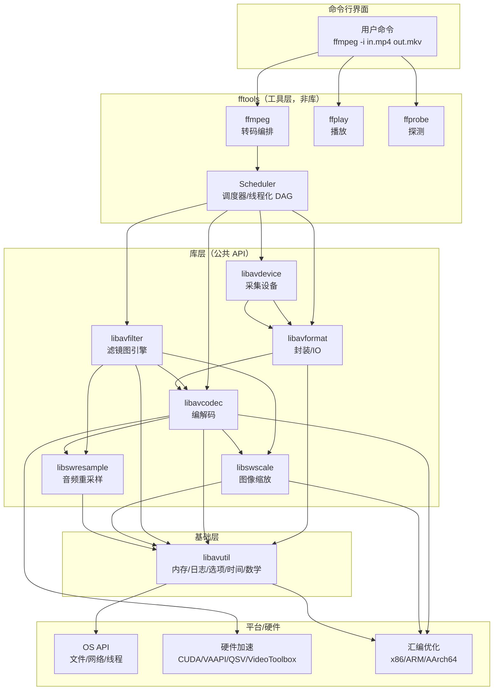

### 1.4 库间依赖关系图

库的依赖是**严格有向无环**的，`configure` 脚本据此决定链接顺序（`Makefile` 中 `FFLIBS-yes` 按链接顺序排列）：

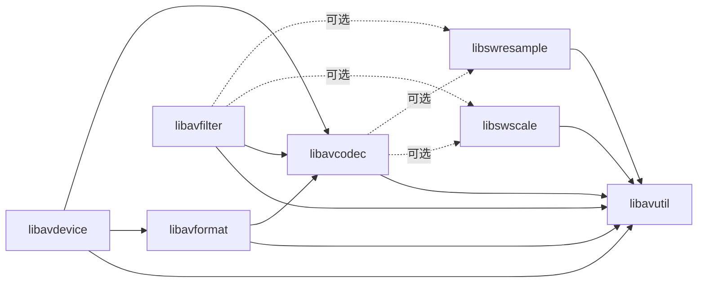

实线为强依赖，虚线为可选依赖（通过 `configure` 的 `CONFIG_*` 宏控制）。这种分层使得：
- 可以单独编译 `libavutil` 而不引入任何多媒体依赖；
- `libavcodec` 可脱离 `libavformat` 独立使用（如纯解码场景）；
- `libavdevice` 是最上层，依赖最广，可整体禁用。

### 1.5 设计哲学

FFmpeg 的架构贯穿五条设计哲学：

1. **注册表模式（Registry）**：编解码器、格式、滤镜、协议、设备都通过 `extern const FFCodec ff_xxx` / `ff_xxx_demuxer` 等符号集中注册在 `allcodecs.c` / `allformats.c` / `allfilters.c` 中，由 `configure` 生成的 `config_components.h` 决定哪些被启用。新增一个编解码器只需新增一个文件并登记一行，无需改动核心代码。

2. **回调/虚表驱动（Callback/Vtable）**：所有可扩展点都是函数指针集合——`AVCodec` 的 `init/decode/encode/close`、`AVInputFormat` 的 `read_header/read_packet/read_close`、`AVFilter` 的 `init/filter/uninit`。核心代码通过虚表调用具体实现，实现多态。

3. **引用计数与零拷贝**：`AVFrame`/`AVPacket` 不持有数据内存，而是持有 `AVBufferRef`（对 `AVBuffer` 的引用）。一帧数据在 demux→dec→filter→enc→mux 全程可被多个消费者共享同一块物理内存，只在写时复制（`av_frame_make_writable`）。这是 FFmpeg 高吞吐的关键。

4. **平台抽象**：所有平台差异被压缩进 `libavutil`（`config.h`、`attributes.h`、`bswap.h`、`thread.h`）和 `compat/` 层，上层代码写一次即可在 Linux/Windows/macOS/Android/iOS 运行。汇编优化通过 `asm` 目录与 NASM 独立维护，C 实现始终作为 fallback。

5. **ABI 稳定与内部/公有分离**：公有结构（`AVCodec`、`AVFormatContext`）定义在 `*.h` 中保证 ABI；内部扩展（`FFCodec`、`AVFormatContext` 的内部字段）定义在 `*_internal.h` 中，通过 `p`（public）字段嵌套或 `FF_API_*` 宏做版本过渡。这使库可以持续演进而不破坏二进制兼容。

---

## 第 2 章 · 入口与启动流程

### 2.1 main() 启动序列

`fftools/ffmpeg.c:main()` 是 `ffmpeg` 可执行程序的入口，其启动序列严格遵循"初始化全局 → 解析选项 → 启动调度 → 等待完成 → 清理"五段式：

```c
int main(int argc, char **argv)
{
    Scheduler *sch = NULL;
    init_dynload();                          // 1. 平台动态加载初始化（Win）
    setvbuf(stderr, NULL, _IONBF, 0);
    av_log_set_flags(AV_LOG_SKIP_REPEATED);
    parse_loglevel(argc, argv, options);     // 2. 提前解析 -loglevel
#if CONFIG_AVDEVICE
    avdevice_register_all();                 // 3. 注册设备（旧式，多数库已自动注册）
#endif
    avformat_network_init();                 // 4. 初始化网络（sockets/SSL）
    show_banner(argc, argv, options);

    sch = sch_alloc();                        // 5. 分配调度器（转码 DAG 容器）
    ret = ffmpeg_parse_options(argc, argv, sch); // 6. 解析选项 + 打开输入/输出
    ...
    ret = transcode(sch);                     // 7. 启动并等待转码完成
    ...
finish:
    ffmpeg_cleanup(ret);                     // 8. 释放所有组件
    sch_free(&sch);                          // 9. 释放调度器
    avformat_network_deinit();
    return ret;
}
```

注意：现代 FFmpeg（4.x 起）已**移除显式的 `avcodec_register_all()`**，编解码器/格式通过构建期生成的静态表（`codec_list.c`、`format_list.c`）在首次访问时惰性初始化（线程安全的 `pthread_once`）。`avdevice_register_all()` 仍保留是因为设备层默认禁用、需显式开启。

### 2.2 选项解析总览

`ffmpeg_parse_options`（`ffmpeg_opt.c:1480`）是选项解析的总入口，它把命令行拆解为四类分组并依次处理：

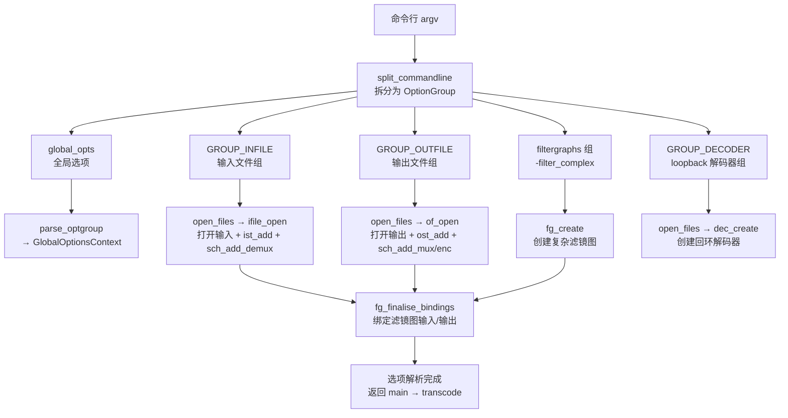

关键点：

- **split_commandline**（`cmdutils.c`）是 FFmpeg 自研的命令行解析器，支持"全局选项 + 分组选项"的语法（如 `-i input -filter_complex ... output`），把 argv 拆成 `OptionParseContext`，其中 `groups[GROUP_INFILE/OUTFILE/DECODER]` 是按文件/解码器分组的选项块。
- **OptionsContext** 是一个巨型临时结构（`ffmpeg_opt.c:init_options`），承载一次文件打开所需的全部参数（codec、bitrate、filters、stream maps 等），在 `open_files` 中对每个分组 `init_options → parse_optgroup → open_file → uninit_options`，用完即弃。
- **打开顺序**：先建复杂滤镜图 → 开输入 → 开输出 → 建 loopback 解码器 → `fg_finalise_bindings` 绑定。这个顺序保证滤镜图在输入/输出都已创建后才绑定，便于做格式协商与连接校验。
- **`ifile_open`**（`ffmpeg_demux.c:1873`）打开输入容器、`avformat_open_input` + `avformat_find_stream_info`，为每个流调用 `ist_add` 创建 `InputStream` 并 `sch_add_demux` / `sch_add_demux_stream` 注册到调度器。
- **`of_open`**（`ffmpeg_mux_init.c`）打开输出容器、`create_streams`（含 `map_auto_*` / `map_manual` 流映射）、`ost_add` 创建 `OutputStream`、`sch_add_mux` / `sch_add_mux_stream` / `sch_add_enc` 注册到调度器，并 `sch_connect` 建立节点连接。

### 2.3 启动时序图

```mermaid
sequenceDiagram
    participant M as main
    participant OPT as ffmpeg_parse_options
    participant SCH as Scheduler
    participant IN as ifile_open
    participant OUT as of_open
    participant FG as fg_create
    participant T as transcode

    M->>M: init_dynload / avformat_network_init
    M->>SCH: sch_alloc()
    M->>OPT: ffmpeg_parse_options(argc, argv, sch)
    OPT->>OPT: split_commandline → OptionParseContext
    OPT->>OPT: parse_optgroup(全局选项)
    loop 每个 -filter_complex
        OPT->>FG: fg_create()
        FG->>SCH: sch_add_filtergraph(nb_in, nb_out)
    end
    loop 每个输入文件
        OPT->>IN: ifile_open()
        IN->>IN: avformat_open_input / find_stream_info
        loop 每个流
            IN->>IN: ist_add()
            IN->>SCH: sch_add_demux_stream()
        end
        IN->>SCH: sch_add_demux(input_thread)
    end
    loop 每个输出文件
        OPT->>OUT: of_open()
        OUT->>OUT: create_streams (map_auto/manual)
        loop 每个输出流
            OUT->>OUT: ost_add() / enc_alloc()
            OUT->>SCH: sch_add_mux_stream / sch_add_enc
        end
        OUT->>SCH: sch_add_mux(muxer_thread)
        OUT->>SCH: sch_connect(demux/dec/enc → mux)
    end
    OPT->>SCH: fg_finalise_bindings() / sch_connect 全部连接
    OPT-->>M: 返回
    M->>T: transcode(sch)
    T->>SCH: sch_start()  (启动所有线程)
    T->>T: while sch_wait() { print_report; 键盘交互 }
    T->>SCH: sch_stop()
    T->>T: of_write_trailer() / print_report
    T-->>M: 返回 ret
    M->>M: ffmpeg_cleanup / sch_free
```

### 2.4 transcode() 主循环

`transcode()`（`ffmpeg.c:887`）本身极简——真正的转码工作全在调度器启动的各线程里，主线程只负责"等待 + 报告 + 键盘交互"：

```c
static int transcode(Scheduler *sch)
{
    print_stream_maps();
    atomic_store(&transcode_init_done, 1);
    ret = sch_start(sch);              // 启动所有 demux/dec/filter/enc/mux 线程
    while (!sch_wait(sch, stats_period, &transcode_ts)) {
        if (received_nb_signals) break;
        if (stdin_interaction) check_keyboard_interaction(cur_time); // 'q' 退出
        print_report(0, ...);          // 周期性打印进度
    }
    ret = sch_stop(sch, &transcode_ts);
    for (i ...) of_write_trailer(output_files[i]); // 写尾部
    print_report(1, ...);              // 最终报告
    return ret;
}
```

`sch_wait` 以 `stats_period`（`-stats_period`，默认 0.5s）为超时阻塞，超时返回 0（继续循环），转码全部完成返回 1（退出循环）。这种"主线程只监督、工作线程自驱"的设计是 FFmpeg 多线程转码的核心。

### 2.5 cmdutils 与通用选项机制

`cmdutils.c`（1639 行）是三个工具共享的命令行工具库：

- **split_commandline / parse_optgroup / parse_options**：通用选项解析，支持 `OptionDef`（`{name, flags, func}`）描述的选项表；
- **show_banner / show_usage / show_help**：统一帮助输出；
- **opt_default**：把通用选项（如 `-b`、`-s`）映射到具体编解码器/格式的 AVOption；
- **opt_common.c**（1505 行）：跨工具的公共选项（`-version`、`-formats`、`-codecs`、`-decoders`、`-filters`、`-pix_fmts` 等），通过遍历注册表生成列表。

`opt_common.c` 之所以庞大，是因为它要把所有库的注册表（codecs/formats/filters/protocols/devices）枚举出来并格式化打印，是 FFmpeg 自省能力的集中体现。

---

## 第 3 章 · 核心数据结构（类图）

FFmpeg 的核心数据结构可归为四类：**数据载体**（Frame/Packet/Buffer）、**编解码抽象**（Codec/CodecContext/Parameters）、**封装抽象**（FormatContext/Stream/IO）、**滤镜抽象**（Filter/Graph/Link/Pad），外加贯穿全局的**元系统**（AVClass/AVOption）。

### 3.1 数据载体：AVFrame / AVPacket / AVBuffer

FFmpeg 的内存模型建立在**引用计数**之上。`AVBuffer` 是真正的内存块（含引用计数与 free 回调），`AVBufferRef` 是对它的一个引用（含 data 指针与 size）。`AVFrame` 与 `AVPacket` 都通过 `AVBufferRef *buf` 持有数据，自身只是"元数据 + 引用"。

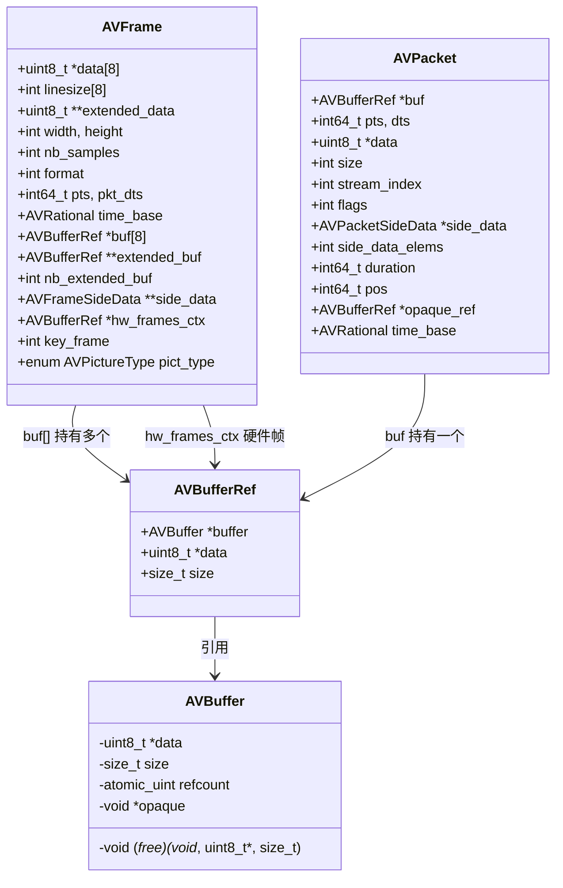

**设计要点**：

- `AVFrame` 用于**解码后/滤镜处理中**的原始数据（视频帧或音频采样），`AVPacket` 用于**编码后**的压缩数据（含 pts/dts/duration/side_data）。二者对称设计，都通过 `av_frame_ref`/`av_packet_ref` 增加引用、`av_frame_unref`/`av_packet_unref` 释放。
- `data[8]` + `extended_data`/`extended_buf` 支持最多 8 个平面的常见情况，更多平面（如超多声道音频）通过扩展数组处理。
- `hw_frames_ctx`：硬件帧上下文，标识该帧数据位于哪个硬件设备池（CUDA/VAAPI/QSV），是硬件加速链路的关键。
- **零拷贝**：demux 出的 packet 传给 decoder、decoder 输出的 frame 传给 filter、filter 输出传给 encoder，全程只增加 `AVBufferRef` 引用计数，不复制数据；只有当某一方需要写入时才 `av_frame_make_writable` 触发 COW（写时复制）。

### 3.2 编解码抽象：AVCodec / FFCodec / AVCodecContext / AVCodecParameters

这是 FFmpeg "公有 ABI + 内部扩展"分离的典型范例：

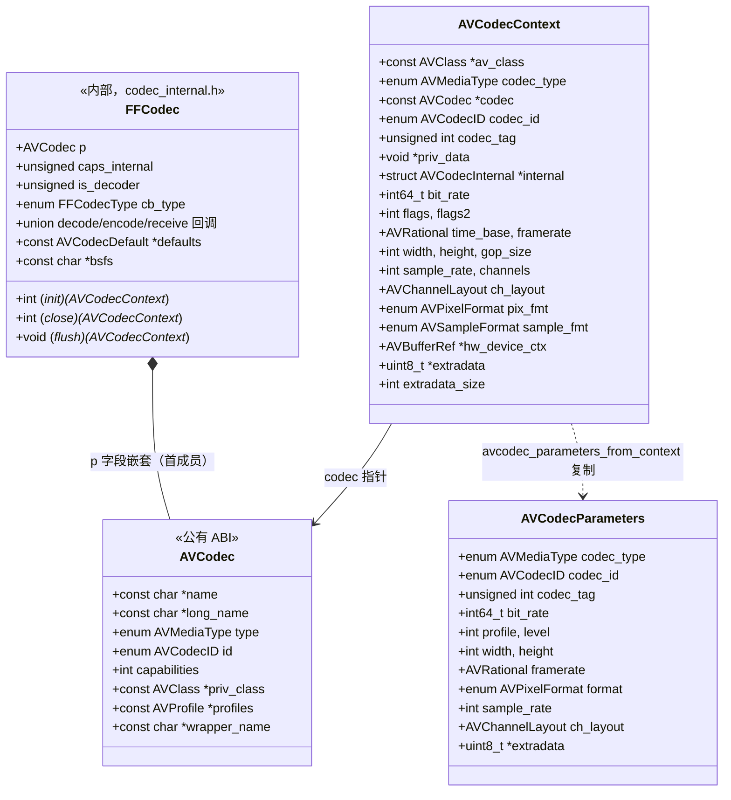

**关键设计**：

- **`FFCodec` 首成员是 `AVCodec p`**：通过 C 的结构体首成员嵌套，`FFCodec*` 可安全转型为 `AVCodec*`。公有代码只看到 `AVCodec`（ABI 稳定），内部代码通过 `ffcodec()` 宏取回 `FFCodec` 访问回调。这是 C 语言实现"公有接口 + 内部实现"的经典手法。
- **回调类型 `FFCodecType`**：编解码器可选择 `DECODE`（同步送一帧取一帧）、`RECEIVE_FRAME`（解码器主动推）、`ENCODE`、`RECEIVE_PACKET`（编码器主动推）四种风格之一，适配不同编解码库的 API 形态。
- **`AVCodecContext` vs `AVCodecParameters`**：前者是编解码器的**运行时上下文**（含状态、私有数据 `priv_data`、硬件设备），后者是流的**静态参数**（只描述 codec_id/分辨率/采样率等，无状态）。`AVStream->codecpar` 用 `AVCodecParameters`，使"流"与"编解码器实例"解耦——一个流可以不打开编解码器就描述其参数。
- **`priv_data` + `priv_class`**：每个编解码器的私有状态（如 H.264 的 `H264Context`）挂在 `priv_data`，其 `AVClass` 挂在 `AVCodec.priv_class`，使编解码器私有参数也能用 AVOption 机制设置（如 `-x264-params`）。

### 3.3 封装抽象：AVFormatContext / AVStream / AVInputFormat / AVOutputFormat / AVIOContext

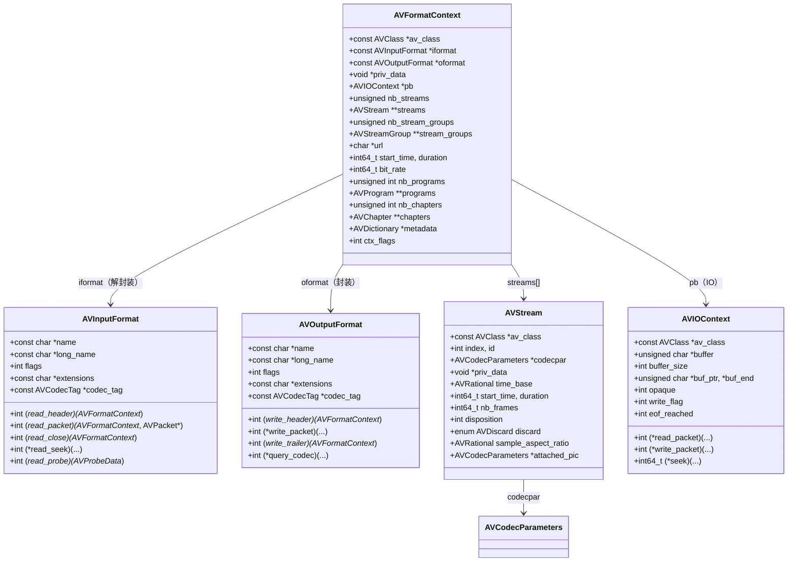

**设计要点**：

- `AVInputFormat`/`AVOutputFormat` 是**虚表**：demuxer/muxer 只需实现这些函数指针即可接入，核心代码通过虚表调用。`read_probe` 用于格式探测（从文件头字节猜测格式）。
- `AVFormatContext` 同时承载输入和输出（通过 `iformat`/`oformat` 二选一），`priv_data` 存放格式私有状态（如 MP4 的 `MOVContext`）。
- `AVStream->codecpar` 取代了早期版本的 `AVStream->codec`（已废弃），使流参数与编解码器实例分离。
- `AVIOContext` 是**分层 IO** 的核心：它本身只是"带缓冲的字节流 + 读/写/.seek 回调"，底层可挂接文件、管道、网络协议、内存缓冲。`avformat` 通过 `pb` 读写数据，不关心字节从哪来。

### 3.4 滤镜抽象：AVFilter / AVFilterContext / AVFilterGraph / AVFilterLink / AVFilterPad

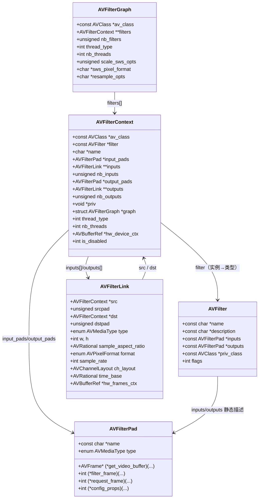

**设计要点**：

- **AVFilter 是类型（虚表），AVFilterContext 是实例**：`scale` 滤镜是一个 `AVFilter`，但一个图里可以有多个 `AVFilterContext`（多个 scale 实例）。`priv` 字段存实例私有状态。
- **AVFilterPad 描述端口**：`inputs`/`outputs` 是静态端口列表（如 `scale` 有 1 入 1 出，`split` 有 1 入 N 出）。`AVFILTER_FLAG_DYNAMIC_INPUTS/OUTPUTS` 标记动态端口数（如 `concat`、`split`）。
- **AVFilterLink 是连接**：连接两个 `AVFilterContext`，并承载协商后的格式（`format`/`w`/`h`/`sample_rate`/`ch_layout`/`time_base`）。滤镜图本质是"节点（Context）+ 边（Link）"的有向图。
- **AVFilterGraph 是容器**：管理一组 `AVFilterContext`，负责图构建（`avfilter_graph_parse`）、格式协商（`query_formats`）、配置（`avfilter_graph_config`）、线程化。

### 3.5 元系统：AVClass / AVOption

`AVClass` 与 `AVOption` 是 FFmpeg 的"自省元系统"，使日志、选项、帮助文档统一化：

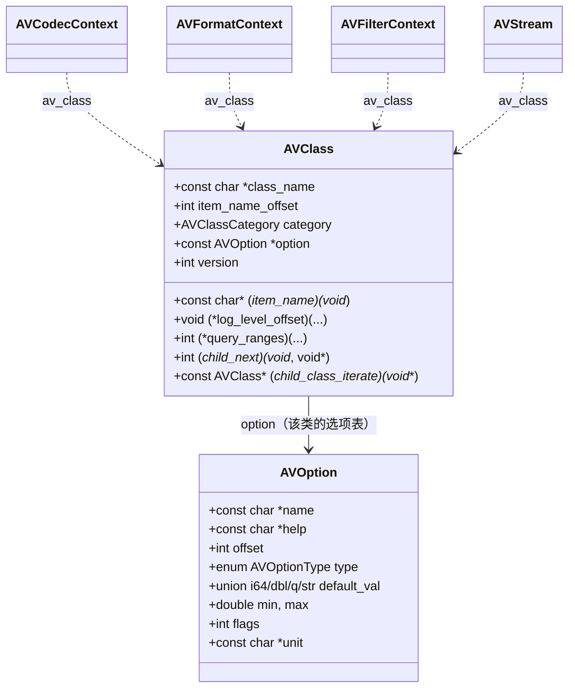

**机制**：任何结构体只要首成员是 `const AVClass *av_class`，就具备了：
- **统一日志**：`av_log(ctx, level, ...)` 通过 `av_class->item_name` 取对象名，按级别过滤输出；
- **统一选项**：`av_opt_set/find/get` 通过 `av_class->option` 表（`AVOption` 数组，含 `offset` 偏移）用字符串名读写结构体字段，无需手写 getter/setter；
- **自省**：`av_opt_next` 遍历选项表，`opt_common.c` 据此生成 `-help` 文档；
- **子类遍历**：`child_next`/`child_class_iterate` 让 `AVFormatContext` 能访问其 demuxer 私有的 `AVClass` 选项（如 MP4 的 `movflags`）。

这套元系统是 FFmpeg 用 C 实现"反射"的精妙之处——`-b:v 2M`、`-movflags +faststart`、`-x264-params` 最终都走同一条 `av_opt_set` 路径。

### 3.6 综合类图

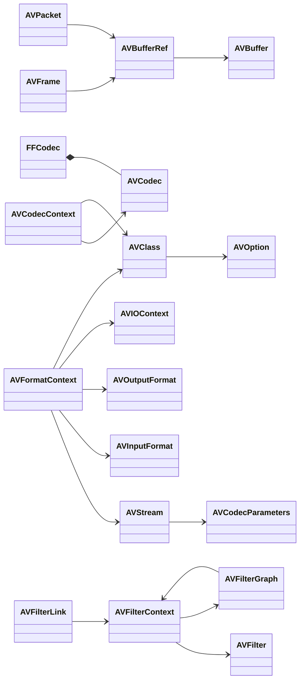

---

## 第 4 章 · 转码调度器 Scheduler（核心枢纽）

`fftools/ffmpeg_sched.c`（2776 行）是 FFmpeg 7.x 重构后的转码核心。它把"demux→dec→filter→enc→mux"五类组件抽象为**有向无环图（DAG）的节点**，每个节点一个线程，节点间通过调度器中转数据。这是 FFmpeg 工程上最精妙的部分。

### 4.1 调度器的角色：唯一中介

`ffmpeg_sched.h` 开篇的注释阐明了设计意图：

> "all instances of the abovementioned components communicate only with the scheduler and not with each other. The scheduler is then the single place containing the knowledge about the whole transcoding pipeline."

即：demux 线程不直接调用 decoder，而是把 packet 交给调度器；decoder 从调度器取 packet、把 frame 交回调度器；filter/encoder/mux 同理。调度器是**唯一的全局知识持有者**，组件间零耦合。

这种"星型拓扑 + DAG 建模"的好处：
- 组件实现互不感知，可独立开发、测试、替换；
- 全局同步逻辑（DTS 对齐、反压、EOF 传播）集中在一处，避免散落各组件；
- DAG 结构在启动期校验，无环保证不会死锁。

### 4.2 节点类型与 DAG

调度器定义六类节点（`SchedulerNodeType`）：

| 节点类型 | 含义 | 线程函数 |
|---------|------|---------|
| `SCH_NODE_TYPE_DEMUX` | 解封装器，含多个流 | `input_thread`（ffmpeg_demux.c） |
| `SCH_NODE_TYPE_DEC` | 解码器，含多个输出（一进多出，如多视图） | `decoder_thread`（ffmpeg_dec.c） |
| `SCH_NODE_TYPE_FILTER_IN` | 滤镜图输入端口 | （与 FILTER_OUT 同属一个 filter 线程） |
| `SCH_NODE_TYPE_FILTER_OUT` | 滤镜图输出端口 | `filter_thread`（ffmpeg_filter.c） |
| `SCH_NODE_TYPE_ENC` | 编码器 | `encoder_thread`（ffmpeg_enc.c） |
| `SCH_NODE_TYPE_MUX` | 封装器，含多个流 | `muxer_thread`（ffmpeg_mux.c） |

一个典型的"转码"DAG：

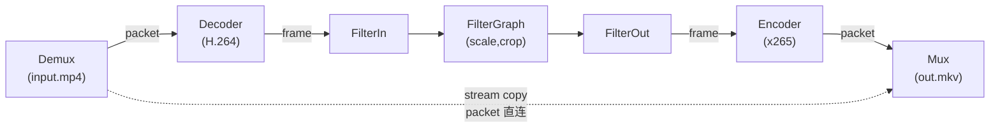

一个"stream copy"的边直接从 Demux 连到 Mux，绕过 Dec/Filter/Enc。一个复杂场景可有多输入、多输出、多滤镜图、多编码器，构成任意 DAG（启动期校验无环）。

### 4.3 sch_connect 连接模型

`sch_connect(sch, src, dst)` 在启动期被 `of_open`/`ifile_open` 反复调用，把节点间的边记录到调度器内部结构。其逻辑是**按 src 类型分支**，把 `dst` 节点追加到 src 的 `dst[]` 数组，同时把 `src` 记录到 dst 的 `src` 字段（双向记录）：

```
sch_connect(src=DEMUX[0].stream[1], dst=DEC[0])
  → demux[0].streams[1].dst[] += {DEC[0]}
  → dec[0].src = {DEMUX[0].stream[1]}

sch_connect(src=DEC[0].output[0], dst=FILTER_IN[0])
  → dec[0].outputs[0].dst[] += {FILTER_IN[0]}
  → filter[0].inputs[0].src = {DEC[0].output[0]}

sch_connect(src=FILTER_OUT[0], dst=ENC[0])
  → filter[0].outputs[0].dst += {ENC[0]}
  → enc[0].src = {FILTER_OUT[0]}

sch_connect(src=ENC[0], dst=MUX[0].stream[0])
  → enc[0].dst[] += {MUX[0].stream[0]}
  → mux[0].streams[0].src = {ENC[0]}
```

连接建立后，数据流通过 `sch_demux_send` / `sch_dec_receive` / `sch_dec_send` / `sch_filter_receive` / `sch_filter_send` / `sch_enc_receive` / `sch_enc_send` / `sch_mux_receive` 这套 API 在节点间传递，调度器内部根据记录的 `dst[]` 把数据投递到目标节点的 `ThreadQueue`。

### 4.4 线程模型与 ThreadQueue

每个节点是一个 `SchTask`（含 `pthread_t` 与线程函数），由 `sch_start` 统一创建。节点间数据通过 `ThreadQueue`（`thread_queue.c`，268 行）传递——一个有界、多生产者多消费者、支持多流的线程安全队列。

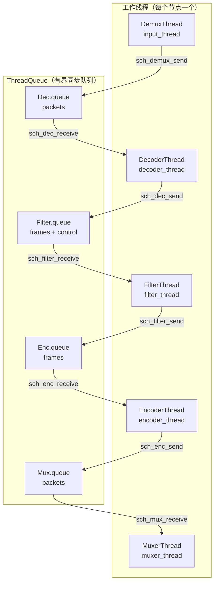

`ThreadQueue` 的关键特性：
- **多流复用**：一个队列可承载多个"流"（如滤镜图的多个输入 + 一个控制流），消费者按流号取数据；
- **有界反压**：队列满时 `tq_send` 阻塞生产者，形成背压，防止 demux 过快淹没下游；
- **EOF 传播**：`tq_send` 带 `TQ_SEND_FINISH` 标志可发送 EOF，消费者 `tq_receive` 收到 EOF 知道上游结束；
- **控制消息**：滤镜图队列的"最后一个流"是控制流，用于传递 `filter_command`（如运行时改变滤镜参数）。

### 4.5 同步策略：DTS 对齐与反压

FFmpeg 需保持**所有输出流的 DTS 同步**（同一时刻各 mux 的已写包 DTS 接近）。调度器通过两类机制实现：

1. **Mux 侧的 PreMuxQueue + ready 信号**：每个 `SchMuxStream` 有一个 `PreMuxQueue`（`AVFifo`），在 muxer 线程正式启动前缓冲早到的包。`sch_mux_stream_ready` 标记某流就绪，所有流就绪（`nb_streams_ready == nb_streams`）后 `mux_started` 置位，muxer 线程才开始消费。这避免了"一个流先到、另一个流后到"导致的交错错乱。

2. **Demux 侧的 SchWaiter / choke**：每个 `SchDemux` 有一个 `SchWaiter`。当某 mux 流的 `last_dts` 落后于其他流太多时，调度器 `waiter_set(&demux->waiter, choked=1)` "掐住"该 demux 线程，`input_thread` 在 `waiter_wait` 处阻塞，直到落后流追上才 `choked=0` 放行。这是**通过调节 demux 读取速率实现全局同步**的核心机制。

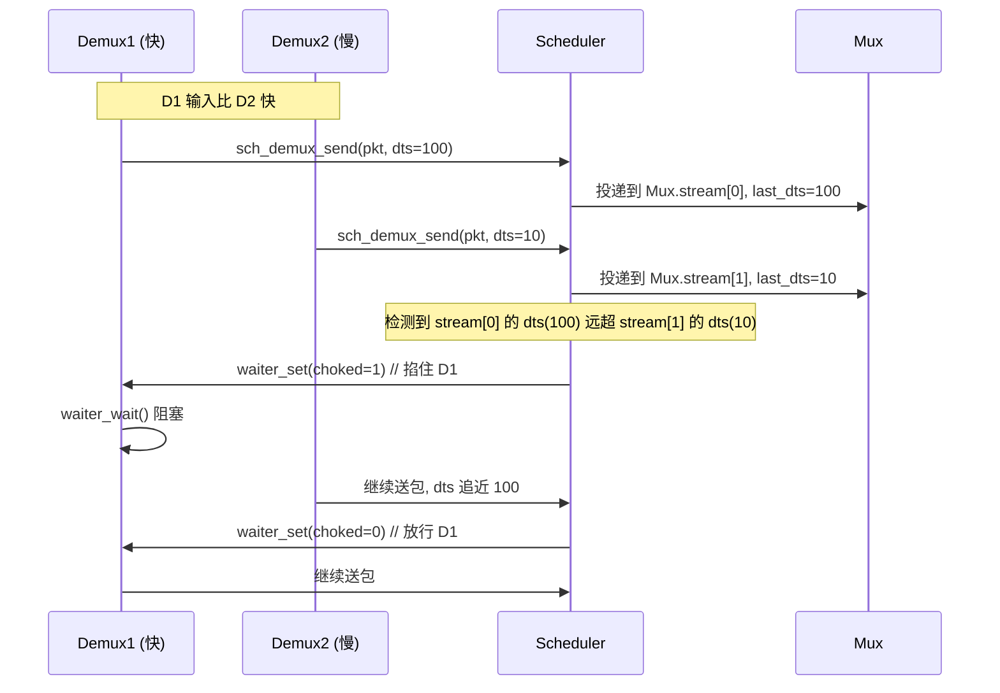

注释明确指出同步能力有根本限制：若同一输入内的流交错速率与目标 mux 速率不匹配（如用户对音视频做了不同倍速的变速），缓冲会持续增长直至转码失败。

### 4.6 调度器内部结构总览

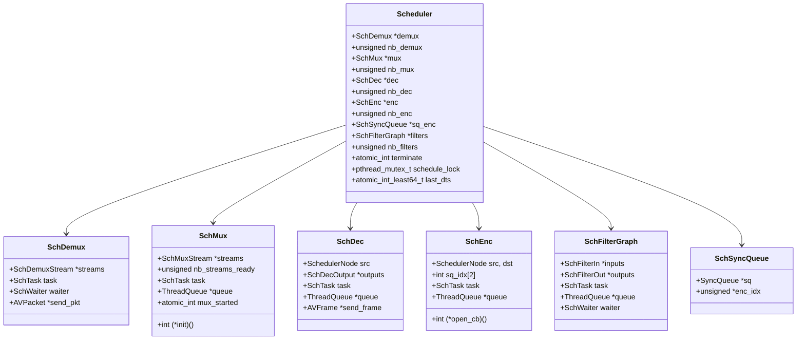

`SchSyncQueue`（同步队列，`sync_queue.c`）用于编码器侧：当某编码器要求固定音频帧大小（如 AAC），同步队列负责把变长输入切成/拼成定长帧，多个编码器可共享一个同步队列。

### 4.7 调度控制流图

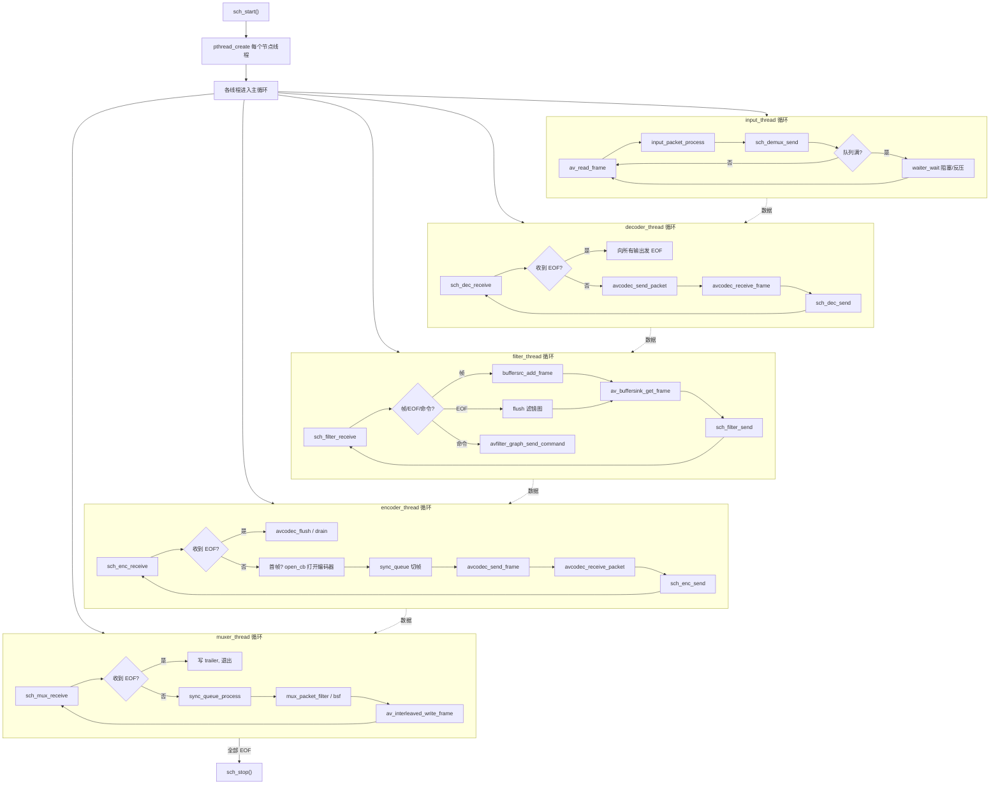

调度器本身不执行任何编解码/滤镜逻辑，它只做三件事：**记录连接拓扑、中转数据、施加同步/反压**。所有媒体处理都在各组件线程内由库函数完成。

---

## 第 5 章 · 完整业务流程 — 视频转码

本章以 `ffmpeg -i in.mp4 -vf scale=1280:720 -c:v libx265 out.mkv` 为例，跟踪一个视频帧从输入到输出的完整旅程。五类线程各司其职，通过调度器的 `ThreadQueue` 串联。

### 5.1 端到端数据流总览

```mermaid
flowchart LR
    subgraph Demux["Demux 线程 (input_thread)"]
        D1["av_read_frame"] --> D2["input_packet_process<br/>ts 修正/丢弃"]
        D2 --> D3["demux_send<br/>sch_demux_send"]
    end
    subgraph Dec["Decoder 线程 (decoder_thread)"]
        C1["sch_dec_receive"] --> C2["packet_decode<br/>avcodec_send/receive"]
        C2 --> C3["video_frame_process<br/>hwaccel/duration"]
        C3 --> C4["sch_dec_send"]
    end
    subgraph Filter["Filter 线程 (filter_thread)"]
        F1["sch_filter_receive"] --> F2["send_frame→buffersrc"]
        F2 --> F3["av_buffersink_get_frame<br/>循环取帧"]
        F3 --> F4["sch_filter_send"]
    end
    subgraph Enc["Encoder 线程 (encoder_thread)"]
        E1["sch_enc_receive"] --> E2["frame_encode<br/>avcodec_send/receive"]
        E2 --> E3["sch_enc_send"]
    end
    subgraph Mux["Mux 线程 (muxer_thread)"]
        M1["sch_mux_receive"] --> M2["sync_queue_process"]
        M2 --> M3["mux_packet_filter<br/>bsf/ts 修正"]
        M3 --> M4["av_interleaved_write_frame"]
    end

    D3 -->|"ThreadQueue<br/>AVPacket"| C1
    C4 -->|"ThreadQueue<br/>AVFrame"| F1
    F4 -->|"ThreadQueue<br/>AVFrame"| E1
    E3 -->|"ThreadQueue<br/>AVPacket"| M1
    M4 -->|"AVIOContext<br/>字节流"| FILE["out.mkv 文件"]
```

数据形态在管线中演变：**AVPacket（压缩）→ AVFrame（原始）→ AVFrame（处理后）→ AVPacket（压缩）→ 字节流**。每次跨线程传递都是引用计数的 `AVBufferRef` 转移，零拷贝。

### 5.2 Demux 线程（ffmpeg_demux.c: input_thread）

`input_thread` 是输入侧的唯一线程，职责是持续读包并投递给下游：

```c
while (1) {
    ret = av_read_frame(f->ctx, dt.pkt_demux);   // 从容器读一个包
    if (ret == AVERROR(EAGAIN)) { usleep(10000); continue; }  // 非阻塞 IO 重试
    if (ret < 0) { /* EOF 或错误处理，含 loop 回放 */ break; }

    ds = ds_from_ist(f->streams[pkt->stream_index]);
    if (!ds || ds->discard || ds->finished) { unref; continue; }  // 丢弃不用的流

    input_packet_process(d, dt.pkt_demux, &send_flags);  // ts 修正、corrupt 检查
    if (d->readrate) readrate_sleep(d);                 // -readrate 限速
    demux_send(d, &dt, ds, dt.pkt_demux, send_flags);    // 投递到调度器
}
```

**`input_packet_process`**（`ffmpeg_demux.c:463`）做三件事：
1. **`ts_discontinuity_detect/process`**：检测时间戳不连续（如直播流断流重连），做时间戳补偿；
2. **`ist_dts_update`**：把 packet 的 dts 同步到流的时间基；
3. **`ts_fixup`**：按 `copy_ts`、`start_at_zero` 等选项调整时间戳。

**`demux_send`**（`ffmpeg_demux.c:585`）调用 `sch_demux_send`，调度器根据该流连接的 `dst[]`（可能同时连到 decoder 和 muxer——stream copy 场景），把 packet 投递到对应 `ThreadQueue`。若队列满则阻塞（反压）。

### 5.3 Decoder 线程（ffmpeg_dec.c: decoder_thread）

`decoder_thread` 从调度器取压缩包，解码成原始帧，再投回调度器：

```c
while (!input_status) {
    input_status = sch_dec_receive(dp->sch, dp->sch_idx, dt.pkt);  // 取包
    have_data = input_status >= 0 && (pkt->buf || side_data || 特殊心跳包);
    flush_buffers = input_status >= 0 && !have_data;  // flush 信号

    if (!dp->dec_ctx) {  // 首次：standalone decoder 延迟打开
        dec_standalone_open(dp, dt.pkt);
    }

    ret = packet_decode(dp, have_data ? dt.pkt : NULL, dt.frame);

    if (ret == AVERROR_EOF) {
        if (!flush_buffers) break;       // 真正结束
        avcodec_flush_buffers(dp->dec_ctx);  // flush 后继续（seek 场景）
    }
}
// 结束时发送带 FRAME_OPAQUE_EOF 的空帧，把最后的时间戳传给下游
sch_dec_send(dp->sch, dp->sch_idx, 0, dt.frame);
```

**`packet_decode`**（`ffmpeg_dec.c:699`）是解码核心，调用 `avcodec_send_packet` + `avcodec_receive_frame`（新版 API），一次送一包、循环取帧（一个包可能产生多帧，如 B 帧 reordering 后的 flush）。

**`video_frame_process`**（`ffmpeg_dec.c:387`）对解码后的帧做后处理：
- `hwaccel_retrieve_data`：若帧在硬件内存（如 CUDA），按需下载到系统内存（除非下游也用硬件）；
- `video_duration_estimate`：估计帧时长（部分编码无明确 duration）；
- `audio_ts_process`：音频帧的时间戳修正。

解码器支持**一进多出**（`SchDecOutput *outputs`）：多视图（multiview）场景下，一个解码器输出多个视角的帧，分别送给不同滤镜图。

### 5.4 Filter 线程（ffmpeg_filter.c: filter_thread）

`filter_thread` 是滤镜图的执行引擎，特点为**延迟配置**——滤镜图在收到第一帧、知道输入格式后才能完成格式协商与配置：

```c
// 首帧到达前，若所有输入格式已知则提前配置
if (ifilter_has_all_input_formats(fg))
    configure_filtergraph(fg, &fgt);

while (1) {
    input_status = sch_filter_receive(fgp->sch, fgp->sch_idx, &input_idx, fgt.frame);
    if (input_status == AVERROR_EOF) break;

    // 控制流（input_idx == nb_inputs）：运行时命令
    if (input_idx == fg->nb_inputs) {
        fc = (FilterCommand*)fgt.frame->buf[0]->data;
        send_command(fg, fgt.graph, fc->time, fc->target, fc->command, fc->arg, ...);
        continue;
    }

    ifilter = fg->inputs[input_idx];
    if (ifp->type_src == AVMEDIA_TYPE_SUBTITLE)
        sub2video_frame(...);           // 字幕转视频
    else if (fgt.frame->buf[0])
        send_frame(fg, &fgt, ifilter, fgt.frame);  // 送入 buffersrc
    else
        send_eof(&fgt, ifilter, ...);   // 输入 EOF

read_frames:
    // 循环从 buffersink 取出所有已就绪帧
    while (av_buffersink_get_frame(...)) {
        sch_filter_send(fgp->sch, fgp->sch_idx, out_idx, frame);
    }
}
```

**关键机制**：

- **延迟配置**：`configure_filtergraph`（`ffmpeg_filter.c:2064`）在第一帧到达时调用，执行 `avfilter_graph_parse`（解析滤镜字符串为滤镜实例）→ `query_formats`（格式协商）→ `avfilter_graph_config`（配置连接、时间基）。此前滤镜图只是"未配置的骨架"。
- **send_frame**：首帧到达时，若滤镜图尚未配置，先用帧的参数（分辨率/格式/时间基）填充 `InputFilterPriv`，待所有输入参数齐全再 `configure_filtergraph`，然后把帧送入 `buffersrc`（`av_buffersrc_add_frame`）。
- **read_frames 循环**：每送入一帧后，循环 `av_buffersink_get_frame` 取出所有已就绪的输出帧（一个输入帧可能触发多个输出帧，如 fps 滤镜补帧；也可能多个输入帧才产出一个输出帧，如 blend）。
- **控制流**：滤镜图队列的最后一个"流"是控制流，承载 `FilterCommand`（如 `sendcmd` 滤镜、运行时改参数），通过 `avfilter_graph_send_command` 下发。

### 5.5 Encoder 线程（ffmpeg_enc.c: encoder_thread）

`encoder_thread` 从调度器取处理后的帧，编码成压缩包：

```c
// 字幕编码器立即打开；音视频编码器延迟到首帧由调度器回调打开
if (ost->type != AVMEDIA_TYPE_VIDEO && ost->type != AVMEDIA_TYPE_AUDIO)
    enc_open(ost, NULL);

while (!input_status) {
    input_status = sch_enc_receive(ep->sch, ep->sch_idx, et.frame);  // 取帧
    if (input_status == AVERROR_EOF) break;

    frame_encode(ost, et.frame, et.pkt);  // 编码
}
// flush：送 NULL 帧 drain 出编码器内剩余帧
frame_encode(ost, NULL, et.pkt);
```

**`frame_encode`**（`ffmpeg_enc.c:783`）→ `encode_frame`（`ffmpeg_enc.c:611`）：
1. `check_recording_time`：检查是否超过 `-t` 时长；
2. `avcodec_send_frame` + `avcodec_receive_packet`（新版 API）循环取包；
3. `update_video_stats`：更新编码统计（PSNR/质量）；
4. `enc_stats_write`：写 `-stats` 编码统计。

**编码器延迟打开**（`SchEnc.open_cb`）：音视频编码器需要首帧的参数（分辨率/格式/时间基）才能确定编码参数，因此 `enc_open` 通过调度器回调在首帧到达时触发。这与解码器的延迟打开对称。注释中详细描述了编码器与同步队列的**循环依赖**：打开编码器需要首帧参数，而同步队列切帧又需要编码器要求的帧大小——通过"首帧触发 open_cb 返回帧大小给同步队列"解决。

### 5.6 Mux 线程（ffmpeg_mux.c: muxer_thread）

`muxer_thread` 从调度器取压缩包，经同步队列与比特流过滤后写入容器：

```c
while (1) {
    ret = sch_mux_receive(mux->sch, of->index, mt.pkt);  // 取包
    stream_idx = mt.pkt->stream_index;
    if (stream_idx < 0) break;  // 所有流 EOF

    ost = of->streams[mux->sch_stream_idx[stream_idx]];
    ret = mux_packet_filter(mux, &mt, ost, mt.pkt, &stream_eof);
    if (ret == AVERROR_EOF) {
        if (stream_eof) sch_mux_receive_finish(...);  // 该流结束
        else break;                                    // 全部结束
    }
}
```

**`mux_packet_filter`**（`ffmpeg_mux.c:288`）链式处理：
1. **`sync_queue_process`**：同步队列处理（多流间对齐、音频定长帧）；
2. **`mux_fixup_ts`**：时间戳最终修正（容器时间基转换、偏移）；
3. **`of_streamcopy`**（stream copy 路径）：直接复用包，经 bsf；
4. **`bsf`**（比特流过滤器）：如 H.264 的 `h264_mp4toannexb`，转换 NAL 单元格式；
5. **`write_packet`** → `av_interleaved_write_frame`：交错写入（保证不同流的包按 dts 交错）。

### 5.7 视频转码线程时序图

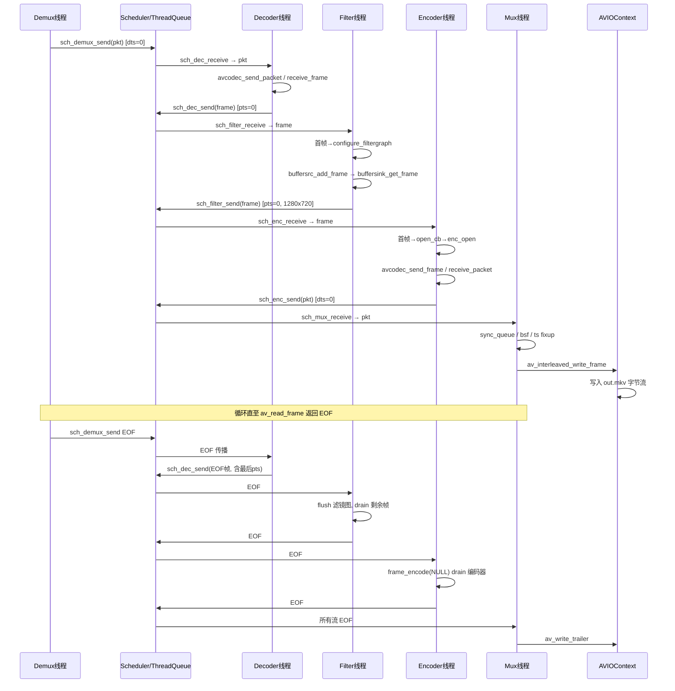

### 5.8 EOF 传播与 flush

转码的优雅结束依赖**逐级 EOF 传播 + 各级 flush**：

- **Demux EOF**：`av_read_frame` 返回 `AVERROR_EOF`，`input_thread` 退出前可选 `loop` 回放或 `seek_to_start`；
- **Decoder EOF**：`sch_dec_receive` 返回 EOF，`decoder_thread` 发送带 `FRAME_OPAQUE_EOF` 的空帧（携带最后帧的 pts+duration）给下游，让下游知道精确的结束时间；
- **Filter EOF**：`sch_filter_receive` 返回 EOF，`filter_thread` 对每个输入 `send_eof`，触发滤镜图 flush（`av_buffersrc_add_frame` NULL），drain 出 buffersink 内剩余帧；
- **Encoder EOF**：`sch_enc_receive` 返回 EOF，`encoder_thread` 调用 `frame_encode(NULL)` drain 编码器（`avcodec_send_frame(NULL` + 循环 `receive_packet`），输出编码器内缓冲的帧（B 帧延迟）；
- **Mux EOF**：所有流 EOF 后，`muxer_thread` 退出，主线程 `of_write_trailer` 写容器尾部。

这种"逐级 drain"确保编码器/滤镜内缓冲的帧不丢失，是转码完整性的关键。

---

## 第 6 章 · 完整业务流程 — 音频转码

音频转码的整体管线与视频相同（Demux→Dec→Filter→Enc→Mux），但在**参数协商、帧边界、重采样**三方面有显著差异。

### 6.1 与视频的关键差异

| 维度 | 视频 | 音频 |
|------|------|------|
| 帧边界 | 一帧 = 一幅图，边界明确 | 一帧 = N 个采样，N 由编码器决定（如 AAC=1024，MP3=1152） |
| 参数协商 | 分辨率/像素格式/帧率 | 采样率/声道布局/采样格式 |
| 时间基 | `1/frame_rate` 或容器 tb | `1/sample_rate` |
| 变长输入 | 一般固定分辨率 | 编码器可能要求定长帧（`AV_CODEC_CAP_VARIABLE_FRAME_SIZE` 反之） |
| 格式转换 | swscale（像素格式） | swresample（采样率/声道/采样格式） |
| 初始延迟 | 一般无 | 编码器 `initial_padding`（编码器需预填充，解码时丢弃） |

### 6.2 音频参数协商

滤镜图输出侧的音频参数由 `choose_*` 系列函数（`ffmpeg_filter.c:386` 宏生成）在配置滤镜图时确定，并写入滤镜字符串：

- `choose_sample_fmts`：采样格式（如 `s16`/`fltp`），受编码器支持的格式约束；
- `choose_samplerates`：采样率（如 44100/48000），受编码器约束；
- `choose_channel_layouts`：声道布局（如 stereo/5.1），受编码器约束。

这些函数把"编码器支持的格式列表"与"用户指定的格式"取交集，生成 `aformat=sample_fmts=fltp:sample_rates=48000:channel_layouts=stereo` 这样的滤镜串，自动插入到滤镜链末端，确保送入编码器的帧格式正确。若输入与目标格式不符，`aresample`（重采样）/`aformat`/`channelmap` 等滤镜自动插入（由滤镜图的 `auto_convert` 机制完成）。

### 6.3 音频 FIFO 与定长帧

许多音频编码器（AAC、MP3、AC3）要求**固定帧大小**（如 AAC=1024 采样），但解码器输出的帧大小可能不固定（尤其流式输入）。这由两层机制解决：

1. **SyncQueue（同步队列）**：`ffmpeg_sched.c` 的 `SchSyncQueue` + `sync_queue.c` 在编码器侧把变长输入帧**拼合/切分**为定长帧。例如输入 1500 采样、目标 1024，则切成 1024 + 476（476 暂存，等下一帧补足）。`SchEnc.open_cb` 返回编码器要求的帧大小给同步队列。

2. **AudioFrameQueue（编码器内部）**：`libavcodec/audio_frame_queue.c` 处理编码器的 `initial_padding`（编码器启动需预填充的采样数）与最终 flush 时的尾部补偿。`ff_af_queue_init` 记录 `initial_padding`，编码时按需缓冲，flush 时补齐最后一帧。

### 6.4 重采样（libswresample）

当输入音频的采样率/声道/格式与目标不同时，`libswresample` 负责转换。它在两个层面介入：

- **滤镜图内**：`aresample` 滤镜（`libavfilter/af_resample.c`）封装 `SwrContext`，在滤镜链中完成重采样，这是最常见的路径；
- **编码器内**：少数编码器内部用 `swresample` 做最后的格式适配。

`SwrContext` 的核心 API：`swr_alloc_set_opts` / `swr_init` / `swr_convert`。它支持任意采样率转换（重采样）、声道布局转换（上/下混）、采样格式转换（如 s16↔fltp），内部用高效的 FIR 滤波器与 SOX 重采样算法。

### 6.5 音频数据流图

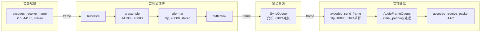

### 6.6 音频时间戳处理

音频时间戳比视频更微妙：
- `audio_ts_process`（`ffmpeg_dec.c:248`）：解码后修正音频 pts，处理 `initial_padding`（解码器延迟）；
- 帧时长 = `nb_samples / sample_rate`，精确到采样级；
- 编码器输出的 packet 时长 = `frame_size / sample_rate`，由 `AudioFrameQueue` 维护 pts 连续性。

---

## 第 7 章 · 完整业务流程 — 字幕与流拷贝

### 7.1 字幕路径

字幕的转码路径与音视频不同——**字幕不经滤镜图**（除非用 sub2video 转成视频叠加），而是 Decoder→Encoder 直连：


**关键机制**：

- **`transcode_subtitles`**（`ffmpeg_dec.c:641`）：字幕解码用 `avcodec_decode_subtitle2`（旧 API，字幕未迁移到 send/receive），结果 `AVSubtitle` 通过 `subtitle_wrap_frame`（`ffmpeg_dec.c:543`）包装成 `AVFrame`（`buf[0]` 存 `AVSubtitle*`）以便走调度器的 frame 通道。
- **`process_subtitle`**（`ffmpeg_dec.c:576`）：处理字幕时长、`fix_sub_duration_heartbeat` 修正字幕显示时长。
- **`do_subtitle_out`**（`ffmpeg_enc.c:379`）：字幕编码，把 `AVSubtitle` 还原后 `avcodec_encode_subtitle2`。
- **字幕心跳**（`sch_mux_sub_heartbeat`）：视频流推进时给字幕流发心跳，确保字幕即使长时间无新内容也能正确同步（避免字幕流 EOF 过早）。

### 7.2 sub2video 机制

当字幕需要叠加到视频上（`-filter_complex "[0:v][0:s]overlay=..."`），字幕被转成视频帧送入滤镜图：

- `sub2video_get_blank_frame`（`ffmpeg_filter.c:274`）：生成空白画布（`AV_PIX_FMT_RGB32`，含 alpha）；
- `sub2video_copy_rect`：把位图字幕矩形（`SUBTITLE_BITMAP`）按调色板拷贝到画布；
- `sub2video_update`（`ffmpeg_filter.c:344`）：收到新字幕或心跳时更新画布，`sub2video_push_ref` 推入 buffersrc；
- 心跳机制：视频帧到达时触发字幕画布刷新，保证字幕与视频时间对齐。

文本字幕（ASS/SRT）通过 `ass` 滤镜直接渲染，不走 sub2video。

### 7.3 Stream Copy（流拷贝，`-c copy`）

流拷贝是最快的模式——**不重新编解码**，仅把 demux 出的 packet 直接送给 muxer，可能经比特流过滤：

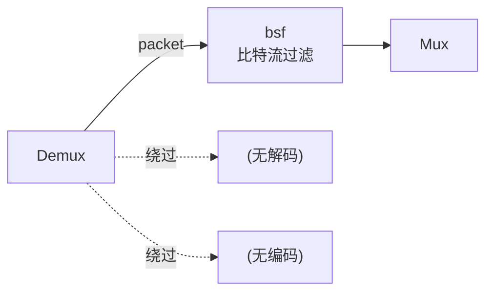

**实现要点**：

- **DAG 直连**：`sch_connect(DEMUX.stream, MUX.stream)`，调度器把 demux 流直接连到 mux 流，不经 Dec/Filter/Enc 节点。
- **`of_streamcopy`**（`ffmpeg_mux.c:460`）：处理拷贝的时间戳修正（`ts_offset`）、关键帧对齐（`copy_initial_nonkeyframes`）、起始时间裁剪。流拷贝必须从关键帧开始（`AV_PKT_FLAG_KEY`），否则输出文件开头会损坏。
- **bsf（比特流过滤器）**：`streamcopy_init`（`ffmpeg_mux_init.c:1025`）为流拷贝初始化 bsf。典型场景：
  - `h264_mp4toannexb`：MP4 的 H.264（长度前缀）转 Annex-B（起始码 `00 00 00 01`），用于 TS/MKV 输出；
  - `extract_extradata`：从码流提取全局头（extradata）；
  - `null`：透传，仅做时间戳处理。
- **时间戳处理**：流拷贝的 pts/dts 需从源容器时间基转换到目标容器时间基（`av_rescale_q`），并减去起始偏移。

### 7.4 多视图与流组

FFmpeg 8.x 引入了多视图（multiview）与流组（AVStreamGroup）支持：

- **multiview**（`ffmpeg_dec.c:1094 multiview_setup`）：一个解码器输出多个视角帧（如立体视频），通过 `dec_request_view` 请求特定视角，分别送入不同滤镜图。
- **AVStreamGroup**（`avformat.h:1099`）：把多个流组织成逻辑组，如 tile grid（瓦片网格，`AVStreamGroupTileGrid`）、LCEVC（`AVStreamGroupLCEVC`）、IAMF 音频。`istg_add`（`ffmpeg_demux.c:1726`）创建输入流组，`of_add_groups`（`ffmpeg_mux_init.c:2705`）创建输出流组，用于沉浸式媒体与多流同步。
- **附件数据**：`-attach` 附加文件（如字体），`dump_attachment` 提取附件，走 data 流路径。

---

## 第 8 章 · libavformat — 封装与 IO 抽象

`libavformat`（706 文件）是 FFmpeg 的容器与 IO 层，向上提供 `AVFormatContext` API，向下抽象文件/网络/管道 IO。它依赖 `libavcodec`（用于 probe 时的解码探测），但编解码器本身不依赖它。

### 8.1 格式注册与探测

**注册机制**（`allformats.c`）：
- 所有 demuxer/muxer 通过 `extern const FFInputFormat ff_xxx_demuxer` / `FFOutputFormat ff_xxx_muxer` 声明，由 `configure` 生成的 `demuxer_list.c` / `muxer_list.c`（静态数组）收录启用的格式；
- `av_demuxer_iterate` / `av_muxer_iterate` 遍历这些静态表，线程安全的惰性初始化（`atomic_uintptr_t`）；
- `FFInputFormat`（`demux.h:66`）首成员是公有 `AVInputFormat p`，与 `FFCodec`/`AVCodec` 同样的"公有+内部"分离模式。

**格式探测**（`avformat_open_input` → `io_open` → `av_probe_input_format`）：
- `read_probe`：每个 demuxer 实现探测函数，检查文件头字节（`AVProbeData`）判断是否匹配；
- 探测返回分数（0~100），`av_probe_input_format` 选最高分且超过阈值的格式；
- 用户可 `-f` 强制指定格式，跳过探测。

### 8.2 分层 IO：AVIOContext → URLContext → URLProtocol

IO 是三层抽象：

```mermaid
flowchart TB
    subgraph L3["第三层：AVIOContext（带缓冲字节流）"]
        AVIO["AVIOContext<br/>buffer/buf_ptr/buf_end<br/>read_packet/write_packet/seek 回调"]
    end
    subgraph L2["第二层：URLContext（协议会话）"]
        URL["URLContext<br/>prot 指向 URLProtocol<br/>含 fd/socket 句柄"]
    end
    subgraph L1["第一层：URLProtocol（协议虚表）"]
        P1["ff_file_protocol"]
        P2["ff_pipe_protocol"]
        P3["ff_tcp_protocol"]
        P4["ff_http_protocol"]
        P5["ff_tls_protocol"]
        P6["ff_rtmp_protocol"]
    end

    AVIO -->|"read_packet 回调"| URL
    URL -->|"prot->url_read"| P1
    URL -->|"prot->url_read"| P3
    URL -->|"prot->url_read"| P4
```

**第一层 URLProtocol**（`url.h:51`）：每个协议（file/pipe/tcp/udp/http/rtmp/tls...）是一个 `URLProtocol` 虚表，含 `url_open/url_read/url_write/url_seek/url_close` 回调。`protocols.c` 集中注册。

**第二层 URLContext**（`url.h:35`）：一次打开的会话，持有 `URLProtocol *prot` 与底层句柄（fd/socket）。`ffurl_open` 按 URL scheme 查找协议并创建 context。

**第三层 AVIOContext**（`avio.h:160`）：带缓冲的字节流，是 `AVFormatContext.pb` 的类型。它通过 `read_packet`/`write_packet` 回调读写 `URLContext`，内部维护缓冲区（默认 32KB），支持 `avio_read`/`avio_write`/`avio_seek`/`avio_tell`。`avio_open`（`avio.c:498`）= `ffurl_open` + `ffio_fdopen`（把 URLContext 包成带缓冲的 AVIOContext）。

这种分层使 demuxer/muxer 只面对 `AVIOContext` 的字节流 API，完全不感知数据来自文件、网络还是内存。

### 8.3 Demuxer/Muxer 回调接口

**Demuxer**（`FFInputFormat`）核心回调：
- `read_probe`：格式探测；
- `read_header`：读容器头，初始化流（`avformat_new_stream`）、extradata；
- `read_packet`：读一个包到 `AVPacket`（通常从 `pb` 读字节并解析）；
- `read_close`：释放私有数据；
- `read_seek`：seek 到指定时间戳。

**Muxer**（`FFOutputFormat`）核心回调：
- `write_header`：写容器头（含全局 extradata）；
- `write_packet`：写一个包（通常经 `av_interleaved_write_frame` 交错后调用）；
- `write_trailer`：写容器尾；
- `query_codec`：查询是否支持某 codec。

### 8.4 交错、索引、seek

- **交错（interleaving）**：`av_interleaved_write_frame`（mux 侧）按各流 packet 的 dts 排序后写入，保证多流（音视频）在文件中按时间交错，利于播放器顺序读取。内部维护 `AVPacketList` 优先队列。
- **索引（index）**：`AVIndexEntry`（`avformat.h:598`）记录关键帧位置（pts ↔ 文件偏移），demuxer 在读取时构建，用于 seek。`av_add_index_entry` 添加索引项。
- **seek**：`av_seek_frame` / `avformat_seek_file` 调用 demuxer 的 `read_seek`，先按索引定位到最近关键帧，再二进制搜索精确位置。

### 8.5 协议层细节

`libavformat/` 内含丰富协议实现：
- **本地**：`file.c`（file/pipe/fd/android_content）、`subfile.c`、`async.c`（异步缓冲层）；
- **网络**：`tcp.c`/`udp.c`（原始 socket）、`http.c`/`https`（`tls.c`+`tls_gnutls.c`/`tls_libtls`/`tls_openssl`）、`rtmpproto.c`（RTMP）、`srt.c`、`crypto.c`（加密）；
- **`network.c`**：网络初始化（`avformat_network_init`，sockets/WSAStartup）、`getaddrinfo` 封装。

---

## 第 9 章 · libavcodec — 编解码抽象

`libavcodec`（2683 文件）是 FFmpeg 最大的库，核心抽象代码仅数千行，其余是数百个编解码器实现。

### 9.1 编解码器注册与查找

- **注册**（`allcodecs.c`）：`extern const FFCodec ff_xxx_encoder/decoder` 声明所有编解码器，`codec_list.c`（configure 生成）收录启用的；
- **查找**：`avcodec_find_decoder(codec_id)` / `find_encoder` 遍历列表按 id/name 匹配；
- **短名**：`avcodec_get_name` / `AVCodecDescriptor`（`codec_desc.c`）提供 codec 的元信息（长名、类型、profile）。

### 9.2 FFCodec 内部结构与回调类型

`FFCodec`（`codec_internal.h:127`）在 `AVCodec p` 之外扩展：

- **`cb_type`**（`FFCodecType`）：编解码器选择四种回调风格之一：
  - `FF_CODEC_CB_TYPE_DECODE`：`decode(AVCodecContext*, AVFrame*, int*, AVPacket*)` 同步解码；
  - `FF_CODEC_CB_TYPE_RECEIVE_FRAME`：`receive_frame(AVCodecContext*, AVFrame*)` 解码器主动推帧；
  - `FF_CODEC_CB_TYPE_ENCODE` / `RECEIVE_PACKET`：编码侧对称。
  这适配不同编解码库的 API 形态——有的库一次调用产一帧，有的需主动 pull。
- **`init`/`close`/`flush`**：生命周期回调；
- **`defaults`**（`FFCodecDefault`）：该编解码器的默认 AVOption 值；
- **`bsfs`**：编解码器内部自动应用的比特流过滤器列表；
- **`caps_internal`**：内部能力位（如 `INIT_CLEANUP`、`AUTO_THREADS`、`SETS_FRAME_PROPS`）。

定义宏（`codec_internal.h:347`）简化声明：`FF_CODEC_DECODE_CB(func)` / `FF_CODEC_RECEIVE_FRAME_CB(func)` / `FF_CODEC_ENCODE_CB(func)` 等。

### 9.3 编解码线程模型

`libavcodec` 提供两种内部多线程（与 fftools 的线程化正交）：

```mermaid
flowchart LR
    subgraph FrameThreading["帧级线程 (pthread_frame.c)"]
        FT1["线程0 解码帧N"] --> FT2["线程1 解码帧N+1"]
        FT2 --> FT3["线程2 解码帧N+2"]
        FT1 -.按序输出.-> OUT1["帧 N, N+1, N+2"]
    end
    subgraph SliceThreading["片级线程 (pthread_slice.c)"]
        ST1["线程0 解片0"] --> STJ["线程1 解片1"]
        STJ --> ST2["线程2 解片2"]
        ST1 -.合并.-> OUT2["完整帧"]
    end
    DEC["解码器"] --> FrameThreading
    DEC --> SliceThreading
```

- **帧级线程**（`AV_CODEC_CAP_FRAME_THREADS`）：多线程并行解码多帧（适合耗时长的 codec 如 H.264/HEVC）。`ff_frame_thread_init` 创建多个解码器实例，按帧分配，`ff_thread_finish_setup` 同步参考帧。要求 codec 仔细处理帧间依赖。
- **片级线程**（`AV_CODEC_CAP_SLICE_THREADS`）：一帧内按片/块并行（适合易并行的 codec 如 MPEG-1/2、JPEG）。`ff_slice_thread_init` 设置 `execute2` 回调，codec 用 `avctx->execute2` 派发片任务。
- **`ff_thread_init`**（`pthread.c:72`）按 codec 能力与用户 `-threads` 选择线程类型。

### 9.4 硬件加速

硬件加速是 FFmpeg 的重要能力，通过三层上下文：

- **`AVBufferRef *hw_device_ctx`**（`AVCodecContext`）：硬件设备上下文（如 CUDA context、VAAPI display），标识"在哪块硬件上"；
- **`AVBufferRef *hw_frames_ctx`**（`AVFrame`/`AVFilterLink`）：硬件帧池上下文，标识"帧在哪个硬件帧池"，含像素格式、宽高、设备引用；
- **`AVCodecHWConfig`**（`avcodec_get_hw_config`）：查询某 codec 支持的硬件配置（设备类型、像素格式）。

硬件加速链路：
```mermaid
flowchart LR
    HWDEV["hw_device_ctx<br/>(CUDA/VAAPI/QSV)"] --> HWFR["hw_frames_ctx<br/>(硬件帧池)"]
    HWFR --> DEC["硬件解码器<br/>(输出硬件帧)"]
    DEC -->|"AVFrame<br/>hw_frames_ctx"| FILTER["硬件滤镜<br/>(scale_cuda/scale_vaapi)"]
    FILTER --> ENC["硬件编码器"]
    ENC --> MUX["Muxer<br/>(需下载到系统内存或硬件直写)"]
```

`ffmpeg_hw.c`（319 行）是 fftools 侧的硬件设备管理：`hw_device_init_from_string` 解析 `-init_hw_device`、`hw_device_setup_for_decode/encode` 为解码/编码器绑定设备。硬件帧可在管线中全程保持硬件内存（经硬件滤镜），仅最终 mux 时下载（或硬件直写支持的容器）。

### 9.5 比特流过滤器与解析器

- **bsf（Bitstream Filter）**（`bsf.h`）：对压缩码流做格式转换，不重新编解码。`AVBitStreamFilter`（`bsf.h:111`）虚表含 `filter` 回调。典型：`h264_mp4toannexb`（MP4↔Annex-B）、`extract_extradata`、`noise`、`null`。流拷贝与某些 muxer 要求特定 bsf。`bsf.c` 提供 `av_bsf_alloc/send_packet/receive_packet` API。
- **解析器（Parser）**（`AVCodecParser`）：从连续字节流中切分出完整帧包（无容器时，如裸 H.264 流）。`parser.c` + 各 `*_parser.c`（如 `h264_parser.c`）实现 `parse` 回调，输出带 pts/dts 的完整 NAL 单元。demuxer 内部也用 parser 处理裸流。

### 9.6 编解码时序图

```mermaid
sequenceDiagram
    participant App
    participant CC as AVCodecContext
    participant Codec as FFCodec
    participant Thr as 线程层

    App->>CC: avcodec_alloc_context3(codec)
    App->>CC: 设置参数 (width/bitrate/...)
    App->>CC: avcodec_open2()
    CC->>Codec: init()
    Codec->>Thr: ff_thread_init (若支持)
    App->>CC: avcodec_send_packet(pkt)  [解码]
    CC->>Codec: 缓存包
    App->>CC: avcodec_receive_frame(frame)
    CC->>Codec: decode()/receive_frame()
    Codec-->>CC: 帧 (可能多帧循环)
    CC-->>App: 0 / EAGAIN / EOF
    Note over App,CC: 循环 send/receive
    App->>CC: avcodec_send_frame(NULL)  [flush]
    App->>CC: avcodec_receive_frame() 循环 drain
    App->>CC: avcodec_free_context()
    CC->>Codec: close()
    Codec->>Thr: ff_thread_free
```

新版 `send_packet`/`receive_frame`（解码）与 `send_frame`/`receive_packet`（编码）API 是分离的"生产-消费"模型，替代了旧的 `avcodec_decode_video2`（已废弃），更清晰且支持异步/多线程。

---

## 第 10 章 · libavfilter — 滤镜图引擎

`libavfilter`（789 文件）是 FFmpeg 的滤镜图引擎，提供有向图式的媒体处理框架。它比传统"线性滤镜链"更强大——支持多输入多输出、分支合并、动态端口。

### 10.1 滤镜注册与描述

- **注册**（`allfilters.c`）：`extern const AVFilter ff_xxx`，`filter_list.c` 收录启用的；
- **滤镜描述**（`AVFilter`，见 3.4）：`name`/`inputs`/`outputs`（`AVFilterPad` 数组）/`priv_class`/`flags`；
- **`AVFilterPad`** 描述端口：`name`/`type`/`filter_frame`（输入端口：接收帧）/`request_frame`（输出端口：请求帧）/`config_props`（连接配置时回调）/`get_video_buffer`（分配缓冲）。

### 10.2 图构建

图构建分三步：**解析 → 格式协商 → 配置**。

```mermaid
flowchart LR
    STR["滤镜字符串<br/>scale=1280:720,format=yuv420p"] --> PARSE["avfilter_graph_parse2<br/>graphparser.c"]
    PARSE --> INST["创建 AVFilterContext 实例<br/>avfilter_graph_alloc_filter"]
    INST --> LINK["avfilter_link 连接端口"]
    LINK --> QF["query_formats<br/>格式协商"]
    QF --> CFG["avfilter_graph_config<br/>配置连接/时间基"]
    CFG --> READY["图就绪，可送帧"]
```

**`avfilter_graph_parse2`**（`graphparser.c:138`）：解析滤镜字符串（如 `[in]scale=1280:720[out]`），按 `split`/`,`/`;` 分割，为每个滤镜名 `avfilter_get_by_name` 查找 `AVFilter`，`avfilter_graph_alloc_filter` 创建实例，`avfilter_init_str` 用参数初始化，最后 `avfilter_link` 把前一个的输出端口连到后一个的输入端口。返回未连接的 `AVFilterInOut`（图的边界端口）。

### 10.3 格式协商（query_formats）

这是滤镜图最复杂的部分。每个滤镜声明其支持的视频/音频格式列表（像素格式、采样格式、采样率、声道布局、色彩空间），协商需为每条 link 选定一个双方都支持的格式。

`query_formats`（`avfiltergraph.c:526`）流程：
1. 对每个滤镜调用 `filter_query_formats`，让其声明各端口支持的格式列表；
2. 对每条 link，合并两端列表取交集（`merge`）；
3. 若无交集，自动插入转换滤镜（`scale`/`aresample`/`format`/`aformat`），即 `converter_count`；
4. `reduce_formats`/`swap_samplerates`/`swap_channel_layouts`/`swap_sample_fmts`：传播格式约束，减少需要转换的 link 数；
5. `pick_format`：为每条 link 最终选定格式；
6. `graph_config_formats` 收尾。

协商可能多轮（`retry`），因为插入转换滤镜后可能改变约束。这是 FFmpeg 让用户写 `scale=1280:720` 而不必手动指定中间格式的关键——引擎自动补全所有格式转换。

### 10.4 帧调度：filter_frame / request_frame / 就绪堆

滤镜图的执行是**数据驱动 + 拉取混合**模型：

- **`ff_filter_frame`**（`avfilter.c:1067`）：上游往 link 推一帧。做格式一致性校验（`frame->format == link->format` 等），把帧加入 link 的 `framequeue`（`ff_framequeue_add`），然后 `ff_filter_set_ready(dst, 300)` 标记下游滤镜"就绪"（优先级 300）。
- **`ff_request_frame`**（`avfilter.c:483`）：下游向 link 请求一帧。若 link 无数据，向上游 `request_frame` 回溯拉取。
- **就绪堆（ready heap）**：`FFFilterGraph` 维护一个按优先级排序的最小堆，记录所有就绪的滤镜。`ff_filter_set_ready` 把滤镜入堆，调度器从堆顶取最高优先级滤镜执行其 `filter_frame`/`request_frame`。`heap_bubble_up/down`（`avfiltergraph.c:1516`）维护堆序。

这种"推-拉混合 + 优先级堆"调度使滤镜图能高效处理任意拓扑（分支、合并、反馈-free 的复杂图），避免死锁。

### 10.5 滤镜线程与命令传递

- **slice threading**（`AVFILTER_THREAD_SLICE`）：一帧内按片并行（如 `scale` 多线程缩放）。`avfilter.c:688 default_execute` 派发任务，滤镜用 `ctx->execute` 执行。
- **命令传递**（`avfilter_graph_send_command`/`queue_command`）：运行时改变滤镜参数（如 `sendcmd` 滤镜在指定时间触发命令）。命令经 `avfilter_process_command` 下发到目标滤镜的 `process_command` 回调。fftools 侧，`filter_thread` 的控制流（`FRAME_OPAQUE_SEND_COMMAND`）即承载此类命令。

### 10.6 buffersrc / buffersink 与 fftools 对接

`buffersrc`（`buffersrc.c`）和 `buffersink`（`buffersink.c`）是滤镜图与外部的边界：

- **buffersrc**（buffer source）：图的输入端，`av_buffersrc_add_frame` 把外部 `AVFrame` 推入图。fftools 的 `filter_thread` 用它送入解码帧。支持 `AV_BUFFERSRC_FLAG_KEEP_REF`（保留引用，避免改写输入帧）、`AV_BUFFERSRC_FLAG_PUSH`（立即触发处理）。
- **buffersink**（buffer sink）：图的输出端，`av_buffersink_get_frame` 从图取出处理后的帧。fftools 的 `filter_thread` 循环调用它 drain 输出帧。

一个滤镜图 = 多个 buffersrc（多输入）+ 滤镜链 + 多个 buffersink（多输出）。`-filter_complex` 的复杂图即此结构。

```mermaid
flowchart LR
    subgraph External["fftools filter_thread"]
        IN["sch_filter_receive<br/>解码帧"] --> OUT["sch_filter_send<br/>处理后帧"]
    end
    subgraph Graph["AVFilterGraph"]
        BS1["buffersrc0"] --> F1["scale"]
        BS2["buffersrc1"] --> F2["overlay"]
        F1 --> F2
        F2 --> BK["buffersink"]
    end
    IN --> BS1
    IN --> BS2
    BK --> OUT
```

---

## 第 11 章 · libavutil — 基础设施

`libavutil`（421 文件）是所有库的共同根，提供内存、日志、选项、时间、数学、格式描述、并发等基础能力。它**不依赖任何其他 FFmpeg 库**，可独立编译。

### 11.1 内存与引用计数

- **`mem.h`**：`av_malloc`/`av_realloc`/`av_free`/`av_freep`，保证对齐（默认 32 字节，SIMD 友好）。`av_mallocz` 清零，`av_memdup` 复制。
- **`buffer.h`**：引用计数核心。`AVBuffer`（真实内存块 + `refcount` + `free` 回调）、`AVBufferRef`（引用）。`av_buffer_alloc`/`av_buffer_create`/`av_buffer_ref`/`av_buffer_unref`。`AVBufferPool`（缓冲池）：复用同尺寸缓冲，避免反复分配，解码器高频分配帧时关键。
- **`frame.h`**：`AVFrame`（见 3.1）+ `av_frame_alloc`/`av_frame_ref`/`av_frame_unref`/`av_frame_make_writable`（COW）。`av_frame_copy_props` 复制元数据（不含数据）。

### 11.2 AVClass / AVOption 元系统

见 3.5。`libavutil/opt.h` 提供 `AVOption` 全套 API（`av_opt_set/get/find/next/free`），支持 int/int64/double/rational/string/binary/image_size/pixel_fmt/sample_fmt/video_rate/chlayout/dict/array 等类型。`av_opt_set_dict` 从 `AVDictionary` 批量设置选项。这套系统被所有库复用——`AVCodecContext`/`AVFormatContext`/`AVFilterContext`/`AVStream` 都通过首成员 `AVClass *` 接入。

### 11.3 时间基与时间戳

- **`rational.h`**：`AVRational`（有理数 `num/den`），精确表示帧率、时间基、宽高比，避免浮点误差。`av_rescale_q`（时间基转换）、`av_reduce`（约分）、`av_cmp_q`（比较）。
- **`time.h`**：`av_gettime`（微秒绝对时间）、`av_gettime_relative`（单调时钟）、`av_usleep`。
- 时间戳贯穿全管线：`AVPacket.pts/dts`（流时间基）、`AVFrame.pts`（帧时间基），跨组件时用 `av_rescale_q` 转换。

### 11.4 像素/采样格式、色彩空间、声道布局

- **`pixfmt.h`**：`AVPixelFormat` 枚举所有像素格式（YUV420P/NV12/RGB24/...），`av_pix_fmt_desc_get` 获取格式描述（平面数、位深、色彩范围）。
- **`samplefmt.h`**：`AVSampleFormat`（S16/S16P/FLT/FLTP/...），`av_get_bytes_per_sample`/`av_sample_fmt_is_planar`。
- **`colorspace.h`/`csp.h`**：色彩空间与传输特性（BT.709/BT.2020/...），`AVColorSpace`/`AVColorPrimaries`/`AVColorTransferCharacteristic`。
- **`channel_layout.h`**：`AVChannelLayout`（取代旧的 `uint64_t channel_layout` 位掩码），支持自定义布局与 Dolby Atmos 等新格式。`av_channel_layout_describe`/`av_channel_layout_from_string`。

### 11.5 并发原语

- **`thread.h`**：跨平台线程抽象。`pthread` 优先，Win 用 `_WIN32` 仿真。`AVMutex`/`AVCond`/`AVOnce`/`AVThread`。`avpriv_slicethread_register` 提供片级线程池。
- **`executor.h`**：`AVExecutor` 线程池，用于派发并行任务（如滤镜 slice threading）。
- **`fifo.h`/`container_fifo.h`**：`AVFifo`（无类型 FIFO 字节队列），`AVContainerFifo`（类型化容器 FIFO）。
- **`audio_fifo.h`**：`AVAudioFifo` 音频采样级 FIFO，重采样/编码缓冲用。

### 11.6 平台抽象

- **`config.h`**（configure 生成）：`CONFIG_*`（特性开关）、`HAVE_*`（能力探测）宏，决定编译哪些代码路径。
- **`attributes.h`**：`av_always_inline`/`av_noinline`/`av_cold`/`av_unused`/`av_alias` 等编译器属性抽象，跨 GCC/Clang/MSVC 统一。
- **`bswap.h`**：字节序转换（`av_bswap16/32/64`），跨平台高效实现（用内置或汇编）。
- **`intreadwrite.h`**：`AV_RL16/AV_RB32` 等按字节序读写，安全处理未对齐访问。
- **`compat/`**：跨平台兼容（如 Windows 的 `io.h`、`getenv_utf8`、`fopen_utf8`），把平台差异压缩到一处。

---

## 第 12 章 · libswresample / libswscale / libavdevice

### 12.1 libswresample — 音频重采样

`libswresample`（45 文件）负责音频的**采样率转换、声道布局转换、采样格式转换**三件事，是音频转码链中"格式适配"的执行者。

**核心 API**（`SwrContext`，不透明结构）：
```c
SwrContext *swr = swr_alloc();
swr_alloc_set_opts2(&swr, &out_ch_layout, out_sample_fmt, out_sample_rate,
                          &in_ch_layout,  in_sample_fmt,  in_sample_rate, 0, NULL);
swr_init(swr);
// 转换循环
int out_samples = swr_convert(swr, out, out_count, in, in_count);
// flush 剩余
swr_convert(swr, out, out_count, NULL, 0);
swr_free(&swr);
```

**内部实现**：
- **重采样**：基于多相滤波器（polyphase filter），支持任意采样率比。高质量模式用 SOX 算法，可设 `dither`（抖动）降低量化误差；
- **声道转换**：上混/下混矩阵（如 stereo→mono、stereo→5.1），支持自定义混音矩阵；
- **格式转换**：S16↔FLTP 等采样格式互转，含 packed↔planar 转换；
- **`dither.h`/`resample.h`/`rematrix.h`**：各子模块，模板化（`*_template.c`）支持不同样本类型。

`aresample` 滤镜（`libavfilter/af_resample.c`）封装 `SwrContext`，使重采样在滤镜图内完成。

### 12.2 libswscale — 图像缩放与色彩转换

`libswscale`（133 文件）负责图像的**缩放、色彩空间转换、像素格式转换**，是视频转码链中"格式适配"的执行者。

**核心 API**：
```c
SwsContext *sws = sws_getContext(srcW, srcH, srcFormat,
                                  dstW, dstH, dstFormat,
                                  SWS_BILINEAR, NULL, NULL, NULL);
sws_scale(sws, src_data, src_linesize, 0, srcH, dst_data, dst_linesize);
sws_freeContext(sws);
// 新版动态 API
sws_scale_frame(sws, dst_frame, src_frame);
```

**内部实现**：
- **缩放算法**：fast bilinear / bilinear / bicubic / experimental / area / lanczos / spline，按 `flags` 选择。不同算法速度/质量权衡；
- **色彩空间转换**：YUV↔RGB、BT.601/BT.709/BT.2020 色彩矩阵、full/limited range 转换；
- **`swscale_unscaled.c`**：特化路径（同尺寸仅格式转换，无需缩放，更快）；
- **汇编优化**：`x86/`、`aarch64/` 下大量手写汇编（SSE2/AVX/NEON），是 swscale 性能的关键；
- **`SwsFilter`**：可选的预/后处理滤波器（如去隔代）。

`scale` 滤镜（`libavfilter/vf_scale.c`）封装 `SwsContext`，`zscale` 滤镜用 zimg 库提供更高质量。

### 12.3 libavdevice — 采集设备抽象

`libavdevice`（75 文件）是采集/输出设备抽象层，**复用 avformat 的封装框架**——每个设备被实现为一个特殊的 `AVInputFormat`/`AVOutputFormat`。

**设备类型**：
- **Linux**：`alsa.c`（ALSA 音频）、`v4l2.c`（Video4Linux2 视频）、`fbdev.c`（帧缓冲）、`kmsgrab.c`（KMS）；
- **Windows**：`dshow.c`（DirectShow）、`vfwcap.c`（VfW 捕获）、`sdl2.c`；
- **macOS**：`avfoundation.m`、`qtkit.m`；
- **跨平台**：`caca.c`（ASCII 输出）、`openal.c`、`pulse.c`（PulseAudio）、`decklink`（专业采集卡）。

**与 avformat 的关系**：设备的 `read_packet` 从硬件采集数据而非文件，但对外仍是 `AVFormatContext` + `AVIOContext` 抽象。`avdevice_register_all` 注册设备（默认禁用，需 `--enable-avdevice`）。`ffmpeg -f alsa -i default` 即用 avdevice 打开 ALSA 设备作为输入。

```mermaid
flowchart LR
    HW["硬件设备<br/>(ALSA/V4L2/DShow)"] --> DEV["libavdevice<br/>(AVInputFormat)"]
    DEV -->|"AVFormatContext<br/>AVIOContext"| AVFORMAT["libavformat API"]
    AVFORMAT --> FFTOOLS["fftools"]
```

---

## 第 13 章 · 构建系统与平台移植

FFmpeg 的构建系统是其跨平台能力的基石——一套代码在 Linux/Windows/macOS/Android/iOS/BSD/Solaris 上编译运行，支持数十种编译器与硬件架构。

### 13.1 configure 脚本

`configure`（8840 行）是手写的 shell 脚本，承担：

- **特性探测**：`check_func`/`check_header`/`check_lib` 探测系统是否提供某函数/头/库（如 `check_func clock_gettime`）；
- **编译器探测**：`check_cc`/`check_cxx`/`check_as`/`check_x86asm` 探测编译器与汇编器能力；
- **架构探测**：`check_arch` 识别目标架构（x86/arm/aarch64/mips/ppc/...），启用对应汇编优化；
- **特性开关**：`--enable-*/--disable-*` 控制编解码器/格式/滤镜/协议/设备的启用，生成 `CONFIG_*` 宏；
- **依赖解析**：`check_deps`（`configure:841`）解析特性间的依赖（如 `libx264` 依赖 `external libx264`）；
- **生成产物**：`config.mak`（Makefile 变量）、`config.h`（C 宏）、`config_components.h`（组件启用表）、`codec_list.c`/`format_list.c`/`filter_list.c`（注册表）。

`configure` 的设计哲学是"探测而非假设"——不硬编码任何平台特性，全部运行时探测，这是移植性的根本保证。

### 13.2 分层 Makefile

```
Makefile              # 顶层，include config.mak，定义 FFLIBS
├── ffbuild/common.mak    # 通用规则（编译/汇编/链接/依赖）
├── ffbuild/library.mak  # 各库的静态/动态库构建规则
├── ffbuild/arch.mak      # 架构相关规则
└── 各库 Makefile          # 各库的 OBJ 列表
```

- **`common.mak`**（279 行）：编译规则模板，`CC`/`AS`/`X86ASM`/`AR`/`LD` 命令，依赖生成（`DEPCC`），静默输出（`Q=@`），`-DHAVE_AV_CONFIG_H` 标记库内部代码；
- **`library.mak`**（139 行）：静态库（`ar`）、动态库（`ld -shared`）、`.pc` pkgconfig 文件生成。处理"静态+动态混合"链接的符号复制问题；
- **`arch.mak`**：架构相关的编译标志与汇编规则。

### 13.3 条件编译宏

- **`CONFIG_*`**：特性是否启用（如 `CONFIG_LIBX264`、`CONFIG_H264_DECODER`），决定编解码器/格式是否编译进库；
- **`HAVE_*`**：系统能力（如 `HAVE_PTHREADS`、`HAVE_SSE2`），决定代码路径；
- **`FF_API_*`**：版本兼容，标记废弃 API 是否仍编译，实现平滑过渡。

这些宏由 `config.h`/`config_components.h` 定义，源码中 `#if CONFIG_xxx` / `#if HAVE_xxx` 控制编译。

### 13.4 汇编优化

FFmpeg 在性能关键路径大量使用手写汇编：

- **`libavcodec/x86/`、`libavutil/x86/`、`libswscale/x86/`**：x86 SSE2/AVX/AVX2 优化，用 NASM/YASM 语法（`.asm`）；
- **`libavcodec/aarch64/`、`libavutil/aarch64/`**：ARM NEON；
- **`libavcodec/arm/`**：ARMv6/v7；
- **`libavcodec/mips/`、`ppc/`**：MIPS、PowerPC。

汇编与 C 的协作：C 实现始终作为 fallback（保证可移植），汇编通过 `config.h` 的 `HAVE_*` 宏条件编译，函数指针表（如 `c->put_pixels_tab[0]`）在 init 时按 CPU 能力选择汇编或 C 版本。`libavutil/cpu.c` 的 `av_get_cpu_flags` 运行时检测 CPU 特性。

### 13.5 compat 层与跨平台

`compat/`（25 文件）处理平台 API 差异：
- **`compat/va_copy/`**：`va_list` 复制（C99 va_copy 在旧编译器的替代）；
- **`compat/getopt/`**：非标准库 getopt 替代；
- **`compat/atomics/`**：C11 原子操作在旧编译器的替代；
- **`compat/windows/`**：Windows 特定（`getenv_utf8`、`fopen_utf8` 处理 UTF-8 文件名）。

`libavutil` 内的 `attributes.h`/`bswap.h`/`intreadwrite.h`/`thread.h` 也是平台抽象的关键，使上层代码写一次即可。

---

## 第 14 章 · 工程设计方法与特点总结

### 14.1 设计模式归纳

FFmpeg 在 C 语言下系统性地运用了多种设计模式，是其能管理百万行级代码、数百种编解码器/格式的根本原因：

**1. 注册表模式（Registry）**
所有可扩展点（编解码器、格式、滤镜、协议、设备、bsf、parser）通过 `extern const FFXxx ff_xxx` 集中声明，构建期由 `configure` 生成的静态表（`codec_list.c`/`format_list.c`/`filter_list.c`）收录启用的项。新增一个编解码器只需：新增一个实现文件 + 在 `allcodecs.c` 加一行 `extern` + configure 自动收录。核心代码零改动。这是 FFmpeg 可扩展性的基石。

**2. 回调/虚表模式（Vtable / Callback）**
所有扩展点的行为通过函数指针集合定义：`AVCodec` 的 init/decode/encode/close、`AVInputFormat` 的 read_header/read_packet/read_close、`AVFilter` 的 init/filter/uninit、`URLProtocol` 的 url_open/url_read/url_write。核心代码通过虚表调用具体实现，实现多态与解耦。这是 C 语言实现"面向对象"的经典手法。

**3. 公有/内部分离（Public/Internal Split）**
公有结构（`AVCodec`/`AVInputFormat`/`AVFilter`）定义在 `*.h` 保证 ABI 稳定；内部扩展（`FFCodec`/`FFInputFormat`/`FFFilterContext`）定义在 `*_internal.h`，通过首成员嵌套（`FFCodec.p` 是 `AVCodec`）实现转型。`FF_API_*` 宏控制废弃字段的逐步移除。这使库能持续演进而不破坏二进制兼容——FFmpeg 的 SO 版本管理极其严格。

**4. 引用计数所有权（Reference Counting / Zero-copy）**
`AVBuffer`/`AVBufferRef` 是所有权模型的核心：数据块（`AVBuffer`）有引用计数，`AVBufferRef` 是引用。`AVFrame`/`AVPacket` 持有 `AVBufferRef`，跨组件传递只增引用计数（`av_buffer_ref`），不复制数据；写时才 COW（`av_frame_make_writable`）。这是 FFmpeg 高吞吐的关键，也是 C 语言管理共享所有权的优雅方案。

**5. 模板代码（Template Code）**
大量使用 `*_template.c` 文件配合 `#include` 实现泛型：同一份逻辑用宏参数化不同数据类型（如 `swscale` 的 `rgb2rgb_template.c` 对 uint8/uint16、`swresample` 的 `dither_template.c` 对不同样本类型）。避免为每种类型复制粘贴代码，同时保持 C 的零抽象开销。

**6. DAG 调度（Scheduler）**
`ffmpeg_sched.c` 把转码管线建模为 DAG，所有组件只与调度器通信，互不直连。调度器集中管理连接拓扑、数据中转、同步反压。这是"星型拓扑 + 中央协调"模式，把全局知识集中一处，避免组件间耦合。

**7. 选项自省（Introspection via AVClass/AVOption）**
`AVClass` + `AVOption` 实现 C 语言的"反射"：任何结构体首成员是 `AVClass *` 即具备统一日志、选项设置、自省能力。`-b:v 2M`、`-movflags +faststart`、`-x264-params` 走同一条 `av_opt_set` 路径。这是 FFmpeg 命令行能力远超其他工具的基础。

**8. 延迟初始化（Lazy Initialization）**
滤镜图在收到首帧、知道输入格式后才配置（`configure_filtergraph`）；编码器在首帧到达时由调度器回调打开（`open_cb`）；解码器可延迟打开（`dec_standalone_open`）。这种"延迟到信息齐全"的策略避免了"先猜后改"的复杂回滚。

### 14.2 工程特点

- **强分层与单向依赖**：七库严格分层，依赖单向无环，`libavutil` 是根。可单独编译任一库。
- **海量统一抽象**：数百编解码器/格式/滤镜通过同一套虚表接入，核心代码量恒定。
- **零拷贝管线**：demux→dec→filter→enc→mux 全程引用计数，无数据复制。
- **多级多线程**：fftools 级（每组件一线程）+ libavcodec 级（帧/片线程）+ libavfilter 级（slice 线程），层层并行。
- **跨平台可移植**：configure 探测一切，compat 层吸收差异，汇编按架构条件编译，C 实现兜底。
- **ABI 严格稳定**：公有/内部分离 + `FF_API_*` 废弃管理，库 SO 版本精确。
- **自包含**：极少外部依赖（默认仅 libc），外部库（x264/x265/openssl/...）全部可选。

### 14.3 设计优势

1. **可扩展性极强**：新增编解码器/格式/滤镜只需一个文件 + 一行注册，核心零改动。这是 FFmpeg 能覆盖几乎所有多媒体格式的根本。
2. **性能极致**：零拷贝 + 多级多线程 + 手写汇编，在通用 CPU 上接近理论吞吐。
3. **解耦清晰**：库间单向依赖、组件间经调度器解耦、公有/内部分离，修改一处不波及全局。
4. **向后兼容**：ABI 稳定 + 废弃 API 渐进移除，旧应用不需改代码即可升级库。
5. **可移植性**：一套代码跨数十平台，configure 探测保证不假设任何特性。

### 14.4 设计劣势 / 痛点

1. **API 复杂度高**：`AVFormatContext` 有上百字段，`AVCodecContext` 同样庞大，新手难以上手。许多字段有复杂的"编码/解码时由谁设置"的语义。
2. **公有/内部混用演进阵痛**：`FFCodec`/`AVCodec` 分离、`AVStream->codec` 废弃为 `codecpar` 等迁移历经多个大版本，过渡期 API 混乱。`FF_API_*` 宏遍地。
3. **线程模型复杂**：fftools 调度器线程 + libavcodec 帧线程 + libavfilter slice 线程，三层并发，调试困难。`ffmpeg_sched.c` 的同步/反压逻辑精妙但难懂。
4. **文档稀疏**：虽有 Doxygen 注释，但"为什么这样设计"的设计文档稀缺，需大量读源码理解。`ffmpeg_sched.h` 的长注释是少见的例外。
5. **C 语言局限**：模板靠 `#include`、面向对象靠首成员嵌套、错误处理靠返回码，代码不如现代语言清晰。宏使用广泛增加阅读难度。
6. **错误处理冗长**：大量 `if (ret < 0) goto fail;`，错误路径与正常路径交织，易遗漏资源释放。

### 14.5 值得学习之处

1. **Scheduler 的 DAG 解耦**：把复杂管线抽象为 DAG + 中央调度器，组件互不感知，全局逻辑集中。这一模式可推广到任何复杂流水线系统（如数据处理管线、编译器 pass 链、CI/CD 流水线）。

2. **AVClass/AVOption 元系统**：用 C 实现"反射"——结构体自描述其选项与日志身份，统一了配置、日志、帮助文档。这是"用元编程消除重复"的典范，比手写 getter/setter 高出一个抽象层级。

3. **`_template.c` 代码复用**：用 `#include` + 宏参数化实现泛型，零运行时开销。在不能用 C++ 模板的场景下，是 C 项目管理"同逻辑多类型"的最佳实践。

4. **引用计数所有权模型**：`AVBuffer`/`AVBufferRef` 把"谁拥有这块内存"从"谁分配"解耦为"谁持有引用"，支持共享所有权与零拷贝。这是 C 语言管理复杂生命周期的优雅方案，可借鉴到任何需要共享缓冲的系统。

5. **configure 的可移植性工程**：不假设任何平台特性，全部运行时探测，`CONFIG_*`/`HAVE_*` 宏条件编译。这是"可移植性是工程出来的，不是碰运气"的教科书。任何需跨平台的项目都应学习这种"探测而非假设"的态度。

6. **注册表 + 虚表的扩展模式**：新增功能 = 新增文件 + 注册一行，核心零改动。这种"开闭原则"的 C 实现是管理大型可扩展系统的范本。

7. **渐进式 ABI 演进**：公有/内部分离 + `FF_API_*` 废弃管理，使库能演进而不破坏用户。这是长期维护公共库的必备工程纪律。

8. **延迟初始化策略**：滤镜图/编码器在信息齐全时才配置，避免"先猜后改"。这种"推迟到不可再推迟"的决策时机选择，减少了回滚复杂度。

---

## 附录

### 附录 A · 关键文件索引（按库）

| 库 | 核心文件 | 作用 |
|----|---------|------|
| fftools | `ffmpeg.c` | main 入口、transcode 主循环 |
| fftools | `ffmpeg_sched.c/.h` | 转码调度器（DAG + 线程） |
| fftools | `ffmpeg_opt.c` | 选项解析 |
| fftools | `ffmpeg_demux.c` | 输入/demux 线程 |
| fftools | `ffmpeg_dec.c` | decoder 线程 |
| fftools | `ffmpeg_filter.c` | filter 线程、滤镜图配置 |
| fftools | `ffmpeg_enc.c` | encoder 线程 |
| fftools | `ffmpeg_mux.c` / `ffmpeg_mux_init.c` | mux 线程 / 输出初始化 |
| fftools | `thread_queue.c` / `sync_queue.c` | 线程同步队列 |
| fftools | `cmdutils.c` / `opt_common.c` | 通用命令行工具 |
| libavutil | `buffer.h/c` | 引用计数内存 |
| libavutil | `frame.h/c` | AVFrame |
| libavutil | `opt.h/c` `log.h/c` | AVOption/AVClass 元系统 |
| libavutil | `rational.h` `time.h` | 时间基/时间戳 |
| libavutil | `mem.h` `pixfmt.h` `samplefmt.h` | 内存/格式 |
| libavutil | `thread.h` `executor.h` | 并发原语 |
| libavcodec | `avcodec.h` `codec.h` `codec_internal.h` | 编解码抽象 |
| libavcodec | `allcodecs.c` `codec_list.c` | 编解码注册 |
| libavcodec | `packet.h` | AVPacket |
| libavcodec | `pthread.c` `pthread_frame.c` `pthread_slice.c` | 编解码线程 |
| libavcodec | `bsf.h/c` | 比特流过滤 |
| libavformat | `avformat.h` `avio.h` | 封装/IO 抽象 |
| libavformat | `allformats.c` `format_list.c` | 格式注册 |
| libavformat | `demux.h` `mux.h` | FFInputFormat/FFOutputFormat |
| libavformat | `avio.c` `url.h` `protocols.c` | 分层 IO |
| libavfilter | `avfilter.h` `avfilter.c` | 滤镜抽象/执行 |
| libavfilter | `avfiltergraph.c` `graphparser.c` | 图构建/格式协商 |
| libavfilter | `allfilters.c` `buffersrc.c` `buffersink.c` | 滤镜注册/边界 |
| libswresample | `swresample.h/c` | 音频重采样 |
| libswscale | `swscale.h/c` | 图像缩放 |
| libavdevice | `avdevice.c` `alldevices.c` | 设备抽象 |

### 附录 B · 关键函数调用链速查

**启动**：`main` → `ffmpeg_parse_options` → `split_commandline` → `fg_create` / `ifile_open` / `of_open` → `sch_connect` → `transcode` → `sch_start`

**视频转码数据流**：
`av_read_frame` → `input_packet_process` → `sch_demux_send` → `sch_dec_receive` → `avcodec_send_packet`/`receive_frame` → `video_frame_process` → `sch_dec_send` → `sch_filter_receive` → `configure_filtergraph`/`send_frame`/`av_buffersink_get_frame` → `sch_filter_send` → `sch_enc_receive` → `enc_open`/`avcodec_send_frame`/`receive_packet` → `sch_enc_send` → `sch_mux_receive` → `sync_queue_process`/`mux_packet_filter`/`av_interleaved_write_frame`

**流拷贝**：`av_read_frame` → `sch_demux_send` → `sch_mux_receive` → `of_streamcopy`/`bsf` → `av_interleaved_write_frame`

**EOF 传播**：`av_read_frame`(EOF) → `sch_demux_send`(EOF) → `sch_dec_receive`(EOF) → `decoder_thread` 发 EOF 帧 → `sch_filter_receive`(EOF) → `send_eof`/flush → `sch_enc_receive`(EOF) → `frame_encode(NULL)` drain → `sch_mux_receive`(全部 EOF) → `of_write_trailer`

### 附录 C · 术语表

| 术语 | 全称/含义 |
|------|----------|
| AVClass | FFmpeg 的"类"元对象，承载日志与选项自省 |
| AVOption | 结构体字段的元描述，支持字符串名读写 |
| AVBuffer / AVBufferRef | 引用计数内存块 / 对它的引用 |
| AVFrame | 解码后/处理中的原始媒体帧 |
| AVPacket | 编码后的压缩数据包 |
| AVCodecContext | 编解码器运行时上下文 |
| AVCodecParameters | 流的静态编解码参数（无状态） |
| FFCodec | AVCodec 的内部扩展（含回调） |
| AVFormatContext | 封装/解封装上下文 |
| AVIOContext | 带缓冲的字节流 IO |
| URLContext / URLProtocol | 协议会话 / 协议虚表 |
| AVFilter / AVFilterContext | 滤镜类型 / 滤镜实例 |
| AVFilterGraph / AVFilterLink | 滤镜图 / 滤镜间连接 |
| Scheduler | fftools 的转码 DAG 调度器 |
| ThreadQueue | 线程间有界同步队列 |
| SyncQueue | 编码器侧定长帧同步队列 |
| bsf | Bitstream Filter，比特流过滤器 |
| hwaccel | 硬件加速 |
| hw_device_ctx / hw_frames_ctx | 硬件设备上下文 / 硬件帧池上下文 |
| sub2video | 字幕转视频画布 |
| stream copy | 流拷贝（不重新编解码） |
| pts / dts | 显示时间戳 / 解码时间戳 |
| time_base | 时间基（有理数） |
| extradata | 编解码器全局头（如 SPS/PPS） |
| lavfi | libavfilter 别称 |

---

## 第 15 章 · 架构补充：多视角架构图

本章从多个视角（总体、分层、分模块、部署、线程、内存）补充架构图与分析，结合关键文件与结构体，不陷入过细的实现。

### 15.1 总体架构鸟瞰

从最高视角看，FFmpeg 是"**工具层 → 库层 → 平台层**"的三明治，库层内部又是"**核心抽象 + 海量实现**"的注册表结构：

```mermaid
flowchart TB
    subgraph TOOL["工具层 fftools/"]
        FFMPEG["ffmpeg<br/>转码编排<br/>ffmpeg.c + *_sched.c"]
        FFPLAY["ffplay<br/>播放<br/>ffplay.c"]
        FFPROBE["ffprobe<br/>探测<br/>ffprobe.c"]
    end

    subgraph CORE["库层 — 核心抽象（恒定代码量）"]
        SCHED["Scheduler<br/>DAG 调度<br/>ffmpeg_sched.c"]
        AVCORE["avcodec 核心<br/>avcodec.c/codec.c"]
        AFCORE["avformat 核心<br/>avformat.c/avio.c"]
        FFCORE["avfilter 核心<br/>avfilter.c/avfiltergraph.c"]
        UTCORE["avutil 核心<br/>buffer/opt/frame"]
    end

    subgraph IMPL["库层 — 海量实现（按需编译）"]
        CODECS["编解码器 ×数百<br/>h264dec.c/aacenc.c/..."]
        FORMATS["格式 ×数百<br/>mov.c/mp3.c/..."]
        FILTERS["滤镜 ×数百<br/>vf_scale.c/af_aresample.c/..."]
        PROTOS["协议 ×数十<br/>http.c/tcp.c/..."]
    end

    subgraph REG["注册表（构建期生成）"]
        CL["codec_list.c"]
        FL["format_list.c"]
        FTL["filter_list.c"]
    end

    subgraph PLAT["平台层"]
        OS["OS API"]
        HW["硬件加速"]
        ASM["汇编优化"]
    end

    FFMPEG --> SCHED
    SCHED --> AVCORE
    SCHED --> AFCORE
    SCHED --> FFCORE
    AVCORE --> UTCORE
    AFCORE --> UTCORE
    FFCORE --> UTCORE

    AVCORE -.虚表调用.-> CODECS
    AFCORE -.虚表调用.-> FORMATS
    AFCORE -.虚表调用.-> PROTOS
    FFCORE -.虚表调用.-> FILTERS

    CODECS --> CL
    FORMATS --> FL
    FILTERS --> FTL
    CL --> AVCORE
    FL --> AFCORE
    FTL --> FFCORE

    UTCORE --> OS
    AVCORE --> HW
    AVCORE --> ASM
    FFCORE --> ASM
    UTCORE --> ASM
```

**关键洞察**：核心抽象代码量恒定（数千行），海量实现（编解码器/格式/滤镜）通过注册表 + 虚表接入，互不耦合。这是 FFmpeg 能管理百万行级代码的根本结构。

### 15.2 分层架构（细化）

```mermaid
flowchart TB
    subgraph L4["L4 工具层（fftools/，非库）"]
        T1["命令行解析<br/>cmdutils.c / ffmpeg_opt.c"]
        T2["调度编排<br/>ffmpeg_sched.c"]
        T3["组件线程<br/>ffmpeg_demux/dec/filter/enc/mux.c"]
        T4["同步队列<br/>thread_queue.c / sync_queue.c"]
    end
    subgraph L3["L3 库层公共 API（libav*/*.h，ABI 稳定）"]
        A1["avformat.h<br/>avcodec.h<br/>avfilter.h"]
        A2["avutil/*.h<br/>opt.h/log.h/frame.h"]
    end
    subgraph L2["L2 库层内部实现（libav*/*_internal.h，不保证 ABI）"]
        I1["FFCodec/FFInputFormat<br/>FFFilter/FFFormatContext"]
        I2["codec_internal.h<br/>demux.h/mux.h<br/>filters.h"]
    end
    subgraph L1["L1 平台抽象层"]
        P1["config.h（configure 生成）"]
        P2["compat/ 跨平台"]
        P3["x86/aarch64/... 汇编"]
    end

    T1 --> T2 --> T3 --> T4
    T3 --> A1
    T3 --> A2
    A1 --> I1
    A2 --> I2
    I1 --> P1
    I2 --> P2
    I1 --> P3
```

### 15.3 分模块架构（按库）

```mermaid
flowchart LR
    subgraph AVUTIL["libavutil/（421 文件）"]
        U1["内存: buffer.c/mem.c/frame.c"]
        U2["元系统: opt.c/log.c"]
        U3["时间: rational.c/time.c"]
        U4["格式: pixfmt/samplefmt/channel_layout"]
        U5["并发: thread.c/executor.c/fifo.c"]
        U6["平台: config/attributes/bswap"]
    end
    subgraph AVCODEC["libavcodec/（2683 文件）"]
        C1["核心: avcodec.c/codec.c/allcodecs.c"]
        C2["线程: pthread_frame/slice.c"]
        C3["硬件: hwcontext/vaapi/cuda/..."]
        C4["bsf/parser: bsf.c/*_parser.c"]
        C5["编解码器: h264dec.c/aacenc.c/... ×数百"]
        C6["汇编: x86/aarch64/..."]
    end
    subgraph AVFORMAT["libavformat/（706 文件）"]
        F1["核心: avformat.c/avio.c"]
        F2["demux/mux: demux.c/mux.c"]
        F3["IO: avio.c/url.c/protocols.c"]
        F4["协议: http.c/tcp.c/rtmp.c/..."]
        F5["格式: mov.c/mp3.c/... ×数百"]
    end
    subgraph AVFILTER["libavfilter/（789 文件）"]
        FF1["核心: avfilter.c/avfiltergraph.c"]
        FF2["图: graphparser.c/formats.c"]
        FF3["边界: buffersrc.c/buffersink.c"]
        FF4["滤镜: vf_*.c/af_*.c/... ×数百"]
        FF5["硬件: cuda/vulkan/opencl/"]
    end
    subgraph SW["libswresample/ libswscale/ libavdevice/"]
        SW1["swresample: 重采样"]
        SW2["swscale: 缩放/色彩"]
        SW3["avdevice: 采集设备"]
    end

    AVCODEC --> AVUTIL
    AVFORMAT --> AVUTIL
    AVFORMAT --> AVCODEC
    AVFILTER --> AVUTIL
    AVFILTER --> AVCODEC
    SW --> AVUTIL
```

### 15.4 线程架构

FFmpeg 有**三层并发**，层层叠加：

```mermaid
flowchart TB
    subgraph L1["第一层：fftools 组件线程（每组件一个 pthread）"]
        direction LR
        DT["Demux 线程<br/>input_thread"]
        CT["Decoder 线程<br/>decoder_thread"]
        FT["Filter 线程<br/>filter_thread"]
        ET["Encoder 线程<br/>encoder_thread"]
        MT["Muxer 线程<br/>muxer_thread"]
    end
    subgraph L2["第二层：libavcodec 编解码线程（codec 内部）"]
        direction LR
        FT2["帧线程<br/>pthread_frame.c<br/>多实例并行解码多帧"]
        ST["片线程<br/>pthread_slice.c<br/>一帧内按片并行"]
    end
    subgraph L3["第三层：libavfilter slice 线程（滤镜内部）"]
        direction LR
        FST["滤镜 slice 线程<br/>AVFILTER_THREAD_SLICE<br/>一帧内按条带并行"]
    end
    subgraph SYNC["同步机制"]
        TQ["ThreadQueue<br/>有界队列 + 反压"]
        SQ["SyncQueue<br/>定长帧对齐"]
        W["SchWaiter<br/>demux choke 同步"]
    end

    L1 -.经.-> SYNC
    L1 -.含.-> L2
    L1 -.含.-> L3
```

**第一层（fftools）**：由 `Scheduler`（`ffmpeg_sched.c`）创建，每组件一个 `SchTask`/`pthread`，经 `ThreadQueue` 通信。这是转码流水线的骨架。`validate_thread_parameters`（`pthread.c:44`）决定 codec 用哪种内部线程。

**第二层（libavcodec）**：编解码器内部并行——帧线程（多帧并行，`AV_CODEC_CAP_FRAME_THREADS`）或片线程（一帧内并行，`AV_CODEC_CAP_SLICE_THREADS`）。`ff_thread_init`（`pthread.c:72`）按 capability 选择。与第一层正交：一个 decoder 线程内部可能再用 N 个帧线程。

**第三层（libavfilter）**：滤镜内 slice 并行（`AVFILTER_THREAD_SLICE`），`ctx->execute` 派发条带任务。`AVExecutor`（`executor.h`）是通用线程池。

**同步**：`ThreadQueue`（有界反压，`thread_queue.c`）+ `SyncQueue`（定长帧，`sync_queue.c`）+ `SchWaiter`（demux choke，DTS 对齐）。

### 15.5 内存架构

FFmpeg 的内存模型是"**引用计数所有权 + 缓冲池 + 零拷贝**"：

```mermaid
flowchart TB
    subgraph ALLOC["分配层"]
        M1["av_malloc/av_mallocz<br/>对齐 32 字节（SIMD 友好）"]
        M2["av_max_alloc 限制单次上限"]
        M3["AVBufferPool<br/>缓冲池复用同尺寸块<br/>lock-free"]
    end
    subgraph REF["引用计数层（所有权核心）"]
        B1["AVBuffer<br/>真实内存块 + refcount + free 回调"]
        B2["AVBufferRef<br/>引用（data/size）<br/>av_buffer_ref/unref"]
    end
    subgraph CARRIER["载体层"]
        F1["AVFrame<br/>buf[] 持多个 AVBufferRef"]
        P1["AVPacket<br/>buf 持一个 AVBufferRef"]
    end
    subgraph FLOW["数据流（零拷贝）"]
        D1["Demux<br/>av_new_packet"]
        D2["Decoder<br/>ff_thread_get_buffer<br/>（用 AVBufferPool）"]
        D3["Filter<br/>av_frame_ref 接力"]
        D4["Encoder<br/>ff_get_packet_buffer"]
        D5["Mux<br/>av_interleaved_write_frame"]
    end

    M1 --> B1
    M3 --> B1
    B1 --> B2
    B2 --> F1
    B2 --> P1
    F1 -.ref 转移.-> F1
    P1 -.ref 转移.-> P1
    D1 --> P1
    D2 --> F1
    D3 --> F1
    D4 --> P1
    D5 --> P1
```

**所有权规则**：
- `AVBuffer` 是唯一内存块（含 `refcount` 与 `free` 回调）；
- `AVBufferRef` 是引用，多个 `AVBufferRef` 可指向同一 `AVBuffer`（`av_buffer_ref` 增计数）；
- `AVFrame`/`AVPacket` 持有 `AVBufferRef`，跨组件传递只 `av_buffer_ref`（零拷贝），写时 `av_frame_make_writable` 触发 COW；
- `AVBufferPool`（`buffer.h:255`，lock-free）复用同尺寸缓冲，解码器高频分配帧时避免反复 malloc/free；
- `av_malloc` 保证 32 字节对齐（`mem.h`），SIMD 指令（AVX2 需 32 对齐）直接可用；
- `av_max_alloc` 限制单次分配上限（默认 `INT_MAX`），防误分配超大块。

**零拷贝边界**：demux→dec→filter→enc→mux 全程引用计数转移，无数据复制；唯一复制点是 `av_frame_make_writable`（写时）与 `av_frame_copy`（显式复制，应避免）。

---

## 第 16 章 · 关键库深度分析：libavformat / libavcodec / libavutil

### 16.1 libavutil — 一切的根基

`libavutil`（421 文件）是唯一被所有库依赖的根基库。其内部组织：

```mermaid
flowchart LR
    subgraph MEM["内存与所有权"]
        ME1["buffer.c/h<br/>AVBuffer/AVBufferRef/AVBufferPool"]
        ME2["frame.c/h<br/>AVFrame"]
        ME3["mem.c/h<br/>av_malloc 系列"]
        ME4["packet.c（在 avcodec）<br/>AVPacket"]
    end
    subgraph META["元系统"]
        MT1["opt.c/h<br/>AVOption"]
        MT2["log.c/h<br/>AVClass/av_log"]
        MT3["dict.c/h<br/>AVDictionary"]
    end
    subgraph TIME["时间与数学"]
        TI1["rational.c/h<br/>AVRational/av_rescale_q"]
        TI2["time.c/h<br/>av_gettime"]
        TI3["mathematics.c<br/>av_rescale"]
    end
    subgraph FMT["格式描述"]
        FM1["pixfmt.h<br/>AVPixelFormat"]
        FM2["samplefmt.h<br/>AVSampleFormat"]
        FM3["channel_layout.h<br/>AVChannelLayout"]
        FM4["csp.h/colorspace.h<br/>色彩空间"]
    end
    subgraph CONC["并发"]
        CO1["thread.h<br/>AVMutex/AVCond"]
        CO2["executor.c/h<br/>AVExecutor 线程池"]
        CO3["fifo.c<br/>AVFifo"]
        CO4["audio_fifo.c<br/>AVAudioFifo"]
    end
    subgraph PLAT["平台抽象"]
        PL1["config.h（configure 生成）"]
        PL2["attributes.h/bswap.h/intreadwrite.h"]
        PL3["compat/"]
        PL4["x86/aarch64/... 汇编"]
    end
```

**为什么 avutil 是根基**：
1. **无外部依赖**：仅依赖 libc 与平台，可独立编译，是移植性的起点；
2. **所有权模型**：`AVBuffer`/`AVBufferRef` 被所有库复用，统一了内存管理；
3. **元系统**：`AVClass`/`AVOption` 被所有库复用，统一了日志与配置；
4. **格式描述**：像素/采样/声道/色彩格式枚举被所有库共享；
5. **并发原语**：`thread.h`/`executor.h` 被所有需要多线程的库复用。

**二次开发启示**：任何新组件都应优先用 avutil 的现成原语（`av_buffer_pool` 复用缓冲、`AVOption` 参数化、`av_rescale_q` 时间转换），而非自己造轮子。

### 16.2 libavcodec — 编解码的统一抽象

`libavcodec`（2683 文件）的核心抽象集中在少数文件，海量编解码器实现各自独立：

```mermaid
flowchart TB
    subgraph CORE["核心抽象（恒定）"]
        AV1["avcodec.c<br/>AVCodecContext 生命周期"]
        AV2["codec.c/h<br/>AVCodec 公有结构"]
        AV3["codec_internal.h<br/>FFCodec 内部 + 回调宏"]
        AV4["codec_par.c/h<br/>AVCodecParameters"]
        AV5["allcodecs.c<br/>注册表 + 查找"]
        AV6["decode.c/encode.c<br/>send/receive API 实现"]
    end
    subgraph THREAD["线程框架"]
        TH1["pthread.c<br/>ff_thread_init 调度"]
        TH2["pthread_frame.c<br/>帧线程"]
        TH3["pthread_slice.c<br/>片线程"]
    end
    subgraph HW["硬件加速"]
        HW1["hwcontext.c/h<br/>AVHWDeviceContext/AVHWFramesContext"]
        HW2["hwaccel_internal.h<br/>FFHWAccel"]
        HW3["vaapi/cuda/qsv/d3d/...<br/>各后端"]
    end
    subgraph AUX["辅助"]
        AX1["bsf.c/h<br/>比特流过滤"]
        AX2["parser.c<br/>AVCodecParser"]
        AX3["audio_frame_queue.c<br/>音频定长帧"]
    end
    subgraph IMPL["海量实现（按需编译）"]
        I1["视频解码: h264dec.c/hevc/.../vvc/"]
        I2["视频编码: libx264.c/aomenc.c/..."]
        I3["音频: aacdec.c/opus/.../mp3/"]
        I4["字幕: ass.c/srt/..."]
        I5["汇编: x86/aarch64/..."]
    end

    CORE --> THREAD
    CORE --> HW
    CORE --> AUX
    CORE -.虚表.-> IMPL
    IMPL --> I5
    HW --> HW3
```

**关键文件作用**：
- `avcodec.c`：`AVCodecContext` 的 `alloc`/`open2`/`free`/`flush`/`send`/`receive` 实现，是编解码器的"运行时容器"；
- `codec_internal.h`：定义 `FFCodec`（含回调）与 `FF_CODEC_DECODE_CB` 等宏，编解码器实现者必看；
- `decode.c`/`encode.c`：`avcodec_send_packet`/`receive_frame` 的内部实现，处理缓冲、线程分发、错误；
- `allcodecs.c`：`extern` 声明所有 `FFCodec`，`avcodec_find_*` 遍历查找；
- `pthread_frame.c`（916 行）/`pthread_slice.c`：帧/片线程实现，编解码器通过 capability 声明支持；
- `hwcontext.c`：硬件设备/帧池上下文的通用管理，各后端（`hwcontext_vaapi.c` 等）实现具体操作。

**子目录**：`libavcodec/hevc/`、`vvc/`、`opus/`、`aac/`、`h26x/` 是复杂编解码器的多文件实现；`x86/`、`aarch64/` 等是汇编优化；`bsf/` 是比特流过滤器。

### 16.3 libavformat — 封装与 IO 的分层

`libavformat`（706 文件）的核心是"**IO 分层 + 格式虚表 + 流管理**"：

```mermaid
flowchart TB
    subgraph API["公共 API"]
        A1["avformat.c<br/>AVFormatContext 生命周期"]
        A2["avformat_open_input/find_stream_info"]
        A3["avformat_alloc_output/write_header"]
        A4["av_read_frame/av_interleaved_write_frame"]
    end
    subgraph IO["IO 三层抽象"]
        IO1["avio.c<br/>AVIOContext（带缓冲字节流）"]
        IO2["aviobuf.c<br/>缓冲管理"]
        IO3["url.c/url.h<br/>URLContext（协议会话）"]
        IO4["protocols.c<br/>URLProtocol 注册"]
        IO5["file.c/tcp.c/http.c/rtmp.c/...<br/>协议实现"]
    end
    subgraph FMT["格式虚表"]
        F1["demux.h<br/>FFInputFormat"]
        F2["mux.h<br/>FFOutputFormat"]
        F3["demux.c/mux.c<br/>通用 demux/mux 框架"]
        F4["allformats.c<br/>注册表"]
        F5["mov.c/mp3.c/matroska/...<br/>格式实现"]
    end
    subgraph STREAM["流管理"]
        S1["AVStream/AVStreamGroup"]
        S2["AVCodecParameters"]
        S3["AVIndexEntry（索引/seek）"]
        S4["AVChapter/AVProgram"]
    end
    subgraph UTIL["辅助"]
        U1["avio_seek/avio_tell"]
        U2["interleave（交错）"]
        U3["probe（探测）"]
    end

    API --> IO
    API --> FMT
    API --> STREAM
    FMT --> F5
    IO --> IO5
```

**关键文件作用**：
- `avformat.c`：`AVFormatContext` 的 `alloc`/`open_input`/`new_stream`/`free`，是封装层的"运行时容器"；
- `avio.c`/`aviobuf.c`：`AVIOContext` 的缓冲读写实现，demuxer/muxer 通过 `pb` 读写字节；
- `url.c`/`url.h`：`URLContext` 协议会话层，`ffurl_open` 按 scheme 查找 `URLProtocol`；
- `protocols.c`：注册所有 `URLProtocol`（file/pipe/tcp/udp/http/rtmp/tls/...）；
- `demux.h`/`mux.h`：`FFInputFormat`/`FFOutputFormat` 内部结构（含 `read_header`/`read_packet`/`write_packet` 等回调）；
- `demux.c`/`mux.c`：通用 demux/mux 框架代码（交错、索引、seek 的通用逻辑）；
- `allformats.c`：`extern` 声明所有格式，`av_demuxer_iterate`/`av_muxer_iterate` 遍历；
- `internal.h`：`FFFormatContext`/`FFStream`（公有 `AVFormatContext`/`AVStream` 的内部扩展）。

**IO 三层抽象**（见架构分析 8.2）：`AVIOContext`（带缓冲）→ `URLContext`（协议会话）→ `URLProtocol`（协议虚表）。demuxer 只面对 `AVIOContext` 字节流，不感知数据来源。

**二次开发启示**：
- 新增格式只加文件 + 注册，核心零改动（见二次开发指南第 4 章）；
- 自定义 IO 用 `avio_alloc_context` 传回调，无需改源码（L1 级）；
- 协议层独立于格式层，可任意组合（如 http 读 mp4、tcp 读 ts）。

### 16.4 三库协作关系

```mermaid
sequenceDiagram
    participant U as 用户/fftools
    participant F as libavformat
    participant C as libavcodec
    participant UT as libavutil

    U->>F: avformat_open_input(file)
    F->>F: probe → 选 demuxer
    F->>F: demuxer.read_header（建流）
    F->>C: avcodec_parameters_to_context(par)
    F->>C: avcodec_find_decoder(codec_id)
    C->>C: 遍历 codec_list 查找
    C-->>F: AVCodec*
    F->>C: avcodec_open2
    C->>UT: av_malloc/av_buffer_pool（分配）
    C-->>F: 0

    loop 转码
        F->>F: av_read_frame（demuxer.read_packet）
        F->>C: avcodec_send_packet
        C->>C: decode（可能帧线程）
        C->>UT: ff_thread_get_buffer（AVBufferPool）
        C-->>F: AVFrame
        F->>C: avcodec_send_frame（编码）
        C-->>F: AVPacket
        F->>F: av_interleaved_write_frame
    end

    F->>UT: av_buffer_unref（释放引用）
    C->>UT: av_buffer_unref
```

三库通过 `AVCodecParameters`（流参数）与 `AVCodec*`（编解码器查找）解耦：`libavformat` 知道流的 codec_id 但不实现编解码，委托给 `libavcodec`；`libavutil` 在底层提供内存与原语。这种"**格式层描述、编解码层执行、基础层支撑**"的分工是 FFmpeg 分层的精髓。

---

*文档完。基于 FFmpeg 8.1.2 源码分析，共 16 章 + 3 附录。第 15-16 章为架构补充（多视角架构图、线程架构、内存架构、三库深度分析）。*

---

## 第 17 章 · DNN 滤镜是什么

### 17.1 概念：什么是 DNN 滤镜

**DNN 滤镜**是 FFmpeg 在 `libavfilter` 中内置的一套**深度学习（Deep Neural Network）滤镜框架**，让用户能在转码管线中直接调用训练好的 AI 模型对视频/音频帧做推理处理，而无需把数据导出到外部 Python/推理脚本再导回——整个推理在滤镜图内完成，与 `scale`/`crop` 等普通滤镜一样参与零拷贝数据流。

典型应用：**超分辨率**（低分辨率视频放大并补细节）、**去雨去雾**（derain）、**目标检测**（在帧上画检测框）、**分类**（对区域分类）、**通用帧处理**（任意像素级变换）。

### 17.2 架构：后端抽象 + 滤镜壳

DNN 滤镜框架采用与 FFmpeg 编解码器相同的"**虚表后端 + 滤镜壳**"双层设计：

```mermaid
flowchart TB
    subgraph SHELL["滤镜壳层（libavfilter/）"]
        SR["vf_sr.c<br/>超分辨率"]
        DERAIN["vf_derain.c<br/>去雨"]
        PROC["vf_dnn_processing.c<br/>通用处理"]
        DET["vf_dnn_detect.c<br/>目标检测"]
        CLS["vf_dnn_classify.c<br/>分类"]
    end
    subgraph COMMON["公共层（libavfilter/dnn/）"]
        DFC["dnn_filter_common.c/.h<br/>滤镜侧公共逻辑"]
        DIO["dnn_io_proc.c<br/>帧↔张量转换"]
        DIF["dnn_interface.c<br/>ff_get_dnn_module 后端工厂"]
        Q["queue.c / safe_queue.c<br/>异步推理任务队列"]
    end
    subgraph BACKEND["后端层（libavfilter/dnn/，虚表 DNNModule）"]
        TF["dnn_backend_tf.c<br/>TensorFlow 后端"]
        OV["dnn_backend_openvino.c<br/>OpenVINO 后端"]
        TH["dnn_backend_torch.cpp<br/>LibTorch 后端"]
    end
    subgraph EXTLIB["外部推理库"]
        TF_LIB["libtensorflow"]
        OV_LIB["libopenvino"]
        TH_LIB["libtorch (C++)"]
    end

    SR --> COMMON
    DERAIN --> COMMON
    PROC --> COMMON
    DET --> COMMON
    CLS --> COMMON
    COMMON --> BACKEND
    TF --> TF_LIB
    OV --> OV_LIB
    TH --> TH_LIB
```

### 17.3 核心结构体与 API

**`DNNModule`**（`dnn_interface.h:141`）是后端虚表，与 `AVCodec`/`URLProtocol` 同构——每个后端实现一套函数指针：

```c
struct DNNModule {
    const AVClass clazz;
    DNNBackendType type;                              // DNN_TF / DNN_OV / DNN_TH
    DNNModel *(*load_model)(DnnContext *, DNNFunctionType, AVFilterContext *);
    int       (*execute_model)(const DNNModel *, DNNExecBaseParams *);
    DNNAsyncStatusType (*get_result)(const DNNModel *, AVFrame **in, AVFrame **out);
    int       (*flush)(const DNNModel *);
    // ... free 等
};
```

**`DnnContext`**（`dnn_interface.h:149`）是每个 DNN 滤镜实例的私有上下文，含模型文件名、输入/输出名、后端选项、异步开关、设备（GPU/CPU）、`DNNModule *dnn_module` 与 `DNNModel *model`。

**`DNNFunctionType`**（`dnn_interface.h:57`）区分三类推理语义：
- `DFT_PROCESS_FRAME`：整帧处理（超分、去雨、通用处理）；
- `DFT_ANALYTICS_DETECT`：整帧检测（输出检测框）；
- `DFT_ANALYTICS_CLASSIFY`：按区域分类。

**`DNNBackendType`**（`dnn_interface.h:39`）：`DNN_TF`（TensorFlow）、`DNN_OV`（OpenVINO）、`DNN_TH`（LibTorch）三种后端，位掩码可组合。

**滤镜侧公共 API**（`dnn_filter_common.h`，滤镜壳调用）：
- `ff_dnn_init`：加载模型；
- `ff_dnn_get_output`：查询模型对给定输入尺寸的输出尺寸（超分放大倍数）；
- `ff_dnn_execute_model`：同步推理；
- `ff_dnn_get_result`：取异步推理结果；
- `ff_dnn_uninit`：释放。

### 17.4 内置 DNN 滤镜一览

| 滤镜 | 文件 | 功能 | DNNFunctionType |
|------|------|------|-----------------|
| `sr` | `vf_sr.c` | DNN 超分辨率（低清→高清补细节） | `DFT_PROCESS_FRAME` |
| `derain` | `vf_derain.c` | 去雨/去雾/去噪 | `DFT_PROCESS_FRAME` |
| `dnn_processing` | `vf_dnn_processing.c` | 通用 DNN 帧处理（任意像素级模型） | `DFT_PROCESS_FRAME` |
| `dnn_detect` | `vf_dnn_detect.c` | 目标检测（输出检测框到 side_data） | `DFT_ANALYTICS_DETECT` |
| `dnn_classify` | `vf_dnn_classify.c` | 区域分类 | `DFT_ANALYTICS_CLASSIFY` |

### 17.5 数据流：帧如何经过 DNN

```mermaid
sequenceDiagram
    participant U as 上游滤镜
    participant F as DNN 滤镜壳 (vf_sr.c)
    participant C as dnn_filter_common
    participant IO as dnn_io_proc
    participant B as DNNModule 后端
    participant L as 外部推理库

    U->>F: filter_frame(in)
    F->>C: ff_dnn_execute_model(ctx, in, out)
    C->>IO: 帧像素 → 张量（preprocess）
    IO->>B: execute_model(input_tensor)
    B->>L: 推理（TF/OV/Torch）
    L-->>B: output_tensor
    B-->>IO: 结果张量
    IO-->>C: 张量 → 帧像素（postprocess）
    C-->>F: out 帧
    F->>U: ff_filter_frame(out)
```

`dnn_io_proc.c` 负责 `AVFrame` 像素数据与模型张量（`DNN_FLOAT`/`DNN_UINT8`）之间的转换（归一化、通道顺序、resize）。异步模式下用 `queue.c`/`safe_queue.c` 缓冲多帧推理任务，提升吞吐。

### 17.6 使用示例

```bash
# 超分辨率（需先用 --enable-libtensorflow/openvino/torch 编译）
./ffmpeg -i low_res.mp4 -vf "sr=dnn_backend=tensorflow:model=espcn.pb:input=x:output=y" high_res.mp4

# 通用 DNN 处理
./ffmpeg -i in.mp4 -vf "dnn_processing=dnn_backend=openvino:model=my_model.xml:input=0:output=1" out.mp4

# 目标检测（结果写入 frame side_data，可再经 drawbox 可视化）
./ffmpeg -i in.mp4 -vf "dnn_detect=dnn_backend=openvino:model=yolo.xml:input=0:output=1:confidence=0.5,drawbox=..." out.mp4
```

### 17.7 编译与依赖

DNN 后端是**可选外部库**，在 `configure` 中显式启用（`configure:263/286/292`）：

```bash
./configure --enable-libtensorflow   # TensorFlow 后端
./configure --enable-libopenvino     # OpenVINO 后端（Intel 硬件加速友好）
./configure --enable-libtorch        # LibTorch 后端（PyTorch 模型）
```

`dnn_deps_any="libtensorflow libopenvino libtorch"`（`configure:3029`）——至少启用一个后端才会编译 DNN 滤镜。注意 LibTorch 是 C++（`dnn_backend_torch.cpp`），需 C++ 编译器。

### 17.8 二次开发：接入自定义 AI 模型

两条路径：

**路径 A：用现有滤镜壳 + 自己的模型**（最轻）
- 训练模型 → 导出为 TensorFlow/OpenVINO/Torch 格式；
- 用 `dnn_processing`/`sr` 等现有滤镜加载，命令行即可，无需改 FFmpeg 源码。
- 适合：像素级变换（超分、去噪、风格化）。

**路径 B：新增 DNN 滤镜**（参考 `vf_sr.c`）
- 复制 `vf_sr.c` 改名，实现 `filter_frame`（调 `ff_dnn_execute_model`）；
- 用 `AVFILTER_DNN_DEFINE_CLASS` 宏定义带后端选项的 AVClass（`dnn_filter_common.h`）；
- 注册到 `allfilters.c` + `Makefile` + `configure`；
- 适合：需要自定义前后处理逻辑、非标准输入输出、检测/分类等特殊语义。

**路径 C：新增 DNN 后端**（最重）
- 在 `libavfilter/dnn/` 新增 `dnn_backend_myengine.c`，实现 `DNNModule` 虚表（`load_model`/`execute_model`/`get_result`/`flush`）；
- `dnn_interface.c` 的 `ff_get_dnn_module` 加分支；
- `dnn_interface.h` 的 `DNNBackendType` 加枚举；
- `configure` 加 `--enable-myengine` 探测；
- 适合：接入 FFmpeg 未支持的推理引擎（如自研推理框架、TensorRT、ONNX Runtime）。

### 17.9 设计洞察

DNN 滤镜框架是 FFmpeg "注册表 + 虚表"设计模式在 AI 领域的直接复用：
- **后端虚表**（`DNNModule`）解耦推理引擎，新增后端不改滤镜壳；
- **滤镜壳**复用 `AVFilter` 框架，DNN 推理对上游/下游透明（就是个普通滤镜）；
- **公共层**（`dnn_filter_common`/`dnn_io_proc`）复用帧↔张量转换与异步队列，避免每个滤镜重复；
- **零拷贝边界**：帧进入 DNN 滤镜时转张量（一次拷贝），出来再转回帧（一次拷贝），中间推理在引擎内——这是 AI 推理无法避免的两次拷贝，但被压缩到最小。

这使 FFmpeg 不仅是多媒体处理工具，也是**多媒体 AI 推理的流水线引擎**——把模型推理嵌入转码/直播管线，省去外部脚本胶水，是 FFmpeg 在 AI 时代的重要定位。

---

*文档完。基于 FFmpeg 8.1.2 源码分析，共 17 章 + 3 附录。第 15-16 章为架构补充，第 17 章为 DNN 滤镜专题。*


