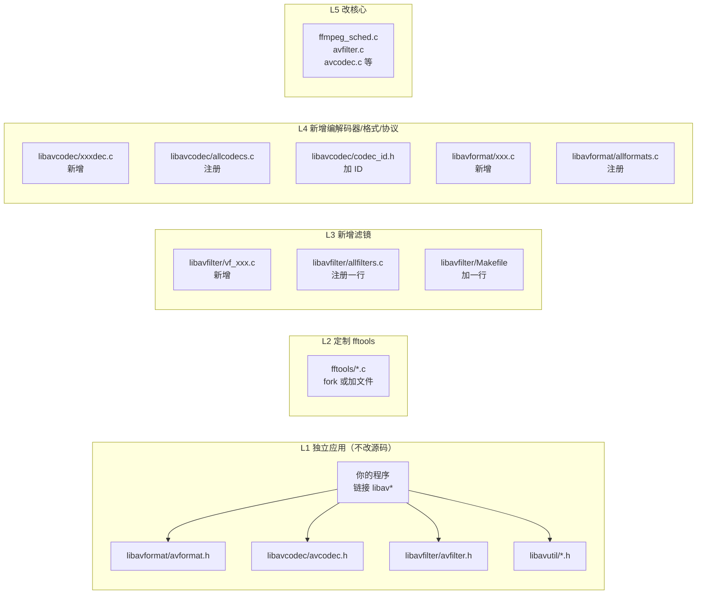
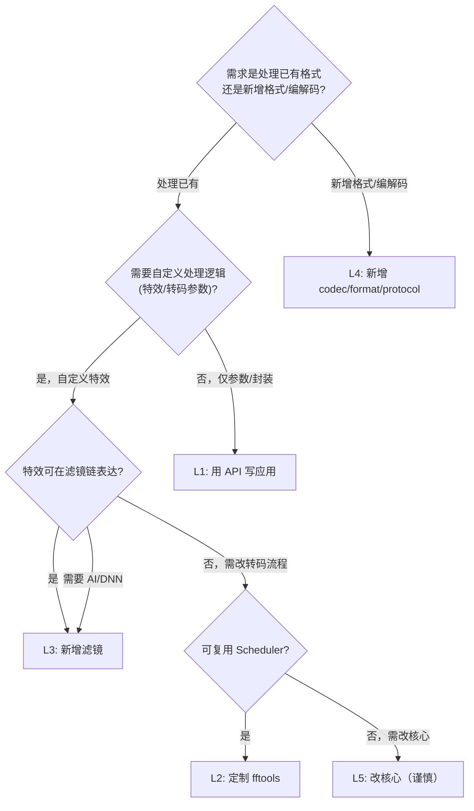

# FFmpeg 二次开发与定制化设计指南

> 基于 FFmpeg 8.1.2 源码（`ffmpeg-8.1.2/`）
> 配套架构分析：`docs-lu/ffg-anaysis.md`
> 本文档回答：如何基于 FFmpeg 做定制化/二次开发？有哪些方向？涉及哪些文件/类（结构体）？以完整案例说明怎么做？

---

## 第 1 章 · 二次开发总览与方向分类

### 1.1 五种侵入层级

FFmpeg 的二次开发按"对 FFmpeg 源码的侵入程度"由轻到重分为五层。侵入越轻，升级维护成本越低；侵入越重，能力越强但与上游越难同步。

| 层级 | 方向 | 改动 FFmpeg 源码？ | 典型场景 | 升级成本 |
|------|------|------------------|---------|---------|
| L1 | 用公共 API 写独立应用 | 否 | 自研转码服务、播放器、探测工具 | 极低（仅换库） |
| L2 | 定制 fftools 行为 | 极少（fork fftools） | 给 ffmpeg 加钩子/选项/输出 | 低 |
| L3 | 新增滤镜 | 是（加文件+注册） | 自定义特效、AI 滤镜 | 中 |
| L4 | 新增编解码器/格式/协议 | 是（加文件+注册+ID） | 私有格式、硬件后端 | 中高 |
| L5 | 改核心抽象 | 是（动核心文件） | 改调度器、改内存模型 | 高（放弃上游同步） |

**推荐原则**：能用 L1 就不用 L2，能用 L3 就不用 L4，永远谨慎对待 L5。FFmpeg 的注册表 + 虚表设计使得 L3/L4 几乎不动核心代码，这是其可扩展性的核心红利。

### 1.2 各方向涉及的核心库与文件矩阵



### 1.3 选型决策树



### 1.4 二次开发通用工程纪律

无论哪个层级，都应遵守：

1. **基于 release tag 而非 master**：用 `n8.1.2` 这样的稳定 tag，避免 master 的 API 漂移。
2. **优先用公共 API**：`*.h` 中的函数是 ABI 稳定的；`*_internal.h` 与 `ff_*` 前缀是内部的，升级会变。
3. **改源码用 patch 而非直接改**：把改动维护成 `.patch`，升级时 rebase，便于跟踪。
4. **加文件优于改文件**：新增编解码器/滤镜/格式只加文件 + 注册一行，不改核心逻辑。
5. **写 FATE 测试**：任何新增能力都配一个 FATE 用例，防回归。
6. **尊重许可证**：LGPL 库改后动态链接可闭源；若链接 GPL 外部库（x264/gpl 版 x265）则传染 GPL。
7. **configure 探测**：新增外部依赖必须在 `configure` 加探测，不硬编码。

---

## 第 2 章 · 方向一：新增编解码器（libavcodec）

本章以一个完整的"行反转无损视频编解码器"为例，演示如何向 libavcodec 新增一对 decoder/encoder。

### 2.1 编解码器骨架

一个编解码器在 FFmpeg 中是一个 `FFCodec` 结构（`codec_internal.h:127`），其公有部分 `AVCodec p` 暴露给用户，内部部分含回调。关键决策是**选择回调类型**：

| 回调类型 | 适用 | 函数签名 |
|---------|------|---------|
| `FF_CODEC_CB_TYPE_DECODE` | 同步解码器 | `int decode(AVCodecContext*, AVFrame*, int*, AVPacket*)` |
| `FF_CODEC_CB_TYPE_RECEIVE_FRAME` | 主动推帧解码器 | `int receive_frame(AVCodecContext*, AVFrame*)` |
| `FF_CODEC_CB_TYPE_ENCODE` | 同步编码器 | `int encode(AVCodecContext*, AVPacket*, int*, const AVFrame*)` |
| `FF_CODEC_CB_TYPE_RECEIVE_PACKET` | 主动推包编码器 | `int receive_packet(AVCodecContext*, AVPacket*)` |

大多数简单编解码器用 `DECODE`/`ENCODE`（同步）；需要内部缓冲或异步的用 `RECEIVE_*`。

### 2.2 完整案例：行反转视频编解码器

**目标**：编码器把每帧的行顺序反转存储（无损、无压缩，仅演示）；解码器还原。这虽无实用价值，但覆盖了编解码器开发的全部要素。

#### 2.2.1 分配 Codec ID

`libavcodec/codec_id.h`：

```c
// 在 AVCodecID 枚举的私有区间添加（用户自定义用 AV_CODEC_ID_FIRST_PRIVATE 之后的区间）
AV_CODEC_ID_MYREV = AV_CODEC_ID_FIRST_PRIVATE,
```

> 实际项目中，私有 codec 应使用 `AV_CODEC_ID_FIRST_PRIVATE` 起始的保留区间，避免与上游冲突。

#### 2.2.2 编码器 `libavcodec/myrevenc.c`

```c
#include "codec_internal.h"
#include "encode.h"
#include "libavutil/imgutils.h"

typedef struct MyRevContext {
    AVClass *av_class;
    int reverse_rows;  // AVOption 参数：是否反转（演示参数化）
} MyRevContext;

// AVOption 定义（配合 priv_class）
static const AVOption myrev_options[] = {
    { "reverse", "reverse row order", offsetof(MyRevContext, reverse_rows),
      AV_OPT_TYPE_INT, { .i64 = 1 }, 0, 1, AV_OPT_FLAG_ENCODING_PARAM | AV_OPT_FLAG_VIDEO_PARAM },
    { NULL }
};
static const AVClass myrev_enc_class = {
    .class_name = "myrev encoder",
    .item_name  = av_default_item_name,
    .option     = myrev_options,
    .version    = LIBAVUTIL_VERSION_INT,
};

// 编码回调：把一帧的行反转后写入 packet
static int myrev_encode(AVCodecContext *avctx, AVPacket *pkt,
                        int *got_packet, const AVFrame *frame, int *unused)
{
    MyRevContext *s = avctx->priv_data;
    int ret;

    // 计算所需大小：帧数据 + 宽高信息头
    int64_t size = av_image_get_buffer_size(avctx->pix_fmt, avctx->width,
                                            avctx->height, 1) + 8;
    if ((ret = ff_get_packet_buffer(avctx, pkt, size)) < 0)
        return ret;

    // 写入宽高（解码时需要，因为容器可能不存）
    AV_WB32(pkt->data,     avctx->width);
    AV_WB32(pkt->data + 4, avctx->height);

    // 行反转拷贝
    uint8_t *dst = pkt->data + 8;
    for (int y = 0; y < avctx->height; y++) {
        int src_y = s->reverse_rows ? (avctx->height - 1 - y) : y;
        memcpy(dst + y * avctx->width * 1,  // 简化：假设 GRAY8 单字节
               frame->data[0] + src_y * frame->linesize[0],
               avctx->width);
    }

    pkt->pts = pkt->dts = frame->pts;
    pkt->duration = frame->duration;
    *got_packet = 1;
    return 0;
}

const FFCodec ff_myrev_encoder = {
    .p.name           = "myrev",
    .p.long_name      = NULL_IF_CONFIG_SMALL("My row-reverse lossless codec"),
    .p.type           = AVMEDIA_TYPE_VIDEO,
    .p.id             = AV_CODEC_ID_MYREV,
    .p.priv_class     = &myrev_enc_class,
    .p.capabilities   = AV_CODEC_CAP_DR1,  // 直接分配帧
    .p.pix_fmts       = (const enum AVPixelFormat[]){ AV_PIX_FMT_GRAY8, AV_PIX_FMT_NONE },
    .priv_data_size   = sizeof(MyRevContext),
    .init             = NULL,  // 无需初始化
    FF_CODEC_ENCODE_CB(myrev_encode),
    .close            = NULL,
};
```

#### 2.2.3 解码器 `libavcodec/myrevdec.c`

```c
#include "codec_internal.h"
#include "decode.h"
#include "libavutil/imgutils.h"

// 解码回调
static int myrev_decode(AVCodecContext *avctx, AVFrame *frame,
                        int *got_frame, AVPacket *pkt, int *unused)
{
    int ret;

    if (pkt->size < 8)
        return AVERROR_INVALIDDATA;

    int width  = AV_RB32(pkt->data);
    int height = AV_RB32(pkt->data + 4);

    // 首次解码时设置输出参数（延迟到首包，因为容器可能未给分辨率）
    if (avctx->width == 0) {
        avctx->width  = width;
        avctx->height = height;
        avctx->pix_fmt = AV_PIX_FMT_GRAY8;
    }

    if ((ret = ff_thread_get_buffer(avctx, frame, 0)) < 0)  // 支持帧线程
        return ret;

    // 还原行顺序（编码时反转了，解码再反转回来）
    uint8_t *src = pkt->data + 8;
    for (int y = 0; y < height; y++) {
        int dst_y = height - 1 - y;
        memcpy(frame->data[0] + dst_y * frame->linesize[0],
               src + y * width, width);
    }

    frame->pts = pkt->pts;
    *got_frame = 1;
    return pkt->size;  // 返回已消费字节数
}

const FFCodec ff_myrev_decoder = {
    .p.name         = "myrev",
    .p.long_name    = NULL_IF_CONFIG_SMALL("My row-reverse lossless codec"),
    .p.type         = AVMEDIA_TYPE_VIDEO,
    .p.id           = AV_CODEC_ID_MYREV,
    .p.capabilities = AV_CODEC_CAP_DR1 | AV_CODEC_CAP_FRAME_THREADS,  // 声明支持帧线程
    FF_CODEC_DECODE_CB(myrev_decode),
};
```

#### 2.2.4 注册

`libavcodec/allcodecs.c`（加两行 extern 声明）：
```c
extern const FFCodec ff_myrev_encoder;
extern const FFCodec ff_myrev_decoder;
```

`libavcodec/Makefile`（加两行）：
```make
OBJS-$(CONFIG_MYREV_DECODER) += myrevdec.o
OBJS-$(CONFIG_MYREV_ENCODER) += myrevenc.o
```

#### 2.2.5 configure 开关

在 `configure` 脚本的 codec 列表区域加：
```sh
myrev_decoder
myrev_encoder
```
（位于 `configure` 中 `INDEV_LIST`/`DECODER_LIST`/`ENCODER_LIST` 附近，按字母序插入）

#### 2.2.6 验证

```bash
./configure --enable-decoder=myrev --enable-encoder=myrev ...  # 或默认全开
make
# 编码：把灰度图编码成 myrev
./ffmpeg -i input.png -c:v myrev output.myrev
# 解码：还原
./ffmpeg -i output.myrev -c:v rawvideo output.png
```

### 2.3 涉及文件清单

| 文件 | 改动 |
|------|------|
| `libavcodec/myrevenc.c` | 新增（编码器） |
| `libavcodec/myrevdec.c` | 新增（解码器） |
| `libavcodec/allcodecs.c` | 加 2 行 `extern` |
| `libavcodec/codec_id.h` | 加 1 个 `AV_CODEC_ID_MYREV` |
| `libavcodec/Makefile` | 加 2 行 `OBJS-$(CONFIG_*)` |
| `configure` | 加 2 行到 codec 列表 |
| `tests/fate/myrev.mak`（可选） | 新增 FATE 测试 |

### 2.4 关键结构体与 API 速查

| 结构体/API | 作用 | 位置 |
|-----------|------|------|
| `FFCodec` | 编解码器定义（含公有 `AVCodec p`） | `codec_internal.h:127` |
| `FF_CODEC_DECODE_CB/ENCODE_CB` | 回调注册宏 | `codec_internal.h:347` |
| `ff_get_packet_buffer` | 编码器分配输出包 | `encode.h` |
| `ff_thread_get_buffer` | 解码器分配帧（线程安全） | `pthread.h` |
| `AVCodecContext.priv_data` | 编解码器私有上下文 | `avcodec.h:439` |
| `AVCodecContext.priv_class` | 私有参数的 AVClass | `codec.h` |

### 2.5 多线程适配

- **帧线程**（`AV_CODEC_CAP_FRAME_THREADS`）：解码器需用 `ff_thread_get_buffer` 分配帧（而非 `av_frame_get_buffer`），并在 `ff_thread_finish_setup` 后才访问参考帧。简单无状态解码器（如本例）天然支持。
- **片线程**（`AV_CODEC_CAP_SLICE_THREADS`）：用 `avctx->execute2` 派发片任务，适合可按块并行的解码器。
- **`FF_CODEC_CAP_AUTO_THREADS`**：让 FFmpeg 自动选线程数，无需 codec 干预。
- `validate_thread_parameters`（`pthread.c:44`）会按 capability 与 `low_delay` 标志自动降级。

### 2.6 测试

**FATE 测试**（`tests/fate/myrev.mak`）：
```make
FATE_MYREV += fate-myrev-roundtrip
fate-myrev-roundtrip: CMD = transcode myrev $(SRC) myrev "-c:v myrev" "-c:v myrev"
fate-myrev-roundtrip: SRC = tests/data/lena.gray  # 或任意灰度测试图
fate-myrev: $(FATE_MYREV)
FATE += $(FATE_MYREV)
```

**命令行验证**：编解码往返后用 `md5` 比对像素是否一致。

---

## 第 3 章 · 方向二：新增滤镜（libavfilter）

新增滤镜是 FFmpeg 二次开发中最常见、侵入最轻的方向之一。一个滤镜在 FFmpeg 中是一个 `FFFilter` 结构（`filters.h:267`，公有部分 `AVFilter p`）。

### 3.1 滤镜骨架

滤镜通过 pad（`AVFilterPad`）描述输入输出端口，通过回调处理帧：

| 回调 | 触发时机 | 作用 |
|------|---------|------|
| `init` / `uninit` | 滤镜实例创建/销毁 | 分配/释放私有数据 |
| `preinit` | 配置前 | 解析参数（AVOption） |
| `config_props`（输入/输出 pad） | 连接配置时 | 校验/协商格式、分配资源 |
| `filter_frame`（输入 pad） | 上游推帧 | 处理帧并向下推 |
| `request_frame`（输出 pad） | 下游拉帧 | 主动产生帧（源滤镜用） |
| `process_command` | 运行时命令 | 动态改参数 |

格式声明用宏简化（`filters.h:238`）：
- `FILTER_PIXFMTS(AV_PIX_FMT_YUV420P, ...)`：声明支持的视频格式；
- `FILTER_QUERY_FUNC(my_query)`：自定义格式协商函数；
- `FILTER_INPUTS/OUTPUTS(array)`：声明端口；
- `ff_video_default_filterpad` / `ff_audio_default_filterpad`：默认单入单出端口。

### 3.2 完整案例：时间戳水印滤镜 `vf_mydrawtext`

**目标**：在视频帧左上角绘制当前帧的 pts（毫秒），演示参数化、格式协商、帧处理、slice threading。

#### 3.2.1 滤镜实现 `libavfilter/vf_mydrawtext.c`

```c
#include "libavutil/opt.h"
#include "libavutil/imgutils.h"
#include "libavformat/avformat.h"  // 仅用 av_rescale_q
#include "avfilter.h"
#include "filters.h"
#include "formats.h"
#include "video.h"

typedef struct MyDrawTextContext {
    const AVClass *class;
    int x, y;           // 水印位置（AVOption）
    int fontsize;       // 字号（演示，实际用 libfreetype）
    AVRational tb;      // 输入时间基
} MyDrawTextContext;

// AVOption
#define OFFSET(x) offsetof(MyDrawTextContext, x)
static const AVOption mydrawtext_options[] = {
    { "x", "horizontal position", OFFSET(x), AV_OPT_TYPE_INT, {.i64=10}, 0, INT_MAX, AV_OPT_FLAG_VIDEO_PARAM|AV_OPT_FLAG_FILTERING_PARAM },
    { "y", "vertical position",   OFFSET(y), AV_OPT_TYPE_INT, {.i64=10}, 0, INT_MAX, AV_OPT_FLAG_VIDEO_PARAM|AV_OPT_FLAG_FILTERING_PARAM },
    { "fontsize", "font size",     OFFSET(fontsize), AV_OPT_TYPE_INT, {.i64=32}, 1, 256, AV_OPT_FLAG_VIDEO_PARAM|AV_OPT_FLAG_FILTERING_PARAM },
    { NULL }
};
AVFILTER_DEFINE_CLASS(mydrawtext);

// 输入 pad 配置：记录时间基
static int config_input(AVFilterLink *inlink) {
    MyDrawTextContext *s = inlink->dst->priv;
    s->tb = inlink->time_base;
    return 0;
}

// 简化的"绘制"：在 Y 平面用白色画一个粗略的数字（实际项目用 libfreetype/SDL_ttf）
static void draw_pts_str(uint8_t *dst, int linesize, int x, int y, const char *str) {
    // 省略：实际用 avfilter/drawutils.h 的 ff_blend_* 或 libfreetype
    // 这里仅占位，演示结构
}

// 帧处理
static int filter_frame(AVFilterLink *inlink, AVFrame *in) {
    AVFilterContext *ctx = inlink->dst;
    MyDrawTextContext *s = ctx->priv;
    AVFrame *out;

    // 确保可写（COW）
    if (av_frame_is_writable(in)) {
        out = in;
    } else {
        out = ff_get_video_buffer(inlink->out, in->width, in->height);
        av_frame_copy_props(out, in);
        av_frame_copy(out, in);  // 实际项目尽量用 ff_filter_frame 接力避免拷贝
    }

    // 计算 pts 毫秒
    int64_t pts_ms = av_rescale_q(out->pts, s->tb, (AVRational){1, 1000});
    char buf[32];
    snprintf(buf, sizeof(buf), "%lldms", (long long)pts_ms);
    draw_pts_str(out->data[0], out->linesize[0], s->x, s->y, buf);

    return ff_filter_frame(inlink->out, out);
}

// 运行时命令：动态改位置
static int process_command(AVFilterContext *ctx, const char *cmd, const char *args,
                           char *res, int res_len, int flags) {
    MyDrawTextContext *s = ctx->priv;
    if (!strcmp(cmd, "x")) s->x = atoi(args);
    else if (!strcmp(cmd, "y")) s->y = atoi(args);
    else return AVERROR(ENOSYS);
    return 0;
}

const FFFilter ff_vf_mydrawtext = {
    .p.name        = "mydrawtext",
    .p.description = NULL_IF_CONFIG_SMALL("Draw frame pts as text"),
    .p.priv_class  = &mydrawtext_class,
    .p.flags       = AVFILTER_FLAG_SUPPORT_TIMELINE_GENERIC,
    .priv_size     = sizeof(MyDrawTextContext),
    FILTER_INPUTS((const AVFilterPad[]) {{
        .name = "default", .type = AVMEDIA_TYPE_VIDEO,
        .config_props = config_input, .filter_frame = filter_frame,
    }}),
    FILTER_OUTPUTS((const AVFilterPad[]) {{
        .name = "default", .type = AVMEDIA_TYPE_VIDEO,
    }}),
    FILTER_PIXFMTS(AV_PIX_FMT_YUV420P, AV_PIX_FMT_YUVJ420P, AV_PIX_FMT_NONE),
    .process_command = process_command,
};
```

#### 3.2.2 注册与构建

`libavfilter/allfilters.c`：
```c
extern const FFFilter ff_vf_mydrawtext;
```

`libavfilter/Makefile`：
```make
OBJS-$(CONFIG_MYDRAWTEXT_FILTER) += vf_mydrawtext.o
```

`configure` 的 filter 列表加 `mydrawtext_filter`。

#### 3.2.3 验证

```bash
./ffmpeg -i input.mp4 -vf "mydrawtext=x=100:y=50:fontsize=48" output.mp4
# 运行时改位置（配合 sendcmd）
./ffmpeg -i input.mp4 -vf "mydrawtext,sendcmd=c=1000 x=200;2000 y=300" output.mp4
```

### 3.3 涉及文件清单

| 文件 | 改动 |
|------|------|
| `libavfilter/vf_mydrawtext.c` | 新增 |
| `libavfilter/allfilters.c` | 加 1 行 `extern` |
| `libavfilter/Makefile` | 加 1 行 |
| `configure` | 加 1 行到 filter 列表 |

### 3.4 格式协商要点

- **`FILTER_PIXFMTS(...)`**：声明支持的视频像素格式，引擎自动协商；
- **`FILTER_QUERY_FUNC(func)`**：复杂协商（如依赖参数动态决定格式）用自定义函数，内部调 `ff_formats_ref`；
- **音频滤镜**用 `FILTER_SAMPLEFMTS` 声明采样格式，`ff_audio_default_filterpad` 作端口；
- 若滤镜不修改帧数据（仅元数据），设 `AVFILTER_FLAG_METADATA_ONLY`（如 `vf_null`），引擎可跳过数据拷贝。

### 3.5 slice threading

耗时滤镜（如卷积）可用 slice threading 并行处理一帧的多个水平条带：

```c
// 用 ff_filter_get_nb_threads 获取线程数，按条带切分
static int filter_slice(AVFilterContext *ctx, void *arg, int jobnr, int nb_jobs) {
    // 处理第 jobnr/nb_jobs 条带
    return 0;
}
static int filter_frame(AVFilterLink *inlink, AVFrame *in) {
    AVFilterContext *ctx = inlink->dst;
    // ... 准备 out ...
    ctx->internal->execute(ctx, filter_slice, out, NULL,
                           FFMIN(in->height, ff_filter_get_nb_threads(ctx)));
    return ff_filter_frame(inlink->out, out);
}
```

参考 `vf_negate.c:271 filter_slice`。

---

## 第 4 章 · 方向三：新增封装格式/协议（libavformat）

### 4.1 demuxer/muxer 骨架

封装/解封装在 FFmpeg 中是 `FFInputFormat`/`FFOutputFormat`（`demux.h:66`/`mux.h:61`，公有部分 `AVInputFormat p`/`AVOutputFormat p`）。

| 回调 | demuxer | muxer |
|------|---------|-------|
| 探测 | `read_probe` | — |
| 头部 | `read_header` | `write_header` |
| 数据 | `read_packet` | `write_packet` / `interleave_packet` |
| 结束 | `read_close` | `write_trailer` |
| 定位 | `read_seek` | — |

### 4.2 完整案例：内存帧序列 muxer

**目标**：一个把输入帧序列写入内存 buffer（而非文件）的 muxer，演示最小 muxer 骨架与 `AVFMT_NOFILE` 模式。参考 `nullenc.c`（38 行，最简 muxer）。

#### 4.2.1 muxer 实现 `libavformat/myframemux.c`

```c
#include "avformat.h"
#include "mux.h"
#include "libavutil/opt.h"

typedef struct MyFrameMuxContext {
    const AVClass *class;
    uint8_t *buffer;     // 输出 buffer（演示）
    size_t   buf_size;
    size_t   buf_used;
    int      frame_count;
} MyFrameMuxContext;

static int myframe_write_header(AVFormatContext *s) {
    MyFrameMuxContext *mux = s->priv_data;
    mux->buf_size = 16 * 1024 * 1024;  // 预分配 16MB
    mux->buffer = av_malloc(mux->buf_size);
    return mux->buffer ? 0 : AVERROR(ENOMEM);
}

static int myframe_write_packet(AVFormatContext *s, AVPacket *pkt) {
    MyFrameMuxContext *mux = s->priv_data;
    if (mux->buf_used + pkt->size > mux->buf_size)
        return AVERROR(ENOMEM);
    memcpy(mux->buffer + mux->buf_used, pkt->data, pkt->size);
    mux->buf_used += pkt->size;
    mux->frame_count++;
    return 0;
}

static int myframe_write_trailer(AVFormatContext *s) {
    MyFrameMuxContext *mux = s->priv_data;
    av_log(s, AV_LOG_INFO, "myframe muxer: wrote %d frames, %zu bytes\n",
           mux->frame_count, mux->buf_used);
    // 实际项目：把 buffer 交还给调用者（通过 opaque 或全局）
    return 0;
}

static const AVClass myframe_muxer_class = {
    .class_name = "myframe muxer",
    .item_name  = av_default_item_name,
    .version    = LIBAVUTIL_VERSION_INT,
};

const FFOutputFormat ff_myframe_muxer = {
    .p.name            = "myframe",
    .p.long_name       = NULL_IF_CONFIG_SMALL("In-memory frame sequence"),
    .p.flags           = AVFMT_NOFILE | AVFMT_VARIABLE_FPS,  // 不用 AVIOContext，自己管内存
    .p.priv_class      = &myframe_muxer_class,
    .p.video_codec     = AV_CODEC_ID_RAWVIDEO,
    .priv_data_size    = sizeof(MyFrameMuxContext),
    .write_header      = myframe_write_header,
    .write_packet      = myframe_write_packet,
    .write_trailer     = myframe_write_trailer,
    .interleave_packet = ff_interleave_packet_passthrough,  // 不交错，直接透传
};
```

#### 4.2.2 注册与构建

`libavformat/allformats.c`：`extern const FFOutputFormat ff_myframe_muxer;`
`libavformat/Makefile`：`OBJS-$(CONFIG_MYFRAME_MUXER) += myframemux.o`
`configure`：muxer 列表加 `myframe_muxer`

#### 4.2.3 验证

```bash
./ffmpeg -i input.mp4 -f myframe -y /dev/null  # -f 指定格式，AVFMT_NOFILE 忽略输出文件
```

### 4.3 协议层：新增自定义 URLProtocol

若需从非标准源（数据库、消息队列、自定义网络协议）读字节，实现一个 `URLProtocol`（`url.h:51`）：

```c
#include "url.h"

typedef struct MyDBContext {
    // 你的连接状态
} MyDBContext;

static int mydb_open(URLContext *h, const char *url, int flags) {
    // 解析 url（如 mydb://host/table/row），建立连接
    return 0;
}
static int mydb_read(URLContext *h, unsigned char *buf, int size) { /* ... */ return n; }
static int mydb_write(URLContext *h, const unsigned char *buf, int size) { /* ... */ return n; }
static int64_t mydb_seek(URLContext *h, int64_t pos, int whence) { /* ... */ return pos; }
static int mydb_close(URLContext *h) { /* ... */ return 0; }

const URLProtocol ff_mydb_protocol = {
    .name = "mydb",
    .url_open = mydb_open, .url_read = mydb_read, .url_write = mydb_write,
    .url_seek = mydb_seek, .url_close = mydb_close,
};
```

注册：`libavformat/protocols.c` 加 `extern const URLProtocol ff_mydb_protocol;`，`Makefile` 加行，`configure` 协议列表加 `mydb_protocol`。之后 `ffmpeg -i mydb://host/table/row ...` 即可。

### 4.4 探测函数要点

demuxer 的 `read_probe` 从文件头字节判断格式，返回 0~100 分数：

```c
static int myframe_probe(const AVProbeData *p) {
    // 检查魔数
    if (p->buf_size >= 4 && AV_RB32(p->buf) == MKBETAG('M','F','R','M'))
        return AVPROBE_SCORE_MAX;  // 100，最确定
    return 0;
}
```

- 分数阈值：`AVPROBE_SCORE_MAX`(100) 确定匹配，`AVPROBE_SCORE_EXTENSION`(50) 按扩展名，`AVPROBE_SCORE_RETRY`(25) 弱匹配；
- `p->buf` 保证 `AVPROBE_PADDING_SIZE` 额外字节（可安全 `AV_RB32` 越界一点）；
- 用户 `-f myframe` 强制指定时跳过探测。

### 4.5 涉及文件清单

| 文件 | 改动 |
|------|------|
| `libavformat/myframemux.c` | 新增（muxer） |
| `libavformat/allformats.c` | 加 1 行 `extern` |
| `libavformat/Makefile` | 加 1 行 |
| `configure` | 加 1 行 |
| （协议）`libavformat/mydbproto.c` | 新增 |
| `libavformat/protocols.c` | 加 1 行 |

---

## 第 5 章 · 方向四：用库 API 构建独立应用

这是**侵入最轻**的方向——完全不改动 FFmpeg 源码，仅用公共 API 编写自己的程序。适合自研转码服务、播放器、探测工具。FFmpeg 在 `doc/examples/` 提供了官方范例（`decode_video.c`/`encode_video.c`/`mux.c`/`remux.c`/`transcode.c`/`filter_audio.c` 等）。

### 5.1 公共 API vs fftools 内部 API

| 维度 | 公共 API（`libav*/`） | fftools 内部 API（Scheduler） |
|------|---------------------|------------------------------|
| ABI 稳定 | 是（`*.h`） | 否（`*_internal.h`、`ff_*`） |
| 多线程调度 | 需自己实现 | 内置 DAG 调度器 |
| 复杂度 | 低，单线程易写 | 高，但功能完整 |
| 升级成本 | 极低 | 高（内部 API 会变） |
| 适用 | 服务端、嵌入式、定制工具 | 需完整 ffmpeg 行为 |

**关键区别**：公共 API 不提供 Scheduler——你需要自己管理 demux/dec/filter/enc/mux 的循环与线程。对单流简单转码，单线程循环足够；对多流/高性能场景，需自建线程池或复用 libavcodec 的帧线程。

### 5.2 完整案例：最小视频转码器

**目标**：把 input.mp4（H.264）转成 output.mkv（H.265），单线程，无滤镜（直接把解码帧送编码器）。

```c
#include <libavformat/avformat.h>
#include <libavcodec/avcodec.h>
#include <libavutil/opt.h>

int main(int argc, char **argv) {
    AVFormatContext *in_fmt = NULL, *out_fmt = NULL;
    AVCodecContext *dec_ctx = NULL, *enc_ctx = NULL;
    AVPacket *pkt = av_packet_alloc();
    AVFrame  *frame = av_frame_alloc();
    int ret, video_stream_index = -1;

    // 1. 打开输入
    avformat_open_input(&in_fmt, "input.mp4", NULL, NULL);
    avformat_find_stream_info(in_fmt, NULL);
    for (int i = 0; i < in_fmt->nb_streams; i++)
        if (in_fmt->streams[i]->codecpar->codec_type == AVMEDIA_TYPE_VIDEO)
            { video_stream_index = i; break; }

    // 2. 打开解码器
    const AVCodec *dec = avcodec_find_decoder(in_fmt->streams[video_stream_index]->codecpar->codec_id);
    dec_ctx = avcodec_alloc_context3(dec);
    avcodec_parameters_to_context(dec_ctx, in_fmt->streams[video_stream_index]->codecpar);
    avcodec_open2(dec_ctx, dec, NULL);

    // 3. 打开输出
    avformat_alloc_output_context2(&out_fmt, NULL, "matroska", "output.mkv");
    const AVCodec *enc = avcodec_find_encoder(AV_CODEC_ID_H265);
    AVStream *out_stream = avformat_new_stream(out_fmt, enc);
    enc_ctx = avcodec_alloc_context3(enc);
    enc_ctx->width = dec_ctx->width;
    enc_ctx->height = dec_ctx->height;
    enc_ctx->pix_fmt = AV_PIX_FMT_YUV420P;
    enc_ctx->time_base = (AVRational){1, 25};
    avcodec_open2(enc_ctx, enc, NULL);
    avcodec_parameters_from_context(out_stream->codecpar, enc_ctx);
    out_stream->time_base = enc_ctx->time_base;

    // 4. 打开输出 IO + 写头
    if (!(out_fmt->oformat->flags & AVFMT_NOFILE))
        avio_open(&out_fmt->pb, "output.mkv", AVIO_FLAG_WRITE);
    avformat_write_header(out_fmt, NULL);

    // 5. 转码主循环
    while (av_read_frame(in_fmt, pkt) >= 0) {
        if (pkt->stream_index != video_stream_index) { av_packet_unref(pkt); continue; }
        // 时间基转换：输入流 tb → 解码器 tb
        av_packet_rescale_ts(pkt, in_fmt->streams[video_stream_index]->time_base, dec_ctx->time_base);

        ret = avcodec_send_packet(dec_ctx, pkt);
        while (ret >= 0) {
            ret = avcodec_receive_frame(dec_ctx, frame);
            if (ret == AVERROR(EAGAIN) || ret == AVERROR_EOF) break;
            // 送编码器
            frame->pts = frame->best_effort_timestamp;
            avcodec_send_frame(enc_ctx, frame);
            while (1) {
                ret = avcodec_receive_packet(enc_ctx, pkt);
                if (ret == AVERROR(EAGAIN) || ret == AVERROR_EOF) break;
                // 时间基转换：编码器 tb → 输出流 tb
                av_packet_rescale_ts(pkt, enc_ctx->time_base, out_stream->time_base);
                pkt->stream_index = out_stream->index;
                av_interleaved_write_frame(out_fmt, pkt);
                av_packet_unref(pkt);
            }
            av_frame_unref(frame);
        }
        av_packet_unref(pkt);
    }

    // 6. flush 解码器与编码器
    avcodec_send_packet(dec_ctx, NULL);
    // ... drain decode ...
    avcodec_send_frame(enc_ctx, NULL);
    while (avcodec_receive_packet(enc_ctx, pkt) >= 0) {
        av_packet_rescale_ts(pkt, enc_ctx->time_base, out_stream->time_base);
        pkt->stream_index = out_stream->index;
        av_interleaved_write_frame(out_fmt, pkt);
        av_packet_unref(pkt);
    }

    // 7. 写尾 + 清理
    av_write_trailer(out_fmt);
    avcodec_free_context(&dec_ctx);
    avcodec_free_context(&enc_ctx);
    avformat_close_input(&in_fmt);
    if (!(out_fmt->oformat->flags & AVFMT_NOFILE)) avio_closep(&out_fmt->pb);
    avformat_free_context(out_fmt);
    av_packet_free(&pkt);
    av_frame_free(&frame);
    return 0;
}
```

### 5.3 涉及头文件

| 头文件 | 用途 |
|--------|------|
| `libavformat/avformat.h` | 打开/读/写容器、流管理 |
| `libavcodec/avcodec.h` | 编解码器打开、send/receive |
| `libavfilter/avfilter.h` | 滤镜图（需滤镜时） |
| `libavutil/opt.h` `avutil/imgutils.h` | 选项、图像工具 |
| `libswscale/swscale.h` | 像素格式转换（需时） |

### 5.4 加滤镜的扩展

若需滤镜处理，在解码与编码之间插入滤镜图：

```c
AVFilterGraph *graph = avfilter_graph_alloc();
AVFilterContext *buffersrc, *buffersink;
// avfilter_graph_create_filter 创建 buffersrc/buffersink
// avfilter_graph_parse_ptr 解析 "scale=1280:720,format=yuv420p"
// avfilter_graph_config 配置
// 解码后：av_buffersrc_add_frame(buffersrc, frame)
// 循环：av_buffersink_get_frame(buffersink, frame) 取处理后帧送编码器
```

参考 `doc/examples/filter_audio.c`、`doc/examples/transcode.c`。

### 5.5 内存/引用计数规范

- **`av_frame_alloc`/`av_packet_alloc`** 只分配结构体，不含数据；
- **`av_frame_unref`/`av_packet_unref`** 释放数据引用（结构体可复用）；
- **`av_frame_ref`/`av_packet_ref`** 增加引用（共享数据，零拷贝）；
- **跨函数传递帧**：传引用即可，接收方 `av_frame_ref` 后双方各 `unref` 一次；
- **写时复制**：需修改帧数据前 `av_frame_make_writable`；
- **错误路径**：每步 `if (ret < 0) goto cleanup`，cleanup 中按分配逆序释放。

---

## 第 6 章 · 方向五：定制 fftools 行为

当需要"ffmpeg 的完整能力 + 少量自定义行为"时，fork fftools 做定制比从零写 API 程序更高效。

### 6.1 定制点

| 定制需求 | 改动位置 |
|---------|---------|
| 新增命令行选项 | `fftools/ffmpeg_opt.c`（`options` 表）+ `opt_xxx` 函数 |
| 改进度报告格式 | `fftools/ffmpeg.c:print_report` |
| 转码完成回调 | `fftools/ffmpeg.c:transcode` 末尾 |
| 自定义组件线程 | 复用 `Scheduler`（`ffmpeg_sched.c`）注册自定义节点 |
| 改 ffprobe 输出 | `fftools/ffprobe.c`（`textformat/`） |

### 6.2 完整案例：转码进度 HTTP 上报钩子

**目标**：转码过程中每 N 秒向 HTTP 服务器上报进度（当前处理 pts、已处理时长）。

#### 6.2.1 新增钩子文件 `fftools/progress_hook.c`

```c
#include "progress_hook.h"
#include "libavutil/time.h"
#include <curl/curl.h>  // 或用 libavformat 的 HTTP 协议

static CURL *curl = NULL;
static char report_url[1024];

void progress_hook_init(const char *url) {
    strncpy(report_url, url, sizeof(report_url));
    curl = curl_easy_init();
}

void progress_hook_report(int64_t cur_pts, int64_t total_duration) {
    if (!curl) return;
    char postdata[256];
    snprintf(postdata, sizeof(postdata),
             "pts=%lld&total=%lld&ts=%lld",
             (long long)cur_pts, (long long)total_duration,
             (long long)av_gettime());
    curl_easy_setopt(curl, CURLOPT_URL, report_url);
    curl_easy_setopt(curl, CURLOPT_POSTFIELDS, postdata);
    curl_easy_perform(curl);
}

void progress_hook_uninit(void) {
    if (curl) curl_easy_cleanup(curl);
}
```

#### 6.2.2 接入 `fftools/ffmpeg.c`

在 `transcode()` 的 `while (!sch_wait(...))` 循环中（已有 `print_report` 处）加：

```c
while (!sch_wait(sch, stats_period, &transcode_ts)) {
    ...
    print_report(0, timer_start, cur_time, transcode_ts);
    progress_hook_report(transcode_ts, 0);  // 新增钩子
}
```

在 `main()` 初始化处加 `progress_hook_init(getenv("FFMPEG_REPORT_URL"))`，cleanup 处加 `progress_hook_uninit()`。

#### 6.2.3 新增选项

`fftools/ffmpeg_opt.c` 的 `options` 表加：
```c
{ "progress_url", HAS_ARG | OPT_GLOBAL, { .func_arg = opt_progress_url },
  "url to report progress to", "url" },
```

#### 6.2.4 构建与使用

```bash
# 链接 libcurl，在 fftools/Makefile 加 progress_hook.o
./ffmpeg -progress_url http://server/report -i in.mp4 out.mkv
```

### 6.3 复用 Scheduler 做高级定制

若需自定义组件（如自定义解码器线程做特殊预处理），可复用 `Scheduler`：

```c
// 注册一个自定义解码节点
int idx = sch_add_dec(sch, my_custom_decoder_thread, my_ctx, 0);
sch_add_dec_output(sch, idx);
sch_connect(sch, SCH_DEMUX(0, stream_idx), SCH_DEC(idx));
sch_connect(sch, SCH_DEC(idx, 0), SCH_FILTER_IN(0, 0));
```

`my_custom_decoder_thread` 遵循 `decoder_thread` 的模式（`sch_dec_receive` → 处理 → `sch_dec_send`），但内部可做任意自定义逻辑。这是 L4/L5 的边界——复用调度器但插入自定义组件。

---

## 第 7 章 · 硬件加速集成

FFmpeg 的硬件加速通过三层上下文（见架构分析 9.4）解耦：`hw_device_ctx`（设备）→ `hw_frames_ctx`（帧池）→ `AVCodecHWConfig`（编解码器声明支持）。接入新硬件后端需实现这三层。

### 7.1 硬件后端类型

`AV_HWDEVICE_TYPE_*`（`hwcontext.h:28`）枚举所有支持的后端：VDPAU/CUDA/VAAPI/DXVA2/QSV/VIDEOTOOLBOX/D3D11VA/DRM/OPENCL/MEDIACODEC/VULKAN/D3D12VA/AMF/OHCODEC。

### 7.2 接入新硬件后端的骨架

#### 7.2.1 设备上下文 `libavutil/hwcontext_mygpu.c`

```c
#include "hwcontext_internal.h"

// 你的设备上下文
typedef struct MyGPUDeviceContext {
    AVHWDeviceContext hwctx;  // 公有部分
    // 私有：GPU 句柄、上下文等
} MyGPUDeviceContext;

// 设备创建
static int mygpu_device_create(AVHWDeviceContext *ctx) {
    // 初始化 GPU 上下文
    return 0;
}
// 设备销毁、帧池创建、帧分配、数据传输（download/upload）等回调
static const HWContextType mygpu_type = {
    .type = AV_HWDEVICE_TYPE_MYGPU,  // 需在 hwcontext.h 加枚举
    .device_create = mygpu_device_create,
    // ... frames_get_buffer / transfer_get_data / ...
};
```

#### 7.2.2 硬件编解码器 `libavcodec/mygpu_enc.c`

```c
#include "hwaccel_internal.h"
#include "hwconfig.h"

const FFHWAccel ff_myrev_mygpu_hwaccel = {
    .p.name = "myrev_mygpu",
    .p.type = AV_HWDEVICE_TYPE_MYGPU,
    // ...
};

const FFCodec ff_myrev_mygpu_encoder = {
    .p.name = "myrev_mygpu",
    // ...
    .hwaccel = &ff_myrev_mygpu_hwaccel,
};
```

#### 7.2.3 注册

- `libavutil/hwcontext.h`：加 `AV_HWDEVICE_TYPE_MYGPU` 枚举；
- `libavutil/hwcontext.c`：注册 `mygpu_type`；
- `libavutil/Makefile`：加 `hwcontext_mygpu.o`；
- `libavcodec/allcodecs.c`：注册硬件编解码器；
- `configure`：加 `--enable-mygpu` 探测。

### 7.3 硬件滤镜链路

硬件帧可在滤镜图内全程保持硬件内存，避免 GPU↔CPU 往返：

```bash
./ffmpeg -hwaccel cuda -i input.mp4 \
  -vf "scale_cuda=1280:720,hwdownload,format=yuv420p" \
  -c:v libx265 output.mkv
```

- `scale_cuda`/`scale_vaapi`/`scale_vulkan`：硬件缩放，输入输出都是硬件帧；
- `hwdownload`/`hwupload`：硬件↔系统内存转换；
- `libavfilter/cuda/`、`vulkan/`、`opencl/` 目录含硬件滤镜实现，可参考接入自定义硬件滤镜。

---

## 第 8 章 · 构建集成与版本管理

### 8.1 configure 选项注册

新增组件需在 `configure` 脚本注册开关。`configure` 用 `DECODER_LIST`/`ENCODER_LIST`/`MUXER_LIST`/`DEMUXER_LIST`/`FILTER_LIST`/`PROTOCOL_LIST` 等列表管理：

```sh
# configure 中（按字母序插入对应列表）
myrev_decoder
myrev_encoder
myframe_muxer
mydrawtext_filter
mydb_protocol
```

`configure` 会据此生成 `config_components.h`（`CONFIG_MYREV_DECODER=1` 等）与 `codec_list.c`/`format_list.c`/`filter_list.c` 注册表。

### 8.2 外部库依赖探测

若组件依赖外部库，在 `configure` 加探测：

```sh
enabled myrev && require_pkg_config myrev myrev myrev.h myrev_init;
# 或
enabled myrev && check_lib myrev myrev.h myrev_init -lmyrev;
```

`require_pkg_config` / `check_lib` / `check_func` 是 configure 的探测原语。

### 8.3 ABI 兼容

- **新增组件**（L3/L4）：不破坏 ABI，安全；
- **改公有结构**（L5）：破坏 ABI，需 bump SO 版本，下游需重编译；
- **加字段**：FFmpeg 在结构体末尾加字段并 bump 版本，旧二进制兼容（末尾追加安全）；
- **删字段**：必须经 `FF_API_*` 废弃周期（通常 2 个大版本）；
- **二次开发建议**：只加不删，改公有结构前先看 `lib*/version.h` 的版本号规则。

### 8.4 FATE 测试

任何新组件都应配 FATE 测试防回归：

```make
# tests/fate/myrev.mak
FATE_MYREV-$(CONFIG_MYREV_DECODER) += fate-myrev-roundtrip
fate-myrev-roundtrip: CMD = transcode myrev $(TARGET_SAMPLES)/video/lena.gray myrev \
    "-c:v myrev" "-c:v myrev -f rawvideo"
fate-myrev: $(FATE_MYREV-yes)
FATE += $(FATE_MYREV-yes)
```

`tests/fate/` 下按组件分目录，`fate-run.sh` 是测试运行器，`ref/` 存预期输出哈希。运行 `make fate-myrev` 验证。

---

## 第 9 章 · 常见陷阱与未考虑事项补充

### 9.1 线程安全

| 对象 | 跨线程共享 | 说明 |
|------|----------|------|
| `AVBufferRef` | 是（引用计数原子） | 多线程共享同一帧数据安全 |
| `AVCodecContext` | 否（单线程用） | 除非用帧/片线程，否则一个 context 一个线程 |
| `AVFormatContext` | 否 | demux/mux 各自单线程 |
| `AVFilterGraph` | 否（执行期） | 配置后执行期单线程驱动（slice 线程除外） |
| `AVBufferPool` | 是（lock-free） | 设计为多线程共享帧池 |
| Scheduler | 是（内部加锁） | 组件线程通过调度器通信，安全 |

**陷阱**：误以为 `AVCodecContext` 可多线程共享——`avcodec_send/receive` 不是线程安全的，多线程需用帧线程或每线程一个 context。

### 9.2 时间基/时间戳坑

- **`AV_NOPTS_VALUE`**（`INT64_MIN`）表示未知 pts/dts，必须显式处理，不能直接参与运算；
- **时间基转换**：跨组件用 `av_packet_rescale_ts` / `av_rescale_q`，勿手算（易溢出）；
- **编码器 time_base**：应设为 `1/frame_rate` 或容器要求的 tb，编码后由 muxer 转到流 tb；
- **音频 pts**：按采样数累加（`pts += nb_samples`），帧大小变化时易错；
- **`copy_ts`/`start_at_zero`**：影响时间戳偏移，流拷贝时尤其注意。

### 9.3 EOF/flush 语义

每个组件有 drain 责任（见架构分析 5.8）：
- **解码器**：`avcodec_send_packet(NULL)` 后循环 `receive_frame` 至 `AVERROR_EOF`；
- **编码器**：`avcodec_send_frame(NULL)` 后循环 `receive_packet` 至 `AVERROR_EOF`；
- **滤镜**：`av_buffersrc_add_frame(NULL)` 触发 flush，循环 `buffersink_get_frame` 至 EOF；
- **muxer**：`av_write_trailer` 写尾；
- **遗漏 flush** 会导致末尾几帧丢失（B 帧/编码器缓冲）。

### 9.4 错误码与退出码

- **`AVERROR_EOF`**：正常结束（非错误）；
- **`AVERROR(EAGAIN)`**：需重试（send/receive 不匹配）；
- **`AVERROR_EXIT`**：用户中断；
- **ffmpeg 退出码**：0 成功，255 信号中断，69 错误率超限（`FFMPEG_ERROR_RATE_EXCEEDED`）；
- **错误处理**：统一 `if (ret < 0) { av_log(..., av_err2str(ret)); goto fail; }`。

### 9.5 性能

- **零拷贝边界**：`av_frame_ref` 共享，`av_frame_copy` 复制——能 ref 就不 copy；
- **`av_frame_make_writable`**：写前调用，若唯一引用则原地返回，否则 COW；
- **缓冲池**：高频分配用 `AVBufferPool`（解码器内部已用）；
- **避免 `av_frame_copy`**：滤镜链应接力帧而非复制；
- **硬件帧**：尽量保持硬件内存，仅在必要时 `hwdownload`。

### 9.6 调试

- **`av_log`**：`-v debug`/`-v trace` 提升日志级别；`AV_LOG_SKIP_REPEATED` 去重；
- **`ff_tlog`**（trace log）：`avfilter.c` 的 `ff_tlog_link` 跟踪滤镜链数据流；
- **`-debug_ts`**：打印每个包/帧的时间戳；
- **valgrind/sanitizer**：`--enable-debug --disable-optimizations` 编译后用 `valgrind ./ffmpeg ...`；
- **`-progress`**：机器可读的进度输出。

### 9.7 许可证

- **LGPL**：FFmpeg 默认 LGPL，动态链接可闭源商业使用；
- **GPL 组件**：`--enable-gpl` 启用 GPL 组件（如 x264 GPL 版），整体传染 GPL；
- **外部库**：x264（GPL/商业）、x265（GPL/商业）、openssl（Apache）、fdk-aac（非自由）等，按需评估传染性；
- **二次开发**：若需闭源，避免 `--enable-gpl` 与 `--enable-nonfree`，仅用 LGPL 组件。

### 9.8 用户未考虑的方向（专业补充）

除上述五个方向，以下方向值得考虑：

**1. DNN/AI 滤镜**（`libavfilter/dnn/`）
FFmpeg 已内置 DNN 滤镜框架（`dnn_filter_common.c`），支持 TensorFlow/OpenVINO 后端。可接入自定义 AI 模型做超分（`dnn_processing`）、去噪、风格迁移。开发：实现 `DNNModule` 后端 + 滤镜调用 `ff_dnn_execute`。

**2. 流媒体协议扩展**（`libavformat/`）
新增 RTMP/SRT/WHIP/WebRTC 协议。参考 `rtmpproto.c`/`srt.c`，实现 `URLProtocol`。WHIP（WebRTC HTTP Ingest）是直播新趋势，FFmpeg 8.x 已有实验支持。

**3. 低延迟优化**
- `-tune zerolatency`（编码器）+ `-fflags +nobuffer` + `-flags low_delay`；
- 关闭帧线程（`-threads 1` 解码），减少延迟；
- 自定义 Scheduler 调度策略，减少缓冲；
- 用 `AVFMT_NOFILE` + 自定义 IO 做零拷贝直播。

**4. 嵌入式裁剪**（`configure --disable-*`）
按需裁剪：`--disable-everything --enable-decoder=h264 --enable-demuxer=mov --enable-protocol=file`，可把 ffmpeg 从数百 MB 编译到几 MB。适合 IoT/嵌入式。

**5. 多路并发服务化**
把 ffmpeg 封装为转码服务（如转码农场）：每路一个 ffmpeg 进程（隔离）或用 API 自建多路调度。注意：单进程内多路转码需每路独立 `AVFormatContext`/`AVCodecContext`，不可共享。

**6. 自定义 IO 回调**（`AVIOContext`）
不实现 `URLProtocol`，直接用 `avio_alloc_context` 传自定义 `read_packet`/`write_packet` 回调，适合从内存/数据库/网络流读写，无需改 FFmpeg 源码（L1 级）。

**7. 滤镜图可视化与调试**
`-filter_complex ... -show_graph`（需自加）或解析 `avfilter_graph_parse` 的结果生成 dot 图，辅助复杂滤镜图调试。

**8. 性能剖析与瓶颈定位**
`-benchmark` 输出 utime/stime/rtime；`perf record ./ffmpeg ...` 热点定位；`-x86asm` 关闭汇编对比 SIMD 收益；`valgrind --tool=callgrind` 调用图。

---

## 附录

### 附录 A · 二次开发检查清单

新增组件时逐项检查：
- [ ] 公有/内部分离：`FFCodec`/`FFFilter`/`FFOutputFormat` 含公有 `p` 成员
- [ ] 回调类型选择正确（DECODE/RECEIVE_FRAME/ENCODE/...）
- [ ] 私有上下文 + AVOption 参数化（`priv_class` + `AVOption`）
- [ ] 格式声明（`FILTER_PIXFMTS` / `pix_fmts` / `sample_fmts`）
- [ ] 多线程能力声明（`AV_CODEC_CAP_FRAME_THREADS` 等）
- [ ] 注册：`allcodecs.c`/`allfilters.c`/`allformats.c` + `Makefile` + `configure`
- [ ] Codec ID 分配（私有用 `AV_CODEC_ID_FIRST_PRIVATE` 区间）
- [ ] 错误处理：所有路径 `if (ret < 0) goto fail`
- [ ] 资源释放：`close`/`uninit` 释放所有分配
- [ ] FATE 测试：新增 `.mak` + 预期输出
- [ ] 许可证合规：避免非必要 GPL/nonfree

### 附录 B · 关键 API 速查（按方向）

| 方向 | 关键 API |
|------|---------|
| 编解码器 | `avcodec_find_decoder/encoder`, `avcodec_open2`, `avcodec_send_packet/receive_frame`, `avcodec_send_frame/receive_packet` |
| 滤镜 | `avfilter_graph_alloc`, `avfilter_graph_create_filter`, `avfilter_graph_parse_ptr`, `avfilter_graph_config`, `av_buffersrc_add_frame`, `av_buffersink_get_frame` |
| 封装 | `avformat_open_input`, `avformat_find_stream_info`, `av_read_frame`, `avformat_alloc_output_context2`, `avformat_write_header`, `av_interleaved_write_frame`, `av_write_trailer` |
| IO | `avio_open`, `avio_read/write`, `avio_alloc_context`（自定义回调） |
| 硬件 | `av_hwdevice_ctx_alloc/init`, `av_hwframe_ctx_alloc`, `av_hwframe_get_buffer`, `avcodec_get_hw_config` |
| 内存 | `av_frame_alloc/ref/unref/make_writable`, `av_packet_alloc/unref`, `av_buffer_ref/unref` |
| 时间 | `av_packet_rescale_ts`, `av_rescale_q` |

### 附录 C · 参考实现文件索引（最小范例）

| 范例 | 文件 | 行数 | 学什么 |
|------|------|------|--------|
| 最简滤镜 | `libavfilter/vf_null.c` | 35 | FFFilter 最小骨架 |
| 最简音频滤镜 | `libavfilter/af_anull.c` | 36 | 音频滤镜骨架 |
| 最简 muxer | `libavformat/nullenc.c` | 38 | FFOutputFormat 骨架 |
| 格式滤镜 | `libavfilter/vf_format.c` | 240 | query_formats、AVOption |
| negate 滤镜 | `libavfilter/vf_negate.c` | ~370 | slice threading、process_command |
| drawtext | `libavfilter/vf_drawtext.c` | 1943 | 完整复杂滤镜 |
| API 转码 | `doc/examples/transcode.c` | — | 公共 API 转码 |
| API 解码 | `doc/examples/decode_video.c` | — | 公共 API 解码 |
| API mux | `doc/examples/mux.c` | — | 公共 API 封装 |
| API remux | `doc/examples/remux.c` | — | 流拷贝（无编解码） |
| 硬件解码 | `doc/examples/hw_decode.c` | — | 硬件加速 API |
| VAAPI 编码 | `libavcodec/vaapi_encode.c` | — | 硬件编码框架 |

---

*文档完。基于 FFmpeg 8.1.2 源码，共 9 章 + 3 附录，覆盖 5 个二次开发方向 + 硬件加速 + 构建集成 + 陷阱与补充。*


