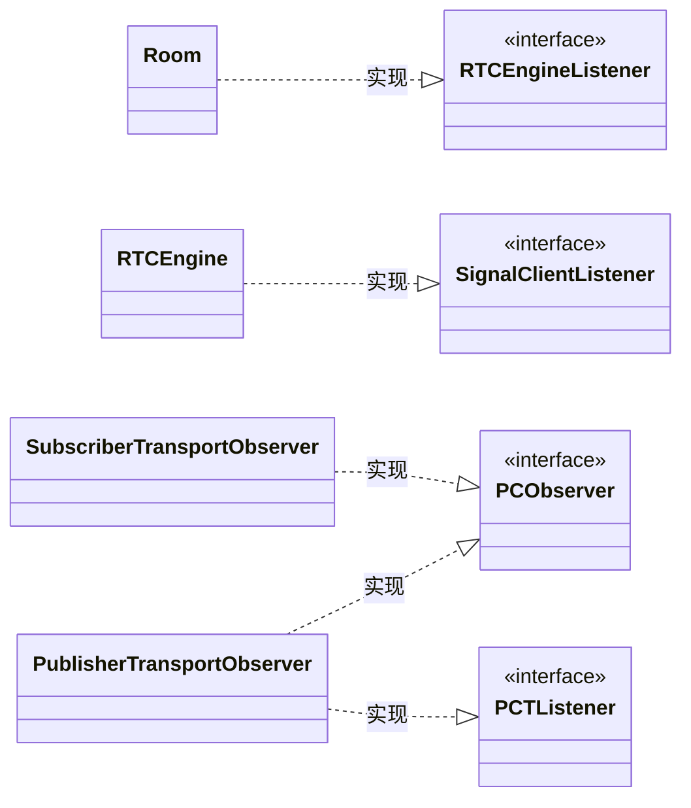
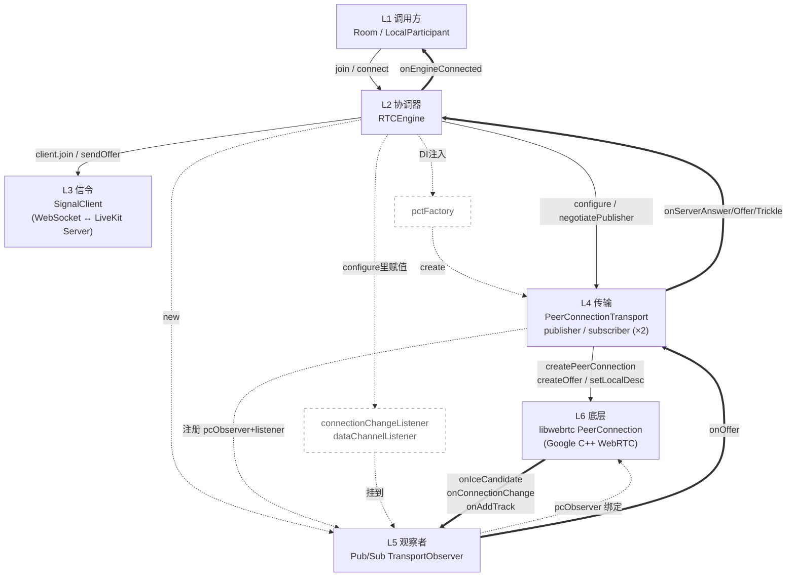
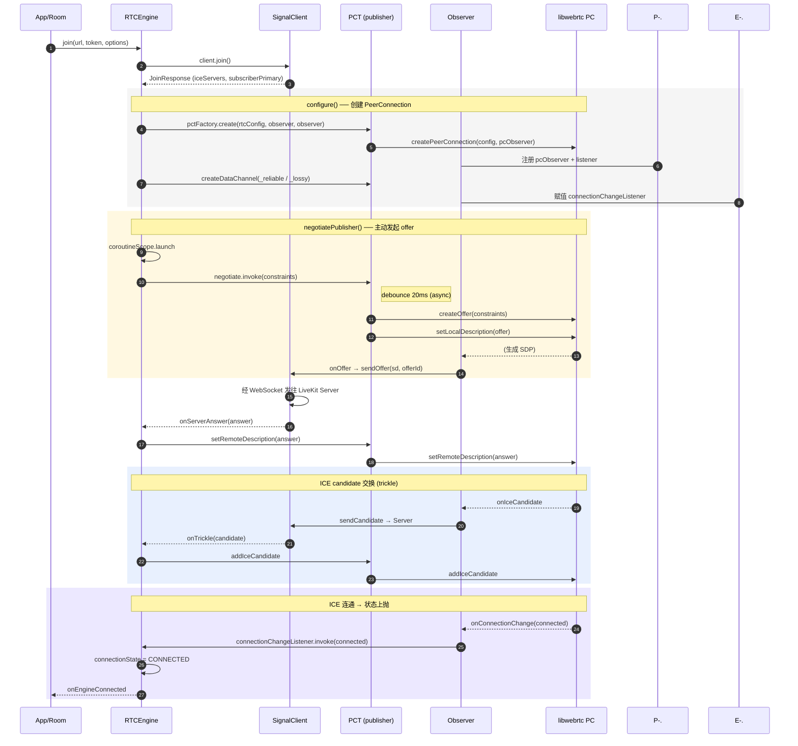
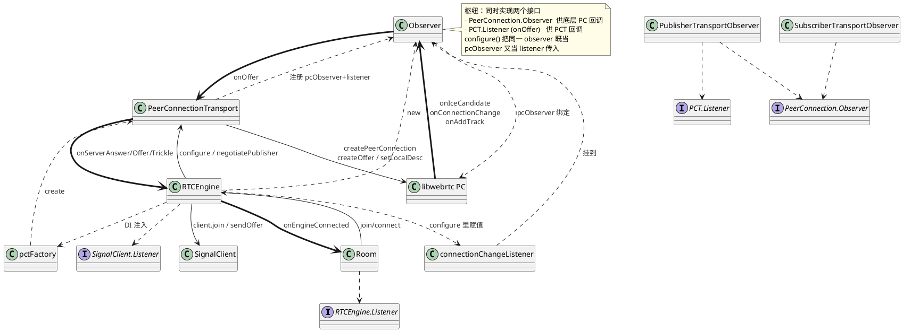
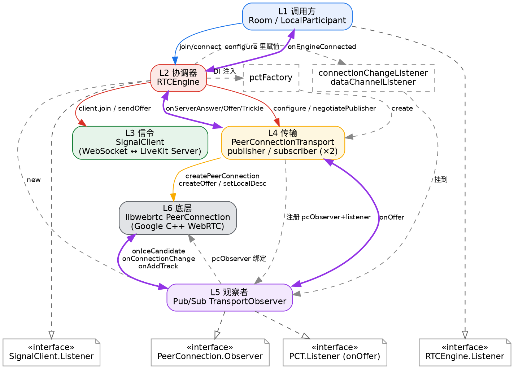

# RTCEngine 加入房间与 PeerConnection 协商流程分析

> 源码：`livekit-android-sdk/src/main/java/io/livekit/android/room/RTCEngine.kt`
> 相关文件：`PeerConnectionTransport.kt`、`PublisherTransportObserver.kt`、`SubscriberTransportObserver.kt`、`util/CoroutineUtil.kt`
> 整理日期：2026-08-28

---

## 0. 背景问题

针对 `RTCEngine.kt` 中 `joinImpl` 与 `configure` 这一段代码：

- 这里是否在创建 PeerConnection？
- 后面是否会调用底层 webrtc 库进行协商？
- `PeerConnectionTransport.Factory` 的 `pctFactory.create` 在哪里？
- “随后触发”协商是如何触发的？为什么在 `negotiatePublisher()` 里看不到 `async`/`delay`？
- `debounce` 里的 `param` 到底是哪一个？
- 各层之间的注册 / 调用 / 回调关系如何分层表达？

本文逐层回答上述问题。

---

## 1. `joinImpl` —— 加入房间的入口

```kotlin
suspend fun joinImpl(
    url: String,
    token: String,
    options: ConnectOptions,
    roomOptions: RoomOptions,
): JoinResponse = coroutineScope {
    if (connectionState == ConnectionState.DISCONNECTED) {
        connectionState = ConnectionState.CONNECTING
    }
    val joinResponse = client.join(url, token, options, roomOptions)
    ensureActive()

    listener?.onJoinResponse(joinResponse)
    isClosed = false
    listener?.onSignalConnected(false)

    isSubscriberPrimary = joinResponse.subscriberPrimary

    configure(joinResponse, options)

    // create offer
    if (!isSubscriberPrimary || joinResponse.fastPublish) {
        negotiatePublisher()
    }
    client.onReadyForResponses()

    return@coroutineScope joinResponse
}
```

### 1.1 信令握手

```kotlin
val joinResponse = client.join(url, token, options, roomOptions)
```

这一步是**信令层**的动作：`SignalClient` 通过 WebSocket 连到 LiveKit 服务器，发送 join 请求，拿到服务器返回的 `JoinResponse`。其中包含 ICE 服务器列表、客户端配置、参与者信息，以及一个关键标志 `subscriberPrimary`。

### 1.2 创建 PeerConnection

```kotlin
configure(joinResponse, options)
```

拿到响应后调用 `configure`，**这里才是真正创建 PeerConnection 的地方**。

### 1.3 触发协商

```kotlin
if (!isSubscriberPrimary || joinResponse.fastPublish) {
    negotiatePublisher()
}
```

配置完之后，如果**不是 subscriber-primary 模式**（或者服务端要求 fastPublish），就主动发起 publisher 的 SDP 协商。这就是“后面去调用底层 webrtc 库进行协商”。

### 1.4 开启响应处理

```kotlin
client.onReadyForResponses()
```

告诉信令客户端：可以开始处理服务器后续推送的响应了（在此之前收到的服务器消息会先缓冲）。

---

## 2. `configure` —— 创建 PeerConnection

整个函数体跑在 **RTC 线程**上（`launchBlockingOnRTCThread`），并用 `configurationLock` 做了幂等保护（已配置过就直接返回）。

### 2.1 核心创建

```kotlin
publisher = pctFactory.create(rtcConfig, publisherObserver, publisherObserver)
subscriber = pctFactory.create(rtcConfig, subscriberObserver, null)
```

`pctFactory.create` 创建的是 `PeerConnectionTransport`。看它的构造函数（`PeerConnectionTransport.kt:85-90`）：

```kotlin
internal val peerConnection: PeerConnection = executeBlockingOnRTCThread(rtcThreadToken) {
    connectionFactory.createPeerConnection(config, pcObserver)
    ?: throw IllegalStateException("peer connection creation failed?")
}!!
```

所以 `pctFactory.create` 的本质就是调用 Google libwebrtc 的 `PeerConnectionFactory.createPeerConnection(...)` —— 这才是真正落到底层 C++ WebRTC 库创建 `PeerConnection` 对象的地方。

LiveKit 用了**两条独立的 PeerConnection**：

- **publisher**：客户端上行（发布自己的音视频、数据通道）
- **subscriber**：客户端下行（订阅别人的音视频）

`rtcConfig` 由 `makeRTCConfig` 生成，把服务器下发的 ICE servers 合并进去，设置 `UNIFIED_PLAN`、`GATHER_CONTINUALLY` 等。

### 2.2 连接状态监听

`connectionStateListener` 把底层 ICE/PeerConnection 状态映射到上层的 `connectionState`（CONNECTED / DISCONNECTED）。

- subscriber-primary 模式下以 subscriber 的状态为准，且 publisher 断开时触发 `reconnect()`；
- 否则以 publisher 状态为准。

### 2.3 数据通道

在 publisher 上创建了两个 DataChannel：

- `_reliable`：`ordered = true`，可靠有序（用于需要保证到达的消息，带缓冲重发逻辑）
- `_lossy`：`ordered = false, maxRetransmits = 0`，丢包不重传（用于高频低延迟数据，如活跃说话者更新）

> 注意 subscriber-primary 模式下，这两个数据通道是由**服务器端在 subscriber 上打开**的，所以走的是 `subscriberObserver.dataChannelListener` 那条分支，而不是这里 `createDataChannel`。

---

## 3. `negotiatePublisher()` —— 发起协商

```kotlin
internal fun negotiatePublisher() {
    hasPublished = true
    if (!client.isConnected) {
        return
    }
    coroutineScope.launch {
        negotiatePublisherMutex.withLock {
            publisher?.negotiate?.invoke(getPublisherOfferConstraints())
        }
    }
}
```

`negotiate` 是个 **20ms 去抖**的函数（`PeerConnectionTransport.kt:146`），最终调用 `createAndSendOffer`。这一步真正触发了底层 WebRTC 的 SDP 协商：

1. `peerConnection.createOffer(constraints)` —— 调用底层库生成 offer SDP
2. 对 SDP 做 munge（给 SVC 编码加 DD 扩展、设置起始/最大码率）
3. `peerConnection.setLocalDescription(...)` —— 设置为本地描述
4. `listener.onOffer(sdp, offerId)` —— 把 offer 通过信令发给服务器

`getPublisherOfferConstraints()` 里设了 `OFFER_TO_RECV_AUDIO/FALSE`、`OFFER_TO_RECV_VIDEO/FALSE`（publisher 只发不收），重连时还会加 `ICE_RESTART=TRUE`。

---

## 4. 服务器回应 —— 协商的另一半

offer 发出去后，服务器的应答通过 `SignalClient.Listener` 回调进来：

- **`onServerAnswer`**（publisher 收到 answer）：`publisher?.setRemoteDescription(...)` —— 把服务器的 answer 设为远端描述。至此 publisher 的 SDP 协商完成。
- **`onServerOffer`**（subscriber-primary 模式，服务器主动发 offer）：客户端 `setRemoteDescription` → `createAnswer` → `setLocalDescription` → `client.sendAnswer` 回发给服务器。subscriber 的协商由服务器主导。
- **`onTrickle`**：收到服务器转发的 ICE candidate，按 target 分发给 publisher 或 subscriber 的 `addIceCandidate`。

ICE 候选交换完成后，底层 ICE 连通，`connectionStateListener` 把状态置为 `CONNECTED`，触发 `listener?.onEngineConnected()`，整个加入流程结束。

### 时序总览

```
joinImpl
  │
  ├─ client.join()  ──WebSocket──>  LiveKit Server  ──> JoinResponse
  │                                                    (iceServers, subscriberPrimary...)
  │
  ├─ configure()
  │    ├─ makeRTCConfig()  → RTCConfiguration
  │    ├─ pctFactory.create()  → PeerConnectionFactory.createPeerConnection()  [publisher]
  │    ├─ pctFactory.create()  → PeerConnectionFactory.createPeerConnection()  [subscriber]
  │    ├─ 设置 connectionChangeListener
  │    └─ publisher.createDataChannel(_reliable / _lossy)
  │
  ├─ negotiatePublisher()
  │    └─ publisher.createOffer() → setLocalDescription() → onOffer() ──信令──> Server
  │                                                                    <──answer── onServerAnswer()
  │                                                                    ──ICE trickle── onTrickle()
  │                                                                    (底层 ICE 连通 → CONNECTED)
  │
  └─ client.onReadyForResponses()
```

一句话总结：**`configure` 通过 `pctFactory.create` 调用底层 WebRTC 库创建出 publisher/subscriber 两条 PeerConnection 并建好数据通道；`negotiatePublisher` 随后触发 createOffer → setLocalDescription，把 offer 经信令发给服务器，服务器回 answer 后 setRemoteDescription，配合 ICE candidate 交换完成协商与连通。**

---

## 5. `pctFactory.create(...)` 在哪里

它不在某个手写的工厂类里，而是 **Dagger 的 `@AssistedFactory` 生成的**。看 `PeerConnectionTransport.kt:389-396`：

```kotlin
@AssistedFactory
interface Factory {
    fun create(
        config: RTCConfiguration,
        pcObserver: PeerConnection.Observer,
        listener: Listener?,
    ): PeerConnectionTransport
}
```

这是 Dagger 的 [Assisted Injection](https://dagger.dev/dev-guide/assisted-injection) 机制。工作原理：

- `PeerConnectionTransport` 的构造函数标了 `@AssistedInject`，其中 `config`、`pcObserver`、`listener` 三个参数标了 `@Assisted`（运行时传入），其余参数（`ioDispatcher`、`connectionFactory`、`sdpFactory`、`rtcThreadToken`）由 Dagger 图注入：

```kotlin
@AssistedInject
constructor(
    @Assisted config: RTCConfiguration,
    @Assisted pcObserver: PeerConnection.Observer,
    @Assisted private val listener: Listener?,
    @Named(InjectionNames.DISPATCHER_IO) private val ioDispatcher: CoroutineDispatcher,
    connectionFactory: PeerConnectionFactory,   // ← 由 Dagger 注入
    private val sdpFactory: SdpFactory,
    private val rtcThreadToken: RTCThreadToken,
)
```

- 编译时 Dagger 会为这个 `@AssistedFactory interface Factory` 生成一个实现类，它的 `create(...)` 方法把“你传的三个 `@Assisted` 参数”和“Dagger 图里注入的依赖”组合起来，调用 `PeerConnectionTransport` 的构造函数。

- `RTCEngine` 构造函数里的 `pctFactory: PeerConnectionTransport.Factory` 也是被 Dagger 注入进来的（`@Inject constructor`），所以 `pctFactory.create(...)` 实际调用的就是这个**Dagger 生成的实现**。

所以“在哪里”的答案是：**没有显式的 Kotlin 源码，它在编译期由 Dagger 生成**。真正干活的逻辑就是 `PeerConnectionTransport` 构造函数里那行 `connectionFactory.createPeerConnection(config, pcObserver)`（`PeerConnectionTransport.kt:85-90`）—— 这才落到底层 libwebrtc。

---

## 6. “随后触发”是如何触发的

`negotiatePublisher()`（`RTCEngine.kt:716-730`）里：

```kotlin
coroutineScope.launch {
    negotiatePublisherMutex.withLock {
        publisher?.negotiate?.invoke(getPublisherOfferConstraints())
    }
}
```

`publisher?.negotiate` 是 `PeerConnectionTransport` 里的这个属性（`PeerConnectionTransport.kt:146-152`）：

```kotlin
val negotiate = debounce<MediaConstraints?, Unit>(20, coroutineScope) {
    if (it != null) createAndSendOffer(it) else createAndSendOffer()
}
```

而 `debounce` 的实现（`CoroutineUtil.kt:31-44`）：

```kotlin
internal fun <T, R> debounce(
    waitMs: Long = 300L,
    coroutineScope: CoroutineScope,
    destinationFunction: suspend (T) -> R,
): (T) -> Unit {
    var debounceJob: Deferred<R>? = null
    return { param: T ->
        debounceJob?.cancel()              // 取消上一个待执行的
        debounceJob = coroutineScope.async {
            delay(waitMs)                  // 等 20ms
            return@async destinationFunction(param)
        }
    }
}
```

### 触发链

```
negotiatePublisher()
  └─ coroutineScope.launch { ... }                    ← 启协程
       └─ negotiate?.invoke(constraints)               ← 调 debounce 返回的 lambda
            └─ coroutineScope.async { delay(20); createAndSendOffer(constraints) }
                 └─ (20ms 后) createAndSendOffer()
                      └─ peerConnection.createOffer(constraints)   ← 底层 WebRTC
                      └─ setLocalDescription(...)
                      └─ listener.onOffer(sdp, offerId)             ← 经信令发给服务器
```

### 关键点

1. **`negotiate?.invoke(...)` 本身不是挂起函数**，它立即返回 —— 只是往 `coroutineScope` 里 `launch` 了一个 `async` 任务，任务里先 `delay(20)` 再执行真正的 `createAndSendOffer`。这就是“20ms 去抖”：如果在 20ms 内又调用一次 `negotiatePublisher`（比如快速连续发布多个 track），前一个 `debounceJob` 会被 `cancel()`，只有最后一次会真正执行，避免并发 `createOffer` 产生竞态（类注释 `RTCEngine.kt:225-229` 也说明了 `negotiatePublisherMutex` 是防 ICE gathering race 的）。

2. **“随后触发”指的就是这个 `delay(20)` 之后的异步执行**。`joinImpl` 里调用 `negotiatePublisher()` 后并不等它完成，函数就 `return@coroutineScope joinResponse` 返回了。真正的 `createOffer` 在 20ms 后由协程驱动，跑在 `PeerConnectionTransport` 自己的 `coroutineScope`（IO dispatcher）上，而 `createOffer` 内部又通过 `launchRTCIfNotClosed` 切到 **RTC 线程**执行底层 WebRTC 调用。

3. `createAndSendOffer` 完成后通过 `listener.onOffer(sdp, offerId)` 把 offer 交回 `RTCEngine`（`PublisherTransportObserver` 实现了 `Listener`），再由它通过 `SignalClient` 发给服务器 —— 这就接上了第 4 节说的 `onServerAnswer` 回调。

一句话：`pctFactory.create` 是 Dagger 生成的工厂方法，内部调底层 `createPeerConnection`；`negotiatePublisher` 通过一个 20ms 的 `debounce` 协程异步触发 `createAndSendOffer`，这才是“随后触发协商”的机制。

---

## 7. `async`/`delay` 为什么在 `negotiatePublisher` 里看不到

这一步不是写在 `negotiatePublisher()` 里的，而是**分散在三个地方**，通过“把函数当值传来传去”串起来的。你没在 `negotiatePublisher` 里看到 `async`/`delay`，是因为它们藏在 `negotiate` 这个属性背后。逐行对应：

### 7.1 三处代码

**① `RTCEngine.kt:725-729` —— 调用入口**

```kotlin
coroutineScope.launch {                       // RTCEngine 的协程作用域
    negotiatePublisherMutex.withLock {
        publisher?.negotiate?.invoke(getPublisherOfferConstraints())
        //              ↑ 这就是触发点
    }
}
```

这里只做了一件事：拿到 `publisher.negotiate` 这个“函数值”，然后 `.invoke(constraints)` 调用它。`negotiate` 是个 `val`，类型是 `(MediaConstraints?) -> Unit`（一个 lambda）。所以这一行**本身没有 `async`/`delay`**。

**② `PeerConnectionTransport.kt:146-152` —— `negotiate` 是什么**

```kotlin
val negotiate = debounce<MediaConstraints?, Unit>(20, coroutineScope) {
    if (it != null) createAndSendOffer(it) else createAndSendOffer()
}
```

`negotiate` 在对象创建时就被赋值 = `debounce(...)` 的**返回值**。`debounce` 返回的是一个 lambda，所以 `negotiate` 就是那个 lambda。后面那个 `{ createAndSendOffer(it) }` 是“去抖结束后真正要执行的逻辑”，作为参数 `destinationFunction` 传进去。

**③ `CoroutineUtil.kt:31-44` —— `async`/`delay` 真正在这里**

```kotlin
internal fun <T, R> debounce(
    waitMs: Long = 300L,
    coroutineScope: CoroutineScope,
    destinationFunction: suspend (T) -> R,
): (T) -> Unit {
    var debounceJob: Deferred<R>? = null
    return { param: T ->                        // ← 这整个 lambda 就是 negotiate
        debounceJob?.cancel()
        debounceJob = coroutineScope.async {     // ← async 在这里!
            delay(waitMs)                        // ← delay(20) 在这里!
            return@async destinationFunction(param)   // ← 20ms 后调 createAndSendOffer
        }
    }
}
```

### 7.2 串起来看

```
RTCEngine.kt:725   coroutineScope.launch { ... }          (RTCEngine 的 scope)
RTCEngine.kt:727     publisher?.negotiate?.invoke(constraints)
                            │  negotiate 是个 val,值 = debounce() 返回的 lambda
                            ▼
CoroutineUtil.kt:37  return { param ->                     ← invoke 执行的就是这个 lambda 体
CoroutineUtil.kt:39    debounceJob = coroutineScope.async { ← 注意:这里的 coroutineScope
CoroutineUtil.kt:40      delay(20)                            是 PeerConnectionTransport 的 scope
CoroutineUtil.kt:41      destinationFunction(param)          (PeerConnectionTransport.kt:82)
                            │
                            ▼
PeerConnectionTransport.kt:147  createAndSendOffer(it)
```

### 7.3 你“没看到”的原因

关键在于 Kotlin 里**函数是一等公民**：`debounce(...)` 的返回值是一个 lambda，被存进 `negotiate` 这个 `val`。所以：

- `negotiatePublisher()` 里写的 `negotiate?.invoke(...)` 看起来像普通函数调用，实际上跳到了 `CoroutineUtil.kt:37` 那个 `return { param -> ... }` 的 lambda 体里执行。
- 而 `async { delay(20); ... }` 是在那个 lambda 体**内部**写的，自然在 `RTCEngine.kt` 里搜不到 —— 它在 `CoroutineUtil.kt:39`。

### 7.4 一个容易忽略的细节：两个不同的 `coroutineScope`

- `RTCEngine.kt:725` 的 `coroutineScope.launch` 用的是 **RTCEngine 的** `coroutineScope`（`RTCEngine.kt:213`，`ioDispatcher`）。
- `CoroutineUtil.kt:39` 的 `coroutineScope.async` 用的是 **PeerConnectionTransport 的** `coroutineScope`（`PeerConnectionTransport.kt:82`，`ioDispatcher + SupervisorJob()`），因为 `debounce(20, coroutineScope, ...)` 创建时传进去的是 PCT 自己的 scope（`PeerConnectionTransport.kt:146`）。

所以执行流程是：`launch`（在 RTCEngine scope）→ 调 `negotiate.invoke` → `invoke` 内部用 PCT 的 scope `async` 了一个 20ms 延时任务 → `launch` 那个协程其实**不等**这个 async，`invoke` 立即返回 → 20ms 后 PCT scope 里的 async 醒过来执行 `createAndSendOffer`。这就是为什么 `negotiatePublisher()` 是“触发后立即返回，协商随后异步发生”。

---

## 8. `debounce` 里的 `param` 是哪一个

`param` 就是 `negotiate?.invoke(getPublisherOfferConstraints())` 里传进去的那个 **`getPublisherOfferConstraints()` 的返回值** —— 一个 `MediaConstraints` 对象。

### 8.1 数据怎么传过去的

`debounce` 的签名（`CoroutineUtil.kt:31-35`）：

```kotlin
internal fun <T, R> debounce(
    waitMs: Long = 300L,
    coroutineScope: CoroutineScope,
    destinationFunction: suspend (T) -> R,
): (T) -> Unit {          // ← 返回类型是 (T) -> Unit,即接受一个 T 参数的 lambda
    var debounceJob: Deferred<R>? = null
    return { param: T ->   // ← 这个 param 就是调用时传入的 T
        debounceJob?.cancel()
        debounceJob = coroutineScope.async {
            delay(waitMs)
            return@async destinationFunction(param)   // ← 20ms 后把 param 喂给 createAndSendOffer
        }
    }
}
```

这里 `T = MediaConstraints?`，`R = Unit`。

把泛型实例化后，`negotiate` 的类型就是：

```kotlin
val negotiate: (MediaConstraints?) -> Unit
```

### 8.2 完整传参链路

```
RTCEngine.kt:727
  publisher?.negotiate?.invoke( getPublisherOfferConstraints() )
                                  │
                                  │  这个返回的 MediaConstraints 对象
                                  │  作为实参传给 invoke()
                                  ▼
debounce 返回的 lambda:  { param: MediaConstraints? -> ... }
                                  │
                                  │  param 接住这个对象
                                  ▼
CoroutineUtil.kt:41
  destinationFunction(param)
                                  │
                                  │  param 作为实参传给 destinationFunction
                                  ▼
PeerConnectionTransport.kt:146-152
  debounce<MediaConstraints?, Unit>(20, coroutineScope) { it ->   // ← 这里 it 就是 param
      if (it != null) createAndSendOffer(it) else createAndSendOffer()
  }
```

### 8.3 `param` 具体装了什么

看 `getPublisherOfferConstraints()`（`RTCEngine.kt:916-941`），它构造的 `MediaConstraints` 里 `mandatory` 区放了这些键值对：

| 键 | 值 | 作用 |
|---|---|---|
| `OfferToReceiveAudio` | `false` | publisher 只发不收音频 |
| `OfferToReceiveVideo` | `false` | publisher 只发不收视频 |
| `IceRestart` | `true`（仅重连时） | 重连/恢复时强制 ICE 重启 |

所以 `param` 就是这个装着约束条件的 `MediaConstraints`。它一路传到 `createAndSendOffer(constraints)`（`PeerConnectionTransport.kt:155`），最终在 `peerConnection.createOffer(constraints)`（`PeerConnectionTransport.kt:194`）被底层 WebRTC 读取 —— 底层根据这些约束来生成 offer SDP（比如不包含 `a=recvonly` 的音频/视频 m-line）。

### 8.4 为什么 `negotiate` 的参数类型是 `MediaConstraints?`

注意 `debounce` 的 lambda 体里有个判空：

```kotlin
if (it != null) createAndSendOffer(it) else createAndSendOffer()
```

而 `negotiatePublisher()` 里传的是 `getPublisherOfferConstraints()`（非空）。这个可空分支是为别处调用准备的 —— `PeerConnectionTransport` 内部在 `setRemoteDescription` 后若 `renegotiate == true` 会调 `createAndSendOffer()`（无参，用默认 `MediaConstraints()`，见 `PeerConnectionTransport.kt:140-141`、`155`）。但通过 `negotiate` 这个对外属性走时，传的就是带约束的 `param`，走 `createAndSendOffer(it)` 这条非空分支。

一句话：`param` = `getPublisherOfferConstraints()` 生成的那个 `MediaConstraints`，它从 `RTCEngine` 一路透传到 20ms 后的 `createAndSendOffer`，最后喂给底层 `createOffer`。

---

## 9. 分层关系图

### 图例

```
  ──►   实线 + 实心箭头   同步方法调用 (call)
  ┄┄►   虚线 + 箭头       注册 / 注入 / 持有 / 赋值 (register / DI / holds)
  ══►   双线 + 箭头       回调 / 事件通知 (callback / event)
  ┄┄▷   虚线 + 空心三角   实现接口 (realize, UML)
```

### 图1 ── 分层结构 & 注册关系（静态）

```
┌──────────────────────────────────────────────────────────────────┐
│ L1 调用方      Room / LocalParticipant                            │
│                ┄┄▷ RTCEngine.Listener   (Room 实现该接口)          │
└──────────────────────────────────────────────────────────────────┘
        │
        │ ──► join() / connect()
        ▼
┌──────────────────────────────────────────────────────────────────┐
│ L2 协调器      RTCEngine                                          │
│                ┄┄▷ SignalClient.Listener  (RTCEngine 实现该接口)   │
│   持有:                                                            │
│     pctFactory : PeerConnectionTransport.Factory   ←┄┄ DI 注入    │
│     publisherObserver  / subscriberObserver        ←┄┄ 自己 new   │
│     listener : RTCEngine.Listener?                  ←┄┄ Room 注册   │
└──────────────────────────────────────────────────────────────────┘
        │ ┄┄ client.listener = this   (init 里把自己注册为信令监听者)
        ▼
┌────────────────────────────┐    ┌───────────────────────────────┐
│ L3 信令   SignalClient      │    │ L4 传输  PeerConnectionTransport│
│   (WebSocket ↔ LiveKit Srv) │    │   publisher / subscriber (×2)  │
│   .listener = RTCEngine     │    │   持有:                         │
│   sendOffer/Answer/Candidate│    │     peerConnection (libwebrtc)  │
│  onServerAnswer/Offer/Trickle│   │     negotiate (debounce lambda)│
└────────────────────────────┘    └───────────────────────────────┘
                                          │ ┄┄ create() 时作为
                                          │     pcObserver + listener 传入
                                          ▼
┌──────────────────────────────────────────────────────────────────┐
│ L5 观察者    PublisherTransportObserver / SubscriberTransportObs │
│   ┄┄▷ PeerConnection.Observer          (供 libwebrtc 回调)          │
│   ┄┄▷ PeerConnectionTransport.Listener (onOffer,供 PCT 回调)       │
│   可注册的 lambda:                                                  │
│     connectionChangeListener   ←┄┄ configure() 里赋值              │
│     dataChannelListener        ←┄┄ configure() 里赋值(sub-primary)│
└──────────────────────────────────────────────────────────────────┘
                                          │ ┄┄ 作为 pcObserver 绑定给 PC
                                          ▼
┌──────────────────────────────────────────────────────────────────┐
│ L6 底层      libwebrtc PeerConnection (Google C++ WebRTC)          │
│   createOffer / setLocalDescription / setRemoteDescription         │
│   addIceCandidate / createDataChannel                              │
│   通过 Observer 把事件回调上层                                      │
└──────────────────────────────────────────────────────────────────┘
```

要点：观察者（L5）是“枢纽”——它同时实现两个接口，一个给底层 PC 回调（`PeerConnection.Observer`），一个给 PCT 回调（`PCT.Listener.onOffer`）。`configure()` 里那两个 `pctFactory.create(rtcConfig, publisherObserver, publisherObserver)` 把同一个 observer **既当 pcObserver 又当 listener** 传进去，这就是注册关系（虚线）的源头。

### 图2 ── 协商时序（动态）

时间自上而下。实线=调用，双线=回调/事件，虚线=注册。

```
 App     Engine    Signal   PCT(pub)   Obs      PC(lib)
  │        │         │        │         │         │
  │──1.join►│         │        │         │         │
  │        │──2.join()──────► │         │         │
  │        │         │══3.JoinResp══(Server)      │
  │        │◄══4.joinResp═══  │         │         │
  │        │         │        │         │         │
  │        │──5.configure()──┐│         │         │
  │        │  6.pctFactory.create()──►  │         │
  │        │         │        │──7.createPeerConn─►│
  │        │         │        │  ┄┄8.注册pcObserver┄┄►(L5)
  │        │         │        │──9.createDataChannel►│
  │        │         │        │         │         │
  │        │──10.negotiatePublisher     │         │
  │        │──11.negotiate.invoke(constraints)──► │
  │        │         │        │ (async delay 20ms) │
  │        │         │        │──12.createOffer────►│
  │        │         │        │──13.setLocalDesc───►│
  │        │         │        │══14.onOffer(sd)══►  │(到L5)
  │        │         │        │         │──15.sendOffer──►Signal
  │        │         │        │         │         │
  │        │         │══16.onServerAnswer══(Server)│
  │        │──17.setRemoteDescription()──►│         │
  │        │         │        │──18.setRemoteDesc──►│
  │        │         │        │         │         │
  │        │         │        │         │◄══19.onIceCandidate══PC
  │        │         │        │         │──20.sendCandidate──►Signal
  │        │         │══21.onTrickle═══(Server)    │
  │        │──22.addIceCandidate()──►   │         │
  │        │         │        │──23.addIceCandidate►│
  │        │         │        │         │         │
  │        │         │        │         │◄══24.onConnectionChange(connected)
  │        │         │        │         │══25.connectionChangeListener══►Engine
  │        │◄══26.connectionState=CONNECTED══│     │
  │◄══27.onEngineConnected══│        │         │         │
  │        │         │        │         │         │
```

阶段划分：

- **步骤 1–4**：信令握手，拿 `JoinResponse`。
- **步骤 5–9**：`configure()` 创建两条 PC + 数据通道，注册 observer（虚线 8）。
- **步骤 10–15**：publisher 主动协商 —— `negotiatePublisher` → 20ms 去抖 → `createOffer` → `onOffer` 回调 → 经信令发 offer。
- **步骤 16–18**：服务器回 answer → `setRemoteDescription`，SDP 协商完成。
- **步骤 19–23**：ICE candidate 交换（trickle），双向各一次。
- **步骤 24–27**：底层 ICE 连通 → `onConnectionChange` 回调 → lambda 改 `connectionState` → 通知上层 `onEngineConnected`。

### 关系速查表

| 关系 | 线型 | 代码位置 | 说明 |
|---|---|---|---|
| Room → RTCEngine.Listener | ┄┄▷ 实现 | `Room` 实现 `RTCEngine.Listener` | Room 接收引擎事件 |
| RTCEngine → SignalClient.Listener | ┄┄▷ 实现 | `RTCEngine.kt:232` `client.listener = this` | 引擎接收信令事件 |
| pctFactory → RTCEngine | ┄┄ 注入 | `RTCEngine.kt:117` | Dagger 注入工厂 |
| observer → PCT | ┄┄ 注册 | `RTCEngine.kt:300-310` `pctFactory.create(..., observer, observer)` | 同一 observer 当 pcObserver + listener |
| connectionChangeListener → observer | ┄┄ 赋值 | `RTCEngine.kt:332/340` | `configure()` 里挂状态监听 lambda |
| join / configure / negotiatePublisher | ── 调用 | `RTCEngine.kt:259/268/272` | 同步调用链 |
| negotiate.invoke → createAndSendOffer | ── 调用 | `PeerConnectionTransport.kt:146` + `CoroutineUtil.kt:41` | 20ms 去抖后执行 |
| onOffer / onServerAnswer / onTrickle | ══ 回调 | `PublisherTransportObserver.kt:66` / `RTCEngine.kt:1088,1152` | SDP/ICE 事件回流 |
| onIceCandidate / onConnectionChange | ══ 回调 | `PublisherTransportObserver.kt:48,75` | 底层 PC → observer → 上层 |

---

## 10. Mermaid 渲染图

### 图1a ── 接口实现关系（空心三角）

> UML 中“实现接口”用空心三角箭头表示。Mermaid 的 `flowchart` 画不出空心三角，只有 `classDiagram` 的 `..|>` 能渲染真正的空心三角，所以这部分单独用类图表达。



### 图1b ── 分层结构 & 注册/调用/回调关系

> 三种线型：实线 `-->` = 调用，虚线 `-.->` = 注册/注入/持有，粗线 `==>` = 回调/事件回流（近似“双线”）。



### 图2 ── 协商时序图



### 看图说明

**图1a（类图）** 专门画“实现接口”关系：

- **虚线 + 空心三角 `..|>`**：UML 标准的“实现（realize）”记号。Mermaid 只有 `classDiagram` 能渲染真正的空心三角，`flowchart` 做不到，所以这部分单独拆出来。

**图1b（结构图）** 读法：

- **实线 `-->`**：同步调用方向，如 `Engine → PCT → PC`。
- **虚线 `-.->`**：注册/注入/持有关系，如 `pctFactory` 由 DI 注入、observer 被注册给 PC、`connectionChangeListener` 在 `configure()` 里挂到 observer。
- **粗线 `==>`**：回调/事件回流（近似“双线”，Mermaid 的 `flowchart` 没有真正的双线箭头，`==>` 是最接近的粗线表示），自底向上 —— 底层 PC 的 `onIceCandidate`/`onConnectionChange` 经 observer 上抛到 Engine，Engine 再回调 Room。

**图2（时序图）** 按阶段分色块：

- 灰色 = `configure()` 创建 PC
- 米黄 = `negotiatePublisher` 主动发 offer（含 20ms 去抖）
- 蓝色 = ICE candidate 交换
- 紫色 = ICE 连通、状态上抛

把这两段 Mermaid 贴到支持 Mermaid 的 Markdown 预览器（VS Code 的 Markdown Preview Mermaid、GitHub README、Notion 等）即可渲染成带颜色的图。

---

## 11. 其它工具渲染图（能真正体现空心三角与双线）

Mermaid 的 `flowchart` 画不出真正的空心三角和双线箭头。下面用两种行业标准工具补充，它们能原生渲染这些 UML 符号：

- **PlantUML** —— UML 领域事实标准，`..|>` 原生渲染空心三角。
- **Graphviz (DOT)** —— `arrowhead=onormal` 渲染真正的空心三角，箭头样式控制最精确。

### 图3 ── PlantUML 组件图（空心三角 + 双线回调）

> 渲染方式：粘贴到 [plantuml.com](https://www.plantuml.com/plantuml/uml/) 在线预览，或装 VS Code 的 PlantUML 插件。
>
> 线型对照：
> - `..>` 虚线 + 空心三角 = 实现接口（realize）
> - `-->` 实线 = 调用
> - `..>` 虚线 = 注册/注入/持有
> - `==` 双线 = 回调/事件回流（PlantUML 用粗线 `-[thickness=3]->` 近似，下文另用 Graphviz 画真正的双线）



### 图4 ── Graphviz DOT 组件图（真正的空心三角 + 真正的双线）

> 渲染方式：粘贴到 [dreampuf.github.io/GraphvizOnline](https://dreampuf.github.io/GraphvizOnline/) 或本地 `dot -Tsvg file.dot -o out.svg`。
>
> 箭头样式（Graphviz 最精确）：
> - `arrowhead=onormal` = **空心三角**（UML realize）
> - `arrowhead=normal` = 实心箭头（调用）
> - `style=dashed` + `arrowhead=normal` = 虚线（注册/注入）
> - `arrowhead=crow` + `style=bold` 或 `dir=both` 双箭头 = 回调（这里用粗线 + 双箭头近似"双线回流"）



### 图5 ── PlantUML 时序图（对照图2，含双线返回）

> PlantUML 时序图用 `->` 实线调用、`-->` 虚线返回，比 Mermaid 更接近 UML 标准。`autonumber` 自动编号。

```plantuml
@startuml
autonumber
skinparam sequenceArrowThickness 1
skinparam roundCorner 10

participant "App/Room" as App
participant "RTCEngine" as E
participant "SignalClient" as S
participant "PCT (publisher)" as P
participant "Observer" as O
participant "libwebrtc PC" as PC

App -> E: join(url, token, options)
E -> S: client.join()
S --> E: JoinResponse (iceServers, subscriberPrimary)

== configure() ── 创建 PeerConnection ==

E -> P: pctFactory.create(rtcConfig, observer, observer)
P -> PC: createPeerConnection(config, pcObserver)
P ..> O: 注册 pcObserver + listener
E -> P: createDataChannel(_reliable / _lossy)
E ..> O: 赋值 connectionChangeListener

== negotiatePublisher() ── 主动发起 offer ==

E -> E: coroutineScope.launch
E -> P: negotiate.invoke(constraints)
note right of P: debounce 20ms (async)
P -> PC: createOffer(constraints)
P -> PC: setLocalDescription(offer)
PC --> O: (生成 SDP)
O -> S: onOffer → sendOffer(sd, offerId)

S -> S: 经 WebSocket 发往 LiveKit Server
S --> E: onServerAnswer(answer)
E -> P: setRemoteDescription(answer)
P -> PC: setRemoteDescription(answer)

== ICE candidate 交换 (trickle) ==

PC --> O: onIceCandidate
O -> S: sendCandidate → Server
S --> E: onTrickle(candidate)
E -> P: addIceCandidate
P -> PC: addIceCandidate

== ICE 连通 → 状态上抛 ==

PC --> O: onConnectionChange(connected)
O -> E: connectionChangeListener.invoke(connected)
E -> E: connectionState = CONNECTED
E --> App: onEngineConnected

@enduml
```

### 三种工具对照

| 能力 | Mermaid | PlantUML | Graphviz DOT |
|---|---|---|---|
| 空心三角（实现接口） | 仅 `classDiagram` 的 `..|>` | `..|>` 原生支持 | `arrowhead=onormal` |
| 双线 / 回调 | 仅粗线 `==>` 近似 | 粗线 `-[thickness=3]->` | `dir=both` + `style=bold` |
| 虚线（注册/注入） | `-.->` | `..>` | `style=dashed` |
| 时序图 | `sequenceDiagram` | `@startuml` 时序 | 不擅长 |
| 在线渲染 | GitHub/VS Code 原生 | [plantuml.com](https://www.plantuml.com/plantuml/uml/) | [GraphvizOnline](https://dreampuf.github.io/GraphvizOnline/) |
| 适合场景 | README 快速预览 | UML 严谨表达 | 箭头样式最精确 |

**推荐**：想看最标准的 UML 符号（空心三角 + 双线），用 **图4 Graphviz** 渲染效果最接近教科书；想看带颜色的结构图，用 **图3 PlantUML**；时序图 **图5 PlantUML** 比 Mermaid 版更接近 UML 规范。
