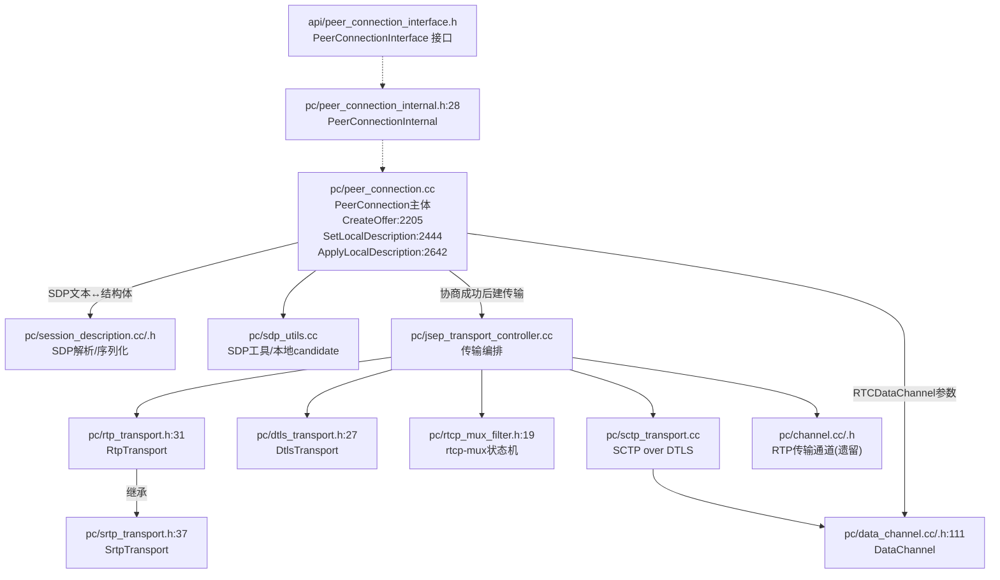

```mermaid

flowchart TB
    API["api/peer_connection_interface.h<br/>PeerConnectionInterface 接口"]
    PCI["pc/peer_connection_internal.h:28<br/>PeerConnectionInternal"]
    PC["pc/peer_connection.cc<br/>PeerConnection主体<br/>CreateOffer:2205<br/>SetLocalDescription:2444<br/>ApplyLocalDescription:2642"]
    SDP["pc/session_description.cc/.h<br/>SDP解析/序列化"]
    SDF["pc/sdp_utils.cc<br/>SDP工具/本地candidate"]
    JTC["pc/jsep_transport_controller.cc<br/>传输编排"]
    MUX["pc/rtcp_mux_filter.h:19<br/>rtcp-mux状态机"]
    DC["pc/data_channel.cc/.h:111<br/>DataChannel"]
    SCTP["pc/sctp_transport.cc<br/>SCTP over DTLS"]
    CH["pc/channel.cc/.h<br/>RTP传输通道(遗留)"]
    RTPTR["pc/rtp_transport.h:31<br/>RtpTransport"]
    ST["pc/srtp_transport.h:37<br/>SrtpTransport"]
    DT["pc/dtls_transport.h:27<br/>DtlsTransport"]

    API -.-> PCI -.-> PC
    PC -->|"SDP文本↔结构体"| SDP
    PC --> SDF
    PC -->|"协商成功后建传输"| JTC
    PC -->|"RTCDataChannel参数"| DC
    JTC --> RTPTR
    RTPTR -->|"继承"| ST
    JTC --> DT
    JTC --> MUX
    JTC --> SCTP --> DC
    JTC --> CH


```
