# WebRTC RTCP 模块分析文档

> 工程根目录：`/data1/luhonghao/codes/adrtc/webrtc/webrtc-m144_release`（**M144 主树**，即 LiveKit Android 实际依赖的版本）
> 分析范围：RTCP（RTP Control Protocol）的实现结构、类图、收发流程、调用图与控制结构
> 文档日期：2026-09-02（已按 M144 源码核对修订）
> 版本说明：本文档早期版本基于 `webRTC`（≈M105）与 `webrtc_vs2022_based_windows_10`（≈M125）两棵树编写；本次已对照 **M144 主树**逐项核对，修正了文件路径、类名、行号与驱动模型。标注约定：`M144/` = `webrtc-m144_release/`。

---

## 目录

1. [模块定位与代码分布](#1-模块定位与代码分布)
2. [类图（Class Diagram）](#2-类图class-diagram)
3. [RTCP 发送流程图](#3-rtcp-发送流程图)
4. [RTCP 接收流程图](#4-rtcp-接收流程图)
5. [调用图（含函数/文件位置、初始化参数配置）](#5-调用图含函数文件位置初始化参数配置)
6. [初始化参数配置清单](#6-初始化参数配置清单)
7. [控制结构框图](#7-控制结构框图)
8. [关键调用链汇总](#8-关键调用链汇总)
9. [问答：新旧 RTCP 引擎的区别](#9-问答新旧-rtcp-引擎的区别)
10. [补充问答：LiveKit 与 WebRTC 的关系](#10-补充问答livekit-与-webrtc-的关系)
11. [LiveKit-Android × WebRTC 全生命周期分层总览图](#11-livekit-android--webrtc-全生命周期分层总览图)
12. [QoS 闭环详图](#12-qos-闭环详图第阶段单独放大)
13. [信令交互详图](#13-信令交互详图第阶段单独放大)
14. [完整详细版：层级横轴 × 阶段纵轴](#14-完整详细版层级横轴--阶段纵轴可渲染)
15. [源码对照学习路径（实操手册）](#15-源码对照学习路径实操手册)
16. [学习路线总表](#16-学习路线总表)
17. [各模块类图与文件结构速览](#17-各模块类图与文件结构速览)
    - 17.7 各模块类图（继承关系详解）：拥塞控制 GCC / 媒体层 / pc+p2p 传输层 / LiveKit SDK
18. [模块全景与模块间关系（每模块独立成图）](#18-模块全景与模块间关系每模块独立成图)
    - 18.1 六模块划分 ｜ 18.2 模块间作用图（发送/接收/反馈三条主干链）
    - 18.3 各模块文件关系图：⓪LiveKit / ①pc / ②p2p / ③rtp_rtcp / ④audio+video / ⑤QoS

---

## 1. 模块定位与代码分布

RTCP 是 RTP 的控制协议（RFC 3550/4585/5104/5506/3611），负责 QoS 反馈、丢包重传请求、关键帧请求、带宽估计反馈、RTT 测量等。WebRTC 中 RTCP 与 RTP 共生于 `modules/rtp_rtcp/` 模块。

### 1.1 核心代码分布

| 层次 | 目录/文件 | 作用 |
|------|-----------|------|
| **接口层** | `modules/rtp_rtcp/source/rtp_rtcp_interface.h` | `RtpRtcpInterface` 抽象接口（含 `Configuration`） |
| | `modules/rtp_rtcp/include/rtp_rtcp_defines.h` | `RTCPPacketType`、`NetworkLinkRtcpObserver` 等回调接口、常量 |
| | `modules/rtp_rtcp/include/rtcp_statistics.h` | `RtcpStatistics` 统计结构 |
| | `api/rtp_headers.h:199` | `enum class RtcpMode { kOff, kCompound, kReducedSize }` |
| **实现层** | `modules/rtp_rtcp/source/rtp_rtcp_impl2.{h,cc}` | `ModuleRtpRtcpImpl2` 具体实现（M144 已取代旧 `rtp_rtcp_impl`），组合 sender/receiver |
| | `modules/rtp_rtcp/source/rtcp_sender.{h,cc}` | **RTCP 发送器**（~882 行） |
| | `modules/rtp_rtcp/source/rtcp_receiver.{h,cc}` | **RTCP 接收器**（~1207 行） |
| | `modules/rtp_rtcp/source/rtcp_transceiver.{h,cc}` | `RtcpTransceiver` 线程安全包装 |
| | `modules/rtp_rtcp/source/rtcp_transceiver_impl.{h,cc}` | `RtcpTransceiverImpl` 新版收发器实现 |
| | `modules/rtp_rtcp/source/rtcp_transceiver_config.{h,cc}` | `RtcpTransceiverConfig` 配置 |
| **报文层** | `modules/rtp_rtcp/source/rtcp_packet.h` | `rtcp::RtcpPacket` 抽象基类（:50） |
| | `modules/rtp_rtcp/source/rtcp_packet/` | 各 RTCP 报文类型的构造/解析类（含 RFC 8888 `congestion_control_feedback`） |
| **分发层** | `call/call.cc:1401` | `Call::DeliverRtcpPacket` —— M144 起 RTCP 不再走独立 `RtcpDemuxer`，而是由 `Call` 广播到各收/发流 |
| | `call/rtp_video_sender.cc:718` | `RtpVideoSender::DeliverRtcp` → 各流 `IncomingRtcpPacket` |
| | `modules/rtp_rtcp/source/rtp_util.cc:43` | `IsRtcpPacket()` 识别 RTP/RTCP |
| **SDP 协商** | `pc/rtcp_mux_filter.{h,cc}` | rtcp-mux 协商状态机 |
| **统计/反馈** | `video/receive_statistics_proxy.{h,cc}` | 接收统计（实现多个 RTCP 回调） |
| | `video/send_statistics_proxy.{h,cc}` | 发送统计 |
| | `video/encoder_rtcp_feedback.{h,cc}` | PLI/FIR → 关键帧请求 |
| | `video/call_stats2.{h,cc}` | `RtcpRttStats` 实现，RTT 上报 |
| **媒体通道** | `media/base/media_channel.h` | `MediaChannel::SendRtcp` 接口 |
| | `media/base/media_config.h` | `rtcp_report_interval_ms` 配置（video=1000 :75，audio=5000 :84） |
| **事件日志** | `logging/rtc_event_log/events/rtc_event_rtcp_packet_*` | RTCP 收发事件记录 |

### 1.2 两套 RTCP 实现

WebRTC 同时存在两套 RTCP 收发实现，通过 field trial / 配置选择：

| 实现 | 核心类 | 适用场景 | 驱动方式 |
|------|--------|----------|----------|
| **传统实现** | `ModuleRtpRtcpImpl2` + `RTCPSender` + `RTCPReceiver` | 主要 RTP/RTCP 路径，每路流一个模块 | TaskQueue 自调度定时 |
| **新实现** | `RtcpTransceiver` + `RtcpTransceiverImpl` | BUNDLED 多流共享，独立于 RtpRtcp | `TaskQueue` + `RepeatingTask` 定时 |

---

## 2. 类图（Class Diagram）

### 2.1 核心类层次

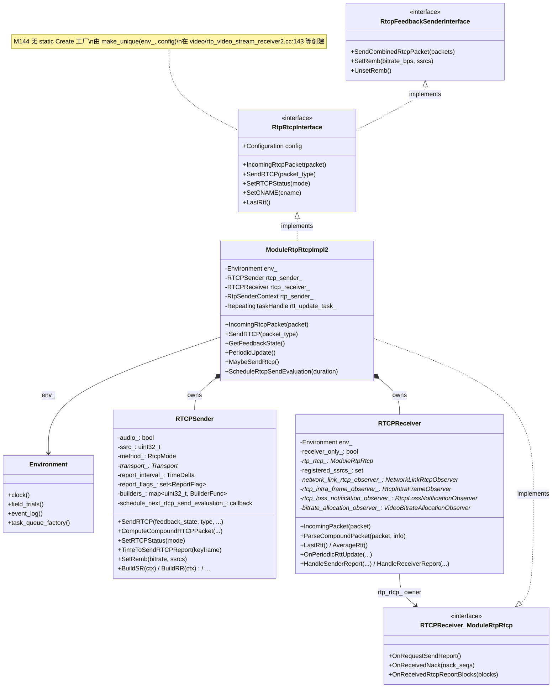

### 2.2 RtcpTransceiver 体系（新实现）

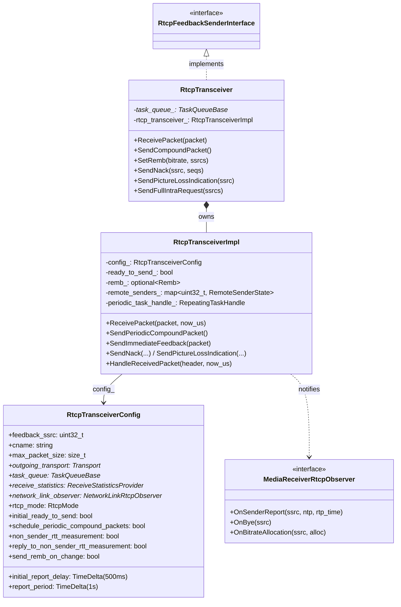

### 2.3 回调接口体系

```mermaid
classDiagram
    class RtcpIntraFrameObserver {
        <<interface>>
        +OnReceivedIntraFrameRequest(ssrc)
    }

    class NetworkLinkRtcpObserver {
        <<interface>>
        +OnTransportFeedback(receive_time, feedback)
        +OnCongestionControlFeedback(receive_time, feedback)
        +OnReceiverEstimatedMaxBitrate(receive_time, bitrate)
        +OnReport(receive_time, report_blocks)
        +OnRttUpdate(receive_time, rtt)
    }

    class TransportFeedbackObserver {
        <<interface>>
        +OnAddPacket(packet_info)
    }

    class RtcpStatisticsCallback {
        <<interface>>
        +StatisticsUpdated(stats, ssrc)
    }

    class RtcpCnameCallback {
        <<interface>>
        +OnCname(ssrc, cname)
    }

    class ReportBlockDataObserver {
        <<interface>>
        +OnReportBlockDataUpdated(data)
    }

    class RtcpPacketTypeCounterObserver {
        <<interface>>
        +RtcpPacketTypesCounterUpdated(ssrc, counter)
    }

    class RtcpRttStats {
        <<interface>>
        +OnRttUpdate(rtt)
        +LastProcessedRtt()
    }

    class RtcpLossNotificationObserver {
        <<interface>>
        +OnReceivedLossNotification(ssrc, ...)
    }

    class NetworkStateEstimateObserver {
        <<interface>>
        +OnRemoteNetworkEstimate(estimate)
    }

    class VideoBitrateAllocationObserver {
        <<interface>>
        +OnBitrateAllocationUpdated(alloc)
    }

    %% 实现类
    class EncoderRtcpFeedback {
        +OnReceivedIntraFrameRequest(ssrc)
        +OnReceivedLossNotification(...)
    }
    class ReceiveStatisticsProxy
    class SendStatisticsProxy
    class CallStats {
        +OnRttUpdate(rtt)
    }

    RtcpIntraFrameObserver <|.. EncoderRtcpFeedback : implements
    RtcpRttStats <|.. CallStats : implements
    RtcpStatisticsCallback <|.. ReceiveStatisticsProxy : implements
    RtcpStatisticsCallback <|.. SendStatisticsProxy : implements
```

### 2.4 RTCP 报文类层次

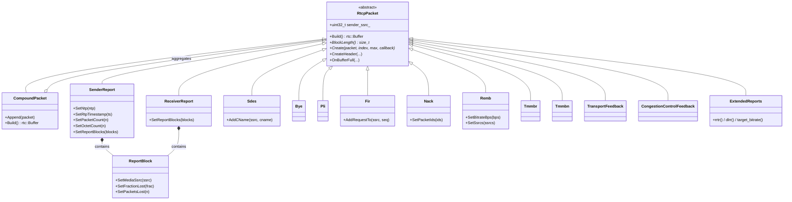

> 报文基类 `rtcp::RtcpPacket` 定义于 `modules/rtp_rtcp/source/rtcp_packet.h:50`（M144 起从 `rtcp_packet/` 子目录上移到 `source/` 下）。M144 新增 RFC 8888 报文 `congestion_control_feedback.{h,cc}`（`CongestionControlFeedback`，由 field trial `WebRTC-RFC8888CongestionControlFeedback` 控制是否启用）。

---

## 3. RTCP 发送流程图

### 3.1 周期性发送（M144：TaskQueue 自调度，不再有 Module::Process 轮询）

> ⚠️ **M144 关键变化**：旧版（M105/M125）靠 `Module::Process()` 被 Worker 线程轮询触发 RTCP；M144 已删除该轮询模型，改为 **RTCPSender 通过回调自调度下一次发送**（`schedule_next_rtcp_send_evaluation`），`ModuleRtpRtcpImpl2` 在 worker TaskQueue 上用 `RepeatingTaskHandle` 只做 RTT 周期更新。

```mermaid
flowchart TD
    A[RTCPSender 构造时<br/>schedule_next_rtcp_send_evaluation 回调<br/>注册到 ModuleRtpRtcpImpl2] --> B[ScheduleRtcpSendEvaluation duration<br/>rtp_rtcp_impl2.cc:802]
    B --> C{下一次 RTCP 到达?}
    C -->|是| D[MaybeSendRtcp<br/>rtp_rtcp_impl2.cc:775<br/>worker TaskQueue 上执行]
    C -->|否| B
    D --> E{RTCPSender::TimeToSendRTCPReport<br/>rtcp_sender.cc:327<br/>now >= next_time_to_send_rtcp_?}
    E -->|是| F[rtcp_sender_.SendRTCP<br/>GetFeedbackState, kRtcpReport<br/>rtp_rtcp_impl2.cc:778]
    E -->|否| B
    F --> G[RTCPSender::SendRTCP<br/>rtcp_sender.cc:563]
    G --> H[RTCPSender::ComputeCompoundRTCPPacket<br/>rtcp_sender.cc:589]
    H --> I[SetFlag packet_types, volatile=true<br/>rtcp_sender.cc:600]
    I --> J[PrepareReport feedback_state<br/>rtcp_sender.cc:703]
    J --> J1{method_ == kOff?<br/>rtcp_sender.cc:594}
    J1 -->|是| J2[拒绝发送]
    J1 -->|否| J3{compound 模式?<br/>rtcp_sender.cc:711}
    J3 -->|是| J4[SetFlag SR 或 RR<br/>根据 sending_]
    J3 -->|reduced-size + report flag| J4
    J3 -->|否| J5[不自动生成报告]
    J4 --> N[SetFlag SDES if SR/RR + cname<br/>rtcp_sender.cc:717]
    N --> O[SetFlag XR 若需要<br/>rtcp_sender.cc:720-725]
    O --> P[计算下一次发送间隔<br/>ComputeTimeUntilNextReport<br/>rtcp_sender.cc:665<br/>RFC3550 带宽自适应 + [0.5,1.5] 随机化]
    P --> P2[SetNextRtcpSendEvaluationDuration<br/>→ 回调 schedule_next_rtcp_send_evaluation<br/>→ 回到 B 安排下次]
    P2 --> Q[遍历 report_flags_<br/>按 type 查 builders_ map<br/>rtcp_sender.cc:625-649]
    Q --> R[调用对应 BuildXXX 函数<br/>this->*func]
    R --> S[BuildSR/BuildRR/BuildSDES<br/>BuildPLI/BuildFIR/BuildNACK<br/>BuildREMB/BuildTMMBR/BuildTMMBN<br/>BuildExtendedReports/BuildBYE]
    S --> T[PacketSender 组装复合包<br/>分片 <= max_packet_size]
    T --> U[Transport::SendRtcp<br/>发送到网络<br/>rtcp_sender.cc:568]
```

> 另外，`ModuleRtpRtcpImpl2` 构造时还会启动 `rtt_update_task_ = RepeatingTaskHandle::DelayedStart(worker_queue_, kRttUpdateInterval=1000ms, ...)`（rtp_rtcp_impl2.cc:126），每 1s 调 `PeriodicUpdate()`（:761）做 RTT 周期计算（见 §4.3）。

### 3.2 事件驱动发送（NACK/PLI/FIR/REMB）

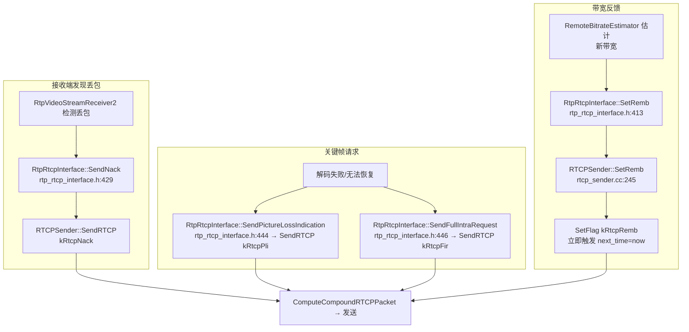

### 3.3 RtcpTransceiver 路径（新实现）

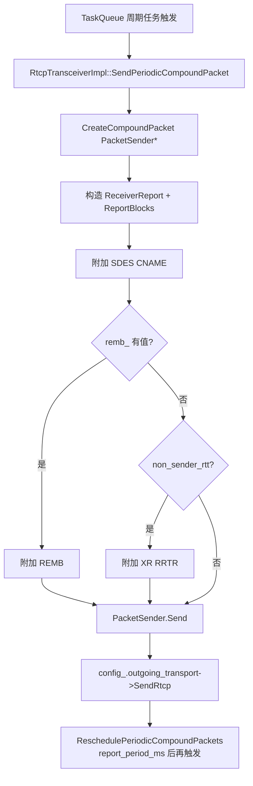

---

## 4. RTCP 接收流程图

### 4.1 从网络到处理的路径（M144：Call 广播，无独立 RtcpDemuxer）

> ⚠️ **M144 关键变化**：旧版有 `call::RtcpDemuxer`（按 SSRC 分发到 sink）；M144 已删除，改为 `Call::DeliverRtcpPacket`（call/call.cc:1401）把 RTCP 包**广播**给所有视频收流/音频收流/视频发流/音频发流，由各流 `DeliverRtcp` 转发给 `ModuleRtpRtcpImpl2::IncomingRtcpPacket`。

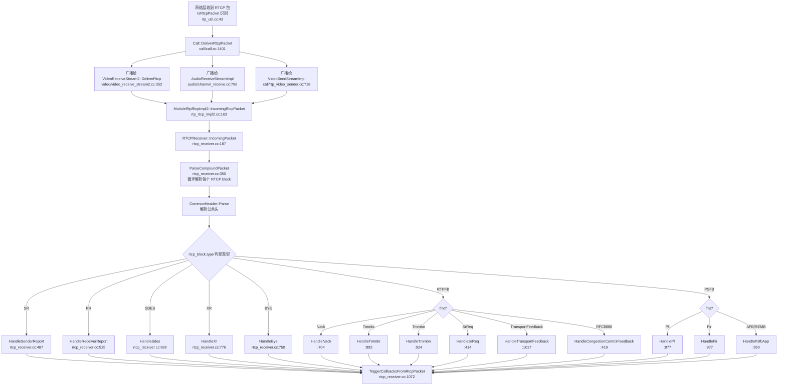

### 4.2 回调分发（TriggerCallbacksFromRtcpPacket）

> ⚠️ **M144 关键变化**：旧的 `RtcpBandwidthObserver`（OnReceivedEstimatedBitrate / OnReceivedRtcpReceiverReport）与接收侧 `TransportFeedbackObserver` 已**合并为 `NetworkLinkRtcpObserver`**（include/rtp_rtcp_defines.h:164），一个接口统管带宽类反馈。

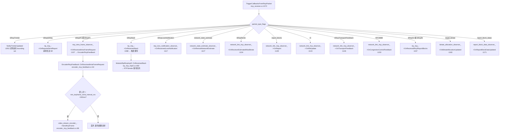

### 4.3 RTT 计算流程

> ⚠️ **M144 关键变化**：RTT 不再由 `Module::Process` 轮询触发，而是由 `RepeatingTaskHandle` 每 `kRttUpdateInterval`（1000ms）调 `PeriodicUpdate()` → `RTCPReceiver::OnPeriodicRttUpdate` 计算。

```mermaid
flowchart LR
    A[收到 RR 报告块<br/>含 last_sr + delay_since_last_sr] --> B[RTCPReceiver::HandleReportBlock<br/>rtcp_receiver.cc:547]
    B --> C[记录 last_received_sr_ntp_ / delay_since_last_sr]
    C --> D[ModuleRtpRtcpImpl2::PeriodicUpdate<br/>rtp_rtcp_impl2.cc:761<br/>RepeatingTask 每 1000ms 触发]
    D --> E[RTCPReceiver::OnPeriodicRttUpdate<br/>rtcp_receiver.cc:272<br/>rtt = arrival - last_sr - delay_since_last_sr]
    E --> F[RTCPReceiver::AverageRtt / LastRtt<br/>rtcp_receiver.cc:232 / :241]
    F --> G{有 RTT?}
    G -->|是| H[rtt_stats_->OnRttUpdate<br/>rtp_rtcp_impl2.cc:769]
    H --> I[CallStats::OnRttUpdate<br/>→ 拥塞控制器]
```

---

## 5. 调用图（含函数/文件位置、初始化参数配置）

### 5.1 模块创建与初始化调用图

```mermaid
flowchart TD
    subgraph 创建阶段
        A["VideoSendStream / VideoReceiveStream2<br/>video/video_send_stream.cc"] --> B["RtpRtcpInterface::Configuration 构造"]
        B --> C["填入各回调指针<br/>intra_frame_callback,<br/>network_link_rtcp_observer,<br/>rtt_stats, ..."]
        C --> D["RtpRtcpInterface::Create env, config<br/>rtp_rtcp_interface.h"]
        D --> E["new ModuleRtpRtcpImpl2 env, config<br/>rtp_rtcp_impl2.cc:79"]
        E --> F1["RTCPSender rtcp_sender_&#123;env, config&#125;<br/>rtp_rtcp_impl2.cc:83"]
        E --> F2["RTCPReceiver rtcp_receiver_&#123;env, config, this&#125;<br/>rtp_rtcp_impl2.cc:102"]
        E --> F3["RtpSenderContext&#123;env, worker_queue, config&#125;<br/>rtp_rtcp_impl2.cc:112"]
    end

    subgraph RTCPSender 构造
        F1 --> G1["audio_ = config.audio<br/>ssrc_ = config.local_media_ssrc<br/>env_ = env<br/>rtcp_sender.cc:127"]
        G1 --> G2["report_interval_ =<br/>config.rtcp_report_interval 或默认<br/>(audio 5s / video 1s)<br/>rtcp_sender.cc:94-98"]
        G2 --> G3["transport_ = config.outgoing_transport<br/>schedule_next_rtcp_send_evaluation 回调"]
        G3 --> G4["注册 builders_ map:<br/>kRtcpSr → BuildSR<br/>kRtcpRr → BuildRR<br/>kRtcpSdes → BuildSDES<br/>... 各类型 → BuildXXX<br/>rtcp_sender.cc:156"]
        G4 --> G5["receive_statistics_ =<br/>config.receive_statistics"]
    end

    subgraph RTCPReceiver 构造
        F2 --> H1["receiver_only_ = config.receiver_only<br/>rtcp_receiver.cc:155"]
        H1 --> H2["registered_ssrcs_ = &#123;media, rtx, flexfec ssrc&#125;"]
        H2 --> H3["network_link_rtcp_observer_ =<br/>config.network_link_rtcp_observer"]
        H3 --> H4["rtcp_intra_frame_observer_ =<br/>config.intra_frame_callback"]
        H4 --> H5["rtcp_loss_notification_observer_ /<br/>network_state_estimate_observer_ /<br/>bitrate_allocation_observer_"]
        H5 --> H6["cname_callback_ / report_block_data_observer_ /<br/>packet_type_counter_observer_"]
    end

    subgraph 配置传递
        I1["MediaConfig.video.rtcp_report_interval_ms<br/>= 1000 ms<br/>media_config.h:75"] --> I2["RtpRtcpInterface::Configuration<br/>.rtcp_report_interval_ms"]
        I3["MediaConfig.audio.rtcp_report_interval_ms<br/>= 5000 ms<br/>media_config.h:84"] --> I2
        I2 --> I4["RTCPSender::report_interval_"]
        I2 --> I5["RTCPReceiver::report_interval_"]
    end

    subgraph RTCP 模式设置
        J1["SDP 协商 rtcpmode<br/>reduced-size / compound"] --> J2["VideoChannel 设置"]
        J2 --> J3["RtpRtcpInterface::SetRTCPStatus mode<br/>rtp_rtcp_interface.h:379"]
        J3 --> J4["RTCPSender::SetRTCPStatus<br/>rtcp_sender.cc:177"]
        J4 --> J5["method_ = new_method<br/>next_time_to_send_rtcp_ =<br/>now + interval/2"]
    end

    %% 添加子图之间的连接
    E --> I2
    I4 --> J4
    I5 --> J4
```

```mermaid
flowchart TD
    subgraph 创建阶段
        A[VideoSendStream / VideoReceiveStream2<br/>video/video_send_stream.cc] --> B[RtpRtcpInterface::Configuration 构造]
        B --> C[填入各回调指针<br/>intra_frame_callback,<br/>network_link_rtcp_observer,<br/>rtt_stats, ...]
        C --> D[RtpRtcpInterface::Create env, config<br/>rtp_rtcp_interface.h]
        D --> E[new ModuleRtpRtcpImpl2 env, config<br/>rtp_rtcp_impl2.cc:79]
        E --> F1[RTCPSender rtcp_sender_{env, config}<br/>rtp_rtcp_impl2.cc:83]
        E --> F2[RTCPReceiver rtcp_receiver_{env, config, this}<br/>rtp_rtcp_impl2.cc:102]
        E --> F3[RtpSenderContext{env, worker_queue, config}<br/>rtp_rtcp_impl2.cc:112]
    end

    subgraph RTCPSender 构造
        F1 --> G1[audio_ = config.audio<br/>ssrc_ = config.local_media_ssrc<br/>env_ = env<br/>rtcp_sender.cc:127]
        G1 --> G2[report_interval_ =<br/>config.rtcp_report_interval 或默认<br/>(audio 5s / video 1s)<br/>rtcp_sender.cc:94-98]
        G2 --> G3[transport_ = config.outgoing_transport<br/>schedule_next_rtcp_send_evaluation 回调]
        G3 --> G4[注册 builders_ map:<br/>kRtcpSr → BuildSR<br/>kRtcpRr → BuildRR<br/>kRtcpSdes → BuildSDES<br/>... 各类型 → BuildXXX<br/>rtcp_sender.cc:156]
        G4 --> G5[receive_statistics_ =<br/>config.receive_statistics]
    end

    subgraph RTCPReceiver 构造
        F2 --> H1[receiver_only_ = config.receiver_only<br/>rtcp_receiver.cc:155]
        H1 --> H2[registered_ssrcs_ = {media, rtx, flexfec ssrc}]
        H2 --> H3[network_link_rtcp_observer_ =<br/>config.network_link_rtcp_observer]
        H3 --> H4[rtcp_intra_frame_observer_ =<br/>config.intra_frame_callback]
        H4 --> H5[rtcp_loss_notification_observer_ /<br/>network_state_estimate_observer_ /<br/>bitrate_allocation_observer_]
        H5 --> H6[cname_callback_ / report_block_data_observer_ /<br/>packet_type_counter_observer_]
    end

    subgraph 配置传递
        I1[MediaConfig.video.rtcp_report_interval_ms<br/>= 1000 ms<br/>media_config.h:75] --> I2[RtpRtcpInterface::Configuration<br/>.rtcp_report_interval_ms]
        I3[MediaConfig.audio.rtcp_report_interval_ms<br/>= 5000 ms<br/>media_config.h:84] --> I2
        I2 --> I4[RTCPSender::report_interval_]
        I2 --> I5[RTCPReceiver::report_interval_]
    end

    subgraph RTCP 模式设置
        J1[SDP 协商 rtcpmode<br/>reduced-size / compound] --> J2[VideoChannel 设置]
        J2 --> J3[RtpRtcpInterface::SetRTCPStatus mode<br/>rtp_rtcp_interface.h:379]
        J3 --> J4[RTCPSender::SetRTCPStatus<br/>rtcp_sender.cc:177]
        J4 --> J5[method_ = new_method<br/>next_time_to_send_rtcp_ =<br/>now + interval/2]
    end
```

### 5.2 发送端完整调用链

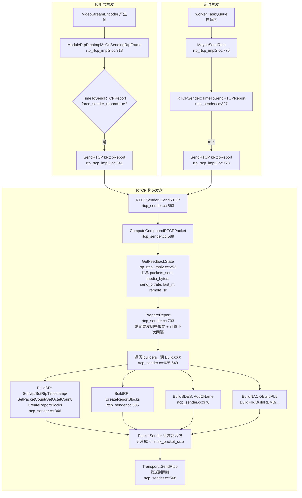

### 5.3 接收端完整调用链

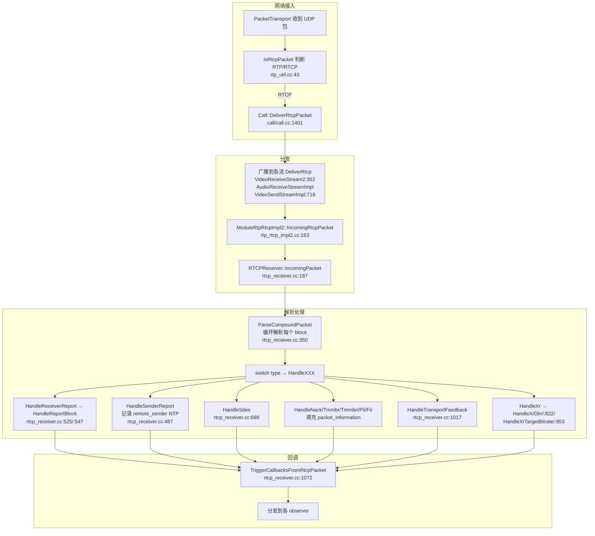

### 5.4 关键反馈调用链

#### PLI/FIR → 关键帧

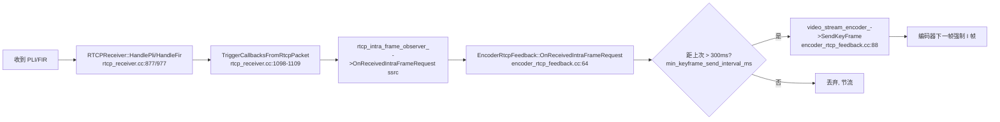

#### NACK → 重传


#### REMB/TMMBR → 带宽调整

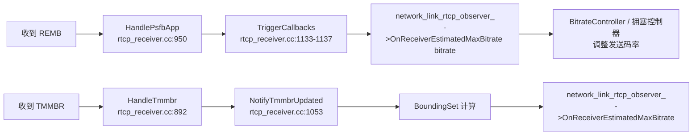

#### TransportFeedback → 发送侧拥塞控制


---

## 6. 初始化参数配置清单

### 6.1 RtpRtcpInterface::Configuration（核心配置）

> 文件：`modules/rtp_rtcp/source/rtp_rtcp_interface.h:52-140`
> ⚠️ **M144 变化**：`clock`/`event_log`/`field_trials` 不再作为配置字段，而是通过 `Environment`（构造参数 `env`）注入（`env_.clock()`、`env_.event_log()`、`env_.field_trials()`）；`RtcpBandwidthObserver` 与接收侧 `TransportFeedbackObserver` 合并为 `network_link_rtcp_observer`。

| 字段 | 类型 | 默认值 | 含义 | 传入 RTCP 用途 |
|------|------|--------|------|----------------|
| `audio` | `bool` | `false` | 音频/视频模块 | `RTCPSender::audio_`，影响间隔/时钟率 |
| `receiver_only` | `bool` | `false` | 仅接收 | `RTCPReceiver::receiver_only_`，禁用发送回调 |
| `receive_statistics` | `ReceiveStatisticsProvider*` | `nullptr` | 接收统计 | `RTCPSender` 用于生成 Report Blocks |
| `outgoing_transport` | `Transport*` | `nullptr` | 发送出口 | `RTCPSender::transport_`，发送 RTCP 包 |
| `intra_frame_callback` | `RtcpIntraFrameObserver*` | `nullptr` | 关键帧回调 | `RTCPReceiver::rtcp_intra_frame_observer_` |
| `rtcp_loss_notification_observer` | `RtcpLossNotificationObserver*` | `nullptr` | 丢包通知 | `RTCPReceiver::rtcp_loss_notification_observer_` |
| `network_link_rtcp_observer` | `NetworkLinkRtcpObserver*` | `nullptr` | 链路/带宽反馈（合并 REMB/RR/RTT/TCC/RFC8888） | `RTCPReceiver::network_link_rtcp_observer_` |
| `network_state_estimate_observer` | `NetworkStateEstimateObserver*` | `nullptr` | 网络状态估计 | `RTCPReceiver::network_state_estimate_observer_` |
| `bitrate_allocation_observer` | `VideoBitrateAllocationObserver*` | `nullptr` | 码率分配 | `RTCPReceiver::bitrate_allocation_observer_` |
| `rtt_stats` | `RtcpRttStats*` | `nullptr` | RTT 统计 | `ModuleRtpRtcpImpl2::rtt_stats_` |
| `rtcp_packet_type_counter_observer` | `RtcpPacketTypeCounterObserver*` | `nullptr` | 报文计数 | sender/receiver 共用 |
| `rtcp_cname_callback` | `RtcpCnameCallback*` | `nullptr` | CNAME 回调 | `RTCPReceiver::cname_callback_` |
| `report_block_data_observer` | `ReportBlockDataObserver*` | `nullptr` | 报告块数据 | `RTCPReceiver::report_block_data_observer_` |
| `paced_sender` | `RtpPacketSender*` | `nullptr` | Paced 发送 | RTP 侧，非 RTCP |
| `rtcp_report_interval_ms` | `int` | `0`(用默认) | RTCP 报告间隔 | `RTCPSender::report_interval_` / `RTCPReceiver::report_interval_` |
| `local_media_ssrc` | `uint32_t` | `0` | 本地媒体 SSRC | `RTCPSender::ssrc_` / `RTCPReceiver::registered_ssrcs_` |
| `rtx_send_ssrc` | `optional<uint32_t>` | nullopt | RTX SSRC | `RTCPReceiver::registered_ssrcs_` |
| `non_sender_rtt_measurement` | `bool` | `false` | 非发送方 RTT（RFC 3611） | `RTCPReceiver::xr_rrtr_status_` |

> `Environment`（`api/environment.h`）聚合了 `clock()`、`task_queue_factory()`、`field_trials()`、`event_log()` 等全局依赖，M144 起 RTP/RTCP 模块统一用它注入，替代旧版散落的 `clock_`/`event_log_`/`field_trials_` 成员。

### 6.2 RtcpTransceiverConfig（新实现配置）

> 文件：`modules/rtp_rtcp/source/rtcp_transceiver_config.h:107-171`
> ⚠️ **M144 变化**：`rtt_observer` 改为 `network_link_observer`；`initial_report_delay_ms`/`report_period_ms` 由 `int` 改为 `TimeDelta`；新增 `reply_to_non_sender_rtt_measurement` 等字段。

| 字段 | 类型 | 默认值 | 含义 |
|------|------|--------|------|
| `feedback_ssrc` | `uint32_t` | `1` | 本端发送 SSRC（用于 feedback） |
| `cname` | `string` | `""` | CNAME 标识 |
| `max_packet_size` | `size_t` | `1200` | 最大包长 |
| `outgoing_transport` | `Transport*` | `nullptr` | 发送出口 |
| `task_queue` | `TaskQueueBase*` | `nullptr` | 任务队列（定时调度） |
| `receive_statistics` | `ReceiveStatisticsProvider*` | `nullptr` | 接收统计源 |
| `network_link_observer` | `NetworkLinkRtcpObserver*` | `nullptr` | 链路/带宽反馈回调（在 task_queue 上调用） |
| `rtcp_mode` | `RtcpMode` | `kCompound` | RTCP 模式 |
| `initial_ready_to_send` | `bool` | `true` | 初始可发送状态 |
| `initial_report_delay` | `TimeDelta` | `500ms` | 首次报告延迟 |
| `report_period` | `TimeDelta` | `1s` | 周期报告间隔 |
| `schedule_periodic_compound_packets` | `bool` | `true` | 是否调度周期包 |
| `non_sender_rtt_measurement` | `bool` | `false` | 非发送方 RTT 测量（RFC 3611） |
| `reply_to_non_sender_rtt_measurement` | `bool` | `true` | 是否回 DLRR |
| `reply_to_non_sender_rtt_mesaurments_on_all_ssrcs` | `bool` | `true` | 是否对所有 SSRC 回 DLRR |
| `send_remb_on_change` | `bool` | `false` | REMB 变化时立即发送 |

### 6.3 MediaConfig 中的 RTCP 配置

> 文件：`media/base/media_config.h`

| 字段 | 默认值 | 含义 |
|------|--------|------|
| `MediaConfig::Video::rtcp_report_interval_ms` | `1000` ms（media_config.h:75） | 视频 RTCP 报告间隔 |
| `MediaConfig::Audio::rtcp_report_interval_ms` | `5000` ms（media_config.h:84） | 音频 RTCP 报告间隔 |

> 这两个值最终流入 `RtpRtcpInterface::Configuration::rtcp_report_interval_ms`，再传给 `RTCPSender::report_interval_` / `RTCPReceiver::report_interval_`（M144 中为 `TimeDelta`，默认 audio 5s / video 1s，见 rtp_rtcp_impl2.cc:94-98）。

### 6.4 RtcpMode 枚举

> 文件：`api/rtp_headers.h:199`（M144 起从 `rtp_rtcp_defines.h` 上移到 `api/`）

| 值 | 含义 | 发送行为 |
|----|------|----------|
| `kOff` | 关闭 RTCP | 不发送任何 RTCP |
| `kReducedSize` | 精简模式（RFC 5506） | 仅发送指定的反馈报文，不需要 SR/RR 头 |
| `kCompound` | 复合模式（RFC 4585 §3.1） | 必须以 SR/RR 开头 + SDES(CNAME)，可附加其他 |

---

## 7. 控制结构框图

### 7.1 整体控制结构

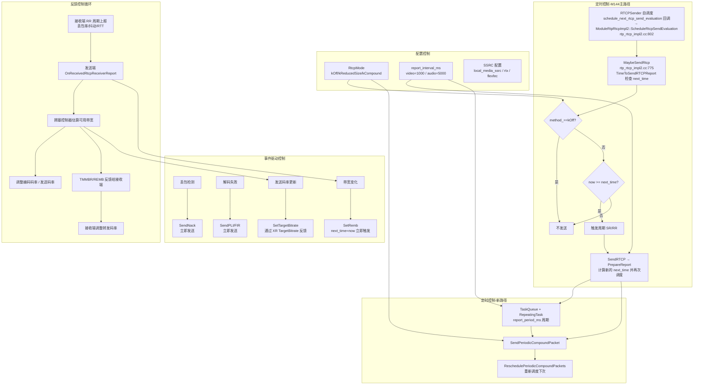

### 7.2 RTCP 发送间隔计算逻辑

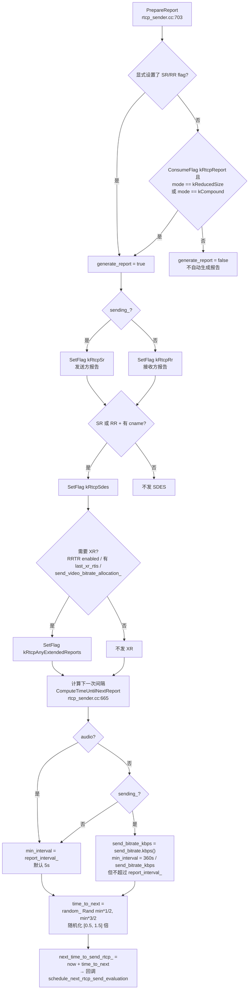

### 7.3 反馈控制闭环

```mermaid
flowchart LR
    subgraph 接收端
        R1[RTP 收包统计<br/>ReceiveStatistics] --> R2[RR 周期上报<br/>fraction_lost / jitter /<br/>cumulative_lost / seq]
        R1 --> R3[丢包检测 → NACK]
        R1 --> R4[解码失败 → PLI/FIR]
        R5[RemoteBitrateEstimator<br/>→ REMB]
    end

    subgraph 网络
        N[(RTCP 反馈通道)]
    end

    subgraph 发送端
        S1[收到 RR → RTT 计算<br/>arrival - last_sr - delay]
        S1 --> S2[拥塞控制器<br/>GCC / SendSideBWE]
        S2 --> S3[码率调整<br/>编码器 + RtpSender]
        S4[收到 NACK → 重传<br/>RTX]
        S5[收到 PLI/FIR → 关键帧]
        S6[收到 REMB/TMMBR<br/>→ 码率限制]
        S7[收到 TransportFeedback<br/>→ 发送侧 BWE]
    end

    R2 --> N --> S1
    R3 --> N --> S4
    R4 --> N --> S5
    R5 --> N --> S6
    R1 -.->|Transport-CC| N --> S7
    S3 -.->|调整发送| R1
```

### 7.4 线程模型

```mermaid
flowchart TB
    subgraph Worker TaskQueue
        W1["ModuleRtpRtcpImpl2<br/>worker_queue_ 上运行<br/>RepeatingTaskHandle → PeriodicUpdate (RTT)<br/>rtp_rtcp_impl2.cc:126/761"]
        W2["RTCPSender 构造 RTCP 包<br/>互斥锁保护<br/>自调度下次发送"]
        W3["Transport::SendRtcp<br/>发出"]
    end

    subgraph Network 线程
        N1["收到 UDP 包"] --> N2["Call::DeliverRtcpPacket 广播<br/>call/call.cc:1401"] --> N3["IncomingRtcpPacket"]
        N3 --> N4["RTCPReceiver::ParseCompoundPacket<br/>MutexLock rtcp_receiver_lock_"] --> N5["TriggerCallbacks"]
    end

    subgraph TaskQueue-新实现
        TQ1["RtcpTransceiverImpl<br/>所有操作在 task_queue 上"]
        TQ2["RepeatingTask 周期触发<br/>SendPeriodicCompoundPacket"]
        TQ3["HandleReceivedPacket 解析"]
    end

    subgraph 编码线程
        E1["VideoStreamEncoder::SendKeyFrame<br/>响应 PLI/FIR"]
    end

    W1 --> W2 --> W3
    N5 -.->|"回调"| E1
    N5 -.->|"回调 拥塞控制"| W1

    %% 添加子图之间的连接关系
    W3 --> N1
    N4 --> TQ3
    TQ2 --> W2
    TQ1 --> TQ2
```

---

## 8. 关键调用链汇总

### 8.1 收包完整链路（文件:行号）

```
网络层 UDP 包
  └─ IsRtcpPacket 识别                             modules/rtp_rtcp/source/rtp_util.cc:43
  └─ Call::DeliverRtcpPacket                       call/call.cc:1401
     └─ VideoReceiveStream2::DeliverRtcp           video/video_receive_stream2.cc:352
        └─ RtpVideoStreamReceiver2::DeliverRtcp    video/rtp_video_stream_receiver2.cc:1280
           └─ ModuleRtpRtcpImpl2::IncomingRtcpPacket  modules/rtp_rtcp/source/rtp_rtcp_impl2.cc:163
              └─ RTCPReceiver::IncomingPacket      modules/rtp_rtcp/source/rtcp_receiver.cc:187
                 └─ ParseCompoundPacket             rtcp_receiver.cc:350
                    └─ CommonHeader::Parse          source/rtcp_packet/common_header.cc
                    └─ HandleXXX (按 type 分派)      rtcp_receiver.cc:376-450
                    └─ TriggerCallbacksFromRtcpPacket  rtcp_receiver.cc:1072
                       └─ rtcp_intra_frame_observer_->OnReceivedIntraFrameRequest
                       └─ network_link_rtcp_observer_->OnReport / OnRttUpdate / OnTransportFeedback
                       └─ report_block_data_observer_->OnReportBlockDataUpdated
```

### 8.2 发包完整链路（周期）

```
ModuleRtpRtcpImpl2::ScheduleRtcpSendEvaluation       rtp_rtcp_impl2.cc:802
  └─ (TaskQueue 上按 rtcp_report_interval 触发)
  └─ ModuleRtpRtcpImpl2::MaybeSendRtcp                rtp_rtcp_impl2.cc:775
     └─ rtcp_sender_.TimeToSendRTCPReport()           rtcp_sender.cc:327
        (now >= next_time_to_send_rtcp_ → 返回 true)
     └─ rtcp_sender_.SendRTCP(GetFeedbackState, kRtcpReport)  rtp_rtcp_impl2.cc:787
        └─ RTCPSender::SendRTCP                        rtcp_sender.cc:563
           └─ ComputeCompoundRTCPPacket                rtcp_sender.cc:589
              └─ SetFlags(packet_types, volatile)      rtcp_sender.cc:636
              └─ PrepareReport(feedback_state)         rtcp_sender.cc:703
                 └─ SetFlag(kRtcpSr/kRtcpRr)           rtcp_sender.cc:712
                 └─ SetFlag(kRtcpSdes)                 rtcp_sender.cc:716
                 └─ 计算 next_time_to_send_rtcp_       rtcp_sender.cc:665 (ComputeTimeUntilNextReport)
              └─ 遍历 report_flags_ → builders_[type] rtcp_sender.cc:156-158
                 └─ BuildSR/BuildRR/BuildSDES/...     rtcp_sender.cc:346/385/376
                    └─ CreateReportBlocks             rtcp_sender.cc:736
                       └─ receive_statistics_->GetStatistics
           └─ PacketContainer::SendPackets             rtcp_sender.cc:579
              └─ Transport::SendRtcp                   (网络发送)
```

### 8.3 PLI → 关键帧完整链路

```
RTCPReceiver::HandlePli                           rtcp_receiver.cc:877
  └─ TriggerCallbacksFromRtcpPacket               rtcp_receiver.cc:1072
     └─ rtcp_intra_frame_observer_->OnReceivedIntraFrameRequest(ssrc)
        └─ EncoderRtcpFeedback::OnReceivedIntraFrameRequest  video/encoder_rtcp_feedback.cc:64
           └─ (节流: kMinKeyframeSendIntervalMs=300ms)       encoder_rtcp_feedback.cc:37
           └─ video_stream_encoder_->SendKeyFrame()          encoder_rtcp_feedback.cc:88
              └─ 编码器下一帧强制关键帧
```

### 8.4 RTT 计算完整链路

```
RTCPReceiver::HandleReportBlock                   rtcp_receiver.cc:547
  └─ 记录 last_received_sr_ntp_, delay_since_last_sr
ModuleRtpRtcpImpl2::PeriodicUpdate                 rtp_rtcp_impl2.cc:761
  └─ (RepeatingTaskHandle::DelayedStart, kRttUpdateInterval=1000ms)  rtp_rtcp_impl2.cc:126
  └─ rtcp_receiver_.OnPeriodicRttUpdate(...)       rtcp_receiver.cc:272
     └─ RTCPReceiver::RTT 计算                        rtcp_receiver.cc:204
        └─ rtt = arrival_time - last_sr - delay_since_last_sr
  └─ rtt_stats_->OnRttUpdate(max_rtt)              rtp_rtcp_impl2.cc:773
     └─ CallStats::OnRttUpdate                     video/call_stats2.cc
        └─ 拥塞控制器使用 RTT
```

---

## 附录：关键常量

| 常量 | 值 | 位置 | 含义 |
|------|----|------|------|
| `RTCP_CNAME_SIZE` | 256 | rtp_rtcp_defines.h:35 | CNAME 最大长度 |
| `IP_PACKET_SIZE` | 1500 | rtp_rtcp_defines.h:36 | 假设的以太网包大小 |
| `kVideoPayloadTypeFrequency` | 90000 | rtp_rtcp_defines.h:47 | 视频 RTP 时钟频率 |
| `kBogusRtpRateForAudioRtcp` | 8000 | rtp_rtcp_defines.h:51 | 音频 RTCP 默认时钟率 |
| `RTCP_SEND_BEFORE_KEY_FRAME_MS` | 100 | rtcp_sender.cc | 关键帧前提前发送 RTCP 的余量 |
| `kMinKeyframeSendIntervalMs` | 300 | encoder_rtcp_feedback.cc:37 | 关键帧请求最小间隔（节流） |
| `video.rtcp_report_interval_ms` | 1000 | media_config.h:75 | 视频 RTCP 报告间隔 |
| `audio.rtcp_report_interval_ms` | 5000 | media_config.h:84 | 音频 RTCP 报告间隔 |

---

## 9. 问答：新旧 RTCP 引擎的区别

### Q：WebRTC 中同时存在两套 RTCP 引擎（传统 `ModuleRtpRtcpImpl2` 与新 `RtcpTransceiver`），它们有何区别？

#### 9.1 设计定位不同

| 维度 | 传统引擎 | 新引擎（RtcpTransceiver） |
|------|----------|--------------------------|
| **粒度** | 每路 RTP 流一个模块（`ModuleRtpRtcpImpl2`），各流独立处理 RTCP | 一个 transport 一个收发器，服务 **BUNDLED 多流共享** |
| **耦合** | 与 RTP 发送器深度耦合（`rtp_rtcp_impl2.cc:60-74` 同时构造 RTP 和 RTCP） | 独立于 `RtpRtcp`，纯 RTCP 处理（`rtcp_transceiver_impl.h:32` 注释明确说明） |
| **成熟度** | 主路径，全功能 | 辅助/演进路径，功能子集（代码中的 TODO 可见，如 `bugs.webrtc.org/8239`） |

#### 9.2 驱动模型不同（最本质的区别）

**传统引擎 —— 任务队列自调度（M144 起不再有 Module::Process 轮询）**

```
ModuleRtpRtcpImpl2 构造时（rtp_rtcp_impl2.cc:79）：
  RepeatingTaskHandle::DelayedStart(worker_queue_, kRttUpdateInterval=1000ms,
                                    [this]{ return PeriodicUpdate(); })
      └─ PeriodicUpdate()（rtp_rtcp_impl2.cc:761）：RTT 计算、RR 超时检测
  另设 schedule_next_rtcp_send_evaluation 回调（rtp_rtcp_impl2.cc:802）：
      └─ 到点触发 MaybeSendRtcp()（rtp_rtcp_impl2.cc:775）
         └─ TimeToSendRTCPReport() 检查 next_time_to_send_rtcp_
```

时间状态仍分散在多个字段（`next_time_to_send_rtcp_`、`last_rtt_process_time_`、`last_bitrate_process_time_`），但由 **TaskQueue 自调度**驱动，不再依赖外部 `Module::Process()` 轮询。

**新引擎 —— 调度式（TaskQueue + RepeatingTask）**

```
RtcpTransceiverImpl 构造时（rtcp_transceiver_impl.cc:94-98）：
  task_queue->PostTask → SchedulePeriodicCompoundPackets(initial_report_delay_ms)
      → RepeatingTask 每 report_period_ms 触发 SendPeriodicCompoundPacket
```

自己持有定时器句柄（`periodic_task_handle_`），`SetReadyToSend(false)` 直接 `Stop()` 停止调度，恢复时以 `report_period_ms / 2` 重启（`rtcp_transceiver_impl.cc:124-133`）。不依赖外部轮询。

> M144 演进要点：**两套引擎都已迁移到 TaskQueue 自调度**。旧版 `ModuleRtpRtcpImpl::Process()` 轮询在 M144 已删除，`ModuleRtpRtcpImpl2` 用 `RepeatingTaskHandle`（RTT 周期）+ `schedule_next_rtcp_send_evaluation` 回调（RTCP 报告周期）替代。

#### 9.3 线程模型不同

| | 传统 | 新 |
|---|------|-----|
| 线程安全 | 由外层 `ModuleRtpRtcpImpl2` 保证所有方法在 `worker_queue_`（TaskQueue）上执行；内部 `rtcp_sender_`/`rtcp_receiver_` 仍保留 `RTC_GUARDED_BY` 注解（`rtcp_sender.h:196`、`rtcp_receiver.h:226`） | **类本身非线程安全**（`rtcp_transceiver_impl.h:34`），由外层 `RtcpTransceiver` 保证所有操作投递到同一个 `task_queue_` 执行 |
| 锁开销 | 收发包在 TaskQueue 上串行，临界区开销低 | 单线程串行，无锁 |

#### 9.4 功能范围不同

**传统引擎是全功能的**（`rtcp_sender.cc` 的 builders_ 表 + `rtcp_receiver.cc:376-450` 的 switch）：

- 完整 SR/RR/SDES/BYE/NACK/PLI/FIR/REMB/TMMBR/TMMBN/XR(RRTR/DLRR/TargetBitrate)/TransportFeedback/LossNotification
- 带完整的带宽反馈闭环（`NetworkLinkRtcpObserver`）、报告块统计、RR 超时检测（`RtcpRrTimeout`）、RFC 3550 带宽自适应间隔计算

**新引擎是子集**：

- 发送侧只处理：RR + ReportBlocks、SDES、REMB、XR(RRTR/DLRR)、NACK/PLI/FIR（`rtcp_transceiver_impl.cc:149-227`）
- 接收侧解析：**BYE、SR、RR、XR、PSFB、RTPFB**（`HandleReceivedPacket`，`rtcp_transceiver_impl.cc:307` 的 switch），然后通知 `MediaReceiverRtcpObserver` 回调
- 不做拥塞控制反馈、不做统计上报、不支持 TMMBR/TMMBN/SR-REQ

#### 9.5 发送行为细节差异

| 行为 | 传统 RTCPSender | 新 RtcpTransceiverImpl |
|------|----------------|------------------------|
| compound 模式约束 | 强制检查：无媒体时 compound 模式禁止发任何包（`ComputeCompoundRTCPPacket`） | `CreateCompoundPacket` 组包后 `SendImmediateFeedback` 可绕过模式约束发反馈 |
| 发送间隔 | RFC 3550 带宽自适应 + [0.5,1.5] 随机抖动（`ComputeTimeUntilNextReport`，`rtcp_sender.cc:665`） | 固定 `report_period_ms`（默认 1000ms），首包延迟 500ms，不做随机化 |
| REMB 立即发送 | `SetRemb` 时置 `next_time_to_send_rtcp_ = now` 等下次报告捎带（`rtcp_sender.cc:245`） | 可配置 `send_remb_on_change=true` 时立即单独发出（`rtcp_transceiver_impl.cc:160-174`） |
| BYE 处理 | `BuildBYE` 且强制追加在复合包末尾 | 只接收处理 BYE，发送侧无 |
| 非发送方 RTT | 通过 XR RRTR/DLRR 交换 + `GetAndResetXrRrRtt` | `non_sender_rtt_measurement` 配置开关，DLRR 解析后直接 `rtt_observer->OnRttUpdate`（`rtcp_transceiver_impl.cc:291-305`） |

#### 9.6 直观对比图

```mermaid
flowchart LR
    subgraph 传统引擎-每流一个全功能
        direction TB
        A["ModuleRtpRtcpImpl2"] --> A1["RTCPSender<br/>14种报文builder<br/>TaskQueue自调度<br/>带宽自适应间隔"]
        A --> A2["RTCPReceiver<br/>全类型解析<br/>10+回调接口<br/>反馈闭环完整"]
    end

    subgraph 新引擎-每transport一个精简
        direction TB
        B["RtcpTransceiver<br/>线程安全包装"] --> B1["RtcpTransceiverImpl<br/>无锁单TaskQueue<br/>固定周期"]
        B1 --> B2["收: BYE/SR/RR/XR/PSFB/RTPFB<br/>发: RR/SDES/REMB/XR/NACK/PLI/FIR"]
    end

    %% 添加子图之间的连接关系
    A --> B
    A1 --> B1
    A2 --> B2

```

#### 9.7 总结

**传统引擎**是"大而全的每流引擎"：与 RTP 深度绑定、全报文类型、完整拥塞反馈闭环，靠 TaskQueue 自调度驱动，RFC 3550 语义最完整。
**新引擎**是"小而精的每传输通道引擎"：面向 BUNDLE 场景让多流共享一个 RTCP 通道，单 TaskQueue 无锁、定时自管理、只保留接收端上报（RR/REMB/PLI/FIR/NACK）所需的最小功能集。这是 WebRTC 把 RTCP 从"流的附属"重构为"传输层独立组件"的演进方向（代码中多处 TODO 标注 `bugs.webrtc.org/8239` 即此迁移计划）。M144 中两套引擎都已统一到 TaskQueue 自调度模型，区别主要在功能范围与每流/每通道粒度。

---

## 10. 补充问答：LiveKit 与 WebRTC 的关系

### 10.1 LiveKit 2.0 用的是哪个 WebRTC？

**双栈架构**：

| 端 | WebRTC 实现 | RTCP 引擎 |
|---|---|---|
| **服务端（SFU）** | Go / Pion fork（`livekit/webrtc`） | Pion 的 `rtcp` 包，自己一套，无新老引擎之分 |
| **Android/iOS 客户端 SDK** | **libwebrtc C++ M144**（`livekit/client-sdk-android` 打包的静态库，`android-prefixed:144.7559.09`） | **libwebrtc M144 引擎**（`RTCPSender`/`RTCPReceiver`/`ModuleRtpRtcpImpl2` 体系） |

本文档前面分析的 `modules/rtp_rtcp/` 就是 LiveKit Android 客户端 App 里实际运行的 RTCP 代码——客户端 SDK 只封装了 `PeerConnection` API（信令、Track 管理、自适应订阅），RTCP 层没有重写也没有绕过。

### 10.2 本地源码树版本核对结果

对 `F:\codes\avm\lkt\client-sdk-android-main` 与多份 C++ 源码树的实测：

| 源码树 | 版本证据 | 对应版本 | 与 LiveKit 依赖距离 |
|---|---|---|---|
| `adrtc/webrtc/webRTC` | 文件时间戳 2022-09-25；无 `api/environment` | **≈ M105** | 差 ~40 里程碑 |
| `adrtc/webrtc/webrtc_vs2022_based_windows_10/rtc/rtcsource/src` | git HEAD `181dbebb` 2024-04-15（"Roll chromium_revision 1287476:1287666"）；有 `api/environment` 雏形 | **≈ M124~M126** | 差 ~19 里程碑 |
| **`adrtc/webrtc/webrtc-m144_release`** | 本文档逐行核对的 **M144 源码树**（含 `modules/rtp_rtcp/source/rtp_rtcp_impl2.cc`、`api/environment`、`call/call.cc:1401` 等 M144 特征） | **M144（2025）** | **与 LiveKit 一致** ✅ |
| **LiveKit Android 实际依赖** | `gradle/libs.versions.toml` → `io.github.webrtc-sdk:android-prefixed:144.7559.09` | **M144（2025）** webrtc-sdk 预编译包 | — |

- **`webrtc-m144_release` 树即 LiveKit 所用版本**，本文档 §2-§9 的所有文件/类/行号均已按该树逐行核对。
- vs2022 树（M125）是**裁剪版**——无顶级 `video/` 目录（无 `video_send_stream_impl.cc`、`video_receive_stream2.cc` 等内部实现），媒体实现只保留到 `call/` 层接口 + `call/rtp_video_sender.cc`；M144 树完整。

### 10.3 用的是新引擎还是老引擎？

**媒体反馈主路径 = 老引擎的现代化版本**。血统没变（类名、职责、调用链骨架 12 年未变），内部实现大改：

| 手术 | M105（老树） | M144（webrtc-m144_release） |
|---|---|---|
| **锁模型**（M120 前后） | `rtc::CriticalSection` + `RTC_GUARDED_BY` 手工临界区 | **全部删除**，改单线程拥有模型 + `SequenceChecker`（M144 `rtcp_sender.h`/`rtcp_receiver.h` 的 CriticalSection 计数 = 0，`rtcp_receiver.h` 有 `CustomSequenceChecker packet_sequence_checker_`） |
| **驱动模型** | 外部 `Module::Process()` 轮询 | **删除轮询**，改 TaskQueue 自调度（`ModuleRtpRtcpImpl2` 用 `RepeatingTaskHandle` RTT + `schedule_next_rtcp_send_evaluation` 报告回调） |
| **接收路径** | 解析+回调同一调用完成 | 解析与回调分发拆开，回调改在 stream 线程触发 |
| **接口解耦** | `RTCPSender` 直接持有 `RtpRtcp::Configuration` | 独立 `RTCPSender::Configuration` struct（`rtcp_sender.h`，含 `FromRtpRtcpConfiguration` 转换器） |
| **模块演进** | 仅 `rtp_rtcp_impl` | `rtp_rtcp_impl2` 正式替换 `rtp_rtcp_impl`（M144 已无 `rtp_rtcp_impl.cc`），类名 `ModuleRtpRtcpImpl2` |
| **参数注入** | 分散持有 `clock_`/`event_log_`/`field_trials_` 成员 | 统一 `Environment` 注入（`env_.clock()`/`env_.field_trials()`/`env_.event_log()`） |
| **带宽观察** | `RtcpBandwidthObserver` + `TransportFeedbackObserver`（收/发分离） | 合并为 `NetworkLinkRtcpObserver`（`rtp_rtcp_defines.h:164`） |
| **收包路由** | `RtcpDemuxer` 按 SSRC 分发 | 删除 `RtcpDemuxer`，改 `Call::DeliverRtcpPacket` 广播（`call/call.cc:1401`） |

**一句话**：类结构和协议行为同 M105（分析文档 §2-8 直接可用），无锁单线程化、接收路径重排、接口解耦、TaskQueue 自调度是 M105→M144 间的主要变化。TCC+GCC 拥塞控制从 M96 起就是默认，谈不上"新"。

### 10.4 M105→M144 三块领域差异判定

| 领域 | M144 树实证 | M105→M144 变化 | 结论 |
|---|---|---|---|
| **RTCP** | `RTCPSender`/`RTCPReceiver` 结构与老树一致（builder 注册表、`TriggerCallbacksFromRtcpPacket`、`HandleTransportFeedback` 全在）；锁全删改 SequenceChecker；`rtp_rtcp_impl2` 正式替换 `rtp_rtcp_impl` | `rtp_rtcp_impl2` 替换老 impl、Environment 传参铺开、TaskQueue 自调度，**协议行为零变化** | 结构性现代化，语义不变 ✅ 差异不大 |
| **QoS/GCC** | `goog_cc` 目录与老树基本同名（`delay_based_bwe`、`alr_detector`、`acknowledged_bitrate_estimator`）；新增 `remb_throttler`、`pcc`（实验） | RFC 8888（per-packet feedback）M132+ 成为 TCC 替代选项（M144 有 `WebRTC-RFC8888CongestionControlFeedback` field trial）；GCC 估计算法（trendline/AIMD）未动 | 算法核心不变 ✅ 差异不大 |
| **Connection/ICE** | `p2p_transport_channel`、`JsepTransportController` 结构不变；`IceControllerInterface` 已抽接口 | ICE controller 逻辑小重构，DTLS/SRTP 流程不变 | 几乎不变 ✅ 差异最小 |

**结论：用 M144 树（`webrtc-m144_release`）理解 LiveKit Android M144 的行为，三块完全够用**；本文档已按该树逐行核对。

---

## 11. LiveKit-Android × WebRTC 全生命周期分层总览图

> ASCII 版。阶段为横轴（①→⑤），层级为纵轴（L1→L8）。可渲染 Mermaid 版本见 §11.1。

```
时间轴（阶段）→    ①初始化        ②信令连接      ③SDP协商/ICE     ④媒体流传输+QoS闭环        ⑤断链/重连
══════════════════════════════════════════════════════════════════════════════════════════════════════
L1  LiveKit SDK
    (Kotlin)      Room.connect()  心跳/Participant  JSEP透传        publish/subscribe、        Room.disconnect()
                  RTCManager      JOIN/LEAVE        (offer/answer   Track统计、适应性          PeerConnection.
                  封装PeerConn    事件下发          不懂内容,        订阅、getStats上报         close()
                  eFactory        (ws-jsonrpc)      只搬运)
────────────────────────────────────────────────────────────────────────────────────────────────────
L2  libwebrtc
    对外API       PeerConnection  ─                createOffer/    sendRTP/收RTCP回调、        close→析构
    (org.webrtc   .Factory()                        setLocal/      RTCPeerConnectionState      ICE restart
    java绑定)     createPeer-                        Description、  变更回调(pcObserver)
                  Connection()                      addIceCandidate
────────────────────────────────────────────────────────────────────────────────────────────────────
L3  pc层         ─               ─                SdpOfferAnswer   MediaController、           SdpTransport::
                  PeerConnection                    Handler::       Transceiver、SRTP         SetDtlsTransport
                  构造参数                          Negotiate()    Transport                  关闭
                                                    JsepTransport   （收RTP→demux→
                                                    Controller     RtpReceiver）              ICE restart:
                                                    ::MaybeStart   RtpTransport::              setIceParameters
                                                    GreedyIce      OnReadPacket                + 重跑③的
                                                                                                 candidate收集
────────────────────────────────────────────────────────────────────────────────────────────────────
L4  call/媒体    ─               ─                ─              VideoSendStream::           Deinit->
                  Call::Create()                                   Start()                    内部流Deinit
                  (CallFactory)                SendStream: RtpVideoSender→RtpRtcpImpl2
                                                                    +RtpSenderEgress+pacer
                                                  RecvStream: VideoReceiveStream2
                                                                    +RtpVideoStreamReceiver
────────────────────────────────────────────────────────────────────────────────────────────────────────
L5  rtp_rtcp模块  ─               ─                SetRTCPStatus    发:RTCPSender::SendRTCP      发BYE:
                  ModuleRtpRtcpImpl2  ─               (RtcpMode)      ←kCompound/kReducedSize     RTCPSender::
                  (make_unique)                                    收:RTCPReceiver::            SendRTCP(kBye)
                  [rtcp_sender.h                                   IncomingPacket→            RTCPReceiver::
                  :48 Configuration]                                ParseCompoundPacket           RtcpRrTimeout
                                                                     →HandleXxx→               触发重连判定
                                                                     TriggerCallbacks
────────────────────────────────────────────────────────────────────────────────────────────────────────
L6  RTCP报文层   ─               ─                ─              SR/RR/SDES/NACK/PLI/       BYE报文构造
                  rtcp_packet/                     TCC头扩展       FIR/REMB/TCC/XR/           (rtcp_packet/bye.cc)
                  (sender_report  ─                协商(SDP       LossNotification           ─
                  .cc等)                           munging)      各自Create()/Parse()      LNF报文(RTPFB)
────────────────────────────────────────────────────────────────────────────────────────────────────────
L7  QoS控制器    ─               ─                ─              GoogCcNetworkController::  ─
                  CongestionController             TCC协商成功→   OnTransportFeedback/        (重连后重建)
                  ::Create()                        启用          OnReceivedRtcpReceiverReport
                  [goog_cc/                                   →AIMD+trendline→TargetBitrate
                  goog_cc_network_                             →RtpSender/pacer 应用
                  controller.cc]                               ┌─上行闭环───────────┐
                  RtpSenderPacer                  SFU侧做下行的   │手机发RTP(TCC头)    │
                  (pacing模块)                     带宽估计,       │SFU回TransportCC反馈│
                                                 客户端收NACK/   │GCC算带宽→调编码码率│
                                                 PLI,负责重传/   │(VideoStreamEncoder) │
                                                 关键帧请求       └───────────────────┘
────────────────────────────────────────────────────────────────────────────────────────────────────────
L8  传输底层     ─               ws长连接         ICE:            SrtpTransport::             ICE disconnected
                  +                (Signaling-    BasicIceRegistry OnRtpPacket→              →DTLS关闭
                  PeerConn依赖     Client,         /stun binding/  UnprotectRtpPacket         →SRTP会话销毁
                  SRTP(新factory)  LiveKit协议层   relay→selected  (SRTP解密)                 →candidate
                  创建            自研,不走webrtc) pair→DTLS握手   DtlsTransport::             重新收集→
                                                  →SRTP密钥协商   OnReadPacket                重走③
```

### 11.1 可渲染 Mermaid 版本

```mermaid
flowchart TB
    subgraph P1["① 初始化"]
        L1A["<b>L1 LiveKit</b><br/>Room.connect()<br/>io/livekit/android/room/Room.kt:461"]
        L2A["<b>L2 Java API</b><br/>PeerConnectionFactory.createPeerConnection()<br/>livekit.org.webrtc (prefixed)"]
        L3A["<b>L3 pc层</b><br/>PeerConnection 构造<br/>pc/peer_connection.cc"]
        L4A["<b>L4 call层</b><br/>Call::Create()<br/>call/call.cc"]
        L5A["<b>L5 rtp_rtcp</b><br/>make_unique&lt;ModuleRtpRtcpImpl2&gt;(env, config)<br/>modules/rtp_rtcp/source/rtp_rtcp_impl2.cc"]
        L1A --> L2A --> L3A --> L4A --> L5A
    end

    subgraph P2["② 信令连接"]
        L1B["<b>L1</b><br/>SignalClient.connect()<br/>room/SignalClient.kt:75<br/>(WebSocket+protobuf, LiveKit自研)"]
        L1B2["JOIN/LEAVE、心跳、<br/>Participant 事件下发"]
        L1B --> L1B2
    end

    subgraph P3["③ SDP协商/ICE"]
        L1C["<b>L1</b><br/>JSEP 透传<br/>(SDP 字符串搬运,不懂内容)"]
        L2C["<b>L2</b><br/>createOffer/setLocalDescription/<br/>addIceCandidate"]
        L3C["<b>L3</b><br/>SdpOfferAnswerHandler::Negotiate()<br/>pc/sdp_offer_answer_handler.cc<br/>JsepTransportController::MaybeStartGreedyIce<br/>pc/jsep_transport_controller.cc"]
        L8C["<b>L8</b><br/>STUN binding/relay→selected pair<br/>→DTLS握手→SRTP密钥<br/>p2p/base/p2p_transport_channel.cc"]
        L1C --> L2C --> L3C --> L8C
    end

    subgraph P4["④ 媒体流+QoS闭环"]
        L1D["<b>L1</b><br/>publish/subscribe、<br/>自适应订阅、getStats"]
        L2D["<b>L2</b><br/>RTCPeerConnectionState 回调<br/>sendRTP/收RTCP"]
        L4D["<b>L4</b><br/>VideoSendStream::Start()<br/>RtpVideoSender→RtpRtcpImpl2<br/>call/rtp_video_sender.cc"]
        L5D["<b>L5 RTCP</b><br/>发: RTCPSender::SendRTCP<br/>收: RTCPReceiver::IncomingPacket<br/>→ParseCompoundPacket→HandleXxx<br/>→TriggerCallbacksFromRtcpPacket"]
        L6D["<b>L6 报文层</b><br/>SR/RR/NACK/PLI/FIR/REMB/TCC/XR<br/>modules/rtp_rtcp/source/rtcp_packet/"]
        L7D["<b>L7 QoS</b><br/>GoogCcNetworkController::OnTransportFeedback<br/>→AIMD+trendline→TargetBitrate<br/>modules/congestion_controller/goog_cc/<br/>pacer: modules/pacing/pacing_controller.cc"]
        L1D --> L2D --> L4D --> L5D --> L6D
        L5D --> L7D
        L7D -.->|"带宽→调码率→pacer"| L4D
    end

    subgraph P5["⑤ 断链/重连"]
        L1E["<b>L1</b><br/>Room.disconnect()<br/>PeerConnection.close()"]
        L5E["<b>L5</b><br/>RTCPSender::SendRTCP(kBye)<br/>RTCPReceiver::RtcpRrTimeout→重连判定"]
        L8E["<b>L8</b><br/>ICE disconnected→DTLS关闭<br/>→SRTP销毁→candidate重收集<br/>→ICE restart 重走③"]
        L1E --> L5E --> L8E
    end

    P1 --> P2 --> P3 --> P4 --> P5
```

---

## 12. QoS 闭环详图（第④阶段单独放大）

### 12.1 上行 QoS 闭环（手机 → SFU，客户端主导）

```mermaid
flowchart TB
    subgraph TX["上行发送侧（手机内）"]
        ENC["VideoStreamEncoder<br/>编码帧→SetRates(TargetBitrate)"]
        RS["RtpSenderEgress<br/>打 transport-sequence-number 扩展头<br/>modules/rtp_rtcp/source/rtp_sender_egress.cc"]
        PACER["PacingController 平滑发送<br/>modules/pacing/pacing_controller.cc"]
        CC["GoogCcNetworkController<br/>modules/congestion_controller/goog_cc/<br/>goog_cc_network_controller.cc"]

        ENC -->|"RTP包"| RS --> PACER -->|"SRTP加密后发出"| NETOUT[/网络/]
    end

    subgraph SFU["LiveKit SFU（Go/Pion）"]
        TCCGEN["TransportCC 反馈生成器<br/>Pion feedback/TWCC"]
    end

    subgraph RXF["上行反馈接收（手机内）"]
        RR["RTCPReceiver::IncomingPacket<br/>→ HandleTransportFeedback<br/>modules/rtp_rtcp/source/rtcp_receiver.cc"]
        CB["TriggerCallbacksFromRtcpPacket<br/>→ NetworkLinkRtcpObserver::OnTransportFeedback"]
        RTCC["RtpTransportControllerSend<br/>call/rtp_transport_controller_send.cc"]
        PROBE["ProbeController 探测<br/>+ TrendlineEstimator 趋势估计<br/>+ AIMD 码率控制"]
    end

    NETOUT -->|"TCC 反馈包(RTCP)"| RR
    RR --> CB --> RTCC --> PROBE --> CC
    CC -->|"OnTargetTransferRate<br/>→BitrateConstraints"| ENC
    CC -.->|"发送码率"| PACER

    style CC fill:#ffd
    style ENC fill:#dfd
```

**上行闭环链条**：编码器出 RTP（带 TCC 序号）→ SFU 收到后持续回 Transport-CC 反馈 → 手机 `HandleTransportFeedback` 解析 → GCC（trendline 估延迟趋势 + AIMD 调码率）→ 新 TargetBitrate 反哺编码器和 pacer → 下一轮。

### 12.2 下行 QoS（SFU → 手机，SFU 主导 + 客户端反馈）

```mermaid
flowchart TB
    subgraph SFUD["LiveKit SFU 发送侧"]
        SFBWE["SFU 自己的 BWE（下行带宽估计）<br/>livekit/webrtc fork 改进的拥塞控制"]
        SFSEND["SFU DownTrack 转发<br/>按估计带宽做 simulcast 层选择/暂停"]
    end

    subgraph PH["手机接收侧"]
        RTPIN[/收 RTP 流/]
        STAT["ReceiveStatistics 统计<br/>丢包/乱序/抖动"]
        NACKD["丢包检测 → SendNack<br/>RTCPReceiver 反向: RtpRtcpInterface::SendNack"]
        PLID["解码失败/关键帧缺失<br/>→ SendPictureLossIndication(PLI)"]
        RRGEN["周期性 RR 上报<br/>RTCPSender::BuildRR+CreateReportBlocks"]
        BWER["客户端 REMB 生成（旧回退路径）<br/>RemoteBitrateEstimator"]
    end

    SFUD -->|下行 RTP| RTPIN
    RTPIN --> STAT
    STAT --> NACKD
    STAT --> PLID
    STAT --> RRGEN
    STAT -.-> BWER
    NACKD -->|NACK| SFUD
    PLID -->|PLI → SFU 请求上游关键帧| SFUD
    RRGEN -->|RR| SFBWE
    BWER -.->|REMB（TCC未协商时回退）| SFBWE
    SFBWE --> SFSEND

    style SFBWE fill:#ffd
    style NACKD fill:#dfd
```

**下行分工要点**：带宽估计在 **SFU 侧**做；手机只被动收流 + 主动发 NACK（请求 SFU 重传）、PLI（请求上游关键帧）、RR/REMB（上报统计）。SFU 按自己估的下行带宽决定发哪个 simulcast 层。

### 12.3 RTT / 丢包 / 关键帧 三条辅助闭环

```mermaid
flowchart LR
    subgraph RTT闭环
        A1[RTCPReceiver::HandleReportBlock<br/>记录 last_sr + delay_since_last_sr] --> A2[RtcpReceiver::RTT 计算<br/>arrival - last_sr - delay] --> A3[rtt_stats_->OnRttUpdate<br/>→ CallStats → GCC 用作约束]
    end
    subgraph 丢包重传闭环
        B1[手机收流丢包] --> B2[SendNack → RTCPReceiver收到?] --> B3[SFU 收 NACK → 重发 RTX]
    end
    subgraph 关键帧闭环
        C1[解码错误/不可恢复丢包] --> C2[SendPLI/FIR] --> C3[SFU→上游请求<br/>→ 编码器 SendKeyFrame]
    end
```

---

## 13. 信令交互详图（第②阶段单独放大）

```mermaid
flowchart TB
    subgraph APP["App 业务层"]
        UI["业务代码<br/>Room.connect(url, token)"]
    end

    subgraph LKSDK["LiveKit Android SDK (Kotlin)"]
        ROOM["Room<br/>room/Room.kt<br/>状态机: CONNECTING/CONNECTED/<br/>RECONNECTING/RECONNECTED/DISCONNECTED"]
        SC["SignalClient<br/>room/SignalClient.kt:75<br/>OkHttp WebSocket + protobuf"]
        PCT["PeerConnectionTransport<br/>room/PeerConnectionTransport.kt:70<br/>持有一个 PeerConnection"]
        RTCM["RTCManager / Launcher<br/>创建 PC 工厂、连接预热"]
        OBS["RoomListener 事件回调<br/>(ParticipantJoined/TrackPublished/...)"]
    end

    subgraph SFUS["LiveKit Server (Go)"]
        WS["WebSocket 信令端点"]
        PROTO["SignalReq/SignalResp (protobuf)<br/>livekit/protocol 仓库"]
        ROOMS["RoomService/房间管理"]
    end

    UI -->|"①connect(url,token)"| ROOM
    ROOM -->|"②HTTP token校验(可选)"| WS
    ROOM -->|"③启动 WS 连接"| SC
    SC <-->|"④SignalReq/SignalResp<br/>Join/Leave/Answer/Offer/<br/>Trickle/Pong/UpdateLayers"| WS
    WS --> PROTO --> ROOMS
    ROOMS -->|"Participant/Track 事件"| PROTO
    PROTO -->|"⑤事件下发"| SC --> OBS
    ROOM <-->|"⑥Answer/Offer/Trickle 中转<br/>(JSEP: SDP+candidate)"| PCT
    ROOM -->|"⑦connect 后按需建 PC<br/>addTrack(publish) / 订阅协商"| PCT

    style ROOM fill:#ffd
    style SC fill:#dfd
```

**要点**：
1. **信令消息本身走 LiveKit 自研协议**（WebSocket + protobuf），不经 libwebrtc——libwebrtc 只认 JSEP 三件套（offer/answer/candidate），LiveKit 把它们塞进 protobuf 消息里中转。
2. **但信令阶段涉及 WebRTC**：LiveKit 在 PeerConnection 上开两条 SCTP DataChannel（`_reliable`/`_lossy`，`RTCEngine.kt:348-373`），跑 participant 数据包、datastream、E2EE 密钥协商——这部分走 WebRTC（SCTP over DTLS）；subscriber primary 模式下甚至 server 先建 DC 再谈 SDP。
3. `SignalClient` 是纯信令通道；`RTCEngine`（`room/RTCEngine.kt:113`）是信令与 PC 世界的枢纽，持有 SignalClient + PeerConnectionTransport.Factory。
4. ICE candidate 通过 `Trickle` 消息增量中转，与 SDP 协商（③）并行进行。
5. 心跳 = `Ping/Pong`（WS 层 + 应用层），超时触发 ⑤ 的重连状态机。

---

## 14. 完整详细版：层级横轴 × 阶段纵轴（可渲染）

> 修正说明：本图按 **层级从左到右（L1→L8），阶段从上到下（①→⑧）** 排布——阶段轴很长，从上往下读。阶段做了细化（原 5 阶段拆为 8 个），并补上阶段间的回边（虚线），因为阶段不是完全独立的：
>
> - **② 信令涉及 WebRTC**：信令消息本身走 LiveKit 自研 WS 协议，但 LiveKit 还会在 PeerConnection 上开 **SCTP DataChannel**（`RTCEngine.kt:348-373`，`_reliable`/`_lossy` 两条）跑 participant 消息、datastream、E2EE 密钥——这部分是 WebRTC 的（SCTP over DTLS）。
> - **回边**：⑤→③（ICE restart 重跑协商）、⑥→③（新 track 重新 munging SDP）、⑦→⑥（QoS 持续运行跨越断链）、⑧→①（全量重连等于重新初始化）。
> - 实测核心枢纽是 `RTCEngine`（`room/RTCEngine.kt:113`）：持有 `SignalClient` + `PeerConnectionTransport.Factory`，是信令与 PC 世界的中转站；`isSubscriberPrimary` 模式下 server 先开 DataChannel 再谈 SDP。

### 14.1 Mermaid 版（层级横轴 × 阶段纵轴 + 回边）

```mermaid
flowchart TB
    %% ============ ① 初始化 ============
    subgraph PH1["① 初始化（SDK/引擎创建）"]
        direction LR
        H1A["<b>L1 Room</b><br/>Room.connect(url, token)<br/><i>room/Room.kt:461</i>"]
        H1B["<b>L1 RTCEngine</b><br/>构造 SignalClient +<br/>PCTransport.Factory<br/><i>room/RTCEngine.kt:113</i>"]
        H1C["<b>L2 API</b><br/>PeerConnectionFactory<br/>.createPeerConnection()<br/><i>room/PeerConnectionTransport.kt:70</i>"]
        H1D["<b>L3 pc</b><br/>PeerConnectionImpl 构造<br/><i>pc/peer_connection.cc</i>"]
        H1E["<b>L4/L5</b><br/>Call::Create <i>call/call.cc</i><br/>make_unique&lt;ModuleRtpRtcpImpl2&gt;<br/><i>modules/rtp_rtcp/source/</i>"]
        H1A --> H1B --> H1C --> H1D --> H1E
    end

    %% ============ ② 信令连接 ============
    subgraph PH2["② 信令连接（WS 自研协议 + DC 准备）"]
        direction LR
        H2A["<b>L1</b> SignalClient.connect()<br/><i>room/SignalClient.kt:75</i><br/>OkHttp WebSocket"]
        H2B["<b>协议</b> Join Request/Response<br/>protobuf <i>livekit/protocol</i><br/>心跳 Ping/Pong"]
        H2C["<b>L2 WebRTC</b><br/>join 后 server 端(subscriber primary)<br/>或客户端创建 DataChannel<br/><i>RTCEngine.kt:348-373<br/>_reliable/_lossy (SCTP)</i>"]
        H2A --> H2B
        H2B -.->|"joinResponse.subscriberPrimary<br/>=true 时"| H2C
    end

    %% ============ ③ SDP/ICE ============
    subgraph PH3["③ SDP 协商 / ICE / DTLS-SRTP 建立"]
        direction LR
        H3A["<b>L1/L2</b> JSEP 透传<br/>createOffer/setLocalDescription<br/>addIceCandidate<br/>(SDP 经 SignalClient Trickle/Offer 中转)"]
        H3B["<b>L3 pc</b><br/>SdpOfferAnswerHandler::Negotiate()<br/><i>pc/sdp_offer_answer_handler.cc</i><br/>JsepTransportController<br/>::MaybeStartGreedyIce<br/><i>pc/jsep_transport_controller.cc</i>"]
        H3C["<b>L8 传输</b><br/>P2PTransportChannel 连通性检查<br/><i>p2p/base/p2p_transport_channel.cc</i><br/>IceControllerInterface<br/>STUN→selected pair<br/>→DTLS 握手→SRTP 密钥"]
        H3D["<b>L5</b> SetRTCPStatus(RtcpMode)<br/>TCC/TWCC 扩展协商成功"]
        H3A --> H3B --> H3C --> H3D
    end

    %% ============ ④ 媒体发布/订阅 ============
    subgraph PH4["④ 媒体发布/订阅（publish/subscribe）"]
        direction LR
        H4A["<b>L1</b> LocalParticipant<br/>.publishTrack()/subscribe<br/>自适应订阅 updateLayers<br/>(SignalReq)"]
        H4B["<b>L2</b> addTrack/addTransceiver<br/>RtpSender/RtpReceiver<br/>onTrack 回调"]
        H4C["<b>L4</b> VideoSendStream::Start()<br/>RtpVideoSender<br/><i>call/rtp_video_sender.cc</i><br/>VideoReceiveStream2"]
        H4A --> H4B --> H4C
    end

    %% ============ ⑤ QoS 运行 ============
    subgraph PH5["⑤ QoS 闭环运行（贯穿整个媒体期）"]
        direction LR
        H5A["<b>L7 GCC</b><br/>GoogCcNetworkController<br/>::OnTransportFeedback<br/><i>goog_cc/goog_cc_network_controller.cc</i><br/>RtpTransportControllerSend<br/><i>call/rtp_transport_controller_send.cc</i>"]
        H5B["<b>L5 RTCP</b><br/>发: RTCPSender::SendRTCP<br/>→PrepareReport→builders_[type]<br/>收: RTCPReceiver::IncomingPacket<br/>→ParseCompoundPacket→HandleXxx<br/>→TriggerCallbacksFromRtcpPacket"]
        H5C["<b>L6 报文</b><br/>SR/RR/NACK/PLI/FIR/REMB/TCC<br/><i>rtcp_packet/*.cc</i>"]
        H5D["<b>L7 pacer</b><br/>PacingController<br/><i>modules/pacing/pacing_controller.cc</i>"]
        H5E["<b>L4 编码</b><br/>VideoStreamEncoder<br/>SetRates(TargetBitrate)"]
        H5B --> H5C
        H5C --> H5A
        H5A -.->|"回调: TargetBitrate"| H5E
        H5A -.-> H5D
        H5E --> H5B
    end

    %% ============ ⑥ DataChannel 数据 ============
    subgraph PH6["⑥ 媒体内数据通道（与⑤并行运行）"]
        direction LR
        H6A["<b>L1</b> datastream/OutgoingDataStreamManager<br/><i>room/datastream/</i> + E2EEManager<br/><i>e2ee/E2EEManager.kt</i>"]
        H6B["<b>L2</b> DataChannelManager<br/><i>webrtc/DataChannelManager.kt</i><br/>bufferedAmountLow 回调<br/>(阈值 2MB, RTCEngine.kt:1074)"]
        H6C["<b>L3</b> SctpTransport<br/><i>pc/sctp_transport.cc</i><br/>SCTP over DTLS"]
        H6A --> H6B --> H6C
    end

    %% ============ ⑦ 弱网/退化 ============
    subgraph PH7["⑦ 弱网与降级（QoS 深度介入）"]
        direction LR
        H7A["<b>L7/L5</b> 大丢包: NACK+RTX 不够<br/>→PLI/FIR 请求关键帧"]
        H7B["<b>L7</b> 带宽崩: GCC TargetBitrate↓<br/>→降 simulcast 层/暂停发送<br/>→pacer 积压控制"]
        H7C["<b>L8</b> ICE 短暂断: disconnected<br/>→SRTP 会话保留<br/>→心跳超时触发⑧"]
        H7A --> H7B --> H7C
    end

    %% ============ ⑧ 断链/重连 ============
    subgraph PH8["⑧ 断链 / 重连"]
        direction LR
        H8A["<b>L1</b> Room RECONNECTING<br/>RTCEngine reconnectingJob<br/>ReconnectPolicy 指数退避<br/><i>RTCEngine.kt</i>"]
        H8B["<b>快速重连</b><br/>resume: 同一 PC 续用<br/>setIceParameters→ICE restart<br/>只重跑③的 ICE 部分"]
        H8C["<b>全量重连</b><br/>full: close 全部 PC<br/>重新走 ①→②→③→④"]
        H8D["<b>L5</b> 断链时:<br/>RTCPSender::SendRTCP(kBye)<br/>RTCPReceiver::RtcpRrTimeout()"]
        H8A --> H8B
        H8A --> H8C
        H8A --> H8D
    end

    PH1 --> PH2 --> PH3 --> PH4 --> PH5
    PH5 -.->|"并行"| PH6
    PH5 --> PH7 --> PH8
    PH8 -.->|"ICE restart: 只回③"| PH3
    PH8 -.->|"full reconnect: 回①"| PH1
    PH4 -.->|"新 track 加入:<br/>重新 negotiation 回③"| PH3
```

### 14.2 阶段细化对照（原 5 阶段 → 8 阶段）

| 原阶段 | 细化后 | 细化理由 |
|---|---|---|
| ①初始化 | ① 初始化 | 保留 |
| ②信令 | ② 信令连接（WS + DC 准备） | 补 DataChannel 创建：`_reliable`/`_lossy` 是 WebRTC 部分（SCTP），subscriber primary 模式下 server 先建 DC 再谈 SDP |
| ③SDP/ICE | ③ SDP/ICE/DTLS-SRTP | 明确 ICE 结束的标志是 DTLS-SRTP 就绪，RTCP/TCC 扩展在此确认 |
| ④媒体流 | ④ 发布/订阅 ⑤ QoS 闭环 ⑥ DataChannel 数据 | 三个并行子系统拆开：媒体面（publish/subscribe 协商+建流）、QoS 面（反馈闭环）、数据面（SCTP） |
| （无） | ⑦ 弱网与降级 | 新增：这是 QoS 真正"吃劲"的阶段——NACK→PLI 升级、GCC 降层、ICE disconnected 的过渡态 |
| ⑤断链 | ⑧ 断链/重连 | 拆成两条路径：resume（ICE restart，只回③）和 full（回①重新初始化），LiveKit 的 ReconnectPolicy 控制选择 |

### 14.3 阶段间回边汇总（非独立关系）

| 回边 | 含义 | 触发条件 |
|---|---|---|
| ⑥→⑤ | DataChannel 与 QoS 并行 | datastream 流量与媒体 QoS 互不影响但共享 PC |
| ⑧→③ | ICE restart | 快速重连：`setIceParameters` 后只重跑 candidate 收集/连通性，**不重新协商 SDP** |
| ⑧→① | full reconnect | 网络切换/信令彻底断：close 全部 PC，重新初始化 |
| ④→③ | renegotiation | 新增/移除 track 时 munging SDP 重新协商（LiveKit 用 publisher/subscriber 双 PC 模式时主要是 subscriber 侧重谈） |
| ⑦→⑧ | disconnected → 重连判定 | 心跳超时 + `RtcpRrTimeout` 共同判定 |

---

## 15. 源码对照学习路径（实操手册）

> **目的：拿着这份文档能直接跳进本地源码逐行学习。**
> 标注约定：**`M144`** = `adrtc/webrtc/webrtc-m144_release`（**主树，与 LiveKit 所用版本一致，本文档行号以此为准**）；`老树` = `adrtc/webrtc/webRTC`（M105，路径短写为 `webRTC/`）；`新树` = `adrtc/webrtc/webrtc_vs2022_based_windows_10/rtc/rtcsource/src`（M125，路径短写为 `vs2022/src/`）；`LK` = `avm/lkt/client-sdk-android-main/livekit-android-sdk/src/main/java/io/livekit/android/`。

### 15.0 各棵树的可用性结论（先读这个）

| 想学什么 | 用哪棵树 | 原因 |
|---|---|---|
| RTCP 协议、报文、反馈闭环 | **M144（主树）** | 与 LiveKit 版本一致、完整，行号已在本文档 §3-8 标注 |
| **编码器/视频内部实现** | **M144** | 完整含 `video/` 目录（`video_stream_encoder.cc`、`video_send_stream_impl.cc` 均在） |
| pc 层 SDP 协商 | **M144** | `pc/sdp_offer_answer_handler.cc`（M144 类名 `SdpOfferAnswerHandler`，与 §14 图一致） |
| **线程模型现代化写法** | **M144** | `rtp_rtcp_impl2`、`CustomSequenceChecker`、`RTCPSender::Configuration` 独立 struct、`Environment` 注入 |
| 拥塞控制 GCC | **M144** | 文件同名同位置（`goog_cc_network_control.cc` 的 `OnTransportPacketsFeedback`） |

> 老树（M105）/新树（M125）仅作对照理解演进时使用；**以 M144 为准**。

### 15.1 学习路线 ①：从 LiveKit SDK 入口下到 RTCP（SDK → API → pc）

按顺序打开文件、找函数、顺着调用走：

```
1. LK room/Room.kt:461          suspend fun connect(url, token, options)
   └─ 看它先做什么:创建 RTCEngine → SignalClient.connect → 等 joinResponse

2. LK room/RTCEngine.kt:113     class RTCEngine
   ├─ :325-326    读 joinResponse.subscriberPrimary → 决定谁先建 DataChannel
   ├─ :348-373    createDataChannel(_reliable/_lossy)
   ├─ :205        isSubscriberPrimary 字段
   └─ 成员: client: SignalClient / pctFactory / reconnectingJob / reconnectType
      (重连状态机也在这,先认脸,细节留给路线④)

3. LK room/PeerConnectionTransport.kt:70  internal class PeerConnectionTransport
   └─ :86  connectionFactory.createPeerConnection(...)   ← 从这里进入 C++ 世界

4. 跨界: Java JNI → C++ sdk/android 的 jni/peer_connection.cc(本地无此树,
   跳到 pc 层即可,逻辑连续)
```

### 15.2 学习路线 ②：SDP/ICE 协商链（M144 行号）

```
M144 pc/sdp_offer_answer.h / sdp_offer_answer.cc (类 SdpOfferAnswerHandler)
  sdp_offer_answer.h:127   SdpOfferAnswerHandler::CreateOffer(observer, options)
  sdp_offer_answer.h:134   SetLocalDescription(...)          ← 两个重载
  sdp_offer_answer.cc:1801 ApplyLocalDescription(...)        ← 核心入口 (声明 h:248)

然后 ICE:
M144 p2p/base/p2p_transport_channel.cc
  → P2PTransportChannel::OnReadPacket / Connect()
  → 选中 pair 后: pc/jsep_transport_controller.cc (MaybeStartGreedyIce)

再往下 DTLS/SRTP:
M144 pc/dtls_transport.cc   → DtlsTransport::OnWritableState ...
M144 pc/srtp_transport.cc   → SrtpTransport::ProtectRtp/UnprotectRtp

(注意: M144 的 SDP 逻辑已从 peer_connection.cc 拆到 sdp_offer_answer.cc,
 类名 SdpOfferAnswerHandler,与 §14 图一致;老树 M105 的 SDP 在 peer_connection.cc 内)
```

> ⚠️ M144 中 `SdpOfferAnswerHandler::ApplyLocalDescription`（sdp_offer_answer.cc:1801）是协商核心入口；老树对应实现是 `PeerConnection::ApplyLocalDescription`（peer_connection.cc:2642）。学 M144 以此为准。

### 15.3 学习路线 ③：RTCP 收发闭环（本文档主战场，M144 行号）

**发送链**（与 §3.1 流程图对照）：

```
M144 modules/rtp_rtcp/source/
  rtp_rtcp_impl2.cc:802  ModuleRtpRtcpImpl2::ScheduleRtcpSendEvaluation()  ← 自调度入口
  rtp_rtcp_impl2.cc:775  ModuleRtpRtcpImpl2::MaybeSendRtcp()               ← 到点触发
  rtcp_sender.cc:327     RTCPSender::TimeToSendRTCPReport()               ← 间隔判断
  rtcp_sender.cc:563     RTCPSender::SendRTCP()
  rtcp_sender.cc:589     RTCPSender::ComputeCompoundRTCPPacket()          ← 主函数
  rtcp_sender.cc:703     PrepareReport()                                  ← 决定发什么+下次间隔
  rtcp_sender.cc:736     CreateReportBlocks()                             ← RR 的丢包/抖动统计
  rtcp_sender.cc:346     BuildSR() / :385 BuildRR() ...                   ← builders_ 分发表
```

**接收链**（与 §4.1 流程图对照）：

```
M144 modules/rtp_rtcp/source/
  rtcp_receiver.cc:187   RTCPReceiver::IncomingPacket()
  rtcp_receiver.cc:350   ParseCompoundPacket()                            ← switch 在 :376-450
  rtcp_receiver.cc:487   HandleSenderReport / :525 HandleReceiverReport
  rtcp_receiver.cc:547   HandleReportBlock                                ← RTT 数据源头
  rtcp_receiver.cc:704   HandleNack / :877 HandlePli / :977 HandleFir
  rtcp_receiver.cc:1017  HandleTransportFeedback                          ← QoS 主入口
  rtcp_receiver.cc:1072  TriggerCallbacksFromRtcpPacket()                 ← 回调总分发
```

**读法建议**：先读 `TriggerCallbacksFromRtcpPacket`（收包"出口"），再回头读 `ParseCompoundPacket`（"入口"），最后按你关心的报文类型跳对应 `HandleXxx`。RTCP 类图（§2.1）放旁边当地图。

### 15.4 学习路线 ④：QoS / GCC 拥塞控制闭环（M144 行号）

```
TCC 反馈到达后（由 15.3 的 HandleTransportFeedback:1017 进入）:

M144 call/rtp_transport_controller_send.cc
  → RtpTransportControllerSend::OnTransportFeedback()      ← TCC 反馈进 GCC 的桥

M144 modules/congestion_controller/goog_cc/
  goog_cc_network_control.h:65   OnTransportPacketsFeedback(...)   ← GCC 主入口(注意:
                                   类名是 GoogCcNetworkControl"r",不叫 Controller;
                                   函数名是 OnTransportPacketsFeedback,带 s)
  trendline_estimator.cc          ← 延迟趋势拟合(线性回归)
  delay_based_bwe.h:83            DelayBasedBwe::IncomingPacketFeedbackVector()
  loss_based_bandwidth_estimation  ← AIMD 丢包侧
  probe_controller.cc             ← 带宽探测
  send_side_bandwidth_estimation  ← 最终目标码率合成

码率生效(反哺链):
M144 call/bitrate_allocator.cc        ← 码率在多流间分配
M144 video/video_stream_encoder.cc    ← SetRates → 编码器
M144 modules/pacing/pacing_controller.cc  ← pacer 按码率平滑发包

上行 TCC 头在哪打的:
M144 modules/rtp_rtcp/source/rtp_sender_egress.cc
  :47-48    ++transport_sequence_number_           ← 序号分配
  :173      AddPacketToTransportFeedback(...)      ← 通知反馈观察者
```

**读法建议**：以 `goog_cc_network_control.cc` 为中心向外辐射——它每个 `OnXxxFeedback` 回调对应一种输入（TCC/丢包 RR/探测结果），返回 `NetworkControlUpdate`（含 TargetBitrate）。想懂"带宽怎么算出来的"重点读 `trendline_estimator` + `delay_based_bwe`；想懂"码率怎么生效"重点读 `bitrate_allocator` + `video_stream_encoder`。

### 15.5 学习路线 ⑤：关键帧闭环 + 弱网降级（M144 行号）

```
PLI/FIR 到达(从 15.3 的 HandlePli:877 / HandleFir:977 进入):

M144 video/encoder_rtcp_feedback.cc
  :64   EncoderRtcpFeedback::OnReceivedIntraFrameRequest(ssrc)
  :37   节流判断(kMinKeyframeSendIntervalMs=300ms)
  :88   video_stream_encoder_->SendKeyFrame()

接收侧丢包升级链(NACK不够→PLI):
M144 video/rtp_video_stream_receiver2.cc     ← 丢包检测在这里
```

### 15.6 学习路线 ⑥：LiveKit 重连状态机（SDK 侧，实测行号）

```
LK room/RTCEngine.kt
  成员区(113行起): reconnectingJob / reconnectType / reconnectPolicy /
                   fullReconnectOnNext / regionUrlProvider
  → 搜 "reconnect" 全文: resume vs full 两条路径
     resume: 同一 PC, ICE restart, 只重跑 §14 的③
     full:   close 全部, 重走 ①→④
  → DefaultReconnectPolicy: 指数退避

对照 libwebrtc 侧:
M144 pc/sdp_offer_answer.cc:1626   SdpOfferAnswerHandler::RestartIce()
```

### 15.7 核对清单（学完自查）

- [ ] 能从 `Room.connect` 一路说清到 `RTCPSender::ComputeCompoundRTCPPacket` 中间经过哪 4 层
- [ ] 能解释 `subscriberPrimary` 模式下 DataChannel 和 SDP 谁先谁后（`RTCEngine.kt:321-326`）
- [ ] 能说出 `HandleTransportFeedback:1017` 收到的包里有什么、谁发的、发给谁
- [ ] 能在 `goog_cc_network_control.h` 里指出 GCC 的输入回调各有哪几个
- [ ] 能解释为什么 PLI 要 300ms 节流（`encoder_rtcp_feedback.cc:37`）
- [ ] 能说出 resume 重连和 full 重连各自重跑哪些阶段（§14.3 回边表）

---


## 16. 学习路线总表

> §15 是逐条展开的实操手册，本表是总览：学什么 → 走哪条路线 → 核心文件 → 预计投入。

| # | 主题 | 路线 | 核心文件（≤4 个） | 建议投入 |
|---|------|------|-------------------|----------|
| 1 | SDK 入口与信令架构 | §15.1 | `Room.kt` / `RTCEngine.kt` / `SignalClient.kt` / `PeerConnectionTransport.kt` | 半天 |
| 2 | SDP/ICE/DTLS 建连 | §15.2 | `peer_connection.cc` / `p2p_transport_channel.cc` / `jsep_transport_controller.cc` / `srtp_transport.cc` | 1-2 天 |
| 3 | RTCP 协议与收发闭环 | §15.3 | `rtcp_sender.cc` / `rtcp_receiver.cc` / `rtp_rtcp_impl2.cc` | 2-3 天（本文档 §2-8 是讲义） |
| 4 | GCC 拥塞控制 | §15.4 | `goog_cc_network_control.cc` / `trendline_estimator.cc` / `delay_based_bwe.cc` / `bitrate_allocator.cc` | 3-5 天（最难，最有价值） |
| 5 | 关键帧与弱网降级 | §15.5 | `encoder_rtcp_feedback.cc` / `rtp_video_stream_receiver.cc` | 1 天 |
| 6 | 重连状态机 | §15.6 | `RTCEngine.kt`（搜 reconnect）/ `peer_connection.cc`（搜 restartIce） | 半天 |

**推荐顺序**：1 → 3 → 4 → 5 → 2 → 6（先从 SDK 与 RTCP 熟悉全貌，再攻最难的 GCC，SDP/ICE 与重连放最后因为偏流程性）。学完用 §15.7 清单自查。

---

## 17. 各模块类图与文件结构速览

> 每个模块给三样东西：**目录职责、关键类一句话、文件清单**。全部基于本地源码实测（M144 主树）。

### 17.1 LiveKit Android SDK（`client-sdk-android-main/livekit-android-sdk/`）

```
io/livekit/android/
├── room/                  ← 核心
│   ├── Room.kt              面向 App 的房间门面:connect/状态/事件
│   ├── RTCEngine.kt         引擎枢纽:持 SignalClient+PC工厂+重连状态机
│   ├── SignalClient.kt      纯信令:OkHttp WS + protobuf
│   ├── PeerConnectionTransport.kt  PC 薄封装(publisher/subscriber 各一)
│   ├── Publisher/SubscriberTransportObserver.kt  PC 事件观察者
│   ├── RegionUrlProvider.kt 多区域地址/故障切换
│   ├── ConnectionState.kt   状态枚举
│   ├── participant/         LocalParticipant/RemoteParticipant/身份
│   ├── track/               LocalVideoTrack/RemoteVideoTrack/TrackPublication
│   ├── datastream/          DataChannel 上的字节流(API 新增)
│   ├── metrics/ network/ rpc/ provisions/ util/ types/
├── webrtc/
│   ├── PeerConnectionFactoryManager.kt   工厂单例(libwebrtc 初始化)
│   ├── DataChannelManager.kt            DC 缓冲/背压管理
│   └── peerconnection/      PC 资源管理
├── e2ee/                  E2EEManager:插入帧加密的 EncryptionFrameSink
├── audio/ stats/ token/ rpc/ events/ ...
```

**类关系一句话**：`Room` 是门面（对 App），`RTCEngine` 是发动机（信令+PC+重连），`PeerConnectionTransport` 是轮子（每个 PC 一个），`SignalClient` 是天线（只管 WS）。

### 17.2 RTCP 模块（`modules/rtp_rtcp/`）——本文档主战场

```
modules/rtp_rtcp/
├── include/
│   ├── rtp_rtcp_defines.h    RTCPPacketType/10+回调接口/NetworkLinkRtcpObserver
│   └── rtcp_statistics.h     RtcpStatistics
└── source/
    ├── rtp_rtcp_interface.h  RtpRtcpInterface 接口 + Configuration (M144 起接口在 source/)
    ├── rtp_rtcp_impl2.{h,cc}     ModuleRtpRtcpImpl2:组合者(M144 已无 rtp_rtcp_impl.cc)
    ├── rtcp_sender.{h,cc}        RTCPSender:14 种报文 builder
    ├── rtcp_receiver.{h,cc}      RTCPReceiver:全类型解析+回调分发
    ├── rtcp_transceiver*.cc      新引擎(BUNDLE 场景,见 §9)
    ├── rtcp_nack_stats.cc        NACK 统计
    └── rtcp_packet/              报文层:一类一文件
        app bye common_header compound_packet dlrr
        extended_jitter_report extended_reports fir loss_notification
        nack pli psfb rapid_resync_request receiver_report remb
        remote_estimate report_block rrtr rtpfb sdes sender_report
        target_bitrate tmmb_item tmmbn tmmbr transport_feedback
```

**类图**：见 §2.1（核心）、§2.2（新引擎）、§2.4（报文继承树）。一句话：`ModuleRtpRtcpImpl2` 组合 `RTCPSender`+`RTCPReceiver`，报文层 25 个类全部继承 `rtcp::RtcpPacket` 基类（`BlockLength()`+`Create()` 两个纯虚）。

### 17.3 拥塞控制（`modules/congestion_controller/` + `call/`）

```
modules/congestion_controller/
├── goog_cc/                ← GCC 算法本体
│   ├── goog_cc_network_control.h      状态机主体,输入各种 Feedback
│   ├── trendline_estimator.h          延迟趋势:线性回归(斜率>阈值→过载)
│   ├── delay_based_bwe.h               基于延迟的带宽估计器
│   ├── loss_based_bandwidth_estimation.h  AIMD:丢包率→码率增减
│   ├── acknowledged_bitrate_estimator.h   已确认吞吐量估计
│   ├── probe_controller.h              探测决策(何时发起/探多大)
│   ├── probe_bitrate_estimator.h       探测结果分析
│   ├── alr_detector.h                  探测带宽受限区(喂探针用)
│   ├── robust_throughput_estimator.h / link_capacity_estimator.h
│   ├── congestion_window_pushback_controller.h  pacer 积压回压
│   └── send_side_bandwidth_estimation.h       多路信号合成最终码率
├── pcc/                    实验算法(不用)
└── receive_side_congestion_controller.cc / remb_throttler.cc(新树)

call/ 中的配套:
├── rtp_transport_controller_send.{h,cc}   TCC 反馈→GCC 的桥+执行器
├── bitrate_allocator.cc                    总码率在多流间分配
└── rtp_bitrate_configurator.cc             码率上下限管理
```

**类关系一句话**：`RtpTransportControllerSend`（桥）把 TCC/RR 反馈喂给 `GoogCcNetworkControl`（算法状态机），后者输出 `NetworkControlUpdate`（含 TargetBitrate）→ `BitrateAllocator` 分给各流 → 编码器/pacer。

### 17.4 媒体层（`call/` + `video/`，M144 完整）

```
call/                       接口+发送侧路由
├── call.h / call_factory.h    Call:一次通话的总容器
├── rtp_video_sender.cc        发送:多 SSRC/RTX/FEC 统一封装
├── video_send_stream.h / video_receive_stream.h  流接口
└── rtcp_demuxer.cc            RTCP 按 SSRC 分发(§5 已析)

video/                      内部实现(新树没有!)
├── video_send_stream_impl.cc     发送流实现
├── video_receive_stream2.cc     接收流实现
├── video_stream_encoder.cc       编码器适配+码率/分辨率自适应 ★
├── rtp_video_stream_receiver.cc  收包→NACK/PLI 决策 ★
├── encoder_rtcp_feedback.cc      PLI/FIR→SendKeyFrame(300ms 节流) ★
├── send_statistics_proxy.cc / receive_statistics_proxy.cc  getStats 数据源
├── call_stats2.cc                RTT 汇聚→拥塞控制
└── encoder_bitrate_adjuster.cc / encoder_overshoot_detector.cc  码率微调
```

### 17.5 pc 层（PeerConnection / 传输）

```
pc/
├── peer_connection.cc        对 Java API 的直接实现(JSEP)
├── sdp_offer_answer.cc       SDP 协商(M144;老树逻辑在 peer_connection.cc 内)
├── jsep_transport_controller.cc  ICE/DTLS/SRTP 传输编排
├── dtls_transport.cc / sctp_transport.cc / srtp_transport.cc
│                              三个加密/数据传输通道
├── data_channel.cc / data_channel_controller.cc  SCTP DataChannel
├── channel.cc / media_session.h  媒体通道(编码能力协商)
└── rtcp_mux_filter.cc        rtcp-mux SDP 状态机

p2p/base/                     ICE 本体
├── p2p_transport_channel.cc  连通性检查主战场
├── basic_ice_controller.cc   ICE 选路算法
├── ice_controller_interface.h 选路抽象(M125+)
├── connection.h               一条 candidate pair 的状态机
├── dtls_transport.h           DTLS 内部封装
└── port.h / stun_port.h / relay_port.h  host/srflx/relay 三种端口
```

### 17.6 模块依赖方向总图

```mermaid
flowchart TB
    LK["LiveKit SDK<br/>(Kotlin)"] --> JNI["JNI 绑定<br/>org.webrtc"] --> PC["pc/<br/>PeerConnection/JSEP"]
    PC --> CC["call/<br/>Call/流接口/分发"]
    PC --> P2P["p2p/base/<br/>ICE"]
    PC --> SCTP["pc/sctp_transport<br/>DataChannel"]
    CC --> VID["video/<br/>流实现/编码适配"]
    CC --> RR["modules/rtp_rtcp/<br/>RTP/RTCP"]
    CC --> BWE["call/rtp_transport_controller_send<br/>+ modules/congestion_controller/goog_cc"]
    RR --> PKT["rtcp_packet/<br/>25 报文类"]
    RR --> BWE
    VID --> RR
    BWE --> PACER["modules/pacing<br/>PacingController"]
    VID --> PACER
    P2P --> DTLS["pc/dtls+srtp_transport<br/>加密"]
    RR --> DTLS

    style RR fill:#ffd
    style BWE fill:#dfd
```

**依赖方向规律**（读码时心里有这张图就不会迷路）：`pc` → `call` → `video`/`rtp_rtcp` → `rtcp_packet`，反馈信号反向回流（`rtp_rtcp` → `congestion_controller` → `video` 的码率调节）。同一层内禁止跨层调用，越层只能向下。

### 17.7 各模块类图（父类 / 子类 / 关系 / 作用 / 文件）

> 每张图均实测自源码声明行。命名规则：`类名`（文件:行）｜虚线箭头=实现接口，实线箭头=继承，菱形=组合持有。

#### 17.7.1 拥塞控制类图（GCC 全家福）

```mermaid
classDiagram
    class NetworkControllerInterface {
        <<interface>>
        +OnNetworkAvailability(msg) NetworkControlUpdate
        +OnNetworkRouteChange(msg) NetworkControlUpdate
        +OnProcessInterval(msg) NetworkControlUpdate
        +OnRemoteBitrateReport(msg) NetworkControlUpdate
        +OnRoundTripTimeUpdate(msg) NetworkControlUpdate
        +OnSentPacket(msg) NetworkControlUpdate
        +OnTransportPacketsFeedback(msg) NetworkControlUpdate
    }
    class GoogCcNetworkController {
        <<核心状态机>>
        -delay_based_bwe_
        -probe_controller_
        -alr_detector_
        -loss_based_bandwidth_estimation_
        -pushback_controller_
        +OnTransportPacketsFeedback()
        +OnReceivedRtcpReceiverReport()
    }
    class RtpTransportControllerSendInterface {
        <<interface>>
    }
    class NetworkLinkRtcpObserver {
        <<interface>>
        +OnTransportFeedback()
        +OnCongestionControlFeedback()
        +OnReport()
        +OnRttUpdate()
    }
    class NetworkStateEstimateObserver {
        <<interface>>
    }
    class RtpTransportControllerSend {
        <<桥+执行器 final>>
        -network_controller_ : GoogCcNetworkController
        -pacer_ : PacedSender
        +OnTransportFeedback() 桥到GCC
        +PostUpdates(update) 应用码率
    }
    class DelayBasedBwe {
        -trendline_estimator_
        +IncomingPacketFeedbackVector() Result
    }
    class DelayIncreaseDetectorInterface {
        <<interface>>
        +Update() 斜率估计
    }
    class TrendlineEstimator {
        线性回归拟合延迟趋势
    }
    class BitrateAllocatorInterface {
        <<interface>>
    }
    class BitrateAllocator {
        多流间分配总码率
        -observers_ : BitrateAllocatorObserver列表
    }
    class BitrateAllocatorObserver {
        <<interface>>
        +OnAllocationUpdated(allocation)
    }

    NetworkControllerInterface <|.. GoogCcNetworkController : implements
    RtpTransportControllerSendInterface <|.. RtpTransportControllerSend
    NetworkLinkRtcpObserver <|.. RtpTransportControllerSend
    NetworkStateEstimateObserver <|.. RtpTransportControllerSend
    DelayIncreaseDetectorInterface <|.. TrendlineEstimator
    BitrateAllocatorInterface <|.. BitrateAllocator
    GoogCcNetworkController *-- DelayBasedBwe : delay_based_bwe_
    DelayBasedBwe *-- TrendlineEstimator
    RtpTransportControllerSend *-- GoogCcNetworkController : 持有
    BitrateAllocator o-- BitrateAllocatorObserver : 通知各流

```

| 类 | 父类/接口 | 作用 | 文件:行 |
|---|---|---|---|
| `GoogCcNetworkController` | `: public NetworkControllerInterface` | GCC 算法状态机主体 | `goog_cc/goog_cc_network_control.h:47` |
| `NetworkControllerInterface` | 纯接口 | 定义 7+ 种反馈输入回调 | `api/transport/network_control.h:59` |
| `RtpTransportControllerSend` | `: public RtpTransportControllerSendInterface, NetworkLinkRtcpObserver, NetworkStateEstimateObserver`（final） | TCC/RTCP 反馈进 GCC 的桥 + 码率执行器 | `call/rtp_transport_controller_send.h:64` |
| `DelayBasedBwe` | 无基类（组合 `TrendlineEstimator`） | 基于延迟梯度的带宽估计 | `goog_cc/delay_based_bwe.h:65` |
| `TrendlineEstimator` | `: public DelayIncreaseDetectorInterface` | 线性回归拟合延迟趋势（斜率>阈值→过载） | `goog_cc/trendline_estimator.h:54` |
| `BitrateAllocator` | `: public BitrateAllocatorInterface` | 把总码率分给各发送流 | `call/bitrate_allocator.h:100` |

#### 17.7.2 媒体层类图（video/ + call/）

```mermaid
classDiagram
    class RtpVideoSenderInterface {
        <<interface>>
    }
    class RtpVideoSender {
        多SSRC统一封装,内含多个ModuleRtpRtcpImpl2
        call/rtp_video_sender.h:72
    }
    class BitrateAllocatorObserver {
        <<interface>>
        +OnAllocationUpdated()
    }
    class EncoderSink {
        <<interface>>
        编码器输出回调
    }
    class VideoBitrateAllocationObserver {
        <<interface>>
    }
    class VideoSendStreamImpl {
        发送流实现
        video/video_send_stream_impl.h:69
    }
    class VideoReceiveStream {
        <<interface>>
        call/video_receive_stream.h
    }
    class VideoSinkInterface~VideoFrame~ {
        <<interface>>
    }
    class NackSender {
        <<interface>>
    }
    class OnCompleteFrameCallback {
        <<interface>>
    }
    class Syncable {
        <<interface>>
    }
    class CallStatsObserver {
        <<interface>>
    }
    class VideoReceiveStream2 {
        接收流实现(重继承7接口)
        video/video_receive_stream2.h:77
    }
    class LossNotificationSender {
        <<interface>>
    }
    class RecoveredPacketReceiver {
        <<interface>>
    }
    class RtpPacketSinkInterface {
        <<interface>>
    }
    class KeyFrameRequestSender {
        <<interface>>
    }
    class OnDecryptedFrameCallback {
        <<interface>>
    }
    class RtpVideoStreamReceiver {
        收包/NACK/PLI决策(重继承7接口)
        video/rtp_video_stream_receiver.h:66
    }
    class VideoStreamEncoderInterface {
        <<interface>>
    }
    class VideoStreamEncoder {
        编码适配+分辨率/码率自适应
        video/video_stream_encoder.h:57
    }
    class RtcpIntraFrameObserver {
        <<interface>>
    }
    class EncoderRtcpFeedback {
        PLI/FIR→SendKeyFrame(300ms节流)
        video/encoder_rtcp_feedback.h:27
    }
    class RtcpStatisticsCallback {
        <<interface>>
    }
    class SendStatisticsProxy {
        getStats发送侧数据源
        video/send_statistics_proxy.h:39
    }
    class ReceiveStatisticsProxy {
        getStats接收侧数据源
        video/receive_statistics_proxy.h:40
    }

    RtpVideoSenderInterface <|.. RtpVideoSender
    BitrateAllocatorObserver <|.. VideoSendStreamImpl
    EncoderSink <|.. VideoSendStreamImpl
    VideoBitrateAllocationObserver <|.. VideoSendStreamImpl
    VideoReceiveStream <|.. VideoReceiveStream2
    VideoSinkInterface <|.. VideoReceiveStream2
    NackSender <|.. VideoReceiveStream2
    OnCompleteFrameCallback <|.. VideoReceiveStream2
    Syncable <|.. VideoReceiveStream2
    CallStatsObserver <|.. VideoReceiveStream2
    LossNotificationSender <|.. RtpVideoStreamReceiver
    RecoveredPacketReceiver <|.. RtpVideoStreamReceiver
    RtpPacketSinkInterface <|.. RtpVideoStreamReceiver
    KeyFrameRequestSender <|.. RtpVideoStreamReceiver
    OnDecryptedFrameCallback <|.. RtpVideoStreamReceiver
    VideoStreamEncoderInterface <|.. VideoStreamEncoder
    RtcpIntraFrameObserver <|.. EncoderRtcpFeedback
    VideoStreamEncoder ..> EncoderRtcpFeedback : 由Call创建并注册到Configuration.intra_frame_callback
    VideoReceiveStream2 *-- RtpVideoStreamReceiver
    RtcpStatisticsCallback <|.. SendStatisticsProxy
    RtcpStatisticsCallback <|.. ReceiveStatisticsProxy
```

| 类 | 父类/接口（实测声明行） | 作用 |
|---|---|---|
| `VideoSendStreamImpl` | `BitrateAllocatorObserver` + `EncoderSink` + `VideoBitrateAllocationObserver`（video_send_stream_impl.h:69） | 发送流：收码率分配、接编码器输出 |
| `VideoReceiveStream2` | `VideoReceiveStream` + `VideoSinkInterface<VideoFrame>` + `NackSender` + `OnCompleteFrameCallback` + `Syncable` + `CallStatsObserver`（video_receive_stream2.h:77） | 接收流：解码渲染、A/V 同步 |
| `RtpVideoStreamReceiver` | `LossNotificationSender` + `RecoveredPacketReceiver` + `RtpPacketSinkInterface` + `KeyFrameRequestSender` + `OnCompleteFrameCallback` + `OnDecryptedFrameCallback` + `OnDecryptionStatusChangeCallback`（rtp_video_stream_receiver.h:66） | 收包决策：NACK 生成、PLI 触发 |
| `VideoStreamEncoder` | `VideoStreamEncoderInterface`（video_stream_encoder.h:57） | 编码适配层：码率/分辨率/帧率自适应 |
| `EncoderRtcpFeedback` | `RtcpIntraFrameObserver`（encoder_rtcp_feedback.h:27） | PLI/FIR → `SendKeyFrame()`，300ms 节流 |
| `RtpVideoSender` | `RtpVideoSenderInterface`（call/rtp_video_sender.h:72） | 多 SSRC（media/rtx/fec）统一封装 |
| `Send/ReceiveStatisticsProxy` | 各实现 `RtcpStatisticsCallback` 等统计接口 | getStats API 的数据源 |

> 注意 video 层的重继承风格：`RtpVideoStreamReceiver` 一个类实现 7 个接口——这是 libwebrtc "用接口做解耦点"的典型写法，每个接口对应一类回调来源。

#### 17.7.3 pc 层与 p2p 层类图（连接与传输）

```mermaid
classDiagram
    class PeerConnectionInterface {
        <<interface>>
        对Java API暴露
        api/peer_connection_interface.h
    }
    class PeerConnectionInternal {
        <<interface>>
        pc/peer_connection_internal.h:28
    }
    class PeerConnection {
        JSEP实现主体
        pc/peer_connection.h:62
    }
    class RtcpMuxFilter {
        rtcp-mux SDP状态机
        pc/rtcp_mux_filter.h:19
    }
    class DataChannelInterface {
        <<interface>>
        api/data_channel_interface.h
    }
    class DataChannel {
        SCTP数据通道
        pc/data_channel.h:111
    }
    class RtpTransportInternal {
        <<interface>>
        pc/rtp_transport_internal.h
    }
    class RtpTransport {
        RTP通道基座
        pc/rtp_transport.h:31
    }
    class SrtpTransport {
        SRTP加解密
        pc/srtp_transport.h:37
    }
    class DtlsTransportInterface {
        <<interface>>
    }
    class DtlsTransport {
        DTLS握手/收发
        pc/dtls_transport.h:27
    }
    class sigslot {
        <<库>>
    }
    class JsepTransportController {
        ICE/DTLS/SRTP传输编排
        pc/jsep_transport_controller.h:48
    }
    class IceTransportInternal {
        <<interface>>
        p2p/base/ice_transport_internal.h
    }
    class P2PTransportChannel {
        ICE连通性检查主战场
        p2p/base/p2p_transport_channel.h:83
    }
    class IceControllerInterface {
        <<interface>>
        选路算法抽象
    }
    class BasicIceController {
        默认选路实现
        p2p/base/basic_ice_controller.h:26
    }
    class CandidatePairInterface {
        <<interface>>
    }
    class Connection {
        一对candidate的状态机
        p2p/base/connection.h:73
    }
    class TaskQueuePacedSender {
        定时发送包装(M144, 替代老 PacedSender)
        modules/pacing/task_queue_paced_sender.h
    }
    class PacketRouter {
        跨模块RTP/RTCP路由
        modules/pacing/packet_router.h:41
    }

    PeerConnectionInterface <|.. PeerConnectionInternal
    PeerConnectionInternal <|.. PeerConnection
    DataChannelInterface <|.. DataChannel
    sigslot <|.. DataChannel
    sigslot <|.. JsepTransportController
    RtpTransportInternal <|.. RtpTransport
    RtpTransport <|-- SrtpTransport : SRTP扩展RTP通道
    DtlsTransportInterface <|.. DtlsTransport
    IceTransportInternal <|.. P2PTransportChannel
    IceControllerInterface <|.. BasicIceController
    CandidatePairInterface <|.. Connection
    PacketRouter --> RemoteBitrateObserver : 实现
    PeerConnection *-- JsepTransportController : 持有传输编排
    JsepTransportController *-- DtlsTransport : 持有
    JsepTransportController *-- RtpTransport : 持有(含SRTP)
    JsepTransportController *-- RtcpMuxFilter : 持有
    PeerConnection *-- DataChannelController : DC管理
    P2PTransportChannel *-- BasicIceController : 持有选路器
    BasicIceController o-- Connection : 管理candidate pairs
```

**关键继承链**（读码主线索）：

| 链 | 含义 |
|---|---|
| `PeerConnectionInterface` ← `PeerConnectionInternal` ← `PeerConnection` | Java API → 内部扩展接口 → JSEP 实现 |
| `RtpTransport` ← `SrtpTransport` | RTP 通道加一层 SRTP 加解密，`SrtpTransport::UnprotectRtpPacket` 是收包解密入口 |
| `IceTransportInternal` ← `P2PTransportChannel`，内含 `BasicIceController`（实现 `IceControllerInterface`）→ 管理 `Connection`（实现 `CandidatePairInterface`） | ICE 三级：通道 → 选路器 → 连接对 |
| `TaskQueuePacedSender`（组合 `PacingController`） | pacer 走 TaskQueue 定时驱动（M144，替代老 `PacedSender` 的 `Module::Process()` 轮询）；`PacingController` 是无基类的纯算法类 |

#### 17.7.4 LiveKit SDK 类图（Kotlin，无重量级继承，靠组合）

```mermaid
classDiagram
    class Room {
        门面:connect()/状态/事件分发
        room/Room.kt:115
    }
    class RoomListener {
        <<interface>>
        事件回调:ParticipantJoined等
    }
    class RTCEngine {
        发动机:信令+PC+重连状态机
        room/RTCEngine.kt:113
    }
    class SignalClient {
        天线:WS+protobuf
        room/SignalClient.kt:75
    }
    class PeerConnectionTransport {
        轮子:单个PC封装
        room/PeerConnectionTransport.kt:70
    }
    class PCObserver {
        PeerConnection.Observer实现
        转发PC事件给引擎
    }
    class PeerConnectionFactory {
        libwebrtc工厂
        webrtc/peerconnection/
    }
    class DataChannelManager {
        DC缓冲/背压(阈值2MB)
        webrtc/DataChannelManager.kt
    }
    class LocalParticipant {
        发布track/发布datastream
    }
    class RemoteParticipant {
        订阅track
    }
    class Track {
        媒体轨道抽象
    }
    class E2EEManager {
        帧加密插入点
        e2ee/E2EEManager.kt
    }

    Room *-- RTCEngine : 组合(引擎)
    Room *-- LocalParticipant
    Room o-- RoomListener : App注册
    RTCEngine *-- SignalClient : client成员
    RTCEngine *-- "2" PeerConnectionTransport : publisher+subscriber
    RTCEngine --> DataChannelManager : _reliable/_lossy
    PeerConnectionTransport ..> PCObserver : 持有Observer
    PeerConnectionTransport ..> PeerConnectionFactory : 由工厂创建
    RTCEngine --> E2EEManager : 可选
    Room --> Track : 管理
    RemoteParticipant --> Track : 订阅
```

| 类 | 继承 | 作用 | 文件 |
|---|---|---|---|
| `Room` | 无重要基类 | 面向 App 的门面，`suspend fun connect` | `room/Room.kt:115/461` |
| `RTCEngine` | 无重要基类 | 枢纽：持 `SignalClient` + `PeerConnectionTransport.Factory` + 重连状态机（`reconnectingJob`/`reconnectType`/`reconnectPolicy`） | `room/RTCEngine.kt:113` |
| `SignalClient` | 无重要基类 | 纯信令（OkHttp WS + protobuf），不经 WebRTC | `room/SignalClient.kt:75` |
| `PeerConnectionTransport` | 组合 `PeerConnection.Observer`（构造参数 `pcObserver`） | 每个 PC 的薄封装 | `room/PeerConnectionTransport.kt:70/74` |
| `DataChannelManager` | 无重要基类 | DC 缓冲背压（`bufferedAmountLow`，2MB 阈值） | `webrtc/DataChannelManager.kt` |

> Kotlin 侧刻意避免深继承（Android 生态习惯），全靠**组合 + 接口回调**：`Room` 组合 `RTCEngine`，`RTCEngine` 组合 `SignalClient` + 2 个 `PeerConnectionTransport`（publisher PC + subscriber PC）。这与 C++ 侧"重继承做解耦"风格正好相反——读两种代码要切换心智模型。

---


## 18. 模块全景、模块间关系与文件关系图

### 18.1 模块划分：六个模块（其中三组强耦合）

| # | 模块 | 目录（M144 `webrtc-m144_release/` 下） | 核心职责 | 代表类 |
|---|------|--------------------------|----------|--------|
| ① | **信令与协商** | `pc/` | JSEP/SDP、PC 状态机、DataChannel | `PeerConnection` |
| ② | **连接（ICE）** | `p2p/base/` + `p2p/client/` | candidate 收集、连通性检查、选路 | `P2PTransportChannel` |
| ③ | **RTP/RTCP 收发** | `modules/rtp_rtcp/` | RTP 打包、RTCP 编解码/定时/分发 | `ModuleRtpRtcpImpl2` |
| ④ | **媒体** | `video/` + `audio/` | 采集/编码/解码/渲染 | `VideoStreamEncoder` |
| ⑤ | **QoS** | `modules/congestion_controller/` + `modules/pacing/` + `call/` | GCC 估计、pacing、码率分配 | `GoogCcNetworkController` |
| ⓪ | LiveKit SDK（C++ 之外） | `client-sdk-android-main` | Kotlin 门面/信令/重连 | `Room` |

**耦合关系决定拆合**：

| 分组 | 包含 | 为什么合在一起 |
|------|------|----------------|
| **A. 信令→连接→传输一体化** | ① pc + ② p2p | `PeerConnection` 协商完直接驱动 `JsepTransportController`→`P2PTransportChannel`，SDP candidate 与 ICE 状态互相流转，**强耦合** |
| **B. RTP/RTCP + QoS 闭环** | ③ rtp_rtcp + ⑤ QoS | TCC 反馈由 `RtpSenderEgress` 打点、经 `RtcpReceiver` 进 GCC，GCC 码率又回下发 pacer——**一个闭环，拆开就断** |
| **C. 视频媒体** | ④ video/ | 与 B 通过接口交互（`VideoStreamEncoder`、`RtpVideoStreamReceiver`），内部自成体系 |
| **D. 音频媒体** | ④ audio/ + neteq | 与视频**几乎无耦合**（只共享 rtp_rtcp 和 mixer），独立拆开 |
| **E. LiveKit SDK** | ⓪ Kotlin | 独立进程语言，仅经 JNI 调用，拆开 |

### 18.2 模块间作用图（分组 A/B/C/D/E 只画模块级连线）

```mermaid
flowchart LR
    E0["⓪ LiveKit SDK<br/>Room/RTCEngine"]
    A1["A. 信令→连接→传输<br/>pc/ + p2p/<br/>PeerConnection→ICE→SRTP"]
    B1["B. RTP/RTCP+QoS闭环<br/>rtp_rtcp/ + GCC/pacer<br/>ModuleRtpRtcpImpl2+GoogCc"]
    C1["C. 视频媒体<br/>video/<br/>编码/解码/关键帧响应"]
    D1["D. 音频媒体<br/>audio/ + neteq<br/>ChannelSend/Receive"]
    NET(("网络"))

    E0 -->|"① API调用/事件回调"| A1
    A1 -->|"② 建好通道后收发包"| B1
    C1 -->|"③ 编码帧送入RTP"| B1
    D1 -->|"④ 音频帧送入RTP"| B1
    B1 -->|"⑤ SR/RR/TCC/REMB/NACK<br/>QoS反馈闭环"| B1
    B1 -->|"⑥ PLI→关键帧 ⑦码率→编码器"| C1
    B1 -->|"⑧ RTP包"| NET
    A1 -->|"⑨ ICE/DTLS"| NET
```

**三条主干链**（媒体数据下行）：
1. 发送：`编码器 → RTPSender → Pacer → SRTP → ICE → 网络`
2. 接收：`网络 → ICE → SRTP解密 → RTCPReceiver/RTP收包 → 解码 → 渲染`
3. 反馈闭环（上行，QoS 核心）：`RTCPReceiver → {GCC 调码率 / 编码器关键帧 / RTPSender 重传}`

### 18.3 各分组文件关系图（无耦合的拆开画，有耦合的合并）

> 所有节点标签已加引号，可直接渲染。箭头：实线=调用/持有，虚线=实现接口/回调。

#### 18.3.A 信令→连接→传输（pc + p2p，强耦合成一张图）

```mermaid
flowchart TB
    API["api/peer_connection_interface.h<br/>PeerConnectionInterface 接口"]
    PC["pc/peer_connection.cc<br/>PeerConnection<br/>CreateOffer:2205<br/>SetLocalDescription:2444<br/>ApplyLocalDescription:2642"]
    SDP["pc/session_description.cc<br/>SDP 解析/序列化"]
    JTC["pc/jsep_transport_controller.cc<br/>传输编排:协调下面所有传输组件"]
    DCH["pc/data_channel.cc<br/>DataChannel:111"]
    SCTP["pc/sctp_transport.cc<br/>SCTP over DTLS"]
    RTPTR["pc/rtp_transport.cc<br/>RtpTransport:31"]
    ST["pc/srtp_transport.cc<br/>SrtpTransport:37 继承RtpTransport<br/>SRTP加解密"]
    MUX["pc/rtcp_mux_filter.h:19<br/>rtcp-mux 状态机"]
    DTLST["pc/dtls_transport.cc<br/>DtlsTransport:27 DTLS握手"]
    ICEI["p2p/base/ice_transport_internal.h<br/>IceTransportInternal 接口"]
    P2P["p2p/base/p2p_transport_channel.cc<br/>P2PTransportChannel:83<br/>连通性检查主战场"]
    BIC["p2p/base/basic_ice_controller.cc<br/>BasicIceController:26<br/>选路:更优RTT/更高优先级"]
    CONN["p2p/base/connection.cc<br/>Connection:73 一对candidate状态机<br/>ConnectionRequest:57 即StunRequest"]
    PORT["p2p/base/port.cc<br/>Port:一个本地网络端口"]
    ALLOC["p2p/client/basic_port_allocator.cc<br/>candidate收集:本机/STUN/TURN"]

    API -.-> PC
    PC --> SDP
    PC --> JTC
    PC --> DCH --> SCTP --> DTLST
    JTC --> RTPTR
    RTPTR -->|"继承"| ST
    JTC --> MUX
    JTC --> DTLST
    JTC --> ICEI
    ICEI -.-> P2P
    P2P --> BIC
    BIC --> CONN
    P2P --> PORT --> CONN
    ALLOC -->|"candidates 送入"| P2P
    ST -->|"RTP/RTCP 加解密后<br/>交给 rtp_rtcp 模块"| RTCPMODS(("modules/rtp_rtcp"))
```

**读码入口**：`peer_connection.cc:2205 CreateOffer` → `:2444 SetLocalDescription` → `:2642 ApplyLocalDescription`（触发 JTC 建传输）→ `p2p_transport_channel.cc`（连通性检查）→ `basic_ice_controller.cc`（选路）。

#### 18.3.B RTP/RTCP + QoS 闭环（rtp_rtcp + congestion_controller + pacing，强耦合成一张图）

```mermaid
flowchart TB
    subgraph RR["modules/rtp_rtcp/"]
        IMPL["source/rtp_rtcp_impl2.h:56<br/>ModuleRtpRtcpImpl2<br/>实现 RtpRtcpInterface 接口"]
        RS["source/rtp_sender.h:46<br/>RTPSender 打包总控"]
        RE["source/rtp_sender_egress.h:33<br/>RtpSenderEgress<br/>:47 TCC序号自增<br/>:173 登记发送历史"]
        RV["source/rtp_sender_video.h:60<br/>RTPSenderVideo 视频帧→RTP"]
        RA["source/rtp_sender_audio.h:32<br/>RTPSenderAudio"]
        RTS["source/rtcp_sender.h:43<br/>RTCPSender<br/>ctor:151 SendRTCP:696<br/>builders_ 注册表按类型构造"]
        RTR["source/rtcp_receiver.h:41<br/>RTCPReceiver final<br/>IncomingPacket:175<br/>ParseCompoundPacket:328"]
        PKT["source/rtcp_packet/*.h<br/>25 个报文类<br/>SR/RR/NACK/PLI/REMB/TCC等"]
    end
    subgraph QOS["QoS:拥塞控制+调节"]
        RTCE["call/rtp_transport_controller_send.h:48<br/>RtpTransportControllerSend<br/>桥:反馈进GCC,码率出GCC"]
        GCC["modules/congestion_controller/goog_cc/<br/>goog_cc_network_control.h:47<br/>GoogCcNetworkController 状态机"]
        DBW["goog_cc/delay_based_bwe.h:65<br/>DelayBasedBwe"]
        TREND["goog_cc/trendline_estimator.h:54<br/>TrendlineEstimator 线性回归"]
        ALR["goog_cc/alr_detector.cc<br/>AlrDetector 应用受限检测"]
        PROBE["goog_cc/probe_controller.cc<br/>ProbeController 带宽探测"]
        AIMD["goog_cc/loss_based_bandwidth_estimation.cc<br/>LossBasedBWE 丢包AIMD"]
        PACER["modules/pacing/pacing_controller.h:46<br/>PacingController 平滑发送算法"]
        PSEND["modules/pacing/paced_sender.h:44<br/>PacedSender 实现Module接口"]
        ALLOC["call/bitrate_allocator.h:100<br/>BitrateAllocator 总码率→各流"]
    end

    IMPL --> RS --> RE
    RS --> RV & RA
    IMPL --> RTS
    IMPL --> RTR
    RTS -->|"编码"| PKT
    RTR -->|"解析"| PKT
    RTR -->|"① TCC/RR/SR/REMB 反馈"| RTCE
    RTCE -->|"桥接"| GCC
    GCC --> DBW --> TREND
    GCC --> ALR & PROBE & AIMD
    GCC -->|"NetworkControlUpdate<br/>目标码率"| RTCE
    RTCE -->|"SetPacingRates"| PACER
    PSEND -->|"包装PacingController"| PACER
    RTCE --> ALLOC
    PACER -->|"时间到→发包"| RE
    ALLOC -->|"各流分配"| ENCSINK(("video/audio 发送流"))
    RTR -->|"② PLI/FIR 关键帧请求"| KFSINK(("编码器 EncoderRtcpFeedback"))
    RTR -->|"③ NACK 丢包列表"| RS
    RE -->|"④ TCC打点历史供反馈"| PKT
```

**闭环走一遍**（QoS 核心，图上 ①→④ 一圈）：
接收端 RTCPReceiver 收 TCC 包 
→ ① 送 `RtpTransportControllerSend::OnTransportFeedback` 
→ 桥接 GCC `OnTransportPacketsFeedback` 
→ Trendline 判过载 
→ 目标码率 
→ Pacer 平滑下发 + Allocator 分流 
→ ④ 下一批 RTP 包带新 TCC 序号发出。
RTCP 定时报告（SR/RR）由 `ModuleRtpRtcpImpl2` 的 `schedule_next_rtcp_send_evaluation` 自调度触发（`rtp_rtcp_impl2.cc:802` → `MaybeSendRtcp:775` → `rtcp_sender.cc:563 SendRTCP`）。

#### 18.3.C 视频媒体（video/，与 B 经接口交互，独立成图）

```mermaid
flowchart TB
    VSS["video/video_send_stream_impl.h:69<br/>VideoSendStreamImpl 发送流生命周期"]
    VSE["video/video_stream_encoder.h:57<br/>VideoStreamEncoder 编码适配<br/>降分辨率/帧率/码率"]
    ERF["video/encoder_rtcp_feedback.h:27<br/>EncoderRtcpFeedback 实现RtcpIntraFrameObserver<br/>PLI→SendKeyFrame 节流300ms :64/:37/:88"]
    VRS["video/rtp_video_stream_receiver.h:66<br/>RtpVideoStreamReceiver 收包决策<br/>NACK生成/PLI触发 实现RtpPacketSinkInterface"]
    VR2["video/video_receive_stream2.h:77<br/>VideoReceiveStream2 解码+渲染+A/V同步"]
    VQO["video/video_quality_observer2.cc<br/>VideoQualityObserver 画质统计"]
    VC["modules/video_coding/<br/>帧缓冲/解码时序/丢包隐藏"]
    SSINK["video/send_statistics_proxy.h:39<br/>SendStatisticsProxy<br/>实现VideoStreamEncoderObserver"]
    RSINK["video/receive_statistics_proxy.h:40<br/>ReceiveStatisticsProxy getStats数据源"]
    CODEC(("api/video_codecs/<br/>VideoEncoder/VideoDecoder 接口"))

    VSS --> VSE
    VSS --> SSINK
    VSE -.->|"关键帧请求到达"| ERF
    ERF -.->|"SendKeyFrame"| VSE
    VR2 --> VRS
    VR2 --> RSINK
    VR2 --> VQO
    VRS --> VC
    VSE --> CODEC
    VC --> CODEC
    VSE -.->|"编码帧送RTP"| RPTRT(("modules/rtp_rtcp<br/>RTPSenderVideo"))
    VRS -.->|"NACK/PLI决策调用"| RPTRT
```

#### 18.3.D 音频媒体（audio/ + neteq，与视频无耦合，独立成图）

```mermaid

flowchart TB
    ASS["audio/audio_send_stream.h:54<br/>internal::AudioSendStream final<br/>实现 webrtc::AudioSendStream + BitrateAllocatorObserver"]
    ARS["audio/audio_receive_stream.h:43<br/>internal::AudioReceiveStream final<br/>实现 webrtc::AudioReceiveStream + AudioMixer::Source + Syncable"]
    CS["audio/channel_send.cc:61<br/>ChannelSend 实现 ChannelSendInterface<br/>发送链:采集→编码→RTP"]
    CR["audio/channel_receive.cc:81<br/>ChannelReceive 实现 ChannelReceiveInterface<br/>接口又继承 RtpPacketSinkInterface 收包入口"]
    NEQ["modules/audio_coding/neteq/neteq_impl.h:62<br/>NetEqImpl 实现 webrtc::NetEq<br/>jitter buffer+解码+加速/舒适噪声"]
    ACM["modules/audio_coding/acm2/acm_receiver.h:40<br/>AcmReceiver 解码器管理"]
    AST["audio/audio_state.h:33<br/>AudioState 实现 webrtc::AudioState<br/>共享音频设备状态"]
    ADM["modules/audio_device/audio_device_impl.h<br/>AudioDeviceModule 采集/播放设备抽象"]
    APM["modules/audio_processing/include/audio_processing.h<br/>AudioProcessing 3A处理:AEC/ANS/AGC"]
    VOIP["audio/voip/voip_core.h:45<br/>VoipCore 实现 VoipEngine<br/>无PeerConnection的VOIP模式"]
    MIX["modules/audio_mixer/<br/>AudioMixer 多路混音到播放"]
    RPTRT2(("modules/rtp_rtcp"))

    ASS -->|组合| CS
    ARS -->|组合| CR
    CR -->|净荷→| NEQ
    NEQ --> ACM
    AST o--o ADM
    ADM -->|采集帧| APM
    APM -->|3A处理后| CS
    ARS -.->|作为Source送混音| MIX
    ASS o--o AST
    ARS o--o AST
    VOIP -.->|绕过pc层直接用| CS
    CS -.->|音频RTP<br/>RTPSenderAudio| RPTRT2
    CR -.->|收RTP| RPTRT2
```

#### 18.3.E LiveKit SDK（Kotlin，独立成图）

```mermaid
flowchart TB
    RK["room/Room.kt:115<br/>Room 门面类 connect:461"]
    EG["room/RTCEngine.kt:113<br/>RTCEngine 枢纽:信令+PC+重连状态机"]
    SC["room/SignalClient.kt:75<br/>SignalClient WS+protobuf 纯信令"]
    PCT["room/PeerConnectionTransport.kt:70<br/>每个PC的薄封装"]
    DCM["webrtc/DataChannelManager.kt<br/>DC缓冲背压 2MB阈值"]
    PCA["webrtc/ 下的Observer实现<br/>PC事件转发给引擎"]
    LP["participant/LocalParticipant.kt<br/>发布 track"]
    RP2["participant/RemoteParticipant.kt<br/>订阅 track"]
    E2EE["e2ee/E2EEManager.kt<br/>帧加密插入点"]
    JNI(("org.webrtc JNI 边界<br/>libwebrtc C++"))

    RK -->|"组合引擎"| EG
    EG -->|"client成员"| SC
    EG -->|"publisher+subscriber 两个PC"| PCT
    EG -->|"reliable/lossy DC"| DCM
    PCT --> PCA
    PCT --> JNI
    RK --> LP & RP2
    EG -.-> E2EE
    PCA -.->|"ICE/状态回调"| EG
```

### 18.4 webrtc 全库文件关系总图（M144 webrtc-m144_release/ 顶层目录）

> 顶层目录实测自 `ls`，媒体引擎类实测自源码。该结构在 M144 与老树（M105）基本一致。

```mermaid
flowchart LR
    subgraph APP["应用接入层"]
        SDK["sdk/android objc<br/>平台绑定+JNI<br/>org.webrtc 38个Java类"]
        EX["examples/<br/>peerconnection_client 等示例"]
        API["api/<br/>所有公共接口<br/>peer_connection_interface.h<br/>media_stream_interface.h"]
    end
    subgraph SESSION["会话层 A组"]
        PC["pc/<br/>PeerConnection JSEP/SDP<br/>DataChannel/SRTP/DTLS"]
        MEDIA["media/<br/>媒体引擎门面<br/>MediaEngineInterface:119<br/>CompositeMediaEngine:134<br/>WebRtcVoiceEngine:42"]
        P2P["p2p/<br/>ICE 连通性"]
    end
    subgraph CORE["引擎核心 B/C/D 组"]
        CALL["call/<br/>Call/流生命周期编排<br/>bitrate_allocator rtp_transport_controller_send"]
        VIDEO["video/<br/>视频流实现/编码适配"]
        AUDIO["audio/<br/>音频流 ChannelSend/Receive"]
        MOD["modules/<br/>最大模块:rtp_rtcp congestion_controller<br/>pacing audio_coding audio_device<br/>audio_processing video_coding"]
        RTCBASE["rtc_base/<br/>基础库:线程/TaskQueue<br/>网络/检查器/日志"]
    end
    subgraph SUPP["支撑层（被所有人依赖,不依赖别人）"]
        COMMON["common_audio/ common_video/<br/>公共音视频工具:VideoFrame等"]
        SYS["system_wrappers/<br/>Clock 时钟/metrics/field_trial"]
        LOGGING["logging/rtc_event_log/<br/>事件日志:调QoS问题用"]
        STATS["stats/<br/>getStats 统计实现"]
    end

    SDK --> API
    EX --> API
    API --> PC
    API --> MEDIA
    MEDIA --> PC
    PC --> P2P
    PC --> CALL
    MEDIA --> VIDEO & AUDIO
    CALL --> VIDEO & AUDIO
    VIDEO --> MOD
    AUDIO --> MOD
    CALL --> MOD
    PC --> RTCBASE
    CALL --> RTCBASE
    VIDEO & AUDIO & MOD --> RTCBASE
    MOD --> COMMON
    MOD --> SYS
    RTCBASE --> SYS
    CALL --> LOGGING
    MOD --> STATS
```

**依赖铁律**：箭头只能从上层指向下层；
`rtc_base`/`system_wrappers`/`common_*` 是底座，被所有模块依赖、不依赖任何业务模块。读码时先 `api/` 看懂接口，再顺箭头下钻。

**实测补充**：（media 层，之前没画）：
`media/base/media_engine.h:119 MediaEngineInterface`（编解码能力协商接口）、`:134 CompositeMediaEngine`（音视频引擎组合体）、`media/engine/webrtc_voice_engine.h:42 WebRtcVoiceEngine : VoiceEngineInterface`——pc 层通过这三个类拿到编解码器工厂，再喂给 `call` 层的流。`logging/rtc_event_log` 记录全部 RTP/RTCP 事件，是排查 QoS 问题的数据源。

**依赖铁律**（整理为表格，便于查阅）：

| 规则项 | 内容 |
|--------|------|
| 依赖方向 | 箭头只能从上层指向下层 |
| 底座模块 | `rtc_base` / `system_wrappers` / `common_*` |
| 底座特性 | 被所有模块依赖，不依赖任何业务模块 |
| 读码方法 | 先读 `api/` 看懂接口，再顺箭头下钻 |

**实测补充**（media 层，整理为表格）：

| 模块/层级 | 文件位置 | 关键类/接口 | 作用说明 |
|-----------|----------|-------------|----------|
| media 层 | `media/base/media_engine.h:119` | `MediaEngineInterface` | 编解码能力协商接口 |
| media 层 | `media/base/media_engine.h:134` | `CompositeMediaEngine` | 音视频引擎组合体 |
| media 层 | `media/engine/webrtc_voice_engine.h:42` | `WebRtcVoiceEngine : VoiceEngineInterface` | pc 层通过这三个类拿到编解码器工厂，喂给 call 层的流 |
| logging 层 | `logging/rtc_event_log` | — | 记录全部 RTP/RTCP 事件，是排查 QoS 问题的数据源 |

---

*文档结束。以上分析基于工程源码实际阅读，所有文件路径与行号均对应实际代码。*


以下是备份：


## 18. 模块全景与模块间关系（每模块独立成图）

### 18.1 先回答：不止三块，一共六个模块

§17.7 画的类图按"类图风格相近"分了 4 组，但按**libwebrtc 实际目录/职责划分**，是六个模块：

| # | 模块 | 目录（M144 `webrtc-m144_release/` 下） | 核心职责 | 代表类 |
|---|------|--------------------------|----------|--------|
| ① | **信令与协商** | `pc/` | JSEP/SDP、PC 状态机、DataChannel、传输编排 | `PeerConnection` |
| ② | **连接（ICE）** | `p2p/base/` + `p2p/client/` | candidate 收集、连通性检查、选路 | `P2PTransportChannel` |
| ③ | **传输与安全** | `pc/`(srtp/dtls 文件) + `api/transport/` | DTLS 握手、SRTP 加解密、rtcp-mux | `SrtpTransport` |
| ④ | **RTP/RTCP 收发**（本文主战场） | `modules/rtp_rtcp/` | RTP 打包发送、RTCP 编解码/定时/分发、重传 | `ModuleRtpRtcpImpl2` |
| ⑤ | **媒体** | `video/` + `audio/` + 编解码模块 | 采集/编码/解码/渲染，音视频流生命周期 | `VideoSendStreamImpl` / `AudioSendStream` |
| ⑥ | **QoS（拥塞控制+调节）** | `modules/congestion_controller/` + `modules/pacing/` + `call/` | GCC 带宽估计、pacing 平滑、码率分配 | `GoogCcNetworkController` |

> 之前 §17.7 只画了 ③④⑤⑥ 的一部分（且把 ② 合进了 ③）。本节补全：音频子模块（⑤ 的一半）+ 各模块**文件级**关系图。LiveKit SDK（Kotlin 侧）算第 ⓪ 层，在 18.3.1。

### 18.2 模块间作用图（谁调谁、数据往哪流）

六模块只有**两种流**：下行=媒体/控制数据流，上行=QoS 反馈流。

```mermaid
flowchart LR
    subgraph L0["⓪ LiveKit SDK (Kotlin)"]
        LK[Room/RTCEngine]
    end
    subgraph L1["① 信令协商 pc/"]
        PC[PeerConnection<br/>SDP/JSEP]
        DC[DataChannel<br/>SCTP]
    end
    subgraph L2["② 连接 p2p/"]
        ICE[P2PTransportChannel<br/>连通性检查]
    end
    subgraph L3["③ 传输安全 pc/"]
        DTLST[DtlsTransport]
        SRTP[SrtpTransport<br/>加解密+rtcp-mux]
    end
    subgraph L4["④ RTP/RTCP 收发 modules/rtp_rtcp/"]
        RTPS[RTPSender/RTPSenderVideo]
        RTCPS[RTCPSender]
        RTCPR[RTCPReceiver]
    end
    subgraph L5["⑤ 媒体 video/ audio/"]
        VENC[VideoStreamEncoder]
        VDEC[VideoReceiveStream2]
        AENC[ChannelSend/NetEq]
    end
    subgraph L6["⑥ QoS congestion_controller/ pacing/ call/"]
        GCC[GoogCcNetworkController]
        PACER[PacingController]
        ALLOC[BitrateAllocator]
    end

    LK -->|"API调用/回调"| PC
    PC --> ICE --> DTLST
    PC --> DC
    ICE -->|"RTP包收发"| SRTP
    SRTP -->|"解密后收包"| RTPS
    SRTP -->|"RTCP包"| RTCPR
    RTCPS -->|"加密发出"| SRTP
    VENC -->|"编码帧"| RTPS
    RTPS -->|"完整RTP"| PACER
    AENC -->|"音频RTP"| RTPS
    RTCPR -->|"①SR/RR/TCC/REMB"| GCC
    GCC -->|"码率SetTargetRate"| PACER
    GCC -->|"PacingRate"| ALLOC
    PACER -->|"时间到→发送"| SRTP
    ALLOC -->|"各流分配结果"| VENC
    RTCPR -->|"②PLI/FIR关键帧请求"| VENC
    RTCPR -->|"③NACK丢包列表"| RTPS
    VDEC -->|"渲染帧"| LK

    class LK,PC,DC,ICE,DTLST,SRTP,RTPS,RTCPS,RTCPR orange;
    class VENC,VDEC,AENC,GCC,PACER,ALLOC blue;
```

    linkStyle 12,13,14 stroke:#f60,stroke-width:2px;
    linkStyle 15,16,17,18,19 stroke:#09c,stroke-width:2px;


```mermaid
flowchart LR
    classDef orange stroke:#f60,stroke-width:2px;
    classDef blue stroke:#09c,stroke-width:2px;

    subgraph L0["⓪ LiveKit SDK (Kotlin)"]
        LK[Room/RTCEngine]
    end
    subgraph L1["① 信令协商 pc/"]
        PC[PeerConnection<br/>SDP/JSEP]
        DC[DataChannel<br/>SCTP]
    end
    subgraph L2["② 连接 p2p/"]
        ICE[P2PTransportChannel<br/>连通性检查]
    end
    subgraph L3["③ 传输安全 pc/"]
        DTLST[DtlsTransport]
        SRTP[SrtpTransport<br/>加解密+rtcp-mux]
    end
    subgraph L4["④ RTP/RTCP 收发 modules/rtp_rtcp/"]
        RTPS[RTPSender/RTPSenderVideo]
        RTCPS[RTCPSender]
        RTCPR[RTCPReceiver]
    end
    subgraph L5["⑤ 媒体 video/ audio/"]
        VENC[VideoStreamEncoder]
        VDEC[VideoReceiveStream2]
        AENC[ChannelSend/NetEq]
    end
    subgraph L6["⑥ QoS congestion_controller/ pacing/ call/"]
        GCC[GoogCcNetworkController]
        PACER[PacingController]
        ALLOC[BitrateAllocator]
    end

    LK -->|"API调用/回调"| PC
    PC --> ICE --> DTLST
    PC --> DC
    ICE -->|"RTP包收发"| SRTP
    SRTP -->|"解密后收包"| RTPS
    SRTP -->|"RTCP包"| RTCPR
    RTCPS -->|"加密发出"| SRTP
    VENC -->|"编码帧"| RTPS
    RTPS -->|"完整RTP"| PACER
    AENC -->|"音频RTP"| RTPS
    RTCPR -->|"①SR/RR/TCC/REMB"| GCC
    GCC -->|"码率SetTargetRate"| PACER
    GCC -->|"PacingRate"| ALLOC
    PACER -->|"时间到→发送"| SRTP
    ALLOC -->|"各流分配结果"| VENC
    RTCPR -->|"②PLI/FIR关键帧请求"| VENC
    RTCPR -->|"③NACK丢包列表"| RTPS
    VDEC -->|"渲染帧"| LK

    class LK,PC,DC,ICE,DTLST,SRTP,RTPS,RTCPS,RTCPR orange;
    class VENC,VDEC,AENC,GCC,PACER,ALLOC blue;
```


**图例**：橙色线 = 上行 QoS 反馈流（RTCPReceiver 出发的三类反馈：①带宽类给 GCC、②关键帧请求给编码器、③NACK 重传给 RTPSender）；蓝色线 = GCC 下发的码率调节流。灰/黑线 = 媒体数据下行流。

**三条主干链（背下来）**：
1. **发送**：`VENC → RTPSender → Pacer → SRTP → ICE → 网络`（帧 → 打包 → 排队平滑 → 加密 → 发出）
2. **接收**：`网络 → ICE → SRTP解密 → RTCPReceiver(RTCP)/RTP收包(RTP) → 解码 → 渲染`
3. **反馈闭环**：`网络 → RTCPReceiver → {GCC调码率 / 编码器关键帧 / RTPSender重传}` —— 这就是 QoS 闭环，也是本文档主线

### 18.3 各模块文件关系图（每模块一张独立图）

> 按用户要求拆开画，每张图只画一个模块内部的文件→类→关系，渲染不挤。箭头含义：实线 `-->` = 调用/持有，虚线 `-.->` = 实现接口/回调。

#### 18.3.1 模块⓪ LiveKit SDK 文件关系（`client-sdk-android-main/livekit-android-sdk/`）

```mermaid
flowchart TB
    subgraph app["App 应用层"]
        APPUI[你的Activity/ViewModel]
    end
    subgraph room["room/ (信令+引擎)"]
        RK[Room.kt<br/>Room 门面类]
        EG[RTCEngine.kt<br/>枢纽:重连状态机]
        SC[SignalClient.kt<br/>WS+protobuf]
        PCT[PeerConnectionTransport.kt<br/>单PC封装]
        E["PE*事件:Connected/Reconnecting/Disconnected<br/>(Room.kt内枚举)"]
    end
    subgraph part["participant/ + track/"]
        LP[LocalParticipant.kt<br/>发布]
        RP[RemoteParticipant.kt<br/>订阅]
        TRK[Track.kt<br/>Local/RemoteTrack]
    end
    subgraph w["webrtc/ (PC包装层)"]
        DCM[DataChannelManager.kt<br/>缓冲背压2MB]
        PCA[PeerConnectionObserver.kt<br/>PC事件→引擎]
        AUDIO[AudioManager.kt<br/>采集/播放路由]
    end
    subgraph e2ee["e2ee/"]
        E2EE[E2EEManager.kt<br/>帧加密插入]
    end

    APPUI -->|"connect()/发布/订阅"| RK
    RK -->|组合| EG
    EG -->|client成员| SC
    EG -->|"publisher+subscriber两PC"| PCT
    EG -->|"_reliable/_lossy DC"| DCM
    PCT -.->|持有| PCA
    PCT -->|"org.webrtc<br/>PeerConnectionFactory"| JNI((libwebrtc<br/>JNI边界))
    RK --> LP & RP
    LP & RP --> TRK
    RK -->|事件分发| E --> APPUI
    EG -.->|可选| E2EE
    PCA -.->|"ICE/状态回调"| EG
```

**一句话**：Kotlin 侧 = 门面(Room) + 枢纽(Engine) + 天线(SignalClient) + 轮子(PCTransport)，跨过 JNI 才进 C++ 六模块。

#### 18.3.2 模块① 信令协商 pc/ 文件关系

```mermaid
flowchart TB
    API["api/peer_connection_interface.h<br/>PeerConnectionInterface 接口"]
    PCI["pc/peer_connection_internal.h:28<br/>PeerConnectionInternal"]
    PC["pc/peer_connection.cc<br/>PeerConnection主体<br/>CreateOffer:2205<br/>SetLocalDescription:2444<br/>ApplyLocalDescription:2642"]
    SDP["pc/session_description.cc/.h<br/>SDP解析/序列化"]
    SDF["pc/sdp_utils.cc<br/>SDP工具/本地candidate"]
    JTC["pc/jsep_transport_controller.cc<br/>传输编排"]
    MUX["pc/rtcp_mux_filter.h:19<br/>rtcp-mux状态机"]
    DC["pc/data_channel.cc/.h:111<br/>DataChannel"]
    SCTP["pc/sctp_transport.cc<br/>SCTP over DTLS"]
    CH["pc/channel.cc/.h<br/>RTP传输通道(遗留)"]
    RTPTR["pc/rtp_transport.h:31<br/>RtpTransport"]
    ST["pc/srtp_transport.h:37<br/>SrtpTransport"]
    DT["pc/dtls_transport.h:27<br/>DtlsTransport"]

    API -.-> PCI -.-> PC
    PC -->|"SDP文本↔结构体"| SDP
    PC --> SDF
    PC -->|"协商成功后建传输"| JTC
    PC -->|"RTCDataChannel参数"| DC
    JTC --> RTPTR
    RTPTR -->|"继承"| ST
    JTC --> DT
    JTC --> MUX
    JTC --> SCTP --> DC
    JTC --> CH
```

**读码入口**：`peer_connection.cc:2205 CreateOffer`（生成 SDP）→ `:2444 SetLocalDescription` → `:2642 ApplyLocalDescription`（触发传输创建，进 JTC）。

#### 18.3.3 模块② 连接 p2p/ 文件关系

```mermaid
flowchart TB
    ITI[p2p/base/ice_transport_internal.h<br/>IceTransportInternal 接口]
    P2P[p2p/base/p2p_transport_channel.cc<br/>P2PTransportChannel:83<br/>连通性检查主战场]
    ITF[p2p/base/ice_transport_factory.cc<br/>构建入口]
    PORT[p2p/base/port.cc/.h<br/>Port:单个本地网络端口]
    CONN[p2p/base/connection.cc/.h:73<br/>Connection:一对candidate<br/>StunRequest:57]
    ICEI[p2p/base/ice_controller_factory_interface.h<br/>IceControllerInterface]
    BIC[p2p/base/basic_ice_controller.h:26<br/>BasicIceController<br/>选路:更优RTT/更高优先级]
    PR[p2p/base/p2p_transport_channel_ice_field_trial.cc<br/>实验参数]
    ICEC[p2p/client/... / basic_port_allocator.cc<br/>candidate收集:本机/STUN/TURN]

    ITI -.-> P2P
    ITF --> P2P
    P2P -->|"每网卡生成"| PORT
    PORT -->|"每(cand,cand)组合"| CONN
    P2P -->|"持有选路器"| BIC
    ICEI -.-> BIC
    P2P --> PR
    ICEC -->|"candidates→"| P2P
    BIC -->|"排序选中最优"| CONN
```

**读码入口**：`basic_port_allocator.cc`（收集 candidate）→ `p2p_transport_channel.cc`（发起 binding request、收 response）→ `basic_ice_controller.cc`（pick selected connection）。

#### 18.3.4 模块③ RTP/RTCP 收发 modules/rtp_rtcp/ 文件关系（本文主战场）

```mermaid
flowchart TB
    IF["source/rtp_rtcp_interface.h<br/>RtpRtcpInterface接口+Configuration"]
    IMPL["source/rtp_rtcp_impl2.h:56<br/>ModuleRtpRtcpImpl2<br/>: public RtpRtcpInterface,<br/>RTCPReceiver::ModuleRtpRtcp"]
    RS["source/rtp_sender.h:46<br/>RTPSender:打包总控"]
    RE["source/rtp_sender_egress.h:33<br/>RtpSenderEgress<br/>:47 transport_seq++<br/>:173 AddPacketToTransportFeedback"]
    RV["source/rtp_sender_video.h:60<br/>RTPSenderVideo<br/>视频帧→RTP"]
    RA["source/rtp_sender_audio.h:32<br/>RTPSenderAudio"]
    RTS["source/rtcp_sender.h:43<br/>RTCPSender<br/>ctor:151/SendRTCP:696<br/>builders_注册表"]
    RTR["source/rtcp_receiver.h:41<br/>RTCPReceiver final<br/>IncomingPacket:175<br/>ParseCompoundPacket:328"]
    PKT["source/rtcp_packet/*.h<br/>25个报文类:SR/RR/NACK/<br/>PLI/REMB/TransportFeedback..."]
    NEW["source/rtcp_transceiver_impl.h:35<br/>RtcpTransceiverImpl<br/>(新引擎,LiveKit未用)"]
    FBR["source/rtcp_sender_reports_info.h<br/>等辅助"]

    IF -.-> IMPL
    IMPL -->|持有| RS
    IMPL -->|持有| RTS
    IMPL -->|持有| RTR
    RS --> RV
    RS --> RA
    RS --> RE
    RTS -->|编码| PKT
    RTR -->|解析| PKT
    RTS -.->|"SR触发时机由impl算<br/>TimeToSendRTCP:374"| IMPL
    RTR -.->|"回调RtcpIntraFrameObserver/<br/>RtcpPacketTypeCounterObserver等"| IMPL
    NEW -.->|同层替代品| IMPL
```

**两个类图小组件**（补 17.7 没单独画的 RTP 侧继承）：

| 类 | 父类/接口 | 文件:行 | 作用 |
|---|---|---|---|
| `ModuleRtpRtcpImpl2` | `: public RtpRtcpInterface, public RTCPReceiver::ModuleRtpRtcp` | rtp_rtcp_impl2.h:56 | 引擎外壳：TaskQueue 自调度（RTT + RTCP 报告） |
| `RTCPReceiver` | `final`，无基类 | rtcp_receiver.h:41 | 收 RTCP：解析+分发回调 |
| `RTCPSender` | 无基类（持 builders_ 注册表） | rtcp_sender.h:43 | 发 RTCP：25 种报文的构造器 |
| `RTPSender` | 无基类 | rtp_sender.h:46 | RTP 打包/重传总控 |
| `RtpSenderEgress` | 无基类 | rtp_sender_egress.h:33 | 最后一跳：序号自增、TCC 打点 |
| `RTPSenderVideo` | 无基类 | rtp_sender_video.h:60 | 视频特化：帧边界/FEC |
| `RTPSenderAudio` | 无基类 | rtp_sender_audio.h:32 | 音频特化：RED/Dtmf |
| `RtcpTransceiverImpl` | 无基类（新引擎） | rtcp_transceiver_impl.h:35 | per-transport 方案，LiveKit **未用** |

#### 18.3.5 模块④ 媒体 video/ + audio/ 文件关系（video 在 17.7.2，此处补 audio）

**audio/ 侧**（video/ 的类图见 §17.7.2，此处专补音频——此前完全没画）：

```mermaid
flowchart TB
    CAS[call/audio_send_stream.h:36<br/>webrtc::AudioSendStream<br/>(含AudioSender接口)]
    ASS[audio/audio_send_stream.h:54<br/>internal::AudioSendStream final<br/>: webrtc::AudioSendStream,<br/>  BitrateAllocatorObserver]
    CAR[call/audio_receive_stream.h:33<br/>webrtc::AudioReceiveStream]
    ARS[audio/audio_receive_stream.h:43<br/>internal::AudioReceiveStream final<br/>: webrtc::AudioReceiveStream,<br/>  AudioMixer::Source, Syncable]
    CS[audio/channel_send.h:66 + channel_send.cc:61<br/>ChannelSendInterface→ChannelSend<br/>发送链:采集→编码→RTP]
    CR[audio/channel_receive.h:76 + channel_receive.cc:81<br/>ChannelReceiveInterface<br/>(:RtpPacketSinkInterface)<br/>→ChannelReceive 接收链]
    NEQ[modules/audio_coding/neteq/neteq_impl.h:62<br/>NetEqImpl : webrtc::NetEq<br/>jitter buffer+解码+加速/舒适噪声]
    ACM[modules/audio_coding/acm2/acm_receiver.h:40<br/>AcmReceiver:解码器管理]
    AP[modules/audio_processing/include/<br/>audio_processing.h<br/>AEC/ANS/AGC 3A处理]
    AD[modules/audio_device/<br/>audio_device_impl.h<br/>采集/播放设备抽象]
    AST[audio/audio_state.h:33<br/>AudioState : webrtc::AudioState<br/>共享音频设备状态]
    VOIP[audio/voip/voip_core.h:45<br/>VoipCore : VoipEngine<br/>无PeerConnection的VOIP模式]
    MIX[modules/audio_mixer/<br/>AudioMixer:混音到播放]

    CAS -.-> ASS
    CAR -.-> ARS
    ASS -->|组合| CS
    ARS -->|组合| CR
    CS -->|"送RTP给"| RRTCP((modules/rtp_rtcp<br/>RTPSenderAudio))
    CR -->|"收RTP从"| RRTCP
    CR -->|"净荷→"| NEQ --> ACM
    AST o-- AD
    AD -->|"采集帧"| AP -->|"3A后"| CS
    ARS -.->|"作为Source"| MIX
    ASS & ARS o-- AST
    VOIP -.->|"绕过pc层直接用"| CS

```

| 类 | 父类/接口（实测） | 文件:行 | 作用 |
|---|---|---|---|
| `internal::AudioSendStream` | `final : webrtc::AudioSendStream, BitrateAllocatorObserver` | audio/audio_send_stream.h:54 | 音频发送流，收码率分配 |
| `internal::AudioReceiveStream` | `final : webrtc::AudioReceiveStream, AudioMixer::Source, Syncable` | audio/audio_receive_stream.h:43 | 音频接收流：混音源 + A/V 同步 |
| `ChannelSend` | `: ChannelSendInterface` | audio/channel_send.cc:61 | 发送链主体（编码→RTP） |
| `ChannelReceive` | `: ChannelReceiveInterface`（该接口又 `: RtpPacketSinkInterface`） | audio/channel_receive.cc:81, channel_receive.h:76 | 接收链主体，RTP 收包入口 |
| `NetEqImpl` | `: webrtc::NetEq` | modules/audio_coding/neteq/neteq_impl.h:62 | 音频 jitter buffer + 解码决策（对应视频的 RtpVideoStreamReceiver） |
| `AudioState` | `: webrtc::AudioState` | audio/audio_state.h:33 | 全局共享音频设备/ADM 状态 |
| `VoipCore` | `: VoipEngine` | audio/voip/voip_core.h:45 | 无 PC 的纯 VOIP 模式 |

**video/ + 编解码文件地图**（类图见 §17.7.2，此处列文件对应）：

| 文件 | 类 | 作用 |
|---|---|---|
| `video/video_send_stream_impl.cc` | `VideoSendStreamImpl` | 发送流生命周期 |
| `video/video_stream_encoder.cc` | `VideoStreamEncoder` | 编码适配：降分辨率/降帧率/降码率 |
| `video/rtp_video_stream_receiver.cc` | `RtpVideoStreamReceiver` | 收包：NACK 生成/PLI 触发 |
| `video/video_receive_stream2.cc` | `VideoReceiveStream2` | 解码+渲染+A/V同步 |
| `video/encoder_rtcp_feedback.cc` | `EncoderRtcpFeedback` | PLI/FIR→关键帧（300ms 节流，:55/:60/:67） |
| `video/video_quality_observer2.cc` | `VideoQualityObserver` | 画质统计 |
| `modules/video_coding/` | `VideoReceiver/VideoSender/FrameBuffer` | 帧缓冲、解码时序 |
| `api/video_codecs/` | `VideoEncoder/VideoDecoder` 接口 | 编解码器接口（实现者如 openh264/硬件编解码） |

#### 18.3.6 模块⑤ QoS（GCC + Pacing + 分配）文件关系

```mermaid
    flowchart TB
    NCI["api/transport/network_control.h:59<br/>NetworkControllerInterface<br/>7个On*反馈方法"]
    GCC["modules/congestion_controller/goog_cc/<br/>goog_cc_network_control.h:47<br/>GoogCcNetworkController"]
    DBW["goog_cc/delay_based_bwe.h:65<br/>DelayBasedBwe"]
    TREND["goog_cc/trendline_estimator.h:54<br/>TrendlineEstimator<br/>DelayIncreaseDetectorInterface"]
    ALR["goog_cc/alr_detector.cc/.h<br/>AlrDetector<br/>应用受限发送检测"]
    PROBE["goog_cc/probe_controller.cc/.h<br/>ProbeController<br/>探测突增测带宽"]
    AIMD["goog_cc/loss_based_bandwidth_estimation.cc<br/>LossBasedBWE AIMD丢包调码率"]
    RTT["goog_cc/median_slope_estimator.cc/.h<br/>中位数斜率估计 备选算法"]
    RTCE["call/rtp_transport_controller_send.h:48<br/>RtpTransportControllerSend<br/>final 4接口 桥+执行器"]
    PACER["modules/pacing/pacing_controller.h:46<br/>PacingController 无基类 纯算法"]
    PSEND["modules/pacing/paced_sender.h:44<br/>PacedSender Module<br/>轮询包装"]
    PROUT["modules/pacing/packet_router.h:41<br/>PacketRouter<br/>RemoteBitrateObserver<br/>多流RTP/RTCP路由"]
    ALLOC["call/bitrate_allocator.h:100<br/>BitrateAllocator<br/>BitrateAllocatorInterface<br/>总码率→各流"]
    ALLOBS["BitrateAllocatorObserver<br/>VideoSendStreamImpl<br/>AudioSendStream"]

    NCI -.-> GCC
    GCC --> DBW --> TREND
    GCC --> ALR & PROBE & AIMD
    RTCE -->|"OnTransportFeedback<br/>桥接"| GCC
    RTCE -->|"持有"| PACER
    PSEND -->|"包装"| PACER
    RTCE --> PROUT
    RTCE --> ALLOC
    PROUT -.->|"收RTCP RR<br/>RemoteBitrateReport"| RTCE
    ALLOC -->|"通知"| ALLOBS

```

**读码入口**：`rtp_transport_controller_send.cc` 的 `OnTransportFeedback()`（TCC 包到 → 桥接 GCC）
→ `goog_cc_network_control.cc` 的 `OnTransportPacketsFeedback()`（决策）
→ 返回 `NetworkControlUpdate` 
→ `PostUpdates()` 应用到 pacer/allocator。

---