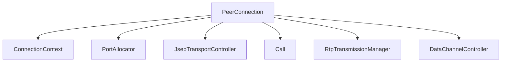
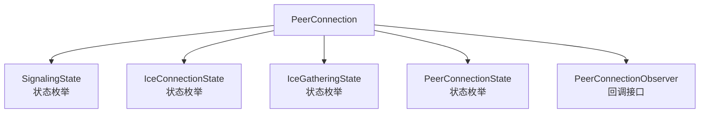
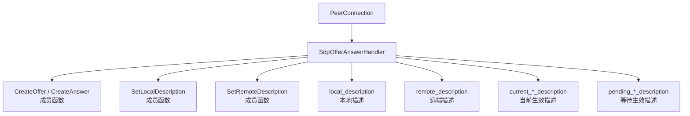
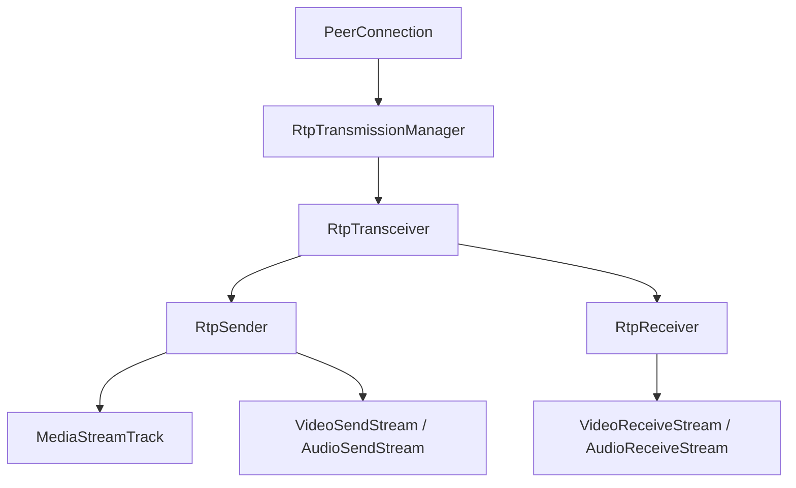
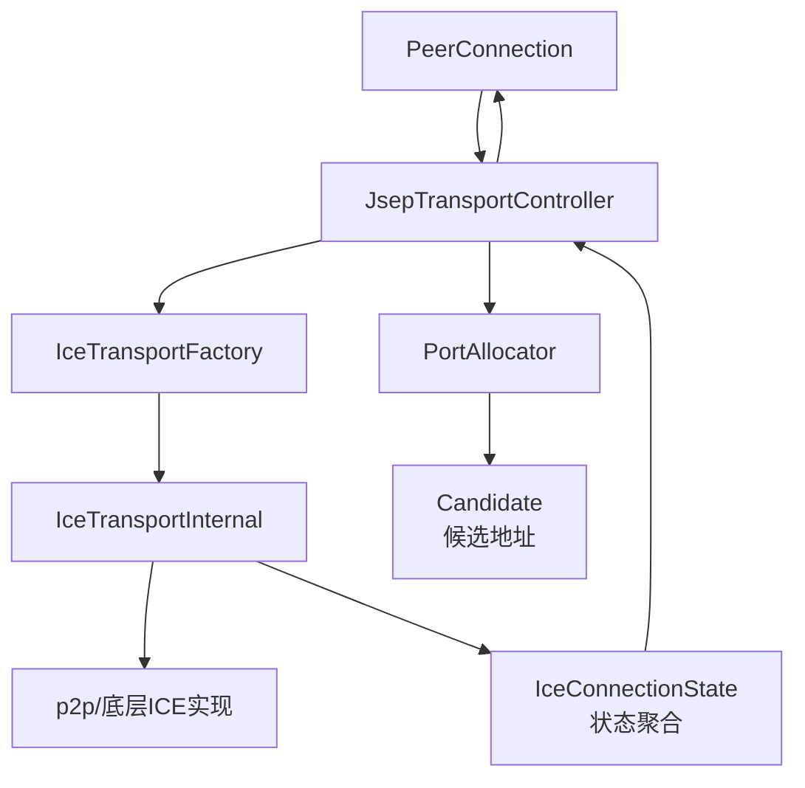
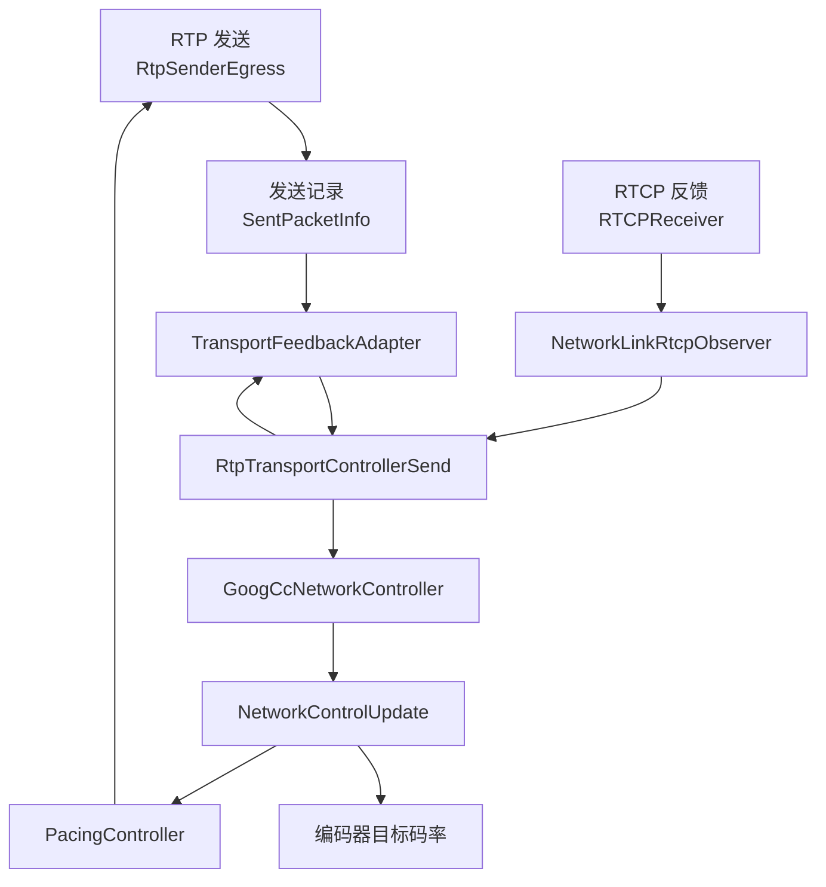

信令协商
媒体对象
网络协商

数据通路
状态
统计


对，`peer_connection.h` 是很合适的总入口，但不适合从第一行顺读到最后一行。我们先按“它管理什么、有哪些核心对象、一次连接怎么流转、哪些内容先跳过”过一遍，再把你当前文件压缩成一张可执行的阅读地图。

Read , lines 1 to 180

Searched for text `class PeerConnection|class PeerConnectionInterface|CreateOffer|SetLocalDescription|SetRemoteDescription|AddTrack|CreateDataChannel|AddTransceiver|Call|JsepTransportController` (`**/pc/peer_connection.h`), 71 results

Read , lines 180 to 430

Read , lines 430 to 760

对，应该先了解 `peer_connection.h`。但要把它当成 **WebRTC 的总控门面类**，不是把所有底层逻辑都塞在这里。

文件位置：

`peer_connection.h`

## 1. `PeerConnection` 到底是什么

它对应浏览器里的：

```cpp
RTCPeerConnection
```

用户所有核心操作最终都会进入这里：

```text
创建连接
  -> PeerConnection

协商
  -> CreateOffer / CreateAnswer
  -> SetLocalDescription
  -> SetRemoteDescription

网络建立
  -> ICE
  -> DTLS
  -> SRTP

媒体发送
  -> RtpTransmissionManager
  -> Call
  -> VideoSendStream / AudioSendStream

添加音视频
  -> AddTrack / AddTransceiver

数据通道
  -> DataChannelController
  -> SCTP
```

所以它是：

> **连接生命周期、信令协商、媒体对象和网络对象的总协调器。**

它本身不负责真正的编码、RTP 打包或带宽算法。


基本都通过 `PeerConnection` 进入，但它们不是严格的串行顺序。
你调整后的顺序不太准确：`AddTrack / AddTransceiver` 通常应该在协商前调用，用来把媒体能力写入 SDP。

更准确的流程是：

```text
0.创建连接
  -> PeerConnection

1.配置媒体和数据通道
  -> AddTrack / AddTransceiver  # 配置本地媒体
  -> CreateDataChannel          #    通常也可以在协商前调用，使数据通道进入 SDP；非协商型 DataChannel 也可能在连接建立后创建
  -> DataChannelController

2.协商
  -> CreateOffer / CreateAnswer  # 根据当前媒体配置生成SDP
  -> SetLocalDescription         #   触发协商和传输配置
  -> 信令交换
  -> SetRemoteDescription

3 建立网络传输                       # 协商后的异步动作，部分阶段会并行
  -> ICE
  -> DTLS
  -> SRTP / SRTCP
  -> SCTP（如果使用数据通道）

4 启动媒体                          # 网络传输建立后，媒体流才真正开始发送
  -> RtpTransmissionManager
  -> Call
  -> VideoSendStream / AudioSendStream
  -> RTP 发送
  
  补充一点：
  `RtpTransmissionManager` 和 `Call` 更像是媒体运行时的管理对象，通常会在 `PeerConnection` 初始化或协商过程中准备好，不一定严格等到网络建立后才创建；但媒体数据真正发出，一般要等传输通道可用。
```

关系不是：
```text
PeerConnection -> 先建立网络 -> 再 AddTrack
```

而是：
```text
PeerConnection
  ├── AddTrack / AddTransceiver
  ├── CreateOffer / SetDescription
  ├── ICE / DTLS / SRTP
  ├── Call / Media Streams
  └── DataChannel / SCTP
```
其中：
- `PeerConnection` 是统一的外部入口。
- `AddTrack` 是配置本地媒体，不等于立即发送。
- `CreateOffer` 会根据当前媒体配置生成 SDP。
- `SetLocalDescription` / `SetRemoteDescription` 触发协商和传输配置。
- ICE、DTLS、SRTP 通常是协商后的异步过程，部分阶段会并行。
- 传输建立后，媒体流才真正开始发送。
- `CreateDataChannel` 通常也可以在协商前调用，使**数据**通道进入 SDP；非协商型 DataChannel 也可能在连接建立后创建。


这里的“**数据**”指的是**应用层任意消息**，不是音视频数据，例如：
```text
聊天文字
文件
游戏操作指令
白板事件
控制信令
```

调用：
```cpp
auto channel = peer_connection->CreateDataChannel("chat", nullptr);
```

创建的是一个名为 `chat` 的 **DataChannel**。之后可以发送：
```cpp
channel->Send("hello");
```
数据路径大致是：
```text
应用消息
  -> DataChannel
  -> DataChannelController
  -> SCTP
  -> DTLS
  -> ICE
  -> UDP
```
它和音视频的路径不同：
```text
音视频：
Audio/Video Track
  -> RTP
  -> SRTP
  -> ICE/UDP

应用数据：
DataChannel
  -> SCTP
  -> DTLS
  -> ICE/UDP
```
“使数据通道进入 SDP”指的是：创建 DataChannel 后，生成 Offer 时，SDP 中会包含一个用于数据通道的 `m=application` 媒体段，例如：
```sdp
m=application 9 UDP/DTLS/SCTP webrtc-datachannel
a=sctp-port:5000
```

这里的 `m=application` 不是音视频，而是表示：

> 这条 PeerConnection 需要协商一条应用数据传输通道。

之后双方通过 SDP 协商 SCTP 参数，建立 DataChannel。`CreateDataChannel()` 创建的是本地对象，真正能发送数据还要等 DataChannel 状态变成 `open`。


非协商型 DataChannel 指的是：**只由一方主动创建，另一方通过事件自动获得**的 DataChannel。

例如：
```cpp
// A 端
auto channel = peer_connection->CreateDataChannel("chat", nullptr);
```
A 端创建后，B 端会通过类似 `OnDataChannel` 的回调收到这个通道，不需要 B 端也调用 `CreateDataChannel()`。

对比：
- **协商型**：双方都创建，使用相同的 `id`，`negotiated = true`
- **非协商型**：一方创建，另一方自动收到，通常由 SCTP/浏览器自动分配通道 ID
默认的 DataChannel 一般就是非协商型。

---

## 2. 先看类声明

```cpp
class PeerConnection : public PeerConnectionInternal,
                       public JsepTransportController::Observer
```

这里有两个重要身份。

### `PeerConnectionInternal`

这是 PeerConnection 的内部接口，供 WebRTC 内部其他对象访问。

例如：

- `SdpOfferAnswerHandler`
- `DataChannelController`
- `RtpTransmissionManager`
- `JsepTransportController`

### `JsepTransportController::Observer`

表示 `PeerConnection` 观察传输层状态：

- ICE 状态变化
- ICE candidate 收集
- DTLS 状态变化
- RTP Transport 创建或变化
- BUNDLE 映射变化

可以理解为：

```text
PeerConnection
    |
    +-- 对外实现 PeerConnection API
    |
    +-- 观察底层网络传输状态
```

---

## 3. PeerConnection类的五大职责

文件顶部注释已经概括了它的职责。

1.管理连接状态
2.创建和初始化底层的对象，比如·PortAllocator和BaseChannels
3.通过RtpTransmissionManager间接地拥有和管理RtpSender/RtpReceiver和track媒体对象的生命周期；
4.跟踪当前和挂起的本地/远程会话描述
5.管理ICE连接状态机

**为什么 ICE 单独列出？**
因为 ICE 是一套独立的网络连通性状态机，负责：
- 收集候选地址
- 检查候选地址连通性
- 选择最佳候选对
- 处理连接失败、断开、重启
- 对外更新 ICE 状态
具体工作主要由 `JsepTransportController`、`PortAllocator` 和 `p2p` 完成，`PeerConnection` 负责协调和暴露状态。

**RtpSender、RtpReceiver、Track 是不是 PeerConnection 直接管理？**
可以说是，但更准确地说是**间接管理**：
`PeerConnection` 提供 `AddTrack()`、`GetSenders()` 等入口，真正的 Sender、Receiver、Transceiver 管理主要由 `RtpTransmissionManager` 完成。
所以：
PeerConnection  # 负责总协调和生命周期入口
    -> RtpTransmissionManager  # 负责媒体对象的具体管理
        -> RtpSender                   # 负责具体发送和接收
        -> RtpReceiver
        -> RtpTransceiver
        -> MediaStreamTrack


这五项是**职责分类**，有些会相互配合，但含义不同。
1. **管理连接状态**  
   管理 PeerConnection 对外状态，例如 `New`、`Connected`、`Failed`、`Closed`，以及 signaling state。

2. **创建和初始化底层对象**  
   负责把各个子系统组装起来，例如：
   ```text
   PeerConnection
       -> PortAllocator
       -> JsepTransportController
       -> Call
       -> RtpTransmissionManager
       -> DataChannelController
   ```
   这是“创建和组织对象”的职责，不是状态管理。

3. **管理媒体对象生命周期**  
   通过 `RtpTransmissionManager` 管理：
   ```text
   RtpSender
   RtpReceiver
   RtpTransceiver
   MediaStreamTrack
   ```

4. **管理 SDP 描述**  
   SDP 中确实包含音频、视频、数据通道等媒体描述，但它描述的是：
   ```text
   如何协商媒体和传输参数
   ```
   不是媒体对象本身。媒体对象由 `RtpTransmissionManager` 管理，SDP 由 `SdpOfferAnswerHandler` 管理。

5. **管理 ICE 连接状态机**  
   ICE 专门负责网络候选、连通性检查和候选对选择。它属于网络传输子系统。

区别可以这样看：

```text
PeerConnection
    ├── 创建和组装各种对象
    ├── 管理自身对外状态
    ├── 管理 SDP 协商状态，并跟踪当前和挂起的本地/远程会话描述 -- 主要通过 `SdpOfferAnswerHandler`
    ├── 管理媒体对象的生命周期 -- 通过RtpTransmissionManager间接地拥有和管理RtpSender/RtpReceiver和track媒体对象的生命周期
    └── 创建，配置，并协调 ICE 网络状态机 -- `PeerConnection` 协调 ICE，`JsepTransportController` 和 `p2p` 负责实际管理 ICE 状态机。
```

PeerConnection
    -> JsepTransportController
        -> PortAllocator
        -> ICE Transport
        -> p2p/

其中：
```text
连接状态 = PeerConnection 对外的综合状态
ICE 状态 = 网络连通性的内部状态
```

例如 ICE 连接失败，可能导致 PeerConnection 进入 `Failed`，但两者不是同一个状态机。


可以，推荐这样画。每个职责单独一张图：

下面是修正后的五张图，节点尽量使用实际类名；枚举、状态和目录则明确标注。

### 1. 创建和组装对象



```text
PeerConnection
    -> ConnectionContext       # 提供线程、MediaEngine等共享上下文
    -> PortAllocator           # 创建和管理ICE端口及候选地址
    -> JsepTransportController # 根据SDP创建和管理ICE、DTLS、RTP传输
    -> Call                    # 管理一次通话中的音视频运行时
    -> RtpTransmissionManager  # 管理RtpSender、RtpReceiver、RtpTransceiver
    -> DataChannelController   # 管理DataChannel和SCTP数据传输
```

`PeerConnection` 主要负责创建、持有和协调这些对象，具体功能由各自的类完成。

### 2. 管理内部和对外状态



```text
PeerConnection
    -> SignalingState        # SDP信令协商状态
    -> IceConnectionState    # ICE网络连接状态
    -> IceGatheringState     # ICE候选地址收集状态
    -> PeerConnectionState   # 对外汇总的连接状态
    -> PeerConnectionObserver# 向应用通知状态和事件
```

这里的 `SignalingState`、`IceConnectionState` 等主要是状态类型，不是负责执行逻辑的类。

`PeerConnectionState` 也不是“对端连接状态”，而是**本地 PeerConnection 对外呈现的整体连接状态**。

内部状态：
SignalingState
IceConnectionState
IceGatheringState
PeerConnectionState

对外：
PeerConnectionObserver 回调
各种状态查询接口

### 3. 管理 SDP 协商状态



```text
PeerConnection
    -> SdpOfferAnswerHandler        # SDP协商处理器
        -> CreateOffer/CreateAnswer # 创建SDP Offer或Answer
        -> SetLocalDescription      # 应用本地SDP
        -> SetRemoteDescription     # 应用远端SDP
        -> local_description        # 当前保存的本地描述
        -> remote_description       # 当前保存的远端描述
        -> current_*_description    # 当前已经生效的描述
        -> pending_*_description    # 等待应用或确认的描述
```

说明：

- `SdpOfferAnswerHandler` 是类。
- `CreateOffer()`、`SetLocalDescription()` 是成员函数。
- `local_description` 等是描述数据或状态，不是类。
- `current` 表示当前生效版本。
- `pending` 表示正在协商、尚未最终生效的版本。

### 4. 管理媒体对象生命周期



```text
PeerConnection
    -> RtpTransmissionManager  # RTP媒体对象管理器
        -> RtpTransceiver       # 描述一个双向或单向媒体传输
            -> RtpSender        # 负责发送媒体
            -> RtpReceiver      # 负责接收媒体
        -> MediaStreamTrack     # 音频或视频媒体轨道
        -> VideoSendStream      # 视频发送运行时
        -> AudioSendStream      # 音频发送运行时
```

注意：

- `RtpTransmissionManager` 不是“RTP 重传管理器”，而是 **RTP 传输对象管理器**。
- RTCP 不主要由它实现。
- RTCP 的核心实现位于 `ModuleRtpRtcpImpl2`、`RTCPReceiver` 和 `RTCPSender`。
- `RtpSender` / `RtpReceiver` 是媒体传输对象。
- `MediaStreamTrack` 是媒体源轨道，例如摄像头、麦克风或屏幕共享。

### 5. 协调 ICE 网络状态机



```text
PeerConnection
    -> JsepTransportController # 创建、配置并协调传输
        -> PortAllocator       # 收集和管理ICE候选地址
        -> IceTransportFactory # 创建ICE传输对象
        -> IceTransportInternal# ICE传输接口
            -> p2p/             # ICE连通性检查等底层实现
        -> IceConnectionState  # 聚合ICE传输状态
    -> PeerConnection           # 接收并对外报告状态
```

准确理解是：

```text
PeerConnection
    -> 创建、配置并协调 JsepTransportController
        -> PortAllocator
        -> IceTransportFactory
            -> IceTransportInternal
                -> p2p/
```

其中：

- `JsepTransportController`：根据 SDP 管理 RTP、DTLS、ICE 等传输对象，并聚合状态。
- `PortAllocator`：收集本地 IP、端口、STUN/TURN 候选。
- `IceTransportFactory`：创建 ICE Transport。
- `IceTransportInternal`：ICE 传输抽象接口。
- `p2p`：目录，不是类名，包含 ICE、Port、Candidate 等底层实现。
- `IceConnectionState`：状态类型，不是执行 ICE 的类。

因此第五项最准确的描述是：

> **PeerConnection 创建、配置并协调 JsepTransportController；JsepTransportController 和 p2p 底层组件负责实际管理 ICE 状态机。**
其中：

- `PeerConnection`：协调 ICE，并向外暴露状态。
- `JsepTransportController`：根据 SDP 创建和管理传输对象，维护聚合状态。
- `PortAllocator`：收集和分配 ICE Candidate。
- `ICE Transport`：执行 ICE 连通性检查。
- `p2p`：提供 ICE、Candidate、Port、连接检查等底层实现。


数据通道管理       # DataChannelController / SCTP
统计和事件日志     # RTCStatsCollector / RtcEventLog
线程和任务调度     # ConnectionContext / Thread
安全配置           # DTLS、SRTP、证书
编解码能力管理     # CodecLookupHelper
资源自适应         # Adaptation Resource
生命周期管理       # Create / Close


三个线程，
signaling_thread  # SDP、协商、PeerConnection状态
network_thread    # ICE、DTLS、Socket、网络收发
worker_thread     # 音视频媒体处理和Call

音频处理
视频编码/解码相关任务
Call
AudioSendStream / VideoSendStream
AudioReceiveStream / VideoReceiveStream
媒体统计


所以“五大职责”只是概括，不是完整分类。

4. **可以调整 `peer_connection.h` 中声明的排列顺序**，通常不会影响 C++ 语义。为了更清晰，可以按功能分组：

1. 创建和销毁

2. 媒体对象
   AddTrack / AddTransceiver / GetSenders
3. 数据通道
   CreateDataChannel / GetSctpTransport
4. SDP 协商
   CreateOffer / SetLocalDescription / SetRemoteDescription
5. 状态查询和 Observer
6. ICE 和网络配置

7. 统计和事件日志
8. 线程访问器
9. 内部协作接口
10. private 成员
但要注意：
- `public/protected/private` 边界不要随意改变。
- 头文件声明顺序不会决定函数执行顺序。
- 如果是公共接口继承而来的函数，最好保留与 `PeerConnectionInterface` 相近的顺序。
- 真正的实现调用顺序仍然要看 `peer_connection.cc`，不能只看头文件排列。


你感觉对：**头文件的 API 分组**和**PeerConnection 的架构职责**不是一一对应的。

可以这样区分：

```text
PeerConnection 的职责
    = 它管理哪些状态、对象和子系统

PeerConnection 的数据通路
    = 数据实际经过哪些模块发送和接收
```

## PeerConnection 的主要职责

```text
1. 生命周期和对象组装
   PeerConnection
       -> ConnectionContext
       -> PortAllocator
       -> JsepTransportController
       -> Call
       -> RtpTransmissionManager
       -> DataChannelController

2. 管理内部状态，并向外暴露状态
   SignalingState
   IceConnectionState
   IceGatheringState
   PeerConnectionState
   PeerConnectionObserver

3. 管理 SDP 协商状态
   SdpOfferAnswerHandler
       -> CreateOffer / CreateAnswer
       -> SetLocalDescription / SetRemoteDescription
       -> local / remote / current / pending description

4. 管理媒体对象生命周期
   RtpTransmissionManager
       -> RtpTransceiver
       -> RtpSender / RtpReceiver
       -> MediaStreamTrack

5. 协调网络传输
   PeerConnection
       -> JsepTransportController
           -> PortAllocator
           -> ICE Transport
           -> DTLS / SRTP
           -> RtpTransport / SCTP
```

这里第 5 项比“协调 ICE 网络状态机”更完整，因为 `JsepTransportController` 实际还管理 RTP、DTLS 等传输对象。

## 数据通路应该单独理解

### 音视频数据通路
```text
MediaStreamTrack
    -> RtpSender
    -> VideoSendStream / AudioSendStream
    -> RTP
    -> SRTP
    -> ICE
    -> 网络
```

接收方向：
```text
网络
    -> ICE
    -> SRTP
    -> RTP
    -> RtpReceiver
    -> MediaStreamTrack
```

### DataChannel 数据通路
```text
应用消息
    -> DataChannel
    -> DataChannelController
    -> SCTP
    -> DTLS
    -> ICE
    -> 网络
```

所以 `DataChannelController` 属于 **对象管理职责**，而 SCTP/DTLS/ICE 属于 **数据传输通路**。

## 头文件 API 分组只是方便查找

```text
媒体 API       AddTrack / AddTransceiver / GetSenders
数据通道 API   CreateDataChannel / GetSctpTransport
SDP API        CreateOffer / SetLocalDescription
状态 API       signaling_state / ice_connection_state
网络 API       AddIceCandidate / SetConfiguration
统计 API       GetStats / GetCallStats
```

它们是“对外函数分类”，不是完整的执行流程。

最准确的理解是：

> `PeerConnection` 不直接承载所有数据，而是负责管理对象、维护状态、协调 SDP 和网络传输；真正的数据通路由 `RtpSender`、`Call`、`RtpTransport`、`DataChannelController`、SCTP、SRTP、ICE 等对象共同完成。


你的理解基本正确：

> `PeerConnection` 可以拎起整个框架，但它主要负责**创建、连接、协调和管理生命周期**；具体数据通路由它管理的子对象内部实现。

## 三种数据通路属于哪里？

### 1. 音视频数据通路

属于 `Call` 和媒体流对象：

```text
PeerConnection
  -> Call
      -> VideoSendStream / AudioSendStream
          -> RtpSender
              -> RTP / SRTP
```

接收方向也是由 `Call`、`VideoReceiveStream`、`AudioReceiveStream` 等实现。

### 2. 接收方向

属于网络传输和媒体接收对象：

```text
RtpTransport
  -> RtpReceiver
      -> VideoReceiveStream / AudioReceiveStream
          -> 解码器
```

`PeerConnection` 负责把 `RtpTransport` 和接收流连接起来，但不会自己解析每个 RTP 包。

### 3. 应用消息

属于 `DataChannelController` 和 SCTP：

```text
PeerConnection
  -> DataChannelController
      -> DataChannel
          -> SCTP
              -> DTLS / ICE
```

## PeerConnection 的作用

可以看成：

```text
PeerConnection
    -> 创建/持有子对象
    -> 给子对象传递配置
    -> 把子对象连接起来
    -> 协调状态和生命周期
```

而不是：

```text
PeerConnection
    -> 亲自处理音视频包、RTP包、SCTP消息
```

有些对象是直接成员，例如：

```cpp
std::unique_ptr<Call> call_;
std::unique_ptr<DataChannelController> ...
std::unique_ptr<JsepTransportController> ...
```

有些对象则由这些子对象继续创建和管理，例如：

```text
Call
  -> VideoSendStream
      -> RtpVideoSender
          -> ModuleRtpRtcpImpl2
```

## “头文件 API 分组方便查找”是什么意思？

指的是方便你按**对外功能**定位函数，不代表真实执行顺序。

例如：

```text
媒体相关：
AddTrack()
AddTransceiver()
GetSenders()

数据通道相关：
CreateDataChannel()
GetSctpTransport()

SDP相关：
CreateOffer()
SetLocalDescription()
SetRemoteDescription()

状态相关：
signaling_state()
ice_connection_state()

统计相关：
GetStats()
GetCallStats()
```

它解决的是：

> “我想使用某项功能，应该找哪个接口？”

而不是：

> “程序运行时一定按这个顺序执行。”

真实内部调用链还要继续进入：

```text
PeerConnection
  -> SdpOfferAnswerHandler
  -> RtpTransmissionManager
  -> Call
  -> JsepTransportController
  -> DataChannelController
```

所以最终可以这样记：

```text
PeerConnection = 总入口、总协调器、生命周期管理者

各子对象 = 具体数据通路和业务逻辑的实现者
```


### 3.1 管理连接状态

包括：

```cpp
signaling_state()
ice_connection_state()
ice_gathering_state()
peer_connection_state()
```

状态关系大概是：

```text
New
  -> Connecting
  -> Connected
  -> Disconnected / Failed
  -> Closed
```

注意这里有多个状态机：

- Signaling State：SDP 协商状态
- ICE Gathering State：候选地址收集状态
- ICE Connection State：ICE 连通性状态
- Peer Connection State：对外汇总状态

初读时先知道它们分别存在即可，不需要立刻追完所有状态转换。

---

### 3.2 管理 SDP 协商

核心函数：

```cpp
CreateOffer()
CreateAnswer()
SetLocalDescription()
SetRemoteDescription()
```

调用关系：

```text
CreateOffer
    -> SdpOfferAnswerHandler
    -> MediaSessionDescriptionFactory
    -> SessionDescription
```

相关对象：

```cpp
std::unique_ptr<SdpOfferAnswerHandler> sdp_handler_;
```

这个成员非常重要。`PeerConnection` 对外暴露 SDP 方法，但实际 SDP 状态和 Offer/Answer 逻辑主要在：

`sdp_offer_answer.h`

`session_description.h`

所以看到这些函数时，要记住：

> `PeerConnection` 是入口，`SdpOfferAnswerHandler` 才是 SDP 逻辑的主要实现者。

---

### 3.3 管理媒体发送接收对象

核心 API：

```cpp
AddTrack()
RemoveTrackOrError()
AddTransceiver()
GetSenders()
GetReceivers()
GetTransceivers()
```

核心成员：

```cpp
std::unique_ptr<RtpTransmissionManager> rtp_manager_;
```

它负责管理：

- RTP Sender
- RTP Receiver
- RTP Transceiver
- MediaStreamTrack
- SSRC
- 编解码能力
- 媒体方向

关系可以画成：

```text
PeerConnection
    |
    v
RtpTransmissionManager
    |
    +-- RtpTransceiver
    |      +-- RtpSender
    |      +-- RtpReceiver
    |
    +-- MediaStreamTrack
    |
    +-- CodecLookupHelper
```

相关文件：

- `rtp_transmission_manager.h`
- `rtp_transceiver.h`
- `rtp_sender.h`
- `rtp_receiver.h`

### `AddTrack()` 重点理解

```text
应用调用 AddTrack()
    -> PeerConnection::AddTrack()
    -> RtpTransmissionManager
    -> 创建或复用 RtpTransceiver
    -> 创建 RtpSender
    -> 标记需要重新协商
```

注意：`AddTrack()` 通常只是建立媒体对象关系，不代表媒体已经开始发送。

真正开始发送还要经过：

```text
Offer/Answer
  -> SetLocalDescription
  -> 传输建立
  -> VideoSendStream / AudioSendStream 启动
```

---

## 4. `Call` 是什么

`peer_connection.h` 中有：

```cpp
std::unique_ptr<Call> call_;
Call* const call_ptr_;
```

`Call` 代表一次 WebRTC 通话的媒体运行时。

```text
PeerConnection
    |
    v
Call
    |
    +-- VideoSendStream
    +-- VideoReceiveStream
    +-- AudioSendStream
    +-- AudioReceiveStream
    +-- RtpTransportControllerSend
```

`PeerConnection` 主要负责：

- 创建和持有 `Call`
- 根据 SDP 和媒体配置创建媒体流
- 管理连接生命周期

`Call` 主要负责：

- 实际媒体流运行
- RTP 发送接收
- Pacer
- QoS
- 网络传输统计

所以你之前关注 QoS 时，路径应该是：

```text
PeerConnection
    -> Call
    -> RtpTransportControllerSend
    -> GoogCcNetworkController
```

不是：

```text
PeerConnection
    -> 自己实现 QoS
```

---

## 5. 网络传输相关成员

这些成员很关键：

```cpp
std::unique_ptr<PortAllocator> port_allocator_;
std::unique_ptr<JsepTransportController> transport_controller_;
std::unique_ptr<DtlsTransportFactory> dtls_transport_factory_;
```

可以分成三层。

### 5.1 `PortAllocator`

负责 ICE candidate 和端口资源：

```text
本地网卡
    -> UDP/TCP Port
    -> ICE Candidate
```

对应：

`peer_connection.h`

`port_allocator.h`

### 5.2 `JsepTransportController`

负责把 SDP 中的媒体段和底层传输关联起来：

```text
m=audio
m=video
m=application
       |
       v
JsepTransportController
       |
       +-- ICE
       +-- DTLS
       +-- SRTP
       +-- SCTP
```

对应：

`jsep_transport_controller.h`

### 5.3 `RtpTransport`

负责实际 RTP/RTCP 数据流：

```text
RtpTransport
    +-- RTP
    +-- RTCP
    +-- SRTP / SRTCP
```

对应：

`rtp_transport.h`

---

## 6. 数据通道相关成员

文件中还有：

```cpp
DataChannelController data_channel_controller_;
```

相关 API：

```cpp
CreateDataChannelOrError()
GetSctpTransport()
```

调用链：

```text
PeerConnection
    -> DataChannelController
    -> SctpTransport
    -> DTLS
    -> ICE
    -> UDP
```

音视频和数据通道共用 ICE/DTLS 基础设施，但媒体走 RTP，数据通道走 SCTP：

```text
音视频：
RTP -> SRTP -> ICE -> UDP

数据通道：
SCTP -> DTLS -> ICE -> UDP
```

相关文件：

- `data_channel_controller.h`
- `sctp_transport.h`
- `data_channel_controller.cc`

---

## 7. `PeerConnection` 的线程模型

这是阅读这个文件时最容易忽略、但非常重要的部分。

WebRTC 主要有三个线程：

```text
signaling thread
    负责 SDP、状态、API 调用

worker thread
    负责媒体引擎、媒体流

network thread
    负责 ICE、DTLS、Socket、RTP/RTCP 网络收发
```

在代码中可以看到：

```cpp
RTC_RUN_ON(signaling_thread())
RTC_RUN_ON(network_thread())
RTC_RUN_ON(worker_thread())
RTC_GUARDED_BY(signaling_thread())
RTC_GUARDED_BY(network_thread())
RTC_GUARDED_BY(worker_thread())
```

例如：

```cpp
std::unique_ptr<Call> call_ RTC_GUARDED_BY(worker_thread());
```

表示 `call_` 的所有权和主要访问属于 worker thread。

```cpp
std::unique_ptr<JsepTransportController> transport_controller_
    RTC_GUARDED_BY(network_thread());
```

表示传输控制器属于 network thread。

```cpp
PeerConnectionObserver* observer_
    RTC_GUARDED_BY(signaling_thread());
```

表示用户回调对象主要在 signaling thread 上访问。

大致关系：

```text
应用调用 API
    |
    v
signaling thread
    |
    +-- SDP / Transceiver / Connection State
    |
    +-- BlockingCall / PostTask
             |
             v
worker thread
    |
    +-- Call / MediaEngine / Media Streams

network thread
    |
    +-- ICE / DTLS / RTP Transport / Socket
```

阅读时看到 `BlockingCall`、`PostTask`、`RTC_RUN_ON`，不要把它们当成细节跳过。它们说明了对象之间的访问边界。

---

## 8. 主要成员变量如何分组

可以把 `peer_connection.h` 后半部分成员分成六组。

### 8.1 基础环境和线程

```cpp
const Environment env_;
const scoped_refptr<ConnectionContext> context_;
const PeerConnectionFactoryInterface::Options options_;
```

其中 `ConnectionContext` 提供：

- signaling thread
- worker thread
- network thread
- MediaEngine
- 事件日志等共享资源

相关文件：

`connection_context.h`

### 8.2 连接状态

```cpp
IceConnectionState ice_connection_state_;
IceGatheringState ice_gathering_state_;
PeerConnectionState connection_state_;
RTCConfiguration configuration_;
```

这些状态通常由 signaling thread 保护。

### 8.3 网络传输

```cpp
port_allocator_
ice_transport_factory_
dtls_transport_factory_
transport_controller_
transport_controller_copy_
```

其中：

```cpp
transport_controller_
```

在 network thread 使用。

```cpp
transport_controller_copy_
```

是 signaling thread 侧可以访问的指针副本。

这个设计是因为同一个传输控制对象需要跨线程协作，但不能直接无约束地跨线程访问。

### 8.4 媒体运行时

```cpp
call_
media_engine_ref_
rtp_manager_
codec_lookup_helper_
```

这是从 PeerConnection 进入媒体系统的关键区域。

### 8.5 SDP 和 DataChannel

```cpp
sdp_handler_
data_channel_controller_
sctp_mid_s_
sctp_mid_n_
```

`sctp_mid_s_` 和 `sctp_mid_n_` 分别表示 signaling thread 和 network thread 上的 SCTP MID 状态。

### 8.6 统计和日志

```cpp
legacy_stats_
stats_collector_
```

相关接口：

```cpp
GetStats()
StartRtcEventLog()
StopRtcEventLog()
GetTransportStatsByNames()
GetCallStats()
```

统计来源比较分散：

```text
PeerConnection
    +-- RTCStatsCollector
    +-- LegacyStatsCollector
    +-- Call::Stats
    +-- TransportStats
    +-- RTP/RTCP stats
```

---

## 9. `peer_connection.h` 中哪些内容先跳过

第一遍建议暂时跳过：

### 9.1 Legacy API

例如：

```cpp
AddStream()
RemoveStream()
旧版 GetStats()
旧版 SetLocalDescription()
旧版 SetRemoteDescription()
```

它们主要是兼容旧接口。

### 9.2 统计细节

先知道：

```cpp
GetStats()
StartRtcEventLog()
GetCallStats()
```

是统计入口即可。统计实现可以之后单独看：

- `pc/rtc_stats_collector.*`
- `pc/legacy_stats_collector.*`
- `call.cc`

### 9.3 UMA 和使用模式

例如：

```cpp
ReportFirstConnectUsageMetrics()
ReportCloseUsageMetrics()
ReportUsagePattern()
```

这是埋点和产品统计，不是连接核心链路。

### 9.4 测试专用方法

带有：

```cpp
ForTesting()
```

的方法可以先跳过。

---

## 10. 推荐你现在这样读

### 第一步：只看公共入口

先读这些函数：

```cpp
Create()
AddTrack()
AddTransceiver()
CreateDataChannelOrError()
CreateOffer()
CreateAnswer()
SetLocalDescription()
SetRemoteDescription()
Close()
```

### 第二步：追三个核心成员

```cpp
sdp_handler_
rtp_manager_
transport_controller_
```

对应：

```text
sdp_handler_
    -> SDP 协商

rtp_manager_
    -> Sender / Receiver / Transceiver

transport_controller_
    -> ICE / DTLS / RTP Transport
```

### 第三步：再看两个核心持有对象

```cpp
call_
media_engine_ref_
```

对应：

```text
Call
    -> 媒体流
    -> RTP
    -> QoS
    -> Pacer

MediaEngine
    -> 音频设备
    -> 音频处理
    -> 音频编解码
    -> 视频编解码工厂
```

## 11. 最重要的一张关系图



## 12. 一句话总结

你可以这样记：

```text
PeerConnection
    管连接和协商

SdpOfferAnswerHandler
    管 SDP

RtpTransmissionManager
    管 Sender / Receiver / Transceiver

JsepTransportController
    管 ICE / DTLS / RTP Transport

Call
    管一通电话的媒体运行时

RtpTransportControllerSend
    管发送侧 QoS

modules/
    管具体算法、协议和媒体处理
```

因此，`peer_connection.h` 第一遍不需要弄懂每个函数。你只需要先建立这条主干：

```text
PeerConnection
    -> SDP
    -> Transport
    -> Call
    -> RTP/RTCP
    -> QoS
    -> Pacer
    -> 网络
```

等这条主干清楚以后，再进入 `call`、`rtp_rtcp` 和 `congestion_controller`，会轻松很多。