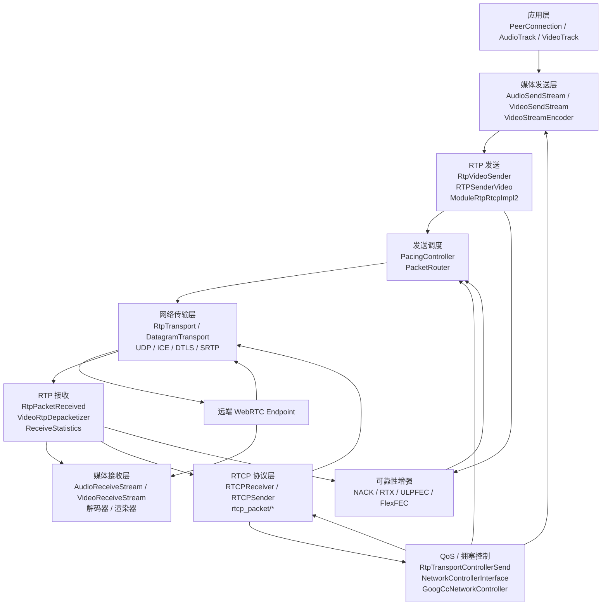
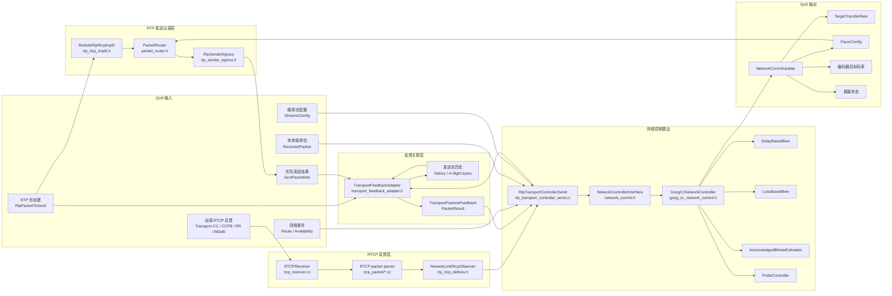

# WebRTC RTP/RTCP 工程与 QoS 阅读图

本文用于从工程整体和 QoS 主链路两个层次理解 WebRTC。建议先看整体数据流，再沿 QoS 细化图阅读源码。

## 1. 工程整体框图



### 1.1 媒体数据面

发送方向：

```text
编码帧
  -> RTP 分包
  -> RTP Header Extension
  -> Pacer 排队
  -> PacketRouter
  -> 网络
```

接收方向：

```text
网络
  -> RTP 包解析
  -> FEC / RTX 恢复
  -> RTP 解包
  -> 完整编码帧
  -> 解码器
```

相关入口文件：

- [call/rtp_video_sender.h](../../../call/rtp_video_sender.h)
- [modules/rtp_rtcp/source/rtp_sender_video.h](../../../modules/rtp_rtcp/source/rtp_sender_video.h)
- [modules/rtp_rtcp/source/rtp_sender.h](../../../modules/rtp_rtcp/source/rtp_sender.h)
- [modules/pacing/pacing_controller.h](../../../modules/pacing/pacing_controller.h)
- [modules/pacing/packet_router.h](../../../modules/pacing/packet_router.h)

### 1.2 RTCP 控制面

```text
远端接收 RTP
  -> 远端生成 RTCP
  -> 本地 RTCPReceiver
  -> NetworkLinkRtcpObserver
  -> QoS / 拥塞控制
  -> 码率、Pacer、探测和重传策略更新
```

RTCP 反馈通常包括：

- Transport-CC
- Receiver Report
- RTT
- 丢包率和抖动
- REMB
- NACK
- PLI / FIR
- RFC 8888 Congestion Control Feedback
- Target Bitrate

## 2. QoS 详细框图



## 3. QoS 主链路

### 3.1 RTP 发送时记录

```text
RtpPacketToSend
    -> PacketRouter
    -> RtpSenderEgress
    -> TransportFeedbackAdapter::AddPacket()
```

发送侧会记录：

- Transport Sequence Number
- RTP Sequence Number
- SSRC
- 包大小
- 包类型
- 发送时间
- 是否 RTX / FEC
- 网络路由

相关文件：

- [modules/pacing/packet_router.h](../../../modules/pacing/packet_router.h)
- [modules/rtp_rtcp/source/rtp_sender_egress.h](../../../modules/rtp_rtcp/source/rtp_sender_egress.h)
- [modules/congestion_controller/rtp/transport_feedback_adapter.h](../../../modules/congestion_controller/rtp/transport_feedback_adapter.h)

### 3.2 RTCP 反馈到达

```text
RTCP 数据
    -> RTCPReceiver::IncomingPacket()
    -> ParseCompoundPacket()
    -> HandleTransportFeedback()
    -> TriggerCallbacksFromRtcpPacket()
```

相关文件：

- [modules/rtp_rtcp/source/rtcp_receiver.cc](../../../modules/rtp_rtcp/source/rtcp_receiver.cc)
- [modules/rtp_rtcp/source/rtcp_receiver.h](../../../modules/rtp_rtcp/source/rtcp_receiver.h)
- [modules/rtp_rtcp/source/rtcp_packet/transport_feedback.h](../../../modules/rtp_rtcp/source/rtcp_packet/transport_feedback.h)
- [modules/rtp_rtcp/include/rtp_rtcp_defines.h](../../../modules/rtp_rtcp/include/rtp_rtcp_defines.h)

`RTCPReceiver` 的职责是解析和分发：

```text
解析 RTCP
    -> 提取反馈
    -> 调用 NetworkLinkRtcpObserver
```

它不直接实现最终带宽决策。

### 3.3 反馈与发送历史关联

```text
NetworkLinkRtcpObserver
    -> RtpTransportControllerSend::OnTransportFeedback()
    -> TransportFeedbackAdapter::ProcessTransportFeedback()
    -> TransportPacketsFeedback
```

关键文件：

- [call/rtp_transport_controller_send.h](../../../call/rtp_transport_controller_send.h)
- [call/rtp_transport_controller_send.cc](../../../call/rtp_transport_controller_send.cc)
- [modules/congestion_controller/rtp/transport_feedback_adapter.h](../../../modules/congestion_controller/rtp/transport_feedback_adapter.h)

Transport-CC 的关键点是把：

```text
RTCP 中的 Transport Sequence Number
        +
本地发送历史
        |
        v
每个包的到达、丢失和延迟信息
```

### 3.4 网络控制算法

```text
TransportPacketsFeedback
    -> GoogCcNetworkController
    -> DelayBasedBwe / LossBasedBwe
    -> NetworkControlUpdate
```

相关文件：

- [api/transport/network_control.h](../../../api/transport/network_control.h)
- [modules/congestion_controller/goog_cc/goog_cc_network_control.h](../../../modules/congestion_controller/goog_cc/goog_cc_network_control.h)
- [modules/congestion_controller/goog_cc/delay_based_bwe.h](../../../modules/congestion_controller/goog_cc/delay_based_bwe.h)
- [modules/congestion_controller/goog_cc/loss_based_bwe_v2.h](../../../modules/congestion_controller/goog_cc/loss_based_bwe_v2.h)
- [modules/congestion_controller/goog_cc/send_side_bandwidth_estimation.h](../../../modules/congestion_controller/goog_cc/send_side_bandwidth_estimation.h)

算法会综合：

- 到达间隔和排队延迟
- 丢包率
- RTT
- 已确认吞吐量
- 网络路由变化
- 探测包结果
- 媒体流配置

然后产生：

- 目标码率
- Pacing rate
- Padding rate
- Probe 配置
- 拥塞窗口
- 网络可用性状态

### 3.5 QoS 结果执行

```text
NetworkControlUpdate
    -> RtpTransportControllerSend
    -> PacingController::SetPacerConfig()
    -> PacketRouter
    -> RTP 发送
```

相关文件：

- [modules/pacing/pacing_controller.h](../../../modules/pacing/pacing_controller.h)
- [modules/pacing/packet_router.h](../../../modules/pacing/packet_router.h)
- [call/rtp_transport_controller_send.cc](../../../call/rtp_transport_controller_send.cc)

Pacer 负责实际执行：

- 什么时候发送数据包
- 如何控制发送速率
- 如何处理发送队列
- 是否生成 Padding
- 是否发送 Probe
- 如何处理拥塞状态
- 音频、视频、重传、FEC 的优先级

## 4. 主要类与文件职责

| 类 / 文件 | 主要职责 |
|---|---|
| `RtpTransportControllerSend` | 发送侧 QoS 总协调器，连接 RTCP、RTP 发送记录、网络控制器和 Pacer |
| `NetworkControllerInterface` | 网络控制器统一抽象接口 |
| `GoogCcNetworkController` | GoogCC 网络控制算法协调器 |
| `TransportFeedbackAdapter` | 将 RTCP 反馈和本地发送历史关联成逐包反馈 |
| `RTCPReceiver` | 解析 RTCP 并向观察者分发反馈 |
| `RTCPSender` | 构造和发送 SR、RR、NACK、PLI、REMB 等 RTCP 消息 |
| `RtpSenderEgress` | RTP 包发送出口，记录实际发送相关信息 |
| `PacingController` | 根据目标速率和队列状态调度 RTP 包 |
| `PacketRouter` | 在多个 RTP 模块之间路由 Pacer 输出，并发送 RTCP |
| `ModuleRtpRtcpImpl2` | 单个 RTP/RTCP 模块的总实现，组合 RTP Sender、RTCP Sender 和 Receiver |
| `RtpVideoSender` | 管理视频 RTP 流、编码帧、重传和 FEC |
| `ReceiveStatistics` | 收集 RTP 接收统计并用于生成 RR |
| `rtcp_packet/*` | 各类 RTCP 报文的字段解析和序列化 |

## 5. RTCP 在 QoS 中的位置

RTCP 可以作为 QoS 的**远端网络反馈入口**，但不是完整 QoS 的唯一数据入口。

```text
RTCPReceiver
    -> NetworkLinkRtcpObserver
    -> RtpTransportControllerSend
```

它能提供：

- Transport-CC
- RTT
- RR / SR report block
- REMB
- RFC 8888 CCFB
- NACK / PLI / FIR 等控制反馈

但完整 QoS 还需要：

- RTP 包发送时间和包大小
- Transport Sequence Number 与发送历史
- Pacer 队列和排队时间
- in-flight data
- 网络路由和可用性
- 编码器目标码率和实际编码状态
- 接收端 RTP 统计

因此现有工程的合理分层是：

```text
RTCPReceiver = RTCP 反馈协议入口
RtpTransportControllerSend = QoS / 拥塞控制协调入口
GoogCcNetworkController = 网络估计算法
PacingController = QoS 执行层
```

## 6. 推荐源码阅读顺序

建议沿着真实调用链阅读，而不是按 `modules/rtp_rtcp` 目录逐文件阅读：

1. [call/rtp_transport_controller_send.h](../../../call/rtp_transport_controller_send.h)
2. [call/rtp_transport_controller_send.cc](../../../call/rtp_transport_controller_send.cc)
3. [modules/congestion_controller/rtp/transport_feedback_adapter.h](../../../modules/congestion_controller/rtp/transport_feedback_adapter.h)
4. [api/transport/network_control.h](../../../api/transport/network_control.h)
5. [modules/congestion_controller/goog_cc/goog_cc_network_control.h](../../../modules/congestion_controller/goog_cc/goog_cc_network_control.h)
6. [modules/pacing/pacing_controller.h](../../../modules/pacing/pacing_controller.h)
7. [modules/pacing/packet_router.h](../../../modules/pacing/packet_router.h)
8. [modules/rtp_rtcp/source/rtcp_receiver.cc](../../../modules/rtp_rtcp/source/rtcp_receiver.cc)
9. [modules/rtp_rtcp/source/rtp_sender_egress.h](../../../modules/rtp_rtcp/source/rtp_sender_egress.h)
10. [call/rtp_video_sender.h](../../../call/rtp_video_sender.h)

重点调用链：

```text
RTP 包发送
    -> TransportFeedbackAdapter::AddPacket()

RTCP 反馈到达
    -> RTCPReceiver
    -> NetworkLinkRtcpObserver
    -> RtpTransportControllerSend

反馈和发送历史关联
    -> TransportFeedbackAdapter
    -> TransportPacketsFeedback

网络估计
    -> GoogCcNetworkController
    -> NetworkControlUpdate

执行控制
    -> PacingController
    -> PacketRouter
    -> RtpSenderEgress
```

## 7. 快速定位函数

在 [call/rtp_transport_controller_send.cc](../../../call/rtp_transport_controller_send.cc) 中优先搜索：

```cpp
OnTransportFeedback()
OnCongestionControlFeedback()
OnRttUpdate()
OnReport()
OnSentPacket()
HandleTransportPacketsFeedback()
PostUpdates()
UpdateControlState()
```

在 [modules/rtp_rtcp/source/rtcp_receiver.cc](../../../modules/rtp_rtcp/source/rtcp_receiver.cc) 中优先搜索：

```cpp
IncomingPacket()
ParseCompoundPacket()
HandleTransportFeedback()
HandleCongestionControlFeedback()
TriggerCallbacksFromRtcpPacket()
```

最终可以用下面这句话定位各层：

> `rtcp_packet/*` 解决 RTCP 包如何编解码；`RTCPReceiver` 解决反馈如何解析和分发；`RtpTransportControllerSend` 解决 QoS 如何协调；`GoogCcNetworkController` 解决网络状态如何估计；`PacingController` 负责把控制结果落实到发送节奏。
