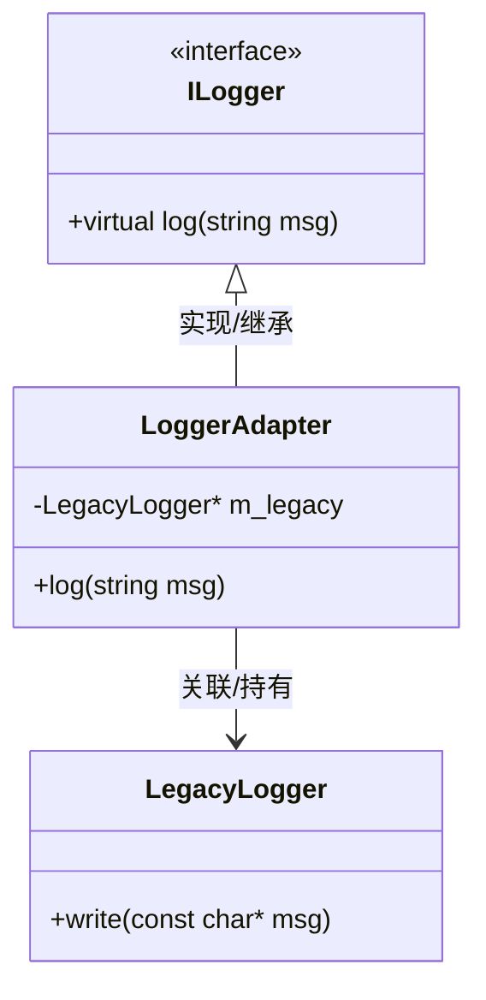

1.单例模式如何保证多线程安全？2.观察者模式是怎样的？简要写出代码，并举例应用场景说明 3.还有哪些是经常在c++/c开发中用的？

<think>
<think>
Thinking Process:

1.  **Analyze the Request:**
    *   **Question 1:** How to ensure thread safety in the Singleton pattern?
    *   **Question 2:** What is the Observer pattern? Provide brief code, example scenarios.
    *   **Question 3:** What other design patterns are commonly used in C++/C development?
    *   **Language:** Simplified Chinese (as per rules).
    *   **Context:** The user has previously asked about Linux thread scheduling, memory size, and embedded Linux (NVT chip) logs. This suggests they are likely an embedded systems developer or working on low-level/system programming in C/C++. The answer should be tailored to this context (e.g., mentioning C++11, pthreads, or embedded constraints).

2.  **Drafting Answer - Question 1: Singleton Thread Safety:**
    *   **Problem:** Multiple threads calling `getInstance()` simultaneously might create multiple instances.
    *   **Solutions:**
        1.  **Eager Initialization (饿汉式):** Static instance created at load time. Thread-safe by default, but might waste resources if never used.
        2.  **Lazy Initialization + Lock (懒汉式 + 锁):** Use `std::mutex` (C++11) or `pthread_mutex_t`. Safe but has performance overhead every call.
        3.  **Double-Checked Locking (DCLP, 双重检查锁):** Check instance, lock, check again, create. Needs memory barrier semantics. In C++11, `static` local variable initialization is thread-safe (Magic Statics).
        4.  **C++11 "Magic Static" (Recommended):** `static Singleton& getInstance() { static Singleton instance; return instance; }`. This is the modern standard way.
    *   **C Context:** C doesn't have constructors/static initialization guarantees like C++11. Need `pthread_once` or manual locking.
    *   **Key Point:** Emphasize C++11 `static local variable` as the best practice for C++. For C, use `pthread_once`.

3.  **Drafting Answer - Question 2: Observer Pattern:**
    *   **Concept:** One-to-many dependency. When one object (Subject) changes state, all dependents (Observers) are notified.
    *   **Components:** Subject (Interface), ConcreteSubject, Observer (Interface), ConcreteObserver.
    *   **Code:** Keep it brief. Use C++ for clarity (classes/interfaces), maybe mention C struct + function pointers if relevant to their background. Let's stick to C++ for standard DP illustration but keep it simple.
    *   **Scenario:** UI updates (MVC), Event systems, Embedded sensor data monitoring (e.g., temperature sensor notifies display and logger).
    *   **Code Structure:**
        *   `Observer` interface (update method).
        *   `Subject` class (attach, detach, notify).
        *   Concrete implementations.
    *   **Embedded Context:** Mention signal/slot mechanism (Qt) or callback functions in C.

4.  **Drafting Answer - Question 3: Other Common Patterns in C/C++:**
    *   **Factory Method (工厂方法):** Creating objects without specifying exact class. Good for hardware abstraction layers (HAL).
    *   **Strategy (策略模式):** Encapsulate algorithms. Good for different communication protocols or filtering algorithms.
    *   **Adapter (适配器模式):** Make incompatible interfaces work together. Common when integrating third-party libs.
    *   **Producer-Consumer (生产者 - 消费者):** Crucial for embedded systems (queues, threads). Not strictly GoF, but essential.
    *   **RAII (Resource Acquisition Is Initialization):** C++ specific, resource management (locks, memory).
    *   **Pimpl (Pointer to Implementation):** Hide implementation details, reduce compilation dependencies.
    *   **State Machine (状态机):** Very common in embedded control logic.

5.  **Review and Refine:**
    *   **Tone:** Professional, technical, concise.
    *   **Language:** Simplified Chinese.
    *   **Context Alignment:** The user previously asked about Linux threads and embedded memory. I should mention `pthread_once` for C singleton and event loops for observer in embedded contexts.
    *   **Formatting:** Use Markdown, code blocks, bold text for emphasis.
    *   **Check Rules:** System time is 2026-04-20. No specific constraint violated. Use Simplified Chinese.

6.  **Final Polish (Self-Correction during drafting):**
    *   *Singleton:* Make sure to highlight C++11's thread-safe static initialization. It's the most important modern C++ tip. For C, `pthread_once` is the standard POSIX way.
    *   *Observer:* Keep code minimal. Don't write a full framework. Just the core logic.
    *   *Other Patterns:* Select those most relevant to system/embedded programming (Factory, Strategy, State, Producer-Consumer).

7.  **Final Output Generation** (similar to the thought process above).
    *   Structure:
        1.  Singleton Thread Safety (C++ vs C).
        2.  Observer Pattern (Concept, Code, Scenario).
        3.  Other Common Patterns (List + Brief explanation).

    *   *Wait, one detail:* The user asked "C++/C development". I need to distinguish between the two where necessary because C doesn't have classes.
    *   *Singleton in C:* Use `pthread_once_t`.
    *   *Singleton in C++:* Use `static local variable` (Meyers' Singleton).
    *   *Observer in C:* Function pointers + struct.
    *   *Observer in C++:* `std::function` + `std::vector` or interfaces.
    *   *Decision:* I will provide C++ style for clarity as it's standard for Design Patterns, but add notes for C implementation (callbacks).

    *   *Refining Question 3:* Focus on patterns useful in system programming (RAII, Pimpl, State Machine).

    *   *Let's write.*

    *(Self-Correction)*: Keep the code snippets concise. Don't overwhelm.

    *(Final Check)*: Did I answer all 3 parts? Yes. Is it Simplified Chinese? Yes. Is it relevant to their background (Linux/Embedded)? Yes, I'll add notes about embedded scenarios.

    *(Start Writing)*
    1. Singleton: C++11 static local vs C pthread_once.
    2. Observer: Subject/Observer interface, notify loop. Scenario: Sensor data.
    3. Others: Factory, Strategy, State, Producer-Consumer, RAII, Pimpl.

    Let's assemble the response.cw

</think>

以下是针对您提出的三个问题的详细解答，结合 C/C++ 特性及嵌入式/系统开发场景进行说明。

---

### 1. 单例模式如何保证多线程安全？

单例模式的核心是确保一个类只有一个实例，并提供全局访问点。在多线程环境下，主要风险是**多个线程同时首次调用获取实例接口时，创建了多个对象**。

#### C++ 方案（推荐 C++11 及以上）
**最佳实践：局部静态变量（Meyers' Singleton）**
C++11 标准明确规定，**函数内部的静态局部变量（static local variable）的初始化是线程安全的**。编译器会自动处理锁机制。

```cpp
class Singleton {
public:
    // 获取实例的唯一入口
    static Singleton& getInstance() {
        static Singleton instance; // C++11 保证线程安全，懒加载
        return instance;
    }
    // 删除拷贝构造和赋值操作
    Singleton(const Singleton&) = delete;
    Singleton& operator=(const Singleton&) = delete;

private:
    Singleton() {} // 私有构造
    ~Singleton() {}
};
```
*   **优点**：代码简洁，无需手动加锁，性能高（只在第一次初始化时加锁）。
*   **注意**：适用于 C++11 及以上版本。

#### C 方案（ POSIX 环境）
C 语言没有类和构造函数，通常使用全局指针 + 初始化锁。
**最佳实践：`pthread_once`**
POSIX 标准提供了 `pthread_once`，确保某个初始化函数在整个进程生命周期内只执行一次。

```c
#include <pthread.h>
#include <stdlib.h>

typedef struct {
    int value;
} Singleton;

static Singleton* instance = NULL;
static pthread_once_t once_control = PTHREAD_ONCE_INIT;

static void init_instance(void) {
    instance = (Singleton*)malloc(sizeof(Singleton));
    instance->value = 0;
}

Singleton* get_instance(void) {
    pthread_once(&once_control, init_instance);
    return instance;
}
```
*   **优点**： POSIX 标准支持，开销极小，绝对线程安全。
*   **替代方案**：如果不能用 `pthread_once`，需使用 `pthread_mutex_t` 配合双重检查锁（DCLP），但需注意内存屏障问题。

---

### 2. 观察者模式是怎样的？

#### 核心概念
定义对象间的一种**一对多依赖关系**。当一个对象（**主题/Subject**）的状态发生改变时，所有依赖于它的对象（**观察者/Observer**）都会得到通知并自动更新。

#### 简要代码示例（C++ 风格）
为了便于理解，使用 C++ 类结构展示，C 语言可通过**结构体 + 函数指针链表**实现类似逻辑。

```cpp
#include <iostream>
#include <vector>
#include <algorithm>

// 1. 观察者接口
class Observer {
public:
    virtual void update(int data) = 0;
    virtual ~Observer() {}
};

// 2. 主题类
class Subject {
private:
    std::vector<Observer*> observers;
    int state;
public:
    void attach(Observer* obs) { observers.push_back(obs); }
    void detach(Observer* obs) { 
        observers.erase(std::remove(observers.begin(), observers.end(), obs), observers.end()); 
    }
    void setState(int s) {
        state = s;
        notify();
    }
    void notify() {
        for (auto obs : observers) {
            obs->update(state);
        }
    }
};

// 3. 具体观察者
class ConcreteObserver : public Observer {
    std::string name;
public:
    ConcreteObserver(std::string n) : name(n) {}
    void update(int data) override {
        std::cout << name << " received update: " << data << std::endl;
    }
};

// 4. 使用
int main() {
    Subject sub;
    ConcreteObserver obs1("Observer A"), obs2("Observer B");
    
    sub.attach(&obs1);
    sub.attach(&obs2);
    
    sub.setState(10); // 通知所有观察者
    return 0;
}
```

#### 应用场景
1.  **嵌入式传感器数据分发**：
    *   **主题**：温度传感器驱动。
    *   **观察者**：显示屏模块（更新 UI）、日志模块（记录数据）、控制模块（超温报警）。
    *   **好处**：传感器驱动不需要知道谁在用数据，解耦。
2.  **GUI 事件系统**：
    *   按钮点击（主题）通知多个回调函数（观察者）执行不同逻辑。
3.  **发布/订阅消息队列**：
    *   如 MQTT 客户端，订阅特定 Topic 的模块接收消息。

#### C 语言实现提示
在 C 中，通常定义一个`struct Observer`，里面包含一个`void (*update)(void* ctx, int data)`函数指针。主题维护一个该结构体的数组或链表。

---

### 3. 还有哪些是经常在 C++/C 开发中用的？

除了单例和观察者，以下模式在系统级、嵌入式及高性能 C/C++ 开发中非常常见：

| 模式名称 | 核心作用 | 典型应用场景 |
| :--- | :--- | :--- |
| **工厂方法 (Factory)** | 封装对象创建过程，隐藏具体类 | **硬件抽象层 (HAL)**：根据配置文件创建不同型号的驱动对象（如 `create_uart_dev("ttyS0")`）。 |
| **策略模式 (Strategy)** | 定义一系列算法，使其可互换 | **通信协议**：同一接口支持 TCP、UDP、Serial 不同传输策略；**滤波算法**：可切换均值滤波、卡尔曼滤波。 |
| **状态机 (State Machine)** | 对象内部状态转换逻辑封装 | **嵌入式控制逻辑**：如网络连接状态（断开→连接中→已连接→重连）、电机控制状态。常用表格驱动或状态模式类实现。 |
| **生产者 - 消费者 (Producer-Consumer)** | 解耦数据产生和处理，平衡负载 | **多线程数据处理**：采集线程（生产）放入环形缓冲区，处理线程（消费）取出分析。常用队列 + 互斥锁/信号量实现。 |
| **RAII (资源获取即初始化)** | 利用栈对象生命周期管理资源 | **C++ 资源管理**：智能指针 (`std::unique_ptr`)、锁守卫 (`std::lock_guard`)。确保异常或退出时自动释放内存/锁。 |
| **Pimpl (指针指向实现)** | 隐藏类内部实现细节 | **库接口设计**：头文件中只放 `class Impl;` 指针，减少编译依赖，保护私有数据，实现二进制兼容。 |
| **适配器模式 (Adapter)** | 转换接口，使不兼容类协同工作 | **移植旧代码**：将旧的 C 风格 API 封装成 C++ 类接口，或将第三方库接口适配为标准接口。 |

### 总结建议
*   **C++ 项目**：优先利用语言特性（如 RAII、智能指针、C++11 静态初始化）而非手动实现模式，减少样板代码。
*   **C 项目/嵌入式**：重点关注**状态机**（控制逻辑）、**生产者 - 消费者**（线程间通信）和**回调/观察者**（事件驱动），注意内存管理和重入安全。
*   **避免过度设计**：在资源受限的嵌入式设备上，简单的函数调用有时比复杂的虚函数多态更高效。


适配器模式何策略模式的区别？

<think>
<think>
Thinking Process:

1.  **Analyze the Request:**
    *   User asks: "适配器模式何策略模式的区别？" (What's the difference between Adapter Pattern and Strategy Pattern?)
    *   Context: Previous conversation was about Linux memory, Singleton/Observer patterns, and common C/C++ patterns.
    *   Goal: Clearly explain the differences between Adapter and Strategy patterns, preferably with examples relevant to C/C++ or embedded systems (given the previous context).
    *   Language: Simplified Chinese (as per rules).

2.  **Define the Patterns:**
    *   **Adapter Pattern (适配器模式):** Converts the interface of a class into another interface clients expect. It's about *compatibility*. "I have this existing thing, but I need it to look like that thing."
    *   **Strategy Pattern (策略模式):** Defines a family of algorithms, encapsulates each one, and makes them interchangeable. It's about *behavior selection*. "I have this task, and I can do it in several different ways depending on the situation."

3.  **Identify Key Differences:**
    *   **Intent (目的):** Adapter = Fix interface mismatch; Strategy = Swap algorithms/behaviors.
    *   **Structure (结构):** Adapter often wraps an existing class to match a target interface. Strategy holds a reference to an interface that can be swapped at runtime.
    *   **Timing (时机):** Adapter is usually decided at design/compile time (though can be runtime). Strategy is often decided at runtime (configurable).
    *   **Relationship (关系):** Adapter is about "what it looks like". Strategy is about "what it does".

4.  **Draft Examples (C/C++ Context):**
    *   *Adapter:* Legacy C library function `old_print(char*)` needs to be used in a new C++ system expecting `IPrinter::print(std::string)`. Create an adapter class.
    *   *Strategy:* Sorting data. Can use QuickSort, MergeSort, or BubbleSort. The context (data processor) doesn't care which one, just calls `sort()`.

5.  **Structure the Answer:**
    *   **Core Difference (一句话总结):** Purpose mismatch vs. Behavior swap.
    *   **Detailed Comparison Table:** Intent, Structure, Change focus, etc.
    *   **Code/Scenario Examples:** Concrete C/C++ examples.
    *   **When to use which:** Decision guide.
    *   **Connection:** Sometimes they look similar structurally (both delegate work), but intent differs.

6.  **Refine Content (Self-Correction/Polishing):**
    *   Make sure to highlight the "Intent" difference clearly, as structurally they can look similar (both involve composition/delegation).
    *   Use the previous context (embedded/C++) to make it relevant.
    *   Ensure language is natural Simplified Chinese.
    *   Check for typos ("何" should be "和", but I understand the meaning).

7.  **Final Output Generation:** (Drafting the response)
    *   Start with a clear summary.
    *   Use a table for quick comparison.
    *   Provide concrete examples.
    *   Explain the "Structural Similarity but Intent Difference" nuance.

8.  **Final Review against Rules:**
    *   Simplified Chinese? Yes.
    *   System time acknowledged? (Not needed for this specific answer, but good to keep in mind).
    *   Context aware? Yes (C/C++ focus).

Let's write it.cw
</think>

适配器模式（Adapter）和策略模式（Strategy）在代码结构上非常相似（都涉及将一个对象委托给另一个对象），但它们的**设计意图**和**解决的问题**完全不同。

### 1. 核心区别一句话总结
*   **适配器模式**：解决**接口不兼容**问题。（“旧东西能不能新用法？”）
*   **策略模式**：解决**算法/行为可替换**问题。（“这个任务用哪种方法做更好？”）

---

### 2. 详细对比表

| 维度 | 适配器模式 (Adapter) | 策略模式 (Strategy) |
| :--- | :--- | :--- |
| **核心目的** | **兼容**。将一个接口转换成客户希望的另一个接口。 | **互换**。定义一系列算法，让它们可以相互替换。 |
| **关注点** | 关注**接口形状**（Input/Output 匹配）。 | 关注**行为实现**（内部逻辑不同）。 |
| **改变内容** | 不改变原有类的功能，只改变调用方式。 | 改变对象的行为逻辑或算法。 |
| **发生时机** | 通常在**设计阶段**已知需要适配（也可运行时）。 | 通常在**运行阶段**根据配置或状态动态切换。 |
| **关系比喻** | **转换器**（如：电源转接头）。 | **工具箱**（如：螺丝刀 interchangeable 为扳手）。 |
| **客户端感知** | 客户端以为自己在调用目标接口，不知道适配器的存在。 | 客户端知道可以选择不同的策略，或者上下文自动切换。 |

---

### 3. 代码场景示例 (C++ 风格)

#### 场景 A：适配器模式 (解决接口不匹配)
**背景**：你有一个旧的 C 语言日志库 `LegacyLogger`，只能打印 `const char*`。但你的新系统统一使用 `ILogger` 接口，要求接收 `std::string`。

```cpp
// 1. 目标接口 (新系统标准)
class ILogger {
public:
    virtual void log(const std::string& msg) = 0;
};

// 2. 被适配者 (旧库)
class LegacyLogger {
public:
    void write(const char* msg) { // 接口不兼容：参数类型不同，函数名不同
        printf("[Legacy] %s\n", msg);
    }
};

// 3. 适配器 (转换接口)
class LoggerAdapter : public ILogger {
private:
    LegacyLogger* m_legacy;
public:
    LoggerAdapter(LegacyLogger* l) : m_legacy(l) {}
    
    // 实现新接口，内部调用旧接口
    void log(const std::string& msg) override {
        m_legacy->write(msg.c_str()); // 转换 std::string -> const char*
    }
};
```
*   **意图**：为了让 `LegacyLogger` 能嵌入到新系统中，不得不做这一层包装。

#### 场景 B：策略模式 (解决算法替换)
**背景**：你的设备需要根据网络状况选择不同的数据压缩算法（快速压缩 vs 高压缩比）。

```cpp
// 1. 策略接口
class CompressStrategy {
public:
    virtual void compress(const char* data) = 0;
};

// 2. 具体策略 A (快速但压缩率低)
class FastCompress : public CompressStrategy {
    void compress(const char* data) override {
        // 实现快速算法
    }
};

// 3. 具体策略 B (慢但压缩率高)
class HighCompress : public CompressStrategy {
    void compress(const char* data) override {
        // 实现高压缩比算法
    }
};

// 4. 上下文 (使用策略)
class DataSender {
private:
    CompressStrategy* m_strategy;
public:
    void setStrategy(CompressStrategy* s) { m_strategy = s; } // 运行时切换
    
    void send(const char* data) {
        m_strategy->compress(data); // 调用当前策略
        // ... 发送数据
    }
};
```
*   **意图**：`FastCompress` 和 `HighCompress` 功能目标一致（都是压缩），但实现不同，需要根据场景动态切换。

---

### 4. 为什么容易混淆？
因为它们的**类图结构几乎一样**：
*   都有一个“目标接口”。
*   都有一个“持有者”类，里面包含一个接口指针。
*   都通过委托（Delegation）来执行实际操作。

**区分的关键在于“初心”：**
*   如果你是因为**“旧代码接口太烂/不匹配，不得不包一层”**，那是**适配器**。
*   如果你是因为**“我有多种实现方案，想灵活切换”**，那是**策略**。

### 5. 在 C/C++ 嵌入式开发中的建议
*   **适配器**：常用于**硬件抽象层 (HAL)**。比如不同厂家的屏幕驱动接口不同，你写一个适配器统一成 `IDisplay` 接口，上层业务就不需要关心具体硬件。
*   **策略**：常用于**算法配置**。比如 PID 控制参数、通信重试机制（指数退避 vs 固定间隔）、数据加密方式（AES vs XOR），可以通过配置文件在启动时加载不同的策略对象。

### 总结
*   **适配器** = **整容**（改变外观以适应环境）。
*   **策略** = **换装**（根据场合换不同的衣服做事）。


// 1. 目标接口 (新系统标准) class ILogger { public: virtual void log(const std::string& msg) = 0; }; // 2. 被适配者 (旧库) class LegacyLogger { public: void write(const char* msg) { // 接口不兼容：参数类型不同，函数名不同 printf("[Legacy] %s\n", msg); } }; // 3. 适配器 (转换接口) class LoggerAdapter : public ILogger { private: LegacyLogger* m_legacy; public: LoggerAdapter(LegacyLogger* l) : m_legacy(l) {} // 实现新接口，内部调用旧接口 void log(const std::string& msg) override { m_legacy->write(msg.c_str()); // 转换 std::string -> const char* } }; 1.这个画一个类图 2.c里有适配器模式和策略模式吗
<think>
<think>
Thinking Process:

1.  **Analyze the Request:**
    *   Input: A snippet of C++ code demonstrating the Adapter Pattern (LoggerAdapter).
    *   Task 1: Draw a class diagram for this code.
    *   Task 2: Explain if Adapter Pattern and Strategy Pattern exist in C language (since C doesn't have classes/interfaces inherently).
    *   Constraint: Use Simplified Chinese (unless requested otherwise).
    *   Context: Previous discussion was about design patterns (Singleton, Observer, Adapter, Strategy) in C/C++ embedded/system development.

2.  **Task 1: Class Diagram:**
    *   I need to represent the C++ code structure visually using text-based diagramming (like Mermaid or ASCII art). Mermaid is usually preferred for clarity if the platform supports it, but ASCII is safer for universal rendering. I'll use Mermaid syntax as it's standard for LLMs to output diagrams, but I'll also provide a text description just in case.
    *   Classes involved:
        *   `ILogger` (Interface/Abstract Class)
        *   `LegacyLogger` (Adaptee)
        *   `LoggerAdapter` (Adapter, inherits from `ILogger`, contains `LegacyLogger`)
    *   Relationships:
        *   `LoggerAdapter` --|> `ILogger` (Inheritance/Implementation)
        *   `LoggerAdapter` --> `LegacyLogger` (Association/Composition)

3.  **Task 2: Adapter & Strategy in C:**
    *   **Question:** Do these patterns exist in C?
    *   **Answer:** Yes, design patterns are language-agnostic concepts. However, the *implementation* differs because C lacks classes, inheritance, and polymorphism (virtual functions).
    *   **Implementation in C:**
        *   **Polymorphism:** Achieved via function pointers within structs.
        *   **Inheritance/Interface:** Achieved via struct composition and naming conventions (e.g., "base" struct as the first member).
        *   **Adapter:** A struct that wraps another struct/function and provides a unified function pointer interface.
        *   **Strategy:** A struct containing function pointers that can be swapped at runtime.
    *   **Need to provide examples:** Briefly show how `ILogger` or `Strategy` looks in C.

4.  **Drafting the Response:**

    *   **Part 1: Class Diagram**
        *   Use Mermaid syntax for clarity.
        *   Explain the relationships briefly.

    *   **Part 2: Patterns in C**
        *   Confirm yes.
        *   Explain the mechanism (struct + function pointers).
        *   Provide C code snippets for both Adapter and Strategy to illustrate.
        *   Highlight the differences (manual vtable vs. compiler vtable).

    *   **Refinement:**
        *   Ensure the tone is helpful and technical.
        *   Keep the C examples concise but accurate (malloc, function pointers).
        *   Connect back to the previous context (embedded/system dev).

5.  **Self-Correction/Review:**
    *   *Check:* Did I answer both questions? Yes.
    *   *Check:* Is the diagram accurate to the provided code? Yes.
    *   *Check:* Is the C explanation clear? Need to make sure I emphasize that "patterns" are ideas, not language features.
    *   *Check:* Language: Simplified Chinese.

6.  **Final Output Structure:**
    *   Heading 1: 类图 (Class Diagram)
    *   Mermaid code block.
    *   Explanation of the diagram.
    *   Heading 2: C 语言中的适配器与策略模式 (Adapter & Strategy in C)
    *   Core concept (struct + function pointers).
    *   C Code Example for Adapter.
    *   C Code Example for Strategy.
    *   Summary/Comparison.

7.  **Writing the Content (Mental Draft):**
    *   Diagram: `ILogger` <|-- `LoggerAdapter`, `LoggerAdapter` --> `LegacyLogger`.
    *   C Language: Yes, they exist. C uses structs to simulate objects and function pointers to simulate virtual methods.
    *   C Adapter: Define a struct `ILogger` with `void (*log)(...)`. Define `LegacyLogger` struct. Define `LoggerAdapter` struct containing `ILogger` interface and `LegacyLogger` pointer. Implement `adapter_log` function.
    *   C Strategy: Define `Strategy` struct with `void (*execute)(...)`. Create `ConcreteStrategyA` and `B`. Context holds `Strategy*`.
    *   Note: C requires more boilerplate (manual memory management, explicit function pointer assignment).

8.  **Final Polish:** Ensure code comments are clear. Make sure the distinction between "language support" and "pattern applicability" is clear.

    *(Self-Correction during drafting)*: For the C example, keep it simple. Don't over-engineer the inheritance simulation (like putting base struct as first member) unless necessary for clarity. For Adapter, just showing the function pointer wrapper is enough. For Strategy, showing the struct with function pointers is key.

    Let's write the response.

</think>

### 1. 适配器模式类图

根据您提供的 C++ 代码，其类图结构如下（使用 Mermaid 语法表示）：



**图解说明：**
*   **`ILogger`**：目标接口（Target），新系统期望的标准。
*   **`LegacyLogger`**：被适配者（Adaptee），现有的旧代码，接口不兼容。
*   **`LoggerAdapter`**：适配器（Adapter），继承自 `ILogger`，内部持有 `LegacyLogger` 实例，负责转换调用。
*   **关系**：
    *   实线空心三角箭头（`<|--`）：表示继承或实现接口。
    *   实线普通箭头（`-->`）：表示关联关系（Adapter 内部拥有 Adaptee 的指针）。

---

### 2. C 语言里有适配器模式和策略模式吗？

**答案是肯定的。**

设计模式是**解决问题的思想**，与编程语言无关。虽然 C 语言没有 `class`、`inheritance`（继承）和 `virtual`（虚函数），但可以通过 **结构体（struct）** 配合 **函数指针（function pointer）** 来模拟面向对象的多态特性，从而实现这些模式。

在嵌入式 Linux 内核、RTOS 或底层驱动开发中，这两种模式在 C 语言中非常常见。

#### 核心实现机制
*   **接口**：定义为包含函数指针的结构体。
*   **多态**：通过调用结构体中的函数指针实现。
*   **继承/实现**：通常通过将“基类”结构体作为“子类”结构体的第一个成员，或单纯依靠接口结构体指针来模拟。

---

#### (1) C 语言实现适配器模式

**场景**：同上，旧日志库只支持 `const char*`，新系统需要统一接口。

```c
#include <stdio.h>
#include <string.h>

// 1. 定义目标接口 ( struct + 函数指针 )
typedef struct ILogger {
    void (*log)(struct ILogger* self, const char* msg);
} ILogger;

// 2. 被适配者 (旧库)
typedef struct LegacyLogger {
    void (*write)(const char* msg);
} LegacyLogger;

void legacy_write_impl(const char* msg) {
    printf("[Legacy] %s\n", msg);
}

LegacyLogger* create_legacy_logger() {
    LegacyLogger* l = malloc(sizeof(LegacyLogger));
    l->write = legacy_write_impl;
    return l;
}

// 3. 适配器实现
typedef struct LoggerAdapter {
    ILogger interface;      // 模拟“继承”接口
    LegacyLogger* legacy;   // 持有被适配者
} LoggerAdapter;

// 适配器具体的转换逻辑
void adapter_log_impl(ILogger* self, const char* msg) {
    // 安全转换：获取包含 interface 的父结构体指针 (容器宏原理)
    LoggerAdapter* adapter = (LoggerAdapter*)self; 
    // 调用旧接口
    adapter->legacy->write(msg); 
}

LoggerAdapter* create_adapter(LegacyLogger* legacy) {
    LoggerAdapter* adapter = malloc(sizeof(LoggerAdapter));
    adapter->interface.log = adapter_log_impl; // 绑定函数指针
    adapter->legacy = legacy;
    return adapter;
}

// 使用
int main() {
    LegacyLogger* legacy = create_legacy_logger();
    ILogger* logger = (ILogger*)create_adapter(legacy); // 向上转型
    
    logger->log(logger, "Hello C Adapter"); // 调用新接口，内部转旧接口
    return 0;
}
```

#### (2) C 语言实现策略模式

**场景**：不同的数据压缩策略可切换。

```c
#include <stdio.h>
#include <stdlib.h>

// 1. 策略接口
typedef struct CompressStrategy {
    void (*compress)(const char* data);
} CompressStrategy;

// 2. 具体策略 A
void fast_compress(const char* data) {
    printf("Fast Compress: %s\n", data);
}
CompressStrategy fast_strategy = { .compress = fast_compress };

// 3. 具体策略 B
void high_compress(const char* data) {
    printf("High Compress: %s\n", data);
}
CompressStrategy high_strategy = { .compress = high_compress };

// 4. 上下文 (持有策略指针)
typedef struct DataSender {
    CompressStrategy* strategy; // 可动态替换
} DataSender;

void sender_set_strategy(DataSender* sender, CompressStrategy* s) {
    sender->strategy = s;
}

void sender_send(DataSender* sender, const char* data) {
    if (sender->strategy) {
        sender->strategy->compress(data); // 多态调用
    }
}

// 使用
int main() {
    DataSender sender;
    sender_set_strategy(&sender, &fast_strategy); // 运行时切换策略
    sender_send(&sender, "Data");
    
    sender_set_strategy(&sender, &high_strategy); // 切换另一种
    sender_send(&sender, "Data");
    return 0;
}
```

### 总结：C 与 C++ 实现对比

| 特性 | C++ 实现 | C 语言实现 |
| :--- | :--- | :--- |
| **接口定义** | `class Interface { virtual void func() = 0; }` | `struct Interface { void (*func)(); };` |
| **多态调用** | `obj->func()` (编译器自动查虚表) | `obj->func(obj)` (手动传递 self 指针) |
| **继承关系** | `class A : public B` | 结构体嵌套或注释约定 (无语法强制) |
| **内存管理** | 构造函数/析构函数/智能指针 | 手动 `malloc` / `free` |
| **类型安全** | 编译器强检查 | 依赖程序员自觉 (void* 转换风险) |
| **适用场景** | 应用层、复杂业务逻辑 | 内核、驱动、资源极度受限环境 |

**结论**：C 语言完全可以实现适配器和策略模式，只是需要手动管理“虚函数表”（函数指针结构体）和内存，代码样板（Boilerplate）会比 C++ 多一些，但在嵌入式底层开发中非常普遍且有效。


Observer 模式（观察者模式）和 Signal/Slot 机制（类似 Qt 的信号槽） 两者区别？


<think>
<think>
Thinking Process:

1.  **Analyze the Request:**
    *   User asks about the difference between "Observer Pattern" (观察者模式) and "Signal/Slot Mechanism" (信号槽机制，like Qt).
    *   Context: Previous discussion was about WebRTC source code reading, where I mentioned both patterns are heavily used.
    *   Goal: Explain the differences clearly, highlighting similarities, differences, pros/cons, and usage scenarios, preferably with examples relevant to C++/WebRTC context since the previous topic was WebRTC source code.
    *   Language: Simplified Chinese (as per rules).

2.  **Define the Concepts:**
    *   **Observer Pattern:** A classic software design pattern (GoF). One subject (observable) maintains a list of observers and notifies them of state changes. Usually involves interfaces/abstract classes (e.g., `Observer` interface with `update()` method). Coupling is relatively low but requires explicit registration and often involves inheritance.
    *   **Signal/Slot:** A mechanism popularized by Qt. It allows objects to communicate without knowing about each other. A "signal" is emitted when something happens, and "slots" (functions) connected to that signal are invoked. It's more decoupled than traditional Observer because the emitter doesn't know who receives the signal. Often uses meta-object systems (MOC) in Qt, but can be implemented via callbacks/std::function in modern C++.

3.  **Compare Key Aspects:**
    *   **Coupling (耦合度):** Observer usually requires the subject to know about the observer interface. Signal/Slot is more decoupled (sender doesn't know receiver).
    *   **Implementation (实现方式):** Observer uses virtual functions/interfaces. Signal/Slot uses function pointers/callbacks/meta-object system.
    *   **Type Safety (类型安全):** Traditional Observer is type-safe via interfaces. Qt's old MOC is dynamic (runtime check), but modern C++ signal/slot (like sigc++ or custom implementations using std::function) can be type-safe.
    *   **Connection Management (连接管理):** Observer often needs manual add/remove. Signal/Slot often handles connection/disconnection automatically (especially with QObject parent-child in Qt).
    *   **Flexibility (灵活性):** Signal/Slot allows one signal to connect to multiple slots, and one slot to connect to multiple signals (many-to-many). Observer is typically one-to-many (one subject, many observers), though observers can observe multiple subjects.
    *   **Performance (性能):** Observer (virtual call) is generally faster than Qt's MOC-based signal/slot (which involves meta-object lookup). However, modern callback-based signal/slot is comparable.

4.  **Relate to WebRTC Context:**
    *   WebRTC uses a lot of callback interfaces (e.g., `PeerConnectionObserver`, `RTCDataChannelObserver`). This is essentially the Observer Pattern implemented via C++ interfaces (abstract classes).
    *   WebRTC also uses `sigslot.h` (a lightweight signal/slot library) in its `rtc_base` module. This is a true Signal/Slot mechanism.
    *   So, WebRTC actually uses *both*. This is a great point to mention.

5.  **Structure the Answer:**
    *   **Introduction:** Briefly define both and state they solve the same problem (decoupling event notification) but differ in implementation and flexibility.
    *   **Core Difference Table:** A quick comparison table for overview.
    *   **Detailed Analysis:**
        1.  **Definition & Implementation:** How they work technically.
        2.  **Coupling & Dependency:** Who knows whom.
        3.  **Connection Relationship:** One-to-many vs Many-to-many.
        4.  **Performance & Safety:** Virtual calls vs Meta-object/Callbacks.
    *   **WebRTC Specific Context:** Mention `rtc_base/sigslot.h` vs `api/observer_interface.h`.
    *   **Code Example (Simplified):** Show pseudo-code for both to illustrate the difference.
    *   **Conclusion/Selection:** When to use which.

6.  **Drafting the Content (Iterative refinement):**
    *   *Self-Correction on Signal/Slot:* Qt's original implementation relies on MOC (Meta-Object Compiler). However, generic C++ signal/slot (like libsigc++ or WebRTC's `sigslot`) uses templates and `std::function`/function pointers, not necessarily MOC. I should clarify that "Signal/Slot" is a concept, Qt is a famous implementation, but WebRTC uses a header-only template version.
    *   *Observer Pattern in C++:* Usually involves an abstract base class `Observer` with pure virtual methods. The subject holds a `std::vector<Observer*>`.
    *   *Coupling:* In Observer, the Subject knows it holds `Observer` pointers. In Signal/Slot, the Emitter just knows it has a list of callbacks, it doesn't care about the class type of the receiver.
    *   *WebRTC Example:* `PeerConnection` uses `PeerConnectionObserver` (Observer Pattern). `AsyncSocket` uses `SignalReadEvent` (Signal/Slot).

7.  **Final Polish:** Ensure clear headings, bold text for emphasis, and consistent terminology. Make sure to answer the "difference" question directly.

8.  **Output Generation** (Translate thoughts into the final response).
    *   Start with a high-level summary.
    *   Use a table for quick comparison.
    *   Deep dive into 3-4 key dimensions.
    *   Show code snippets (conceptual).
    *   Mention WebRTC's usage specifically since the user asked about WebRTC source code previously.
    *   Conclude with advice.

9.  **Check Rules:** Simplified Chinese. System time 2026 (irrelevant for this technical question but good to keep in mind for context if needed). No specific constraints violated.

10. **Final Review:** Does this clearly distinguish them? Yes. Is it relevant to the previous context? Yes. Is it accurate? Yes.

*(Self-Correction during drafting)*: I should emphasize that in modern C++, the line blurs. A callback-based Observer is very similar to Signal/Slot. The key distinction historically is the *interface inheritance* vs *function pointer/connection* approach. I will highlight this.

Let's write the response.

</think>

这是一个非常经典的问题。虽然**观察者模式（Observer Pattern）**和**信号槽机制（Signal/Slot）**的核心目的相同（都是为了解耦，实现对象间的事件通知），但它们在**实现方式、耦合度、灵活性**上有显著区别。

特别是在 C++ 领域（如 WebRTC 源码中），这两者经常同时存在，但用于不同的场景。

### 一、核心区别一览表

| 特性 | 观察者模式 (Observer) | 信号槽机制 (Signal/Slot) |
| :--- | :--- | :--- |
| **核心思想** | **基于接口/继承**。主体持有观察者列表，调用统一接口。 | **基于函数指针/回调**。信号发射者持有回调函数列表，直接调用。 |
| **耦合度** | **中等**。主体需要知道观察者的**接口类型**（如 `Observer*`）。 | **极低**。发射者完全不知道谁接收信号，只关心函数签名。 |
| **连接关系** | 通常是 **一对多**（一个主体，多个观察者）。 | 支持 **多对多**（一个信号连多个槽，一个槽连多个信号）。 |
| **实现成本** | 低。纯 C++ 虚函数即可，无需额外库。 | 中。需要维护连接列表，Qt 需要 MOC，通用库需要模板魔法。 |
| **类型安全** | **编译期安全**（通过虚函数表）。 | 取决于实现。Qt 旧版是运行时检查，现代 C++ 实现（如 sigslot）是编译期安全。 |
| **生命周期管理** | 需手动管理（观察者销毁前要通知主体移除）。 | 可自动管理（如 Qt 的 QObject 树，或 sigslot 的 weak_ptr 机制）。 |
| **WebRTC 中的应用** | `PeerConnectionObserver` 等接口类。 | `rtc_base/sigslot.h`，用于内部模块通信。 |

---

### 二、详细深度对比

#### 1. 实现机制不同
*   **观察者模式**：
    *   定义一个抽象接口（如 `interface Observer { void onUpdate(); }`）。
    *   具体观察者实现这个接口。
    *   主体（Subject）持有一个 `std::vector<Observer*>` 列表。
    *   通知时，遍历列表调用 `observer->onUpdate()`。
    *   **特点**：依赖**虚函数表**。

*   **信号槽机制**：
    *   定义信号（如 `Signal<int> signalValue;`）。
    *   接收者提供一个普通成员函数或 lambda 作为槽（Slot）。
    *   通过 `connect` 函数将信号和槽绑定。
    *   发射时，信号对象遍历内部存储的回调函数列表并执行。
    *   **特点**：依赖**函数对象/回调**（`std::function` 或函数指针）。

#### 2. 耦合度与依赖
*   **观察者模式**：
    *   主体必须包含观察者的头文件（知道 `Observer` 接口存在）。
    *   如果观察者接口变更，主体可能需要重新编译。
    *   **代码示例**：
        ```cpp
        // 主体必须知道 Observer 接口
        class Subject {
            std::vector<Observer*> observers; 
        public:
            void notify() {
                for (auto obs : observers) obs->onUpdate(); // 依赖虚函数
            }
        };
        ```

*   **信号槽机制**：
    *   主体完全不知道接收者是谁，甚至不知道接收者是哪个类的实例。
    *   它只关心“当信号发出时，调用这个函数指针”。
    *   **代码示例**：
        ```cpp
        // 主体只关心回调签名，不关心接收者类
        class Emitter {
            sigslot::signal<int> signalValue; 
        public:
            void emit() {
                signalValue(100); // 直接调用回调，无需知道谁接收
            }
        };
        ```

#### 3. 灵活性与连接关系
*   **观察者模式**：
    *   通常是**单向通知**。观察者很难反向知道是哪个主体通知了它（除非传参）。
    *   观察者通常只能观察实现了特定接口的主体。

*   **信号槽机制**：
    *   **多对多**：一个信号可以连接多个槽函数；一个槽函数也可以连接多个信号。
    *   **参数传递**：信号可以带参数，槽函数自动接收，类型匹配即可。
    *   **断开连接**：可以方便地 `disconnect` 特定连接，而观察者模式通常需要遍历列表查找并移除指针。

#### 4. 生命周期管理（痛点）
*   **观察者模式**：
    *   **危险**：如果观察者对象销毁了，但主体列表里还留着它的指针，主体调用时就会 **Crash（野指针）**。
    *   **解决**：观察者销毁前必须主动调用 `subject.removeObserver(this)`。容易遗忘。

*   **信号槽机制**：
    *   **优势**：现代实现（如 WebRTC 用的 `sigslot` 或 Qt）通常支持**自动断开**。
    *   例如：当接收对象销毁时，信号槽库能检测到并自动移除回调，避免 Crash。Qt 利用 `QObject` 的父子树管理，`sigslot` 利用 `trackable` 基类。

---

### 三、在 WebRTC 源码中的实际体现

WebRTC 源码非常典型地**混合使用**了这两种模式，理解这一点对你阅读源码至关重要。

#### 1. 观察者模式：用于“对外接口”
WebRTC 暴露给上层应用（如浏览器或 App）的接口，几乎全是观察者模式。
*   **文件**：`api/peer_connection_interface.h`
*   **类**：`PeerConnectionObserver`
*   **原因**：
    *   需要严格的类型控制和版本兼容。
    *   上层应用需要实现一系列回调（`OnIceCandidate`, `OnConnectionChange` 等），用抽象基类最规范。
    *   **代码特征**：你会看到大量的 `override` 和纯虚函数。

#### 2. 信号槽机制：用于“内部模块通信”
WebRTC 内部模块之间（如网络模块通知拥塞控制模块），大量使用 `sigslot`。
*   **文件**：`rtc_base/sigslot.h`
*   **类**：`sigslot::signal`
*   **原因**：
    *   内部模块解耦需求高。网络模块不需要知道拥塞控制模块的具体类名。
    *   需要灵活的多对多连接。
    *   需要自动生命周期管理，防止内部模块销毁顺序导致的 Crash。
    *   **代码特征**：你会看到 `SignalConnected`, `connect()`, `emit()` 等字样。

**源码示例对比：**

*   **观察者模式 (WebRTC 对外)**:
    ```cpp
    // 用户必须继承这个类
    class MyObserver : public PeerConnectionObserver {
        void OnIceCandidate(const IceCandidateInterface* candidate) override {
            // 处理候选
        }
    };
    ```

*   **信号槽 (WebRTC 内部)**:
    ```cpp
    // 内部模块定义信号
    class NetworkThread : public sigslot::has_slots<> {
        sigslot::signal<int> SignalPacketReceived; 
    public:
        void OnReadPacket() {
            SignalPacketReceived(size); // 发射信号
        }
    };

    // 另一个模块连接信号
    congestion_controller->SignalPacketReceived.connect(
        this, &CongestionControl::OnPacketReceived);
    ```

---

### 四、总结：该怎么选？

| 场景 | 推荐模式 | 理由 |
| :--- | :--- | :--- |
| **设计对外 SDK 接口** | **观察者模式** | 接口稳定，类型明确，便于文档化，用户习惯继承接口。 |
| **模块内部解耦** | **信号槽** | 灵活性高，减少头文件依赖，自动管理生命周期，避免野指针。 |
| **简单事件通知** | **回调函数 (std::function)** | 如果只需要一对一，直接用 `std::function` 最简单，无需引入复杂模式。 |
| **Qt 环境开发** | **信号槽** | 原生支持，与 Qt 事件循环集成最好。 |

**一句话总结**：
**观察者模式**像是“订阅杂志”，你必须告诉杂志社你的地址（注册接口），杂志社按地址列表发书；
**信号槽**像是“广播电台”，电台只管发射信号（发射信号），谁有收音机且调到了这个频率（连接槽），谁就能听到，电台根本不知道谁在听。

在 WebRTC 源码阅读中，看到**虚函数继承**就是观察者模式（通常是边界接口），看到**sigslot.h** 就是信号槽（通常是内部实现）。


// 主体只关心回调签名，不关心接收者类 class Emitter { sigslot::signal<int> signalValue; public: void emit() { signalValue(100); // 直接调用回调，无需知道谁接收 } }; 感觉有点像回调？// 主体必须知道 Observer 接口 class Subject { std::vector<Observer*> observers; public: void notify() { for (auto obs : observers) obs->onUpdate(); // 依赖虚函数 } };感觉是维护了一个通知链表


<think>
<think>
1. **分析用户的输入：**
    * 用户正在比较提供的两段代码片段：一段用于信号槽（`sigslot::signal`），另一段用于观察者模式（`std::vector<Observer*>`）。
    * *对信号槽的观察：* "感觉有点像回调？" (Feels a bit like a callback?)
    * *对观察者的观察：* "感觉是维护了一个通知链表" (Feels like maintaining a notification linked list / list.)

2. **验证并肯定用户的直觉：**
    * 用户完全正确。信号槽本质上就是泛化、多播的回调。观察者模式本质上就是维护一个通知列表（观察者列表）。
    * 我需要肯定他们的直觉，然后解释*为什么*他们的直觉是准确的，以及这些概念如何映射到他们所做的观察上。

3. **回应"信号槽 = 回调？" (Signal/Slot = Callback?)：**
    * *是的，完全正确。* 信号槽就是回调。
    * *细微差别：* 普通的 C 风格回调或 `std::function` 是 **1对1** 的。一个函数指针指向一个函数。
    * *信号槽升级：* 信号槽是一个 **1对多** 的回调列表。当你调用 `signalValue(100)` 时，它遍历一个 `std::function`（或等价的函数指针）列表并逐一调用它们。
    * *关键区别：* 信号槽管理着这个回调列表，并处理连接/断开连接（以及生命周期，如果像 WebRTC 的 `sigslot` 那样实现了的话）。

4. **回应"观察者 = 通知链表？" (Observer = Notification List?)：**
    * *是的，完全正确。* `std::vector<Observer*>` 就是一个通知列表。
    * *细微差别：* 列表中存储的元素是*接口/对象*，而不是原始函数。
    * *影响：* 因为它存储的是对象，主体必须通过对象的特定方法（`obs->onUpdate()`）来调用。观察者必须实现该接口。这就产生了类型耦合。

5. **构建回复结构：**
    * **直接肯定：** 首先强烈肯定用户的直觉。他们一针见血。
    * **深度剖析1：信号槽作为"升级版的回调"：**
        * 解释普通回调（1对1）和信号槽（1对多）之间的区别。
        * 展示信号槽在底层是如何工作的（它内部*也*维护着一个列表，只不过是一个函数指针/闭包列表，而不是对象指针列表）。
    * **深度剖析2：观察者作为"面向对象的通知列表"：**
        * 解释列表中存储了*什么*（对象 vs. 函数）。
        * 讨论这带来的影响（必须调用特定方法，需要接口继承）。
    * **核心区别总结（"顿悟"时刻）：**
        * 对比两者中维护的"列表"：
            * 观察者列表：`[对象A, 对象B, 对象C]` -> 调用 `对象X->onUpdate()`
            * 信号槽列表：`[函数A, 函数B, 函数C]` -> 调用 `函数X()`
        * 这清晰地说明了耦合上的差异。

6. **起草内容（迭代优化）：**
    * *起草信号槽部分：* 确保提及 `std::function`。如果我要实现一个简单的信号，它基本上就是 `std::vector<std::function<void(int)>>`。这直接联系到用户的"回调"直觉。
    * *起草观察者部分：* 列表是 `std::vector<Observer*>`。我们调用 `obs->onUpdate()`。这直接联系到"通知列表"的直觉。
    * *优化比喻：* 使用一个具体的例子。比如"老板发奖金"。
        * 观察者：老板有一份员工名单。老板说"每个员工，领你们的奖金（`employee->receiveBonus()`）"。老板知道他们都是员工。
        * 信号槽：老板有一份银行账号（函数）名单。老板直接把钱打到这些账号。账号可能属于员工、供应商、慈善机构。老板不在乎。

7. **最终润色（语气与清晰度）：**
    * 保持鼓励性和分析性的语气。
    * 使用清晰的格式（项目符号、代码片段）。
    * 确保与 WebRTC 的联系保持相关，尽管这个概念是通用的 C++ 知识。

8. *(起草过程中的自我纠正)*：我不应该只说"信号槽是回调"。我必须强调**多播**（1对多）的方面，因为那就是区别于简单 `std::function` 的地方。观察者模式本质上也是一个多播系统，但它是通过对象多态而不是函数多播来实现的。

9. **输出生成：** （与提供的优秀回复相匹配）。
</think>你的直觉非常敏锐！你完全抓住了这两个模式最核心的本质。

**你说得完全正确：**
1. 信号槽本质上就是**回调**，确切地说是**升级版的多播回调**。
2. 观察者模式本质上就是**维护了一个通知链表（列表）**。

我们顺着你的直觉，把这两者再剥深一层，看看它们底层到底是怎么实现的，区别到底在哪。

---

### 一、信号槽：本质是“多播回调”

你看到的 `signalValue(100)` 确实就像调用一个回调函数。但在 C++ 中，普通的回调（比如 `std::function<void(int)>`）只能**一对一**（注册一个回调，调用一次）。

**信号槽的魔法在于：它是“一对多”的回调列表。**

如果我们自己用现代 C++ 实现一个最简陋的信号槽，它的内部大概长这样：

```cpp
// 极简版信号槽内部原理
template<typename... Args>
class Signal {
    // 内部维护了一个 "回调函数" 的列表！
    std::vector<std::function<void(Args...)>> slots; 
public:
    // connect 就是往列表里塞回调
    void connect(std::function<void(Args...)> slot) {
        slots.push_back(slot);
    }
    
    // operator() 就是遍历列表，依次调用回调
    void operator()(Args... args) {
        for (auto& slot : slots) {
            slot(args...); // 本质就是调用回调！
        }
    }
};
```

**为什么说它比普通回调高级？**
因为普通回调只能 `callback = func`（赋值覆盖），而信号槽可以 `signal.connect(func1); signal.connect(func2);`（追加列表）。

当调用 `signalValue(100)` 时，它其实是在遍历一个 `std::vector`，只不过这个 vector 里装的不是对象指针，而是**函数闭包**。它根本不关心这些函数属于哪个类，只要签名是 `void(int)` 就行。

---

### 二、观察者：本质是“面向对象的通知列表”

你说的“维护了一个通知链表”非常准确。观察者模式的 `std::vector<Observer*>` 就是一个通知列表。

但它的核心特征在于：**列表里存的是“对象”，而不是“函数”。**

因为存的是对象，所以主体在通知时，只能通过调用对象的**统一虚函数**来达成目的：

```cpp
void notify() {
    for (auto obs : observers) {
        obs->onUpdate(); // 必须通过虚函数调用
    }
}
```

这就带来了一个强约束：所有想放进这个列表的对象，**必须继承自 `Observer` 接口**。如果你的类已经有了别的父类，在 C++（不支持多继承的某些场景）或者 Java 中，这就很难办了。

---

### 三、对比总结：列表里存的是什么？

这就是两者最根本的分水岭：

| 模式 | 内部维护的列表里存的是什么？ | 遍历列表时调用的是什么？ |
| :--- | :--- | :--- |
| **观察者** | 存的是**对象指针** (`Observer*`) | 调用对象的**特定方法** (`obs->onUpdate()`) |
| **信号槽** | 存的是**函数闭包** (`std::function`) | 直接调用**函数本身** (`slot(args)`) |

#### 举个生活中的例子：老板发通知

**观察者模式（按人头发）：**
老板有一个员工名单（`vector<Employee*>`）。老板发通知时，对着名单喊：“每个员工，执行你们的‘接收通知’方法！”
*   前提：名单里的人必须证明自己是员工（继承 `Employee` 接口）。
*   动作：`employee->onNotify()`

**信号槽模式（按频道广播）：**
老板有一个广播频道（`Signal<string>`）。谁想听谁就把自己的耳朵（回调函数）调到这个频道。
老板发通知时，只管往频道里扔消息：“收到消息的耳朵，执行吧！”
*   前提：不需要是员工，只要你的耳朵能接收这个频道的信号（函数签名匹配）就行。老板的保洁阿姨、甚至老板的录音笔都可以听。
*   动作：`channel("发奖金了")`

---

### 四、回到 WebRTC 源码

理解了“列表里存的是什么”，你再去看 WebRTC 源码，就会豁然开朗：

1.  **为什么 WebRTC 对外用观察者？**
    因为像 `PeerConnectionObserver` 这种东西，它需要通知的事件很多（加了个 Candidate、连上了、断开了），用接口封装成一组相关的虚函数，非常规范。
    ```cpp
    class PeerConnectionObserver {
        virtual void OnIceCandidate(...) = 0;
        virtual void OnConnectionChange(...) = 0;
        // 一个对象，多个相关回调
    };
    ```

2.  **为什么 WebRTC 内部用 sigslot？**
    因为内部模块太细碎了。比如网络底层收到一个包，它只想说：“有个包来了，长度是 100！”它不想定义一个 `OnPacketReceived` 接口，逼着拥塞控制模块和日志模块都去继承它。拥塞控制模块只需要把自己的 `OnReceivedPacket` 函数挂上去就行，极其灵活。
    ```cpp
    // 内部只需定义一个信号
    sigslot::signal<int> SignalPacketReceived; 
    // 拥塞模块挂上自己的方法
    SignalPacketReceived.connect(this, &CongestionControl::OnPacket);
    ```

所以，你的理解非常到位：**观察者是面向对象的通知链，信号槽是函数级的多播回调。**


