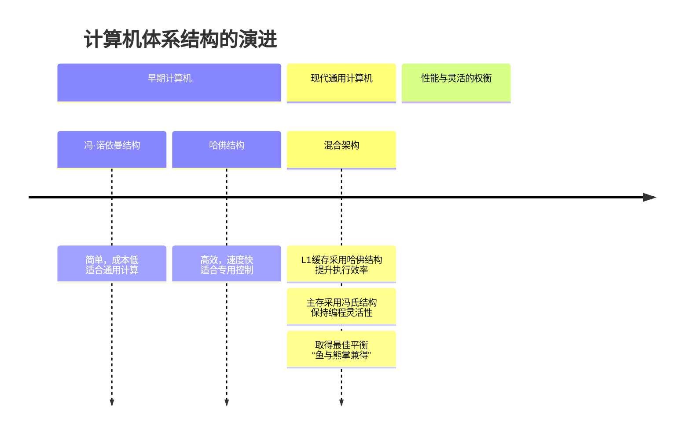

<think>
1. **拆解用户请求：**
    *   **第一部分：计算机体系结构：** 解释 CPU、Cache、存储设备、网卡等（还有其它吗？分别有哪些种类、功能，如何互相交互？）并解释如何和软件相互作用。
    *   **第二部分：客户端的 `io_uring`：** `io_uring` 在客户端（客户端应用）有可以用的地方吗？

2. **第一部分：计算机体系结构与软件交互：**
    *   *核心概念：* 计算机体系结构是硬件和软件之间的契约。它定义了各个部件如何连接和通信。
    *   *核心组件（扩展用户的列表）：*
        *   **CPU（中央处理器）：** 大脑。
            *   *种类：* CISC（x86）、RISC（ARM、RISC-V）、GPU（用于并行计算）。
            *   *功能：* 执行指令（取指、译码、执行、写回）。
        *   **Cache（L1, L2, L3）：** CPU 的短期记忆。
            *   *种类：* 指令/数据缓存（L1）、统一缓存（L2）、共享缓存（L3）。
            *   *功能：* 弥合高速 CPU 和慢速内存之间的速度鸿沟。空间局部性与时间局部性。
        *   **主存（RAM）：** 工作区。
            *   *种类：* DRAM（DDR4/5）、SRAM（Cache 内部）。
            *   *功能：* 存储运行中的操作系统和应用程序。
        *   **存储设备：** 持久化记忆。
            *   *种类：* HDD（机械）、SSD（NAND闪存，NVMe/SATA）、eMMC/UFS（移动端）。
            *   *功能：* 断电后长期保存数据。
        *   **网络接口卡（NIC）：** 通信枢纽。
            *   *种类：* 以太网卡（有线）、Wi-Fi 模块、蜂窝基带（5G/4G）。
            *   *功能：* 收发网络数据包。
        *   *其他关键组件（用户问到“还有其它吗？”）：*
            *   **总线/互连（PCIe, DDR, USB, I2C）：** 高速公路。
            *   **GPU（图形处理器）：** 专门负责并行图形/矩阵运算。
            *   **DMA（直接内存访问）控制器：** 对性能至关重要。允许设备在没有 CPU 的情况下直接与内存通信。
            *   **中断控制器（APIC/GIC）：** 硬件通知 CPU 的方式。
    *   *它们如何互相交互（数据流）：*
        *   CPU <-> Cache <-> 内存（通过内存总线）。
        *   CPU <-> PCIe 总线 <-> GPU/NIC/SSD。
        *   设备 <-> DMA <-> 内存 <-> CPU。
    *   *它们如何与软件相互作用（软硬件桥梁）：*
        *   **指令集架构（ISA）：** 软件编译成 CPU 能理解的机器码。
        *   **内存管理单元（MMU）与虚拟内存：** 操作系统将虚拟地址映射到物理地址。Page faults（缺页异常）。
        *   **设备驱动程序：** 软件到硬件的翻译官。将高层 API（如 `read()`）转化为特定的寄存器写操作。
        *   **中断与轮询：** 硬件向 CPU 发送中断，触发操作系统中的中断处理程序。
        *   **Cache 一致性：** 软件需要刷新/失效 Cache（例如，在 DMA 之前或跨核共享数据时），以避免读到陈旧数据。

3. **第二部分：客户端的 `io_uring`（特别关注音视频/移动端）：**
    *   *背景：* 用户之前询问过客户端音视频开发。`io_uring` 主要在服务器端使用，但客户端呢？
    *   *它能用吗？* 可以，但有限制。Android/Linux 桌面端使用 Linux 内核。iOS 使用 XNU（不支持 `io_uring`）。
    *   *在客户端的具体使用场景：*
        1.  **高帧率视频采集：** 从 V4L2 设备读取。批处理 `read()` 调用可减少延迟。
        2.  **本地媒体播放（大文件）：** 从 NVMe SSD 读取高码率视频（如 4K/8K）。避免在 I/O 期间阻塞主线程。
        3.  **游戏资产加载：** 异步流式传输纹理和模型，而不会导致卡顿。
        4.  **本地 P2P/边缘计算：** 客户端充当中继节点（如 WebTorrent 或边缘 CDN 节点）。
    *   *客户端的限制/挑战：*
        *   **功耗：** 忙轮询模式（SQPOLL/IOPOLL）会快速耗尽电池。在移动端应避免使用。
        *   **内核版本：** 需要 Linux 5.1+（最好是 5.10+）。Android 设备通常内核较旧，尽管较新的设备（Android 12/13+）可能支持它。
        *   **替代方案：** 在 Android 上，通常更倾向于使用特定于平台的 API（`MediaCodec`、`AImageReader`、`java.nio`），因为它们已经针对底层硬件（如 Ion/DMA-BUF）进行了优化。
    *   *结论：* 是的，在 Linux 桌面端和一些现代 Android 音视频应用中，对于本地文件 I/O 和 V4L2 采集很有用，但必须避免使用忙轮询模式，并检查内核支持情况。

4. **结构与语气：**
    *   保持专业、结构化且易于阅读的格式（使用 Markdown 表格和列表）。
    *   将硬件概念与之前讨论的软件/音视频概念联系起来。
    *   确保中文表达自然且技术术语准确。

5. **起草内容（迭代优化）：**
    *   *起草第一部分时的自我纠正：* 确保强调 DMA 和 MMU，因为它们是连接硬件和软件的桥梁。对于音视频开发者来说，DMA-BUF 是一个必须提及的概念。
    *   *起草第二部分时的自我纠正：* 区分 Linux 桌面客户端和 Android 客户端。强调在移动设备上避免使用 SQPOLL。

6. **最终打磨：** 对照用户的提示进行检查，确保所有部分（种类、功能、交互、软件相互作用、客户端 `io_uring`）都得到了完整解答。（准备生成输出）。
</think>这是一个非常宏大的问题，也是从“会用API的码农”向“系统级架构师”跃升必须跨越的认知鸿沟。理解计算机体系结构，本质上是理解数据在硬件之间如何以最高效的方式流动。

我们分两部分来解答。

---

### 第一部分：计算机体系结构、硬件种类与软件交互

现代计算机体系结构本质上是一个**分层的、通过总线连接的数据处理流水线**。除了你提到的 CPU、Cache、存储、网卡，还有内存（RAM）、GPU、以及至关重要的总线系统和控制器。

#### 1. 核心组件全览

| 组件 | 种类/分类 | 核心功能 | 交互方式（与谁连） |
| :--- | :--- | :--- | :--- |
| **CPU** | x86 (CISC), ARM/RISC-V (RISC), DSP | 执行指令、逻辑控制、数学运算。 | 通过总线读写内存/Cache；通过MMU管理虚拟内存。 |
| **Cache** | L1 (核心独享), L2 (核心独享/共享), L3 (全CPU共享) | 缓解CPU与内存之间的速度鸿沟（基于局部性原理）。 | CPU内部集成，对软件透明（但影响极大）。 |
| **内存 (RAM)** | DRAM (主存), SRAM (做Cache) | 存储运行中的操作系统、程序代码和数据。 | 通过**内存控制器**与CPU直连；通过DMA与外设交互。 |
| **存储设备** | HDD (机械), SSD (SATA/NVMe), eMMC/UFS (移动端) | 持久化存储数据，断电不丢失。 | 通过SATA/PCIe总线连接；现代NVMe直接走PCIe。 |
| **网卡 (NIC)** | 以太网卡, Wi-Fi模块, 蜂窝基带(4G/5G) | 负责网络数据的物理层和链路层收发。 | 通过PCIe/USB总线连接；通过DMA直接将数据写入内存。 |
| **GPU** | 独立显卡, 核显, NPU (AI加速器) | 大规模并行计算（图形渲染、矩阵运算）。 | 通过PCIe总线连接；拥有自己的显存(VRAM)。 |
| **总线/控制器** | PCIe, DDR, USB, I2C, DMA控制器 | 硬件之间的高速公路和数据搬运工。 | 连接所有上述组件。 |

#### 2. 硬件之间如何交互？（数据流的真实面貌）

初学者常以为“CPU负责搬运所有数据”，这是大错特错的。现代体系结构的核心设计思想是：**CPU只负责发号施令，数据搬运尽量由硬件自己干。**

**核心机制：DMA（直接内存访问）**
如果没有DMA，CPU要把硬盘数据读到内存，必须一个字节一个字节地循环读取，期间CPU被完全占死。有了DMA后：
1. CPU向DMA控制器下达指令：“把硬盘0x1000位置的数据，读到内存0x8000位置，读4KB”。
2. **CPU直接去干别的事了**。
3. DMA控制器接管总线，控制硬盘控制器和内存控制器，直接把数据搬过去。
4. 搬完后，DMA控制器向CPU发送一个**硬件中断**，告诉CPU“搞定了”。

**网卡收包的完整交互流程（经典案例）：**
1. 网线收到数据包，网卡（NIC）将其缓存在自己的板载RAM中。
2. 网卡通过DMA，直接将数据包写入物理内存中预分配好的**环形缓冲区**。
3. 数据写完后，网卡触发硬件中断。
4. CPU收到中断，暂停当前执行，运行内核的中断处理程序。
5. 内核将数据包打包成`sk_buff`，交给TCP/IP协议栈处理，最终放到Socket接收队列中。
6. 唤醒用户态的 `recv()` 调用。

#### 3. 软件如何与这些硬件相互作用？

软件和硬件的界限非常清晰，分为以下几个层次：

1. **指令集架构（ISA - 汇编层）**
   软件通过CPU指令集与CPU交互。例如 `MOV` 指令读写内存，`ADD` 做加法。
2. **内存映射 I/O（MMIO）**
   软件如何控制网卡/显卡？答案是把硬件寄存器映射到内存地址空间。比如CPU往物理地址 `0x40000000` 写一个32位整数，实际上不是写内存，而是直接配置了网卡的某个寄存器（比如“开始发送数据”）。
3. **驱动程序（内核态）**
   驱动是操作系统的底层组件，它知道如何通过MMIO操作特定硬件。比如Linux的 `e1000e` 网卡驱动，负责在内存中建立环形缓冲区，配置网卡的DMA寄存器。
4. **系统调用（用户态与内核态的桥梁）**
   普通软件不能直接碰硬件。你调用 `read(fd, buf, size)` 时：
   - 触发软中断（`syscall`），CPU从用户态切换到内核态。
   - 内核查找文件描述符 `fd` 对应的设备驱动。
   - 驱动程序启动硬件（如SSD）的DMA操作。
   - 操作系统挂起你的线程，调度其他线程。
   - DMA完成后硬件中断，内核把数据拷贝到你的 `buf` 中，唤醒你的线程。

**对音视频开发者的启示：**
为什么音视频开发极度关注 **dma-buf**？因为在Android/Linux中，摄像头采集的数据可以通过DMA直接写入一块特殊的内存，然后这块内存的物理地址可以直接传给GPU或硬件编码器，**全程零拷贝，CPU根本不碰像素数据**。这就是体系结构知识带来的性能优化极限。

---


好的，我们来深入剖析现代计算机体系结构中，各个硬件组件是如何交互的，以及这背后深刻的架构思想。你问到了最核心的问题：地址如何对应？总线如何组织？这直接关系到哈佛结构与冯诺依曼结构的根本区别。

---

### 第一部分：硬件交互的真相——地址空间与总线拓扑

你的直觉是对的：“所有都挂载到一个总线吗？”——**答案是否定的，现代计算机使用的是极其复杂的层次化总线系统。**

#### 1. 核心交互机制：地址空间映射

硬件交互的本质是 **CPU 对特定地址的读写操作**。这些地址被映射到不同的物理设备上。主要有两种方式：

**A. 内存映射 I/O（MMIO）**
- **原理**：将硬件设备（如网卡、GPU）的**控制寄存器**和**数据缓冲区**，映射到物理内存地址空间的一部分。
- **举例**：假设物理内存有 4GB 地址空间（0x00000000 - 0xFFFFFFFF）。系统可能将最顶部的 1GB（0xC0000000 - 0xFFFFFFFF）保留给硬件。
    - 地址 `0xC0000000` 可能映射到网卡的“发送命令寄存器”。
    - CPU 执行一条 `MOV [0xC0000000], 1` 的指令，这并非向内存写入数据，而是通过总线向网卡发出了“开始发送”的命令。
- **优点**：CPU 可以使用普通的加载/存储指令访问设备，无需特殊指令，简化了设计。

**B. 端口 I/O（PIO）**
- **原理**：为硬件设备提供一个独立的、与内存地址空间平行的 **I/O 地址空间**。CPU 需要使用专门的指令（如 x86 的 `IN` 和 `OUT`）来访问。
- **现状**：在现代系统（如 x86-64）中，MMIO 已成为主流，因为它更灵活，性能更高。PIO 多用于访问一些古老的、简单的设备（如 PS/2 键盘控制器）。

#### 2. 现代计算机的总线拓扑：不是一根总线，而是一个网络

下图清晰地展示了一个简化版的现代多核系统总线拓扑，它绝非所有设备挂在同一根总线上：

```mermaid
flowchart TD
    subgraph CPU Package
        subgraph Core 0
            L1D[L1 Data Cache]
            L1I[L1 Instruction Cache]
        end
        subgraph Core 1
            L1D2[L1 Data Cache]
            L1I2[L1 Instruction Cache]
        end
        L2[L2 Cache]
        L3[Shared L3 Cache]
    end

    MC[Memory Controller<br>集成于CPU内]
    MC -- DDR Memory Bus --> RAM[主存 (RAM)]

    CPU Package -- Internal Bus --> MC

    MC -- PCIe Root Complex --> PCIe[PCIe Switch]

    PCIe -- PCIe Lanes --> GPU[GPU]
    PCIe -- PCIe Lanes --> NIC[网卡 (NIC)]
    PCIe -- PCIe Lanes --> NVMe[NVMe SSD]

    SATA[SATA Controller] -- SATA Bus --> SATA_SSD[SATA SSD]
    USB[USB Controller] -- USB Bus --> USB_Dev[USB Device]
    PCIe -- PCIe Lanes --> PCH[平台控制器中枢（PCH）]
    PCH -- Internal Buses --> SATA
    PCH -- Internal Buses --> USB
```

**关键点解析：**
1.  **CPU 内部是哈佛结构**：注意看 Core 0 和 Core 1，它们的 **L1 指令 Cache** 和 **L1 数据 Cache** 是**分离**的。这是最典型的哈佛结构特征，允许在一个时钟周期内同时取指和取数。
2.  **核心与主存之间是冯·诺依曼结构**：当数据不在 Cache 中时，CPU 需要通过**统一的系统总线**（或内存控制器）访问主存（RAM）。在主存这个层级，**程序指令和数据是混合存放在一起的**，共用同一套地址总线和数据总线。
3.  **外设通过高速总线连接**：GPU、NVMe SSD、高速网卡等高性能设备通过 **PCIe** 这种点对点串行总线直接连接到 CPU 的内存控制器（或通过 PCIe 交换器）。这避免了所有外设争抢同一根总线，是性能的关键。
4.  **低速设备通过集线器连接**：SATA、USB 等速度相对较慢的设备，通常先连接到一个称为 **PCH（平台控制器中枢）** 的芯片组，PCH 再通过一条单独的通道（如 DMI）连接到 CPU。这类似于一个“树形”或“星形”网络，而不是“总线型”网络。

---

### 第二部分：哈佛 vs. 冯·诺依曼——现代计算机是混合体

这是一个非常普遍的误解。很多人问：“我的电脑是哪种结构？” **正确答案是：现代通用计算机是这两种结构的混合体，但以冯·诺依曼模型作为其编程模型。**

让我们从根本区别上进行分析：

| 特征 | 冯·诺依曼结构 (Von Neumann) | 哈佛结构 (Harvard) |
| :--- | :--- | :--- |
| **核心区别** | **单一存储空间**<br>程序指令和数据存放在**同一存储器**中，共享**同一套地址/数据总线**。 | **分离存储空间**<br>程序指令和数据存放在**两个独立的存储器**中，有**两套独立的地址/数据总线**。 |
| **总线瓶颈** | **存在“冯·诺依曼瓶颈”**<br>取指和取数不能同时进行，总线带宽成为性能瓶颈。`Fetch` 和 `Execute` 阶段串行。 | **无此瓶颈**<br>可同时取指和取数，总线带宽加倍，利于流水线操作，速度更快。 |
| **灵活性** | **高**<br>程序可以被当做数据来修改（自修改代码），存储器空间分配灵活。 | **低**<br>程序区通常为只读（如嵌入式系统中的ROM），不易修改。存储器大小固定。 |
| **硬件复杂度** | **低**<br>一套存储器接口，控制简单，成本低。 | **高**<br>两套存储器接口，控制复杂，成本高。 |
| **典型应用** | **通用计算机**（PC、服务器） | **微控制器**（单片机、DSP）、**CPU缓存** |

#### 为什么现代计算机是混合体？

1.  **底层（CPU内部）：哈佛结构占主导**
    - **L1 Cache 分离**：如流程图所示，现代CPU的L1缓存严格分为指令缓存(I-Cache)和数据缓存(D-Cache)。这是纯粹的哈佛结构，旨在最大化指令流水线的效率。
    - **执行阶段**：在指令执行阶段，CPU核心可以同时从I-Cache取指和从D-Cache存取数据，互不干扰。

2.  **顶层（主存及编程模型）：冯·诺依曼结构占主导**
    - **统一的主存**：在物理主存（RAM）层面，程序代码（`.text`段）和程序数据（`.data`, `.heap`, `.stack`段）是混合存放在同一片DRAM芯片中的。它们共享同一套内存地址空间。
    - **统一的视角**：从程序员和编译器的角度看，他们面对的是一个统一的线性内存地址空间。他们不需要关心指令和数据在物理上是否分开，这是硬件和操作系统抽象的结果。这使得编写通用软件（如一个可以动态加载代码的浏览器）成为可能。

**这种混合架构的演进历程与原因，可以通过下图清晰地展现：**



**总结一下交互流程（结合架构）：**

当一个程序运行时：
1.  **加载**：操作系统 loader 将程序的**代码段**和**数据段**从硬盘（冯·诺依曼式存储）加载到**统一的主存**（冯·诺依曼结构）中。
2.  **执行**：CPU 需要执行一条指令时：
    - 它通过**统一的系统总线**，将指令地址发往主存，读取指令内容。`(冯·诺依曼行为)`
    - 读取的指令被存入 **CPU 内部的 L1 I-Cache**。`(哈佛结构开始介入)`
    - CPU 核心从 **L1 I-Cache** 取指，同时，如果需要操作数据，可以从 **L1 D-Cache** 取数。`(纯粹的哈佛结构行为，并行发生)`
    - 如果数据不在 D-Cache 中，CPU 再通过**统一的系统总线**访问主存获取数据。`(冯·诺依曼行为)`
3.  **外设交互**：当指令涉及 I/O 操作（如从网卡读数据），CPU 通过 **MMIO** 方式，将针对特定内存地址的读写操作，经由 **PCIe 等总线**，路由到网卡设备上。

**结论：**
现代计算机的智慧在于 **“扬长避短”** 。在追求极致速度的 CPU 核心内部，采用哈佛结构；在需要灵活性和通用性的整个系统层面，维持冯·诺依曼的编程模型。这种混合架构成功地平衡了**效率**与**灵活性**这一对永恒的矛盾。理解这一点，对你优化软件（尤其是需要考虑 Cache 友好性的音视频处理代码）有至关重要的指导意义。


<think>
1.  **分析用户输入：**
    *   用户提供了一个 Mermaid 流程图，这是我之前回复中的一部分。
    *   没有附带其他文本或问题。
    *   这通常意味着以下几种情况之一：
        *   用户在测试渲染效果。
        *   用户在确认该图。
        *   用户不小心发送了。
        *   用户希望我基于此继续解释。
    *   由于提示词仅仅是该图，我应该确认它，也许可以完善解释或询问他们是否需要关于图中显示的特定部分的更多细节。

2.  **确定合适的回复策略：**
    *   确认收到图表。
    *   提供对该图所代表的拓扑结构的简明、高层次的总结，以强化理解。
    *   提出引导性问题，引导用户深入探讨图中的特定部分（例如，CPU如何通过PCIe路由到PCH，DMA如何在此拓扑中工作，或中断如何流动）。
    *   保持专业、系统架构师的基调。

3.  **起草回复（内心独白/尝试）：**
    *   *确认：* 你贴出了我们刚才讨论的现代计算机总线拓扑图。
    *   *总结：* 这张图非常直观地展示了现代计算机不再是“单总线”结构，而是以CPU为核心，通过内存控制器（MC）和PCIe根复合体向外辐射的“树状/星状”网络。
    *   *突出关键路径：*
        *   高速设备（GPU、NVMe、NIC）直接挂在PCIe Switch下，享受极高带宽和低延迟。
        *   低速设备（USB、SATA）挂在PCH下，PCH再通过DMI（图中体现为PCIe Lanes，实际通常为DMI/OPI）与CPU通信。
        *   内存（RAM）独享DDR总线，直接连CPU内的MC。
    *   *引导下一步：* 结合这张图，你想深入了解哪一块的交互细节？比如：
        1. **DMA在这个拓扑里是怎么走的？** （比如网卡收包，数据是如何不经过CPU直接进内存的？）
        2. **中断（IRQ）在这个拓扑里是怎么传递的？** （外设完成操作后，如何打断CPU？）
        3. **PCH（南桥）的具体作用？** 为什么要把低速设备集中起来？
        4. **多核CPU之间是如何通过总线（如Ring Bus/Mesh）交互的？**

4.  **润色回复（中文）：**
    确保语气与之前的专家人设相匹配。使其清晰且结构化。

    "你贴出的这张图，正是现代计算机（尤其是x86和高端ARM）最典型的**层次化总线拓扑结构**。

    从这张图中，我们可以清晰地看到几个关键的架构设计思想：

    1. **非对称的连接方式**：高速设备（GPU、NVMe、NIC）直接与CPU内的PCIe Root Complex相连，获取最大的带宽和最低的延迟；而低速设备（USB、SATA）则被降级，连接到PCH（南桥）上，PCH再汇总后与CPU通信。这避免了低速设备拖慢高速总线。
    2. **内存直连**：RAM通过专用的DDR总线直接连在CPU内部的Memory Controller上，因为CPU对内存的访问是最频繁、对延迟最敏感的。
    3. **哈佛与冯诺依曼的融合**：在Core内部（L1I/L1D分离）是哈佛结构，而在RAM层面是冯诺依曼结构（统一编址）。

    结合这张架构图，你希望我们接下来深入探讨哪个具体的交互机制？比如：
    - **DMA路径**：网卡收到数据后，如何在这张图里找到内存的路径，并直接把数据写进去？
    - **中断路径**：硬盘读完数据，硬件中断信号是如何顺着这张图反向传递给CPU的？
    - **缓存一致性（Cache Coherence）**：Core 0修改了L2的数据，Core 1怎么知道自己的L1数据过期了？（涉及MESI协议和Ring Bus/Mesh）
    - 或者你对图中的某个具体组件（如PCH、PCIe Switch）还有疑问？"

5.  **最终润色：** 看起来不错。它确认了用户的输入，提供了附加价值，并提供了符合逻辑的后续步骤。
</think>你贴出的这张图，正是现代计算机（尤其是 x86 和高端 ARM 平台）最典型的**层次化总线拓扑结构图**。

从这张图中，我们可以清晰地看到现代硬件设计的几个核心思想：

1. **非对称的连接方式（高速与低速隔离）**：GPU、NVMe SSD 和高速网卡等需要极大带宽的设备，直接挂载在靠近 CPU 的 PCIe Root Complex 上；而 USB、SATA 等低速设备则被下沉到 PCH（南桥）中集中管理。这避免了低速设备拖慢整个系统的总线频率。
2. **内存直连与专享带宽**：主存（RAM）通过专用的 DDR 总线直接连在 CPU 内部的内存控制器上，不与其他设备争抢总线，因为 CPU 对内存的延迟最为敏感。
3. **哈佛与冯·诺依曼的融合**：在 Core 内部，L1 指令缓存和 L1 数据缓存是分离的（哈佛结构）；而出了 CPU 核心到达 L3 和 RAM 时，指令和数据又混合在一起统一寻址（冯·诺依曼结构）。

结合这张架构图，你希望我们接下来深入探讨哪个具体的交互机制？我可以为你详细拆解以下几个方向中的一个或多个：

*   **方向一：DMA 数据流的完整路径**。例如，网卡收到数据包后，如何在这张图里找到一条“绕过 CPU 核心”的路径，直接把数据写进 RAM 的某个地址？
*   **方向二：中断信号的逆向传递**。硬件设备（如 NVMe SSD）完成任务后，中断信号是如何顺着 PCIe 总线，跨越 PCH/Root Complex，最终精准找到并打断 Core 0 或 Core 1 的执行的？
*   **方向三：缓存一致性协议（MESI）在多核间的交互**。如果 Core 0 的 L1D 修改了某个变量，Core 1 的 L1D 如何通过底层的环形总线或 Mesh 网络得知自己的缓存已过期？
*   **方向四：MMIO 地址路由的具体过程**。CPU 执行一条写网卡寄存器的指令时，这个内存地址是如何被内存控制器识别为“不发给 RAM，而是转发给 PCIe Switch”的？

你可以直接告诉我你最感兴趣的部分。

