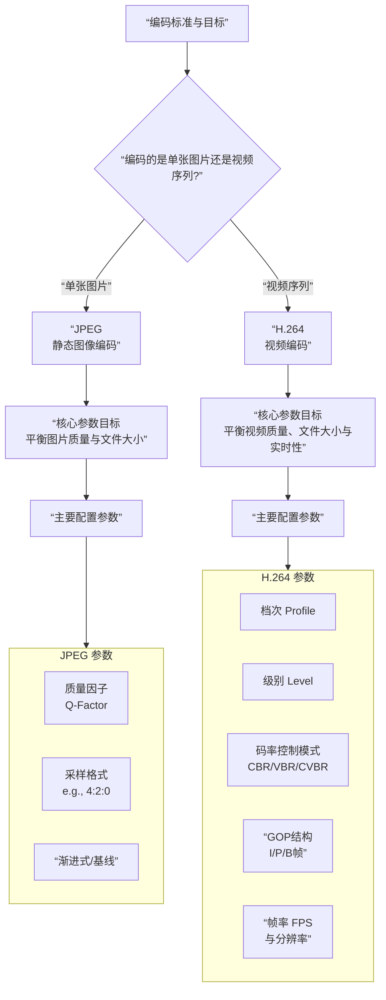
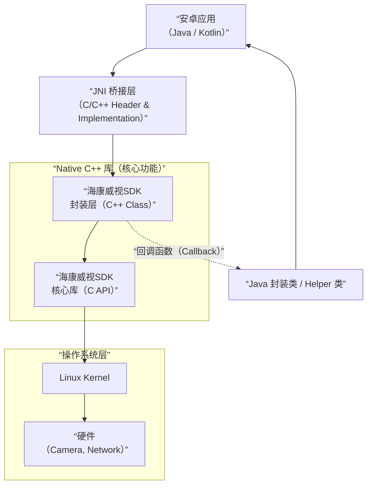
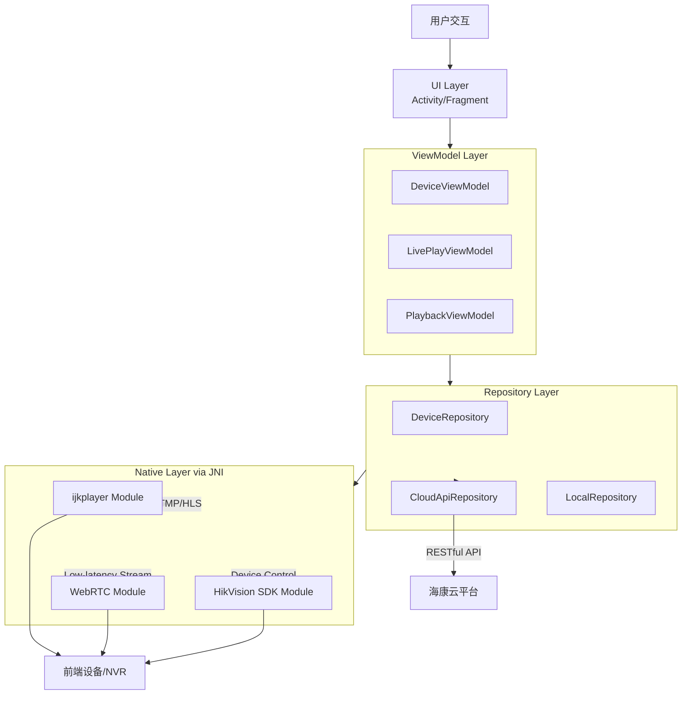
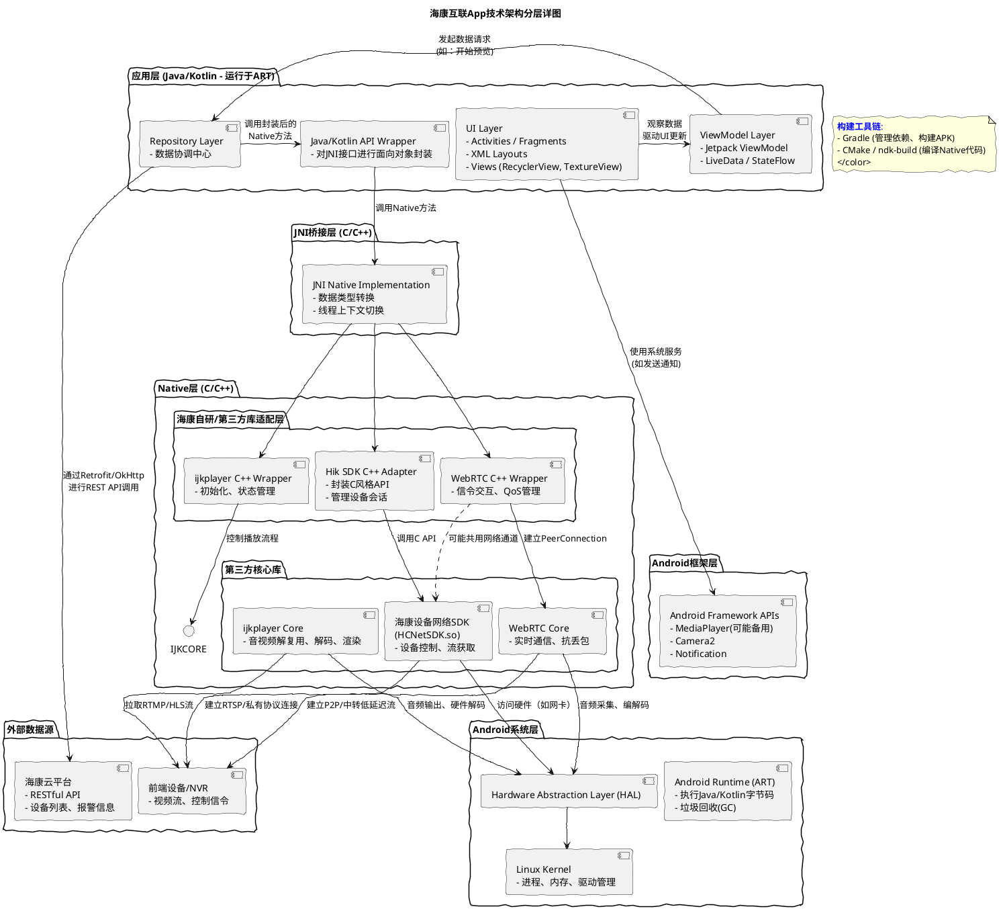

1.jpeg和h264参数配置有哪些不同；2.安卓调用底层c++库开发有哪些分层？


<think>
---


</think>好的，我们来详细解答这两个技术问题。

### 1. JPEG 和 H.264 参数配置的不同

JPEG 和 H.264 是两种用途完全不同的编码标准，因此它们的核心参数也截然不同。JPEG 用于压缩单张图片，而 H.264 用于压缩视频序列。

为了让您更直观地理解两者参数配置的差异，下图展示了它们不同的配置维度：



#### JPEG 参数配置（关注单张图片）

JPEG 的参数相对简单，核心是平衡**图片质量**和**文件大小**。

1.  **质量因子（Quality Factor / Q-Factor）**：
    - **这是最重要的参数**，通常范围是 1-100 或 0-95。
    - **值越高**：图片质量越好，细节保留越完整，但文件体积越大。
    - **值越低**：压缩率越高，文件体积越小，但会引入更多的块状模糊（块效应）。
    - **常用值**：Web图片常用 70-85，在质量和大小间取得良好平衡。

2.  **采样格式（Chroma Subsampling）**：
    - 由于人眼对亮度比对颜色更敏感，JPEG 允许对色彩信息进行降采样来节省空间。
    - **4:4:4**：无降采样，色彩信息完全保留，质量最高，文件最大。
    - **4:2:2**：水平方向色彩信息减半。
    - **4:2:0（最常用）**：水平和垂直方向的色彩信息都减半，能显著减小文件体积，且视觉质量损失不易察觉。

3.  **渐进式 vs 基线**：
    - **基线**：图片从上到下逐行加载显示。
    - **渐进式**：图片先以低质量模糊显示全图，然后逐渐变清晰。更适合网络浏览体验，但编码稍复杂。

#### H.264 参数配置（关注视频序列）

H.264 的参数复杂得多，因为它需要在**视频质量、码率（文件大小/带宽）、编码延迟和计算复杂度**之间进行多维度的权衡。

1.  **档次（Profile）**：
    - 定义了一组编码工具和算法集合。高档次能提供更好的压缩率，但需要更复杂的编解码器支持。
    - **Baseline Profile**：压缩率较低，但容错性好，编码复杂度低，适合视频会议、移动端实时通信。
    - **Main Profile**：引入了隔行扫描、B帧等，压缩率比Baseline高，曾是标清电视和DVD的主流。
    - **High Profile（最常用）**：在Main基础上增加了更多高级压缩工具，压缩率最高，是高清视频（Blu-ray, 网络视频）的绝对主流。

2.  **级别（Level）**：
    - 规定了在特定档次下，解码器的性能要求上限，如**最大分辨率、帧率、码率**等。
    - 例如，Level 4.2 支持最高 2048x1024 分辨率下的 60fps，最大码率 50 Mbps。
    - **配置时，需要根据目标分辨率和帧率选择合适的级别。**

3.  **码率控制模式（Rate Control）**：
    - **CBR（固定码率）**：无论画面复杂与否，码率基本恒定。优点是网络带宽稳定可控，缺点是复杂场景质量差，简单场景浪费码率。适合直播等带宽受限场景。
    - **VBR（可变码率）**：根据画面复杂度分配码率，复杂画面给高码率，简单画面给低码率。优点是在相同平均码率下，整体视频质量比CBR更高。适合视频点播、存储。
    - **CVBR（约束可变码率）**：VBR的增强版，在保证VBR质量优势的同时，对码率波动范围进行限制，避免出现极高的峰值码率。

4.  **GOP结构（Group of Pictures）**：
    - **GOP大小**：两个I帧之间的间隔。GOP越大，压缩率越高（因为P/B帧更多），但随机访问（拖拽进度条）的延迟越大，且错误恢复能力越差。
    - **I帧（关键帧）**：自包含的完整帧，可独立解码。是随机访问和错误恢复的锚点。
    - **P帧（预测帧）**：参考前面的I帧或P帧进行编码，压缩率高于I帧。
    - **B帧（双向预测帧）**：参考前后帧进行编码，压缩率最高，但会增加编码延迟和复杂度。

5.  **帧率（FPS）和分辨率**：
    - 这俩决定了视频的原始数据量。分辨率越高、帧率越高，所需的码率也越高。

---

### 2. 安卓调用底层 C++ 库的开发分层

在安卓应用中集成 C++ 库（例如海康威视的设备网络SDK）是典型的多层开发生态。其核心是 **Java/Kotlin 上层应用** 通过 **JNI（Java Native Interface）** 桥接层调用 **C/C++ 原生库**。

下图清晰地展示了安卓调用C++库的完整分层架构：



#### 具体分层解析（从上到下）

**第 1 层：Java/Kotlin 应用层（UI & 业务逻辑）**
- **技术**：Android SDK, Jetpack Components (ViewModel, LiveData) 等。
- **职责**：
    - 用户界面（UI）的绘制和交互。
    - 应用业务流程的控制（如登录、预览、回放、配置的按钮点击逻辑）。
    - **不直接调用C++库，而是调用自己编写的Java封装类。**

**第 2 层：Java 封装层（Optional，但强烈推荐）**
- **技术**：纯 Java/Kotlin 类。
- **职责**：
    - 对JNI层进行面向对象的封装，提供更友好、更安全的Java API给应用层。
    - 例如，提供一个 `DeviceManager` 类，内部封装了JNI的 `native_login`、`native_logout` 等方法。
    - 处理从C++层通过JNI回调上来的数据（如报警信息、视频流数据），并将其转换为应用层易于使用的格式（如转换为LiveData）。

**第 3 层：JNI（Java Native Interface）桥接层**
- **这是连接Java世界和Native世界的关键桥梁。**
- **JNI接口声明**：在Java类中用 `native` 关键字声明方法，如 `private native static int native_login(String ip, int port, String user, String pwd);`。
- **JNI实现（C/C++代码）**：
    - 使用 `javah` 或 `javac -h` 命令根据Java声明的native方法自动生成C/C++的头文件（.h）。
    - 编写对应的C/C++源文件（.cpp），实现头文件中的函数。
    - **在此层进行数据类型的转换**：将Java的 `String`, `Array` 等类型转换为C/C++的 `char*`, `int[]` 等，反之亦然。

**第 4 层：C++ 封装适配层（Optional，但非常必要）**
- **技术**：纯 C++ 类。
- **职责**：
    - 对底层C风格的SDK API进行面向对象的C++封装，简化调用。例如，将 `NET_DVR_Login_V40`, `NET_DVR_Logout` 等C函数封装到一个 `HikDevice` C++类中。
    - 管理SDK初始化和清理等生命周期。
    - 处理SDK的回调（Callback），并将其传递给JNI层。这是开发中的难点和重点。

**第 5 层：第三方 C/C++ 原生库（核心功能）**
- **这就是您要调用的底层库**，例如海康威视提供的 `HCNetSDK.so`（Linux动态库）。
- **通常是以C语言API形式提供**（.h头文件和.so库文件）。
- **职责**：实现所有核心功能，如网络通信、流媒体处理、设备控制等。

**第 6 层：Linux 内核及硬件层**
- 最底层，包括安卓的Linux内核、设备驱动（如摄像头驱动、网络驱动）和硬件本身。

#### 开发关键点
- **构建工具**：使用 **CMake** 或 **ndk-build** 来编译C/C++代码，并生成最终的.so库文件。
- **线程管理**：SDK的回调通常发生在Native线程，需要安全地将数据传递到Java的主线程（UI线程）进行更新。
- **内存管理**：JNI层容易引发内存泄漏，需要仔细管理Native内存和Java对象的引用。

这种分层设计确保了应用的稳定性、可维护性，并充分发挥了C++库的高性能优势。


应该还有上层UI层和安卓虚拟机吧，分别是在哪一层，如何交互？海康互联是如何实现的，包括ijkplayer模块和webrtc模块吗，还有哪些涉及和框架？

<think>
---

['{"webPages": [{"name": "为什么安卓不放弃虚拟机机制,转变更高效的方式,例如ios一样? - 老衲法号唐三藏的回答 - 头条问答", "summary": "所有人都没回答到点子上,安卓之所以要弄个虚拟层最主要目的是避免gpl协议污染,如果没有隔离层,所有软件都要开放源代码,这是绝大多数软件厂商不愿意的,比如office,抖音,头条等等软件 5 1 收藏 分享 转发到头条 复制链接 微信 新浪微博 QQ空间 举报 光明右使8787 关注 那不就是Linux手机?很多厂商做过,不了了之。安卓要不是傍上JAVA,也不会有如今的局面。JAVA开发者比C/C++多太多了。WP就死在这上面。IOS要不是有硬件支撑,也早死了。 安卓起初的时候是要做一套跨平台的移动系统,事实上以前也出现过X86和MIPS的手机,只不过后来被ARM一统天下,才会让人觉得这个JVM是个累赘。 195 97 收藏 分享 转发到头条 复制链接 微信 新浪微博 QQ空间 举报 陈莫 关注 这两款系统使用的开发语言不同。 安卓系统的底层建立在Linux系统上。采用的是虚拟机运行机制。 IOS是基于UNIX系统,IOS采用的是沙盒运行机制。 两者后台制度也不同。IOS中任何第三方程序都不能在后台运行。安卓中任何程序都能在后台运行,直到没有内存才会关闭。 所以安卓为了保证能流畅运行。不得不把内存提的更高。才能稳定流畅运行。就像目前市面上苹果4G的运行内存非常流畅。然而安卓已经达到6G,8G甚至12G的运行内存了。 安卓在运行内存足够的情况下,与系统的UI优化。流畅性相当的高。运行处理,操作速度已经与苹果iOS系统相差无几。甚至有些方面已经超越了苹果iOS系统。 136 270 收藏 分享 转发到头条 复制链接 微信 新浪微博 QQ空间 举报 云在蓝天8480 关注 这个问题的答案我前面有一篇关于三星销量全球第一的文章中曾经提到过,这里我再说一下。 在正式说这个事之前,让我们回忆华为被谷歌关闭GMS事件。可能绝大部份看官对GMS是什么都不清楚,但引发的后果很多人还是很清楚的,", "url": "https://www.toutiao.com/answer/6866001584657219843/"}, {"name": "市场上VR一体机的VR操作系统界面是基于什么开发的?_知乎", "summary": "5 个回答 默认排序 高通XR大使~曾任英特尔AR/VR大使,AMD VR顾问  关注 4 人 赞同了该回答 有的一体机进入系统后,只是一个2D环绕的界面,这应该是基于安卓GUI系统研发的。 有的一体机进入系统后,是一个3D立体360度的场景,这应该是基于Unity或Unreal等3D引擎研发的。 系统启动时会启动相应的UI程序(2D/3D)。  赞同 4   添加评论  分享  收藏  喜欢 收起  计算机视觉/PicoVR  关注 有用Unity的,也有直接用OpenGL的  赞同   3 条评论  分享  收藏  喜欢 收起  VR/AR行业媒体  关注 1 人 赞同了该回答 你把它想象成是一个平板的方案就好了 现在的VR一体机一般都是用的移动的方案,比较好的用高通的处理器,其他打低价策略的用RK、全志这些;里面的系统也几乎都是安卓; 不排除之后会有使用intel方案的win系统移动端一体机出现,只是目前暂时还没有。  赞同 1   1 条评论  分享  收藏  喜欢 收起  已认证帐号  关注 6 人 赞同了该回答 谢邀。 一体机大部分也是采用安卓,Linux或者win系统的设备。如果是基于这些系统的设备,VR应用仍然可以用U3D,Unreal去开发。 题主问的操作界面的话,其实方式很多种,比如使用U3D作为引擎,UI界面可以再U3D中实现,也可以是U3D和安卓或者别的底层交户后,在安卓或者相应的平台上开发,只需要做的是这个平台和U3D的交互,相互调用即可。  赞同 6   添加评论  分享  收藏  喜欢 收起  VR看世界,世界大不同。身体或内心总有一个去到远方。  关注 操作系统(英语:Operating System,缩写:OS)是我们使用计算机接触过的第一个软件,是软件中的王者荣耀。我们不是直接控制计算机或者手机,因为计算机听不懂我们人类的语言。我们可以通", "url": "https://www.zhihu.com/question/265024189"}, {"name": "虚拟机与Framework及高阶技术面试题及跨进程通讯_虚拟机高阶-CSDN博客", "summary": "本文详细探讨了Android\\nFramework层,包括系统架构、开机过程、应用启动流程、安装过程以及Context的理解。此外,还涉及虚拟机相关知识,如Java垃圾回收机制、JVM与Dalvik、ART虚拟机的差异,以及PathClassLoader与DexClassLoader的区别。最后,文章介绍了高阶技术如热修复和插件化的原理,并讲解了Android中跨进程通讯的方式、Binder机制和AIDL的概念及其应用场景。", "url": "https://gonglipeng.blog.csdn.net/article/details/123820884"}, {"name": "Android四层体系架构", "summary": "Application应用层\\n  应用是用Java语言编写的运行在虚拟机上的程序,即图中最上层的蓝色部分.手机的上层应用其实,Google最开始时就在Android系统中捆绑了一些核心应用比如e-mail客户端、SMS短消息程序、日历、地图、浏览器、联系人管理程序,等等。\\nApplication FrameWork应用框架层\\n  这一层即是编写Google发布的核心应用时所使用的API框架,开发人员同样可以使用这些框架来开发自己的应用,这样便简化了程序开发的架构设计,但是必须遵守其框架的开发原则,组件如下:\\n  丰富而又可扩展的视图(Views):可以用来构建应用程序,它包括列表(lists)、网格(grids)、文本框(text boxes)、按钮(buttons), 甚至可嵌入的Web浏览器。\\n  内容提供器(Content Providers):它可以让一个应用访问另一个应用的数据(如联系人数据库),或共享它们自己的数据\\n  资源管理器(Resource Manager):提供非代码资源的访问,如本地字符串、图形、和布局文件(layout files)。\\n  通知管理器 (Notification Manager):应用可以在状态栏中显示自定义的提示信息。\\n  活动管理器(Activity Manager):用来管理应用程序生命周期并提供常用的导航退回功能。\\n  窗口管理器(Window Manager):管理所有的窗口程序。\\n  包管 理 器(Package Manager):Android系统内的程序管理\\n   电话管理器(Telephony Manager) :主要提供Telephony相关信息的查询/修改功能,以及Phone状态监听功能,封装的方法主要是提供给APP上层使用。 \\n  定位管理器(Location Manager):获取经纬度及定位过程\\n  \\n在", "url": "https://www.cnblogs.com/loaderman/articles/6430421.html"}, {"name": "安卓的系统架构(安卓系统架构分几层)-app开发者内容-FinClip", "summary": "本篇文章给大家谈谈安卓的系统架构,以及安卓系统架构分几层对应的知识点,希望对各位有所帮助,不要忘了收藏本站喔。今天给各位分享安卓的系统架构的知识,其中也会对安卓系统架构分几层进行解释,如果能碰巧解决你现在面临的问题,别忘了关注本站,现在开始吧! 本文目录一览: 为什么说安卓是虚拟机 因为其基于Linux的自由及开放源代码的操作系统。 Android的系统架构和其操作系统一样 安卓的系统架构 ,采用了分层的架构。从架构图看 安卓的系统架构 ,Android分为四个层 安卓的系统架构 ,从高层到低层分别是应用程序层、应用程序框架层、系统运行库层和Linux内核层。开发人员也可以完全访问核心应用程序所使用的API框架。 Android为运行于Linux kernel之上 安卓的系统架构 ,但并不是GNU/Linux。因为在GNU/Linux 里支持的功能,Android 大都没有支持,包括Cairo、X11、Alsa、FFmpeg、GTK、Pango及Glibc等都被移除掉了。 扩展资料 安卓的系统架构 : 虚拟机的系统特点: 1、虚拟化技术有操作系统中内存的虚拟化,实际运行时用户需要的内存空间可能远远大于物理机器的内存大小,利用内存的虚拟化技术,用户可以将一部分硬盘虚拟化为内存。 2、 虚拟机为虚拟机技术的核心,它是一层位于操作系统和计算机硬件之间的代码,用来将硬件平台分割成多个虚拟机。 3、VMM 运行在特权模式,主要作用是隔离并且管理上层运行的多个虚拟机,仲裁它们对底层硬件的访问,并为每个客户操作系统虚拟一套独立于实际硬件的虚拟硬件环境(包括处理器,内存,I/O 设备)。 参考资料来源:百度百科-Android 安卓大部分架构是华为 你问的是安卓大部分架构是华为研发的吗?不是。 安卓系统是美国谷歌公司研发的一款操作系统,不是华为研发的。 安卓的系统架构采用分层架构的思想,架", "url": "https://www.finclip.com/news/f/54734.html"}, {"name": "深入理解Android虚拟机及编译系统 - 知乎", "summary": "[版权申明]非商业目的注明出处可自由转载 出自:shusheng007 概述 做Android开发前后也有几年了,多数时候还是在写业务代码,很少去研究总结一下基础的东西。然而基础知识才是程序员技术及发展潜力的试金石,根基打牢了,搞啥都快。 今天心中突然有个疑问:一个App从源代码到安装文件,再到安装到设备上,最后呈现在用户面前,这期间都经历了什么?我发现自己不能完全而清楚的知晓其中的细节,于是就去调查了一下,总结在这篇文章里。提前打个招呼,本文具有一定的技术难度和广度,所以需要你具有相当的技术基础来阅读,当然我会尽力使用最容易理解的方式去叙述,这也是咱的一贯作风,绝不能丢。一篇博文再牛逼,别人都看不懂,意义也不大,毕竟我写的不是科研文章。 本文会涉及到如下几个方面: JVM与Android的关系 Java字节码基础 Android虚拟机,Dalvik与ART Android构建系统 Android编译器 App运行原理,理解AOT、JIT、Dex 等相关术语 虚拟机技术 CPU 与JVM 本文读者应该都知道,我们开发的程序是运行在设备的CPU上的,然而我们世界是多样性的,CPU也不例外。现实中存在各种架构的CPU,例如 ARM, Arm64, x86, x64, MIPS ,架构不同那么CPU的指令及执行方式也就不同。而我们总是希望我们的程序可以运行在各种CPU上,你的App总不能因为小米和华为手机使用了不同架构的CUP就二选一吧? 那这个问题怎么解决呢? 最常用的方式就是针对不同的CPU架构,将程序编译为对应CPU的机器码文件。例如你有一款App要同时支持ARM和x86架构的手机,那么你就要为这两种手机各编译一个安装包,而且他们之间不能互换。 而等到类似于Java这种虚拟机语言出现后,人们就多了一个选择。在程序和硬件设备之间增加了一个虚拟层,让程序运行在虚拟层里,虚拟层运", "url": "https://zhuanlan.zhihu.com/p/95626955?utm_id=0"}, {"name": "漫说 | 回首十年历程,欣赏安卓式“magic”_澎湃号·湃客_澎湃新闻-The Paper", "summary": "全叔叨叨叨:       安卓系统的运转并不是只有虚拟机,我们可以简单的把它看做Linux内核+虚拟机,Linux系统是安卓系统的基础,也是一款全世界免费使用和修改的一款操作系统,而且它的自由发挥空间比安卓还要大,全世界有几千个版本。但它并不能处理应用,只能负责内存、驱动和硬件的管理,所以安卓就是在Linux之上建立的。我们可以把它们的关系看成一个金字塔,上层是安卓自己编写的JAVA语言的系统,负责与应用程序打交道,虚拟机也在这里,下面就是Linux,二者结合才是完整的安卓系统。", "url": "https://www.thepaper.cn/newsDetail_forward_2730768"}, {"name": "为什么 Android 上面应用的滑动不像 iOS 那样流畅?是因为虚拟机吗?_知乎", "summary": "假如谷歌对JAVA虚拟机进行优化的话,能不能达到IOS那样的高度? 比如IP4和I9000 显示全部  关注者 59 被浏览 14,547 关注问题  写回答  邀请回答  好问题  添加评论  分享 7 个回答 默认排序 已逃离游戏行业  关注 7 人 赞同了该回答 最重要的原因应该是优先级不同。IOS注重前台操控,Android注重多任务处理。 iOS对屏幕反应的优先级是最高的,它的响应顺序依次为Touch–Media–Service–Core架构,换句话说当用户只要触摸接触了屏幕之后,系统就会最优先去处理屏幕显示也就是Touch这个层级,然后才是媒体(Media),服务(Service)以及Core架构。而Android系统的优先级响应层级则是Application–Framework–Library–Kernal架构,和显示相关的图形图像处理这一部分属于Library,你可以看到到第三位才是它,当你触摸屏幕之后Android系统首先会激活应用,框架然后才是屏幕最后是核心架构。  赞同 7   添加评论  分享  收藏  喜欢 收起  物竞入门菜鸡,段子手,冷耍粉。  关注 ios努力把动画变的好看,安卓努力把系统负优化,android则是三好学生全方面发展  赞同   4 条评论  分享  收藏  喜欢 收起  匿名用户 4 人 赞同了该回答 IOS有Core Animation,具备缓存的功能,而安卓的是靠CPU, 安卓的硬件低端的话,会卡机很严重。  赞同 4   添加评论  分享  收藏  喜欢 收起  2 人 赞同了该回答 感觉言之有理啊。补充一点: 也与算法相关吧,感觉滑动爽,也与视觉反馈有关,所以绘制时,要用人感觉最爽的方式去处理。  赞同 2   添加评论  分享  收藏  喜欢 收起  匿名用户 谷歌的黄油计划已经让4.1非常的流畅了 除非是高速相机", "url": "https://www.zhihu.com/question/19818169"}, {"name": "南开大学21秋《手机应用软件设计与实现》平时作业2-001答案参考57 - 豆丁网", "summary": "\ue50a2022-05-17 \ue50b\ue50a上传 \ue50b南开大学21秋《手机应用软件设计与实现》平时作业2-001答案参考以下哪个是Android采用的虚拟机?(A.LinuxB.JVMC.ARTD.NDK参考答案:CA.正确B.错误参考答案:A对于XML布局文件中的视图控件,layout_width属性的属性值以下哪个符A.match_parentB.wrap_parentC.wrap_heightD.match_content参考答案:A以下属于MediaRecorder类生命周期状态的有(A.InitialB.PreparedC.CreateD.Cancel参考答案:AB开发android程序需要的开发工具和开发包包括(A.JDKB.EclipseC.AndroidSDKD.ADTE.Raw参考答案:ABCDA.Activity是Android应用程序的界面,负责与用户进行交互B.Service是Android应用程序的后台线程,可以有界面,不与用户交互C.Intent既不是Android应用程序的界面,也不是后台线程,Intent是执行某操作的一个抽象描述D.Intent是Android应用程序的界面参考答案:BD在Activity中,如何获取Service对象?(A.可以通过直接实例化得到B.可以通过绑定得到C.通过startService(D.通过getService()获取参考答案:D传感器的可用性不但在不同硬件之间有变化,而且不同的Android版本之间也可能有变化,这是因为(A.原始数据的丢失B.系统调用方法的错误C.Android传感器的引入需要有几个平台Release的过程D.传感器可用性的多变性参考答案:C下列哪一个选项不属于Android中预定义的布局方式?(A.TabLayoutB.RelativeLayoutC.FrameLayoutD.LinearLayout参", "url": "https://www.docin.com/p-3304252462.html"}, {"name": "ios虚拟机安卓版_mob64ca12f3f05d的技术博客_51CTO博客", "summary": "©著作权归作者所有:来自51CTO博客作者mob64ca12f3f05d的原创作品,请联系作者获取转载授权,否则将追究法律责任 iOS 虚拟机与 Android 的结合:一场技术之旅 随着手机操作系统的不断发展,iOS 和Android 逐渐成为两大主流平台。然而,两者之间的兼容性问题一直是开发者和用户关心的焦点。本文将探讨如何使用虚拟机技术在 Android 手机上运行 iOS 应用,并给出一些代码示例来帮助理解这种技术的实现。 什么是虚拟机? 虚拟机(VM)是一种软件程序,它可以模拟计算机硬件,允许多个操作系统在同一台计算机上共存。通过创建一个虚拟环境,虚拟机使得用户可以运行不同于主机系统的操作系统。例如,开发者可以在 Windows 系统上运行 Linux,或在 Android 系统上模拟 iOS 系统。 为什么在 Android 上运行 iOS 应用? 平台兼容性 : iOS 和Android 之间的应用生态系统并不互通。通过在 Android 上运行 iOS 应用,可以增加应用的可访问性。 开发测试 : 开发者可以在不同平台上进行测试,以确保其应用在各种设备上的表现。 用户体验 : 用户可以访问那些只在 iOS 上可用的应用,无需购买 Apple 设备。 实现 iOS 虚拟机的基本思路 在Android 手机上运行 iOS 应用,基本的思路是: 模拟 iOS 的ARM 架构。 让iOS 应用在模拟的环境中运行。 为了实现上述目标,我们需要一些核心组件,如VirtualBox、QEMU 等开源虚拟机技术。下面是一个简单的 QEMU 虚拟机设置示例: QEMU 基本安装示例 # 更新系统sudo apt-get update# 安装 QEMUsudo apt-get install qemu-kvm libvirt-daemon-system libvirt-clie", "url": "https://blog.51cto.com/u_16213446/12251850"}], "images": [{"url": "https://i-operation.csdnimg.cn/images/a7311a21245d4888a669ca3155f1f4e5.png"}, {"url": "https://images2015.cnblogs.com/blog/1100100/201702/1100100-20170222182521241-1497691272.jpg"}, {"url": "https://static.jiasou.cc/images/20230227/bdlgsypj2rir3n21ot2sqo5c9iq0qxv6.png"}, {"url": "https://pic3.zhimg.com/v2-872ebb98697ae2ee2f6cbaeeea24b12a_r.jpg"}]}', '{"webPages": [{"name": "基于鸿蒙API10的RTSP播放器(一:基本界面的实现)_鸿蒙 ijkplayer-CSDN博客", "summary": "ijkplayer简介:\\nijkplayer\\n本身是一个开源的\\nAndroid\\n媒体播放库,它主要用于播放视频和音频文件,现在已有前辈将其引入到鸿蒙当中,通过XComponent组件完成适配。向开源致敬!\\n支持格式:\\n它支持多种格式,包括\\nMP4、M3U8、FLV\\n等,并且具有高性能和低功耗的特点。ijkplayer\\n基于\\nFFmpeg\\n进行开发,通过\\nJNI\\n技术将\\nFFmpeg\\n的功能封装在\\nJava\\n代码中,从而实现了对\\nFFmpeg\\n的高效调用。\\nijkplayer\\n的关键特点:\\n高性能:ijkplayer\\n利用\\nFFmpeg\\n的强大功能,能够快速、高效地播放视频和音频文件。低功耗:与一些其他播放器相比,ijkplayer\\n在播放过程中消耗的电量较少,更适合长时间使用的场景。丰富的格式支持:ijkplayer\\n支持多种视频和音频格式,包括但不限于\\nMP4、M3U8、FLV\\n等。自定义配置:开发者可以根据需要自定义播放器的各种参数,如音量、播放速度、视频宽高比等。丰富的监听器:ijkplayer\\n提供了一系列的监听器,如\\nOnPreparedListener、OnCompletionListener\\n等,方便开发者监听播放过程中的各种事件。支持硬解码:在一些硬件设备上,ijkplayer\\n能够利用硬件加速器进行视频解码,从而提高播放效率。开源免费:ijkplayer\\n是一个开源项目,可以在\\nGitHub\\n上找到其源代码,并且免费使用。\\n鸿蒙版ijkplayer:\\n已经更新到2.0.4,在鸿蒙三方库中心仓库可以找到,在DevEco终端中,可以通过命令\\nohpm\\ninstall\\n@ijkplayer\\n直接下载。鸿蒙版ijkplayer2.0.3-rc.2已经可以支持X86架构的模拟器,并且,2.0.3-rc.3可以支持H265硬编码,以及直播流RTSP。\\n鸿蒙三方库中心", "url": "https://blog.csdn.net/MuZiChunChun/article/details/142212835"}, {"name": "使用ijk进行封装的播放器资源-CSDN文库", "summary": "\ue50a需积分: 13 \ue50b\ue50a133 浏览量 \ue50b\ue50a2018-01-09 \ue50b\ue50a15:57:30 \ue50b\ue50a上传 \ue50b\ue50a评论 \ue50b\ue50a收藏 \ue50b\ue50a19KB \ue50b\ue50aM \ue50bIjkplayerXamarin:Ijkplayer安卓ios封装库方便大家使用 浏览:25 IjkplayerXamarin Ijkplayer安卓ios封装库方便大家使用 支持rtmp协议的ijkplayer 浏览:111 4星·用户满意度95% 自己编译的Android ijkplayer,支持播放rtmp地址的流。支持x86、armv7a、armv5、arm64 IOS-使用ijkplayer简单demo 浏览:175 5星·资源好评率100% IOS-使用ijkplayer简单demo.zip iOS之IJKPlayer集成框架-IJKMediaFramework(支持RTSP等多种视频流,并解决了iOS11有声音没图像问题) 浏览:66 5星·资源好评率100% IJKPlayer集成框架,可以直接拿去用。支持rtsp、rtmp等多种视频流,并解决了在iOS11中出现的有声音没图像的问题,而且这个框架在真机和模拟器上都能用的。 Android 视频聊天,支持单人和多人,推流协议RTMP,拉流播放用的ijkplayer 浏览:170 只需要换服务器地址,就可以进行推流和拉流,推流用了两种方式,一种封装好的框架,另一种是ffmpeg进行推流,可以根据自己要求进行修改,适合刚刚接触视频聊天的进行学习 ijk播放器简单封装 浏览:39 ijk播放器的简单封装,含有Eclipse和as版本,支持多种流格式。 swift-iOS平台下基于IJKplayer封装的视频播放器 浏览:201 iOS平台下基于IJKplayer封装的视频播放器 基于ijkplayer的简单播放器 浏览:53 基于B站的开源播放器ijkplayer,实现了播放本", "url": "https://download.csdn.net/download/yangpengx/10196771"}, {"name": "【使用ijkplayer框架播放直播视频】RTMP/HTTP视频流播放RTSP视频流播放 - 知乎", "summary": "BiliBili (简称B站),想必大家都不陌生。 Ijkplayer 框架是B站提供了一个开源的流媒体解决方案,集成了 ffmpeg ,还支持硬解码(需 iOS8 以上版本)。使用 Ijkplayer 框架我们可以很方便地实现视频直播功能( Http / RTMP / RTSP 这几种直播源都支持)。 本文主要介绍如何使用 Ijkplayer 框架播放在线直播视频(当然其本地播放能力也很强大)。对于几种直播流不太清楚地,可以参考我前面写的这篇文章: 音视频流媒体技术:RTMP、RTSP、HTTP视频协议详解(附:直播流地址、播放软件) 一,环境部署 在使用 Ijkplayer 前,我们需要先搭建运行环境。 1,在“终端”中运行如下命令,安装homebrew, git, yasm等环境。 ruby -e \\"$(curl -fsSL https://raw.githubusercontent.com/Homebrew/install/master/install)\\" brew install git brew install yasm 2,将Ijkplayer项目下载到本地 或者在“终端”中使用 git 命令下载到本地: git clone https://github.com/Bilibili/ijkplayer.git ijkplayer-ios 3,将ffmpeg集成到ijkplayer中 运行如下命令,进入项目文件夹并集成 ffmpeg 。 cd ijkplayer-ios git checkout -B latest k0.6.0 ./init-ios.sh cd ios ./compile-ffmpeg.sh clean ./compile-ffmpeg.sh all 二、运行样例 Ijkplayer 工程目录中自带了一个 demo 样例,我们可以先运行下看看效果", "url": "https://zhuanlan.zhihu.com/p/560979940"}, {"name": "基于鸿蒙API10的RTSP播放器(一:基本界面的实现)_harmonyos_PlumCarefree-HarmonyOS开发者社区", "summary": "ijkplayer简介:ijkplayer\\n本身是一个开源的\\nAndroid\\n媒体播放库,它主要用于播放视频和音频文件,现在已有前辈将其引入到鸿蒙当中,通过XComponent组件完成适配。向开源致敬!\\n支持格式:\\n它支持多种格式,包括\\nMP4、M3U8、FLV\\n等,并且具有高性能和低功耗的特点。ijkplayer\\n基于\\nFFmpeg\\n进行开发,通过\\nJNI\\n技术将\\nFFmpeg\\n的功能封装在\\nJava\\n代码中,从而实现了对\\nFFmpeg\\n的高效调用。\\nijkplayer\\n的关键特点:\\n高性能:ijkplayer\\n利用\\nFFmpeg\\n的强大功能,能够快速、高效地播放视频和音频文件。\\n低功耗:与一些其他播放器相比,ijkplayer\\n在播放过程中消耗的电量较少,更适合长时间使用的场景。\\n丰富的格式支持:ijkplayer\\n支持多种视频和音频格式,包括但不限于\\nMP4、M3U8、FLV\\n等。\\n自定义配置:开发者可以根据需要自定义播放器的各种参数,如音量、播放速度、视频宽高比等。\\n丰富的监听器:ijkplayer\\n提供了一系列的监听器,如\\nOnPreparedListener、OnCompletionListener\\n等,方便开发者监听播放过程中的各种事件。\\n支持硬解码:在一些硬件设备上,ijkplayer\\n能够利用硬件加速器进行视频解码,从而提高播放效率。\\n开源免费:ijkplayer\\n是一个开源项目,可以在\\nGitHub\\n上找到其源代码,并且免费使用。\\n鸿蒙版ijkplayer:\\n已经更新到2.0.4,在鸿蒙三方库中心仓库可以找到,在DevEco终端中,可以通过命令\\nohpm\\ninstall\\n@ijkplayer\\n直接下载。鸿蒙版ijkplayer2.0.3-rc.2已经可以支持X86架构的模拟器,并且,2.0.3-rc.3可以支持H265硬编码,以及直播流RTSP。\\n鸿蒙三", "url": "https://harmonyosdev.csdn.net/67fdc6fac89bb164987f7f11.html"}, {"name": "ijkplayer框架深入剖析 - github.com/starRTC - 博客园", "summary": "随着互联网技术的飞速发展,移动端播放视频的需求如日中天,由此也催生了一批开源/闭源的播放器,但是无论这个播放器功能是否强大、兼容性是否优秀,它的基本模块通常都是由以下部分组成:事务处理、数据的接收和解复用、音视频解码以及渲染,其基本框架如下图所示: 播放器基本框图.png 针对各种铺天盖地的播放器项目,我们选取了比较出众的 ijkplayer 进行源码剖析。它是一个基于FFPlay的轻量级Android/iOS视频播放器,实现了跨平台的功能, API易于集成 ;编译配置可裁剪,方便控制安装包大小。 本文基于k0.7.6版本的ijkplayer,重点分析其C语言实现的核心代码,涉及到不同平台下的封装接口或处理方式时,均以iOS平台为例,Android平台大同小异,请大家自行查阅研究。 一、总体说明 打开ijkplayer,可看到其主要目录结构如下: tool - 初始化项目工程脚本 config - 编译ffmpeg使用的配置文件 extra - 存放编译ijkplayer所需的依赖 源文件 , 如ffmpeg、openssl等 ijkmedia - 核心代码 ijkplayer - 播放器 数据下载及解码 相关 ijksdl - 音视频数据渲染相关 ios - iOS平台上的上层接口封装以及平台相关方法 android - android平台上的上层接口封装以及平台相关方法 在功能的具体实现上,iOS和Android平台的 差异主要表现在 视频硬件解码以及音视频渲染方面,两者实现的载体区别如下表所示: Platform Hardware Codec Video Render Audio Output iOS VideoToolBox OpenGL ES AudioQueue Android MediaCodec OpenGL ES、MediaCodec OpenSL ES、", "url": "https://www.cnblogs.com/elesos/p/7606494.html"}, {"name": "Bilibiliijkplayer-ios编译后framework包,可直接拖入项目_ijkplayer资源-CSDN文库", "summary": "iOS之IJKPlayer集成框架-IJKMediaFramework(支持RTSP等多种视频流,并解决了iOS11有声音没图像问题) IJKPlayer集成框架,可以直接拿去用。支持rtsp、rtmp等多种视频流,并解决了在iOS11中出现的有声音没图像的问题,而且这个框架在真机和模拟器上都能用的。 基于ijkplayer 0.8.8版本编译支持srt协议的so库,支持所有视频格式和https、rtmp、rtsp、hls、srt等协议,此so库本人使用测试过,亲测可用。对于srt协议只是支持播放一推一拉不带streamid的拉流地址,要支持一推多拉带streamid拉流地址还需要去修改部分.c文件重新编译。 ijkplayer基于 开源播放器 编译的完整项目BuildInstall softwaresudo apt-get updatesudo apt-get install gitsudo apt-get install yasmClone ijkplayergit clone https://github.com/Bilibili/ijkplayer.git ijkplayer 本框架实现思路与YTKNetwork和RTNetworking类似,相当于一个简单版,把每一个网络请求封装成对象。使用LXNetwork,你的每一个请求都需要继承LXBaseRequest类,通过覆盖父类的一些方法或者实现相关协议方法来构造指定的网络请求。这个网络库可直接在项目中使用,但是有些功能完成度不是很完美,待完善。GitHud地址:https://github.com/CoderLXW 1、编译ijkPlayer,支持RTSP拉流播放,支持http等格式。2、加入了MD360Player4iOS,实现视频的全景渲染。3、MovieRecorder用实时拉过来的音视频数据进行录视频。4、", "url": "https://download.csdn.net/download/wrz739546585/22011663"}, {"name": "ios引入ijkplayer_51CTO博客", "summary": "ijkplayer ijkplayer 是B站开源的一款视频直播框架,它是基于ffmpeg的。美拍和斗鱼都使用到了 ijkplayer 项目。 ijkplayer 实现了跨平台功能,支持 Android 和 iOS 双平台;API 易于集成;编译配置可裁剪,方便控制安装包大小;支持 硬件加速解码,更加省电。 个人是做 iOS 开发的,最近正在学习 ijkplayer 框架,故在这里详细讲一下如何在 iOS 项目中集成ijkplay 本项目使用播放器是ijkplay, 并且进行封装和修改主要功能:1.重新编辑ijkplay的so库, 使其更精简和支持https协议2.自定义MediaDataSource, 使用okhttp重写网络框架, 网络播放更流畅3.实现视频缓存, 并且自定义LRUCache算法管理缓存文件4.全局使用一个播放器, 实现视频在多个Activity之前无缝切换, 流畅播放5.加入更多兼容性判断 iOS 端集成 ijkplayer 实现直播播放前言 ijkplayer 框架是专门用来做 视频直播 的开源框架,基于ffmpeg,同时支持 Android 和 iOS 平台。 对于 App 中的直播功能,如果我们成功集成 ijkplayer ,那么就算完成一半的工程了。接下来,只要获取到 拉流 URL,就能实现视频直播功能 经过一番折腾与踩坑,终于在Ubuntu成功编译了 ijkplayer 源码,并成功在自己的demo调用 ijkplayer 库实现视频播放。在此对之前的编译及demo调用进行总结。1、在Ubuntu系统进行 ijkplayer 编译Ubuntu版本为18.04LTS。根据官网介绍,在编译之前需要先做一些环境配置准备。1、首先安装Android SDK和NDK。sdk下载地址:http://developer. 一、引言: 在前面的博客中,将音频", "url": "https://blog.51cto.com/topic/3d82c4efc55bf13.html"}, {"name": "Swift使用ijkplayer框架播放直播视频(RTMP/HTTP视频流播放)_一聚教程网", "summary": "大小:1.10 GB 大小:19.54 MB BiliBili(简称B站),想必大家都不陌生。Ijkplayer 框架是B站提供了一个开源的流媒体解决方案,集成了 ffmpeg,还支持硬解码(需iOS8 以上版本)。使用 Ijkplayer 框架我们可以很方便地实现视频直播功能(Http/RTMP/RTSP 这几种直播源都支持)。 本文主要介绍如何使用 Ijkplayer 框架播放在线直播视频(当然其本地播放能力也很强大)。对于几种直播流不太清楚地,可以参考我前面写的这篇文章:RTMP、RTSP、HTTP视频协议详解(附:直播流地址、播放软件) 一,环境部署 在使用 Ijkplayer 前,我们需要先搭建运行环境。 1,在“终端”中运行如下命令,安装homebrew, git, yasm等环境。 ruby -e \\"$(curl -fsSL htt ps ://raw.githubusercontent.com/Homebrew/install/master/install)\\" brew install git brew install yasm 2,将Ijkplayer项目下载到本地 GitHub地址:https://github.com/Bilibili/ijkplayer 或者在“终端”中使用 git 命令下载到本地: 1 git clone https://github.com/Bilibili/ijkplayer.git ijkplayer-ios 3,将ffmpeg集成到ijkplayer中 运行如下命令,进入项目文件夹并集成 ffmpeg。 cd ijkplayer-ios git checkout -B latest k0.6.0 ./init-ios.sh cd ios ./compile-ffmpeg.sh clean ./compile-ffmpeg.s", "url": "http://www.111com.net/sj/iOS/119555.htm"}, {"name": "技术解码 基于ijkplayer的快直播传输层SDK应用实践 - 知乎", "summary": "| 快直播是对标准直播边缘进行WebRTC改造的一种低延迟直播产品方案,在低延迟的同时,完全兼容标准直播的推流、云端媒体处理能力,并具有CDN强大的分发能力。客户可以从现有的标准直播平滑地迁移到快直播上来,快速实现低迟时直播场景应用[1][2]。快直播接入方式主要有两种:第一种通过浏览器和H5接入标准WebRTC,第二种通过SDK接入升级扩展的WebRTC。一般WebRTC SDK包含全套拉流、解码、渲染等功能,而在传统标准直播的客户中,往往已经有一套播放器和相应的业务逻辑,如何基于现有播放器快速接入快直播低延迟播放能力,成为普遍的客户需求。本文基于使用广泛的具有代表性开源播放器ijkplayer,介绍接入快直播传输层SDK和相关低延迟播放优化。 快直播传输层SDK(libLebConnection)只包含了传输层协议模块,包含信令、建联、RTP、RTCP、NACK和FEC等,并通过前后端配合对传输质量进行优化,实现了较好的QoS/QoE性能[1][2]。主要功能包含AAC和OPUS音频拉流、H.264和H.265视频拉流、并支持视频B帧。同时简化了SDK接口,使用非常方便,如下图所示: 快直播传输层SDK输出是音视频裸数据,非常容易封装成demuxer集成到传统播放器中。下图给出了ijkplayer集成快直播传输层SDK的工作流程,集成工作主要分为两步,第一步将libLebConnection封装实现webrtc_demuxer,第二步根据业务要求实现低延迟播控逻辑。下面以Android arm64为例,介绍具体集成工作。 FFmpeg webrtc demuxer FFmpeg webrtc demuxer 只要按 FFmpeg 的AVInputFormat接口定义来实现ff_webrtc_demuxer,接口包括webrtc_probe,webrtc_read_hea", "url": "https://zhuanlan.zhihu.com/p/483718069?utm_id=0"}, {"name": "iOS端集成ijkplayer B站视频播放直播framework(上) - 简书", "summary": "1.参考ijkplayer是B站bilibili的一个开源项目,支持iOS端和Android端视频点播、直播功能。本文主要讲述如何用该开源项目制作framework,方便集成到自己的项目中。iOS-ijkplayer集成iOS-ijkPlayer集成问题iOS直播之ijkplayer的集成与简单使用(播放)iOS中集成ijkplayer视频直播框架让\\nijkplayer\\n支持兼容armv7\\narmv7s制作frameworkiOS端制作自己的framework文件使用制作好的framwork播放视频iOS端使用ijkplayer播放视频ijkplayer下载地址:https://github.com/Bilibili/ijkplayer。使用的版本是提交cced91e3ae3730f5c63f3605b00d25eafcf5b97b,Commits\\non\\nFeb\\n6,\\n2018ijkplayer使用案例CodeDemo2.实战环境准备需要Mac安装homebrew、git、yasm、pkg-config(非必须)。1.检查Mac是否已安装\\nbrew\\n-v\\ngit\\n--version\\nyasm\\n--version\\npkg-config\\n--verison\\n2.安装安装homebrew/usr/bin/ruby\\n-e\\"$(curl\\n-fsSL\\nhttps://raw.githubusercontent.com/Homebrew/install/master/uninstall)\\"安装gitbrew\\ninstall\\ngit安装yasmbrew\\ninstall\\nyasm安装pkg-configbrew\\ninstall\\npkg-config环境准备\\n获取项目到本地ijkplayer是B站的一个开源项目,iOS端和Android端均支持。本篇文章仅说明iOS端的使用。首先需下载该开源项", "url": "https://www.jianshu.com/p/63056d3e87bc"}], "images": [{"url": "https://i-blog.csdnimg.cn/direct/da9bce1e34f147ba8213d683632e162a.png"}, {"url": "https://i-blog.csdnimg.cn/direct/0db8699c32484979bb60dcebe4b8851e.png"}, {"url": "https://i-blog.csdnimg.cn/direct/5ccfff6923104fa6aa6f07dab931bfc0.png"}, {"url": "https://csdnimg.cn/release/downloadcmsfe/public/img/star.98a08eaa.png"}, {"url": "https://pic1.zhimg.com/v2-4c239edddc16aaa1b7bf878604cfcd50_r.jpg"}, {"url": "https://i-blog.csdnimg.cn/direct/da9bce1e34f147ba8213d683632e162a.png"}, {"url": "https://i-blog.csdnimg.cn/direct/0db8699c32484979bb60dcebe4b8851e.png"}, {"url": "https://i-blog.csdnimg.cn/direct/5ccfff6923104fa6aa6f07dab931bfc0.png"}, {"url": "https://csdnimg.cn/release/downloadcmsfe/public/img/scale.ab9e0183.png"}, {"url": "https://img.111com.net/get_pic/2016/09/17/20160917211315591.png"}]}']
</think>您的问题非常深入，触及了安卓应用架构的核心和具体产品的技术实现。我们来逐一拆解。

### 1. 上层UI层与安卓虚拟机在架构中的位置与交互

您补充得非常对！一个完整的安卓应用架构确实包含这两大部分。我们来完善之前的分层图，并将其整合到完整的安卓软件栈中：

```mermaid
flowchart LR
    subgraph A[Android Application]
        direction TB
        A1[UI Layer<br>Activity/Fragment, XML Layout]
        A2[Business Logic Layer<br>ViewModel, Repository]
        A3[Java/Kotlin API Wrapper]
    end

    subgraph B[JNI Bridge]
        B1[JNI Native Methods]
    end

    subgraph C[Native Layer]
        C1[C++ Adapter]
        C2[Third-party C/C++ Libs<br>e.g., HCNetSDK, ijkplayer, WebRTC]
    end

    subgraph D[Android System]
        D1[Android Framework<br>e.g., MediaPlayer, Camera2]
        D2[Android Runtime (ART)<br>执行Java/Kotlin字节码]
        D3[Hardware Abstraction Layer (HAL)]
        D4[Linux Kernel]
    end

    A1 --> A2
    A2 --> A3
    A3 --> B1
    B1 --> C1
    C1 --> C2
    C2 --> D3
    D3 --> D4

    A -- "Runs on" --> D2
    D1 -- "Provides APIs to" --> A
```

#### 各层详解与交互

**1. 上层UI层**
- **位置**：位于应用的最顶层。
- **技术组成**：
    - **Activity / Fragment**：界面的容器，控制生命周期和用户交互。
    - **XML布局文件**：定义界面的结构和静态样式。
    - **View组件**：按钮、列表、视频显示SurfaceView/TextureView等。
- **交互方式**：
    - 通过 **Android Framework** 提供的API（如 `setOnClickListener`）响应用户操作。
    - 遵循 **MVVM** 等架构模式，UI层（Activity/Fragment）通过观察 **ViewModel** 暴露的 **LiveData** 或 **StateFlow** 来获取数据并更新界面。它本身不包含核心业务逻辑。

**2. 安卓虚拟机（Android Runtime - ART）**
- **位置**：它是安卓操作系统的一部分，位于Linux内核之上，是 **Java/Kotlin代码运行的沙箱环境**。
- **作用**：
    - **解释执行**：将Java/Kotlin代码编译后的Dex字节码转换成机器码执行。
    - **内存管理**：负责Java对象的垃圾回收（GC）。
    - **系统调用**：为上层应用提供访问系统资源（如网络、存储、传感器）的安全接口。
- **交互方式**：
    - **UI层和业务逻辑层（Java/Kotlin代码）都运行在ART虚拟机中**。
    - 当需要调用C++库时，ART会通过 **JNI桥接层** 跳出虚拟机环境，进入Native世界执行。执行完毕后，再通过JNI将结果返回给ART内的Java代码。

**简单比喻**：ART就像一个**安全的“管理层办公室”**，应用的大部分工作（UI、逻辑）在这里进行。当需要干“重活”（高性能计算、音视频处理）时，就通过JNI这个“特殊通道”派任务给楼下的 **C++“专业车间”** 去完成。

---

### 2. 海康互联的技术实现推测

“海康互联”作为海康威视面向消费级和中小商业市场的云平台应用，其技术实现必然是现代、高效且功能丰富的。以下是基于行业实践的合理推测：

#### 核心模块与框架

**1. ijkplayer 模块（用于通用视频流播放）**
- **作用**：播放来自NVR、IPC的**标准流媒体协议**（如RTSP、RTMP、HLS）视频。例如，查看设备的历史录像或实时视频（当不要求极低延迟时）。
- **集成方式**：
    - 作为一款成熟的开源播放器，它本身就是一个 **C++ 库**。
    - 海康的安卓团队会通过 **JNI** 对其进行封装，提供一个Java层的`Player`类。
    - UI层通过调用这个`Player`类，并将视频画面渲染到`SurfaceView`或`TextureView`上。

**2. WebRTC 模块（用于实时音视频通信和低延迟直播）**
- **作用**：
    - **实时预览**：提供亚秒级（500ms以下）的超低延迟实时视频预览，这是标准RTSP/RTMP难以做到的。
    - **语音对讲**：实现设备与手机App之间的双向语音通话。
    - **快直播**：海康威视有基于WebRTC的“快直播”产品，`海康互联`很可能利用此技术。
- **集成方式**：
    - WebRTC也是一个庞大的 **C++ 库**。
    - 同样通过 **JNI** 集成。海康会基于WebRTC核心，定制信令交互流程（如何与海康的云平台建立连接），并可能优化其QoS（网络抗丢包、抗抖动）策略。

**3. 其他涉及的核心框架与技术**

- **网络通信与序列化**：
    - **Retrofit + OkHttp**：用于所有与海康云平台**RESTful API**的交互，如设备列表获取、报警信息拉取、用户登录等。OkHttp也用于ijkplayer或自定义播放器的网络层。
    - **Protocol Buffers / gRPC**：如果海康互联与设备/服务器之间有高性能、二进制协议的需求，可能会使用这些技术，比JSON更高效。

- **本地数据管理与架构**：
    - **Jetpack Room**：用于本地SQLite数据库管理，缓存设备信息、用户配置、报警记录等。
    - **MVVM 架构**：整个应用很可能采用 **ViewModel + LiveData/StateFlow** 的模式，实现数据驱动UI，保证在屏幕旋转等配置变化时数据不丢失。

- **依赖注入**：
    - **Dagger/Hilt**：用于管理应用中各种依赖对象（如Retrofit实例、Database实例、Repository实例）的创建和注入，使代码更解耦、更易测试。

- **云推送**：
    - 集成 **小米推送、华为推送、FCM（海外版）** 等，用于接收报警消息的实时推送，保证消息的及时性。

#### 海康互联App内部模块交互简图



**总结**：`海康互联`是一个技术集成度非常高的应用。它**并非只使用单一技术**，而是根据不同的业务场景（常规播放、低延迟直播、对讲、云管端控制）选择最优的技术方案（ijkplayer, WebRTC, 自研SDK），并通过现代安卓开发框架（Jetpack, OKHttp, MVVM）将这些Native模块和云服务有机地整合在一起，提供给用户一个流畅、稳定、功能丰富的体验。


这些框架和技术分别是在哪一层？把你的图转换成plantuml格式，然后详细一些

<think>
---


</think>好的，我们来将整个架构细化，并使用 PlantUML 格式重新绘制，这样可以更清晰地展示每一层所使用的具体技术。

### 安卓应用架构分层与核心技术（PlantUML 图）

下图详细描绘了以“海康互联”为代表的复杂安卓应用的完整技术栈分层。



---

### 各层框架与技术详细解析

现在，我们根据上图来详细说明每一层所使用的具体技术和框架。

#### 第1层：应用层 (Java/Kotlin - 运行于ART虚拟机)

这一层是纯粹的安卓应用开发范畴，所有代码由ART虚拟机执行。

- **UI Layer (表现层)**
    - **技术/框架**：`Android View System` (基础), `Jetpack Compose` (现代UI工具包) 或 `XML Layout` + `View` (传统方式)。
    - **职责**：渲染界面，处理用户触摸、点击等交互事件。它将用户意图传递给ViewModel，并观察ViewModel中的数据变化来更新UI。

- **ViewModel Layer (视图模型层)**
    - **技术/框架**：`Jetpack ViewModel`。
    - **职责**：为UI准备和管理数据。它持有`LiveData`或`StateFlow`，这些是可观察的数据持有者。当数据变化时，UI会自动更新。ViewModel在配置变更（如屏幕旋转）时存活，保持了数据的连续性。

- **Repository Layer (数据仓库层)**
    - **技术/框架**：自定义的Kotlin/Java类。
    - **职责**：作为**单一可信数据源**。它决定从何处获取数据（本地数据库、网络API、还是Native层），并协调多个数据源。例如，当`LivePlayViewModel`请求预览时，`Repository`会调用JNI封装层的方法。

- **Java/Kotlin API Wrapper (Native接口封装层)**
    - **技术/框架**：自定义的Kotlin/Java类。
    - **职责**：对JNI接口进行面向对象的、易用的封装。例如，提供一个`NativeSDKManager.login(ip, user, pwd)`方法，内部调用生硬的JNI方法。这层也负责处理从Native层回调上来的数据，并转发给Repository或ViewModel。

- **依赖注入框架**
    - **技术/框架**：`Dagger` 或 `Hilt` (Jetpack组件，基于Dagger)。
    - **位置**：贯穿于整个应用层。
    - **职责**：自动创建和管理各类对象的依赖关系（如创建`Retrofit`实例、`Repository`实例、`ViewModelFactory`），使代码更解耦、易于测试。

- **网络通信框架 (与云平台交互)**
    - **技术/框架**：`Retrofit` + `OkHttp`。
    - **位置**：主要在`Repository`层使用。
    - **职责**：用于所有与海康云平台**RESTful API**的通信，例如获取设备列表、查询报警信息、用户登录认证等。

- **本地数据库框架**
    - **技术/框架**：`Jetpack Room`。
    - **位置**：在`Repository`层使用，作为本地数据源。
    - **职责**：将设备信息、用户配置、常用录像片段等结构化数据持久化存储在手机的SQLite数据库中。

#### 第2层：JNI桥接层 (C/C++)

- **技术/框架**：`JNI (Java Native Interface)`。
- **职责**：这是**Java世界和Native世界的桥梁**。它负责：
    1.  **数据类型转换**：将Java的`String`、`int[]`等类型转换为C/C++的`jstring`、`jintArray`，反之亦然。
    2.  **方法映射**：将Java中声明的`native`方法连接到具体的C/C++函数实现。
    3.  **异常处理**：处理Native代码中发生的异常并将其抛给Java层。
    4.  **线程管理**：Native回调通常发生在非UI线程，需要在此层安全地将数据传递回Java的主线程。

#### 第3层：Native层 (C/C++)

这一层是性能关键和核心功能的所在地，直接运行在Linux系统上，不受ART虚拟机管理。

- **第三方核心库**
    - **ijkplayer Core**：开源视频播放器内核，负责解复用（Demux）、解码（Decode）、渲染（Render）各种格式的视频流。
    - **WebRTC Core**：谷歌开源的实时通信库，提供极低延迟的音视频传输、网络抗丢包（QoS）、回声消除（AEC）等能力。
    - **海康设备网络SDK (HCNetSDK.so)**：海康威视自研的私有协议SDK，用于直接与海康的前端设备（IPC）和后端设备（NVR）进行通信、控制、取流。

- **C++ Adapter/Wrapper (适配层)**
    - **技术/框架**：纯C++代码。
    - **职责**：对上述核心库（尤其是C风格的API）进行面向对象的C++封装，简化JNI层的调用逻辑，管理这些库的生命周期和回调函数。

#### 底层：Android系统层

- **Android Framework**：提供系统服务API，如`MediaPlayer`（可能作为备用播放方案）、`Camera2`（如果App需要调用手机摄像头）、`Notification`（消息通知）等。应用层通过Java/Kotlin调用这些API。
- **Android Runtime (ART)**：执行应用层Java/Kotlin代码的虚拟机。
- **Hardware Abstraction Layer (HAL)**：为Native层提供统一的硬件访问接口。
- **Linux Kernel**：最底层，负责进程调度、内存管理、设备驱动等。

通过这种清晰的分层架构，海康互联App能够将现代化的安卓开发效率与Native代码的高性能完美结合，同时保证了代码的可维护性和可扩展性。


<think>
---


</think>您说得对，这个 PlantUML 代码还是有问题。主要问题是 **note 语法错误**。让我重新修正并提供一个完全正确的版本：

```plantuml
@startuml
skinparam handwritten true
skinparam nodesep 20
skinparam ranksep 30
skinparam packageStyle rectangle
title 海康互联App技术架构分层详图

package "应用层 (Java/Kotlin - 运行于ART)" {
  [UI Layer\n- Activities / Fragments\n- XML Layouts\n- Views (RecyclerView, TextureView)] as UI
  [ViewModel Layer\n- Jetpack ViewModel\n- LiveData / StateFlow] as VM
  [Repository Layer\n- 数据协调中心] as Repo
  [Java/Kotlin API Wrapper\n- 对JNI接口进行面向对象封装] as Wrapper

  UI --> VM : 观察数据\n驱动UI更新
  VM --> Repo : 发起数据请求\n(如：开始预览)
  Repo --> Wrapper : 调用封装后的\nNative方法
  Wrapper --> JNI : 调用Native方法
}

package "JNI桥接层 (C/C++)" as jni_layer {
  [JNI Native Implementation\n- 数据类型转换\n- 线程上下文切换] as JNI
}

package "Native层 (C/C++)" as native_layer {
  package "海康自研/第三方库适配层" as adapter_layer {
    [Hik SDK C++ Adapter\n- 封装C风格API\n- 管理设备会话] as HikAdapter
    [ijkplayer C++ Wrapper\n- 初始化、状态管理] as IJKAdapter
    [WebRTC C++ Wrapper\n- 信令交互、QoS管理] as WebRTCAdapter
  }

  package "第三方核心库" as core_lib_layer {
    [海康设备网络SDK\n(HCNetSDK.so)\n- 设备控制、流获取] as HikSDK
    [ijkplayer Core\n- 音视频解复用、解码、渲染] as IJKCore
    [WebRTC Core\n- 实时通信、抗丢包] as WebRTCCore
  }

  HikAdapter --> HikSDK : 调用C API
  IJKAdapter --> IJKCore : 控制播放流程
  WebRTCAdapter --> WebRTCCore : 建立PeerConnection
}

package "Android框架层" as framework_layer {
  [Android Framework APIs\n- MediaPlayer(可能备用)\n- Camera2\n- Notification] as Framework
}

package "Android系统层" as system_layer {
  [Android Runtime (ART)\n- 执行Java/Kotlin字节码\n- 垃圾回收(GC)] as ART
  [Hardware Abstraction Layer (HAL)] as HAL
  [Linux Kernel\n- 进程、内存、驱动管理] as Kernel

  ART --> Framework
  Framework --> HAL
  HAL --> Kernel
}

package "外部数据源" as external_sources {
  [海康云平台\n- RESTful API\n- 设备列表、报警信息] as Cloud
  [前端设备/NVR\n- 视频流、控制信令] as Device
}

' JNI层到Native层适配器连接
JNI --> HikAdapter
JNI --> IJKAdapter
JNI --> WebRTCAdapter

' Native库之间的依赖关系（可选）
WebRTCAdapter ..> HikSDK : 可能共用网络通道

' Native层核心库到系统层HAL连接
HikSDK --> HAL : 访问硬件（如网卡）
IJKCore --> HAL : 音频输出、硬件解码
WebRTCCore --> HAL : 音频采集、编解码

' 应用层与框架层交互
UI --> Framework : 使用系统服务\n(如发送通知)

' 应用层与外部数据源（云平台）交互
Repo --> Cloud : 通过Retrofit/OkHttp\n进行REST API调用

' Native层与外部数据源（设备）交互
HikSDK --> Device : 建立RTSP/私有协议连接
IJKCore --> Device : 拉取RTMP/HLS流
WebRTCCore --> Device : 建立P2P/中转低延迟流

note right of Wrapper
  <b>构建工具链:</b>
  - Gradle (管理依赖、构建APK)
  - CMake / ndk-build (编译Native代码)
end note

@enduml
```

**主要修正：**

1. **完全重写了 note 部分**：使用标准的 PlantUML note 语法，移除了有问题的颜色标签
2. **简化了 note 内容**：使用 `<b>` 标签加粗标题，确保语法正确

如果您希望保留颜色，可以使用以下替代方案：

```plantuml
note right of Wrapper
  <color:#0000FF>构建工具链:</color>
  - Gradle (管理依赖、构建APK)
  - CMake / ndk-build (编译Native代码)
end note
```

这个修正后的版本应该能够正常渲染。如果还有问题，可能是由于：
- PlantUML 服务器版本差异
- 图表复杂度较高导致的布局问题

您可以尝试在 [PlantUML Server](https://www.plantuml.com/plantuml/uml/) 在线测试，或者简化图表结构。