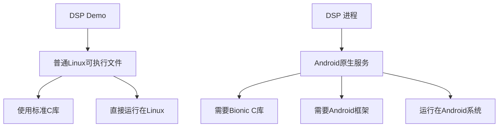

根据你的输出，我来详细分析一下情况：

## 1. Android.mk 和 Application.mk 的命名规范

**这是 Android NDK 的标准命名规范：**
- `Android.mk`：**必需**，定义模块编译规则（类似于 Makefile）
- `Application.mk`：**可选**，定义应用级配置（APP_ABI、APP_PLATFORM 等）

这是 Android NDK 编译系统的标准要求，不是自定义命名。

## 2. DSP 进程 vs Demo 的区别分析

### DSP Demo (`dspdemo_ido`)
- **编译方式**：使用 **CMake** 编译（从输出看到 CMakeFiles、CMakeCache.txt）
- **类型**：普通的 Linux 可执行文件
- **运行环境**：直接在 Linux 系统上运行
- **用途**：可能是测试或演示程序

### DSP 进程 (`dspMediaServer`)
- **编译方式**：需要使用 **Android.mk**（Android NDK 编译系统）
- **类型**：Android 原生服务/进程
- **运行环境**：在 **Android 系统**上运行
- **用途**：真正的 Android 系统服务

## 3. 为什么 DSP 进程需要 SDK/NDK

**关键区别：Android 系统依赖**



### 具体需要的内容：
1. **Bionic C 库**：Android 特有的 C 运行时库
2. **Android 系统头文件**：如 `cutils`、`log`、`binder` 等
3. **系统服务框架**：可能需要与 Android 系统服务交互

## 4. 当前问题分析

### 错误原因：
```bash
build-platform.sh: line 116: mm: command not found
```

**`mm` 命令是 Android 源码编译环境的命令**，需要：
- 完整的 Android 源码树
- 执行 `source build/envsetup.sh`
- 设置 `lunch` 目标

### 但你的环境只有 NDK，没有完整源码！

## 5. 解决方案

### 方案 A：转换为 NDK 编译（推荐）
检查你的 `dsp/Android.mk` 文件，可能需要调整：

```bash
# 查看 Android.mk 内容
cat ${BUILD_DIR}/dsp/Android.mk

# 检查是否有 Android 特定依赖
grep -E "LOCAL_SHARED_LIBRARIES|LOCAL_STATIC_LIBRARIES" ${BUILD_DIR}/dsp/Android.mk
```

### 方案 B：如果依赖 Android 框架
如果 `Android.mk` 中有类似这样的依赖：
```
LOCAL_SHARED_LIBRARIES := libcutils liblog libbinder
```

那么你需要：
1. **获取 Android 源码**（或至少相关库）
2. **或者重构代码**，移除 Android 特定依赖

## 6. 立即诊断步骤

请运行以下命令来确认具体情况：

```bash
# 1. 查看 Android.mk 内容
cat /home/luhonghao/codes/dsp-8/trunk/dsp_baseline/dsp/Android.mk

# 2. 检查是否有 Application.mk
ls -la /home/luhonghao/codes/dsp-8/trunk/dsp_baseline/dsp/Application.mk 2>/dev/null

# 3. 查看 DSP Demo 的编译配置（对比参考）
cat /home/luhonghao/codes/dsp-8/trunk/dsp_baseline/dsp/CMakeLists.txt 2>/dev/null || find . -name "CMakeLists.txt" | head -1 | xargs cat
```

请分享这些命令的输出，我可以帮你确定：
1. DSP 进程具体依赖哪些 Android 组件
2. 是否可以在只有 NDK 的环境下编译
3. 需要怎样的修改方案


方案1：交叉编译（推荐）
在开发机上为 Android 设备交叉编译：

# 使用 Android NDK 的交叉编译工具链
export NDK_HOME="/opt/Android/android-ndk-r16b"
export TOOLCHAIN=$NDK_HOME/toolchains/llvm/prebuilt/linux-x86_64
export API=21

# 设置交叉编译环境
export CC=$TOOLCHAIN/bin/aarch64-linux-android$API-clang
export CXX=$TOOLCHAIN/bin/aarch64-linux-android$API-clang++

# 然后编译
方案2：在设备上直接编译
如果设备有编译环境：

# 在 Android 设备上编译
cd /hik/dsp
make  # 或 ndk-build
方案3：获取对应的编译环境
获取与目标设备匹配的 Android 编译环境。

请先运行查看 Android 版本的命令，告诉我具体版本，这样我可以提供更精确的编译方案。


## 1. `lunch` 是什么？

`lunch` 是 **Android 源码编译环境的配置命令**，用于：

- **选择编译目标**：如 `aosp_arm-eng`、`aosp_x86-userdebug` 等
- **设置环境变量**：自动配置 `TARGET_PRODUCT`、`TARGET_BUILD_VARIANT` 等
- **准备编译环境**：设置工具链路径、编译选项等

**在你的环境中不可用**，因为：
- 只有 Android NDK，没有完整 Android 源码
- `mm` 命令需要完整的 Android 编译环境

## 2. Bionic C 库

**Bionic 是 Android 特有的 C 运行时库**，与标准 glibc 的区别：

| 特性 | Bionic (Android) | glibc (Linux) |
|------|------------------|---------------|
| 许可证 | BSD 许可证 | GPL 许可证 |
| 大小 | 更小，适合嵌入式 | 较大 |
| 特性 | 为移动设备优化 | 完整功能 |
| 兼容性 | Android 专用 | 标准 Linux |

**如果你的 DSP 进程使用了 Bionic，就需要 Android 环境编译。**


