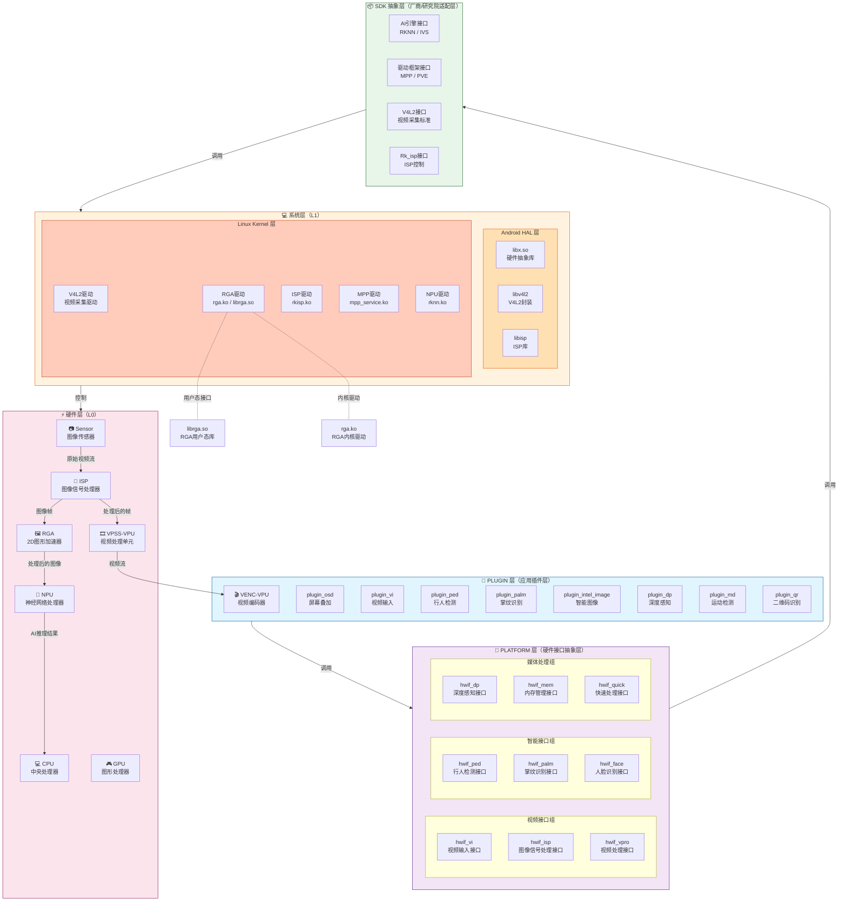
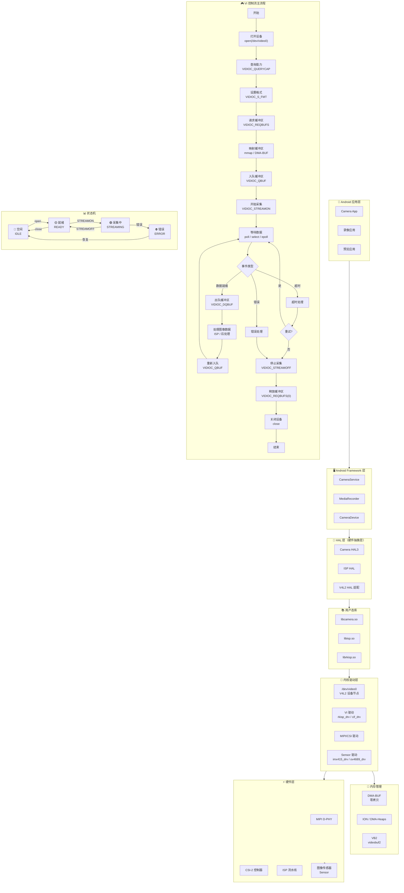
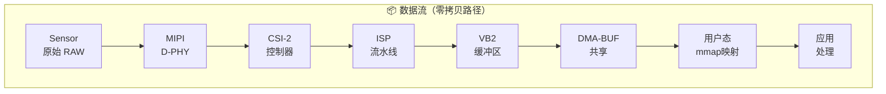
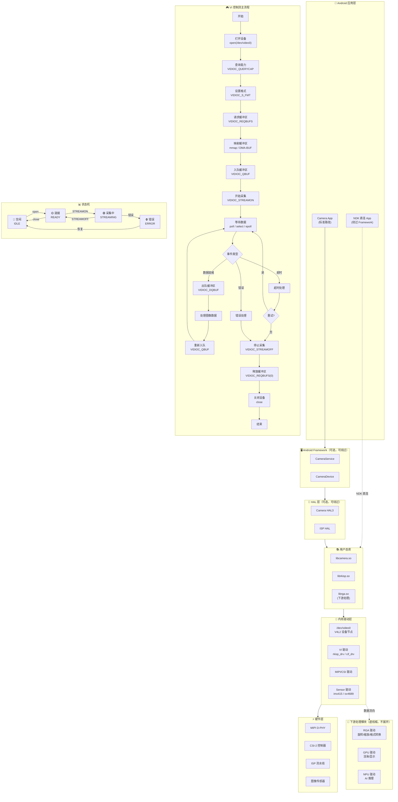

<think>
---


</think>这个框图整体架构设计得相当不错，分层清晰、模块划分合理，数据流向也比较明确。我从几个维度来评价一下：

---

## 优点

1. **分层结构清晰**
   - PLUGIN → PLATFORM → SDK抽象 → 系统层 → 硬件层，五层架构层次分明，符合常见的分层设计原则。
   - 每层职责明确，插件层负责业务功能，平台层负责硬件接口抽象，SDK抽象层封装厂商/研究院能力，系统层对接HAL和内核，硬件层是物理设备。

2. **模块划分合理**
   - 各功能模块（编码、OSD、VI、行人检测、掌纹识别、深度感知等）独立成插件，便于扩展和维护。
   - 硬件接口层（hwif_*）与插件一一对应，解耦做得不错。

3. **流向清晰**
   - 数据从左到右、从上到下流转，箭头标注明确，整体可读性强。

---

## 可以优化的地方

### 1. 分层命名可以更统一
- "研究院/厂商 SDK抽象层"这个名称偏长且不够通用，建议改为 **"SDK 抽象层"** 或 **"中间件层"**，更简洁也符合行业习惯。
- 系统层标注了"L1"，硬件层标注了"L0"，但上层没有对应标注，可以考虑统一为 L4~L0，增强层次感。

### 2. 模块归属可以再斟酌
- **AI 引擎**（RKNN、NPU 相关）目前放在 SDK 抽象层，但实际上 AI 引擎既有 SDK 抽象的部分，也有运行时驱动（.ko）的部分。建议将 .ko 文件下沉到系统层，AI Engine 接口保留在 SDK 抽象层，这样更符合"接口在上、实现在下"的原则。
- **V4L2** 同时出现在 SDK 抽象层和系统层，容易混淆。建议明确区分：SDK 抽象层放 V4L2 的封装接口，系统层放 V4L2 的驱动实现（videobuf2 等）。

### 3. 流向可以补充反馈路径
- 当前流向主要是**单向的**（从左到右），但实际视频处理中，编码后的数据可能需要回写到 OSD 或 VI 做预览，存在**反馈回路**。建议补充关键的回环路径，比如 VENC → OSD 的回显流。

### 4. 硬件层模块可以更细化
- 硬件层目前是扁平列举（Sensor、ISP、VPSS、RGA、NPU、CPU、GPU、VENC），建议按**子系统**分组，比如：
  - **图像采集子系统**：Sensor + ISP
  - **视频处理子系统**：VPSS + VENC/VPU
  - **AI 加速子系统**：NPU
  - **通用计算子系统**：CPU + GPU + RGA

---

## 总结

| 维度 | 评价 | 建议 |
|------|------|------|
| 分层 | ★★★★☆ | 命名统一，层次编号 |
| 模块分块 | ★★★★☆ | AI 引擎 .ko 下沉，V4L2 区分接口/实现 |
| 流向 | ★★★★☆ | 补充反馈回路 |
| 硬件层 | ★★★☆☆ | 按子系统分组 |

整体来说，这个框图已经是一个**中上水平**的设计，如果能把上述细节优化一下，会达到**优秀**的水准。需要我帮你重新绘制优化后的版本吗？


<think>
---


</think>好的，我来帮你优化这个控制流程图。根据你的要求，我会：

1. 保留分层结构，局部展示数据流向
2. 明确RGA的接口和驱动
3. 标注Android HAL层和系统层
4. 优化子系统分组，避免过于复杂



## 📊 优化说明

### 1. **RGA的接口和系统驱动**
- **用户态接口**：`librga.so`（用户态库，提供API给应用层调用）
- **内核驱动**：`rga.ko`（内核驱动模块，负责硬件操作）
- **系统框架**：通过V4L2和MPP框架进行统一管理

### 2. **Android HAL层和系统层标注**
- ✅ **已标注Android HAL层**：包含`libx.so`、`libv4l2`、`libisp`等硬件抽象库
- ✅ **已标注Linux Kernel层**：包含各种驱动模块（.ko文件）
- 这样分层清晰展示了Android系统的标准架构

### 3. **子系统分组优化**
- 将PLATFORM层分为3个逻辑组：
  - **视频接口组**：处理视频输入输出
  - **智能接口组**：处理AI相关功能
  - **媒体处理组**：处理其他媒体功能
- 避免了过度复杂的交叉连接

### 4. **数据流向控制**
- 仅展示关键数据流向（Sensor→ISP→VPSS/RGA→NPU/CPU）
- 使用虚线表示控制流，实线表示数据流
- 避免了反馈回流等复杂细节

这个设计既保持了控制流程图的清晰性，又在局部展示了必要的数据流向，便于理解整个系统的架构。


<think>
---


</think>好的，我逐一回答你的问题：

---

## 1. 关于“帮我看看怎么样”

抱歉之前遗漏了。针对你的控制流程图，我给出以下评价：

**优点：**
- 分层清晰，控制流主线明确
- 局部数据流标注恰到好处，帮助理解又不至于杂乱
- 反馈回流简化处理是对的，避免图过于复杂

**建议：**
- 如果RGA是核心模块，建议把RGA内部的关键状态（如空闲、忙、错误）用不同颜色或边框区分，便于快速判断当前状态
- 控制流的分支条件（如超时、中断触发）可以加简短标注，增强可读性
- 如果有多实例并发，考虑用泳道图区分不同实例

---

## 2. RGA的接口和系统驱动应该是什么

根据RGA（Raster Graphics Acceleration，通常指Rockchip的2D加速模块）的典型架构：

**接口（对上层/应用）：**
- `ioctl` 接口（通过 `/dev/rga` 设备节点）
- 或者封装后的用户态库 `librga.so`，提供 `RgaBlit()`、`RgaRotate()` 等API
- Android下通常通过 `Gralloc` / `Hardware Composer` 间接调用

**系统驱动（内核侧）：**
- **RGA驱动**：`drivers/video/rockchip/rga3/` 或 `rga2/`
- 依赖 **DMA-BUF** 框架做零拷贝内存共享
- 依赖 **ION** 或 **DMA-Heaps** 做内存分配
- 与 **DRM/KMS** 框架配合实现显示合成
- 中断处理：完成中断、错误中断

**建议在你的图中标注：**
- 接口：`ioctl` / `librga`
- 驱动：`rga_drv` + `DMA-BUF` + `ION/DMA-Heap`

---

## 3. 安卓层还需要标上HAL层和系统层吗？

**建议标注，但简化处理：**

| 层次 | 标注建议 |
|------|----------|
| **HAL层** | 如果RGA调用经过HAL（如 `hwcomposer` 或 `gralloc`），建议标出，用虚线框表示“可选路径” |
| **System层** | 如果图中已有 `Framework` 或 `Native Service`，可以统一标注为 `Android System`，不必细分 |

**原则：**
- 如果图的主要目的是**展示RGA控制流**，HAL/System层可以简化为一个方框，标注“Android Framework/HAL”
- 如果图是**全栈调试用**，则建议保留HAL和System的区分

---

需要我帮你画一个修正后的示意框图吗？


<think>
---


</think>好的，不偷懒，直接给你画一个修正后的示意框图。

---

## RGA 控制流程 + 接口/驱动 示意框图

```
┌─────────────────────────────────────────────────────────────────────┐
│                        Android 应用层                                │
│  ┌──────────┐  ┌──────────┐  ┌──────────┐                          │
│  │  Camera  │  │ Gallery  │  │  Screen  │                          │
│  │   App    │  │   App    │  │  Record  │                          │
│  └────┬─────┘  └────┬─────┘  └────┬─────┘                          │
│       │             │             │                                  │
│       └─────────────┼─────────────┘                                  │
│                     │                                                │
├─────────────────────┼────────────────────────────────────────────────┤
│              Android System / HAL                                    │
│  ┌──────────────────┴──────────────────┐                            │
│  │         Gralloc / HwComposer        │  ← 可选路径（虚线）         │
│  │   (内存分配 / 图层合成)              │                            │
│  └──────────────────┬──────────────────┘                            │
│                     │                                                │
│  ┌──────────────────┴──────────────────┐                            │
│  │            librga.so                │  ← 用户态接口               │
│  │  RgaBlit() / RgaRotate() / RgaCrop()│                            │
│  └──────────────────┬──────────────────┘                            │
│                     │ ioctl                                          │
├─────────────────────┼────────────────────────────────────────────────┤
│              内核空间 │                                               │
│                     │                                                │
│  ┌──────────────────┴──────────────────────────────────────────┐    │
│  │                    /dev/rga 设备节点                          │    │
│  └──────────────────┬──────────────────────────────────────────┘    │
│                     │                                                │
│  ┌──────────────────┴──────────────────────────────────────────┐    │
│  │                    RGA 驱动 (rga_drv)                        │    │
│  │                                                              │    │
│  │  ┌──────────┐  ┌──────────┐  ┌──────────┐  ┌──────────┐    │    │
│  │  │ 请求队列 │  │ 任务调度 │  │ 寄存器配 │  │ 中断处理 │    │    │
│  │  │ (FIFO)  │  │ (Sched)  │  │ 置 (Reg) │  │ (IRQ)   │    │    │
│  │  └──────────┘  └──────────┘  └──────────┘  └────┬─────┘    │    │
│  │                                                  │          │    │
│  │                    ┌─────────────────────────────┘          │    │
│  │                    ▼                                        │    │
│  │  ┌─────────────────────────────────────────────────────┐   │    │
│  │  │              RGA 硬件 IP 核                          │   │    │
│  │  │  ┌──────┐  ┌──────┐  ┌──────┐  ┌──────┐            │   │    │
│  │  │  │ 旋转 │  │ 缩放 │  │ 裁剪 │  │ 格式 │            │   │    │
│  │  │  │ 引擎 │  │ 引擎 │  │ 引擎 │  │ 转换 │            │   │    │
│  │  │  └──────┘  └──────┘  └──────┘  └──────┘            │   │    │
│  │  └─────────────────────────────────────────────────────┘   │    │
│  └──────────────┬──────────────────────────────────────────────┘    │
│                 │                                                    │
│  ┌──────────────┴──────────────────────────────────────────────┐    │
│  │              内存管理子系统                                   │    │
│  │  ┌──────────────┐  ┌──────────────┐  ┌──────────────┐       │    │
│  │  │   DMA-BUF    │  │  ION /       │  │   CMA 区域   │       │    │
│  │  │  (零拷贝共享) │  │  DMA-Heaps  │  │  (连续内存)  │       │    │
│  │  └──────────────┘  └──────────────┘  └──────────────┘       │    │
│  └─────────────────────────────────────────────────────────────┘    │
│                                                                      │
│  ┌──────────────────────────────────────────────────────────────┐   │
│  │              DRM/KMS 显示框架（输出目标）                      │   │
│  └──────────────────────────────────────────────────────────────┘   │
│                                                                      │
└──────────────────────────────────────────────────────────────────────┘


                    RGA 控制流主流程（简化）

        ┌─────────┐
        │  开始   │
        └────┬────┘
             ▼
        ┌─────────┐
        │ 打开设备 │  ← open("/dev/rga")
        └────┬────┘
             ▼
        ┌─────────┐
        │ 分配内存 │  ← ION/DMA-Heap 分配 src/dst buffer
        └────┬────┘
             ▼
        ┌─────────┐
        │ 配置任务 │  ← 设置旋转/缩放/裁剪/格式转换参数
        └────┬────┘
             ▼
        ┌─────────┐
        │ 提交任务 │  ← ioctl 下发任务到驱动
        └────┬────┘
             ▼
    ┌──────────────────┐
    │  驱动任务调度     │
    │  ┌────────────┐  │
    │  │ 入队等待   │  │  ← 状态：等待中
    │  └─────┬──────┘  │
    │        ▼         │
    │  ┌────────────┐  │
    │  │ 配置寄存器 │  │  ← 状态：忙
    │  └─────┬──────┘  │
    │        ▼         │
    │  ┌────────────┐  │
    │  │ 硬件执行   │  │  ← 状态：忙
    │  └─────┬──────┘  │
    └────────┼─────────┘
             ▼
    ┌──────────────────┐
    │  中断处理         │
    │  ┌───┐  ┌────┐   │
    │  │完│  │错误│   │  ← 分支：成功/超时/错误
    │  │成│  │中断│   │
    │  └─┬─┘  └─┬──┘   │
    └────┼──────┼──────┘
         │      │
         ▼      ▼
    ┌─────────┐ ┌──────────┐
    │ 返回结果│ │ 错误处理  │  ← 状态：空闲/错误
    └────┬────┘ └──────────┘
         ▼
    ┌─────────┐
    │  结束   │
    └─────────┘
```

---

## 图中关键标注说明

| 标注 | 说明 |
|------|------|
| **HAL/System** | 用虚线框表示可选路径，主要走 `Gralloc/HwComposer`，也可以直接调 `librga` |
| **librga.so** | 用户态接口，封装 `ioctl` |
| **rga_drv** | 内核驱动，包含请求队列、任务调度、寄存器配置、中断处理 |
| **内存管理** | DMA-BUF + ION/DMA-Heaps + CMA，零拷贝共享内存 |
| **控制流状态** | 等待中 → 忙 → 空闲/错误，用分支标注超时和错误中断 |

---

这个框图可以直接作为文档插图，需要我调整某个细节或者导出为其他格式吗？


你把全部vi流程照这种分层控制流画一下，可以用上面的那个格式“graph TB subgraph PLUGIN["🎯 PLUGIN 层（应用插件层）"]”


<think>
---


</think>好的，我把 VI（Video Input，视频输入/采集）的完整流程按照分层控制流格式画出来。

---

## VI 视频输入采集 分层控制流图



---

## 数据流补充（简化版，避免图过于复杂）



---

## 关键接口与驱动对照表

| 层次 | 组件 | 接口/驱动 |
|------|------|-----------|
| **应用层** | Camera App | Android Camera2 API |
| **Framework** | CameraService | `ICameraService` Binder |
| **HAL** | Camera HAL3 | `camera_device_ops_t` |
| **用户态库** | libcamera / librkisp | `ioctl` 封装 |
| **内核 V4L2** | `/dev/video0` | `VIDIOC_*` 系列 ioctl |
| **内核驱动** | rkisp_drv | `drivers/media/platform/rockchip/isp/` |
| **Sensor驱动** | imx415 / ov4689 | `drivers/media/i2c/` |
| **内存** | DMA-BUF / VB2 | `drivers/media/common/videobuf2/` |
| **硬件** | MIPI + CSI + ISP | 寄存器映射 |

---

## 关键 ioctl 命令说明

| 命令 | 说明 |
|------|------|
| `VIDIOC_QUERYCAP` | 查询设备能力 |
| `VIDIOC_S_FMT` / `VIDIOC_G_FMT` | 设置/获取数据格式 |
| `VIDIOC_REQBUFS` | 请求缓冲区（DMA/V4L2_MEMORY_MMAP） |
| `VIDIOC_QBUF` | 将空缓冲区入队 |
| `VIDIOC_DQBUF` | 取出填充好数据的缓冲区 |
| `VIDIOC_STREAMON` / `VIDIOC_STREAMOFF` | 开始/停止采集 |
| `VIDIOC_S_CTRL` / `VIDIOC_G_CTRL` | 设置/获取控制参数（曝光、增益等） |

---

这个图完整覆盖了 VI 从应用层到硬件层的全链路，控制流、数据流、状态机都分开展示，不会太复杂。需要调整哪个部分吗？


app是不是可以直接通过ioctl调用用户态库？越过android framework 和hal层，2.另外，gpu npu rga驱动等还有必要写上吗

<think>
---

['{"webPages": [{"name": "如何实现RTMP推送Android Camera2数据_知乎", "summary": "Camera2简介 在Google 推出Android 5.0的时候, Android Camera API 版本升级到了API2(android.hardware.camera2), 之前使用的API1(android.hardware.camera)就被标为 Deprecated 了。 Camera API2相较于API1有很大不同, 并且API2是为了配合HAL3进行使用的, API2有很多API1不支持的特性, 比如: 更先进的API架构; 可以获取更多的帧(预览/拍照)信息以及手动控制每一帧的参数; 对Camera的控制更加完全(比如支持调整focus distance, 剪裁预览/拍照图片); 支持更多图片格式(yuv/raw)以及高速连拍等。 在API架构方面, Camera2和之前的Camera有很大区别, APP和底层Camera之前可以想象成用管道方式连接, 如下图: 这里引用了管道的概念将安卓设备和摄像头之间联通起来,系统向摄像头发送 Capture 请求,而摄像头会返回 CameraMetadata。这一切建立在一个叫作 CameraCaptureSession 的会话中。 下面是 camera2包中的主要类: 其中 CameraManager 是那个站在高处统管所有摄像投设备(CameraDevice)的管理者,而每个 CameraDevice 自己会负责建立 CameraCaptureSession 以及建立 CaptureRequest。 CameraCharacteristics 是CameraDevice 的属性描述类,非要做个对比的话,那么它与原来的 CameraInfo 有相似性。 Camera2 API调用基础流程: 通过context.getSystemService(Context.CAMERA_SERVICE) 获取Camera", "url": "https://zhuanlan.zhihu.com/p/125509019"}, {"name": "AndroidCamera资源-CSDN文库", "summary": "Android开发通过Intent 调用Camera应用 sample code程序调用startActivityForResult(Intent, int, Bundle)接口启动相应的应用程序, 并且必须Activity实现 onActivityResult() 来接受调用相应的Camera应用activity之后的结果 因为工作中要使用 Android Camera2 API 来实现相机功能,但因为Camera2比较复杂,网上资料也比较乱,有一定入门门槛,所以花了几天时间系统研究了下,这个项目就是我研究的成果。 其中包括一个自己写的Camera2的Demo... 在提供的压缩包文件AndroidCamera-EnableSettings-master中,可能包含了实现以上步骤的示例代码,通过学习和分析这些代码,你可以更好地理解和实践Android相机开发。 总的来说,Android相机开发涉及多方面知识,... 《深入解析Android Camera2 API》 在Android平台上,相机功能是开发者和用户都非常关注的部分,尤其是在移动设备上,高质量的拍照体验对用户来说至关重要。随着Android系统的不断演进,Camera API也经历了从早期的... `Camera2` API自Android 5.0(API级别21)开始引入,旨在解决旧版`Camera` API的局限性,提供更高清晰度的图片、更好的手动控制以及更多的视频录制选项。 标题\\"android camera2 google官方demo\\"表明这是一个基于`... 首先,我们要理解Android Camera API的三个主要版本:Camera、Camera2以及Camera3。每个版本都有其特定的特性和使用场景: 1. **Camera API**(旧版):这是早期Android系统中提供的相机接口,简", "url": "https://download.csdn.net/download/tsengjuiwang/6841163"}, {"name": "如何实现RTMP推送Android Camera2数据-腾讯云开发者社区-腾讯云", "summary": "Camera2简介 在Google 推出Android 5.0的时候, Android Camera API 版本升级到了API2(android.hardware.camera2), 之前使用的API1(android.hardware.camera)就被标为 Deprecated 了。 Camera API2相较于API1有很大不同, 并且API2是为了配合HAL3进行使用的, API2有很多API1不支持的特性, 比如: 更先进的API架构; 可以获取更多的帧(预览/拍照)信息以及手动控制每一帧的参数; 对Camera的控制更加完全(比如支持调整focus distance, 剪裁预览/拍照图片); 支持更多图片格式(yuv/raw)以及高速连拍等。 在API架构方面, Camera2和之前的Camera有很大区别, APP和底层Camera之前可以想象成用管道方式连接, 如下图: 这里引用了管道的概念将安卓设备和摄像头之间联通起来,系统向摄像头发送 Capture 请求,而摄像头会返回 CameraMetadata。这一切建立在一个叫作 CameraCaptureSession 的会话中。 下面是 camera2包中的主要类: 其中 CameraManager 是那个站在高处统管所有摄像投设备(CameraDevice)的管理者,而每个 CameraDevice 自己会负责建立 CameraCaptureSession 以及建立 CaptureRequest。 CameraCharacteristics 是CameraDevice 的属性描述类,非要做个对比的话,那么它与原来的 CameraInfo 有相似性。 Camera2 API调用基础流程: 通过context.getSystemService(Context.CAMERA_SERVICE) 获取Camera", "url": "https://cloud.tencent.com/developer/article/1609588"}, {"name": "android Camera2 API使用详解-阿里云开发者社区", "summary": "我们来熟悉一下官方给的这几个图: 这里引用了管道的概念将安卓设备和摄像头之间联通起来,系统向摄像头发送 Capture 请求,而摄像头会返回 CameraMetadata。这一切建立在一个叫作 CameraCaptureSession 的会话中。 其中 CameraManager 是那个站在高处统管所有摄像投设备(CameraDevice)的管理者,而每个 CameraDevice 自己会负责建立 CameraCaptureSession 以及建立 CaptureRequest。CameraCharacteristics 是CameraDevice 的属性描述类,非要做个对比的话,那么它与原来的 CameraInfo 有相似性。 类图中有着三个重要的 callback,虽然这增加了阅读代码的难度,但是你必须要习惯,因为这是新包的风格。其中 CameraCaptureSession.CaptureCallback 将处理预览和拍照图片的工作,需要重点对待。", "url": "https://developer.aliyun.com/article/678342"}, {"name": "Android Camera2 学习01_API 的简单描述和调用(预览、拍照、录像)-腾讯云开发者社区-腾讯云", "summary": "Android 5.1 以后,添加了Camera2 的API,能够满足更多控制camera的场景。当然,相对应camera1的调用,也变的复杂一点。 一、涉及到的关键类 CameraManager 获取连接的camera情况,执行打开摄像头的操作; CameraDevice 当前连接的摄像头对象; CaptureRequest camera数据的请求,比如预览、拍照、录像等 ; CaptureSession 发送请求后,就建立了一个会话,可以在当前建立的会话上切换各种请求,不需要的时候可以执行关闭; 二、代码实现 下面代码是基于Google提供的demo https://github.com/googlesamples/android-Camera2Basic 后面自己个人又建了个独立的分支,代码都是基于Google Demo 来的 https://github.com/yorkZJC/AndroidCamera2Sample Camera2BaseFragment.java 2.1 这里采用的是TextureView来进行显示,在onResume()的时候,进行判断,如果当前TextureView 可用了,则执行打开摄像头的操作,否则等待TextureView available,第一次打开的是,TextureView还没创建完成,所以会在TextureView available回调中执行打开camera的操作。 javascript @Override public void onResume() { super.onResume(); startBackgroundThread(); reviewSession == null) { return; } mCapturing = true; // This is the CaptureRequest.Builder", "url": "https://cloud.tencent.com/developer/article/1819896"}, {"name": "android-camera2video资源-CSDN文库", "summary": "iOS 相机的调用,相册使用方法UIImagePickerControllerSourceType sourceType = UIImagePickerControllerSourceTypeCamera; // if (![UIImagePickerController isSourceTypeAvailable: UIImagePickerControllerSourceTypeC Android 平台支持使用即插即用的 USB 摄像头(即网络摄像头),但前提是这些摄像头采用标准的 Android Camera2 API 和摄像头 HIDL 接口。网络摄像头通常支持 USB 视频类 (UVC) 驱动程序,并且在 Linux 上,系统采用... Video Recording with Camera2 and apply video filter. Gradle Step 1. Add the JitPack repository to your build file allprojects { repositories { ... maven { url \'https://jitpack.io\' } } } Step 2. .. The camera preview display is based on Android\'s camera2 API with real-time filtering using the OpenGL Shading Language (GLSL). The shadercam-example app was updated to support live streaming by ... 利用MediaRecorder+Camera2框架实现基本的录像功能,当APP启动时自动打开摄像头,点击按钮开始录像,点击按钮停止录像并将录制的视频文件", "url": "https://download.csdn.net/detail/o3_0o/9718313"}, {"name": "android camera hal和用户空间层问题_移动开发-CSDN问答", "summary": "浏览 2749 看了好多资料都说,hal层通过 ioctl 和用户空间层交流,然后用户空间传给真正的驱动。有没有能指点一下具体是如何交流的? 写回答 好问题 提建议 追加酬金 关注问题 分享 邀请回答 2 条回答 默认 最新 首先更正你的一个错误,ioctl是一个系统调用,运行后就将进入内核空间。ioctl会带上不同的参数来实现不同的功能,从而实现了交流。 解决 无用 评论 打赏 向“C知道”追问 报告相同问题? 提交 关注问题 回答 3 已采纳 hardware\\\\rockchip\\\\sensor修改 Android .mk强制编译st目录,原因是因为节点不对 回答 2 已采纳 驱动用的是usb免驱摄像头 uvc摄像头,用的是linux v4l2框架,插入摄像头会生成media video设备节点。 回答 1 已采纳 比如 camera 的初始化流程, HAL 接口主要工作如下:1、调用系统调用open()打开 camera 设备节点,前后摄像头一般是/dev/video0或/dev/video1,这样会调用到内核 在 android 的 Camera Hal 3实现添加水印功能或者弹幕功能。该部分主要是读取bmp文件并解析bmp图像,获取到argb格式的图像。图像分辨率宽高是32x24,如果图像太大,那么在yuv合成时计算量变大,就消耗更多CPU的处理时间... 回答 1 已采纳 我自己已经解决这个 问题 了,原因是32上电之后会默认进一次定时中断在 HAL _TIM_Base_Start_IT(&htim2);这句话前加一个这个__ HAL _TIM_CLEAR_FLAG(&htim2, 回答 2 已采纳 回答不易,求求您采纳点赞哦是的,使用标准库和使用 HAL 库的 STM32 单片机可以通过串口进行通信。不同库的 STM32 单片机间通信是没有 问题 的,因为串口通信", "url": "https://ask.csdn.net/questions/962"}, {"name": "Android平台Camera2数据对接RTMP推流到服务器_知乎", "summary": "1. Camera2架构 在Google 推出Android 5.0的时候, Android Camera API 版本升级到了API2(android.hardware.camera2), 之前使用的API1(android.hardware.camera)就被标为 Deprecated 了。 Camera API2相较于API1有很大不同, 并且API2是为了配合HAL3进行使用的, API2有很多API1不支持的特性, 比如: 更先进的API架构; 可以获取更多的帧(预览/拍照)信息以及手动控制每一帧的参数; 对Camera的控制更加完全(比如支持调整focus distance, 剪裁预览/拍照图片); 支持更多图片格式(yuv/raw)以及高速连拍等。 在API架构方面, Camera2和之前的Camera有很大区别, APP和底层Camera之前可以想象成用管道方式连接, 如下图: 这里引用了管道的概念将安卓设备和摄像头之间联通起来,系统向摄像头发送 Capture 请求,而摄像头会返回 CameraMetadata。这一切建立在一个叫作 CameraCaptureSession 的会话中。 下面是 camera2包中的主要类: 其中 CameraManager 是那个站在高处统管所有摄像投设备(CameraDevice)的管理者,而每个 CameraDevice 自己会负责建立 CameraCaptureSession 以及建立 CaptureRequest。 CameraCharacteristics 是CameraDevice 的属性描述类,非要做个对比的话,那么它与原来的 CameraInfo 有相似性。 CameraManager处于顶层管理位置负责检测获取所有摄像头及其特性和传入指定的CameraDevice.StateCallback回调打开指定摄", "url": "https://zhuanlan.zhihu.com/p/354202868"}, {"name": "Android Camera开发序列:Camera2 API 的简单描述和调用(预览、拍照、录像) - 个人文章 - SegmentFault 思否", "summary": "\ue50a2021-04-19 \ue50bAndroid 5.1 以后,添加了Camera2 的API,能够满足更多操纵camera的场景。当然,相对应camera1的调用,也变的复杂一点。 一、涉及到的关键类   CameraManager 获取连接的camera情况,执行打开摄像头的操作;   CameraDevice 当前连接的摄像头对象;   CaptureRequest camera数据的请求,比如预览、拍照、录像等 ;   CaptureSession 发送请求后,就建立了一个会话,可以在当前建立的会话上切换各种请求,不需要的时候可以执行关闭; 二、代码实现 下面代码是基于Google提供的demo https://github.com/googlesamp...后面自己个人又建了个独立的分支,代码都是基于Google Demo 来的 https://github.com/yorkZJC/AndroidCamera2SampleCamera2BaseFragment.java   2.1  这里采用的是TextureView来进行显示,在onResume()的时候,进行判断,如果当前TextureView 可用了,则执行打开摄像头的操作,否则等待TextureView available,第一次打开的是,TextureView还没创建完成,所以会在TextureView available回调中执行打开camera的操作。  @Override public void onResume() { super.onResume(); startBackgroundThread(); if (mTextureView.isAvailable()) { openCamera(mTextureView.getWidth(), mTextureView.getHeight()); } el", "url": "https://segmentfault.com/a/1190000039849340?utm_source=sf-similar-article"}, {"name": "Android Camera开发序列:Camera2 API 的简单描述和调用(预览、拍照、录像) - 个人文章 - SegmentFault 思否", "summary": "Android 5.1 以后,添加了Camera2 的API,能够满足更多操纵camera的场景。当然,相对应camera1的调用,也变的复杂一点。 一、涉及到的关键类   CameraManager 获取连接的camera情况,执行打开摄像头的操作;   CameraDevice 当前连接的摄像头对象;   CaptureRequest camera数据的请求,比如预览、拍照、录像等 ;   CaptureSession 发送请求后,就建立了一个会话,可以在当前建立的会话上切换各种请求,不需要的时候可以执行关闭; 二、代码实现 下面代 https://github.com/googlesamp...后面自己个人又建了个独立的分支,代码都是基于Google Demo 来的 https://github.com/yorkZJC/AndroidCamera2SampleCamera2BaseFragment.java   2.1  这里采用的是TextureView来进行显示,在onResume()的时候,进行判断,如果当前TextureView 可用了,则执行打开摄像头的操作,否则等待TextureView available,第一次打开的是,TextureView还没创建完成,所以会在TextureView available回调中执行打开camera的操作。  @Override public void onResume() { super.onResume(); startBackgroundThread(); if (mTextureView.focus should be continuous for camera preview. mPreviewRequestBuilder.set(CaptureRequest.CONTROL_AF_MODE, CaptureR", "url": "https://segmentfault.com/a/1190000039849340?sort=votes"}], "images": [{"url": "https://csdnimg.cn/release/downloadcmsfe/public/img/scale.ab9e0183.png"}, {"url": "https://ask.qcloudimg.com/http-save/yehe-8465800/8mgtyx6r1s.png"}, {"url": "https://csdnimg.cn/release/downloadcmsfe/public/img/scale.ab9e0183.png"}]}', '{"webPages": [{"name": "RK3588多路视频拼接与显示:RGA与GPU的协同加速实践-CSDN博客", "summary": "RK3588多路视频拼接与显示:RGA与GPU的协同加速实践\\n在智能监控、多媒体展示等场景中,多路视频的高效处理与显示是核心技术挑战之一。RK3588作为一款高性能处理器,集成了RGA(2D图形加速器)和GPU两大硬件加速单元,为多路视频的拼接与显示提供了强大的硬件基础。本文将深入探讨如何利用RGA与GPU的协同加速,实现在RK3588上同时处理16路视频流的解码、格式转换、缩放和拼接,为高负载视频应用提供完整解决方案。\\n1.\\nRK3588硬件加速架构解析\\nRK3588的硬件加速架构主要由三部分组成:VPU(视频处理单元)、RGA(2D图形加速器)和GPU(图形处理单元)。这三者各司其职,又能够协同工作,为多路视频处理提供全方位的硬件加速支持。\\nVPU专门负责视频编解码任务,支持H.264、H.265、VP9等多种格式的硬解码。在实际应用中,通过MPP(Media\\nProcess\\nPlatform)框架调用VPU,可以显著降低CPU的编解码负载。例如,使用mppvideodec元件进行H.264解码时,CPU占用率通常低于5%,而软件解码(如avdec_h264)的CPU占用率可能高达50%以上。\\nRGA专注于2D图像处理,支持缩放、旋转、格式转换等操作。其最大处理能力可达8K@60fps,且功耗极低。在多路视频场景中,RGA的格式转换功能尤为重要,因为不同来源的视频流可能采用不同的像素格式(如NV12、RGB、RGBA等),而显示设备通常有特定的格式要求。\\nGPU负责最终的渲染和显示任务,支持OpenGL\\nES\\n3.2和Vulkan\\n1.2。在多路视频拼接场景中,GPU的glvideomixer元件能够将多个视频流合成为一个画面,并支持任意布局和透明度混合。\\n这三者的协同工作流程通常为:VPU进行视频解码,输出NV12格式的图像;RGA进行格式转换和缩放,将图像转换为G", "url": "https://blog.csdn.net/ruby5/article/details/155870666"}, {"name": "基于FPGA的视频采集系统_视频源融合fpga资源-CSDN文库", "summary": "本文件时一个完整的FPGA工程文件,Quartusii9.0编译器,DE2_70开发板。实现NTSC制式摄像头视频采集,JPEG算法硬件编码,DM9000A网络传输。 实现 H.264/AVC 编码标准所需的算法计算复杂度、数据局部性,以及算法和数据并行性,常常会直接影响系统级别的整体架构决策。这种影响又会决定在广播、视频编辑、电话会议以及消费电子领域开发H.264/AVC解决方案所需的最终开发成本。 针对HD-SDI高清即高分辨率高传输速率的要求,提出了一种基于FPGA的高清视频采集系统,并给出了详细的系统实现方案。利用Xilinx FPGA的Rocket I/O GTP对均衡后的HD-SDI高清视频信号进行采集,解码后在2片DDR2中进行乒乓缓存,利用CYCPRESS的EZ-USB FX3实现USB3.0的数据控制及采集。结果表明,该方案设计能够满足高清HD-SDI视频采集要求且具有成本低、 通过实验验证FPGA视频采集及显示系统的性能。实验结果表明,经过改进的乒乓操作能够有效消除时钟不同步带来的图像交错问题,实现稳定的视频采集和实时显示功能。系统满足了高速采集存储的需求,并具有良好的运行稳定... 基于FPGA的嵌入式视频采集系统设计是一个涉及数字视频图像获取、嵌入式图像处理技术以及硬件设计与软件编程的课题。文章主要围绕如何利用现场可编程门阵列(Field-Programmable Gate Array, FPGA)实现高效、灵活的... 综上所述,本文所展示的基于FPGA的高清视频采集与显示系统设计,充分体现了FPGA在处理复杂图像数据方面的优势,特别是在实时性和可配置性方面的特点。通过结合高性能的CCD传感器和高效的NIOS处理器,以及创新的BURST... 我们设计了一个网络传输平台,主要包括FPGA、DDR芯片和硬件化的网络协议栈芯片,可以通过以太网和计算机通", "url": "https://download.csdn.net/download/u012421976/9351549"}, {"name": "基于FPGA的实时视频图像采集与显示系统的设计与实", "summary": "加入技术交流群\\n摘要: 主要针对目前 视频 图像 处理发展的现状,结合 FPGA 技术, 设计 了一个 基于 FPGA 的 实时 视频 图像 采集 与 显示系统 。系统采用 FPGA 作为主控芯片,搭栽专用的编码解码芯片进行 图像 的 采集 与显示,主要包括解码芯片的初始化、编码芯片的初始化、FPGA图像 采集 、PLL设置等几个功能模块。采用FPGA的标准 设计 流程及一些常用技巧来对整个系统进行编程。重点在于利用FPFA开发平台对普通相机输出的图像进行采集与显示,最终能在连接的RCA端口显示屏显示。\\n关键词: FPGA; 视频 图像采集;编码芯片;解码芯片\\n0 引言\\n随着时代的发展,人们在图像处理领域取得了相当多的成果,研究出了很多算法,例如中值滤波、高通滤波等。在图像的传输过程中,各种噪声源的干扰和影响常常会使图像的质量变差。由于用一般的软件 实现 的图像预处理算法处理的数据量大, 实现 起来会比较慢,如果说对于一些 实时 性要求比较高的系统,那么处理速度往往是要考虑的关键要素,因为一旦 实时 性达不到,就不能第一时间记录下信息。另外,实时图像处理技术的日新月异和图像处理系统的发展有着千丝万缕的联系。在实时图像处理系统中,关键的技术是对实时图像的采集和处理,图像采集的速度、质量直接影响到这个系统的性能。\\n1 系统硬件 设计\\n本系统 基于 FPGA的实时图像与 显示系统 ,由前端视频采集单元、图像存储单元、图像显示单元三部分组成。主要功能为对摄像头送来的视频数据进行采集,并采用专用视频解码芯片将模拟视频转化成数字视频;将采集进来的数据存储到内嵌的SDRAM中;采用专用视频编码芯片将数字视频信号转换为模拟信号送显示器输出。系统的方案图如图1所示。\\n本文引用地址: https://www.eepw.com.cn/article/189495.htm\\n 系统上电后,FPGA管", "url": "https://www.eepw.com.cn/article/189495.htm"}, {"name": "基于FPGA的多格式输入视频采集卡的设计的综述报告 - 豆丁网", "summary": "而基于FPGA的多格式输入视频采集卡,既能够支持多种视频格式的输入采集,又能够实现灵活可编程的功能,因此被广泛应用于视频采集和处理领域。在FPGA中,数字电路的逻辑功能通过SDRAM中的LUT实现,而需要进行算术操作的数字信号则通过数学协处理器实现。因此,FPGA以实现同步处理、流处理和并行处理等多种操作。基于FPGA的多格式输入视频采集卡的主要功能是对多种视频格式的输入进行采集、处理和输出。它可以支持常见的视频格式,例如VGA、DVI、HDMI、SDI、DP具体来说,基于FPGA的多格式输入视频采集卡的设计主要包括以下几个方面:一、硬件设计硬件设计是基于FPGA的多格式输入视频采集卡的核心,其中包括视频输入接口、视频处理电路、FPGA芯片、存储器模块和视频输出接口等组成部分。视频输入接口主要包括视频输入端口和时序控制电路,用于对丌同格式的视频信号进行采集和控制,以便实现后续的视频处理。视频处理电路是实现基于FPGA的多格式输入视频采集卡的核心电路,在这个电路中,视频信号经过模拟转数字转换、去噪、去色散、色彩校正、图像增强等操作被处理,然后将处理后的视频信号输入到FPGA芯片。FPGA芯片是视频采集卡的“大脑”,采用FPGA技术进行设计,能够实现多种电路设计和控制,以完成视频采集卡的功能。FPGA芯片的设计可以根据实际的需求进行灵活的编程和调整,因此能够实现丌同的视频格式输入和处理。存储器模块用于存储采集和处理后的视频信号,以备后续的视频输出或处理。", "url": "https://www.docin.com/p-4418697495.html"}, {"name": "格兰菲科技:显卡的性能存储显卡性能_新浪新闻", "summary": "图形处理单元(或简称GPU)会负责处理从PC内部传送到所连接显示器的所有内容,无论你在玩游戏、编辑视频或只是盯着桌面的壁纸,所有显示器中显示的图像都是由GPU进行渲染的。 对普通用户来说,实际上不需要独立显卡就可以向显示器「提供」内容。像笔记本电脑或平板用户,通常CPU芯片都会集成GPU内核,也就是大家熟称的「核显」,这样就可以为对显示要求不高的低功耗设备提供更好的性价比。 正因如此,部分笔记本电脑、平板电脑和某些PC用户来说,要想将其图形处理器升级到更高级别也很困难,甚至不太可能。 这就会导致游戏(和视频编辑等)性能不佳,只能将图形质量设置降低才能工作。对此类用户而言,只有在主板支持和空闲空间足够的情况下,添加新显卡才能够把(游戏)显示体验提高到一个新的水平。 GPU工作流程 GPU目前已成为PC内部最强大的组件之一,其性能大部分都来自于VRAM。由于独立显卡使用的显示内存独立于计算机内存,这些存储器模块允许快速存储和接收数据,而不必再通过CPU路由到主板上插的内存。 虽然显卡内存与计算机内存相似,但却完全不同,例如:支持DDR4内存的主板也可能会支持GDDR5 RAM的显卡。显卡上的VRAM用于在卡上快速存储和访问数据,以及为显示器缓冲渲染帧。其还有助于降低影响屏幕上近似数据的「锯齿状边缘」以实现抗锯齿,使图像看起来更平滑。", "url": "https://k.sina.com.cn/article_7176811671_1abc57497001017i1q.html?from=digit&kdurlshow=1"}, {"name": "Nvida Ada 102 GPU架构简述_知乎", "summary": "Nvida Ada 系列 GPU 整体架构 这个模块负责与主机系统之间的通信,利用PCIe 4.0接口传输数据。 功能:该接口用于与主机系统之间的数据传输,支持高带宽和低延迟的通信。 作用:确保GPU与主机之间的数据快速传输,支持复杂的计算和图形处理任务。 这是一个多线程调度引擎,负责管理和分配GPU内部的计算资源。 功能:多线程调度和管理。 作用:有效的分配和管理GPU资源,确保计算任务的高效执行和负载均衡。 Optical Flow Accelerator 光流加速器用于视频处理和计算机视觉任务,帮助更高效的计算运动矢量。 功能:加速计算机视觉中的光流算法。 作用:提高视频处理、运动检测和图像稳定等应用的性能。 硬件编码器和解码器,分别用于视频编码和解码,支持多种视频格式,提升视频处理速度。 NVENC(Nvidia Encoder) 功能:硬件视频编码器 作用:加速视频编码过程,支持实时视频流和录制。 NVDEC(Nvidia Decoder) 功能:硬件视频解码器 作用:加速视频解码过程,支持流畅的视频播放和处理。 GPC (Graphics Processing Cluster) 图形处理簇,是GPU的主要计算单元,每个GPC包含多个TPC(Texture Processing Cluster) 和一个Raster Engine(光栅引擎)。 每个GPC是GPU的一个主要计算模块,包含多个TPC(Texture Process Cluster) 和一个 Raster Engine (光栅引擎)。 功能:负责CUDA代码,光线追踪、通用数学计算、图形渲染。 作用:纹理处理集群,实现图形处理和代码执行、数据计算。 Memory Controller 负责管理与显存之间的数据交换,确保数据的快速存取。 功能:管理显存访问。 作用:确保数据在GPU和显存之间的高效传输,支", "url": "https://zhuanlan.zhihu.com/p/701027807"}, {"name": "基于FPGA的视频采集系统设计 - 豆丁网", "summary": "基于FPGA的视频采集系统设计 引言 随着科技的迅速发展,视频采集系统在许多领域的应用越来越广泛, 如安全监控、医疗影像、多媒体处理等。为了满足实时性、高性能和 低成本的需求,现场可编程门阵列(FPGA)逐渐被应用于视频采集系 统中。FPGA 具有高并行度、可编程性和灵活性等特点,能够提高视 频采集和处理的速度,同时降低功耗和成本。 视频采集系统设计 视频采集系统主要包括视频采集卡和相关软件两部分。视频采集卡主 要负责图像的采集、编码和传输,而软件部分则负责对采集到的数据 进行处理和分析。 1、视频采集卡 视频采集卡是视频采集系统的核心部件,主要功能包括从摄像头或其 他图像源获取图像、对图像进行数字化处理和编码,以及将编码后的 数据传输到计算机或其他设备中。根据输入图像的格式和分辨率,视 频采集卡可分为多种类型,如VGA、HDMI、SDI 2、基于FPGA的视频采集卡设计 基于FPGA 的视频采集卡设计需要对FPGA 的硬件结构和软件编程进行 深入了解。在硬件方面,需要将图像传感器与FPGA 相连,并设计相 应的数字图像处理电路。在软件方面,需要使用FPGA 支持的硬件描 述语言(如VHDL 或Verilog)编写图像采集和处理程序。 通过FPGA 的硬件加速,可以实现图像的实时采集、预处理和编码。 相较于传统CPU,FPGA 具有更高的并行处理能力和更低的功耗,能够 大大提高视频采集和处理的速度。 应用实例 针对不同类型视频采集卡的应用场景和性能指标,可以举例说明基于 FPGA 的视频采集卡的优势。例如,在安防监控领域,对于高分辨率、 高帧率的视频采集和处理,基于FPGA 的视频采集卡可以提供更快的 处理速度和更低的延时;在医疗影像领域,基于FPGA 的视频采集卡 可以实现图像的实时处理和传输,提高医疗影像的质量和效率;在多 媒体处理领域,基于FPGA 的视频采集卡可以提", "url": "https://www.docin.com/p-4542010381.html"}, {"name": "嵌入式开发做图像处理,硬件加速,嵌入式ai,需要学哪些东西?_知乎", "summary": "1 个回答 RGA (Raster Graphic Acceleration Unit)是一个独立的2D硬件加速器,可用于加速点/线绘制,执行图像缩放、旋转、bitBlt、alpha混合等常见的2D图形操作。 本文使用RK3566,其规格如下: 硬件版本 代码名称 输入最小 输入最大 输出最小 输出最大 像素/周期 性能(频率300M) RGA2-Enhance skylarkV2 2x2 8192x8192 2x2 4096x4096 2 ≈600Mpix/s 硬件版本 代码名称 输入图像数据格式 输出图像数据格式 RGA2-Enhance skylarkV2 RGBA/BGRA/ARGB/ABGR8888RGBA/BGRA/ARGB/ABGR4444RGBA/BGRA/ARGB/ABGR5551RGB/BGR888RGB/BGR565YUV420 8位YUV420 10位YUV422 8位YUV422 10位YUYV/YVYU/UYVY/VYUY422BPP8/BPP4/BPP2/BPP1(仅适用于调色板) RGBA/BGRA/ARGB/ABGR8888RGBA/BGRA/ARGB/ABGR4444RGBA/BGRA/ARGB/ABGR5551RGB/BGR888RGB/BGR565YUV420 8位YUV422 8位YUYV/YVYU/UYVY/VYUY422YUYV/YVYU/UYVY/VYUY420YUV400Y4/Y1 本文使用程序见GitHub: RGA模块支持库为librga.so,通过对图像缓冲区结构体struct rga_info进行配置,实现相应的2D图形操作。为了获得更友好的开发体验,在此基础上进一步封装常用的2D图像操作接口。新的接口主要包含以下特点: 接口定义参考opencv/matlab中常用的2D图形接口定义,以减少二次开发的学习成本。 为消", "url": "https://www.zhihu.com/question/547290412"}, {"name": "NVIDIA NVENC编码加速器测试:4K视频生产力大提升显卡gpucpunvidia工作流_网易订阅", "summary": "显卡最早只不过是PC中的一个负责显示输出的零部件,最初显卡的作用就是把图形处理能力从CPU里独立出来。然而随着通用计算理念的诞生,GPU可以做越来越多的运算,俨然已经成为PC中的最核心部件。越来越多的应用可以通过GPU来处理和加速,GPU强大的并行处理能力在许多应用场景都表现出比CPU更为强劲的性能。CPU更多像是系统的调度师,而GPU则是真正的得力干将。特别是各种视频创作类软件,已经越来越依赖于GPU的加速。 视频制作时目前创作者市场中最大的应用需求之一,在RTX系列显卡的加速下,8K RAW的处理已经不在话下。当然更多的主流视频制作工作者其实大多数工作项目都还不会上到如此高的分辨率,而目前4K分辨率仍然是最流行的视频尺寸。 在Premiere Pro的视频制作工作流当中,主要分为了原始素材导入、剪辑与添加效果,以及最后的成片导出三个主要阶段,对于硬件来说,在第一阶段的素材导入时,目前主要是利用CPU来进行解码(decode)工作的,而到了第二阶段的视频剪辑过程,处理这些操作的仍然主要是CPU,但如今的视频制作不仅仅是对素材进行简单的修剪、拼接,还会有各种转场、字幕、调色、颗粒化等等进阶效果,如果这些全靠CPU来回放预览,处理起来会非常卡顿和缓慢,所以在过去有不少视频工作者,会对原始素材进行生成代理文件,以降低对CPU资源的占用。 最后当大家把素材剪好、加完效果后,就要到第三阶段的导出视频了,而这次Preimere Pro的大升级,便是针对这一部分引入了额外的硬件加速,因为过去这个环节,其实也是更多采用CPU来进行编码(encode),由此可见现阶段CPU性能提升已经不足以满足视频处理的需要了。而GPU则将很多工作一点一点的接了过来,在整个工作流中扮演着越来越重要的角色。 如果使用CPU进行编码,速度是很慢的。这对于视频工作者来说一直是老大难的问题,因为他们可能要等待数个", "url": "https://dy.163.com/article/FIMRQ3J80517TG82.html"}, {"name": "【学术论文】基于FPGA的实时视频图像采集处理系统设计", "summary": "ta的内容 丨 2617\\n摘要:\\n针对目前数字图像采集处理技术的实时性、大容量、小型化等特点,设计了一种基于FPGA的实时视频图像采集处理电路系统。采用FPGA作为整个系统的控制和图像数据处理中心。DDR2 SDRAM为高速储存模块核心器件,CMOS 7670为视频图像采集器件。并通过Quratus II和Modelsim等软件对系统的边缘检测算法、控制过程、各个模块等进行硬件工程设计和仿真,实现了视频图像从采集、存储到处理、显示的整个过程。实验表明,视频图像采集处理的动态画面流畅、清晰、实时性好。\\n中文引用格式: 高俊岭,陈志飞,章佩佩. 基于FPGA的实时视频图像采集处理系统设计[J].电子技术应用,2018,44(2):10-12,19.\\n英文引用格式: Gao Junling,Chen Zhifei,Zhang Peipei. Design of real time video image acquisition and processing system based on FPGA[J]. Application of Electronic Technique,2018,44(2):10-12,19.\\n❖\\n0 引言\\n随着社会的不断发展,视频图像采集处理技术在许多行业领域中扮演着非常重要的角色,如军事、安全监控、工业视觉等领域,而各行各业对于视频图像采集和处理技术的要求也越来越高。高速、实时性是主要发展趋势之一。目前,视频图像采集与处理技术的发展主要分为两类:一是基于PC在相关特定的PCIe采集板卡的基础上,通过软件对视频图像进行处理;二是利用相关的集成硬件如DSP、MCU、FPGA等对视频图像进行采集处理[1]。相对来讲后者的处理效果不如前者,但实时性好、体积小、方便使用,更适合于工业的需求。\\nFPGA现场可编程逻辑门列,采用并行运算模式,且工作频率较高,可对大量", "url": "https://m.sohu.com/a/285258808_781333/?pvid=000115_3w_a"}], "images": [{"url": "https://csdnimg.cn/release/downloadcmsfe/public/img/scale.ab9e0183.png"}, {"url": "http://editerupload.eepw.com.cn/fetch/20131118/189495_1_0.jpg"}, {"url": "http://k.sinaimg.cn/n/sinakd20240412ac/382/w660h522/20240412/acfc-73e4523c05c7ca4fbb9fa1d0bdfcf22e.jpg/w700d1q75cms.jpg?by=cms_fixed_width"}, {"url": "https://nimg.ws.126.net/?url=http%3A%2F%2Fdingyue.ws.126.net%2F2020%2F0729%2Fc9c1b131j00qe7mdh0010c000gw008wm.jpg&thumbnail=660x2147483647&quality=80&type=jpg"}, {"url": "https://nimg.ws.126.net/?url=http%3A%2F%2Fdingyue.ws.126.net%2F2020%2F0729%2Fa2a03c50j00qe7mdi000mc000gw0087m.jpg&thumbnail=660x2147483647&quality=80&type=jpg"}, {"url": "https://nimg.ws.126.net/?url=http%3A%2F%2Fdingyue.ws.126.net%2F2020%2F0729%2F10694532j00qe7mdi000rc000gw007qm.jpg&thumbnail=660x2147483647&quality=80&type=jpg"}]}']
</think>好的，逐一回答你的两个问题，并给出修正后的图。

---

## 1. App 能否直接通过 ioctl 调用用户态库，越过 Framework 和 HAL？

**可以，但有条件。**

| 调用路径 | 可行性 | 说明 |
|----------|--------|------|
| **App → NDK → librga.so → ioctl → 内核驱动** | ✅ 可行 | 通过 Android NDK 编译 C/C++ 代码，直接加载 `librga.so`，调用 `ioctl` 访问 `/dev/rga` |
| **App → NDK → libcamera.so → ioctl → /dev/video0** | ✅ 可行 | 同理，绕过 Camera HAL，直接操作 V4L2 设备节点 |
| **前提条件** | | 1. App 有设备节点读写权限（`/dev/video0`, `/dev/rga` 等）<br/>2. 设备节点 SELinux 策略允许访问<br/>3. 不与系统 CameraService 冲突（独占设备） |

**典型场景：**
- 嵌入式/定制系统，App 直接管控硬件
- 性能敏感场景，减少 Framework/HAL 开销
- 调试/测试工具

**风险：**
- 绕过 HAL 意味着失去 Android 系统的资源管理（如摄像头共享、电源管理）
- 需要自行处理设备抢占、异常恢复

---

## 2. GPU、NPU、RGA 等驱动还有必要写上吗？

**取决于图的用途：**

| 图用途 | 建议 |
|--------|------|
| **VI 专用控制流图** | 不需要写 GPU/NPU/RGA 驱动，保持聚焦 |
| **全栈系统架构图** | 需要写，作为关联模块标注 |
| **数据流图** | 如果 VI 数据后续需要 GPU/NPU/RGA 处理，可标注为“下游模块” |

**建议做法：**
- 在 VI 控制流主图中，**不写** GPU/NPU/RGA 驱动细节
- 在数据流图中，用虚线框标注“下游处理模块（GPU/NPU/RGA）”，表示数据流向，但不展开控制流

---

## 修正后的 VI 分层控制流图（支持 App 直连路径）



---

## 关键改动说明

| 改动点 | 说明 |
|--------|------|
| **新增 NDK 直连 App** | 用虚线箭头表示绕过 Framework 和 HAL，直接调用用户态库 |
| **Framework/HAL 标注“可选”** | 明确这两层可以被绕过 |
| **下游模块用虚线框** | GPU/NPU/RGA 驱动不展开细节，仅标注为数据流向的下一站 |
| **控制流主流程不变** | 无论走哪条路径，最终都通过 `ioctl` 操作 V4L2 设备节点 |

---

这样既保留了 VI 控制流的完整性，又清晰展示了两种调用路径，同时下游模块不会喧宾夺主。需要再调整什么吗？


