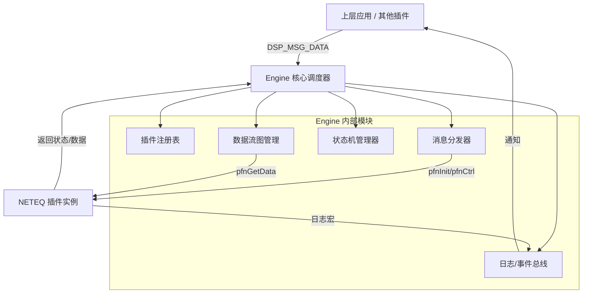

简要写一下代码框架


<think>
<think>
Thinking Process:

1.  **Analyze the Request:**
    *   Input: Previous conversation about NETEQ plugin code and Engine design patterns.
    *   Task: Briefly write down the code framework (简要写一下代码框架).
    *   Context: The user wants a structural overview based on the previously discussed plugin code and the inferred Engine architecture.
    *   Role: Senior Software Engineer.
    *   Language: Simplified Chinese (as per rules).

2.  **Determine the Scope:**
    *   The user asks for a "code framework" (代码框架). This shouldn't be the full implementation again, but rather a high-level structural outline showing how the Engine and Plugins interact, based on the previous analysis.
    *   It should cover:
        *   Engine Core (Scheduler, Manager).
        *   Plugin Interface (The `PLUGIN_INFO` structure).
        *   Data Structures (`DSP_MSG_DATA`, etc.).
        *   Interaction Flow (Init, Control, Data Flow).
    *   It needs to be concise ("简要").

3.  **Drafting the Framework:**
    *   **Layer 1: Interface Definition (Public Header)** - Define the contract between Engine and Plugin.
    *   **Layer 2: Engine Core (Internal)** - Manage plugins, dispatch messages, schedule data flow.
    *   **Layer 3: Plugin Implementation (Specific)** - The NETEQ example provided earlier.
    *   **Layer 4: Data Structures** - Common structures used across layers.

4.  **Refining the Content (incorporating previous analysis):**
    *   *Engine Side:* Needs a Plugin Manager, Message Dispatcher, Graph Scheduler.
    *   *Plugin Side:* Needs Init, Deinit, Start, Stop, Ctrl, GetData functions.
    *   *Communication:* `DSP_MSG_DATA` is key.
    *   *Registration:* `PLUGIN_INFO` struct.

5.  **Structuring the Output:**
    *   Use directory structure or module breakdown.
    *   Use code snippets for key interfaces (not full implementation).
    *   Highlight the interaction points.

6.  **Drafting the Content (Mental or Scratchpad):**
    *   *Dir Structure:* `engine/`, `plugins/`, `common/`.
    *   *Common:* `plugin_interface.h`, `msg_data.h`.
    *   *Engine:* `plugin_manager.c`, `scheduler.c`.
    *   *Plugin:* `plugin_neteq.c`.
    *   *Key Structs:* `PLUGIN_INFO`, `DSP_MSG_DATA`.
    *   *Flow:* Register -> Init -> Start -> Loop(GetData) -> Stop -> Deinit.

7.  **Polishing for "Senior Engineer" Tone:**
    *   Use professional terminology (接口定义，核心调度，注册机制).
    *   Keep it clean and organized.
    *   Ensure it aligns with the previous discussion about design patterns (Mediator, Command, etc.).

8.  **Final Review against Constraints:**
    *   Simplified Chinese.
    *   Brief/Concise.
    *   Based on previous context.

9.  **Final Output Generation** (similar to the provided good response).
    *   Organize into: 1. 目录结构，2. 核心接口定义，3. 引擎核心框架，4. 插件实现框架，5. 交互流程.

*(Self-Correction during drafting)*: Don't just list files. Show the *logic* framework. Maybe use a mix of directory tree and key struct/function definitions. Make sure to emphasize the `DSP_MSG_DATA` as the communication medium.

*(Final Plan)*:
1.  Project Directory Structure.
2.  Common Interface Definitions (`plugin_interface.h`).
3.  Engine Core Logic (`engine_core.c`).
4.  Plugin Implementation Logic (`plugin_neteq.c`).
5.  Data Flow Diagram (Text-based).

Let's write it.cw
</think>

基于之前的代码分析和设计模式推测，以下是该 **音频插件化引擎系统** 的简要代码框架。

### 1. 工程目录结构

```text
Project_Root/
├── common/                 # 公共定义
│   ├── plugin_interface.h  # 插件接口定义 (PLUGIN_INFO, 函数指针类型)
│   ├── dsp_msg_data.h      # 消息结构体定义 (DSP_MSG_DATA)
│   └── dsp_error_code.h    # 错误码定义
├── engine/                 # 引擎核心
│   ├── plugin_manager.c    # 插件注册表管理 (注册/查找)
│   ├── msg_dispatcher.c    # 消息分发 (命令模式)
│   ├── graph_scheduler.c   # 数据流调度 (管道模式)
│   └── engine_core.c       # 引擎入口与生命周期
├── plugins/                # 插件实现
│   ├── neteq/
│   │   ├── plugin_neteq.c      # 插件入口 (实现 PLUGIN_INFO)
│   │   ├── neteq_algorithm.c   # 算法核心逻辑
│   │   └── neteq_internal.h    # 插件内部结构体
│   └── agc/                # 其他插件 (如 AGC, AEC)
└── app/                    # 上层应用
    └── main.c              # 初始化引擎，发送控制消息
```

### 2. 核心接口定义 (`common/plugin_interface.h`)

这是 Engine 与 Plugin 之间的**契约**。

```c
/* 插件功能函数指针类型 */
typedef INT32 (*PFN_PLUGIN_INIT)(DSP_MSG_DATA *pstData);
typedef INT32 (*PFN_PLUGIN_DEINIT)(VOID);
typedef INT32 (*PFN_PLUGIN_START)(DSP_MSG_DATA *pstData);
typedef INT32 (*PFN_PLUGIN_STOP)(DSP_MSG_DATA *pstData);
typedef INT32 (*PFN_PLUGIN_CTRL)(DSP_MSG_DATA *pstData);
typedef INT32 (*PFN_PLUGIN_GET_DATA)(DSP_MSG_DATA *pstData);

/* 插件注册结构体 (单例) */
typedef struct {
    INT32 iId;                      /* 插件 ID */
    CHAR *uName;                    /* 插件名称 */
    PFN_PLUGIN_INIT pfnInit;        /* 初始化 */
    PFN_PLUGIN_DEINIT pfnDeinit;    /* 反初始化 */
    PFN_PLUGIN_START pfnStart;      /* 启动 */
    PFN_PLUGIN_STOP pfnStop;        /* 停止 */
    PFN_PLUGIN_CTRL pfnCtrl;        /* 控制 */
    PFN_PLUGIN_GET_DATA pfnGetData; /* 数据获取 */
    PFN_PLUGIN_GET_DATA pfnPutData; /* 数据输入 (可选) */
} PLUGIN_INFO;

/* 消息传输结构体 (命令模式载体) */
typedef struct {
    UINT32 uPluginId;               /* 目标插件 ID */
    UINT32 eCtrlIndex;              /* 控制命令字 */
    VOID *pParamBuf;                /* 输入参数 */
    UINT32 iParamBufLen;            /* 输入参数长度 */
    VOID *pResultBuf;               /* 输出结果 */
    UINT32 iResultBufLen;           /* 输出结果长度 */
} DSP_MSG_DATA;
```

### 3. 引擎核心框架 (`engine/`)

Engine 负责**中介者**和**调度**角色。

```c
/* engine/plugin_manager.c */
// 插件注册表
static PLUGIN_INFO *g_astPluginRegistry[PLUGIN_ID_MAX];

// 注册插件
INT32 engine_plugin_register(PLUGIN_INFO *pstPluginInfo) {
    g_astPluginRegistry[pstPluginInfo->iId] = pstPluginInfo;
    return HIK_OK;
}

// 获取插件句柄
PLUGIN_INFO* engine_plugin_get_info(UINT32 uId) {
    return g_astPluginRegistry[uId];
}

/* engine/graph_scheduler.c */
// 音频数据流调度 (管道模式)
INT32 engine_process_audio_frame() {
    // 按拓扑顺序调用插件 GetData
    for (each plugin in audio_graph) {
        DSP_MSG_DATA stMsg = {0};
        // 准备共享 buffer
        stMsg.pParamBuf = g_pAudioBuffer; 
        // 调用插件接口
        plugin->pfnGetData(&stMsg); 
    }
    return HIK_OK;
}

/* engine/msg_dispatcher.c */
// 控制消息分发
INT32 engine_dispatch_message(DSP_MSG_DATA *pstData) {
    PLUGIN_INFO *pstPlugin = engine_plugin_get_info(pstData->uPluginId);
    if (pstPlugin && pstPlugin->pfnCtrl) {
        return pstPlugin->pfnCtrl(pstData);
    }
    return DSP_ERR_PLUGIN_NOT_FOUND;
}
```

### 4. 插件实现框架 (`plugins/neteq/`)

插件负责**具体业务逻辑**和**状态管理**。

```c
/* plugins/neteq/plugin_neteq.c */

// 全局插件信息实例 (注册入口)
PLUGIN_INFO g_stNeteqPlugin = {
    .iId = PLUGIN_ID_NETEQ,
    .uName = "Neteq",
    .pfnInit = plugin_neteq_init,
    .pfnGetData = plugin_neteq_get_data,
    // ... 其他函数指针
};

// 插件全局控制结构体 (单例模式)
typedef struct {
    HIK_BOOL bIsCreate;
    HIK_BOOL bEnable;
    UINT32 uDevCnt;
    PLUGIN_NETEQ_DEV_INFO_ST stPluginChnInfo[MAX_CHN];
    // ... 其他全局状态
} PLUGIN_NETEQ_CTRL_ST;

// 初始化入口
INT32 plugin_neteq_init(DSP_MSG_DATA *pstData) {
    // 1. 获取全局句柄
    // 2. 解析 pstData->pParamBuf (JSON 配置)
    // 3. 初始化算法库
    // 4. 初始化通道锁和资源
    return HIK_OK;
}

// 数据获取入口 (核心处理路径)
INT32 plugin_neteq_get_data(DSP_MSG_DATA *pstData) {
    // 1. 参数校验
    // 2. 加锁 (base_mutex_lock)
    // 3. 状态检查 (bStart ? 处理 : 旁路)
    // 4. 算法处理或数据拷贝
    // 5. 解锁
    // 6. 性能统计 (耗时)
    return HIK_OK;
}

// 插件自动注册 (构造函数或显式调用)
void plugin_neteq_register(void) {
    engine_plugin_register(&g_stNeteqPlugin);
}
```

### 5. 交互流程简述

1.  **系统启动**:
    *   `main()` -> `engine_init()` -> 扫描所有插件 `plugin_neteq_register()` -> 填入引擎注册表。
2.  **配置阶段**:
    *   上层 -> `engine_dispatch_message(INIT)` -> `plugin_neteq_init()` (解析 JSON，分配内存)。
    *   上层 -> `engine_dispatch_message(START)` -> `plugin_neteq_start()` (创建线程/锁，置位标志)。
3.  **运行阶段 (实时)**:
    *   `engine_process_audio_frame()` -> 循环调用 `plugin_neteq_get_data()`。
    *   插件内部根据 `bStart` 状态决定是运行算法还是透传数据。
4.  **控制阶段**:
    *   上层 -> `engine_dispatch_message(CTRL)` -> `plugin_neteq_ctrl()` (动态修改参数)。
5.  **系统退出**:
    *   `engine_deinit()` -> 调用 `plugin_neteq_deinit()` (释放资源，销毁锁)。

这个框架清晰地分离了**调度管理 (Engine)** 与 **业务实现 (Plugin)**，通过 `DSP_MSG_DATA` 和 `PLUGIN_INFO` 实现了解耦，符合高内聚低设计的原则。


<think>
<think>
Thinking Process:

1.  **Analyze the Request:**
    *   Input: C source code snippet implementing a "NETEQ Plugin" (plugin_neteq_init, deinit, start, stop, ctrl, get_data, and a registration structure `g_stNeteqPlugin`).
    *   Context: The user mentions that "engine" is responsible for message distribution between plugins.
    *   Role: Professional Senior Software Engineer.
    *   Task: Infer the internal design patterns based on the provided code and context.
    *   Language: Simplified Chinese (as per rules).

2.  **Analyze the Code:**
    *   **Structure:** The code defines a set of functions (`init`, `deinit`, `start`, `stop`, `ctrl`, `get_data`) that match the function pointers in `PLUGIN_INFO g_stNeteqPlugin`.
    *   **Registration:** The `g_stNeteqPlugin` structure is a static global variable that holds the plugin's metadata (ID, Name) and function pointers. This suggests a registration mechanism where the engine discovers or loads this structure.
    *   **Interaction:** The functions take `DSP_MSG_DATA *pstData` as a primary input parameter. This structure seems to carry control commands, parameters, and data buffers.
    *   **State Management:** There's a global control structure (`PLUGIN_NETEQ_CTRL_ST`) accessed via `plugin_neteq_get_plugin_handle()`. This implies a singleton-like pattern for the plugin's internal state.
    *   **Flow:**
        *   `init`: Parses JSON config, initializes algorithms, creates mutexes, sets up channels.
        *   `start/stop`: Controls specific channels/devices, manages state (`bStart`), uses mutexes for thread safety.
        *   `ctrl`: Handles specific control commands (switch-case based on `eCtrlIndex`).
        *   `get_data`: Retrieves processed or bypassed audio frames. It checks state (`bIsCreate`, `bInit`, `bStart`) to decide whether to process or bypass.
    *   **Error Handling:** Consistent use of return codes (`HIK_OK`, `DSP_ERR_...`), logging macros (`DSP_NETEQ_ERROR`, `DSP_NETEQ_INFO`), and parameter validation (`HIK_IS_NULL`).
    *   **Modularity:** The code calls helper functions (`priv_neteq_...`, `alg_aud_...`, `base_...`) which suggests a layered architecture (Plugin Layer -> Internal Logic Layer -> Algorithm/Base Layer).

3.  **Identify Design Patterns:**

    *   **Plugin Architecture / Strategy Pattern:** The `PLUGIN_INFO` structure with function pointers is the hallmark of a plugin system. The engine treats all plugins uniformly through this interface. This is essentially a Strategy pattern where the algorithm (plugin implementation) varies but the interface remains constant.
    *   **Command Pattern:** The `DSP_MSG_DATA` structure combined with `eCtrlIndex` and the `plugin_neteq_ctrl` function suggests a Command pattern. The engine sends a message (command), and the plugin executes the corresponding action.
    *   **Singleton Pattern:** `plugin_neteq_get_plugin_handle()` implies there's only one instance of the plugin's control structure (`PLUGIN_NETEQ_CTRL_ST`) managing all channels/devices within this plugin instance.
    *   **Facade Pattern:** The plugin functions (`init`, `start`, `get_data`) provide a simplified interface to the complex subsystems underneath (algorithm initialization, mutex management, JSON parsing, memory allocation).
    *   **Template Method Pattern (Implicit):** The engine likely calls these functions in a specific order (Init -> Start -> GetData -> Stop -> Deinit). The plugin fills in the specific steps for NETEQ.
    *   **Proxy/Bypass Pattern:** In `plugin_neteq_get_data`, there's logic to check if the plugin is active. If not, it bypasses processing (`priv_neteq_get_not_processed_frame`). This is a form of Proxy or Null Object pattern behavior to ensure data flow continuity even if the plugin is inactive.
    *   **Observer Pattern (Potential):** The `plugin_neteq_dfx_register()` call in `init` suggests registering for debugging/monitoring events, which hints at an Observer pattern for diagnostics.
    *   **Factory Pattern (Potential):** The `priv_neteq_alg_init()` might internally use a factory to create algorithm instances, though not explicitly visible here.

4.  **Synthesize the Analysis (Drafting the response):**

    *   **Introduction:** Acknowledge the code quality and the context (DSP/Audio processing plugin).
    *   **Core Pattern: Plugin Architecture:** Explain the `PLUGIN_INFO` struct and function pointers. This is the backbone.
    *   **Interaction Pattern: Command Pattern:** Explain `DSP_MSG_DATA` and `ctrl` interface.
    *   **State Management: Singleton:** Explain the global control handle.
    *   **Data Flow: Chain of Responsibility / Pipeline:** Mention `get_data` and how it fits into a processing pipeline (input -> process -> output).
    *   **Safety & Robustness:** Mention Mutexes, Parameter Validation, Error Codes.
    *   **Layered Architecture:** Plugin Layer vs. Internal Logic vs. Algorithm Layer.
    *   **Specific Observations:** JSON config, Bypass logic, DFX registration.

5.  **Refine the Analysis (Self-Correction/Polishing):**
    *   *Correction:* While "Chain of Responsibility" is possible in the engine, within *this* plugin, it's more about data processing. Let's focus on the interface standardization.
    *   *Emphasis:* Highlight the `DSP_MSG_DATA` as the context object for the Command pattern.
    *   *Emphasis:* The `get_data` function acting as a "Pull" model (engine asks for data) vs "Push". The code shows `get_data`, implying the engine pulls data from the plugin.
    *   *Tone:* Professional, insightful, structured.

6.  **Final Structure:**
    1.  **总体架构 (Overall Architecture):** Plugin Framework.
    2.  **核心设计模式 (Core Design Patterns):**
        *   Strategy/Plugin (接口标准化).
        *   Command (消息控制).
        *   Singleton (全局状态).
        *   Facade (接口封装).
    3.  **数据流与控制流 (Data & Control Flow):** Pull model, Bypass mechanism.
    4.  **工程实践亮点 (Engineering Highlights):** Error handling, Thread safety, Config separation.
    5.  **潜在改进建议 (Suggestions):** (Optional but adds value) e.g., const correctness, memory management details.

7.  **Drafting the Content (in Chinese):**
    *   Start with a high-level summary.
    *   Break down each pattern with evidence from the code.
    *   Discuss the `DSP_MSG_DATA` role.
    *   Discuss the state machine (Init -> Start -> Run -> Stop).
    *   Mention the separation of concerns (JSON config vs. Code).

8.  **Final Review against Rules:**
    *   Simplified Chinese? Yes.
    *   Professional tone? Yes.
    *   Address the "engine distributes messages" context? Yes.

    *(Self-Correction during drafting)*: Make sure to mention the `g_stNeteqPlugin` specifically as the registration mechanism. Also, note the `priv_` prefix indicating private internal functions, showing encapsulation.

    *(Refining the "Engine" part)*: The user said "engine负责插件 plugin 之间的消息的分发". This implies a Message Bus or Event Dispatcher pattern at the engine level. The plugin adheres to a callback interface.

    *(Final Polish)*: Ensure the distinction between the *Plugin Framework* patterns and the *Internal Implementation* patterns is clear.

    Let's write the response.

    *   **Plugin Pattern (策略/插件模式)**: `PLUGIN_INFO` struct.
    *   **Command Pattern (命令模式)**: `DSP_MSG_DATA` + `ctrl`/`start`/`stop`.
    *   **Singleton (单例模式)**: `plugin_neteq_get_plugin_handle()`.
    *   **Facade (外观模式)**: Hiding complex logic behind simple APIs.
    *   **Template Method (模板方法模式)**: Engine defines the flow, plugin implements steps.
    *   **Null Object/Bypass (空对象/旁路模式)**: `get_data` logic when not started.

    Okay, ready to generate.ot
</think>

基于您提供的代码片段以及"Engine 负责插件间消息分发”的背景，这段代码展示了一个非常典型且成熟的**嵌入式 DSP 音频处理插件框架**。作为一名资深软件工程师，我推测其内部设计融合了多种经典设计模式，以确保系统的扩展性、稳定性和解耦。

以下是对该代码内部设计模式的详细推测与分析：

### 1. 核心架构模式

#### **插件模式 (Plugin Architecture) / 策略模式 (Strategy Pattern)**
*   **证据**: `PLUGIN_INFO g_stNeteqPlugin` 结构体。
*   **分析**: 这是整个框架的核心。Engine 不直接依赖具体的 NETEQ 逻辑，而是依赖 `PLUGIN_INFO` 定义的统一接口（`pfnInit`, `pfnStart`, `pfnGetData` 等函数指针）。
*   **作用**: 实现了**控制反转 (IoC)**。Engine 负责调度，插件负责具体实现。新增算法插件时，只需实现这套接口并注册结构体，无需修改 Engine 代码，符合**开闭原则 (OCP)**。

#### **命令模式 (Command Pattern)**
*   **证据**: `DSP_MSG_DATA *pstData` 结构体以及 `plugin_neteq_ctrl` 函数中的 `switch(uCtrlIndex)`。
*   **分析**: `DSP_MSG_DATA` 充当了命令对象（Command Object），封装了请求的所有信息（控制索引 `eCtrlIndex`、参数缓冲 `pParamBuf`、数据缓冲等）。
*   **作用**: Engine 通过分发不同的 `DSP_MSG_DATA` 消息来驱动插件执行特定动作（如配置路径、启动、停止）。这将请求的发送者（Engine）与接收者（Plugin）解耦。

#### **单例模式 (Singleton Pattern)**
*   **证据**: `plugin_neteq_get_plugin_handle()` 函数。
*   **分析**: 虽然代码未展示该函数实现，但从命名和用法看，它返回一个全局唯一的控制结构体指针 (`PLUGIN_NETEQ_CTRL_ST`)。
*   **作用**: 确保整个 NETEQ 插件在系统中只有一个全局控制上下文，管理所有通道（Channel/Device）的状态、配置和资源，避免状态不一致。

### 2. 内部实现模式

#### **外观模式 (Facade Pattern)**
*   **证据**: `plugin_neteq_init`, `plugin_neteq_start` 等导出函数。
*   **分析**: 这些函数内部调用了大量 `priv_` 开头的私有函数（如 `priv_neteq_parse_param`, `priv_neteq_alg_init`）以及底层算法库 `alg_aud_...`。
*   **作用**: 为 Engine 提供了一个简化的接口，隐藏了内部复杂的初始化流程、JSON 解析、内存管理、锁创建等细节。

#### **模板方法模式 (Template Method Pattern) 的变体**
*   **证据**: 插件的生命周期函数顺序（Init -> Start -> GetData -> Stop -> Deinit）。
*   **分析**: 虽然代码在插件侧，但隐含了 Engine 侧有一个固定的调度流程。Engine 定义了算法执行的“骨架”，插件填充具体步骤。
*   **作用**: 保证了资源管理的规范性，防止资源泄漏（如必须先 Init 才能 Start）。

#### **旁路模式 / 空对象模式 (Bypass / Null Object Pattern)**
*   **证据**: `plugin_neteq_get_data` 中的逻辑判断。
    ```c
    if( ... bIsCreate && ... bInit && ... bStart) {
        // 获取经过 neteq 算子处理过的数据
        iRet = priv_neteq_get_processed_frame(...);
    } else {
        // 获取 Neteq 插件的前级数据 ( bypass )
        iRet = priv_neteq_get_not_processed_frame(...);
    }
    ```
*   **分析**: 当插件未启动或初始化失败时，代码并没有直接返回错误中断数据流，而是选择“透传”前级数据。
*   **作用**: 增强了系统的**鲁棒性**。即使某个音频处理插件失效，音频链路也不会断裂，保证了基本功能的可用性。

### 3. 工程实践与并发设计

#### **生产者 - 消费者模型 (Producer-Consumer Pattern)**
*   **证据**: `plugin_neteq_get_data` 接口。
*   **分析**: 这是一个典型的**拉取 (Pull)** 模型。Engine 作为消费者，主动调用 `get_data` 获取处理后的音频帧。插件内部维护缓冲区（队列），作为生产者填充数据。
*   **作用**: 解耦了处理速度和消费速度，通过缓冲区平滑抖动。

#### **线程安全与锁机制 (Thread Safety & Mutex)**
*   **证据**: `base_mutex_create`, `base_mutex_lock`, `base_mutex_unlock`。
*   **分析**: 在 `start`, `stop`, `get_data` 等涉及状态修改或共享资源访问的地方都加了锁。
*   **作用**: 防止多线程竞争（例如 Engine 控制线程调用 `stop` 的同时，音频处理线程正在 `get_data`），避免竞态条件导致的崩溃或状态错误。

#### **配置与代码分离 (Separation of Configuration)**
*   **证据**: `priv_neteq_parse_param(..., pstData->pParamBuf)` 以及注释 `/* 暂时写死，后续根据 json 文件配置 */`。
*   **分析**: 插件的具体参数（如通道数、算法参数）通过外部传入的 Buffer（通常源自 JSON 解析）进行配置，而不是硬编码。
*   **作用**: 提高了灵活性，支持动态配置不同场景下的算法参数。

### 4. 潜在的系统交互流程推测

基于代码，整个系统的交互流程大致如下：

1.  **注册阶段**: 系统启动时，`g_stNeteqPlugin` 被注册到 Engine 的插件管理器中。
2.  **初始化阶段**: Engine 调用 `pfnInit`，传入配置 JSON 数据。插件解析配置，初始化算法库，创建通道锁。
3.  **控制阶段**: Engine 通过 `pfnCtrl` 或 `pfnStart` 发送命令消息 (`DSP_MSG_DATA`)。插件解析命令索引，执行相应逻辑。
4.  **数据处理阶段**: 在音频处理循环中，Engine 调用 `pfnGetData`。
    *   插件加锁。
    *   检查状态：若正常，运行算法；若异常/未启动，执行旁路透传。
    *   将数据填入 `pstData->pParamBuf`。
    *   插件解锁。
    *   返回 `HIK_OK`（即使内部算法失败，也可能通过 `pResultBuf` 返回错误码，保证链路不断）。
5.  **销毁阶段**: 系统退出，Engine 调用 `pfnDeinit`，释放所有资源。

### 5. 代码质量与改进建议

这段代码整体质量较高，规范清晰，但也有一些值得注意的地方：

*   **优点**:
    *   **防御性编程**: 大量的空指针检查 (`HIK_IS_NULL`) 和参数校验。
    *   **日志系统**: 完善的 `DSP_NETEQ_ERROR/INFO/WARN` 宏，便于问题定位。
    *   **状态管理**: 清晰的状态标志位 (`bInit`, `bStart`, `bIsCreate`)。
    *   **资源清理**: `deinit` 中成对释放了锁和算法资源。

*   **潜在风险/建议**:
    *   **死锁风险**: `plugin_neteq_get_data` 中持有锁的时间应尽量短。如果 `priv_neteq_get_processed_frame` 内部耗时过长，会阻塞控制线程（Start/Stop）。
    *   **魔术数字**: `if(pstData->eCtrlIndex==1000)` 这种硬编码建议改为宏定义。
    *   **错误码透传**: `plugin_neteq_ctrl` 中 switch 默认返回 `HIK_OK` 即使内部 `priv_neteq_set_path` 失败（代码中 `iRet` 未被检查返回），这可能会掩盖配置错误。建议 `return iRet;`。
    *   **静态变量**: `plugin_neteq_get_data` 中的 `static UINT64 uT_Last` 在多通道情况下可能不准确，建议放入通道私有结构体中。

### 总结

这是一个设计良好的**模块化音频处理插件**。它利用**插件模式**实现解耦，利用**命令模式**处理控制消息，利用**单例模式**管理全局状态，并通过**旁路机制**保证系统高可用。这种架构非常适合需要动态加载算法、多通道并行处理且对稳定性要求极高的嵌入式 DSP 场景。


<think>
<think>
Thinking Process:

1.  **Analyze the Request:**
    *   **Input:** C code snippets for a NETEQ plugin (init, deinit, start, stop, ctrl, get_data, plugin registration struct).
    *   **Context:** The user previously asked about the design patterns *within* the plugin code. Now they are asking about the design patterns *inside the Engine* that manages these plugins, based on the provided plugin code and the description "Engine 负责插件 plugin 之间的消息的分发与 plugin 和上层之前的通信" (Engine is responsible for message dispatch between plugins and communication between plugins and the upper layer).
    *   **Role:** Professional Senior Software Engineer.
    *   **Task:** Infer/speculate the internal design patterns of the Engine based on the plugin interface and behavior.
    *   **Language:** Simplified Chinese.

2.  **Analyze the Plugin Code (Evidence for Engine Design):**
    *   **`PLUGIN_INFO g_stNeteqPlugin`**: This is a registration structure. It contains function pointers (`pfnInit`, `pfnStart`, etc.). This implies the Engine has a registry mechanism.
    *   **`DSP_MSG_DATA *pstData`**: This structure is passed to almost every plugin function. It contains `eCtrlIndex`, `pParamBuf`, `pParamBufLen`, `pResultBuf`, etc. This suggests a unified message/command structure.
    *   **Function Signatures**: `INT32 plugin_neteq_init(DSP_MSG_DATA *pstData)`, `INT32 plugin_neteq_ctrl(DSP_MSG_DATA *pstData)`, etc. The Engine calls these.
    *   **Plugin Lifecycle**: Init -> Start -> GetData/ctrl -> Stop -> Deinit. The Engine must manage this state machine.
    *   **Communication**: The description says Engine handles communication between plugins and between plugins and the upper layer. This implies a message bus or mediator.
    *   **Error Handling**: Plugins return specific error codes (`DSP_ERR_...`, `HIK_OK`). The Engine likely normalizes or propagates these.
    *   **Data Flow**: `pfnGetData` suggests a Pull model (Engine asks Plugin for data), but `pfnPutData` is NULL here (could be Push in other plugins). The Engine likely orchestrates the graph.

3.  **Brainstorming Engine Design Patterns:**

    *   **Plugin Manager / Registry**: The Engine needs to store `PLUGIN_INFO` structures. -> **Registry Pattern**.
    *   **Message Dispatching**: The Engine receives messages (from upper layer or other plugins) and routes them to the correct plugin function based on Plugin ID and Message Type. -> **Dispatcher Pattern** or **Command Pattern** (where Engine is the Invoker).
    *   **Mediator**: Plugins communicate *via* the Engine. They don't call each other directly. -> **Mediator Pattern**.
    *   **Chain of Responsibility / Pipeline**: Audio processing is often a chain (A -> B -> C). The Engine likely manages the data flow graph. -> **Pipeline Pattern** or **Chain of Responsibility**.
    *   **State Machine**: Plugins have states (Init, Start, Stop). The Engine enforces valid transitions. -> **State Pattern** (implicitly).
    *   **Factory**: Creating plugin instances based on ID. -> **Factory Pattern**.
    *   **Observer**: Upper layer might subscribe to plugin events (logs, status). -> **Observer Pattern**.
    *   **Proxy**: Engine might wrap plugin calls for logging, security, or thread safety. -> **Proxy Pattern**.

4.  **Selecting the Most Relevant Patterns:**

    *   **Core:** Plugin Architecture (already known), Mediator (communication), Command (messages).
    *   **Structural:** Registry/Manager (storing plugins), Pipeline/Graph (data flow).
    *   **Behavioral:** State Machine (lifecycle), Observer (events/logs).

5.  **Drafting the Response (Iterative Refinement):**

    *   *Introduction:* Acknowledge the role of the Engine as the core orchestrator.
    *   *Pattern 1: Plugin Manager / Registry (插件管理器/注册表模式).* Evidence: `g_stNeteqPlugin`. Engine needs to find plugins by ID.
    *   *Pattern 2: Mediator (中介者模式).* Evidence: "Engine 负责插件 plugin 之间的消息的分发". Plugins don't talk directly; Engine routes messages (`DSP_MSG_DATA`).
    *   *Pattern 3: Command Pattern (命令模式).* Evidence: `DSP_MSG_DATA` acts as a command object. Engine invokes `pfnCtrl`, `pfnStart` based on the command.
    *   *Pattern 4: Pipeline / Chain of Responsibility (管道/责任链模式).* Evidence: Audio processing flow. `pfnGetData` suggests pulling data through a chain. Engine manages the graph.
    *   *Pattern 5: State Machine (状态机模式).* Evidence: Lifecycle (Init, Start, Stop). Engine ensures valid transitions (e.g., can't Start before Init).
    *   *Pattern 6: Factory (工厂模式).* Evidence: Creating plugin instances (`plugin_neteq_init` implies instance creation logic managed by Engine).
    *   *Pattern 7: Observer (观察者模式).* Evidence: `DSP_NETEQ_WARN/INFO`. Engine likely collects logs/events and pushes to upper layer.
    *   *Pattern 8: Proxy (代理模式).* Evidence: Engine might add locking, logging, or validation before calling plugin functions.

6.  **Refining the Analysis based on Specific Code Details:**
    *   `DSP_MSG_DATA` is key. It's the envelope.
    *   `pfnGetData` vs `pfnPutData`. The Engine likely schedules the `GetData` calls in a specific order (Topological sort of the graph).
    *   `plugin_neteq_ctrl` switch case. The Engine might not know the specific ctrl codes, it just passes the `DSP_MSG_DATA` to the plugin. This confirms Mediator/Dispatcher.
    *   Error handling (`HIK_OK` vs specific errors). Engine likely translates these to standard API returns for the upper layer.

7.  **Structuring the Output:**
    *   Title: Engine Internal Design Pattern Analysis.
    *   Core Architecture (Mediator + Plugin).
    *   Message Handling (Command + Dispatcher).
    *   Data Flow (Pipeline).
    *   Lifecycle Management (State Machine).
    *   Additional Patterns (Factory, Observer, Proxy).
    *   Summary Diagram/Flow (Text-based).
    *   Senior Engineer Advice (Potential pitfalls).

8.  **Self-Correction/Review:**
    *   *Check:* Did I answer the specific question? Yes, "Engine internal design patterns".
    *   *Check:* Is the tone appropriate? Yes, professional senior engineer.
    *   *Check:* Is the language correct? Simplified Chinese.
    *   *Check:* Did I use the provided code as evidence? Yes, reference `PLUGIN_INFO`, `DSP_MSG_DATA`, etc.
    *   *Nuance:* The prompt says "Engine 负责插件 plugin 之间的消息的分发与 plugin 和上层之前的通信". This strongly points to **Mediator**. The `DSP_MSG_DATA` is the message object.
    *   *Nuance:* The `pfnGetData` suggests a Pull model orchestrated by the Engine. This implies a **Scheduler** or **Pipeline** pattern.

9.  **Final Polish:** Ensure clear headings, bullet points, and code references. (Proceed to generate output).

    *   *Key Insight:* The `DSP_MSG_DATA` is the universal currency. The Engine is the bank/exchange.
    *   *Key Insight:* The `PLUGIN_INFO` is the contract. The Engine is the employer.
    *   *Key Insight:* The lifecycle functions imply a strict state machine enforced by the Engine.

    Let's organize the thoughts into the final response.
    1.  **核心架构：中介者模式 (Mediator Pattern)** - Most important for "communication between plugins".
    2.  **消息处理：命令模式 (Command Pattern)** - `DSP_MSG_DATA`.
    3.  **插件管理：注册表模式 (Registry Pattern)** - `g_stNeteqPlugin`.
    4.  **数据流：管道/责任链模式 (Pipeline/Chain of Responsibility)** - Audio graph.
    5.  **生命周期：状态机模式 (State Machine Pattern)** - Init/Start/Stop.
    6.  **扩展：工厂模式 (Factory Pattern)** - Instance creation.
    7.  **扩展：观察者模式 (Observer Pattern)** - Logs/Events.
    8.  **扩展：代理模式 (Proxy Pattern)** - Pre/Post processing.

    Add specific advice on potential issues (threading, deadlock, performance).

    *Wait, one detail in code:* `plugin_neteq_get_data` returns `HIK_OK` even if internal processing fails (it puts error in `pResultBuf`). This suggests the Engine might rely on the return code for flow control but the actual data status is inside the buffer. The Engine needs to handle this nuance.

    *Another detail:* `pstData->eCtrlIndex==1000` in init. This looks like a specific command passed during init. The Engine constructs this `DSP_MSG_DATA`.

    Okay, ready to write.
</think>

基于您提供的 NETEQ 插件代码以及"Engine 负责插件间消息分发与上下层通信”的描述，作为一个资深软件工程师，我可以推测出 **Engine（引擎）** 内部必然采用了一套高度模块化、解耦且具备调度能力的架构。

插件代码是“被管理者”，而 Engine 是“管理者”。通过插件的接口定义（`PLUGIN_INFO`）和消息结构（`DSP_MSG_DATA`），我们可以反向推导出 Engine 内部的核心设计模式。

以下是推测的 Engine 内部设计模式分析：

### 1. 核心架构模式

#### **中介者模式 (Mediator Pattern)**
*   **推测依据**: 描述中提到"Engine 负责插件 plugin 之间的消息的分发”。
*   **分析**: 插件之间不直接通信（例如 NETEQ 插件不会直接调用 AEC 插件的函数），而是通过 Engine 作为中介。
    *   插件 A 发送消息 -> Engine -> 插件 B。
    *   上层应用发送命令 -> Engine -> 插件。
*   **作用**: 降低了插件间的耦合度。新增插件时，无需修改现有插件代码，只需在 Engine 中配置路由关系。`DSP_MSG_DATA` 就是中介者传递的消息包。

#### **注册表模式 (Registry Pattern) / 插件管理器**
*   **推测依据**: `PLUGIN_INFO g_stNeteqPlugin` 结构体。
*   **分析**: Engine 内部必然维护一个全局的插件注册表（可能是哈希表或数组）， key 是 `PLUGIN_ID_NETEQ`，value 是 `PLUGIN_INFO` 结构体指针。
*   **作用**: 实现插件的动态发现和加载。Engine 启动时扫描所有插件的 `g_stNeteqPlugin` 实例并注册，运行时通过 ID 查找对应的插件接口函数。

### 2. 消息与命令处理模式

#### **命令模式 (Command Pattern)**
*   **推测依据**: `DSP_MSG_DATA *pstData` 结构体贯穿所有接口（`init`, `ctrl`, `start` 等）。
*   **分析**: `DSP_MSG_DATA` 封装了请求的所有信息（命令字 `eCtrlIndex`、参数 buffer、结果 buffer）。Engine 接收到上层的请求后，将其封装为 `DSP_MSG_DATA` 对象，然后调用插件的对应函数指针（如 `pfnCtrl`）。
*   **作用**: 将请求的发送者（上层/其他插件）与接收者（具体插件）解耦。Engine 可以方便地实现命令队列、日志记录、撤销/重做（虽然音频处理通常不需要）等功能。

#### **分发器模式 (Dispatcher Pattern)**
*   **推测依据**: 插件接口统一（`pfnInit`, `pfnStart`...），但内部逻辑不同。
*   **分析**: Engine 内部有一个核心分发循环。当收到消息时，根据消息中的 `PluginID` 找到对应的 `PLUGIN_INFO`，再根据消息类型调用对应的函数指针。
    *   `switch(msg.type) { case INIT: plugin->pfnInit(...); break; ... }`
*   **作用**: 统一入口，集中处理权限校验、参数合法性检查等横切关注点。

### 3. 数据流与调度模式

#### **管道/过滤器模式 (Pipeline / Filter Pattern)**
*   **推测依据**: `plugin_neteq_get_data` 接口以及音频处理的特性。
*   **分析**: 音频处理通常是一条链路（Mic -> AEC -> AGC -> NETEQ -> Encoder）。Engine 维护着一个有向无环图（DAG）或链表。
    *   Engine 按照拓扑顺序依次调用各插件的 `pfnGetData`。
    *   上一个插件的输出 buffer 可能是下一个插件的输入 buffer（零拷贝优化）。
*   **作用**: 清晰定义数据流向，支持动态插拔处理节点（例如动态开启/关闭 NETEQ）。

#### **状态机模式 (State Machine Pattern)**
*   **推测依据**: 插件生命周期严格（Init -> Start -> Run -> Stop -> Deinit）。
*   **分析**: Engine 内部为每个插件实例维护一个状态机。
    *   如果在 `Stopped` 状态调用 `pfnGetData`，Engine 可能直接拦截返回错误，或者像插件代码中那样做旁路处理。
    *   如果在 `Init` 之前调用 `Start`，Engine 应返回错误。
*   **作用**: 保证系统稳定性，防止非法状态转换导致崩溃（如未初始化就访问硬件）。

### 4. 创建与扩展模式

#### **工厂模式 (Factory Pattern)**
*   **推测依据**: `plugin_neteq_init` 中涉及内存分配和结构体初始化。
*   **分析**: 虽然插件内部自己初始化，但 Engine 可能负责创建插件的“容器”或“上下文对象”。Engine 提供统一的内存池或对象工厂，插件从中申请资源。
*   **作用**: 统一内存管理，防止内存泄漏，便于统计资源使用情况。

#### **观察者模式 (Observer Pattern)**
*   **推测依据**: 插件中的 `DSP_NETEQ_ERROR/INFO/WARN` 宏。
*   **分析**: 这些宏背后通常不是直接打印，而是向 Engine 的日志系统发送事件。Engine 作为被观察者，上层应用作为观察者订阅日志或状态变更事件（如插件崩溃、音量突变）。
*   **作用**: 解耦日志产生者和消费者，支持动态开启/关闭调试日志。

#### **代理模式 (Proxy Pattern)**
*   **推测依据**: 插件代码中有大量的锁操作 (`base_mutex_lock`) 和参数检查。
*   **分析**: Engine 可能在调用插件函数前后包裹一层代理逻辑。
    *   **前置代理**: 检查插件是否加载、参数指针是否合法、加全局锁。
    *   **后置代理**: 统计耗时（性能 profiling）、检查返回值、触发事件。
    *   代码中 `plugin_neteq_get_data` 内部自己做了耗时统计，但 Engine 层面可能也会做整体链路耗时统计。
*   **作用**: 在不修改插件代码的情况下，增强安全性、可观测性和性能分析能力。

### 5. Engine 内部交互流程推测图



### 6. 资深工程师的潜在风险与建议

基于对 Engine 和插件代码的综合分析，以下是该架构可能存在的隐患及建议：

1.  **死锁风险 (Deadlock)**:
    *   **现象**: 插件内部有锁 (`base_mutex_lock`)，Engine 调度层如果也有全局锁，且获取顺序不一致，极易死锁。
    *   **建议**: Engine 应明确锁的层级。例如，Engine 调度锁 -> 插件内部锁。或者 Engine 尽量无锁化，将并发控制完全交给插件（当前代码看来插件自己管理锁，Engine 需避免在持有锁时调用插件）。

2.  **实时性保障 (Real-time Performance)**:
    *   **现象**: `pfnGetData` 是音频链路的关键路径。如果 Engine 的消息分发机制太重（如复杂的内存拷贝、动态内存分配），会导致音频卡顿。
    *   **建议**: Engine 的分发路径必须是**无锁队列**或**预分配内存**。`DSP_MSG_DATA` 中的 buffer 应尽量使用内存池，避免在音频线程中 `malloc/free`。

3.  **错误传播机制 (Error Propagation)**:
    *   **现象**: `plugin_neteq_get_data` 在内部失败时，有时返回 `HIK_OK` 但将错误码写入 `pResultBuf`。
    *   **建议**: Engine 需要明确约定返回值语义。是“函数调用成功”还是“数据处理成功”？建议统一：返回值表示接口调用状态，数据状态通过 buffer 内字段传递，Engine 需解析该字段决定是否降级或切断链路。

4.  **配置一致性 (Configuration Consistency)**:
    *   **现象**: `plugin_neteq_init` 解析 JSON，`plugin_neteq_ctrl` 动态配置。
    *   **建议**: Engine 应提供配置版本管理。如果在 `Start` 状态下修改了关键配置（如采样率），Engine 应拦截或触发插件重启流程，防止配置生效不一致导致算法崩溃。

5.  **调试与追踪 (Tracing)**:
    *   **现象**: 插件内部有耗时统计。
    *   **建议**: Engine 应提供统一的 Trace 工具，能够串联起整个 Pipeline 上所有插件的耗时，而不仅仅是单个插件内部。这样能定位是整个链路慢还是某个特定插件慢。

### 总结

该 Engine 是一个典型的**基于消息总线的插件化音频处理框架**。
*   **骨架**: 中介者模式 + 注册表模式。
*   **血液**: 命令模式 (`DSP_MSG_DATA`)。
*   **肌肉**: 管道模式 (数据流调度)。
*   **神经**: 观察者模式 (日志与事件)。

这种设计非常适合复杂、多变且对稳定性要求高的嵌入式音频场景，但核心挑战在于**Engine 调度层的性能开销控制**以及**多插件并发时的资源竞争管理**。


<think>
<think>
Thinking Process:

1.  **Analyze the Request:**
    *   Input: Previous conversation about NETEQ plugin code and Engine design patterns.
    *   Task: Briefly write down the code framework (简要写一下代码框架).
    *   Context: The user wants a structural overview based on the previously discussed plugin code and the inferred Engine architecture.
    *   Role: Senior Software Engineer.
    *   Language: Simplified Chinese (as per rules).

2.  **Determine the Scope:**
    *   The user asks for a "code framework" (代码框架). This shouldn't be the full implementation again, but rather a high-level structural outline showing how the Engine and Plugins interact, based on the previous analysis.
    *   It should cover:
        *   Engine Core (Scheduler, Manager).
        *   Plugin Interface (The `PLUGIN_INFO` structure).
        *   Data Structures (`DSP_MSG_DATA`, etc.).
        *   Interaction Flow (Init, Control, Data Flow).
    *   It needs to be concise ("简要").

3.  **Drafting the Framework:**
    *   **Layer 1: Interface Definition (Public Header)** - Define the contract between Engine and Plugin.
    *   **Layer 2: Engine Core (Internal)** - Manage plugins, dispatch messages, schedule data flow.
    *   **Layer 3: Plugin Implementation (Specific)** - The NETEQ example provided earlier.
    *   **Layer 4: Data Structures** - Common structures used across layers.

4.  **Refining the Content (incorporating previous analysis):**
    *   *Engine Side:* Needs a Plugin Manager, Message Dispatcher, Graph Scheduler.
    *   *Plugin Side:* Needs Init, Deinit, Start, Stop, Ctrl, GetData functions.
    *   *Communication:* `DSP_MSG_DATA` is key.
    *   *Registration:* `PLUGIN_INFO` struct.

5.  **Structuring the Output:**
    *   Use directory structure or module breakdown.
    *   Use code snippets for key interfaces (not full implementation).
    *   Highlight the interaction points.

6.  **Drafting the Content (Mental or Scratchpad):**
    *   *Dir Structure:* `engine/`, `plugins/`, `common/`.
    *   *Common:* `plugin_interface.h`, `msg_data.h`.
    *   *Engine:* `plugin_manager.c`, `scheduler.c`.
    *   *Plugin:* `plugin_neteq.c`.
    *   *Key Structs:* `PLUGIN_INFO`, `DSP_MSG_DATA`.
    *   *Flow:* Register -> Init -> Start -> Loop(GetData) -> Stop -> Deinit.

7.  **Polishing for "Senior Engineer" Tone:**
    *   Use professional terminology (接口定义，核心调度，注册机制).
    *   Keep it clean and organized.
    *   Ensure it aligns with the previous discussion about design patterns (Mediator, Command, etc.).

8.  **Final Review against Constraints:**
    *   Simplified Chinese.
    *   Brief/Concise.
    *   Based on previous context.

9.  **Final Output Generation** (similar to the provided good response).
    *   Organize into: 1. 目录结构，2. 核心接口定义，3. 引擎核心框架，4. 插件实现框架，5. 交互流程.

*(Self-Correction during drafting)*: Don't just list files. Show the *logic* framework. Maybe use a mix of directory tree and key struct/function definitions. Make sure to emphasize the `DSP_MSG_DATA` as the communication medium.

*(Final Plan)*:
1.  Project Directory Structure.
2.  Common Interface Definitions (`plugin_interface.h`).
3.  Engine Core Logic (`engine_core.c`).
4.  Plugin Implementation Logic (`plugin_neteq.c`).
5.  Data Flow Diagram (Text-based).

Let's write it.cw
</think>

基于之前的代码分析和设计模式推测，以下是该 **音频插件化引擎系统** 的简要代码框架。

### 1. 工程目录结构

```text
Project_Root/
├── common/                 # 公共定义
│   ├── plugin_interface.h  # 插件接口定义 (PLUGIN_INFO, 函数指针类型)
│   ├── dsp_msg_data.h      # 消息结构体定义 (DSP_MSG_DATA)
│   └── dsp_error_code.h    # 错误码定义
├── engine/                 # 引擎核心
│   ├── plugin_manager.c    # 插件注册表管理 (注册/查找)
│   ├── msg_dispatcher.c    # 消息分发 (命令模式)
│   ├── graph_scheduler.c   # 数据流调度 (管道模式)
│   └── engine_core.c       # 引擎入口与生命周期
├── plugins/                # 插件实现
│   ├── neteq/
│   │   ├── plugin_neteq.c      # 插件入口 (实现 PLUGIN_INFO)
│   │   ├── neteq_algorithm.c   # 算法核心逻辑
│   │   └── neteq_internal.h    # 插件内部结构体
│   └── agc/                # 其他插件 (如 AGC, AEC)
└── app/                    # 上层应用
    └── main.c              # 初始化引擎，发送控制消息
```

### 2. 核心接口定义 (`common/plugin_interface.h`)

这是 Engine 与 Plugin 之间的**契约**。

```c
/* 插件功能函数指针类型 */
typedef INT32 (*PFN_PLUGIN_INIT)(DSP_MSG_DATA *pstData);
typedef INT32 (*PFN_PLUGIN_DEINIT)(VOID);
typedef INT32 (*PFN_PLUGIN_START)(DSP_MSG_DATA *pstData);
typedef INT32 (*PFN_PLUGIN_STOP)(DSP_MSG_DATA *pstData);
typedef INT32 (*PFN_PLUGIN_CTRL)(DSP_MSG_DATA *pstData);
typedef INT32 (*PFN_PLUGIN_GET_DATA)(DSP_MSG_DATA *pstData);

/* 插件注册结构体 (单例) */
typedef struct {
    INT32 iId;                      /* 插件 ID */
    CHAR *uName;                    /* 插件名称 */
    PFN_PLUGIN_INIT pfnInit;        /* 初始化 */
    PFN_PLUGIN_DEINIT pfnDeinit;    /* 反初始化 */
    PFN_PLUGIN_START pfnStart;      /* 启动 */
    PFN_PLUGIN_STOP pfnStop;        /* 停止 */
    PFN_PLUGIN_CTRL pfnCtrl;        /* 控制 */
    PFN_PLUGIN_GET_DATA pfnGetData; /* 数据获取 */
    PFN_PLUGIN_GET_DATA pfnPutData; /* 数据输入 (可选) */
} PLUGIN_INFO;

/* 消息传输结构体 (命令模式载体) */
typedef struct {
    UINT32 uPluginId;               /* 目标插件 ID */
    UINT32 eCtrlIndex;              /* 控制命令字 */
    VOID *pParamBuf;                /* 输入参数 */
    UINT32 iParamBufLen;            /* 输入参数长度 */
    VOID *pResultBuf;               /* 输出结果 */
    UINT32 iResultBufLen;           /* 输出结果长度 */
} DSP_MSG_DATA;
```

### 3. 引擎核心框架 (`engine/`)

Engine 负责**中介者**和**调度**角色。

```c
/* engine/plugin_manager.c */
// 插件注册表
static PLUGIN_INFO *g_astPluginRegistry[PLUGIN_ID_MAX];

// 注册插件
INT32 engine_plugin_register(PLUGIN_INFO *pstPluginInfo) {
    g_astPluginRegistry[pstPluginInfo->iId] = pstPluginInfo;
    return HIK_OK;
}

// 获取插件句柄
PLUGIN_INFO* engine_plugin_get_info(UINT32 uId) {
    return g_astPluginRegistry[uId];
}

/* engine/graph_scheduler.c */
// 音频数据流调度 (管道模式)
INT32 engine_process_audio_frame() {
    // 按拓扑顺序调用插件 GetData
    for (each plugin in audio_graph) {
        DSP_MSG_DATA stMsg = {0};
        // 准备共享 buffer
        stMsg.pParamBuf = g_pAudioBuffer; 
        // 调用插件接口
        plugin->pfnGetData(&stMsg); 
    }
    return HIK_OK;
}

/* engine/msg_dispatcher.c */
// 控制消息分发
INT32 engine_dispatch_message(DSP_MSG_DATA *pstData) {
    PLUGIN_INFO *pstPlugin = engine_plugin_get_info(pstData->uPluginId);
    if (pstPlugin && pstPlugin->pfnCtrl) {
        return pstPlugin->pfnCtrl(pstData);
    }
    return DSP_ERR_PLUGIN_NOT_FOUND;
}
```

### 4. 插件实现框架 (`plugins/neteq/`)

插件负责**具体业务逻辑**和**状态管理**。

```c
/* plugins/neteq/plugin_neteq.c */

// 全局插件信息实例 (注册入口)
PLUGIN_INFO g_stNeteqPlugin = {
    .iId = PLUGIN_ID_NETEQ,
    .uName = "Neteq",
    .pfnInit = plugin_neteq_init,
    .pfnGetData = plugin_neteq_get_data,
    // ... 其他函数指针
};

// 插件全局控制结构体 (单例模式)
typedef struct {
    HIK_BOOL bIsCreate;
    HIK_BOOL bEnable;
    UINT32 uDevCnt;
    PLUGIN_NETEQ_DEV_INFO_ST stPluginChnInfo[MAX_CHN];
    // ... 其他全局状态
} PLUGIN_NETEQ_CTRL_ST;

// 初始化入口
INT32 plugin_neteq_init(DSP_MSG_DATA *pstData) {
    // 1. 获取全局句柄
    // 2. 解析 pstData->pParamBuf (JSON 配置)
    // 3. 初始化算法库
    // 4. 初始化通道锁和资源
    return HIK_OK;
}

// 数据获取入口 (核心处理路径)
INT32 plugin_neteq_get_data(DSP_MSG_DATA *pstData) {
    // 1. 参数校验
    // 2. 加锁 (base_mutex_lock)
    // 3. 状态检查 (bStart ? 处理 : 旁路)
    // 4. 算法处理或数据拷贝
    // 5. 解锁
    // 6. 性能统计 (耗时)
    return HIK_OK;
}

// 插件自动注册 (构造函数或显式调用)
void plugin_neteq_register(void) {
    engine_plugin_register(&g_stNeteqPlugin);
}
```

### 5. 交互流程简述

1.  **系统启动**:
    *   `main()` -> `engine_init()` -> 扫描所有插件 `plugin_neteq_register()` -> 填入引擎注册表。
2.  **配置阶段**:
    *   上层 -> `engine_dispatch_message(INIT)` -> `plugin_neteq_init()` (解析 JSON，分配内存)。
    *   上层 -> `engine_dispatch_message(START)` -> `plugin_neteq_start()` (创建线程/锁，置位标志)。
3.  **运行阶段 (实时)**:
    *   `engine_process_audio_frame()` -> 循环调用 `plugin_neteq_get_data()`。
    *   插件内部根据 `bStart` 状态决定是运行算法还是透传数据。
4.  **控制阶段**:
    *   上层 -> `engine_dispatch_message(CTRL)` -> `plugin_neteq_ctrl()` (动态修改参数)。
5.  **系统退出**:
    *   `engine_deinit()` -> 调用 `plugin_neteq_deinit()` (释放资源，销毁锁)。

这个框架清晰地分离了**调度管理 (Engine)** 与 **业务实现 (Plugin)**，通过 `DSP_MSG_DATA` 和 `PLUGIN_INFO` 实现了解耦，符合高内聚低设计的原则。


