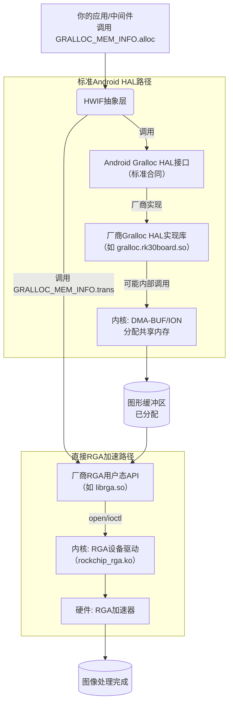
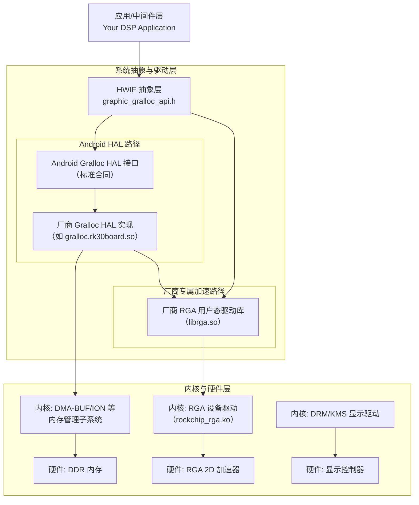
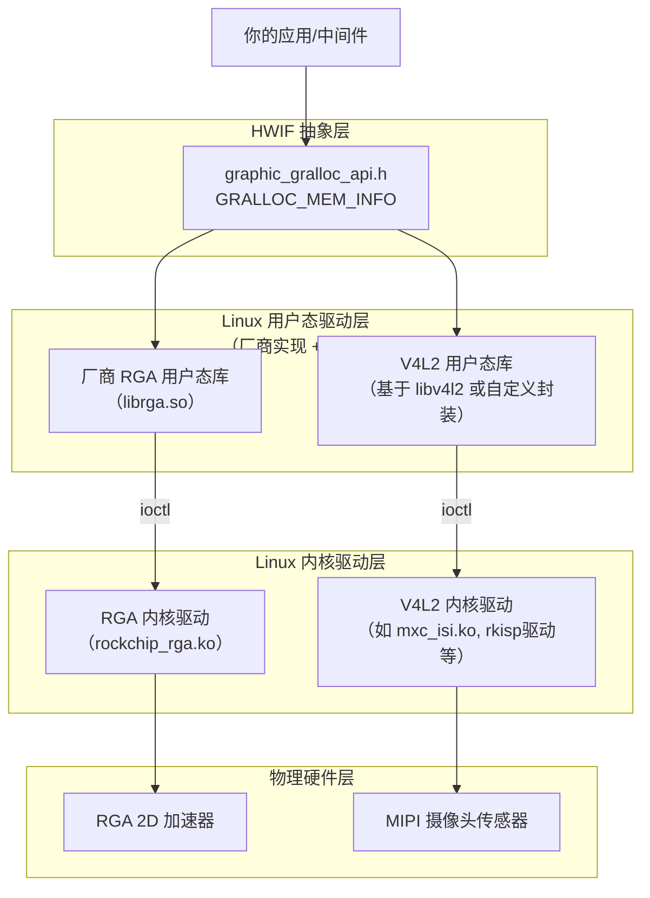

这种ddm是什么？是不是属于一个用户态接口 底层有ko，和内核 /********************************************************************* ******************************* DDM_camera ****************************** *********************************************************************/ /* ！！！注意：此模块仅供DSP同事使用，APP同事请勿使用 */ /******************************* 宏定义 ******************************/ #define DDM_DEV_CAMERA_NAME "/dev/DDM/camera" #define DDM_IOC_CAMERA_MNUM 'C' //camera 复位、休眠、使能管理 #define DDM_IOC_CAMERA_POWER_MANAGE _IOW(DDM_IOC_CAMERA_MNUM, 0, DDM_CamPmArgs) //camera MIPI通道切换 #define DDM_IOC_CAMERA_SWITCH_CHANNEL _IOW(DDM_IOC_CAMERA_MNUM, 1, DDM_CamSwArgs) /******************************* 数据结构 ******************************/ //电源管理模式 typedef enum { DDM_CAM_VISIBLE= 0, // 可见光 DDM_CAM_INFRARED, // 红外 DDM_CAM_IRIS, // 虹膜 DDM_CAM_QR, // 二维码 DDM_CAM_TYPE_MAX, // 最大值


<think>
---


</think>你的理解**非常准确**。

从你提供的这段头文件代码来看，这正是一个典型的**“用户态接口 + 底层内核驱动（ko）”**的架构设计。

下面为你详细拆解这种 DDM 是什么，以及它的架构运作方式：

### 1. 什么是 DDM？
在这个上下文中，DDM 很可能是 **Device Driver Manager**（设备驱动管理）或某个特定厂商自定义的驱动模块缩写。从注释 `此模块仅供DSP同事使用，APP同事请勿使用` 可以看出，它是一个**位于硬件层和应用层之间的中间层驱动接口**，专门给底层系统（如 DSP 固件、底层服务）调用，不直接暴露给普通 APP 开发者。

### 2. 架构分析：用户态接口 + 底层 KO
你提到的“用户态接口，底层有ko和内核”，完全符合这段代码的特征：

*   **用户态接口：**
    代码中的 `#define DDM_DEV_CAMERA_NAME "/dev/DDM/camera"` 是一个标准的 Linux 设备节点路径。在用户态（无论是 DSP 侧的进程还是其他底层服务进程），程序可以通过 `open("/dev/DDM/camera", O_RDWR)` 来打开这个设备，然后通过 `ioctl` 系统调用来下发控制指令。
*   **底层 KO（内核模块）：**
    在内核空间，必然有一个对应的 `.ko`（Kernel Object）驱动文件。这个 ko 负责在 `/dev/DDM/` 目录下创建 `camera` 设备节点，并注册对应的 `file_operations` 结构体，实现 `open`、`ioctl`、`release` 等函数。
*   **内核与硬件交互：**
    当内核收到用户态传来的 `ioctl` 命令（如电源管理、通道切换），ko 驱动会将其翻译成具体的硬件操作（例如操作 GPIO 口给摄像头上电、配置 MIPI PHY 寄存器切换通道等），最终控制底层硬件。

### 3. 代码细节解读
这段代码使用了标准的 Linux 内核 ioctl 机制：

*   **`_IOW(DDM_IOC_CAMERA_MNUM, 0, DDM_CamPmArgs)`**：
    这是 Linux 内核标准的定义 ioctl 命令的宏。`_IOW` 表示数据是从用户空间**写入**内核空间的。
    *   `DDM_IOC_CAMERA_MNUM`（即字符 `'C'`）是 Magic Number，用于区分不同类型的设备驱动。
    *   `0` 和 `1` 是命令编号。
    *   `DDM_CamPmArgs` 和 `DDM_CamSwArgs` 是用户态与内核态交互的数据结构体（代码中未完全展示，但通常会包含摄像头 ID、开关状态等参数）。

*   **功能逻辑：**
    *   **`DDM_IOC_CAMERA_POWER_MANAGE`**：用于控制摄像头的电源状态。枚举里列出了可见光、红外、虹膜、二维码等摄像头类型，说明这是一个多摄系统（常见于金融级智能终端、闸机、安防设备等）。底层 ko 收到这个命令后，会去拉高/拉低对应摄像头的供电 GPIO 或使能 LDO。
    *   **`DDM_IOC_CAMERA_SWITCH_CHANNEL`**：用于 MIPI 通道切换。因为多颗摄像头可能复用同一个 MIPI CSI 接口进入 SoC，所以需要底层驱动去配置 MIPI MUX（多路复用器）开关，决定当前哪颗摄像头的画面能传给主控芯片。

### 总结
这种 DDM 就是一套**自定义的硬件抽象层（HAL）接口规范**。
它通过标准的 Linux 字符设备驱动框架，把“摄像头上下电、MIPI 通道切换”这些底层硬件操作，封装成了简单的 `/dev/DDM/camera` 的 `ioctl` 调用。DSP 开发者只需在用户态调用这些接口，具体的硬件时序和寄存器配置全由底层的 `.ko` 驱动包揽。这样做既保证了安全性（普通APP无权调用），又实现了代码解耦。


底层应该不走v4L2的内核驱动框架什么的吧?
<think>
---

['{"webPages": [{"name": "基于V4L2的视频设备驱动开发与实现 - 道客巴巴", "summary": "下载积分: 350 内容提示: Linux 系统由 于其开源、稳定、良好的移植性等特点在嵌入式系统上被广泛应用 。 V4L2 是Linux2.6 内 核中广泛应用 的内核视频驱动模型。 V4L2 是对 V4L 作了彻底改动, 因此两者并不兼容, 与V4L 相比有更好的扩展性和灵活性,V4L2 最大优势可以自 定义设备驱动缓存数量, 也支持更多的硬件设备。1V4L2 驱动模型V4L2 使在 Linux 下开发视频设备驱动程序具有统一的 接口规范, 这套规范给驱动程序开发提供了 清晰的模型和统一的接口[1]。 应用 程序处于最上层, 硬件设备处于最下层, 这套规范就处于中间层。 V4L2 是一个两层驱动程序模型, 以内 核模块加载到系统中, 因... 文档格式:PDF | 页数:2 | 浏览次数:18 | Linux 系统由 于其开源、稳定、良好的移植性等特点在嵌入式系统上被广泛应用 。 V4L2 是Linux2.6 内 核中广泛应用 的内核视频驱动模型。 V4L2 是对 V4L 作了彻底改动, 因此两者并不兼容, 与V4L 相比有更好的扩展性和灵活性,V4L2 最大优势可以自 定义设备驱动缓存数量, 也支持更多的硬件设备。1V4L2 驱动模型V4L2 使在 Linux 下开发视频设备驱动程序具有统一的 接口规范, 这套规范给驱动程序开发提供了 清晰的模型和统一的接口[1]。 应用 程序处于最上层, 硬件设备处于最下层, 这套规范就处于中间层。 V4L2 是一个两层驱动程序模型, 以内 核模块加载到系统中, 因而当内核补丁安装后不需要重新对内 核完全编译。 顶层是 videodev 模块, 当videodev 初始化的时候, 它注册为字符设备, 设备号为 81 , 同 时注册设备功能函 数。 底层为V4L2 驱动程序, 其核心结构为 video_device 结构, 该结构包含", "url": "https://www.doc88.com/p-9942766982066.html"}, {"name": "基于V4L2的视频驱动程序设计与实现 - 道客巴巴", "summary": "下载积分: 2990 内容提示: 技术创新《 微计算机信息》 2011 年第 27 卷第 10 期120 元/年邮局订阅号: 82-946《 现场总线技术应用 200例》嵌入式与SOC基于 V4L2 的视频驱动程序设计与实现Design and Implementation of the Video Driver Based on V4L2( 南京邮电大学 ) 刘登诚 沈苏彬 李莉LIU Deng-cheng SHENG Su-bin LI Li摘要 : 阐述了 Linux 设备驱动程序开发方法 , 介绍了 V4L2 驱动模型。 以此为基础 , 在TMS320DM355 开发平台下 , 研究开发TMS320DM355 的视频前端模块 (VPFE) 的驱动 , 实现了对日立摄像头 DI-SC110 的支持。 基于 V4L2 的视频采集程序验证了驱动... 文档格式:PDF | 页数:4 | 浏览次数:32 | 技术创新《 微计算机信息》 2011 年第 27 卷第 10 期120 元/年邮局订阅号: 82-946《 现场总线技术应用 200例》嵌入式与SOC基于 V4L2 的视频驱动程序设计与实现Design and Implementation of the Video Driver Based on V4L2( 南京邮电大学 ) 刘登诚 沈苏彬 李莉LIU Deng-cheng SHENG Su-bin LI Li摘要 : 阐述了 Linux 设备驱动程序开发方法 , 介绍了 V4L2 驱动模型。 以此为基础 , 在TMS320DM355 开发平台下 , 研究开发TMS320DM355 的视频前端模块 (VPFE) 的驱动 , 实现了对日立摄像头 DI-SC110 的支持。 基于 V4L2 的视频采集程序验证了驱动的正确性。 提出了基于 V4L2 的视频驱动程序开发一般方", "url": "https://www.doc88.com/p-7836383874645.html"}, {"name": "基于V4L2的视频设备驱动开发与移植 - 豆丁网", "summary": "张辉,李新华,刘波,钱翔(安徽大学电子科学技术学院,安徽合肥230039)摘要:V4L2是Linux2.6内核的一大特征,其主要提供了视频设备的内核驱动协议。文章介绍了V4L2的驱动模型,以此为基础开发设计出针对MediaTekInc公司MT6229芯片USB摄像头视频设备的驱动程序,采用多帧缓存的内存映射技术大大提高了图像采集的速度,在EmbedSkyTQ2440平台下移植并给出了网络环境下的测试流程,对视频驱动程序开发方法和实现步骤具有重要的指导意义。关键词:V4L2;USB摄像头;设备驱动;程序移植中图分类号:TP316文献标识码:A文章编号:1009-3044(2010)15-3988-03TheVideoDeviceDriverProgrammingandProtingBasedonV4L2ZHANGHui,LIXin-hua,LIUBo,QIANXiang(SchoolofElectronicScienceandTechnology,AnhuiUniversity,Hefei230039,China)Abstract:V4L2isamajorfeatureoftheLinuxkernelVersion2.6,whichmainlyprovidesthekerneldriverofvideoequipment.Thispa-perintroducesdrivermodelofV4L2first,andanalyzesthewebcamdriverofMediaTekInc’sMT6229chipaccordingit.Thememorymappingtechniquesofmultiframecacheisadoptedtoincreasingthespeedofimageacquisitiongreatly.Finally,theprogramisplanted", "url": "https://www.docin.com/p-600402789.html"}, {"name": "【精品资料】linux V4L2驱动 - 豆丁网", "summary": "什么是vi deo 4l nuxVi deo4l nux2(简称 V4L2), nux中关于视频设备的内核驱动。 V4L2 4L有较大的改动,并已成为 的标准接口,函盖vi deo\\\\ dvb\\\\FM. ,多数驱动都在向V4l 4L2先从应用入手,然后再 深入到内核中结合物理设备 /接口的规范实现相应的驱动 。V4L2 采用 流水线的方式,操作更简单 直观,基本遵循打开视频设 备、设置格式、处理数据、 关闭设备,更多的具体操作 通过 octl函数来实现。 Linux 中,视频设备是设备文件,可以像访问普通文件一样对其进 行读写,摄像头在/d ev/vi deo0 一.什么是video4linuxVideo4linux2(简称V4L2),是linux 中关于视频设备的内核驱动。 V4L2 较V4L 有较大的改动,并已成为2.6 的标准接口,函盖video\\\\dvb\\\\FM...,多数驱动都 在向V4l2 迁移。更好地了解V4L2 先从应用入手,然后再深入到内核中结合物理设备/接口的 规范实现相应的驱动。V4L2 采用流水线的方式,操作更简单直观,基本遵循打开视频设备、设 置格式、处理数据、关闭设备,更多的具体操作通过ioctl 函数来实现。 在Linux 中,视频设备是设备文件,可以像访问普通文件一样对其进行读写,摄像头在 /dev/video0 打开设备文件。int fd=open(”/dev/video0′′,O_RDWR); 取得设备的capability,看看设备具有什么功能,比如是否具有视频输入,或者音频输入输出等。VIDIOC_QUERYCAP,struct v4l2_capability 选择视频输入,一个视频设备可以有多个视频输入。VIDIOC_S_INPUT,structv4l2_input 设置视频的制式和帧格式,制式包括PAL,NTSC,帧的格式个包括宽度和高度", "url": "https://www.docin.com/p-323334510.html"}, {"name": "别把辅助驾驶当成自动驾驶,讲清L2、L3、L4的根本区别-有驾", "summary": "有四个专业词,搞懂了这事就明白了。DDT(动态驾驶任务)不是光踩油门刹车和打方向,它还要识别行人、车辆和障碍物,并全程做出安全判断。ODD(设计运行范围)就是这套系统能用的边界——哪条路、什么天气、什么速度,超出就失效。接管后援指的是系统到极限时,谁必须马上接手方向盘。MRM(最小风险策略)是系统出问题后的应急方案——能不能自己减速、靠边停好,保护乘员和他人。", "url": "https://www.yoojia.com/article/9524289157964806947.html"}, {"name": "V4L2驱动程序架构.pdf-金锄头文库", "summary": "1、1 1 1 1 V4L2V4L2V4L2V4L2 简介简介 video4linux2(V4L2)是Linux 内核中关于视频设备的内核驱动,它为 Linux 中视频设备访问提供了通用接口, 在Linux 系统中, V4L2驱动的 Video 设备节点 路径通常/dev/video/中的 videoX V4L2驱动对用户空间提供字符设备,主设备号为81,对于视频设备,其次设备号 为0-63。除此之外,次设备号为64-127的Radio 设备,次设备号为192-223的是 Teletext 设备,次设备号为224-255的是 VBI 设备 V4L2驱动的 Video 设备在用户空间通过各种 ioctl 调用进行控制, 并且可以使用 mmap 进行内存映射 1.11.11.11.1 V4L2V4L2V4L2V4L2 驱动主要使用的驱动主要使用的驱动主要使用的驱动主要使用的 ioctlioctlioctlioctl 命令值如下所示: - #define VIDIOC_QUERYCAP _IOR(V, 0, struct v4l2_capability)/*查询能 力*/ #define 2、VIDIO_G_FMT _IOWR(V, 4, struct v4l2_format) /*获得格式*/ #define VIDIOC_S_FMT _IOWR(V, 5, struct v4l2_format) /*设置格式*/ #define VIDIOC_REQBUFS _IOWR(V, 8, strut v4l2_requestbuffers) /*申请 内存*/ #define VIDIOC_G_FBUF _IOW(V, 10, struct v4l2_framebuffer) /*获得 Framebuffer*/ #define VIDIOC_S_BUF _IOW(V, 11, s", "url": "https://www.jinchutou.com/p-89086506.html"}, {"name": "需要了解Linux V4L2的驱动架构 - 嵌入式技术 - 电子发烧友网", "summary": "众所周知,linux中可以采用灵活的多层次的驱动架构来对接口进行统一与抽象,最低层次的驱动总是直接面向硬件的,而最高层次的驱动在linux中被划分为“面向字符设备、面向块设备、面向网络接口”三大类来进行处理,前两类驱动在文件系统中形成类似文件的“虚拟文件”,又称为“节点node”,这些节点拥有不同的名称代表不同的设备,在目录/dev下进行统一管理,系统调用函数如open、close、read等也与普通文件的操作有相似之处,这种接口的一致性是由VFS(虚拟文件系统层)抽象完成的。面向网络接口的设备仍然在UNIX/Linux系统中被分配代表设备的名称(如eth0),但是没有映射入文件系统中,其驱动的调用方式也与文件系统的调用open、read等不同。 video4linux2(V4L2)是Linux内核中关于视频设备的中间驱动层,向上为Linux应用程序访问视频设备提供了通用接口,向下为linux中设备驱动程序开发提供了统一的V4L2框架。在Linux系统中,V4L2驱动的视频设备(如摄像头、图像采集卡)节点路径通常为/dev中的videoX,V4L2驱动对用户空间提供“字符设备”的形式,主设备号为81,对于视频设备,其次设备号为0-63。除此之外,次设备号为64-127的Radio设备,次设备号为192-223的是Teletext设备,次设备: 1、  最底层是直接面向硬件的,驱动框架由v4l2提供。值得注意的是,往往该层驱动需要总线驱动的支持,比如常见的USB2.0总线。 2、  中间层便是v4l2。这是v4l的第二版,由Bill Dirks最开始开发,最终被收入标准内核驱动树。 3、  上层是linux内核三大驱动模块之一的“字符设备驱动层”,因此最终视频设备以文件系统中/dev目录下的字符设备的面目出现,并被应用程序使用。 V4L2的是V4L的第二个版本。原来的V4L被", "url": "https://www.elecfans.com/emb/20190402898997.html"}, {"name": "搜索 【驱动开发】 的结果 - 只为小站", "summary": "\\"基于V4L2的视频驱动开发\\"\\n基于V4L2的视频驱动开发是指使用V4L2(Video\\nfor\\nLinux\\n2)框架来开发视频驱动程序的过程。V4L2是一个Linux操作系统下的视频驱动框架,提供了一套通用的视频驱动接口,允许开发者快速地开发出符合V4L2规范的视频驱动程序。\\n在基于V4L2的视频驱动开发中,需要了解以下几个知识点:\\n1.\\n摄像头方面的知识:需要了解摄像头的特性,包括访问控制方法、各种参数的配置方法、信号输出类型等。\\n2.\\nCamera\\n解码器、控制器:如果摄像头是模拟量输出的,需要熟悉解码器的配置。最后数字视频信号进入camera控制器后,还需要熟悉camera控制器的操作。\\n3.\\nV4L2\\n的API和数据结构:编写驱动前需要熟悉应用程序访问V4L2的方法及设计到的数据结构。\\n4.\\nV4L2\\n的驱动架构:最终编写出符合V4L2规范的视频驱动程序。\\n本文介绍基于S3C2440硬件平台的V4L2视频驱动开发。摄像头采用OmniVision公司的OV9650和OV9655。主要包含以下几个方面的内容:\\n视频驱动的整体框架:\\n*\\n3C2440\\ncamera控制器+ov9650(ov9655)\\n*\\nV4L2\\nAPI\\n及数据结构\\n*\\nV4L2\\n驱动架构\\n*\\nov9650(ov9655)+s3c2440+V4L2\\n实例\\nS3C2440\\ncamera控制器:\\n*\\n支持ITU-R\\nBT601/656格式的数字图像输入\\n*\\n支持2个通道的DMA,Preview通道和Codec通道\\n*\\nPreview通道可以将YCbCr4:2:2格式的图像转换为RGB(16bit或24bit)格式的数据,并存放于为Preview\\nDMA分配的内存中,最大分辨率为640*480\\n*\\nCodec通道可以输出YCbCr4:2:0或YCbCr4:2:2格式到为Codec\\nDMA分配的内存中,最大分辨", "url": "https://www.kerwin.cn/dl?query=%E9%A9%B1%E5%8A%A8%E5%BC%80%E5%8F%91"}, {"name": "v4l2驱动开发-CSDN博客", "summary": "#\\nV4L2驱动开发完全指南\\n##\\n第1章\\nV4L2框架概述\\n###\\n1.1\\nV4L2历史与发展\\n**V4L2**(Video\\nfor\\nLinux\\nTwo)是Linux内核中视频设备的标准API框架。从Linux\\n2.5.46内核开始引入,逐步替代了旧的V4L接口。\\n**发展历程**:\\n-\\n1998年:V4L首次发布\\n-\\n2002年:V4L2正式成为内核标准\\n-\\n2010年:引入V4L2控制框架\\n-\\n2012年:引入媒体控制器框架\\n-\\n2015年:V4L2异步框架\\n###\\n1.2\\nV4L2系统架构\\n####\\n1.2.1\\n用户空间接口\\n```\\n用户空间应用程序\\n│\\n├──\\n应用程序层\\n(v4l2-ctl,\\ngstreamer,\\nffmpeg)\\n│\\n├──\\nV4L2库\\n(libv4l2)\\n│\\n└──\\n系统调用接口\\n```\\n####\\n1.2.2\\n内核空间架构\\n```\\n内核空间\\n├──\\n字符设备层\\n(V4L2字符设备)\\n│\\n├──\\n/dev/videoX\\n│\\n├──\\n/dev/v4l-subdevX\\n│\\n└──\\n/dev/mediaX\\n│\\n├──\\nV4L2核心层\\n│\\n├──\\nv4l2-device.c\\n-\\n设备管理\\n│\\n├──\\nv4l2-ioctl.c\\n-\\nIOCTL处理\\n│\\n├──\\nv4l2-ctrls.c\\n-\\n控制框架\\n│\\n├──\\nv4l2-fh.c\\n-\\n文件句柄管理\\n│\\n└──\\nv4l2-event.c\\n-\\n事件通知\\n│\\n├──\\n视频缓冲区核心\\n(videobuf2)\\n│\\n├──\\nvideobuf2-core.c\\n│\\n├──\\nvideobuf2-v4l2.c\\n│\\n├──\\nvideobuf2-memops.c\\n│\\n└──\\n内存后端\\n(dma-contig,\\ndma-sg)\\n│\\n├──\\n子设备框架\\n(v4l2-subdev)\\n│\\n├──\\n子设备注册\\n│\\n├──\\n子设备操作\\n│", "url": "https://blog.csdn.net/weixin_57340941/article/details/157131202"}, {"name": "2025 年 7月 16 日 随笔档案 - embfly168 - 博客园", "summary": "摘要:\\n最近公司开发T527的项目,其中涉及到图形界面的选型,而恰好最新的T527\\nSDK已经改用DRM驱动。以前很多简单的处理器选择的都是Framebuffer驱动。那么DRM驱动和FB驱动有什么区别呢?\\n一、DRM与Framebuffer\\nLinux\\n中的\\nDRM(Direct\\nRendering\\nMa\\n阅读全文", "url": "https://www.cnblogs.com/embfly/p/archive/2025/07/16"}], "images": [{"url": "http://file.elecfans.com/web1/M00/8D/2F/o4YBAFyi_K-AN-8vAAC57i_87J4601.jpg"}]}']
</think>问得非常到位！**你的判断是正确的，这个 DDM 驱动大概率不走标准的 V4L2 框架。**

它和 V4L2 是**两个不同层面、不同目的**的驱动模块。下面我为你详细解释它们的关系和区别。

### 核心区别：职责不同

你可以把整个摄像头系统想象成一个摄影团队：

1.  **DDM 驱动（你提供的代码）：像“场务”或“设备管理员”**
    *   **职责**：负责最基础的准备工作。比如：打开/关闭摄影棚的电源（`POWER_MANAGE`）、在几个相机之间切换连接线（`SWITCH_CHANNEL`）。
    *   **特点**：操作简单、底层，只在需要切换硬件状态时被调用。它不关心图像数据本身。

2.  **V4L2 驱动：像“摄影师”和“数据流处理员”**
    *   **职责**：负责图像数据的“艺术创作”和“流水线管理”。比如：设置分辨率、帧率、对焦、曝光，然后启动一个高效的数据流，将一帧帧图像数据从传感器采集上来，并交给应用程序。
    *   **特点**：复杂，负责建立和管理持续的数据流，遵循一套非常完善的标准框架。

### 为什么需要 DDM 这种非 V4L2 驱动？

在你的代码中，`DDM_CAM_VISIBLE`（可见光）、`DDM_CAM_INFRARED`（红外）等枚举项暗示了这是一个**多摄系统**，且这些摄像头可能**复用了硬件资源**（比如同一个 MIPI CSI 接口）。

这种情况下，标准的 V4L2 驱动会遇到问题：
*   V4L2 假设一个 `/dev/videoX` 节点对应一个**稳定连接**的摄像头。
*   它无法处理“在 A 摄像头和 B 摄像头之间进行物理开关切换”这种硬件层面的操作。

因此，系统设计者必须**在 V4L2 之下再增加一个硬件控制层**，也就是这个 DDM 驱动。它的任务就是为 V4L2 驱动准备好“拍摄现场”。

### 一个典型的工作流程

假设设备上有一个可见光摄像头和一个红外摄像头，它们通过一个 MUX（多路复用器）共享一个 MIPI 接口。一次完整的调用流程如下：

1.  **APP / DSP 程序** 决定使用红外摄像头。
2.  **调用 DDM 接口**：程序通过 `ioctl` 下发 `DDM_IOC_CAMERA_SWITCH_CHANNEL` 命令，参数为 `DDM_CAM_INFRARED`。
3.  **DDM 内核驱动（ko）** 收到命令：
    *   先通过 `DDM_IOC_CAMERA_POWER_MANAGE` 给红外摄像头上电。
    *   然后配置硬件 MUX 开关，将红外摄像头的数据通路连接到 SoC 的 MIPI CSI 接口上。
4.  **硬件就绪**：此时，红外摄像头在硬件层面已经“挂载”到了系统上。
5.  **APP / DSP 程序** 再调用**标准的 V4L2 接口**（如 `open("/dev/video0", O_RDWR)`）。
6.  **V4L2 驱动** 开始工作：它看到的是一个已经连接好的摄像头，于是正常进行格式协商、申请缓冲区、启动数据流等操作，将图像数据传送给应用程序。

### 总结

| 特性 | DDM 驱动（你提供的） | V4L2 驱动 |
| :--- | :--- | :--- |
| **角色** | **硬件资源管理器** | **数据流管理器** |
| **接口** | 自定义的 `ioctl` 命令 | 标准的 V4L2 `ioctl` 命令集（如 `VIDIOC_REQBUFS`, `VIDIOC_STREAMON`） |
| **功能** | 电源管理、硬件链路切换 | 格式设置、数据采集、控制参数（曝光、白平衡） |
| **关系** | **为 V4L2 驱动准备硬件环境**，是 V4L2 的**前置依赖** | **在 DDM 准备好硬件后，负责图像数据的稳定传输** |

所以，你的理解完全正确。这个 DDM 是一个**厂商自定义的、用于管理多摄硬件资源的底层驱动**，它不属于也不替代标准的 V4L2 框架，而是与 V4L2 驱动**协同工作**，共同完成复杂的多摄像头应用场景。


如果说ddm是管理硬件，而v4l2是处理硬件流程，那么，对于通用linux和安卓，是什么样的流程？

<think>
---


</think>非常好的问题！这触及了 Linux 系统下摄像头子系统设计的核心。简单来说，**安卓在通用 Linux 的 V4L2 框架之上，增加了一层名为 “Camera HAL” 的硬件抽象层，而你所见的 DDM 驱动，可以看作是这种 HAL 思想在特定嵌入式 Linux 系统上的一种具体实现或补充。**

下面我们分别来看通用 Linux 和安卓的流程，并与你的 DDM 驱动进行对比。

### 1. 通用 Linux 的摄像头流程（纯 V4L2 框架）

在标准的嵌入式 Linux 或桌面 Linux 系统中，流程相对直接，核心就是 **V4L2**。

**架构流程：**
`应用程序 (App)` -> `V4L2 兼容的内核驱动 (Kernel Driver)` -> `硬件 (Camera Sensor)`

**工作方式：**
1.  **应用层**：应用程序（如 `cheese`, `ffmpeg`, 或自定义程序）直接通过 `open("/dev/video0")` 打开设备节点。
2.  **系统调用**：应用使用标准的 V4L2的 `ioctl` 命令（如 `VIDIOC_S_FMT` 设置格式、`VIDIOC_REQBUFS` 申请缓冲区、`VIDIOC_STREAMON` 开始采集）与内核交互。
3.  **内核驱动**：V4L2 驱动负责一切：它既处理**数据流**（从传感器采集图像数据到缓冲区），也处理**硬件控制**（通过 I2C 配置传感器参数、控制时钟、复位等）。驱动通常通过一个叫“子设备”（subdev）的机制来管理传感器。
4.  **硬件**：驱动直接操作硬件。

**特点：**
*   **简单直接**：没有中间层，App 直接面对内核驱动。
*   **依赖驱动完整性**：要求 V4L2 驱动功能非常完善，能处理所有硬件细节。这对于简单的单摄像头系统是可行的。
*   **不适合复杂硬件**：如果遇到你代码里的情况——多个摄像头复用硬件资源（如 MIPI 通道），标准的 V4L2 驱动会很难优雅地处理，因为 V4L2 的模型是一个 `/dev/videoX` 节点对应一个“稳定连接”的摄像头。

### 2. 安卓 (Android) 的摄像头流程（V4L2 + Camera HAL）

安卓为了应对**手机上海量不同型号、不同设计的摄像头传感器**，并给上层应用提供统一的 API，引入了一个至关重要的中间层：**Camera Hardware Abstraction Layer**。

**架构流程：**
`应用程序 (App)` -> `Camera Framework (Java)` -> `Camera Service (Native)` -> **`Camera HAL (Hardware Abstraction Layer)`** -> `V4L2 内核驱动 (Kernel Driver)` -> `硬件 (Camera Sensor)`

**工作方式：**
1.  **应用层**：App 调用安卓标准的 `Camera2` API。
2.  **框架层**：Camera Framework 和 Camera Service 管理摄像头的生命周期、权限、多应用访问等。
3.  **关键层：Camera HAL**：这是**由芯片厂商或设备制造商实现的库**（`*.so`）。它的作用是：
    *   **封装硬件差异**：将底层千差万别的硬件驱动（可能是 V4L2，也可能是其他私有驱动）的操作，翻译成一套标准的 HAL 接口供上层调用。
    *   **处理复杂逻辑**：**正是 HAL 层负责处理像你的 DDM 驱动所做的事情**！例如：
        *   当应用要切换前后摄像头时，HAL 会去操作 GPIO 上下电、控制 MIPI MUX 切换通道。
        *   处理多摄协同（如广角+长焦切换）、特殊的3A算法（自动对焦、自动曝光、自动白平衡）等。
4.  **内核驱动**：HAL 层最终会通过 `ioctl` 调用内核的 V4L2 驱动（或其它驱动）来执行具体的寄存器读写和数据流操作。

**特点：**
*   **标准化与灵活性**：上层应用与硬件解耦。厂商只需实现自己的 HAL，而不必修改安卓框架。
*   **处理复杂硬件**：完美解决了多摄、资源复用等复杂场景，**HAL 层就是为管理这些硬件而生的**。

### 对比与总结：DDM 驱动在其中的位置

现在我们可以清晰地看到你的 DDM 驱动在哪个位置了：

| 系统 | 硬件管理角色 | 数据流角色 |
| :--- | :--- | :--- |
| **通用 Linux** | **由 V4L2 驱动一并完成**（如果硬件简单） | **V4L2 驱动** |
| **安卓** | **由 Camera HAL 层完成**（调用底层可能非标准的驱动，如 DDM） | **由 Camera HAL 调用 V4L2 驱动完成** |
| **你的系统 (含 DDM)** | **由自定义的 DDM 驱动完成**（相当于一个简化的、内核态的 HAL） | **由另一个独立的 V4L2 驱动完成** |

**结论：**

1.  你的 DDM 驱动所扮演的“硬件资源管理器”角色，在**通用 Linux** 中通常不是独立存在的，而是被合并到 V4L2 驱动里（如果驱动能处理的话）。
2.  而在**安卓**系统中，这个角色被明确地分配给了 **Camera HAL** 层。你的 DDM 驱动可以看作是 **Camera HAL 为了完成其工作，在底层所需要调用的一个“助手驱动”**。
3.  所以，这种“DDM 管理硬件，V4L2 处理数据流”的架构，**更接近于安卓的思想**，是在嵌入式 Linux 系统上，为了管理复杂摄像头硬件而采取的一种与安卓类似的分层设计，只不过它的实现方式（一个独立的内核模块）比安卓的 HAL（用户态动态库）更为底层。

简单来说，**你把 DDM 理解为你这个特定系统上的、简化版的“Camera HAL 的内核态实现”，是完全正确的。** 它解决了纯 V4L2 框架在复杂硬件面前能力不足的问题。


/ 这种rga是如何分层的，上面是hwif层，然后厂商的rga驱动？底层是内核？

<think>
---


</think>你的理解基本是正确的。从这份头文件的包含路径和结构体设计来看，这确实是一个典型的**硬件抽象层（HAL）**架构，并且带有明显的 Android 系统和特定芯片厂商（如 Rockchip 瑞芯微）的特征。

我们可以将这个架构按照从上到下的层次进行详细拆解：

### 1. 硬件接口层 / 模块适配层
*   **对应代码**：`hwif_mem_api.h`、当前文件 `graphic_gralloc_api.h` 以及 `GRALLOC_MEM_INFO` 结构体。
*   **作用**：这是该系统（可能是某种中间件、DSP框架或上层多媒体框架）自身的硬件接口层。它定义了一套统一的内存操作接口规范（如 `init`, `alloc`, `free`, `lock`, `flushcache` 等）。
*   **设计模式**：通过 `GRALLOC_MEM_INFO` 结构体中的**函数指针**来实现面向对象的多态。上层不需要关心底层是哪种显卡或内存分配器，只需要调用这些函数指针即可。`priv` 指针通常指向底层的具体实现句柄（如 Android 的 `gralloc_module_t`）。

### 2. 厂商图形内存分配层
*   **对应代码**：`android/graphic_gralloc.h`
*   **作用**：这一层对接的是 Android 系统的 Gralloc 机制。在 Android 中，Gralloc 负责分配图形缓冲区（用于 SurfaceFlinger 渲染、视频解码器输出等）。
*   **分层关系**：这层通常由芯片厂商提供实现（例如高通的 ION/DMA-BUF，或者瑞芯微的实现）。它将 Android 标准的 Gralloc 接口封装成了 `hwif_mem_api` 需要的格式。

### 3. 厂商 2D 图像加速层
*   **对应代码**：`sdk_inc/rga/drmrga.h`、`sdk_inc/rga/rga.h`、`sdk_inc/rga/RgaApi.h`
*   **作用**：这是**RGA (2D 图形加速器)** 的用户态驱动 API 层。RGA 是 Rockchip（瑞芯微）芯片中特有的硬件模块，专门用于高效的 2D 图像缩放、旋转、裁剪、色彩格式转换（如 YUV 转 RGB）等操作。
*   **分层关系**：
    *   `RgaApi.h`：传统的 RGA 用户态接口。
    *   `drmrga.h`：基于 DRM (Direct Rendering Manager) 框架重构后的 RGA 接口。
    *   这一层提供了 `trans`（转换）和 `render`（渲染）等操作的底层支持。上层通过 `GRALLOC_MEM_INFO` 中的 `trans` 函数指针调用时，最终会调到这里的 RGA API 来利用硬件完成图像格式转换或搬运。

### 4. 内核驱动层
*   **对应代码**：虽然头文件里没有直接体现，但上述所有层最终都会通过系统调用陷入内核态。
*   **作用**：
    *   **Gralloc 的内核依赖**：通常依赖内核的 ION 或 DMA-BUF 子系统来分配物理连续内存或大块 CMA 内存，并管理这些内存的文件描述符传递。
    *   **RGA 的内核依赖**：内核中会有对应的 `rga` 驱动模块。用户态通过 `ioctl` 系统调用将 RGA 的渲染指令、物理地址/文件描述符传递给内核，内核驱动再操作 RGA 硬件寄存器完成加速任务。
    *   **GPU 显示控制器**：最终将内存内容显示到屏幕上，依赖内核的 DRM/KMS 驱动。

### 总结：完整的调用链路分层

按照你的问题，整个分层从上到下可以概括为：

1.  **应用/中间件层**：调用 `GRALLOC_MEM_INFO` 提供的函数指针。
2.  **HWIF 抽象层** (`graphic_gralloc_api.c` / `hwif_mem_api.c`)：将上层请求转发给具体的底层实现。
3.  **厂商用户态驱动层**：
    *   内存分配：调用 Android Gralloc 接口 (`android/graphic_gralloc.h`)。
    *   图像处理：调用 RGA 接口 (`RgaApi.h` / `drmrga.h`)。
4.  **Android Framework / HAL 层**：Android 标准的 `gralloc_module_t` 和 `alloc_device_t` 接口。
5.  **Linux 内核层**：DMA-BUF/ION 内存管理 + RGA 硬件驱动 + DRM 显示驱动。
6.  **物理硬件**：DDR 内存 + RGA 硬件加速器 + 显示控制器。

所以，你的理解是对的：**上面是 HWIF 抽象层，中间是厂商的 RGA 驱动和 Android Gralloc 封装，最底层是 Linux 内核驱动。**


“这是RGA (2D 图形加速器) 的用户态驱动 API 层。” 这个是什么？是hal层吗？绕过了framework？用户态是调so，会走到ko里面，对吗

<think>
---

['{"webPages": [{"name": "谁能详细说说DirectX中的HAL(Hardware Abstraction Layer )呀?-CSDN社区", "summary": "rt 初学比较模糊 ...全文 100 2 打赏 收藏 举报 写回复 2 条 回复 切换为时间正序 请发表友善的回复... 发表回复 打赏 举报 回复 thx 打赏 举报 回复 HAL:Hardware Abstraction Layer,硬件抽象层 HEL:Hardware Emulation Layer,硬件模拟层 HAL和HEL组合起来响应DirectX的请求,如果硬件能够提供某种特定功能,则DirectX会调用HAL,这样当然速度快;否则,就只好调用HEL来模拟硬件功能,速度就会慢一些.", "url": "http://topic.csdn.net/t/20030930/17/2318329.html?142513162"}, {"name": "HAL层简介 - farbeyond - 博客园", "summary": "刚刚看了HAL层驱动API函数,没有全部看完,本文主要是谈谈HAL的作用。 所谓HAL层,Hardware Abstract Layer,即硬件抽象层。硬件抽象层主要是干嘛的呢? HAL在windowsNT中就曾经提出来过,主要是用于处理不同平台之间的移植兼容性的问题。如下一段话是百度百科的内容: HAL的作用是将操作系统的其余部分表示为抽象的硬件设备,特别是去除了真正硬件所富含的瑕疵和特质。这些设备表现为操作系统的其它部分和设备可以使用的独立于机器的服务的形式(函数调用和宏)。通过使用HAL服务和间接硬件寻址,当移植到新的硬件上时,驱动程序和核心只需做很少的改动。移植HAL本市是直接的,因为所有的机器相关代码都集中在一个地方,并且移植的目标是充分定义的,即实现所有的HAL服务。 感兴趣的读者可以看百度百科,了解更为详细的信息。 如下为document中定义的内容: This document describes the application programming interface for HAL Drivers. The API provides application the interface to access timers, GPIO, UART and ADC. This is a platform independent API that provides a superset of features for each service. Not all features will be available for all platforms. 在zstack中,HAL具有与windows相似的功能,,它提供了一种接口来访问定时器,GPIO,UART,ADC。这些接口都通过相应的函数进行实现。此外,我们还应注意到在OSAL中系统也可以调用相应的函数来访问这", "url": "https://www.cnblogs.com/farbeyond/p/5204608.html"}, {"name": "STM32H7 HAL驱动程序说明-电子电路图,电子技术资料网站", "summary": "stm32 H7 Hal库文档.pdf HAL驱动程序层提供了一组简单的通用多实例API(应用程序编程接口 )以与上层(应用程序、库和堆栈)交互。它由泛型组成以及扩展API。它是直接围绕通用体系结构构建的,并且允许在层上构建,例如中间件层,在没有深入了解如何使用单片机。这种结构提高了库代码的可重用性,并保证了易于移植到其他库代码设备。HAL驱动程序包括一整套现成的API,这些API简化了用户应用程序实施例如,通信外围设备包含用于初始化和配置的API外围设备,用于管理基于轮询的数据传输,处理中断或DMA,以及管理通信错误。HAL驱动程序API分为两类:提供通用和通用的通用API适用于所有STM32系列和扩展API的功能,包括特定和自定义功能对于给定的系列或零件号。", "url": "https://www.elecfans.com/soft/33/2023/202304152058971.html"}, {"name": "谁能详细说说DirectX中的HAL(Hardware Abstraction Layer )呀？", "summary": "rt\\n 初学比较模糊\\nthx\\nHAL:Hardware Abstraction Layer,硬件抽象层 \\n HEL:Hardware Emulation Layer,硬件模拟层\\n HAL和HEL组合起来响应DirectX的请求,如果硬件能够提供某种特定功能,则DirectX会调用HAL,这样当然速度快;否则,就只好调用HEL来模拟硬件功能,速度就会慢一些.", "url": "https://bbs.csdn.net/topics/40195809"}, {"name": "HEL", "summary": "贡献者: sylar  浏览:1349次 创建时间:2009-06-09\\n   DirectX的下面有两个层分别叫做HEL (Hardware Emulation Layer,硬件仿真层) \\n   和 (Hardware Abstraction Layer,硬件抽象层)\\n   HEL:运用于当硬件不支持你所要求的性能的时候。比方说,当你要求视频卡完成位图旋转,如果硬件不支持旋转这个功能,HEL就会加入, 通过软件运算来完成该项任务。显然处理速度慢,但程序依然能够执行。\\n   HAL:直接与硬件对话的一层,是一种设备驱动程序,通常由设备生产商提供,你可以通过常规DirectX调用直接和它通信,只有当硬件能够直接支持你所要求执行的功能的时候HAL才能被使用,从而达到加速效果。", "url": "http://baike.eepw.com.cn/baike/show/word/HEL"}, {"name": "HEL和HAL", "summary": "HAL:hardware abstraction layer ,硬件抽象层,直接和硬件对话的一层。 HAL是一种设备驱动程序,通常由设备生产厂商提供, 你可以通过常规DirectX\\n调用直接和他进行通信。条件是当硬件能直接支持你所要执行的功能的时候HAL才被使用!\\nHEL:hardware emulation layer,硬件仿真层,运用于当硬件不支持你所要求的性能的时候。\\nHEL和HAL之间的切换对用户而言是透明的。如果你要求DirectX处理某项任务,HAL直接处理了,说明是通过硬件完成的,反之,HEL会通过一个软件\\n仿真来完成此项任务!!!\\nDirectX是一种具有前瞻性的设计思路,他假定那些高级的功能由硬件实现,但是,如果硬件不支持其中某些功能特性,那又该如何处理呢?\\n这就是HEL和和HAL双重模式的基本设计思路!!", "url": "https://m.blog.csdn.net/yaoxinchao/article/details/7750430"}, {"name": "STM32F44xx HAL驱动程序说明-电子发烧友网", "summary": "HAL驱动程序层提供了一组通用的多实例简单API(应用程序编程接口)以与上层(应用程序、库和堆栈)交互。它由泛型组成以及扩展API。它是直接围绕通用体系结构构建的,并且允许在层上构建,例如中间件层,在不深入了解如何使用单片机。这种结构提高了库代码的可重用性,并保证了在其他系统上的易移植性设备。HAL驱动程序包括一整套现成的API,这些API简化了用户应用程序实施例如,通信外围设备包含用于初始化和配置的API外围设备,用于管理基于轮询的数据传输,处理中断或DMA,以及管理通信错误。HAL驱动程序API分为两类:提供通用和通用的通用API适用于所有STM32系列和扩展API的功能,包括特定和自定义功能对于给定的系列或零件号。", "url": "https://m.elecfans.com/article/2058970.html"}, {"name": " 驱动层 - 道客巴巴 ", "summary": "下载积分: 1000 内容提示: 驱动层:  驱动层一般由硬件抽象层(HAL)、板级支持包(BSP)和驱动程序组成,是嵌入式系统中不可或缺的重要部分。它的作用是为上层程序提供外部设备的操作接口,并且实现设备的驱动程序。上层程序可以不管操作的设备内部实现,只需要调用驱动的接口即可。   硬件抽象层(HAL) 嵌入式系统通常包含三个部分:     嵌入式应用程序     嵌入式操作系统     硬件平台 应用程序运行在操作系统之上,利用操作系统提供的接口完成特定功能。操作系统一般是 RTOS,完成应用的任务调度和控制等核心功能。硬件平台根据应用的不同,所具备的功能各不相同,... 文档格式:DOC | 页数:2 | 浏览次数:176 | 驱动层: 驱动层一般由硬件抽象层(HAL)、板级支持包(BSP)和驱动程序组成,是嵌入式系统中不可或缺的重要部分。它的作用是为上层程序提供外部设备的操作接口,并且实现设备的驱动程序。上层程序可以不管操作的设备内部实现,只需要调用驱动的接口即可。 硬件抽象层(HAL) 嵌入式系统通常包含三个部分: 嵌入式应用程序 嵌入式操作系统 硬件平台 应用程序运行在操作系统之上,利用操作系统提供的接口完成特定功能。操作系统一般是 RTOS,完成应用的任务调度和控制等核心功能。硬件平台根据应用的不同,所具备的功能各不相同,而且所使用的硬件设备也不一样,因此具有复杂的多样性。 由于硬件平台的复杂多样,针对不同平台进行操作系统的移植是极为耗时的工作,因此经过不断发展,嵌入式系统的三层结构演化为四层结构,即在操作系统层和硬件平台之间,增加硬件抽象层(HAL)。 硬件抽象层本质上就是一组对硬件进行操作的 API 接口,是对硬件功能抽象的结果。硬件抽象层通过 API 为操作系统和应用程序提供服务。一般上 HAL 包含相关硬件的初始化、数据的输入输出操作、硬件设备的配置操", "url": "https://www.doc88.com/p-2072378018435.html"}, {"name": "HAL 层-TuyaOS-涂鸦开发者", "summary": "HAL 层 HAL 层API 是涂鸦抽象各芯片硬件外设,封装的一层标准接口。您无需接入涂鸦平台的各种芯片硬件外设底层实现逻辑,只需调用统一的 API,填写相应参数,即可快使用相应外设,完成产品功能,加快产品的开发速度。 HAL 层列表如下: 名称 功能说明 PIN GPIO 外设相关函数的使用说明 PWM PWM 外设相关函数的使用说明 ADC ADC 外设相关函数的使用说明 UART UART", "url": "https://developer.tuya.com/cn/docs/iot-device-dev/hal?id=Kaiuyfg1jj6sv"}, {"name": "超帧和ABR支持的图形API有哪些?-图形加速(Graphics Accelerate)-图形和游戏-图形和游戏开发-开发 - 华为HarmonyOS开发者", "summary": "开发 使用hdc install xxx.hap安装HAP,报“9568305: dependent module does not exist”的错误 HAP依赖HAR A,HAR A依赖HAR B,HAP能否调用HAR B提供的接口?如果不支持间接依赖HAR,这么设计的原因是什么? 通过resourceManager.getStringResource接口获取HSP资源文件报“Resource id invalid”错误 部署HAP时上报“Failure[INSTALL_FAILED_SIZE_TOO_LARGE] error while deploying hap”错误 多个UIAbility是运行在一个进程还是多个进程中?三方应用是否支持应用运行在多个进程下?主进程结束了,会影响子进程的运行吗? 使用hdc命令安装release HAP包到设备时上报“INSTALL_FAILED_APP_SOURCE_NOT_TRUSTED”错误 安装HAP包报“failed to install bundle. install debug type not same”错误 FA模型与Stage模型在设计哲学上的区分是什么?FA模型的应用组件分类PageAbility、ServiceAbility及DataAbility与经典三层(MVC?)的区别 应用级别的context和HSP级别的context冲突吗?HSP中不能通过getContext(this).resourceManager.getStringValue($r(\'app.string.test_string\').id)的方式获取资源会报错,应该如何实现 在使用UIAbilityContext时报401“The context must be a valid Context”的Context类型错误 在AGC平台生成新的", "url": "https://developer.huawei.com/consumer/cn/doc/harmonyos-faqs-V5/graphics-accelerate-faq-1-V5"}], "images": [{"url": "https://csdnimg.cn/release/cmsfe/public/img/shareBg4.515d57f6.png"}]}', '{"webPages": [{"name": "如何在CUDA中使用驱动程序API-电子发烧友网", "summary": "驱动程序 API在cuda 动态库(cuda.dll或cuda.so)中实现,该库在安装设备驱动程序期间复制到系统上。 它的所有入口点都以 cu 为前缀。 它是一个基于句柄的命令式 API:大多数对象都由不透明的句柄引用,这些句柄可以指定给函数来操作对象。 驱动程序 API 中可用的对象汇总在下表中。Table 16. Objects Available in the CUDA Driver API 在调用驱动程序 API 的任何函数之前,必须使用cuInit()初始化驱动程序 API。 然后必须创建一个附加到特定设备的 CUDA 上下文,并使其成为当前调用主机线程,如上下文中所述。 在CUDA 上下文中,内核作为 PTX 或二进制对象由主机代码显式加载,如模块中所述。 因此,用C++编写的内核必须单独编译成 PTX 或二进制对象。 内核使用 API 入口点启动,如内核执行中所述。 任何想要在未来设备架构上运行的应用程序都必须加载 PTX,而不是二进制代码。 这是因为二进制代rom host memory to device memory cuMemcpyHtoD(d_A, h_A, size); cuMemcpyHtoD(d_B, h_B, size); // Get function handle from module CUfunction vecAdd; cuModuleGetFunction(&vecAdd, cuModule, \\"VecAdd\\"); // Invoke kernel int threadsPerBlock = 256; int blocksPerGrid = (N + threadsPerBlock - 1) / threadsPerBlock; void* args[] = { &d_A, &d_B, &d_C, &N }; cuLaunchK", "url": "http://www.elecfans.com/d/1829700.html"}, {"name": "27.3.4.2内核下的I2C驱动(二)-伙伴云", "summary": "用户态直接访问,使用内核提供的驱动程序 dev-interface 注意,不要直接使用read(),write()操作函数,直接使用i2c_smbus_write_word_data,i2c_smbus_read_word_data。官方文档给了说明,如下 驱动程序编译进内核才有效,I2c-dev.c依赖于那些配置项,查看Makefilemakemenuconfig,搜索CONFIG_I2C_CHARDEV 重启内核,编译新内核,之后下载到开发板测试代码 #include #include #include #include #include #include #include \\"i2c-dev.h\\" /* i2c_usr_test r addr * i2c_usr_test w addr val */ void print_usage(char *file) { printf(\\"%s r addr\\\\n\\", file); printf(\\"%s w addr val\\\\n\\", file); } int main(int argc, char **argv) { int fd; unsigned char addr, data; int dev_addr; if ((argc != 5) && (argc != 6)) { print_usage(argv[0]); return -1; } fd = open(argv[1], O_RDWR); if (fd < 0) { printf(\\"can\'t open %s\\\\n\\", argv[1]); return -1; } dev_addr = strtoul(argv[2], NULL, 0); if (ioctl(fd, I2C_SLAVE, dev_addr) < 0) { /* ERROR HANDLING; you can", "url": "https://www.huoban.com/news/post/13211.html"}, {"name": "初始化和 DMA 缓冲区创建 - Windows drivers  Microsoft Learn", "summary": "此浏览器不再受支持。 请升级到 Microsoft Edge 以使用最新的功能、安全更新和技术支持。 目录 使用英语阅读 保存 添加到计划 通过 Facebook x.com 共享 LinkedIn 电子邮件 打印 项目 1 个参与者 反馈 若要指示 GPU 支持 GDI 硬件加速,显示微型端口驱动程序的DriverEntry函数实现必须使用指向驱动程序实现的 DxgkDdiRenderKm 函数的指针填充DRIVER_INITIALIZATION_DATA结构的DxgkDdiRenderKm成员。 DirectX 图形内核子系统调用 DxgkDdiRenderKm 函数,以从操作系统提供的内核模式规范显示驱动程序 (CDD) 传递的命令缓冲区生成 DMA 缓冲区。 当DirectX 图形内核子系统的显示端口驱动程序 ( Dxgkrnl.sys ) 调用DxgkDdiCreateContext函数时,它会设置 pCreateContext-Flags-GdiContext > > 成员以指示用于 GDI 硬件加速的上下文。 同样,当显示端口驱动程序调用DxgkDdiCreateDevice函数时,它会设置 pCreateDevice-Flags-GdiDevice > > 成员以指示用于 GDI 硬件加速的设备。 反馈 此页面是否有帮助? 是 否 主题 亮 暗 高对比度 © Microsoft 2024 其他资源 本文内容", "url": "https://docs.microsoft.com/zh-cn/windows-hardware/drivers/display/initialization-and-dma-buffer-creation"}, {"name": "rust - 一次RDMA用户态驱动调试的复盘 - 个人文章 - SegmentFault 思否", "summary": "整个驱动分为内核态和用户态两个部分,内核部分做的仅仅是将必要的内存空间暴露给用户态,例如将bar空间上的csr(control status register)寄存器映射到了用户态,主要的操作由用户态驱动执行。用户态驱动申请了4个巨页,并分别指定这几个巨页为与硬件交互的Ringbuf。", "url": "https://segmentfault.com/a/1190000045270877"}, {"name": "K230大核低速驱动API参考 — K230 RT-Smart SDK", "summary": "免责声明 商标声明 目录 前言 概述 读者对象 缩略词定义 修订记录 1 概述 1.1 概述 1.2 功能描述 1.3 驱动API使用方法 1.3.1 UART 内核态程序使用uart 1.3.2 I2C 内核态程序使用i2c 1.3.3 GPIO 内核态程序使用gpio 用户态程序使用gpio(仅读写) 1.3.4 Hard-lock 内核态使用hard-lock 1.3.5 ADC 1.3.5.1 用户态 msh 使用 adc 1.3.5.2 用户态程序使用 adc 1.3.5.3 内核态程序使用 adc 1.3.6 WDT 1.3.6.1 用户态程序使用WDT 1.3.6.2 内核态程序使用WDT 1.3.7 OTP 1.3.7.1 用户态程序使用 OTP 1.3.7.2 内核态程序使用 OTP 1.3.7.3 注意事项 1.3.8 TS 1.3.8.1 用户态程序使用 TS 1.3.8.2 内核态程序使用 TS 1.3.8.3 注意事项 1.3.9 PWM 1.3.9.1 内核态程序使用PWM 1.3.9.2 FinSH命令使用PWM 1.3.9.3 注意事项 1.3.10 RTC 1.3.10.1 内核态使用RTC 1.3.10.2 注意事项 1.3.11 TIMER 1.3.11.1 内核态使用TIMER 1.3.11.2 注意事项 2. API 参考 2.1 内核态 API 2.1.1 UART 2.1.1.1 rt_serial_init 2.1.1.2 rt_serial_open 2.1.1.3 rt_serial_close 2.1.1.4 rt_serial_read 2.1.1.5 rt_serial_write 2.1.1.6 rt_serial_control 2.1.2 I2C 2.1.2.1 rt_i2c_bus_device_find 2", "url": "https://developer.canaan-creative.com/k230/zh/rtt/v1.7/01_software/board/osdrv/K230_%E5%A4%A7%E6%A0%B8%E4%BD%8E%E9%80%9F%E9%A9%B1%E5%8A%A8_API%E5%8F%82%E8%80%83.html"}, {"name": "图形内核性能改进 - Windows drivers  Microsoft Learn", "summary": "此浏览器不再受支持。 请升级到 Microsoft Edge 以使用最新的功能、安全更新和技术支持。 目录 使用英语阅读 保存 添加到计划 通过 Facebook x.com 共享 LinkedIn 电子邮件 打印 项目 2 个参与者 反馈 为了帮助评估图形硬件性能,Windows 显示驱动程序模型 (WDDM) 1.3 及更高版本驱动程序可以选择为 GPU 处理的 API 调用提供准确的计时信息。 从Windows 8.1 开始,此功能是新的。 内核性能参考 这些参考主题介绍如何在显示微型端口驱动程序和用户模式显示驱动程序中实现此功能: 主题 亮 暗 高对比度 © Microsoft 2025 其他资源 本文内容", "url": "https://docs.microsoft.com/zh-cn/windows-hardware/drivers/display/graphics-kernel-performance-improvements"}, {"name": "内核线程之User-Mode Helpers", "summary": "内核线程之User-Mode Helpers用来在内核态下执行用户态程序,为什么要这么逆操作呢?有些与平常用户态 系统调用 内核态反着来,其实在U盘热插拔时,就需要用到该功能了。当U盘插入时,驱动识别到U盘设备,最终需要调用用户态的程序和设定好的规则将其挂在起来,还有其他的应用场景也需要这样的操作。接下来说说关于User-Mode Helpers,下面是相关的函数(在 kernel /kmod.c文件中有定义):\\ncall_usermodehelper\\n/ **\\n * call_usermodehelper() - prepare and start a usermode application\\n * @path: path to usermode executable\\n * @argv: arg vector for process\\n * @envp: environment for process\\n * @wait: wait for the application to finish and return status.\\n *        when UMH_NO_WAIT don\'t wait at all, but you get no useful error back\\n *        when the program couldn\'t be exec\'ed. This makes it safe to call\\n *        from interrupt context.\\n *\\n * This function is the equivalent to use call_usermodehelper_setup() and\\n * call_usermodehelper_exec().\\n */\\nint  call _usermodehelper(con", "url": "https://m.blog.csdn.net/l00102795/article/details/140458973"}, {"name": "python调用英伟达GPU加速方法-腾讯云开发者社区-腾讯云", "summary": "举报 文章被收录于专栏: DearXuan的博客文章 调用GPU的本质其实是调用CUDA的dll 如果你对CUDA编程不熟悉,可以参考CUDA并行编程概述生成CUDA dll 调用显卡的方法是调用CUDA的dll,因此首先要使用CUDA生成dll 下面是示例CUDA代码 javascript #include \\"cuda_runtime.h\\" #include \\"device_launch_parameters.h\\" #include <stdio.h> #include <iostream> using namespace std; __global__ void DoInKernel(int* a, int* b, int* c, int num) { int i = blockIdx.x * 1024 + threadIdx.x; if (i >= num) return; c[i] = a[i] + b[i]; } extern \\"C\\" _declspec(dllexport) void Add(int* ori_a, int* ori_b, int* ori_c, int num) { int* dev_a; int* dev_b; int* dev_c; int size = num * sizeof(int); cudaMalloc((void**)&dev_a, size); cudaMalloc((void**)&dev_b, size); cudaMalloc((void**)&dev_c, size); cudaMemcpy(dev_a, ori_a, size, cudaMemcpyHostToDevice); cudaMemcpy(dev_b, ori_b, size, cudaMemcpyHostToDevice); DoInKernel <<", "url": "https://cloud.tencent.com/developer/article/1944944"}, {"name": "如何在Linux用户态开发驱动_知乎", "summary": "如何在Linux用户态开发驱动 用户态的驱动应用场景主要是以下几种,如果有其他的,希望各位朋友拍砖 1、功能基本集中在芯片,驱动主要做控制芯片用途的 2、加速器,功能独立,无需内核调度的 用户态驱动最大的好处就是代码灵活,可以自己定自己的代码架构。不好的地方也就是内核无法识别设备,还有中断处理需要用到内核部分无法全部。 Windows驱动开发外包 找安信 常用的用户态的驱动开发 1、打开devmem 后,使用MMAP映射出芯片物理地址对应的虚拟地址,在用户态访问虚拟地址加偏移就能访问到芯片的寄存器; 2、采用UIO方式,在内核态映射地址后,在用户态通过打开devuioxxx 方式,再使用MMAP映射一次,就可采用跟方式1 相同的方式访问芯片reg或是memory 这两种方式各有优缺点 方式1:优点是实现简单,如果不需要用到中断,可以不用管内核态的内容,关注用户态代码就好。缺点是代码运行的进程要有root权限,不然无法访问devmem,如果要使用中断还是会涉及到内核态的驱动; 方式2:优点是无需要root权限,中断可以直接在用户态获取。缺点是必须要在内核态做初始化; 笔者这里主要总结了平时工作中常用的用户态Linux驱动开发方法,可能还有些更方便的方法目前还未用到,也请多多交流指教。 百度搜索“安信实验室”或“WWW.whqlchina.com”获取更多相关资讯 安信诚接Windows驱动外包服务", "url": "https://zhuanlan.zhihu.com/p/388925864"}, {"name": "AMD GPU任务调度（2）—— 内核态分析", "summary": "文章目录\\n 简介\\n GPU调度示意图\\n 数据结构组织图\\n CS管理数据结构\\n amdgpu_cs_chunk\\n amdgpu_cs_parser\\n amdgpu_ib\\n GPU调度数据结构\\n drm_sched_job\\n amdgpu_job\\n drm_sched_entity\\n drm_sched_rq\\n drm_gpu_scheduler\\n 流程\\n 流程图\\n 整体流程\\n 保存渲染命令\\n 初始化job\\n 填充IB\\n 初始化entity\\n 提交任务\\n 内核线程初始化\\n 内核线程任务调度\\n 执行任务\\n Q&A\\n 简介\\n 内核态的GPU驱动需要处理用户态驱动下发的渲染命令,对于每个用户态的进程,在提交渲染命令前首先通过mesa驱动创建属于自己的上下文,然后往上下文关联的cmdbuf中填入渲染命令然后下发。渲染命令并不是一条一条下发给内核,而是批量统一放到一个内存chunk中,这个chunk内存空间是用户态已经向内核申请好的,由内核DRM框架管理,因此用户态下发的实际动作就是下发ioctl命令字然后把chunk的指针告诉内核,内核只要获取到这个地址将其放到内核的IB对象中就可以了。\\n GPU调度示意图\\n 每个应用程序下发渲染命令前先创建自己的渲染上下文,然后下发渲染命令,渲染命令到达mesa驱动层后,mesa会对应地找到该命令所属的GPU硬件模块,然后下发ioctl命令将渲染命令提交到对应IP的Ring Buffer上。在上图中,渲染命令在下发到内核之后会被封装成一个job,然后找到其所属的渲染上下文,更具体地,找到该job所属的GPU IP的Ring Buffer,获取该job应该加入的调度实体,然后加入调度实体上的调度队列。一个job代表一个应用程序下发的渲染命令,不同job可能来自不同的应用程序。\\n 数据结构组织图\\n CS管理数据结构\\n amdgpu_cs_chunk\\n 对", "url": "https://m.blog.csdn.net/u012294613/article/details/143169187"}], "images": [{"url": "https://file.elecfans.com/web2/M00/41/DB/pYYBAGJ2GteAcMJDAABKIgowDRk296.png"}, {"url": "https://www.huoban.com/news/zb_users/cache/ly_autoimg/m/MTMyMTE.jpg"}, {"url": "https://ask.qcloudimg.com/http-save/yehe-9006052/b297642a969c2236690a4ce298055daa.jpeg"}]}']
</think>非常好的问题！这涉及到 Android/Linux 系统驱动架构的核心概念。我们来逐一拆解。

你的理解基本正确，但我们可以更精确地定义它。

### 1. 这是 HAL 层吗？

**答案是：它扮演了类似 HAL 的角色，但严格来说，它不完全等同于 Android 标准 HAL。**

*   **Android 标准 HAL**：Android 定义了一套标准的硬件抽象层接口（HAL Interface），比如 `gralloc.h`、`hwcomposer.h`。芯片厂商（如 Rockchip）需要实现这些接口。Android Framework（如 SurfaceFlinger）会通过 `hw_get_module` 等标准方式加载这些 HAL 实现库（`.so` 文件）。
*   **RGA 用户态驱动**：RGA 的 API（如 `RgaApi.h`）是 **芯片厂商自定义的、更底层的直接控制接口**。它通常**不被 Android Framework 直接调用**。

**关系是：Android 的 Gralloc HAL 实现内部，可能会调用这个 RGA 用户态驱动** 来高效地完成图像格式转换（比如把摄像头采集的 YUV 数据转换成屏幕显示的 RGB 数据）。所以，它的位置在标准 HAL 之下，可以看作是 **“厂商专属的硬件加速库”**。

### 2. 它绕过了 Framework 吗？

**是的，在这个上下文中，它确实绕过了 Android Framework 的大部分层级。**

它的典型调用路径是：
**你的中间件/DSP应用** -> **你的 HWIF 抽象层** -> **RGA 用户态驱动库 (librga.so)** -> **Linux 内核**

它不经过 Android 的 Java 层、也不直接受 SurfaceFlinger 等系统服务的调度管理。这种方式**延迟更低、效率更高**，特别适合对性能要求极高的场景，比如：
*   视频编解码前后的图像处理
*   摄像头数据处理
*   自定义的图形渲染流水线

### 3. 用户态调 so，会走到 ko 里面，对吗？

**完全正确！这就是 Linux 设备驱动的基本模型：用户态 + 内核态协作。**

整个过程可以分解为以下几步：

1.  **用户态库 (Userspace Library, `.so`)**：
    *   你调用的 `RgaBlit(...)` 等函数，存在于 `librga.so` 这个动态链接库中。
    *   这个库的主要作用是：
        *   为上层提供方便的 C/C++ API。
        *   准备要发给内核的数据结构（比如描述图像缩放、旋转的参数）。
        *   管理与内核驱动的通信。

2.  **系统调用 (System Call)**：
    *   `librga.so` 中的函数最终会通过 Linux 的 **`ioctl`** 系统调用，将准备好的指令和数据发送给内核。

3.  **内核态驱动 (Kernel Driver, `.ko`)**：
    *   内核中加载了 `rockchip_rga.ko` 这样的内核模块。
    *   它负责：
        *   接收来自用户态 `ioctl` 的请求。
        *   解析指令，配置 RGA 硬件的寄存器（告诉硬件源图像地址、目标图像地址、要做什么操作）。
        *   启动 RGA 硬件，并等待操作完成（可能通过中断方式）。
        *   将操作结果（成功/失败）返回给用户态。

### 总结

你可以这样理解这个 RGA 用户态驱动库：

*   **身份**：它是芯片厂商提供的、**直接操控特定硬件的用户态助手**。
*   **架构**：它遵循标准的 **Linux 字符设备驱动模型**（用户态 `.so` + 内核态 `.ko`）。
*   **与 Android 的关系**：它位于 Android 标准 HAL 之下，通常被 HAL 实现或其他本地服务（Native Service）所调用，从而**间接地为 Android 系统提供加速能力**。当你的应用直接调用它时，就**绕过 Android Framework，实现了一条直达硬件的快速路径**。

所以，你的判断 **“用户态是调 so，会走到 ko 里面”** 是完全准确的。


调用 Android Gralloc 接口 (android/graphic_gralloc.h) 这个到底是厂商还是安卓的，这个调用 RGA 接口 (RgaApi.h / drmrga.h) 这些又是什么？安卓hal接口还是 用户态驱动api，直接操作底层设备文件？


<think>
---

['{"webPages": [{"name": "Android\'s Graphics Buffer Management System (Part I: gralloc)- CodeProject", "summary": "CodeProjectIn this post series I\'ll do a deep dive into Android\'s graphics buffer management system. CodeProject In this post series I\'ll do a deep dive into Android\'s graphics buffer management systeel graphics buffer allocator, a.k.a. gralloc. gralloc: Buffer Allocation The gralloc is part of the HAL (Hardware Abstraction Layer) which means that the implementation is platform-specific. You can fnd the interface definitions in hardware/libhardware/include/hardware/gralloc.h. As expected from a HAL component, the interface is divided into a module interface ( gralloc_module_t ) and a device interface ( alloc_device_t ). Loading the gralloc module is performed as for all HAL modules, so I won\'t go into these details because they can be easily googled. But I will mentionr in graphic memory w", "url": "https://www.codeproject.com/Articles/991640/Androids-Graphics-Buffer-Management-System-Part-I?msg=5202718"}, {"name": "【android开发】Android GUI系统学习1:Gralloc-腾讯云开发者社区-腾讯云", "summary": "Gralloc模块是从Android Eclair(android 2.1)开始加入的一个HAL模块,Gralloc的含义为是Graphics Alloc(图形分配)。他对上为libui提供服务,为其分配显存,刷新显示等。对下对framebuffer进行管理。 gralloc代码通常位于hardware/libhardware/modules/gralloc目录下。包含以下几个文件: Android.mk framebuffer.cpp gralloc.cpp gralloc_priv.h gr.h mapper.cpp 另外,与其相关的头文件位于hardware/libhardware/include/hardware,涉及fb.h和gralloc.h。 下面从gralloc的调用开始学习gralloc的代码。代码基于android4.4。 gralloc的调用是从FramebufferNativeWindow.cpp的构造函数开始的。FramebufferNativeWindow实现FrameBuffer的管理,它主要被SurfaceFlinger使用,也可以被OpenGL Native程序使用。在本质上,它在Framebuffer之上实现了一个ANativeWindow,目前它只管理两个buffers:front and back buffer。 如下所示(FraNFO_SYM)结构体指针,以及把dlopen返回的handle保存在hw_module_t中。而hw_module_t HMI结构是一个全局结构,在gralloc.cpp中已经得到初始化了。这也是为什么每一个HAL模块都要定义并初始化一个名字为HAL_MODULE_INFO_SYM的hw_module_t结构 javascript struct private_module_t HAL_MODU", "url": "https://cloud.tencent.com/developer/article/1059093"}, {"name": "android gralloc是什么意思 - 我的AR之旅 - 博客园", "summary": "博客园 :: 首页 :: 新随笔 :: 联系 :: 订阅 :: 管理 公告 android gralloc是什么意思 android gralloc是什么意思 无视即可0028 | 浏览 23 次 | 举报  最佳答案 Android 中lcd 是一个帧缓冲设备,驱动程序通过处理器的 lcd 控制器将物理内存的一段区域设置为显存, 如果向这段内存区域写入数据就会马上在 lcd 上显示出来。Android 在HAL 中提供了gralloc 模块, 封装了用户层对帧缓冲设备的所有操作接口,并通过 SurfaceFlinger 服务向应用提供显示支持。 在启动过程中系统会加载 gralloc 模块,然后打开帧缓冲设备,获取设备的各种参数并完成 gralloc 模块的初始化。 当应用程序需要把内容显示到 lcd 上时,需要通过 gralloc 模块申请一块图形缓冲区,然后将这块图形缓冲区映射到自己的地址空间并写入内容即可。 当应用程序不再需要这块图形缓冲区时需要通过 gralloc 模块释放掉,然后解除对缓冲区的映射。 posted on 2017-04-02 18:38 我的AR之旅 阅读( 469 ) 评论( 0 ) 编辑 收藏 举报 刷新页面 返回顶部", "url": "https://www.cnblogs.com/wangchaoqun1997/p/6659549.html"}, {"name": "Android GUI系统学习1:Gralloc - lxjshuju - 博客园", "summary": "Gralloc模块是从Android Eclair(android 2.1)開始增加的一个HAL模块,Gralloc的含义为是Graphics Alloc(图形分配)。他对上为libui提供服务,为其分配显存,刷新显示等。对下对framebuffer进行管理。 gralloc代码通常位于hardware/libhardware/modules/gralloc文件夹下。包括下面几个文件: Android.mk framebuffer.cpp gralloc.cpp gralloc_priv.h gr.h mapper.cpp 另外。与其相关的头文件位于hardware/libhardware/include/hardware,涉及fb.h和gralloc.h。 以下从gralloc的调用開始学习gralloc的代码。代码基于android4.4。 gralloc的调用是从FramebufferNativeWindow.cpp的构造函数開始的。 FramebufferNativeWindow实现FrameBuffer的管理,它主要被SurfaceFlit creates * framebuffer surfaces it will use this format. It\'s really a giant * HACK to allow interworking with buggy gralloc+GPU driver * implementations. You should *NEVER* need to set this for shipping * devices. */ # dev->device.common.close = fb_close; dev->device.setSwapInterval = fb_setSwapInterval; dev->device", "url": "https://www.cnblogs.com/lxjshuju/p/6884005.html"}, {"name": "android gralloc是什么意思 - 搜狗问问", "summary": "Android 中lcd 是一个帧缓冲设备,驱动程序通过处理器的 lcd 控制器将物理内存的一段区域设置为显存,如果向这段内存区域写入数据就会马上在 lcd 上显示出来。Android 在HAL 中提供了gralloc 模块,封装了用户层对帧缓冲设备的所有操作接口,并通过 SurfaceFlinger 服务向应用提供显示支持。在启动过程中系统会加载 gralloc 模块,然后打开帧缓冲设备,获取设备的各种参数并完成 gralloc 模块的初始化。当应用程序需要把内容显示到 lcd 上时,需要通过 gralloc 模块申请一块图形缓冲区,然后将这块图形缓冲区映射到自己的地址空间并写入内容即可。当应用程序不再需要这块图形缓冲区时需要通过 gralloc 模块释放掉,然后解除对缓冲区的映射。 你尝试把一些需要经常使用的变量定义到for循环外试试看 比如 byte[] content 这样应该可以避免频繁被回收", "url": "http://wenwen.sogou.com/z/q799377557.htm"}, {"name": "Android\'s Graphics Buffer Management System (Part I: gralloc)- CodeProject", "summary": "CodeProjectIn this post series I\'ll do a deep dive into Android\'s graphics buffer management system. CodeProject In this post series I\'ll do a deep dive into Android\'s graphics buffer management syste code) of all HAL modules including gralloc_module_t. Both the module and the device interfaces are versioned. The current module version is 0.3 and the device version is 0.1. Only Google knows why these interfaces have these sub-1.0 interface versions. :-) As I said above, gralloc implementations are platform-specific and for reference you cpeline; used as part of zero-shutter-lag camera queue; used as a RenderScript Allocation; displayed full-screen on an external display; or used as a cursor. Obviously there may be some coupling betwee", "url": "https://www.codeproject.com/Articles/991640/Androids-Graphics-Buffer-Management-System-Part-I?fid=1884672&df=90&mpp=25&sort=Position&view=Normal&spc=Relaxed&prof=True"}, {"name": "SurfaceFlinger - 简书", "summary": "Android中,在\\nHAL\\n层抽象了\\nGralloc\\n模块,封装了对帧缓冲区的访问操作。加载\\nGralloc\\n模块后,获得一个\\ngralloc\\n设备和\\nfb\\n设备。通过\\ngralloc,用户空间申请分配一块图形缓冲区,并且映射到应用程序的地址空间,以便写入想要绘制的内容。随后用户空间程序通过\\nfb\\n设备将绘制好的图形缓冲区渲染到帧缓冲区,即显示屏中。当不需要这一块图形缓冲区时,通过\\ngralloc\\n设备释放,同时解除映射。\\n在\\nLinux\\n中,一个显示屏被抽象为一个帧缓冲区,注册到\\nFrameBuffer\\n中。\\nHWComposer:信号源。\\n产生\\nVSync\\n信号,可以由硬件产生,也可以选择软件模拟产生。在\\nSurfaceFlinger->readyToRun(\\n)的实例化。关键点,SurfaceFinger\\n派生自\\nHWComposer::EventHandler并且成为\\nHWComposer\\n的信号处理者。当\\nHWComposer产生\\nVSync\\n信号时,会回调SurfaceFlinger->onVSyncReceived(\\n),后者会将会回调\\nEventThread->onVSyncReceived(\\n)\\nEventThread:是一个事件线程,内部通过\\nthreadLoop(\\n)\\n不断得监听事件。当第三方程序调用\\nEventThread::createEventConnection(\\n)可以认为是希望与\\nEventThread\\n产生一个连接,EventThread\\n返回一个\\nConnection\\n对象,在\\nConnection\\n对象实例化时,会在\\nonFirstRef()中调用\\nEventThread::registerDisplayEventConnection(\\n)将自身加入监听列表。\\nMessageQueue\\nmEventQueue:可以认为是消息队列,同", "url": "https://www.jianshu.com/p/5af36284f3ed"}, {"name": "图形 Allocator 介绍_图形渲染_kent-Laval社区", "summary": "Allocator\\n整体\\nAllocator是干什么的\\nGralloc\\n是申请和释放内存的模块,由硬件驱动提供实现,为BufferQueue机制提供了基础,且分配的图形Buffer是进程间共享的。Gralloc分为两部分:内存申请allocator(AllocMem)\\n和\\n其它内存接口mapper(FreeMem、Mamp、UnMap等)。其中内存申请接口(AllocMem)设计为跨进程调用,实现进程隔离,满足安全要求;而其余内存映射等接口则为Passthrough方式,因为Map、free等接口涉及访问的内核节点安全权限要求低,甚至不涉及内核节点,而且Map接口返回的是虚拟地址,无法跨进程调用,所以此类接口设计为Passthrough模式。\\n上层是怎么与\\nAllocator\\n对接的\\n流程图\\n说明\\nStub\\n跟\\nProxy\\n是一对,俗称“代理-桩”,一般用在远程方法调用。\\nProxy\\n相当于是拿在手里的遥控器,而\\nStub\\n相当于长在电视机里的遥控接收器,它们有着一一对应的接口方法,但操作的方向刚好相反。\\nProxy\\n的接口供客户端程序调用,然后它内部会把信息包装好,以某种方式(比如\\nRMI)传递给\\nStub,而后者通过对应的接口作用于服务端系统,从而完成了“远程调用”。\\n一般不同进程间通信的时候都会用到这种模式。\\nStub(存根)\\n定义:Stub是服务端的接口实现,继承自IBinder接口。它代表了服务端暴露给客户端调用的接口。\\n功能:Stub负责接收来自客户端的请求,通过onTransact方法处理客户端的调用请求。在这个方法中,Stub会根据不同的请求码(code)执行对应的服务逻辑,并通过Parcel对象传递参数和返回值。\\n生成:通常,使用IDL(Interface\\nDefinition\\nLanguage)文件定义接口时,编译器会自动为服务端生成Stub类的实现。", "url": "https://laval.csdn.net/674eb7d82db35d119516a677.html"}, {"name": "Graphic Architecture - 简书", "summary": "本篇文章是基于谷歌有关Graphic的一篇概览文章的翻译:http://source.android.com/devices/graphics/architecture.html\\n大量文字以及术语的理解基于自身的理解,可能并不准确。文中有部分英文原文我也不能准确理解,对于这种语句,我在翻译的语句后加了(?)符号。\\nThis\\ndocument\\ndescribes\\nthe\\nessential\\nelements\\nof\\nAndroid\'s\\n\\"system-level\\"\\ngraphics\\narchitecture,\\nand\\nhow\\nit\\nis\\nused\\nby\\nthe\\napplication\\nframework\\nand\\nmultimedia\\nsystem.\\nThe\\nfocus\\nis\\non\\nhow\\nbuffers\\nof\\ngraphical\\ndata\\nmove\\nthrough\\nthe\\nsystem.\\nIf\\nyou\'ve\\never\\nwondered\\nwhy\\nSurfaceView\\nand\\nTextureView\\nbehave\\nthe\\nway\\nthey\\ndo,\\nor\\nhow\\nSurface\\nand\\nEGLSurface\\ninteract,\\nyou\'ve\\ncome\\nto\\nthe\\nright\\nplace.\\n这篇文档描述了android系统的子模块Graphic的总体架构,以及APP\\nFramework层和多媒体系统如何使用Graphic模块的过程。这篇文章的重点在于讲述Graphic的buffer数据如何在系统内部传输的。如果你曾经对SurfaceView和TextureView工作方式表示好奇,如果你希望了解Surface和EGLSurface的交互方式,那么朋友,你来对地方了。\\nSome\\nfamiliarity\\nwith\\nAndroid\\ndevices\\nand\\napplication\\ndeve", "url": "https://www.jianshu.com/p/7332bbfd0f70"}, {"name": "android 图像显示框架一--基础概念介绍_android 显示框架-CSDN博客", "summary": "如下是新人小白的各种名词介绍方式\\n目录\\n底层组件\\n1.BufferQueue和gralloc\\n2.SurfaceFlinger、Hardware\\nComposer(HWC)和虚拟显示屏\\n3.Surface、Canvas和SurfaceHolder\\n4.EGLSurface和OpenGL\\nES\\n5.Vulkan\\n高层组件\\n1.SurfaceView和GLSurfaceView\\n2.SurfaceTexture\\n\uf3a8\\n主要角色:图像生产者\\n\uf504\\n特殊角色:图像消费者\\n\uf48e\\n核心总结\\n3.TextureView\\n\uf4a1\\n实现原理探秘\\n1.\\n普通\\nView:恪尽职守的“团队成员”\\n2.\\nSurfaceView:拥有“独立工作室”的专家\\n3.\\nTextureView:融合高手“动态相框”\\n✅\\n如何选择\\n底层组件\\n各个组件名词介绍\\n1.BufferQueue和gralloc\\n我们可以把GraphicBuffer(图形缓冲区)理解为一辆装满货物(图像数据)的卡车,那么:\\nBufferQueue(缓冲区队列):就像一条传送带或者是一个卡车排队通道。它连接着生产货物的“车间”(生产者)和消费货物的“仓库”(消费者)。传送带上面有很多空的卡车,生产者(如App)把货物装满一卡车后,卡车就开到通道末尾排队,等待消费者(如SurfaceFlinger)来取货。这样生产者和消费者可以各干各的,互不打扰,极大提高了效率。\\ngralloc:他的角色是卡车管理员和停车场分配员(提供缓冲区,分配和回收内存)。当传送带(BufferQueue)需要新的空卡车(缓冲区)时,就由gralloc根据要求的卡车尺寸(宽高)、货物类型(像素格式,如RGB)和用途(是给CPU装货还是给GPU装货)来分配和回收内存。\\n2.SurfaceFlinger、Hardware\\nComposer(HWC)和虚拟显示屏\\n现在货物(图像)", "url": "https://gonglipeng.blog.csdn.net/article/details/153753462"}], "images": [{"url": "https://1.bp.blogspot.com/-4ZuScDf4-kg/VQyruPh2ZuI/AAAAAAAARDc/_B8CGCx6dA4/s1600/stride.png"}, {"url": "http://static.oschina.net/uploads/img/201507/03105635_ZZMf.jpg"}, {"url": "https://1.bp.blogspot.com/-4ZuScDf4-kg/VQyruPh2ZuI/AAAAAAAARDc/_B8CGCx6dA4/s1600/stride.png"}, {"url": "https://devpress.csdnimg.cn/a76b5870bd37476c85ab5c3e29b7a854.png"}, {"url": "https://devpress.csdnimg.cn/06d01d3f17624aaea207963888a143c0.png"}, {"url": "https://devpress.csdnimg.cn/380d564c58bf4664a77b3eb0f78f261a.png"}, {"url": "http://img.my.csdn.net/uploads/201408/18/1408350109_3921.JPG"}, {"url": "http://img.my.csdn.net/uploads/201408/18/1408350108_4883.JPG"}, {"url": "https://i-blog.csdnimg.cn/direct/0fe6207496ed48eca92ff39db2786641.png"}]}', '{"webPages": [{"name": "Android中HAL如何向上层提供接口总结 - 道客巴巴", "summary": "下载积分: 840 内容提示: Android 中HAL 如何向上层提供接口总结 1 什么是 HAL HAL 的全称是 Hardware Abstraction Layer, 即硬件抽象层. 其架构图如下: Android 的HAL 是为了保护一些硬件提供商的知识产权而提出的, 是为了避开 linux 的GPL 束缚。 思路是把控制硬件的动作都放到了 Android HAL 中, 而linux driver 仅仅完成一些简单的数据交互作用, 甚至把硬件寄存器空间直接映射到 user space。 而Android 是基于 Aparch 的license, 因此硬件厂商可以只提供二进制代码, 所以说 Android 只是一个开放的平台, 并不是一个开源的平台。 也许也正是因为 Android 不遵从 GP... 文档格式:DOCX | 页数:11 | 浏览次数:3 | Android 中HAL 如何向上层提供接口总结 1 什么是 HAL HAL 的全称是 Hardware Abstraction Layer, 即硬件抽象层. 其架构图如下: Android 的HAL 是为了保护一些硬件提供商的知识产权而提出的, 是为了避开 linux 的GPL 束缚。 思路是把控制硬件的动作都放到了 Android HAL 中, 而linux driver 仅仅完成一些简单的数据交互作用, 甚至把硬件寄存器空间直接映射到 user space。 而Android 是基于 Aparch 的license, 因此硬件厂商可以只提供二进制代码, 所以说 Android 只是一个开放的平台, 并不是一个开源的平台。 也许也正是因为 Android 不遵从 GPL, 所以 Greg Kroah-Hartman 才在 2. 6. 33 内核将 Andorid 驱动从 linux 中删除。 GPL 和硬件", "url": "https://www.doc88.com/p-7354374750831.html"}, {"name": "androidHAL编写资源-CSDN文库", "summary": "\ue50a5星 \ue50b\ue50a· 超过95%的资源 \ue50b\ue50a需积分: 9 \ue50b\ue50a154 浏览量 \ue50b\ue50a2013-07-21 \ue50b\ue50a11:43:00 \ue50b\ue50a上传 \ue50b\ue50a评论 \ue50bAndroid HAL(Hardware Abstraction Layer,硬件抽象层)是Android操作系统中的关键组成部分,它作为一个桥梁,连接了底层硬件和上层软件服务。HAL 提供了一套标准化接口,使得Android系统能够与各种不同硬件平台... Ubuntu中为Android HAL编写JNI方法提供JAVA访问硬件服务接口 浏览:33 在Ubuntu环境下为Android HAL编写JNI方法,可以实现Java应用程序对硬件服务的访问。以下将详细介绍这个过程。 首先,确保你的Android系统镜像`system.img`已经包含了你的硬件抽象层模块,例如`hello.default`。这个... 在Android HAL层实现与RIL的通信 浏览:58 5星·资源好评率100% 在Android GPS HAL层实现与RIL的通信中,我们可以使用C语言编写可执行测试程序来模拟GPS的HAL层,并与RIL进行socket通信。在RIL中,我们可以建立GPS专用socket服务,以便与GPS HAL层进行通信。 在RIL中建立GPS专用... Android HAL 浏览:112 - **可移植性**:HAL使得Android可以在不同硬件平台上运行,只需针对新平台编写相应的HAL模块即可。 - **可扩展性**:增加新的硬件设备或功能,只需添加新的HAL模块,不会影响已有的系统架构。 - **安全性**:通过... AndroidHAL是如何被调用的.pdf 浏览:153 在编写 HAL 模块时,开发者需要遵循 Android 的HAL 编写规范,例如,HAL 模块需要包含一个入口函数,例如 `hw_module_t`", "url": "https://download.csdn.net/download/u010824252/5790725"}, {"name": "Android中HAL如何向上层提供接口总结 - 勒达与天鹅 - 博客园", "summary": "建议阅读本文时先浏览以上两篇文章,本文是对上两篇文章在HAL对上层接口话题的一个总结. 1 什么是HAL HAL的全称是Hardware Abstraction Layer,即硬件抽象层.其架构图如下: Android的HAL是为了保护一些硬件提供商的知识产权而提出的,是为了避开linux的GPL束缚。思路是把控制硬件的动作都放到了 Android HAL中,而linux driver仅仅完成一些简单的数据交互作用,甚至把硬件寄存器空间直接映射到user space。而Android是基于Aparch的license,因此硬件厂商可以只提供二进制代码,所以说Android只是一个开放的平台,并不是一个开源的平台。也许也正是因为Android不遵从GPL,所以Greg Kroah-Hartman才在2.6.33内核将Andorid驱动从linux中删除。GPL和硬件厂商目前还是有着无法弥合的裂痕。Android 想要把这个问题处理好也是不容易的。 总结下来,Android HAL存在的原因主要有: 1. 并不是所有的硬件设备都有标准的linux kernel的接口 2. KERNEL DRIVER涉及到GPL的版权。某些设备制造商并不原因公开硬件驱动,所以才去用HAL方式绕过GPL。 3. 针对某些硬件,Android有一些特殊的需求. 2 与接口相关的几个结构体 首先来看三个与HAL对上层接口有关的几个结构体: struct hw_module_t; //模块类型 struct hw_module_methods_t; //模块方法 struct hw_device_t; //设备类型 这几个数据结构是在Android工作目录/hardware/libhardware/include/hardware/hardware.h文件中定义. 3 解释 一般来说,在写HAL相关代码", "url": "https://www.cnblogs.com/yiru/archive/2012/10/20/android_driver_study_1.html"}, {"name": "【免费】androidhal资源-CSDN文库", "summary": "一、概述Android HAL(Hardware Abstraction Layer)是Android系统中的一个关键组件,它主要用于隔离应用程序层与硬件设备之间的交互,实现了软件与硬件之间的解耦。#### 二、HAL介绍**历史背景**HAL的概念最早由Google的Patrick Brady在2008年的Google I/O大会上提出。当时的主要目的是解决硬件供应商不愿公开其专有驱动程序源代码的问题,同时又要满足Android系统对不同硬件的支持需求。**设计目的**Android HAL的设计初衷包括:1. **非标准化硬件接口支持**:并非所有硬件设备都有标准的Linux内核接口,HAL提供了统一的抽象层来支持这些非标准化硬件。2. **避免GPL版权问题**:由于Linux内核遵循GPL协议,要求任何修改或分发必须公开源代码。这与部分硬件制造商希望保持驱动程序专有的愿望相冲突,因此引入HAL作为一种变通方案。", "url": "https://download.csdn.net/download/u010015658/5175881"}, {"name": "[Android] HAL(硬件抽象层) | JNI 桥接层_android hal-CSDN博客", "summary": "前文:rplidar_sdk/6多平台os抽象原语HAL.md\\n源于对rplidar_sdk代码的研究\\n下文是对于HAL的扩展内容\\nAndroid\\nHAL(硬件抽象层)\\nAndroid\\n的硬件抽象层(Hardware\\nAbstraction\\nLayer,\\nHAL)是\\nAndroid\\n系统架构中的关键组件,它在\\nLinux\\n内核驱动和上层应用框架之间架起了一座桥梁。\\n本文将从计算机专家的视角,解析\\nAndroid\\nHAL\\n的设计理念、实现原理及完整的调用链路。\\n一、为什么需要\\nHAL?设计初衷\\n1.1\\nGPL\\n许可证的\\"绕行\\"策略\\nAndroid\\nHAL\\n的诞生有着明确的商业目的。\\n传统\\nLinux\\n内核驱动遵循\\nGPL(GNU\\nGeneral\\nPublic\\nLicense)许可证,这意味着任何基于\\nGPL\\n代码的衍生作品都必须开源。对于硬件厂商而言,这无疑是一个巨大的挑战——他们的核心技术和专有算法可能被迫公开。\\nAndroid\\n采用了一个巧妙的解决方案:\\n内核层极简化:Linux\\n内核驱动仅保留最基础的硬件寄存器读写操作逻辑层上移:将体现硬件特性的控制逻辑、算法实现全部移至用户空间(User\\nSpace)许可证切换:HAL\\n层采用\\nApache\\n许可证,允许厂商提供闭源的二进制库\\n这种设计使得\\nAndroid\\n成为一个开放平台而非完全的开源平台,硬件厂商可以在保护知识产权的同时参与\\nAndroid\\n生态。\\n1.2\\n架构优势\\n应用层\\n(Java/Kotlin)\\n↓\\n应用框架层\\n(Java\\nFramework)\\n↓\\nJNI\\n桥接层\\n↓\\nHAL\\n层\\n(C/C++\\n动态库)\\n←\\n厂商可闭源\\n↓\\n内核驱动\\n(仅基础读写)\\n←\\nGPL\\n开源\\n↓\\n硬件设备\\n二、技术实现:JNI\\n的关键作用\\n2.1\\nJNI(Java\\nNative\\nInterface)简介\\nJNI\\n是连接\\nJava\\n世", "url": "https://blog.csdn.net/2301_80171004/article/details/155753829"}, {"name": "MTK Androiod HAL如何向上层提供接口 - 相伴流年 - 博客园", "summary": "转自:http://blog.csdn.net/flydream0/article/details/7086273 参考文献: 1.什么是HAL? HAL的全称是Hardware Abstraction Layer,即硬件抽象层.其架构图如下: Android的HAL是为了保护一些硬件提供商的知识产权而提出的,是为了避开linux的GPL束缚。思路是把控制硬件的动作都放到了Android HAL中,而linux driver仅仅完成一些简单的数据交互作用,甚至把硬件寄存器空间直接映射到user space。而Android是基于Aparch的license,因此硬件厂商可以只提供二进制", "url": "https://www.cnblogs.com/cyqx/p/10926492.html"}, {"name": "Android笔记_android setbackgroundcolor-CSDN博客", "summary": "\u200b\\nAndroid\\n系统架构\\nLinux内核层\\n硬件抽象层(HAL)\\n硬件抽象层层(HAL)提供标准界面,向更高级别的JAVA\\nAPI框架显示设备硬件功能。HAL包含多个库模块。其中每个模块为特定类型的硬件组件实现一个界面,例如相机或蓝牙模块。当框架API要求访问设备硬件时,Android将为该硬件组件加载库模块\\n系统运行库层\\nAndroid\\nRuntime\\n对于运行Android5.0(API级别21)或更高版本的设备,每个应用都在其自己的进程中运行,并且有其自己的Android\\nRuntime(ART)实例。ART编写为通过执行DEX文件在低内存设备上运行多个虚拟机,DEX文件是一种专为Android设计的字节码格式,经过优化,使用的内存很少。编译工具链(例如Jack)将Java源代码编译为DEX字节码,使其可在Android平台运行ART的部分主要功能包括:\\n预先(AOT)和即时(JIT)编译优化的垃圾回收(GC)在Android\\n9\\n(API级别28)及更高版本的系统中,支持将应用软件包中的Dalvik\\nExecutable\\n格式\\n(DEX)\\n文件转换为更紧凑的机器代码。更好的调试支持,包括专用采用分析器、详细的诊断报告和崩溃报告,并且能够设置观察点以监控特定字段\\n在\\nAndroid\\n版本\\n5.0(API\\n级别\\n21)之前,Dalvik\\n是\\nAndroid\\nRuntime。如果您的应用在\\nART\\n上运行效果很好,那么它应该也可在\\nDalvik\\n上运行,但反过来不一定Android还包含一套核心运行时库,可提供Java\\nAPI框架所使用的Java编程语言中的大部分功能,\\n包括一些Java8语言功能\\n原生C/C++库\\n许多核心\\nAndroid\\n系统组件和服务(例如\\nART\\n和\\nHAL)构建自原生代码,需要以\\nC\\n和\\nC++\\n编写的原生库。Android\\n平台提供\\nJa", "url": "https://blog.csdn.net/penanut/article/details/122129581"}, {"name": "Android8.0后hal的写法 hal是什么层? - 酷米网", "summary": "hal是什么层?HAL(Hardware\\nAbstraction\\nLayer),硬件抽象层。而部分硬件厂商不想把自己的核心代码可以公开,假如把代码放进内核空间里就要遵循什么GUNLicense,会损害\\nhal是什么层?HAL(Hardware\\nAbstraction\\nLayer),硬件抽象层。而部分硬件厂商不想把自己的核心代码可以公开,假如把代码放进内核空间里就要遵循什么GUNLicense,会损害厂家的利益。所以,Google就是为了响应厂家在Android的架构里给出HAL的概念,把对硬件的支持分为用户空间和内核空间,而HAL层就不属于这里面的用户空间,该部分代码遵循什么ApacheLicense,所以才厂家可以不把核心的代码实现程序在HAL层,不需对外开放源代码。android什么层保护专利?Android的HAL层是目的是一些硬件能提供商做出的保护专利的驱动程序而有一种的。native路径是什么?native运行于C的runtime,高效稳定。好象java层只不过是裸芯片,通过jni访问context底层HAL,driver的crash也会会造成上层的crash,最有效借用Log信息并对己接受分析与实时动态的监控管理,对此结论Android手机不可能发生Crash的原因具备更为重要的作用。android的底层是基于什么系统?android底层是设计和实现linux系统,主要是,c语言的新的。底层要注意是实现方法相关的驱动程序,和硬件交互的,比如音频,视频,camera摄像头,sensor,usb安装驱动,io设备等。底层的接口实现后,设备树,为hal层,framework层能提供。一般android系统分应用层,framework层,hal层,pycaffe层十六进制23换算二进制?答:十六进制23度量单位二进制是23(十六进制)100011(二进制)。下面科普十", "url": "https://www.kmw.com/news/6023146.html"}, {"name": "aosp android 关系-CFANZ编程社区", "summary": "AOSP\\nAndroid关系科普\\nAndroid操作系统是一个开放源代码的项目,通常被称为AOSP(Android\\nOpen\\nSource\\nProject)。AOSP是Android的基础,许多手机制造商和开发者在其上定制系列功能和界面。本文将探讨AOSP\\nAndroid的基本结构、组件关系以及如何使用代码示例来更好地理解这一生态系统。\\n1.\\nAOSP的基本结构\\nAOSP主要由四个层次构成:Linux内核、硬件抽象层(HAL)、Android\\nRuntime和应用框架。每个层次都负责不同的功能与任务,形成了一个复杂的生态系统。\\n1.1\\nLinux内核\\nAOSP的核心是Linux内核,管理硬件资源和执行基本系统任务。\\n1.2\\n硬件抽象层(HAL)\\nHAL提供了一种标准方式,用于访问核心硬件功能。例如,音频、摄像头等模块通过HAL实现与硬件的交互。\\n1.3\\nAndroid\\nRuntime\\n(ART)\\nART是Android的运行时环境,负责应用程序的执行。它包括一个垃圾回收机制和优化执行性能的工具。\\n1.4\\n应用框架\\n应用框架提供了开发者与底层系统交互的API,使用Java语言编写,允许开发者轻松构建应用。\\n2.\\n组件关系\\n下面是AOSP中各组件之间的关系示意图:\\nclassDiagram\\nclass\\nKernel\\n{\\n+manageHardware()\\n+systemCalls()\\n}\\nclass\\nHAL\\n{\\n+openDevice()\\n+closeDevice()\\n}\\nclass\\nART\\n{\\n+executeCode()\\n+manageMemory()\\n}\\nclass\\nAppFramework\\n{\\n+provideAPIs()\\n+manageUIComponents()\\n}\\nKernel\\n<|--\\nHAL\\nHAL\\n<|--\\nART\\nART\\n<|--\\nAppFramework", "url": "https://cfanz.cn/resource/detail/MyqDjWQygPmDx"}, {"name": "第一章 认识安卓的基础架构 - 简书", "summary": "引用:https://mp.weixin.qq.com/s?__biz=MzA4MjA0MTc4NQ==&mid=504090090&idx=1&sn=eba182e0b1d4fe373c1d81041d67461d#rd\\n读在最前面,工欲善其事,必先利其器。但是在你利其器之前,你需要的知道,“器”的内部结构,了解以后你开发学习利“器”的原理。\\nAndroid负责人Dan\\nMorrill说:“\\nAndroid并不是传统的Linux风格的一个规范或分发版本,也不是一些列可重用的组件集成,Android是一个用于连接设备的软件块。”\\n整理笔记的时候\\n发现以前划分的Android系统底层架构有点小变动,相比较之前的划分来说,更加的细致。层次结构更合理。\\nAndroid\\n是一种基于\\nLinux\\n的开放源代码软件栈,为广泛的设备和机型而创建。\\nps:附赠一个中文版的\\n(这里是参照安卓开发文档写的,另外补充一点以前的笔记,相当于一个笔记总结)\\n相比较旧的,新的划分添加了一层\\nHAL层(硬件抽象层\\n(HAL)):\\n硬件抽象层\\n(HAL):\\n提供标准界面,向更高级别的\\nJava\\nAPI\\n框架显示设备硬件功能。HAL\\n包含多个库模块,其中每个模块都为特定类型的硬件组件实现一个界面,例如相机或蓝牙模块。当框架\\nAPI\\n要求访问设备硬件时,Android\\n系统将为该硬件组件加载库模块。\\nLinux内核\\n设备驱动程序层(Linux\\nKernel):\\nAndroid\\n平台的基础是\\nLinux\\n内核。例如,Android\\nRuntime\\n(ART)\\n依靠\\nLinux\\n内核来执行底层功能,例如线程和低层内存管理。使用\\nLinux\\n内核可让\\nAndroid\\n利用主要安全功能,并且允许设备制造商为著名的内核开发硬件驱动程序。\\n该层主要包括:驱动、内存管理、进程管理、网络协议等组件。\\n原生\\nC/C++\\n库:", "url": "https://www.jianshu.com/p/188ad521fb75"}], "images": [{"url": "https://dl-preview.csdnimg.cn/5175881/0001-eec7790786ef927a7dd0edf4cb77e719_thumbnail.jpeg"}, {"url": "https://i-blog.csdnimg.cn/direct/d144a8382620428982279d12ef737dce.png"}, {"url": "https://i-blog.csdnimg.cn/direct/e5849341be4b4e79b82d90648f7e2e04.png"}, {"url": "https://img2018.cnblogs.com/blog/797302/201905/797302-20190526162212094-1238692851.png"}, {"url": "https://i-blog.csdnimg.cn/blog_migrate/dba6ab2e3e27bd377fd605dd5a98c94e.png"}, {"url": "https://i-blog.csdnimg.cn/blog_migrate/70b2b14198524b73fe6f1f834d7dad98.png"}, {"url": "https://i-blog.csdnimg.cn/blog_migrate/5af38d8618f9f9d78c621444728bb235.png"}]}']
</think>非常好的问题！这触及了Android HAL架构的核心。我们来精确区分这两者。

### 1. `android/graphic_gralloc.h`：这是 **Android 标准的 HAL 接口定义**

*   **来源**：这个头文件是 **Android 开源项目 (AOSP) 的一部分**。它定义了一套标准的、所有Android设备都应该遵循的图形内存分配接口（如 `gralloc_module_t`, `alloc_device_t`）。你可以把它理解为一份 **“合同”或“标准”**。

*   **实现者**：虽然接口是Android定义的，但**具体的实现（即 `.so` 库）是由芯片厂商（如高通、联发科、瑞芯微）提供的**。厂商必须按照这个接口标准编写他们的Gralloc HAL模块（例如 `gralloc.default.so` 或 `gralloc.rk30board.so`）。

*   **调用方式**：Android系统（如SurfaceFlinger）通过标准的HAL加载机制（`hw_get_module`）来找到并打开这个Gralloc模块，然后使用接口中定义的函数指针进行操作（如 `alloc`, `lock`, `free`）。

**小结：`android/graphic_gralloc.h` 是Android制定的标准，厂商负责实现这个标准。**

---

### 2. `RgaApi.h / drmrga.h`：这是 **厂商提供的用户态驱动API**

*   **来源**：这些头文件是 **芯片厂商（这里是Rockchip瑞芯微）专属的**，不属于AOSP。它们是厂商为了更方便地使用自家特定硬件（RGA 2D加速器）而提供的**直接控制库**。

*   **性质**：它们不是Android标准的HAL接口。它们是典型的 **Linux用户态驱动API**。

*   **工作原理**：它们**直接操作底层设备文件**。
    1.  在Linux系统中，一个硬件设备通常在 `/dev` 目录下有一个对应的设备文件（例如，RGA的设备文件可能是 `/dev/rga` 或 `/dev/dri/cardX`）。
    2.  `librga.so`（对应这些头文件的实现库）的内部函数，最终会通过 **`open`** 打开这个设备文件，获得一个文件描述符（fd）。
    3.  然后，通过 **`ioctl`** 系统调用，将配置参数（如图像地址、缩放比例、格式）发送给内核。
    4.  内核中的RGA驱动（`rockchip_rga.ko`）接收这些`ioctl`命令，配置RGA硬件寄存器，执行加速操作。

**小结：`RgaApi.h` 是厂商提供的、绕过Android HAL、直接通过Linux系统调用与内核驱动通信的用户态API。**

---

### 整体关系与数据流

为了更清晰，我们可以看一个典型的数据流，它展示了这些组件是如何协同工作的：



从上图可以清楚地看到：
- **Gralloc路径** 负责的是 **“分配和映射内存”**，遵循Android标准。
- **RGA路径** 负责的是 **“处理内存中的数据”**，使用厂商专属的高效方式直接操作硬件。

所以，在你的代码中，**HWIF抽象层（`GRALLOC_MEM_INFO`）的作用就是统一管理这两条路径**：当需要分配内存时，它走Android HAL标准；当需要做图像缩放/旋转等加速操作时，它直接调用更底层的、效率更高的厂商RGA API。


很好。那么，如果分层的话如何分层？画个层级控制图呢？


<think>
---


</think>好的，我们来根据前面的分析，绘制一个清晰的层级控制图，展示从应用到硬件的完整分层和数据流向。

这个架构可以清晰地分为三个大层次：**应用/框架层**、**系统抽象与驱动层**、以及**内核与硬件层**。



### 各层级详细说明

1.  **应用/中间件层 (Your DSP Application)**
    *   **角色**：功能的发起者。它调用统一的 `GRALLOC_MEM_INFO` 接口来申请内存或处理图像。
    *   **特点**：无需关心底层是何种硬件或系统，接口统一。

2.  **系统抽象与驱动层**
    *   **HWIF 抽象层 (graphic_gralloc_api.h / GRALLOC_MEM_INFO)**
        *   **角色**：承上启下的**关键抽象层**。它通过函数指针集，将上层的统一请求，分发到两条不同的底层路径。
        *   **数据流**：根据调用函数（如 `alloc` 还是 `trans`）决定走 HAL 路径还是 RGA 路径。
    *   **Android HAL 路径**
        *   **Android Gralloc HAL 接口**：定义内存分配的操作标准。
        *   **厂商 Gralloc HAL 实现**：由芯片厂商编写，是标准接口的具体实现。它负责与内核交互，分配图形缓冲区。**它内部可能会调用 RGA 库**来完成高效的格式转换。
    *   **厂商专属加速路径 (厂商 RGA 用户态驱动库)**
        *   **角色**：提供直接操控 RGA 硬件的 API。这是一条**高效、低延迟的捷径**。
        *   **数据流**：接收 HWIF 层或 HAL 实现的调用，通过 `ioctl` 将任务下达给内核驱动。

3.  **内核与硬件层**
    *   **内核空间**：包含各种硬件驱动。
        *   **内存管理驱动 (DMA-BUF/ION)**：响应 HAL 的请求，分配物理内存，并管理内存共享。
        *   **RGA 设备驱动**：接收用户态指令，配置 RGA 硬件寄存器，启动加速任务。
        *   **DRM/KMS 显示驱动**：负责将最终处理好的图像缓冲区扫描显示到屏幕上。
    *   **物理硬件**：真正的硬件单元。
        *   **DDR 内存**：存储图像数据。
        *   **RGA 2D 加速器**：执行图像处理计算。
        *   **显示控制器**：输出图像到屏幕。

### 核心交互流程举例

**场景：分配一个缓冲区并做格式转换**

1.  **应用层** 调用 `GRALLOC_MEM_INFO.alloc`。
2.  **HWIF 层** 将该调用导向 **Android HAL 路径**。
3.  **厂商 Gralloc HAL 实现** 通过内核的 **DMA-BUF/ION** 分配一块图形缓冲区。
4.  **应用层** 填入数据后，调用 `GRALLOC_MEM_INFO.trans` 进行格式转换。
5.  **HWIF 层** 将该调用导向 **厂商 RGA 用户态驱动库**。
6.  **RGA 用户态库** 通过 `ioctl` 通知内核的 **RGA 设备驱动**。
7.  **RGA 设备驱动** 操控 **RGA 硬件** 对缓冲区数据进行加速处理。
8.  处理完成后，缓冲区可交由 **DRM/KMS 驱动** 最终显示。

这个分层图清晰地展示了**标准化接口（Android HAL）** 和**高性能捷径（厂商直接驱动）** 如何在一个系统中协同工作，兼顾了兼容性和极致性能。


很好；对于这种hwif_vi里调地hwif_vi_mipi.c里会调用v4l2，这个v4l2也是安卓hal吗？还是厂商定制化接口？

<think>
---


</think>非常好的问题！这同样触及了 Android/Linux 底层架构的核心。

直接回答你的问题：**V4L2 既不是 Android 定义的 HAL 接口，也不是厂商专属的定制化接口。它是 Linux 内核的标准子系统（框架）。**

但是，在 Android 系统中，**Android 的 Camera HAL 内部会去调用 V4L2**。

我们可以把 V4L2 和前面提到的 Gralloc、RGA 做一个精确的区分：

### 1. V4L2 是什么？(Linux 标准子系统)

*   **全称**：Video4Linux2。
*   **归属**：它是 **Linux 内核** 针对所有视频类设备（摄像头、电视卡、USB 摄像头等）制定的一套**标准驱动框架和 API 规范**。
*   **性质**：类似于 Android 定义 Gralloc HAL 标准一样，Linux 内核定义了 V4L2 标准。芯片厂商（如瑞芯微、高通）在写内核摄像头驱动时，必须遵循 V4L2 框架来实现他们的 `.ko` 驱动文件。
*   **用户态调用方式**：用户态程序通过标准的 Linux 系统调用（`open`, `ioctl`, `mmap`）来操作 `/dev/videoX` 设备节点。从你提供的代码片段中 `#include "v4l2_inc/v4l2_dev_api.h"` 和 `"/dev/video22"` 可以明显看出，它是在直接操作 Linux 设备节点。

### 2. V4L2 与 Android Camera HAL 的关系

*   **Android Camera HAL**（如 `camera_device.h`）：这是 **Android 定义的**标准接口。上层 Android Framework（Camera API）只认这个 HAL，不认 V4L2。
*   **谁实现了 Android Camera HAL？** 芯片厂商。
*   **厂商如何实现？** 厂商在写 Camera HAL 的 `.so` 库时，底层几乎都是通过调用 **V4L2 接口**（`ioctl`）来和内核摄像头驱动通信的，以此获取摄像头数据。

**结论**：Android Camera HAL 是一层“包装”，它把 Linux 的 V4L2 包装成了 Android 系统能认识的接口。

### 3. 你的代码 `hwif_vi_mipi.c` 在干什么？

结合你提供的代码头注释（`安卓MIPI摄像头平台层`）和宏定义，我们可以推断出你的系统架构采用了**“旁路”或“直通”设计**：

*   **常规 Android 摄像头数据流**：
    App -> Android Framework -> Android Camera HAL -> **V4L2** -> 内核驱动
*   **你的架构数据流**（基于海康威视的中间件设计）：
    你的 DSP 应用 -> HWIF 抽象层 -> `hwif_vi_mipi.c` -> **直接调用 V4L2 API** -> 内核驱动

**为什么你们要直接调 V4L2 而不走 Android Camera HAL？**
这与前面讨论 RGA 直接调 `librga.so` 绕过 Framework 的原因非常类似：
1.  **效率与延迟**：绕过 Android Framework 的层层 IPC（进程间通信）和调度，直接从 `/dev/videoX` 节点拿数据（通过 `mmap` 内存映射），延迟最低。
2.  **跨平台复用**：海康的中间件可能既需要跑在 Android 上，也需要跑在纯 Linux（如嵌入式 Linux Buildroot 系统）上。如果走 Android HAL，代码就只能用在 Android 上；如果直接调 V4L2，这套 `hwif_vi` 代码在 Android 和 Linux 下都能通用。
3.  **特殊硬件控制**：MIPI 摄像头通常涉及复杂的 Subdev（子设备，如 Sensor、ISP）。代码中引入了 `v4l2_subdev_api.h`，说明你们在直接通过 V4L2 子设备 API 控制曝光、增益等底层参数，这比通过 Android HAL 扩展接口去做更直接。

### 总结对比

| 概念 | 定义者 | 性质 | 在你的架构中的角色 |
| :--- | :--- | :--- | :--- |
| **Gralloc (`graphic_gralloc.h`)** | Android (AOSP) | Android 标准 HAL 接口 | 你的 HWIF 调用它来**分配图形内存** |
| **RGA (`RgaApi.h`)** | 芯片厂商 (Rockchip) | 厂商专属用户态驱动库 | 你的 HWIF 调用它来**做图像硬件加速** |
| **V4L2 (`v4l2_dev_api.h`)** | Linux Kernel | Linux 标准设备驱动框架 | 你的 HWIF 调用它来**直接获取摄像头数据流**，绕过了 Android Camera HAL |

所以，`hwif_vi_mipi.c` 里的 V4L2 调用，是你们的应用直接利用 Linux 内核的标准能力，**绕过了 Android 的 Camera HAL 框架**，实现的一条高效、跨平台的视频输入采集通道。


所以rga和v4l2是基本同一层的？

<think>
---


</think>是的，你的理解非常准确！**RGA 和 V4L2 在架构层级上基本处于同一层**，它们都是 **“Linux 用户态直接操控硬件的接口”**。

我们可以用一个更精简的层级图来清晰地展示这一点：



### 为什么说它们是同一层？

1.  **相同的本质**：
    *   它们都不是 Android Framework 或 HAL 的一部分。
    *   它们都是 **用户态程序与 Linux 内核驱动通信的“桥梁”或“助手”**。
    *   它们的最终归宿都是通过 **`ioctl` 系统调用** 将命令和数据传递给内核中对应的驱动（`.ko` 文件）。

2.  **相同的调用模式**：
    *   **RGA**：你的代码 -> `librga.so` -> `ioctl` -> `/dev/rga` -> `rockchip_rga.ko`
    *   **V4L2**：你的代码 -> `v4l2_dev_api.h`（封装的库）-> `ioctl` -> `/dev/video22` -> 对应的 V4L2 摄像头驱动

3.  **相同的设计目的**：
    *   都是为了**提供一条绕过 Android 上层框架、直达硬件的低延迟、高性能路径**。
    *   都体现了在特定领域（图形处理、视频采集）对极致性能的追求。

### 细微的差别

虽然在同一层，但它们的“血统”略有不同：

*   **RGA**：是 **芯片厂商（Rockchip）完全专属和定制的**。它的 API (`RgaApi.h`) 是厂商自己设计的，只服务于自家的 RGA 硬件。
*   **V4L2**：是 **Linux 内核社区制定的标准框架**。它的 API (如 `videodev2.h`) 是标准的，任何遵循 V4L2 规范的摄像头驱动都可以用同一套用户态 API 来操作。你们代码里的 `v4l2_dev_api.h` 很可能是海康对标准 V4L2 API 的一层便利性封装。

**结论**：在你的 HWIF 抽象层之下，RGA 和 V4L2 可以被视为 **“平行的两条直达硬件的高速通道”**，一条负责高效的图像处理（RGA），另一条负责高效的视频数据采集（V4L2）。它们共同构成了你们中间件直接与底层硬件交互的核心基础。


你的意思是graphic_gralloc的接口是安卓 hal接口，但是底层是厂商自己实现的？也会调librga？另外，它底层graphic_gralloc是哪个硬件模块，就是rga吗？还是vpu什么的？

<think>
---

['{"webPages": [{"name": "Android HAL模块实现 - 张松任 - 博客园", "summary": "1. HAL介绍 Android的HAL(Hardware Abstract Layer硬件抽象层)是为了保护一些硬件提供商的知识产权而提出的,是为了避开linux的GPL束缚。思路是把控制硬件的动作都放到了Android HAL中,而linux driver仅仅完成一些简单的数据交互作用,甚至把硬件寄存器空间直接映射到user space。而Android是基于Aparch的license,因此硬件厂商可以只提供二进制代码,所以说Android只是一个开放的平台,并不是一个开源的平台。 总结下来,Android HAL存在的原因主要有: 并不是所有的硬件设备都有标准的linux kernel的接口 KERNEL DRIVER涉及到GPL的版权。某些设备制造商并不原因公开硬件驱动,所以才去用HAL方式绕过GPL。 针对某些硬件,Android有一些特殊的需求。 不同的平台厂商可在遵循HAL调用接口的前提下实现自己的HAL,不会影响到上层的调用者,这样降低了模块间的耦合度,可以让平台开发者只关心HAL本身的实现即可。 下图是HAL在android系统中所处的位置: 从这张图中可以看出,HAL把内核和framework隔离开来,使上层的开发可以不依赖内核与驱动的实现。在android源码中,HAL大致位于下面几个位置: libhardware_legacy/ - 旧的架构、采取链接库模块的模式进行。 libhardware/ - 新架构、调整为 HAL stub 的概念。 ril/ - Radio Interface Layer。 msm7k QUAL平台相关。 主要包含以下一些模块:Gps、Vibrator、Wifi、Copybit、Audio、Camera、Lights、Ril、Gralloc等。 2. HAL的两种实现方式 下图分别为旧的HAL实现与新的HAL实现框图:", "url": "https://www.cnblogs.com/zhangsongren/p/7326237.html"}, {"name": "Android HAL模块实现 - blfbuaa - 博客园", "summary": "1. HAL介绍 Android的HAL(Hardware Abstract Layer硬件抽象层)是为了保护一些硬件提供商的知识产权而提出的。是为了避开linux的GPL束缚。 思路是把控制硬件的动作都放到了Android HAL中,而linux driver仅仅完毕一些简单的数据交互作用,甚至把硬件寄存器空间直接映射到user space。而Android是基于Aparch的license,因此硬件厂商能够仅仅提供二进制代码,所以说Android仅仅是一个开放的平台,并非一个开源的平台。 总结下来,Android HAL存在的原因主要有: 并非全部的硬件设备都有标准的linux kernel的接口 KERNEL DRIVER涉及到GPL的版权。 某些设备制造商并不原因公开硬件驱动,所以才去用HAL方式绕过GPL。 针对某些硬件,Android有一些特殊的需求。 不同的平台厂商可在遵循HAL调用接口的前提下实现自己的HAL,不会影响到上层的调用者,这样减少了模块间的耦合度,能够让平台开发人员仅仅关心HAL本身的实现就可以。 下图是HAL在android系统中所处的位置: 从这张图中能够看出,HAL把内核和framework隔离开来,使上层的开发能够不依赖内核与驱动的实现。在android源代码中,HAL大致位于以下几个位置: libhardware_legacy/ - 旧的架构、採取链接库模块的模式进行。 libhardware/ - 新架构、调整为 HAL stub 的概念。 ril/ - Radio Interface Layer。 msm7k QUAL平台相关。 主要包括下面一些须要HAL stub。 上层通过HAL module提供的统一接口获取并操作HAL stub,so文件仅仅会被mapping到一个进程,也不存在反复mapping和重入问题。 3. HAL模", "url": "https://www.cnblogs.com/blfbuaa/p/7109924.html"}, {"name": "Android HAL模块实现 - OSCHINA - 中文开源技术交流社区", "summary": "\ue50a2015/07/03 10:56 \ue50b1. HAL介绍 Android的HAL(Hardware Abstract Layer硬件抽象层)是为了保护一些硬件提供商的知识产权而提出的,是为了避开linux的GPL束缚。思路是把控制硬件的动作都放到了Android HAL中,而linux driver仅仅完成一些简单的数据交互作用,甚至把硬件寄存器空间直接映射到user space。而Android是基于Aparch的license,因此硬件厂商可以只提供二进制代码,所以说Android只是一个开放的平台,并不是一个开源的平台。 总结下来,Android HAL存在的原因主要有: 并不是所有的硬件设备都有标准的linux kernel的接口 KERNEL DRIVER涉及到GPL的版权。某些设备制造商并不原因公开硬件驱动,所以才去用HAL方式绕过GPL。 针对某些硬件,Android有一些特殊的需求。 不同的平台厂商可在遵循HAL调用接口的前提下实现自己的HAL,不会影响到上层的调用者,这样降低了模块间的耦合度,可以让平台开发者只关心HAL本身的实现即可。 下图是HAL在android系统中所处的位置: 从这张图中可以看出,HAL把内核和framework隔离开来,使上层的开发可以不依赖内核与驱动的实现。在android源码中,HAL大致位于下面几个位置: libhardware_legacy/ - 旧的架构、采取链接库模块的模式进行。 libhardware/ - 新架构、调整为 HAL stub 的概念。 ril/ - Radio Interface Layer。 msm7k QUAL平台相关。 主要包含以下一些模块:Gps、Vibrator、Wifi、Copybit、Audio、Camera、Lights、Ril、Gralloc等。 2. HAL的两种实现方式 下图分别为", "url": "https://my.oschina.net/haomcu/blog/473919"}, {"name": "【android开发】Android HAL模块实现-腾讯云开发者社区-腾讯云", "summary": "1. HAL介绍 Android的HAL(Hardware Abstract Layer硬件抽象层)是为了保护一些硬件提供商的知识产权而提出的,是为了避开linux的GPL束缚。思路是把控制硬件的动作都放到了Android HAL中,而linux driver仅仅完成一些简单的数据交互作用,甚至把硬件寄存器空间直接映射到user space。而Android是基于Aparch的license,因此硬件厂商可以只提供二进制代码,所以说Android只是一个开放的平台,并不是一个开源的平台。 总结下来,Android HAL存在的原因主要有: 并不是所有的硬件设备都有标准的linux kernel的接口 KERNEL DRIVER涉及到GPL的版权。某些设备制造商并不原因公开硬件驱动,所以才去用HAL方式绕过GPL。 针对某些硬件,Android有一些特殊的需求。 不同的平台厂商可在遵循HAL调用接口的前提下实现自己的HAL,不会影响到上层的调用者,这样降低了模块间的耦合度,可以让平台开发者只关心HAL本身的实现即可。 下图是HAL在android系统中所处的位置: 从这张图中可以看出,HAL把内核和framework隔离开来,使上层的开发可以不依赖内核与驱动的实现。在android源码中,HAL大致位于下面几个位置: libhardware_legacy/ - 旧的架构、采取链接库模块的模式进行。 libhardware/ - 新架构、调整为 HAL stub 的概念。 ril/ - Radio Interface Layer。 msm7k QUAL平台相关。 主要包含以下一些模块:Gps、Vibrator、Wifi、Copybit、Audio、Camera、Lights、Ril、Gralloc等。 2. HAL的两种实现方式 下图分别为旧的HAL实现与新的HAL实现框图:", "url": "https://cloud.tencent.com/developer/article/1059099"}, {"name": "Android中HAL如何向上层提供接口总结 - 道客巴巴", "summary": "下载积分: 840 内容提示: Android 中HAL 如何向上层提供接口总结 1 什么是 HAL HAL 的全称是 Hardware Abstraction Layer, 即硬件抽象层. 其架构图如下: Android 的HAL 是为了保护一些硬件提供商的知识产权而提出的, 是为了避开 linux 的GPL 束缚。 思路是把控制硬件的动作都放到了 Android HAL 中, 而linux driver 仅仅完成一些简单的数据交互作用, 甚至把硬件寄存器空间直接映射到 user space。 而Android 是基于 Aparch 的license, 因此硬件厂商可以只提供二进制代码, 所以说 Android 只是一个开放的平台, 并不是一个开源的平台。 也许也正是因为 Android 不遵从 GP... 文档格式:DOCX | 页数:11 | 浏览次数:3 | Android 中HAL 如何向上层提供接口总结 1 什么是 HAL HAL 的全称是 Hardware Abstraction Layer, 即硬件抽象层. 其架构图如下: Android 的HAL 是为了保护一些硬件提供商的知识产权而提出的, 是为了避开 linux 的GPL 束缚。 思路是把控制硬件的动作都放到了 Android HAL 中, 而linux driver 仅仅完成一些简单的数据交互作用, 甚至把硬件寄存器空间直接映射到 user space。 而Android 是基于 Aparch 的license, 因此硬件厂商可以只提供二进制代码, 所以说 Android 只是一个开放的平台, 并不是一个开源的平台。 也许也正是因为 Android 不遵从 GPL, 所以 Greg Kroah-Hartman 才在 2. 6. 33 内核将 Andorid 驱动从 linux 中删除。 GPL 和硬件", "url": "https://www.doc88.com/p-7354374750831.html"}, {"name": "[Android] HAL(硬件抽象层) | JNI 桥接层_android hal-CSDN博客", "summary": "前文:rplidar_sdk/6多平台os抽象原语HAL.md\\n源于对rplidar_sdk代码的研究\\n下文是对于HAL的扩展内容\\nAndroid\\nHAL(硬件抽象层)\\nAndroid\\n的硬件抽象层(Hardware\\nAbstraction\\nLayer,\\nHAL)是\\nAndroid\\n系统架构中的关键组件,它在\\nLinux\\n内核驱动和上层应用框架之间架起了一座桥梁。\\n本文将从计算机专家的视角,解析\\nAndroid\\nHAL\\n的设计理念、实现原理及完整的调用链路。\\n一、为什么需要\\nHAL?设计初衷\\n1.1\\nGPL\\n许可证的\\"绕行\\"策略\\nAndroid\\nHAL\\n的诞生有着明确的商业目的。\\n传统\\nLinux\\n内核驱动遵循\\nGPL(GNU\\nGeneral\\nPublic\\nLicense)许可证,这意味着任何基于\\nGPL\\n代码的衍生作品都必须开源。对于硬件厂商而言,这无疑是一个巨大的挑战——他们的核心技术和专有算法可能被迫公开。\\nAndroid\\n采用了一个巧妙的解决方案:\\n内核层极简化:Linux\\n内核驱动仅保留最基础的硬件寄存器读写操作逻辑层上移:将体现硬件特性的控制逻辑、算法实现全部移至用户空间(User\\nSpace)许可证切换:HAL\\n层采用\\nApache\\n许可证,允许厂商提供闭源的二进制库\\n这种设计使得\\nAndroid\\n成为一个开放平台而非完全的开源平台,硬件厂商可以在保护知识产权的同时参与\\nAndroid\\n生态。\\n1.2\\n架构优势\\n应用层\\n(Java/Kotlin)\\n↓\\n应用框架层\\n(Java\\nFramework)\\n↓\\nJNI\\n桥接层\\n↓\\nHAL\\n层\\n(C/C++\\n动态库)\\n←\\n厂商可闭源\\n↓\\n内核驱动\\n(仅基础读写)\\n←\\nGPL\\n开源\\n↓\\n硬件设备\\n二、技术实现:JNI\\n的关键作用\\n2.1\\nJNI(Java\\nNative\\nInterface)简介\\nJNI\\n是连接\\nJava\\n世", "url": "https://blog.csdn.net/2301_80171004/article/details/155753829"}, {"name": "Android HAL:硬件与系统的翻译官-CSDN博客", "summary": "先把结论说在前面:\\n在\\nAndroid\\n里,HAL(Hardware\\nAbstraction\\nLayer,硬件抽象层)\\n就是夹在\\n系统框架(Framework)\\n和\\n具体硬件/驱动\\n中间的那层“翻译\\n+\\n适配\\n+\\n封装”。\\n你可以把\\nHAL\\n想象成:\\n一个会双语的“翻译官”:上面懂\\nAndroid\\n规定的“官方术语”,下面懂自家摄像头、音频芯片、传感器那一套“土话”,所有上层想用硬件的需求,都必须先跟它打交道。\\n这篇文章就用大白话,从几个角度讲清楚\\nHAL:\\nHAL\\n存在的意义:为什么非要搞这么一层?HAL\\n在整个\\nAndroid\\n架构里的位置(和内核、驱动、Framework、App\\n的关系)HAL\\n的主要职责可以拆成哪几块?具体举几个典型例子:\\n音频\\nHAL(Audio\\nHAL)摄像头\\nHAL(Camera\\nHAL)传感器\\nHAL(Sensor\\nHAL)显示\\n/\\n指纹等简单看一眼\\nHAL\\n的实现大致流程:从接口定义,到\\nC/C++\\n实现,到被系统加载调用Project\\nTreble\\n后新一代\\nHAL(HIDL\\n/\\nAIDL)的变化\\n一、先占个位:HAL\\n在\\nAndroid\\n体系里到底在哪儿?\\n先用一段通俗的“楼房模型”,帮你把\\nHAL\\n放在脑子里:\\n如果把\\nAndroid\\n比作一家大公司:\\n硬件\\n+\\n驱动:搬砖干活的一线工人(不会说人话,只懂寄存器和\\nIO)。HAL:懂技术的中层经理,一边会跟工人沟通,一边会跟老板/产品聊需求。Framework\\n服务:高层部门(摄像头部、音频部、传感器部),制定统一流程和对外接口。App:外部客户,通过前台(系统\\nAPI)提交需求,底下整套组织帮他干完。\\n关键点:\\nApp\\n不会直接碰\\nHAL,\\nHAL\\n也不会直接和\\nApp\\n聊天,\\n它只跟“系统服务\\n/\\nNative\\n框架”说话。\\n二、HAL\\n存在的意义:为啥要多整这一层?\\n直觉上的", "url": "https://blog.csdn.net/qq_33060405/article/details/155866302"}, {"name": "厂商自定义 HAL Feature 标志位控制机制研究:跨平台兼容性与性能协同策略实战_enable hal debug features-CSDN博客", "summary": "厂商自定义\\nHAL\\nFeature\\n标志位控制机制研究:跨平台兼容性与性能协同策略实战\\n关键词\\nHAL\\nFeature、厂商自定义接口、SoC兼容性、Feature\\nFlag、动态能力探测、编解耦设计、Binder控制、设备能力注册、NPU扩展能力、系统级联动配置\\n摘要\\n随着\\nAndroid\\n平台在\\nAI\\n端侧推理、图像处理、传感控制等方向的快速演进,越来越多\\nSoC\\n厂商在\\nHAL(Hardware\\nAbstraction\\nLayer)中引入自定义\\nFeature\\n标志位,以实现平台级功能动态启用、性能差异化调度与能力级联控制。本篇实战文章以华为、联发科、展锐等主流\\nSoC\\n平台为案例,深入解析厂商自定义\\nHAL\\nFeature\\n机制的注册路径、系统控制链、状态同步与跨版本兼容设计,剖析\\nFeature\\nBit\\n位在\\nAndroid\\n系统服务、Vendor\\nNPU\\nSDK\\n及用户应用间的实际流转与配置过程。文章基于\\n2025\\n年最新主流芯片平台公开资料与实测实践,提供\\nFeature\\n能力标志的落地编码方案与\\nDebug\\n工具链,为厂商级平台研发团队构建可控可测的\\nHAL\\n能力体系提供完整实践参考。\\n目录\\nHAL\\nFeature\\n标志位的系统角色与应用场景概览\\n主流\\nSoC\\n厂商\\nHAL\\nFeature\\n架构比较:联发科、展锐、华为实践\\n自定义\\nFeature\\nFlags\\n的注册路径与动态加载流程\\nBinder\\n接口中的\\nFeature", "url": "https://zhxin.blog.csdn.net/article/details/148293037"}, {"name": "Android8.0后hal的写法 hal是什么层? - 酷米网", "summary": "hal是什么层?HAL(Hardware\\nAbstraction\\nLayer),硬件抽象层。而部分硬件厂商不想把自己的核心代码可以公开,假如把代码放进内核空间里就要遵循什么GUNLicense,会损害\\nhal是什么层?HAL(Hardware\\nAbstraction\\nLayer),硬件抽象层。而部分硬件厂商不想把自己的核心代码可以公开,假如把代码放进内核空间里就要遵循什么GUNLicense,会损害厂家的利益。所以,Google就是为了响应厂家在Android的架构里给出HAL的概念,把对硬件的支持分为用户空间和内核空间,而HAL层就不属于这里面的用户空间,该部分代码遵循什么ApacheLicense,所以才厂家可以不把核心的代码实现程序在HAL层,不需对外开放源代码。android什么层保护专利?Android的HAL层是目的是一些硬件能提供商做出的保护专利的驱动程序而有一种的。native路径是什么?native运行于C的runtime,高效稳定。好象java层只不过是裸芯片,通过jni访问context底层HAL,driver的crash也会会造成上层的crash,最有效借用Log信息并对己接受分析与实时动态的监控管理,对此结论Android手机不可能发生Crash的原因具备更为重要的作用。android的底层是基于什么系统?android底层是设计和实现linux系统,主要是,c语言的新的。底层要注意是实现方法相关的驱动程序,和硬件交互的,比如音频,视频,camera摄像头,sensor,usb安装驱动,io设备等。底层的接口实现后,设备树,为hal层,framework层能提供。一般android系统分应用层,framework层,hal层,pycaffe层十六进制23换算二进制?答:十六进制23度量单位二进制是23(十六进制)100011(二进制)。下面科普十", "url": "https://www.kmw.com/news/6023146.html"}, {"name": "【Android驱动07】Sensor传感器框架以及驱动移植和调试方法(Hal层部分)_android_孤舟簔笠翁-讯飞AI开发者社区", "summary": "一,Android\\nsensor\\n系统架构\\nHal\\n就是对Linux内核驱动程序的封装,向上提供接口,屏蔽低层的实现细节。也就是说,把对硬件的支持分成了两层,一层放在用户空间(User\\nSpace),一层放在内核空间(Kernel\\nSpace),其中,硬件抽象层运行在用户空间,而Linux内核驱动程序运行在内核空间。二,HAL\\n层Sensor\\n框架实现\\nSensor\\nHAL层相对来说比较简单,它的意图就是为framework层提供接口API的实现,如open_sensors,poll等,一旦实现完毕,framewoerk\\n里面的SensorManager,SensorService\\n里面的native(本地)方法可以直接被调用。\\n2.1\\nHAL\\n客制化\\n在alps\\\\device\\\\mediatek$(proj)\\\\ProjectConfig.mk中\\n配置对应的传感器为y\\n等效路径(kernel3.18\\\\arch\\\\arm64\\\\configs$(proj).deconfig)\\nCONFIG_MTK_SENSOR_SUPPORT=y\\nCONFIG_CUSTOM_KERNEL_ACCELEROMETER=y\\nCONFIG_MTK_ICM20645G=y\\nCONFIG_CUSTOM_KERNEL_ALSPS=y\\nCONFIG_MTK_CM36558=y\\nCONFIG_CUSTOM_KERNEL_GYROSCOPE=y\\nCONFIG_MTK_ICM20645GY=y\\n2.2\\n获取module函数\\nHal层的库文件是怎么被上层调用的?上层调用时的入口(相当于main)又是什么呢?它就是HAL_MODULE_INFO_SYM。\\n路径:vendor/mediatek/proprietary/hardware/sensor/sensors.c\\nstatic\\nint\\nopen_sensors(con", "url": "https://xfyun.csdn.net/686ceee184f46d6e48a5820a.html"}], "images": [{"url": "http://static.oschina.net/uploads/img/201507/03105635_BDrw.jpg"}, {"url": "https://ask.qcloudimg.com/http-save/yehe-1342333/34mvysox9o.jpeg?imageView2/2/w/500"}, {"url": "https://i-blog.csdnimg.cn/direct/d144a8382620428982279d12ef737dce.png"}, {"url": "https://i-blog.csdnimg.cn/direct/e5849341be4b4e79b82d90648f7e2e04.png"}, {"url": "https://i-blog.csdnimg.cn/direct/7588c431fed24a13b9c008565025041c.jpeg"}, {"url": "https://i-blog.csdnimg.cn/direct/a4e7d00f9b0a44b1a01559fb1f902134.jpeg"}, {"url": "https://i-blog.csdnimg.cn/direct/005df4dd6438402dba4d116b598c6718.jpeg"}]}', '{"webPages": [{"name": "Android帧缓冲区(Frame-Buffer)硬件抽象层(HAL)模块Gralloc的实现原理分析资源-CSDN文库", "summary": "Android系统在硬件抽象层中提供了一个Gralloc模块,封装了对帧缓冲区的所有访问操作。本文将详细分析Gralloc模块的实现,为后续分析SurfaceFlinger服务的实现打下基础。在前面Android系统的开机画面显示过程分析一文... Android硬件抽象层从开发到使用有一个清晰的...", "url": "https://download.csdn.net/detail/lianzhongyxch/9503463"}, {"name": "Android帧缓冲区(Frame Buffer)硬件抽象层(HAL)模块Gralloc的实现原理分析 - java开发指南博客 【转载】 - ITeye博客", "summary": "Android系统在硬件抽象层中提供了一个Gralloc模块,封装了对帧缓冲区的所有访问操作。本文将详细分析Gralloc模块的实现,为后续分析SurfaceFlinger服务的实现打下基 ...", "url": "https://www.iteye.com/blog/1639183"}, {"name": "Android gralloc 模块实例 - winfu - 博客园", "summary": "本文实例为借鉴 http://www.ixueyi.com/jingyan/1865079.html 该文档后所写。主要是android的gralloc操作显存的模块实例,如有不正确的地方欢迎指出谢谢。 Android帧缓冲区硬件抽象层模块Gralloc的实现原理。 1. 分配一个匹配屏幕大小的图形缓冲区 2. 将分配好的图形缓冲区注册(映射)到当前进程的地址空间来 3. 将要绘制的画面的内容写入到已经注册好的图形缓冲区中去,并且渲染(拷贝)到系统帧缓冲区中去 为了实现以上三个操作,我们还需要: 1. 加载Gralloc模块 2. 打开Gralloc模块中的gralloc设备和fb设备 其中,gralloc设备负责分配图形缓冲区,Gralloc模块负责注册图形缓冲区,而fb设备负责渲染图形缓冲区。 直接看源码: 1 framebuffer_device_t* fbDev; 2 alloc_device_t* grDev; 3 4 hw_module_t const * module; 5 buffer_handle_t handle; 6 gralloc_module_t const * mAllocMod; 7 void * vaddr; 8 int stride; 9 int err; 10 if (hw_get_module(GRALLOC_HARDWARE_MODULE_ID, &module) == 0 ) { // 加载gralloc模块 11 12 err = framebuffer_open(module, &fbDev); // 打开fb设备 13 if (err) LOGE( \\" couldn\'t open framebuffer HAL (%s) \\" , strerror(- err)); 14 err = gralloc_open(module, &", "url": "https://www.cnblogs.com/winfu/p/6378929.html"}, {"name": "Android图形显示之硬件抽象层Gralloc【转】 - yooooooo - 博客园", "summary": "FrameBuffer驱动程序分析文中介绍了Linux系统下的显示驱动框架,每个显示屏被抽象为一个帧缓冲区,注册到FrameBuffer模块中,并在/dev/graphics目录下创建对应的fbX设备。Android系统在硬件抽象层中提供了一个Gralloc模块,封装了对帧缓冲区的所有访问操作。用户空间的应用程序在使用帧缓冲区之间,首先要加载Gralloc模块,并且获得一个gralloc设备和一个fb设备。有了gralloc设备之后,用户空间中的应用程序就可以申请分配一块图形缓冲区,并且将这块图形缓冲区映射到应用程序的地址空间来,以便可以向里面写入要绘制的画面的内容。最后,用户空间中的应用程序就通过fb设备来将已经准备好了的图形缓冲区渲染到帧缓冲区中去,即将图形缓冲区的内容绘制到显示屏中去。相应地,当用户空间中的应用程序不再需要使用一块图形缓冲区的时候,就可以通过gralloc设备来释放它,并且将它从地址空间中解除映射。 Gralloc模块实现源码位于:hardware/libhardware/modules/gralloc Android.mk framebuffer.cpp gralloc.cpp gralloc_priv.h gr.h mapper.cpp Android硬件抽象Hardware库加载过程源码分析 介绍了Android系统中的硬件抽象层模块的加载过程,并指出每个硬件抽象层模块都必须定义HAL_MODULE_INFO_SYM符号,并且有自己唯一的ID,Gralloc也不例外,Gralloc模块ID定义为: 1 #define GRALLOC_HARDWARE_MODULE_ID \\"gralloc\\" 同时定义了以HAL_MODULE_INFO_SYM为符号的类型为private_module_t的结构体: hardware\\\\libhardware\\\\modu", "url": "https://www.cnblogs.com/linhaostudy/p/8996845.html"}, {"name": "Android帧缓冲区(Frame Buffer)硬件抽象层(HAL)模块Gralloc的实现原理分析(2) - 道客巴巴", "summary": "下载积分: 840 内容提示: 本文由兰州中研白癜风研究院 http://www.lzbdf120.com/ 收集, 转载请注明出处 本文由兰州中研白癜风研究院 http://www.lzbdf120.com/ 收集, 转载请注明出处 Android 帧缓冲区(Frame Buffer) 硬件抽象层(HAL) 模块 Gralloc 的实现原理分析(2) 2. gralloc 设备的打开过程 在Gralloc 模块中, gralloc 设备的 ID 值定义为 GRALLOC_HARDWARE_GPU0。GRALLOC_HARDWARE_GPU0 是一个宏, 定义在文件hardware/libhardware/include/hardware/gralloc.h 中, 如下所示: [cpp] view plaincopy 1. #define GRALLOC_HARDWARE_GPU0 \\"gpu0\\" gralloc 设备使用结构... 文档格式:PDF | 页数:16 | 浏览次数:9 | 本文由兰州中研白癜风研究院 http://www.lzbdf120.com/ 收集, 转载请注明出处 本文由兰州中研白癜风研究院 http://www.lzbdf120.com/ 收集, 转载请注明出处 Android 帧缓冲区(Frame Buffer) 硬件抽象层(HAL) 模块 Gralloc 的实现原理分析(2) 2. gralloc 设备的打开过程 在Gralloc 模块中, gralloc 设备的 ID 值定义为 GRALLOC_HARDWARE_GPU0。GRALLOC_HARDWARE_GPU0 是一个宏, 定义在文件hardware/libhardware/include/hardware/gralloc.h 中, 如下所示: [cpp] view plaincopy 1.", "url": "https://www.doc88.com/p-3197116109704.html"}, {"name": "android 图像显示框架一--基础概念介绍_android 显示框架-CSDN博客", "summary": "如下是新人小白的各种名词介绍方式\\n目录\\n底层组件\\n1.BufferQueue和gralloc\\n2.SurfaceFlinger、Hardware\\nComposer(HWC)和虚拟显示屏\\n3.Surface、Canvas和SurfaceHolder\\n4.EGLSurface和OpenGL\\nES\\n5.Vulkan\\n高层组件\\n1.SurfaceView和GLSurfaceView\\n2.SurfaceTexture\\n\uf3a8\\n主要角色:图像生产者\\n\uf504\\n特殊角色:图像消费者\\n\uf48e\\n核心总结\\n3.TextureView\\n\uf4a1\\n实现原理探秘\\n1.\\n普通\\nView:恪尽职守的“团队成员”\\n2.\\nSurfaceView:拥有“独立工作室”的专家\\n3.\\nTextureView:融合高手“动态相框”\\n✅\\n如何选择\\n底层组件\\n各个组件名词介绍\\n1.BufferQueue和gralloc\\n我们可以把GraphicBuffer(图形缓冲区)理解为一辆装满货物(图像数据)的卡车,那么:\\nBufferQueue(缓冲区队列):就像一条传送带或者是一个卡车排队通道。它连接着生产货物的“车间”(生产者)和消费货物的“仓库”(消费者)。传送带上面有很多空的卡车,生产者(如App)把货物装满一卡车后,卡车就开到通道末尾排队,等待消费者(如SurfaceFlinger)来取货。这样生产者和消费者可以各干各的,互不打扰,极大提高了效率。\\ngralloc:他的角色是卡车管理员和停车场分配员(提供缓冲区,分配和回收内存)。当传送带(BufferQueue)需要新的空卡车(缓冲区)时,就由gralloc根据要求的卡车尺寸(宽高)、货物类型(像素格式,如RGB)和用途(是给CPU装货还是给GPU装货)来分配和回收内存。\\n2.SurfaceFlinger、Hardware\\nComposer(HWC)和虚拟显示屏\\n现在货物(图像)", "url": "https://gonglipeng.blog.csdn.net/article/details/153753462"}, {"name": "SurfaceFlinger - 简书", "summary": "Android中,在\\nHAL\\n层抽象了\\nGralloc\\n模块,封装了对帧缓冲区的访问操作。加载\\nGralloc\\n模块后,获得一个\\ngralloc\\n设备和\\nfb\\n设备。通过\\ngralloc,用户空间申请分配一块图形缓冲区,并且映射到应用程序的地址空间,以便写入想要绘制的内容。随后用户空间程序通过\\nfb\\n设备将绘制好的图形缓冲区渲染到帧缓冲区,即显示屏中。当不需要这一块图形缓冲区时,通过\\ngralloc\\n设备释放,同时解除映射。\\n在\\nLinux\\n中,一个显示屏被抽象为一个帧缓冲区,注册到\\nFrameBuffer\\n中。\\nHWComposer:信号源。\\n产生\\nVSync\\n信号,可以由硬件产生,也可以选择软件模拟产生。在\\nSurfaceFlinger->readyToRun(\\n)的实例化。关键点,SurfaceFinger\\n派生自\\nHWComposer::EventHandler并且成为\\nHWComposer\\n的信号处理者。当\\nHWComposer产生\\nVSync\\n信号时,会回调SurfaceFlinger->onVSyncReceived(\\n),后者会将会回调\\nEventThread->onVSyncReceived(\\n)\\nEventThread:是一个事件线程,内部通过\\nthreadLoop(\\n)\\n不断得监听事件。当第三方程序调用\\nEventThread::createEventConnection(\\n)可以认为是希望与\\nEventThread\\n产生一个连接,EventThread\\n返回一个\\nConnection\\n对象,在\\nConnection\\n对象实例化时,会在\\nonFirstRef()中调用\\nEventThread::registerDisplayEventConnection(\\n)将自身加入监听列表。\\nMessageQueue\\nmEventQueue:可以认为是消息队列,同", "url": "https://www.jianshu.com/p/5af36284f3ed"}, {"name": "Android帧缓冲区(Frame Buffer)硬件抽象层(HAL)模块Gralloc的实现原理分析 - duoerbasilu - ITeye博客", "summary": "` duoerbasilu 浏览: 1536176 次 最新评论", "url": "https://www.iteye.com/blog/1605914"}, {"name": "图形 Allocator 介绍_图形渲染_kent-Laval社区", "summary": "Allocator\\n整体\\nAllocator是干什么的\\nGralloc\\n是申请和释放内存的模块,由硬件驱动提供实现,为BufferQueue机制提供了基础,且分配的图形Buffer是进程间共享的。Gralloc分为两部分:内存申请allocator(AllocMem)\\n和\\n其它内存接口mapper(FreeMem、Mamp、UnMap等)。其中内存申请接口(AllocMem)设计为跨进程调用,实现进程隔离,满足安全要求;而其余内存映射等接口则为Passthrough方式,因为Map、free等接口涉及访问的内核节点安全权限要求低,甚至不涉及内核节点,而且Map接口返回的是虚拟地址,无法跨进程调用,所以此类接口设计为Passthrough模式。\\n上层是怎么与\\nAllocator\\n对接的\\n流程图\\n说明\\nStub\\n跟\\nProxy\\n是一对,俗称“代理-桩”,一般用在远程方法调用。\\nProxy\\n相当于是拿在手里的遥控器,而\\nStub\\n相当于长在电视机里的遥控接收器,它们有着一一对应的接口方法,但操作的方向刚好相反。\\nProxy\\n的接口供客户端程序调用,然后它内部会把信息包装好,以某种方式(比如\\nRMI)传递给\\nStub,而后者通过对应的接口作用于服务端系统,从而完成了“远程调用”。\\n一般不同进程间通信的时候都会用到这种模式。\\nStub(存根)\\n定义:Stub是服务端的接口实现,继承自IBinder接口。它代表了服务端暴露给客户端调用的接口。\\n功能:Stub负责接收来自客户端的请求,通过onTransact方法处理客户端的调用请求。在这个方法中,Stub会根据不同的请求码(code)执行对应的服务逻辑,并通过Parcel对象传递参数和返回值。\\n生成:通常,使用IDL(Interface\\nDefinition\\nLanguage)文件定义接口时,编译器会自动为服务端生成Stub类的实现。", "url": "https://laval.csdn.net/674eb7d82db35d119516a677.html"}, {"name": "浅析malloc的底层实现原理(ptmalloc)_ptmalloc源码分析-CSDN博客", "summary": "内存布局\\n介绍ptmalloc之前,我们首先来了解一下X86\\n平台\\nLinux\\n进程内存布局,以32位系统为例:\\n从上图可以看到,栈至顶向下扩展,堆至底向上扩展,\\nmmap\\n映射区域至顶向下扩展。\\nmmap\\n映射区域和堆相对扩展,直至耗尽虚拟地址空间中的剩余区域,这种结构便于\\nC\\n运行时库使用\\nmmap\\n映射区域和堆进行内存分配。\\nbrk(sbrk)和mmap函数\\n首先,linux系统向用户提供申请的内存有\\nbrk(sbrk)\\n和\\nmmap\\n函数。下面我们先来了解一下这几个函数。\\nbrk()\\n和\\nsbrk()\\n#include\\n<unistd.h>", "url": "https://zhaoyang.blog.csdn.net/article/details/90670471"}], "images": [{"url": "https://dl-preview.csdnimg.cn/9503463/0001-4801914874ca0c763d53c47f97636449_thumbnail.jpeg"}, {"url": "http://my.csdn.net/uploads/201207/15/1342331455_3618.jpg"}, {"url": "https://images2018.cnblogs.com/blog/811006/201805/811006-20180505233656557-622250561.png"}, {"url": "https://i-blog.csdnimg.cn/direct/0fe6207496ed48eca92ff39db2786641.png"}, {"url": "http://my.csdn.net/uploads/201207/15/1342331455_3618.jpg"}, {"url": "https://devpress.csdnimg.cn/a76b5870bd37476c85ab5c3e29b7a854.png"}, {"url": "https://devpress.csdnimg.cn/06d01d3f17624aaea207963888a143c0.png"}, {"url": "https://devpress.csdnimg.cn/380d564c58bf4664a77b3eb0f78f261a.png"}, {"url": "https://i-blog.csdnimg.cn/blog_migrate/58a7046da61a018ac2dcf800c470ffc2.png"}]}']
</think>非常好的追问！这几个问题触及了 Android 图形栈最核心的部分。我们来逐一精确解答。

### 1. `graphic_gralloc` 的接口是安卓 HAL 接口，但底层是厂商自己实现的？也会调 `librga`？

**你的理解完全正确！**

*   **接口定义者**：`hardware/libhardware/include/hardware/gralloc.h` (或你提到的 `graphic_gralloc.h`) 这个头文件及其接口规范，是由 **Android AOSP 项目定义的标准 HAL 接口**。
*   **实现者**：具体的功能实现，即编译出的 `gralloc.xxx.so` 这个动态库，是由 **芯片厂商（如 Rockchip、高通、联发科）根据自家硬件平台独家实现的**。
*   **是否会调 `librga`**：**是的，极有可能！** 这正是 HAL 层的价值所在。厂商在实现 Gralloc HAL 时，为了追求极致性能，会在内部使用各种硬件加速器。一个典型的调用链是：
    *   App 请求 `lock()` 一块 YUV 格式的缓冲区，并希望以 RGB 格式进行 CPU 访问。
    *   Gralloc HAL 实现收到请求后，它不会用慢速的 CPU 去进行 YUV 到 RGB 的转换。
    *   相反，它会在内部**悄悄地调用 `librga.so` 提供的函数**，将转换任务丢给高效的 RGA 硬件去执行。
    *   转换完成后，再将缓冲区的虚拟地址返回给 App。

所以，**Gralloc HAL 是“标准合同”，而 `librga` 是厂商实现合同时所用的“秘密工具”之一。**

---

### 2. `graphic_gralloc` 底层是哪个硬件模块？是 RGA 吗？还是 VPU？

**这是一个非常关键的区别：Gralloc HAL 的底层核心硬件模块通常不是 RGA 或 VPU，而是 SoC 的**内存管理单元/系统内存控制器**。它的主要职责是**分配和管理内存**，而不是处理数据。

我们可以用一个比喻来区分：

| 硬件模块 | 功能比喻 | 在图形流程中的角色 |
| :--- | :--- | :--- |
| **Gralloc 底层硬件 (内存控制器)** | **仓库管理员** | 负责找一块空地（分配物理内存），并给你一个仓库地址（返回缓冲区句柄）。它不关心仓库里放的是什么货。 |
| **RGA (2D 加速器)** | **搬运/加工机器人** | 负责把货物从A仓库搬到B仓库（拷贝），或者把货物重新包装（格式转换、缩放、旋转）。 |
| **VPU (视频编解码器)** | **专业的打包/解包流水线** | 负责将散装货物压缩成标准箱子（视频编码 H.264/H.265），或者将标准箱子拆开变成散装货物（视频解码）。 |
| **GPU (3D 加速器)** | **3D 建模和渲染工作室** | 负责根据图纸（3D 模型、Shader）创造出新的、复杂的图像内容。 |

**具体回答你的问题：**

1.  **Gralloc 分配的内存来自哪里？**
    *   它底层主要通过 SoC 的 **ION** 或 **DMA-BUF** 内存管理子系统来分配物理连续或非连续的内存。这块内存就在普通的 **DDR 系统内存** 里。
    *   所以，Gralloc 的“硬件”是整个 SoC 的内存架构。

2.  **Gralloc 和 RGA/VPU 的关系？**
    *   **协作关系**，而非从属关系。
    *   **Gralloc** 先分配好一块“空白画布”（内存缓冲区）。
    *   然后，**RGA** 或 **VPU** 这类加速器再去处理这块“画布”上的数据。
    *   **数据流**：`Gralloc分配内存` -> `CPU/GPU/RGA/VPU向内存写入数据` -> `显示控制器从内存读取数据并显示`。

### 总结

*   **`graphic_gralloc` (Gralloc HAL)**：
    *   **接口**：Android 标准。
    *   **实现**：厂商专属。
    *   **核心功能**：**分配和映射图形缓冲区（内存）**。
    *   **底层硬件**：SoC 的**内存系统**（通过 ION/DMA-BUF 驱动）。
    *   **可能调用**：在实现某些功能（如格式转换）时，会内部调用 `librga` 来利用 RGA 硬件加速。

*   **RGA / VPU**：
    *   是专门的**数据处理加速器**。
    *   它们**操作的对象**，正是由 Gralloc 分配出来的那些内存缓冲区。
    *   它们是 Gralloc 的“客户”，而不是 Gralloc 的“底层”。

所以，在你的架构中，**Gralloc HAL 是“资源管理者”（管内存）**，而 **RGA 和 V4L2 是“资源消费者和使用者”（处理数据）**。


这种走安卓hal，调opengl es 的hal模块吗？

<think>
---


</think>是的，这是一个典型的基于**Android HAL（Hardware Abstraction Layer）架构**，通过 **OpenGL ES** 进行视频渲染的硬件抽象层模块。

### 主要特征分析：

#### 1. **HAL 层设计**
- 模块位于硬件抽象层，向上提供统一接口（如 `hwif_gles_vo_xxx`），屏蔽底层 OpenGL ES 实现细节。
- 通过句柄 `HW_GLES_VO_HANDLE_ST` 管理渲染上下文，符合 HAL 的设备句柄管理模式。

#### 2. **OpenGL ES 渲染核心**
- 函数功能围绕 OpenGL ES 的常见操作：
  - **纹理绘制**：`hwif_gles_vo_draw_image` 支持传入图像数据（`pVirAddr`）、缩放、旋转等参数。
  - **几何图形绘制**：`hwif_gles_vo_draw_graphic` 可能用于绘制人脸框等矢量图形。
  - **渲染控制**：设置背景色、旋转、镜像、裁剪区域等，均是 OpenGL ES 的典型应用。

#### 3. **平台化封装**
- 抽象了窗口绑定（`pvWindow`）、图像格式（`VID_FRAME_PARAM_ST`）等平台相关参数，便于适配不同硬件。
- 通过 EGL 管理 OpenGL ES 上下文与原生窗口（如 Surface）的关联（隐含在 `GLES_VO_ATTR_ST` 中）。

#### 4. **应用场景**
- **视频预览**：通过 `draw_graphic` 连续渲染视频流。
- **人脸框叠加**：结合 `draw_image` 绘制静态资源（如人脸标识图）或动态图形。

### 与其他模块的关系：
```plaintext
应用层
    │
    ▼
HAL 接口（如 camera_server）
    │
    ▼
本模块（hwif_gles_vo_api.h）
    │
    ▼
OpenGL ES 驱动 → GPU 硬件
```

### 总结：
这是一个**典型的中兴或海思等芯片平台**的 Android HAL 组件，通过 OpenGL ES 实现高性能视频渲染，兼顾预览和人脸识别等业务需求，符合安卓硬件抽象层的设计原则。


#include "hwif_mem_api.h" #include "sdk_inc/rga/drmrga.h" #include "sdk_inc/rga/rga.h" #include "sdk_inc/rga/RgaApi.h" 这几个头文件是干什么的

<think>
---

['{"webPages": [{"name": "内存与堆栈_文档下载", "summary": "其中hHeap是堆对象的句柄,buff是指向申请的内存空间的地址。那这个hHeap究竟是什么呢?它的值有什么意义吗?看看下面这段代码吧: #pragma comment(linker,\\"/entry:main\\") //定义程序的入口 #include <windows.h> _CRTIMP int (__cdecl *printf)(const char 定义STL函数printf /* 写到这里,我们顺便来复习一下前面所讲的知识: (*注)printf函数是C语言的标准函数库中函数,VC的标准函数库由msvcrt.dll模块实现。 由函数定义可见,printf的参数个数是可变的,函数内部无法预先知道调用者压入的参数个数,函数只能通过分析第一个参数字符串的格式来获得压入参数的信息,由于这里参数的个数是动态的,所以必须由调用者来平衡堆栈,这里便使用了__cdecl调用规则。BTW,Windows系统的API函数基本上是__stdcall调用形式,只有一个API例外,那就是wsprintf,它使用__cdecl调用规则,同printf函数一样,这是由于它的参数个数是可变的缘故。 -- void main() { HANDLE hHeap=GetProcessHeap(); char *buff=HeapAlloc(hHeap,0,0x10); char *buff2=HeapAlloc(hHeap,0,0x10); HMODULE hMsvcrt=LoadLibrary(\\"msvcrt.dll\\"); printf=(void *)GetProcAddress(hMsvcrt,\\"printf\\"); printf(\\"0x%08x\\\\n\\",hHeap); printf(\\"0x%08x\\\\n\\",buff); printf(\\"0x%08x\\\\n\\\\n\\",buff2); } 执行结果为: 0x00", "url": "https://doc.wendoc.com/b13ae32fb213ef3ce071699dc-7.html"}, {"name": "HUAWEI-FLASH-MAN-MIB", "summary": "功能简介 单节点详细描述\\nhwFlhSupportNum详细描述\\nMIB Table详细描述\\nhuaweiFlhFileTable详细描述 huaweiFlhOpTable详细描述 hwFlhSyncTable详细描述 hwStorageTable详细描述\\n告警节点详细描述\\nhwFlhOperNotification详细描述 hwFlhSyncSuccessNotification详细描述 hwFlhSyncFailNotification详细描述\\n功能简介\\nFlash是一种低成本存储介质。 针对华为产品,Flash可用来(但不限于)保存配置文件、私有文档、话费清单、以及相关目录。HUAWEI-FLASH-MAN-MIB用来管理Flash设备并控制Flash设备上的相关操作。\\n根节点:\\niso(1).org(3).dod(6).internet(1).private(4).enterprises(1).huawei(2011).huaweiUtility(6).hwFlash(9)\\n单节点详细描述\\nhwFlhSupportNum详细描述\\nOID\\n节点名称\\n数据类型\\n最大访问权限\\n含义\\n实现规格\\n1.3.6.1.4.1.2011.6.9.1.1.1\\nhwFlhSupportNum\\nInteger32{(1,32)}\\nread-only\\n 指定系统支持的flash总数。如果设备上没有flash,则不应该加载MIB,因此该对象的值至少为1。 \\n实现与MIB文件定义一致。\\nMIB Table详细描述\\nhuaweiFlhFileTable详细描述\\n该表用来描述Flash分区中的文件信息。\\n该表的索引是hwFlhIndex、hwFlhPartIndex、hwFlhFileIndex。\\nOID\\n节点\\n数据类型\\n最大访问权限\\n含义\\n实现规格\\n1.3.6.1.4.1.2011.6.9.1.1", "url": "https://support.huawei.com/enterprise/zh/doc/EDOC1100318480/48dbfc1b"}, {"name": "GetApiVersion-PerfGeniusApi-性能加速库-C/C-计算加速服务 - 华为HarmonyOS开发者", "summary": "计算加速服务 Archived C/C++ 多线程库 接口 自动统计 性能加速库 华为帐号服务 Archived com.huawei.hms.support.account com.huawei.hms.support.account.request Interface Summary com.huawei.hms.support.account.result Class Summary com.huawei.hms.support.account.service Interface Summary com.huawei.hms.support.hwid com.huawei.hms.support.hwid.request Interface Summary com.huawei.hms.support.hwid.result Class Summary com.huawei.hms.support.hwid.service Interface Summary com.huawei.hms.support.hwid.tools Class Summary com.huawei.hms.support.hwid.ui com.huawei.hms.support.sms Class Summary com.huawei.hms.support.sms.common Class Summary 广告服务 Archived com.huawei.hms.ads Interface Summary Class Summary Enroid - Java com.huawei.hms.analytics Class Summary com.huawei.hms.analytics.type Interface Summary iOS - Objective-C HUAWEI An", "url": "https://developer.huawei.com/consumer/cn/doc/development/HMSCore-References-V5/getapiversion-0000001054986401-V5"}, {"name": "VB调用系统API函数——测试内存信息 - 豆丁网", "summary": "VB调用系\u200e统APIhongd\u200eingji\u200e二、具体代码Priva\u200eteDecla\u200ereSubGloba\u200elMemo\u200erySta\u200etusLib\\"kerne\u200el32\\"(lpBuf\u200eferMemor\u200eyStat\u200eus)Priva\u200eteTypeMemor\u200eyStat\u200eusdwLen\u200egthLongdwMem\u200eoryLo\u200eadLongdwTot\u200ealPhy\u200esLongdwAva\u200eilPhy\u200esLongdwTot\u200ealPag\u200eeFile\u200eLongdwAva\u200eilPag\u200eeFile\u200eLongdwTot\u200ealVir\u200etualLongdwAva\u200eilVir\u200etualLongEndTypePriva\u200etehongd\u200ejMemor\u200eyStat\u200eusPriva\u200eteSubTimer\u200e1_Tim\u200eer()CallGloba\u200elMemo\u200erySta\u200etus(hongd\u200ej)Label\u200e2.Capti\u200eon1024,\\"0.00\\")\\"MB\\"Label\u200e3.Capti\u200eon1024,\\"0.00\\")\\"MB\\"Label\u200e4.Capti\u200eon1024,\\"0.00\\")\\"MB\\"Label\u200e6.Capti\u200eon1024,\\"0.00\\")\\"MB\\"Label\u200e7.Capti\u200eonForma\u200et(hongd\u200ej.dwTot\u200ealVir\u200etual1024,\\"0.00\\")\\"MB\\"Label\u200e8.Capti\u200eonForma\u200et(hongd\u200ej.dwAva\u200eilVir\u200etual1024,\\"0.00\\")\\"MB\\"EndSub三、运行结果Memor\u200eyStat\u200eus是Wi\u200endows\u200eAPI一个\u200e函数,受操作系统\u200e不同的影响\u200e,不同版本的\u200e操作系统结\u200e果可能会不\u200e一样。以下是在W\u200ein7系统\u200e下,系统32位\u200e,但实际物理\u200e内存为4G\u200e,系统只认2\u200eG内存。以下是在虚\u200e拟机中运行\u200e。结果正确。", "url": "https://www.docin.com/p-2006665497.html"}, {"name": "WLAN-模型-驱动-智慧视觉设备-HarmonyOS设备开发", "summary": "\ue50a更新时间: 2021-04-30 08:18 \ue50bOverview Description: Provides cross-OS migration, component adaptation, and modular assembly and compilation. Based on the unified APIs provided by the WLAN module, developers of the Hardware Driver Interface (HDI) are capable of creating, disabling, scanning for, and connecting to WLAN hotspots, managing WLAN chips, network devices, and power, and applying for, releasing, and moving network data buffers. Since: 1.0 Version: 1.0 Summary Files File Name Description flow_control.h Declares flow control modules and provides functions such as initializing and deinitializing a flow control module, and transmitting and receiving data packets based on the flow control priority. hdf_netbuf.h Declares network data buffers and provides APIs for operating buffer queues. hdf_", "url": "https://device.harmonyos.com/cn/docs/documentation/apiref/wlan-0000001055198080"}, {"name": "VirtualFreeEx 函数 (memoryapi.h) - Win32 apps  Microsoft Learn", "summary": "目录 使用英语阅读 保存 打印 Twitter LinkedIn Facebook 电子邮件 项目 释放、取消提交或释放和取消提交指定进程的虚拟地址空间中的内存区域。 语法 BOOL VirtualFreeEx( [in] HANDLE hProcess, [in] LPVOID lpAddress, [in] SIZE_T dwSize, [in] DWORD dwFreeType); parameters [in] hProcess 进程的句柄。 函数释放进程的虚拟地址空间中的内存。 句柄必须具有 PROCESS_VM_OPERATION 访问权限。 有关详细信息,请参阅进程安全性和访问权限。 [in] lpAddress 指向要释放的内存区域的起始地址的指针。 如果 dwFreeType 参数 MEM_RELEASE ,则 lpAddress 必须是保留区域时VirtualAllocEx函数返回的基址。 [in] dwSize 要释放的内存区域的大小(以字节为单位)。 如果 dwFreeType 参数MEM_RELEASE, 则dwSize 必须为 0 (零) 。 函数释放在对VirtualAllocEx的初始分配调用中保留的整个区域。 如果 dwFreeType 为MEM_DECOMMIT ,则函数将取消提交包含一个或多个字节的所有内存页,范围从 lpAddress 参数到 (lpAddress+dwSize) 。 例如,这意味着跨页边界的 2 字节内存区域会导致两个页面取消提交。 如果 lpAddress 是VirtualAllocEx返回的基址, 而dwSize 为0(零) ,则函数将取消提交 VirtualAllocEx 分配的整个区域。 之后,整个区域将处于保留状态。 [in] dwFreeType 自由操作的类型。 此参数须为下列值之一。 值 含义 MEM", "url": "https://msdn.microsoft.com/zh-cn/windows/desktop/aa366894"}, {"name": "大数据引擎Hadoop之HDFS API编程技巧-CSDN博客", "summary": "内容提要\\nHDFS\\nAPI概述HDFS\\nJava\\nAPI客户端编程HDFS云盘系统应用一、HDFS\\nAPI概述\\nHadoop提供了多种访问接口API,以解决不同开发环境编程访问HDFS文件系统的问题,包括:C\\nAPI、HFTP接口、REST\\nAPI以及Java\\nAPI等。\\n1.1\\nC\\nAPIT简介\\nlibhdfs是Hadoop为C语言提供的一个函数库,为C语言程序提供HDFS文件操作和文件系统管理的访问接口。libhdfs位于$HADOOP_HDFS_HOME/lib/native/libhdfs.so中,该文件是一个预编译文件。libhdfs与Windows系统是兼容的。运行mvn编译器对hadoop-hdfs-project/hadoop-hdfs中的源代码重新编译即可构建Windows版的libhdfs。\\nlibhdfs\\nAPI是HDFS\\nAPI的一个子集,其头文件位$HADOOP_HDFS_HOME/include/hdfs.h,该文件详细地描述了每个API函数的签名。\\nmaven是一个项目构建和管理的工具,其主要Shell命令是mvn,它提供了代码编译、依赖管理、文档管理、项目报告等项目管理功能,它将项目过程规范化、自动化、高效化。使用maven及其插件,可以获得代码检查报告、单元测试覆盖率、实现持续集成等。\\n1.2\\nHFTP\\nHFTP提供从远程Hadoop\\nHDFS集群读数据的能力,其读操作通过HTTP完成,所读数据来源于各DataNode节点。HFTP是一种只读的文件系统,因此如果你试图用它来写入数据或修改文件系统状态,那么它将抛出异常。\\n假如你拥有多个不同版本的HDFS集群且需要把一个集群的数据拷贝到另一个集群,则HFTP特别有用。使用HFTP,HDFS不同版本之间的兼容性问题可以得到有效解决。\\n例如,执行以下的操作:\\nhadoop\\ndistcp\\n-i\\nh", "url": "https://blog.csdn.net/sinat_30844883/article/details/143249072"}, {"name": "Atheros wifi 驱动分析 - 简书", "summary": "1、\\nwmi\\n:\\nwireless\\nmodule\\ninterface\\n//无线模块结构\\n2、\\nbmi\\n:\\nbootloader\\nmessage\\ninterface\\n3、\\nhtc\\n:\\nhost\\ntarget\\ncommunications\\n4、\\nwps:wifi\\nprotected\\nsetup\\n5、\\nCS:connection\\nservices\\nmodule\\n6、\\nSTA:station\\n7、\\nAP:access\\npoint\\nWireless\\napplication\\n:\\n生产数据和消费数据\\nWireless\\nmodule\\ninterface\\n(WMI):host\\n和\\ntarget\\n之间的通信协议\\nHost/target\\ncommunications\\n(HTC):\\n发送和接收数据\\nHardware\\ninterface\\n(HIF)\\n:调用硬件接口发送和接收数据(这里用的是\\nsdio\\n接口)\\nBootloader\\nmessage\\ninterface\\n(BMI):在\\nwifi\\n芯片启动时通信协议,可以下载\\nbin\\n文件到\\nwifi芯片中。\\nAr6000\\nwifi\\n驱动分析(AP\\n模式分析)\\n代码执行的主要流程\\n//挂载\\nsdio\\n驱动到内核和注册网络设备\\nmodule_init(__ar6000_init_module);\\n__ar6000_init_module\\nstatus\\n=\\nar6000_init_module();\\nstatus\\n=\\nHIFInit(&osdrvCallbacks);\\nstatus\\n=\\nsdio_register_driver(&ar6k_driver);//注册\\nsdio\\n驱动(这里直接调用的内核\\nsdio\\n协议\\n栈)\\n.probe\\n=\\nhifDeviceInserted,\\n//执行驱动的\\nprobe\\n函数\\nret\\n=\\nhifEnableFunc(devic", "url": "https://www.jianshu.com/p/f79e30f37824"}, {"name": "大数据引擎Hadoop之HDFS API编程技巧_大数据_天涯幺妹-讯飞AI开发者社区", "summary": "内容提要\\nHDFS\\nAPI概述\\nHDFS\\nJava\\nAPI客户端编程\\nHDFS云盘系统应用\\n一、HDFS\\nAPI概述\\nHadoop提供了多种访问接口API,以解决不同开发环境编程访问HDFS文件系统的问题,包括:C\\nAPI、HFTP接口、REST\\nAPI以及Java\\nAPI等。\\n1.1\\nC\\nAPIT简介\\nlibhdfs是Hadoop为C语言提供的一个函数库,为C语言程序提供HDFS文件操作和文件系统管理的访问接口。libhdfs位于$HADOOP_HDFS_HOME/lib/native/libhdfs.so中,该文件是一个预编译文件。libhdfs与Windows系统是兼容的。运行mvn编译器对hadoop-hdfs-project/hadoop-hdfs中的源代码重新编译即可构建Windows版的libhdfs。\\nlibhdfs\\nAPI是HDFS\\nAPI的一个子集,其头文件位$HADOOP_HDFS_HOME/include/hdfs.h,该文件详细地描述了每个API函数的签名。\\nmaven是一个项目构建和管理的工具,其主要Shell命令是mvn,它提供了代码编译、依赖管理、文档管理、项目报告等项目管理功能,它将项目过程规范化、自动化、高效化。使用maven及其插件,可以获得代码检查报告、单元测试覆盖率、实现持续集成等。\\n1.2\\nHFTP\\nHFTP提供从远程Hadoop\\nHDFS集群读数据的能力,其读操作通过HTTP完成,所读数据来源于各DataNode节点。HFTP是一种只读的文件系统,因此如果你试图用它来写入数据或修改文件系统状态,那么它将抛出异常。\\n假如你拥有多个不同版本的HDFS集群且需要把一个集群的数据拷贝到另一个集群,则HFTP特别有用。使用HFTP,HDFS不同版本之间的兼容性问题可以得到有效解决。\\n例如,执行以下的操作:\\nhadoop\\ndistcp\\n-i", "url": "https://xfyun.csdn.net/68ae6ae907a3a04fa4008eef.html"}], "images": [{"url": "https://i-blog.csdnimg.cn/direct/4b9725bbcf8340e69f363eff78debdf5.png"}, {"url": "https://i-blog.csdnimg.cn/direct/214ed371e12e4da78946760e0cdcfc93.png"}, {"url": "https://i-blog.csdnimg.cn/direct/7765b1aa2b48458ba43cd26b6a3bf428.png"}, {"url": "https://i-blog.csdnimg.cn/direct/4b9725bbcf8340e69f363eff78debdf5.png"}, {"url": "https://i-blog.csdnimg.cn/direct/214ed371e12e4da78946760e0cdcfc93.png"}, {"url": "https://i-blog.csdnimg.cn/direct/7765b1aa2b48458ba43cd26b6a3bf428.png"}]}', '{"webPages": [{"name": "RockchipRga文档下载地址、RGA资源下载-树叶-梨花的资源-CSDN下载", "summary": "演示H264 AVCC转为Annex B格式,提供详细注释以及资源文件,可直接运行。生成的文件VLC可以直接播放。 评级: 5 浏览量: 3159 资源大小: 3.75MB 上传时间: Rockchip 提供的librga库主要用于对常用图形处理(裁剪、格式转换、图片叠、填色等)做硬件加速。本文为librga库的说明文档,提供了api详细介绍。 评级: 0 浏览量: 3354 资源大小: 859KB 上传时间: 介绍RockChip 平台DDR开发。涉及1、如何配置DDR对的dts;2、系统启动后如何给DDR定频。包含3.10和4.4内核。 评级: 0 浏览量: 749 资源大小: 464KB 上传时间: 实现读取本地aac文件,解析aac头部并打印每个frame的头部字段。包含测试文件:test.aac 评级: 0 浏览量: 90 资源大小: 713KB 上传时间: 该示例用于演示H265码流的NALU分割,并保存成单帧文件。其中vps+sps+pps保存为第0帧。包含h265码流。可直接gcc编译运行。 评级: 4 浏览量: 2619 资源大小: 1.02MB 上传时间: 对应的教程地址:https://blog.csdn.net/lyy901135/article/details/101512487 评级: 0 浏览量: 86 资源大小: 35KB 上传时间: 该工具用于H264码流分析,便于观察码流结构。简单易用。 评级: 5 浏览量: 1445 资源大小: 8.76MB 上传时间: 本示例演示Gobject类的创建、类属性设置、实例接口重载、类接口重载。带Makefile,可直接编译运行。 评级: 0 浏览量: 94 资源大小: 14KB 上传时间: 基于RK1808的libdrm显示demo,包含CMakeList。用于演示libdrm api的使用方法。对应的", "url": "https://download.csdn.net/user/lyy901135/uploads"}, {"name": "GitHub - qipa/RGA: The Radeon GPU Analyzer (RGA) is a command line utility providing an offline compiler and performance analysis tool", "summary": "Name Name Last commit message Last commit date Latest commit   History 28 Commits Build Build     Core Core     Installer Installer     RadeonGPUAnalyzerBackend RadeonGPUAnalyzerBackend     RadeonGPUAnalyzerCLI RadeonGPUAnalyzerCLI     Utils/ include Utils/ include     .gitignore .gitignore     CMakeLists.txt CMakeLists.txt     License.txt License.txt     README.md README.md     RGAConfig.h RGAConfig.h     RGAConfig.h.in RGAConfig.h.in     UpdateCommon.py UpdateCommon.py     View all files Repository files navigation RGA (Radeon GPU Analyzer) RGA is an offline compiler and a performance analysis tool for DirectX shaders, OpenGL shaders,Vulkan shaders and OpenCL kernels. Using this product, you can compile source code for a variety of AMD GPUs and APUs,independent from the GPU/APU that is p", "url": "https://github.com/qipa/RGA"}, {"name": "嵌入式开发做图像处理,硬件加速,嵌入式ai,需要学哪些东西?_知乎", "summary": "RGA (Raster Graphic Acceleration Unit)是一个独立的2D硬件加速器,可用于加速点/线绘制,执行图像缩放、旋转、bitBlt、alpha混合等常见的2D图形操作。 本文使用RK3566,其规格如下: 硬件版本 代码名称 输入最小 输入最大 输出最小 输出最大 像素/周期 性能(频率300M) RGA2-Enhance skylarkV2 2x2 8192x8192 2x2 4096x4096 2 ≈600Mpix/s 硬件版本 代码名称 输入图像数据格式 输出图像数据格式 RGA2-Enhance skylarkV2 RGBA/BGRA/ARGB/ABGR8888RGBA/BGRA/ARGB/ABGR4444RGBA/BGRA/ARGB/ABGR5551RGB/BGR888RGB/BGR565YUV420 8位YUV420 10位YUV422 8位YUV422 10位YUYV/YVYU/UYVY/VYUY422BPP8/BPP4/BPP2/BPP1(仅适用于调色板) RGBA/BGRA/ARGB/ABGR8888RGBA/BGRA/ARGB/ABGR4444RGBA/BGRA/ARGB/ABGR5551RGB/BGR888RGB/BGR565YUV420 8位YUV422 8位YUYV/YVYU/UYVY/VYUY422YUYV/YVYU/UYVY/VYUY420YUV400Y4/Y1 本文使用程序见GitHub: RGA模块支持库为librga.so,通过对图像缓冲区结构体struct rga_info进行配置,实现相应的2D图形操作。为了获得更友好的开发体验,在此基础上进一步封装常用的2D图像操作接口。新的接口主要包含以下特点: 接口定义参考opencv/matlab中常用的2D图形接口定义,以减少二次开发的学习成本。 为消除RGA硬件", "url": "https://www.zhihu.com/question/547290412/answer/2617357790"}, {"name": "Hyperic hq 数据采集协议类型(Measurement Plugin Introducti - hongliangpan - ITeye博客", "summary": "class文件夹下面的ApplicationResources ... RRDTool和mrtg的比较 2006-09-27 19:45  RRDTool和mrtg的比较 MRTG的优点:简单、 ... 基于RRDTOOL+CACTI性能监视系统的架构 ...", "url": "https://www.iteye.com/blog/217966"}, {"name": "RPA 和 excel 的宏的区别是什么?_知乎", "summary": "excel 宏仅仅可以操作excel表格里的数据 而RPA,则可以跨系统操作数据同步,网页内容更新监控,自动录入网页或者不同系统的数据等等不同场景,甚至可以串联更复杂的自动化流程。 excel 数据简便操作方面,excel 宏更优秀;而在办公日常重复性工作流程自动化的多样性方面,RPA技术明显优于excel宏。", "url": "https://www.zhihu.com/question/576799966/answer/2836543014"}, {"name": "RGA图片处理实践-CSDN博客", "summary": "点赞数 20 版权声明:本文为博主原创文章,遵循CC 4.0 BY-SA版权协议,转载请附上原文出处链接和本声明。 10 篇文章 0 订阅 订阅专栏 前言 由于工作要用到这个功能。所以,弄了很久,后面发现的几个问题,确实都是比较比较low导致的。这里做一个记录,防止以后再犯。 正文 资料的下载 这里有我下载的所有的资料,也有一个是我这边调整了makefile才弄出来的。 地址如下,如果有积分的可以支持一下CSDNRGA的作用 RGA就是一个用来处理图片的硬件,和CPU相互独立,可以独立完成图片的处理。 rga demo 首先,贴出他这个demo。 rgacopy.cpp 的代码如下: /* * Copyright (C) 2016 Rockchip Electronics Co.Ltd * Authors: * Zhiqin Wei <wzq@ndation; either version 2 of the License, or (at your * option) any later version. * */ # define LOG_NDEBUG 0 # define LOG_TAG \\"rgaClip\\" # include <stdint.h> # include <sys/types.h> # include <math.h> # include <fcntl.h> # inclu( ) { int ret = 0 ; int srcWidth , srcHeight , srcFormat ; int dstWidth , dstHeight , dstFormat ; bo_t bo_src , bo_dst ; srcWidth = 1280 ; srcHeight = 720 ; srcFormat = RK_FORMAT_RGBA_8888 ; //sr", "url": "https://blog.csdn.net/qq_43211060/article/details/120456479"}, {"name": "RDF图API-Java-虫虫源码-最好最专业的源码资源下载站", "summary": "资源积分: 1积分 资源简介 MRG allows Java developers to easily load, view and construct RDF graphs. An API is provided that allows simple access to graph components, including RDF collections.If your", "url": "https://www.bugma.cn/index/dl/96547.html"}, {"name": "GitHub - airockchip/librga", "summary": "Product Solutions Search or jump to... Provide feedback Cancel Submit feedback Saved searches Use saved searches to filter your results more quickly Cancel Create saved search You signed in with another tab or window. Reload to refresh your session. You signed out in another tab or window. Reload to refresh your session. You switched accounts on another tab or window. Reload to refresh your session. Dismiss alert airockchip/librga Go to file Code Folders and files Name Name Last commit message Last commit date Latest commit View all files Repository files navigation RGA (Raster Graphic Acceleration Unit)是一个独立的2D硬件加速器,可用于加速点/线绘制,执行图像缩放、旋转、bitBlt、alpha混合等常见的2D图形操作。本仓库代码实现了RGA用户空间驱动,并提供了一系列2D图形操作API。 版本说明 RGA API 当前预编译仓库API版本:1.10.1 获取源码方式: 同步SDK Android SDK <SDK_path>/hardware/rockchip/librg", "url": "https://github.com/airockchip/librga"}, {"name": "rpa和pcr哪个好,rpa,机器人,自动化", "summary": "ssr_src=heifetz丁香通LAMP、RPA和PCR技术的比较——美格生物提供核心原料  — 使用Magicscript 逆转录酶 II Plus(红色) ,Y公司RT酶(绿色),V公司RT酶(黄色)和T公司RT酶(蓝色),以EV71 RNA为模板,按照各自公司产品说明书 更多内容请查看https://www.biomart.cn/news/16/3009334.htm健康界 — RPA,即重组酶聚合酶扩增技术,是在由多种酶和蛋白的参与下,在恒温条件下实现核酸指数扩增的技术,被称为是可以替代PCR的核酸检测技术。 RPA的反应过程,首先是重组酶与引物结合,形成蛋白 更多内容请查看https://www.cn-healthcare.com/articlewm/20230831/content-1599782.html小桔灯网核酸检测革命:可替代PCR的犀利技术——RPA — RPA 分析的关键在于扩增引物和探针的设计。PCR引物多半是不适用的,因为RPA引物比一般PCR引物长,通常需要达到30-38个碱基。引物过短会降低重组率,影响扩增速度和检测灵敏度。", "url": "https://www.wdlinux.cn/html/rpa/20240929/2117.html"}, {"name": "页面比较 - GraphPackage (v.41 vs v.42) - HAMA - Apache Software Foundation", "summary": "The Graph Package (Angrapa) The graph package, called Angrapa, is an large-scale graph data management framework for analytical processing. It is still in heavy development. Angrapa will employ massive parallelism on Hadoop, and It aims to achieve the scalability for processing tera bytes or peta bytes graph data. Angrapa will be used in a variety of scientific and industrial areas, such as data mining, machine learning, information retrieval, bioinformatics, and social networks, required to process large-scale graph data. The Main Goal Easy APIs familiar to graph features Storing techniques and the data communication method (i.e., BSP) without deterioration of graph data locality An Overview of the Angrapa The architecture of angrapa is similar to that of MapReduce except it is founded on", "url": "https://cwiki.apache.org/confluence/pages/diffpagesbyversion.action?pageId=103095148&selectedPageVersions=41&selectedPageVersions=42"}], "images": [{"url": "https://i-blog.csdnimg.cn/blog_migrate/e8c817848ff249247d8a0b78480a2d82.png"}]}']
</think>根据您的头文件引用，这是关于 **Rockchip RGA（Raster Graphic Acceleration）硬件加速器** 的集成。让我详细解释每个头文件的作用：

## 头文件功能分析

### 1. `hwif_mem_api.h`
- **作用**：内存管理硬件抽象层接口
- **功能**：提供统一的内存分配、释放、映射等操作，可能封装了DMA Buffer、ION等内存管理机制
- **典型用途**：为RGA操作分配物理连续或硬件可访问的内存

### 2. `sdk_inc/rga/` 目录下的RGA相关头文件

#### `drmrga.h`
- **作用**：基于DRM（Direct Rendering Manager）的RGA接口
- **功能**：通过Linux DRM子系统访问RGA硬件，提供更标准的图形硬件访问方式
- **优势**：更好的系统集成性和资源管理

#### `rga.h`  
- **作用**：RGA核心功能定义头文件
- **功能**：定义RGA的基本数据结构、函数接口和硬件操作原语
- **包含内容**：RGA配置参数、图像格式定义、变换操作枚举等

#### `RgaApi.h`
- **作用**：高级RGA API封装
- **功能**：提供更易用的面向对象式接口，封装底层硬件操作细节
- **典型接口**：图像缩放、旋转、格式转换、合成等高级操作

## RGA硬件加速器的主要功能

| 功能 | 描述 | 在您项目中的可能用途 |
|------|------|-------------------|
| **图像缩放** | 硬件加速的图像放大/缩小 | 预览画面适配显示分辨率 |
| **格式转换** | YUV/RGB等格式间转换 | 摄像头数据格式转OpenGL ES可渲染格式 |
| **旋转镜像** | 0°/90°/180°/270°旋转和水平垂直镜像 | 适配设备朝向和镜像需求 |
| **图像合成** | 多图层alpha混合叠加 | 人脸框、OSD信息叠加到视频流 |
| **色彩空间转换** | YUV↔RGB转换 | 摄像头YUV数据转RGB用于显示 |

## 在您的HAL模块中的集成关系

```c
// 典型的数据流：
摄像头数据 → RGA硬件处理 → OpenGL ES渲染 → 显示输出
                    ↑
                hwif_mem_api 提供内存管理
```

## 为什么需要RGA？

1. **性能优势**：相比CPU处理，RGA硬件加速能大幅提升图像处理效率
2. **功耗优化**：专用硬件比通用CPU更节能
3. **降低CPU负载**：将图像处理任务offload到专用硬件
4. **实时性**：满足视频预览等实时性要求高的场景

## 典型使用流程

```c
// 1. 初始化RGA
rga_init();

// 2. 通过hwif_mem_api分配内存
void *buffer = hwif_mem_alloc(width, height, format);

// 3. 配置RGA任务
struct rga_info src_info, dst_info;
// ... 配置参数

// 4. 执行硬件加速操作
c_RkRgaBlit(&src_info, &dst_info);

// 5. 处理后的数据送给OpenGL ES渲染
hwif_gles_vo_draw_image(handle, &image_param);
```

这种架构在Rockchip平台上非常常见，通过RGA硬件加速来优化图像处理流水线的性能。

