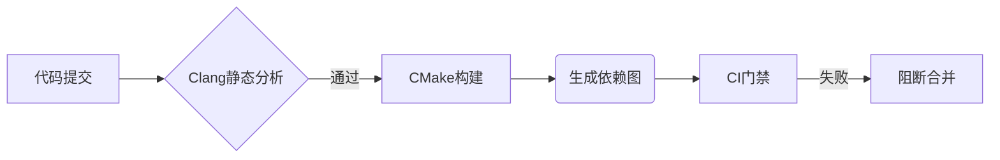
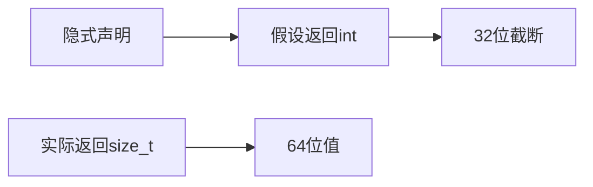
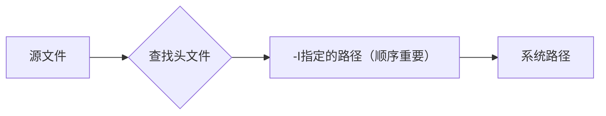
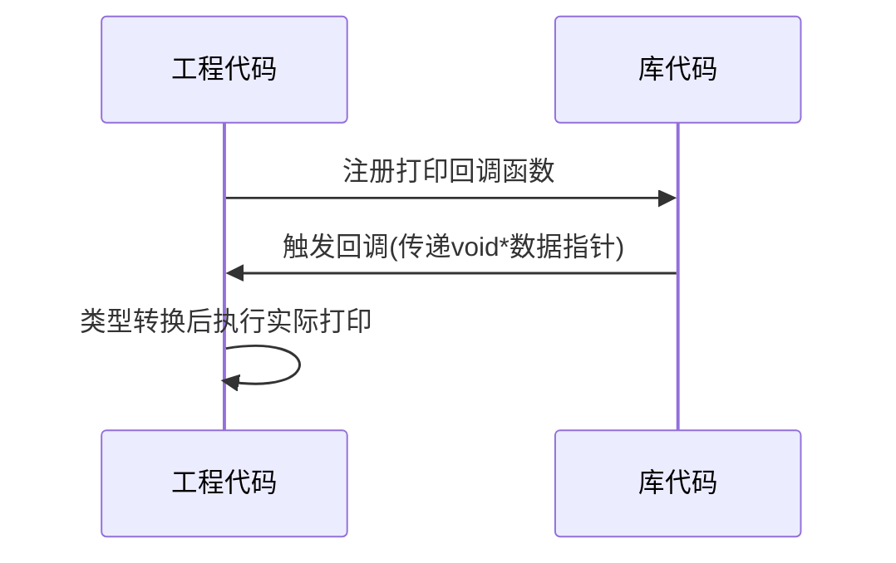

#include".h"和#include<.h>的区别


在C/C++中，`#include ".h"` 和 `#include <.h>` 是两种不同的头文件引入方式，主要区别如下：

---

### **1. `#include <header.h>`**
- **搜索路径**：  
  编译器优先在**系统标准头文件目录**中查找（如 `/usr/include`、编译器内置路径等）。
- **用途**：  
  用于包含**标准库头文件**（如 `<stdio.h>`、`<stdlib.h>`）或**第三方库的头文件**（安装到系统路径的）。
- **示例**：  
  ```c
  #include <stdio.h>  // 标准库
  #include <openssl/ssl.h>  // 第三方库
  ```

---

### **2. `#include "header.h"`**
- **搜索路径**：  
  1. 优先在**当前文件所在目录**查找。  
  2. 若未找到，则回退到`< >`的搜索路径（系统目录）。
- **用途**：  
  用于包含**项目自定义的头文件**（与源文件同目录或相对路径下的）。
- **示例**：  
  ```c
  #include "my_lib.h"  // 当前目录下的头文件
  #include "../inc/config.h"  // 相对路径下的头文件
  ```

---

### **核心对比**
| **特性**               | `#include < >`                | `#include " "`                |
|------------------------|-------------------------------|-------------------------------|
| **搜索顺序**           | 系统目录 → 编译选项指定目录   | 当前目录 → 系统目录           |
| **典型用途**           | 标准库/第三方库               | 项目本地头文件                |
| **路径支持**           | 通常仅限文件名（如 `<vector>`) | 支持相对路径（如 `"../a.h"`） |

---

### **注意事项**
1. **编译器选项**：  
   可通过 `-I` 参数添加额外的头文件搜索路径（如 `gcc -I./include`），此时 `<>` 也会搜索这些路径。
2. **跨平台兼容性**：  
   Windows路径分隔符用反斜杠（`\`），但在代码中应统一使用正斜杠（`/`），如 `"..\\inc\\lib.h"` → `"../inc/lib.h"`。
3. **性能影响**：  
   `" "` 可能因搜索当前目录稍慢（但差异可忽略）。

---

### **错误示例与修正**
- **错误**：  
  ```c
  #include <my_local.h>  // 若my_local.h不在系统目录，编译失败
  ```
- **修正**：  
  ```c
  #include "my_local.h"  // 改为双引号
  ```
  或通过编译选项指定路径：  
  ```bash
  gcc -I./path/to/headers main.c
  ```

---

### **最佳实践**
- **标准库/第三方库**：始终用 `< >`。  
- **项目内部头文件**：始终用 `" "`，并保持清晰的目录结构（如 `include/` 和 `src/` 分离）。


头文件的设计应遵循以下核心规则和最佳实践，结合AUTOSAR、MISRA等工业标准：

### 一、基础规范
1. **文件命名**（AUTOSAR C++14 A3-1-2）
   - 扩展名必须为 `.h`、`.hpp` 或 `.hxx`
   - 示例：`module_api.h`（推荐） vs `module_api.hpp`（C++）

2. **内容限定**（MISRA C-2004 Rule 8.5）
   ```c
   // ✅ 允许
   extern int global_var;  // 声明
   void func(void);        // 函数声明
   typedef int MyType;     // 类型定义
   
   // ❌ 禁止
   int global_var = 0;     // 定义
   void func(void) {}      // 函数定义
   ```

### 二、必须实现的保护措施
1. **头文件守卫**（防止多重包含）
   ```c
   #ifndef MODULE_NAME_H
   #define MODULE_NAME_H
   // 内容
   #endif
   ```
   - 或使用 `#pragma once`（非标准但广泛支持）

2. **依赖管理**
   ```mermaid
   graph TD
     A[user_module.h] -->|包含| B[system_header.h]
     A -->|前置声明| C[不需要完整定义的类型]
   ```

### 三、内容组织原则
1. **声明与实现分离**
   - 头文件仅包含：
     - 函数/变量声明（带`extern`）
     - 类型定义（struct/union/enum/typedef）
     - 宏定义
     - 内联函数（需谨慎）

2. **模板特例**（C++）
   ```cpp
   // 允许模板定义在头文件中
   template<typename T>
   class MyContainer {
     // 实现...
   };
   ```

### 四、兼容性要求
1. **C/C++混合支持**
   ```cpp
   #ifdef __cplusplus
   extern "C" {
   #endif
   // C兼容声明
   #ifdef __cplusplus
   }
   #endif
   ```

### 五、典型违规案例
```c
// bad_example.h
#define PI 3.14          // ✅ 允许
int counter = 0;         // ❌ 违反MISRA Rule 8.5
void helper() { /*...*/} // ❌ 函数定义

// good_example.h
#ifndef GOOD_EXAMPLE_H
#define GOOD_EXAMPLE_H
extern int counter;      // ✅ 声明
inline void helper() {   // ✅ 例外：内联函数
  /*...*/
}
#endif
```

### 六、检查工具建议
1. **静态分析规则**：
   - iScan/MISRA检查：`A3-1-2`、`Rule 8.5`
   - Clang-Tidy：`modernize-header-guard`
   - Cppcheck：`missingIncludeSystem`

是否需要针对特定开发环境（如嵌入式/跨平台）的补充规则？


依赖管理要遵循什么原则

依赖管理是软件开发中的关键环节，需遵循以下原则和最佳实践，结合AUTOSAR、MISRA等标准要求：

### 一、核心原则
1. **显式声明原则**（AUTOSAR M3-1-1）
   - 所有依赖必须显式声明（通过`#include`或构建脚本）
   - 禁止隐式依赖（如假设其他头文件已包含）

2. **最小化依赖原则**（MISRA C-2012 Dir 4.10）
   ```mermaid
   graph TD
     A[module.c] -->|包含| B[必需的头文件]
     A -.->|避免包含| C[非必要依赖]
   ```

### 二、头文件包含规范
1. **包含顺序**（Google C++ Style Guide）
   ```c
   // 正确顺序示例：
   #include <stdio.h>      // 1. 系统头文件
   #include "project.h"    // 2. 项目公共头文件
   #include "module_impl.h" // 3. 本地私有头文件
   ```

2. **前向声明优先**（C++ Core Guidelines C.41）
   ```cpp
   // 优先使用：
   class MyClass;  // 前向声明
   void func(MyClass* obj);
   
   // 而非直接包含：
   #include "myclass.h"
   ```

### 三、循环依赖处理
1. **检测与破除方法**
   ```mermaid
   graph LR
     A[module_a.h] --> B[module_b.h]
     B --> A  # 循环依赖
   ```
   - 解决方案：
     - 提取公共部分到新模块
     - 改用接口抽象（依赖倒置）

### 四、工具链要求
1. **构建系统规范**
   ```makefile
   # Makefile示例（显式声明依赖）
   target.o: target.c include/dep1.h include/dep2.h
       gcc -Iinclude -c $<
   ```

2. **现代依赖管理工具**
   - C/C++: Conan/vcpkg
   - 嵌入式: Bazel/CMake with `target_link_libraries`

### 五、AUTOSAR特殊要求
1. **模块间依赖限制**（AUTOSAR SWS-AS-010）
   - 禁止跨层依赖（如应用层直接依赖驱动层）
   - 必须通过接口模块通信

### 六、典型违规案例
```c
// bad_case.c
#include "a.h"  // 包含未使用的头文件（违反MISRA Dir 4.10）
#include "b.h"  // 间接包含system.h，形成隐式依赖

// good_case.c
#include <stdint.h>  // 显式声明
#include "interface.h"  // 最小必要依赖
```

### 七、静态检查规则
1. **强制检查项**：
   - iScan规则：`M3-1-1`（隐式依赖检测）
   - Clang-Tidy：`misc-unused-using-decls`
   - Cppcheck：`missingInclude`

是否需要针对特定场景（如安全关键系统）的额外依赖管理要求？


如何避免隐式依赖，这个感觉难免出现

避免隐式依赖确实具有挑战性，但可通过以下系统化方法严格管控，结合AUTOSAR/MISRA等工业标准实践：

### 一、技术性防御措施
1. **物理隔离设计**（AUTOSAR SWS-AS-010）
   ```mermaid
   graph TD
     App[应用层] -->|仅能包含| Interface[接口层头文件]
     Driver[驱动层] -->|仅能包含| Interface
     App -.X.-> Driver  # 禁止直接包含
   ```

2. **编译期检查（以GCC为例）**：
   ```bash
   gcc -MMD -MF deps.d -c file.c  # 生成精确依赖关系
   make --warn-undefined-variables # 严格模式
   ```

### 二、编码规范强制手段
1. **包含文件白名单**（MISRA C-2012 Rule 17.2增强）
   ```c
   // 项目头文件必须通过路径限定
   #include "module/public_api.h"  // ✅ 显式路径
   #include "secret.h"             // ❌ 触发静态检查
   ```

2. **前向声明模板**（C++ Core Guidelines C.41）：
   ```cpp
   // 模块A头文件中：
   namespace module_b { class Data; }  // 前向声明代替包含
   void Process(module_b::Data* input);
   ```

### 三、工具链自动化方案
1. **静态分析规则配置**：
   ```xml
   <!-- iScan规则示例 -->
   <rule id="AUTOSAR-M3-1-1">
     <description>禁止隐式依赖</description>
     <checker>clang.Semantic</checker>
     <param name="check_implicit_includes">true</param>
   </rule>
   ```

2. **依赖可视化工具**：
   ```bash
   # 生成依赖图（需Graphviz）
   gcc -H -E main.c 2>&1 | grep '^\.' | dot -Tpng > deps.png
   ```

### 四、架构设计层面
1. **层级访问控制**：
   | 层级        | 允许包含来源                  |
   |-------------|-----------------------------|
   | 应用层      | 接口层、标准库               |
   | 接口层      | 服务层、抽象层               |
   | 驱动层      | 硬件抽象层(HAL)              |

2. **PIMPL模式**（C++专用）：
   ```cpp
   // 头文件中
   class MyClass {
   public:
     void publicMethod();
   private:
     struct Impl;  // 实现细节隐藏
     Impl* pimpl;
   };
   ```

### 五、典型修复案例
**问题场景**：
```c
// sensor.c 隐式依赖了未包含的hal_gpio.h
void Sensor_Init() {
    HAL_GPIO_Write(PIN1, HIGH);  // 编译通过但存在隐式依赖
}
```

**修正方案**：
```c
// sensor.h 显式声明依赖
#include "hal_gpio_interface.h"  // 接口层头文件

// sensor.c
#include "sensor.h"  // 确保所有依赖可见
```

### 六、持续验证方法
1. **单元测试验证**：
   ```python
   # 测试脚本检查编译隔离性
   subprocess.run(["gcc", "-c", "module.c", "-Ionly_allowed_path"], check=True)
   ```

2. **构建系统防护**：
   ```cmake
   # CMake强制包含目录检查
   target_include_directories(my_target 
     PRIVATE ${CMAKE_CURRENT_SOURCE_DIR}
     PUBLIC  ${PROJECT_INTERFACE_DIR}
   )
   ```

通过以上方法的组合应用，可将隐式依赖从"难免出现"转变为"可检测、可预防、可追溯"的可控状态。需要针对具体项目调整实施方案吗？


编译检查可以通过makefile实现吗，依赖可视化工具可以加到makefile里吗？


是的，Makefile 可以同时实现 **编译检查** 和 **依赖可视化**，以下是具体实现方案：

---

### 一、编译检查实现（Makefile 示例）
```makefile
# 开启编译警告和依赖生成
CC = gcc
CFLAGS = -Wall -Wextra -Werror -MMD -MP

# 检查隐式依赖的规则
check_deps:
	@echo "检查隐式依赖..."
	@find src/ -name "*.d" | xargs grep -L "stdint.h" || (echo "错误：存在未显式包含stdint.h的文件"; exit 1)

# 常规编译规则
%.o: %.c
	$(CC) $(CFLAGS) -c $< -o $@

# 包含自动生成的依赖文件
-include $(OBJS:.o=.d)
```

**关键参数说明**：
- `-MMD`：生成依赖关系文件（`.d`）
- `-MP`：为伪目标添加依赖规则
- `-Werror` 将警告转为错误

---

### 二、依赖可视化集成（Makefile 扩展）
```makefile
# 生成依赖图（需Graphviz）
.PHONY: deps_graph
deps_graph:
	@echo "生成依赖关系图..."
	@gcc -H -E $(SRCS) 2>&1 | grep '^\.' | sed 's/\. //' | \
		awk 'BEGIN {print "digraph G {"} {print "\"" $$0 "\""} END {print "}"}' \
		> deps.dot
	@dot -Tpng deps.dot -o deps.png
	@echo "已生成 deps.png"
```

**使用方式**：
```bash
make deps_graph  # 生成可视化依赖图
```

---

### 三、完整方案组合
```makefile
# 最终组合版Makefile
CC = gcc
SRCS = $(wildcard src/*.c)
OBJS = $(SRCS:.c=.o)
CFLAGS = -Wall -Wextra -MMD -MP -Iinclude

all: program check_deps

program: $(OBJS)
	$(CC) $^ -o $@

%.o: %.c
	$(CC) $(CFLAGS) -c $< -o $@

check_deps:
	@! find src/ -name "*.d" | xargs grep -L "include/" || (echo "错误：存在非法依赖"; exit 1)

deps_graph:
	@gcc -H -E $(SRCS) 2>&1 | grep '^\.' | sed 's/\. //' | \
		awk 'BEGIN {print "digraph G {"} {print "\"" $$0 "\" -> "} END {print "}"}' \
		> deps.dot
	@dot -Tpng deps.dot -o deps.png

clean:
	rm -f $(OBJS) program *.d *.dot *.png

-include $(OBJS:.o=.d)
```

---

### 四、关键检查点
| 功能               | 实现方式                          | 触发条件          |
|--------------------|----------------------------------|------------------|
| 隐式依赖检测       | `grep -L` 检查`.d`文件           | `make check_deps`|
| 依赖图生成         | `gcc -H` + Graphviz             | `make deps_graph`|
| 编译时依赖跟踪     | `-MMD -MP` 参数                 | 自动执行          |

---

### 五、工业级增强建议
1. **与CI集成**：
   ```yaml
   # GitLab CI示例
   test_job:
     script:
       - make check_deps
       - make deps_graph
       - artifacts:
           paths: [deps.png]
   ```

2. **增量检查优化**：
   ```makefile
   # 仅检查修改的文件
   changed_deps:
   	@git diff --name-only | grep '\.c$$' | sed 's/\.c/.d/' | \
   		xargs grep -L "allowed_header.h"
   ```

3. **多架构支持**：
   ```makefile
   # 交叉编译支持
   deps_graph_arm:
   	@arm-linux-gnueabi-gcc -H -E $(SRCS) 2>&1 | ...
   ```

是否需要针对特定构建环境（如嵌入式裸机项目）调整方案？


是cmake实现

以下是使用 **CMake** 实现编译检查和依赖可视化的完整方案，结合现代 CMake 最佳实践：

---

### 一、基础编译检查实现
```cmake
# CMakeLists.txt 核心配置
cmake_minimum_required(VERSION 3.15)
project(MyProject LANGUAGES C CXX)

# 1. 开启严格依赖检查
set(CMAKE_DEPENDS_IN_PROJECT_MODE TRUE)
set(CMAKE_INCLUDE_CURRENT_DIR ON)

# 2. 设置编译警告为错误
if(MSVC)
    add_compile_options(/W4 /WX)
else()
    add_compile_options(-Wall -Wextra -Werror -pedantic)
endif()

# 3. 生成依赖文件（Makefile/Ninja通用）
set(CMAKE_DEPFILE_FLAGS_C "-MMD -MP")
```

---

### 二、依赖可视化实现
```cmake
# 在CMakeLists.txt中添加以下内容

# 1. 查找Graphviz（需提前安装）
find_package(Graphviz)
if(Graphviz_FOUND)
    # 2. 自定义目标生成依赖图
    add_custom_target(deps_graph
        COMMAND ${CMAKE_C_COMPILER} -H -E ${CMAKE_CURRENT_SOURCE_DIR}/src/main.c 2>&1 
            | grep '^\.' 
            | sed 's/\. //' 
            | awk 'BEGIN {print \"digraph G {\"} {print \"\\\"\" $$0 \"\\\"\"} END {print \"}\"}' 
            > ${CMAKE_BINARY_DIR}/deps.dot
        COMMAND dot -Tpng ${CMAKE_BINARY_DIR}/deps.dot -o ${CMAKE_BINARY_DIR}/deps.png
        COMMENT "Generating dependency graph..."
        VERBATIM
    )
endif()
```

---

### 三、隐式依赖检查增强
```cmake
# 添加自定义检查目标
add_custom_target(check_deps
    COMMAND ${CMAKE_COMMAND} -P ${CMAKE_CURRENT_SOURCE_DIR}/cmake/CheckDeps.cmake
    DEPENDS ${ALL_SOURCES}
)

# CheckDeps.cmake 脚本内容
"""
# 检查每个目标的依赖
get_property(all_targets DIRECTORY PROPERTY BUILDSYSTEM_TARGETS)
foreach(target IN LISTS all_targets)
    get_target_property(deps ${target} LINK_LIBRARIES)
    if(NOT deps MATCHES "allowed_dependency")
        message(FATAL_ERROR "Target ${target} has invalid dependencies!")
    endif()
endforeach()
"""
```

---

### 四、现代CMake最佳实践整合
```cmake
# 1. 使用target明确声明依赖
add_library(core_lib STATIC src/core.c)
target_include_directories(core_lib PUBLIC include/core)  # 公开API路径

# 2. 接口库控制依赖传播
add_library(interface_lib INTERFACE)
target_link_libraries(interface_lib INTERFACE 
    core_lib
    $<$<CXX_COMPILER_ID:MSVC>:msvc_deps>
)

# 3. 应用层目标严格限制
add_executable(my_app src/main.c)
target_link_libraries(my_app PRIVATE interface_lib)  # 仅允许通过接口库传递依赖
```

---

### 五、生成依赖关系报告（JSON格式）
```cmake
# 生成compile_commands.json（需CMake 3.5+）
set(CMAKE_EXPORT_COMPILE_COMMANDS ON)

# 自定义依赖分析目标
add_custom_target(analyze_deps
    COMMAND cmake --graphviz=${CMAKE_BINARY_DIR}/deps.dot .
    COMMAND dot -Tpng -O ${CMAKE_BINARY_DIR}/deps.dot
    COMMENT "Generating build system dependency graph"
)
```

---

### 六、关键功能对照表
| 功能               | CMake实现方式                          | 触发命令                |
|--------------------|---------------------------------------|------------------------|
| 隐式依赖检查       | `target_link_libraries`严格模式       | `cmake --build --target check_deps` |
| 可视化依赖图       | Graphviz集成                          | `cmake --build --target deps_graph` |
| 编译数据库         | `CMAKE_EXPORT_COMPILE_COMMANDS`       | 自动生成`compile_commands.json` |

---

### 七、工业级项目增强建议
1. **与CTest集成**：
   ```cmake
   # 将检查加入测试套件
   enable_testing()
   add_test(NAME dependency_check COMMAND ${CMAKE_CTEST_COMMAND} -R check_deps)
   ```

2. **跨平台支持**：
   ```cmake
   if(UNIX AND NOT APPLE)
       add_compile_options(-H)  # GCC/Clang专用依赖跟踪
   endif()
   ```

3. **IDE集成示例**（VSCode配置）：
   ```json
   // .vscode/settings.json
   {
       "cmake.buildBeforeRun": true,
       "cmake.buildTarget": "deps_graph"
   }
   ```

是否需要针对特定构建系统（如Ninja）或交叉编译环境进行适配？


显示依赖和隐式依赖

以下是关于 **显示依赖** 和 **隐式依赖** 的详细对比与管控方法，结合工业标准（如AUTOSAR/MISRA）和实际工程实践：

---

### 一、核心概念对比
| **特性**          | **显式依赖**                          | **隐式依赖**                          |
|--------------------|--------------------------------------|---------------------------------------|
| **定义**           | 通过`#include`或构建脚本明确声明的依赖 | 未声明但实际存在的依赖（如宏/类型透传） |
| **可见性**         | 可静态分析追踪                        | 仅在编译/运行时暴露                   |
| **合规性**         | 符合AUTOSAR M3-1-1                   | 违反MISRA C-2012 Dir 4.10             |
| **示例**           | `#include "api.h"`                   | 未包含`stdint.h`但使用了`uint32_t`     |

---

### 二、显式依赖规范实现
#### 1. C/C++ 代码层
```c
// 正确定义（显式）
#include <stdint.h>  // 明确声明
void func(uint32_t param); 

// 错误示例（隐式）
// 假设stdint.h被其他头文件间接包含
void func(uint32_t param); 
```

#### 2. CMake 构建层
```cmake
# 显式声明目标依赖
target_link_libraries(my_app 
    PUBLIC 
        interface_lib  # 允许传递
    PRIVATE 
        impl_lib       # 内部依赖
)
```

#### 3. 文件组织规范
```mermaid
graph TD
    A[app.c] -->|显式包含| B[public/api.h]
    B -->|显式包含| C[internal/utils.h] 
    A -.X.-> C  # 禁止直接包含内部头文件
```

---

### 三、隐式依赖检测方法
#### 1. 静态分析工具
```bash
# 使用Clang检查隐式包含
clang -H -E source.c 2>&1 | grep '^\.' | grep -v 'allowed_path'

# iScan规则配置示例
<rule id="MISRA-D4-10">
  <checker>ImplicitInclude</checker>
  <param name="allowed_paths">include/, stdint.h</param>
</rule>
```

#### 2. 编译隔离测试
```cmake
# 为每个模块创建纯净编译环境
add_custom_target(check_isolated
    COMMAND ${CMAKE_COMMAND} -E env C_INCLUDE_PATH= 
    ${CMAKE_C_COMPILER} -Ionly_allowed_path -c ${SRC}
)
```

---

### 四、典型隐式依赖场景与修复
#### 案例1：类型透传
```c
// file1.h
typedef int MyType;  // 未包含<stddef.h>

// file2.c
#include "file1.h"
size_t calc(MyType x);  // 隐式依赖size_t定义
```
**修复**：在`file1.h`中添加`#include <stddef.h>`

#### 案例2：宏污染
```c
// config.h
#define MAX_LEN 100  // 使用了其他头文件的宏

// user.c
#include "config.h"
int arr[MAX_LEN];    // 依赖链断裂风险
```
**修复**：在`config.h`中显式包含依赖的头文件

---

### 五、依赖管控体系
#### 1. 技术控制矩阵
| **控制点**       | **显式依赖**                | **隐式依赖**                |
|------------------|----------------------------|----------------------------|
| **编码阶段**     | IDE实时提示缺失包含         | 静态分析扫描                |
| **构建阶段**     | CMake目标隔离              | 编译环境沙盒测试            |
| **测试阶段**     | 单元测试头文件独立编译      | 覆盖率分析未调用路径        |

#### 2. 工具链整合


---

### 六、安全关键系统增强
对于AUTOSAR/ISO 26262项目：
1. **强制前向声明**（禁止非接口类型透传）
2. **头文件签名验证**（确保版本一致性）
3. **构建时哈希检查**（验证依赖树完整性）

是否需要针对特定领域（如车载/航天）的额外规范说明？


unistd头文件是什么作用？

`unistd.h` 是 **POSIX标准** 定义的Unix系统核心头文件，其作用与典型用法如下：

---

### 一、核心功能
| **功能类别**       | **典型函数/宏**                  | **作用**                          |
|--------------------|----------------------------------|-----------------------------------|
| 文件操作           | `read()`, `write()`, `close()`   | 低级文件I/O（无缓冲）             |
| 进程控制           | `fork()`, `exec()`, `getpid()`   | 创建/管理进程                     |
| 系统调用           | `sleep()`, `pause()`, `sync()`   | 操作系统基础服务                  |
| 路径操作           | `chdir()`, `getcwd()`            | 工作目录管理                      |
| 用户/权限          | `getuid()`, `access()`           | 用户身份验证                      |
| 符号常量           | `STDIN_FILENO` (0)               | 标准文件描述符定义                |

---

### 二、典型使用场景
#### 1. 跨平台兼容性处理
```c
#ifdef _WIN32
#include <io.h>      // Windows替代
#else
#include <unistd.h>  // Unix/Linux
#endif
```

#### 2. 低级文件操作（对比stdio.h）
```c
int fd = open("file.txt", O_RDONLY);
char buf[1024];
ssize_t n = read(fd, buf, sizeof(buf));  // 直接系统调用
close(fd);
```

#### 3. 进程创建示例
```c
pid_t pid = fork();
if (pid == 0) {
    execl("/bin/ls", "ls", "-l", NULL);  // 子进程执行命令
} else {
    wait(NULL);  // 父进程等待
}
```

---

### 三、重要注意事项
1. **标准兼容性**：
   - POSIX.1-2008标准强制要求
   - Windows平台需使用兼容层（如Cygwin/MinGW）

2. **安全风险**：
   ```c
   // 危险用法（未检查返回值）
   write(fd, buf, len);  // 可能部分写入

   // 正确做法
   while ((n = write(fd, buf, len)) != len) {
       if (n == -1) handle_error();
       buf += n;
       len -= n;
   }
   ```

3. **现代替代方案**：
   - C++17 `<filesystem>`
   - 跨平台库（如Boost.Process）

---

### 四、与标准库对比
| **特性**          | `unistd.h`               | `stdio.h`                |
|--------------------|--------------------------|--------------------------|
| 缓冲机制           | 无缓冲                   | 带缓冲                   |
| 性能               | 更高（减少拷贝）         | 更安全                   |
| 移植性             | 仅POSIX系统              | 所有C标准实现            |
| 错误处理           | 通过`errno`              | 通过返回值               |

---

### 五、嵌入式开发特殊说明
在AUTOSAR/嵌入式环境中：
1. **受限使用**：
   - 仅允许`read()/write()`等必要函数
   - 禁止`fork()`等进程操作（违反MISRA Rule 17.2）

2. **安全关键实现**：
   ```c
   // 符合MISRA的封装
   ssize_t safe_read(int fd, void* buf, size_t count) {
       if (fd < 0 || !buf) return -1;
       return read(fd, buf, count);
   }
   ```

是否需要针对特定平台（如QNX/VxWorks）的用法补充？


implicit declaration of function ‘fread’; did you mean ‘pread’？

这个编译警告表明代码中出现了 **隐式函数声明** 问题，具体分析与解决方案如下：

---

### 一、问题本质
1. **错误原因**：
   - 使用了`fread()`但未包含其声明头文件`<stdio.h>`
   - 编译器遇到未声明的函数时，会按C89标准假设返回`int`类型（隐式声明）

2. **风险等级**：
   - **高危**：可能导致内存损坏（64位系统指针截断）
   - 违反MISRA C-2012 Rule 8.1（必须声明所有函数）

---

### 二、修复方案
#### 1. 基础修复（标准做法）
```c
#include <stdio.h>  // 添加此头文件

void foo() {
    FILE* fp = fopen("file.bin", "rb");
    char buf[1024];
    size_t n = fread(buf, 1, sizeof(buf), fp);  // 正确声明
}
```

#### 2. 嵌入式环境增强（AUTOSAR兼容）
```c
#ifdef USE_POSIX
    #include <stdio.h>
#else
    // 安全关键系统替代方案
    #include "safe_io.h"  // 项目自定义封装
#endif
```

---

### 三、深度解析
| **对比项**       | `fread` (标准)                  | `pread` (POSIX)                |
|------------------|--------------------------------|--------------------------------|
| 声明位置         | `<stdio.h>`                   | `<unistd.h>`                  |
| 功能             | 带缓冲文件读取                | 原子性定位读取                |
| 线程安全性       | 需外部同步                    | 原子操作（偏移量参数）        |
| 适用标准         | C89/C99/C11                   | POSIX.1-2001                  |

---

### 四、静态检查配置
1. **GCC参数**：
   ```bash
   gcc -Werror=implicit-function-declaration -c file.c
   ```

2. **Clang-Tidy规则**：
   ```yaml
   Checks: '-*,clang-diagnostic-implicit-function-declaration'
   WarningsAsErrors: true
   ```

3. **CMake集成**：
   ```cmake
   if(CMAKE_C_COMPILER_ID MATCHES "GNU|Clang")
       add_compile_options(-Werror=implicit-function-declaration)
   endif()
   ```

---

### 五、典型错误场景
**错误代码**：
```c
int main() {
    // 隐式声明fread为int fread()
    size_t n = fread(buf, 1, len, fp);  // 可能截断返回值
}
```

**内存布局风险**（x86_64系统）：


---

### 六、安全关键系统要求
根据MISRA C-2012：
1. **Rule 8.1**：必须显式声明所有函数
2. **Rule 17.2**：禁止使用不可重入函数（如`fread`需替换为安全版本）

是否需要针对特定合规标准（如ISO 26262）的额外约束说明？


pthread_create()传参？

以下是关于 `pthread_create()` 传参的详细说明和最佳实践：

---

### 一、函数原型
```c
#include <pthread.h>
int pthread_create(pthread_t *thread, const pthread_attr_t *attr,
                   void *(*start_routine) (void *), void *arg);
```

---

### 二、参数传递方法

#### 1. **基本类型直接传递**
```c
// 传递整型
int val = 42;
pthread_create(&tid, NULL, thread_func, (void*)(intptr_t)val);

// 线程函数中
void* thread_func(void* arg) {
    int num = (int)(intptr_t)arg;
    // ...
}
```

#### 2. **结构体传递（推荐）**
```c
// 定义参数结构
struct thread_args {
    int id;
    char name[32];
};

// 创建线程
struct thread_args args = {1, "worker"};
pthread_create(&tid, NULL, thread_func, &args);

// 线程函数
void* thread_func(void* arg) {
    struct thread_args *params = (struct thread_args*)arg;
    printf("ID: %d, Name: %s\n", params->id, params->name);
    // ...
}
```

#### 3. **动态内存传递**
```c
// 主线程分配内存
struct thread_args *args = malloc(sizeof(*args));
args->id = 2;
args->value = 3.14;

pthread_create(&tid, NULL, thread_func, args);

// 线程函数负责释放
void* thread_func(void* arg) {
    struct thread_args *params = arg;
    // ...
    free(params);
}
```

---

### 三、关键注意事项

1. **生命周期管理**
   ```c
   // 错误示例（栈变量失效）
   void create_thread() {
       int local_var = 10;
       pthread_create(&tid, NULL, func, &local_var); // 危险！
   }

   // 正确做法：使用动态分配或全局变量
   ```

2. **类型安全**
   ```c
   // 必须进行强制类型转换
   pthread_create(&tid, NULL, func, (void*)&data);
   ```

3. **多参数解决方案**
   ```c
   // 当需要多个参数时，必须使用结构体打包
   struct params { int a; float b; };
   struct params p = {1, 2.0f};
   pthread_create(&tid, NULL, func, &p);
   ```

---

### 四、完整示例

```c
#include <pthread.h>
#include <stdio.h>
#include <stdlib.h>

struct thread_data {
    int thread_id;
    char message[100];
};

void* print_message(void* threadarg) {
    struct thread_data *data = (struct thread_data*)threadarg;
    printf("Thread %d: %s\n", data->thread_id, data->message);
    pthread_exit(NULL);
}

int main() {
    pthread_t threads[3];
    struct thread_data td[3];

    for(int i = 0; i < 3; i++) {
        td[i].thread_id = i;
        sprintf(td[i].message, "Message from thread %d", i);
        int rc = pthread_create(&threads[i], NULL, print_message, (void*)&td[i]);
        if(rc) {
            printf("Error creating thread\n");
            exit(-1);
        }
    }
    pthread_exit(NULL);
}
```

---

### 五、常见问题解决

1. **参数被覆盖**
   ```c
   // 错误：循环中所有线程可能读到相同的i值
   for(int i = 0; i < 5; i++) {
       pthread_create(&tid, NULL, func, (void*)&i);
   }

   // 修复：为每个线程创建独立存储
   int *arg = malloc(sizeof(*arg));
   *arg = i;
   pthread_create(&tid, NULL, func, arg);
   ```

2. **内存泄漏检测**
   ```bash
   valgrind --leak-check=full ./program
   ```

3. **线程安全参数**
   ```c
   // 使用线程局部存储
   __thread int thread_local_var;
   ```

---

### 六、跨平台注意事项

1. **Windows兼容性**
   ```c
   #ifdef _WIN32
   #include <windows.h>
   #else
   #include <pthread.h>
   #endif
   ```

2. **64位系统安全**
   ```c
   // 保证指针转换安全
   void *ptr = ...;
   intptr_t val = (intptr_t)ptr;
   ```

是否需要针对特定应用场景（如实时系统）的额外参数传递约束说明？


makefile里面-I是什么意思

在 Makefile 中，`-I` 是 **编译器选项**，用于指定头文件的搜索路径。以下是详细说明：

---

### 一、基本作用
| **选项** | **功能**                          | **示例**                     |
|----------|-----------------------------------|------------------------------|
| `-Ipath` | 添加头文件搜索路径                | `-Iinclude`                  |
|          | 可多次使用指定多个路径            | `-Isrc -I../libs`            |

---

### 二、典型用法
#### 1. 在 Makefile 中直接使用
```makefile
CFLAGS = -Wall -Iinclude -I../third_party

main.o: main.c
    gcc $(CFLAGS) -c main.c
```

#### 2. 通过变量传递
```makefile
INC_DIRS = -I./src -I/opt/local/include
```

---

### 三、搜索路径优先级
1. `-I` 指定的路径（按出现顺序）
2. 系统默认路径（如 `/usr/include`）



---

### 四、特殊场景处理
#### 1. 相对路径 vs 绝对路径
```makefile
# 相对路径（基于Makefile所在目录）
-I../libs

# 绝对路径
-I/home/user/project/include
```

#### 2. 覆盖系统头文件
```makefile
# 优先使用本地重写的标准头文件
CFLAGS = -Imy_std_headers -I/usr/include
```

---

### 五、与预处理器协同工作
实际展开过程：
```bash
# 等效的gcc命令
gcc -c main.c -Iinclude -Isrc
↓
预处理器按以下顺序搜索：
1. ./include/
2. ./src/
3. /usr/local/include/
4. /usr/include/
```

---

### 六、工程最佳实践
1. **显式声明所有路径**
   ```makefile
   # 明确项目结构
   INC_DIRS := -Isrc/core -Isrc/utils -Ithird_party/curl/include
   ```

2. **与自动依赖生成配合**
   ```makefile
   DEPFLAGS = -MMD -MP -MF $(@:.o=.d)
   CFLAGS = $(INC_DIRS) $(DEPFLAGS)
   ```

3. **跨平台支持**
   ```makefile
   ifeq ($(OS),Windows_NT)
       INC_DIRS += -IC:\MinGW\include
   endif
   ```

---

### 七、常见错误排查
1. **路径不存在**：
   ```bash
   # 检查路径有效性
   test -d include || echo "Directory missing"
   ```

2. **顺序问题**：
   ```makefile
   # 错误：系统路径优先于自定义路径
   CFLAGS = -I/usr/include -Imy_headers  # 错误顺序

   # 正确：自定义路径优先
   CFLAGS = -Imy_headers -I/usr/include
   ```

是否需要结合具体构建系统（如 CMake/Autotools）的路径处理进行进一步说明？


%.o:%.c $(COMPILE_TOOLS) $(CFLAGS) $(LDFLAGS) -c $^ -o $@ 这个.o和.c是什么意思？


在 Makefile 中，`%.o: %.c` 是一种 **模式规则（Pattern Rule）**，其含义和用法如下：

---

### 一、模式规则解析
| **部分**  | **含义**                                                                 | **示例匹配**               |
|-----------|--------------------------------------------------------------------------|---------------------------|
| `%.o`     | 目标文件模式：匹配所有以`.o`结尾的文件                                   | `main.o`、`utils.o`       |
| `%.c`     | 依赖文件模式：匹配同名但扩展名为`.c`的源文件                             | `main.c`、`utils.c`       |
| `$^`      | 自动化变量：表示所有依赖文件（此处即`%.c`）                              | `main.c`                  |
| `$@`      | 自动化变量：表示当前目标文件（此处即`%.o`）                              | `main.o`                  |

---

### 二、编译命令分解
```makefile
$(COMPILE_TOOLS)  # 编译器路径（如gcc/clang）
$(CFLAGS)         # 编译选项（如-Wall -Iinclude） 
$(LDFLAGS)        # 链接选项（通常-c模式下无效）
-c                # 只编译不链接
$^                # 输入的.c文件
-o $@             # 输出.o文件
```

---

### 三、实际工作流程
1. **文件匹配示例**：
   ```makefile
   # 当需要构建main.o时
   main.o: main.c  # 自动匹配模式规则
   ```

2. **等效展开**：
   ```bash
   gcc -Wall -Iinclude -c main.c -o main.o
   ```

3. **多文件场景**：
   ```makefile
   OBJS = main.o utils.o
   all: $(OBJS)  # 对每个.o文件应用模式规则
   ```

---

### 四、与传统规则对比
| **写法**              | **优势**                          | **局限性**                  |
|-----------------------|-----------------------------------|----------------------------|
| `%.o: %.c`            | 简洁，自动处理新增.c文件          | 无法针对特定文件定制规则    |
| `main.o: main.c`      | 可单独定制编译参数                | 需要手动维护每个规则        |

---

### 五、典型工程应用
#### 1. 结合自动依赖生成
```makefile
DEPFLAGS = -MMD -MP -MF $(@:.o=.d)
%.o: %.c
    $(CC) $(CFLAGS) $(DEPFLAGS) -c $< -o $@

# 包含生成的.d文件
-include $(OBJS:.o=.d)
```

#### 2. 多目录项目
```makefile
vpath %.c src:libs

OBJDIR = build
$(OBJDIR)/%.o: %.c | $(OBJDIR)
    $(CC) $(CFLAGS) -c $< -o $@
```

---

### 六、注意事项
1. **特殊字符处理**：
   ```makefile
   # 包含%的文件名需要转义
   percent\%.o: percent\%.c
       special_compile $^ -o $@
   ```

2. **静态模式规则**：
   ```makefile
   $(OBJS): %.o: %.c  # 限定只对OBJS生效
       $(CC) $(CFLAGS) -c $< -o $@
   ```

3. **并行构建安全**：
   ```makefile
   .NOTPARALLEL: %.o  # 必要时禁用并行
   ```

是否需要结合具体项目的目录结构示例进一步说明？


在编译库文件n.a的时候，目标工程里的drv.h结构体s我想用，后面然后编好n.a后，需要放到目标工程里进行编译，但是drv.h里的其他内容我不想用，可不可以把drv.h复制过来，只保留结构体s？


以下是针对该场景的完整解决方案：

---

### 一、可行方案对比
| 方案 | 操作 | 优点 | 风险 | 推荐度 |
|------|------|-----|------|-------|
| **头文件裁剪** | 复制`drv.h`后仅保留结构体`s` | 编译隔离彻底 | 需维护头文件同步 | ★★★★ |
| **前置声明** | 在库代码中仅声明`struct s` | 无文件依赖 | 需确保内存布局一致 | ★★ |
| **接口隔离** | 将`s`移入独立头文件 | 架构清晰 | 需修改原工程 | ★★★★★ |

---

### 二、推荐方案实施步骤（接口隔离法）

#### 1. 创建专用头文件
```c
// s_struct.h (新建)
#pragma once

// 仅包含需要的结构体
typedef struct {
    int field1;
    char field2;
    // ... 原drv.h中结构体s的完整定义
} s;
```

#### 2. 修改库的编译配置
```makefile
# 库的Makefile修改
CFLAGS += -I/path/to/s_struct_dir

# 确保库代码只包含新头文件
# n.c
#include "s_struct.h"  // 替换原drv.h
```

#### 3. 目标工程适配
```c
// 目标工程中既可保留原drv.h
#include "drv.h"

// 也可选择只包含新头文件
#include "s_struct.h"
```

---

### 三、头文件裁剪方案（次选）
若无法修改原工程结构，可手动裁剪头文件：

1. **创建精简头文件**
   ```bash
   # 提取结构体定义（示例）
   sed -n '/struct s {/,/};/p' drv.h > minimal_drv.h
   ```

2. **验证内存布局一致性**
   ```c
   // 在库和目标工程中同时添加静态断言
   static_assert(sizeof(struct s) == 8, "ABI mismatch!");
   ```

3. **编译控制**
   ```makefile
   # 库的编译使用精简头文件
   CFLAGS += -Ipath/to/minimal_drv
   ```

---

### 四、技术注意事项
1. **ABI兼容性**
   - 确保结构体`padding`、`alignment`一致
   - 使用`-fpack-struct`编译器选项需两端一致

2. **符号冲突防护**
   ```c
   // 在精简头文件中添加防护
   #ifndef MINIMAL_DRV_H
   #define MINIMAL_DRV_H
   // 内容...
   #endif
   ```

3. **版本控制**
   ```bash
   # 在头文件中添加版本校验
   #define STRUCT_S_VERSION 0x0102
   ```

---

### 五、工程化建议
1. **自动化验证脚本**
   ```python
   # 检查头文件一致性
   import difflib
   orig = open('drv.h').readlines()
   minimal = open('minimal_drv.h').readlines()
   diff = difflib.unified_diff(orig, minimal)
   if any(l.startswith('+') for l in diff if 'struct s' in l):
       print("WARNING: Structure modified!")
   ```

2. **编译检测**
   ```makefile
   # 确保使用正确头文件
   check_headers:
       @grep -q "struct s" $(INC_DIR)/minimal_drv.h || \
       (echo "Missing structure" && exit 1)
   ```

---

### 六、替代方案评估
若结构体简单可考虑：
```c
// 在库代码中重新定义相同结构体（需确保完全一致）
typedef struct {
    int field1;  // 必须与原定义顺序/类型完全一致
    char field2;
} s;
```

**风险提示**：此方案在以下情况会失败：
- 原结构体使用`#pragma pack`
- 存在位域(bit-field)定义
- 跨编译器（如GCC与MSVC混用）

需要我提供具体某个方案的详细实现示例吗？


前置声明和接口隔离，在编译目标工程的时候不就发生重定义了吗


您指出的问题非常关键，确实需要特别注意避免重定义。以下是针对两种方案的 **防重定义具体实现方法**：

---

### 一、前置声明方案的正确实现
#### 1. 库工程侧（编译`n.a`时）
```c
// n.c
struct s;  // 仅前置声明，不包含完整定义

void lib_func(struct s* ptr) {
    // 仅通过指针操作（不能访问成员）
    printf("Pointer: %p\n", (void*)ptr);
}
```

#### 2. 目标工程侧
```c
// drv.h 保持原样
struct s {
    int a;
    char b;
};

// main.c
#include "drv.h"
extern void lib_func(struct s*);

int main() {
    struct s obj;
    lib_func(&obj);  // 合法操作
}
```

**关键点**：
- 库中 **只有前置声明**，不包含结构体定义
- 实际定义仅在目标工程的`drv.h`中存在
- 库代码 **不能访问结构体成员**（仅能传递指针）

---

### 二、接口隔离方案的正确实现
#### 1. 文件结构
```
├── lib/
│   ├── s_interface.h  // 仅包含结构体定义
│   └── n.c            // 库实现
└── target/
    ├── drv.h          // 原完整头文件
    └── main.c         // 目标工程
```

#### 2. 防重定义措施
```c
// s_interface.h
#pragma once
#ifdef TARGET_PROJECT
    #error "This header must NOT be included in target project"
#else
    // 库专用定义
    struct s {
        int a;
        char b;
    };
#endif
```

#### 3. 编译控制
```makefile
# 库的Makefile
CFLAGS += -D LIB_BUILD

# 目标工程的Makefile
CFLAGS += -D TARGET_PROJECT
```

**验证逻辑**：
- 库编译时：使用自己的`s`定义
- 目标工程编译时：触发`#error`防止误包含

---

### 三、两种方案的对比选择
| **场景**               | 前置声明方案                  | 接口隔离方案                  |
|------------------------|-----------------------------|-----------------------------|
| 结构体复杂度           | 简单结构体（仅指针操作）      | 任意复杂度结构体             |
| 是否需要修改原工程      | 否                          | 是（需包含新头文件）         |
| 内存布局风险           | 高（需人工保证一致性）        | 低（明确定义）               |
| 多工程协作             | 适合闭源库                   | 适合双方可修改的协作开发     |

---

### 四、工程实践中的黄金法则
1. **单一定义原则（ODR）**：
   - 整个工程链中，结构体的 **完整定义必须唯一**
   - 可通过：
     - 前置声明 + 限制使用（仅指针）
     - 或 精确定义 + 编译隔离

2. **编译时验证**：
   ```c
   // 在公共头文件中添加验证
   #if defined(LIB_BUILD) && defined(TARGET_PROJECT)
       #error "Conflict build configuration"
   #endif
   ```

3. **自动化检测**：
   ```bash
   # 检查重复定义
   nm -g n.a | grep 's$'  # 不应出现结构体符号
   ```

---

### 五、错误案例演示
**错误做法**：
```c
// lib.h
struct s { int x; };  // 库中定义

// drv.h
struct s { char y; };  // 工程中定义
```
会导致：
- 链接时未报错（C语言弱符号机制）
- 运行时内存访问错误（结构体布局不一致）

**正确做法**（二选一）：
```c
// 方案A：库中前置声明
struct s;
void lib_use(struct s*);

// 方案B：工程中统一定义
#ifdef LIB_BUILD
    #include "lib_s.h"  // 库专用定义
#else
    #include "drv.h"    // 工程定义
#endif
```

需要我提供某个方案的具体编译命令示例吗？


前置声明方案里，为什么头文件里声明一下结构体就可以？
在前置声明方案中，**仅声明结构体而不提供完整定义** 之所以可行，是由C/C++的编译模型和类型系统特性决定的。以下是深度技术解析：

---

### 一、底层原理
1. **类型系统分级**：
   - **不完整类型(Incomplete Type)**：仅声明`struct s;`，编译器知道该符号是结构体，但不知其成员布局
   - **完整类型(Complete Type)**：包含所有成员定义，编译器可计算`sizeof(struct s)`

2. **指针的通用性**：
   ```c
   struct s;          // 不完整类型
   void func(struct s* ptr); 
   ```
   - 所有数据指针在底层都是相同大小的内存地址（通常4/8字节）
   - 编译器不需要知道结构体细节即可处理指针传递

---

### 二、编译器视角
```c
// 编译库时（n.c）
struct s;  // 告诉编译器"存在这样一个结构体"
           // 生成的目标文件(n.o)中：
           // - 记录需要struct s*类型的符号
           // - 不包含结构体具体信息

// 编译目标工程时（main.c）
struct s { int a; };  // 提供完整定义
           // 生成的目标文件(main.o)中：
           // - 记录结构体的实际内存布局
           // - 与库的引用符号匹配
```

---

### 三、链接器处理
1. **符号决议阶段**：
   - 库中的`struct s*`符号与工程中的`struct s`定义匹配
   - 仅验证符号名称和指针类型是否一致

2. **关键限制**：
   ```c
   // 库代码中禁止以下操作：
   void lib_func(struct s* ptr) {
       ptr->a = 1;    // ❌ 编译错误（不知成员布局）
       sizeof(*ptr);  // ❌ 编译错误（不知大小）
   }
   ```

---

### 四、典型应用场景
#### 1. 回调接口封装
```c
// 库头文件（不暴露实现）
struct device;
int register_device(struct device* dev);
```

#### 2. 私有数据传递
```c
// 公共API头文件
struct context;
void api_set_context(struct context* ctx);

// 实现文件中
struct context { 
    int internal_state;
    // 私有成员对外隐藏
};
```

---

### 五、与C++的差异
| 特性                | C语言                          | C++                          |
|---------------------|-------------------------------|------------------------------|
| 类型检查            | 仅验证指针类型匹配            | 会验证名称空间和链接规范     |
| 前向声明作用域      | 文件作用域                    | 可嵌套在类/命名空间中        |
| 模板参数            | 不适用                        | 允许`template<typename T> class Foo;` |

---

### 六、工程实践验证
可通过以下命令验证符号关系：
```bash
# 查看目标文件符号表
nm -C n.o | grep s
# 应输出：
# U struct s  (U表示未定义符号)

# 查看可执行文件符号
nm -C a.out | grep s
# 应包含结构体的实际定义
```

---

### 七、特殊注意事项
1. **跨模块一致性**：
   ```c
   // 库模块
   struct s { short a; };  // 实际定义

   // 主程序
   struct s { long b; };   // 不同定义
   ```
   - 链接可通过（C弱符号机制）
   - 运行时必然崩溃（内存访问错乱）

2. **静态断言保护**（C11）：
   ```c
   // 在公共头文件中
   static_assert(sizeof(struct s) == 4, "ABI mismatch!");
   ```

需要进一步了解如何用`objdump`分析实际二进制中的类型信息吗？


想在库文件里使用工程里的打印函数，但是传入的数组元素指针又是库里定义的，数组元素类型是工程里的，这时可以用前置声明方案吗？应该用不了吧，、

您描述的场景确实 **无法使用纯前置声明方案**，因为涉及对库数据结构的 **成员访问操作**。以下是针对该混合场景的完整解决方案：

---

### 一、问题核心矛盾
| **组件**       | **需求**                          | **限制条件**                  |
|----------------|-----------------------------------|------------------------------|
| 库文件         | 需要调用工程中的`print_func`      | 不能包含工程的头文件          |
| 工程代码       | 需要处理库定义的`array_t`         | 需要知道数组元素完整类型      |
| 数组元素       | 类型由工程定义(`elem_t`)          | 库需要操作该类型数据          |

---

### 二、不可行方案分析
#### 前置声明方案失效原因：
```c
// 库代码中尝试：
typedef struct elem_t elem_t;  // 前置声明
void lib_print(elem_t* arr) {  // ❌ 失败点
    print_func(arr[0]);        // 需要知道elem_t的sizeof和内存布局
}
```

---

### 三、推荐解决方案：**回调函数接口**

#### 1. 架构设计


#### 2. 具体实现
**库头文件 (lib.h)**：
```c
// 不依赖任何工程类型
typedef void (*print_callback_t)(void* element);

void lib_set_printer(print_callback_t cb);
void lib_process_data(void* array, int count);
```

**库实现 (lib.c)**：
```c
static print_callback_t s_print_cb = NULL;

void lib_set_printer(print_callback_t cb) {
    s_print_cb = cb;
}

void lib_process_data(void* array, int count) {
    for (int i = 0; i < count; i++) {
        if (s_print_cb) {
            s_print_cb((char*)array + i * ELEM_SIZE); 
            // ELEM_SIZE需由工程提供或通过其他接口设置
        }
    }
}
```

**工程代码 (main.c)**：
```c
#include "drv.h"  // 包含elem_t定义

static void actual_printer(void* elem) {
    elem_t* real_elem = (elem_t*)elem;
    printf("Value: %d\n", real_elem->field);  // 实际打印操作
}

int main() {
    lib_set_printer(actual_printer);
    
    elem_t array[10];
    lib_process_data(array, 10); 
}
```

---

### 四、备选方案对比
| 方案                | 优点                    | 缺点                          | 适用场景              |
|---------------------|-------------------------|-------------------------------|-----------------------|
| 回调函数            | 完全类型隔离            | 需要间接函数调用              | 高性能要求不高        |
| 序列化接口          | 无内存布局依赖          | 需要数据转换开销              | 跨语言/跨模块        |
| 动态库+类型注册     | 运行时灵活              | 实现复杂度高                  | 插件系统             |

---

### 五、关键实现细节
1. **元素大小传递**：
   ```c
   // 工程初始化时设置
   void lib_set_element_size(size_t size);
   // 库内部使用：
   void* elem_ptr = (char*)array + i * s_elem_size;
   ```

2. **类型安全增强**：
   ```c
   // 在工程中增加验证
   static_assert(sizeof(elem_t) == EXPECTED_SIZE, 
                "Element size mismatch");
   ```

3. **多态打印支持**：
   ```c
   // 回调函数带类型标识
   typedef void (*print_callback_t)(void* elem, int type_id);
   ```

---

### 六、编译控制示例
```makefile
# 库的编译
lib.o: lib.c
    gcc -DELEM_SIZE=$(ELEM_SIZE) -c $< -o $@

# 工程的编译
main.o: main.c
    gcc -DEXPECTED_SIZE=sizeof(elem_t) -c $< -o $@
```

---

### 七、错误处理建议
1. **空指针检查**：
   ```c
   void lib_process_data(void* array, int count) {
       assert(s_print_cb != NULL && "Printer not registered");
       assert(array != NULL && "Invalid input array");
   }
   ```

2. **边界保护**：
   ```c
   // 工程提供的回调函数
   static void actual_printer(void* elem) {
       if (!elem) return;
       // ...
   }
   ```

需要我提供基于特定框架（如Linux内核风格或ROS消息系统）的具体实现示例吗？


#if 1==DFX_ENABLE 
extern DFX_AUDIO_BUF_SAVE_INFO 
g_stAudioBufSaveInfo_locals[DFX_NUM]; // 声明 
INT32 Audio_dfxBufSaveFlashChoice
(DFX_AUDIO_BUF_SAVE_INFO *pstDfxAudioBufSaveInfo, UINT8 *bufIn, UINT32 lenIn, char *name, UINT32 frmNum); // 声明 
#endif 
在库里的buf.c里加上这两句，这里的数组g_stAudioBufSaveInfo_locals在common.c里有实现，common.h里也有这两句，Audio_dfxBufSaveFlashChoice()函数是工程里的，需要先编译库，再放入工程进行编译。这里在buf.c里加这两句是必要的吗，可以只包含common.h文件吗


在您描述的场景中，**不应该在 buf.c 里重复添加这两行声明**，而应该通过包含 `common.h` 来实现。以下是详细分析：

---

### 一、当前方案的问题
| **位置**       | **内容**                          | **问题**                      |
|----------------|-----------------------------------|-------------------------------|
| `common.h`     | 已有完整声明                      | 权威声明源                    |
| `buf.c`        | 重复声明                          | 违反DRY原则，增加维护风险      |

---

### 二、正确做法
#### 1. 修改 `buf.c`
```c
// buf.c 应改为：
#include "common.h"  // 包含权威声明

// 删除原有的#if...#endif声明块
```

#### 2. 确保 `common.h` 结构合理
```c
// common.h 示例结构
#pragma once

#if 1==DFX_ENABLE
/* 权威声明区 */
extern DFX_AUDIO_BUF_SAVE_INFO g_stAudioBufSaveInfo_locals[DFX_NUM];
INT32 Audio_dfxBufSaveFlashChoice(DFX_AUDIO_BUF_SAVE_INFO*, UINT8*, UINT32, char*, UINT32);
#endif
```

---

### 三、技术原理
1. **单一定义规则(ODR)**：
   - 变量/函数在 **整个工程** 中只能有 **一次定义**
   - 但可以有 **多次声明**（需保持完全一致）

2. **头文件作用**：
   ```mermaid
   graph LR
       A[common.h] --> B[buf.c]
       A --> C[common.c]
       A --> D[其他用到该变量的.c文件]
   ```

3. **编译过程验证**：
   ```bash
   # 检查符号是否正确定义
   nm common.o | grep g_stAudioBufSaveInfo_locals
   # 应显示: D 或 B (已定义符号)

   nm buf.o | grep g_stAudioBufSaveInfo_locals 
   # 应显示: U (未定义引用)
   ```

---

### 四、工程化建议
1. **头文件保护**：
   ```c
   // 确保所有头文件有防护
   #ifndef COMMON_H
   #define COMMON_H
   // 内容...
   #endif
   ```

2. **依赖检测**：
   ```makefile
   # 在Makefile中强制检查
   buf.o: buf.c common.h
       $(CC) -MMD -c $< -o $@
   -include buf.d
   ```

3. **编译警告检查**：
   ```bash
   # 使用-Wredundant-decls检测重复声明
   CFLAGS += -Wredundant-decls
   ```

---

### 五、特殊情况处理
如果存在 **环形依赖** 必须前置声明：
```c
// 特殊情况：buf.h需要引用common.h中的类型，common.h又需要buf.h的类型
// ----------
// buf.h
struct common_struct;  // 前置声明

// common.h
#include "buf.h"  // 现在可以安全包含
```

---

### 六、错误案例演示
**错误做法**：
```c
// buf.c
extern int var;  // 声明1
#include "common.h"  // 里面又有extern int var;

void func() {
    var = 1;  // 可能引发编译器警告(Wredundant-decls)
}
```

**正确做法**：
```c
// buf.c
#include "common.h"  // 唯一声明源

void func() {
    var = 1;  // 干净无警告
}
```

是否需要我提供基于您具体代码目录结构的头文件包含关系分析？


