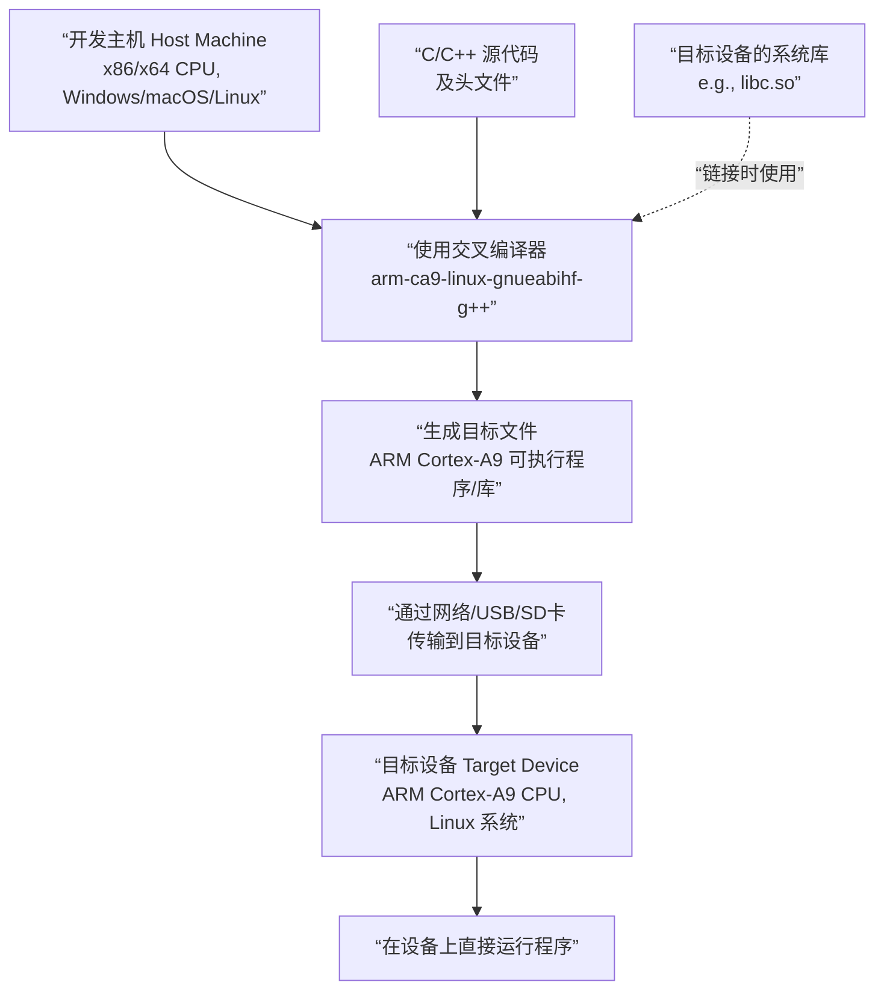
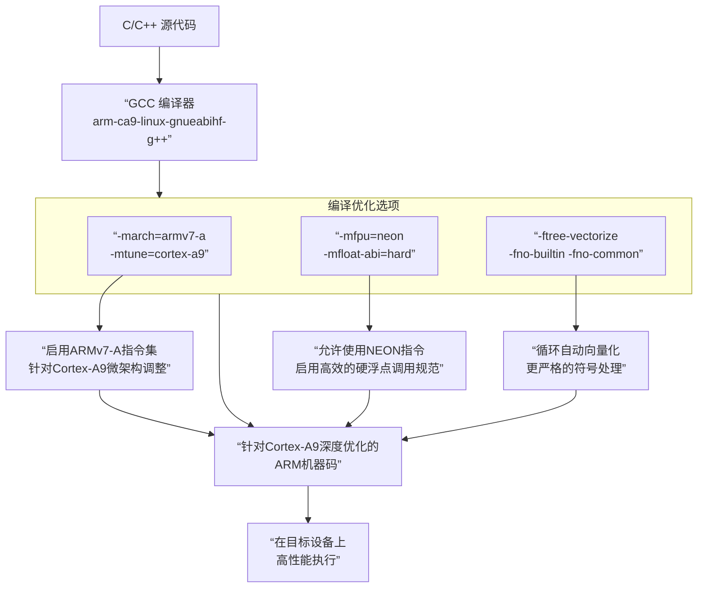

<think>
---

</think>好的，这是一个非常具体且重要的技术问题。`arm-ca9-linux-gnueabihf-g++` 不是一个普通的编译器，而是一个**交叉编译器**。

它的名字可以拆解开来理解，每一部分都说明了它的用途和目标：

- **`arm`**: 指编译输出的目标架构是 **ARM** 处理器。这是手机、平板、嵌入式设备等移动设备最常用的CPU架构。
- **`ca9`**: 特指 ARM 的 **Cortex-A9** 核心。这是一个非常经典的高性能嵌入式处理器核心。指定 `ca9` 意味着编译器会针对 Cortex-A9 的特性（如特定的流水线、浮点运算单元等）进行优化，以生成最高效的代码。
- **`linux`**: 指编译输出的程序所运行的操作系统是 **Linux**。编译器会使用 Linux 的系统调用和库链接方式。
- **`gnueabihf`**: 这是最关键的部分，它进一步定义了 **ABI**。
    - `gnu`: 指使用 GNU 的 libc 等标准库。
    - `eabi`: 指 **嵌入式应用二进制接口**。它规定了在嵌入式系统中如何编译和链接程序，例如函数调用时参数如何传递、堆栈如何对齐等。
    - `hf`: 指 **硬浮点**。这意味着目标设备的 ARM CPU 自带硬件浮点运算单元，编译器将直接生成使用该硬件的浮点指令，从而极大地提升浮点运算的性能。与之相对的是 `sf`，即软浮点，通过软件模拟浮点运算，速度慢很多。
- **`g++`**: 指这个工具是 **GNU C++ 编译器**。对应的 C 语言编译器通常是 `arm-ca9-linux-gnueabihf-gcc`。

---

### 核心作用：交叉编译

**简单来说，`arm-ca9-linux-gnueabihf-g++` 的作用是：在一台机器上（例如你正在使用的 x86/x64 架构的 Windows 或 Linux PC）编译出能在另一种架构的机器上（ARM Cortex-A9 架构的嵌入式设备）运行的 C++ 程序。**

这个过程被称为 **交叉编译**。

**为什么需要交叉编译？**

1.  **性能与便利性**：嵌入式设备的计算能力、内存和存储空间通常有限，在其本机上进行编译会非常缓慢甚至不可能。在性能强大的 PC 上进行编译则非常快速。
2.  **开发环境**：PC 上有成熟的开发工具（如 IDE、版本管理工具、强大的编辑器），而嵌入式设备上可能只有一个精简的 Linux 系统，缺乏这些工具。

### 工作流程与场景

下图清晰地展示了交叉编译的典型工作流程：

**典型应用场景：**

这个编译器在海康威视的上下文中，极有可能用于编译以下内容，并运行于海康的嵌入式设备上：

*   **前端设备**：如网络摄像机中的应用程序。
*   **后端设备**：如网络录像机中的视频分析模块、存储管理程序。
*   **海康设备网络SDK** 的部分底层库：SDK 中需要直接与硬件打交道的部分，可能就是使用这类特定的交叉编译器编译的，以确保在目标设备上获得最佳性能。

### 总结

| 特性 | 说明 |
| :--- | :--- |
| **本质** | 一个针对特定嵌入式平台的 **交叉编译器** |
| **目标平台** | 运行 Linux 系统的 **ARM Cortex-A9** 硬件设备 |
| **关键特性** | 支持 **硬浮点**，能充分利用硬件能力，生成高性能代码 |
| **主要用途** | 在 PC 上开发和编译，生成在 ARM 嵌入式设备上运行的程序和库 |

所以，当你看到 `arm-ca9-linux-gnueabihf-g++` 时，你就知道这是一个为高性能 ARM 嵌入式设备（很可能是海康的摄像头或NVR）准备代码的专用工具。

BUILD_OPERATION="-march=armv7-a -mtune=cortex-a9 -mfpu=neon -mfloat-abi=hard -ftree-vectorize -fno-builtin -fno-common" 这几个的作用

<think>
---

</think>好的，这些是传递给 GCC 编译器的**编译选项**，它们的作用是**精确控制编译器如何生成机器代码**，以针对特定的 CPU 架构（这里是 ARM Cortex-A9）进行深度优化，从而最大化程序的运行性能。

我们来逐一分解 `BUILD_OPERATION` 中的每个选项：

### 1. 架构与 CPU 指定
- **`-march=armv7-a`**
    - **作用**：指定目标平台的 ARM 架构版本为 **ARMv7-A**。这是 Cortex-A 系列处理器的基础架构，它定义了可用的指令集（如 Thumb-2、硬件除法指令等）。编译器会生成所有 ARMv7-A 架构支持的指令。

- **`-mtune=cortex-a9`**
    - **作用**：在 `-march` 指定的架构基础上，进一步针对 **Cortex-A9** 这一特定 CPU 核心进行微优化。它不会启用新的指令，但会调整指令的排序和选择，以更好地适应 Cortex-A9 的流水线、缓存大小等微架构特性，从而提升性能。

### 2. 浮点与高级 SIMD 处理（性能关键）
这是最核心的一组优化选项，直接关系到计算密集型任务（如音视频编解码、图像处理）的性能。

- **`-mfpu=neon`**
    - **作用**：指定浮点运算单元为 **NEON**。NEON 是 ARM 的 SIMD 指令集，可以**单指令多数据**。它能一次性处理多个数据（如4个32位浮点数），极大地加速多媒体、科学计算等并行数据处理任务。对于海康威视的产品，这是至关重要的优化。

- **`-mfloat-abi=hard`**
    - **作用**：指定浮点参数的 **ABI** 为硬浮点。
        - **硬浮点**：函数调用时，浮点参数直接通过浮点寄存器传递，效率极高。**这要求目标 CPU 必须具有硬件浮点单元**。
        - 这与之前提到的 `arm-ca9-linux-gnueabihf-g++` 中的 `hf` 完全对应。选择 `hard` 能获得最佳的浮点运算性能。

### 3. 编译器优化策略
- **`-ftree-vectorize`**
    - **作用**：启用 **自动向量化** 优化。编译器会分析循环代码，如果可能，会自动将循环中的标量操作转换为使用 NEON 指令的向量操作。这是释放 `-mfpu=neon` 潜力的关键优化。例如，一个普通的数组加法循环，可能被优化为一条 NEON 指令处理四个加法。

- **`-fno-builtin`**
    - **作用**：**不识别**不以 `__builtin_` 为前缀的内建函数。这可以防止编译器将一些标准库函数调用（如 `memcpy`, `strlen`）替换为它自己的内建实现，确保代码行为的一致性，通常在构建底层系统库时使用。

- **`-fno-common`**
    - **作用**：控制**未初始化的全局变量**的存放位置。使用此选项后，所有未初始化的全局变量会被放在 BSS 段，而不是 COMMON 块。这有助于在链接阶段发现重复定义的全局变量错误，增强代码的健壮性。

---

### 总结与应用场景

这些选项组合在一起，描绘了一个非常清晰的画像：

**目标平台**：一个带有 **NEON 单元** 的 **ARM Cortex-A9** 处理器（例如海康威视的许多高端网络摄像机或 NVR 的主芯片）。

**优化目标**：极致地提升**计算密集型任务**的性能，特别是**视频编码、解码、图像分析**等需要大量浮点和并行计算的场景。

为了让您更直观地理解这些编译选项如何协同工作，最终影响程序性能，下图展示了其优化流程：

**简单来说，这组编译选项就是在告诉编译器：**

> “请为 ARM Cortex-A9 芯片生成最 aggressive 的优化代码，务必使用它的 NEON 硬浮点能力，把向量化优化开到最大，确保最终的程序在我们的设备上跑得最快。”

这正是海康威视这类对性能有严苛要求的嵌入式设备厂商的典型做法。

<think>
---

</think>好的，这是一个非常核心的链接器概念。`BSS` 和 `COMMON` 都是用于处理**未初始化的全局变量**的，但它们的出现时机、目的和行为有关键区别。

### 核心关系总结

- **`COMMON`** 是编译器在**编译阶段**采取的“临时存放”策略，旨在支持**试探性定义**，为链接器解决符号重复问题提供灵活性。
- **`BSS`** 是链接器在**链接阶段**最终确定的“正式存放”位置，所有未初始化的全局变量在最终的可执行文件中都会归属于 BSS 段。

可以理解为：`COMMON` 是“预赛区”，而 `BSS` 是“决赛场地”。编译器选项 `-fno-common` 的作用就是取消“预赛区”，要求所有变量直接进入“决赛场地”，从而在编译期就发现潜在的错误。

---

### 详细解释

为了更直观地理解从源代码到最终内存布局中，`COMMON` 和 `BSS` 如何起作用，以及 `-fno-common` 选项如何改变这一过程，请参考下面的流程图：

下面我们结合上图，对每个环节进行详细说明。

#### 1. BSS（Block Started by Symbol）

- **是什么**：BSS 是最终在**可执行文件**和**程序运行时内存**中存在的一个数据段。
- **存放内容**：**所有未初始化的全局变量和静态变量**。
- **关键特性**：
    - **不占用文件空间**：在磁盘上的可执行文件中，BSS 段只记录该段的大小和起始地址，并不实际存储这些零值。这节省了磁盘空间。
    - **运行时初始化为零**：当程序被加载到内存时，操作系统会为 BSS 段分配内存，并将这片内存全部初始化为零。这就是为什么未初始化的全局变量默认值是 `0` 或 `NULL`。

#### 2. COMMON 块

- **是什么**：COMMON 块是编译器在**目标文件**中用来存放**未初始化的全局变量**的一种特殊区域。**它并不是最终可执行文件的一部分**，只是一个“暂存区”。
- **为什么需要 COMMON 块（默认行为）**：为了支持一种叫做 **“试探性定义”** 的 C 语言特性。
    - **试探性定义**：允许在同一个程序的多个源文件中**多次声明**同一个未初始化的全局变量，只要最多只有一个地方对其进行初始化。
    - **链接器的任务**：在链接时，链接器会收集所有目标文件中的同名 COMMON 符号，然后**选择其中尺寸最大的一个**，在最终的 BSS 段中**只为它分配一次空间**。

#### 对比表格

| 特性 | COMMON 块 | BSS 段 |
| :--- | :--- | :--- |
| **存在阶段** | 编译后的**目标文件**中 | **最终的可执行文件**和**运行时的内存**中 |
| **目的** | 实现“试探性定义”，方便链接器合并同名符号 | 存放所有未初始化的静态变量，并在运行时初始化为零 |
| **文件大小** | 目标文件中会记录这些符号 | **几乎不占可执行文件的磁盘空间** |
| **行为** | 一个**暂存区**，允许重复 | 最终的唯一存储位置，**不允许重复定义** |

---

### `-fno-common` 选项的作用

现在再来看 `-fno-common` 选项的意义就非常清晰了：

- **默认情况（不使用 `-fno-common`）**：未初始化的全局变量被放入 `COMMON` 块。链接器会“宽容地”合并重复定义，这可能掩盖一些代码错误（比如你在两个不同的文件中无意中定义了同名的全局变量）。
- **使用 `-fno-common`**：编译器会**直接将未初始化的全局变量放入目标文件的 `.bss` 段**，而不是 `COMMON` 块。

**这样做的好处是：**
如果在两个不同的源文件中定义了同名的全局变量，链接器会在链接阶段**立即报错**（“multiple definition of `variable_name`”），而不是默默地选择一个。这有助于在开发早期发现潜在的符号冲突错误，使代码更加严谨和健壮。

这对于大型项目（如海康威视的嵌入式软件）非常重要，因为它能强制要求模块之间接口清晰，避免因全局变量意外重复定义而导致的难以调试的运行时错误。

