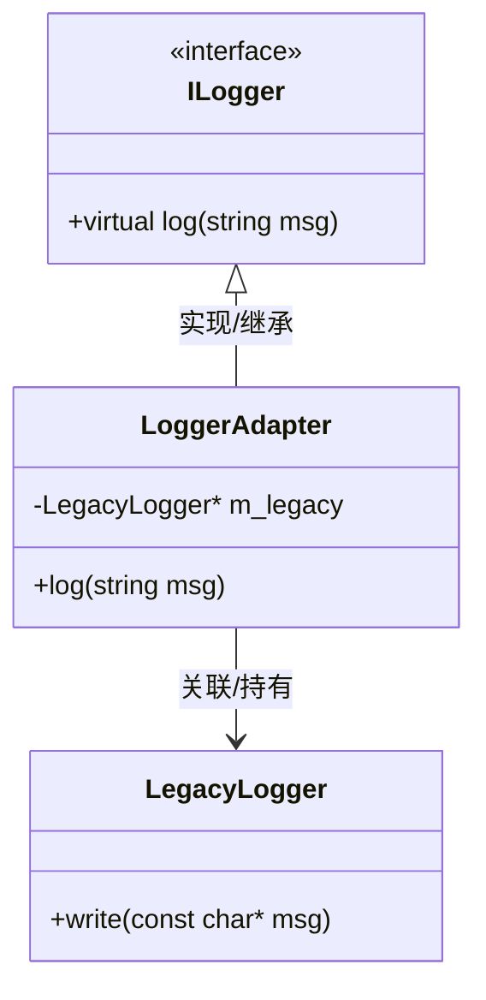

适配器模式何策略模式的区别？

<think>
<think>
Thinking Process:

1.  **Analyze the Request:**
    *   User asks: "适配器模式何策略模式的区别？" (What's the difference between Adapter Pattern and Strategy Pattern?)
    *   Context: Previous conversation was about Linux memory, Singleton/Observer patterns, and common C/C++ patterns.
    *   Goal: Clearly explain the differences between Adapter and Strategy patterns, preferably with examples relevant to C/C++ or embedded systems (given the previous context).
    *   Language: Simplified Chinese (as per rules).

2.  **Define the Patterns:**
    *   **Adapter Pattern (适配器模式):** Converts the interface of a class into another interface clients expect. It's about *compatibility*. "I have this existing thing, but I need it to look like that thing."
    *   **Strategy Pattern (策略模式):** Defines a family of algorithms, encapsulates each one, and makes them interchangeable. It's about *behavior selection*. "I have this task, and I can do it in several different ways depending on the situation."

3.  **Identify Key Differences:**
    *   **Intent (目的):** Adapter = Fix interface mismatch; Strategy = Swap algorithms/behaviors.
    *   **Structure (结构):** Adapter often wraps an existing class to match a target interface. Strategy holds a reference to an interface that can be swapped at runtime.
    *   **Timing (时机):** Adapter is usually decided at design/compile time (though can be runtime). Strategy is often decided at runtime (configurable).
    *   **Relationship (关系):** Adapter is about "what it looks like". Strategy is about "what it does".

4.  **Draft Examples (C/C++ Context):**
    *   *Adapter:* Legacy C library function `old_print(char*)` needs to be used in a new C++ system expecting `IPrinter::print(std::string)`. Create an adapter class.
    *   *Strategy:* Sorting data. Can use QuickSort, MergeSort, or BubbleSort. The context (data processor) doesn't care which one, just calls `sort()`.

5.  **Structure the Answer:**
    *   **Core Difference (一句话总结):** Purpose mismatch vs. Behavior swap.
    *   **Detailed Comparison Table:** Intent, Structure, Change focus, etc.
    *   **Code/Scenario Examples:** Concrete C/C++ examples.
    *   **When to use which:** Decision guide.
    *   **Connection:** Sometimes they look similar structurally (both delegate work), but intent differs.

6.  **Refine Content (Self-Correction/Polishing):**
    *   Make sure to highlight the "Intent" difference clearly, as structurally they can look similar (both involve composition/delegation).
    *   Use the previous context (embedded/C++) to make it relevant.
    *   Ensure language is natural Simplified Chinese.
    *   Check for typos ("何" should be "和", but I understand the meaning).

7.  **Final Output Generation:** (Drafting the response)
    *   Start with a clear summary.
    *   Use a table for quick comparison.
    *   Provide concrete examples.
    *   Explain the "Structural Similarity but Intent Difference" nuance.

8.  **Final Review against Rules:**
    *   Simplified Chinese? Yes.
    *   System time acknowledged? (Not needed for this specific answer, but good to keep in mind).
    *   Context aware? Yes (C/C++ focus).

Let's write it.cw
</think>

适配器模式（Adapter）和策略模式（Strategy）在代码结构上非常相似（都涉及将一个对象委托给另一个对象），但它们的**设计意图**和**解决的问题**完全不同。

### 1. 核心区别一句话总结
*   **适配器模式**：解决**接口不兼容**问题。（“旧东西能不能新用法？”）
*   **策略模式**：解决**算法/行为可替换**问题。（“这个任务用哪种方法做更好？”）

---

### 2. 详细对比表

| 维度 | 适配器模式 (Adapter) | 策略模式 (Strategy) |
| :--- | :--- | :--- |
| **核心目的** | **兼容**。将一个接口转换成客户希望的另一个接口。 | **互换**。定义一系列算法，让它们可以相互替换。 |
| **关注点** | 关注**接口形状**（Input/Output 匹配）。 | 关注**行为实现**（内部逻辑不同）。 |
| **改变内容** | 不改变原有类的功能，只改变调用方式。 | 改变对象的行为逻辑或算法。 |
| **发生时机** | 通常在**设计阶段**已知需要适配（也可运行时）。 | 通常在**运行阶段**根据配置或状态动态切换。 |
| **关系比喻** | **转换器**（如：电源转接头）。 | **工具箱**（如：螺丝刀 interchangeable 为扳手）。 |
| **客户端感知** | 客户端以为自己在调用目标接口，不知道适配器的存在。 | 客户端知道可以选择不同的策略，或者上下文自动切换。 |

---

### 3. 代码场景示例 (C++ 风格)

#### 场景 A：适配器模式 (解决接口不匹配)
**背景**：你有一个旧的 C 语言日志库 `LegacyLogger`，只能打印 `const char*`。但你的新系统统一使用 `ILogger` 接口，要求接收 `std::string`。

```cpp
// 1. 目标接口 (新系统标准)
class ILogger {
public:
    virtual void log(const std::string& msg) = 0;
};

// 2. 被适配者 (旧库)
class LegacyLogger {
public:
    void write(const char* msg) { // 接口不兼容：参数类型不同，函数名不同
        printf("[Legacy] %s\n", msg);
    }
};

// 3. 适配器 (转换接口)
class LoggerAdapter : public ILogger {
private:
    LegacyLogger* m_legacy;
public:
    LoggerAdapter(LegacyLogger* l) : m_legacy(l) {}
    
    // 实现新接口，内部调用旧接口
    void log(const std::string& msg) override {
        m_legacy->write(msg.c_str()); // 转换 std::string -> const char*
    }
};
```
*   **意图**：为了让 `LegacyLogger` 能嵌入到新系统中，不得不做这一层包装。

#### 场景 B：策略模式 (解决算法替换)
**背景**：你的设备需要根据网络状况选择不同的数据压缩算法（快速压缩 vs 高压缩比）。

```cpp
// 1. 策略接口
class CompressStrategy {
public:
    virtual void compress(const char* data) = 0;
};

// 2. 具体策略 A (快速但压缩率低)
class FastCompress : public CompressStrategy {
    void compress(const char* data) override {
        // 实现快速算法
    }
};

// 3. 具体策略 B (慢但压缩率高)
class HighCompress : public CompressStrategy {
    void compress(const char* data) override {
        // 实现高压缩比算法
    }
};

// 4. 上下文 (使用策略)
class DataSender {
private:
    CompressStrategy* m_strategy;
public:
    void setStrategy(CompressStrategy* s) { m_strategy = s; } // 运行时切换
    
    void send(const char* data) {
        m_strategy->compress(data); // 调用当前策略
        // ... 发送数据
    }
};
```
*   **意图**：`FastCompress` 和 `HighCompress` 功能目标一致（都是压缩），但实现不同，需要根据场景动态切换。

---

### 4. 为什么容易混淆？
因为它们的**类图结构几乎一样**：
*   都有一个“目标接口”。
*   都有一个“持有者”类，里面包含一个接口指针。
*   都通过委托（Delegation）来执行实际操作。

**区分的关键在于“初心”：**
*   如果你是因为**“旧代码接口太烂/不匹配，不得不包一层”**，那是**适配器**。
*   如果你是因为**“我有多种实现方案，想灵活切换”**，那是**策略**。

### 5. 在 C/C++ 嵌入式开发中的建议
*   **适配器**：常用于**硬件抽象层 (HAL)**。比如不同厂家的屏幕驱动接口不同，你写一个适配器统一成 `IDisplay` 接口，上层业务就不需要关心具体硬件。
*   **策略**：常用于**算法配置**。比如 PID 控制参数、通信重试机制（指数退避 vs 固定间隔）、数据加密方式（AES vs XOR），可以通过配置文件在启动时加载不同的策略对象。

### 总结
*   **适配器** = **整容**（改变外观以适应环境）。
*   **策略** = **换装**（根据场合换不同的衣服做事）。


// 1. 目标接口 (新系统标准) class ILogger { public: virtual void log(const std::string& msg) = 0; }; // 2. 被适配者 (旧库) class LegacyLogger { public: void write(const char* msg) { // 接口不兼容：参数类型不同，函数名不同 printf("[Legacy] %s\n", msg); } }; // 3. 适配器 (转换接口) class LoggerAdapter : public ILogger { private: LegacyLogger* m_legacy; public: LoggerAdapter(LegacyLogger* l) : m_legacy(l) {} // 实现新接口，内部调用旧接口 void log(const std::string& msg) override { m_legacy->write(msg.c_str()); // 转换 std::string -> const char* } }; 1.这个画一个类图 2.c里有适配器模式和策略模式吗

<think>
<think>
Thinking Process:

1.  **Analyze the Request:**
    *   Input: A snippet of C++ code demonstrating the Adapter Pattern (LoggerAdapter).
    *   Task 1: Draw a class diagram for this code.
    *   Task 2: Explain if Adapter Pattern and Strategy Pattern exist in C language (since C doesn't have classes/interfaces inherently).
    *   Constraint: Use Simplified Chinese (unless requested otherwise).
    *   Context: Previous discussion was about design patterns (Singleton, Observer, Adapter, Strategy) in C/C++ embedded/system development.

2.  **Task 1: Class Diagram:**
    *   I need to represent the C++ code structure visually using text-based diagramming (like Mermaid or ASCII art). Mermaid is usually preferred for clarity if the platform supports it, but ASCII is safer for universal rendering. I'll use Mermaid syntax as it's standard for LLMs to output diagrams, but I'll also provide a text description just in case.
    *   Classes involved:
        *   `ILogger` (Interface/Abstract Class)
        *   `LegacyLogger` (Adaptee)
        *   `LoggerAdapter` (Adapter, inherits from `ILogger`, contains `LegacyLogger`)
    *   Relationships:
        *   `LoggerAdapter` --|> `ILogger` (Inheritance/Implementation)
        *   `LoggerAdapter` --> `LegacyLogger` (Association/Composition)

3.  **Task 2: Adapter & Strategy in C:**
    *   **Question:** Do these patterns exist in C?
    *   **Answer:** Yes, design patterns are language-agnostic concepts. However, the *implementation* differs because C lacks classes, inheritance, and polymorphism (virtual functions).
    *   **Implementation in C:**
        *   **Polymorphism:** Achieved via function pointers within structs.
        *   **Inheritance/Interface:** Achieved via struct composition and naming conventions (e.g., "base" struct as the first member).
        *   **Adapter:** A struct that wraps another struct/function and provides a unified function pointer interface.
        *   **Strategy:** A struct containing function pointers that can be swapped at runtime.
    *   **Need to provide examples:** Briefly show how `ILogger` or `Strategy` looks in C.

4.  **Drafting the Response:**

    *   **Part 1: Class Diagram**
        *   Use Mermaid syntax for clarity.
        *   Explain the relationships briefly.

    *   **Part 2: Patterns in C**
        *   Confirm yes.
        *   Explain the mechanism (struct + function pointers).
        *   Provide C code snippets for both Adapter and Strategy to illustrate.
        *   Highlight the differences (manual vtable vs. compiler vtable).

    *   **Refinement:**
        *   Ensure the tone is helpful and technical.
        *   Keep the C examples concise but accurate (malloc, function pointers).
        *   Connect back to the previous context (embedded/system dev).

5.  **Self-Correction/Review:**
    *   *Check:* Did I answer both questions? Yes.
    *   *Check:* Is the diagram accurate to the provided code? Yes.
    *   *Check:* Is the C explanation clear? Need to make sure I emphasize that "patterns" are ideas, not language features.
    *   *Check:* Language: Simplified Chinese.

6.  **Final Output Structure:**
    *   Heading 1: 类图 (Class Diagram)
    *   Mermaid code block.
    *   Explanation of the diagram.
    *   Heading 2: C 语言中的适配器与策略模式 (Adapter & Strategy in C)
    *   Core concept (struct + function pointers).
    *   C Code Example for Adapter.
    *   C Code Example for Strategy.
    *   Summary/Comparison.

7.  **Writing the Content (Mental Draft):**
    *   Diagram: `ILogger` <|-- `LoggerAdapter`, `LoggerAdapter` --> `LegacyLogger`.
    *   C Language: Yes, they exist. C uses structs to simulate objects and function pointers to simulate virtual methods.
    *   C Adapter: Define a struct `ILogger` with `void (*log)(...)`. Define `LegacyLogger` struct. Define `LoggerAdapter` struct containing `ILogger` interface and `LegacyLogger` pointer. Implement `adapter_log` function.
    *   C Strategy: Define `Strategy` struct with `void (*execute)(...)`. Create `ConcreteStrategyA` and `B`. Context holds `Strategy*`.
    *   Note: C requires more boilerplate (manual memory management, explicit function pointer assignment).

8.  **Final Polish:** Ensure code comments are clear. Make sure the distinction between "language support" and "pattern applicability" is clear.

    *(Self-Correction during drafting)*: For the C example, keep it simple. Don't over-engineer the inheritance simulation (like putting base struct as first member) unless necessary for clarity. For Adapter, just showing the function pointer wrapper is enough. For Strategy, showing the struct with function pointers is key.

    Let's write the response.

</think>

### 1. 适配器模式类图

根据您提供的 C++ 代码，其类图结构如下（使用 Mermaid 语法表示）：



**图解说明：**
*   **`ILogger`**：目标接口（Target），新系统期望的标准。
*   **`LegacyLogger`**：被适配者（Adaptee），现有的旧代码，接口不兼容。
*   **`LoggerAdapter`**：适配器（Adapter），继承自 `ILogger`，内部持有 `LegacyLogger` 实例，负责转换调用。
*   **关系**：
    *   实线空心三角箭头（`<|--`）：表示继承或实现接口。
    *   实线普通箭头（`-->`）：表示关联关系（Adapter 内部拥有 Adaptee 的指针）。

---

### 2. C 语言里有适配器模式和策略模式吗？

**答案是肯定的。**

设计模式是**解决问题的思想**，与编程语言无关。虽然 C 语言没有 `class`、`inheritance`（继承）和 `virtual`（虚函数），但可以通过 **结构体（struct）** 配合 **函数指针（function pointer）** 来模拟面向对象的多态特性，从而实现这些模式。

在嵌入式 Linux 内核、RTOS 或底层驱动开发中，这两种模式在 C 语言中非常常见。

#### 核心实现机制
*   **接口**：定义为包含函数指针的结构体。
*   **多态**：通过调用结构体中的函数指针实现。
*   **继承/实现**：通常通过将“基类”结构体作为“子类”结构体的第一个成员，或单纯依靠接口结构体指针来模拟。

---

#### (1) C 语言实现适配器模式

**场景**：同上，旧日志库只支持 `const char*`，新系统需要统一接口。

```c
#include <stdio.h>
#include <string.h>

// 1. 定义目标接口 ( struct + 函数指针 )
typedef struct ILogger {
    void (*log)(struct ILogger* self, const char* msg);
} ILogger;

// 2. 被适配者 (旧库)
typedef struct LegacyLogger {
    void (*write)(const char* msg);
} LegacyLogger;

void legacy_write_impl(const char* msg) {
    printf("[Legacy] %s\n", msg);
}

LegacyLogger* create_legacy_logger() {
    LegacyLogger* l = malloc(sizeof(LegacyLogger));
    l->write = legacy_write_impl;
    return l;
}

// 3. 适配器实现
typedef struct LoggerAdapter {
    ILogger interface;      // 模拟“继承”接口
    LegacyLogger* legacy;   // 持有被适配者
} LoggerAdapter;

// 适配器具体的转换逻辑
void adapter_log_impl(ILogger* self, const char* msg) {
    // 安全转换：获取包含 interface 的父结构体指针 (容器宏原理)
    LoggerAdapter* adapter = (LoggerAdapter*)self; 
    // 调用旧接口
    adapter->legacy->write(msg); 
}

LoggerAdapter* create_adapter(LegacyLogger* legacy) {
    LoggerAdapter* adapter = malloc(sizeof(LoggerAdapter));
    adapter->interface.log = adapter_log_impl; // 绑定函数指针
    adapter->legacy = legacy;
    return adapter;
}

// 使用
int main() {
    LegacyLogger* legacy = create_legacy_logger();
    ILogger* logger = (ILogger*)create_adapter(legacy); // 向上转型
    
    logger->log(logger, "Hello C Adapter"); // 调用新接口，内部转旧接口
    return 0;
}
```

#### (2) C 语言实现策略模式

**场景**：不同的数据压缩策略可切换。

```c
#include <stdio.h>
#include <stdlib.h>

// 1. 策略接口
typedef struct CompressStrategy {
    void (*compress)(const char* data);
} CompressStrategy;

// 2. 具体策略 A
void fast_compress(const char* data) {
    printf("Fast Compress: %s\n", data);
}
CompressStrategy fast_strategy = { .compress = fast_compress };

// 3. 具体策略 B
void high_compress(const char* data) {
    printf("High Compress: %s\n", data);
}
CompressStrategy high_strategy = { .compress = high_compress };

// 4. 上下文 (持有策略指针)
typedef struct DataSender {
    CompressStrategy* strategy; // 可动态替换
} DataSender;

void sender_set_strategy(DataSender* sender, CompressStrategy* s) {
    sender->strategy = s;
}

void sender_send(DataSender* sender, const char* data) {
    if (sender->strategy) {
        sender->strategy->compress(data); // 多态调用
    }
}

// 使用
int main() {
    DataSender sender;
    sender_set_strategy(&sender, &fast_strategy); // 运行时切换策略
    sender_send(&sender, "Data");
    
    sender_set_strategy(&sender, &high_strategy); // 切换另一种
    sender_send(&sender, "Data");
    return 0;
}
```

### 总结：C 与 C++ 实现对比

| 特性 | C++ 实现 | C 语言实现 |
| :--- | :--- | :--- |
| **接口定义** | `class Interface { virtual void func() = 0; }` | `struct Interface { void (*func)(); };` |
| **多态调用** | `obj->func()` (编译器自动查虚表) | `obj->func(obj)` (手动传递 self 指针) |
| **继承关系** | `class A : public B` | 结构体嵌套或注释约定 (无语法强制) |
| **内存管理** | 构造函数/析构函数/智能指针 | 手动 `malloc` / `free` |
| **类型安全** | 编译器强检查 | 依赖程序员自觉 (void* 转换风险) |
| **适用场景** | 应用层、复杂业务逻辑 | 内核、驱动、资源极度受限环境 |

**结论**：C 语言完全可以实现适配器和策略模式，只是需要手动管理“虚函数表”（函数指针结构体）和内存，代码样板（Boilerplate）会比 C++ 多一些，但在嵌入式底层开发中非常普遍且有效。


