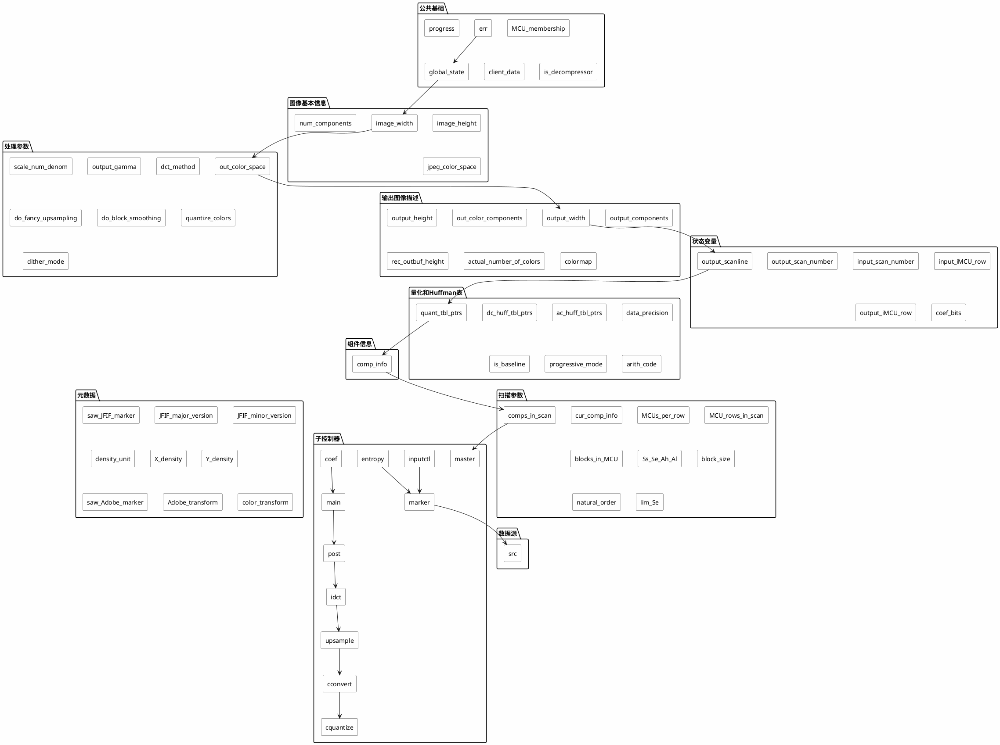
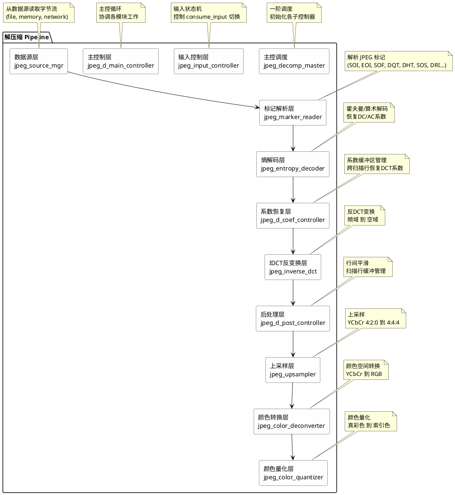
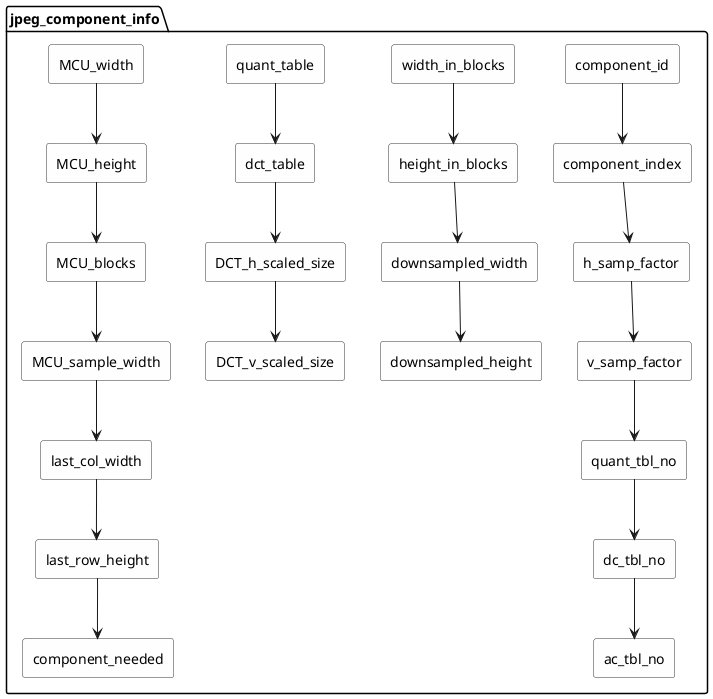

# JPEG 解压缩结构体 `j_decompress_ptr` 深度解析

## 1. 概述

`j_decompress_ptr` 是 libjpeg-turbo 库中解压缩器的核心句柄，本质是一个指向 `struct jpeg_decompress_struct` 的指针。整个解压缩流程围绕这个结构体展开，它包含了从文件输入、标记解析、熵解码、IDCT 到颜色转换和上采样的全部状态信息。

```c
// jpeglib.h:299
typedef struct jpeg_decompress_struct * j_decompress_ptr;
```

## 2. 结构体完整定义

`struct jpeg_decompress_struct` 定义在 `jpeglib.h:471-701`，共约 230 个字段，可分为以下模块：

### 2.1 公共基础字段（jpeg_common_fields）

```c
// jpeglib.h:276-283
#define jpeg_common_fields \
  DSPIMAGE_HIK_MEM_CTL_ST stHikMemCtl; \
  struct jpeg_error_mgr * err;        /* 错误处理管理器 */ \
  struct jpeg_memory_mgr * mem;       /* 内存分配管理器 */ \
  struct jpeg_progress_mgr * progress;/* 进度报告回调 */ \
  void * client_data;                 /* 用户自定义数据 */ \
  boolean is_decompressor;            /* 标识解压缩器类型 */ \
  int global_state;                   /* 全局状态码 */
```

### 2.2 字段分组总览

| 分组 | 字段范围 | 说明 |
|------|----------|------|
| 数据源 | `src` | JPEG 数据输入源管理 |
| 图像基本信息 | `image_width`, `image_height`, `num_components`, `jpeg_color_space` | 文件头中的原始图像描述 |
| 处理参数 | `out_color_space`, `scale_num/denom`, `output_gamma`, `dct_method` 等 | 解压缩时的处理选项 |
| 输出图像描述 | `output_width`, `output_height`, `out_color_components` 等 | 实际输出图像的参数 |
| 状态变量 | `output_scanline`, `input_scan_number`, `coef_bits` 等 | 解压缩进度追踪 |
| 量化/Huffman 表 | `quant_tbl_ptrs`, `dc_huff_tbl_ptrs`, `ac_huff_tbl_ptrs` 等 | 压缩参数表 |
| 组件信息 | `comp_info` | 各颜色分量的详细参数 |
| 重启区间 | `restart_interval` | 错误恢复机制 |
| 元数据 | `saw_JFIF_marker`, `JFIF_major_version` 等 | JFIF/Adobe 标记信息 |
| 扫描参数 | `comps_in_scan`, `MCU_membership`, `Ss/Se/Ah/Al` 等 | 当前扫描行的配置 |
| 子控制器 | `main`, `coef`, `post`, `inputctl`, `marker`, `entropy` 等 | 模块化子控制器链表 |

## 3. PlantUML 结构图

### 3.1 顶层结构关系



### 3.2 子控制器链式架构

JPEG 解压缩采用 Pipeline 架构，各子控制器串联工作：



### 3.3 输入控制状态机

`jdinput.c` 中的 `jpeg_input_controller` 是输入阶段的核心，通过切换 `consume_input` 函数指针实现状态机：

```plantuml
@startuml

skinparam state {
  BackgroundColor #FEFEFE
  ArrowColor #333333
  DefaultBackgroundColor #FEFEFE
  DefaultBorderColor #333333
}

state "等待阶段" as wait_state {
  [*] --> "读取标记"
  "读取标记" --> "发现SOI" : 是
  "读取标记" --> "发现SOS" : 是
  "读取标记" --> "读取其他标记" : 其他

  "发现SOI" --> reset_marker_reader
  "发现SOS" --> initial_setup : 首次SOS
  "发现SOS" --> start_input_pass : 后续SOS
  "读取其他标记" --> dispatch_marker

  reset_marker_reader --> "读取标记"
  dispatch_marker --> "读取标记"
}

state "系数恢复阶段" as coef_state {
  [*] --> "熵解码"
  "熵解码" --> "恢复DCT系数"
  "恢复DCT系数" --> "到达扫描结束?"
  "到达扫描结束?" --> finish_input_pass : 是
  "到达扫描结束?" --> "熵解码" : 否
}

[*] --> wait_state

wait_state --> coef_state : SOS到达

coef_state --> wait_state : finish_input_pass

wait_state --> [*] : EOI到达

@enduml
```

### 3.4 jpeg_component_info 组件信息结构



### 3.5 解压缩完整流程

```plantuml
@startuml

skinparam backgroundColor #FEFEFE
skinparam state {
  ArrowColor #333333
  DefaultBackgroundColor #FEFEFE
  DefaultBorderColor #333333
}

state "jpeg_read_header 内部流程" as hdr {
  [*] --> "读取SOI"
  "读取SOI" --> "读取DQT"
  "读取DQT" --> "读取DHT"
  "读取DHT" --> "读取SOF"
  "读取SOF" --> "读取DRI"
  "读取DRI" --> "读取SOS"
  "读取SOS" --> initial_setup
  initial_setup --> "填充comp_info"
  "填充comp_info" --> "计算输出尺寸"
  "计算输出尺寸" --> [*]
}

state "jpeg_read_scanlines 内部流程" as read_scan {
  [*] --> consume_input
  consume_input --> "返回MCU数据"
  "返回MCU数据" --> "IDCT反变换"
  "IDCT反变换" --> 上采样
  上采样 --> "颜色转换"
  "颜色转换" --> "输出到应用层"
  "输出到应用层" --> [*]
}

state "创建解压缩器" as create {
  [*] --> "jpeg_create_decompress()"
  "jpeg_create_decompress()" --> "设置数据源"
  "设置数据源" --> "jpeg_stdio_src()"
  "jpeg_stdio_src()" --> [*]
}

state "解析标记" as hdr_call {
  [*] --> "jpeg_read_header()"
  "jpeg_read_header()" --> hdr
  hdr --> [*]
}

state "启动解压缩" as start_dec {
  [*] --> "jpeg_start_decompress()"
  "jpeg_start_decompress()" --> [*]
}

state "读取扫描行" as read_scan_loop {
  [*] --> "jpeg_read_scanlines()"
  "jpeg_read_scanlines()" --> read_scan
  read_scan --> "jpeg_read_scanlines()"
}

state "判断还有行?" as check {
  [*] --> "output_scanline < output_height?"
  "output_scanline < output_height?" --> read_scan_loop : 是
  "output_scanline < output_height?" --> finish_dec : 否
}

state "完成解压缩" as finish_dec {
  [*] --> "jpeg_finish_decompress()"
  "jpeg_finish_decompress()" --> "释放缓冲区"
  "释放缓冲区" --> "jpeg_destroy_decompress()"
  "jpeg_destroy_decompress()" --> [*]
}

create --> hdr_call
hdr_call --> start_dec
start_dec --> read_scan_loop
read_scan_loop --> check
check --> finish_dec

@enduml
```

## 4. 关键变量详解

### 4.1 数据流核心变量

| 变量 | 类型 | 作用 | 所在文件 |
|------|------|------|----------|
| `src` | `jpeg_source_mgr*` | 数据源管理器，提供字节流读取接口 | jpeglib.h:475 |
| `inputctl` | `jpeg_input_controller*` | 输入控制器，管理输入状态机 | jpeglib.h:694 |
| `marker` | `jpeg_marker_reader*` | 标记解析器，解析 SOI/SOF/DQT/DHT/SOS 等 | jpeglib.h:695 |
| `entropy` | `jpeg_entropy_decoder*` | 熵解码器，霍夫曼/算术解码 | jpeglib.h:696 |
| `coef` | `jpeg_d_coef_controller*` | 系数控制器，管理DCT系数缓冲区 | jpeglib.h:692 |

### 4.2 Pipeline 核心变量

| 变量 | 类型 | 作用 | 所在文件 |
|------|------|------|----------|
| `main` | `jpeg_d_main_controller*` | 主控制器，协调解压缩循环 | jpeglib.h:691 |
| `idct` | `jpeg_inverse_dct*` | IDCT 反变换器 | jpeglib.h:697 |
| `post` | `jpeg_d_post_controller*` | 后处理控制器 | jpeglib.h:693 |
| `upsample` | `jpeg_upsampler*` | 上采样器 (4:2:0 → 4:4:4) | jpeglib.h:698 |
| `cconvert` | `jpeg_color_deconverter*` | 颜色空间转换器 (YCbCr → RGB) | jpeglib.h:699 |
| `cquantize` | `jpeg_color_quantizer*` | 颜色量化器 (真彩色 → 索引色) | jpeglib.h:700 |

### 4.3 图像参数核心变量

| 变量 | 类型 | 作用 | 所在文件 |
|------|------|------|----------|
| `image_width/height` | `JDIMENSION` | JPEG 文件的原始宽高 | jpeglib.h:480-481 |
| `output_width/height` | `JDIMENSION` | 实际输出的宽高（考虑缩放） | jpeglib.h:519-520 |
| `scale_num/denom` | `unsigned int` | 缩放比例 = num/denom | jpeglib.h:492 |
| `num_components` | `int` | 颜色分量数 (1/3/4) | jpeglib.h:482 |
| `jpeg_color_space` | `J_COLOR_SPACE` | JPEG 存储的颜色空间 | jpeglib.h:483 |
| `out_color_space` | `J_COLOR_SPACE` | 期望输出的颜色空间 | jpeglib.h:490 |
| `comp_info` | `jpeg_component_info*` | 各分量详细信息数组 | jpeglib.h:595 |
| `total_iMCU_rows` | `JDIMENSION` | 总宏观宏块行数 | jpeglib.h:645 |

### 4.4 压缩参数核心变量

| 变量 | 类型 | 作用 | 所在文件 |
|------|------|------|----------|
| `quant_tbl_ptrs[]` | `JQUANT_TBL*` | 量化表指针数组 (最多4个) | jpeglib.h:582 |
| `dc_huff_tbl_ptrs[]` | `JHUFF_TBL*` | DC霍夫曼表指针数组 (最多4个) | jpeglib.h:585 |
| `ac_huff_tbl_ptrs[]` | `JHUFF_TBL*` | AC霍夫曼表指针数组 (最多4个) | jpeglib.h:586 |
| `restart_interval` | `unsigned int` | 重启区间 (DRI标记) | jpeglib.h:606 |
| `is_baseline` | `boolean` | 是否基线JPEG | jpeglib.h:598 |
| `progressive_mode` | `boolean` | 是否渐进式JPEG | jpeglib.h:599 |

### 4.5 扫描参数核心变量

| 变量 | 类型 | 作用 | 所在文件 |
|------|------|------|----------|
| `comps_in_scan` | `int` | 当前扫描包含的分量数 | jpeglib.h:661 |
| `MCUs_per_row` | `JDIMENSION` | 每行MCU数量 | jpeglib.h:665 |
| `MCU_rows_in_scan` | `JDIMENSION` | 当前扫描的MCU行数 | jpeglib.h:666 |
| `blocks_in_MCU` | `int` | 每个MCU包含的8x8块数 | jpeglib.h:668 |
| `MCU_membership[]` | `int` | 每个MCU块属于哪个分量 | jpeglib.h:669 |
| `Ss/Se/Ah/Al` | `int` | 渐进式扫描参数 | jpeglib.h:673 |

### 4.6 状态追踪核心变量

| 变量 | 类型 | 作用 | 所在文件 |
|------|------|------|----------|
| `output_scanline` | `JDIMENSION` | 当前已输出的扫描行号 | jpeglib.h:549 |
| `output_scan_number` | `int` | 当前扫描序号 | jpeglib.h:561 |
| `input_scan_number` | `int` | 当前已解码的扫描序号 | jpeglib.h:554 |
| `output_iMCU_row` | `JDIMENSION` | 当前已输出的宏观块行号 | jpeglib.h:562 |
| `input_iMCU_row` | `JDIMENSION` | 当前已输入的宏观块行号 | jpeglib.h:555 |
| `global_state` | `int` | 全局状态机状态码 | jpeglib.h:282 |

## 5. 代码设计思路

### 5.1 模块化 Pipeline 架构

JPEG 解压缩采用经典的 Pipeline 模式，将完整流程拆分为独立模块：

```
数据源 → 标记解析 → 熵解码 → 系数恢复 → IDCT → 后处理 → 上采样 → 颜色转换 → 输出
```

每个模块是一个独立的子控制器结构体，通过函数指针表（vtable）提供接口。主控模块 `main` 按顺序调用各模块，形成数据流管道。

**优势：**
- 各模块独立编译、独立测试
- 可替换实现（如不同 IDCT 算法）
- 清晰的职责边界

### 5.2 输入状态机设计

`jpeg_input_controller` 通过切换 `consume_input` 函数指针实现两阶段状态机：

1. **等待阶段** (`consume_markers`)：解析标记，遇到 SOS 后调用 `initial_setup()` 完成初始化
2. **解码阶段** (`coef->consume_data`)：读取DCT系数，扫描结束后调用 `finish_input_pass()` 切回等待阶段

对于多扫描图像（渐进式JPEG），两个阶段交替执行。

### 5.3 内存管理

通过 `jpeg_memory_mgr` 统一管理所有动态内存分配。所有子控制器分配的内存都通过此管理器，确保 `jpeg_destroy_decompress()` 时能一次性释放所有资源。

### 5.4 组件信息抽象

`jpeg_component_info` 将每个颜色分量（Y/Cb/Cr）的参数抽象为统一结构，支持：
- 不同的采样因子 (1x1, 2x1, 2x2 等)
- 不同的量化表/霍夫曼表分配
- 渐进式扫描中不同分量的独立表选择

### 5.5 缩放机制

通过 `scale_num` / `scale_denom` 实现整数比例缩放（1/1, 1/2, 1/4, 1/8, 1/16），在 DCT 阶段直接选择对应尺寸的 IDCT，避免额外的浮点缩放运算。

## 6. 关键文件索引

| 文件 | 内容 |
|------|------|
| `jpeglib.h` | 公共 API 和结构体定义 |
| `jpegint.h` | 内部结构和接口定义 |
| `jdinput.c` | 输入控制器和扫描参数设置 |
| `jdmarker.c` | 标记解析器 |
| `jdcoefct.c` | 系数恢复控制器 |
| `jdmainct.c` | 主控制器 |
| `jdpostct.c` | 后处理控制器 |
| `jidctint.c` | 整数 IDCT 实现 |
| `jdmainct.c` | 主缓冲区控制器 |
| `jdmerge.c` | 上采样合并器 |
| `jdcolor.c` | 颜色空间转换器 |
| `jdcolor.c` | 颜色量化器 |
