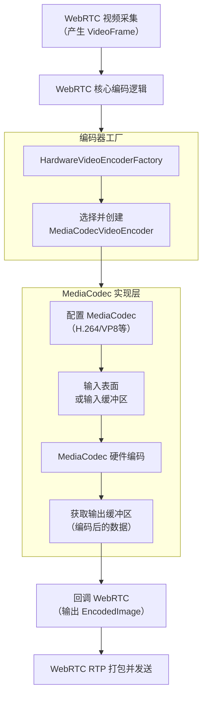
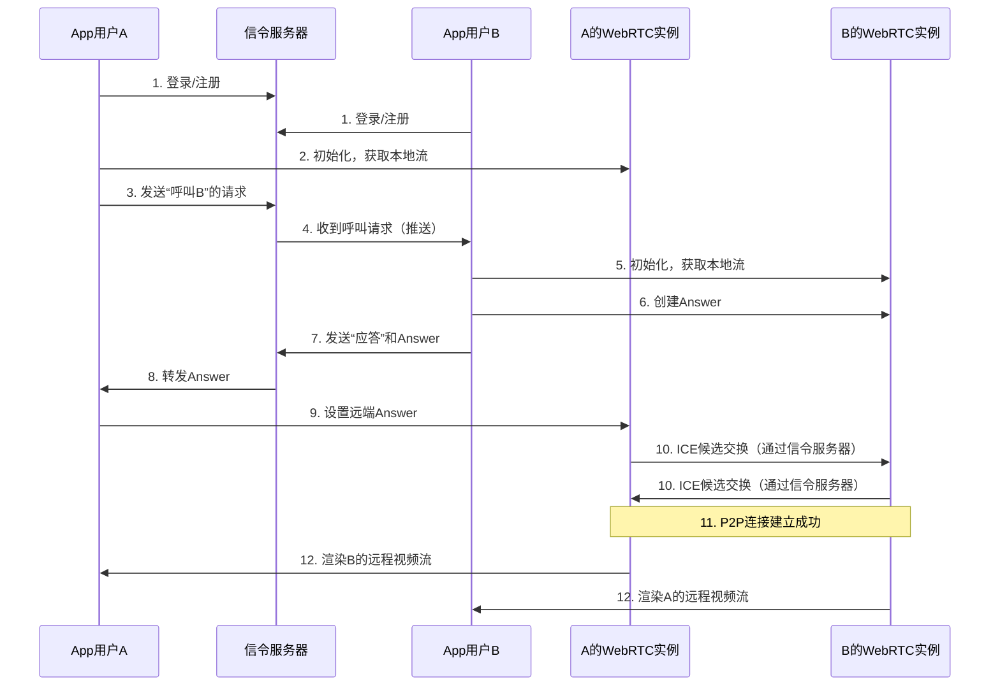

WebRTC 直接调用 MediaCodec 这如何实现？举例说明？


好的，这是一个非常核心且实际的问题。我将为你详细拆解 WebRTC for Android 是如何直接调用 `MediaCodec` 来实现硬件编解码的，并提供一个清晰的代码示例。

### 核心思想：抽象与实现

WebRTC 的设计非常优秀，它通过**工厂模式**将编解码器的具体实现（如软件编码 `libvpx` 或硬件编码 `MediaCodec`）与核心逻辑解耦。在 Android 平台上，它提供了一个专门用于创建硬件编码器的工厂类。

---

### 实现流程详解

整个流程可以分为三个层次：

1.  **WebRTC 核心层**：决定使用哪种编码器。
2.  **工厂抽象层**：根据设备能力创建具体的编码器实例。
3.  **MediaCodec 实现层**：封装 `MediaCodec` API，完成实际的编码工作。

下图清晰地展示了数据流转和交互过程：

我们来详细讲解图中涉及的关键模块和步骤。

#### 第1步：选择并设置编码器工厂

在创建 `PeerConnection` 之前，我们需要配置一个 `VideoEncoderFactory`。WebRTC SDK 提供了默认的硬件编码器工厂。

```java
// 导入 WebRTC SDK 的相关类
import org.webrtc.*;

// 1. 获取默认的硬件编码器工厂。
//    这个工厂会优先尝试创建硬件编码器，如果失败则回退到软件编码器。
VideoEncoderFactory encoderFactory = new HardwareVideoEncoderFactory(
    EglBase.create().getEglBaseContext(), 
    true,  // 启用硬件编码
    true   // 启用降级回软件编码
);

// 2. 创建 PeerConnection 的配置，并设置编码器工厂。
PeerConnection.RTCConfiguration rtcConfig = new PeerConnection.RTCConfiguration(...);
rtcConfig.videoEncoderFactory = encoderFactory; // <-- 关键配置

// 3. 用这个配置创建 PeerConnectionFactory 和 PeerConnection
PeerConnectionFactory.initialize(...);
PeerConnection peerConnection = factory.createPeerConnection(rtcConfig, ...);
```

**关键点**：通过 `HardwareVideoEncoderFactory`，我们告诉 WebRTC：“请优先使用 Android 的 `MediaCodec` 来进行硬件编码。”

---

#### 第2步：工厂创建 MediaCodecVideoEncoder

当 WebRTC 需要开始视频编码时（例如，你调用了 `peerConnection.addTrack(videoTrack)`），它会向工厂请求一个编码器实例。

`HardwareVideoEncoderFactory` 内部会：
1.  查询设备支持的 `MediaCodec` 列表。
2.  根据 WebRTC 的配置（如支持的编解码器 `VP8`, `H.264`）和设备能力，选择一个最合适的编码器（例如 `"OMX.qcom.video.encoder.avc"` 用于 H.264）。
3.  创建并返回一个 `MediaCodecVideoEncoder` 的实例。这个类就是 WebRTC 封装 `MediaCodec` 的核心类。

---

#### 第3步：MediaCodecVideoEncoder 的内部工作（核心实现）

这是最有趣的部分。`MediaCodecVideoEncoder` 类封装了与 `MediaCodec` 交互的所有细节。其工作流程与标准的 `MediaCodec` 流程完全一致，如上图“MediaCodec 实现层”所示。

**1. 初始化和配置**
```java
// 伪代码，反映 MediaCodecVideoEncoder.initEncode() 中的逻辑
public int initEncode(MediaFormat format) {
    // a. 根据 MIME 类型（如 "video/avc"）创建 MediaCodec 实例
    mMediaCodec = MediaCodec.createEncoderByType("video/avc");

    // b. 配置 MediaCodec
    MediaFormat mediaFormat = MediaFormat.createVideoFormat("video/avc", width, height);
    mediaFormat.setInteger(MediaFormat.KEY_BIT_RATE, bitrate);
    mediaFormat.setInteger(MediaFormat.KEY_FRAME_RATE, framerate);
    mediaFormat.setInteger(MediaFormat.KEY_I_FRAME_INTERVAL, keyFrameInterval);
    mediaFormat.setInteger(MediaFormat.KEY_COLOR_FORMAT, MediaCodecInfo.CodecCapabilities.COLOR_FormatSurface); // 关键！使用Surface模式

    // c. 配置并启动编码器
    mMediaCodec.configure(mediaFormat, null, null, MediaCodec.CONFIGURE_FLAG_ENCODE);
    mInputSurface = mMediaCodec.createInputSurface(); // 创建用于输入的Surface
    mMediaCodec.start();
}
```
**关键点**：WebRTC 使用了 `MediaCodec` 的 **Surface 输入模式**。这意味着它不需要手动将 YUV 数据拷贝到 `MediaCodec` 的输入缓冲区，而是通过 OpenGL ES 直接将图像绘制到 `MediaCodec` 提供的 `Surface` 上，效率极高。

**2. 编码过程**
当一帧新的视频数据（`VideoFrame`）到来时：
1.  WebRTC 将该帧渲染到上一步创建的 `mInputSurface` 上。
2.  `MediaCodec` 自动将 `Surface` 上的内容进行编码。
3.  WebRTC 在另一个线程中循环调用 `mMediaCodec.dequeueOutputBuffer(...)` 从输出缓冲区取出编码好的数据（H.264 NAL 单元）。
4.  将取出的数据封装成 WebRTC 内部的 `EncodedImage` 对象，并通过回调函数返回给上层。

---

### 完整示例代码（简化版）

下面是一个更完整的代码片段，展示如何从零开始设置一个使用硬件编码的 WebRTC 视频流。

```java
// 1. 初始化 PeerConnectionFactory
PeerConnectionFactory.InitializationOptions initializationOptions =
    PeerConnectionFactory.InitializationOptions.builder(context)
        .setEnableInternalTracer(true)
        .createInitializationOptions();
PeerConnectionFactory.initialize(initializationOptions);

// 2. 创建编码器工厂（关键步骤！）
EglBase eglBase = EglBase.create();
VideoEncoderFactory encoderFactory = new HardwareVideoEncoderFactory(
    eglBase.getEglBaseContext(),
    true,  // 启用硬件编码
    true   // 启用回退
);

// 3. 创建解码器工厂（同样可以使用硬件解码）
VideoDecoderFactory decoderFactory = new HardwareVideoDecoderFactory(eglBase.getEglBaseContext());

// 4. 使用自定义的编解码器工厂创建 PeerConnectionFactory
PeerConnectionFactory.Options options = new PeerConnectionFactory.Options();
PeerConnectionFactory factory = PeerConnectionFactory.builder()
    .setOptions(options)
    .setVideoEncoderFactory(encoderFactory) // 设置硬件编码工厂
    .setVideoDecoderFactory(decoderFactory) // 设置硬件解码工厂
    .createPeerConnectionFactory();

// 5. 创建视频源（例如，从摄像头）
SurfaceTextureHelper surfaceTextureHelper = SurfaceTextureHelper.create("CaptureThread", eglBase.getEglBaseContext());
VideoSource videoSource = factory.createVideoSource(false);
Camera2Capturer capturer = new Camera2Capturer(context, "front", videoSource);

// 6. 创建视频轨道，并将其添加到 PeerConnection 中
VideoTrack videoTrack = factory.createVideoTrack("100", videoSource);
peerConnection.addTrack(videoTrack);

// 从现在起，视频帧会通过 videoSource 产生，
// 然后被送到我们配置的 HardwareVideoEncoderFactory 所创建的 MediaCodecVideoEncoder 进行硬件编码。
```

### 总结

- **如何实现？** WebRTC 通过 `HardwareVideoEncoderFactory` 和 `MediaCodecVideoEncoder` 类，完整地封装了 Android `MediaCodec` 的初始化和使用流程。
- **高效的关键**：它采用了 `MediaCodec` 的 **Surface 输入模式**，通过 OpenGL ES 直接将摄像头采集的数据送入编码器，避免了昂贵的 CPU 内存拷贝，实现了极高的编码效率。
- **对开发者而言**：你不需要直接操作复杂的 `MediaCodec` API，只需在创建 `PeerConnectionFactory` 时正确设置编码器工厂即可。WebRTC 内部帮你处理了所有底层细节，让你能轻松享受到硬件编码带来的性能优势。


如果集成到app里，应该如何处理webrtc和其它库，以应对音视频对讲和远程预览等功能，当前海康互联，微信视频，腾讯会议是怎么做的？


<think>
---

['{"webPages": [{"name": "海康系列主机远程对讲实现方法 - 360文档中心", "summary": "远程视频对讲方案 远程视频对讲方案 远程视频对讲方案是一种通过视频通信方式进行远程交流和对讲的解决方案。 它可以在不同地点之间实现实时的音视频传输和交流,适用于各种场景,如家庭、企业、教育、医疗等。 首先,远程视频对讲方案需要使用视频通信设备和网络连接。 用户可以通过电脑、手机、平板等终端设备进行远程视频对讲。 同时,需要确保网络连接的稳定性和带宽的充足,以保证视频传输的质量和实时性。 其次,远程视频对讲方案需要使用相应的软件和服务平台。 用户可以通过安装对应的视频通话软件或应用程序,实现与其他用户之间的视频通信。 此外,还可以使用云平台或服务器来搭建视频会议系统,实现多方视频通话和管理功能。 远程视频对讲方案的应用场景非常广泛。 在家庭中,可以通过远程视频对讲实现家人之间的实时交流,如外出旅行的父母与留守在家的孩子之间进行视频通话;在企业中,可以通过远程视频对讲实现分布在不同地点的员工之间的协作和沟通,提高工作效率和效益;在教育领域,可以通过远程视频对讲实现远程教育、在线教学等,突破时空限制,提供更广泛的教学资源;在医疗领域,可以通过远程视频对讲实现医生与患者之间的远程诊疗,解决地域医疗资源不足的问题。 总之,远程视频对讲方案是一种方便快捷的通信方式,可以在不同地点之间实现实时的音视频传输和交流。 它在家庭、企业、 教育、医疗等领域具有广泛的应用前景,为人们的生活和工作带来便利和效益。 海康威视远程设置方法 海康威视远程设置方法1.需要一个支持花生壳的路由器,最好是TP-LINK的,不过本次方法是在(MERCURY)水星路由器上设置的,其原理方法大同小异。 2.需要将DVR/NVR设备连接到路由器上,NVR 的设备是4口以上的要增加交换机,交换机与NVR和路由器各用一根网线相边接。 3.需要一台电脑与路由器相连接。 方法/步骤第一步:DVR/NVR的相关设置,确认以下几点", "url": "https://www.360docs.net/doc/1e1620266.html"}, {"name": "海康全数字可视对讲系统设计方案——客户版.doc_淘豆网", "summary": "文档列表 文档介绍 海康威视全数字可视对讲系统 设 计 方 案 杭州海康威视数字技术股份有限公司 年月日 目录 目录.1 前言.2 第一章概述.3 项目背景介绍.3 设计原则.3 设计依据.4 第二章系统设计.6 设计思路.6 项目需求.6 系统总体设计架构.7 多层小区结构设计图.8 系统特点.8 系统功能简介.10 访问对讲功能.10 户户对讲功能.11 三方通话功能.11 安防报警功 能. 海康全数字可视对讲系统设计方案——客户版 来自淘豆网www.taodocs.com转载请标明出处.", "url": "https://www.taodocs.com/p-92368368.html"}, {"name": "海康双向可视网络对讲系统-神州科技", "summary": "海康双向可视网络对讲系统的优点是可以通过手机APP实现远程监控和视频通话。其主要组成部分包括摄像头、云台、网络传输设备以及终端设备等。一、优点1.操作方便:用户可以通过手机APP随时随地查看多个不同地点的实时画面,并进行语音对话和控制。 2.高清画质:采用高清晰度的摄像头可以提供更加逼真的图像效果,让用户仿佛置身于现场。 3.智能识别:利用人工智能技术,系统能够自动识别人脸、车辆等目标对象,并及时提醒用户异常情况的发生。 4.数据安全:系统支持加密传输和权限管理等功能,确保数据的安全性和隐私保护。二、缺点1.需要专业的技术人员进行安装和维护:由于该系统较为复杂,因此需要专业人员进行安装和调试工作。同时,在使用过程中也需要定期进行维护和更新以保证系统的正常运行。 2.依赖稳定的网络连接:该系统基于网络传输实现,对于网络速度和稳定性有较高的要求。如果网络不稳定或者速度较慢,则会影响系统的正常使用体验。 3.成本较高:相比传统的安防系统,海康双向可视网络对讲系统的价格相对较高。因此,需要投入更多的资金来购买和部署相关设备。 综上所述,虽然海康双向可视网络对讲系统具有诸多优点,但同时也存在一些局限性。在选择时需根据实际需求和条件综合考虑。", "url": "http://www.china-technology.net/article/17064589354133.html"}, {"name": "海康系列主机远程对讲实现方法收集.pdf-原创力文档", "summary": "海康系列主机远程对讲实现方法 以DS-7804H-ST为例 一.远端设置: 1. 在电脑上下载“海康网络视频监控软件” ,并安装到本机电脑中 2. 在配置中添加设备并将远程设置设置好,实现与前端硬盘录像机互联 第一步:打开软件进入界面(如图)第二步:打开配置界面(如图)第三步右键添加域(可根据实际情况添加域名称如:一号小区)然后右键点击选择添加设备(如图)出现下图进行设备信息的添加,设备名称、注册模式、设备 IP 根据实际情况填写,用 户名和密码 与前端 硬盘录像 机统一 (出厂默 认用户 名: admin ,密码: 12345 )。 3. 连接成功后,在预览中右击设备名称,选择“开始对讲”选项二.前端设置 语音对讲输入(麦克风等)接Line_in 端口,音频", "url": "https://max.book118.com/html/2021/1205/8134074015004052.shtm"}, {"name": "海康全数字可视对讲系统设计方案——客户版 - 道客巴巴", "summary": "下载积分: 1500 内容提示: 海康全数字可视对讲系统设计方案——客户版 海康威视全数字可视对讲系统 设计方案杭州海康威视数字技术股份有限公司 年月日 目录目录 1 前言 2 第一章概述 3 1.1 1.2 1.3 项目背景介绍 文档格式:DOCX | 页数:20 | 浏览次数:17 | 海康全数字可视对讲系统设计方案——客户版 海康威视全数字可视对讲系统 设计方案杭州海康威视数字技术股份有限公司 年月日 目录目录 1 前言 2 第一章概述 3 1.1 1.2 1.3 项目背景介绍 3 设计原则 3 设计依据 4", "url": "https://www.doc88.com/p-9009679006064.html"}, {"name": "海康全数字可视对讲系统设计方案——客户版.docx_一课资料网ekdoc.com", "summary": "上传人: 177277 文档编号:8553579 格式:DOCX 页数:27 大小:8.15MB 《海康全数字可视对讲系统设计方案——客户版.docx》由会员分享,可在线阅读,更多相关《海康全数字可视对讲系统设计方案——客户版.docx(27页珍藏版)》请在一课资料网上搜索。 1、海康威视全数字可视对讲系统设计方案杭州海康威视数字技术股份有限公司年 月 日目 录目 录1前言2第一章 概述31.1项目背景介绍31.2设计原则31.3设计依据4第二章 系统设计62.1设计思路62.2项目需求62.3系统总体设计架构7多层小区第三章 系统主要设备介绍203.1中心管理机203.2门口主机213.3室内分机22第四章 系统配置清单23前 言随着移动互联网技术的发展和智 2、能硬件的逐步崛起,越来越多的传统行业正在接受联网化、智能化的升级改造,也给处于这个风口上的楼宇可视对讲系统带来了新思路,扩充了巨大的想象空间。传统数字社区一般包括可视对讲系统、门禁管理系统、入侵消防报警系统、周界防范系统、巡更系统、监控系统、停车场管理系统等,但各个子系统通常由不同的制造商提供,各子系统之间功能得不到很好的整合。同时,传统数字小区产品通常采用封闭技术开发设计,不同厂家采用不同的标准开发生产产品,产品兼容性很差,产品故障后经常出现相互推诿的情况。 为避免在新建设的数字小区中出现以上问题,海康威视楼宇可视对讲系统打造的全新智能家居平台,整合了居家可视对讲、居家报警、门禁管理、居家物 3、业管理等系统,更为智能家居产品提供了从云端到终端的全套载体;同时通过标准接口和萤石云为用户、开发商、物业公司提供无限功能扩展。根据小区的户型结构和开发商的具体要求。其可视对讲系统工程拟采用海康设计生产的海康系列楼宇可视对讲系统。海康系列可视对讲系统是一种针对工程商与现代物业要求设计的保安系统,以管理中心为核心,以楼宇可", "url": "https://www.ekdoc.com/p-8553579.html"}, {"name": "海康系列主机远程对讲实现方法(4页)-原创力文档", "summary": "海康系列主机远程对讲实现方法以DS-7804H-ST为例一.远端设置:在电脑上下载“海康网络视频监控软件”,并安装到本机电脑中在配置中添加设备并将远程设置设置好,实现与前端硬盘录像机互联第一步: 打开软件进入界面(如图)第二步:打开配置界面(如图)第三步右键添加域(可根据实际情况添加域名称如:一号小区)然后右键点击选择添加设备(如图)出现下图进行设备信息的添加,设备名称、注册模式、设备IP根据实际情况填写,用户名和密码与前端硬盘录像机统一(出厂默认用户名:admin,密码:12345)。连接成功后,在预览中右击设备名称,选择“开始对讲”选项二.前端设置语音对讲输入(麦克风等)接Line_in端口,音频输出(音响等)接Audio Out", "url": "https://max.book118.com/html/2020/0427/5122111012002242.shtm"}, {"name": "海康企业端远程会议方案为() - 希律网问答", "summary": "A.采用萤石云+萤石相机进行视频会议 B.采用海康会议平板+云视频会议实现双流会议 C.采用海康云服服务进行视频会议 D.采用海康云眸服务进行视频会议 答案 查看答案 更多“海康企业端远程会议方案为()”相关的问题 第1题 传输维护中心通过现场、电话、远程会议等形式会审,县(市、区)分公司、施工单位、设计院、监理集中审核预算在()元以上整治子项目的整治方案、预算正确性证明材料、赔补函件及说明、资源数据变动情况等。 A.1000 B.2000 C.3000 第2题 远程会议对于企业具有()的优点。A.节省时间 B.节省人力 C.节省金钱 D.保密性强 远程会议对于企业具有()的优点。 A.节省时间 B.节省人力 C.节省金钱 D.保密性强 第3题 通常所说的SCADA系统,现场端和远程端也可以采用PLC作现场机。() 第4题 目前进行网元初始化可以采用的方法有本地配置MCC方案,远程便携开通DCNPPPOE方案,远程便携开通 第5题 代理报检单位不得利用电子报检企业端软件进行() A.电子报检 B.电子申报 C.产地证电子签 第6题 代理报检单位不得利用报检企业端软件进行()。 A.电子报检 B.电子申报 C.产地证电子签证 第7题 当远程链接点数量较少,或者角度方位相对集中时,采用扇面天线是最为有效的方案。() 第8题 某咨询公司为优化改善方案,召开了“头脑风暴会议”。下列做法不利于形成创新思路的是()。 A.提前向每一位参会者发放了召开头脑风暴会议的时间、内容和要求 B.主持人鼓励大家不仅提出自己的观点,而且可以对他人的观点进行补充 C.企业参会的某副总经理多次打断他人的发言,认为提出的建议不符合企业的实际情况 D.参加头脑风暴会议的人员共8人,其中咨询专家4人、企业中高层管理人员4人 点击查看答案 第9题 在5G核心网切片共享方案中以下哪种业务应用建议采用独立切片的方式", "url": "https://www.xilvlaw.com/souti/qita/LXBK9Z3N.html"}, {"name": "海康全数字可视对讲系统设计方案——客户版.docx_淘豆网", "summary": "文档列表 文档介绍 海康威视全数字可视对讲系统设计方案杭州海康威视数字技术股份有限公司年月日目录目录.1 前言.2 第一章概述.3 项目背景介绍.3 设计原则.3 设计依据.4 第二章系统设计.6 设计思路.6 项目需求.6 系统总体设计架构.7 多层小区结构设计图.7 系统特点.8 系统功能简介.10 访问对讲功能.10 户户对讲功能. 海康全数字可视对讲系统设计方案——客户版 来自淘豆网www.taodocs.com转载请标明出处.", "url": "https://www.taodocs.com/p-70479978.html"}, {"name": "海康威视申请录像机、远程预览方法及电子设备专利,提高远程预览的时效性-财经-金融界", "summary": "金融界2024年4月3日消息,据国家知识产权局公告,杭州 海康威视 数字技术股份有限公司申请一项名为“一种录像机、远程预览方法及电子设备“,公开号CN117812390A,申请日期为2023年12月。 专利摘要显示,本申请实施例提供了一种录像机、远程预览方法及电子设备,涉及数据处理技术领域,其中,一种录像机包括:图像处理单元,用于响应于获取到远程预览设备的针对至少一路视频通道的画面预览请求,向目标显示内存中,写入与至少一路视频通道的图像数据对应的各帧目标图像数据,回写单元用于按照目标读取帧率,从目标显示内存中读取各帧目标图像数据,并将所读取到的各帧目标图像数据回写到指定内存中;编码单元,用于获取指定内存中的各帧目标图像数据,将各帧目标图像数据,编码为符合远程预览设备所需帧率的码流数据,将码流数据传输至远程预览设备,以进行预览。可见,本方案可以提高远程预览的时效性。", "url": "https://finance.jrj.com.cn/2024/04/03115740110252.shtml"}], "images": [{"url": "https://img.taocdn.com/s3/m/5d6a93065acfa1c7aa00cc9b.png"}, {"url": "https://view-cache.book118.com/view21/M04/22/3A/wKh2DmHYODyAE53xAACveev_--Q050.png"}]}', '{"webPages": [{"name": "WebRtc实现视频聊天,视频通话,原生与Web互通,业务集成 - ovmeet - 博客园", "summary": "Webrtc已经成为视频及时互动的标配,日常业务系统中,很多需要web打开就能视频通话,实现类似微信视频聊天的功能,但实施是在web上,由于还有业务app集成,同时也要在app原生端实现。 经过多次分析和参考google的官方demo,开发总结了一下: 1,webrtc库尽量要匹配,如现在主流浏览器支持的是webrtc,m79,原生端尽量用这个原生库打包。", "url": "https://www.cnblogs.com/ovmeet/p/13180938.html"}, {"name": "Android平台上基于HTML5_WebRTC的视频会议系统_尹文刚.caj资源-CSDN文库", "summary": "基于html5的视频会议 浏览:63 3星·编辑精心推荐 目前,基于网页的视频会议系统大多数情况下,都是 通过第三方插件或集成在 Web浏览器上的应用程序将多 媒体内容加载到网页上来实现的。目前最流行的方式是 通过 Adobe的Flash Player插件将音频和视频嵌入到网 页中,而伴随着 HTML5技术的发展,在HTML5中引入 video和audio元素后[ 1],将视频嵌入到网页中便形成了一 个统一的标准,并使多媒体成为网页的无缝组成部分。互 Webrtc 视频demo(Android) 浏览:9 5星·资源好评率100% webrtc音视频开源项目的demo,此项目是android端视频源码,已经成功编译并能成功运行。 webrtc 安卓端多人视频会议 浏览:132 5星·资源好评率100% 作者ddssingsong,源码webrtc_android,概述Meeting(video conference) 是基于 webrtc 开发的一套可以进行单路或者多路语音、视频的系统,高仿微信九宫格显示,最多可支持 9 路视频。文末有 Server 端搭建教程!tips:这只是个 demo,学习使用,需要产品化的朋友们请绕道。实现功能支持一对一语音和视频支持多对多语音和视频会议灵活替换 wss android webrtc 浏览:54 5星·资源好评率100% 使用libjingle实现webrtc,服务器使用kurento WebRTC的Android实现 浏览:133 WebRTC的Android实现:包括服务器,pc端,android端 WebRTC的Android实现 源码下载 包括服务器,pc端,android端 浏览:26 4星·用户满意度95% WebRTC的Android实现:包括服务器,pc端,android端 webrtc_android-webrtc", "url": "https://download.csdn.net/download/e919580743/7452183"}, {"name": "【webRTC】仿微信的语音段传输_微信语音rtc前端开发-CSDN博客", "summary": "版权声明:本文为博主原创文章,遵循CC 4.0 BY-SA版权协议,转载请附上原文出处链接和本声明。 使用 WebRTC 实现了最简单的语言聊天详见博客:http://blog.csdn.net/caoshangpa/article/details/53889057 TSINGSEE青犀视频云-边-端架构中的Easy RTC 视频会议系统是基于 WebRTC 来进行编译的。 WebRTC", "url": "https://blog.csdn.net/ns2250225/article/details/79326864"}, {"name": "webrtc 安卓端多人视频会议源码--专业分享IT编程学习资源 - 只为小站", "summary": "作者ddssingsong,源码webrtc_android,概述Meeting(video conference) 是基于 webrtc 开发的一套可以进行单路或者多路语音、视频的系统,高仿微信九宫格显示,最多可支持 9 路视频。文末有 Server 端搭建教程!tips:这只是个 demo,学习使用,需要产品化的朋友们请绕道。实现功能支持一对一语音和视频支持多对多语音和视频会议灵活替换 wss 信令服务器和 stun/turn 转发穿透服务器动态权限申请模块独立,代码清晰使用最新的 webrtc 源码切换摄像头、免提、开启静音、监听耳机插拔、系统来电时断开、关闭视频保留声音实现过程探究自定义信令 文件下载 \ue601 立即下载 评论信息 免责申明 【只为小站】的资源来自网友分享,仅供学习研究,请务必在下载后24小时内给予删除,不得用于其他任何用途,否则后果自负。基于互联网的特殊性,【只为小站】 无法对用户传输的作品、信息、内容的权属或合法性、合规性、真实性、科学性、完整权、有效性等进行实质审查;无论 【只为小站】 经营者是否已进行审查,用户均应自行承担因其传输的作品、信息、内容而可能或已经产生的侵权或权属纠纷等法律责任。", "url": "http://www.kerwin.cn/dl/detail/weixin_38627603/1059462"}, {"name": "webrtc_android-webrtc安卓端多人视频会议的实现.zip_云手机webrtc技术方案资源-CSDN文库", "summary": "【资源说明】 1、该资源包括项目的全部源码,下载可以直接使用! 2、本项目适合作为计算机、数学、电子信息等专业的课程设计、期末大作业和毕设...基于webrtc的视频会议系统源码.zip基于webrtc的视频会议系统源码.zip webrtc 安卓端多人视频会议 浏览:18 5星·资源好评率100% 作者ddssingsong,源码webrtc_android,概述Meeting(video conference) 是基于 webrtc 开发的一套可以进行单路或者多路语音、视频的系统,高仿微信九宫格显示,最多可支持 9 路视频。文末有 Server 端搭建教程!tips:这只是个 demo,学习使用,需要产品化的朋友们请绕道。实现功能支持一对一语音和视频支持多对多语音和视频会议灵活替换 wss 音频降噪(android-webrtc-ns).zip 浏览:48 5星·资源好评率100% webrtc-ns(音频降噪)(单独抽取webrtc中的ns模块,编译成so库移植android平台使用)代码直接运行即可体验 libwebrtc-android,Android WebRTC包.zip 浏览:117 5星·资源好评率100% libwebrtc-android,Android WebRTC包.zip webrtc_android,网站.zip 浏览:20 中文;webrtc_android,网站.zip 基于webrtc vue的在线会议项目源码+项目说明(多人视频).zip 浏览:132 5星·资源好评率100% 基于webrtc vue的在线会议项目源码+项目说明(多人视频).zip基于webrtc vue的在线会议项目源码+项目说明(多人视频).zip基于webrtc vue的在线会议项目源码+项目说明(多人视频).zip基于webrtc vue的在线会议项目...", "url": "https://download.csdn.net/download/weixin_38743506/11805719"}, {"name": "vue 集成 webrtc-streamer 播放视频流 - 解决阿里云内外网访问视频流问题_vue集成webrtc-CSDN博客", "summary": "webrtc目录 前端集成 html文件夹里的webrtcstreamer.js,集成到前端,可以访问webrtc,转换rtsp为webrtc视频流,在前端video中播放 <video ref=\\"video\\" id=\\"video\\" style=\\"width: 100%; height: 100%\\" muted ></video> const WEBRTC_URL = \\"http://47.116.57.xxx:8000\\"; mounted() { this.$nextTick(this.webRtcServer = new WebRtcStreamer(\\"video\\", this.WEBRTC_URL); this.webRtcServer.connect(\\"rtsp://username:password@ip:port/camera/1002000100000000000000026959100?ssrc=271168\\"beforeDestroy() { this.webRtcServer.disconnect(); this.webRtcServer = null;", "url": "https://blog.csdn.net/web15085415935/article/details/144697651"}, {"name": "腾讯会议推流到微信视频号使用指南-腾讯会议 - 腾讯会议帮助中心", "summary": "搜索 下载中心 产品服务 随时随地发起会议 视频会议 线上视频会议 AI小助手 一站式智能会议助手 网络研讨会 在线活动工具 在会议室高效开会 会议室(Rooms) 线下会议系统软件 会议室连接器(MRA) 兼容SIP/H.323会议系统 腾讯天籁inside 会议室音频解决方案 开放生态 应用市场 视频会议扩展应用 沉浸式会议体验 裸眼 3D 通话 立体视听新体验 解决方案 满足多种行业的会议需要 教育 金融 医药 医院 法院 定价与购买 资源中心 学习&探索 寻找开会秘籍 视频教学 视频演示开会技巧 体验中心 组织提效沉浸式体验 活动交流 展会活动 发现精选热门活动 新闻中心 获取最新动态 交流社区 用户交流中心 合作生态 合作伙伴 携手共创会议生态 伙伴招募 成为会议合作伙伴共创会议生态 代理查询 快速查找本地认证代理商获取服务 接入开放平台 全方位接入/集成应用解决方案参考 技术论坛 实时技术讨论沟通平台 专业支持 联系销售 获取会议解决方案 专家支持服务 为您提供全方面的会议保障 预约演示 提供全产品线上演示 客户案例 立即下载 登录 退出登录 随时随地发起会议 视频会议 高清流畅的音视频会议 AI小助手 一站式智能会议助手 网络研讨会 大型营销、培训、研讨会议解决方案 在会议室高效开会 会议室(Rooms) 如意会议室 会议室连接器(MRA) 完美兼容SIP/H.323 腾讯天籁inside 会议室音频解决方案 开放生态 开放平台 提供丰富的接入方式 应用市场 海量会议扩展应用 沉浸式会议体验 裸眼 3D 通话 立体视听新体验 满足多种行业的会议需要 教育 金融 医药 医院 法院 学习&探索 帮助中心 寻找开会秘籍 视频教学 视频演示开会技巧 体验中心 组织提效沉浸式体验 活动交流 展会活动 发现精选热门活动 新闻中心 获取最新动态 交流社区 用户交流中心 合作", "url": "https://meeting.tencent.com/support/topic/1731/index.html"}, {"name": "视频会议官网", "summary": "腾讯会议\\nTeams会议\\n活动直播\\nWEBRTC\\n腾讯 视频云会议 Meeting\\n腾讯视频会议基于腾讯20多年音视频通讯经验,腾讯会议提供一站式音视频会议解决方案,让您能随时随地体验高清流畅的会议以及会议协作。\\n 简捷易用,多全平台灵活接入 \\n 支持多种格式文档在线协作,桌面端和移动端实时共享屏幕 \\n 小程序即开即用,无需下载插件或客户端 \\n 云原生架构,横向平滑扩展 \\n立即咨询 查看详情\\n腾讯 网络研讨会 Webinar\\n腾讯会议网络研讨会Webinar,大型线上专业会议首选,同时支持万人稳定在线。\\n 完大型线上专业会议首选 \\n 同时支持万人稳定在线 \\n 会前分角色,主持人、嘉宾、观众分别入会 \\n 会后易沉淀,数据复盘一目了然 \\n立即咨询 查看详情\\n腾讯 会议系统 Rooms\\n高清音视频会议一键会上见\\n 支持加入会议与发起快速会议,快速连接内外部合作伙伴 \\n 1080P高清画质,智能音视频降噪,畅享极致流畅体验 \\n 支持HDMI、小辫子、Airplay、超声波等多种屏幕共享形式 \\n 支持离线、会中白板,最多同时展开12块白板 \\n立即咨询 查看详情\\n腾讯 连接器 H.323/SIP\\n使您的硬件会议室设备与腾讯会议无缝衔接\\n 为您的会议室扩展跨企业、跨终端开会能力 \\n 多种方式组织会议,便捷又安全 \\n 提供SaaS接入方式,只需简单拨号,即可接入腾讯会议 \\n 兼顾传统企业视频会议系统使用习惯 \\n立即咨询 查看详情\\n腾讯会议 解决方案\\n提供教育、金融、医药、医院、法院等解决方案\\n 教育行业,为师生建立智能的教学、科研和生活环境。 \\n 金融行业,提供安全性、合规性、便捷性、稳定性 \\n 医药行业,线上会议逐渐成为医药人学术推广的重点。 \\n 法院行业,线上法庭打破时间空间限制 \\n立即咨询 查看详情\\n腾讯 二次开发 API/SDK\\n腾讯会议为企业IT、ISV系统集成商、SaaS服务商", "url": "https://www.shipinhuiyi.com/"}, {"name": "javascript - 使用webrtc 模仿微信视频通讯(angular版) - 个人文章 - SegmentFault 思否", "summary": "使用webrtc 模仿微信视频通讯(angular版) webrtc实现是视频通话大致流程:(a->b) 1,a检查浏览器是否支持,是否有设备摄像头和麦克风设备 2,a捕获音视频流,并且a给b发送一个start call(开始通话)消息 3,b收到a的消息,跳转到视频页面,同样捕获自己的音视频流,成功后,b给a发送一个收到start connect(开始连接) 4,a收到b的startconnect(开始连接),给b一个回应startconnect(开始连接)消息,然后开始添加ice的播视频轨添加到RTCPeerConnection对象上,最后添加一个监听器(当有视频流加入时,显示播放) 6,b收到offer时创建一个answer回应,发送给a,当ice连接成功,视频就通了。 这个流程是我根据下面代码写出来的,写的不太好,可以直接阅读下面源码(下面代码已经实现:视频通话,音视频互转,摄像头切换,网络切换时ice重启等),欢迎指正 @Component({ selector: \'app-wechat-video\', templateUrl: \'./wechat-video.page.html\', styleUrls: [\'./wechat-video.page.scss\'],})export class WechatVideoPage implements OnInit, OnDestroy { constructor(private el: ElementRef, private renderer2: Renderer2, private events: Events, private http: HttpClient, public audiFriend; mySelfName: string; localStream: MediaStream; // 本地视频流 pc:", "url": "https://segmentfault.com/a/1190000022404201?sort=newest"}, {"name": "javascript - 使用webrtc 模仿微信视频通讯(angular版) - 个人文章 - SegmentFault 思否", "summary": "使用webrtc 模仿微信视频通讯(angular版) webrtc实现是视频通话大致流程:(a->b) 1,a检查浏览器是否支持,是否有设备摄像头和麦克风设备 2,a捕获音视频流,并且a给b发送一个start call(开始通话)消息 3,b收到a的消息,跳转到视频页面,同样捕获自己的音视频流,成功后,b给a发送一个收到start connect(开始连接) 4,a收到b的startconnec下面代码写出来的,写的不太好,可以直接阅读下面源码(下面代码已经实现:视频通话,音视频互转,摄像头切换,网络切换时ice重启等),欢迎指正 @Component({ selector: \'app-wechat-video\', templateUrl: \'./wechat-video.page.html\', styleUrls: [\'./wechat-video.page.scss\'],})export class WechatVideoPage implements OnInit, OnDestroy { constructor(private el: ElementRef, private renderer2: Renderer2, private events: Events, private http: HttpClient, public audioman: AudioManagement, private toastService: ToastService, private activatedRoute: ActivatedRoute, private androidPermission: AndroidPermissions, private navController: NavController, private mainTool: MainToolService", "url": "https://segmentfault.com/a/1190000022404201?sort=votes"}], "images": [{"url": "https://img-blog.csdnimg.cn/20200623104908686.png"}, {"url": "https://csdnimg.cn/release/download/static_files/pc/images/thumbnail/UNKNOWN.png"}, {"url": "https://img-blog.csdn.net/20180218200307454?watermark/2/text/aHR0cDovL2Jsb2cuY3Nkbi5uZXQvbnMyMjUwMjI1/font/5a6L5L2T/fontsize/400/fill/I0JBQkFCMA==/dissolve/70"}, {"url": "https://csdnimg.cn/release/download/static_files/pc/images/thumbnail/ZIP.png"}, {"url": "https://i-blog.csdnimg.cn/direct/831f44fefd2b4dbf842f0aa1720e174d.png"}]}']
</think>好的，这是一个非常专业且实际的问题。将WebRTC集成到App中来实现音视频对讲和远程预览，需要一套完整的技术方案。下面我将为您详细解析处理方式，并对比海康互联、微信视频和腾讯会议的实现策略。

### 一、App中集成WebRTC的通用处理方案

核心思路是：**将WebRTC作为底层音视频引擎，用原生代码（Java/Kotlin for Android, Objective-C/Swift for iOS）进行封装和桥接，再与上层的业务逻辑集成。**

#### 1. WebRTC库的选择与处理

*   **官方库（推荐）**：直接从 [WebRTC官方](https://webrtc.github.io/webrtc-org/native-code/) 下载编译好的Android（.aar）和iOS（.framework）库。这是最稳定、功能最全的方案。
*   **第三方封装库**：如`org.webrtc:google-webrtc`（Android）和CocoaPods的`WebRTC`（iOS），这些通常是社区对官方库的封装，便于依赖管理。
*   **自定义编译**：如果有特殊需求（如修改编解码器、优化性能），可以自行从源码编译WebRTC库。

**处理要点**：
*   **尺寸优化**：官方库体积较大（约20-30MB）。可采用动态下发、按需加载（如只加载视频或音频模块）或代码混淆来优化。
*   **版本管理**：严格锁定WebRTC版本，避免因版本升级带来的兼容性问题。

#### 2. 与其它库的协同（依赖管理）

WebRTC会涉及多个功能模块，需要与相应的库配合：

| 功能模块 | 可能用到的库/技术 | 协同方式 |
| :--- | :--- | :--- |
| **网络请求/信令** | OkHttp, Retrofit, Alamofire | 用于交换SDP Offer/Answer和ICE Candidate。WebRTC负责音视频传输，但这些信令需要用自己的网络库发送。 |
| **音频处理** | WebRTC内置音频模块（NS, AEC, AGC） | WebRTC已包含强大的3A算法，通常无需额外音频库。特殊场景可集成如`Audiokit`。 |
| **视频渲染** | `SurfaceView`, `TextureView` (Android), `GLKit` (iOS) | WebRTC提供`VideoRenderer`等接口，可直接在原生视图上渲染。 |
| **权限管理** | 原生权限申请API | 在初始化WebRTC前，动态申请摄像头、麦克风权限。 |
| **数据持久化** | SharedPreferences, Room, UserDefaults, CoreData | 用于保存配置（如服务器地址、STUN/TURN地址）。 |

**关键：** WebRTC与其他库是**松耦合关系**。通过清晰的架构设计（如MVP/MVVM），将WebRTC的核心操作（初始化、创建连接、渲染）封装成一个独立的“音视频管理器”，再通过接口与业务层交互。

#### 3. 核心功能实现流程

**A. 音视频对讲（1对1通话）流程**



**B. 远程预览（类似监控直播）流程**
这与对讲不同，通常是**1对多**的拉流模式，更接近**直播**方案。

*   **方案1：WebRTC (Low-Latency HLS/WHIP)**：如果追求低延迟（1-3秒），让设备端（如海康NVR）作为WebRTC推流端，App端使用WebRTC拉流。这需要设备支持WebRTC协议。
*   **方案2：RTMP/FLV+H5**：更通用的方案。设备推RTMP流到媒体服务器，服务器转封装成HTTP-FLV或HLS。App端使用成熟的播放器库（如IJKPlayer、ExoPlayer）进行低延迟直播。这是目前安防领域最主流的方案。
*   **海康互联的远程预览**：通常采用**私有协议**或**RTSP over HTTP**，配合海康SDK进行流媒体的解封装和解码，在性能和稳定性上最优。

### 二、三大产品的实现策略分析

#### 1. 海康互联

*   **技术栈**：**以自有技术为主**。音视频编解码、网络传输均采用海康私有的、高度优化的协议和SDK。
*   **对讲/预览**：远程预览通过海康SDK直接取流解码，延迟低、稳定性高。对讲功能也可能使用私有协议，或在与设备直连时采用更高效的方案。
*   **特点**：**垂直整合，封闭但高效**。针对安防场景深度优化，弱网表现好，但生态开放性较弱。

#### 2. 微信视频

*   **技术栈**：**自研底层引擎**。微信拥有庞大的技术团队，其音视频引擎是自研的，虽然在原理上与WebRTC（如NACK、FEC、码率自适应等）相似，但进行了深度定制和优化，以更好地适应其IM生态和国内复杂的网络环境。
*   **对讲**：完全基于自研引擎，与微信的帐号体系、网络长连接深度集成，连接成功率高，启动速度快。
*   **特点**：**大厂自研，体验极致**。充分利用自身IM系统的全局网络感知和调度能力。

#### 3. 腾讯会议

*   **技术栈**：**基于WebRTC深度定制**。腾讯有强大的音视频实验室，其腾讯云TRTC产品线就是基于WebRTC打造的。腾讯会议在此基础上，增加了大量的**增强功能**：
    *   **网络调度**：全球节点加速，智能选路。
    *   **抗丢包**：前向纠错（FEC）、重传（NACK）策略优化。
    *   **音频处理**：超级画质、AI降噪、回声消除。
*   **对讲/会议**：本质是多人的音视频对讲。它通过SFU/MCU架构来高效处理多路流。
*   **特点**：**开源定制，功能强大**。既享受了WebRTC标准的便利，又通过自研技术解决了其在国内环境下的痛点。

### 总结与建议

| 方案 | 优点 | 缺点 | 适用场景 |
| :--- | :--- | :--- | :--- |
| **自研底层引擎**（微信） | 性能、体验最优，完全可控 | 技术门槛极高，研发成本巨大 | 超大型应用，有顶尖音视频团队 |
| **基于WebRTC深度定制**（腾讯会议） | 平衡了效率与可控性，功能丰富 | 仍需大量优化工作，库体积大 | 大多数商业应用，追求较好体验 |
| **使用原生WebRTC** | 开发较快，标准协议，互通性好 | 网络适应性需自己优化，功能受限 | 原型开发、对体验要求不极致的场景 |
| **使用设备商SDK**（海康） | 与特定设备配合最佳，稳定 | 跨平台、跨品牌兼容性差 | 特定硬件生态内的应用 |

**给您的建议：**

1.  **如果您的App是通用型，且团队技术实力中等**：首选 **基于WebRTC深度定制** 的方案。可以从使用腾讯云TRTC、声网Agora等商用RTC PaaS服务开始，它们已经做好了大量优化工作。
2.  **如果您的App紧密绑定海康等特定硬件**：优先考虑使用 **海康提供的移动端SDK** 来实现对讲和预览，这是最稳定、高效的路径。
3.  **如果追求极致体验且资源充足**：可以像微信一样，在WebRTC/自有技术基础上，**自研核心音视频引擎**。

希望这份详细的分析能帮助您做出正确的技术决策。