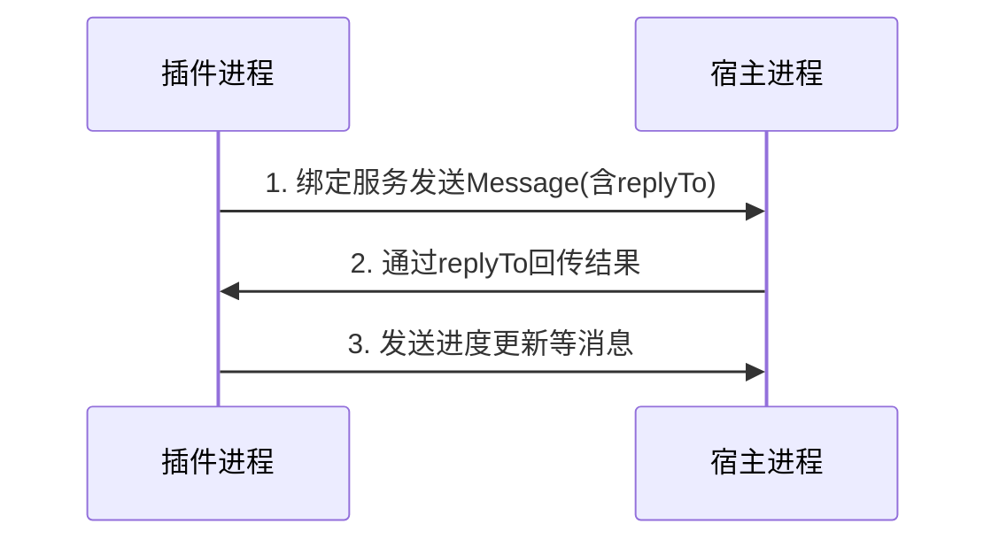

<think>
嗯，用户这次要求用中文解释一段C++析构函数代码，看来ta对多线程编程中的yield操作不太理解。之前已经用英文解释过两次，这次需要更精准的中文技术表达。

用户可能正在调试一个多线程消息系统，遇到析构时卡在循环里的问题。从代码看，ta的同事可能想用yield等待消息队列清空，但实现方式值得商榷。用户连续三次问同一段代码，说明ta要么是新手，要么这段代码引发了严重bug。

重点要讲清两点：一是yield在多线程中的实际作用（让出CPU时间片），二是这种忙等待的设计缺陷。用户可能被注释掉的错误日志误导了，以为这是正常流程，其实这里隐藏着性能问题甚至死锁风险。

需要提醒替代方案时注意语气，避免让用户觉得我在批评ta的代码。毕竟实际工程中这种写法很常见，只是不够优雅。可以用“建议”“通常推荐”等温和措辞，最后主动提出进一步帮助，因为用户很可能需要具体解决方案。
</think>
这段代码定义了一个名为 `CPubMsgBlockManager` 的类的**析构函数**（对象销毁时自动调用的函数）。其行为如下：

```cpp
CPubMsgBlockManager::~CPubMsgBlockManager() {
    while(!m_mapPubMsg.empty()) {     // 循环条件：成员变量 m_mapPubMsg 非空
        // DSP_BASE_ERROR("waiting pub msg to be done\n");  // 调试日志（已注释）
        std::this_thread::yield();    // 关键操作：让出当前线程的CPU时间片
    }
}
```

### 代码解析：
1. **目的**：  
   确保在销毁 `CPubMsgBlockManager` 对象前，其内部消息容器 `m_mapPubMsg` 完全清空。  
   （推测 `m_mapPubMsg` 是存储未处理消息的队列/映射表）。

2. **循环逻辑**：  
   - `while(!m_mapPubMsg.empty())`：只要容器非空就持续循环。  
   - **未处理消息时卡死风险**：若消息未被消费，循环将永不退出，导致析构函数无法完成。

3. **`std::this_thread::yield()`**：  
   - **作用**：主动让出当前线程占用的 CPU 时间片，允许其他线程运行。  
   - **意图**：避免忙等待（Busy Waiting）耗尽 CPU 资源，给其他线程（可能是消息消费者）机会处理消息。  
   - **实际效果**：  
     - ✅ **降低CPU占用**：比空循环更高效。  
     - ❌ **不解决根本问题**：若没有外部线程消费消息，循环仍会无限执行。

---

### 设计缺陷与风险：
1. **潜在死锁**：  
   - 若消息永远不被消费（如消费者线程已退出），析构函数将**无限阻塞**，对象无法销毁。

2. **正确做法**：  
   - **超时机制**：设置最大等待时间，超时后强制退出或报错。  
   - **主动通知**：在析构时通知消费者线程优先处理剩余消息。  
   - **强制清理**：直接清空容器（根据业务逻辑权衡安全性）。

---

### 典型应用场景：
用于**多线程消息系统**的析构，例如：  
- 消息队列：生产者（`CPubMsgBlockManager`）等待消费者处理完所有消息再销毁。  
- 资源管理器：确保所有资源被安全释放前阻止析构。

> ⚠️ **注意**：此实现需依赖外部逻辑消费消息，否则会引发严重问题。建议增加兜底策略（如超时终止）。


<think>
我们正在讨论的是插件层回调给App的处理函数。在插件化架构或模块化开发中，插件（Plugin）通常需要将一些事件或结果返回给宿主App，这时就需要回调机制。

回调函数（Callback Function）是一种常见的编程模式，其中一个函数（插件）在完成特定任务后，会调用另一个函数（App提供的函数）来处理结果。

在插件层回调给App的处理函数时，通常涉及以下步骤：

1. **定义回调接口（Callback Interface）**：在App中定义一个接口（或协议），规定回调函数的签名（参数和返回值）。例如：
   ```java
   public interface PluginCallback {
       void onSuccess(String result);
       void onError(int errorCode, String errorMessage);
   }
   ```

2. **注册回调函数**：App在使用插件功能时，将实现了回调接口的对象传递给插件。例如：
   ```java
   plugin.doSomething(new PluginCallback() {
       @Override
       public void onSuccess(String result) {
           // 处理成功结果
       }

       @Override
       public void onError(int errorCode, String errorMessage) {
           // 处理错误
       }
   });
   ```

3. **插件调用回调**：插件在适当的时候（比如任务完成或发生错误）调用App提供的回调函数。例如：
   ```java
   public class MyPlugin {
       public void doSomething(PluginCallback callback) {
           try {
               // 执行一些操作...
               callback.onSuccess("Operation completed successfully");
           } catch (Exception e) {
               callback.onError(500, "Internal error");
           }
       }
   }
   ```

4. **线程处理**：需要注意的是，插件可能在后台线程执行任务，而回调函数中可能涉及UI更新。因此，在回调函数中，如果需要更新UI，应该切换到主线程（UI线程）执行。例如，在Android中：
   ```java
   public void onSuccess(final String result) {
       runOnUiThread(new Runnable() {
           @Override
           public void run() {
               textView.setText(result);
           }
       });
   }
   ```

5. **避免内存泄漏**：如果回调持有Activity或Context的引用，当Activity销毁时，如果插件仍然持有回调，可能导致内存泄漏。因此，需要在适当的时候（如Activity的onDestroy）取消回调或解除引用。

6. **跨进程回调**：如果插件运行在独立的进程，则需要使用跨进程通信（IPC）机制，如AIDL（Android Interface Definition Language）来传递回调。这时，回调接口需要定义为AIDL接口，并且回调对象需要跨进程传递（通常通过Stub和Proxy机制）。

7. **异步与同步**：回调通常是异步的，即插件在调用回调时不会阻塞当前线程。但也可以设计为同步回调，这取决于具体需求。

总结：插件层回调给App的处理函数是一种解耦的方式，允许插件在特定事件发生时通知App。在实现时，需要注意接口设计、线程安全和内存管理等问题。

如果你有具体的平台（如Android、Web、iOS等）或语言（如Java、Kotlin、JavaScript等）环境，可以提供更多细节，我可以给出更针对性的回答。
</think>
在插件化架构中，插件层回调给宿主 App 的处理函数（Callback）是实现双向通信的核心机制。以下是关键点及实现示例：

---

### **核心流程**
1. **接口定义**  
   宿主 App 定义回调接口，约定插件完成任务后的通知方式：
   ```java
   // 宿主 App 中定义
   public interface PluginCallback {
       void onSuccess(String result);  // 成功回调
       void onError(int code, String msg); // 失败回调
   }
   ```

2. **回调注册**  
   宿主 App 调用插件时传入回调实例：
   ```java
   // 宿主 App 调用插件
   plugin.executeTask(new PluginCallback() {
       @Override
       public void onSuccess(String result) {
           // 更新 UI（需切主线程）
           runOnUiThread(() -> textView.setText(result));
       }
       @Override
       public void onError(int code, String msg) {
           showErrorDialog("Error: " + msg);
       }
   });
   ```

3. **插件触发回调**  
   插件在异步任务完成后调用宿主 App 的回调：
   ```java
   // 插件内部逻辑
   public void executeTask(PluginCallback callback) {
       new Thread(() -> {
           try {
               String data = fetchDataFromNetwork(); // 耗时操作
               callback.onSuccess(data); // 回调成功结果
           } catch (Exception e) {
               callback.onError(500, "Network error"); // 回调失败
           }
       }).start();
   }
   ```

---

### **关键注意事项**
1. **线程安全**  
   - 插件可能在子线程回调，宿主需切换至主线程更新 UI（如 Android 的 `runOnUiThread`）。
   - 避免在回调中执行阻塞操作。

2. **内存泄漏预防**  
   - 使用弱引用持有回调（如 `WeakReference<PluginCallback>`），防止因生命周期不一致导致内存泄漏。
   - 在宿主销毁时（如 Activity 的 `onDestroy()`）主动清除回调引用。

3. **跨进程通信（IPC）**  
   若插件运行在独立进程（如 Android 多进程），需使用以下方案：
   - **AIDL**：定义 IPC 接口，通过 `Binder` 传递回调。
   - **Messenger**：通过 `Handler` 实现跨进程消息传递。

4. **回调防滥用**  
   - 设置超时机制（如 30 秒无响应判定为失败）。
   - 验证回调来源，防止恶意插件非法调用。

---

### **进阶场景**
- **多回调类型**：根据事件扩展接口（如 `onProgress(int percent)`）。
- **解耦设计**：使用事件总线（如 `EventBus`）替代直接回调，降低耦合度。
- **异步链式调用**：结合 `RxJava`/`Promise` 优化多层异步回调。

通过规范的回调设计，可实现插件与宿主的高效、安全通信。具体实现需结合平台特性调整（如 Android/iOS/Web）。


<think>
我们之前讨论了插件层回调给宿主App的处理函数，特别是跨进程通信（IPC）的场景。现在用户要求稍微详细讲解之前提到的几个点：AIDL、Messenger、回调防滥用以及进阶场景（多回调类型、解耦设计、异步链式调用）。我们将针对这些点进行详细展开。

### 1. 跨进程通信（IPC）方案

#### (1) AIDL（Android Interface Definition Language）
AIDL是Android中用于定义跨进程通信接口的一种语言。它允许我们定义客户端和服务端都能理解的接口，并通过Binder进行数据传递。

**实现步骤：**

1. **定义AIDL接口**  
   在宿主App中创建AIDL文件（如`IPluginCallback.aidl`和`IPluginService.aidl`）。

   `IPluginService.aidl`（插件服务接口）：
   ```aidl
   // IPluginService.aidl
   package com.example.host;

   import com.example.host.IPluginCallback;

   interface IPluginService {
       void executeTask(in String params, in IPluginCallback callback);
   }
   ```

   `IPluginCallback.aidl`（回调接口）：
   ```aidl
   // IPluginCallback.aidl
   package com.example.host;

   interface IPluginCallback {
       void onSuccess(String result);
       void onError(int code, String msg);
   }
   ```

2. **实现Service**  
   在宿主App中实现Service，处理插件调用：
   ```java
   public class PluginService extends Service {
       @Override
       public IBinder onBind(Intent intent) {
           return new IPluginService.Stub() {
               @Override
               public void executeTask(String params, IPluginCallback callback) {
                   // 在子线程中执行，注意：这里不能直接操作UI
                   new Thread(() -> {
                       try {
                           String result = processTask(params); // 处理任务
                           callback.onSuccess(result);
                       } catch (Exception e) {
                           callback.onError(500, "Error");
                       }
                   }).start();
               }
           };
       }
   }
   ```

3. **绑定服务与调用**  
   插件App绑定宿主App的服务，并调用方法：
   ```java
   // 在插件App中
   ServiceConnection conn = new ServiceConnection() {
       @Override
       public void onServiceConnected(ComponentName name, IBinder service) {
           IPluginService pluginService = IPluginService.Stub.asInterface(service);
           // 创建回调对象（需要实现Stub）
           IPluginCallback callback = new IPluginCallback.Stub() {
               @Override
               public void onSuccess(String result) {
                   Log.d("Plugin", "Result: " + result);
               }
               @Override
               public void onError(int code, String msg) {
                   Log.e("Plugin", "Error: " + msg);
               }
           };
           try {
               pluginService.executeTask("input_params", callback);
           } catch (RemoteException e) {
               e.printStackTrace();
           }
       }
       // ... 其他方法
   };
   bindService(intent, conn, Context.BIND_AUTO_CREATE);
   ```

**注意事项：**
- AIDL默认方法调用是同步的，如果服务端方法耗时，会导致客户端阻塞（因此服务端应开启子线程执行）。
- 跨进程传递回调接口（`IPluginCallback`）时，实际传递的是`Binder`对象，客户端和服务端位于不同进程，回调方法会在客户端进程的`Binder`线程池中执行（客户端需切换主线程更新UI）。

#### (2) Messenger
Messenger是基于AIDL的轻量级IPC方案，它利用`Handler`实现消息队列，适合单向通信或简单的双向通信。

**实现步骤：**

1. **宿主App（服务端）**  
   ```java
   public class MessengerService extends Service {
       // 用于接收客户端消息的Handler
       static class IncomingHandler extends Handler {
           @Override
           public void handleMessage(Message msg) {
               // 处理客户端消息
               Bundle data = msg.getData();
               // 获取客户端传递的Messenger（用于回调）
               Messenger clientMessenger = msg.replyTo;
               // 模拟处理
               Message replyMsg = Message.obtain();
               Bundle replyData = new Bundle();
               replyData.putString("result", "Processed result");
               replyMsg.setData(replyData);
               try {
                   clientMessenger.send(replyMsg);
               } catch (RemoteException e) {
                   e.printStackTrace();
               }
           }
       }

       // 创建Messenger并关联Handler
       final Messenger messenger = new Messenger(new IncomingHandler());

       @Override
       public IBinder onBind(Intent intent) {
           return messenger.getBinder();
       }
   }
   ```

2. **插件App（客户端）**  
   ```java
   // 客户端的Handler（用于接收服务端回调）
   static class ClientHandler extends Handler {
       @Override
       public void handleMessage(Message msg) {
           Bundle data = msg.getData();
           String result = data.getString("result");
           // 处理结果
       }
   }

   // 绑定服务
   Messenger clientMessenger = new Messenger(new ClientHandler());
   ServiceConnection conn = new ServiceConnection() {
       @Override
       public void onServiceConnected(ComponentName name, IBinder service) {
           Messenger serviceMessenger = new Messenger(service);
           // 发送消息到服务端
           Message msg = Message.obtain();
           Bundle data = new Bundle();
           data.putString("params", "input_params");
           msg.setData(data);
           // 设置接收回调的Messenger
           msg.replyTo = clientMessenger;
           try {
               serviceMessenger.send(msg);
           } catch (RemoteException e) {
               e.printStackTrace();
           }
       }
       // ...
   };
   ```

**特点：**
- 基于消息队列，一次处理一个请求，天然线程安全。
- 适用于单向或简单双向通信，复杂场景推荐AIDL。

### 2. 回调防滥用

#### (1) 超时机制
为回调设置超时，防止因插件不响应导致宿主长时间等待。

**实现示例：**
```java
// 宿主App侧
private static final long CALLBACK_TIMEOUT = 30000; // 30秒

// 使用Handler发送延迟消息检测超时
Handler handler = new Handler();
Runnable timeoutRunnable = new Runnable() {
    @Override
    public void run() {
        if (!isCallbackReceived) {
            // 处理超时逻辑
            onError(TIMEOUT_ERROR, "Callback timeout");
        }
    }
};

// 启动超时检测
handler.postDelayed(timeoutRunnable, CALLBACK_TIMEOUT);

// 在回调方法中取消超时检测
public void onSuccess(String result) {
    isCallbackReceived = true;
    handler.removeCallbacks(timeoutRunnable);
    // ... 正常处理
}
```

#### (2) 验证回调来源
确保回调来自合法的插件，防止恶意调用。

**实现思路：**
- **Token验证**：调用插件时生成唯一Token，回调时插件需携带该Token。
- **包名/签名校验**：在宿主回调方法中检查调用者包名或签名（仅限同进程，跨进程需通过Binder传递验证信息）。

**跨进程Token验证示例：**
```java
// 宿主App定义接口时增加token参数
public interface PluginCallback {
    void onSuccess(String token, String result);
    void onError(String token, int code, String msg);
}

// 宿主调用插件时生成Token并传递
String token = UUID.randomUUID().toString();
plugin.executeTask(token, params, new PluginCallback() {
    @Override
    public void onSuccess(String callbackToken, String result) {
        if (!token.equals(callbackToken)) {
            return; // 非法回调
        }
        // 处理结果
    }
    // ...
});

// 插件回调时需传回原Token
callback.onSuccess(token, result);
```

### 3. 进阶场景

#### (1) 多回调类型
扩展回调接口以支持进度通知、中间结果等。

**示例：**
```java
public interface PluginCallback {
    void onSuccess(String result);
    void onError(int code, String msg);
    void onProgress(int percent); // 新增进度回调
}

// 插件中调用
for (int i = 0; i <= 100; i+=10) {
    callback.onProgress(i);
    Thread.sleep(100);
}
```

#### (2) 解耦设计：事件总线
使用事件总线（如EventBus）替代直接回调，降低插件与宿主耦合度。

**实现步骤：**
1. 宿主定义事件类：
   ```java
   public class PluginResultEvent {
       public String result;
       public PluginResultEvent(String result) {
           this.result = result;
       }
   }
   ```

2. 宿主注册事件接收：
   ```java
   @Subscribe(threadMode = ThreadMode.MAIN)
   public void onPluginResult(PluginResultEvent event) {
       textView.setText(event.result);
   }
   ```

3. 插件发送事件（通过宿主提供的公共方法）：
   ```java
   // 宿主提供全局事件总线访问
   HostApp.getEventBus().post(new PluginResultEvent("result"));
   ```

**注意：** 插件需依赖宿主的事件总线库，且需确保事件类在宿主和插件中路径一致（或通过接口传递数据）。

#### (3) 异步链式调用
使用RxJava或Promise优化多层异步回调，避免回调地狱。

**RxJava示例：**
```java
// 宿主提供RxJava封装的方法
public Observable<String> executeTaskObservable(String params) {
    return Observable.create(emitter -> {
        plugin.executeTask(params, new PluginCallback() {
            @Override
            public void onSuccess(String result) {
                emitter.onNext(result);
                emitter.onComplete();
            }
            @Override
            public void onError(int code, String msg) {
                emitter.onError(new Exception(msg));
            }
        });
    });
}

// 宿主调用
executeTaskObservable("params")
    .subscribeOn(Schedulers.io())
    .observeOn(AndroidSchedulers.mainThread())
    .subscribe(result -> {
        // 更新UI
    }, error -> {
        // 处理错误
    });
```

**Promise示例（如使用Java 8+或第三方库）：**
```java
CompletableFuture<String> future = new CompletableFuture<>();
plugin.executeTask(params, new PluginCallback() {
    @Override
    public void onSuccess(String result) {
        future.complete(result);
    }
    @Override
    public void onError(int code, String msg) {
        future.completeExceptionally(new Exception(msg));
    }
});

future.thenAcceptAsync(result -> {
    // 处理结果（注意线程切换）
}, uiExecutor);
```

### 总结
- **IPC方案**：AIDL适合复杂接口，Messenger适合简单消息传递。
- **回调安全**：超时机制和来源验证是保障稳定的关键。
- **进阶设计**：多回调、事件总线、响应式编程可提升架构灵活性和可维护性。

根据具体平台和需求选择合适方案，如Android平台需注意Binder通信限制和线程切换。
</think>
### 跨进程通信（IPC）详细解析  
当插件运行在独立进程时（如 Android 多进程架构），需特殊处理回调机制。以下是两种核心方案的实现细节：

---

#### **1. AIDL 方案**  
**实现步骤：**  
1. **定义 AIDL 接口**  
   ```java
   // IPluginCallback.aidl
   interface IPluginCallback {
       void onSuccess(String result);
       void onError(int code, String msg);
       void onProgress(int percent); // 多回调类型扩展
   }

   // IPluginService.aidl
   interface IPluginService {
       void registerCallback(IPluginCallback callback);
       void unregisterCallback(IPluginCallback callback);
   }
   ```

2. **宿主实现 Service**  
   ```java
   public class HostService extends Service {
       private final RemoteCallbackList<IPluginCallback> callbacks = new RemoteCallbackList<>();

       private final IPluginService.Stub binder = new IPluginService.Stub() {
           @Override
           public void registerCallback(IPluginCallback cb) {
               callbacks.register(cb);
           }

           @Override
           public void unregisterCallback(IPluginCallback cb) {
               callbacks.unregister(cb);
           }
       };

       // 业务逻辑中触发回调
       private void notifyCallbacks(String result) {
           int count = callbacks.beginBroadcast();
           for (int i = 0; i < count; i++) {
               try {
                   callbacks.getBroadcastItem(i).onSuccess(result);
               } catch (RemoteException e) {
                   e.printStackTrace();
               }
           }
           callbacks.finishBroadcast();
       }

       @Override
       public IBinder onBind(Intent intent) {
           return binder;
       }
   }
   ```

3. **插件绑定服务并注册回调**  
   ```java
   ServiceConnection conn = new ServiceConnection() {
       @Override
       public void onServiceConnected(ComponentName name, IBinder service) {
           IPluginService pluginService = IPluginService.Stub.asInterface(service);
           IPluginCallback callback = new IPluginCallback.Stub() {
               @Override
               public void onSuccess(String result) {
                   // 处理结果（自动跨进程回调）
               }
           };
           pluginService.registerCallback(callback);
       }
   };
   bindService(intent, conn, Context.BIND_AUTO_CREATE);
   ```

**关键特性：**  
- 使用 `RemoteCallbackList` 管理回调，自动处理进程死亡  
- 支持同步/异步调用（默认同步，耗时操作需开线程）  
- 数据类型限制：仅支持基本类型、String、List、Map、Parcelable  

---

#### **2. Messenger 方案**  
**实现流程：**  


**代码实现：**  
1. **宿主端 Service**  
   ```java
   class HostHandler extends Handler {
       @Override
       public void handleMessage(Message msg) {
           Messenger callback = msg.replyTo; // 获取插件的回调通道
           Message reply = Message.obtain();
           reply.obj = "Processed data";
           try {
               callback.send(reply); // 跨进程回调
           } catch (RemoteException e) {
               e.printStackTrace();
           }
       }
   }

   // 在Service的onBind中
   Messenger messenger = new Messenger(new HostHandler());
   return messenger.getBinder();
   ```

2. **插件端调用**  
   ```java
   // 插件自身的回调Handler
   Handler callbackHandler = new Handler() {
       @Override
       public void handleMessage(Message msg) {
           String result = (String) msg.obj;
       }
   };

   ServiceConnection conn = new ServiceConnection() {
       @Override
       public void onServiceConnected(ComponentName name, IBinder service) {
           Messenger hostMessenger = new Messenger(service);
           Message msg = Message.obtain();
           msg.replyTo = new Messenger(callbackHandler); // 设置回调通道
           try {
               hostMessenger.send(msg);
           } catch (RemoteException e) {
               e.printStackTrace();
           }
       }
   };
   ```

**优势：**  
- 基于消息队列，自动串行处理请求  
- 无需定义 AIDL 文件，简化开发  
- 天然支持单向通信  

---

### **回调防滥用策略**  
#### 1. 超时机制实现  
```java
// 宿主端设置超时检测
private void executeWithTimeout(IPluginCallback callback, long timeout) {
    Handler handler = new Handler();
    Runnable timeoutTask = () -> {
        try {
            callback.onError(408, "Request timeout");
        } catch (RemoteException ignored) {}
    };
    
    handler.postDelayed(timeoutTask, timeout);
    
    // 正常回调时取消超时检测
    new Thread(() -> {
        doWork();
        handler.removeCallbacks(timeoutTask);
        callback.onSuccess("Done");
    }).start();
}
```

#### 2. 安全验证方案  
```java
// 基于签名的验证
private boolean verifyCaller() {
    int uid = Binder.getCallingUid();
    String[] packages = getPackageManager().getPackagesForUid(uid);
    for (String pkg : packages) {
        if (verifySignature(pkg)) { // 验证包签名
            return true;
        }
    }
    return false;
}

// 在回调处理前验证
public void onSuccess(String result) {
    if (!verifyCaller()) {
        Log.e("Security", "Illegal callback");
        return;
    }
    // 安全处理
}
```

---

### **进阶场景实现**  
#### 1. 多回调类型扩展  
```java
// AIDL 接口扩展
interface IPluginCallback {
    void onSuccess(String result);
    void onProgress(int percent); // 进度回调
    void onIntermediateData(Bundle data); // 中间数据
}

// 插件调用示例
for (int i = 0; i <= 100; i += 10) {
    callback.onProgress(i); // 发送进度
    Thread.sleep(100);
}
```

#### 2. 事件总线解耦（以 EventBus 为例）  
```java
// 宿主端定义事件
class PluginEvent {
    String type;
    Bundle data;
}

// 插件触发事件
EventBus.getDefault().post(new PluginEvent("NETWORK_SUCCESS", data));

// 宿主监听处理
@Subscribe(threadMode = ThreadMode.MAIN)
public void onPluginEvent(PluginEvent event) {
    if ("NETWORK_SUCCESS".equals(event.type)) {
        updateUI(event.data);
    }
}
```

#### 3. RxJava 链式调用  
```java
// 封装回调为 Observable
Observable<String> observable = Observable.create(emitter -> {
    plugin.executeTask(new PluginCallback() {
        @Override
        public void onSuccess(String s) {
            emitter.onNext(s);
            emitter.onComplete();
        }
        @Override
        public void onError(int code, String msg) {
            emitter.onError(new Exception(msg));
        }
    });
});

// 链式处理
observable
    .map(result -> "Processed: " + result) // 数据加工
    .timeout(30, TimeUnit.SECONDS) // 超时控制
    .subscribeOn(Schedulers.io())
    .observeOn(AndroidSchedulers.mainThread())
    .subscribe(
        result -> textView.setText(result),
        error -> showError(error)
    );
```

---

### **平台适配要点**  
| 平台       | IPC方案                  | 线程模型             | 推荐模式          |
|------------|--------------------------|----------------------|-------------------|
| Android    | AIDL/Messenger/Binder    | Binder线程池         | RemoteCallbackList|
| iOS        | NSXPCConnection          | Grand Central Dispatch| 异步Block         |
| Web        | Web Workers/postMessage  | 事件循环             | Promise + Worker |

**最佳实践建议：**  
1. 优先选择 AIDL 处理复杂回调场景  
2. 跨进程传递大数据使用 `ContentProvider` 共享  
3. 关键操作添加 `@BinderThread` 注解标识线程约束  
4. 使用 `DeathRecipient` 监听进程消亡释放资源