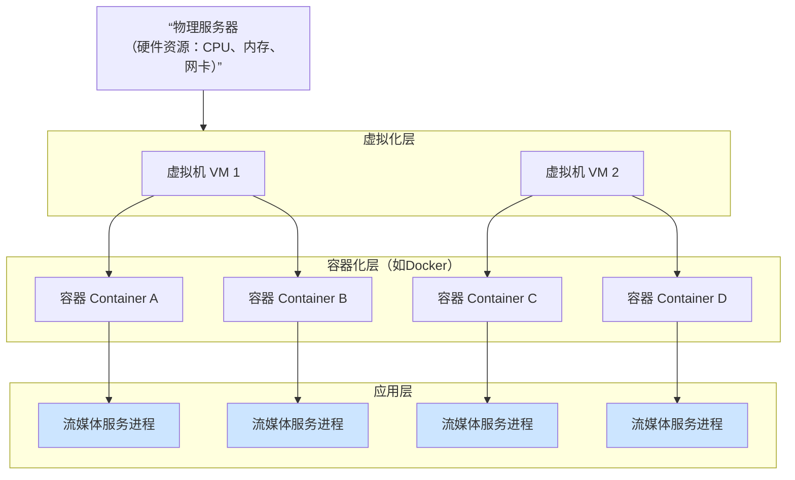
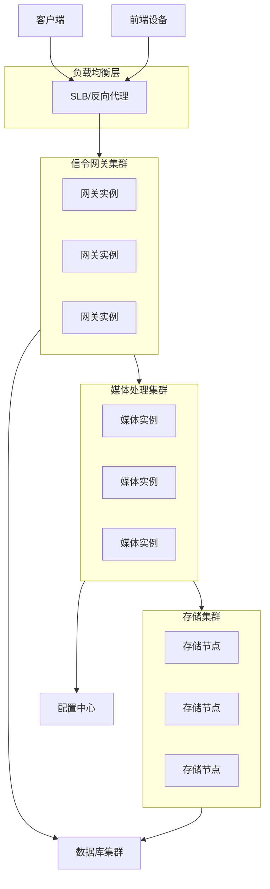

1.什么叫流媒体服务器实例，是服务器资源还是并发程序还是一个所谓虚拟机镜像？另外不用k8s和docker吗 2.云端也用ffmpeg吗？有做优化吗，有转码吗，有的话是硬解还是软解？有没有优化？3.用到了集群是吗

<think>
---

['{"webPages": [{"name": "“流媒体服务器”定义及其功能介绍 - 安防知识网 - a&s传媒", "summary": "流媒体技术的应用日益广泛,对流媒体技术的研究具有很大的实际意义,本文通过对RTP RTCP协议的研究,分析流媒体服务器的一般功能和结 构,给出构建一个基本的流媒体服务器的实现方案,实验证明可以同时满足多个实时和文件客户的要求,并已经应用于一个远程监控系统中。 随着互联网的飞速发展,流媒体技术的应用越来越广泛,从网上广播、电影播放到远程教学以及在线的新闻网站等都用到了流媒体技术。但现有公开文献所报道 的大多是利用现有的流媒体服务器来搭建一个流媒体服务系统,或者是针对流媒体数据的编码方式所进行的研究。本文对流媒体服务器技术的研究重点在于如何建立 一个服务器,并且在实现流媒体传输的两个基本协议RTP/RTCP的基础上构建一个基本的流媒体服务器。 流媒体技术简介 1.1 “流”的定义 现在网上传输视频、音频主要有下载(Download)和流式传输(Streaming)两种方式。流式传输是连续传送视/音频信号,当流媒 体在客户机播放时其余部分在后台继续下载。流式传输有顺序流式传输(Progressive Streaming)和实时流式传输(Realtime Streaming)两种方式。实时流式传输是实时传送,特别适合现场事件,实时流式传输必须匹配连接带宽,这意味着图像质量会因网络速度降低而变差,以 减少对传输带宽的需求。“实时”的概念是指在一个应用中数据的交付必须与数据的产生保持精确的时间关系。 在Internet中使用流式传输技术的连续时基媒体就称为流媒体,通常也将其视频与音频称为视频流和音频流。实现流式传输一般都需要专用服务器和播放器。 1.2 流媒体系统组件 流媒体是由各种不同软件构成的,这些软件在各个不同层面上互相通信,基本的流媒体系统包含以下3个组件: 播放器(Player),用来播放流媒体的软件。 服务器(Server),用来向用户发送流媒体的软件。 编码器(Encod", "url": "https://www.asmag.com.cn/tech/201611/75788.html"}, {"name": "流媒体服务器项目可行性分析报告模板 - 豆丁网", "summary": ".2014-12-12浏览:【引言】流媒体指以流方式在网络中传送音频、视频和多媒体文件的媒体形式。相对于下载后观看的网络播放形式而言,流媒体的典型特征是把连续的音频和视频信息压缩后放到网络服务器上,用户边下载边观看,而不必等待整个文件下载完毕。由于流媒体技术的优越性,该技术广泛应用于视频点播、视频会议、远程教育、远程医疗和在线直播系作为新一代互联网应用的标志,流媒体技术在近几年得到了飞速的发展。而流媒体服务器又是流媒体应用的核心系统,是运营商向用户提供视频服务的关键平台。其主要功能是对媒体内容进行采集、缓存、调度和传输播放,流媒体应用系统的主要性能体现都取决于媒体服务器的性能和服务质量。因此,流媒体服务器是流媒体应用系统的基础,也是最主要的组成部分。【目录】第一部分流媒体服务器项目总论总论作为可行性研究报告的首要部分,要综合叙述研究报告中各部分的主要问题和研究结论,并对项目的可行与否提出最终建议,为可行性研究的审批提供方便。一、流媒体服务器项目概况(一)项目名称(二)项目承办单位(三)可行性研究工作承担单位(四)项目可行性研究依据.本项目可行性研究报告编制依据如下:1.《中华人民共和国公司法》;2.《中华人民共和国行政许可法》;3.《国务院关于投资体制改革的决定》国发(2004)205.《国民经济和社会发展第十二个五年发展规划》;6.《建设项目经济评价方法与参数(第三版)》,国家发展与改革委员会2006年审核批准施行;7.《投资项目可行性研究指南》,国家发展与改革委员会200210.地方出台的相关投资法律法规等。(五)项目建设内容、规模、目标(六)项目建设地点二、流媒体服务器项目可行性研究主要结论在可行性研究中,对项目的产品销售、原料供应、政策保障、技术方案、资金总额及筹措、项目的财务效益和国民经济、社会效益等重大问题,都应得出明确的结论,主要包括:(一)项目产品市场前景(", "url": "https://www.docin.com/p-2775021003.html"}, {"name": "流媒体服务器项目可行性分析报告 - 道客巴巴", "summary": "下载积分: 1600 内容提示: 流媒体服务器项目可行性分析报告 【引言】 流媒体指以流方式在网络中传送音频、 视频和多媒体文件的媒体形式。 相对于下载后观看的网络播放形式而言, 流媒体的典型特征是把连续的音频和视频信息压缩后放到网络服务器上, 用户边下载边观看, 而不必等待整个文件下载完毕。 由于流媒体技术的优越性, 该技术广泛应用于视频点播、 视频会议、 远程教育、 远程医疗和在线直播系统中。 作为新一代互联网应用的标志, 流媒体技术在近几年得到了飞速的发展。 而流媒体服务器又是流媒体应用的核心系统, 是运营商向用户提供视频服务的关键平台。 其主要功能... 文档格式:DOC | 页数:27 | 浏览次数:47 | 流媒体服务器项目可行性分析报告 【引言】 流媒体指以流方式在网络中传送音频、 视频和多媒体文件的媒体形式。 相对于下载后观看的网络播放形式而言, 流媒体的典型特征是把连续的音频和视频信息压缩后放到网络服务器上, 用户边下载边观看, 而不必等待整个文件下载完毕。 由于流媒体技术的优越性, 该技术广泛应用于视频点播、 视频会议、 远程教育、 远程医疗和在线直播系统中。 作为新一代互联网应用的标志, 流媒体技术在近几年得到了飞速的发展。 而流媒体服务器又是流媒体应用的核心系统, 是运营商向用户提供视频服务的关键平台。 其主要功能是对媒体内容进行采集、 缓存、 调度和传输播放, 流媒体应用系统的主要性能体现都取决于媒体服务器的性能和服务质量。 因此, 流媒体服务器是流媒体应用系统的基础, 也是最主要的组成部分。 【目录】 第一部分 流媒体服务器项目总论", "url": "https://www.doc88.com/p-9049390314062.html"}, {"name": "网络操作系统之流媒体服务器的配置概述-20240626031123.ppt-原创力文档", "summary": "网络操作系统之流媒体服务器的配置概述.ppt 原文免费试下载 网络操作系统之流媒体服务器的配置概述2023-11-09 contents目录流媒体技术概述流媒体服务器概述流媒体服务器在WindowsServer上的配置流媒体服务器在Linux上的配置 contents目录流媒体服务器在Unix/Solaris上的配置流媒体服务器在配置过程中可能遇到的问题及解决方案 01流媒体技术概述 流媒体技术定义流媒体技术是一种能够连续传输音频、视频等多媒体数据,实现多媒体数据的实时播放的技术。它采用了高效的压缩算法和传输协议,能够实现对多媒体数据的快速、稳定传输。流媒体技术的主要特点是可以实现边下载边播放,无需等待整个文件下载完成。 这是流媒体技术最典型的应用场景之一,通过流媒体技术,用户可以在线观看电影、电视剧、综艺节目等视频内容。流媒体技术的应用场景在线视频播放流媒体技术可以实现音乐的实时播放,让用户享受到流畅的音乐体验。在线音乐播放流媒体技术可以实现实时的视频传输,让用户观看现场直播。网络直播 移动化随着移动互联网的普及,流媒体技术也在向移动化方向发展,满足用户在移动设备上观看视频的需求。高清化随着人们对视频清晰度的要求越来越高,流媒体技术也在向高清化方向发展。交互化未来的流媒体技术将更加注重用户的交互体验,例如支持用户评论、分享等功能。流媒体技术的发展趋势 02流媒体服务器概述 流媒体服务器是一种专门用于处理流式音视频数据的服务器,它可以将连续的音视频数据以流的形式传输到客户端,实现实时播放。流媒体服务器的主要功能是接收、处理和转发音视频数据,同时还要处理与流媒体传输相关的控制信号。流媒体服务器定义 流媒体服务器的功能流媒体服务器能够接收、处理和转发音视频数据,确保数据的实时传输。数据传输媒体处理流量控制安全性流媒体服务器可以对音视频数据进行压缩、解压缩、转码等处理,以适应不同", "url": "https://max.book118.com/html/2024/0626/8014112006006104.shtm"}, {"name": "如何搭建和使用流媒体服务器", "summary": "概述\\n流媒体服务器是流媒体技术的核心组件,负责接收和传输音频、视频数据流。它广泛应用于网络直播、视频点播和教育培训等领域,支持多种传输协议和编码格式。本文详细介绍了流媒体服务器的工作原理、搭建步骤和应用场景,帮助读者全面了解流媒体服务器的相关知识。\\n什么是流媒体服务器\\n流媒体的基本概念\\n流媒体(Streaming Media)是一种在互联网上实时传输音频、视频数据的技术。流媒体允许用户在数据流传输的同时就开始播放,而不需要将整个文件下载到本地缓存中。这种技术使得用户可以在观看视频或听音频时,不必等待整个文件下载完成就能开始播放,大大提升了用户体验。\\n流媒体通常使用TCP或UDP协议进行数据传输。TCP协议提供了可靠的连接,但是可能会因为网络拥塞等原因导致传输延迟。而UDP协议传输速度更快,但是不保证数据的完整性和顺序。在流媒体传输中,通常使用RTMP(Real-time Messaging Protocol)、HLS(HTTP Live Streaming)、RTSP(Real-time Streaming Protocol)等协议来传输数据流。\\n流媒体服务器的作用和应用场景\\n流媒体服务器在流媒体技术中扮演着核心角色,它负责接收来自客户端的流媒体请求,并将流媒体数据传输给客户端。流媒体服务器可以处理大量的并发连接,支持多种流媒体协议,提供视频编码和解码功能,以及实现流媒体文件的存储、管理和分发。\\n流媒体服务器的应用场景非常广泛,包括但不限于:\\n网络直播 :包括在线直播活动、体育赛事、在线教育等。 视频点播 :提供视频点播服务,让用户可以随时观看自己感兴趣的视频。 教育培训 :在线教育平台通过流媒体技术提供课程直播和录播。 企业内部培训 :企业内部可以使用流媒体服务器进行内部培训视频的存储和分发。 音视频会议 :进行远程会议、视频通话等。\\n流媒体的基本工作流程\\n流媒体的工作过", "url": "https://m.imooc.com/mip/article/363641"}, {"name": "流媒体服务器-CSDN博客", "summary": "流媒体指以流方式在网络中传送音频、视频和多媒体文件的媒体形式。相对于下载后观看的网络播放形式而言,流媒体的典型特征是把连续的音频和视频信息压缩后放到网络服务器上,用户边下载边观看,而不必等待整个文件下载完毕。由于流媒体技术的优越性,该技术广泛应用于视频点播、视频会议、远程教育、远程医疗和在线直播系统中。作为新一代互联网应用的标志,流媒体技术在近几年得到了飞速的发展。 流媒体服务器是流媒体应用的核心系统,是运营商向用户提供视频服务的关键平台。流媒体服务器的主要功能是对流媒体内容进行采集、缓存、调度和传输播放。流媒体应用系统的主要性能体现都取决于媒体服务器的性能和服务质量。因此,流媒体服务器是流媒体应用系统的基础,也是最主要的组成部分。 功能 流媒体服务器的主要功能是以流式协议(RTP/RTSP、MMS、RTMP等)将视频文件传输到客户端,供用户在线观看;也可从视频采集、压缩软件接收实时视频流,再以流式协议直播给客户端。典型的流媒体服务器有微软的Windows Media Service(WMS),它采用MMS协议接收、传输视频,采用Windows Media Player(WMP)作为前端播放器;RealNetworks公司的据,Flash播放器装机量已高达99%以上),越来越多的网络视频开始采用Flash播放器作为播放前端,因此,越来越多的企业开始采用兼容Flash播放器的流媒体服务器,而开始淘汰其他类型的流媒体服务器。支持Flash播放器的流媒体服务器,除了Adobe Flash Media Server,还有sewise的流媒体服务器软件和Ultrant Flash Media Server流媒体服务器软件,以及基于Java语言的开源软件Red5。 sewise软件系统 sewise流媒体服务器软件系统是一整套流媒体编码、分发和存储的软件系统,包含直播、点播、虚拟直播、", "url": "https://blog.csdn.net/weixin_34111790/article/details/93271374"}, {"name": "流媒体服务器的概念是什么 - 酷盾", "summary": "流媒体服务器是一种用于存储、管理和分发音视频数据的计算机系统,能够实时传输和播放多媒体内容。 流媒体服务器的概念是什么? 流媒体服务器是一种专门用于处理和分发音视频流的服务器,它能够将音频、视频或多媒体内容实时传输给客户端设备,使用户可以在不需要下载整个文件的情况下进行播放。 小标题:流媒体服务器的特点 1、实时性:流媒体服务器能够实时传输音视频流,用户无需等待整个文件下载完成即可开始观看。 2、可扩展性:流媒体服务器可以根据需求进行水平扩展,以支持更多的并发用户和更大的带宽要求。 3、容错性:流媒体服务器具备容错机制,当某个服务器出现故障时,可以自动切换到备用服务器,保证服务的连续性。 4、安全性:流媒体服务器可以通过加密和身份验证等手段保护音视频内容的版权和安全。 5、兼容性:流媒体服务器支持多种音视频编码格式和传输协议,以满足不同客户端设备的兼容性需求。 小标题:流媒体服务器的应用场景 1、在线直播:流媒体服务器可用于直播体育赛事、音乐会、讲座等大型活动,让用户可以实时观看。 2、视频点播:流媒体服务器可用于提供视频点播服务,用户可以按需选择并观看自己喜欢的视频内容。 3、视频会议:流媒体服务器可用于实现远程视频会议,使不同地点的用户能够进行实时交流和协作。 4、在线教育:流媒体服务器可用于在线教育平台,提供在线课程和教学资源,方便学生随时随地学习。 相关问题与解答: 问题1:什么是流媒体技术? 答:流媒体技术是一种通过网络传输音视频数据的技术,它将音视频内容分割成多个小块,并以连续的方式发送给客户端设备进行实时播放。 问题2:流媒体服务器和传统服务器有什么区别? 答:与传统服务器相比,流媒体服务器主要用于处理和分发音视频流,而传统服务器主要用于存储和传输静态文件,流媒体服务器具备实时性、可扩展性和容错性等特点,能够更好地满足音视频传输的需求。 原创文章,作者:未希,", "url": "https://www.kdun.com/ask/647086.html"}, {"name": "流媒体技术报告 - 豆丁网", "summary": "\ue50a2009-05-03 \ue50b\ue50a上传 \ue50b流媒体技术报告 金仁2004科技 吴小虎&庄育和 内容 术语表.4 一.流媒体服务器.6 1.1.HELIXSERVER.7 1.1.1.介绍.7 1.1.2支持的媒体格式.8 1.1.3定义.8 1.1.4Helix通用服务器安装.10 1.1.5配置.11 1.1.6服务器设置.12 1.1.6.1端口.12 1.1.6.2IP绑定.12 1.1.6.3MIME类型.12 1.1.6.4连接控制.12 1.1.6.5冗余服务器.12 1.1.6.6配置加载点.12 1.1.6.7URL别名.13 1.1.6.8HTTP分发.13 1.1.6.9缓存目录.13 1.1.6.10许可证分享.13 1.1.6.11媒体演示.13 1.1.7安全设置.14 1.1.7.1访问控制.14 1.1.7.2用户数据库.14 1.1.7.3用户认证.14 1.1.7.4商业应用.14 1.1.8日志和监控.14 1.1.8.1服务器监控.14 1.1.8.2访问和错误日志.14 1.1.8.3自定义日志.14 1.1.8.4 许可证监控.15 1.1.9 广播设置.15 1.1.9.1 RealNetworks 编码.15 1.1.9.2 QT & RTP 编码器.16 1.1.9.2 Windows Media 编码器.16 1.1.9.3 直播存档.17 1.1.9.4 冗余广播.18 1.1.10 广播分发.18 1.1.10.1 发送器.18 1.1.10.2 配置接收服务器.19 1.1.10.3 后台多播.19 1.1.10.4 可扩展多播.19 1.1.10.5 Windows Meida 多播.21 1.1.10.6 Publicizing Your Multicasts(会话声明)22 1.1.11 内容管理.22 1.1.11.1", "url": "https://www.docin.com/p-16888813.html"}, {"name": "流媒体服务器全面解析-美音声光", "summary": "流媒体服务器流媒体服务器是一种用于存储、处理和传输大量音频和视频数据的服务器设备。它通过互联网向用户提供高品质的音视频内容,如电影、电视节目、音乐和直播等。以下是关于流媒体服务器的详细介绍。基础介绍流媒体服务器是一种高效的服务端平台,主要用于实时传送音频和视频内容。它通过网络将音频、视频和其他多媒体文件传送给用户设备,实现即时播放和实时传输。流媒体服务器的主要功能是对媒体内容进行采集、缓存、调度和传输播放,其核心作用在于处理音视频流,确保流畅的用户体验。原理流媒体服务器的工作原理可以简单地分为三个步骤:编码、传输和播放。编码:将传输内容(如音频、视频)进行编码,将其转化为数字信号。常见的音视频编码标准有H.264、H.265、AAC等。传输:将编码后的音视频数据通过网络传输给终端设备。这里涉及到流媒体服务器的核心功能,即将媒体文件切割成小段并按照特定的传输协议进行分发。播放:终端设备接收到音视频数据后,将其解码并播放出来。播放过程中,终端设备可以动态请求下一段数据,以保证流畅的播放体验。流媒体服务器使用不同的传输协议来将媒体内容传输到终端设备。常见的流媒体传输协议包括:RTMP(Real-Time\\nMessaging\\nProtocol):由Adobe公司开发,基于TCP协议,可以实现低延迟、高质量的音视频传输,常用于直播、视频会议等实时场景。HLS(HTTP\\nLive\\nStreaming):由苹果公司提出,基于HTTP协议,将媒体文件切割成小段,每个小段作为一个HTTP请求进行传输,兼容性较好,可以在大多数设备上播放。DASH(Dynamic\\nAdaptive\\nStreaming\\nover\\nHTTP):由MPEG提出,将媒体文件按照不同的比特率(分辨率和码率)切割成小段,并根据终端设备的网络情况选择最合适的分段进行播放,具有自适应的特点,能够实现流畅的播放体验。性能流媒体", "url": "https://www.avl.top/articleDetail/1200.html"}, {"name": "流媒体服务器是指的什么-阿里云服务器ECS-重庆典名科技", "summary": "流媒体 服务器 是指的什么?流媒体服务器指的是:流媒体服务器指以流方式在网络中传送音频、视频和多媒体文件的媒体形式,用户使用服务器可以边下载边观看,不用等待整个文件下载完毕,可应用于视频点播、视频会议、远程教育、远程医疗和在线直播系统中。 流媒体服务器是指的什么? 流媒体指以流方式在网络中传送音频、视频和多媒体文件的媒体形式。相对于下载后观看的网络播放形式而言,流媒体的典型特征是把连续的音频和视频信息压缩后放到网络服务器上,用户边下载边观看,而不必等待整个文件下载完毕。由于流媒体技术的优越性,该技术广泛应用于视频点播、视频会议、远程教育、远程医疗和在线直播系统中。作为新一代互联网应用的标志,流媒体技术在近几年得到了飞速的发展。 流媒体服务器是流媒体应用的核心系统,是运营商向用户提供视频服务的关键平台。流媒体服务器的主要功能是对流媒体内容进行采集、缓存、调度和传输播放。流媒体应用系统的主要性能体现都取决于媒体服务器的性能和服务质量。因此,流媒体服务器是流媒体应用系统的基础,也是最主要的组成部分。 以上就是关于“流媒体服务器”的相关介绍,如果亲们对流媒体服务器有需求,可以直接咨询我们的在线客服!典名科技是阿里云的合作伙伴,购买阿里云的产品可享受返利优惠。典名科技专注于国内外云服务器租用、虚拟主机租用、数据库、云安全、邮箱、网盘等产品和服务,凭借专业的技术和售后支持,发展至今,我们已凝聚起优秀的开发和运维团队,积累起多年市场服务经验,我们7x24小时提供技术协助服务。典名科技期待与您合作!", "url": "https://www.321.net/ECS_help/11217.html"}], "images": [{"url": "https://static.asmag.com.cn/uploadfile/2024/0905/2024090509473127018.jpg"}, {"url": "https://txt17.book118.com/2024/0626/book668062/668061274.jpg"}, {"url": "http://g.hiphotos.baidu.com/baike/s%3D220/sign=a55d7c6e63d9f2d3241123ed99ed8a53/d52a2834349b033b851cbf5514ce36d3d439bdad.jpg"}, {"url": "https://wp-com.uploads.cn/wp-content/uploads/2024/05/4a2b326c8eea7d9bf7a64cde3aa04284-3.jpg"}, {"url": "https://www.321.net/uploads/day_220527/2022052715034691.jpg"}]}', '{"webPages": [{"name": "从 FFmpeg 性能加速到端云一体媒体系统优化_知乎", "summary": "简介: 7 月31 日,阿里云视频云受邀参加由开放原子开源基金会、Linux 基金会亚太区、开源中国共同举办的全球开源技术峰会 GOTC 2021 ,在大会的音视频性能优化专场上,分享了开源 FFmpeg 在性能加速方面的实战经验以及端云一体媒体系统建设与优化。 众所周知,FFmpeg 作为开源音视频处理的瑞士军刀,以其开源免费、功能强大、方便易用的特点而十分流行。音视频处理的高计算复杂度使得性能加速成为 FFmpeg 开发永恒的主题。阿里云视频云媒体处理系统广泛借鉴了开源 FFmpeg 在性能加速方面的经验,同时根据自身产品和架构进行了端云一体媒体系统架构设计与优化,打造出高性能、高画质、低延时的端云协同的实时媒体服务。 阿里云智能视频云高级技术专家李忠,目前负责阿里云视频云 RTC 云端媒体处理服务以及端云一体的媒体处理性能优化,是FFmpeg 官方代码的维护者及技术委员会委员,参与过多个音视频开源软件的开发。 本次分享的议题是《从FFmpeg 性能加速到端云一体媒体系统优化》,主要介绍三个方面的内容: 一、FFmpeg 中常见的性能加速方法 二、云端媒体处理系统 三、端+云的协同媒体处理系统 FFmpeg 中常见的性能加速方法 音视频开发者当前主要面临的挑战之一是对计算量的高需求,它不只是单任务算法优化,还涉及到很多硬件、软件、调度、业务层,以及不同业务场景的挑战。其次端、云、不同设备、不同网络,这些综合的复杂性现状,要求开发者要做系统性的架构开发与优化。 FFmpeg 是一个非常强大的软件,包括音视频的解码编码、各种音视频的 Filter 、各种协议的支持。作为一个开源软件 FFmpeg 主要的 License 是GPL 或者 LGPL,编程语言是 C 和汇编。它还提供了很多打开即用的命令行工具,比如转码的 ffmpeg 、音视频解析的 ffprobe、播放器 ff", "url": "https://zhuanlan.zhihu.com/p/403073953"}, {"name": "【云端FFmpeg QSV硬解码部署】:云环境下的配置与管理最佳实践 - CSDN文库", "summary": "\ue50a发布时间: 2025-03-22 08:18:36 \ue50b\ue50a阅读量: 22 \ue50b\ue50a订阅数: 21 \ue50b# 摘要云端FFmpeg QSV硬解码技术的利用,是当前视频处理领域的一项创新实践。该技术利用快速同步视频(Fast Sync Video)的硬件加速能力,实现高效的视频流媒体处理。本文首先概述了FFmpeg QSV硬解码的背景、优势以及在云端应用的必要性,随后详细探讨了其理论基础、技术框架、云端环境资源调度、架构设计与部署策略。通过案例研究,分析了该技术在不同应用场景中的性能表现和优化策略,并对安全性与合规性问题进行了深度探讨。最终,本文展望了FFmpeg QSV硬解码技术的未来发展趋势,为云端媒体处理技术的演进提供了指导和建议。# 关键字FFmpeg QSV硬解码;云服务;资源调度;架构设计;性能优化;安全性与合规性参考资源链接:[FFMPEG+Intel QSV硬解环境安装指南:兼容处理器与驱动确认](https://wenku.csdn.net/doc/41of0rt1sp?spm=1055.2635.3001.10343)# 1. 云端FFmpeg QSV硬解码概述## 了解FFmpeg QSV硬解码的背景和优势FFmpeg是一个开源项目,它提供了一个全面的框架,用于处理多媒体数据和执行各种音视频处理任务。随着互联网流量的爆炸式增长,特别是在云端媒体处理的场景下,计算资源和处理效率变得越来越重要。QSV(Quick Sync Video)硬解码是英特尔处理器中集", "url": "https://wenku.csdn.net/column/19odfxx56u"}, {"name": "腾讯云音视频与FFmpeg开源生态-腾讯云开发者社区-腾讯云", "summary": "自由与开源软件的理念,从不解、争议、接受到如今如火如荼,经历了长期的历程。国内开源软件起步较晚,但进展迅速。腾讯经过几年的开源协同运动,也取得了不少成绩。其中,腾讯云音视频在FFmpeg、SRS等重要多媒体开源社区的贡献,颇具代表性。 FFmpeg是音视频领域最著名的开源项目之一,被誉为多媒体领域的瑞士军刀,是众多音视频业务的基石。 FFmpeg 6.0版本以代号Von Neumann在2月28号发布,这一版本包含了大量重要更新,其中就有腾讯云音视频团队贡献的众多有趣且颇具价值的特性。 除FFmpeg外,腾讯云音视频团队还积极主导或参与了SRS、SRT、VLC等众多开源音视频项目的开发,践行云与开源社区的互利互生的信条。这些开源项目的介绍及音视频团队在其中的实践,我们也会在后续的文章中分享给大家。 FFmpeg简介 FFmpeg最初由法国程序员Fabrice Bellard于2000年发起,功能丰富,能够满足各种音视频处理、开发的需求。除了功能丰富,FFmpeg还包含大量的加速优化,在CPU上,充分利用SIMD汇编加速、多线程加速,并积极引入GPU等异构加速,以实现最高性能。经历了20多年的迭代和长期的检验,FFmpeg在代码健壮性、媒体数据处理兼容性上也首屈一指。 目前,FFmpeg的主要构成包括命令行工具和基础库两部分。 fftools命令行工具 ffmpeg: 多媒体数据处理 工具,包括格式转换、滤镜处理等,能够自动完成复杂的编辑功能; ffprobe: 多媒体数据分析工具; ffplay: 一个简单又功能强大的播放器。 基础库 libavutil: 基础库,包含数据结构、字符串处理、数学计算、内存管理、日志系统等等; libavcodec: 音频、视频、字幕编解码库,包含800多个编解码器;除此之外,还包含parser、bitstream filter等编解码相关联", "url": "https://cloud.tencent.com/developer/article/2256679"}, {"name": "腾讯云音视频与FFmpeg开源生态 - 腾讯云专区 - 博客园", "summary": "自由与开源软件的理念,从不解、争议、接受到如今如火如荼,经历了长期的历程。国内开源软件起步较晚,但进展迅速。腾讯经过几年的开源协同运动,也取得了不少成绩。其中,腾讯云音视频在FFmpeg、SRS等重要多媒体开源社区的贡献,颇具代表性。\\nFFmpeg是音视频领域最著名的开源项目之一,被誉为多媒体领域的瑞士军刀,是众多音视频业务的基石。FFmpeg\\n6.0版本以代号Von\\nNeumann在2月28号发布,这一版本包含了大量重要更新,其中就有腾讯云音视频团队贡献的众多有趣且颇具价值的特性。除FFmpeg外,腾讯云音视频团队还积极主导或参与了SRS、SRT、VLC等众多开源音视频项目的开发,践行云与开源社区的互利互生的信条。这些开源项目的介绍及音视频团队在其中的实践,我们也会在后续的文章中分享给大家。\\nFFmpeg简介\\nFFmpeg最初由法国程序员Fabrice\\nBellard于2000年发起,功能丰富,能够满足各种音视频处理、开发的需求。除了功能丰富,FFmpeg还包含大量的加速优化,在CPU上,充分利用SIMD汇编加速、多线程加速,并积极引入GPU等异构加速,以实现最高性能。经历了20多年的迭代和长期的检验,FFmpeg在代码健壮性、媒体数据处理兼容性上也首屈一指。\\n目前,FFmpeg的主要构成包括命令行工具和基础库两部分。\\nfftools命令行工具\\nffmpeg:多媒体数据处理工具,包括格式转换、滤镜处理等,能够自动完成复杂的编辑功能;\\nffprobe:多媒体数据分析工具;\\nffplay:一个简单又功能强大的播放器。\\n基础库\\nlibavutil:基础库,包含数据结构、字符串处理、数学计算、内存管理、日志系统等等;libavcodec:音频、视频、字幕编解码库,包含800多个编解码器;除此之外,还包含parser、bitstream\\nfilter等编解码相关联功能;\\nliba", "url": "https://brands.cnblogs.com/tencentcloud/p/16146"}, {"name": "ffmpeg硬件加速方案-阿里云", "summary": "被称为“多媒体技术领域的瑞士军刀”,FFmpeg拥有广泛的应用基础。不过,当(实时)处理海量视频时,需要借助各种方法提升效率。比如,短视频平台Revvel将视频转码服务迁移到AWS Lambda和S3上,节省了大量费用和运维成本,并且将时长2小时的视频转码从4-6小时缩短到不到10分钟。本文将纵览FFmpeg的硬件加速方案,涉及各主流硬件方案和操作系统。本文为此系列的下篇,上篇请访问这里。感谢英....", "url": "https://www.aliyun.com/sswb/978727.html"}, {"name": "FFmpeg 4.0版发布-阿里云开发者社区", "summary": "版权 版权声明: 本文内容由阿里云实名注册用户自发贡献,版权归原作者所有,阿里云开发者社区不拥有其著作权,亦不承担相应法律责任。具体规则请查看《阿里云开发者社区用户服务协议》和《阿里云开发者社区知识产权保护指引》。如果您发现本社区中有涉嫌抄袭的内容,填写侵权投诉表单进行举报,一经查实,本社区将立刻删除涉嫌侵权内容。 简介: FFmpeg 4.0是这一全球最流行的视频处理工具在过去近两年时间内的一次重大更新,包括增加对3月刚刚完成1.0版定稿的AV1的支持。 FFmpeg 4.0是这一全球最流行的视频处理工具在过去近两年时间内的一次重大更新,包括增加对3月刚刚完成1.0版定稿的AV1的支持。感谢FFmpeg开发者、OnVideo联合创始人刘歧提供新闻线索和审校。 文/包研 审校 / 刘歧 北京时间4月20日消息,全球最流行的视频处理工具FFmpeg发布了代号为“Wu”的4.0版,并在官网提供了下载地址(https://ffmpeg.org/download.html#releases)。 FFmpeg 4.0版更新重点更新如下,其中包括对今年3月刚刚1.0定稿的AV1的支持: Bitstream filters for editing metadata in H.264, HEVC and MPEG-2 streams Intel QSV-accelerated MJPEG encoding NVIDIA NVDEC-accelerated H.264, HEVC, MJPEG, MPEG-1/2/4, VC1, VP8/9 hwaccel decoding Intel QSV-accelerated overlay filter OpenCL overlay filter support LibreSSL (via libtls) Removed the ffserver", "url": "https://yq.aliyun.com/articles/606081"}, {"name": "STARCTO运维技术分享", "summary": "我举手向苍穹,并非要摘取到星月,我只需要它那向上永不臣服的姿态。 FFmpeg 是一个开源的音视频处理工具,它可以对音视频进行录制、转码、剪辑、合并等操作。FFmpeg 支持多种音视频格式,包括 MP4、AVI、FLV、MOV、WMV、MP3、AAC 等。 标签: ffmpeg GPU硬件加速处理视频流 作者:UStarGao 日期:2024-11-19 人气:248 阅读全文 工作中,常需要把Linux上的脚本拿到Windows下执行,也常把Windows下的脚本拿到Linux下执行。其中windows脚本格式和linux脚本格式的差异会导致脚本执行报错,需要进行转换一下。 UCloud快杰云主机紧随技术的发展与迭代,支持4.19+高版本内核,与此同时快杰云主机也支持高版本内核带来的各种新特性。但是由于部分行业客户,由于行业技术迭代较慢,使用的开发环境和框架都是很老的版本,会存在一定概率与高版本内核兼容问题。那么遇到这种情况,就可以通过降低快杰主机内核版本来解决。 \u200c\u200cApache \u200cKafka是一个开源的分布式流处理平台,主要用于处理实时数据流。\u200c是业务环节不可或缺的一部分,但当集群节点数量较多时,便会给业务带来管理的痛点,需要记录多个IP地址。那么今天我们就通过UCloud UDNS产品和NLB产品为大家介绍两个解决方案。 经常我们会遇到在云上自建K8S的场景,但是又想使用云的一些基础产品,比如,ULB负载均衡、UDisk云盘、UFS文件存储等。下面我就基于在UCloud云主机上自建K8S集群,如何使用UCloud ULB产品进行展开介绍。", "url": "http://starcto.com/"}, {"name": "STARCTO运维技术分享", "summary": "我举手向苍穹,并非要摘取到星月,我只需要它那向上永不臣服的姿态。 FFmpeg 是一个开源的音视频处理工具,它可以对音视频进行录制、转码、剪辑、合并等操作。FFmpeg 支持多种音视频格式,包括 MP4、AVI、FLV、MOV、WMV、MP3、AAC 等。 标签: ffmpeg GPU硬件加速处理视频流 作者:UStarGao 日期:2024-11-19 人气:248 阅读全文 工作中,常需要把Linux上的脚本拿到Windows下执行,也常把Windows下的脚本拿到Linux下执行。其中windows脚本格式和linux脚本格式的差异会导致脚本执行报错,需要进行转换一下。 UCloud快杰云主机紧随技术的发展与迭代,支持4.19+高版本内核,与此同时快杰云主机也支持高版本内核带来的各种新特性。但是由于部分行业客户,由于行业技术迭代较慢,使用的开发环境和框架都是很老的版本,会存在一定概率与高版本内核兼容问题。那么遇到这种情况,就可以通过降低快杰主机内核版本来解决。 \u200c\u200cApache \u200cKafka是一个开源的分布式流处理平台,主要用于处理实时数据流。\u200c是业务环节不可或缺的一部分,但当集群节点数量较多时,便会给业务带来管理的痛点,需要记录多个IP地址。那么今天我们就通过UCloud UDNS产品和NLB产品为大家介绍两个解决方案。 经常我们会遇到在云上自建K8S的场景,但是又想使用云的一些基础产品,比如,ULB负载均衡、UDisk云盘、UFS文件存储等。下面我就基于在UCloud云主机上自建K8S集群,如何使用UCloud ULB产品进行展开介绍。", "url": "http://www.starcto.com/"}, {"name": "STARCTO运维技术分享", "summary": "我举手向苍穹,并非要摘取到星月,我只需要它那向上永不臣服的姿态。 FFmpeg 是一个开源的音视频处理工具,它可以对音视频进行录制、转码、剪辑、合并等操作。FFmpeg 支持多种音视频格式,包括 MP4、AVI、FLV、MOV、WMV、MP3、AAC 等。 标签: ffmpeg GPU硬件加速处理视频流 作者:UStarGao 日期:2024-11-19 人气:248 阅读全文 工作中,常需要把Linux上的脚本拿到Windows下执行,也常把Windows下的脚本拿到Linux下执行。其中windows脚本格式和linux脚本格式的差异会导致脚本执行报错,需要进行转换一下。 UCloud快杰云主机紧随技术的发展与迭代,支持4.19+高版本内核,与此同时快杰云主机也支持高版本内核带来的各种新特性。但是由于部分行业客户,由于行业技术迭代较慢,使用的开发环境和框架都是很老的版本,会存在一定概率与高版本内核兼容问题。那么遇到这种情况,就可以通过降低快杰主机内核版本来解决。 \u200c\u200cApache \u200cKafka是一个开源的分布式流处理平台,主要用于处理实时数据流。\u200c是业务环节不可或缺的一部分,但当集群节点数量较多时,便会给业务带来管理的痛点,需要记录多个IP地址。那么今天我们就通过UCloud UDNS产品和NLB产品为大家介绍两个解决方案。 经常我们会遇到在云上自建K8S的场景,但是又想使用云的一些基础产品,比如,ULB负载均衡、UDisk云盘、UFS文件存储等。下面我就基于在UCloud云主机上自建K8S集群,如何使用UCloud ULB产品进行展开介绍。", "url": "https://m.starcto.com/"}, {"name": "FFmpeg直播能力更新计划与新版本发布-CSDN博客", "summary": "版权声明:本文为博主原创文章,遵循CC 4.0 BY-SA版权协议,转载请附上原文出处链接和本声明。 编者按:客户端作为直接面向用户大众的接口,随着技术的发展进化与时俱进,实现更好的服务是十分必要的。FFmpeg作为最受欢迎的视频和图像处理开源软件,被相关行业的大量用户青睐,而随着HEVC标准的发布到广泛使用,相信国内很多网络流媒体从业者都在长期关注FFmpeg FLV支持HEVC的官方更新。LiveVideoStackCon 2023 上海站邀请了来自快手的音视频首席架构师刘歧,为大家带来他关于FFmpeg 直播能力的更新计划。 文/刘歧 整理/LiveVideoStack 大家好,下面由我和大家分享近期FFmpeg的最新技术、部分未来的发展方向以及一些我个人的经验思考。 首先向大家做一个自我介绍,本人浸淫音视频行业多年,目前是FFmpeg/SRS社区委员会的成员,曾参与编写《FFmpeg 从入门到精通》一书,也是腾讯云最具价值专家TVP。 我于2007年参加工作,早期曾从事图形图像库、Flash解析引擎开发工作。2011年我正式参与音视频流媒体技术开发。2016年受邀成为FFmpeg维护者。2017年成为FFmpeg官方顾问,创业成立了OnVideo。2019年成为FFmpeg决策委员会委员,并开始担任FFmpeg GSoC Mentor。2020年,OnVideo被快手收购,我也随之进入快手工作。 接下来简单介绍我做出本次分享的契机。 首先,FFmpeg FFplay的官方版本目前仍然无法实现FLV对封装HEVC、VVC、VP9、AV1、OPUS等现代化编码格式的支持,随着音视频技术的发展,FLV需要随之改变。 第二,业界有声音提出重视HLS、DASH、LLHLS、LLDASH等协议。但目前看来,这些协议的实时性还很差。在CDN分发过程中,链路稍有卡顿就很容易影响广域", "url": "https://blog.csdn.net/vn9PLgZvnPs1522s82g/article/details/134193965"}], "images": [{"url": "https://csdnimg.cn/release/wenkucmsfe/public/img/col_corwn.6e20b287.png"}, {"url": "https://developer.qcloudimg.com/http-save/yehe-8722662/796e7d88199980ac19d3b81a1fa7e94d.png"}, {"url": "https://developer.qcloudimg.com/http-save/yehe-2669993/6db188e09d3551d568cb870dc99a0295.gif"}, {"url": "https://developer.qcloudimg.com/http-save/yehe-2669993/796e7d88199980ac19d3b81a1fa7e94d.png"}, {"url": "https://developer.qcloudimg.com/http-save/yehe-2669993/d70f8627fb55cc6473cb9a2ca8c37084.png"}, {"url": "http://yqfiles.oss-cn-hangzhou.aliyuncs.com/zt/pc/32.jpg"}, {"url": "https://img-blog.csdnimg.cn/img_convert/5a12ff6bf8c3ba4028592164555eb137.png"}]}']
</think>非常好的问题，这些问题直击了现代流媒体平台架构的核心。我们来逐一深入解答。

### 1. 流媒体服务器实例、容器化与虚拟化

您对“实例”的疑问非常精准，它确实可以有不同的形态。在现代云原生架构中，这几者不是互斥的，而是层层封装的关系。

为了让您更直观地理解这个概念，我们用一个分层图来展示：

**“流媒体服务器实例”到底是什么？**

它最核心的本质是 **一个正在运行的、独立提供流媒体服务的程序进程**。这个进程：
- **消耗计算资源**（CPU、内存、GPU）。
- **占用网络端口**（如RTMP的1935，RTSP的554）。
- **处理具体的媒体流**（接收、转发、转码）。

而这个进程可以运行在不同的“载体”上：
- **直接运行在物理服务器上**：最传统的方式，实例=进程。
- **运行在虚拟机里**：实例=虚拟机里的一个进程。虚拟机镜像是模板，启动后就成了一个包含OS的虚拟机，然后在里面运行进程。
- **运行在容器里**（现代云原生方式）：实例=一个Docker容器。容器镜像是一个更轻量的模板，里面打包了应用及其依赖。一个容器通常只运行一个主进程。

**iVMS-9800不用K8s和Docker吗？**

**几乎可以肯定它会用，尤其是对于新一代产品。** 作为强调云原生的平台，采用容器化（Docker）和容器编排（Kubernetes）是必然趋势。
- **Docker**：用于将每个微服务（如流媒体服务、认证服务）打包成独立的、可移植的镜像。
- **Kubernetes**：用于管理成百上千个Docker容器实例的**生命周期**：自动部署、弹性伸缩、故障恢复、负载均衡。

所以，在iVMS-9800的典型部署中，一个“流媒体服务器实例”很可能就是 **一个由Kubernetes创建和管理的Docker容器**。

---

### 2. 云端FFmpeg的应用与优化

**云端绝对会用到FFmpeg。** 它是音视频处理领域事实上的标准库，被誉为“瑞士军刀”。海康威视这样的巨头必然在其核心产品中深度使用和优化。

**主要用途：**
1.  **转码/转封装**：将前端设备上传的原始码流（如H.265）转换成更适合不同网络条件和客户端播放的格式（如转换为H.264或打包成FLV、HLS格式）。
2.  **码流抽帧**：从视频流中抽取关键帧，用于生成封面图、时间线缩略图，或提供给AI算法进行智能分析。
3.  **录像文件处理**：对存储的录像进行剪辑、合并、格式转换等操作。

**硬解 vs 软解 & 优化：**

这是一个关于性能和成本的核心问题。

- **软解（软件解码）**：完全依靠服务器的**CPU**进行计算。
    - **优点**：兼容性极好，支持所有FFmpeg拥有的编解码器。
    - **缺点**：计算资源消耗大，并发处理能力受限，成本高。

- **硬解（硬件解码）**：利用专用的**硬件芯片**（如GPU的NVENC/NVDEC、Intel的QSV）进行计算。
    - **优点**：效率极高，功耗低，能支持**超高并发**转码。
    - **缺点**：需要特定硬件支持，编解码能力受硬件限制。

**海康威视的优化实践（根据行业通用实践推断）：**

1.  **异构计算架构**：在云端转码集群中，会混合使用**CPU（软解）和GPU/专用加速卡（硬解）**。对于常见的编码格式（如H.264/H.265），优先调度到硬件节点进行处理，以追求最大效率和最低成本。对于特殊格式，则 fallback 到软解节点。
2.  **深度定制FFmpeg**：像海康、阿里云、腾讯云这样的公司，绝不会只使用FFmpeg的官方版本。他们会对FFmpeg进行**深度优化和定制**，例如：
    - **集成最新的硬件加速SDK**：如Intel Media SDK, NVIDIA Video Codec SDK，充分发挥硬件性能。
    - **算法优化**：对关键代码路径进行汇编级优化，使用SIMD指令集（如AVX2）提升CPU软解效率。
    - **Patch贡献**：他们会将一些优化和改进反馈给FFmpeg开源社区，成为官方代码的维护者和贡献者。

---

### 3. 集群技术的运用

**是的，绝对用到了集群技术，而且是其架构的基石。** 单一服务器无论多强大，都有性能上限和单点故障风险。集群是实现高可用、高并发、可扩展性的唯一途径。

流媒体平台通常会采用多种集群协同工作的方式：

下面的示意图展示了一个典型的流媒体平台集群架构，它包含了信令、媒体、存储等多个集群：

**常见的集群类型包括：**

- **媒体流集群**：由大量媒体服务器实例组成，共同承担视频流的接收、转发、转码压力。通过负载均衡器将请求分发到不同的实例。
- **信令管理集群**：处理设备注册、用户登录、权限验证、会话控制等信令请求。
- **存储集群**：用于中心录像的分布式存储，如采用Ceph、HDFS等技术，提供高可靠、高扩展的存储服务。
- **数据库集群**：对核心业务数据库（如MySQL）进行主从复制、分库分表，确保数据的高可用和高性能访问。

这些集群通过**服务发现（如Nacos, Consul）、配置中心、消息队列（如Kafka, RabbitMQ）** 等中间件连接在一起，形成一个统一协调、弹性伸缩的庞大系统。

**总结：** iVMS-9800这类现代平台，本质上是**基于K8s+Docker的云原生架构，通过微服务化和集群技术，将FFmpeg等核心媒体处理能力包装成可弹性伸缩的服务，以应对超大规模场景下的各种媒体处理需求。**