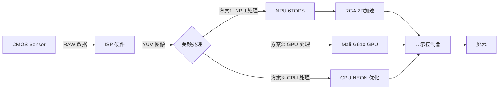
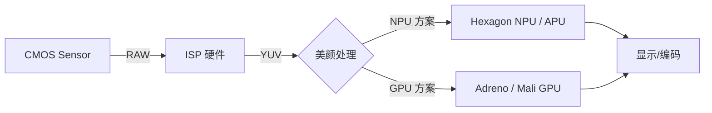
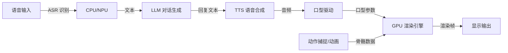
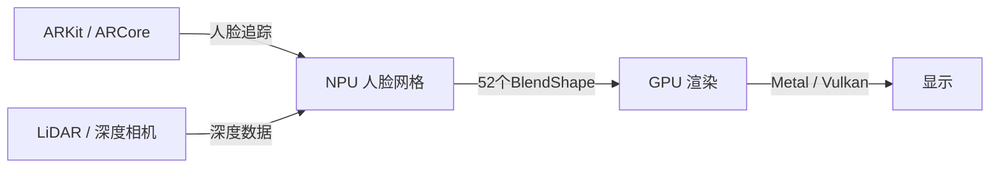
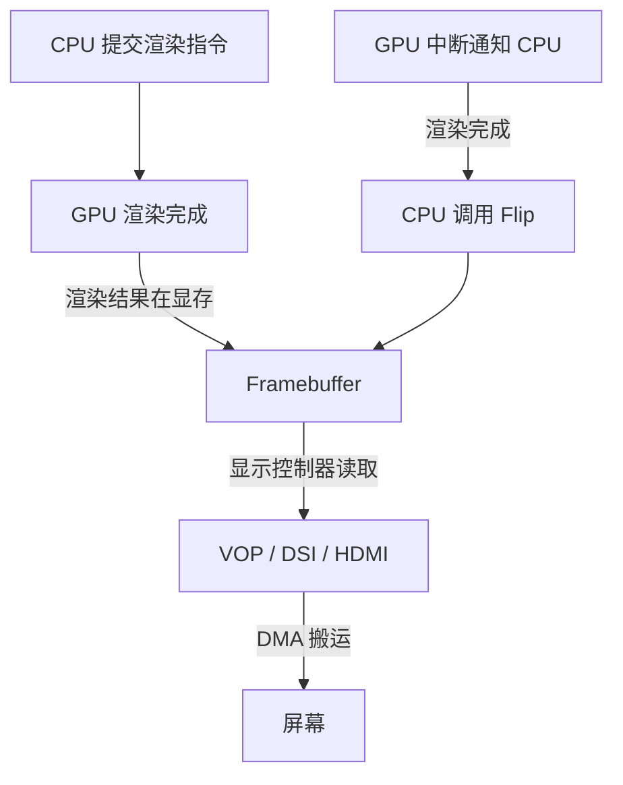
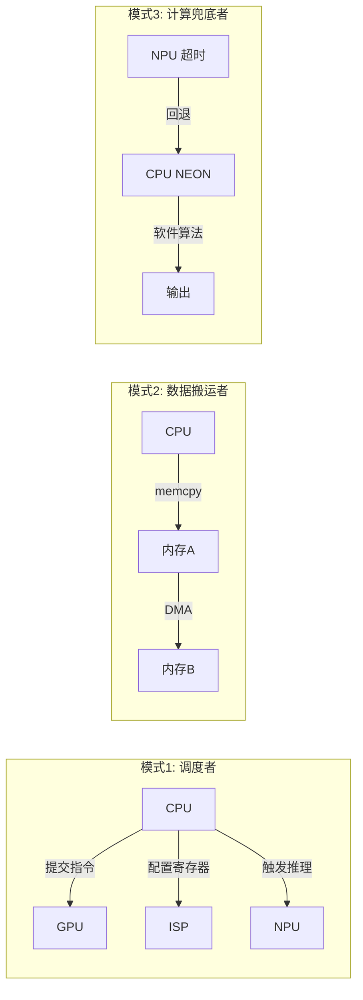

<think>
---


</think># 渲染（Render）在图形内存分配中的深入分析

## 一、 渲染的本质含义

这里的 `render` 指的是 **GPU 渲染专用内存分配**，即通过图形硬件加速管线（如 OpenGL ES、Vulkan 等）进行绘制、合成、显示时所需的内存。它不同于普通的 CPU 读写内存，而是为 GPU 的渲染管线专门优化的内存区域。

## 二、 渲染内存与普通内存的核心差异

| 维度 | 普通视频帧内存（DMA） | 渲染内存（Render） |
|:---|:---|:---|
| **分配接口** | `gralloc->alloc()` | `gralloc->render()` |
| **对齐要求** | 宽高 16 字节对齐 | 宽 128 字节对齐（实测） |
| **访问主体** | CPU 为主，GPU 为辅 | GPU 为主，CPU 为辅 |
| **缓存策略** | 可缓存，CPU 可高效读写 | 通常不可缓存或写合并，避免 GPU 与 CPU 缓存不一致 |
| **物理特性** | 普通 DDR 内存 | 可能使用专用显存或保留内存区域 |
| **典型用途** | 视频编解码帧、算法处理帧 | 图层合成、纹理贴图、显示输出 |

## 三、 渲染内存的典型应用场景

### 1. 图层合成（Composition）
- 多个 UI 图层、视频图层、相机预览图层需要叠加显示
- GPU 通过渲染内存读取各图层纹理，执行混合（Blending）后输出到显示设备

### 2. 纹理贴图（Texture Mapping）
- 3D 场景中的纹理、特效滤镜、图像变换（旋转/缩放/裁剪）
- GPU 需要以特定格式（如 RGBA8888）高效访问这些纹理数据

### 3. 显示输出（Display Output）
- 最终合成结果写入渲染内存，由显示控制器（Display Controller）读取并输出到屏幕
- 要求内存带宽高、延迟低，且与显示时序同步

### 4. 硬件加速特效
- 模糊、锐化、色彩调整等 GPU 加速滤镜
- 需要 GPU 可高效读写的内存，避免 CPU 参与导致的性能瓶颈

## 四、 为什么渲染内存需要 128 字节对齐？

```c
/* 注意底下会对宽高做4对齐，GPU渲染buffer分配后，宽跨距实测128对齐 */
stride = ALIGN_UP(pInParam->uWidth, 128);
```

### 技术原因：
1. **GPU 缓存行（Cache Line）优化**：现代 GPU 的 L2 缓存行通常为 128 字节，对齐后每次缓存预取能覆盖完整的纹理行，减少缓存未命中
2. **硬件 DMA 传输效率**：显示控制器和 GPU 引擎的 DMA 传输以 128 字节为基本单元，对齐可避免跨边界传输的开销
3. **Tile-Based 渲染架构**：移动 GPU（如 Mali、Adreno）采用 Tile 渲染，128 字节对齐与 Tile 尺寸匹配，提升渲染效率
4. **避免 Cache 抖动**：不对齐会导致同一缓存行被多个纹理行共享，引发 Cache 冲突和性能下降

## 五、 渲染内存的生命周期与特殊处理

### 分配阶段：
```c
else if(MEM_USE_TYPE_DISP == pstAttr->uUseType)
{
    stride = ALIGN_UP(pInParam->uWidth, 128);  // 128 对齐
    pstGralloc->render(...);                    // 专用渲染分配接口
}
```

### 使用阶段：
- GPU 通过 `EGLImage` 或 `VkImage` 等抽象层引用该内存
- 渲染完成后，通过 `eglSwapBuffers` 或 `vkQueuePresent` 提交显示

### 释放阶段：
```c
pGraBuf->allocType = pstAttr->uUseType;  // 记录类型
// 释放时根据 allocType 调用对应的 free 接口
```

## 六、 代码中的设计亮点

1. **类型区分管理**：通过 `allocType` 记录内存类型，释放时能正确选择对应的释放接口，避免错误释放
2. **地址备份机制**：`pVirAddr[1]` 备份原始地址，防止外部对齐操作后无法正确释放
3. **内存统计**：`totalLen` 累加统计，便于内存泄漏检测和资源监控
4. **模块化记录**：`MEM_MOD_RECORD_T` 记录申请者信息（函数名、模块名、行号），便于问题定位

## 七、 总结

这里的 **渲染** 特指 **GPU 渲染管线所需的内存分配**，其核心特征是：
- **128 字节对齐** 满足 GPU 硬件架构要求
- **专用分配接口** 确保内存特性符合 GPU 访问模式
- **与显示链路强关联**，服务于图层合成和最终显示输出

这是嵌入式图形系统中 CPU 内存与 GPU 内存分离管理的典型实践，通过类型化分配和严格对齐，在保证渲染性能的同时实现了内存资源的精细化管理。


比如数字人活着美颜，都需要走渲染吗？是底层往gpu里送，处理好后dma直接搬运到显示buffer？cpu怎么参与其中？还是别的什么样的流程？请专业分析一下，以或瑞芯微芯片和手机为例


<think>
---

['{"webPages": [{"name": "数字人技术方案-20240724083603.docx-原创力文档", "summary": "数字人技术方案 数字人、虚拟形象的开发渐渐成为了兴的技术议题,除了用于虚拟真人类形象,数字人的开发技术也能让角色表情更加生动,并且与观众互动。 在Unity技术开放日-上海站上,Unity技术美术团队和技术团队就为大家介绍了这套基于Unity的数字人生产流程。本文截取了其中的重点内容,假设你对数字人感兴趣不妨连续读下去。 有关虚拟人创作主要分为两个主题,一个是渲染,一个是流程。接下来让我们看看渲染局部的内容。 虚拟人头发渲染 渲染这里首先要做的第一件事,就是用机器扫描一位真人。Unity最近公布了全的头发系统。根本头发制作流程是用Maya X-gen来做头发,X-gen主要工具也是现在很多影视团队的选择。之后再导到Unity里,生成tfx文件并在Unity里做头发的渲染。这套头发工具集成了AMD的头发技术,所以格外逼真。 在设置我们可以将不同的配置进展分组,每个配置文件都可以调细节。头发工具共分三个主要区,一个控制头发生成,一个控制头发动态,最后一个控制头发颜色,美术师可以设计自己的组,另外发尾局部的宽阔度也是可以动态调整的。 Unity将头发系统集成到HDRP〔高清渲染管道〕的头发材质里,用头发黑色素物理参数调出宠爱的发色,也可以用DyeColor直接加入一个你想要的任何颜色。 虚拟人制作流程 整个过程很简洁,首先要依据FaceCode标准扫描极限表情,由模特在光场设备里做出那些表情,并被拍摄下来。剩下的事就是关于模型清理工作了,目前这局部也可以交给AI算法来做从而实现节约人力的目的。 当我们清理出模型之后便需要开头做BlendShap〔以下简称BS〕拆分,关于这一局部方法有很多。FACS在理论上人支持60个极限表情,从解剖学上讲,这60个表情可以非线性地组合出任意表情。但是我们做表情对话时,没方法只用60个表情就做出所需的全部表情。因此,这就涉及到BS拆解过程了。拆解的", "url": "https://max.book118.com/html/2024/0724/5003130103011301.shtm"}, {"name": "虚拟数字人制作流程包括哪些环节? - 问答集锦 - 未来智库", "summary": "虚拟数字人制作流程主要为建模—驱动—渲染三个环节。 1.建模 外部扫描设备静态采集模型数据成本可控,应用范围广 建模生成是虚拟数字人制作流程非常核心的一个步骤,也是较为困难的一环,奠定了未来使用的基础; 人工建模是较为传统的建模方式,可以追溯到20世纪80年代,当时以手绘为主,如今人工建模主要指建模师使用MAYA、3DMax、Zbrush等相关软件来制作虚拟人, 此种方式主要面临人工成本高的问题,且建模精度的提升需要相应人工、时间的大量投入; 目前应用最广的是通过外部扫描设备静态采集模型数据建模的方式,数据的输入方式大致分为结构光扫描和相机阵列扫描。 人工智能逐步渗透,将决定虚拟数字人未来高度 动态光场重建技术是未来重点发展的方向。通过动态光场重建技术建模可获得动态数据,高品质呈现光影效果。其主要数据扫描方式为人体动态三维重建及光场成像, 其中涉及到计算机视觉、计算机图形学、计算机摄像学等前沿领域的研究,尚未得到普及。在国内,清华大学、华为、商汤科技等已推进相关研究; 2.驱动:智能合成与动作捕捉相辅相成 虚拟数字人驱动可拆分为面部驱动和肢体动作驱动。面部驱动部分最重点的部分是嘴部动作驱动,通过大量文本数据映射及模型训练达到任意文本可驱动的模型。在嘴 型以外,其他面部动作目前多采用随机策略,未来或在人工智能技术下实现自动化; 肢体动作驱动主要通过动作捕捉生成,具体分为光学动捕、惯性动捕及计算机视觉动捕。 3.渲染:决定虚拟数字人最终呈现效果 渲染指对三维物体或虚拟场景加入几何、视点、纹理、照明和阴影等信息从而达成从模型到图像的转变,渲染决定了最终虚拟数字人的质量与风格; 渲染技术主要分为实时渲染技术以及离线渲染技术,其在渲染时长、渲染质量以及计算资源计算量存在差异性,所展现的技术特点也有所不同。随着算法突破及硬件提 升,实时渲染技术的真实性和实时性均会快速提升。", "url": "https://www.vzkoo.com/question/1670829260"}, {"name": "数字人渲染算力_实时驱动的的数字人需要什么算力-CSDN博客", "summary": "数字人渲染算力需求呈现爆发式增长,其核心技术突破与行业应用主要依赖以下三大核心方向的发展:\\n\u200c一、硬件架构突破\u200c\\n边缘计算模组性能跃升\u200c\\n新一代AI模组(如E300)搭载专用SoC芯片,提供高达\u200c50TOPS\\nINT8算力\u200c与\u200c102GB/s内存带宽\u200c,支持本地部署32B参数大语言模型及34万面片的3D数字人实时渲染(120帧/秒)。\\n异构架构集成NPU+GPU+CPU,优化科学计算性能(如FFT计算较Arm\\nV8提升6倍),满足工业级实时渲染需求。\\n云端分布式渲染架构\u200c\\n通过智能分片技术将8K视频拆解为256个并行单元,依托\u200c20万核GPU资源池\u200c实现渲染时间从180分钟压缩至23分钟,效率提升近8倍。\\n弹性资源调度支持单日1.2亿次渲染任务,资源利用率达92%。\\n\u200c二、渲染技术革新\u200c\\n神经渲染技术突破\u200c\\n量子级光场渲染技术模拟生物力学动态,单帧细节表现力提升3.8倍,实现皮肤褶皱、虹膜纹理等纳米级精度(0.01mm)。\\n神经辐射场(NeRF)实时化延迟低于16ms,支持8K/60帧超高清输出,面部控制点从200个增至5200个。\\n动态优化算法\u200c\\n自适应算力分配系统根据画面复杂度动态调整策略:聚焦表情时启用高精度渲染,大场景切换时压缩冗余数据,单帧延迟压至\u200c7毫秒\u200c。\\n深度学习降噪技术将光线追踪采样数从256spp降至64spp,质量不变但算力消耗锐减。\\n\u200c三、场景化算力适配\u200c\\n\u200c行业挑战与趋势\u200c\\n成本瓶颈\u200c:4K实时渲染日均消耗为标准云服务器的5倍,推动混合云架构与算力池化技术发展。\\n标准化需求\u200c:跨平台兼容性不足导致开发成本增加30%,亟需统一接口与数据规范。\\n未来方向\u200c:边缘算力下沉(如车载数字人)、AIGC驱动自动化生成、光场与物理引擎深度融合。", "url": "https://blog.csdn.net/ARM2NCWU/article/details/148573813"}, {"name": "数字人技术原理", "summary": "近年来,由于人工智能技术的突破,“虚拟数字人”以虚拟主播和虚拟偶像为代表的“数字人物”进入了公众视野。\\n建模,驱动和渲染这三个核心技术是底层架构。许多技术已经具有实际应用的沉淀。角色建模的主流技术仍为静态扫描。与静态重建技术相比,具有高视觉保真度的动态光场三维重建技术已成为未来的关键发展方向。在驱动技术方面,嘴形动作的智能合成已成功应用于2D和3D虚拟数字人。动作捕捉计划是当前3D数字人运动生成的核心技术,最大可实现毫米级误差。在人物渲染方面,PBR的夸张技术进步和重光照等新渲染技术的出现使虚拟数字人皮肤纹理真实并突破了恐怖谷效应。\\n驱动:智能合成和动作捕捉技术使虚拟人行为更加流畅。\\n动作捕捉:目前主流的动作捕捉技术中光学捕捉精度最高、环境要求最高、硬件成本最高;惯性动作捕捉相对低廉但是误差较大;计算机视觉开发难度高但易用、低价,已经在消费级市场上开始应用,随着技术成熟,门槛将进一步降低,推动UGC创作者在虚拟人领域的创作。\\n智能合成:现阶段2D、3D虚拟人均已实现嘴部动作的智能合成,主要方式是建立文本、音频、视频之间的映射关系,从而实现自动对口型的效果。对于表情和动作,当前主要的触发机制是通过随机算法或者脚本的形式人工预设,未来有机会通过智能分析的手段实现自动化,使虚拟人的行为与真人更贴合。\\n渲染:随着硬件和算法的突破,虚拟人真实性大幅提升。\\n实时渲染与离线渲染各有优劣。实时渲染更适合游戏和交互等即时性场景,而离线渲染适合精细度要求高的视频内容制作。未来随着硬件能力和算法的进步,虚拟人在两种场景下的渲染表现都将不断突破。\\n如今,由于依靠建模,驱动和渲染技术的数字人产业已经形成了完整的产业链,因此数字人已成为一种新趋势,并在游戏,影视,媒体等领域不断涌现。", "url": "https://m.blog.csdn.net/weixin_43962538/article/details/126366816"}, {"name": "揭秘数字人制作流程_知乎", "summary": "数字人、虚拟形象的开发逐渐成为了新兴的技术议题,除了用于虚拟真人类形象,数字人的开发技术也能让角色表情更加生动,并且与观众互动。 在Unity技术开放日-上海站上,Unity技术美术团队和技术团队就为大家介绍了这套基于 Unity的数字人生产流程。本文截取了其中的重点内容,如果你对数字人感兴趣不妨继续读下去。 有关虚拟人创作主要分为两个主题,一个是渲染,一个是流程。接下来让我们看看渲染部分的内容。 注:本文仅供学习参考,实际上完全不需要这么复杂,可以找速嵌智造快速定制虚拟数字人! 速嵌公司抖音账号有视频demo 虚拟人头发渲染 渲染这里首先要做的第一件事,就是用机器扫描一位真人。 Unity最近发布了全新的头发系统。基本头发制作流程是用Maya X-gen来做头发,X-gen主要工具也是现在很多影视团队的选择。之后再导到Unity里,生成tfx文件并在Unity里做头发的渲染。这套头发工具集成了AMD的头发技术,所以格外逼真。 在设置我们可以将不同的配置进行分组,每个配置文件都可以调细节。头发工具共分三个主要区,一个控制头发生成,一个控制头发动态,最后一个控制头发颜色, 美术师可以设计自己的组, 另外发尾部分的宽阔度也是可以动态调整的。 Unity将头发系统集成到HDRP(高清渲染管道)的头发材质里,用头发黑色素物理参数调出喜欢的发色,也可以用Dye Color直接加入一个你想要的任何颜色。 虚拟人制作流程 整个过程很简单,首先要根据FaceCode标准扫描极限表情,由模特在光场设备里做出那些表情,并被拍摄下来。剩下的事就是关于模型清理工作了,目前这部分也可以交给AI 算法来做从而实现节省人力的目的。 当我们清理出模型之后便需要开始做BlendShap(以下简称BS)拆分,关于这一部分方法有很多。FACS 在理论上人支持60个极限表情,从解剖学上讲,这60个表情可以非线性地", "url": "https://zhuanlan.zhihu.com/p/454543779"}, {"name": "剖析UE数字人的渲染技术 - 知乎", "summary": "注:本篇于几年前首发于博客园。 一、概述 1.1 数字人的概要 数字人类(Digital Human) 是利用计算机模拟真实人类的一种综合性的渲染技术。也被称为虚拟人类、超真实人类、照片级人类。 它是一种技术和艺术相结合的综合性模拟渲染,涵盖计算机图形渲染、模型扫描、3D建模、肢体驱动、AI算法等领域。 数字人类概念图 1.1.1 数字人的历史和现状 随着计算机渲染技术的发展,数字人类在电影领域早有应用。在上世纪80年代的《星球大战》系列、《异形》系列等电影,到后来的《终结者》系列、《黑客帝国》系列、《指环王》系列等,再到近期的漫威、DC动画电影,都存在着虚拟角等贴图,为最后的渲染做准备。这些贴图的原始尺寸通常都非常大,4K、8K甚至16K,目的是高精度还原虚拟人类的细节。 漫反射贴图 法线贴图 导入引擎 。在此阶段,将之前制作的模型和贴图导入到渲染引擎(如UE4、Unity等),加入光照、材质、场景等元素,结合角色的综合性PBR渲染技术,获得最终成像。 Unreal Engine渲染出的虚拟角色 1.2 Unreal Engine的数字人 1.2.1 Unreal Engine数字人的历史 Unreal Engine作为商业渲染引擎的巨头,在实时领域渲染数字人类做了很多尝试,关键节点有: 2015年:《A Boy and His Kite》 。展示了当时的开放世界概念和自然的角色动画风格与凭借第一人称射击游戏成名的Epic以前做过的任何项目都大不,也是造成次表面散射的物质之一。 毛囊(hair follicle)。绒毛的皮下组织和根基。 静脉(vein)。呈深蓝色的血管。 动脉(artery)。呈暗红色的血管。 脂肪组织(fatty tissue)。脂肪组织也是造成次表面散射的次要贡献物质。 其它:皮肤表面的纹理、皱纹、毛孔、雀斑、痘痘、黑痣、疤痕、油脂粒等等细节。 真实", "url": "https://zhuanlan.zhihu.com/p/565831151?utm_id=0"}, {"name": " 数字人技术简介和应用场景 - 道客巴巴 ", "summary": "实现数字人的技术路线通常包括以下几个关键步骤和技术领域: 1. 三维建模与渲染: - 初步阶段,数字人的构建依赖于三维建模技术,艺术家通过软件手动创建精细的人体外形和面部特征,并赋予皮肤、衣物... 文档格式:PDF | 页数:2 | 浏览次数:1 | 数字人,又称虚拟人、数字替身或者 Meta Human ,是指通过计算机图形学、人工智能、大数据、机器学习、生物力学、传感器技术和人机交互等多种先进技术手段创造出的,与人类在视觉、听觉、语言和行为等方面高度相似或拟真的数字化个体。 实现数字人的技术路线通常包括以下几个关键步骤和技术领域: 1. 三维建模与渲染: - 初步阶段,数字人的构建依赖于三维建模技术,艺术家通过软件手动创建精细的人体外形和面部特征,并赋予皮肤、衣物材质等细节,确保视觉效果逼真。 - 高级阶段则可能采用扫描技术和深度学习算法自动构建高精度的人脸和身体模型,结合光照和物理模拟技术进行实时渲染。 2. 动作捕捉与动画: - 动作捕捉系统可以实时记录真人演员的动作数据,并映射到数字人身上,使数字人能做出流畅自然的动作。 - 动画系统通过骨骼绑定、蒙皮技术等实现数字人的动作控制,现代技术中还引入了运动预测和合成技术。 3. 语音合成与识别: - 使用 TTS(Text-to-Speech)技术将文本转化为类似人类的声音,通过深度神经网络训练模型来模仿特定人物的声音特征。 - ASR(Automatic Speech Recognition", "url": "https://www.doc88.com/p-60359627342669.html"}, {"name": "在图像处理中,DMA与CPU之间的数据传输是如何进行的 - 我爱学习网", "summary": "DMA(Direct Memory Access)与CPU之间的数据传输是通过DMA控制器进行的。DMA控制器可以直接在内存和外设之间传输数据,而无需CPU的干预。这样可以提高系统性能,因为CPU可以在数据传输期间执行其他任务。以下是一个简单的伪代码示例,说明DMA与CPU之间的数据传输过程: def dma_transfer(source, destination, size): dma_controller.init() dma_controller.configure(source, destination, size) dma_controller.start()def main(): source = get_image_data() destination = get_memory_address() size = calculate_size(source) dma_transfer(source, destination, size) process_data(destination, size)if __name_main__\\": main() 在这个示例中, dma_transfer 函数负责配置DMA控制器并启动数据传输。 main 函数获取图像数据、内存地址和数据大小,然后调用 dma_transfer 进行数据传输。在数据传输完成后,CPU可以继续处理数据。", "url": "https://www.5axxw.com/questions/simple/0d1xtk"}, {"name": "分段渲染的数字人视频交互方法、装置、终端及存储介质与流程", "summary": "本技术涉及数字人,具体是涉及分段渲染的数字人视频交互方法、装置、终端及存储介质。 背景技术: 1、数字人视频是指利用数字人技术制作而成的视频内容。数字人技术是一种将人类形象、动作、表情等特征进行数字化建模和渲染的技术,通过这种方式制作而成的视频可以呈现出逼真的人物形象和生动的动作表情。 2、数字人视频在生成过程中,需要对数字人模型进行渲染。目前,通常是先对视频整段进行渲染,然后再对渲染完毕的视频整段进行播放。在进行数字人视频交互时,由于对视频整段进行渲染所耗费的时间较长,因此容易导致交互及时性降低。并且部分用户在观看生成的数字人视频时存在完播率低的问题,提前完成视频整段的渲染,容易导致计算机资源占用过高,增加计算机负载。 3、因此,现有技术还有待改进和提高。 技术实现思路 1、本技术提供了分段渲染的数字人视频交互方法、装置、终端及存储介质,以解决相关技术中数字人视频渲染采用提前对视频整段进行渲染的方法,容易导致交互及时性降低,且计算机的资源占用率和负载过高的问题。 2、为实现上述目的,本技术采用了以下技术方案: 3、获取基于用户输入信息生成的反馈文本数据; 4、根据所述反馈文本数据生成语音数据; 5、根据所述语音数据和预设的数字人模型进行数字人视频交互,其中,所述数字人视频包括排序的若干视频段,前若干所述视频段在所述数字人视频播放之前进行渲染,除前若干所述视频段之外的所述视频段在所述数字人视频播放过程中进行渲染。 6、根据上述技术手段,本技术实施例通过用户输入信息生成反馈文本数据,再将反馈文本数据转化为语音数据,并采用分段渲染、边播放边渲染的方法进行数字人视频交互,可以有效提高数字人交互效率,快速响应用户输入信息进行视频反馈,减少了交互等待时间。 7、可选地,在本技术的一个实施例中,所述获取基于用户输入信息生成的反馈文本数据,包括: 8、根据所述用户输入信息的语义信息进行关", "url": "https://www.xjishu.com/zhuanli/62/202410368392.html"}, {"name": "元宇宙数字人的渲染方法、装置、设备及存储介质与流程", "summary": "本技术涉及数字人渲染领域,尤其涉及一种元宇宙数字人的渲染方法、装置、设备及存储介质。 背景技术: 1、在数字人渲染领域,现有技术主要依赖于传统的三维建模、纹理贴图和简单的光照处理技术。这些技术能够创建基本的三维人物模型,并通过手工方式添加纹理和材质,以及实现基本的动作动画。此外,传统方法还会应用简单的环境光照模拟,以提升场景的真实感。这一系列技术为数字娱乐、虚拟现实和增强现实等领域提供了基础支持,使得数字人物能够在各种虚拟环境中得到应用。 2、然而,现有技术在渲染真实感高度复杂的数字人方面存在诸多不足。传统的三维建模和纹理贴图方法在处理人体细节(如皮肤纹理、面部表情等)时,往往无法达到高度真实的效果,尤其是在复杂光照和动态环境下。其次,动作动画的自然性和流畅性难以通过手工制作的方式获得优化,限制了数字人物表现力和互动性。简单的光照处理技术无法准确模拟真实世界中光线的复杂交互,如反射、折射和散射等,导致渲染出的场景缺乏深度和层次感。 技术实现思路 1、本技术提供了一种元宇宙数字人的渲染方法、装置、设备及存储介质,用于提高元宇宙数字人的渲染的真实性。 2、第一方面,本技术提供了一种元宇宙数字人的渲染方法,所述元宇宙数字人的渲染方法包括:通过预置的高分辨率三维扫描装置对目标人物进行三维数据扫描,得到点云数据;根据所述点云数据在元宇宙中对所述目标人物进行数字人构建,得到初始数字人模型;对所述初始数字人进行纹理属性配置,得到待处理数字人模型;采集所述目标人物的动作数据,并根据所述动作数据对所述待处理数字人进行模型渲染优化,得到目标数字人模型。 3、结合第一方面,在本技术第一方面的第一种实现方式中,所述通过预置的高分辨率三维扫描装置对目标人物进行三维数据扫描,得到点云数据,包括:通过所述高分辨率三维扫描装置对所述目标人物进行三维数据扫描,得到初始点云数据;对所述初始点云数据进行下采样,", "url": "https://www.xjishu.com/zhuanli/55/202410450527.html"}], "images": [{"url": "https://view-cache.book118.com/view27/M03/10/2F/wKh2EGarQ32AJO2OAACz1l5any8025.png"}, {"url": "https://public.vzkoo.com/question-image/2022/1206/104896a7c20943e2d4f8e44ffd40c5d2.jpg?x-oss-process=image/resize,w_800,m_lfit"}, {"url": "https://i-blog.csdnimg.cn/direct/91ecbd1543524f52b2f7680512a5ed6a.png"}, {"url": "https://i-blog.csdnimg.cn/direct/8a0401a64ee5453c9f5e32df15e84f8f.png"}, {"url": "https://pic2.zhimg.com/v2-a2f3db0d3ba1796e895d2562da74f9b1_r.jpg"}]}', '{"webPages": [{"name": "【麒麟系统瑞芯微显示和GPU配置】", "summary": "瑞芯微 显示和GPU配置\\n1.显示加速方案介绍 2.浏览器通过gpu加速渲染配置\\n2.1 webgl测试网站 2.2 浏览器gpu开启webgl 2.3 qt的gpu加速相关配置\\n3.显示其他配置\\n3.1 cogl的配置 3.2 gstreamer的配置 3.3 x11的相关配置 3.4 rk的显示分辨率设置\\n4.在rk3588上8k显示刷新率不足问题 5.工具\\n5.1 调试工具 5.2 系统常见调试\\n6. 其他 7 其他很有参考意义的网站\\n1.显示加速方案介绍\\n瑞芯微平台rk356x/ rk3588 分别对应arm gpu的G52和G610的显卡,另外rockchip携带对应的2d加速模块。如果采用的是xorg的显示方案的话,其实加速方案有以下几种:\\n第一种:通过2d模块也就是rga模块(rga2/rga3)进行加速,其中瑞芯微提供两种方式一种是xorg的exa加速方案(在2d加速模块使用主推),另外一种就是pixman通过rga进行加速,可以参考rockchip的作者jeffycn的pixman的加速方案(实际我这边并未测试过该方案)。\\n第二种:通过 arm 的mali的闭源驱动的gpu进行加速,典型的代表就是通过对应的glamor的加速方案,rockchip推荐使用该gpu加速的方案,该方案支持的是opengles2,对于某些需要使用opengl的应用程序来说有性能瓶颈。\\n第三种:采用mesa的开源方案进行opengl的加速,主要参考底层panfrost+mesa的方案实现(有个逆向的小姐姐专门做gpu的逆向工作,大家有兴趣可以去了解下,逆向有一个专门的工作去抓取显示流去做逆向工作),https://github.com/ChisBread/rk3588-gaming-step-by-step这个网站有部分开源方案的介绍,这个主要好处其实就是支持了opengl,对于应", "url": "https://m.blog.csdn.net/qq_17414927/article/details/144562367"}, {"name": "Rockchip-瑞芯微电子股份有限公司", "summary": "Toggle navigation 股票代码: 603893 中文 / EN 中文 /EN股票代码: 603893 RK3588 主要特性 8nm先进制程,8核64位架构,高性能,低功耗 ARM Mali-G610 MC4 GPU, 专用2D图形加速模块 6TOPs NPU,赋能各类AI场景 8K 视频编解码 , 8K显示输出 内置多种显示接口,支持多屏异显 超强影像处理能力, 48MP ISP, 支持多摄像头输入 丰富的高速接口(PCIe, TYPE-C,SATA, 千兆以太网),易于扩展 Android 和Linux OS 详细参数 CPU • 八核64位大小核架构,4*Cortex-A76 + 4*Cortex-A55 GPU • ARM Mali-G610 MC4 • OpenGL ES 1.1/2.0/3.1/3.2 • Vulkan 1.1,1.2 • OpenCL 1.1,1.2,2.0 • 内嵌高性能2D图像加速模块 NPU • 6TOPS 算力,三核架构,支持int4/int8/int16/FP16/BF16/TF32 多媒体 • 支持H.265/H.264/AV1/VP9/AVS2视频解码, 最高8K60FPS • 支持 H.264/H.265视频编码, 最高8K30FPS 显示 • 支持eDP/DP/ HDMI2.1/MIPI 多种显示接口 • 支持多屏异显, 最高8K60FPS 视频输入 • 32MP ISP,支持HDR 和3DNR • 支持多摄像头输入 (4*4lanes or 4*2lanes+2*4Lanes) MIPI CSI-2 and DVP 接口 • 支持HDMI2.0 输入, 最高4K60FPS 高速接口 • 支持PCIe3.0/PCIe2.0/SATA3.0/RGMII/TYPE-C/USB3.1/USB2.0", "url": "http://www.rock-chips.com/a/cn/product/RK35xilie/2022/0926/1656.html"}, {"name": "Rockchip-瑞芯微电子股份有限公司", "summary": "Toggle navigation 股票代码: 603893 中文 / EN 中文 /EN股票代码: 603893 RK3588 典型应用方向 主要特性 8nm先进制程,8核64位架构,高性能,低功耗 ARM Mali-G610 MC4 GPU, 专用2D图形加速模块 6TOPs NPU,赋能各类AI场景 8K 视频编解码 , 8K显示输出 内置多种显示接口,支持多屏异显 超强影像处理能力, 48MP ISP, 支持多摄像头输入 丰富的高速接口(PCIe, TYPE-C,SATA, 千兆以太网),易于扩展 Android 和Linux OS 详细参数 CPU • 八核64位大小核架构,4*Cortex-A76 + 4*Cortex-A55 GPU • ARM Mali-G610 MC4 • OpenGL ES 1.1/2.0/3.1/3.2 • Vulkan 1.1,1.2 • OpenCL 1.1,1.2,2.0 • 内嵌高性能2D图像加速模块 NPU • 6TOPS 算力,三核架构,支持int4/int8/int16/FP16/BF16/TF32 多媒体 • 支持H.265/H.264/AV1/VP9/AVS2视频解码, 最高8K60FPS • 支持 H.264/H.265视频编码, 最高8K30FPS 显示 • 支持eDP/DP/ HDMI2.1/MIPI 多种显示接口 • 支持多屏异显, 最高8K60FPS 视频输入 • 32MP ISP,支持HDR 和3DNR • 支持多摄像头输入 (4*4lanes or 4*2lanes+2*4Lanes) MIPI CSI-2 and DVP 接口 • 支持HDMI2.0 输入, 最高4K60FPS 高速接口 • 支持PCIe3.0/PCIe2.0/SATA3.0/RGMII/TYPE-C/USB3.1/USB2.0", "url": "https://www.rock-chips.com/a/cn/product/RK35xilie/2022/0926/1656.html"}, {"name": "ROCKCHIP/瑞芯微代理 RK3126C Mali-400MP2 GPU 1080P视频解码器gpu编码器mali1080p瑞芯微电子_网易订阅", "summary": "主要特性 四核Cortex-A7高达1.2GHz Mali-400MP2 GPU DDR3/DDR3L 1080P视频解码器 高清显示器 H264编码器 USB2.0 LVDS/MIPI-DSI/音频DAC 详细参数 CPU •四核Cortex-A7,频率高达1.2GHz GPU •Mali-400MP2 GPU,支持OpenGL ES1.1/2.0 •内嵌高性能2D 加速硬件 多媒体 •多格式1080P 60fps视频解码 (H.265,H.264,VC-1, MPEG-1/2/4, VP8) •1080P 视频编码,支持H.264,VP8 显示 •支持RGB/LVDS/MIPI-DSI ,分辨率最高1280x720 内存 •16bits DDR3-1066/DDR3L-1066 •Support MLC NAND, eMMC 4.51, Serial Nor FLASH 接口 •DVP Sensor接口, 最高支持5M像素 •Integrated Audio Codec,Ethernet MAC, SDIO3.0, USB2.0 OTG/HOST,I2C,UART,SPI, I2S,S/PDIF", "url": "https://www.163.com/dy/article/IKI18Q9V055628NW.html"}, {"name": "RK3568安卓解码驱动一体板", "summary": "瑞芯微芯片采用四核A55方案,主频最高2.0GHz,支持Linux 4.19、安卓10.0以上及UOS统信桌面操作系统。紧随ARM架构的更新迭代,让产品性能不断地提升,同时功耗持续的改善, 22nm的先进工艺,低功耗高性能。 产品简介 / Introduction 产品特点 PRODUCT FEATURES 集成高效的RKNN AI处理单元 0.8TOPs算力的NPU: 嵌入式神经网络硬件加速器,支持 INT8,INT16,FP16高 效运算;NPU硬件原生支持前处理合并、通道量化、跳零等技术支持INT8,INT16,FP16神经网络参数的无损压缩 简单易用的模型转换工具: 支持一键转换,支持Caffe / TensorFlow / TF-Lite / ONNX / PyTorch / Keras / Darknet主流架构模型 丰富的接口 多种外围高速接口: 支持PCIE3.0 1x2/2x1Lanes、PCIE2.1 1x1Lane,满足4G/5G、WIFI6、多网口、NPU等扩展需求 最多支持4路USB口,1xUSB3.0/USB2.0 HOST + 1xUSB3.0/USB2.0 OTG + 1xUSB2.0 HOST + 1xUSB2.0 HOST 多摄像头支持: 支持MIPI CSI 4Lanes,可拆分成2x2Lanes两组独立使用支持16bit DVP接口,支持BT1120输入,支持VC模式 强大的视频编解码能力 解码能力: 支持4K H.264/H.265/VP9等多种格式高清解码; 支持HDR10,色彩、动态范围具有优良的表现; 支持图像后处理,解交织,去噪。色彩增强,超分辨率 编码能力: 支持1080p 60fps的H.264及H.265格式编码; 支持动态码率、帧率、分辨率调节 应用方向: NVR、会员系统、视频话机等 04 全新一代ISP图像处理器", "url": "https://www.zediel.com/products/0azjmq.html"}, {"name": "瑞芯微系统芯片 GPU 源自 PVR 和Mali-电子工程世界", "summary": "据EEtimes 报道,瑞芯微公司获得了来自 ARM 和Imaination 的图形技术授权用于旗下针对平板电脑设计的片上系统芯片(SoC)。 基于 Globalfoundries 28nm HKMG 制程生产的 RK3188 和RK3168 分别配有 600MHz 的Mali-400 GPU 和频率未明的 PowerVR SGX 540 GPU,后者是瑞芯首次引入 PowerVR 的图形内核。 瑞芯在这两款 SoC 之前的产品采用的是来自 Vivante 的GPU 内核授权。 另一方面,NVIDIA 的Kepler GPU 内核目前尚未有任何第三方公开表示会采用,谣指中心网站 S|A 在NVIDIA 公布开放 Kepler 授权的当天曾经发文断言 NVIDIA 的开放授权商业模型必定失败:p", "url": "http://www.eeworld.com.cn/manufacture/2013/0622/article_9127.html"}, {"name": "瑞芯微应用芯片组路线图分析-今日头条", "summary": "8Gbps?HDMI2.0a,HDCP1.4/2.2,高达4K60Hz?显示端口1.2,4车道,高达4K60Hz????", "url": "https://www.toutiao.com/article/6612791103139611140/"}, {"name": "瑞芯微的技术升级是如何促进音视频技术发展的?-电子街", "summary": "瑞芯微的技术升级从多方面促进了音视频技术的发展,具体如下:视频处理方面编解码能力提升:以\\nRK3588\\n为例,集成\\nMali\\n-\\nG610\\nMP4\\n四核\\nGPU,支持\\n8K@60fps\\n的\\nH.265/VP9\\n视频解码以及\\n8K@30fps\\n的\\nH.265/H.264\\n视频编码和同编同解。可处理超高分辨率视频流,还原清晰流畅画面,为\\n8K\\n乃至更高分辨率视频应用奠定基础,推动超高清视频技术发展,满足远程医疗、文教娱乐等多领域对超高清视频的需求。多核协同与\\nAI\\n加速:RK3588\\n采用\\n4A76@2.4GHz\\n+\\n4A55@1.8GHz\\n的八核处理器架构,多个核心协同工作,分别负责视频数据读取、解码运算、图像数据处理等任务,提高编解码效率。内置\\n6TOPS\\n算力的\\nNPU,可对视频图像进行\\nAI\\n辅助处理,如图像增强、去噪、智能识别等,提升图像质量,减轻\\nCPU\\n和\\nGPU\\n负担,优化编解码效果。专利技术创新:2025\\n年\\n2\\n月\\n12\\n日获得\\n“一种\\nAVS2\\n反变换装置及方法”\\n专利(专利号:CN112584157B)。该装置能自动识别视频流编码方式,动态调整反变换过程,保持实时传输中的最优视频质量,可降低视频传输数据损失,提高流媒体质量,适应视频流媒体及视频会议需求。画质增强技术:2024\\n年申请\\n“视频画质增强方法和系统、存储介质及电子设备”\\n专利。基于\\nAI\\n模型获取待调试画面的画质调试参数,实现视频画质自动调试,提升调试效果和效率。音频处理方面降低硬件成本:2024\\n年申请\\n“音频处理方法、系统芯片和音频处理系统”\\n专利。通过将输出的音频播放内容通过\\nDMA\\n路径回采,无需硬件回采电路,显著降低整个系统的硬件成本,使系统更易扩展和集成于各种应用场景,利于音频处理系统在多领域的普及和应用。提升处理效果:不断优化音频处理算法和电路设计,提高音频的采样精度、编码效率、", "url": "https://e-eway.com/news/info-1000030-327070.html"}, {"name": "瑞芯微RV1126实战:RTSP流媒体+MPP解码+RGA图像处理全流程解析(附性能优化技巧)-CSDN博客", "summary": "瑞芯微RV1126全链路视觉处理实战:从RTSP流媒体到RGA加速的工业级优化方案\\n在工业视觉检测和智能安防领域,实时视频处理能力直接决定了系统性能上限。瑞芯微RV1126凭借其异构计算架构,通过MPP硬解码与RGA加速的协同设计,为1080p视频流处理提供了60ms/帧的工业级解决方案。本文将深入解析从网络流获取到图像预处理的全链路优化技巧。\\n1.\\n嵌入式视觉处理架构设计\\nRV1126的视觉处理流水线包含三个关键阶段:RTSP流媒体接收、MPP硬解码和RGA图像处理。这套架构的核心优势在于硬件加速零拷贝设计,相比传统CPU处理方案可降低80%以上的计算负载。\\n典型数据处理流程如下:\\nRTSP\\nClient\\n→\\nMPP解码器\\n→\\nRGA加速器\\n→\\n应用层\\n表:各模块性能指标对比\\n处理阶段\\nCPU占用率\\n典型耗时\\n内存拷贝次数\\n纯软件解码\\n85%\\n120ms\\n3\\nMPP硬解码\\n15%\\n35ms\\n1\\nRGA加速处理\\n5%\\n8ms\\n0\\n提示:实际性能受视频编码格式、分辨率及芯片温度影响,建议在设计中保留20%余量\\n2.\\nMPP硬解码深度优化\\n2.1\\n解码器初始化的陷阱\\n常见的解码初始化问题往往源于缓冲区配置不当。正确的做法是采用", "url": "https://blog.csdn.net/j2k3l4/article/details/154562067"}, {"name": "瑞芯微RK3126C处理器的GPU相比同类产品有哪些优势?-电子街", "summary": "瑞芯微\\nRK3126C\\n的\\nGPU\\n为\\nMali-400\\nMP2,相比同类产品,具有以下优势:图形处理标准支持优势:支持\\nOpenGL\\nES1.1/2.0\\n图形处理标准。同级别一些芯片可能仅支持\\nOpenGL\\nES1.1,相比之下,RK3126C\\n能更好地兼顾新老应用,既可以很好地运行一些经典的\\n2D\\n应用和游戏,也能对部分简单的\\n3D\\n应用提供一定支持,让设备在图形显示方面有更广泛的适用性。2D\\n加速硬件优势:内嵌高性能\\n2D\\n加速硬件。在处理\\n2D\\n图形时,相比没有专门\\n2D\\n加速硬件或者\\n2D\\n加速能力较弱的同级别芯片,能够更快速地完成图形的绘制、缩放、平移等操作,使\\n2D\\n画面显示更流畅,界面切换、图标显示等操作的响应速度更快,对于以\\n2D\\n应用为主的设备,如一些简单的智能控制终端、电子相框等,能提供更出色的视觉体验。成熟度与兼容性优势:Mali-400\\nMP2\\n是一款市场上应用较为广泛、技术成熟的\\nGPU。与同级别一些较新但生态尚未完善的芯片相比,在开发过程中可以节省大量的时间和精力,降低开发成本,产品的上市周期更短。而且在与各种操作系统和常用软件的兼容性方面表现较好,能够稳定地运行在多种平台上,减少了因兼容性问题导致的系统不稳定或应用无法运行的情况。视频处理能力优势:支持多格式\\n1080P\\n60fps\\n视频解码,包括\\nH.25、H.264、VC-1、MPEG-1/2/4、VP8\\n等格式,还支持\\n1080P\\n视频编码,支持\\nH.264、VP8。相比部分同级别芯片视频解码格式支持有限或编码能力较弱的情况,RK3126C\\n在视频处理方面更具优势,能满足多种视频播放和录制等应用需求。", "url": "https://e-eway.com/news/info-1000030-327177.html"}], "images": [{"url": "http://www.rock-chips.com/uploads/allimg/220926/1-2209261629510.png"}, {"url": "https://www.rock-chips.com/uploads/allimg/220926/1-2209261629510.png"}, {"url": "https://nimg.ws.126.net/?url=http%3A%2F%2Fdingyue.ws.126.net%2F2023%2F1127%2Fc2d4b827j00s4ritu002cd0009g008rp.jpg&thumbnail=660x2147483647&quality=80&type=jpg"}, {"url": "https://www.zediel.com/resource/images/9efdd8f1e8aa41d095344a689fdd7f33_2.jpg"}, {"url": "https://p3-sign.toutiaoimg.com/pgc-image/15396592008482f5ee3e0a0~noop.image?_iz=58558&from=article.pc_detail&lk3s=953192f4&x-expires=1725980204&x-signature=m1KBsA4MkUi5FqKCOtPTFBNMeLo%3D"}]}']
</think># 数字人/美颜的渲染链路深度剖析（以瑞芯微 RK3588 与手机为例）

## 一、 核心结论：并非所有效果都走 GPU 渲染

先给出结论：**数字人和美颜是两条不同的技术路线**，渲染路径差异很大：

| 场景 | 是否走 GPU 渲染 | 主要处理单元 | 典型芯片 |
|:---|:---|:---|:---|
| **美颜（实时预览）** | 部分走，部分不走 | NPU + ISP + GPU（可选） | RK3588（NPU 6TOPS） |
| **美颜（视频录制）** | 通常不走 GPU | NPU + ISP + 视频编码器 | 手机 ISP + NPU |
| **数字人（实时交互）** | **必须走 GPU** | GPU（渲染）+ NPU（驱动） | RK3588 Mali-G610 |
| **数字人（离线渲染）** | 走 GPU/CPU 离线渲染 | CPU + GPU 集群 | 影视级渲染农场 |

---

## 二、 美颜链路：ISP + NPU 为主，GPU 为辅

### 2.1 实时预览链路（以 RK3588 为例）



**关键点：**

1. **ISP 硬件预处理**：RK3588 内置 ISP 支持 3DNR（降噪）、HDR，已做基础画质优化
2. **NPU 承担 AI 美颜**：磨皮、美白、大眼、瘦脸等效果，本质是 AI 算法（人脸关键点检测 + 图像处理），RK3588 的 6TOPS NPU 可实时完成
3. **RGA 2D 加速**：美颜后的图像缩放、旋转、格式转换（如 YUV→RGB）由 RGA 硬件完成，不占 GPU
4. **GPU 可选参与**：若需要更复杂的滤镜（如 LUT 调色、景深虚化），可调用 GPU 的 OpenGL ES 着色器加速

### 2.2 手机美颜链路（以高通/联发科为例）



**手机差异点：**
- 手机 ISP 更强大，支持多帧合成、夜景模式等预处理
- NPU 算力更强（如骁龙 8 Gen 3 的 45TOPS），美颜全流程可 NPU 完成
- GPU 主要用于**预览特效**（如动态贴纸、AR 美妆），而非基础美颜

### 2.3 美颜链路中 CPU 的角色

```
CPU 职责：
├── 人脸检测框选（触发 NPU 前）
├── 算法调度（决定何时调用 NPU/GPU/ISP）
├── 参数传递（美颜等级、滤镜选择）
├── 帧同步控制（确保预览流畅）
└── 异常处理（NPU 超时回退 CPU 方案）
```

**CPU 不是美颜计算主力，而是"调度者"和"兜底者"。**

---

## 三、 数字人链路：GPU 渲染是核心

### 3.1 实时数字人（RK3588 嵌入式场景）



**GPU 渲染的核心工作：**

1. **网格变形（Mesh Deformation）**：根据口型参数、表情参数驱动 3D 模型的顶点位移
2. **PBR 材质渲染**：皮肤次表面散射（SSS）、头发各向异性高光、眼睛折射
3. **实时光照**：环境光、点光源、阴影计算
4. **后处理**：景深、运动模糊、色调映射

**RK3588 的 Mali-G610 MC4 能否胜任？**

| 能力项 | Mali-G610 MC4 | 需求评估 |
|:---|:---|:---|
| OpenGL ES 3.2 / Vulkan 1.2 | ✅ 支持 | 满足 |
| 三角形吞吐率 | ~4.6 GT/s | 中等精度数字人够用 |
| 像素填充率 | ~37 GP/s | 1080P@60fps 可满足 |
| 纹理带宽 | ~128 GB/s | 高精度贴图可能吃紧 |
| 实时性 | ✅ 支持 | 需优化渲染管线 |

**结论**：RK3588 可实现 **中等精度数字人** 的实时渲染（1080P@30fps），但高精度的影视级数字人需要降低分辨率或帧率。

### 3.2 手机数字人（以 iPhone / 旗舰安卓为例）



**手机优势：**
- GPU 算力更强（Apple A17 Pro 的 6 核 GPU 或骁龙 8 Gen 3 的 Adreno 750）
- 专用神经网络引擎（ANE / Hexagon）处理人脸追踪
- 统一内存架构（UMA），CPU/GPU/NPU 共享内存，无需拷贝

### 3.3 数字人链路中 CPU 的角色

```
CPU 职责：
├── 音频处理（ASR/TTS 调度）
├── 对话逻辑（LLM 推理，或 NPU 加速）
├── 口型同步计算（音频→口型参数映射）
├── 场景管理（加载/卸载 3D 资源）
├── 渲染指令提交（Draw Call 生成）
└── 物理模拟（头发、衣物动态）
```

---

## 四、 关键问题：GPU 处理后如何到屏幕？

### 4.1 标准流程（以 RK3588 为例）



### 4.2 具体步骤分解

```
Step 1: CPU 提交渲染指令
        → 调用 glDrawElements / vkQueueSubmit
        → GPU 开始执行渲染管线

Step 2: GPU 渲染到显存
        → 渲染结果写入 GPU 专用的 Render Target
        → 该内存可能是显存或共享内存

Step 3: 显示控制器接管
        → CPU 调用 DRM/KMS 的 PageFlip 接口
        → 显示控制器（如 RK3588 的 VOP2）开始从该地址 DMA 读取

Step 4: DMA 搬运到屏幕
        → VOP2 通过 DSI/HDMI/DP 接口发送像素数据
        → 屏幕刷新显示

Step 5: 双缓冲切换
        → 显示控制器读完后，CPU 可复用该 buffer 进行下一帧渲染
        → 避免撕裂（Tearing）
```

### 4.3 三种内存路径对比

| 路径 | 适用场景 | 数据流 | 延迟 |
|:---|:---|:---|:---|
| **GPU→显存→显示控制器** | 数字人、3D UI | GPU 渲染 → VOP 直接读取 | 低 |
| **GPU→共享内存→CPU→显示** | 美颜后处理 | GPU 渲染 → CPU 读取 → 再次提交 | 高 |
| **NPU→内存→RGA→显示** | 美颜预览 | NPU 处理 → RGA 格式转换 → VOP | 中 |

---

## 五、 CPU 在整条链路中的参与方式

### 5.1 三种参与模式



### 5.2 实际代码中的 CPU 参与（以你提供的 `priv_hwif_video_mem_alloc` 为例）

```c
// CPU 在内存分配阶段的参与
Ptr priv_hwif_video_mem_alloc(...)
{
    // 1. CPU 校验参数
    gralloc_check_pixel_attributes(...);
    
    // 2. CPU 加锁保护
    base_mutex_lock(pstMemManage->lock);
    
    // 3. CPU 调用 gralloc 分配内存
    pstGralloc->render(...);  // GPU 内存
    pstGralloc->alloc(...);   // 普通 DMA 内存
    
    // 4. CPU 记录内存信息（调试）
    mem_hwif_record_add(...);
    
    // 5. CPU 解锁
    base_mutex_unlock(pstMemManage->lock);
}
```

**CPU 的参与本质**：CPU 负责"指挥"和"管理"，GPU/NPU/ISP 负责"计算"，DMA 负责"搬运"。

---

## 六、 总结：三种场景的完整链路对比

| 环节 | 美颜（预览） | 数字人（实时） | 数字人（离线） |
|:---|:---|:---|:---|
| **输入** | 摄像头 RAW | 语音/文本 | 剧本/动作数据 |
| **预处理** | ISP（降噪/HDR） | ASR + LLM | 无 |
| **核心计算** | NPU（AI 美颜） | GPU（3D 渲染） | CPU/GPU 集群 |
| **辅助计算** | GPU（滤镜） | NPU（口型驱动） | 渲染农场 |
| **数据搬运** | RGA + DMA | DMA | 网络传输 |
| **CPU 角色** | 调度 + 参数 | 调度 + 逻辑 | 任务分发 |
| **输出** | 屏幕/编码器 | 屏幕 | 视频文件 |

**核心结论：**
1. **美颜不一定走 GPU**，NPU + ISP 是主流，GPU 仅用于高级特效
2. **数字人必须走 GPU 渲染**，这是其技术本质
3. **DMA 是最终搬运工**，GPU/NPU 处理完后，显示控制器通过 DMA 直接读取并输出
4. **CPU 是"总导演"**，负责调度、管理、异常处理，不直接参与大规模计算