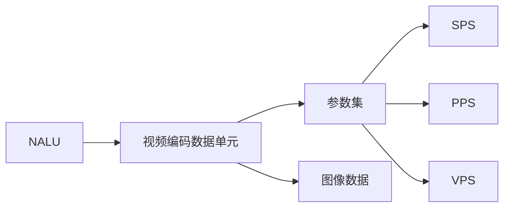
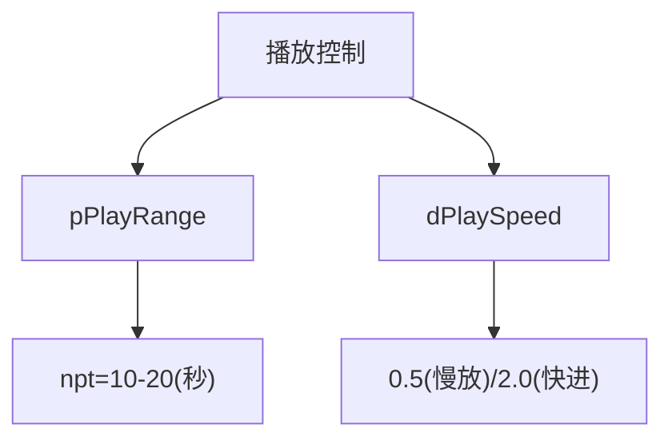
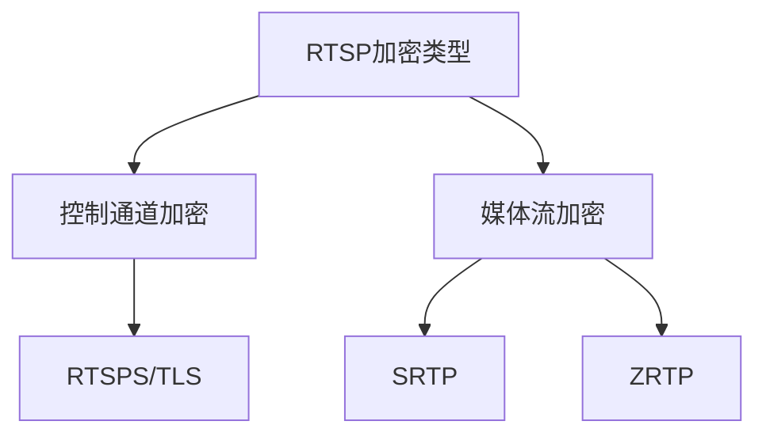

static INT32 priv_pack_get_video_ininfo(MUX_PROC_IN* pstMuxInInfo, PLUGIN_PACK_PROCESS_INFO_ST* stProcessInfo) { INT32 iRet = HIK_OK; if (HIK_IS_NULL(pstMuxInInfo) || HIK_IS_NULL(stProcessInfo)) { DSP_PACK_ERROR("One or more parameter Pointers are null!\n"); return DSP_ERR_PACK_NULL_PTR; } VID_STREAM_BUF_ST* pstStream = stProcessInfo->stStreamInfo.stVInfo.pstVStream; VID_CODEC_TYPE_E uCodecType = stProcessInfo->stStreamInfo.stVInfo.eVideoType; pstMuxInInfo->frameType = FRAME_TYPE_VIDEO_PFRAME; pstMuxInInfo->unitNum = 1; switch (uCodecType) { case VID_CODEC_H264: if (pstStream->uNaluNum >= H264_KEY_NALU_NUM) { pstMuxInInfo->unitNum = H264_KEY_NALU_NUM; pstMuxInInfo->frameType = FRAME_TYPE_VIDEO_IFRAME; //VID_STREAM_TYPE_H264_IFRAME; } break; case VID_CODEC_H265: { if(pstStream->uNaluNum >= H265_KEY_NALU_NUM) { pstMuxInInfo->unitNum = H265_KEY_NALU_NUM; pstMuxInInfo->frameType = FRAME_TYPE_VIDEO_IFRAME; } break; } case VID_CODEC_MJPEG: { /* MJPEG包只有1个unit */ if(pstStream->uNaluNum != MJPEG_KEY_NALU_NUM) { DSP_PACK_ERROR("mjpeg NaluNum %d err !!!\n", pstStream->uNaluNum); return HIK_FAIL; } pstMuxInInfo->unitNum = MJPEG_KEY_NALU_NUM; pstMuxInInfo->frameType = FRAME_TYPE_VIDEO_JFRAME; break; } default: { DSP_PACK_ERROR("error, unknow stream type 0x%x !!!\n", uCodecType); iRet = DSP_ERR_PACK_N_STREAM; break; } } if(pstMuxInInfo->frameType == FRAME_TYPE_VIDEO_IFRAME) { if(uCodecType == VID_CODEC_H265) { pstMuxInInfo->vpsBufferAddr = pstStream->stNalu[VID_NALU_TYPE_VPS].pNaluBuf; pstMuxInInfo->vpsLen = pstStream->stNalu[VID_NALU_TYPE_VPS].uNaluLen; } pstMuxInInfo->spsBufferAddr = pstStream->stNalu[VID_NALU_TYPE_SPS].pNaluBuf; pstMuxInInfo->spsLen = pstStream->stNalu[VID_NALU_TYPE_SPS].uNaluLen; pstMuxInInfo->ppsBufferAddr = pstStream->stNalu[VID_NALU_TYPE_PPS].pNaluBuf; pstMuxInInfo->ppsLen = pstStream->stNalu[VID_NALU_TYPE_PPS].uNaluLen; // dfx从下一个最近的I帧开始保存 if (g_aDfxSave[0][stProcessInfo->uChan] == 1) { g_aDfxSave[0][stProcessInfo->uChan] = 2; } } pstMuxInInfo->bufferAddr[0] = pstStream->stNalu[VID_NALU_TYPE_DATA].pNaluBuf; pstMuxInInfo->bufferLen[0] = pstStream->stNalu[VID_NALU_TYPE_DATA].uNaluLen; nalu，pps，sps是什么？封包需要注意射门

<think>
我们正在分析一个视频封包处理的函数，重点需要理解NALU、PPS、SPS的概念以及封包时的注意事项。
 函数名：priv_pack_get_video_ininfo
 功能：根据视频流信息（编码类型、NALU数量等）设置MUX输入信息（pstMuxInInfo）

 问题：
 1. 解释NALU、PPS、SPS是什么？
 2. 在封包过程中需要注意什么？

 首先，理解这些术语：

 1. NALU（Network Abstraction Layer Unit）：
    - 在H.264/H.265等视频编码标准中，编码后的视频数据被组织成NALU单元。每个NALU包含一个特定类型的数据，比如视频帧的一部分（如片，slice）或者参数集（如SPS、PPS）等。
    - NALU是网络传输的基本单元，每个NALU有一个头部，用于标识该单元的类型。

 2. SPS（Sequence Parameter Set）：
    - 序列参数集，包含应用于整个视频序列（一连串连续的图像帧）的参数，如图像大小、编码档次（profile）、级别（level）等。
    - 在H.264和H.265中，SPS是非常重要的，解码器在开始解码序列之前必须先收到SPS。

 3. PPS（Picture Parameter Set）：
    - 图像参数集，包含应用于一个或多个图像（帧）的参数，如熵编码模式、分片参数等。
    - PPS通常依赖于SPS，一个SPS可以被多个PPS引用。

 4. VPS（Video Parameter Set）：
    - 视频参数集，是H.265（HEVC）中引入的，包含多个序列共享的参数。在H.264中没有VPS。

 在封包过程中，对于关键帧（I帧）需要包含SPS和PPS（对于H.265还需要VPS），因为解码器需要这些参数集才能正确解码后续的帧。而对于非关键帧（P帧、B帧）则不需要。

 函数逻辑解析：
 1. 函数首先检查输入指针是否有效。
 2. 从stProcessInfo中获取视频流信息（pstVStream）和编码类型（uCodecType）。
 3. 默认设置帧类型为P帧（FRAME_TYPE_VIDEO_PFRAME），单元数量（unitNum）为1。
 4. 根据编码类型进行不同的处理：
    - H.264：如果NALU数量大于等于H264_KEY_NALU_NUM（关键帧所需的NALU数量，包括SPS、PPS和IDR帧数据），则设置unitNum为关键帧所需的NALU数量，并设置帧类型为I帧。
    - H.265：类似，如果NALU数量足够（包括VPS、SPS、PPS和关键帧数据），则设置为I帧，并设置相应的unitNum。
    - MJPEG：检查NALU数量是否为1（因为MJPEG每帧一个单元），设置帧类型为JFRAME（JPEG帧）。
 5. 如果当前帧是I帧，则进一步设置参数集（VPS、SPS、PPS）的地址和长度（注意：对于H.264，没有VPS；对于H.265，需要设置VPS）。
 6. 最后设置数据NALU（VID_NALU_TYPE_DATA）的地址和长度。

 封包注意事项：
 1. 关键帧（I帧）必须包含参数集（SPS、PPS，对于H.265还包括VPS）。这些参数集通常在关键帧之前传输，或者嵌入在关键帧数据中。在实时流媒体（如RTP）或文件封装（如MP4）时，需要确保参数集在需要时可用。
 2. 非关键帧不需要包含参数集，因为它们依赖于之前的关键帧。
 3. 在传输过程中，如果参数集发生变化（如分辨率改变），需要重新发送新的参数集，并在新的关键帧中引用。
 4. 对于MJPEG，每一帧都是独立压缩的，所以每一帧都是关键帧（这里称为JFRAME），并且只有一帧数据（没有参数集的概念）。

 此外，函数中还有一段关于DFX（诊断框架）的代码：当检测到需要保存诊断数据时，会在下一个I帧开始保存（通过设置状态为2）。

 总结：
 该函数的作用是根据视频编码类型和NALU信息，确定当前帧的类型（I帧、P帧或J帧）以及需要封装的单元数量，并设置相应的参数集（如果是I帧）和帧数据。
</think>
### 📹 NALU、SPS、PPS详解及视频封包注意事项

#### 🔍 **核心概念解析**


1. **NALU（网络抽象层单元）**  
   - **本质**：H.264/H.265视频流的基本传输单元
   - **结构**：`[起始码] + [NALU头] + [载荷数据]`
   - **类型**：
     - 参数集（SPS/PPS/VPS）
     - 图像数据（IDR帧、P帧等）
     - 辅助信息（SEI等）

2. **SPS（序列参数集）**  
   - **作用**：定义**整个视频序列**的全局参数
   - **包含信息**：
     - 分辨率、帧率
     - 编码档次（Baseline/Main/High）
     - GOP结构
     - 位深、色度格式
   - **特性**：极少变化，通常每个视频流仅1个SPS

3. **PPS（图像参数集）**  
   - **作用**：定义**单帧图像**的解码参数
   - **包含信息**：
     - 熵编码类型（CABAC/CAVLC）
     - 分片数量
     - 量化参数
   - **特性**：可能随场景变化（如动态调整编码质量）

4. **VPS（视频参数集）**  
   - **H.265特有**：定义多子层视频流的共享参数
   - **包含信息**：
     - 时间层依赖关系
     - 多视图/可分级编码配置

---

### ⚠️ **视频封包关键注意事项**
#### 1. **参数集传输**
```mermaid
sequenceDiagram
    participant 编码器
    participant 封包器
    participant 解码器
    编码器->>封包器： 发送SPS/PPS
    封包器->>解码器： 关键帧前必须附带参数集
    解码器->>解码器： 用SPS/PPS初始化解码环境
```
- **强制规则**：每个**关键帧（IDR帧）** 前必须传输SPS/PPS
- **原因**：解码器依赖这些参数初始化解码上下文
- **违规后果**：解码失败或花屏（参数集丢失时）

#### 2. **帧类型识别**
在您提供的代码中：
```c
switch (uCodecType) {
  case VID_CODEC_H264:
    if (pstStream->uNaluNum >= H264_KEY_NALU_NUM) {
      pstMuxInInfo->frameType = FRAME_TYPE_VIDEO_IFRAME; // 关键帧
    }
    break;
```
- **关键帧判定**：
  - H.264：需包含SPS+PPS+IDR帧（NALU数量≥3）
  - H.265：需包含VPS+SPS+PPS+IDR帧（NALU数量≥4）

#### 3. **数据关联性**
```c
// 关键帧必须绑定参数集
if(pstMuxInInfo->frameType == FRAME_TYPE_VIDEO_IFRAME) {
  pstMuxInInfo->spsBufferAddr = ... ; // 绑定SPS
  pstMuxInInfo->ppsBufferAddr = ... ; // 绑定PPS
  if(uCodecType == VID_CODEC_H265) {
    pstMuxInInfo->vpsBufferAddr = ... ; // H.265额外绑定VPS
  }
}
```
- **内存管理**：确保参数集内存在整个GOP周期有效
- **时序要求**：参数集必须在对应帧数据前传输

#### 4. **编码格式差异**
| 格式       | 关键帧NALU组成               | 参数集要求          |
|------------|-----------------------------|---------------------|
| H.264      | SPS + PPS + IDR Slice       | 无VPS              |
| H.265      | VPS + SPS + PPS + IDR Slice | 必须包含VPS        |
| MJPEG      | 单NALU                      | 无参数集           |

---

### ⚡ **工程实践要点**
1. **参数集缓存**  
   - 首次收到SPS/PPS时本地存储
   - 网络传输中断后重传关键帧需附带参数集

2. **错误处理**  
   ```c
   case VID_CODEC_MJPEG:
     if(pstStream->uNaluNum != MJPEG_KEY_NALU_NUM) {
       DSP_PACK_ERROR("mjpeg NaluNum %d err !!!\n", ...);
       return HIK_FAIL; // 严格校验单帧NALU数量
     }
   ```

3. **实时性优化**  
   - 参数集与帧数据打包在同一RTP包（减少抖动影响）
   - 使用`stNalu[VID_NALU_TYPE_*]`直接索引避免遍历

4. **解码兼容性**  
   - SPS的`profile_idc`需与解码器能力匹配
   - PPS的`pic_parameter_set_id`必须与SPS关联一致

> 💡 **总结**：视频封包本质是**参数集 + 帧数据的时空关联管理**。核心准则是：关键帧必须携带完整参数集，非关键帧可省略参数集以节省带宽。


<think>
我们有两个RTSP相关的JSON定义宏：一个是用于启动RTSP客户端会话的，另一个是用于创建RTSP服务器的。
 用户没有提出具体问题，但根据上下文，可能是希望解释这两个JSON结构的作用和字段含义。

 首先，我们来看第一个宏：RTSPC_START_SESSION_JSON（启动RTSP客户端会话的JSON）
 第二个宏：RTSPS_CREATE_SERVER_JSON（创建RTSP服务器的JSON）

 由于用户没有具体问题，我将分别解释这两个JSON结构。
</think>
### 📡 RTSP 客户端/服务端 JSON 配置详解

#### 🌐 **RTSP 客户端启动配置 (RTSPC_START_SESSION_JSON)**
```json
{
  "HeadInfo": {
    "version": "V1.0.0",
    "operation": "set",
    "domainType": "RtspClient",
    "cmdType": "startSession"
  },
  "BodyInfo": {
    "RtspClientPrm": [{
      "chan": %d,
      "connectPrm": {
        "pHost": "%s",        // 服务器地址(如"192.168.1.100")
        "pPath": "%s",        // 媒体路径(如"/live/stream1")
        "wPort": %hu,         // 端口号(默认554)
        "pUser": "%s",        // 用户名
        "pPwd": "%s",         // 密码
        "iTransMode": %d,     // 传输模式(0=TCP,1=UDP,2=HTTP)
        "iHeartBeatType": %d, // 心跳类型(0=OPTIONS,1=GET_PARAMETER)
        "bAutoReconnect": %u, // 自动重连(0=禁用,1=启用)
        "pInterfaceName": "%s", // 网络接口(如"eth0")
        "pPlayRange": "%s",   // 播放范围(如"0-")
        "dPlaySpeed": %lf,    // 播放速度(1.0=正常)
        "iEncryptionType": %d,// 加密类型(0=None,1=SRTP)
        "pTokenInfo": "%s",   // 认证令牌
        "pMcastAddr": "%s",   // 组播地址(如"239.0.0.1")
        "iSslVersion": %d,    // SSL版本(0=关闭,1=TLS1.2)
        "pSignedCrt": "%s",   // CA证书路径
        "pGenCrt": "%s",      // 生成的证书路径
        "pClientCrt": "%s",   // 客户端证书
        "pClientKey": "%s",   // 客户端密钥
        "iSrtpCipherType": %d,// SRTP加密算法(0=AES_128_ICM)
        "iSrtpAuthType": %d,  // SRTP认证算法(0=HMAC_SHA1)
        "iHttpVersion": %d    // HTTP版本(0=1.0,1=1.1)
      }
    }]
  }
}
```

#### 🖥️ **RTSP 服务端创建配置 (RTSPS_CREATE_SERVER_JSON)**
```json
{
  "HeadInfo": {
    "version": "V1.0.0",
    "operation": "set",
    "domainType": "RtspServer",
    "cmdType": "createServer"
  },
  "BodyInfo": {
    "RtspServerPrm": [{
      "chan": %d  // 通道号(绑定媒体源)
    }]
  }
}
```

---

### ⚙️ **关键参数解析**
#### 🔐 安全相关参数
| 参数 | 作用 | 典型值 |
|------|------|--------|
| `iEncryptionType` | 传输层加密 | 0=明文, 1=SRTP |
| `iSslVersion` | TLS加密 | 0=关闭, 1=TLS1.2 |
| `pSignedCrt` | CA证书 | `/etc/certs/ca.crt` |
| `pClientCrt` | 客户端证书 | `/etc/certs/client.pem` |
| `iSrtpCipherType` | SRTP加密算法 | 0=AES-128 |

#### 📶 网络参数
| 参数 | 作用 | 示例 |
|------|------|------|
| `iTransMode` | 传输协议 | 0=TCP(可靠), 1=UDP(低延迟) |
| `pMcastAddr` | 组播地址 | "239.255.0.1" |
| `pInterfaceName` | 绑定网卡 | "eth0" |
| `iHeartBeatType` | 保活机制 | 0=OPTIONS(默认), 1=GET_PARAMETER |

#### 🎥 媒体控制参数


---

### 💡 **工程实践建议**
1. **安全配置**
   ```c
   "iEncryptionType": 1,
   "iSslVersion": 1,
   "pClientCrt": "/opt/certs/client.pem",
   "pClientKey": "/opt/certs/key.pem"
   ```
   - SRTP + TLS 组合使用实现端到端加密

2. **网络优化**
   ```c
   "iTransMode": 0,       // 首选TCP
   "bAutoReconnect": 1,   // 启用自动重连
   "iHeartBeatType": 0    // 每30秒OPTIONS保活
   ```

3. **特殊场景**
   - **组播分发**：`"pMcastAddr": "239.255.0.1"`
   - **慢动作回放**：`"dPlaySpeed": 0.25`
   - **定点播放**：`"pPlayRange": "npt=15-30"`

> ⚠️ **注意**：服务端创建只需指定通道号，实际媒体参数应在媒体源配置中定义，客户端配置需与服务端能力匹配（如加密方式/传输协议）。


rtsp的加密类型

<think>
我们正在讨论RTSP的加密类型。根据之前提供的代码片段，在RTSP客户端的JSON配置中有一个字段`iEncryptionType`，它用于指定加密类型。同时，在安全相关参数部分，我们还看到有`iSslVersion`、`iSrtpCipherType`等字段，这些都与加密相关。

在RTSP中，加密可以发生在两个层面：
1. 控制层面（RTSP协议本身）：通常使用SSL/TLS来加密RTSP的控制命令（即使用RTSPS，在TCP端口554上默认使用TLS加密）。
2. 媒体传输层面：对RTP/RTCP媒体流的加密，常见的是使用SRTP（Secure Real-time Transport Protocol）。

因此，在配置中：
- `iEncryptionType`：可能用于指定媒体流的加密，比如不加密、SRTP加密等。
- `iSslVersion`：用于控制层面的加密，如TLS版本。

从代码中提取的字段及其注释：
```c
"iEncryptionType": %d,   // 加密类型(0=None,1=SRTP)
"iSslVersion": %d,       // SSL版本(0=关闭,1=TLS1.2)
"iSrtpCipherType": %d,   // SRTP加密算法(0=AES_128_ICM)
"iSrtpAuthType": %d      // SRTP认证算法(0=HMAC_SHA1)
```

所以，我们可以总结如下：

### RTSP加密类型（控制层面和媒体层面）

#### 1. 控制层面加密（RTSP over TLS，即RTSPS）
- 通过`iSslVersion`字段配置：
  - 0：关闭SSL/TLS（即使用普通的RTSP）
  - 1：启用TLS（如TLS1.2）

#### 2. 媒体层面加密（SRTP）
- 通过`iEncryptionType`字段配置媒体流的加密：
  - 0：不加密
  - 1：使用SRTP加密

当启用SRTP加密时，还可以配置具体的加密算法和认证算法：
- `iSrtpCipherType`：SRTP加密算法
  - 0：AES_128_ICM（AES-128 in Counter Mode）
  - 其他值（如果有）：根据实际定义可能是其他算法
- `iSrtpAuthType`：SRTP认证算法
  - 0：HMAC_SHA1

### 实际应用中的配置示例

#### 场景1：完全明文
```json
"iEncryptionType": 0,   // 媒体流不加密
"iSslVersion": 0        // RTSP控制命令不加密
```

#### 场景2：仅加密控制命令（RTSPS）
```json
"iEncryptionType": 0,   // 媒体流不加密
"iSslVersion": 1        // RTSP控制命令使用TLS1.2加密
```

#### 场景3：同时加密控制命令和媒体流
```json
"iEncryptionType": 1,   // 媒体流使用SRTP
"iSslVersion": 1,       // RTSP控制命令使用TLS1.2
"iSrtpCipherType": 0,   // SRTP使用AES_128_ICM
"iSrtpAuthType": 0      // SRTP使用HMAC_SHA1认证
```

### 注意事项
- 当使用SRTP时，通常需要在RTSP的SETUP阶段通过`Transport`头协商加密参数（如密钥）。密钥交换可以通过SDES（Session Description Security Descriptions）或DTLS-SRTP（Datagram Transport Layer Security）等方式。在配置中，我们并没有直接看到密钥的配置，可能是在其他地方（如证书文件）或通过其他机制（如`pTokenInfo`）传递。
- 在配置中，我们看到了证书相关的字段（`pSignedCrt`、`pGenCrt`、`pClientCrt`、`pClientKey`），这些用于TLS连接时的身份验证和密钥交换。

总结：RTSP的加密类型包括控制层面的TLS加密和媒体层面的SRTP加密，两者可以独立配置。
</think>
在RTSP协议中，加密主要通过两种方式实现，以下是完整的加密类型和技术细节：

### 🔐 RTSP加密类型全景图



#### 1. **控制通道加密 (RTSPS)**
通过TLS/SSL加密RTSP协议控制命令：
- **端口**：默认322（RTSPS）或554（STARTTLS方式）
- **配置参数**：
  ```c
  "iSslVersion": %d,      // 0=关闭, 1=TLS1.2, 2=TLS1.3
  "pClientCrt": "%s",     // 客户端证书路径
  "pClientKey": "%s"      // 私钥路径
  ```
- **握手过程**：
  1. TCP三次握手
  2. TLS握手（证书交换）
  3. RTSP信令加密传输

#### 2. **媒体流加密**
##### (1) SRTP (Secure RTP)
- **配置参数**：
  ```c
  "iEncryptionType": 1,             // 启用SRTP
  "iSrtpCipherType": %d,            // 0=AES_128_ICM, 1=AES_256_ICM
  "iSrtpAuthType": %d               // 0=HMAC_SHA1, 1=HMAC_SHA256
  ```
- **密钥交换方式**：
  - SDES (Session Description Security)
  - DTLS-SRTP (更安全)
  - ZRTP (点对点)

##### (2) ZRTP
- 端到端加密媒体流
- 不依赖PKI基础设施
- 通过SDP交换ZRTP Hello消息

### ⚙️ 加密配置对照表
| 加密类型 | 协议层 | 加密对象 | 配置字段 | 典型值 |
|----------|--------|----------|----------|--------|
| RTSPS | 应用层 | 控制命令 | `iSslVersion` | 1 (TLS1.2) |
| SRTP | 传输层 | 媒体流 | `iEncryptionType` | 1 (启用) |
| AES-128 | 媒体层 | RTP载荷 | `iSrtpCipherType` | 0 |
| HMAC-SHA1 | 媒体层 | 完整性校验 | `iSrtpAuthType` | 0 |

### 🔒 安全等级建议


1. **基础安全**：
   ```json
   "iSslVersion": 1,
   "iEncryptionType": 0
   ```
   （仅加密控制通道）

2. **企业级安全**：
   ```json
   "iSslVersion": 1,
   "iEncryptionType": 1,
   "iSrtpCipherType": 0,
   "iSrtpAuthType": 0
   ```

3. **军事级安全**：
   ```json
   "iSslVersion": 2,              // TLS1.3
   "iEncryptionType": 1,
   "iSrtpCipherType": 1,          // AES-256
   "iSrtpAuthType": 1,            // SHA-256
   "pSignedCrt": "军用CA证书路径"  // 使用专用CA
   ```

###


我看只有这个加密 typedef enum { RTSPC_ENCRYPTION_TYPE_INT_IDLE = 0, RTSPC_ENCRYPTION_TYPE_INT_SSL = (1<<0), RTSPC_ENCRYPTION_TYPE_INT_SRTP = (1<<1), RTSPC_ENCRYPTION_TYPE_INT_INVALID }RTSPC_ENCRYPTION_TYPE_INT;

<think>
我需要分析用户提供的代码片段，解释这些参数的含义以及它们之间的区别。

首先，我看到用户提供了三组枚举类型的定义：

1. `RTSPC_SRTP_CIPHER_TYPE_INT_*` - 与SRTP加密相关的类型
2. `RTSPC_METHOD_TYPE_INT_*` - 与RTSP方法相关的类型
3. `RTSPC_CTRL_TYPE_INT_*` - 与RTSP控制相关的类型

让我逐一分析：

### 1. RTSPC_SRTP_CIPHER_TYPE_INT_* (SRTP加密类型)

```
RTSPC_SRTP_CIPHER_TYPE_INT_IDLE         = 0,
RTSPC_SRTP_CIPHER_TYPE_INT_AES_128_ICM  = 1,
RTSPC_SRTP_CIPHER_TYPE_INT_AES_256_ICM  = 2,
RTSPC_SRTP_CIPHER_TYPE_INT_INVALID      = 3
```

这是与SRTP（Secure Real-time Transport Protocol，安全实时传输协议）加密相关的枚举类型。SRTP是RTP（Real-time Transport Protocol）的安全版本，用于加密实时媒体流。

- `RTSPC_SRTP_CIPHER_TYPE_INT_IDLE = 0`: 空闲状态，表示没有使用加密
- `RTSPC_SRTP_CIPHER_TYPE_INT_AES_128_ICM = 1`: 使用AES-128加密算法，ICM（Integer Counter Mode）模式
- `RTSPC_SRTP_CIPHER_TYPE_INT_AES_256_ICM = 2`: 使用AES-256加密算法，ICM模式
- `RTSPC_SRTP_CIPHER_TYPE_INT_INVALID = 3`: 无效的加密类型

是的，这确实是与加密相关的参数。SRTP用于保护RTP媒体流的安全，防止窃听和篡改。

### 2. RTSPC_METHOD_TYPE_INT_* (RTSP方法类型)

```
RTSPC_METHOD_TYPE_INT_IDLE          = 0,
RTSPC_METHOD_TYPE_INT_DESCRIBE      = 1,
RTSPC_METHOD_TYPE_INT_SETUP         = 2,
RTSPC_METHOD_TYPE_INT_PLAY          = 3,
RTSPC_METHOD_TYPE_INT_PAUSE         = 4,
RTSPC_METHOD_TYPE_INT_TEARDOWN      = 5,
RTSPC_METHOD_TYPE_INT_OPTIONS       = 6,
RTSPC_METHOD_TYPE_INT_HEART_BEAT    = 7,
RTSPC_METHOD_TYPE_INT_KEY_IFRAME    = 8,
RTSPC_METHOD_TYPE_INT_SET_PARAMETER = 9,
RTSPC_METHOD_TYPE_INT_GET_PARAMETER = 10,
RTSPC_METHOD_TYPE_INT_INVALID       = 11
```

这是RTSP（Real Time Streaming Protocol，实时流协议）方法类型的枚举。RTSP是一种网络控制协议，用于控制实时媒体服务器上的流媒体会话。

- `RTSPC_METHOD_TYPE_INT_IDLE = 0`: 空闲状态
- `RTSPC_METHOD_TYPE_INT_DESCRIBE = 1`: 请求媒体描述信息
- `RTSPC_METHOD_TYPE_INT_SETUP = 2`: 建立会话
- `RTSPC_METHOD_TYPE_INT_PLAY = 3`: 开始播放
- `RTSPC_METHOD_TYPE_INT_PAUSE = 4`: 暂停播放
- `RTSPC_METHOD_TYPE_INT_TEARDOWN = 5`: 结束会话
- `RTSPC_METHOD_TYPE_INT_OPTIONS = 6`: 查询服务器支持的方法
- `RTSPC_METHOD_TYPE_INT_HEART_BEAT = 7`: 心跳检测
- `RTSPC_METHOD_TYPE_INT_KEY_IFRAME = 8`: 请求关键帧（I帧）
- `RTSPC_METHOD_TYPE_INT_SET_PARAMETER = 9`: 设置参数
- `RTSPC_METHOD_TYPE_INT_GET_PARAMETER = 10`: 获取参数
- `RTSPC_METHOD_TYPE_INT_INVALID = 11`: 无效方法

这些是RTSP协议中定义的标准方法，用于控制媒体流的传输。

### 3. RTSPC_CTRL_TYPE_INT_* (RTSP控制类型)

```
RTSPC_CTRL_TYPE_INT_IDLE            = 0,
RTSPC_CTRL_TYPE_INT_AUTO_RECONNECT  = 1,
RTSPC_CTRL_TYPE_INT_STAT_RECONNECT  = 2,
RTSPC_CTRL_TYPE_INT_PLAY_RANGE      = 3,
RTSPC_CTRL_TYPE_INT_PLAY_SPEED      = 4,
RTSPC_CTRL_TYPE_INT_PLAY_PAUSE      = 5,
RTSPC_CTRL_TYPE_INT_TOKEN_INFO      = 6,
RTSPC_CTRL_TYPE_INT_MEDIA_INFO      = 7,
RTSPC_CTRL_TYPE_INT_INVALID         = 8
```

这是与RTSP控制相关的枚举类型，看起来是扩展的控制功能，不一定是标准RTSP协议的一部分。

- `RTSPC_CTRL_TYPE_INT_IDLE = 0`: 空闲状态
- `RTSPC_CTRL_TYPE_INT_AUTO_RECONNECT = 1`: 自动重连
- `RTSPC_CTRL_TYPE_INT_STAT_RECONNECT = 2`: 统计重连
- `RTSPC_CTRL_TYPE_INT_PLAY_RANGE = 3`: 播放范围控制
- `RTSPC_CTRL_TYPE_INT_PLAY_SPEED = 4`: 播放速度控制
- `RTSPC_CTRL_TYPE_INT_PLAY_PAUSE = 5`: 播放/暂停控制
- `RTSPC_CTRL_TYPE_INT_TOKEN_INFO = 6`: 令牌信息
- `RTSPC_CTRL_TYPE_INT_MEDIA_INFO = 7`: 媒体信息
- `RTSPC_CTRL_TYPE_INT_INVALID = 8`: 无效控制类型

### 区别

这三组参数的区别：

1. **RTSPC_SRTP_CIPHER_TYPE_INT_***: 专门用于指定SRTP加密的类型，关注的是媒体流的安全性。
2. **RTSPC_METHOD_TYPE_INT_***: 用于表示RTSP协议中的标准方法，是控制媒体会话的基本操作。
3. **RTSPC_CTRL_TYPE_INT_***: 似乎是特定实现中扩展的控制类型，用于更细粒度的控制或特定功能。

简单来说：
- SRTP_CIPHER_TYPE 是关于**加密**的
- METHOD_TYPE 是关于**RTSP协议方法**的
- CTRL_TYPE 是关于**额外控制功能**的

METHOD_TYPE 是标准RTSP协议定义的，而CTRL_TYPE 可能是特定实现（如某个SDK或库）中扩展的功能。SRTP_CIPHER_TYPE 则是与安全传输相关的。

我需要以简体中文回答用户的问题，解释这些参数的含义和区别。
</think>

# 参数解析：RTSP相关枚举类型说明

## 1. RTSPC_SRTP_CIPHER_TYPE_INT_*（SRTP加密类型）

```
RTSPC_SRTP_CIPHER_TYPE_INT_IDLE         = 0,
RTSPC_SRTP_CIPHER_TYPE_INT_AES_128_ICM  = 1,
RTSPC_SRTP_CIPHER_TYPE_INT_AES_256_ICM  = 2,
RTSPC_SRTP_CIPHER_TYPE_INT_INVALID      = 3
```

**这是加密相关的参数**，用于指定SRTP（Secure Real-time Transport Protocol，安全实时传输协议）的加密算法类型：

- `IDLE(0)`：空闲状态，表示未启用加密
- `AES_128_ICM(1)`：使用AES-128加密算法，ICM（整数计数器模式）工作模式
- `AES_256_ICM(2)`：使用AES-256加密算法，更高级别的安全性
- `INVALID(3)`：无效的加密类型

SRTP是RTP的安全版本，用于保护实时音视频流不被窃听或篡改。

## 2. RTSPC_METHOD_TYPE_INT_*（RTSP方法类型）

```
RTSPC_METHOD_TYPE_INT_IDLE          = 0,
RTSPC_METHOD_TYPE_INT_DESCRIBE      = 1,
RTSPC_METHOD_TYPE_INT_SETUP         = 2,
RTSPC_METHOD_TYPE_INT_PLAY          = 3,
RTSPC_METHOD_TYPE_INT_PAUSE         = 4,
RTSPC_METHOD_TYPE_INT_TEARDOWN      = 5,
RTSPC_METHOD_TYPE_INT_OPTIONS       = 6,
RTSPC_METHOD_TYPE_INT_HEART_BEAT    = 7,
RTSPC_METHOD_TYPE_INT_KEY_IFRAME    = 8,
RTSPC_METHOD_TYPE_INT_SET_PARAMETER = 9,
RTSPC_METHOD_TYPE_INT_GET_PARAMETER = 10,
RTSPC_METHOD_TYPE_INT_INVALID       = 11
```

这些是**标准RTSP协议方法**的枚举，代表RTSP客户端向服务器发送的不同控制命令：

- `DESCRIBE(1)`：请求媒体描述信息
- `SETUP(2)`：建立媒体会话
- `PLAY(3)`：开始播放媒体流
- `PAUSE(4)`：暂停播放
- `TEARDOWN(5)`：结束会话
- `OPTIONS(6)`：查询服务器支持的方法
- `HEART_BEAT(7)`：心跳检测保持连接
- `KEY_IFRAME(8)`：请求关键帧(I帧)
- `SET/GET_PARAMETER(9-10)`：设置/获取参数

## 3. RTSPC_CTRL_TYPE_INT_*（RTSP控制类型）

```
RTSPC_CTRL_TYPE_INT_IDLE            = 0,
RTSPC_CTRL_TYPE_INT_AUTO_RECONNECT  = 1,
RTSPC_CTRL_TYPE_INT_STAT_RECONNECT  = 2,
RTSPC_CTRL_TYPE_INT_PLAY_RANGE      = 3,
RTSPC_CTRL_TYPE_INT_PLAY_SPEED      = 4,
RTSPC_CTRL_TYPE_INT_PLAY_PAUSE      = 5,
RTSPC_CTRL_TYPE_INT_TOKEN_INFO      = 6,
RTSPC_CTRL_TYPE_INT_MEDIA_INFO      = 7,
RTSPC_CTRL_TYPE_INT_INVALID         = 8
```

这些是**扩展的控制功能**，通常不是标准RTSP协议的一部分，而是特定实现中添加的额外控制功能：

- `AUTO_RECONNECT(1)`：自动重连功能
- `STAT_RECONNECT(2)`：统计重连信息
- `PLAY_RANGE(3)`：控制播放范围（如点播中的时间范围）
- `PLAY_SPEED(4)`：控制播放速度（快进、慢放等）
- `PLAY_PAUSE(5)`：播放/暂停控制
- `TOKEN_INFO(6)`：与认证令牌相关的信息
- `MEDIA_INFO(7)`：获取媒体详细信息

## 三者的区别

1. **SRTP_CIPHER_TYPE**：专注于**媒体流加密安全**，决定使用何种加密算法保护传输内容
   
2. **METHOD_TYPE**：代表**标准RTSP协议方法**，是RTSP协议定义的基本控制命令，用于建立和控制媒体会话
   
3. **CTRL_TYPE**：代表**扩展控制功能**，通常是特定实现中添加的高级控制选项，提供比标准RTSP方法更细粒度的控制

简单来说：
- SRTP_CIPHER_TYPE 关注"**如何安全传输**"
- METHOD_TYPE 关注"**标准会话控制**"
- CTRL_TYPE 关注"**扩展功能控制**"

这些参数通常在RTSP客户端实现中使用，用于配置和控制实时视频流的传输行为。


<think>
首先，用户在询问关于RTSPC_CTRL_TYPE_INT_*（RTSP控制类型）与TRSP动作之间的关联和区别。用户提到了"trsp的动作"，但TRSP可能是个拼写错误或缩写。在上下文中，RTSP是Real-Time Streaming Protocol（实时流协议），而TRSP可能是指RTSP，或者是另一个协议。

回顾之前的对话：
- 用户之前提供了RTSP相关的枚举类型，包括RTSPC_SRTP_CIPHER_TYPE_INT_*、RTSPC_METHOD_TYPE_INT_*和RTSPC_CTRL_TYPE_INT_*。
- Assistant解释了这些是RTSP客户端实现中的枚举类型。

用户现在说："和trsp的动作有什么关联和区别？" 这里的"trsp"很可能是个打字错误，应该是"RTSP"，因为RTSP是标准协议，而TRSP不是常见术语。可能用户是想说"RTSP的动作"。

在之前的上下文中：
- RTSPC_METHOD_TYPE_INT_* 对应RTSP的标准方法（如DESCRIBE, SETUP, PLAY等），这些是RTSP协议中的动作（methods）。
- RTSPC_CTRL_TYPE_INT_* 是扩展的控制类型，不是标准RTSP方法，而是特定实现的额外功能。

所以，用户可能是在问：RTSPC_CTRL_TYPE_INT_*（控制类型）与RTSP的标准动作（methods）有什么关联和区别。

具体来说：
- RTSP的标准动作（methods）在RTSPC_METHOD_TYPE_INT_*中定义，如PLAY, PAUSE等。
- RTSPC_CTRL_TYPE_INT_* 是另一种控制机制，可能用于更细粒度的控制或扩展功能。

关联和区别：
- **关联**：两者都用于控制RTSP会话，但RTSPC_METHOD_TYPE_INT_* 对应标准RTSP请求方法，而RTSPC_CTRL_TYPE_INT_* 可能是在客户端内部或特定实现中使用的控制命令，可能映射到标准RTSP方法或扩展功能。
- **区别**：
  - RTSP_METHOD_TYPE：直接对应RTSP协议的方法，如发送PLAY请求来开始播放。
  - RTSP_CTRL_TYPE：可能用于客户端内部状态管理或额外功能，例如AUTO_RECONNECT可能是在连接丢失时自动重试，这不是标准RTSP方法，而是客户端行为。

在之前的Assistant回复中，已经解释了：
- RTSPC_METHOD_TYPE_INT_* 是标准RTSP方法。
- RTSPC_CTRL_TYPE_INT_* 是扩展控制功能，如自动重连、播放范围控制等。

用户特别问"和trsp的动作"，假设"trsp"是"RTSP"的笔误，那么"RTSP的动作"应该指的是RTSP_METHOD_TYPE。

因此，我需要澄清：
- RTSP的标准动作（methods）由RTSPC_METHOD_TYPE_INT_*表示。
- RTSPC_CTRL_TYPE_INT_* 是补充的控制类型，可能用于触发内部操作或扩展，但不直接对应标准RTSP方法。

例如：
- 当客户端想播放视频时，它会发送一个RTSP PLAY方法（对应RTSPC_METHOD_TYPE_INT_PLAY）。
- 但是，RTSPC_CTRL_TYPE_INT_PLAY_PAUSE 可能用于在客户端内部切换播放/暂停状态，而不需要每次都发送RTSP PAUSE请求；或者它可能触发发送PAUSE请求。

在实现中，RTSP_CTRL_TYPE 可能用于：
- 客户端内部事件处理。
- 封装多个RTSP方法的组合操作。
- 提供更高级的API给应用程序。

关键点：
- **标准RTSP动作**：通过RTSP请求/响应进行，如OPTIONS, DESCRIBE, SETUP, PLAY等。
- **RTSP_CTRL_TYPE**：可能是在客户端库中定义的控制命令，用于管理会话，但不一定直接映射到单个RTSP方法。例如，AUTO_RECONNECT 可能涉及在连接断开时自动重新发送SETUP和PLAY等。

在之前的解释中：
- RTSPC_CTRL_TYPE_INT_AUTO_RECONNECT：自动重连功能，可能在连接丢失时尝试重新建立会话。
- RTSPC_CTRL_TYPE_INT_PLAY_RANGE：控制播放范围，可能用于点播，发送带有范围参数的PLAY请求。

所以，关联是：RTSP_CTRL_TYPE 可能用于触发或管理标准RTSP动作的执行。
区别是：RTSP_METHOD_TYPE 是协议级别的方法，而RTSP_CTRL_TYPE 是实现级别的控制抽象。

用户说"trsp的动作"，但TRSP可能不存在；在上下文中，应该是RTSP。我将假设是RTSP。

结构化回答：
1. 澄清"trsp"可能是个错误，应为"RTSP"。
2. 解释RTSP的标准动作（即RTSP_METHOD_TYPE）。
3. 说明RTSP_CTRL_TYPE 与这些动作的关联。
4. 突出区别。

参考之前的对话：
- Assistant 之前提到：RTSPC_METHOD_TYPE_INT_* 是标准RTSP方法。
- RTSPC_CTRL_TYPE_INT_* 是扩展控制功能。

因此，对于这个查询：
- RTSP的动作：指RTSP_METHOD_TYPE，如PLAY, PAUSE。
- RTSP_CTRL_TYPE 是更细粒度的控制，可能用于实现这些动作或额外功能。

例如：
- RTSPC_METHOD_TYPE_INT_PLAY 是发送PLAY请求。
- RTSPC_CTRL_TYPE_INT_PLAY_PAUSE 可能是一个切换命令，当调用时，如果当前是播放，则发送PAUSE；如果是暂停，则发送PLAY。

类似地：
- RTSPC_CTRL_TYPE_INT_PLAY_RANGE 可能用于设置播放范围，然后触发一个PLAY请求。

所以，关联：RTSP_CTRL_TYPE 可以用于封装和触发RTSP_METHOD_TYPE 的执行。
区别：RTSP_METHOD_TYPE 是协议原语，而RTSP_CTRL_TYPE 是客户端API的抽象。

在代码中：
- 应用程序可能调用 rtsp_client_play() 来发送PLAY。
- 但 rtsp_client_set_play_range() 可能使用CTRL_TYPE来设置范围，然后内部发送适当的RTSP请求。

回答应该：
- 用简体中文。
- 清晰解释关联和区别。
- 基于之前的上下文。
</think>

# RTSPC_CTRL_TYPE_INT_* 与 RTSP 标准动作的关联与区别

您提到的 "trsp" 可能是 **RTSP（Real-Time Streaming Protocol）** 的拼写笔误（常见于快速输入）。在实时流媒体领域，**RTSP 是标准协议**，而 "TRSP" 并非规范术语。以下我将基于 **RTSP 标准动作**（即您之前提到的 `RTSPC_METHOD_TYPE_INT_*` 枚举）与 `RTSPC_CTRL_TYPE_INT_*`（控制类型）进行对比分析。

---

## 一、核心概念澄清
| **类型** | **对应枚举** | **本质** | **作用层级** |
|----------|--------------|----------|--------------|
| **RTSP 标准动作** | `RTSPC_METHOD_TYPE_INT_*`<br>(如 `PLAY=3`, `PAUSE=4`) | **协议级方法**<br>(Protocol Methods) | 网络层：直接映射到 RTSP 协议的请求命令<br>（例如发送 `PLAY` 请求包） |
| **RTSP 扩展控制** | `RTSPC_CTRL_TYPE_INT_*`<br>(如 `PLAY_PAUSE=5`, `PLAY_RANGE=3`) | **实现级控制**<br>(Implementation Controls) | 应用层：客户端内部逻辑封装<br>（可能触发或组合多个 RTSP 动作） |

> ✅ **关键结论**：<br>
> - **RTSP 标准动作** = RTSP 协议定义的 **基础通信指令**（如 `PLAY`/`PAUSE`）<br>
> - **RTSP 扩展控制** = **客户端库/SDK 的高级抽象**，用于简化开发或实现协议未覆盖的功能

---

## 二、关联性：如何协同工作？
`RTSPC_CTRL_TYPE_INT_*` 通常 **封装并驱动** `RTSPC_METHOD_TYPE_INT_*` 的执行，二者是 **"控制指令" 与 "底层协议动作"** 的关系：

### 典型工作流程示例
| **用户操作** | **触发的 RTSP_CTRL_TYPE** | **内部执行的 RTSP_METHOD_TYPE** | **说明** |
|--------------|---------------------------|-------------------------------|----------|
| 点击"暂停播放"按钮 | `RTSPC_CTRL_TYPE_INT_PLAY_PAUSE` | `RTSPC_METHOD_TYPE_INT_PAUSE` | 控制类型封装了暂停逻辑，最终发送标准 `PAUSE` 请求 |
| 设置播放时间范围（如点播） | `RTSPC_CTRL_TYPE_INT_PLAY_RANGE` | `RTSPC_METHOD_TYPE_INT_PLAY` + **携带 `Range` 参数** | 控制类型生成带时间范围的 `PLAY` 请求 |
| 网络断开后自动重连 | `RTSPC_CTRL_TYPE_INT_AUTO_RECONNECT` | `RTSPC_METHOD_TYPE_INT_SETUP` → `RTSPC_METHOD_TYPE_INT_PLAY` | 控制类型自动重试 **多个标准动作**（先重建会话再恢复播放） |
| 请求关键帧（I帧） | `RTSPC_CTRL_TYPE_INT_KEY_IFRAME` | `RTSPC_METHOD_TYPE_INT_GET_PARAMETER` + **自定义参数** | 控制类型映射到扩展协议方法 |

> 💡 **本质关联**：<br>
> - `RTSP_CTRL_TYPE` 是 **客户端 SDK 的 API 接口**（供开发者调用）<br>
> - `RTSP_METHOD_TYPE` 是 **实际发送到服务器的 RTSP 命令**<br>
> - **例如**：调用 `rtsp_client_set_play_range(start=10s, end=20s)`（使用 `PLAY_RANGE` 控制类型）<br>
>   → 内部自动生成 `PLAY` 请求（`METHOD_TYPE=PLAY`）并添加 `Range: npt=10-20` 头部

---

## 三、关键区别：为什么需要两套机制？
| **维度** | **RTSP 标准动作 (`METHOD_TYPE`)** | **RTSP 扩展控制 (`CTRL_TYPE`)** |
|----------|----------------------------------|--------------------------------|
| **协议规范性** | ✅ 严格遵循 [RFC 2326](https://tools.ietf.org/html/rfc2326)<br>（标准 RTSP 方法） | ❌ **非标准扩展**<br>（厂商/SDK 自定义实现） |
| **粒度** | 粗粒度：基础操作（如 `PLAY`/`PAUSE`） | 细粒度：高级操作（如 `PLAY_RANGE` 指定时间范围） |
| **网络交互** | **直接产生网络请求**<br>（每个方法对应一个 RTSP 包） | **可能无网络请求**<br>（如 `AUTO_RECONNECT` 是客户端内部状态机） |
| **错误处理** | 依赖 RTSP 响应码（如 `404 Not Found`） | 封装重试/回退逻辑（如断网时自动重试 `SETUP`） |
| **典型场景** | 基础流控制：建立会话、开始/停止播放 | 高级需求：断网恢复、变速播放、令牌认证 |

### 重点区别案例
#### 场景：实现"断网自动重连"
- **`RTSP_METHOD_TYPE` 的局限**：<br>
  标准 RTSP 没有 `RECONNECT` 方法，断网后需手动重发 `SETUP`→`PLAY`。
- **`RTSP_CTRL_TYPE` 的解决方案**：<br>
  ```c
  // 开发者只需调用
  rtsp_client_set_control(RTSPC_CTRL_TYPE_INT_AUTO_RECONNECT, 1); 
  
  // 客户端内部自动执行：
  // 1. 检测网络断开 → 2. 重试 SETUP → 3. 重试 PLAY → 4. 恢复播放状态
  ```
  → **无需开发者处理重连细节**，而标准动作需自行实现重试逻辑。

#### 场景：控制播放速度（如 2x 快进）
- **`RTSP_METHOD_TYPE` 无直接支持**：<br>
  RTSP 标准协议 **不支持变速播放**（`PLAY` 方法仅支持开始/暂停）。
- **`RTSP_CTRL_TYPE` 的扩展**：<br>
  `RTSPC_CTRL_TYPE_INT_PLAY_SPEED` 通过 **客户端解码器控制** 实现：<br>
  - 仍发送标准 `PLAY` 请求获取流数据<br>
  - 但客户端丢弃部分帧/调整解码速度 → **逻辑上实现"快进"**

---

## 四、为什么需要 `RTSP_CTRL_TYPE`？
RTSP 协议设计于 1998 年，**无法覆盖现代流媒体需求**。扩展控制类型解决了：
1. **协议缺陷**<br>
   （如无原生重连机制 → 用 `AUTO_RECONNECT` 补足）
2. **业务增强**<br>
   （如 `TOKEN_INFO` 支持动态鉴权，标准 RTSP 仅支持基础认证）
3. **开发效率**<br>
   （用 `PLAY_RANGE` 一行代码替代手动构造带 `Range` 头的 `PLAY` 请求）

> ⚠️ **注意**：<br>
> - 这些扩展 **非跨平台通用**（不同厂商 SDK 实现可能不同）<br>
> - 服务端需配合支持（如 `TOKEN_INFO` 需服务端解析自定义头）

---

## 总结：一句话厘清关系
> **`RTSPC_METHOD_TYPE_INT_*` 是 RTSP 协议的"肌肉"（执行具体动作），<br>
> `RTSPC_CTRL_TYPE_INT_*` 是客户端的"大脑"（决策何时/如何调用这些动作）**。

当您开发 RTSP 客户端时：
- 优先使用 `CTRL_TYPE`（如 `PLAY_PAUSE`）简化代码
- 仅在调试或深度定制时直接操作 `METHOD_TYPE`（如手动发送 `PLAY` 请求）

