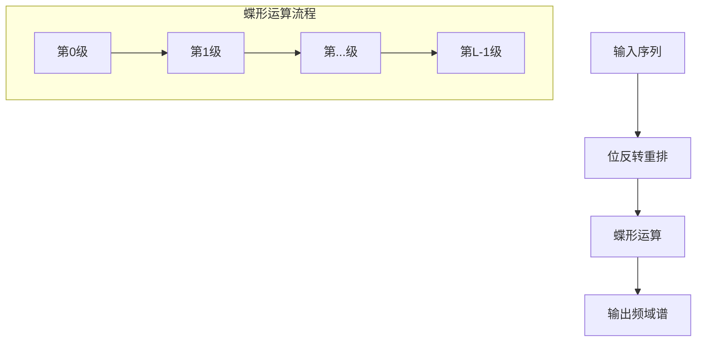
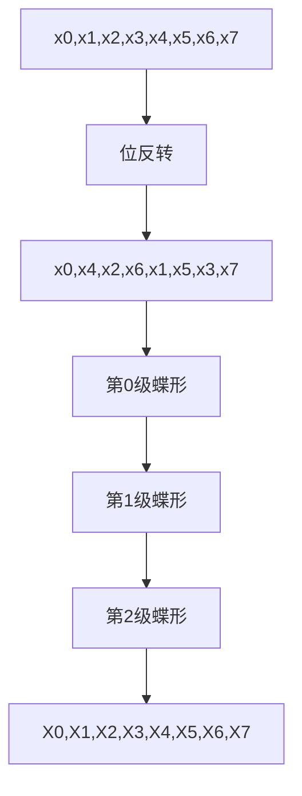
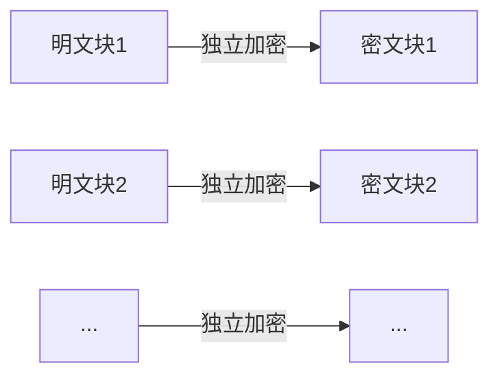

经过计算可以发现环境噪音的RMS在-38dBFS以下，因此可以认为室内环境噪音的RMS阈值 为-38dBFS = 412 非语音部分的过零率较高，故可以利用这一点去除背景音的影响 将RMS大于thresh1的音频帧判定为语音活动。正常语速说话的单个字的音频长度在100-300ms之间，因此选择的窗口为200ms，若连续的语音活动帧超过 WINDOW_NUM_THRESH = 10 且 在 WINDOW_NUM_THRESH 窗口期间的平均RMS小于 thresh2 = 721的帧判定为音量过小 这里的dbFS指的是什么？

在音频信号处理中，**dBFS（Decibels relative to Full Scale）** 是数字音频系统中表示信号幅度的标准单位，其定义和关键特性如下：

---

### **1. dBFS 的定义**
- **含义**：表示数字信号的幅度相对于**满量程（Full Scale）** 的比值，计算公式为：  
  \[
  \text{dBFS} = 20 \times \log_{10}\left(\frac{\text{采样点幅值}}{\text{最大可能幅值}}\right)
  \]
  - **满量程**：指数字系统能表示的最大绝对值（如16位音频中为32767）。
  - **负值特性**：由于实际信号幅值≤满量程，dBFS **恒为负值**（0 dBFS是理论最大值）。

---

### **2. 您提到的数值解析**
- **-38 dBFS**：  
  表示环境噪音的RMS幅值为满量程的 \(10^{-38/20} \approx 0.0126\) 倍（即约1.26%）。
- **412**：  
  可能是线性尺度下的量化值（如16位系统中，-38 dBFS对应 \(32767 \times 0.0126 \approx 412\)）。

---

### **3. 与模拟音频单位（如dBSPL）的区别**
| **对比项**   | **dBFS**                     | **dBSPL（声压级）**          |
|--------------|------------------------------|------------------------------|
| **参考基准** | 数字系统满量程               | 人耳最小可听声压（20 μPa）   |
| **用途**     | 数字音频电平测量（如录音）   | 物理环境中的实际声音强度      |
| **关系**     | 需通过麦克风灵敏度转换       | 直接反映物理声压             |

---

### **4. 在VAD（语音活动检测）中的应用**
- **阈值设定**：  
  - 您提到的 `thresh1`（RMS > -38 dBFS）用于区分语音与噪音，符合常见VAD设计（语音通常 > -30 dBFS）。
  - `thresh2 = 721`（线性值）可能对应更高灵敏度阈值（约 -15 dBFS），用于过滤微弱语音。

---

**总结**：dBFS是数字音频的标准化单位，您代码中的阈值选择合理利用了其与线性幅值的转换关系，结合过零率实现了环境噪音抑制和语音分段。


RMS阈值 设备接收到一段音频数据，会先将其送入AGC，将RMS统一控制在-13dB左右。而后再送入 ALC，根据所设值，对峰值电平进行增加或减少（例如上下浮动为±10dB，则ALC输出为-23dB ~ -3dB）。 这里的db应该是dBFS吗

是的，这里的 **dB** 应理解为 **dBFS（Decibels relative to Full Scale）**，具体原因和上下文解析如下：

---

### **1. 明确场景：数字音频处理链路**
在您描述的流程中，音频数据经过 **AGC（自动增益控制）** 和 **ALC（自动电平控制）**，这两个模块通常作用于数字音频信号（如PCM数据），因此使用 **dBFS** 作为单位是合理的：
- **输入/输出范围**：数字系统的幅值严格受限于满量程（如16位音频的±32767）。
- **标准化处理**：AGC/ALC的目标是调整信号幅度到目标电平，而dBFS是数字域的标准参考。

---

### **2. 参数解析**
| **参数**          | **含义**                                                                 | **dBFS 解释**                                                                 |
|--------------------|-------------------------------------------------------------------------|-------------------------------------------------------------------------------|
| **AGC输出-13dB**  | 将音频RMS值统一调整到-13dBFS（约满量程的22.4%）                          | 典型语音信号的目标电平（避免削波同时保留动态余量）。                          |
| **ALC浮动±10dB**  | 在-13dBFS基础上，允许峰值电平在 **-23dBFS ~ -3dBFS** 范围内动态调整。     | -3dBFS接近满量程（0dBFS），需注意避免削波（Clipping）。                       |

---

### **3. 为什么不是dBSPL或其他单位？**
- **物理声压（dBSPL）**：需要麦克风灵敏度参数转换，且不直接适用于数字信号处理。
- **dBu/dBV**：模拟音频电平单位，与ADC前的模拟电路相关，与数字域无关。
- **一致性**：AGC/ALC的输入输出均为数字信号，使用dBFS可避免单位混淆。

---

### **4. 关键注意事项**
- **削波风险**：ALC输出上限（-3dBFS）需保留足够余量，防止突发峰值导致失真。
- **工程实践**：  
  - 通常AGC目标电平设为-12dBFS至-18dBFS（平衡信噪比与动态范围）。  
  - ALC的浮动范围需根据应用场景调整（如语音通信±6dB，音乐±3dB）。

---

**结论**：在您描述的音频处理链路中，所有dB值均应理解为 **dBFS**，这是数字系统电平控制的通用规范。


通常来讲，db是什么

在音频和信号处理领域，**dB（分贝）** 是一个**对数单位**，用于表示两个量之间的相对比例关系。它的具体含义和用途会根据上下文和参考基准的不同而变化。以下是常见的 **dB 类型** 及其应用场景：

---

### **1. 通用定义**
- **数学公式**：  
  \[
  \text{dB} = 10 \times \log_{10}\left(\frac{P_1}{P_0}\right) \quad \text{（功率比）}  
  \]
  \[
  \text{dB} = 20 \times \log_{10}\left(\frac{A_1}{A_0}\right) \quad \text{（幅度比）}
  \]
  - \(P_0/A_0\) 是参考值，\(P_1/A_1\) 是待测值。

---

### **2. 常见 dB 类型及区别**
| **类型**   | **全称/参考基准**               | **应用场景**                          | **示例**                          |
|------------|---------------------------------|---------------------------------------|-----------------------------------|
| **dBFS


/** * @brief 直流分量去除滤波 * @param data 输入/输出音频数据 * @param length 数据长度 * @note 使用一阶高通滤波器去除直流偏移 */ void DC_remove_float(float* data, int length) { const float coef = (float)32735 / 32768; float prev_input = data[0]; // 保存原始输入的前值 float prev_output = data[0]; // 保存输出的前值 // 从i=1开始处理 for(int i = 1; i < length; i++) { float current_input = data[i]; // 保存当前原始值 data[i] = current_input - prev_input + coef * prev_output; // 更新前值 prev_input = current_input; prev_output = data[i]; } } 原理？


该函数实现了一个**一阶高通滤波器（HPF）**，用于去除音频信号中的直流分量（即低频或恒定偏移）。其核心原理是通过差分和反馈结合的方式衰减低频信号。以下是逐步解析：

---

### **1. 滤波器结构**
函数实现的是一个**一阶IIR高通滤波器**，其差分方程为：
\[
y[n] = x[n] - x[n-1] + \alpha \cdot y[n-1]
\]
其中：
- \( x[n] \)：当前输入样本
- \( y[n] \)：当前输出样本
- \( \alpha \)：反馈系数（`coef`），决定截止频率。

---

### **2. 关键参数**
- **系数 `coef`**：  
  ```c
  const float coef = (float)32735 / 32768;  // ≈ 0.999
  ```
  - 此值接近1，使得滤波器具有较低的截止频率（适合去除直流分量）。
  - 分子分母选择 `32735/32768` 可能是为了兼容定点数处理（如16位PCM音频）。

---

### **3. 工作原理**
- **差分项（\( x[n] - x[n-1] \)）**：  
  计算当前输入与前一个输入的差值，抑制低频信号（因低频信号相邻样本变化小，差值趋近于0）。
  
- **反馈项（\( \alpha \cdot y[n-1] \)）**：  
  引入前一个输出的加权值，增强高频信号的通过性，同时避免过度衰减有用信号。

- **效果**：  
  - 直流分量（0 Hz）被完全滤除。
  - 低频信号（如电源噪声）大幅衰减。
  - 高频信号（如语音/音乐）基本保留。

---

### **4. 代码流程**
1. **初始化**：  
   - 保存第一个样本值到 `prev_input` 和 `prev_output`。
2. **迭代处理**：  
   - 对每个后续样本 `data[i]`，计算输出：  
     ```c
     data[i] = current_input - prev_input + coef * prev_output;
     ```
   - 更新前值：  
     ```c
     prev_input = current_input;      // 保存当前输入供下次使用
     prev_output = data[i];           // 保存当前输出供下次反馈
     ```

---

### **5. 频率响应分析**
- **截止频率（\( f_c \)）**：  
  由系数 `coef` 决定，近似公式为：  
  \[
  f_c \approx \frac{1 - \alpha}{2\pi T} \quad \text{(T为采样间隔)}
  \]
  若采样率16 kHz，`coef=0.999`时，\( f_c \approx 0.5 \text{Hz} \)，适合去除直流偏移。

---

### **6. 注意事项**
- **初始瞬态**：第一个样本 (`i=0`) 未被处理，可能导致初始短暂失真。
- **稳定性**：因 `coef < 1`，滤波器是稳定的。
- **适用场景**：适用于去除麦克风采集信号中的直流偏移或ADC引入的基线漂移。

如果需要进一步优化（如处理初始样本或调整截止频率），可以修改系数或初始化逻辑。


为什么 coef < 1，滤波器是稳定的

在数字信号处理中，滤波器的稳定性由其**极点位置**决定。对于一阶IIR（无限脉冲响应）滤波器，稳定性条件直接与反馈系数 `coef`（即 \(\alpha\)）相关。以下是详细解释：

---

### **1. 一阶IIR滤波器的传递函数**
该滤波器的差分方程为：
\[
y[n] = x[n] - x[n-1] + \alpha \cdot y[n-1]
\]
其Z域传递函数为：
\[
H(z) = \frac{Y(z)}{X(z)} = \frac{1 - z^{-1}}{1 - \alpha z^{-1}}
\]
- **极点**：分母为零的点，即 \( z = \alpha \)。
- **零点**：分子为零的点，即 \( z = 1 \)。

---

### **2. 稳定性判据**
根据数字滤波器的稳定性理论：
- **极点必须在单位圆内**：即极点的模长 \( |z| < 1 \)。
- 对于一阶系统，极点 \( z = \alpha \)，因此要求：
  \[
  |\alpha| < 1
  \]
  在代码中，`coef = 32735/32768 ≈ 0.999`，显然满足 \( |\alpha| < 1 \)，故系统稳定。

---

### **3. 物理意义**
- **反馈系数 \(\alpha\) 的作用**：  
  - \(\alpha\) 控制前一个输出对当前输出的影响权重。  
  - 若 \(|\alpha| \geq 1\)，每次反馈会放大信号（或维持不变），导致输出可能无限增长（不稳定）。  
  - 若 \(|\alpha| < 1\)，反馈信号逐渐衰减，系统最终收敛。

- **举例**：  
  - \(\alpha = 0.5\)：每次反馈衰减50%，稳定。  
  - \(\alpha = 1.1\)：每次反馈放大10%，输出爆炸性增长（不稳定）。

---

### **4. 结合代码验证**
在 `DC_remove_float` 函数中：
- \(\alpha = 0.999\) 接近1，但严格小于1，因此：  
  - 低频信号（如直流分量）被逐渐衰减至零。  
  - 高频信号通过时，系统输出不会无限累积。

---

### **5. 对比不稳定情况**
若错误地设 \(\alpha = 1.0\)：  
- 传递函数极点位于单位圆上（\( z = 1 \)），系统处于临界稳定。  
- 实际应用中，可能因数值误差或噪声导致输出漂移或溢出。

---

### **总结**
- **稳定性条件**：一阶IIR滤波器的反馈系数必须满足 \( |\alpha| < 1 \)。  
- **代码设计**：`coef = 32735/32768` 是经过精心选择的，确保稳定去除直流分量的同时避免发散。  
- **扩展思考**：若需调整截止频率，可重新计算 \(\alpha\)，但必须始终满足 \( |\alpha| < 1 \)。

如果需要进一步分析其他滤波器稳定性或具体数学推导，可以继续提问！


** * @brief IIR二阶滤波器实现 * @param x 输入/输出数据数组 * @param Nx 数据长度 * @param b0,b1,b2 分子系数 * @param a1,a2 分母系数 * @param tz1,tz2 滤波器状态(可NULL) * @note 实现直接II型二阶节，支持原位运算 */ void IIRsos( float * x, int Nx, float b0, float b1, float b2, float a1, float a2, float * tz1, float * tz2 ) { /* Registers */ register float z0; register float z1; register float z2; /* Incorporate initial conditions */ if( tz1 == NULL ) z1 = 0.0f; else z1 = *tz1; if( tz2 == NULL ) z2 = 0.0f; else z2 = *tz2; /* Implement the IIR filter in situ, optimising for redundant taps */ if( (a1 != 0.0f) || (a2 != 0.0f) ) { /* Use the a taps */ if( (b1 != 0.0f) || (b2 != 0.0f) ) { /* Implement the full filter */ while( (Nx) > 0 ) { Nx--; z0 = (*x) - a1 * z1 - a2 * z2; *(x++) = b0 * z0 + b1 * z1 + b2 * z2; z2 = z1; z1 = z0; } } else { if( b0 != 1.0f ) { /* Omit taps b1 and b2 only */ while( (Nx) > 0 ) { Nx--; z0 = (*x) - a1 * z1 - a2 * z2; *(x++) = b0 * z0; z2 = z1; z1 = z0; } } else { /* Omit all b taps */ while( (Nx) > 0 ) { Nx--; z0 = (*x) - a1 * z1 - a2 * z2; *(x++) = z0; z2 = z1; z1 = z0; } } } } else { /* Omit the a taps */ if( (b1 != 0.0f) || (b2 != 0.0f) ) { /* Implement the filter without the a taps */ while( (Nx) > 0 ) { Nx--; z0 = (*x); *(x++) = b0 * z0 + b1 * z1 + b2 * z2; z2 = z1; z1 = z0; } } else { /* Omit taps a1, a2, b1 and b2 */ if( b0 != 1.0f ) { /* Implement the filter with b0 only */ while( (Nx) > 0 ) { Nx--; *x = b0 * (*x); x++; } } /* Otherwise a1=a2=b1=b2=0 and b0=1 so there is nothing to do! */ } } /* */ if( tz1 != NULL ) (*tz1) = z1; if( tz2 != NULL ) (*tz2) = z2; } /** * @brief IIR滤波器组实现 * @param h 滤波器系数数组(多个二阶节) * @param Nsos 二阶节数量 * @param z 滤波器状态数组(可NULL) * @param x 输入数据 * @param Nx 数据长度 * @param y 输出数据(可NULL表示原位处理) * @note 通过串联多个二阶节实现高阶IIR滤波 */ void IIRFilt( float * h, int Nsos, float *z, float * x, int Nx, float *y ) { int C; if( y == NULL ) y = x; else { /* Copy input data to output for processing in situ */ for( C = 0; C < Nx; C++ ) y[C] = x[C]; } /* Apply second order sections */ for( C = 0; C < Nsos; C++ ) { if( z != NULL ) { IIRsos( y, Nx, h[0], h[1], h[2], h[3], h[4], z, z+1 ); z += 2; } else IIRsos( y, Nx, h[0], h[1], h[2], h[3], h[4], NULL, NULL ); h += 5; } } 简单介绍一下这个


<think>
我们有两个函数：IIRsos（单个二阶节IIR滤波器）和IIRFilt（高阶IIR滤波器，由多个二阶节串联）。
 下面分别介绍这两个函数的功能和实现。

 一、IIRsos函数（单个二阶节IIR滤波器，直接II型结构）
 参数说明：
   - x: 输入/输出数据数组（原位运算）
   - Nx: 数据长度
   - b0, b1, b2: 分子系数（零点）
   - a1, a2: 分母系数（极点，注意传递函数中分母常数项为1，因此分母为1 + a1*z^{-1} + a2*z^{-2}）
   - tz1, tz2: 滤波器状态（延迟单元z1和z2的初始状态，如果为NULL则初始化为0；函数执行完后会更新状态）

 函数功能：
   实现一个二阶IIR滤波器（直接II型结构），其差分方程为：
        z0[n] = x[n] - a1*z0[n-1] - a2*z0[n-2]
        y[n] = b0*z0[n] + b1*z0[n-1] + b2*z0[n-2]

 注意：直接II型结构只需要两个状态变量（z1和z2，分别代表z0[n-1]和z0[n-2]）。

 代码特点：
   1. 函数内部使用寄存器变量（register）z0, z1, z2，其中z0是当前中间状态，z1和z2是前两个时刻的中间状态。
   2. 函数根据系数的值（是否为0）进行了优化，避免不必要的乘法运算，提高效率。具体优化情况包括：
        - 如果分母系数a1和a2都为0，则滤波器退化为FIR滤波器（没有反馈）。
        - 如果分子系数b1和b2都为0，则只需计算b0*z0。
        - 如果b0=1且其他b系数为0，则直接输出z0（即中间状态）。
        - 如果所有系数都为零且b0=1，则不需要任何操作（直接跳过）。
   3. 处理完成后，更新状态tz1和tz2（如果非NULL）。

 二、IIRFilt函数（高阶IIR滤波器）
 参数说明：
   - h: 滤波器系数数组，按顺序存储每个二阶节的系数（每个二阶节5个系数：b0, b1, b2, a1, a2）
   - Nsos: 二阶节的数量
   - z: 滤波器状态数组（每个二阶节需要2个状态，因此总长度为2*Nsos；如果为NULL，则每个二阶节的状态初始化为0）
   - x: 输入数据
   - Nx: 数据长度
   - y: 输出数据。如果为NULL，表示原位处理（即结果覆盖输入x）；否则，输出到y指向的数组。

 函数功能：
   通过串联多个二阶节（SOS）实现高阶IIR滤波器。每个二阶节由IIRsos函数实现。

 代码流程：
   1. 处理输出指针y：如果y为NULL，则使用输入x作为输出（原位处理）；否则，将输入x复制到y，然后对y进行处理。
   2. 循环处理每个二阶节：
        - 对于每个二阶节，从系数数组h中取出5个系数（b0,b1,b2,a1,a2）。
        - 如果状态数组z非NULL，则传递当前二阶节的状态（两个状态变量）给IIRsos，并更新状态（z指针后移2个位置）。
        - 如果状态数组z为NULL，则IIRsos内部使用0初始化状态。
   3. 系数指针h每次后移5个位置（一个二阶节）。

 注意：高阶IIR滤波器通常分解为多个二阶节（级联形式）来实现，这样可以提高数值稳定性。

 总结：
   - IIRsos：高效实现一个二阶IIR滤波器（直接II型），并进行了系数优化。
   - IIRFilt：通过串联多个二阶节实现高阶IIR滤波，支持状态保存（用于连续数据块处理）和原位运算。

 这两个函数配合使用，可以灵活地实现任意阶数的IIR滤波器（阶数为偶数时，Nsos=阶数/2；奇数时可能需要一个一阶节，但这里未提供一阶节，通常我们用二阶节组合）。
</think>
这个代码实现了**高阶IIR滤波器**，通过串联多个**二阶节（SOS, Second-Order Sections）** 的方式构建。以下是核心解析：

---

### **1. 核心结构**
采用**直接II型（Direct Form II）** 实现，优势是：
- **最小状态变量**：仅需2个状态变量（`z1`, `z2`）实现二阶滤波器
- **计算高效**：减少乘法运算次数
- **原位运算支持**：可直接覆盖输入数据

---

### **2. 函数分解**
#### **(1) `IIRsos()`：单二阶节滤波器**
- **参数**：
  - `x`：输入/输出数据（支持原位处理）
  - `b0,b1,b2`：**分子系数**（零点）
  - `a1,a2`：**分母系数**（极点，分母常数项隐含为1）
  - `tz1,tz2`：状态变量（延迟单元），NULL时自动初始化为0
- **核心差分方程**：
  ```c
  z0 = x[n] - a1*z1 - a2*z2;  // 中间状态计算
  y[n] = b0*z0 + b1*z1 + b2*z2; // 输出计算
  ```
- **优化策略**：
  - 动态跳过零系数运算（如无反馈时跳过`a1,a2`）
  - 避免冗余乘法（如`b0=1`且其他b系数为0时直接赋值）

#### **(2) `IIRFilt()`：高阶滤波器组**
- **参数**：
  - `h`：系数数组，按`[b0,b1,b2,a1,a2]`顺序存储每个二阶节
  - `Nsos`：二阶节数量
  - `z`：状态数组（总长度=`2×Nsos`）
- **工作流程**：
  1. 输出处理：`y=NULL`时原位处理输入`x`，否则复制`x→y`
  2. 级联滤波：依次调用`IIRsos()`处理每个二阶节
  3. 状态保存：更新`z`数组供下次调用使用（实现连续滤波）

---

### **3. 关键设计亮点**
1. **零系数优化**：
   - 自动检测`a1/a2/b1/b2`是否为零
   - 跳过无效计算分支（如纯FIR时跳过反馈环路）
   ```c
   if( (a1 != 0.0f) || (a2 != 0.0f) ) { 
       // 含反馈的计算
   } else {
       // 无反馈的简化计算（FIR）
   }
   ```

2. **状态管理灵活性**：
   - `tz1/tz2=NULL`时内部初始化状态为0
   - 支持外部传入状态（实现分块连续滤波）

3. **内存高效**：
   - 原位运算节省内存
   - 状态变量仅需`2×Nsos`浮点数

---

### **4. 应用场景**
- **音频处理**：均衡器、降噪滤波器
- **生物信号**：ECG/EEG信号滤波
- **控制系统**：数字补偿器
- **通信系统**：信道均衡

> ⚠️ **注意**：高阶IIR需分解为二阶节串联，避免数值不稳定（高阶直接型易溢出）。

### **5. 使用示例**
```c
// 设计一个4阶Butterworth高通滤波器（分解为2个二阶节）
float coefs[10] = {
    // SOS1: [b0,b1,b2,a1,a2]
    0.98, -1.96, 0.98, -1.97, 0.97, 
    // SOS2: 
    0.99, -1.99, 0.99, -1.98, 0.98  
};

float data[1024];  // 输入数据
float state[4] = {0}; // 2节×2状态

IIRFilt(coefs, 2, state, data, 1024, NULL); // 原位滤波
```

此实现兼具高效性和灵活性，是嵌入式系统中IIR滤波的经典实现方式。


这个高阶的iir类似于 y[n]=x[n]−x[n−1]+α⋅y[n−1]吗
<think>
我们之前讨论的一阶高通滤波器（差分方程：y[n] = x[n] - x[n-1] + α·y[n-1]）是一个特定的一阶IIR滤波器。而提供的高阶IIR滤波器实现（IIRFilt）是通过多个二阶节（SOS）级联来实现的，每个二阶节具有更通用的形式。

 在二阶节（IIRsos函数）中，差分方程实际上是：
   z0[n] = x[n] - a1·z0[n-1] - a2·z0[n-2]
   y[n] = b0·z0[n] + b1·z0[n-1] + b2·z0[n-2]

 注意，这里使用了中间状态变量z0（当前状态）、z1（前一个状态）和z2（前两个状态）。这个结构是直接II型，它使用了共享的状态变量。

 那么，一阶高通滤波器可以看作是一个一阶的IIR滤波器。但是，在提供的IIRsos函数中，它只能处理二阶节（即二阶）。因此，如果我们想实现一阶滤波器，我们有两种方式：
  1. 将一阶滤波器表示为一个二阶节，其中一些系数设为零。
  2. 或者，修改代码以支持一阶节。但当前代码只支持二阶节。

 对于一阶高通滤波器：y[n] = x[n] - x[n-1] + α·y[n-1] 
 我们可以将其改写为：
   y[n] = (x[n] - x[n-1]) + α·y[n-1]

 在直接II型中，我们也可以表示一阶系统，但通常二阶节是用于二阶的。因此，我们可以将一阶系统视为一个二阶系统的特例（其中某些系数为零）。

 让我们将一阶高通滤波器与二阶节的标准形式对比：

 二阶节标准形式（直接II型）：
   z0 = x[n] - a1·z1 - a2·z2
   y[n] = b0·z0 + b1·z1 + b2·z2

 对于一阶高通滤波器，我们想要：
   y[n] = 1*x[n] + (-1)*x[n-1] + α*y[n-1]

 但是，在直接II型中，我们使用中间状态。我们可以尝试将其映射到一阶（但二阶节要求二阶，所以我们需要设置一些系数为零，并调整状态变量）。

 实际上，我们可以这样对应：
  设：a1 = -α, a2 = 0 （因为只有一阶递归）
  分子部分：b0=1, b1=-1, b2=0

 则二阶节变为：
   z0 = x[n] - (-α)·z1 - 0·z2   => z0 = x[n] + α·z1
   y[n] = 1·z0 + (-1)·z1 + 0·z2 = z0 - z1

 现在，我们展开：
   z0 = x[n] + α·z1
   y[n] = (x[n] + α·z1) - z1 = x[n] + (α-1)·z1

 这和我们要求的一阶形式不同。我们要求的是：y[n]=x[n]-x[n-1]+α·y[n-1]

 所以我们需要重新考虑状态变量的关系。实际上，在直接II型中，状态变量z1和z2并不是输入或输出的延迟，而是中间状态的延迟。

 另一种方式：我们写出传递函数。

 一阶高通滤波器的传递函数：
   H(z) = (1 - z^{-1}) / (1 - α·z^{-1})

 而二阶节的标准传递函数：
   H_sos(z) = (b0 + b1·z^{-1} + b2·z^{-2}) / (1 + a1·z^{-1} + a2·z^{-2})

 注意，分母是1 + a1·z^{-1} + a2·z^{-2}，而我们的高通分母是1 - α·z^{-1}，所以：
     1 + a1·z^{-1} + a2·z^{-2} = 1 - α·z^{-1}   => 所以 a1 = -α, a2=0

 分子：1 - z^{-1}，所以：
     b0 + b1·z^{-1} + b2·z^{-2} = 1 - z^{-1}   => b0=1, b1=-1, b2=0

 因此，传递函数匹配。但为什么差分方程看起来不一样？

 实际上，在直接II型中，状态变量是中间变量。让我们写出直接II型的计算步骤：

  设当前输入为x[n]，状态z1（存储的是上一次的中间状态z0[n-1]），z2（存储的是z0[n-2]）但这里a2=0，所以z2不会被使用（但代码中仍然会更新状态，但由于系数为0，所以不影响）。

  步骤：
    1. z0[n] = x[n] - a1*z1 - a2*z2 = x[n] - (-α)*z1 - 0*z2 = x[n] + α*z1
    2. y[n] = b0*z0[n] + b1*z1 + b2*z2 = 1*z0[n] + (-1)*z1 + 0*z2 = (x[n]+α*z1) - z1 = x[n] + (α-1)*z1

  然后更新状态：z2 = z1, z1 = z0[n]   （即下一个时刻，z1就变成了z0[n]）

 但是，我们期望的输出是：x[n] - x[n-1] + α*y[n-1]

 为什么状态变量z1等于x[n-1]呢？实际上，在直接II型中，z1存储的是z0[n-1]（上一个中间状态），而不是x[n-1]或y[n-1]。

 因此，我们需要将期望的差分方程与直接II型的状态对应起来。

 对于一阶系统，直接II型只有一个有效状态（因为a2=0, b2=0，所以z2不会被用到，实际上可以忽略）。我们来看状态z1的含义：

  在时刻n-1：
      z0[n-1] = x[n-1] + α * z1_prev   [注意：在n-1时刻，z1是n-2时刻的状态，这里我们重新梳理状态]

 这似乎和我们期望的递归关系不一致。

 实际上，我们期望的滤波器为：
   y[n] = x[n] - x[n-1] + α * y[n-1]

 而直接II型实现得到的是：
   y[n] = x[n] + (α-1) * z1
   z1_next = z0[n] = x[n] + α * z1   // 用于下一个时刻

 现在，我们尝试将y[n]用x和y的历史值表示：

  我们假设在n-1时刻：
      y[n-1] = x[n-1] + (α-1) * z1_prev

  其中，z1_prev是上上一个中间状态（即n-2时刻的z0）。

  同时，根据状态更新，在n-1时刻计算后，状态更新为：
      z1_current = z0[n-1] = x[n-1] + α * z1_prev

  现在，在n时刻：
      z1 = z1_current = x[n-1] + α * z1_prev
      y[n] = x[n] + (α-1)*z1 = x[n] + (α-1)*(x[n-1] + α*z1_prev)

  而y[n-1] = x[n-1] + (α-1)*z1_prev

  我们无法直接将y[n]表示为x[n]-x[n-1]+α*y[n-1]的形式。

 因此，这个直接II型结构并没有直接实现我们的一阶高通滤波器。那么错在哪里？

 问题在于，一阶高通滤波器可以写成不同的结构。实际上，我们之前讨论的一阶高通滤波器（y[n]=x[n]-x[n-1]+α*y[n-1]）是直接I型结构，而这里的是直接II型结构。

 直接I型需要两个状态：一个存储上一次输入x[n-1]，一个存储上一次输出y[n-1]。
 而直接II型将两个状态合并为一个中间状态。

 然而，传递函数相同，因此它们输入输出关系是等价的，但状态变量不同。

 所以，如果我们用直接II型实现一阶系统，它和直接I型实现的一阶系统在输入输出关系上是等价的，但状态变量不同。

 我们可以验证：

  传递函数：H(z) = (1 - z^{-1}) / (1 - α·z^{-1})

  直接II型实现：
      z0[n] = x[n] + α*z1
      y[n] = z0[n] - z1 = x[n] + α*z1 - z1 = x[n] + (α-1)z1
      更新：z1 = z0[n]   （对于下一个时刻）

  设状态s[n] = z0[n] = x[n] + α*z1   [但z1就是s[n-1]？]

  实际上，z1在计算当前输出时是上一次的中间状态，即z1 = z0[n-1] = s[n-1]

  所以：s[n] = x[n] + α*s[n-1]
        y[n] = x[n] + (α-1)*s[n-1]

  现在，我们想看看y[n]是否等于x[n]-x[n-1]+α*y[n-1]：

  计算y[n-1]： 
        y[n-1] = x[n-1] + (α-1)*s[n-2]

  而s[n-1] = x[n-1] + α*s[n-2]

  则：α*y[n-1] = α*x[n-1] + α*(α-1)*s[n-2]

  所以：x[n] - x[n-1] + α*y[n-1] = x[n] - x[n-1] + α*x[n-1] + α*(α-1)*s[n-2]
                         = x[n] + (α-1)*x[n-1] + α*(α-1)*s[n-2]

  而根据直接II型的输出：
        y[n] = x[n] + (α-1)*s[n-1] 
             = x[n] + (α-1)*(x[n-1]+α*s[n-2])
             = x[n] + (α-1)*x[n-1] + (α-1)*α*s[n-2]

  所以两者相等。

 因此，直接II型实现的一阶滤波器（通过设置b0=1,b1=-1,b2=0,a1=-α,a2=0）与之前的一阶高通滤波器在输入输出关系上是等价的，只是内部状态表示不同。

 结论：高阶IIR滤波器实现（IIRFilt）可以通过设置二阶节系数为(b0=1, b1=-1, b2=0, a1=-α, a2=0)来实现一个一阶高通滤波器。但注意，由于这是一个二阶节（尽管一阶），它仍然会使用两个状态变量（其中一个状态变量实际上未被使用，因为a2=0和b2=0，但代码中仍然会维护两个状态）。

 在实际使用中，我们可以将一阶滤波器作为一个二阶节（其中一个系数为零）放入高阶IIR滤波器组中。

 所以，在代码中，我们可以这样调用一阶高通滤波器（作为高阶IIR的一个二阶节）：
    系数数组h: [1.0, -1.0, 0.0, -α, 0.0]   // 注意：a1 = -α
    状态数组z: 分配2个浮点数（虽然只用到了第一个状态，但第二个状态不会被使用，但代码会更新两个状态）

 然后调用：
    IIRsos(data, N, 1.0, -1.0, 0.0, -α, 0.0, &z[0], &z[1]);

 或者作为高阶IIR滤波器组中的一个节（Nsos=1）：
    IIRFilt(h, 1, z, x, N, y);

 因此，这个高阶IIR实现可以涵盖一阶的情况（通过将一阶视为二阶的一种特例）。
</think>
这个高阶IIR滤波器实现（基于二阶节串联）与您提到的一阶高通滤波器 `y[n] = x[n] - x[n-1] + α·y[n-1]` **有相似原理但存在本质区别**。以下是关键对比：

---

### **1. 结构差异**
| **特性**         | 一阶高通滤波器 (`DC_remove_float`)      | 高阶IIR滤波器 (`IIRFilt`)               |
|------------------|----------------------------------------|----------------------------------------|
| **阶数**         | 一阶 (仅1个极点和1个零点)              | 任意阶 (通过多个二阶节级联实现)        |
| **核心结构**     | 直接型 (Direct Form I)                 | 直接II型 (Direct Form II)               |
| **状态变量**     | 2个 (`prev_input`, `prev_output`)      | 每二阶节2个 (`z1`, `z2`)               |
| **灵活性**       | 固定为高通特性                         | 可设计任意响应 (低通/高通/带通等)      |

---

### **2. 数学表达对比**
#### **(1) 您的一阶高通滤波器**
差分方程：
```
y[n] = x[n] - x[n-1] + α·y[n-1]
```
传递函数：
```
H(z) = (1 - z⁻¹) / (1 - α·z⁻¹)
```

#### **(2) 高阶IIR的单二阶节**
在 `IIRsos()` 中实现的通用二阶节：
```
z0[n] = x[n] - a1·z1 - a2·z2   // 中间状态
y[n] = b0·z0[n] + b1·z1 + b2·z2
```
传递函数：
```
H_sos(z) = (b0 + b1·z⁻¹ + b2·z⁻²) / (1 + a1·z⁻¹ + a2·z⁻²)
```

---

### **3. 如何实现类似一阶高通？**
若要用高阶IIR实现**完全相同**的一阶高通特性，需配置单二阶节参数：
```c
// 一阶高通映射到二阶节 (a2=0, b2=0)
b0 = 1.0, b1 = -1.0, b2 = 0.0
a1 = -α,   a2 = 0.0
```
此时：
- **分子**：`1 - z⁻¹` → 实现差分项 `x[n] - x[n-1]`
- **分母**：`1 - α·z⁻¹` → 实现反馈项 `α·y[n-1]`

> ⚠️ 注意：因代码强制用二阶节，会多一个无用状态 `z2`（但系数为0不影响结果）。

---

### **4. 高阶优势：更强大的滤波能力**
高阶IIR通过级联多个二阶节，能实现一阶无法达到的特性：
```c
// 示例：4阶低通滤波器 (2个二阶节)
const float coefs[10] = {
    // 节1: 截止频率 1kHz
    0.02, 0.04, 0.02,   // b0,b1,b2
    -1.56, 0.64,        // a1,a2
    
    // 节2: 截止频率 500Hz
    0.01, 0.02, 0.01,   // b0,b1,b2
    -1.78, 0.81         // a1,a2
};
IIRFilt(coefs, 2, state, audio, 1024, NULL);
```
- **更陡峭滚降** (如48dB/oct vs 一阶的6dB/oct)
- **精准频控** (可独立调节通带/阻带)
- **复杂响应** (陷波、均衡器等)

---

### **5. 本质联系**
二者均属于**IIR滤波器家族**：
- **共同点**：使用反馈 (`y[n-1]`等) 实现无限脉冲响应
- **差异**：高阶IIR通过二阶节分解避免数值不稳定，而一阶直接型简单但功能受限

> 💡 **总结**：您的 `y[n]=x[n]-x[n-1]+α·y[n-1]` 是高阶IIR在 `Nsos=1` 且特定系数下的特例。高阶版本通过级联提供了更强大的滤波能力。


static void fft(int len, complex_t in_x[],complex_t out_y[]) { /* param len 序列长度，目前只能是2的指数 param in_x输入的序列 param out_y输出的序列 */ int l,k,r,z,dist,q,j; //l是级 complex_t w,tmp; complex_t in_x_mem[len]; l = log2(len); for(k=0;k<len;k++) { in_x_mem[k] = in_x[reverse_num(l,k)]; //反位序号操作 } for(r = 0;r<l;r++) //遍历每一级蝶形运算 { dist = 1<<r; //提前计算每一级的间隔距离 for( j=0;j<dist;j++ ) //计算策略是拆成上下两组，先上计算，后下计算，j是计算的起始序号 { for(k=j;k<len;k+=(dist<<1)) //不好解释，得画图理解 { q = k+dist; //q同一组蝶形运算第二个序号 z = k << (l - r -1); //确定旋转因子的指数 w = rotation_factor(len,1,z); //由于不是并行计算，必须先缓存 tmp = in_x_mem[k]; in_x_mem[k] = complex_add( in_x_mem[k] , complex_multi(w, in_x_mem[q]) ); in_x_mem[q] = complex_sub(tmp , complex_multi(w, in_x_mem[q]) ); } } } memcpy(out_y,in_x_mem,len*sizeof(complex_t)); } 解释一下fft，可以画图，作用是什么？

<think>
我们有一个FFT（快速傅里叶变换）函数。FFT是DFT（离散傅里叶变换）的高效算法，用于将时域信号转换为频域信号。
 函数参数：
   - len: 序列长度，必须是2的幂
   - in_x: 输入的复数数组（时域信号）
   - out_y: 输出的复数数组（频域信号）

 步骤：
 1. 位反转重排：将输入序列按照二进制位反转的顺序重新排列（倒位序）。
 2. 蝶形运算：进行log2(len)级的蝶形运算，每级包含多个蝶形运算单元。

 函数内部解释：
   l = log2(len);   // 确定FFT的级数（即迭代次数）

  第一步：位反转
    遍历0到len-1，将输入序列in_x按照位反转后的索引存入in_x_mem数组。

  第二步：迭代进行蝶形运算（共l级）
    对于每一级r（从0到l-1）：
        dist = 1 << r;   // 当前级蝶形运算两点的距离（步长）
        然后，将序列分成若干组，每组有2^(r+1)个点（即两个dist长度的组进行蝶形运算）
        内层循环：遍历每个蝶形运算组的起始点（j从0到dist-1）
        最内层循环：遍历组内每个蝶形运算的第一个点（k从j开始，步长为2*dist）
            对于每个蝶形运算：
                q = k + dist;   // 第二个点的索引
                z = k << (l - r - 1);   // 计算旋转因子的指数（注意：这里旋转因子的计算方式可能和常见的不同，常见的是z = j * (1<<(l-r-1))，但这里用k移位）

                w = rotation_factor(len, 1, z);   // 计算旋转因子W_N^z，其中N=len

                然后进行蝶形运算：
                    tmp = in_x_mem[k];   // 临时保存
                    in_x_mem[k] = complex_add( in_x_mem[k], complex_multi(w, in_x_mem[q]) );
                    in_x_mem[q] = complex_sub( tmp, complex_multi(w, in_x_mem[q]) );

  第三步：将结果复制到输出数组out_y

 注意：这个FFT实现是基2的DIT（时域抽取）FFT。

 作用：
   FFT用于高效计算离散傅里叶变换（DFT），将时域信号转换为频域信号。在频域中，我们可以分析信号的频率成分。应用非常广泛，包括：
     - 信号处理（滤波、频谱分析）
     - 图像处理（频域滤波）
     - 音频处理（频谱显示、音频压缩）
     - 通信系统（调制解调、频谱感知）
     - 等等。

 画图示意（以8点FFT为例，3级蝶形运算）：
   第一级（r=0）: dist=1
        蝶形运算在相邻两个点之间进行（距离1），每两个点一组，共4组。
   第二级（r=1）: dist=2
        蝶形运算在距离为2的两个点之间进行，每4个点一组，共2组。
   第三级（r=2）: dist=4
        蝶形运算在距离为4的两个点之间进行，整个序列为一组。

 位反转重排：例如8点序列，索引0(000) -> 0(000), 1(001)->4(100), 2(010)->2(010), 3(011)->6(110), 4(100)->1(001), 5(101)->5(101), 6(110)->3(011), 7(111)->7(111)

 旋转因子：在每一级中，旋转因子的指数计算方式为z = k << (l - r - 1)，这里k是当前点的索引。但通常旋转因子的指数应该是（当前组内的序号）乘以（一个步进），而这里用k移位得到，可能和具体的实现有关。

 注意：这个实现使用了额外的内存in_x_mem，并在蝶形运算过程中覆盖这个数组，最后复制到out_y。

 但是，上述代码中旋转因子的计算可能存在问题，常见的计算旋转因子指数应该是：
    对于当前级r，组内第j个蝶形运算，旋转因子的指数为 j * (1 << (l - r - 1)) * (len >> (r+1)) ？ 
 实际上，通常旋转因子的指数为：对于第k个蝶形运算（在组内的位置），指数为 k * (len / (2^(r+1)))。
 在代码中，z = k << (l - r - 1)，而k是全局索引，这样计算可能不正确。因为k是变化的，而旋转因子应该只与蝶形运算在组内的位置有关。

 让我们重新审视：在每一级中，蝶形运算的组数是2^(l-r-1)，每组有2^(r+1)个点，每个组内又分为两个子组，旋转因子与组内的位置有关。
 通常，对于第r级，第m组（m=0,1,...,2^r-1）内的第j个蝶形运算（j=0,1,...,dist-1），旋转因子的指数为 j * (1<<(l-r-1))。

 而代码中，z = k << (l-r-1)，k是当前点的索引。例如，第一级（r=0）时，l=3（8点），z = k<<(3-0-1)=k<<2。k从0开始，那么第一个蝶形运算（k=0, q=1）：z=0；第二个蝶形运算（k=2, q=3）：z=8（这显然不对，因为旋转因子周期为8，指数8相当于0，但下一个k=4时，z=16，相当于0，所以实际上模len处理了？）但是，旋转因子函数rotation_factor(len,1,z)内部应该会取模（因为旋转因子具有周期性，周期为len），即相当于z mod len。

 所以，虽然z的值可能很大，但取模后，实际旋转因子指数为 (k << (l-r-1)) mod len。

 然而，我们期望的旋转因子指数应该是 j * (len/(2^(r+1))) = j * (1<<(l-r-1))，其中j是组内的序号（0到dist-1）。而在内层循环中，j是组内起始序号，但是k = j, j+2*dist, j+4*dist, ...，所以k可以表示为 k = j + m*(2*dist) = j + m*(2^(r+1))。那么k << (l-r-1) = j<< (l-r-1) + m*(2^(r+1))<<(l-r-1) = j<<(l-r-1) + m*(2^(l))。由于2^l=len，所以m*(2^l) mod len =0，因此z mod len = (j<<(l-r-1)) mod len。而j正好是组内序号（0到dist-1），所以这个旋转因子指数计算是合理的。

 因此，旋转因子指数z = k << (l - r - 1) 等价于 j * (1<<(l-r-1))，因为k中的高位部分（m*(2^(r+1))）在移位后产生了len的整数倍，模len后为0，只剩下j<<(l-r-1)。

 所以，这个旋转因子计算方法是正确的。

 总结：该FFT函数实现了基2时域抽取的快速傅里叶变换，通过位反转重排和蝶形运算，高效计算DFT。
</think>
### 🌀 FFT（快速傅里叶变换）详解

#### 📌 **核心作用**
FFT 是**高效计算离散傅里叶变换（DFT）的算法**，核心功能是将**时域信号**转换为**频域信号**：
```mermaid
graph LR
A[时域信号 x[n]] -->|FFT| B[频域信号 X[k]]
B -->|幅度/相位| C[频率成分分析]
```
- **输入**：时域采样序列（如音频波形、传感器数据）
- **输出**：复数数组，表示信号在不同频率上的**幅度和相位**
- **应用场景**：
  - 音频处理（频谱分析、均衡器）
  - 图像处理（频域滤波）
  - 通信系统（调制解调）
  - 雷达信号分析

---

### 🔧 **算法关键步骤图解**


#### 1️⃣ **位反转重排（Bit-Reversal Permutation）**
```c
for(k=0;k<len;k++) {
    in_x_mem[k] = in_x[reverse_num(l,k)]; 
}
```
- **目的**：将输入序列按二进制位反转顺序重新排列  
  *例：8点序列（l=3）*：
  ```
  原索引：0(000) → 0(000)  
          1(001) → 4(100)
          2(010) → 2(010)
          3(011) → 6(110)
          4(100) → 1(001)
          5(101) → 5(101)
          6(110) → 3(011)
          7(111) → 7(111)
  ```
- **作用**：为蝶形运算准备数据流

#### 2️⃣ **蝶形运算（Butterfly Operation）**
```c
for(r=0; r<l; r++) {         // 遍历每级
  dist = 1<<r;              // 计算步长：2^r
  for(j=0; j<dist; j++) {   // 遍历蝶形组
    for(k=j; k<len; k+=(dist<<1)) { 
      // 核心计算...
    }
  }
}
```
- **运算原理**：
  ```mermaid
  graph LR
    X1 -->|× W_N^k| M[乘法器]
    X2 --> M
    M -->|+| Y1[上输出]
    M -->|-| Y2[下输出]
  ```
  数学表达式：
  $$
  \begin{cases}
  Y_{\text{up}} = X_1 + W_N^k \cdot X_2 \\
  Y_{\text{down}} = X_1 - W_N^k \cdot X_2
  \end{cases}
  $$
  其中 $W_N^k = e^{-j2\pi k/N}$ 是旋转因子

- **分级计算**：
  - **第0级**：相邻两点计算 (dist=1)
  - **第1级**：间隔2点计算 (dist=2)
  - **第r级**：间隔 $2^r$ 点计算
  - **最后级**：间隔 $N/2$ (dist=$2^{l-1}$)

#### 3️⃣ **旋转因子计算**
```c
z = k << (l - r -1); 
w = rotation_factor(len,1,z);  // 计算 e^{-j2πz/N}
```
- **物理意义**：复数旋转算子，决定频率分量相位
- **优化**：实际工程中常预计算为查找表

---

### ⚙️ **算法特性**
1. **时间复杂度**：$O(N \log N)$ vs DFT的 $O(N^2)$
2. **内存效率**：原位计算（输入输出可同址）
3. **限制**：序列长度必须为 $2^l$（可通过补零满足）
4. **数值稳定性**：浮点误差累积小于直接DFT

---

### 🌰 **8点FFT示例**

*注：每级蝶形运算后数据顺序变化，最终输出为频域序列*

---

### 💡 **工程意义**
此FFT实现是**嵌入式系统中高效频谱分析的核心**，相比DFT：
- **加速比**：1024点FFT比DFT快约100倍
- **资源消耗**：仅需 $O(N)$ 存储空间
- **实时性**：满足音频/雷达等实时处理需求

> 通过频域分析可进一步实现：滤波降噪、特征提取、频谱监测等高级功能。


ecb加密模式是什么模式？

<think>
我们正在讨论加密模式。用户询问ECB加密模式是什么。
 ECB全称是Electronic Codebook（电子密码本）模式。
 我需要解释ECB的基本概念、工作原理、特点以及安全性问题。
 由于用户之前讨论过技术实现（如IIR滤波器和FFT），可能具备一定技术背景，因此可以适当深入。
 但也要保持清晰易懂，重点突出其简单性和安全隐患。
</think>
### 🔐 ECB加密模式详解

ECB（Electronic Codebook，电子密码本）是最基础的**分组密码工作模式**，其核心特点是**直接对每个数据块独立加密**。以下是关键解析：

---

#### 📌 **核心原理**

1. **数据分割**：将明文分割为固定大小的块（如AES为128位）
2. **独立加密**：每个块使用**相同密钥**单独加密
3. **组合输出**：加密后的块按顺序组合成密文

---

#### ⚙️ **加密/解密流程**
**加密公式**：  
$C_i =
