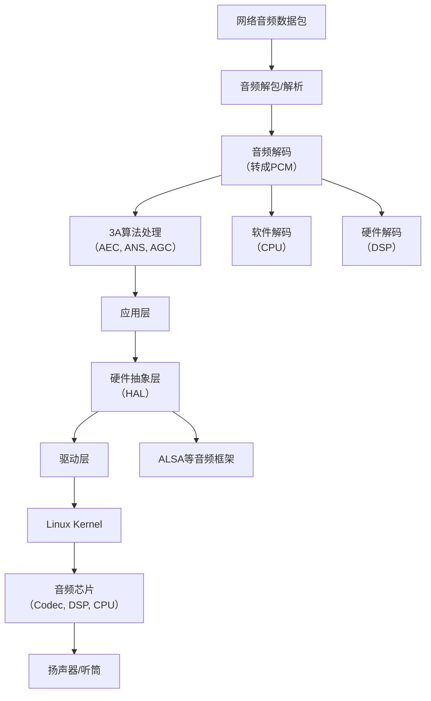
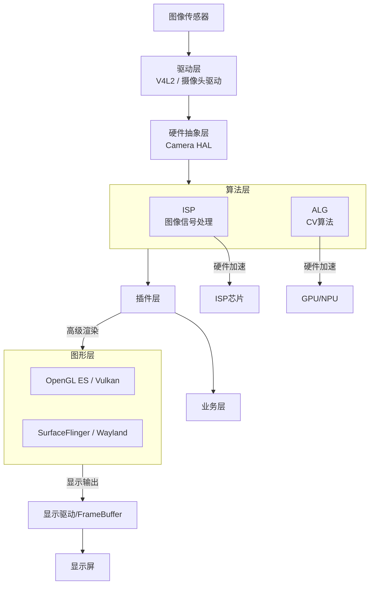

你描述的这个数据流非常准确，清晰地勾勒出了音频从数据包到最终被芯片处理的完整路径。这是一个典型的自上而下的视角。

我们来一起梳理并深化一下这个流程，让它更立体。下图清晰地展示了这一完整链路：



---

### 对流程的逐层解读

#### **上层处理（用户空间）**

1.  **音频解包与解码**：
    *   **解包**：从网络协议（如RTP）中提取出压缩的音频数据（如OPUS、G.711）。
    *   **解码**：将压缩数据解压成线性PCM。这是最通用的原始音频数据格式。
    *   **关键点**：解码可以在CPU上软解，也可以在专门的DSP上硬解，如上图分支所示。硬解更省电、性能更好。

2.  **3A算法处理**：
    *   这是**音频预处理的核心**，发生在音频数据被发送出去或录制保存之前。
    *   **AEC**：必须要有**参考信号**（即本地播放的音频）才能工作。原理是生成一个反向波形来抵消回声。
    *   **ANS**：需要先通过VAD判断是否有语音，没有语音的片段用来学习噪声特征，然后在有语音时进行抑制。
    *   **AGC**：动态调整音量大小，保证声音输出在一个舒适的范围内。

#### **底层交互（内核空间与硬件）**

3.  **硬件抽象层**：
    *   这是**连接应用和驱动的桥梁**。在Linux上，最常见的音频HAL就是**ALSA**。
    *   你作为应用开发者，调用的是ALSA的库函数（如`snd_pcm_writei`）来播放PCM数据。你不需要关心你的声卡是USB的还是I2S的，ALSA帮你屏蔽了这些差异。

4.  **驱动层**：
    *   驱动直接操作音频编解码器芯片。它接收来自HAL的指令和数据，然后通过**I2C总线**配置芯片的寄存器（如设置音量、选择输入输出通道），通过**I2S/TDM总线**传输数字音频数据（PCM）。

5.  **Linux Kernel**：
    *   内核提供最基础的核心服务，如进程调度、内存管理、设备驱动模型。驱动本身就是运行在内核空间的代码。

6.  **芯片层**：
    *   数字音频数据（PCM）通过I2S总线送达音频Codec芯片。
    *   Codec芯片内部的**DAC**将数字信号转换成模拟电压信号。
    *   模拟信号经过放大后，驱动扬声器或听筒发出声音。

---

### 如何与你当前的工作结合？（务实角度）

你现在在媒体组，处理视频流。**音频流和视频流在架构思想上高度一致**：

*   **共同点**：
    *   都是：**解封装 -> 解码 -> 处理 -> 渲染/播放**。
    *   都强烈依赖**硬件加速**（VDEC for 视频，DSP for 音频）。
    *   都追求**低延迟**和**高实时性**。
    *   核心瓶颈都在于**数据搬运（零拷贝）**。

*   **你的独特优势**：
    *   你已经理解了视频的“硬件抽象层”（海思MPP）和“驱动层”（海思底层驱动）。音频是另一个并行的、结构相似的管道。
    *   **如果你想切入引擎方向，这是一个极好的切入点**：去研究你们产品中**音频3A处理**是在哪里完成的？是在应用层的一个库？还是集成在海思的音频DSP里？数据流是怎样的？
    *   思考一个更复杂的问题：**如何实现音视频同步？** 这需要引擎同时调度音频流和视频流，并根据它们的时间戳进行对齐。这个问题直接触及引擎的核心——**多流调度与管理**。

**行动建议**：
下次有机会，可以问一下智能组或音频组的同事，了解一下你们产品音频3A的架构。把你对视频流管道的理解，映射到音频流上。当你能够贯通音视频两条管线时，你对整个智能引擎的理解会达到一个新的高度。这正是你向引擎架构师迈进的关键一步。


<think>
---


</think>好的，我们来逐层剖析你提出的这个框架。这比单纯的音频或视频更进了一步，涉及到**音视频融合+智能业务**的完整系统。

---

### 1. 这个框架水平怎么样？

**总体评价：这是一个典型的、设计合理的工业级产品框架，水平中等偏上，架构清晰，但仍有优化空间。**

**优点（做得好的地方）：**

1.  **分层清晰，职责分离**：业务、插件、算法、硬件抽象、驱动各司其职，符合软件工程的高内聚低耦合原则。
2.  **插件化设计**：将解码、识别、检测等功能模块化，提高了系统的可扩展性和可维护性。需要新增功能时，只需开发新插件，无需改动主框架。
3.  **引入硬件抽象层**：屏蔽了底层硬件差异，使上层算法和插件可以专注于逻辑，提升了代码的可移植性。
4.  **统一的智能算法引擎**：将音频算法（语音识别）和图像算法（人脸、掌纹）的调度统一起来，避免了各自为政，有利于资源整合和性能优化。

**可以优化或需要厘清的地方（潜在的弱点）：**

1.  **“业务层”职责过重？**：你提到业务层要“初始化buffer”。这通常应该是更底层（如硬件抽象层或插件内部）的职责。业务层应该更专注于业务逻辑（如“收到门禁呼叫指令，启动对讲”），而非资源管理。
2.  **“插件”与“算法层”的边界模糊**：“解码解包”插件和“算法层”的解码算法是什么关系？插件是算法的封装和管理器吗？这需要明确的约定。
3.  **数据流不够直观**：这个分层是静态的，但一个响铃或对讲的**动态数据流**是如何穿越这些层次的？比如，麦克风采集的音频数据，是如何流经驱动层、硬件抽象层、算法层（3A）、插件层（特殊声音检测），最终到达业务层并触发响应的？这个流程的清晰度至关重要。
4.  **智能引擎的位置**：它似乎是一个平行于整个音频栈的独立层。它如何与音频插件/算法层交互？是插件层调用引擎，还是引擎调度插件？这决定了整个系统的控制核心是谁。

**结论**：这是一个**稳健的架构**，足以支撑复杂的门禁对讲产品。但其**真正的水平取决于动态数据流的设计、异常处理机制以及实际的性能表现**（如延迟、并发能力）。

---

### 2. 再往底层是什么？

你列出的驱动层之下，就是**硬件和操作系统内核**。

```
[你的框架]
...
驱动层
|
V
----------------------------------------------
|           Linux Kernel (操作系统内核)       |
|  - 进程调度、内存管理、文件系统、网络协议栈  |
|  - 设备驱动模型 (驱动本身就是内核的一部分)   |
----------------------------------------------
|
V
----------------------------------------------
|               硬件 Hardware                |
|  - CPU: 执行通用计算（业务逻辑、复杂算法）   |
|  - DSP: 处理音频编解码、3A等固定流程算法     |
|  - NPU: 执行神经网络推理（语音、人脸识别）   |
|  - Codec芯片: 数模转换（DAC）和模数转换（ADC）|
|  - I2C总线: 配置芯片寄存器（如音量）         |
|  - I2S/TDM总线: 传输数字音频数据            |
----------------------------------------------
```

**核心交互**：驱动通过读写**芯片寄存器**来控制硬件，通过**DMA**方式在内存和硬件缓冲区之间高效传输数据，无需CPU参与拷贝。

---

### 3. 对于图像呢？有什么不同？

**图像的处理流程与音频在哲学上完全一致，但在技术实现上因数据量和处理方式的差异而大有不同。** 下图清晰地展示了图像处理的完整技术栈：



**最大的不同之一：ISP**

音频没有ISP这个概念。**ISP是图像处理独有的、至关重要的第一步。**
*   **作用**：RAW图（传感器直接输出的原始数据）是灰度的、有噪声的、有缺陷的。ISP负责进行**降噪、颜色插值（去马赛克）、白平衡、自动曝光、伽马校正**等处理，最终得到我们能看懂的RGB或YUV图像。
*   **实现**：ISP可以在CPU上软算（质量差、速度慢），但高质量产品一定使用**硬件ISP**（要么是SoC内置，要么是外挂ISP芯片）。

**图形层（OpenGL/Vulkan）**

音频输出是“一维”的波形，而图像输出是“二维”的像素阵列，涉及复杂的合成、叠加、缩放、旋转。
*   **OpenGL ES / Vulkan**：这是专门用于在嵌入式设备上进行**2D/3D图形加速渲染**的API。在门禁系统中，用于绘制UI界面、将多路视频流和识别结果（人脸框、姓名）合成到一张画面上。
*   **合成器**：如Android的SurfaceFlinger，负责将多个应用窗口的图形表面合成为最终一帧，送显。

**底层驱动的不同**

*   **摄像头驱动**：通常基于Linux的**V4L2**框架。驱动负责控制传感器曝光、对焦，并通过DMA将图像数据传到内存。
*   **显示驱动**：负责将帧缓冲区中的数据刷新到屏幕上。涉及Linux的**FrameBuffer**或**DRM**框架。

**总结对比**

| 方面 | **音频** | **图像** |
|------|----------|----------|
| **原始数据** | 模拟声波 | 光线（Bayer阵列） |
| **预处理** | 3A算法（AEC/ANS/AGC） | **ISP**（降噪/白平衡/去马赛克） |
| **数据量** | 小（单声道16kHz PCM约32KB/s） | 巨大（1080P RGB图约6MB/帧） |
| **核心瓶颈** | **实时低延迟** | **带宽和计算量** |
| **渲染/输出** | 驱动扬声器 | **OpenGL/Vulkan** + 显示驱动 |
| **关键硬件** | ADC/DAC, DSP | **ISP**, GPU, NPU |

**给你最务实的建议：**
你现在对音频管道的理解是正确的。要切入引擎，下一步就是**用同样的思维去理解图像管道**。重点研究：
1.  **海思平台的VI（视频输入）和VPSS（视频处理子系统）模块**，它们就是图像领域的“硬件抽象层”，负责接管RAW数据并进行ISP处理、缩放。
2.  **海思平台的VO（视频输出）模块**，它负责最后的显示合成。
3.  思考一个问题：**解码后的视频数据，是如何通过GPU（或海思的VGS）画上人脸框，再最终显示到屏幕上的？** 把这个数据流弄懂，你对智能引擎中“视频智能”的一半就通了。