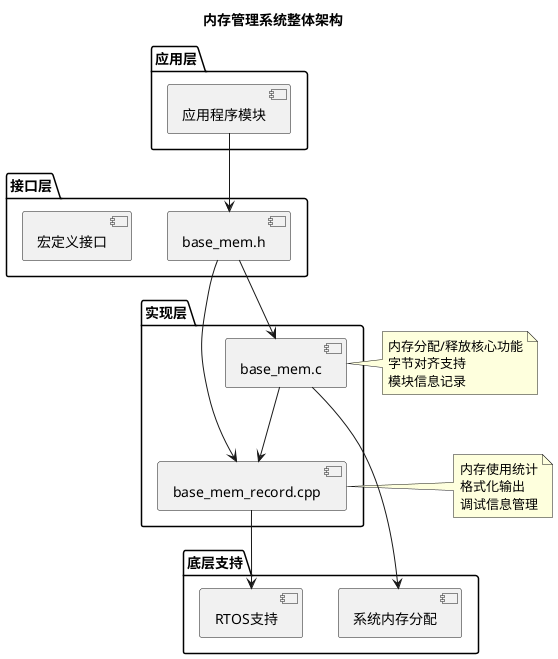
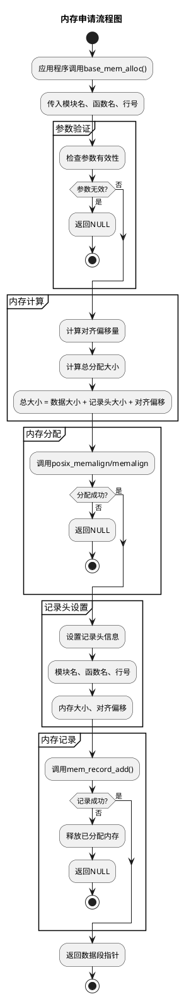
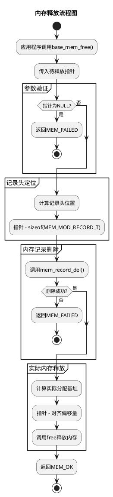
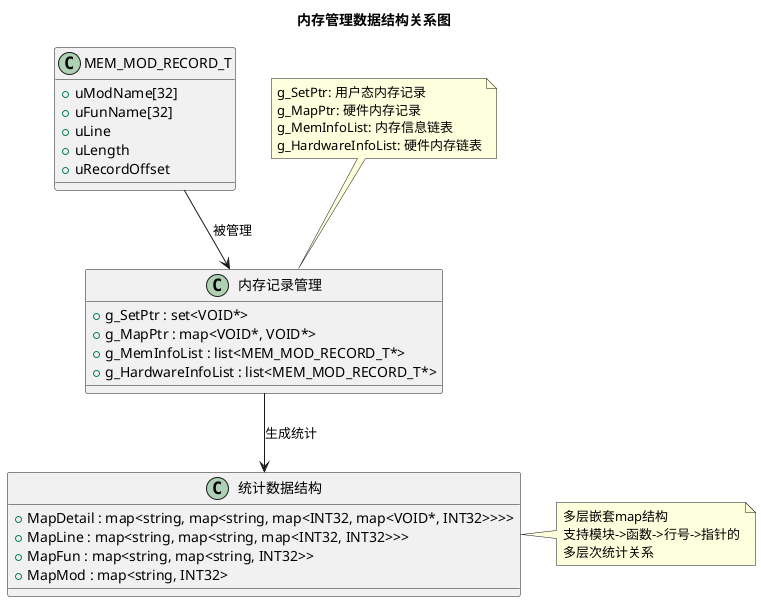
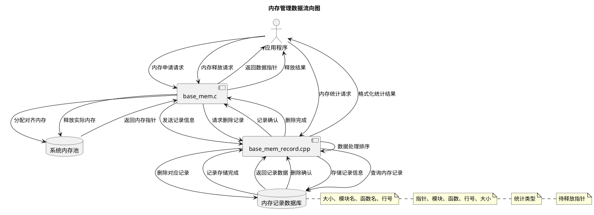
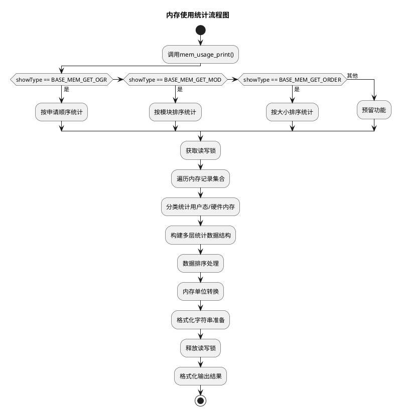

# 嵌入式内存管理系统设计文档

## 概述

本文档详细分析了海康威视DSP项目中`base_mem.c`和`base_mem_record.cpp`两个内存管理模块的设计架构、数据流程和嵌入式设备适用性。

## 1. 系统架构设计

### 1.1 整体架构图

### 1.2 核心功能模块

- **base_mem.c**: 提供内存分配、释放的核心功能，支持字节对齐
- **base_mem_record.cpp**: 负责内存使用记录、统计和调试信息管理
- **base_mem.h**: 提供统一的对外接口和宏定义

## 2. 内存分配流程图

### 2.1 内存申请流程

### 2.2 内存释放流程

## 3. 数据流程图

### 3.1 数据结构关系图

### 3.2 数据流向图

## 4. 内存统计流程图

### 4.1 内存使用统计流程

## 5. 嵌入式设备适用性分析

### 5.1 适用性优势

**? 内存效率优化**
- **字节对齐支持**: 支持4/8字节对齐，符合嵌入式处理器特性
- **最小内存开销**: 记录头结构紧凑，额外开销小
- **内存碎片控制**: 统一的内存管理减少碎片

**? 调试能力强大**
- **模块级监控**: 按模块统计内存使用，便于问题定位
- **行号追踪**: 记录分配位置，支持精确调试
- **多种统计模式**: 支持按大小、模块、申请顺序等多种统计

**? 资源监控完善**
- **实时监控**: 运行时动态监控内存使用情况
- **泄漏检测**: 通过记录跟踪检测内存泄漏
- **使用分析**: 提供详细的内存使用分析报告

**? 跨平台兼容**
- **RTOS支持**: 适配多种实时操作系统
- **平台抽象**: 统一的接口设计，便于移植
- **配置灵活**: 支持不同对齐要求和统计配置

### 5.2 在嵌入式设备中的典型应用场景

**智能安防设备**（如门口机、摄像头）：
- 视频缓冲区管理
- 音频数据处理
- 网络通信缓冲
- 图像处理算法内存

**工业控制设备**：
- 实时数据采集缓冲
- 控制算法内存分配
- 通信协议处理
- 设备状态管理

**物联网终端**：
- 传感器数据处理
- 无线通信缓冲
- 本地计算内存
- 固件更新缓存

### 5.3 设计特点与嵌入式需求匹配

| 嵌入式需求 | 本系统设计 | 匹配度 |
|----------|-----------|--------|
| 内存受限环境 | 最小开销记录头 | ????? |
| 实时性要求 | 快速分配释放 | ???? |
| 稳定性要求 | 完善的错误处理 | ????? |
| 调试需求 | 详细的使用统计 | ????? |
| 可移植性 | 平台抽象接口 | ???? |

## 6. 总结

该内存管理系统是一个典型的嵌入式设备专用内存管理方案，具有以下突出特点：

1. **专业化设计**: 专门为嵌入式DSP设备优化，考虑了嵌入式环境的特殊需求
2. **完善的调试支持**: 提供了丰富的内存使用统计和调试信息
3. **高效的内存管理**: 支持字节对齐，减少内存碎片
4. **良好的可扩展性**: 模块化设计便于功能扩展和维护

在嵌入式设备，特别是资源受限的DSP处理环境中，这种内存管理方案具有很高的实用价值和适用性。它不仅提供了基本的内存分配功能，更重要的是提供了完善的调试和监控能力，这对于嵌入式设备的稳定运行和问题排查至关重要。
