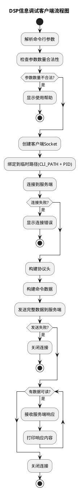

# DSP信息调试系统 Socket 通信流程分析

## 概述

本系统是一个基于Unix Domain Socket的DSP信息调试系统，包含服务端（`base_dspinfo_server.c`）和客户端（`base_dspinfo_client.c`）两部分。系统允许用户通过命令行工具向DSP进程发送调试命令。

## 系统架构

```
用户命令行输入
     ↓
dspinfo客户端 (base_dspinfo_client.c)
     ↓
Unix Domain Socket 通信
     ↓
dspinfo服务端 (base_dspinfo_server.c)
     ↓
命令分发 → 各模块注册的回调函数
```

## Socket 通信关键点详解

### 1. Unix Domain Socket 类型选择

系统使用Unix Domain Socket，这是一种本地进程间通信机制：

- **AF_UNIX**: 用于非RTOS环境（Linux/Android）
- **AF_INET**: 用于RTOS环境

Unix Domain Socket相比网络Socket的优势：
- 更高的性能（不需要网络协议栈）
- 更好的安全性（仅限于本地进程）
- 更简单的配置（基于文件系统路径）

### 2. 通信协议设计

系统采用自定义的协议头格式：

```c
typedef struct tagDspinfoHeaderSt {
    INT32 iLength;    // 总数据长度: 16 + iCmdLen + iArgLen
    INT32 iArgcNum;   // 参数个数
    INT32 iCmdLen;    // 命令名称长度
    INT32 iArgLen;    // 参数总长度
} DSPINFO_HEADER_ST;
```

数据格式：`Header + Command + Parameters`

## 服务端流程图 (PlantUML)

```plantuml
@startuml
title DSP信息调试服务端流程图

start

:初始化全局变量;
:创建监听Socket;
:绑定到指定路径(SERVER_PATH);
:设置监听队列大小(10);

while (监听Socket成功?) is (失败)
    :等待1秒后重试;
endwhile

while (true) is (主循环)
    :等待客户端连接;
    
    if (连接成功?) then (失败)
        :记录错误日志;
        continue;
    endif
    
    :接收协议头数据;
    
    if (接收失败?) then (是)
        :关闭客户端连接;
        continue;
    endif
    
    :计算命令数据长度;
    
    if (数据长度异常?) then (是)
        :关闭客户端连接;
        continue;
    endif
    
    :接收命令数据;
    
    if (接收失败?) then (是)
        :关闭客户端连接;
        continue;
    endif
    
    :解析命令参数;
    :查找注册的命令;
    
    if (命令存在?) then (是)
        :执行对应的回调函数;
        
        if (执行成功?) then (是)
            :发送成功响应;
        else (失败)
            :发送错误信息;
        endif
    else (不存在)
        :发送"命令未找到"错误;
    endif
    
    :关闭客户端连接;
endwhile

stop
@enduml
```

## 客户端流程图 (PlantUML)



## 关键函数详解

### 服务端关键函数

#### 1. `priv_dspinfo_server_listen()`
- 功能：创建并绑定监听Socket
- 关键步骤：
  - 创建Socket (`socket()`)
  - 删除已存在的socket文件 (`unlink()`)
  - 绑定到指定路径 (`bind()`)
  - 开始监听 (`listen()`)

#### 2. `base_dspinfo_server_task()`
- 功能：服务端主线程函数
- 关键流程：
  - 持续监听客户端连接
  - 接收协议头和命令数据
  - 解析并执行命令
  - 返回执行结果

#### 3. `priv_dspinfo_cb_fxn()`
- 功能：命令回调分发函数
- 支持两种参数类型：
  - `CMD_TYPE_NUMBER`: 数值参数
  - 其他：字符串参数或无参数

### 客户端关键函数

#### 1. `dspinfo_client_connect()`
- 功能：建立与服务端的连接
- 关键步骤：
  - 创建客户端Socket
  - 绑定到临时路径（基于PID）
  - 设置文件权限
  - 连接到服务端

#### 2. `main()`
- 功能：客户端主函数
- 关键流程：
  - 参数验证
  - 建立连接
  - 构建和发送数据
  - 接收和显示响应

## Socket 通信详细流程

### 连接建立阶段
1. **服务端启动**：
   - 创建监听Socket
   - 绑定到固定路径（如`/var/dspcmd.socket`）
   - 开始监听连接

2. **客户端连接**：
   - 创建客户端Socket
   - 绑定到临时路径（如`/var/12345`，12345为PID）
   - 连接到服务端路径

### 数据传输阶段
1. **客户端发送**：
   - 构建协议头（包含长度、参数个数等信息）
   - 拼接命令和参数数据
   - 一次性发送完整数据

2. **服务端接收**：
   - 先接收协议头（固定16字节）
   - 根据协议头中的长度信息接收剩余数据
   - 解析命令和参数

### 命令执行阶段
1. **命令查找**：
   - 在注册的命令链表中查找匹配的命令
   - 验证命令的有效性

2. **回调执行**：
   - 根据参数类型进行适当转换
   - 调用注册的回调函数
   - 处理执行结果

### 连接关闭阶段
- 每次命令执行完成后关闭连接
- 采用短连接模式，避免资源占用

## 错误处理机制

### 服务端错误处理
- Socket创建失败：重试机制
- 连接异常：关闭连接并继续监听
- 数据接收异常：记录日志并继续
- 命令执行失败：返回错误信息

### 客户端错误处理
- 参数验证：显示使用帮助
- 连接失败：提示网络问题
- 数据发送失败：安全关闭连接

## 性能优化考虑

1. **短连接设计**：避免长期占用连接资源
2. **数据缓冲区复用**：减少内存分配开销
3. **协议头优化**：固定长度头部便于解析
4. **错误恢复机制**：服务端异常后自动恢复监听

## 安全考虑

1. **文件权限控制**：客户端临时文件设置适当权限
2. **路径隔离**：使用特定目录避免冲突
3. **参数验证**：对输入参数进行合法性检查
4. **缓冲区边界检查**：防止缓冲区溢出

## 扩展性设计

1. **命令注册机制**：支持动态添加新命令
2. **回调函数接口**：统一的命令执行接口
3. **协议可扩展**：头部设计支持未来扩展
4. **多环境支持**：兼容Linux、Android、RTOS等环境

这个系统设计体现了良好的模块化思想和错误处理机制，为DSP调试提供了可靠的通信基础。
