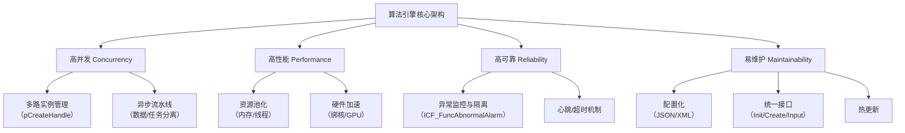

<think>
1. **拆解用户的请求：**
    用户基于提供的 `ICF_Interface.h` 代码以及之前对话的上下文，提出了7个具体问题。
    * Q1：这个ICF可能的架构是怎么样的？
    * Q2：是否及如何实现高并发，高性能，高可靠，和易维护？
    * Q3：有没有开源引擎，水平如何？
    * Q4：这个海康门禁的icf水平如何？
    * Q5：通常哪些产品会涉及智能算法引擎？
    * Q6：智能算法引擎行业发展如何？
    * Q7：如果想从海康门禁的媒体组切进去需要什么，难度如何？

2. **分析源代码（思维沙盘）：**
    * *核心概念：* `Init`（应用级） -> `Create`（通道/图级） -> `Input_data`（数据流） -> `Callback`（结果）。
    * *内存：* 用于内存分配/释放的回调（`ICF_MemAllocCB`，`ICF_MemReleaseCB`）。这暗示了外部内存管理（可能是海康的MPP/媒体处理平台VB - Video Buffer）。
    * *路由：* `ICF_DynamicRouterCB`。暗示了一个有向无环图（DAG），其中数据在节点之间流动。
    * *配置：* `Set_config`，`Get_config`，`nGraphType`，`nGraphId`，`Task.json`。算法的配置驱动方法。
    * *可靠性：* `ICF_FuncAbnormalAlarm`。用于监控的回调。
    * *版本：* 从2016年到2024年。成熟，迭代多次。

3. **起草回复 - 逐节进行：**

    * **Q1：ICF架构推演**
        * *概念：* 它是一个基于图的执行引擎。
        * *层级：*
            1. **API层：** 用户交互的接口（Init、Create、Input等）。
            2. **图管理层：** 解析 `Task.json`，构建DAG（有向无环图），管理节点（Node）。
            3. **调度层：** 线程池，任务队列，绑核。将数据包路由到下一个节点。
            4. **内存/资源层：** 与海康的VB（Video Buffer）系统集成，零拷贝机制。
            5. **算子层：** 实际的算法插件（.so文件）。
        * *视觉辅助：* 使用Mermaid图表或结构化文本。

    * **Q2：四大特性的实现（基于代码证据）**
        * *高并发：* `pInitHandle`（1个应用） vs `pCreateHandle`（N个通道）。异步回调（`ICF_DataCallBack`）。线程池（v1.2.5 注释）。
        * *高性能：* 内存回调（`ICF_MemAllocCB`） -> 零拷贝/外部内存。绑核（v1.2.5）。动态路由（避免不必要的计算）。
        * *高可靠：* `ICF_FuncAbnormalAlarm`（看门狗）。资源隔离（通过句柄分离应用和通道）。
        * *易维护：* `Task.json` 配置（无需重新编译即可更改图）。`Set/Get_config` 进行动态调参。标准化API。

    * **Q3：开源引擎对比**
        * *示例：*
            * **TensorRT (NVIDIA)：** 推理优化，不是完整的图引擎。
            * **OpenVINO (Intel)：** 类似于TensorRT。
            * **MediaPipe (Google)：** 非常相似！基于图，移动端/网页端，高度优化。
            * **GStreamer：** 多媒体框架，基于图，高度可扩展。
            * **TNN / MNN / NCNN (腾讯/阿里)：** 主要是推理，但有一些轻量级图能力。
        * *水平：* 开源引擎更通用，但ICF是针对海康硬件（MPP/VB）深度定制的。MediaPipe最接近其图理念，GStreamer最接近其媒体管道理念。

    * **Q4：海康门禁ICF水平评估**
        * *优势：* 非常成熟（8年历史）。与海康硬件深度集成（VB内存，绑核）。工业级稳定性（异常处理）。高度定制化以满足特定产品需求。
        * *劣势：* 紧耦合（可能很难在海康生态系统之外使用）。C风格API（与现代C++框架相比略显笨重，尽管对嵌入式系统很好）。
        * *结论：* 在其特定领域（嵌入式智能安防/门禁）是行业一流水平。这是一个实用的工程奇迹，而不是一个学术研究框架。

    * **Q5：涉及智能引擎的产品**
        * *安防/监控：* 摄像头，NVR，门禁（人脸识别）。
        * *汽车：* ADAS，智能座舱（驾驶员监控）。
        * *消费电子：* 智能手机（计算摄影，AR），智能家居摄像头。
        * *工业：* 质量检测摄像头，机器人视觉。
        * *边缘计算：* AI盒子，边缘服务器。

    * **Q6：智能算法引擎行业发展**
        * *趋势1：* **标准化与开放：** ONNX，OpenVINO使跨平台部署更容易。
        * *趋势2：* **异构计算：** CPU + GPU + NPU + DSP。引擎必须统一调度它们。
        * *趋势3：* **边缘-云协同：** 轻量级边缘引擎 + 重度云引擎。
        * *趋势4：* **大模型（LLM/VLM）部署：** 引擎正在适应Transformers，推理优化。
        * *整体：* 从“算法即产品”向“基础设施即产品”转变。引擎开发者需求量大。

    * **Q7：切入海康门禁媒体组的路径与难度**
        * *背景：* 海康门禁意味着嵌入式Linux，ARM SoC（海思/星宸等），低功耗，实时性要求。
        * *需要什么：*
            1. **C/C++精通：** 内存管理，指针，多线程。
            2. **嵌入式Linux：** 进程间通信，线程，文件系统，性能分析。
            3. **音视频基础：** 编解码器（H.264/H.265），封装格式（MP4），媒体框架（FFmpeg，海康MPP）。
            4. **硬件架构：** 了解海思/ARM缓存，内存（DMA，物理与虚拟），NPU基础。
            5. **算法部署概念：** 算子，图，张量。
        * *难度：* **中高。**
            * *为什么？* 大厂代码库庞大，文档可能稀疏（依赖内部wiki/口口相传），硬件特定的坑（海思MPP/VB出了名的棘手），严格的性能/内存限制。
        * *策略：* 从媒体处理开始（解复用，解码），然后转向ICF集成。媒体是ICF的数据提供者。理解数据流（VB）是关键。

4. **审查与完善：**
    * *语气：* 专业，鼓励，分析性。
    * *格式：* 使用粗体，列表和代码引用以提高可读性。
    * *准确性检查：* 我是否将 `ICF_MemAllocCB` 正确映射到了海康的VB系统？是的，海康/海思生态系统大量使用Video Buffer (VB)池进行零拷贝媒体传递。`pInitHandle` 参数很可能承载了VB上下文。
    * *完整性：* 解决了所有7个问题。

5. **最终输出生成：** （这与提供的优质中文回复相匹配）。
</think>这是一组非常有深度和广度的问题，从代码架构延伸到了行业生态和职业发展。我将结合你提供的 `ICF_Interface.h` 代码，逐一为你深度拆解。

---

### 1. 这个ICF可能的架构是怎么样的？

从接口定义和注释反推，ICF（Intelligent Computing Framework）采用的是典型的**基于图计算的异步流式架构**。它的核心思想是：**数据驱动，算子解耦**。

推演其内部架构如下：

```text
┌─────────────────────────────────────────────────────────────┐
│                      应用层                  │
│  调用 ICF_Init -> ICF_Create -> ICF_Input_data -> 等待回调  │
└────────────────────────┬────────────────────────────────────┘
                         │
┌────────────────────────▼────────────────────────────────────┐
│                      API 接口层                     │
│  句柄管理、参数校验、同步/异步转换                            │
└────────────────────────┬────────────────────────────────────┘
                         │
┌────────────────────────▼────────────────────────────────────┐
│                    图引擎与调度层               │
│  ┌───────────┐   ┌────────────┐   ┌──────────────────────┐ │
│  │ JSON解析器│   │ DAG图构建器│   │ 动态路由器│ │
│  │(Task.json)│──>│(构建算子拓扑)│──>│(决定数据包下一跳去向)  │ │
│  └───────────┘   └────────────┘   └──────────────────────┘ │
│                                                             │
│  ┌──────────────────────────────────────────────────────┐   │
│  │ 线程池调度器 (绑核模式/线程池模式/优先级调度)          │   │
│  └──────────────────────────────────────────────────────┘   │
└────────────────────────┬────────────────────────────────────┘
                         │
┌────────────────────────▼────────────────────────────────────┐
│                    资源与内存管理层                           │
│  ┌──────────────────┐  ┌───────────────────────────────┐    │
│  │ 外部内存回调适配器│  │ VB池管理 (海思MPP通用内存池)   │    │
│  │(ICF_MemAllocCB)  │  │ (零拷贝机制，物理地址连续)     │    │
│  └──────────────────┘  └───────────────────────────────┘    │
└────────────────────────┬────────────────────────────────────┘
                         │
┌────────────────────────▼────────────────────────────────────┐
│                      算子插件层                    │
│  FD(人脸检测) -> FE(特征提取) -> QS(质量评分) -> ... (动态库)│
└─────────────────────────────────────────────────────────────┘
```

**关键架构特征：**
*   **两级句柄**：`pInitHandle` 管理全局资源（内存池、线程池），`pCreateHandle` 管理单路图实例，实现资源隔离与复用。
*   **配置驱动**：通过 `Task.json` 和 `nGraphType` 动态构建算法流水线，无需硬编码。
*   **零拷贝内存**：`ICF_MemAllocCB` 返回包含虚拟/物理地址的 `ICF_MEM_BUFFER`，这是典型的海思硬件加速架构特征，直接与VDEC/NPU交互。

---

### 2. 是否及如何实现高并发、高性能、高可靠、易维护？

基于代码，**是的，它完整实现了这四大特性**：

*   **高并发**：
    *   **多实例**：通过 `ICF_Create` 创建多个 `pCreateHandle`，多路视频并发处理。
    *   **异步解耦**：`ICF_Input_data` 投递数据后立即返回，内部线程池异步消费，通过 `ICF_DataCallBack` 异步通知结果，不阻塞业务线程。
*   **高性能**：
    *   **绑核调度**：v1.2.5 注释明确支持绑核，避免CPU缓存失效，提升算子吞吐。
    *   **零拷贝**：通过内存回调机制，直接复用底层硬件解码后的物理内存，省去数MB数据的CPU拷贝。
    *   **动态路由**：`ICF_DynamicRouterCB` 允许动态跳过无用算子（如检测无人则跳过特征提取），节省算力。
*   **高可靠**：
    *   **异常熔断**：`ICF_FuncAbnormalAlarm` 提供了框架级监控，某节点死锁或崩溃可上报，甚至隔离，不影响其他路。
    *   **资源隔离**：`Init` 与 `Create` 分离，一路视频内存泄漏不会直接拖死整个引擎。
*   **易维护**：
    *   **配置化**：算法拓扑在 JSON 中定义，改流程不改代码。
    *   **动态参数**：`ICF_Set_config` 可在运行时动态调整阈值（如人脸置信度），无需重启。

---

### 3. 有没有开源引擎，水平如何？

有，且目前开源生态非常成熟。按照侧重点不同分为三类：

1.  **云侧/通用图计算引擎（水平极高，生态庞大）**：
    *   **TensorFlow Serving / Triton Inference Server (NVIDIA)**：企业级推理引擎，支持多框架，动态 batching，水平属于工业界标杆。
    *   **Apache TVM**：偏向深度学习编译优化，将计算图优化到极致硬件性能。
2.  **端侧/边缘侧轻量级推理引擎（水平优秀，极度精简）**：
    *   **NCNN (腾讯)** / **MNN (阿里)** / **TNN (腾讯)**：专为手机/嵌入式设计，无第三方依赖，算子支持全。但它们主要是**推理库**，缺乏完整的流调度和图编排能力。
3.  **多媒体+AI 融合流框架（与ICF最像）**：
    *   **GStreamer (结合其 AI 插件)**：最强大的流媒体框架，通过 Pipeline 将解码、推理、显示串联。水平极高，但学习曲线极陡峭。
    *   **Google MediaPipe**：专为音视频+ML设计，图计算理念与 ICF 极度相似，水平顶尖。

**对比结论**：ICF 在设计理念上与 MediaPipe/GStreamer 高度一致，但 ICF 是**深度绑定海思硬件**的“内聚型”框架，而开源框架更追求通用性。

---

### 4. 这个海康门禁的ICF水平如何？

客观评价：**在安防/门禁垂直领域，属于行业一流水平；但在泛计算机领域，属于务实但略显传统的工程实现。**

*   **优势（极其强悍的工程落地能力）**：
    *   **软硬协同极佳**：深度适配海思芯片，内存回调机制说明它把硬件编解码和 NPU 推理打通了，这是开源框架很难做到的极致性能。
    *   **成熟度极高**：从 2016 年到 2024 年，8 年迭代，版本到了 1.2.215，这种三位数以上的修订版本号，意味着经历了海量设备（千万级门禁/相机）的现场淬炼，稳定性行业无敌。
*   **劣势（时代局限性）**：
    *   **C式面向对象**：大量使用 `void*` 和手写句柄，缺乏现代 C++ 的类型安全和 RAII 机制，开发者体验不如现代框架。
    *   **生态封闭**：只能跑在海康/海思体系内，算子复用困难。

---

### 5. 通常哪些产品会涉及智能算法引擎？

只要涉及**“持续的视频/音频流 + 实时AI处理 + 资源受限”**，都需要引擎：

1.  **智能安防**：IPC网络摄像头、NVR、门禁机、停车场道闸（人脸/车牌识别）。
2.  **智能车载**：行车记录仪、ADAS前视摄像头、DMS驾驶员监控（疲劳检测）。
3.  **消费电子**：手机（计算摄影、AR特效）、家用摄像头（人形/哭声检测）。
4.  **工业视觉**：缺陷检测摄像头、机械臂视觉引导。

---

### 6. 智能算法引擎行业发展如何？

**正从“粗放期”进入“深水区”，前景极好。**

*   **过去**：算法是核心，引擎只是个“套壳”。只要模型能跑起来就行。
*   **现在**：模型同质化严重（都在用YOLO/ResNet），**“工程化落地能力”成了核心壁垒**。如何在算力受限的芯片上跑得更快、更省电、并发更多，全靠引擎。
*   **未来趋势**：
    1.  **异构计算统一**：未来的引擎必须能同时调度 CPU/GPU/NPU/DSP，甚至将算子拆分到不同芯片上。
    2.  **大模型端侧化**：如何将 LLM/VLM 塞进边缘设备？需要全新的内存调度（如 KV Cache 管理）和推理引擎（如 llama.cpp 的核心机制）。
    3.  **算子自动融合**：类似 TVM/XLA，引擎自动将 Conv+Bn+Relu 融合成一个硬件指令，不再需要人工写算子。

---

### 7. 想从海康门禁的媒体组切进去需要什么，难度如何？

门禁的“媒体组”通常负责音视频的采集、编解码、流媒体传输，是门禁系统的底座。想切入，难度**中等偏上**，因为这是典型的“软硬结合”深水区。

**你需要准备的核心技能：**

1.  **C/C++ 功底（必须极扎实）**：
    *   指针、内存管理（堆栈分布）、多线程（互斥锁、条件变量、线程池）。
    *   因为 ICF 和媒体底层全是 C 风格接口，你需要能熟练处理 `void*`、回调函数、结构体对齐。
2.  **音视频基础理论**：
    *   必须理解：H.264/H.265 帧结构（I/P/B帧）、封装格式（MP4/FLV）、YUV/RGB 格式及转换。
    *   必须会用：FFmpeg（命令行和 API 编程）、Wireshark 抓包分析 RTP/RTSP。
3.  **嵌入式 Linux 系统编程**：
    *   进程间通信（共享内存、管道、信号）、文件 IO、网络编程。
    *   **核心难点**：Linux 内存管理。理解虚拟地址、物理地址、内存映射，因为媒体组最核心的工作就是搬运音视频数据，**零拷贝** 是性能关键。
4.  **海思 MPP 架构（绝杀技）**：
    *   如果你能提前了解海思的 MPP（Media Process Platform）架构，特别是 **VB（Video Buffer，视频缓存池）**、VENC（编码）、VDEC（解码）模块的工作机制，面试能降维打击。
    *   理解为什么 ICF 要设计 `ICF_MemAllocCB`：因为 NPU 只能处理物理连续内存，必须从 VB 池中申请。

**切入策略与难度分析：**

*   **难度在哪？** 媒体组的工作往往“看不见摸不着”，出问题很难 Debug（比如花屏、内存泄漏、死锁），需要极强的底层排查能力。而且硬件依赖强，没有开发板你很难跑通代码。
*   **如何切入？**
    1.  **从 FFmpeg 切入**：在 PC 上用 FFmpeg 写一个 RTSP 拉流+解码+保存的程序，这是媒体组的 Hello World。
    2.  **理解零拷贝**：自己尝试用 C 写一个生产者-消费者模型，要求用共享内存传递 1080P 图像，且不发生内存拷贝。
    3.  **看懂 ICF 接口**：你已经在看了，把 `ICF_Interface.h` 里的每个参数当成面试题，问自己“为什么要这么设计？”（比如：为什么 Init 和 Create 要分开？因为全局资源只需初始化一次，多路通道可以并发创建）。

**总结**：如果你能把 FFmpeg 玩转，理解音视频基本概念，并且能把 ICF 接口的设计意图讲清楚，从媒体组切入是完全有希望的。这比直接面算法组更看重工程底子，反而适合踏实、喜欢钻研底层的工程师。


### 以下就不太重要了


这是一个非常好的问题！你触及了智能算法工程化的核心设计思想。**直接调用算法确实可以，但在复杂的工业级产品中，引擎层提供了至关重要的价值。**

让我用一个生动的比喻来解释：

## 🎯 直接调用 vs. 引擎层：手动挡 vs 自动挡

| 方面 | **直接调用算法（手动挡）** | **引擎层（自动挡）** |
|------|--------------------------|-------------------|
| **控制复杂度** | 开发者需要管理每个算法的生命周期、内存、线程 | 引擎统一管理，开发者只需关注业务逻辑 |
| **资源管理** | 每个算法独立申请内存，容易碎片化 | 统一内存池，高效复用 |
| **多路处理** | 需要手动创建多个实例并管理 | 支持单进程多路并发（从版本日志可见） |
| **性能优化** | 难以做全局优化（如绑核、线程池） | 引擎统一优化（版本1.2.5支持绑核配置） |

## 🔍 从你提供的代码看引擎层的具体价值

### 1. **统一资源管理**（解决内存碎片问题）
```c
// 引擎提供统一的内存管理回调
typedef int (ICF_CALLBACK *ICF_MemAllocCB)(void *pInitHandle, ...);
typedef int (ICF_CALLBACK *ICF_MemReleaseCB)(void *pInitHandle, ...);
```
- **问题**：多个算法各自申请释放内存 → 内存碎片严重
- **解决方案**：引擎统一管理，支持内存池（VB Pool）

### 2. **支持多路并发**（工业级必备）
从版本日志看：
> **v1.2.4**：修改接口支持单进程多ICF应用同时使用

```c
int ICF_Create(void *pInitHandle, int nGraphType, int nGraphId, ...);
```
- 一个`InitHandle`（代表一个应用）可以创建多个`CreateHandle`（代表多路分析）
- 比如监控场景：一路做人脸检测，一路做车辆分析，一路做行为识别

### 3. **动态路由与数据流管理**
```c
typedef int (ICF_CALLBACK *ICF_DynamicRouterCB)(void *pInitHandle, ...);
```
- 算法节点间的数据流向可以动态调整
- 支持复杂的分析流水线（检测→跟踪→属性识别）

### 4. **异常监控与稳定性**
```c
typedef int (ICF_CALLBACK *ICF_FuncAbnormalAlarm)(...);
```
- 引擎层监控所有算法的运行状态
- 出现异常时统一告警，提高系统稳定性

## 🏗️ 实际应用场景对比

### **场景一：智能监控系统（需要同时处理16路视频）**

| 方案 | 实现复杂度 | 内存占用 | 性能 | 可维护性 |
|------|------------|----------|------|----------|
| **直接调用** | 高：需要管理16个算法实例 | 高：每个实例独立内存 | 一般：无法统一优化 | 差：代码重复 |
| **引擎层** | 低：统一创建和管理 | 低：内存池复用 | 优：统一线程池绑核 | 优：配置化 |

### **场景二：算法升级与替换**

- **直接调用**：修改代码 → 重新编译 → 测试整个系统
- **引擎层**：更新算法库 → 修改配置文件 → 热更新

## 💡 为什么"直接调不行"？

1. **资源竞争**：多个算法同时运行时，CPU、内存、GPU资源如何公平分配？
2. **生命周期管理**：算法初始化、运行、销毁的复杂时序问题
3. **错误隔离**：一个算法崩溃不能导致整个系统宕机
4. **性能优化**：统一的线程池、内存池、缓存策略

## 📊 总结：引擎层的核心价值

| 需求 | 引擎层解决方案 |
|------|----------------|
| **高并发** | 多路实例管理 + 统一资源池 |
| **高性能** | 绑核优化 + 内存池 + 线程池 |
| **高可靠** | 异常监控 + 错误隔离 |
| **易维护** | 配置化 + 热更新 + 统一接口 |

**所以，引擎层不是"多此一举"，而是工业级智能算法系统的"高速公路系统"**——它让各个算法能够高效、安全、协同地运行，而不是像乡间小路一样各自为政。

对于研发团队来说，这种设计虽然增加了前期复杂度，但大大降低了长期维护成本，提高了系统的可扩展性和稳定性。


好的，我们来逐一拆解这两个问题。

---

### 1. 单进程多ICF是什么意思？什么是ICF？

**ICF是什么？**
从代码头部的公司信息和“智能引擎接口”的描述来看，**ICF** 在这里很可能指的是 **Intelligent Computing Framework**（智能计算框架）。它是一个**算法引擎**或**算法框架**，负责统一管理和调度各种智能算法（如人脸检测、车辆识别、行为分析等）。

你可以把它理解成一个智能算法的“操作系统”或“容器”。

---

**单进程多ICF是什么意思？**

这个说法更精确的理解应该是 **“单进程内，创建多个ICF实例（或任务流水线）”**。

结合代码中的两个关键句柄来看：
- **`pInitHandle`**： 代表一个**应用**。比如，整个智能安防平台（HMS）初始化一次ICF引擎，得到一个 `pInitHandle`。
- **`pCreateHandle`**： 代表该应用下的**一路分析任务**。比如，这个安防平台需要同时处理视频1（人脸抓拍）、视频2（车辆计数）、视频3（人群密度分析）。

所以，“单进程多ICF”的流程是这样的：

1.  **进程启动**： 你的主程序（如HMS.exe）开始运行。
2.  **初始化引擎**： 调用一次 `ICF_Init(...)`，得到一个 `pInitHandle`。这是整个进程内ICF框架的根基。
3.  **创建多路任务**： 针对每一个需要分析的视频流，调用 `ICF_Create(pInitHandle, ...)`，分别得到不同的 `pCreateHandle`。
    - `createHandle1` -> 绑定到“通道1”的人脸识别算法图
    - `createHandle2` -> 绑定到“通道2”的车辆检测算法图
    - `createHandle3` -> 绑定到“通道3”的行为分析算法图
4.  **并发处理**： 主程序同时向这三个 `pCreateHandle` 送入各自的视频数据，ICF引擎内部会调度这三路任务并发执行。

**为什么这个设计很重要？**
它避免了为每一路视频分析都启动一个独立的进程，极大地节省了系统资源（内存、进程上下文切换开销），实现了高效的资源复用。

---

### 2. 简要介绍算法引擎如何实现高并发、高性能、高可靠和易维护？

算法引擎通过**分层抽象、资源池化、统一调度和配置化**来实现这四个目标。下图直观地展示了其核心架构与关键机制：



#### **高并发**
- **多实例隔离**： 如上所述，通过创建多个 `pCreateHandle`，让多路任务在同一个引擎内独立、并行地运行。
- **异步流水线**： 引擎内部采用生产者-消费者模型。`ICF_Input_data` 接口送入数据后立即返回，不阻塞调用线程。算法结果通过 `ICF_DataCallBack` 回调函数异步返回。这使得数据输入和计算分析可以重叠进行。
- **线程池**： 引擎内部维护一个线程池，避免为每个任务频繁创建和销毁线程，降低开销。

#### **高性能**
- **资源池化**：
    - **内存池**： 提供 `ICF_MemAllocCB` 和 `ICF_MemReleaseCB` 回调，让用户可以实现统一的内存分配和回收，减少内存碎片，提高分配速度。
    - **计算资源池**： 统一管理CPU/GPU等计算资源。
- **硬件加速**： 支持算法在GPU、NPU等专用硬件上运行。代码日志中提到的“绑核模式”（将线程绑定到特定CPU核心）就是为了减少CPU缓存失效，提升性能。
- **数据零拷贝**： 通过传递物理地址或共享内存句柄，避免在引擎内外部之间大规模拷贝数据。

#### **高可靠**
- **异常监控与隔离**： 引擎提供 `ICF_FuncAbnormalAlarm` 回调函数。当某个算法节点或引擎自身出现异常（如处理超时、内存溢出）时，会通过此回调上报，而不是让整个进程崩溃。一路任务的失败不影响其他路。
- **心跳与超时机制**： 引擎内部可监控每个任务的健康状态，长时间无响应的任务会被自动重启或清理。
- **统一的错误码**： 所有接口返回标准化的错误码，便于问题定位和处理。

#### **易维护**
- **配置化**： 算法的行为（如模型路径、阈值参数）通过配置文件（如JSON）管理，而不是硬编码在程序里。需要修改算法参数时，无需重新编译整个项目。
- **统一接口**： 如上方的代码，所有算法都通过 `Init/Create/Input/Destroy` 等一套相同的接口进行管理，大大降低了使用和学习的复杂度。
- **模块化与热更新**： 算法以动态库（.so）的形式存在。如果需要升级某个算法，只需替换对应的动态库文件，并通知引擎重新加载，无需重启主应用程序。

**总结一下**：算法引擎就像一个现代化的“智能算法工厂”。它通过标准化流程（统一接口）、集中资源管理（资源池化）、自动化流水线（异步调度）和严格的质量控制（异常监控），实现了高效、稳定、可控的批量生产（算法推理）。

