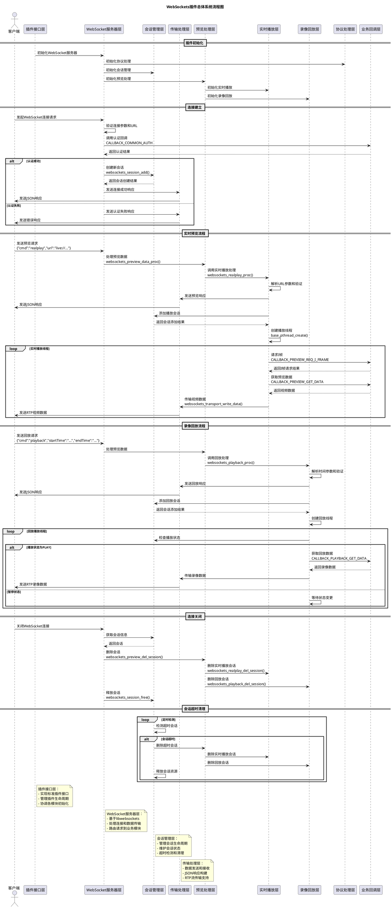
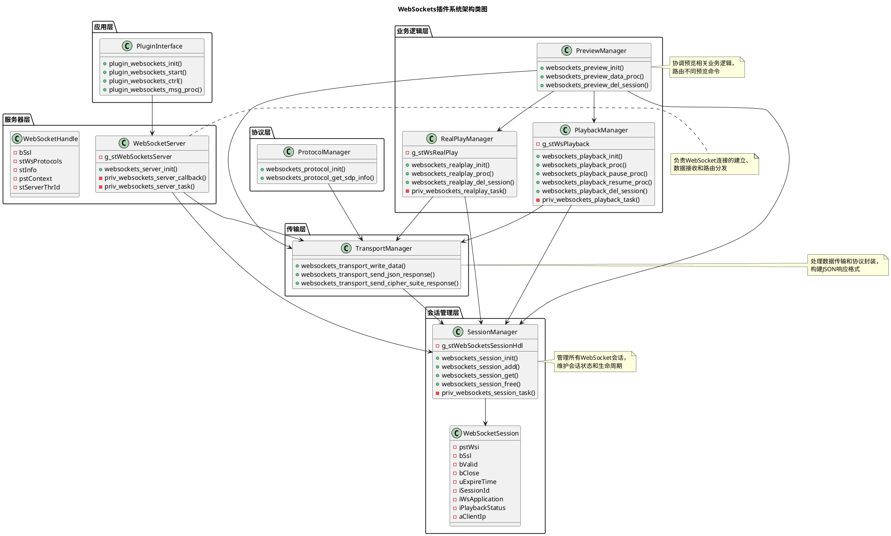
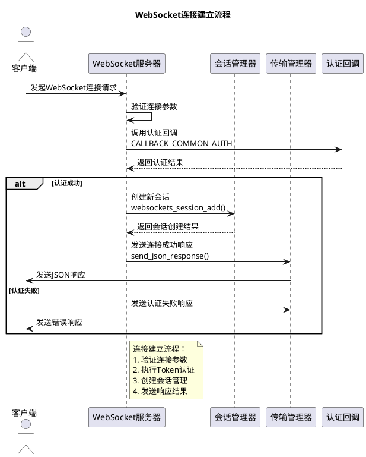
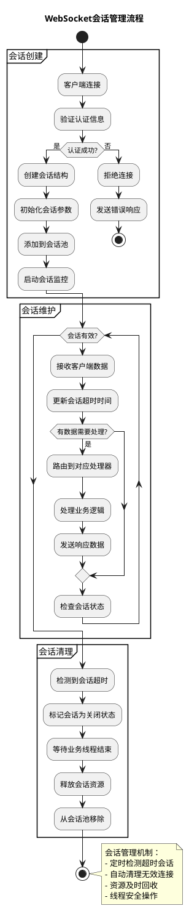
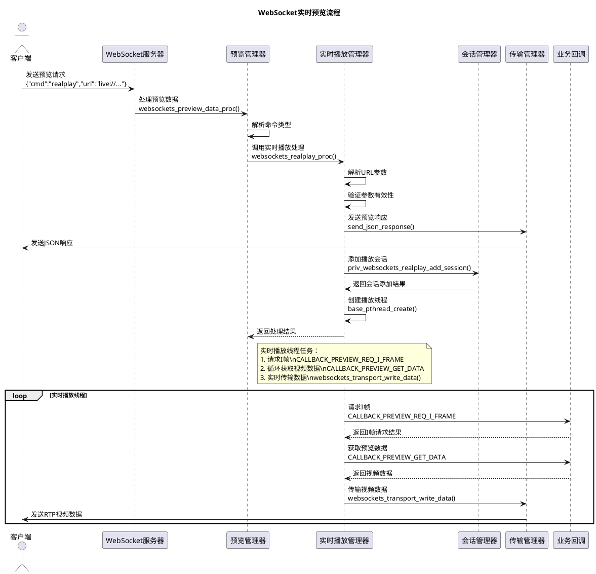
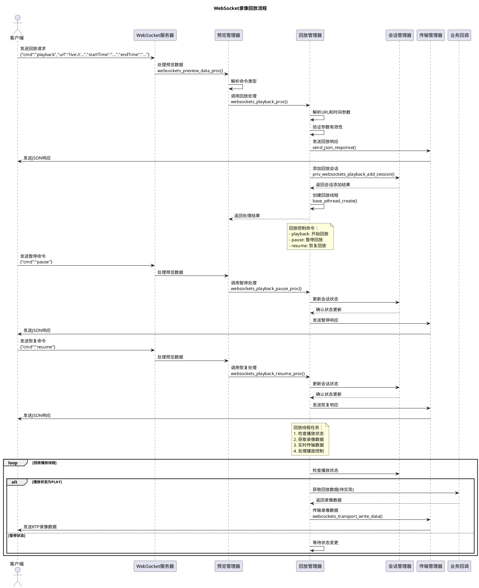

# WebSockets插件概要设计文档

## 1. 简介

### 1.1 编写目的
&nbsp;&nbsp;&nbsp;&nbsp;本文档旨在描述WebSockets插件的总体设计架构、功能模块划分、接口设计等核心内容，为后续开发、测试和维护提供技术参考。

### 1.2 项目背景
&nbsp;&nbsp;&nbsp;&nbsp;WebSockets插件是嵌入式设备中的一个重要组件，用于提供实时双向通信能力，支持实时预览、录像回放、事件通知等功能。

### 1.3 术语定义

| 术语 | 全称 | 说明 |
|------|------|------|
| **WebSocket** | Web Socket | 一种在单个TCP连接上进行全双工通信的协议 |
| **SDP** | Session Description Protocol | 会话描述协议，用于描述多媒体会话的参数 |
| **RTP** | Real-time Transport Protocol | 实时传输协议，用于传输音视频数据 |

### 1.4 参考资料

| 序号 | 参考文档 |
|------|----------|
|1| RFC 6455 WebSocket Protocol标准规范 |
|2| WebSocket库实现的官方技术文档 |

### 1.5 需求分析

#### 1.5.1 功能需求分析

| 包需求描述 | 设计需求描述 | 设计规格描述 |
|---------|---------|---------|
| 支持多路实时视频流的WebSocket传输 | 实现基于WebSocket协议的实时视频流传输功能 | 支持H.264/H.265编码，最大6路并发，传输延迟小于300ms |
| 支持历史录像的点播和控制 | 实现录像回放功能，支持时间范围查询和播放控制 | 支持播放、暂停、恢复控制操作，支持指定时间范围的录像检索 |
| 支持设备事件的实时推送 | 实现事件通知机制，支持设备告警等事件的实时推送 | 支持告警事件推送和订阅机制，确保事件及时送达客户端 |
| 支持通过WebSocket实现WebSSH连接 | 实现基于WebSocket的安全SSH通道功能 | 支持安全SSH通道和命令行交互，提供远程设备管理能力 |
| 支持连接认证和权限控制 | 实现WebSocket连接的认证机制 | 采用Token认证机制，拒绝未认证连接 |
| 支持加密数据传输 | 实现WebSocket数据传输的安全保护 | 支持SSL/TLS加密传输，保护敏感信息 |
| 支持多连接并发处理 | 实现WebSocket服务器的并发处理能力 | 支持至少32个并发连接，采用多线程处理机制 |
| 支持高效内存使用 | 实现WebSockets插件的内存管理优化 | 采用预分配内存池，及时释放不用资源，避免内存碎片 |
| 支持连接会话生命周期管理 | 实现WebSocket会话的全生命周期管理 | 支持会话创建、维护、超时清理等操作 |
| 支持运行状态监控 | 实现WebSockets插件的运行状态监控功能 | 支持连接数、资源使用、错误统计等监控指标 |

#### 1.5.2 非功能性需求分析

| 包需求描述 | 设计需求描述 | 设计规格描述 |
|---------|---------|---------|
| 支持高并发连接 | 实现WebSocket服务器的高并发处理能力 | 支持至少32个并发WebSocket连接 |
| 快速响应客户端请求 | 优化命令处理流程，减少响应时间 | 命令响应时间小于100ms |
| 低延迟视频传输 | 优化视频流传输机制，减少传输延迟 | 视频流传输延迟小于300ms |
| 低CPU资源占用 | 优化系统资源使用，减少CPU占用率 | 正常运行时CPU占用率不超过5% |
| 安全的连接认证 | 实现安全的连接认证机制 | 支持Token认证和访问控制 |
| 安全的数据传输 | 实现端到端的数据加密传输 | 支持SSL/TLS加密传输 |
| 稳定的长期运行 | 确保系统长期稳定运行 | 支持7×24小时连续运行 |
| 异常处理和恢复能力 | 实现异常情况的处理和恢复机制 | 支持异常断开重连和恢复 |
| 详细的日志记录 | 实现全面的操作和错误日志记录 | 支持详细的操作和错误日志 |
| 实时状态监控 | 实现运行状态的实时监控功能 | 支持运行状态实时监控 |
| 标准协议兼容 | 确保与标准协议的兼容性 | 符合RFC 6455 WebSocket协议标准 |
| 多平台支持 | 确保在不同平台上的兼容性 | 支持嵌入式Linux系统和ARM架构 |

## 2. 总体架构

### 2.1 系统说明

WebSockets插件采用分层架构设计，基于源码结构主要包括以下层次：

#### 2.1.1 插件接口层 (plugin_websockets.c)
- 作为WebSockets插件的入口点，实现标准插件接口
- 负责插件的初始化、启动、停止、控制等生命周期管理
- 提供消息处理和控制接口，与上层服务引擎对接
- 管理各功能模块的回调函数注册和分发

#### 2.1.2 WebSocket服务器层 (websockets_server.c)
- 基于libwebsockets库实现WebSocket服务器功能
- 管理普通和SSL两种连接模式的服务器实例
- 处理客户端连接建立、数据接收、连接关闭等核心事件
- 负责URL路由解析，将不同请求分发到对应的业务处理模块
- 实现连接认证和会话创建流程

#### 2.1.3 会话管理层 (websockets_session.c)
- 管理所有WebSocket连接会话，维护会话池
- 实现会话的创建、查询、销毁等生命周期管理
- 维护会话状态和超时检测机制
- 提供线程安全的会话访问接口
- 实现会话超时自动清理功能

#### 2.1.4 传输处理层 (websockets_transport.c)
- 负责WebSocket数据的发送和接收处理
- 实现JSON格式响应消息的构建和发送
- 处理SDP协议信息的生成和传输
- 提供二进制数据写入接口，支持RTP流传输

#### 2.1.5 业务逻辑层
##### 预览处理模块 (websockets_preview.c)
- 作为业务逻辑的统一入口，负责命令解析和分发
- 路由不同的预览相关命令（实时播放、回放控制等）
- 协调实时播放和回放模块的工作

##### 实时播放模块 (websockets_realplay.c)
- 实现视频实时播放功能，创建独立的播放线程
- 管理播放会话，处理播放请求和状态控制
- 通过回调接口获取实时视频数据并传输给客户端
- 支持多路并发实时预览

##### 录像回放模块 (websockets_playback.c)
- 实现录像回放功能，支持播放、暂停、恢复等控制
- 管理回放会话，处理时间范围查询和控制命令
- 通过回调接口获取录像数据并按时间戳传输
- 实现播放状态管理和控制

#### 2.1.6 协议处理层 (websockets_protocol.c)
- 处理SDP协议信息生成，提供媒体描述信息
- 支持不同编码格式的协议信息构建
- 为客户端提供标准的会话描述信息

### 2.1.7 总体系统流程图



#### 2.1.8 系统架构UML类图



### 2.2 运行环境

<table>
  <tr style="background-color:rgb(90, 87, 87) !important;">
    <th colspan="2" style="color: #ffffff !important; padding: 10px; text-align: center;">软件运行环境</th>
  </tr>
  <tr>
    <td>操作系统</td>
    <td>Linux系统</td>
  </tr>
  <tr>
    <td>内存</td>
    <td>256MB</td>
  </tr>
  <tr>
    <td>Flash</td>
    <td>8GB</td>
  </tr>
  <tr>
    <td>开发语言</td>
    <td>C/C++</td>
  </tr>
  <tr>
    <td>交叉编译工具链</td>
    <td>支持全平台</td>
  </tr>
  <tr style="background-color:rgb(90, 87, 87) !important;">
    <th colspan="2" style="color: #ffffff !important; padding: 10px; text-align: center;">硬件运行环境</th>
  </tr>
  <tr>
    <td>平台代号</td>
    <td>F5S</td>
  </tr>
  <tr>
    <td>硬件主板</td>
    <td>XC01</td>
  </tr>
</table>

### 2.3 设计概念/设计思想

##### &nbsp;&nbsp;2.3.1 设计思路

&nbsp;&nbsp;&nbsp;&nbsp;APP子系统设计基于部门产品业务分析及其抽象，参考基于成熟的事件驱动框架（EDA）基础上的DSP子系统总体IDO-Framework框架 （input driver open - Framework），生成了 APP子系统总体IDO2.0-Framework框架。
 
###### &nbsp;&nbsp;&nbsp;&nbsp;2.4.1-1 APP子系统整体设计思路
&nbsp;&nbsp;&nbsp;&nbsp;IDO框架由事件源处理单元+总线+功能处理单元 组成；
&nbsp;&nbsp;&nbsp;&nbsp;1）事件驱动源由数据源（视频、音频、事件等）和消息源message（APP主程序请求、外部响应）组成；
&nbsp;&nbsp;&nbsp;&nbsp;2）数据源即为APP子系统的驱动源；消息源则是APP子系统的控制源；
&nbsp;&nbsp;&nbsp;&nbsp;3）总线是框架的枢纽，负责事件驱动源和处理模块的通信，并对各模块进行隔离；总线上模块可以自由装载/卸载，而不影响其他模块；
&nbsp;&nbsp;&nbsp;&nbsp;4）处理单元完成具体的数据流及消息处理，并输出结果；处理单元可以在同一设备或不同设备上，支持分布式部署。
 
###### &nbsp;&nbsp;&nbsp;&nbsp;2.4.1-2 DSP子系统软件分层框架
&nbsp;&nbsp;&nbsp;&nbsp;子系统各层之间职责清晰，上下层接口统一，同层之间互相独立，各层在设计、开发、维护阶段均采用组件化思想进行迭代：
&nbsp;&nbsp;&nbsp;&nbsp;1）协议服务层（Service）
接收外部/上层通信信息，支持主机命令及json格式协议解析，支持进程化及非进程化；是子系统控制的统一入口及出口，同时完成协议分发至服务层；
&nbsp;&nbsp;&nbsp;&nbsp;2）业务服务层（Gate）
&nbsp;&nbsp;&nbsp;&nbsp;产品业务服务层，负责产品业务组建、控制及维护工作向上接受处理应用层解析后的消息，以及解析后的配置信息文件，向下调用引擎接口，实现具体业务；支持分布式部署
&nbsp;&nbsp;&nbsp;&nbsp;3）引擎（Engine）
&nbsp;&nbsp;&nbsp;&nbsp;负责插件管理及消息管理，向上接受业务控制消息，向下调用插件接口；通过引擎，实现框架中业务-引擎-插件的抽象化管理，是事件驱动框架的枢纽；引擎是具体业务和功能插件分离的基础；
&nbsp;&nbsp;&nbsp;&nbsp;4）插件层（Plugins）
&nbsp;&nbsp;&nbsp;&nbsp;插件化：聚焦单一功能；南北双向统一接口；注重可维护性及性能消耗；
&nbsp;&nbsp;&nbsp;&nbsp;领域化：通过媒体类、显示类、智能类、微智能类领域划分，提高软件集成效率；
&nbsp;&nbsp;&nbsp;&nbsp;业务无关：向上（北向）提供统一接口，只开放功能，不关注具体业务；
&nbsp;&nbsp;&nbsp;&nbsp;硬件无关：向下（南向）统一调用媒体驱动接口，实现硬件隔离，便于开发维护及自动化测试；
&nbsp;&nbsp;&nbsp;&nbsp;业务层关注业务逻辑，引擎关注功能逻辑，驱动层提供统一接口，仅关注芯片平台的适配逻辑。
##### &nbsp;&nbsp;2.3.2 设计原则
&nbsp;&nbsp;&nbsp;&nbsp;整个APP软件框架遵循SOLID设计原则，以此对框架层级关系、接口设计、功能实现，以及框架维护方面进行约束。明确设计原则，目的在于使整个框架能够持续稳定：
&nbsp;&nbsp;&nbsp;&nbsp;1）单一职责原则（Single Responsibility Principle）
&nbsp;&nbsp;&nbsp;&nbsp;一个类/模块只负责完成一个职责或者功能。我们不要设计大而全类/模块，要设计颗粒度小、功能单一的类。在APP子系统中，各层级的功能独立：业务层负责业务控制、配置，引擎负责插件管理及消息管理，插件负责媒体/智能功能实现；插件层的不同插件之间，也遵循单一职责原则，比如视频采集插件，仅负责视频采集相关的功能。
&nbsp;&nbsp;&nbsp;&nbsp;2）开闭原则（Open Closed Principle）
添加一个功能应该是在已有的功能上扩展，而非修改已有代码。我们对于修改并不完全禁止，但需要关注设计的扩展性，抽象出不可变接口，对于可变接口，提前做好封装。我们在业务-引擎-插件-驱动层级之间，已经进行不可变接口抽象，对于各插件内部设计，同样需要遵循该原则；
&nbsp;&nbsp;&nbsp;&nbsp;3）里氏替换原则（Liskov Subsitution Principle）
所有出现父类的地方，子类也可以出现，并且替换了也不会出现任何错误。
&nbsp;&nbsp;&nbsp;&nbsp;4）接口隔离原则（Interface Segegation Principle）
接口调用者不应该强迫依赖它不需要的接口。不仅模块内部设计要功能单一，对外接口同样要简洁，过多的对外接口，对于调用者没有实际意义，还会导致不需要的信息对外暴露。对于内部函数，需要进行命名区分及static限定。
&nbsp;&nbsp;&nbsp;&nbsp;5）依赖到置原则（Dependence Inversion Principle）
&nbsp;&nbsp;&nbsp;&nbsp;高层模块不应该依赖底层模块，两者都应该依赖其抽象。通过抽象成接口，使得各个类/模块实现彼此独立，实现它们之间的松耦合。在IDO-Framework框架设计中，我们大量采用了该原则，用来实现业务-插件之间、插件-芯片平台之间的抽象接口，完成层级间独立。
依赖倒置是整个设计原则的核心思想，它指导接口隔离的设计，进而体现在类/模块的单一职责特质上。有了接口隔离和单一职责这两个基础，我们才能完成开闭原则及里氏替换原则。
&nbsp;&nbsp;&nbsp;&nbsp;在整个框架的设计、开发及维护过程中，我们遵循设计原则优先。

### 2.4 模块划分

<div align="center">

|模块|核心功能点|
|----|----------|
|WebSocket服务器模块| - 负责WebSocket服务器的初始化和运行<br> - 管理普通和SSL两种连接模式<br> - 处理客户端连接建立和断开<br> - 路由不同的应用请求|
|会话管理模块|- 管理所有WebSocket连接会话<br>- 维护会话状态和生命周期<br>- 实现会话超时检测机制<br>- 提供会话查询和管理接口|
|传输处理模块|- 负责WebSocket数据的发送和接收<br>- 实现JSON格式响应的构建<br>- 处理SDP协议信息<br>- 提供数据写入接口|
|预览处理模块|- 处理实时预览请求<br>- 管理预览数据流<br>- 路由预览相关命令<br>- 协调实时播放和回放模块|
|实时播放模块|- 实现视频实时播放功能<br>- 管理播放会话<br>- 处理I帧请求<br>- 实现视频数据获取和传输|
|录像回放模块|- 实现录像回放功能<br>- 支持播放、暂停、恢复控制<br>- 处理时间范围查询<br>- 管理回放会话状态|
|协议处理模块|- 处理SDP协议信息生成<br>- 提供媒体描述信息<br>- 支持不同编码格式|

|模块编号|模块名称|模块来源|
|--------|--------|--------|
|**PD-001**|WebSocket服务器模块|新增|
|**PD-002**|会话管理模块|新增|
|**PD-003**|传输处理模块|新增|
|**PD-004**|预览处理模块|新增|
|**PD-005**|实时播放模块|新增|
|**PD-006**|录像回放模块|新增|
|**PD-007**|协议处理模块|新增|

表2.4-1 模块功能划分列表
</div>

## 3. 模块说明

### 3.1 PD-001【新增】WebSocket服务器模块
#### 3.1.1	模块功能描述
WebSocket服务器模块是整个WebSockets插件的核心模块，负责初始化和运行基于libwebsockets库的WebSocket服务器。该模块支持普通和SSL两种连接模式，处理客户端的连接建立、数据接收、连接关闭等核心事件，并负责URL路由解析，将不同请求分发到对应的业务处理模块。此外，该模块还实现了连接认证和会话创建流程，确保只有经过认证的客户端才能建立WebSocket连接。

#### 3.1.2	模块框架设计以及处理流程



#### 3.1.3	子模块异常处理说明
WebSocket服务器模块在处理客户端连接时，会进行多种异常情况的处理：
1. 连接参数验证失败：当客户端发起连接请求时，如果连接参数无效，服务器会记录错误日志并拒绝连接。
2. 认证失败：如果客户端无法通过认证回调验证，服务器会发送认证失败响应并关闭连接。对于WebSSH连接，即使认证失败也会进行特殊处理。
3. 会话创建失败：当系统达到最大会话连接数（32个）时，新连接将被拒绝，并返回相应的错误响应给客户端。
4. SSL连接异常：对于SSL连接，如果SSL上下文创建失败或证书文件不存在，服务器会记录错误并无法建立SSL连接。
5. 数据传输异常：在数据传输过程中，如果写入数据失败，服务器会记录错误日志并关闭连接。

### 3.2 PD-002【新增】会话管理模块
#### 3.2.1	模块功能描述
会话管理模块负责管理所有WebSocket连接会话，维护会话池并实现会话的全生命周期管理。该模块支持最多32个并发连接，提供会话的创建、查询、销毁等操作，并维护每个会话的状态信息，包括连接有效性、超时时间、客户端IP地址等。此外，该模块还实现了会话超时检测机制，能够自动清理无效或超时的连接，确保系统资源的及时回收。

#### 3.2.2	模块框架设计以及处理流程



#### 3.2.3	子模块异常处理说明
会话管理模块在处理会话生命周期时，会进行多种异常情况的处理：
1. 会话创建失败：当系统达到最大会话数（32个）时，新连接将被拒绝，并记录相应的错误日志。
2. 会话超时处理：模块会定期检查会话的超时状态，对于超时的会话会自动进行清理，确保系统资源的及时回收。
3. 会话释放异常：在释放会话资源时，如果会话关联的业务线程仍在运行，模块会等待线程结束后再释放资源，防止资源泄露。
4. 线程安全问题：所有会话操作都通过互斥锁保护，确保在多线程环境下的线程安全。
5. 客户端IP获取失败：如果无法获取客户端IP地址，会话仍会创建但记录警告日志。

### 3.3 PD-003【新增】传输处理模块
#### 3.3.1	模块功能描述
传输处理模块负责WebSocket数据的发送和接收处理，是WebSockets插件与客户端进行数据交互的核心模块。该模块实现了JSON格式响应消息的构建和发送，处理SDP协议信息的生成和传输，并提供二进制数据写入接口，支持RTP流传输。该模块支持文本和二进制两种数据类型，能够根据不同的业务需求选择合适的数据传输方式。

#### 3.3.2	模块框架设计以及处理流程
传输处理模块主要包含以下核心功能：
1. 数据写入接口：提供websockets_transport_write_data函数，支持向指定WebSocket连接写入数据，包括文本和二进制数据。
2. JSON响应构建：通过websockets_transport_send_json_response函数构建并发送JSON格式的响应消息，包含状态码、状态描述等信息。
3. SDP信息处理：支持生成和传输SDP协议信息，为客户端提供媒体描述信息。
4. 加密套件响应：通过websockets_transport_send_cipher_suite_response函数发送加密套件相关信息。

#### 3.3.3	子模块异常处理说明
传输处理模块在数据传输过程中会进行多种异常情况的处理：
1. 数据写入失败：当向WebSocket连接写入数据时，如果select或libwebsocket_write函数调用失败，模块会记录错误日志并返回失败状态。
2. 内存分配失败：在准备数据缓冲区时，如果base_mem_calloc分配内存失败，模块会记录错误日志并返回失败状态。
3. JSON构建失败：在构建JSON响应消息时，如果cJSON相关函数调用失败，模块会释放已分配的资源并返回失败状态。
4. 参数验证失败：在处理数据传输请求时，如果输入参数为空或无效，模块会记录错误日志并返回失败状态。
5. 网络异常：在数据传输过程中，如果网络连接异常或客户端断开连接，模块会记录相应的错误信息。

### 3.4 PD-004【新增】预览处理模块
#### 3.4.1	模块功能描述
预览处理模块作为业务逻辑的统一入口，负责处理实时预览相关的请求和命令。该模块主要负责解析客户端发送的JSON格式命令，根据命令类型将请求路由到对应的处理函数，包括实时播放、录像回放、暂停和恢复等操作。此外，该模块还负责协调实时播放和回放模块的工作，确保预览功能的正常运行。

#### 3.4.2	模块框架设计以及处理流程
预览处理模块采用命令分发机制，通过预定义的命令映射表来处理不同类型的预览请求：
1. 实时播放命令("realplay")：将请求转发给实时播放模块处理
2. 录像回放命令("playback")：将请求转发给录像回放模块处理
3. 暂停命令("pause")：将请求转发给录像回放模块的暂停处理函数
4. 恢复命令("resume")：将请求转发给录像回放模块的恢复处理函数

模块通过websockets_preview_data_proc函数接收并解析客户端发送的JSON数据，提取命令类型和参数，然后根据命令类型调用相应的处理函数。

#### 3.4.3	子模块异常处理说明
预览处理模块在处理预览请求时会进行多种异常情况的处理：
1. 数据解析失败：当接收到的JSON数据格式不正确或无法解析时，模块会记录错误日志并返回相应的错误响应给客户端。
2. 命令不支持：当接收到不支持的命令类型时，模块会记录错误日志并返回"命令不支持"的错误响应。
3. 参数缺失：当JSON数据中缺少必要的命令参数时，模块会记录错误日志并返回"参数无效"的错误响应。
4. 命令处理失败：当具体的命令处理函数执行失败时，模块会捕获错误并返回相应的错误响应给客户端。
5. 内存分配失败：在处理过程中如果内存分配失败，模块会记录错误日志并返回内存不足的错误响应。

### 3.5 PD-005【新增】实时播放模块
#### 3.5.1	模块功能描述
实时播放模块负责实现视频实时播放功能，支持多路并发实时预览。该模块能够创建独立的播放线程来处理视频数据的获取和传输，通过回调接口从底层获取实时视频数据并传输给客户端。模块支持最多6路并发实时预览，并能处理播放请求和状态控制，包括会话管理、URL解析、参数验证等功能。

#### 3.5.2	模块框架设计以及处理流程



#### 3.5.3	子模块异常处理说明
实时播放模块在处理实时预览请求时会进行多种异常情况的处理：
1. URL解析失败：当无法正确解析实时播放URL时，模块会记录错误日志并返回相应的错误响应给客户端。
2. 参数验证失败：当通道号或码流号超出有效范围时，模块会记录错误日志并返回参数错误的响应。
3. 会话创建失败：当系统达到最大实时播放会话数（6个）时，模块会拒绝新的播放请求并返回相应的错误响应。
4. 线程创建失败：当创建播放线程失败时，模块会记录错误日志并返回系统错误的响应。
5. 数据获取失败：当从回调接口获取视频数据失败时，模块会等待一段时间后重试，避免因临时错误导致播放中断。
6. 数据传输失败：当向客户端传输视频数据失败时，模块会记录错误日志并退出播放线程。

### 3.6 PD-006【新增】录像回放模块
#### 3.6.1	模块功能描述
录像回放模块负责实现录像回放功能，支持播放、暂停、恢复等控制操作。该模块能够处理时间范围查询请求，创建独立的回放线程来处理录像数据的获取和传输。模块支持最多1路并发录像回放，并能通过回调接口从底层获取录像数据并按时间戳传输给客户端。此外，该模块还实现了播放状态管理和控制功能。

#### 3.6.2	模块框架设计以及处理流程



#### 3.6.3	子模块异常处理说明
录像回放模块在处理录像回放请求时会进行多种异常情况的处理：
1. URL解析失败：当无法正确解析录像回放URL时，模块会记录错误日志并返回相应的错误响应给客户端。
2. 时间参数验证失败：当开始时间或结束时间格式不正确或超出有效范围时，模块会记录错误日志并返回参数错误的响应。
3. 会话创建失败：当系统达到最大录像回放会话数（1个）时，模块会拒绝新的回放请求并返回相应的错误响应。
4. 线程创建失败：当创建回放线程失败时，模块会记录错误日志并返回系统错误的响应。
5. 数据获取失败：当从回调接口获取录像数据失败时，模块会等待一段时间后重试，避免因临时错误导致回放中断。
6. 数据传输失败：当向客户端传输录像数据失败时，模块会记录错误日志并退出回放线程。
7. 状态控制异常：当处理暂停或恢复命令时，如果会话状态异常，模块会记录错误日志并返回相应的错误响应。

### 3.7 PD-007【新增】协议处理模块
#### 3.7.1	模块功能描述
协议处理模块负责处理SDP协议信息的生成，为客户端提供标准的媒体描述信息。该模块支持不同编码格式的协议信息构建，能够根据通道号和码流类型生成相应的SDP描述信息。SDP（Session Description Protocol）是用于描述多媒体会话的协议，包含了会话的媒体类型、编码格式、传输协议等信息，客户端需要这些信息来正确解析和播放视频流。

#### 3.7.2	模块框架设计以及处理流程
协议处理模块主要包含以下核心功能：
1. SDP信息生成：通过websockets_protocol_get_sdp_info函数，根据通道号和码流类型生成SDP描述信息。
2. 协议初始化：通过websockets_protocol_init函数初始化协议处理模块。

模块在WebSockets插件初始化时被初始化，并在需要生成SDP信息时被调用，为客户端提供必要的媒体描述信息。

#### 3.7.3	子模块异常处理说明
协议处理模块在处理协议信息时会进行多种异常情况的处理：
1. 参数验证失败：当输入的通道号或码流类型超出有效范围时，模块会记录错误日志并返回错误状态。
2. 内存分配失败：在生成SDP信息时，如果内存分配失败，模块会记录错误日志并返回错误状态。
3. SDP生成失败：当无法正确生成SDP描述信息时，模块会记录错误日志并返回错误状态。
4. 编码类型不支持：当遇到不支持的视频编码类型时，模块会记录警告日志并使用默认编码类型。

## 4 接口说明

### 4.1 对外接口

对外接口定义在`plugin_biz_websockets_api.h`头文件中，为上层应用提供WebSockets插件的功能调用接口。

#### 4.1.1 错误码定义

```c
/* websocket server 插件层代码的错误码只允许使用这个错误码字段 */
#define PLUGIN_WEBSOCKETS_ERR(SUB, ERRNO)        APP_PLUGIN_ERR(PLUGIN_ID_DEVICE_ABILITY, (SUB), (ERRNO))

/* websocket server 错误码定义, 注意只允许调整 20--0bit 内容, 各字段定义如下 : */
#define APP_ERR_WEBSOCKETS_MASK                   PLUGIN_WEBSOCKETS_ERR(0, 0)      /* 这是一个掩码, 方便自动导出错误码说明文档时使用 */
/* websockets server 错误码 */
#define APP_ERR_WEBSOCKETS_NULL_PTR               (APP_ERR_WEBSOCKETS_MASK + 1)     /* 空指针 */
#define APP_ERR_WEBSOCKETS_NO_MEM                 (APP_ERR_WEBSOCKETS_MASK + 2)     /* 内存不足 */
#define APP_ERR_WEBSOCKETS_INVALID_RARAM          (APP_ERR_WEBSOCKETS_MASK + 3)     /* 无效参数 */
#define APP_ERR_WEBSOCKETS_NOT_READY              (APP_ERR_WEBSOCKETS_MASK + 4)     /* 未初始化或未加载相应插件 */
#define APP_ERR_WEBSOCKETS_NOT_CONFIG             (APP_ERR_WEBSOCKETS_MASK + 5)     /* 使用前未配置属性参数 */
#define APP_ERR_WEBSOCKETS_NOT_SUPPORT            (APP_ERR_WEBSOCKETS_MASK + 6)     /* 操作不支持 */
#define APP_ERR_WEBSOCKETS_ALREADY_ENABLE         (APP_ERR_WEBSOCKETS_MASK + 7)     /* 模块已启动 */
```

#### 4.1.2 枚举类型定义

```c
/* 功能类型 */
typedef enum
{
    PLUGIN_WEBSOCKETS_PREVIEW             = 0,            /* 实时预览 */
    PLUGIN_WEBSOCKETS_PLAYBACK,                           /* 录像回放 */
    PLUGIN_WEBSOCKETS_EVENT,                              /* 事件     */
    PLUGIN_WEBSOCKETS_SSH,                                /* SSH通信  */
    PLUGIN_WEBSOCKETS_MAX
}PLUGIN_WEBSOCKETS_MODULE_E;

/* 认证模式 */
typedef enum
{
    PLUGIN_WEBSOCKETS_AUTH_BASIC           = 0,           /* 基本认证  */
    PLUGIN_WEBSOCKETS_AUTH_DIGEST,                        /* 摘要认证  */
    PLUGIN_WEBSOCKETS_AUTH_TOKEN,                         /* token认证 */
}PLUGIN_WEBSOCKETS_AUTH_MODE_E;

/* 回调类型 */
typedef enum
{
    /* 实时预览模块回调类型 */
    CALLBACK_PREVIEW_REQ_I_FRAME        = (PLUGIN_WEBSOCKETS_PREVIEW << 4) + 1,  /* 需请求I帧    */
    CALLBACK_PREVIEW_GET_DATA           = (PLUGIN_WEBSOCKETS_PREVIEW << 4) + 2,  /* 获取预览数据 */
    /* 录像回放模块回调类型 */
    CALLBACK_PLAYBACK_GET_DATA           = (PLUGIN_WEBSOCKETS_PLAYBACK << 4) + 1,  /* 获取录像数据 */
    /* 公共模块回调类型，即其中一个模块处理回调后，下一个模块无需处理 */
    CALLBACK_COMMON_AUTH                 = (PLUGIN_WEBSOCKETS_MAX << 4) + 3,  /* 公共模块用户认证 */
}PLUGIN_CALLBACK_TYPE_E;

/* ctrl 接口中处理的命令 */
typedef enum
{
    WEBSOCKETS_START                       = 0,           /* 启用websocket服务的某功能如：预览、录像回放、ssh等 */
    WEBSOCKETS_STOP                                       /* 停用websocket服务的某功能如：预览、录像回放、ssh等 */
}PLUGIN_WEBSOCKETS_CTRL_CMD_E;
```

#### 4.1.3 结构体定义

```c
/* DSP通道参数 */
typedef struct
{
    INT32 iDevChn;
    INT32 iStreamChn;
}PLUGIN_WEBSOCKETS_DEV_PARAM_ST;

/* web_socket读取码流数据 */
typedef struct
{
    PLUGIN_WEBSOCKETS_DEV_PARAM_ST stDevParam; /* 设备参数 */
    INT8   aRtpData[MAX_RTP_BUF_LEN];
    UINT32 uRtpDataLen;
    INT32  iStreamType; /*码流类型*/
	UINT32 uSequence; /*发送数据的序列号*/
    UINT32 uReadIdx;    /* 实时码流的读索引 */
    UINT32 uReadAllLength;  /*读的总长度*/ 
}PLUGIN_WEBSOCKETS_PREVIEW_BUFFER_INFO_ST;

/* 认证参数 */
typedef struct
{
    PLUGIN_WEBSOCKETS_AUTH_MODE_E eAuthMode;
    BOOL bResult;
    union {
        /* 基本认证 */
        struct
        {
            INT8   aUserName[32];
            INT8   aPassWord[32];
        } stBasic;
        /* 摘要认证 */
        struct
        {
            INT8   aUserName[32];
            INT8   aPassWord[32];
        } stDigest;
        /* token认证 */
        INT8   aToken[64];
    } stAuthData;
}PLUGIN_WEBSOCKETS_AUTH_PARAM_ST;

/* 启用参数 */
typedef struct
{
    PLUGIN_WEBSOCKETS_MODULE_E eModule;
    PLUGIN_CALLBACK_FUN        pFun;
}PLUGIN_WEBSOCKETS_SET_PARAM_ST;

/* 插件接收外部的控制参数 */
typedef struct
{
    PLUGIN_WEBSOCKETS_CTRL_CMD_E  eCtrlCmd;       /* 控制命令 */
    VOID                         *pCmdPrm;        /* 控制参数 */
}PLUGIN_WEBSOCKETS_CTRL_PRM_ST;
```

#### 4.1.4 回调函数定义

<div style="overflow-x:auto;">
<table border="1" class="dataframe">
  <thead>
    <tr>
      <th>回调函数类型</th>
      <th>参数</th>
      <th>参数说明</th>
      <th>函数说明</th>
    </tr>
  </thead>
  <tbody>
    <tr>
      <td>PLUGIN_CALLBACK_FUN</td>
      <td>iType<br>pvParam</td>
      <td>回调类型<br>回调参数</td>
      <td>插件回调函数</td>
    </tr>
  </tbody>
</table>
</div>

### 4.2 对内接口

对内接口定义在各模块的头文件中，用于模块间的内部调用和数据交互。

#### 4.2.1 WebSocket服务器模块接口 (websockets_server.h)

<div style="overflow-x:auto;">
<table border="1" class="dataframe">
  <thead>
    <tr style="text-align: left;">
      <th>接口名称</th>
      <th>参数</th>
      <th>参数说明</th>
      <th>函数说明</th>
    </tr>
  </thead>
  <tbody>
    <tr>
      <td>websockets_server_init</td>
      <td>pFun</td>
      <td>回调函数指针</td>
      <td>WebSocket服务初始化，注册回调函数</td>
    </tr>
  </tbody>
</table>
</div>

#### 4.2.2 会话管理模块接口 (websockets_session.h)

<div style="overflow-x:auto;">
<table border="1" class="dataframe">
  <thead>
    <tr style="text-align: left;">
      <th>接口名称</th>
      <th>参数</th>
      <th>参数说明</th>
      <th>函数说明</th>
    </tr>
  </thead>
  <tbody>
    <tr>
      <td>websockets_session_get</td>
      <td>pstWsi</td>
      <td>libwebsocket实例指针</td>
      <td>获取指定WebSocket实例的会话</td>
    </tr>
    <tr>
      <td>websockets_session_keep_alive</td>
      <td>pstSession</td>
      <td>WebSocket会话结构体指针</td>
      <td>保持WebSocket会话活跃状态</td>
    </tr>
    <tr>
      <td>websockets_session_add</td>
      <td>pstWsi<br>bSsl<br>pClientIp<br>iCmd</td>
      <td>WebSocket实例指针<br>是否使用SSL<br>客户端IP地址<br>命令参数</td>
      <td>添加新的WebSocket会话</td>
    </tr>
    <tr>
      <td>websockets_session_free</td>
      <td>pstSession</td>
      <td>会话实例指针</td>
      <td>释放并关闭指定的WebSocket会话</td>
    </tr>
    <tr>
      <td>websockets_session_quit_all</td>
      <td>bSsl</td>
      <td>是否使用SSL</td>
      <td>结束所有WebSocket会话</td>
    </tr>
    <tr>
      <td>websockets_session_init</td>
      <td>无</td>
      <td>无</td>
      <td>WebSocket会话初始化</td>
    </tr>
  </tbody>
</table>
</div>

#### 4.2.3 传输处理模块接口 (websockets_transport.h)

<div style="overflow-x:auto;">
<table border="1" class="dataframe">
  <thead>
    <tr style="text-align: left;">
      <th>接口名称</th>
      <th>参数</th>
      <th>参数说明</th>
      <th>函数说明</th>
    </tr>
  </thead>
  <tbody>
    <tr>
      <td>websockets_transport_write_data</td>
      <td>pstWsi<br>pBuf<br>uLen<br>iType</td>
      <td>WebSocket会话信息结构体指针<br>要写入的数据缓冲区<br>要写入的数据长度<br>数据类型</td>
      <td>向WebSocket写入数据</td>
    </tr>
    <tr>
      <td>websockets_transport_send_cipher_suite_response</td>
      <td>pstWsi</td>
      <td>libwebsocket结构体指针</td>
      <td>发送加密套件响应</td>
    </tr>
    <tr>
      <td>websockets_transport_send_json_response</td>
      <td>pstWsi<br>iStatusCode<br>pUrl<br>iChannel<br>iStreamId<br>bNeedSdpInfo</td>
      <td>libwebsocket结构体指针<br>状态码<br>URL指针<br>通道号<br>流ID<br>是否需要SDP信息</td>
      <td>发送JSON响应</td>
    </tr>
  </tbody>
</table>
</div>

#### 4.2.4 预览处理模块接口 (websockets_preview.h)

<div style="overflow-x:auto;">
<table border="1" class="dataframe">
  <thead>
    <tr style="text-align: left;">
      <th>接口名称</th>
      <th>参数</th>
      <th>参数说明</th>
      <th>函数说明</th>
    </tr>
  </thead>
  <tbody>
    <tr>
      <td>websockets_preview_del_session</td>
      <td>pstSession</td>
      <td>WebSocket会话结构体指针</td>
      <td>删除WebSocket预览会话</td>
    </tr>
    <tr>
      <td>websockets_preview_data_proc</td>
      <td>pstSession<br>pIn<br>iLen</td>
      <td>WebSocket会话结构体指针<br>输入的JSON格式数据<br>输入数据的长度</td>
      <td>处理WebSocket预览数据</td>
    </tr>
    <tr>
      <td>websockets_preview_init</td>
      <td>pFun</td>
      <td>插件回调函数指针</td>
      <td>初始化WebSocket预览功能</td>
    </tr>
  </tbody>
</table>
</div>

#### 4.2.5 实时播放模块接口 (websockets_realplay.h)

<div style="overflow-x:auto;">
<table border="1" class="dataframe">
  <thead>
    <tr style="text-align: left;">
      <th>接口名称</th>
      <th>参数</th>
      <th>参数说明</th>
      <th>函数说明</th>
    </tr>
  </thead>
  <tbody>
    <tr>
      <td>websockets_realplay_del_session</td>
      <td>pstSession</td>
      <td>WebSocket会话结构体指针</td>
      <td>删除WebSocket实时预览会话</td>
    </tr>
    <tr>
      <td>websockets_realplay_proc</td>
      <td>pstSession<br>pstRoot</td>
      <td>WebSocket会话结构体指针<br>cJSON对象指针</td>
      <td>处理WebSocket实时播放请求</td>
    </tr>
    <tr>
      <td>websockets_realplay_init</td>
      <td>pFun</td>
      <td>回调函数指针</td>
      <td>初始化WebSocket实时预览功能</td>
    </tr>
  </tbody>
</table>
</div>

#### 4.2.6 录像回放模块接口 (websockets_playback.h)

<div style="overflow-x:auto;">
<table border="1" class="dataframe">
  <thead>
    <tr style="text-align: left;">
      <th>接口名称</th>
      <th>参数</th>
      <th>参数说明</th>
      <th>函数说明</th>
    </tr>
  </thead>
  <tbody>
    <tr>
      <td>websockets_playback_del_session</td>
      <td>pstSession</td>
      <td>WebSocket会话结构体指针</td>
      <td>删除WebSocket录像回放会话</td>
    </tr>
    <tr>
      <td>websockets_playback_proc</td>
      <td>pstSession<br>pstRoot</td>
      <td>WebSocket会话指针<br>cJSON对象指针</td>
      <td>处理WebSocket回放请求</td>
    </tr>
    <tr>
      <td>websockets_playback_pause_proc</td>
      <td>pstSession<br>pstRoot</td>
      <td>WebSocket会话结构体指针<br>cJSON结构体指针</td>
      <td>处理WebSocket回放暂停请求</td>
    </tr>
    <tr>
      <td>websockets_playback_resume_proc</td>
      <td>pstSession<br>pstRoot</td>
      <td>WebSocket会话结构体指针<br>cJSON对象指针</td>
      <td>处理WebSocket回放恢复请求</td>
    </tr>
    <tr>
      <td>websockets_playback_init</td>
      <td>pFun</td>
      <td>插件回调函数指针</td>
      <td>初始化WebSocket录像回放功能</td>
    </tr>
  </tbody>
</table>
</div>

#### 4.2.7 协议处理模块接口 (websockets_protocol.h)

<div style="overflow-x:auto;">
<table border="1" class="dataframe">
  <thead>
    <tr style="text-align: left;">
      <th>接口名称</th>
      <th>参数</th>
      <th>参数说明</th>
      <th>函数说明</th>
    </tr>
  </thead>
  <tbody>
    <tr>
      <td>websockets_protocol_get_sdp_info</td>
      <td>iChannel<br>iMain<br>pSdpInfo<br>iSize</td>
      <td>通道号<br>主标志<br>SDP信息指针<br>SDP信息大小</td>
      <td>获取WebSocket协议的SDP信息</td>
    </tr>
    <tr>
      <td>websockets_protocol_init</td>
      <td>无</td>
      <td>无</td>
      <td>WebSocket协议初始化</td>
    </tr>
  </tbody>
</table>
</div>

## 5 系统出错处理设计

### &nbsp;&nbsp;5.1 出错信息
&nbsp;&nbsp;&nbsp;&nbsp;APP子系统程序出错信息遵循《IDO软件开发规范-错误码设计v1.0》设计标准规范，能够快速溯源、简洁明了、内容清晰。出错信息由错误码和日志两部分组成。
1）错误码：由唯一模块序号码和错误提示信息两部分构成。
2）日志：采用标准格式化日志系统，支持快速定位找到软件模块代码，输出目标支持串口输出、终端输出、日志文件。

### &nbsp;&nbsp;5.2 出错处理
| 错误码宏定义 | 错误码值 | 说明 |
|-------------|---------|------|
| APP_ERR_WEBSOCKETS_NULL_PTR | 0x08805001 | 空指针错误 |
| APP_ERR_WEBSOCKETS_NO_MEM | 0x08805002 | 内存不足 |
| APP_ERR_WEBSOCKETS_INVALID_RARAM | 0x08805003 | 无效参数 |
| APP_ERR_WEBSOCKETS_NOT_READY | 0x08805004 | 未初始化或未准备好 |
| APP_ERR_WEBSOCKETS_NOT_CONFIG | 0x08805005 | 使用前未配置参数 |
| APP_ERR_WEBSOCKETS_NOT_SUPPORT | 0x08805006 | 功能不支持 |
| APP_ERR_WEBSOCKETS_ALREADY_ENABLE | 0x08805007 | 模块已启用 |

注：如0x08802001代表以下说明：
| reserve 4b | domain 4b | topic 4b | main module 8b | sub module 4b | err info 8b |
1、reserve        : 总预留字段, 已经固定，不要修改
2、domain        : 应用域标识, 固定值UI(0xA), APP(0x8), DSP(0x5)...
3、topic           : 层级域类别, GATE（0xE）, PLUGIN（0x8）, HWIF（0x5）.....
4、main module  : 域模块细化, 比如WebSocket组件, Web组件等
5、 sub module   : 模块内细化, 模块内部细化, 没有需要不填充
6、err info        : 错误编码号, 具体的错误信息

## 6. 修订记录

<table>
  <tr style="background-color:rgb(69, 175, 246); text-align: center;">
    <th>版本号</td>
    <th>状态</td>
    <th>变化内容</td>
    <th>变更日期</td>
    <th>变更人</td>
  </tr>
  <tr>
    <td>V1.0.0</td>
    <td>A</td>
    <td>新增Websockets插件概要设计文档</td>
    <td>2025-9-25</td>
    <td>金宏宇</td>
  </tr>
  <tr>
    <td></td>
    <td></td>
    <td></td>
    <td></td>
    <td></td>
  </tr>
  <tr>
    <td></td>
    <td></td>
    <td></td>
    <td></td>
    <td></td>
  </tr>
</table>
